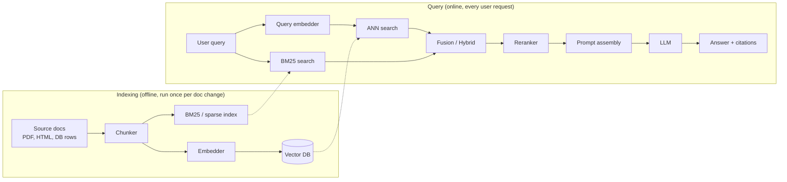
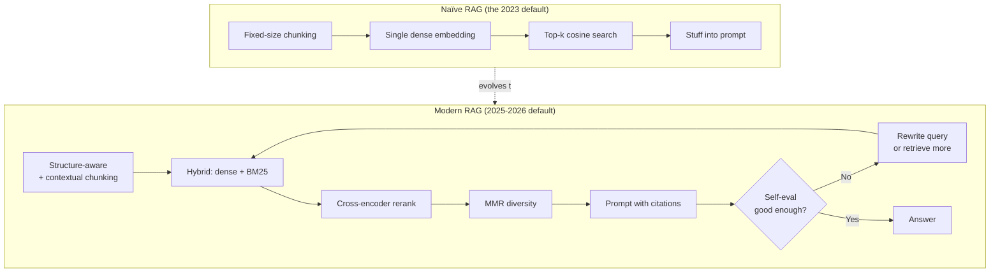
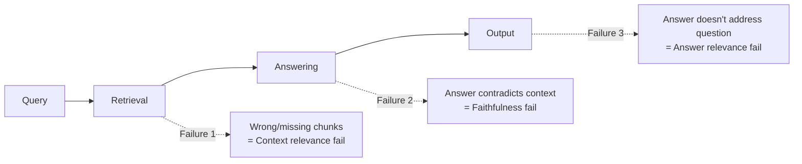

# Module 1 — Foundations

## What RAG is, in one sentence

> RAG is the practice of giving an LLM, at inference time, a small slice of a much larger corpus that's relevant to the current query — so the model can answer from text it's *looking at* rather than text it *memorized*.

Everything else in this topic is engineering around two questions: **what slice?** and **how do we find it?**

---

## Why RAG exists

LLMs are powerful, but their knowledge has four defects:

| Defect | What it means | RAG's answer |
|--------|---------------|--------------|
| **Frozen** | Trained on a snapshot; nothing after the cutoff exists for them | Pull live data from a corpus you control |
| **Lossy** | Knowledge is compressed into weights; details get blurred | Show the model the *original* text |
| **Ungrounded** | No way to cite sources or prove provenance | Retrieved chunks ARE the citations |
| **Bounded** | Can't memorize an entire enterprise corpus | Storage is offloaded to the retriever |

There's also the **operational** reason: you'd never re-train a frontier model every time HR updates the parental-leave policy. Retrieval lets the *data* change without the *model* changing.

---

## The canonical pipeline

Two important properties of this picture:

1. **Two phases.** Indexing is "build the library." Query is "answer one question." They run on completely different cadences. Mistakes in indexing are 10× more expensive than mistakes in query — fix indexing first.
2. **Asymmetric speed.** Indexing can be slow (offline). Query must be fast (sub-2 seconds typical).

---

## "Naïve RAG" → "Modern RAG"

The 2023 paper-and-blog version of RAG was: chunk into 500 chars, embed with OpenAI ada-002, dump in Pinecone, top-5, stuff in prompt. That works for demos. It falls apart in production for predictable reasons.

The shift is from a static one-shot pipeline to an **iterative, evaluative one**.

---

## When NOT to use RAG

This is the most underrated section of any RAG tutorial.

### Don't use RAG when…

- **The model already knows.** "What's the capital of France?" — RAG just adds latency and cost.
- **The corpus fits in context.** A 50-page contract can fit in a single Gemini or Claude call. RAG over it is engineering theater.
- **You need behavior change, not knowledge.** "Write more concise emails" — that's fine-tuning or system-prompt territory, not RAG.
- **The query is a math/code problem.** Retrieval doesn't help with reasoning over the query itself.
- **Sub-100ms total latency.** RAG's floor is ~150-300ms even with everything cached. Use a precomputed FAQ index instead.
- **Your data is highly relational.** RAG flattens documents to chunks; if the answer requires *traversing* relationships (org charts, knowledge graphs, multi-hop joins), use GraphRAG or a graph DB directly.

### Three alternatives that often beat RAG

1. **Long context** — Gemini 1.5/3 with 1M+ tokens, Claude with 200K-1M. If your corpus fits, give the model the whole thing.
2. **Fine-tuning / continued pre-training** — for stable, narrow domains where you need internalized knowledge (e.g., a customer-service bot in a specific product taxonomy).
3. **Hybrid: fine-tune + RAG** — fine-tune for tone/format/jargon, retrieve for facts.

---

## Vocabulary you must own

| Term | Meaning |
|------|---------|
| **Corpus** | The body of source documents you retrieve from |
| **Chunk** | A unit of text indexed and retrieved (a few hundred tokens, usually) |
| **Embedding** | A vector representation of a chunk's semantics |
| **Vector store / vector DB** | The system that holds embeddings and serves nearest-neighbor queries |
| **ANN (Approximate Nearest Neighbor)** | The class of algorithms used to search vectors fast (HNSW, IVF, etc.) |
| **Top-k** | Number of chunks returned from initial retrieval |
| **Recall** | Did we find the right chunks at all? |
| **Precision** | Are the chunks we returned actually relevant? |
| **Reranker** | A second-stage scorer that reorders top-k from retriever |
| **Hybrid search** | Combining sparse (BM25) and dense (embedding) retrieval |
| **Hallucination** | Answer is fluent but not supported by retrieved evidence |
| **Faithfulness** | Score for "the answer is supported by the context" |
| **Grounding** | The act of attaching answer claims to source spans |

---

## The "RAG triad" of failure modes

Most RAG systems fail in one of three places. This framing is useful enough to memorize.

These three are what Ragas, TruLens, and DeepEval all measure. We come back to this in [Module 8](08_evaluation.md).

---

## Sanity check

Before moving on, confirm you can answer these without looking back:

1. Why is "the corpus is too small for RAG" a real concern?
2. What's the difference between "indexing" and "query" phase, and why does the distinction matter for engineering tradeoffs?
3. Name the three failure modes in the RAG triad.
4. Give one situation where fine-tuning beats RAG, and one where RAG beats fine-tuning.
5. Why is the "ada-002 + top-5 cosine + stuff prompt" recipe insufficient in production?

If any of these are fuzzy, re-read the relevant section before continuing.

---

**Next:** [Module 2 — Embeddings](02_embeddings.md)

**TOC** [Table of Contents](00_Table_Of_Contents.md)
