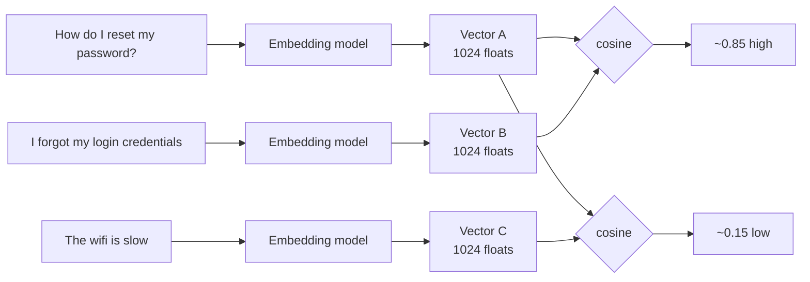
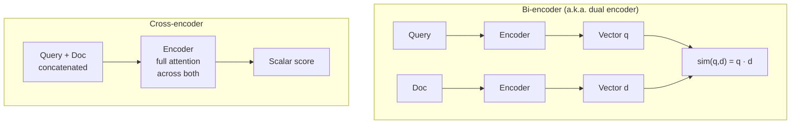
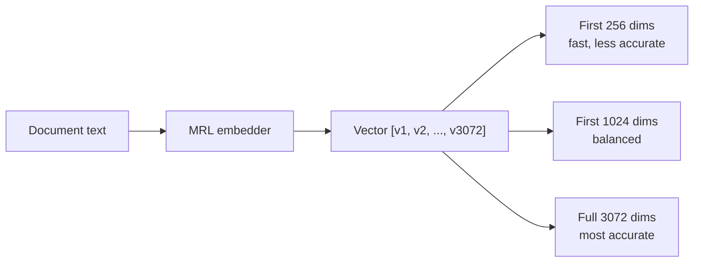
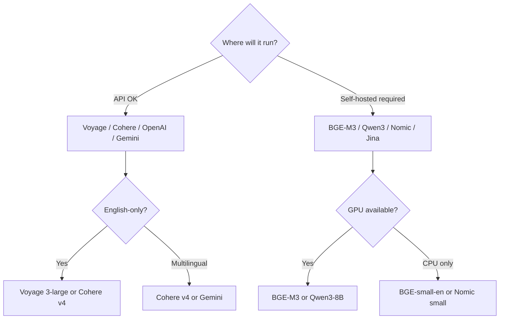

# Module 2 — Embeddings

## What an embedding is

An embedding is **a fixed-length vector of floats that represents the meaning of a text** in a way that lets you compare meanings with arithmetic.

If two pieces of text have similar meaning, their vectors point in similar directions in high-dimensional space. We measure that similarity by **cosine** of the angle between them, or equivalently by **dot product** if the vectors are unit-normalized.

That's the whole trick: turn a fuzzy "are these about the same thing?" question into an exact arithmetic question.

---

## Bi-encoder vs cross-encoder (the most important distinction in RAG)

This shows up everywhere. Internalize it.

| | Bi-encoder | Cross-encoder |
|---|---|---|
| **Speed** | Fast — you precompute doc vectors offline | Slow — must run model per (query, doc) pair |
| **Index-able?** | Yes — store vectors, ANN search | No — score is computed per pair, no shortcut |
| **Quality** | Lower — each side independent, no cross-attention | Higher — full attention sees both sides at once |
| **Use** | First-stage **retrieval** | Second-stage **reranking** |

This is the architecture-level reason RAG pipelines have a retriever-then-reranker shape. You can't run a cross-encoder over a million docs (too slow). You can't embed-search your way to the highest possible quality (lossy). So you do both.

---

## How embedding models are trained

Modern embedders are usually contrastive-trained transformers. The training objective is roughly:

> Given an anchor query, a positive (relevant) document, and N negative (irrelevant) documents — make the anchor-positive cosine higher than the anchor-negative cosines.

The crucial design choice is **negatives**.
- **Random negatives** (any unrelated text) — easy, weak signal.
- **In-batch negatives** — other examples in the same batch.
- **Hard negatives** — texts that look similar but aren't actually the answer. These dominate quality.

This is why fine-tuning embeddings on your domain helps: you mine *your* hard negatives.

---

## Single-vector vs multi-vector representations

Most embedders produce **one vector per chunk**. ColBERT-family models produce **one vector per token** (e.g., a 200-token chunk becomes 200 × 128-dim vectors).

| Approach | Pros | Cons |
|----------|------|------|
| **Single-vector** (most embedders) | Cheap to store, fast ANN | Lossy compression of long text |
| **Multi-vector** (ColBERT, ColPali) | Token-level precision; no long-text compression | 30-100× more storage; specialized index |

Multi-vector retrieval (late interaction) gets a full module of attention in [Module 6](06_reranking.md). For now, just know it exists as a third path.

---

## Matryoshka Representation Learning (MRL) — the 2024-2025 game changer

Standard embeddings give you a fixed dimensionality (e.g., 3072). If you want a smaller vector, you used to need a different model.

**MRL trains a single model so that the first N dimensions of its output are themselves a good embedding.** You can truncate from 3072 → 1024 → 512 → 256 with graceful degradation.

**Why this matters in production:**
- **Two-stage retrieval:** search with 256-dim (fast, find ~300 candidates), then rescore with 3072-dim (accurate). Big latency win for free.
- **Cost-tunable storage:** smaller vectors = cheaper RAM/disk in the vector DB.
- **Adaptive to budget:** prototype with 256-dim, scale up later.

Models with MRL (early 2026): Gemini Embedding 2, Voyage 4, Cohere v4, OpenAI text-3-*, Jina v5, Microsoft Harrier, Nomic v1.5.

---

## The MTEB leaderboard (and how to read it sanely)

[MTEB](https://huggingface.co/spaces/mteb/leaderboard) is the reference benchmark — 8 task families, hundreds of datasets. The headline number is the average score. Don't trust the headline alone.

**Things to actually look at:**
- The **retrieval** sub-score (most relevant for RAG) — often very different from the average.
- Score on **datasets in your domain** (legal, medical, code) if listed.
- **Multilingual** scores if you operate outside English.
- Embedding **dimension** and **max sequence length** — they affect cost and chunking.

**Top of MTEB English (early 2026):**
- Google Gemini Embedding 001 — ~68.32 avg
- Qwen3-Embedding-8B — ~70.6 on retrieval-heavy slice (Apache 2.0)
- NVIDIA NV-Embed-v2 — 72.31 avg on certain configs
- Voyage voyage-3-large — leads several retrieval slices, +10.58% over OpenAI text-embedding-3-large at matched dims
- Cohere embed-v4

**Open-source workhorses:** BGE-M3 (multilingual + sparse + dense + multi-vector in one), Nomic Embed v2, Jina-embeddings-v3 (8K context, late chunking native).

> **Code-heavy corpora need a code-specialized embedder** (`voyage-code-3`, `Qwen3-Embedding`, `Gemini Embedding 2`). Generic embedders lose 5-10 NDCG points on code retrieval. See [Module 10](10_code_metadata_routing.md) for the full treatment.

---

## Choosing an embedding model — the actual decision

**Things people overlook:**

1. **Re-embedding cost when you upgrade.** Once your corpus has 100M chunks embedded with model X, switching to model Y means re-embedding all of them. Plan for this.
2. **Token limit.** A model with 512-token max + 1024-token chunks = silent truncation. Common bug.
3. **License.** "Open-source" sometimes means "weights public, commercial use restricted." Check before committing.
4. **API tail latency.** Public APIs have p99 spikes. Bake in retries and a fallback.

---

## Domain adaptation: when stock embeddings fail

Generic embeddings struggle on:
- **Specialized vocabulary** — drug names, legal jargon, internal product codes.
- **Distribution mismatch** — e.g., conversational queries vs technical document language.
- **Negation / nuance** — "no fever" vs "fever" land close in embedding space.

**Three paths to fix it (cheapest to most expensive):**

1. **Better retrieval design first.** Add BM25 alongside dense — sparse retrieval handles literal-token matching that embeddings miss. Most "embeddings can't find this" complaints disappear here.
2. **Fine-tune on your data.** Mine (query, relevant_doc) pairs from logs. Use sentence-transformers' `MultipleNegativesRankingLoss`. Days of work, sometimes 10-20 point recall gains.
3. **Train from scratch.** Almost never the right call. Stop and reconsider.

---

## Sanity check

1. Why can't a cross-encoder be used as a primary retriever?
2. You're storing 100M chunks. Why does Matryoshka materially change your cost equation?
3. What's the failure mode when an embedding model has 512-token limit but your chunks are 800 tokens?
4. When should you fine-tune embeddings rather than just adding BM25 alongside them?
5. Why is "MTEB average score" a misleading headline metric for a specific RAG project?

---

**Next:** [Module 3 — Vector Databases](03_vector_databases.md)

**TOC** [Table of Contents](00_Table_Of_Contents.md)