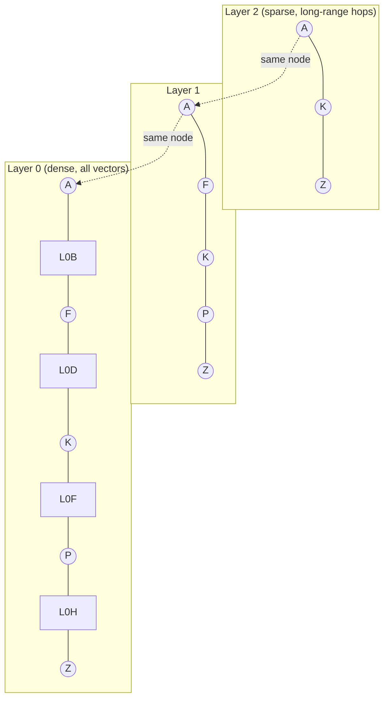
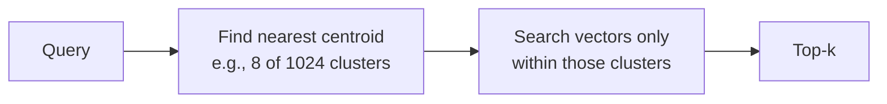
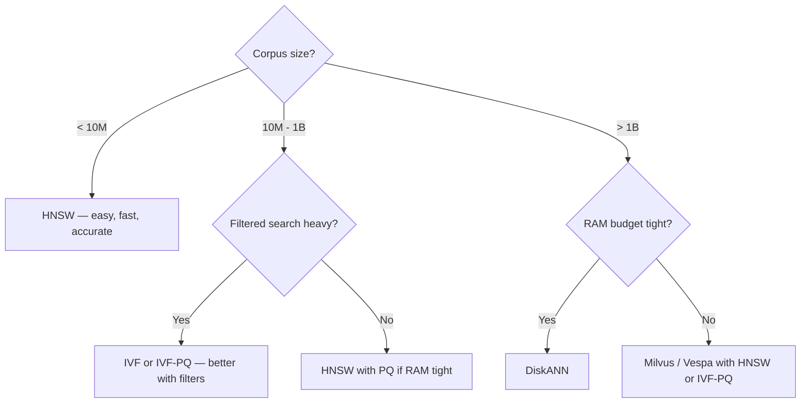
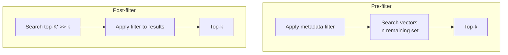
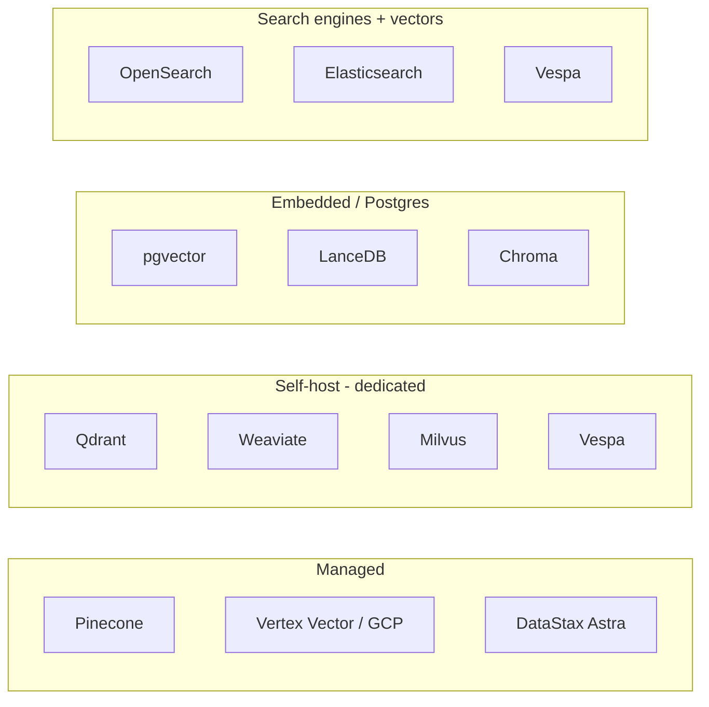
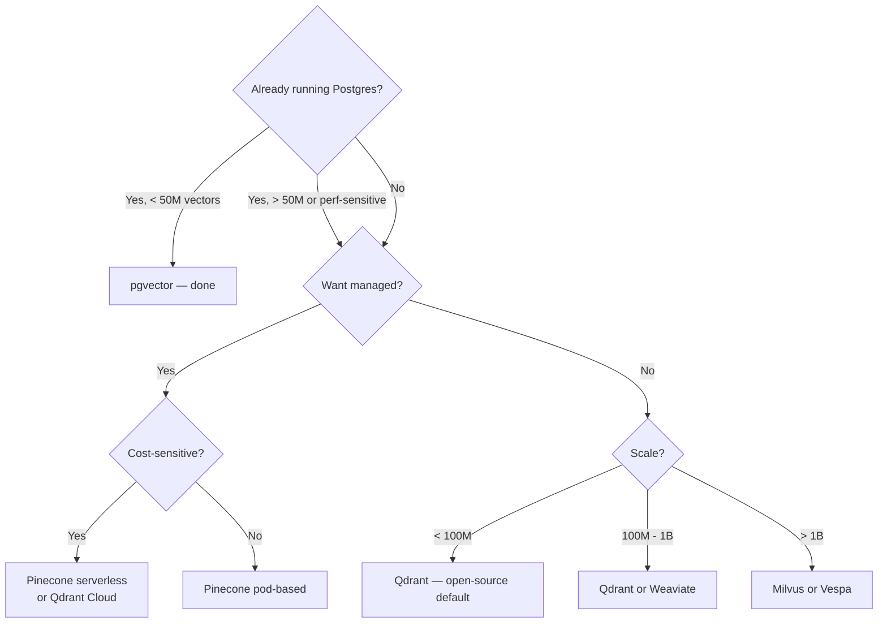

# Module 3 — Vector Databases

## What a vector database actually is

A vector database is **a search engine optimized for one query type: "find the K nearest vectors to this query vector."** Everything else it does — filtering, multi-tenancy, hybrid search — is built around that core.

Before we get to vendors, you need to understand the **algorithms** they're competing on. Pinecone and Qdrant aren't differentiated by their UIs; they're differentiated by which indexing algorithm they expose, how it's tuned, and what extras they bolt on.

---

## The brute-force baseline

Without an index, "find the top-K nearest" means computing the distance from the query to every stored vector. With 100M vectors of 1024 dims, that's 100B float multiplications per query. Doable on GPU; absurd on CPU.

So we trade **accuracy** for **speed** by building approximate-nearest-neighbor (**ANN**) indexes. The question is *which* ANN algorithm.

---

## ANN algorithm families

### 1. Graph-based: HNSW

**HNSW** (Hierarchical Navigable Small World) is the most-used ANN index in 2026. The idea:

You enter at the top (sparse) layer, greedy-walk to the closest known node, drop down a layer, repeat. By the time you're at layer 0, you're already in the right neighborhood; you only need to look at a few local candidates.

**Tuning knobs:**
- `M` — graph degree per node (typical 8-64). Higher = better recall, more memory.
- `ef_construction` — how thoroughly to build the graph (200 typical). Higher = better quality, slower index build.
- `ef_search` — beam width at query time (10-200 typical). Higher = better recall, slower query.

**Strengths:** Pareto-optimal on most ANN benchmarks. Incremental insert/delete works well. Good with 1M-100M vectors.

**Weaknesses:** **The whole graph lives in RAM.** A 100M × 1024-dim float32 corpus = ~400 GB just for vectors, plus graph overhead. Filtered search degrades when filter selectivity is high.

### 2. Inverted-file: IVF / IVF-PQ

**IVF** (Inverted File): cluster all vectors with k-means into N centroids. At query time, find the few closest centroids and only search vectors in those clusters.

**IVF-PQ** adds **Product Quantization**: split each vector into M sub-vectors, quantize each to one of 256 codebook entries → store as M bytes instead of M × float32. 32× compression typical.

**Strengths:** Memory-cheap with PQ. **Strong with filters** — centroid pre-filter cooperates well with metadata filters. Good for billion-scale.

**Weaknesses:** Quantization loses information. Updates are awkward (centroids drift; periodic rebuild needed). Tuning is sensitive (`nlist`, `nprobe`, PQ `M` and `nbits`).

### 3. Disk-based: DiskANN

**DiskANN** (Microsoft) keeps compressed vectors in RAM, full-precision vectors on SSD. Uses a graph index (Vamana) optimized for SSD-friendly access patterns.

**Strengths:** Scales to billions on a single machine without exploding RAM. Used in Cosmos DB and SQL Server's vector index. Up to 7× throughput vs IVF on Milvus benchmarks.

**Weaknesses:** SSD I/O dependency means tail latency is hardware-bound. More moving parts to operate.

### 4. Tree / hashing: ScaNN, Annoy

- **ScaNN** (Google) — anisotropic quantization; competitive with HNSW on some datasets, dominant inside Google.
- **Annoy** (Spotify) — random forest of trees. Mostly historical interest now; superseded by HNSW.

### Picking an algorithm

---

## Distance metrics — pick the one your model was trained for

| Metric | Formula | When |
|--------|---------|------|
| **Cosine** | `(a · b) / (‖a‖·‖b‖)` | Default for text embeddings. Scale-invariant. |
| **Dot product** | `a · b` | Same as cosine if vectors are normalized. Cheaper. |
| **L2 / Euclidean** | `‖a − b‖` | Some image/audio embeddings. Less common in text RAG. |
| **Inner product (negative)** | `−a · b` | Maximum-Inner-Product Search; specific use cases. |

**Rule:** match the embedding model's training objective. OpenAI / Cohere / Voyage / BGE / Qwen3 are all cosine-trained. If you use L2 with a cosine-trained model, you'll get *technically valid* but *suboptimal* rankings.

---

## Filtered search — the hidden hard problem

Real RAG queries are rarely "find anything similar." They look like:
> "find chunks similar to X *where customer_id = 42 and date > 2025-01-01 and doc_type = 'contract'*"

There are two strategies:

- **Pre-filter** is correct but can wreck graph indexes (HNSW assumes the graph is intact). With high filter selectivity, you may end up doing brute force inside the surviving subset.
- **Post-filter** is fast but can return < k results — you searched 1000, filter knocked it to 3.

Modern indexes try to mix. Examples:
- **Qdrant**: payload-aware index, filterable HNSW.
- **Pinecone**: metadata indexed alongside vectors.
- **Weaviate**: filtered HNSW with ACORN (Adaptive Cost-Optimized Retrieval).
- **IVF**: handles filters naturally — pre-filter cooperates with cluster pruning.

**Practical rule:** if your filter selectivity is high (e.g., per-tenant queries returning 0.1% of corpus), evaluate IVF-PQ or filterable indexes specifically. HNSW alone is fragile here.

---

## The 2026 vendor landscape

### One-paragraph summary per vendor

- **pgvector** — Postgres extension. Default if you already run Postgres. v0.9 added IVF_RaBitQ for better quality. Often within 10% of dedicated DBs at modest scale, with the operational simplicity of "it's just Postgres."
- **Qdrant** — Rust, open-source, lowest reported p50 latency (~4ms). Strong filtered search via payload index. Hybrid native (sparse + dense). Multi-tenancy via payload. Both self-host and Qdrant Cloud.
- **Pinecone** — fully managed, no ops. Default if you want to *not* run a database. Added hybrid search and sparse-dense in 2024. Serverless tier billed per query; can surprise you on cost at scale.
- **Weaviate** — Go, open-source. Hybrid + GraphQL native. Strong multi-tenancy. Modules for embeddings/rerankers. ACORN filtered HNSW.
- **Milvus** — Go/C++, open-source, designed for very large scale (1B+). Cloud-native architecture (separates compute, storage, message queue). Zilliz Cloud is the managed version.
- **Vespa** — Java/C++, originally Yahoo. Production-grade hybrid search and learning-to-rank built in. Used at very high scale. Steeper learning curve.
- **OpenSearch / Elasticsearch** — `dense_vector` field + k-NN plugin. Best fit if you already run them for full-text. Hybrid (BM25 + vector) is native and well-trodden.
- **LanceDB** — embedded option using the Lance columnar format. Good for serverless / on-disk single-process workloads.
- **Chroma** — DX-focused, popular in prototypes. Production-ready for small-to-medium workloads.

### Latency at 10M vectors (public benchmarks; verify before quoting)

| DB | p50 | p99 |
|----|-----|-----|
| Qdrant | ~4ms | ~12ms |
| Weaviate | ~6ms | ~16ms |
| Milvus | ~8ms | ~18ms |
| pgvector HNSW | ~5-7ms | ~15ms (Supabase benchmark) |
| Pinecone serverless | varies; tail can spike | varies |

These numbers are rough. They depend heavily on dimension, recall target, hardware, concurrency, and which benchmark you trust. **Run your own load test on your data.**

---

## The decision framework

**Default for most teams in 2026:** pgvector if you have Postgres, Qdrant if you don't. Don't introduce a separate vector DB until you know why. ([Module 9](09_production.md) covers cost math.)

---

## Multi-tenancy patterns

When you serve many customers from one index:

1. **Filter-based** — single index, every doc tagged with `tenant_id`, queries filtered. Simple, but tenants share index costs and cross-tenant filter selectivity issues hurt.
2. **Per-tenant collections** — each tenant gets their own index. Strong isolation, but ops cost grows linearly.
3. **Hybrid** — small tenants in a shared index, large tenants get their own. Best of both, more code.

Qdrant and Weaviate document patterns 2 and 3 well; Pinecone serverless lets you create namespaces cheaply.

---

## Sparse + dense, in one store

Modern vector DBs increasingly support **sparse vectors** (BM25, SPLADE) alongside dense, with hybrid search built in. Specifically:
- **Native hybrid:** Weaviate, Vespa, Qdrant, Pinecone, OpenSearch.
- **Manual hybrid (compose yourself):** pgvector + Postgres FTS, or pgvector + a separate BM25 service.

This matters because it eliminates a moving part — you don't need a separate Elasticsearch instance just for BM25 if your vector DB does it natively.

---

## Sanity check

1. You have 1B vectors and 64GB of RAM. What index family must you consider, and why is HNSW alone risky?
2. Why can pre-filter destroy HNSW performance even when the filter is "logically simple"?
3. Your embedding model is cosine-trained. You set up the vector DB to use L2 distance. What goes wrong (and why is it subtle)?
4. When is pgvector the right choice over a dedicated vector DB?
5. Explain in one sentence what Product Quantization buys you.

---

**Next:** [Module 4 — Chunking & Indexing](04_chunking_indexing.md)

**TOC** [Table of Contents](00_Table_Of_Contents.md)