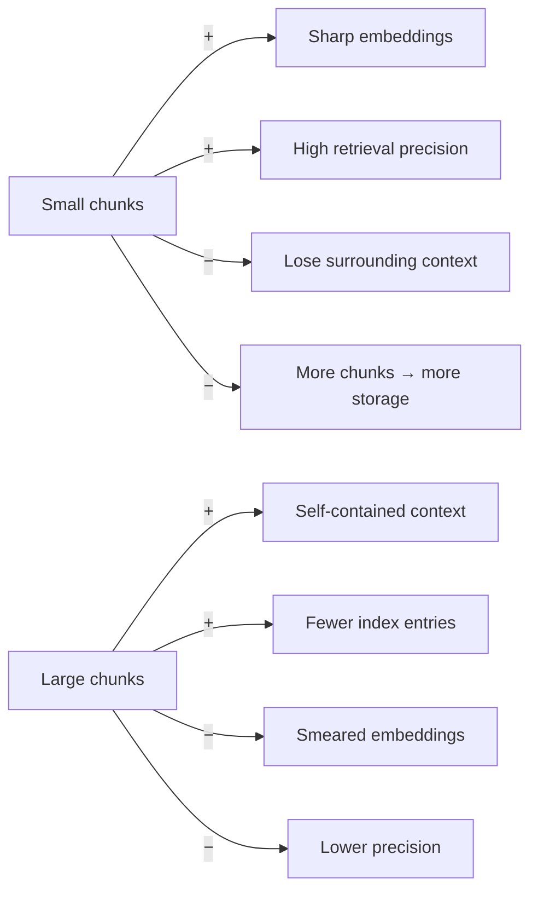
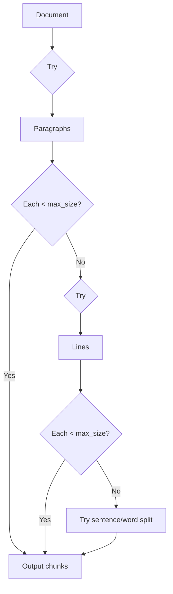
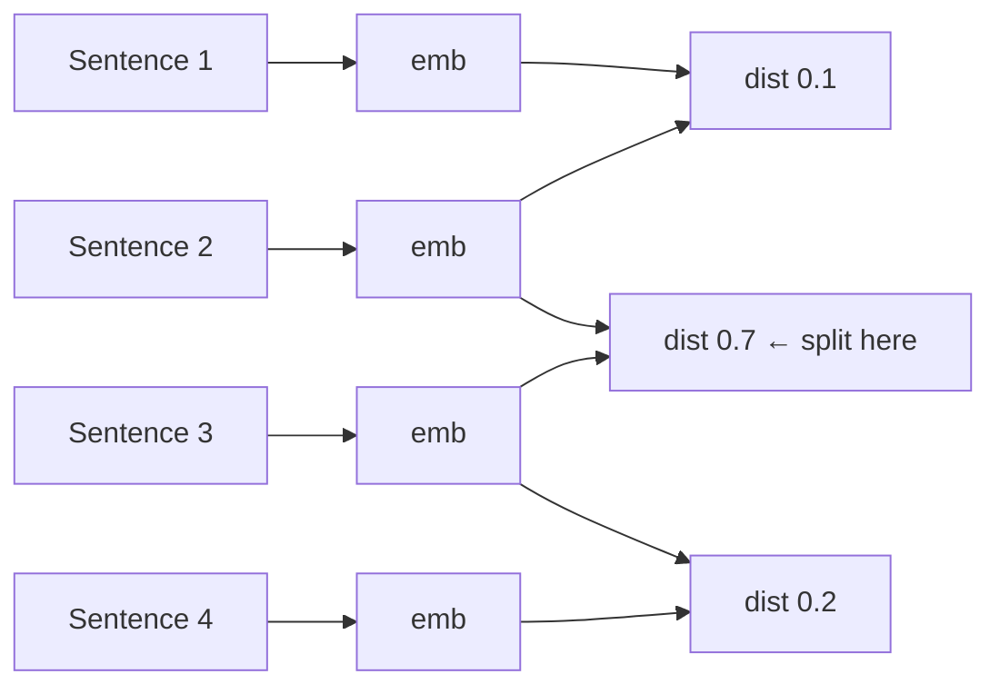
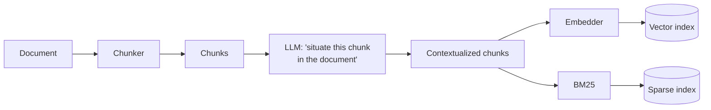
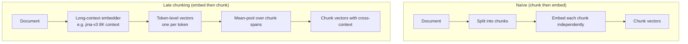
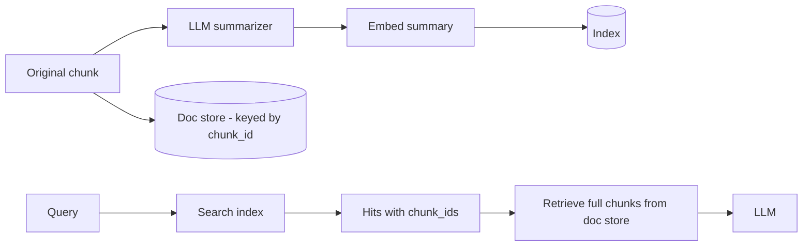
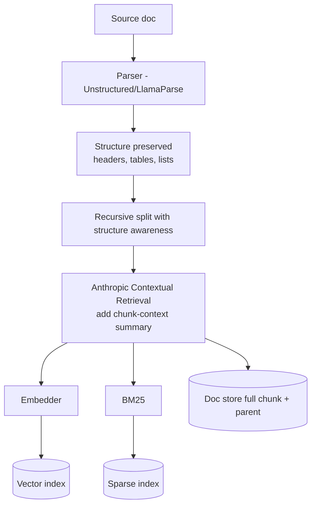

# Module 4 — Chunking & Indexing

## Why chunking is THE retrieval problem

Embeddings have a fixed input budget (512-8192 tokens depending on model). Documents don't.

But there's a deeper reason than "models have token limits." **Embeddings get worse the more text you cram into one vector.** A 100-page contract embedded into a single 1024-dim vector smears its meaning. The phrase you actually care about is now ~0.1% of the signal in the vector.

So we **chunk**: split documents into smaller pieces, embed each piece, retrieve the relevant pieces.

Chunking has tradeoffs in two directions:



The whole module is about strategies that try to break this tradeoff.

---

## Strategy 1 — Fixed-size / token chunking

The dumbest approach. Cut every N tokens. Add overlap between adjacent chunks (typically 10-20%).

```
[----- chunk 1 -----][overlap]
                [overlap][----- chunk 2 -----][overlap]
                                          [overlap][----- chunk 3 -----]
```

**When to use:** baseline / scaffolding. Always works, never optimal.

**Numbers:** NVIDIA found 15% overlap optimal at 1024-token chunks on FinanceBench. Most teams start at 512 tokens with 10-20% overlap.

---

## Strategy 2 — Recursive character splitting

LangChain's `RecursiveCharacterTextSplitter` is the de-facto standard. Split by `\n\n` (paragraphs); if a piece is still too big, split by `\n` (lines); if still too big, by `. ` (sentences); else by characters.



**When to use:** default for unstructured text. Almost always better than fixed-size.

---

## Strategy 3 — Structure-aware chunking

If your docs are Markdown / HTML / PDF with section headers, **don't throw that away**. Use header-based chunking:

- Markdown: split on `#`, `##`, `###`. Carry the header path in metadata.
- HTML: split on `<h1>`/`<h2>`, or block-level elements.
- PDF: use a parser that preserves structure (Unstructured, LlamaParse, Adobe PDF Extract).
- Code: language-aware splitter (split on functions / classes).

**Big win that many teams miss:** include the header path *in the chunk text* before embedding. So a chunk under `# Refund Policy → ## Cancellation` becomes:

```
[Refund Policy > Cancellation]
The actual chunk content...
```

This gives the embedding model context for free, and improves recall on queries like "cancellation refund" significantly.

---

## Strategy 4 — Semantic chunking

Split *where the meaning shifts*, not at fixed offsets. Algorithm:

1. Split into sentences.
2. Embed each sentence.
3. Compute embedding distance between adjacent sentences.
4. Cut where distance exceeds a threshold (often the 95th percentile of distances).



**Numbers:** up to ~70% accuracy lift over fixed-size on some benchmarks.

**Cost:** every sentence needs embedding *at indexing time*. A 10K-word document might cost 200-300 embedding calls. Affordable but real.

**Recent finding (Jan 2026 study):** for documents shorter than ~5000 tokens, plain sentence chunking matches semantic chunking at far lower cost. Don't reach for semantic chunking until you have evidence simple methods are insufficient.

---

## Strategy 5 — Anthropic's Contextual Retrieval (Sept 2024)

The big idea: **before embedding a chunk, prepend a 50-100 token contextual summary that situates the chunk in the document.**

```
Original chunk:
    "The discount applies only to first-time customers and expires within 30 days."

Contextualized chunk (LLM-generated context prepended):
    "[This chunk is from the 2024 Q4 promotional terms section of the Acme Corp customer agreement.]
    The discount applies only to first-time customers and expires within 30 days."
```

You **also** index this contextualized text into BM25 alongside the embedding.



**Numbers (Anthropic's benchmark):**
- Contextual Embeddings alone: **35%** reduction in top-20 retrieval failure
- + Contextual BM25: **49%**
- + reranker on top: **67%**

**Cost:** one LLM call per chunk at indexing time. With Anthropic's prompt caching (cache the document, vary the chunk), this is cheap — the document only gets read once even though you generate context for each of its chunks.

**When to use:** any production RAG over documents where chunks lose meaning out of context (most of them).

---

## Strategy 6 — Late chunking (Jina, Sept 2024)

The opposite move: instead of chunking before embedding, **embed the whole document first, then derive chunk vectors from the token-level embeddings.**



The token-level vectors *already saw* the surrounding tokens via attention. When you mean-pool over a span, that span's vector is informed by the whole document.

**Reported lift:** similarity scores rise from 70-75% to 82-84% on cross-chunk reference queries (Jina's own benchmark).

**Constraint:** requires a long-context embedding model. `jina-embeddings-v3` (8K context) supports it natively. Won't work with a 512-token-max model.

**Late chunking vs Contextual Retrieval — when to pick which:**

| | Late chunking | Contextual Retrieval |
|---|---|---|
| Cost at index | One long-context embed call | One LLM call per chunk |
| Quality lift | Mid (10-15 pts on cross-context queries) | High (35-67% failure reduction) |
| Requires | Long-context embedder | Any LLM (and prompt caching helps a lot) |
| Combines with BM25? | Indirectly | **Yes — sibling technique** |

In practice, Contextual Retrieval is the bigger win when you can afford the indexing LLM cost. Late chunking is the right tool when you can't run an extra LLM step but have access to a long-context embedder.

---

## Strategy 7 — Multi-representation indexing

Index *summaries* for retrieval but feed *full chunks* to the LLM:



The summary is dense in topic keywords, so it embeds well; the full chunk has the actual evidence the LLM needs.

**Variant:** the **parent-child / parent-document retriever** — index small chunks, return their larger parent on hit. Great for technical docs where you need a paragraph but want to pass the whole section.

---

## Strategy 8 — Agentic chunking

An LLM picks the chunking strategy *per document*. Looks at the doc's structure, decides "this is a Q&A page so split per question" vs "this is prose so semantic split."

**Reality check:** experimental. Cost-prohibitive at scale. Useful for one-off ingestion of a small corpus of weird documents (e.g., legal filings with mixed structures). Not a default.

---

## Strategy 9 — Metadata enrichment (LLM-generated fields per chunk)

Beyond the *text* of each chunk, you can enrich it with structured metadata that the retriever can filter on or rerank with.

```yaml
chunk_id: "doc_142_chunk_07"
filename: "refund-policy-q4-2024.pdf"
section_path: "Refund Policy > Cancellation > B2B"
# LLM-enriched at ingest:
summary: "Defines refund eligibility for B2B customers within 30 days..."
entities: ["B2B customer", "refund window", "Acme Corp"]
topics: ["refund_policy", "b2b", "cancellation"]
intent_categories: ["policy_question", "eligibility_query"]
```

The right pattern is **single-call enrichment** — one LLM call per chunk that returns all fields as JSON, not one call per field. Affordable when prompt caching is used.

This deserves a full module of treatment — see [Module 10 §2](10_code_metadata_routing.md#part-2--metadata-schema-design-and-llm-enrichment) for schema design, the MetaRAG pattern, and how metadata is used both for filtering and as a reranker signal.

---

## Hierarchy: combining strategies

In production, you almost never use one strategy alone. A typical stack:



This is roughly the "modern RAG" indexing pipeline.

---

## The "context cliff" finding

Chroma research (2024) and a Jan 2026 systematic study both flagged that LLM answer quality **degrades non-linearly** as input grows, even within the rated context window. The drop becomes visible around 2500 input tokens and steepens above 32K.

**Implication for chunking:** more chunks ≠ better answers past a point. There's a sweet spot — usually 5-15 chunks at 200-500 tokens each — past which you're just feeding the model noise.

---

## Practical defaults (start here, measure, adjust)

| Setting | Default | Adjust if |
|---------|---------|-----------|
| Chunk size | 400-512 tokens | Domain has long self-contained units (legal clauses) → larger; short Q&A → smaller |
| Overlap | 15% | High structure (headers, lists) → less; flowing prose → more |
| Strategy | Recursive structure-aware | Cross-chunk semantics matter → add Contextual Retrieval |
| Index | Dense + BM25 | English + dense alone wastes recall on exact-match queries |
| Top-k retrieval | 50-100 | If reranker downstream, more candidates is fine |
| Top-k after rerank | 5-10 | Past 10 you start hitting context-rot |

---

## Sanity check

1. Why is large-chunk embedding "lossier" than small-chunk embedding even when both fit in the model's context?
2. What's the difference between Contextual Retrieval and late chunking, and why might you do both?
3. When is fixed-size chunking *acceptable*, and when is it actively harmful?
4. Why does multi-representation indexing matter — what does indexing summaries fix?
5. You're building RAG over a 50-page legal document. Outline the chunking pipeline you'd start with and why.

---

**Next:** [Module 5 — Retrieval Strategies](05_retrieval_strategies.md)

**TOC** [Table of Contents](00_Table_Of_Contents.md)