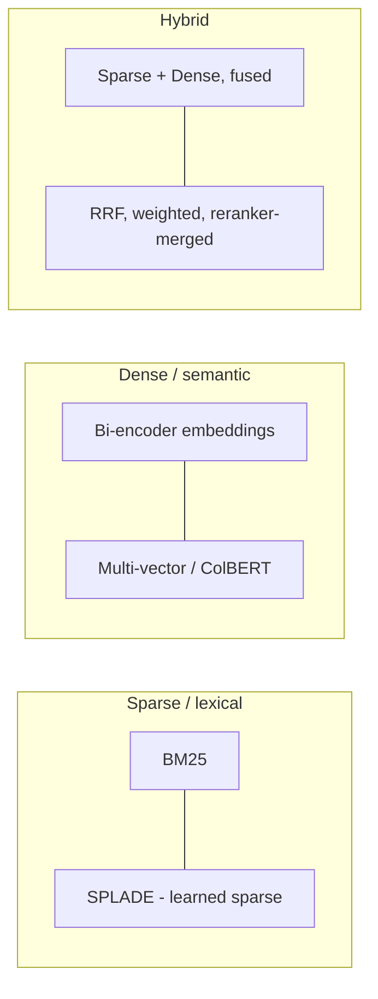
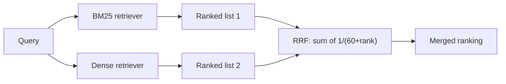
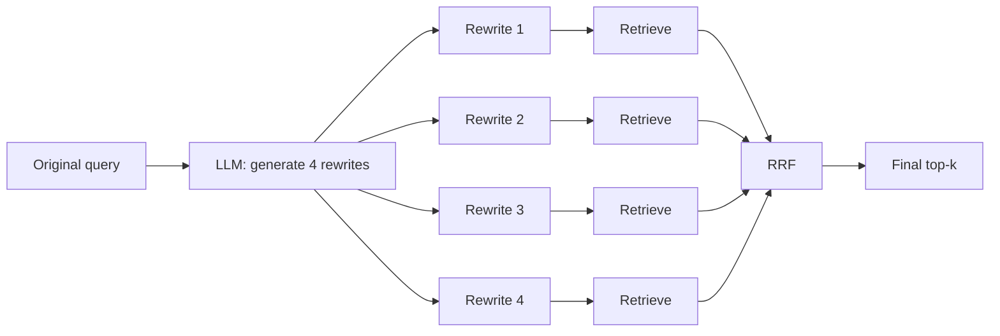
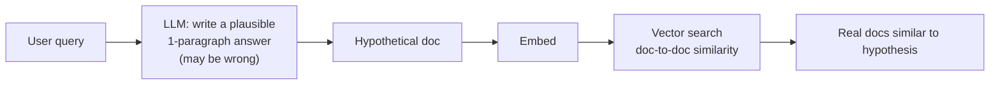
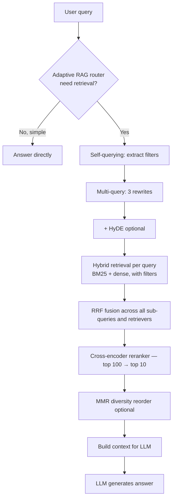

# Module 5 — Retrieval Strategies

> Module 4 was about how chunks land in the index. This module is about how queries find them.

The biggest mistake in production RAG is treating retrieval as "embed query, top-k cosine search, done." That's *one* strategy out of many. The good systems combine several.

---

## Sparse vs dense vs hybrid



### What each is good at

| Query type | Sparse wins | Dense wins |
|------------|-------------|------------|
| Exact code/ID/jargon ("Error TS-999") | ✓ | ✗ |
| Out-of-vocab terms (new product names) | ✓ | ✗ |
| Paraphrase ("password reset" ↔ "forgot login") | ✗ | ✓ |
| Concept/synonym | ✗ | ✓ |
| Multilingual cross-language | depends | ✓ |
| Negation ("no fever") | ~ | poor — embeddings often miss it |

This is why **hybrid almost always beats either alone.** A sparse-only retriever fails on paraphrase; a dense-only retriever fails on exact matches. Together they cover both.

### BM25 in two minutes

BM25 (Best Match 25) is a 1994-vintage probabilistic ranking function. Score for a doc D given query Q:

```
score(D, Q) = Σ_{q ∈ Q} IDF(q) · TF_normalized(q, D)
```

- **TF** rewards docs that contain the query term often.
- **IDF** down-weights terms that appear in many docs (common words).
- **Normalization** prevents long docs from dominating purely by being long.

Two tunables: `k1` (term-saturation) and `b` (length-normalization). Defaults (`k1=1.2`, `b=0.75`) are fine for almost everyone.

### SPLADE in 30 seconds

**SPLADE** is a *learned* sparse retrieval model. Architecturally a neural network, but its output is a sparse vector over the vocabulary (most entries zero, a few non-zero with learned weights). You get BM25-style index-ability with semantic awareness — the model learns to predict "what other words would be in a relevant document for this query."

When you see it: BGE-M3 has a SPLADE-style head; some specialized search systems use it. Niche but rising.

---

## Reciprocal Rank Fusion (RRF) — the standard fusion algorithm

You ran two retrievers (BM25 and dense). Each returned a top-k list. How do you combine them into one ranking?

```
RRF_score(d) = Σ_{i ∈ retrievers} 1 / (k + rank_i(d))
```

Where `k` is a small constant (default **60**, well-supported empirically), and `rank_i(d)` is `d`'s position in retriever `i`'s list.

**Why RRF works:** the BM25 score is unbounded; cosine similarity is in [0, 1]. They're not comparable. RRF ignores absolute scores entirely and uses *rank position*, which is comparable across any retrievers.



### Weighted RRF

Some retrievers are stronger than others. Use weights:

```
RRF_score(d) = Σ_i w_i · 1 / (k + rank_i(d))
```

Typical: dense weight 1.0, BM25 weight 0.5-0.7. Tune empirically.

### Numbers

Hybrid + RRF pulls retrieval recall@10 to ~91% on common benchmarks where pure dense lands in the high 70s and pure BM25 in the high 60s. Roughly: hybrid is "the +10 points you get for free."

### Alternatives to RRF

- **Convex combination of normalized scores** — works if you carefully normalize both. Brittle in practice.
- **Reranker-as-fusion** — skip explicit fusion; pass union of both top-k lists straight to a cross-encoder reranker. Increasingly common in 2026 because rerankers got cheaper.

---

## Query transformations

The query the user typed is rarely the *best* query for retrieval. Several transformations can help.

### Multi-query / RAG-Fusion

Generate N rewrites of the query, retrieve for each, fuse with RRF.



**Pros:** higher recall — different phrasings find different chunks. Robust to query phrasing variance.
**Cons:** N× retrieval latency and cost. One LLM call to generate rewrites. Latency budget killer if you have low headroom.

### HyDE — Hypothetical Document Embeddings

Stronger and weirder. Don't rewrite the query — *generate a hypothetical answer* and embed THAT.



**Why it works:** retrieval is doc-to-doc, not query-to-doc. Queries and documents have different surface forms ("How do I reset my password?" vs "To reset your password, click..."). The hypothetical answer matches the documents' style.

**The risk:** if the LLM hallucinates wildly off-topic, retrieval gets misdirected. Generate 5 hypothetical docs and average embeddings to dampen this.

**When to use:** weak retrievers, no domain fine-tune, queries phrased very differently from documents (FAQ-style queries against technical docs).

### Step-back prompting

For specific questions, ask the LLM for a **more abstract** version and retrieve for both:

```
Original:  "What was the policy for refunds in Q4 2024 promotional terms?"
Step-back: "What is the company's general refund policy?"
```

Combine results. Often the step-back retrieves the relevant background, the original retrieves the specifics.

### Routing — vector search isn't always the right tool

Before any query transformation, ask: **is vector search even the right tool for this query?**

| Query | Better tool than vector search |
|-------|-------------------------------|
| "give me sample of `CLAUDE.md`" | `read_file(name="CLAUDE.md")` |
| "find usages of `getUserSession`" | grep / LSP |
| "all orders from customer 42 in Q4" | SQL |
| "what's 3% of last quarter's revenue" | code interpreter |
| "current status of the Acme deal" | API call |

A function-calling LLM can route the query to the right tool. Vector search becomes one of several tools, not the default.

This is what Cursor, Claude Code, and modern agentic RAG systems do. **Most "RAG quality issues" in real products turn out to be routing problems disguised as retrieval problems.** See [Module 10 §3](10_code_metadata_routing.md#part-3--query-routing-tool-calls-vs-vector-search) for the full pattern.

### Self-querying / metadata extraction

For queries with implicit filters, parse them with an LLM:

```
"Show me Python papers from 2023 about LLMs"
   ↓ (LLM-extracted)
   filter: language == 'Python', year == 2023
   semantic_query: "papers about LLMs"
```

Then run filtered semantic search. Works because metadata filtering is far cheaper than the LLM trying to do filtering by attention over retrieved chunks.

LangChain's `SelfQueryRetriever` is the reference implementation. Specify a schema; the LLM extracts filter expressions matching your DB's filter syntax.

---

## Putting it together: a "modern" retrieval pipeline



You **don't run all of this every time**. Think of it as a *toolbox*:
- Adaptive routing decides how much machinery to spin up.
- Easy queries skip query expansion.
- High-stakes queries get the full stack.

---

## When each technique earns its keep

| Technique | When you need it | When it's overkill |
|-----------|------------------|--------------------|
| BM25 + dense hybrid | Always (basically free win) | Never |
| RRF | Always when you have ≥ 2 retrievers | Never |
| Multi-query | Recall is low and queries are highly variable | Latency budget tight |
| HyDE | Query/doc style mismatch (FAQ-vs-prose) | Have a strong domain-tuned embedder |
| Step-back | Domain has hierarchical concepts | Flat domain |
| Self-querying | Structured metadata + filtered queries | No useful metadata |

---

## Latency math you should be able to do

Imagine your latency budget is 2s end-to-end and you stack: multi-query (4 rewrites) → BM25 + dense per rewrite → RRF → reranker → LLM.

```
4 × (BM25 + dense)       = 4 × ~30ms        = 120ms (parallelizable → ~30ms)
RRF                                          ≈ 10ms
Reranker (100 candidates)                    ≈ 200ms
LLM TTFT (time to first token)               ≈ 500ms
LLM full response                            ≈ 1000ms
                                       total ≈ 1.7s   ✓ fits
```

Versus the same pipeline + HyDE:
```
LLM call to generate hypothetical doc  ≈ 400-800ms (extra)
                              total    ≈ 2.5s   ✗ blows budget
```

That's why HyDE is "use selectively" — its latency cost is high. Multi-query, by contrast, parallelizes its retrievals and only adds the rewrite-generation overhead.

---

## Sanity check

1. Why does RRF work without normalizing scores from BM25 and dense retrievers?
2. When should you NOT add HyDE to your pipeline?
3. Multi-query + HyDE seem to do the same thing — generate variants. What's the actual difference?
4. Your retriever is bad at exact-match queries (codes, IDs). What's the cheapest fix?
5. A user types "Q4 2024 refund policy." How would self-querying transform that, and why is it useful?

---

**Next:** [Module 6 — Reranking](06_reranking.md) — the deep dive.

**TOC** [Table of Contents](00_Table_Of_Contents.md)