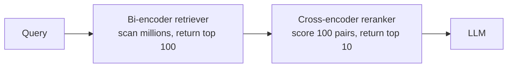
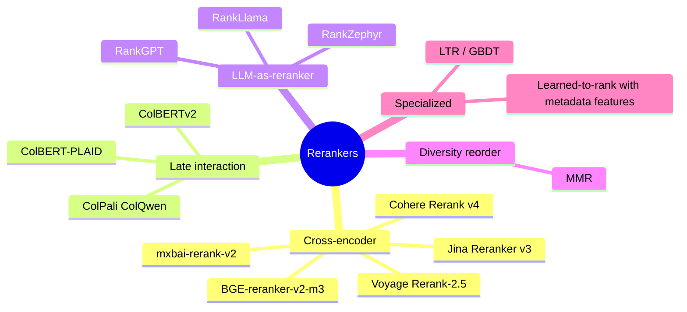
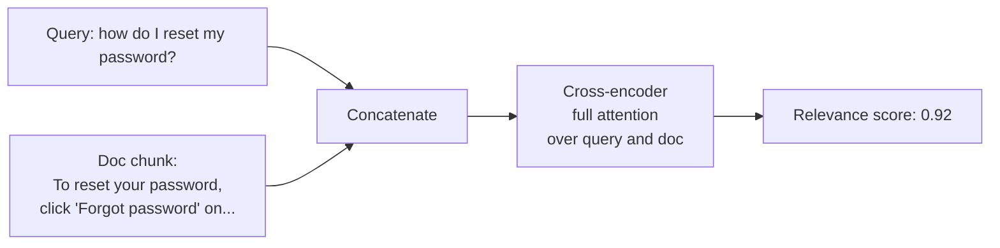
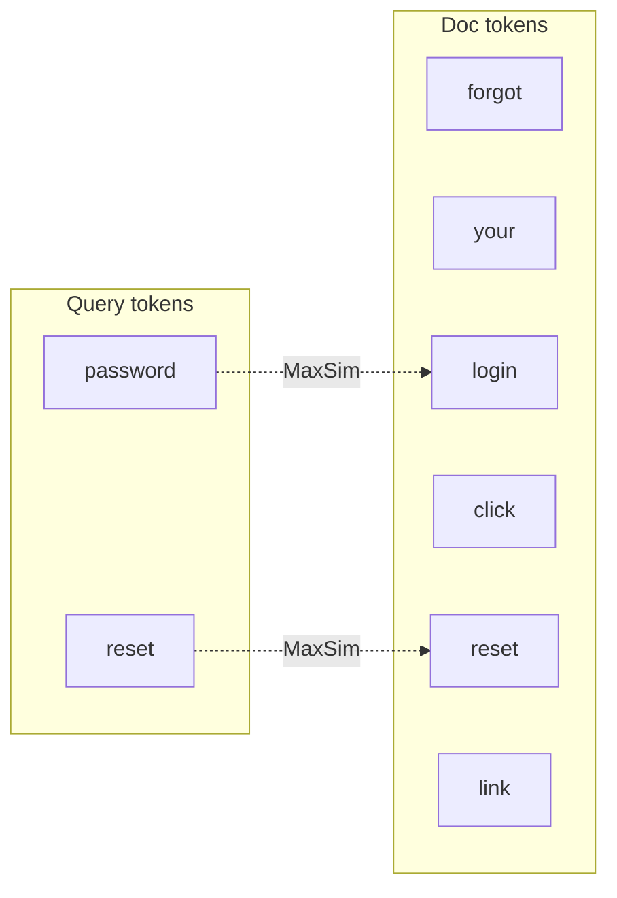
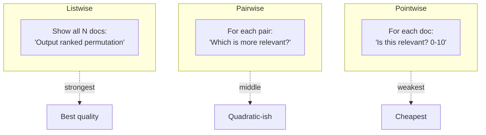
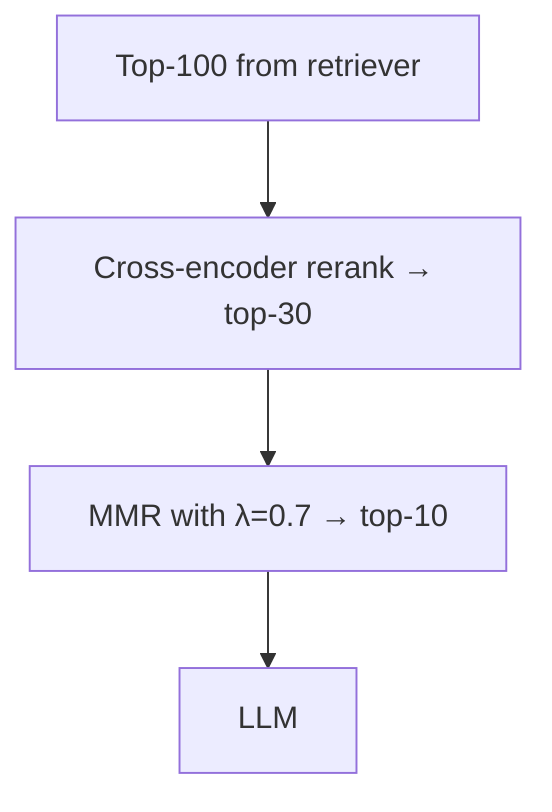
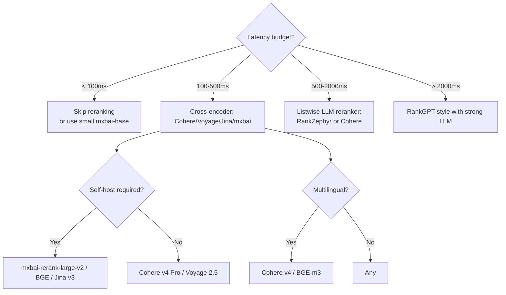
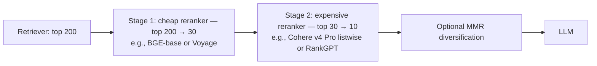

# Module 6 — Reranking (deep dive)

> Reranking is where RAG quality is most often won or lost. It's also where the most action has been in the last 18 months.

---

## Why rerank at all

Recall back from [Module 2](02_embeddings.md): bi-encoders are fast but lossy; cross-encoders are slow but accurate. The two-stage architecture exploits both.



**Numbers:** for the same final top-10 quality:
- Without reranker, you'd need top-50 from the retriever to hit similar recall.
- That's 5× more chunks in the LLM context → more cost, more "context rot," more chance of hallucination.

So the reranker pays for itself by letting you pass *fewer, better* chunks to the LLM.

---

## Five families of reranker



### Family 1 — Cross-encoder rerankers (the default)

A single transformer takes `[CLS] query [SEP] doc [SEP]` and outputs a scalar relevance score. Run once per pair. Top-100 candidates → 100 forward passes.



**Notable models (early 2026):**

| Model | Type | Notes |
|-------|------|-------|
| **Zerank-2** | Closed | Top of leaderboard at 1638 ELO |
| **Cohere Rerank v4.0 Pro** | Closed API | Production default; multilingual (100+ languages); 1629 ELO |
| **Voyage Rerank-2.5** | Closed API | ~Cohere quality, ~2× lower latency. Strong cost/perf for production. |
| **Jina Reranker v3** | Open weights | **Listwise** (sees up to 64 docs in 131K context). Best nDCG@10 on BEIR (61.94). |
| **mxbai-rerank-large-v2** | Open (Qwen-2.5 1.5B base) | Three-stage RL training. 57.49 BEIR. Beats Cohere on some open benchmarks. |
| **mxbai-rerank-base-v2** | Open (0.5B) | Lightweight; 55.57 BEIR. |
| **BGE-reranker-v2-m3** | Open (BAAI) | Multilingual baseline. Easy to deploy. |
| **gte-reranker-modernbert-base** | Open (149M params) | Counter-intuitive: matches 1B+ models on Hit@1. **Size ≠ quality.** |
| **nemotron-rerank-1b** | Open (NVIDIA) | Top accuracy when latency is unconstrained. |

**Counter-intuitive learning:** parameter count is a poor predictor of reranker quality. ModernBERT-based 149M models compete with 1.2B models on retrieval tasks. The bottleneck is data and training recipe, not parameter count.

### Family 2 — Late interaction (ColBERT family)

ColBERT keeps a vector *per token* in each document, then scores using **MaxSim**:

```
score(Q, D) = Σ_{q in Q} max_{d in D} sim(q_embed, d_embed)
```

For each query token, find its best-matching document token, sum.



This is **between** bi-encoder and cross-encoder:
- Like bi-encoder: doc tokens are pre-computed and stored. No model run per pair.
- Like cross-encoder: token-level matching, not sentence-blob comparison.

**Variants:**

- **ColBERTv2** — distillation + denoising over original ColBERT.
- **PLAID** (CIKM '22) — centroid-pruned engine. **7× faster on GPU, 45× on CPU** vs ColBERTv2 vanilla, same quality. Production-relevant; specialized index required.
- **ColPali / ColQwen** (2024-2025) — late interaction over **image patches**, not tokens. Treats PDFs as images, splits into ~1030 patches × 128-dim. Skips OCR entirely. Game-changer for visually-rich documents (scanned PDFs, slides, screenshots).

**When to reach for late interaction:**
- Your retrieval needs token-level precision (long technical chunks where one phrase matters).
- Your corpus is image-heavy (ColPali) and OCR is fragile.
- You want one architecture that does retrieval AND reranking-quality scoring.

**Cost reality:** **30-100× more storage** than single-vector embeddings. Most teams can't afford it for a generic large corpus, but it's worth the cost in narrow domains.

### Family 3 — LLM-as-reranker

Frame ranking as generation. Three modes:



**Notable systems:**

- **RankGPT** (Sun et al. 2023) — listwise reranker using GPT-4. Strong baseline. ~75.59 nDCG@10 on TREC-DL19.
- **RankZephyr** (Pradeep et al. 2023) — open-source 7B Mistral fine-tune. Closes the gap with RankGPT on many benchmarks (74.22 DL19, 80.70 Covid).
- **RankLlama** — Llama-based open variant.
- **RankLLM toolkit** (Castorini, SIGIR 2025) — reference open implementation. Supports MonoT5 (pointwise), DuoT5 (pairwise), and listwise on top of various LLM backends.

**Sliding-window trick** — listwise rerankers can't fit 1000 candidates in context. Slide a window of K docs over the candidate list, rerank locally, advance with overlap. Standard practice for RankGPT-style rerankers.

**When to use LLM-as-reranker:**
- You need state-of-the-art quality and can absorb 1-3s latency hit.
- You're already paying for the LLM anyway (the rerank LLM can be smaller than the answer LLM).
- You want easy domain adaptation — system prompt instead of fine-tuning.

**When NOT to use:** any sub-second latency target. Cross-encoder rerankers do most of the same job at 1/10th the latency.

### Family 4 — MMR (Maximal Marginal Relevance)

**Not a quality reranker — a diversity reranker.** Reorders an already-good top-k to remove redundancy.

```
MMR(d) = (1−λ) · sim(query, d) − λ · max_{s ∈ selected} sim(d, s)
```

- λ = 0 → pure relevance, no diversity
- λ = 1 → pure diversity, no relevance
- λ = 0.5-0.7 → typical starting point (relevance-leaning)



**When to use:** your top-10 is full of near-duplicate chunks (very common — same fact appears in multiple docs, or same paragraph chunked multiple ways). MMR de-duplicates.

**When skip:** small candidate set or high diversity already. Adds latency for no gain.

### Family 5 — Classical learning-to-rank (LTR)

GBDT (XGBoost, LightGBM) over hand-engineered features:
- BM25 score
- Embedding similarity
- Click-through rate (if you have it)
- Recency
- Domain authority
- User-context features

This is what big-search runs at scale (Vespa has it built in). Almost no AI-startup RAG team builds this. Mention it because: when you have *real interaction data* (clicks, dwell time, satisfaction signals), an LTR layer over your existing scores is one of the highest-ROI improvements available — and most teams skip it.

---

## Pointwise vs pairwise vs listwise — the underlying ranking-theory distinction

Independent of LLM-or-cross-encoder, this is a classical IR distinction:

| Mode | Input to model | What it learns |
|------|---------------|-----------------|
| **Pointwise** | One (q, d) pair | Absolute relevance score |
| **Pairwise** | Two (q, d_a, d_b) | Which doc is more relevant |
| **Listwise** | Full candidate list | The whole permutation |

Listwise tends to win when the model can see enough context. Cross-encoders are usually pointwise. LLM rerankers can be any of the three. Jina Reranker v3 is notable for being **listwise within a single transformer pass** — sees all candidates at once.

---

## Choosing a reranker — the actual decision



### Multi-stage rerank

The frontier production setup is **two-stage rerank**:



The point: you only pay the expensive reranker on the 30 best candidates, not all 200.

---

## Cost / latency reality

Approximate numbers (verify on your own setup):

| Reranker | Latency (top-50, 1 GPU) | Cost per 1K queries |
|----------|------------------------|---------------------|
| BGE-base-v2-m3 | ~50ms | self-host |
| mxbai-rerank-large-v2 | ~150ms | self-host |
| Cohere Rerank v4 Pro (API) | ~200ms | ~$1-2 |
| Voyage Rerank-2.5 (API) | ~100ms | ~$1 |
| Jina Reranker v3 (API or self-host) | ~200ms | varies |
| RankGPT (GPT-4) | 1500-3000ms | ~$30-100 (depends on doc tokens) |
| RankZephyr 7B (self-host) | 800-1500ms | self-host GPU |

For most production AI products in 2026, **Cohere v4 Pro or Voyage 2.5 hosted** is the default. Self-host BGE/mxbai if cost or data residency forces it.

---

## Domain-tuning a reranker

Cross-encoder rerankers fine-tune well. The recipe:

1. Mine (query, relevant_doc, hard_negative_doc) triples from your logs or curate them.
2. Use sentence-transformers' `CrossEncoder` with `BinaryCrossEntropyLoss` or `MarginMSELoss`.
3. Hard negatives are **everything**. Random negatives don't move the needle. The right hard negatives are the docs your *current retriever* surfaces but that aren't actually relevant.

A 5-10 point Hit@1 lift from domain fine-tuning on a few thousand pairs is realistic.

---

## Anti-patterns (real things teams do that hurt)

1. **Reranking 5 candidates.** Reranker only matters when there's signal to extract. With ≤10 candidates, just pass them all.
2. **Skipping the retriever and reranking the whole corpus.** O(N) cross-encoder calls is intractable; this is what the bi-encoder is for.
3. **Using cosine similarity as your "reranker."** That's not a reranker, that's still your retriever. A reranker is a *different* model.
4. **Reranking and then truncating to top-3 because "context rot."** If you can only feed 3 chunks, retrieve more and let the reranker pick — the reranker's job is exactly to pick the best 3.
5. **Stale reranker model.** Reranker leaderboards shift quarterly. The model you picked 9 months ago is probably not the best anymore. Re-evaluate on your eval set every 6 months.

---

## Sanity check

1. Why does the bi-encoder + cross-encoder split exist? What does each do that the other can't?
2. ColBERT-PLAID claims 7× speedup on GPU. What's the storage cost compared to a single-vector embedding?
3. You have a 200ms latency budget for retrieval + rerank end to end. Which reranker family is feasible?
4. When does MMR earn its keep, and what does it explicitly NOT improve?
5. Listwise rerankers usually outperform pointwise. Why would you ever pick pointwise?
6. Hard-negative mining is "everything" for fine-tuning. Why are random negatives weak?

---

**Next:** [Module 7 — Advanced & Agentic RAG](07_advanced_agentic_rag.md)

**TOC** [Table of Contents](00_Table_Of_Contents.md)