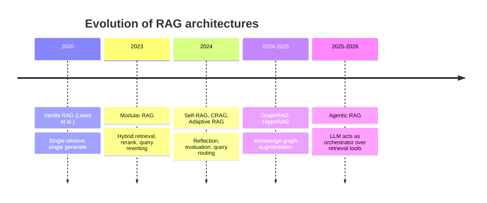
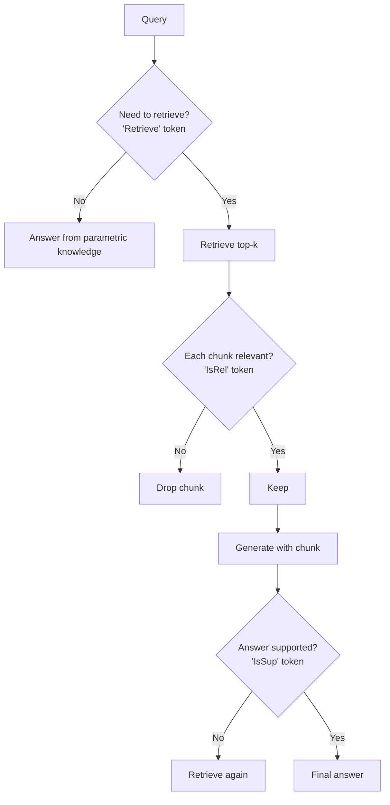
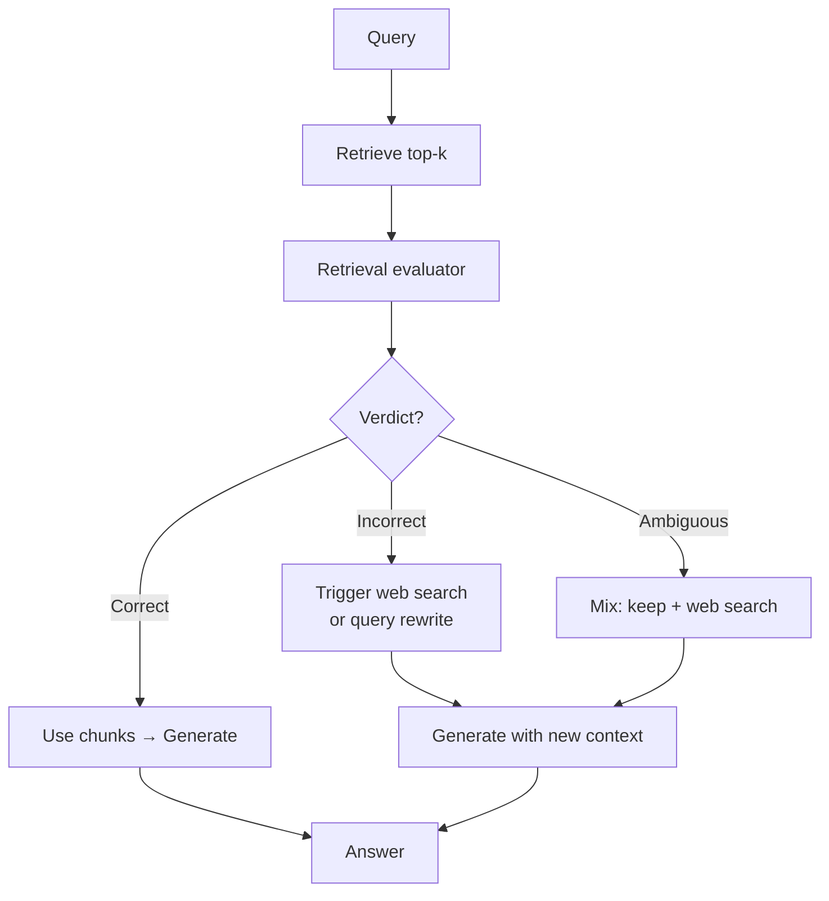
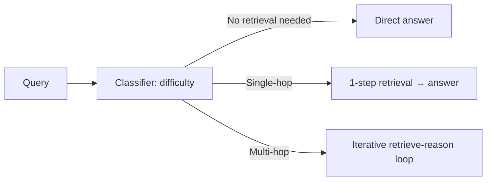
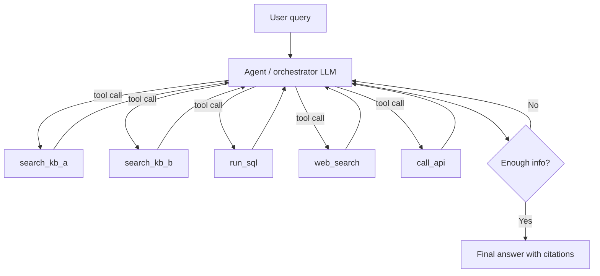
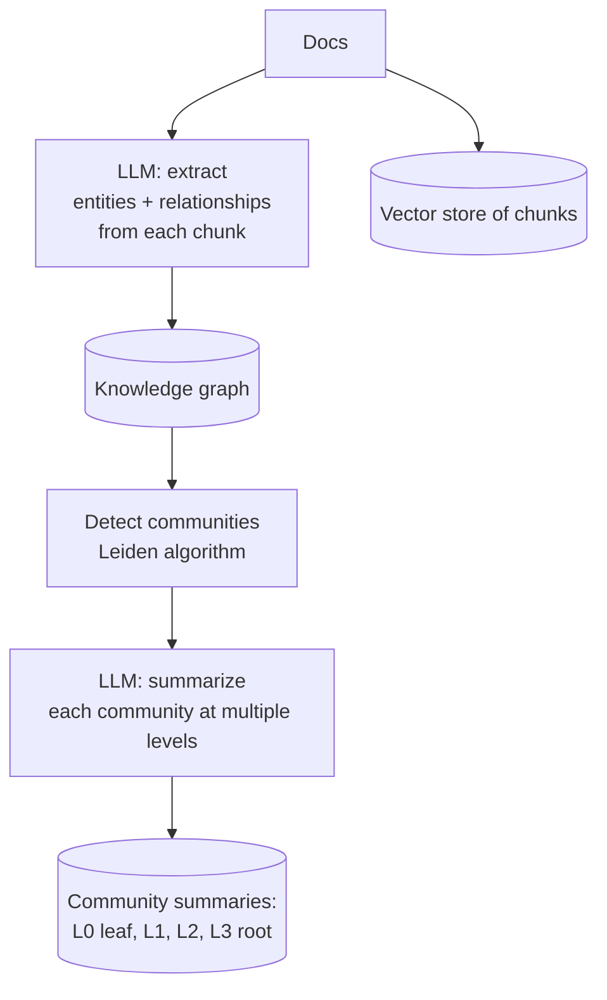
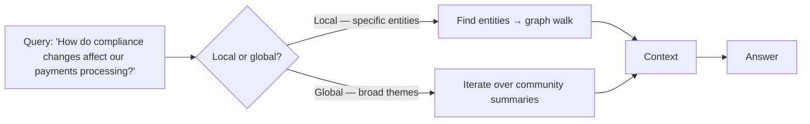
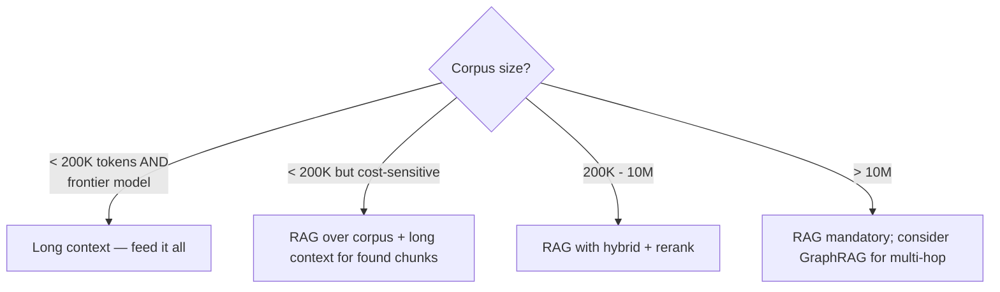

# Module 7 — Advanced & Agentic RAG

> Modern RAG isn't a static pipeline. It's a control flow that *decides* whether to retrieve, evaluates what came back, and rewrites or re-routes when needed.

---

## The arc — Naïve → Modular → Agentic

The shift: **from "retrieve once, answer" to "retrieve as a tool the agent calls."**

---

## Self-RAG (Asai et al. 2023)

The model is trained to emit **reflection tokens** that decide control flow:

| Token | Purpose |
|-------|---------|
| `[Retrieve]` | Should I retrieve right now? |
| `[IsRel]` | Is the retrieved chunk relevant to the question? |
| `[IsSup]` | Is my draft answer supported by the chunk? |
| `[IsUse]` | Is the answer useful overall? |

**Why it matters:** retrieval becomes optional and self-checked. Avoids "I had to retrieve so I'll force the retrieved content into the answer" — a common pathology.

**Trade-off:** requires a Self-RAG-trained model OR an external classifier acting in the same role.

---

## CRAG — Corrective Retrieval-Augmented Generation (Yan et al. 2024)

A lightweight **retrieval evaluator** scores each retrieved chunk as **Correct / Incorrect / Ambiguous**, then takes corrective action.

**Distinguishing it from Self-RAG:** Self-RAG bakes the decisions into the answering model. CRAG uses an *external* evaluator. CRAG is easier to bolt onto an existing pipeline; Self-RAG requires a trained model.

**Real-world value:** the corrective step (rewrite + web search) saves the user from getting a confidently wrong answer when the corpus doesn't have the answer.

---

## Adaptive RAG (Jeong et al. 2024)

A **query classifier** (small T5-large) predicts how hard the query is and routes accordingly:

**Why it's important:** most queries are easy. If you run the full agent loop on every query, you waste latency and cost. Adaptive routing pays for the classifier 1000× over.

**Practical version (no classifier required):** use the LLM itself as the router with a cheap prompt: "Is this question answerable from general knowledge, requires a single fact lookup, or requires multi-step reasoning?"

---

## Agentic RAG — RAG-as-tool

The shift in framing: **stop building a pipeline; build an agent that uses retrieval as one of several tools.**

The LLM decides:
- **What** to retrieve (which knowledge base / which API).
- **When** to retrieve.
- **What** to do with what it got — keep, refine query, look elsewhere.
- **When** to stop.

This is what most production "AI assistants" actually run in 2026.

**Implementation patterns:**
- **LangGraph** — state machine with retrieval nodes.
- **DSPy** — programs that compile prompts/strategies; can include adaptive retrieval.
- **Custom orchestration** — increasingly common as teams outgrow framework rigidities.

**Key practical issues:**
- **Tool-use reliability:** smaller models hallucinate tool calls. Use a model strong on function calling (Claude Opus, GPT-4o, Gemini Pro).
- **Stop conditions:** without explicit budget, agents loop. Cap iterations (typical 5-7) and tokens.
- **Observability:** every retrieval call needs to be logged. Without that you can't debug failures.
- **Cost:** agentic RAG is 2-10× the cost of single-shot RAG. The win has to justify the spend.

---

## GraphRAG (Microsoft, 2024)

A different beast. Instead of "embed chunks and search," GraphRAG **builds a knowledge graph** during indexing.

### Indexing pipeline

Each chunk: extract entities (people, products, concepts) and relationships. Build a graph. Cluster the graph hierarchically. Have an LLM summarize each cluster at increasing levels of abstraction.

### Query strategies

- **Local search:** find entities mentioned in the query → traverse graph → assemble local context.
- **Global search:** broadcast question to all top-level community summaries → map → reduce.
- **Drift search:** start local, expand to adjacent communities if needed.

### When GraphRAG wins

- **Multi-hop questions** where the answer requires connecting facts across documents.
- **Themed / aggregative** queries: "What are the main risks discussed in these 10K filings?"
- **Hierarchical corpora** with implicit structure.

### When GraphRAG loses

- Simple factual lookup (vector RAG is faster, often more accurate).
- **Time-sensitive queries** — GraphRAG has been shown to drop 16.6% on real-time-knowledge questions.
- **Cost-sensitive deployments** — indexing is **100-1000× more expensive** than vector RAG.

### LazyGraphRAG

Microsoft's own follow-up: skip exhaustive entity extraction at indexing; do it on-the-fly during queries. **Reduces indexing cost to 0.1% of full GraphRAG**, with most of the quality. The current sweet spot for most teams.

### GraphRAG vs vector RAG numbers

On enterprise multi-hop benchmarks:
- GraphRAG: 86% accuracy
- Vector RAG: 32% accuracy

On general single-fact lookups (Natural Questions):
- GraphRAG: −13.4% vs vector RAG

**Lesson:** match the retrieval architecture to the query distribution.

---

## HippoRAG, PathRAG, OG-RAG — graph variants

- **HippoRAG** — biologically inspired (hippocampal indexing). Focuses on memory consolidation.
- **PathRAG** — retrieval as path-finding through a graph.
- **OG-RAG** — ontology-grounded; uses a domain ontology as scaffold.

These are research directions; few production systems yet. Worth knowing the names; not worth the depth right now.

---

## Long context vs RAG — the standing debate

Frontier models keep growing context windows. Gemini 1.5 has 2M tokens. Gemini 3 reaches 1M with strong retrieval-quality. Does RAG die?

**Empirical findings (NVIDIA ChatQA-2 + Qwen2-72B + GPT-4-Turbo benchmarks, 2024-2025):**

| Context size | Winner |
|--------------|--------|
| ≤ 32K tokens | Long context can match or beat default RAG (top-5) |
| 32K - 200K | RAG wins on non-Gemini frontier models |
| 200K - 400K | RAG often wins |
| > 400K | RAG almost always wins on non-Gemini |
| Gemini 3 only | Holds quality 200K-1M; long context viable |

**Single-needle vs multi-needle haystack:**
Gemini 1.5 hits >99.7% on single-needle up to 1M. **Multi-needle scores trail single-needle by 15-40 points across all frontier models.** Real production queries are usually multi-needle.

**Context Rot (Chroma research, 2024):** even within rated context, model performance degrades non-linearly with input length. The "1M tokens" capability number overstates real-world capability.

### Practical decision

**Realistic 2026 stance:** long context **complements** RAG; it doesn't replace it. The pattern is: retrieve the relevant 50K tokens, then dump them into a 200K-context model. You get the best of both — semantic search precision + the model's ability to reason over a lot of context.

---

## Sanity check

1. What's the architectural difference between Self-RAG and CRAG?
2. Why does Adaptive RAG's classifier pay for itself?
3. When does GraphRAG dominate and when does it lose?
4. Single-needle NIAH benchmarks "overstate production capability." Why?
5. You have a 200K-token corpus and Gemini 3. RAG or long context — what would you try first and what would you measure to validate the choice?

---

**Next:** [Module 8 — Evaluation](08_evaluation.md)

**TOC** [Table of Contents](00_Table_Of_Contents.md)