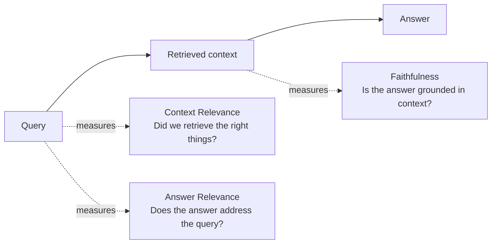
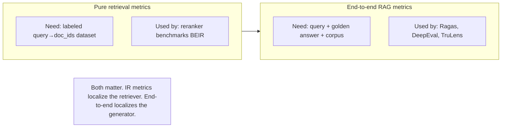
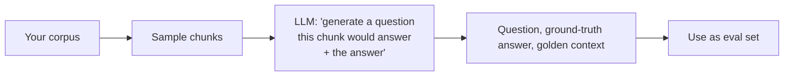
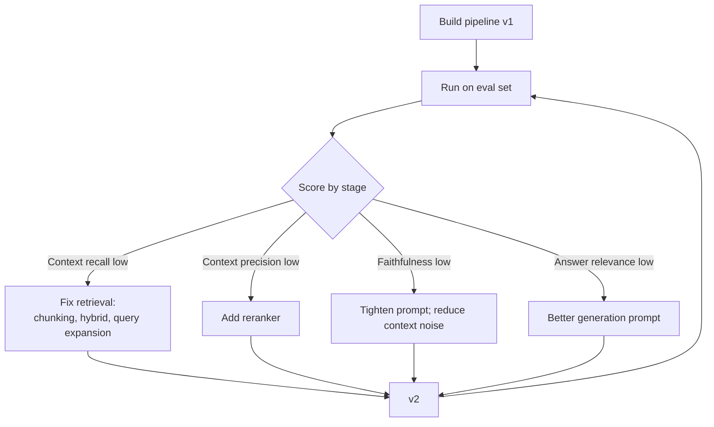

# Module 8 — Evaluation

> A RAG system you can't measure is a RAG system you can't improve. The whole field's velocity over the last two years tracks the maturity of its eval frameworks.

---

## Why eval is hard

Three reasons:

1. **No single ground truth.** "Was that answer good?" depends on the user's intent, prior knowledge, and the corpus.
2. **Failures are silent.** A wrong RAG answer is fluent and confident. Without measurement, users notice and you don't.
3. **Multi-stage pipeline = multi-stage failures.** A bad answer can come from bad retrieval *or* bad generation *or* both. Eval must localize.

The right move: **break eval into per-stage metrics** so a failed answer points at the broken stage.

---

## The RAG triad of metrics



These three plus their sub-metrics form the working set in Ragas, TruLens, DeepEval, and Phoenix.

### 1. Context Relevance (a.k.a. Context Precision / Context Recall)

- **Context Precision** — of the retrieved chunks, how many are actually relevant to the question?
- **Context Recall** — of the *truly relevant* chunks (in the whole corpus), how many made it into the retrieved set?

These trade off — chasing one usually hurts the other. Aim for both > 0.8.

### 2. Faithfulness (a.k.a. Groundedness)

Of the claims in the answer, how many are supported by the retrieved context? An LLM-as-judge breaks the answer into atomic claims and checks each against the context.

> **Sharp gotcha:** a 1.0 faithfulness score means the answer reflects the retrieved context. **It does not mean the retrieved context is *correct*.** If the corpus says "the sun is cold," and your answer faithfully repeats it, faithfulness = 1.0 and the answer is wrong. Faithfulness is a generation-quality metric, not a fact-checking metric.

### 3. Answer Relevance

Does the answer address the question, or does it wander? Computed by reverse-generating questions from the answer and comparing to the original question via embedding similarity.

---

## Retrieval-only metrics (classical IR)

When you have a labeled eval set with `(query, list_of_relevant_doc_ids)`:

| Metric | What it answers |
|--------|-----------------|
| **Recall@k** | Of all the relevant docs, what fraction landed in top-k? |
| **Precision@k** | Of the top-k, what fraction are relevant? |
| **MRR** | What's the average of `1/rank_of_first_relevant_doc`? |
| **NDCG@k** | Graded relevance, position-discounted. The IR field standard. |
| **MAP** | Mean Average Precision — averages precision across recall thresholds. |
| **Hit@k** | Binary: was *any* relevant doc in top-k? |

NDCG@10 is the headline metric for reranker leaderboards (BEIR uses it).



---

## The eval frameworks

### Ragas

[`docs.ragas.io`](https://docs.ragas.io)

The most-cited RAG eval framework. Pioneered the LLM-as-judge approach for faithfulness and context-precision metrics. Strict on **logical entailment** for faithfulness — "does the answer follow strictly from the context, claim by claim?"

**Strengths:** academic citation density, clear metric definitions, good synthetic eval-set generation.

**Weaknesses:** strictness can over-penalize valid paraphrases; metric outputs vary with the judge LLM.

### DeepEval

[`deepeval.com`](https://deepeval.com)

Pytest-style API. Designed to be CI/CD-native — you write `test_faithfulness()` next to your unit tests.

**Strengths:** developer ergonomics; pragmatic-interpretation faithfulness (catches misleading omissions); easy CI integration.

**Weaknesses:** less academic baseline; metric values not always comparable to Ragas.

### TruLens

[`trulens.org`](https://www.trulens.org)

Dashboard-first. Strong observability layer — every eval call is traced and visualizable.

**Strengths:** experiment tracking, comparison UI, "feedback functions" framework is flexible.

**Weaknesses:** heavier setup; less natural for headless CI.

### Phoenix (Arize)

Tracing + eval combined. Good for production observability of RAG, with eval metrics as one of many telemetry signals.

### LangSmith

Vendor-tied (LangChain). Excellent DX inside the LangChain/LangGraph stack. Less neutral if you use other frameworks.

### Recommended pattern (2026)

| Phase | Use |
|-------|-----|
| Metric exploration / paper-style eval | **Ragas** |
| CI/CD gates | **DeepEval** |
| Experiment dashboards | **TruLens** or **Phoenix** |
| Vendor-locked LangChain dev | **LangSmith** |

You can run all of them — different metric definitions catch different failures.

---

## Synthetic eval set generation

You don't have a labeled eval set, and hand-labeling is expensive. The frameworks generate one for you:



Ragas' `TestsetGenerator` and DeepEval's `Synthesizer` both implement this. They support difficulty profiles — simple, multi-hop, conditional.

**Caveats:**
- Generated questions skew **easy** (they were generated *from* the chunk).
- Hand-review at least 30-50 questions for sanity.
- Mix synthetic with real user queries from logs once you have them.

---

## The eval-driven dev loop



This is the loop your team should run. Per-stage metrics tell you *which knob to turn*. Without them, you're guessing.

---

## Metric thresholds (rule of thumb, NOT a contract)

| Metric | Production-ready | Investigate | Broken |
|--------|------------------|-------------|--------|
| Context Recall | ≥ 0.85 | 0.7-0.85 | < 0.7 |
| Context Precision | ≥ 0.8 | 0.6-0.8 | < 0.6 |
| Faithfulness (Ragas) | ≥ 0.9 | 0.75-0.9 | < 0.75 |
| Answer Relevance | ≥ 0.85 | 0.7-0.85 | < 0.7 |

These are domain-dependent. Medical/legal: tighter. Casual chat: looser.

---

## Beyond per-query metrics

The above measures *one query at a time*. Production systems need:

### Aggregate / distributional

- **p50/p95/p99 latency** — tail matters more than mean.
- **Cost per query** — token in/out × model price + retrieval cost.
- **Hallucination rate** — % of answers with at least one ungrounded claim.
- **Refusal rate** — % where the model refused / said "I don't know."
- **Citation coverage** — % of answer claims with a source link.

### Online metrics (when you have user signals)

- **Click-through on cited sources** — did users follow the citation? (sanity proxy)
- **Thumbs up / down** rate.
- **Re-query rate** — did they ask again, suggesting the first answer was bad?
- **Conversation length** — short answers → satisfaction OR confusion.

### Failure-mode tracking

Tag every failure case in your eval set:

```yaml
- id: q_3142
  query: "What's our refund policy for B2B contracts?"
  failure_mode: "wrong_chunk_retrieved"  # vs "good_chunk_bad_answer"
  expected_chunks: [doc_88, doc_142]
  actual_chunks: [doc_91, doc_142]
```

Over time, the distribution of failure modes tells you where to invest. If 70% are "wrong_chunk_retrieved," fix retrieval — not the generation prompt.

---

## A worked example: diagnosing a bad answer

User asks: "What's the maximum employer 401k match for Acme employees in 2025?"

Answer: "The maximum employer match is 50% of contributions up to 6%."

Possible failures:
1. **Retrieval missed the 2025 doc**, returned 2023 policy. → Context Recall ↓
2. **Retrieved both 2023 and 2025**, model picked the wrong one. → Context Precision OK, Faithfulness ↓
3. **Retrieved correct 2025 doc**, but model misread "100% match up to 4%" as "50% up to 6%". → Context Recall and Precision OK, Faithfulness ↓
4. **Retrieved correct doc**, answered correctly, but answered for "all employees" not "Acme specifically." → Answer Relevance ↓

Each failure mode points at a different fix. Without per-stage metrics, you're guessing which one happened.

---

## Sanity check

1. Faithfulness = 1.0. Does that mean the answer is correct? Why or why not?
2. Why is NDCG@10 the standard reranker metric instead of Recall@10?
3. Your Ragas faithfulness is 0.95 but DeepEval's is 0.7. What might explain the gap?
4. You have 100% Recall@10 and 30% Precision@10. What's likely wrong, and how does the LLM downstream feel about it?
5. Why do synthetic eval sets skew easy, and what should you do about it?

---

**Next:** [Module 9 — Production](09_production.md)

**TOC** [Table of Contents](00_Table_Of_Contents.md)