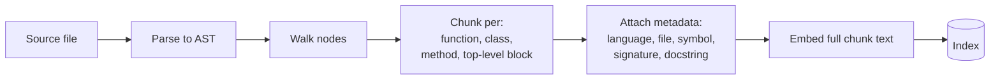
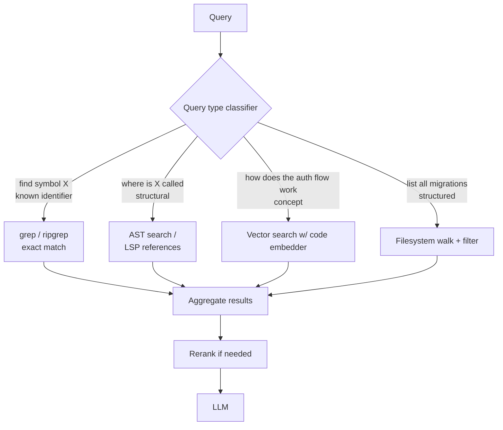
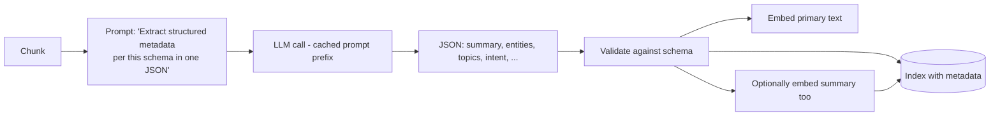
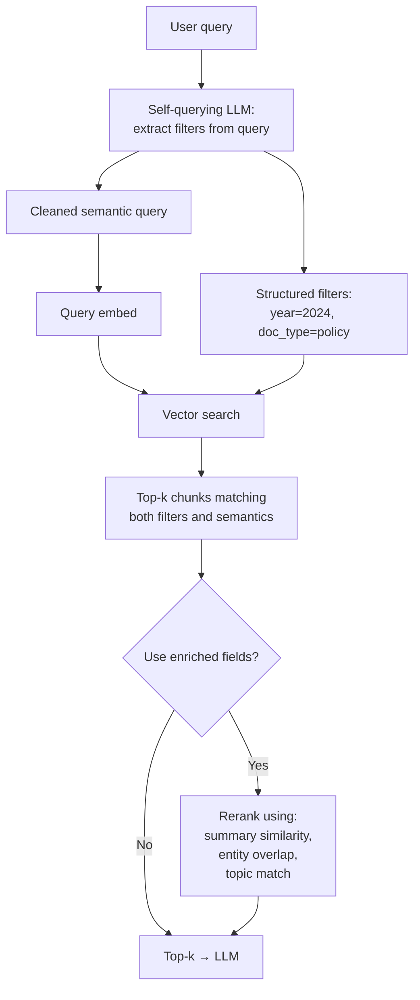
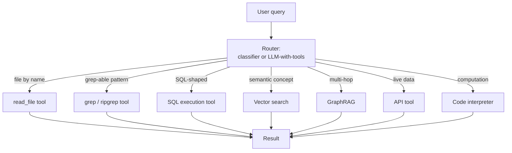

# Module 10 — Code Retrieval, Metadata Enrichment & Query Routing

> Three real-world topics that the canonical "embed → vector search" recipe doesn't handle well. Added in response to questions that exposed gaps in the first nine modules.

The unifying theme: **vector similarity is one tool, not the only tool.** Knowing when to reach for something else is most of what separates production RAG from demoware.

---

## Part 1 — Code retrieval

### Why generic embedders struggle on code

A query like `"Generate code samples for self-attention"` actually has *two* requirements:

1. **Topic match:** the chunk is about self-attention.
2. **Type match:** the chunk is *code*, not prose.

A general-purpose embedder (text-embedding-3-large, voyage-3-large, BGE-M3) is good at requirement 1 but **mediocre at requirement 2**. It doesn't natively understand:

- That `def attention(q, k, v)` is structurally a function definition.
- That `import torch.nn.functional as F` signals a PyTorch context.
- That two different functions implementing the same algorithm should embed close to each other even with different identifiers.
- That a docstring saying "this implements multi-head attention" should match the *body*, not just other docstrings.

Code-specialized embedders are trained explicitly on code-doc and code-code pairs to fix this.

### Specialized code embedders (early 2026)

| Model | Notes |
|-------|-------|
| **Voyage AI `voyage-code-3`** | Released 2024. SOTA on CodeSearchNet. **+5-8 NDCG points over text-embedding-3-large** on code retrieval. Production default for code RAG. |
| **Qwen3-Embedding-8B** | Apache 2.0. Tops the **MTEB-Code** benchmark. Strong open-source choice. |
| **Gemini Embedding 2** | MTEB Code: ~84.0. Very strong all-rounder. |
| **Jina Code Embeddings v2** | Specialized; strong on code-similarity tasks. |
| **OpenAI `text-embedding-3-large`** | Generic but acceptable on code if budget-constrained. Beaten on dedicated code benchmarks. |

**Rule of thumb:** if > 30% of your corpus is code, switch from a generic embedder to `voyage-code-3` or `Qwen3-Embedding`. The lift is reliably 5-10 points on code-heavy queries.

### Code-aware chunking (AST instead of characters)

Splitting code by character count cuts mid-function and destroys semantics. The fix: **parse the code into an AST and chunk on syntactic boundaries.**



Tools that do this for you:
- **tree-sitter** — multi-language AST parser. Used by GitHub, Cursor, Sourcegraph, Claude Code.
- **LangChain `LanguageParser`** — wraps tree-sitter for common languages.
- **Sourcegraph SCIP** — language-server-protocol-based code indexing.

### The "grep beats vectors" finding (the controversial one)

A 2025-2026 finding that surprised the field: **production code agents — Cursor, Claude Code, Devin — frequently rely on grep, ripgrep, and the file system rather than a vector database.**

Why grep wins for code agents:

1. **Identifiers are exact tokens.** When the user says `"find usages of getUserSession"`, grep returns the literal answer with zero hallucination risk. Vector search guesses.
2. **No staleness.** A vector index is always behind the working copy. grep reads the source-of-truth right now.
3. **No drift on rename.** Refactors invalidate vector indexes; grep is unaffected.
4. **Free.** No embedding cost, no DB to operate.
5. **Composable.** `grep | xargs | rg` pipelines beat vector top-k for many real coding tasks.

**Where vectors still win:**
- Concept searches: `"where do we handle rate limiting?"` — works when the rate-limiter doesn't have those words in it.
- Cross-language semantic links: Python query, Go-language match.
- Onboarding queries from someone who doesn't know the codebase's vocabulary.

The mature pattern is **hybrid: tool-routing the agent between grep, AST search, and vector search depending on the query shape.** Sourcegraph Cody pioneered this; Cursor and Claude Code have converged on it. We get to query routing in Part 3.

### A reference architecture for code RAG



This is roughly what Sourcegraph Cody's architecture looks like in production, with vectors as one tool among several.

---

## Part 2 — Metadata schema design and LLM enrichment

### Why metadata isn't optional in real RAG

Most production queries have implicit structure that pure semantic search can't honor:

| User says... | Implicit structure |
|--------------|---------------------|
| "Show me the Q4 2024 revenue policy" | year=2024, quarter=Q4, doc_type=policy, topic=revenue |
| "Code samples from React hooks docs" | content_type=code, source=React docs |
| "Recent emails about budget approval" | doc_type=email, recency=last_30d, topic=budget approval |
| "Internal-only memos on the layoffs" | confidentiality=internal, doc_type=memo, topic=layoffs |

Without a metadata layer, the retriever works against you — it returns the semantically-closest match across the whole corpus, ignoring the filters the user clearly meant.

### What to store as metadata (the "schema")

Two types: **mechanical** (extracted at ingest, cheap) and **enriched** (LLM-generated, more expensive).

#### Mechanical metadata (always include)

```yaml
chunk_id: "doc_142_chunk_07"
doc_id: "doc_142"
doc_type: "pdf"  # or html, md, code, slack, email
source: "https://wiki.acme.com/policies/refund-2024.pdf"
ingested_at: "2026-05-10T14:00:00Z"
last_modified: "2024-11-03T08:23:00Z"
filename: "refund-policy-q4-2024.pdf"
file_path: "/policies/2024/q4/"
section_path: "Refund Policy > Cancellation > B2B"  # from structure-aware chunking
page: 12
chunk_index: 7
chunk_total: 15
language: "en"
chunk_text_hash: "sha256:..."
```

#### Enriched metadata (LLM-generated at index time)

```yaml
summary: "Defines refund eligibility for B2B customers within 30 days..."
entities: ["B2B customer", "refund window", "Acme Corp", "Net-30"]
topics: ["refund_policy", "b2b", "cancellation"]
intent_categories: ["policy_question", "eligibility_query"]
suggested_queries:
  - "Can a B2B customer get a refund after 30 days?"
  - "What's the cancellation policy for enterprise contracts?"
content_type: "policy_text"  # vs code, table, image_caption
contains_pii: false
language_complexity: "legal"
```

This is the **MetaRAG pattern** — also called **Dynamic Metadata RAG** in some papers (arXiv:2512.05411 from late 2025 is the canonical reference).

### LLM-enriched metadata: the single-call pattern

Naïve approach: separate LLM call per field (extract entities, then extract topics, then generate summary). Cost-prohibitive.

**Smart approach:** one LLM call per chunk that returns a structured JSON with all fields. With prompt caching on the document context, this is affordable.



### How metadata gets used at query time

Two distinct uses, often combined:



#### Use 1 — Filtering

The LLM-extracted summary/entities/topics give you metadata fields you can filter on. `"Show me policies about refunds in 2024"` → `filter: doc_type=policy AND year=2024 AND 'refund' IN topics`.

#### Use 2 — Reranking signal

Even when filters don't apply, enriched metadata is reranking gold. A reranker (or a custom score) can boost chunks where:
- Query entity overlaps with chunk's `entities` field.
- Query intent matches chunk's `intent_categories`.
- Query has high semantic similarity to chunk's `summary` (a denser, more topical text than the chunk itself).

### When LLM enrichment is worth the cost

**Worth it:**
- Corpus is high-value (you'll re-query it many times — cost amortizes over queries).
- Documents are heterogeneous (you need uniform metadata to compare across them).
- Filters are common in real user queries.
- You have prompt caching available (Anthropic, OpenAI, Gemini all support it).

**Not worth it:**
- Tiny corpus where you can afford to read everything every time.
- Highly uniform corpus where filename or path already tells you what you need.
- Query patterns are uniformly semantic ("what does this mean?") with no implicit filters.

**Cost math (rough):**
- 100K chunks × 200 tokens/chunk avg → 20M tokens for enrichment input.
- One LLM call per chunk, output ~150 tokens of JSON → 15M output tokens.
- Using Sonnet-class with prompt caching: roughly $50-200 for the enrichment pass. One-time, amortized over the corpus's lifetime.

---

## Part 3 — Query routing: tool calls vs vector search

This is the answer to the question "if I ask for a file named `CLAUDE.md`, does the retriever know to fetch the file rather than search for `CLAUDE.md` as a phrase?"

**It doesn't, by default.** Vanilla vector RAG turns *every* query into "embed → search → top-k." That's wrong for many queries.

### The classes of query and their right tool

| Query class | Example | Best tool |
|-------------|---------|-----------|
| Specific file lookup | "give me the CLAUDE.md file" | **Filesystem / `read_file`** |
| Symbol lookup in code | "find the `getUserSession` function" | **grep / LSP** |
| Structured database query | "all orders from customer 42 in Q4" | **SQL** |
| Concept / semantic search | "where do we handle rate limiting" | **Vector search** |
| Multi-hop reasoning | "how does X relate to Y across docs" | **GraphRAG** or agent |
| Real-time / external | "current status of the Acme deal" | **API call / web search** |
| Math / computation | "what's 3% of last quarter's revenue" | **Code execution** |

A pure vector-RAG product running every one of these through the same pipeline gets garbage on five of seven.

### The routing pattern



### Two implementations of the router

#### 1. Classifier-based router (Adaptive RAG style)

Train (or prompt) a small model to classify the query into one of N categories, dispatch accordingly. Cheap, fast, deterministic.

#### 2. Function-calling LLM as router

Define tools as functions; let the LLM decide which to call. The model sees the user query and a list of tools (`get_file`, `grep_code`, `vector_search`, `run_sql`, ...) and emits a tool call.

```python
# Conceptual example
tools = [
    {
        "name": "get_file",
        "description": "Fetch a specific file by exact name or path",
        "parameters": {"name": "string"}
    },
    {
        "name": "grep_code",
        "description": "Search source code for an exact pattern",
        "parameters": {"pattern": "string", "language": "string"}
    },
    {
        "name": "vector_search",
        "description": "Semantic search over knowledge base for concepts",
        "parameters": {"query": "string"}
    },
    {
        "name": "run_sql",
        "description": "Run a SQL query against the analytics database",
        "parameters": {"sql": "string"}
    }
]

# User: "give me sample of a file named CLAUDE.md"
# LLM emits: get_file(name="CLAUDE.md")    ← correct routing

# User: "where do we handle rate limiting?"
# LLM emits: vector_search(query="rate limiting handler")  ← correct
```

This is what Claude Code, Cursor, and modern agentic systems run. The vector DB is **one of several tools the agent can choose from**, not the default for every query.

### Why this matters for RAG-system design

The implication for product builders: **don't treat your RAG system as a black-box "answer questions over documents" tool.** Treat it as a router that can:

- Look up a specific file by name → just open the file, don't vector-search it.
- Search code → use AST or grep.
- Run a structured query against tabular data → SQL.
- Find the conceptual answer in unstructured prose → vector search.

The skill is in the router. Most "RAG quality issues" in real products are routing problems disguised as retrieval problems.

### When you DO want vector search to handle the filename question

Sometimes you genuinely want `"give me sample of a file named CLAUDE.md"` to use the vector index — for example, when the file isn't on a filesystem you control, or you've ingested file *contents* into your corpus and want the model to find chunks from that file. The fix in that case:

- **Index `filename` and `file_path` as metadata.**
- Use a **self-querying** retriever that extracts `filename = 'CLAUDE.md'` as a structured filter.
- Run vector search over the cleaned semantic query (`"give me a sample"`) **filtered to chunks where `filename = 'CLAUDE.md'`**.

That's what Module 5's "Self-querying" section covers — but it requires the metadata schema (Part 2 of this module) to be in place, AND the user's query language to map cleanly to filter expressions. It works, but it's a less direct path than just having a `get_file` tool.

---

## Sanity check

1. Why are generic text embedders weak on code, and what's the +N-points-better alternative?
2. List four mechanical metadata fields and three LLM-enriched metadata fields you'd store per chunk.
3. The "single-call enrichment" pattern: what does it solve compared to one-LLM-call-per-field, and what makes it affordable?
4. A user asks: "give me a sample of `CLAUDE.md`." Two architectures could handle this — describe both, and say which you'd pick.
5. Why has Cursor/Claude Code converged on grep and AST tools rather than relying on vector search alone for code?
6. The "hybrid grep + vector + AST" routing pattern: what's the router *itself*, and what's it deciding between?

---

## Selected references

- Voyage AI — [voyage-code-3 announcement](https://blog.voyageai.com/2024/12/04/voyage-code-3/) (release notes)
- Sourcegraph — [How Cody understands your codebase](https://sourcegraph.com/blog/how-cody-understands-your-codebase)
- LlamaIndex — [Vector Search vs Filesystem Tools: 2026 Benchmarks](https://www.llamaindex.ai/blog/did-filesystem-tools-kill-vector-search)
- MetaRAG paper (arXiv:2512.05411, 2025) — *A Systematic Framework for Enterprise Knowledge Retrieval: Leveraging LLM-Generated Metadata*
- Haystack — [Automated Structured Metadata Enrichment cookbook](https://haystack.deepset.ai/cookbook/metadata_enrichment)
- Microsoft — [RAG techniques: function calling for structured retrieval](https://techcommunity.microsoft.com/blog/educatordeveloperblog/rag-techniques-function-calling-for-more-structured-retrieval/4075360)
- LightRAG (EMNLP 2025) — [github.com/HKUDS/LightRAG](https://github.com/HKUDS/LightRAG)

---

**Back to:** [README](README.md) | [FACTS.md](FACTS.md)

**Next** [Personalization, Conversational](11_personalization_conversational.md)

**TOC** [Table of Contents](00_Table_Of_Contents.md)