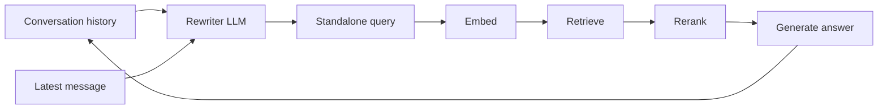
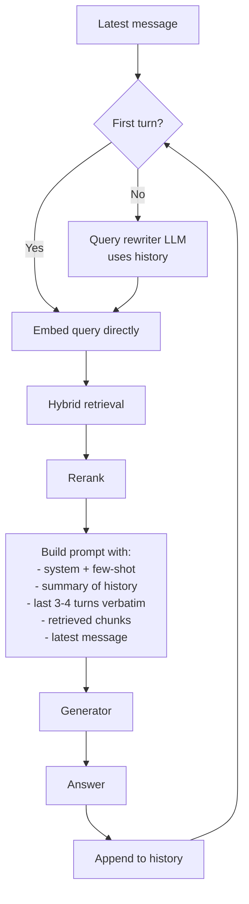
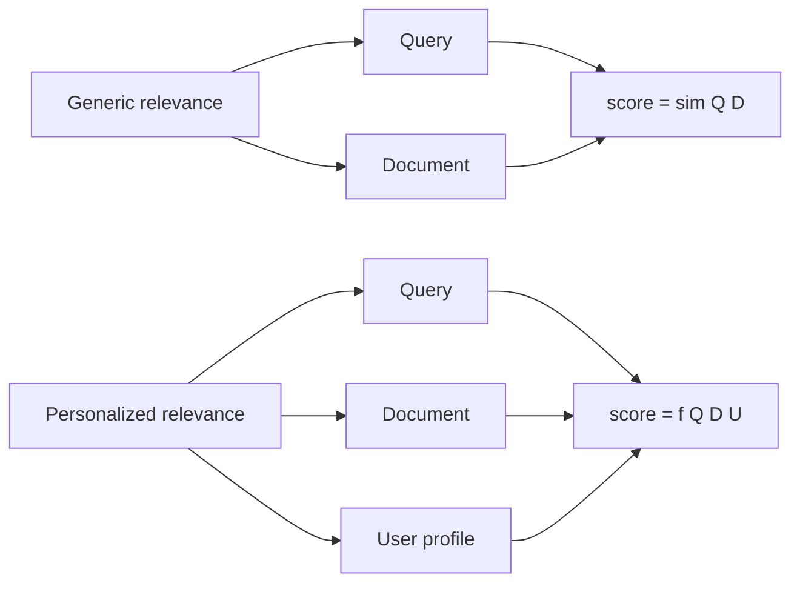
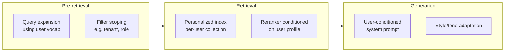
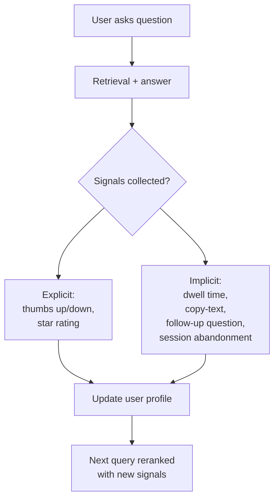

# Module 11 — Personalization & Conversational / Multi-turn Retrieval

> Two of the topics RAG tutorials usually skip. They're not exotic — every chatbot you ship will need both.
>
> Common thread: **the retriever has to condition on user state, not just the latest message.**

---

## Part 1 — Conversational / multi-turn retrieval

### The problem in one example

```
User: Tell me about Anthropic's Contextual Retrieval.
Bot:  [retrieves & answers correctly]

User: How does it compare to late chunking?
Bot:  ?
```

If the retriever sees only `"How does it compare to late chunking?"`, it has no idea what "it" is. The query has an **unresolved coreference** — it depends on a prior turn.

A naïve RAG bot embeds and searches the literal query. The vector for "How does it compare to late chunking?" lands somewhere in *late chunking* territory, completely missing *Contextual Retrieval*. The bot returns half-relevant context. The answer is wrong.

> **Numbers from MTRAG and similar benchmarks (2024-2025):** Recall@5 drops from **0.89 on the first turn to 0.47 on later turns** of a conversation. Roughly **60% of follow-up messages have unresolved coreferences** that break naïve retrieval.

This is the single biggest reason real chatbots feel "dumber after the third question."

### The standard fix: query rewriting before retrieval

Rewrite the user's latest message into a **standalone, decontextualized query** *before* embedding and searching.



The rewriter prompt is roughly:

> Given the conversation history and the latest user message, produce a single self-contained question that:
> - Resolves all pronouns and references to prior turns.
> - Carries forward implied subjects and constraints.
> - Preserves the user's intent verbatim where possible.
> Output only the rewritten question.

Use a **fast, cheap model** here (Haiku-class, GPT-4o-mini, Gemini Flash). The rewrite has to add < 200ms or it eats your latency budget.

### Walking through the example

```
History:  user: "Tell me about Anthropic's Contextual Retrieval."
          bot:  "Contextual Retrieval prepends LLM-generated context to chunks before embedding..."

Latest:   "How does it compare to late chunking?"

Rewritten: "How does Anthropic's Contextual Retrieval compare to late chunking?"

→ retrieval now has a standalone query that lands correctly in vector space.
```

### Multi-strategy rewriting (frontier 2026 pattern)

Instead of one rewrite, generate **several complementary rewrites** that each target a different failure mode, retrieve for each, fuse with RRF.

| Rewrite type | What it fixes |
|--------------|---------------|
| **Minimal rewrite** | Coreference + omission |
| **Corpus-specific** | Substitute domain terminology the user didn't use |
| **HyDE-style** | Generate a hypothetical answer for doc-to-doc retrieval |
| **Chain-of-thought** | Decompose into sub-questions, retrieve for each |
| **Anchor-keyword** | Extract entities for sparse / BM25 matching |

This stack is closer to "production-grade conversational RAG" than single-rewrite. Cost: 5× rewrites = 5× retrievals. Worth it when the cost of a wrong answer is high.

### How much history to feed the rewriter

Common mistake: stuff the entire conversation into the rewriter prompt. Findings:

- **Performance saturates after 4-6 user turns.** Adding more turns doesn't help.
- **Bot turns barely help.** Including only the user side of the conversation gets ~95% of the benefit at half the tokens.
- **For very long conversations, summarize** older turns into a single "context summary" and only include verbatim the last 3-4 turns.

```
Rewriter input:
  [Conversation summary so far: User is researching RAG architectures,
   has discussed embedding models, vector DBs, and is now comparing
   chunking strategies.]

  Last turns:
  user: Tell me about Anthropic's Contextual Retrieval.
  bot:  [content omitted]
  user: How does it compare to late chunking?

Output: "How does Anthropic's Contextual Retrieval compare to late chunking?"
```

### Conversational RAG architecture



### Failure modes specific to conversational RAG

1. **Topic shift not detected.** User pivots to a new topic; rewriter hallucinates linkage to prior topic. Mitigation: rewriter prompt explicitly says "if the latest message is unrelated to prior turns, output it unchanged."
2. **Stale retrieved context bleeds across turns.** Caching retrieved chunks across turns saves cost but can return outdated context when the user's intent shifted. Mitigation: invalidate retrieval cache on every turn.
3. **Coreference to retrieved content, not prior turn.** "Tell me more about that policy" — "that policy" was in the *retrieved chunk* the bot quoted, not in the user's prior turn. Rewriter needs access to the **bot's last answer** (or the chunks it cited) to resolve this.
4. **Latency stack-up.** Rewrite + retrieve + rerank + generate runs sequentially. Fast rewriter (Haiku/Flash) is non-negotiable.

---

## Part 2 — Personalization

### The shift in what "relevant" means

Standard RAG assumes "relevant" is a property of `(query, document)`. In personalized RAG, it's a property of `(query, document, user)`.



Two users typing the same query should get different rankings if their needs differ.

### Where personalization can plug in (three stages)



### What to put in a user profile

| Type | Examples |
|------|----------|
| **Explicit preferences** | Stated role ("I'm a backend engineer"), language, expertise level, opt-ins |
| **Implicit signals** | Click-through, dwell time, copy-text, follow-ups, thumbs up/down |
| **Behavioral history** | Past queries, past retrieved chunks engaged with, conversation summaries |
| **Constraints** | Org / tenant ID, role-based access, region, compliance scope |
| **Derived embeddings** | Aggregated embedding of "things this user has engaged with" |

### Three personalization architectures, ordered by cost

#### 1. Filter-based (cheapest)

User's `org_id`, `role`, `region` go into metadata filters. Retrieval is otherwise generic but **scoped** to what this user is allowed to see / wants to see.

This is most of what enterprise RAG actually does. Often confused with "real" personalization but is just access control.

#### 2. Reranker-conditioned (mid)

Retrieve generically (top 100). Pass the user's profile to the reranker as context:

```
[User profile: backend engineer, Python primary, last 7 days viewed: pgvector, async Redis, PostgreSQL replication]

Query: "best practices for connection pooling"

Candidate documents: [...]

Rerank by relevance to this user.
```

A cross-encoder fine-tuned on (user, query, doc) triples works; an LLM-as-reranker can do it zero-shot via prompting. The reranker boosts docs that match the user's domain context.

#### 3. Profile-as-vector (richest, most expensive)

Aggregate the user's engagement history into a "preference embedding." Combine with the query embedding at retrieval time:

```
combined_query_vector = α · query_embedding + (1−α) · preference_embedding
```

`α` ≈ 0.7 (lean toward the query, not the profile). Recompute preference embedding periodically.

This is what mature recommendation systems do and where RAG is heading. Practical implementations: Shaped, Glean, Mem0 + custom retrieval.

### The feedback loop is the actual product

Personalization isn't a snapshot — it's a loop.



**Most teams forget the loop.** A static profile gets stale fast. Even simple loops — "boost docs from sources the user has up-voted" — beat much fancier static profiles.

### Personalization vs memory — they're different things

This trips people up.

| | Personalization | Memory |
|---|---|---|
| **What it captures** | Stable user attributes / preferences | Specific facts the user has told the assistant |
| **Time horizon** | Persistent across sessions | Often per-session, sometimes persistent |
| **Example** | "User is a backend engineer in healthcare" | "User's wife's name is Priya" |
| **Failure mode** | Wrong ranking | Wrong factual claim |
| **Tools** | Profile vector, behavioral signals | Mem0, Letta/MemGPT, Anthropic memory |

In production, you usually want both. Personalization shapes *retrieval*; memory shapes *what the LLM knows about this specific user*.

### The 2026 memory-product landscape (orientation)

| Tool | Philosophy | When to use |
|------|-----------|-------------|
| **Mem0** | CRUD memory layer; bolt onto any agent. Passively extracts facts from conversations via `add()`. | Add long-term memory to existing RAG/agent without rebuilding. |
| **Letta (MemGPT)** | Full agent runtime with explicit, editable memory blocks; OS-inspired memory hierarchy. | When the agent IS the product and memory is its core. |
| **Provider-managed** | ChatGPT memory, Claude Projects, Gemini Workspace. Vendor stores user facts. | Consumer products where you don't want to operate memory. |
| **Custom + vector RAG** | Roll your own: store user facts in a per-user vector index. | When you have specific schema needs. |

The clean mental separation:
- **RAG** = retrieve from `the docs / the codebase / the corpus`
- **Memory** = retrieve from `what the model has learned about this user`
- **Personalization** = re-shape retrieval according to `who this user is`

All three can coexist; they just retrieve from different stores.

### Practical defaults

If you're starting:

1. **Filter-based scoping** is non-negotiable. Per-tenant, per-role.
2. **Track signals from day one** — even if you don't use them yet. You can't backfill behavioral data.
3. **Add reranker conditioning when you have enough signal** (typically a few hundred users with consistent engagement). Until then it's noise.
4. **Profile-as-vector is a deliberate decision**, not a default. Real ML system; needs eval and re-training cadence.
5. **Memory layer (Mem0 / similar) is orthogonal** to personalization. Add when "the assistant doesn't remember what I told it last week" becomes a real complaint.

---

## Sanity check

1. A user says "How does it compare to late chunking?" after asking about Contextual Retrieval. Why does naïve retrieval fail, and what's the standard fix?
2. What's the rough quality drop on later conversation turns (per benchmarks), and what's the dominant cause?
3. Why do we use a *fast* model (Haiku-class) for query rewriting?
4. List two explicit and two implicit signals you'd track for personalization.
5. What's the difference between "personalization" and "memory" in a chatbot?
6. Why is filter-based scoping often confused with personalization, and why is that confusion costly?

---

## References

- Alhena — [Query Rewriting: 4 Layers That Fix Multi-Turn Retrieval](https://alhena.ai/blog/query-rewriting-before-retrieval-multi-turn-rag/)
- MTRAG benchmark — multi-turn RAG eval (recall@5 = 0.89 → 0.47 across turns)
- Awesome Personalized RAG Agent — [github.com/Applied-Machine-Learning-Lab/Awesome-Personalized-RAG-Agent](https://github.com/Applied-Machine-Learning-Lab/Awesome-Personalized-RAG-Agent)
- Shaped — [Building Stateful AI Agents (2026 guide)](https://www.shaped.ai/blog/building-stateful-ai-agents-why-user-history-matters-in-rag-systems-2026-guide)
- Mem0 — [github.com/mem0ai/mem0](https://github.com/mem0ai/mem0)
- Letta (formerly MemGPT) — [letta.com](https://www.letta.com/)
- NVIDIA — [Multi-turn Conversation Support for RAG Blueprint](https://docs.nvidia.com/rag/2.4.0/multiturn.html)

---

**Back to:** [README](README.md) | [FACTS.md](FACTS.md)

**Next** [Extraction, Structured Data](12_extraction_structured_data.md)

**TOC** [Table of Contents](00_Table_Of_Contents.md)