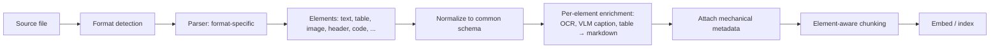
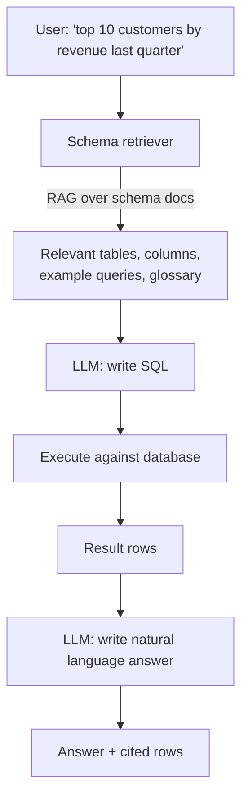
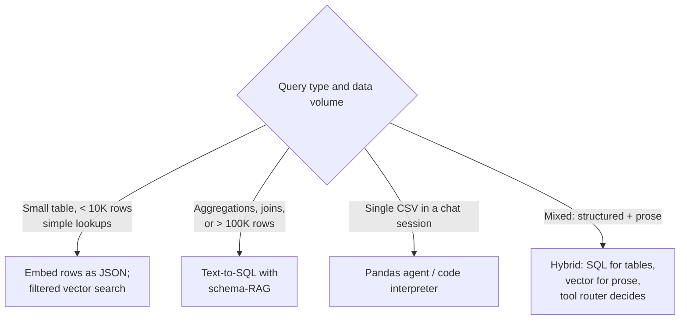
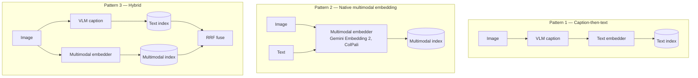

# Module 12 — Document Extraction & Structured Data RAG

> The 9 modules upstream assumed text was already in clean, embeddable form. In reality, **getting text out of source documents is half the project.** And some "documents" — Excel, CSV, SQL tables — shouldn't be embedded at all.

---

## Part 1 — The extraction problem

### Why this is harder than people expect

A "document" in the wild is not a string. It's:
- A 200-page PDF with a 3-column layout, footnotes, embedded tables, and a few scanned pages.
- A PowerPoint deck where 80% of the meaning is in the chart on slide 12, not the bullets.
- A spreadsheet with merged cells and named ranges across multiple sheets.
- A web page with 60% navigation chrome and 40% actual content.
- An email thread with quoted-reply chains and embedded image attachments.
- A code file where the structure (imports, classes, functions) is the meaning.

If you feed any of these straight into `embed()`, you get garbage in, garbage out. **Most "RAG quality issues" trace back to the parser, not the embedder.**

### The extraction pipeline

The output is not "a document split into chunks"; it's "a typed list of elements" each carrying its own role and metadata. A table is not a paragraph.

### The 2026 parser landscape

| Tool | Type | Strengths | Cost / latency |
|------|------|-----------|----------------|
| **Unstructured** | Open + SaaS | "ETL for LLMs"; 50+ source formats; strong element-typing; preserves provenance | Free OSS / paid SaaS; ~1-3s per page in Hi-Res mode |
| **LlamaParse** | SaaS (LlamaIndex) | Multi-column awareness; tight LlamaIndex integration; agentic mode for complex docs | ~$0.003-$0.09/page depending on tier |
| **Docling** (IBM) | Open | Strong layout analysis, reading-order reconstruction, table structure recognition; runs locally | Free; CPU-friendly |
| **Mistral OCR** | API | VLM-based; multilingual; tables, equations, LaTeX; markdown-first output | $0.001/page (batch) |
| **Reducto** | SaaS | High-accuracy parsing; pre-trained on financial / legal | Premium |
| **AWS Textract** | API | OCR + forms + tables; AWS-integrated | $0.0015-$0.05/page |
| **Azure Document Intelligence** | API | OCR + layout + custom models; structured data extraction | $0.001-$0.05/page |
| **Google Document AI** | API | OCR + form parser + custom processors | $0.001-$0.05/page |
| **PyMuPDF / pdfplumber / pdfminer** | Open libs | Free, code-only; basic text extraction | Free; fast on simple PDFs |
| **PyMuPDF4LLM** | Open lib | Markdown-first PyMuPDF wrapper; free; fast | Free |
| **Adobe PDF Extract** | API | High-quality structure extraction | Premium |

**Default starting choices (early 2026):**
- **Have a budget, want quality:** LlamaParse Premium / Reducto / Mistral OCR
- **Self-host required:** Docling or PyMuPDF4LLM
- **AWS / Azure / GCP shop:** the cloud-native parser of your provider
- **Production at scale, mixed corpus:** Unstructured (most parser-agnostic; handles many formats from one library)

---

## Part 2 — The hard formats, format by format

### PDFs — the boss fight

PDFs are the hardest because PDF was designed for printing, not for content. There's no inherent "this is a heading," "this is a footnote," "this row goes in this column" — these have to be inferred.

**Failure modes you will hit:**

| Symptom | Cause | Fix |
|---------|-------|-----|
| Two-column text reads as interleaved gibberish | Naïve parser reads in PDF stream order, not visual order | Layout-aware parser (Docling, LlamaParse, OpenDataLoader's XY-Cut++) |
| Table comes out as a paragraph | Parser doesn't recognize the table | Specialized table extraction (Camelot, Tabula, Docling, LlamaParse) |
| Image / chart vanishes | Parser dropped non-text elements | VLM-based parsing (Mistral OCR, Gemini Vision); caption images |
| Scanned PDF returns empty | No extractable text — needs OCR | OCR layer (Tesseract, AWS Textract, Mistral OCR, Azure DI) |
| Headers/footers pollute every chunk | Parser doesn't strip running headers | Element-aware parser (Unstructured tags `Header`/`Footer`) |
| Math / equations garbled | Standard text extraction can't handle LaTeX | Mistral OCR, Marker, math-aware extractors |

**Tables-in-PDF is its own subproblem:**
- Render-aware table extraction (Camelot, Tabula, Docling) for vector PDFs.
- VLM extraction (Gemini, Claude vision, Mistral OCR) for scanned or visually complex tables.
- **OpenDataLoader achieves 0.928 table accuracy** on 200 real-world PDFs across multi-column / scientific layouts.
- **Firecrawl's Fire-PDF** spends up to 25s of compute on complex tables — accept the latency, the alternative is wrong rows.

**Treatment of extracted tables:**
- Convert to markdown or HTML — preserves structure better than CSV in chunked text.
- Generate an LLM-summary of the table for retrieval.
- Index the table as **its own element** (don't merge into surrounding paragraphs).

### PPTX — slide as image, not as bullets

PowerPoint has bullet text, but the meaningful part of a slide is often a chart, diagram, or image. Parser strategy:

1. **Extract bullets, titles, speaker notes** as text.
2. **Treat each slide as an image** (PNG render); pass through VLM to caption.
3. **Index BOTH** the text content and the VLM caption, plus a slide thumbnail in metadata.
4. **For decks where the chart is the message**: ColPali-style late interaction over slide images is genuinely strong — see [Module 6](06_reranking.md) for ColPali / ColQwen.

Slide 12 has a chart of revenue by region that the bullets just say "Q4 highlights." Without the VLM step, the chart's content is lost forever.

### DOCX, ODT, RTF

Easier than PDF — they're structured. Use:
- **`python-docx`** for direct field access (headings, tables, comments, tracked changes).
- **Pandoc** as a universal converter to Markdown.
- Unstructured / Docling handle these well.

Watch for: tracked changes (preserve or strip?), embedded comments, footnotes, headers/footers, embedded images.

### HTML / Web pages

The challenge: 60% of an HTML page is navigation, sidebar, footer, ads. You need **boilerplate removal**.

| Tool | Approach |
|------|----------|
| **BeautifulSoup** | Manual selector-based extraction; flexible but custom per site |
| **trafilatura** | Open-source, ML-based main-content extraction; fast |
| **readability-lxml** | Mozilla's reader-mode algorithm |
| **Firecrawl** / **Jina Reader** | API-based; clean markdown output |
| **Unstructured** | Built-in HTML cleaner |

**Don't forget structured data**: HTML pages often carry `application/ld+json` blocks (schema.org, microdata) with the actual structured facts (product price, article author, publish date). Extract that — it's better than trying to find it in the rendered text.

### Images (standalone)

Two paths:

1. **OCR-then-text**: Tesseract (open), Azure DI, AWS Textract, Mistral OCR. Output is text → standard RAG.
2. **VLM-then-caption-or-embed**: send image to Claude / GPT-4V / Gemini, get a description; embed the description. OR use a multimodal embedder (Gemini Embedding 2, ColPali) and skip the caption.

For RAG-over-screenshots: VLM-caption + multimodal-embed BOTH and reciprocal-rank-fuse.

### Audio / video

Whisper (OpenAI), Deepgram, AssemblyAI, Distil-Whisper for transcription. Then standard text RAG, with **timecode metadata** so you can cite back to a specific second.

For long content, segment by speaker turn or by topic-shift, not by fixed-length windows.

### Email (.eml, .msg)

- Strip quoted-reply chains (or thread-aware indexing).
- Preserve sender / recipient / date as metadata.
- Handle attachments recursively (a PDF attached to an email is a separate parse).

### JSON / YAML / config files

Most projects shouldn't embed these as text. They're already structured — query them as data, not as documents. (See Part 3.)

If you *do* want them retrievable: chunk by top-level key, attach the path as metadata, embed key + value text.

### Code files (.py, .js, .ts, .go, ...)

Covered in [Module 10](10_code_metadata_routing.md). Short version: AST-aware chunking via tree-sitter, code-specialized embedder (`voyage-code-3`), and route many queries to grep instead of vectors.

---

## Part 3 — Structured data: when NOT to embed

This is the part of your question I want to answer carefully.

### The problem with embedding spreadsheets

You have an Excel file: 50 columns, 100,000 rows of customer transactions. Naïve approach: chunk into rows or row-groups, convert each row to a string ("customer_id=42, amount=159.99, date=2024-11-12, ..."), embed.

**Why this fails:**

1. **Embedding distorts numerical relationships.** Cosine similarity between `amount=159.99` and `amount=160.01` is meaningful as numbers, meaningless as embeddings.
2. **Aggregations are impossible.** "Total revenue last quarter" requires SUM. Vector retrieval returns the closest single row, not an aggregate.
3. **Filters are awkward.** "Customers in Texas with >$10K revenue" is trivial as SQL. As filtered vector search, it works on 10-50 candidates and dies past that.
4. **Cost explosion.** 100K rows × $0.02/1M tokens = small. 100M rows = real money. And you re-embed every time the data changes.
5. **No transactional consistency.** Embed at 9am, data updates at 10am, you're now serving stale answers.

### The right answer: text-to-SQL (or text-to-Pandas) with RAG-over-schema

**What gets embedded:**
- Table descriptions ("the `transactions` table holds...").
- Column descriptions and units ("`amount` is in USD, post-tax").
- Example queries ("How to compute MoM growth").
- Glossary terms ("ARR = annualized recurring revenue").

**What does NOT get embedded:**
- The data itself.

The vector store helps the LLM **find the right tables and columns**; the actual querying happens in SQL where it belongs.

### The 2025-2026 toolset

| Tool | Notes |
|------|-------|
| **Vanna AI** | Open-source RAG-for-SQL. Stores schema, example queries, documentation as a vector index; LLM uses it to write SQL. Vanna 2.0 is agent-based. |
| **LangChain SQL agent** | `create_sql_agent` — agent introspects DB, tries queries, self-corrects. |
| **LlamaIndex `NLSQLTableQueryEngine`** | LlamaIndex's structured retrieval; with table embeddings and join awareness. |
| **DSPy text-to-SQL** | Compiled programs for SQL generation; better quality, more complex. |
| **AWS Bedrock + Claude** | Reference architecture: Bedrock + Claude Sonnet + RAG over schema → SQL on Athena. |
| **Snowflake Cortex Analyst, BigQuery Gemini, Databricks Genie** | Vendor-native text-to-SQL bolted onto the warehouse. |

### When to use which structured-data pattern

### Tables inside documents (the hybrid case)

Common scenario: a 50-page financial report has 10 tables embedded among prose. You want answers from BOTH the prose ("the strategy section says ...") AND the tables ("revenue rose 14% YoY").

The right pipeline:

1. **Element-aware extraction** — separate prose paragraphs from tables.
2. **For each table:** generate a markdown rendering AND an LLM summary.
3. **Index three things per table:**
   - Markdown rendering (for the LLM to read at answer time).
   - LLM summary (sharp, topical — for retrieval).
   - Optionally: an embedding of the column headers + any caption/footnote.
4. **At query time:** route. If the LLM detects a query that requires aggregation ("what's the total..."), it can either (a) call a code-interpreter tool over the markdown table, or (b) execute SQL if the table has been loaded into a structured store.

### Anti-pattern: "I'll just embed the JSON"

Treating every blob of structured data as text-to-embed is the most common mistake in real RAG systems. If your data has rows, columns, types, units, foreign keys, or aggregations — that structure is gold. Throwing it into an embedding loses it for no benefit.

The litmus test:

> **Could a SQL engineer answer this question more naturally with a query than with a paragraph?**
>
> If yes, your retrieval should produce a SQL query, not a paragraph.

---

## Part 4 — Multimodal RAG quick reference

A natural extension once you're parsing images / charts / PDFs as visuals.

### Three architectural patterns

### State of the art (early 2026)

- **Gemini Embedding 2** (March 2026) — first natively multimodal embedding from Google. Single 3072-dim space across text, image, video, audio, PDFs. MTEB English 68.32, video retrieval 68.8.
- **Qwen3-VL-2B** — open multimodal embedder; 0.945 cross-modal retrieval (vs. Gemini's 0.928 on the same benchmark) thanks to a smaller "modality gap" (0.25 vs 0.73). Apache-licensed.
- **ColPali / ColQwen** — late-interaction over image patches, [Module 6](06_reranking.md).
- **CLIP / OpenCLIP** — original multimodal foundation; still useful for image-only tasks.
- **Voyage Multimodal 3.5** — solid alternative API.

For mixed text-and-visual corpora, Gemini Embedding 2 collapses what used to be a stitched stack (CLIP + Whisper + text-embedding) into one API call.

---

## Sanity check

1. Why is PDF the "boss fight" of document extraction? Name two specific failure modes and a fix for each.
2. A user asks a chatbot questions over a PowerPoint deck where slide 12 has a critical chart. What extraction pipeline would NOT lose the chart's information?
3. You're given an Excel file with 200K rows of transactions. Defend why you would NOT embed every row.
4. Name the right pattern for "Top 10 customers by revenue last quarter" and walk through what gets embedded vs. what gets queried.
5. A 50-page financial report has 10 tables embedded in prose. Outline an indexing strategy that lets the LLM answer questions over both prose and tables.
6. When is "caption-then-text" multimodal RAG enough, and when do you need a true multimodal embedder?

---

## References

- LlamaIndex — [Best Document Parsing Software](https://www.llamaindex.ai/insights/best-document-parsing-software)
- Reducto — [Document Parser Comparison](https://llms.reducto.ai/document-parser-comparison)
- Procycons — [PDF Data Extraction Benchmark 2025](https://procycons.com/en/blogs/pdf-data-extraction-benchmark/)
- Mistral OCR — [mistral.ai/news/mistral-ocr](https://mistral.ai/news/mistral-ocr)
- Docling — [github.com/DS4SD/docling](https://github.com/DS4SD/docling)
- Unstructured — [unstructured.io](https://unstructured.io)
- Vanna AI — [github.com/vanna-ai/vanna](https://github.com/vanna-ai/vanna)
- LangChain — [SQL Q&A tutorial](https://python.langchain.com/docs/tutorials/sql_qa)
- Google — [Gemini Embedding 2](https://blog.google/innovation-and-ai/models-and-research/gemini-models/gemini-embedding-2/)
- OpenDataLoader — [github.com/opendataloader-project/opendataloader-pdf](https://github.com/opendataloader-project/opendataloader-pdf)

---

**Back to:** [README](README.md) | [FACTS.md](FACTS.md)

**Next** [Evaluation, methodology, Statistics](13a_eval_methodology_statistics.md)

**TOC** [Table of Contents](00_Table_Of_Contents.md)