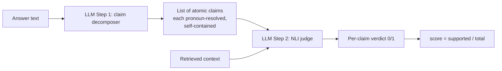
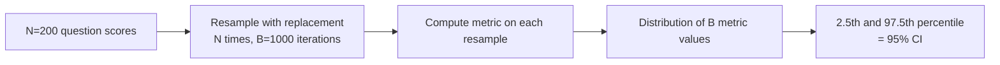
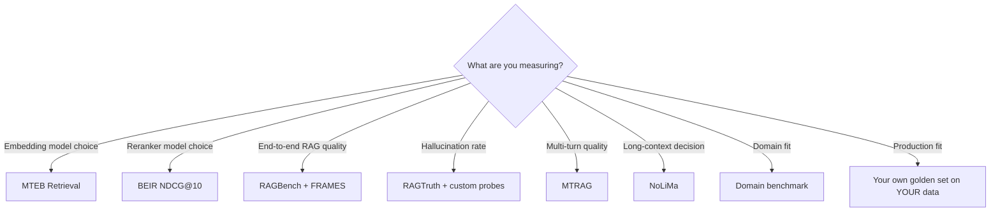
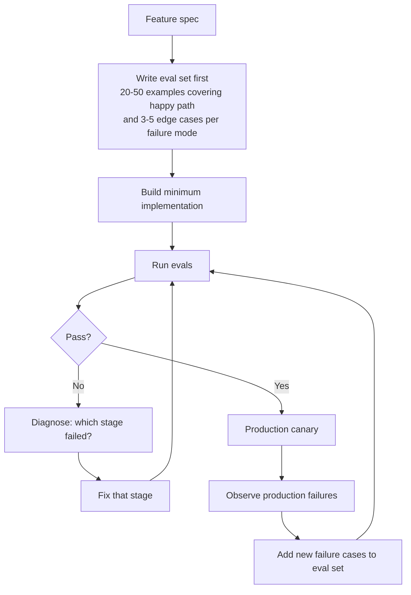

# Module 13A — Evaluation: Methodology & Statistics

> Module 8 introduced the eval *triad*. This module is about the **how** — how Ragas actually computes faithfulness, why "0.81 vs 0.84" is usually meaningless, and which benchmarks tell you what.
>
> Read this module before doing any serious A/B test or interview prep.

---

## Part 1 — How LLM-as-judge actually works

You've seen the metrics. Now look inside one.

### Ragas faithfulness, decompiled

Ragas faithfulness is presented as "does the answer follow from the context?" Internally it's a **two-step LLM pipeline**:



**Step 1 — claim decomposition.** A prompt like:
> "Break the following answer into atomic, self-contained statements. Each statement should be understandable on its own (no pronouns referring to other statements). Output JSON list."

Input: `"The 401(k) match is 100% up to 4%, and it vests over 3 years."`
Output:
```json
[
  "The 401(k) match is 100% up to 4%.",
  "The 401(k) match vests over 3 years."
]
```

**Step 2 — NLI verification.** For each claim, prompt the judge:
> "Given the context, is this statement entailed? Return 1 (yes) or 0 (no). Statement: ... Context: ..."

Score = supported claims / total claims.

### What this means in practice

Several non-obvious consequences:

1. **The judge is an LLM.** Its biases and errors are baked into your "metric." Faithfulness 0.85 with GPT-4-judge ≠ faithfulness 0.85 with Claude-judge. They don't agree at the statement level.
2. **Claim decomposition itself is flaky.** Long-winded answers decompose into many claims; terse answers into few. A 5-claim answer with 1 unsupported scores 0.80; a 1-claim terse answer scores 0/1 = 0.00 for the same factual error.
3. **Compound claims hide errors.** "The match is 100% up to 4% and vests over 3 years" might decompose into ONE claim if the decomposer is sloppy, masking a partial error.
4. **Cost compounds.** N claims × M chunks of context = N·M judge calls per answer. A 100-question eval with avg 6 claims and 8 context chunks = 4800 judge LLM calls.

### DeepEval's faithfulness — different algorithm, different scores

DeepEval breaks the answer into "truths" and checks for **contradictions** with the context (not strict entailment). More forgiving on paraphrase, less forgiving on misleading omissions. Same answer, same context — Ragas might score 0.95, DeepEval 0.71. Neither is "wrong"; they measure different things.

**Lesson:** when reporting eval scores, name the framework AND the judge model AND the version. "Faithfulness 0.85" with no provenance is not a number.

---

## Part 2 — LLM-as-judge biases (the literature)

Cited paper: **Zheng et al. 2023, "Judging LLM-as-a-Judge with MT-Bench and Chatbot Arena"** (arXiv:2306.05685, NeurIPS '23). The reference work.

### Position bias

Most LLM judges favor whichever answer they see *first* in pairwise comparisons.
- All judges except GPT-4 show strong position bias.
- GPT-4 outputs consistent results in only ~60% of pairs when sides are swapped.
- **Mitigation:** evaluate both orderings (A-vs-B and B-vs-A), score both, only declare a winner when both agree.

### Verbosity bias

LLM judges over-prefer longer responses, even when longer is worse.
- All LLMs show this; GPT-4-class models defend better than smaller ones.
- **Mitigation:** explicit rubric; length-normalized scoring; penalize unsupported padding.

### Self-preference / self-enhancement bias

LLMs systematically prefer outputs from **the same model family** (GPT-4 favors GPT-4; Claude favors Claude). Linked to **self-recognition** — models can identify their own outputs.
- **Mitigation:** never use the same model as both generator and judge. Use a different family.

### Style bias

Judges over-reward confident tone, structured formatting (bullets), and "expert-sounding" phrasing.
- **Mitigation:** rubric anchoring on factual content, not presentation.

### Limited reasoning

LLM judges struggle on math, code correctness, multi-hop logic — i.e., the same things LLMs struggle with as generators.
- **Mitigation:** for hard reasoning tasks, fall back to executable checks (run the code, evaluate the math), not LLM judgment.

### Mitigation stack — what actually works

A 2025 systematic study (arXiv:2604.23178) compared 9 debiasing strategies across 5 judges:

| Strategy | What it does | Effectiveness |
|----------|-------------|---------------|
| **Position swap (A↔B)** | Score both orderings, take agreement | High — first defense |
| **Multi-judge ensemble** | Run N judges, majority vote | Medium — averages out individual biases |
| **Calibrated rubrics** | Give detailed rubric with anchors | High — when rubric is good |
| **Chain-of-thought prompting** | Force judge to reason before scoring | Medium — sometimes hurts via over-explanation |
| **Minority-veto ensemble** | Any judge labeling "invalid" overrides | High — strong for safety / hallucination |
| **Cross-family judges** | Judge from different family than generator | High — directly fixes self-preference |
| **Reference-based scoring** | Compare to a known good answer | High — when references exist |
| **Pairwise instead of pointwise** | Compare two answers vs scoring one | Medium — reduces absolute-value drift |
| **Calibrated scoring with logits** | Use judge's token probabilities, not just label | Medium — needs API access |

**Practical default for production eval:** position-swap + cross-family judge + rubric. Adds cost, removes most bias.

---

## Part 3 — Statistical rigor: when is a score difference real?

The single most common eval mistake: ship a pipeline change because "Ragas faithfulness went from 0.81 to 0.84" — when 0.84 is well within the noise of running the eval again.

### Variance sources you must reckon with

1. **Sampling variance** — different eval set draws produce different scores.
2. **Judge variance** — same judge, same input, different runs produce different verdicts (LLMs are non-deterministic).
3. **Decomposition variance** — Ragas-style claim decomposition isn't stable across runs.
4. **Eval-set bias** — if your eval set was synthetically generated by the same LLM family, scores are inflated.

### Sample size — what you actually need

| Stake | Eval set size | Bootstrap iterations |
|-------|--------------|---------------------|
| Hackathon / weekend prototype | 20-50 | none — manual review |
| Internal tooling | 100-200 | 100 |
| Customer-facing product | 500+ | 500 |
| High-stakes (medical, legal, safety) | 1000+ | 1000+ |

**Key research finding (2025, "Don't Use the CLT in LLM Evals With Fewer Than a Few Hundred"):** the Central Limit Theorem assumption that your sample mean is normally distributed breaks below ~200 samples. For small evals, **use bootstrap, not t-tests.**

### Bootstrap confidence intervals — the correct tool



For two pipelines A and B:
- Compute 95% CI for each.
- **If CIs don't overlap** → strong evidence A ≠ B.
- If CIs overlap → no evidence of difference. **Don't ship the change based on this alone.**

### A worked example (run it in your head)

Pipeline A: faithfulness 0.81 with 95% CI [0.76, 0.86] over 200 questions.
Pipeline B: faithfulness 0.84 with 95% CI [0.79, 0.89] over 200 questions.

CIs overlap heavily. The 0.03 absolute difference is well inside noise. **You haven't proven anything.**

To prove a 0.03 lift at 95% confidence, you'd need ~400-500 questions, OR you'd need to use a paired test (same questions on both pipelines, measure per-question delta — much more powerful).

### Independence violations — the silent killer

LLM evals routinely violate the assumption that questions are independent. Examples:
- Reading comprehension where 5 questions all reference the same passage.
- Synthetic eval where all questions came from the same generator prompt.
- A/B test where the *same user* asks both versions of your bot 10 questions.

**Effect:** standard errors are *underestimated*. You think your 95% CI is [0.79, 0.89] but it's actually [0.74, 0.94]. Your "significant" result was noise.

**Fix:** cluster-aware resampling (bootstrap *clusters* of dependent questions, not individual questions).

### Inter-annotator / inter-judge agreement

When you have multiple humans rating, or multiple judges, measure agreement — disagreement reveals where your rubric or task is ambiguous.

| Metric | When to use |
|--------|-------------|
| **Cohen's Kappa** | 2 raters, categorical labels |
| **Fleiss' Kappa** | 3+ raters, categorical |
| **Krippendorff's Alpha** | Any number of raters, any data type, handles missing values — Google uses this |
| **Gwet's AC** | When category prevalence is skewed; Meta uses this |

Rough interpretation:
- κ > 0.8 — high agreement, rubric is sharp
- κ 0.6-0.8 — substantial; usable
- κ 0.4-0.6 — moderate; rubric needs work
- κ < 0.4 — poor; the task itself is probably under-defined

In LLM eval, expect agreement on **dataset annotation** to run higher than agreement on **model evaluation** (subjective judgments lower IAA).

---

## Part 4 — The benchmark zoo

Most teams quote "we eval on BEIR" or "MTEB scores 65" without articulating what those measure. Here's the actual landscape, organized by what each benchmark is good for.

### Pure retrieval (no generation)

| Benchmark | Year | Domain | Metric | What it tests |
|-----------|------|--------|--------|---------------|
| **MS-MARCO** | 2018 | Web (Bing) queries | MRR@10 | Single-passage relevance, English web. Closest to "in-distribution" for English search. |
| **TREC-DL** | 2019- | Web | NDCG@10, MAP | Annual track; the IR field's gold standard. Small, expert-labeled. |
| **BEIR** | 2021 | 18 domains (bio, legal, scientific, ...) | NDCG@10 | **Zero-shot generalization.** Most-cited reranker benchmark. |
| **MTEB Retrieval** | 2022 | 15 datasets, overlaps BEIR | NDCG@10 | The default leaderboard for embedders. |

### Multi-hop / reasoning retrieval

| Benchmark | Year | Tests |
|-----------|------|-------|
| **HotpotQA** | 2018 | 2-hop reasoning across 2 Wikipedia articles |
| **MultiHop-RAG** | 2024 | Multi-hop over news; tests retrieve-then-reason |
| **MuSiQue** | 2022 | Composed multi-step questions |

### End-to-end RAG

| Benchmark | Year | Notable for |
|-----------|------|-------------|
| **KILT** | 2021 | 11 knowledge-intensive tasks (QA, fact verification, slot filling, dialogue). Tests retrieval + generation jointly. |
| **Natural Questions (NQ)** | 2019 | Real Google queries with Wikipedia answers. Single-fact lookup default. |
| **RAGBench** | 2024 | **100K examples, industry corpora.** TRACe metric framework (truth, relevance, accuracy, completeness, explainability). Strong industry alignment. |
| **RAGTruth** | 2024 | **Word-level hallucination annotation** on 18K LLM responses — the canonical hallucination-detection training/eval set. |
| **MTRAG** | 2024 | Multi-turn RAG; recall@5 0.89 → 0.47 across turns benchmark. |
| **FRAMES** (Google) | Sept 2024 | **824 hard multi-hop questions, 2-15 Wiki articles each.** Single-step methods 0.40 acc; multi-step 0.66; oracle 0.73. The "is your RAG pipeline really good?" benchmark. |

### Long-context / needle

| Benchmark | Year | Insight |
|-----------|------|---------|
| **NIAH (single needle)** | 2023 | Find one fact in a long context. Easy; saturated. |
| **NoLiMa** | Feb 2025 | **Long context with minimal lexical overlap** — must infer connections. GPT-4o drops 99.3% (1K) → 69.7% (32K). The honest long-context test. |
| **BABILong** | 2024 | Bench-suite-of-bench reasoning over very long contexts |

### Domain-specific

| Benchmark | Domain |
|-----------|--------|
| **MedQA, MIMIC-CDR** | Medical |
| **LegalBench, CaseHOLD** | Legal |
| **FinQA, TAT-QA** | Financial |
| **HumanEval, SWE-Bench** | Code generation/repair |
| **DSTC** | Dialogue/customer support |
| **BIRD** | Text-to-SQL |

### How to actually use this zoo

**Don't try to score on all of them.** Pick by need:



**The most important number is your own.** Public benchmarks tell you which models *generally* work. They do not tell you which works on **your corpus, your queries, your users.** That's what your golden set is for.

### State of the leaderboards (early 2026)

- **MTEB Retrieval:** Gemini Embedding 2 (~67.71), Voyage 4 Large, NV-Embed-v2.
- **BEIR NDCG@10:** Jina Reranker v3 (61.94 — best reranker); embedders trail.
- **FRAMES:** multi-step RAG (~0.66) > single-step (~0.40); oracle ceiling 0.73.
- **NoLiMa 32K:** GPT-4o 69.7% (down from 99.3% at 1K) — long-context degradation is real.

(Numbers shift quarterly. Re-verify when quoting in writing — see FACTS.md "Last verified" dates.)

---

## Part 5 — Calibration across domains

Faithfulness 0.85 in marketing copy ≠ faithfulness 0.85 in medical advice. The same number means different things in different domains because:

1. The **base rate** of "supported claims" varies. Medical text is dense in specific claims; marketing is full of vague generalities (which trivially "follow" from anything).
2. The **judge's domain knowledge** varies. A general-purpose judge may not catch a subtle medical contradiction.
3. The **stakes** mean the threshold for "good enough" differs.

### Calibration techniques

- **Domain-fine-tuned judge.** Use a medical-trained judge for medical eval; legal-trained for legal.
- **Anchor with golden examples.** Provide the judge with 3-5 anchor pairs of (answer, score) before scoring new ones.
- **Per-domain thresholds.** Don't use 0.8-as-production-bar globally. Calibrate per domain on your own data.
- **Triangulate.** Combine LLM-judge + structured checks (regex, NLI model) + human spot-check.

---

## Part 6 — Eval-driven development methodology

Most teams ship code, then write evals when something breaks. Mature teams ship **evals first**, then write code that satisfies them. The Anthropic-canonical pattern.

### The flow



### Eval-as-code patterns

Treat evals like unit tests:

```python
# Pseudo-code
def test_refund_policy_question_returns_correct_year():
    answer = pipeline.run("What's our refund policy for Q4 2024?")
    eval = ragas.evaluate(
        answer,
        ground_truth_chunks=GOLDEN_CHUNKS["refund_q4_2024"]
    )
    assert eval.context_recall > 0.85
    assert eval.faithfulness > 0.9
    assert "Q4 2024" in answer.text  # structural check
```

- Evals run in CI as a quality gate.
- Failed evals block deploys.
- Each production failure is a test added to the eval set.

### Cost-of-eval economics

Running 500-question Ragas eval on every PR:
- 500 questions × ~6 claims × 2 LLM calls (decompose + judge) = 6,000 LLM calls.
- At $0.001/call (cheap judge): **$6 per CI run.** Manageable.
- At $0.01/call (GPT-4-class): **$60 per CI run.** Adds up fast.

**Optimizations:**
- Cache judge calls keyed on (claim, context_hash) — most claims persist across runs.
- Sample: run 50/500 on every PR; full 500 nightly.
- Tiered judges: cheap judge for fast feedback; expensive judge for nightly truth.
- Smaller dedicated judge model (Mistral-7B-judge or fine-tuned) for routine work.

---

## Part 7 — Component vs end-to-end eval

A failed answer can come from many places. Per-stage evals localize.

```mermaid
flowchart LR
    subgraph Stage[Per-stage evals]
        S1[Retrieval:<br/>Recall@k, NDCG@k]
        S2[Reranker:<br/>NDCG@10, win-rate]
        S3[Generation:<br/>faithfulness given context]
        S4[Routing:<br/>tool-call accuracy]
    end
    subgraph E2E[End-to-end evals]
        EE[Answer accuracy<br/>vs golden]
        EU[User-facing quality]
    end
    Stage --> E2E
```

**Per-stage evals:** fast, localized, easy to interpret, cheap. Run on every PR.
**End-to-end evals:** slow, hard to interpret causally, expensive. Run nightly.

A team that runs only end-to-end evals knows when something broke; they don't know what broke. A team running only per-stage evals has component metrics that look great while the end-to-end product is worse than the previous version.

**Run both. Different cadences. Different audiences.**

---

## Sanity check

1. Walk through how Ragas computes faithfulness. Why are scores not directly comparable to DeepEval's?
2. What's "self-preference bias" and what's the standard mitigation?
3. You ran your eval and got Ragas 0.81 → 0.84 on a 100-question set. Should you ship the change? Why or why not?
4. Why is the CLT a poor assumption for evals under 200 samples? What do you use instead?
5. You're picking a benchmark. Use case: "we want to know if our reranker upgrade is real." Which benchmark do you reach for?
6. Your team runs only end-to-end evals. What's the operational cost of that choice?
7. RAGTruth is annotated at what level of granularity, and why does that matter?

---

## References

- Zheng et al. 2023 — [Judging LLM-as-a-Judge with MT-Bench and Chatbot Arena](https://arxiv.org/abs/2306.05685) (NeurIPS '23)
- Ragas — [Faithfulness algorithm docs](https://docs.ragas.io/en/stable/concepts/metrics/available_metrics/faithfulness/)
- Anthropic — [Building evals](https://docs.anthropic.com/en/docs/build-with-claude/develop-tests)
- 2025 — [Don't Use the CLT in LLM Evals With Fewer Than a Few Hundred](https://arxiv.org/abs/2503.01747)
- 2025 — [Judging the Judges: Bias Mitigation Strategies](https://arxiv.org/abs/2604.23178)
- BEIR — [github.com/beir-cellar/beir](https://github.com/beir-cellar/beir)
- RAGBench — [arXiv:2407.11005](https://arxiv.org/abs/2407.11005)
- RAGTruth — [github.com/ParticleMedia/RAGTruth](https://github.com/ParticleMedia/RAGTruth)
- FRAMES — [Google Releases FRAMES (MarkTechPost)](https://www.marktechpost.com/2024/10/01/google-releases-frames-a-comprehensive-evaluation-dataset-designed-to-test-retrieval-augmented-generation-rag-applications-on-factuality-retrieval-accuracy-and-reasoning/)
- NoLiMa — [arXiv:2502.05167](https://arxiv.org/abs/2502.05167)
- MTEB — [huggingface.co/spaces/mteb/leaderboard](https://huggingface.co/spaces/mteb/leaderboard)
- LLMs-as-Judges Survey — [arXiv:2412.05579](https://arxiv.org/abs/2412.05579)
- Cameron Wolfe — [Applying Statistics to LLM Evaluations](https://cameronrwolfe.substack.com/p/stats-llm-evals)

---

**Next:** [Module 13B — Online & Human Evaluation](13b_eval_online_human.md)

**TOC** [Table of Contents](00_Table_Of_Contents.md)