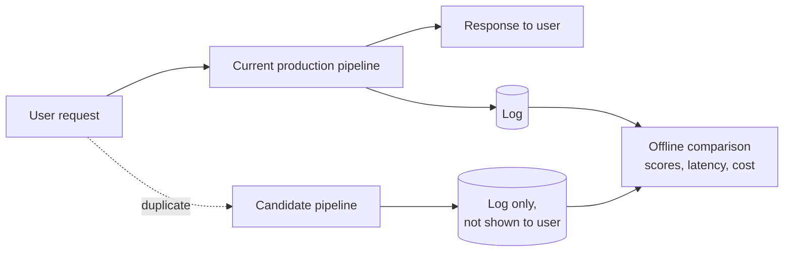
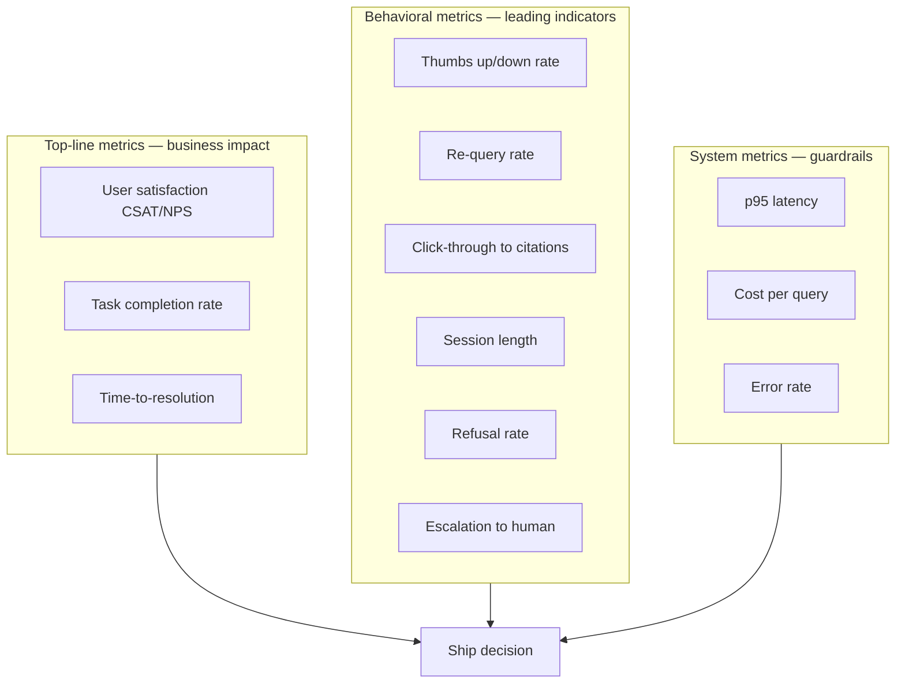
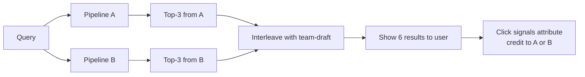
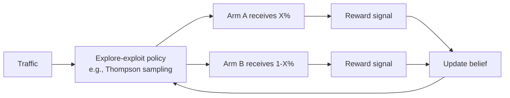
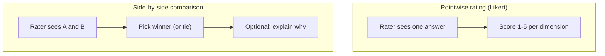
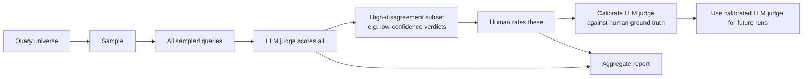
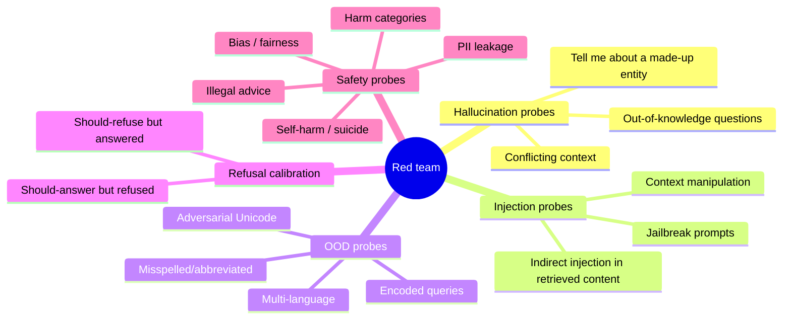
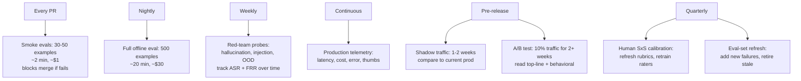

# Module 13B — Evaluation: Online & Human

> Module 13A measured RAG **offline**, against a static eval set. This module measures it **in production with real users**, and **with humans in the loop** when LLM-judges aren't enough.
>
> The big shift: offline tells you "is this change correct?"; online tells you "do users actually prefer it?" The two often disagree.

---

## Part 1 — Why offline isn't enough

A pipeline change can pass offline eval and still hurt users. Common reasons:

1. **Eval set drift.** Your golden set was built from yesterday's queries. Today's users ask different things.
2. **Synthetic-eval blind spots.** Generated questions skew easy and idiomatic; real users misspell, abbreviate, and ask in fragments.
3. **Latency regressions.** A higher Ragas score that took 2× as long isn't a win.
4. **User-perception ≠ correctness.** Two correct answers, one terse and one chatty — users prefer the chatty one even when it's identical info.
5. **Selection bias in offline.** You tested the queries you thought of. Users have queries you didn't.

Online eval catches this. Trade-off: it's slower (data accumulates over time), riskier (real users see the variant), and harder to interpret (more confounders).

---

## Part 2 — Shadow traffic: the safe first step

Before you let any user see a new pipeline, **mirror live traffic** to the candidate and compare offline.



What you measure during shadow:

| Signal | What you're checking |
|--------|----------------------|
| **Latency p50, p95, p99** | Did the candidate get slower? Tail matters most. |
| **Cost per query** | Tokens in, tokens out — is the candidate cheaper or pricier? |
| **Error rate** | Crashes, timeouts, parse failures, refusals. |
| **Output divergence** | What % of queries produce different answers? Drill into divergent ones. |
| **Eval scores on diverged queries** | Apply Ragas/DeepEval to the diverged subset. Is the candidate winning or losing? |

**Shadow catches things offline can't:** a real query distribution, real corpus state, real failure modes (rate limits, malformed inputs, weird Unicode, prompt injections that aren't in your golden set).

**Run shadow for a meaningful traffic window** — at least 1-2 days, ideally a week, so you cover weekend/weekday + diurnal patterns. Shadow is free (no user impact); err on more time, not less.

### What to do with shadow results

- **Equivalent or better on all metrics** → ready for A/B.
- **Worse on tail latency** → investigate before A/B.
- **Diverges on >5% of queries with mixed eval results** → dig into specific examples; don't ship blind.
- **Hits a class of queries you didn't know about** → first add those queries to your offline eval set, *then* iterate.

---

## Part 3 — A/B testing for RAG

Once shadow is clean, route a percentage of real traffic to the candidate.

### Experiment design — the metric layers



**Top-line** moves slowly; you'll need weeks for signal. **Behavioral** moves in days. **System** is real-time. Watch all three.

### Sample size & power

You need enough data to detect a meaningful difference at your chosen confidence level.

A rough sample-size formula for binary metrics (e.g., thumbs-up rate):

```
N per arm ≈ 16 · p · (1 − p) / Δ²
```

Example: baseline thumbs-up rate is 30% (p = 0.3). You want to detect a 3 percentage-point absolute lift (Δ = 0.03):
- N ≈ 16 · 0.3 · 0.7 / 0.0009 ≈ **3,700 observations per arm.**

For a less common metric (e.g., escalation rate at 5%), Δ of 0.5pp would require:
- N ≈ 16 · 0.05 · 0.95 / 0.000025 ≈ **30,400 per arm.**

**Practical rule:** small effects need lots of data. If your traffic is 1000 queries/day, a 50/50 split detecting a 3pp shift takes ~7-8 days; detecting a 1pp shift takes ~9-10 weeks.

### Interleaving — a more powerful design

Instead of split-by-user, **interleave** results from both pipelines for the same query. The user sees a merged result; you measure which side they engage with.



**Why interleaving wins:** every query yields signal from both arms. Statistical efficiency goes up ~10×. Standard in web search; under-used in RAG products. Works best when results are visibly listed (search-style interfaces); harder for chat-style.

### Risks specific to RAG A/B tests

1. **Sticky users.** Same user sees the same arm session-after-session. Their behavior is correlated. Cluster-by-user, not by-query.
2. **Novelty / aversion effects.** New pipelines may get a temporary lift (user attention) or drop (UI changes feel weird) that fades. Run A/B for at least 2 weeks before reading.
3. **Selection bias from gating.** If you only A/B users in cohort X, results don't generalize.
4. **Survivorship bias on feedback.** Only motivated users vote. A drop in thumbs-up could mean fewer satisfied users — or fewer dissatisfied users bothering to thumbs-down.
5. **Carryover effects.** A user's bad experience yesterday colors today's rating. Allow washout periods.

### Sequential testing & multi-armed bandits

Classical A/B tests fix sample size up front. **Sequential tests** (mSPRT, group sequential, always-valid p-values) let you peek at results and stop early when significance is reached, without inflating false-positive rates.

**Multi-armed bandits** go further: dynamically shift traffic toward the better-performing arm.



**Thompson sampling** (Bayesian; each arm has a posterior over its reward; sample from posteriors and assign traffic accordingly) is the production default for adaptive experimentation. Used by Vowpal Wabbit, VWO, internal stacks at most search/recsys teams.

**When to use which:**
- **Fixed A/B**: you want unbiased estimate; you'll use the result for a longer-term decision.
- **Sequential**: you want to stop early when confident.
- **MAB / Thompson**: you don't need a "decision" — you want to maximize cumulative reward while learning. Good for "which prompt template?" or "which reranker?" with many variants.

**Caution:** MAB optimizes short-term reward and can prematurely converge to a suboptimal arm if rewards are non-stationary or if there are large novelty/aversion effects. Mix MAB with periodic forced exploration.

---

## Part 4 — Human evaluation

LLM-judges can't catch everything. Some things demand a human: nuanced quality judgments, harm assessments, domain-specific correctness, regulatory sign-off.

### Two human-eval modes



**SxS is more reliable.** "Is A better than B" is easier and less drift-prone than "rate A from 1 to 5." Use SxS as the primary mechanism unless you specifically need absolute scores.

### Likert scale design — narrow beats wide

Counter-intuitive finding from 2025 research: **3-5 levels with explicit anchors beats 7-10 levels.**

Reason: humans (and LLM judges) exhibit **central tendency bias** — on a 1-7 scale, raters cluster on 3, 4, 5 and avoid 1, 2, 6, 7. The signal range collapses. Narrow scales force more deliberate choices.

**Good 5-point scale, anchored:**

| Score | Anchor |
|-------|--------|
| 5 | Excellent — fully accurate, addresses the question directly, well-supported by retrieved context. |
| 4 | Good — accurate with minor presentation issues; user would be satisfied. |
| 3 | Mediocre — partially accurate or omits key info; user would need to ask follow-up. |
| 2 | Poor — meaningfully wrong, confusing, or off-topic. |
| 1 | Harmful / dangerous — incorrect AND high-stakes; could cause harm if acted on. |

Add a worked example for each level. Without anchors, raters silently calibrate to their own scale and IAA collapses.

### Rubric design — analytic vs holistic

**Holistic:** one overall score. Easy, fast, low signal.

**Analytic:** separate scores per dimension. Higher signal, more time per rating.

| Dimension | Definition |
|-----------|-----------|
| **Accuracy** | Are the factual claims correct? |
| **Completeness** | Did the answer cover what was asked? |
| **Faithfulness** | Are claims supported by the retrieved context? |
| **Clarity** | Is the answer easy to read? |
| **Helpfulness** | Would the user actually use this? |
| **Safety** | Could the answer cause harm if acted on? |

For RAG products in regulated domains (healthcare), Accuracy + Faithfulness + Safety are non-negotiable. Add others as needed.

### Rater calibration

Without calibration, raters disagree wildly.

1. **Anchor examples:** hand out 5-10 examples per score level with explanations. New raters memorize them.
2. **Calibration round:** all raters score the same 30 examples. Compute pairwise Cohen's κ or Krippendorff's α. Raters with κ < 0.4 with the consensus need re-training (or removal).
3. **Periodic re-calibration:** every 2-4 weeks, re-run the calibration set. Drift happens.
4. **Track per-rater bias:** some raters are systematically harsh, others lenient. Subtract the per-rater mean if you want comparable scores.

### Inter-rater agreement targets (LLM eval)

| α / κ | Reading |
|-------|---------|
| > 0.8 | High — confident; rubric is sharp |
| 0.67-0.8 | Substantial — usable, treat tentatively |
| 0.4-0.67 | Moderate — rubric needs work |
| < 0.4 | Poor — task is under-defined or rubric ambiguous |

Use **Krippendorff's α** as default — it works with multiple raters, ordinal data, missing values. Google publishes with it; that's a tell.

### Human + LLM-judge — the cost-effective stack

Pure human eval is expensive. Pure LLM-judge has bias issues. The mature stack:



LLM-judge does volume; humans focus on the cases where the LLM-judge is uncertain or where stakes demand human sign-off.

---

## Part 5 — Adversarial / red-team evaluation

Standard eval measures performance on expected inputs. Red-team eval measures **robustness on adversarial inputs.**

### Categories of probe



### Hallucination probes specifically

For RAG, the gold-standard hallucination test:

1. **Out-of-knowledge questions.** Ask about something *not in your corpus*. The system should refuse or say "I don't know," not confabulate.
   - "What's our policy on X?" where X doesn't exist.
   - Track: refusal rate vs confabulation rate.
2. **Conflicting context.** Inject a corpus chunk that contradicts established fact. Does the system follow the corpus or its parametric knowledge?
3. **Trap chunks.** Plant subtly wrong information in retrievable chunks. Does the answer reproduce the error faithfully (RAG triad faithfulness = 1.0, but it's wrong)?
4. **Distraction.** Add many irrelevant chunks alongside one relevant one. Does the answer stay on-topic?

### Injection probes

- **Direct prompt injection:** "ignore prior instructions" in user queries.
- **Indirect injection** (the dangerous one): malicious instructions embedded in retrieved content. (Module 9 covers defenses.)
- **Tools to use:** Promptfoo (50+ attack plugins), DeepTeam (open red-team framework from Confident AI), Lakera Gandalf (gamified probes), Garak (NVIDIA), HarmBench, RedBench.

### Out-of-distribution probes

| Probe | What it catches |
|-------|-----------------|
| Multi-language input ("¿Cuál es la política de reembolsos?") | Does retrieval / generation handle non-English? |
| Misspellings / typos ("refnud poolicy") | Robustness of embedder / BM25 |
| Code-switching ("policy ka rules kya hai?") | Hindi-English mix, common in real users |
| Ultra-short queries ("refund?") | Underspecified intent handling |
| Ultra-long queries (paragraph-length) | Truncation, embedder limits |
| Encoded queries (base64, ROT13, leetspeak) | Sometimes attacks; sometimes accessibility |
| Adversarial Unicode (homoglyphs, RTL injection) | Security hygiene |

### Refusal calibration

Two failure modes:

- **False answer:** model should refuse but answers anyway (e.g., medical advice when out of scope).
- **False refusal:** model refuses when it should answer (frustrates real users; hurts CSAT).

Both are eval-able. **Attack Success Rate (ASR)** measures false answers on adversarial probes; **False Refusal Rate (FRR)** measures over-refusal on benign edge-case probes. You want **low ASR, low FRR**. Optimizing one in isolation degrades the other.

### Refusal-aware red-teaming (2025 research)

Recent work (EMNLP 2025) shows that current LLMs have inconsistent refusal behavior — they refuse one phrasing of a probe and answer a near-paraphrase. The "refusal probe" methodology generates many phrasings and measures the **refusal gap** between what the model refuses vs what an external safety evaluator says it should refuse.

**Implication for production:** don't trust your model's refusal behavior. Add an external classifier as a guardrail.

---

## Part 6 — Eval-program design (putting it together)

A mature RAG eval program is **layered**, with different cadences:



### Decision rights

Who can ship what:

| Change type | Required gate |
|-------------|--------------|
| Prompt tweak, no model change | Smoke eval pass + manual review of 10 samples |
| New embedder / reranker | Full offline eval + shadow traffic |
| Pipeline architecture change | Full offline + shadow + A/B |
| Anything in safety-critical (medical, legal, financial advice) | All of the above + human sign-off + red-team probes |

Bake the gates into CI/CD. "We forgot to run the eval" should not be physically possible.

---

## Sanity check

1. Why is shadow traffic the right first step before A/B testing a new pipeline?
2. You want to detect a 3pp lift on a 30% baseline thumbs-up rate. Roughly how many users per arm?
3. Why is interleaving more sample-efficient than user-bucket A/B?
4. Likert scale: 5-point or 10-point? Why?
5. What does Krippendorff's α measure, and what's an acceptable production threshold?
6. Define ASR and FRR. Why are both important?
7. Your model passes the standard eval set with flying colors but users complain about "made-up" answers. What's the diagnostic step?

---

## References

- Zheng et al. — [MT-Bench / Chatbot Arena (NeurIPS '23)](https://arxiv.org/abs/2306.05685)
- Refusal-Aware Red Teaming — [EMNLP 2025](https://aclanthology.org/2025.emnlp-main.49.pdf)
- Promptfoo — [Red Teaming docs](https://www.promptfoo.dev/docs/red-team/)
- DeepTeam (Confident AI) — [trydeepteam.com](https://www.trydeepteam.com/docs/what-is-llm-red-teaming)
- HarmBench, RedBench — public adversarial benchmarks
- Thompson Sampling tutorial — [SIGKDD 2024](https://dl.acm.org/doi/abs/10.1145/3637528.3671440)
- Krippendorff's Alpha — [Label Studio guide](https://labelstud.io/blog/how-to-use-krippendorff-s-alpha-to-measure-annotation-agreement/)
- Rubric-based LLM eval — [Adnan Masood writeup, 2026](https://medium.com/@adnanmasood/rubric-based-evals-llm-as-a-judge-methodologies-and-empirical-validation-in-domain-context-71936b989e80)
- Anthropic — [Build evals docs](https://docs.anthropic.com/en/docs/build-with-claude/develop-tests)

---

**Next:** [Module 13C — Production Observability & Operations](13c_eval_observability_ops.md)

**TOC** [Table of Contents](00_Table_Of_Contents.md)