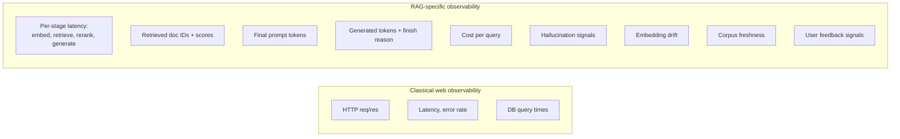
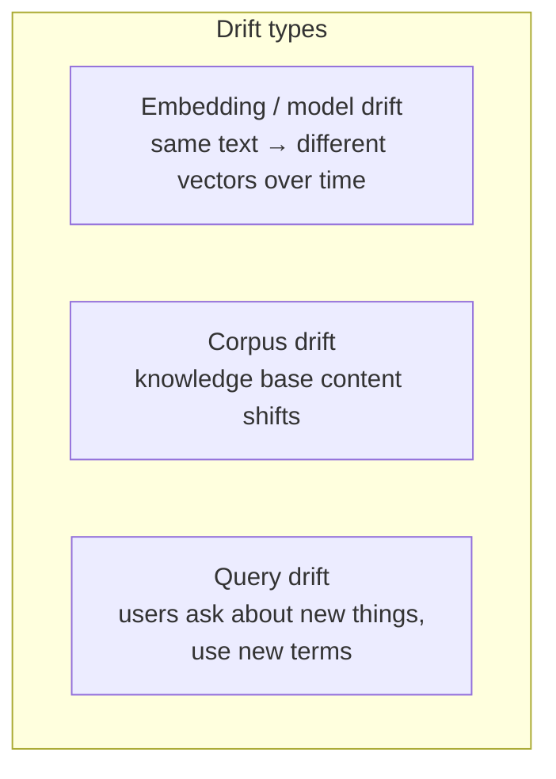
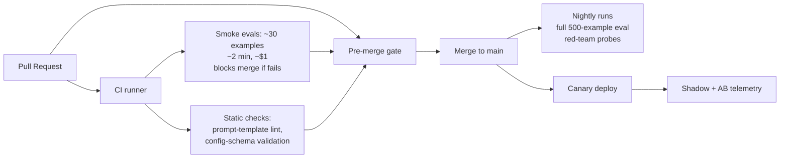
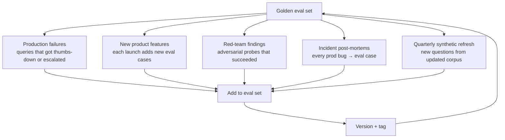

# Module 13C — Evaluation: Production Observability & Ops

> Modules 13A and 13B were about *measuring*. This module is about **operating** — how to instrument your production RAG so problems are visible before users complain, and how to keep eval working as the system evolves.

---

## Part 1 — Why RAG observability is different from app observability

A classic web service is "observable" when you have logs + metrics + traces of HTTP-level events. RAG adds layers that classical observability misses:



You need both. A classical APM tells you "p95 latency is up"; you need RAG-aware tooling to know **why** — was it embedder rate-limit? vector DB tail? a longer reranker batch? a retry on a 429?

---

## Part 2 — The instrumentation stack

### OpenTelemetry-LLM as the foundation

OpenTelemetry has emerged as the **vendor-neutral standard** for LLM tracing. Most modern observability platforms (Phoenix, Langfuse, Comet Opik) accept OTLP traces. Instrumenting once with OTel buys portability across vendors.

A RAG span tree looks like:

```
rag.query (root span)
├── rag.embed (model=voyage-3-large, ms=42)
├── rag.retrieve.dense (vector_db=pgvector, top_k=100, ms=18)
├── rag.retrieve.sparse (engine=postgres_fts, top_k=100, ms=22)
├── rag.fusion.rrf (k=60, ms=3)
├── rag.rerank (model=cohere-v4-pro, in=100, out=10, ms=210)
├── rag.prompt.assemble (tokens=4523, ms=4)
└── rag.generate (model=claude-sonnet-4-6, in_tokens=4523, out_tokens=287, ms=890)
```

Each span carries attributes (model name, params, inputs, outputs, costs). The trace tree shows you the critical path; per-span attributes let you drill into any single stage.

### What to log per query (the minimum viable set)

```yaml
trace_id: abc-123
user_id: <hashed>  # for cohorting; never raw PII
timestamp: 2026-05-10T14:00:00Z
query_text: "What's our refund policy for Q4 2024?"  # PII-aware
query_embedder_version: voyage-3-large@2024-12
retrieval:
  dense: { top_k: 100, returned: 100, ms: 18, scores: [0.82, 0.79, ...] }
  sparse: { top_k: 100, returned: 87, ms: 22 }
  fusion: { method: rrf, k: 60 }
reranker: { model: cohere-v4-pro, version: 2025-09, in: 100, out: 10, ms: 210 }
retrieved_doc_ids: [doc_142_chunk_07, doc_142_chunk_08, doc_88_chunk_03, ...]
prompt_tokens: 4523
prompt_template_version: v3.2
generation:
  model: claude-sonnet-4-6
  output_tokens: 287
  finish_reason: stop
  ms: 890
total_ms: 1207
total_cost_usd: 0.0091
user_feedback: null  # filled when received
hallucination_score: null  # filled by async post-eval
```

This is enough to debug almost any failure later. Without it, "why did the bot say that?" is unanswerable.

### Tooling landscape (early 2026)

| Tool | Strengths | When to use |
|------|-----------|-------------|
| **Langfuse** | OSS, MIT, 19K+ stars, full-stack (tracing + prompts + evals + datasets) | Default open-source choice |
| **Arize Phoenix** | OpenTelemetry-native, OSS, 7.8K+ stars, eval-built-in | When OTel/Arize ecosystem is in play |
| **Comet Opik** | OSS, strong agent-trace support, integrates with W&B/Comet | Comet shop, agent-heavy |
| **LangSmith** | Best DX in LangChain/LangGraph stack | Already using LangChain |
| **Galileo** | Hallucination + observability + guardrails combined | Compliance-heavy industries |
| **Helicone** | Proxy-based; one-line integration; cost analytics first | Just want quick cost visibility |
| **Traceloop** | Reliability + drift detection focus | Production reliability ops |
| **Datadog LLM Obs** / **New Relic AI** | Bolted onto existing APM | Already on Datadog/NR |

**Default stack for most teams:** Langfuse (OSS) or Phoenix (OSS). Both speak OTel. You can swap later.

---

## Part 3 — Drift monitoring

The most insidious failure mode of production RAG: **gradual quality degradation that looks like nothing in real-time monitoring.** Each individual retrieval looks plausible; users complain weeks later.

### Three drifts that hurt RAG



### 1. Embedding / model drift

Sources: provider quietly updates the model behind a stable name (rare on `voyage-3-large`, common on `text-embedding-ada-002` — OpenAI updated it silently in the past), or you upgraded to a new model and didn't re-embed everything.

**Symptom:** the same text now embeds 5-15% differently in cosine space than it did 3 months ago. Retrieval quality on stable queries silently degrades.

**Detection:**
- Pin a fingerprint set of 1000 representative texts; embed them weekly; compare cosine to last week's embeddings.
- In stable systems: 85-95% of nearest neighbors persist week-over-week.
- In drifting systems: 25-40% drop off — that's the red flag.

### 2. Corpus drift

Your knowledge base changes — new docs added, old docs deleted, content updated.

**Symptom:** queries that used to return the right doc now return its older sibling, or stop returning the right doc entirely.

**Detection:**
- Held-out eval set with known (query, golden_doc_id) pairs. Run weekly.
- If recall@k drops, something in the retrieval stack has shifted (corpus, index, embedder, or all).
- Track corpus size, ingestion lag, deleted-doc rate as separate metrics.

### 3. Query drift

Users start asking different things. New product launched, news event hit, season changed.

**Symptom:** queries land in cosine-space regions sparsely covered by your corpus. Retrieval similarity scores trend down even though pipeline is healthy.

**Detection:**
- Track distribution of top-1 cosine similarity score over time.
- Mean dropping → users asking less-well-covered things → corpus needs expansion or embedder needs tuning.
- Query topic clustering (run weekly) — flag emergence of a new cluster.

### Drift dashboards

The minimum viable RAG drift dashboard tracks:

| Metric | Healthy | Investigate | Broken |
|--------|---------|-------------|--------|
| Recall@10 on held-out set | > 0.85 | 0.7-0.85 | < 0.7 |
| Mean cosine sim of top-1 retrieved | stable ± 5% | drifting 5-15% | > 15% drift |
| Nearest-neighbor stability (week-over-week) | > 90% | 70-90% | < 70% |
| Faithfulness (sampled queries) | > 0.85 | 0.7-0.85 | < 0.7 |
| Refusal rate | within historical range | 2× spike | 5× spike |
| p95 latency | within SLO | drifting toward SLO | over SLO |

Set up alerts on each. Drift is a non-page-but-investigate event by default.

---

## Part 4 — Hallucination detection in production

Faithfulness from Module 13A is one path. In production, **specialized hallucination detectors run at request-level** are increasingly the standard.

### The dedicated detectors

| Tool | Type | Notes |
|------|------|-------|
| **Patronus Lynx (8B / 70B)** | Open-weight | Llama-3 fine-tune. Outperforms GPT-4o, Claude-3-Sonnet, and other LLM-as-judge baselines on hallucination detection. Open under fair-use. Released 2024; ongoing. |
| **Vectara HHEM-2.1-Open** | Open-weight | Lightweight (runs on consumer GPU; ~1.5s on CPU for 2K-token premise/hypothesis). Cross-encoder model trained for hallucination NLI. |
| **Vectara HHEM-2.3** | Commercial | Higher-quality version via API. |
| **Galileo Hallucination Index** | Commercial | Combined detection + observability. Monthly leaderboard of LLM hallucination rates. |
| **GPT-4-class judge with rubric** | Generic | Slowest, most expensive, most flexible. |

### Two deployment patterns

**Pattern 1 — Synchronous gating:**
- Detector runs in the request path before the answer is shown.
- If hallucination_score > threshold, system either (a) refuses, (b) re-generates with stricter prompt, or (c) flags for human review.
- Adds 100-500ms latency. Worth it for high-stakes domains (medical, legal, finance).

**Pattern 2 — Asynchronous post-eval:**
- Answer is shipped to user immediately.
- Detector scores the (answer, context) async, writes back to telemetry.
- Aggregate hallucination rate is a dashboard metric; per-query data feeds eval set refresh.
- No latency cost; doesn't prevent any individual hallucination but catches systemic problems.

### Vectara's leaderboard — useful baseline

Vectara publishes a [Hallucination Leaderboard](https://github.com/vectara/hallucination-leaderboard) — frontier LLMs ranked by hallucination rate on standardized RAG-summarization tasks. Useful for:
- Picking a generator model (lower hallucination ≈ less work for your faithfulness layer).
- Communicating with non-experts ("Claude Sonnet 4.6 hallucinates ~2% on this corpus; pre-trained baseline was ~5%").

---

## Part 5 — Eval-as-CI / eval-as-code

Production-mature teams treat evals like tests. Run on every PR; block merges that regress.

### Pipeline structure



### Cost economics — running this without bankruptcy

A naive "Ragas on every PR" approach gets expensive. Calibrated approach:

| Layer | What | Cost / run | Cadence |
|-------|------|-----------|---------|
| Static checks | Prompt-template lint, config schema | ~$0 | Every PR |
| Smoke evals | 30-50 questions, cheap judge | ~$0.50 | Every PR |
| Mid evals | 200 questions, mid judge | ~$5 | Every merge to main |
| Full evals | 500 questions, GPT-4-class judge | ~$30-60 | Nightly |
| Red-team | Adversarial probes | ~$10 | Weekly |
| Human SxS | 100 pairs | $50-200 | Bi-weekly |

Tricks to cut cost:

1. **Cache judge calls.** Key by `(claim_text, context_hash, judge_model_version)`. Most claims persist across runs; the cache hit rate is often > 80% on stable evals. **Single biggest win.**
2. **Tiered judges.** Cheap judge (Haiku, GPT-4o-mini, dedicated 7B judge) for routine; expensive judge (Opus, GPT-4) for nightly truth.
3. **Sampling.** Run 50/500 on PR, full 500 nightly. Trade speed for cost on hot path.
4. **Deterministic where possible.** Structural assertions ("answer contains 'Q4 2024'") are free. Use them when the spec is sharp.
5. **Smaller dedicated judge models.** Patronus Lynx-8B as judge is fast, free to host, and on-par with GPT-4 for hallucination tasks.

---

## Part 6 — Eval-set lifecycle

Your golden set ages. The system evolves; user behavior shifts; the corpus changes. Without active maintenance, your eval-set silently becomes irrelevant.

### Refresh sources



### Versioning

Treat eval sets like code:
- Each version has a tag (e.g., `eval-v1.4.2-2026-04`).
- Each evaluation run records which eval-set version was used.
- "Faithfulness 0.85" means nothing without "(eval-v1.4.2)" attached.
- Don't mutate; create new versions. Compare results by running both versions if you need to.

### Pruning

Keep:
- Cases that still discriminate (some pipelines pass, some fail).
- Cases tied to real production incidents.
- Domain-coverage cases.

Retire:
- Cases where every model passes (no signal).
- Cases tied to deprecated features.
- Cases where the "correct answer" changed (e.g., outdated policy).

### Coverage tracking

A practical heuristic: bucket your eval set by:
- **Topic** (refund, login, billing, ...)
- **Difficulty** (single-fact, multi-hop, reasoning)
- **Failure mode** (retrieval, generation, routing)
- **Domain** (English, Spanish, code, table)

Visualize coverage as a matrix. Empty cells are blind spots. New eval cases should preferentially fill empty cells.

---

## Part 7 — Domain-specific eval patterns (orientation)

### Healthcare / clinical

- **Eval datasets:** MedQA, MIMIC-CDR, PubMedQA, MedRAG.
- **Hard requirement:** every claim must be traceable to source. Faithfulness < 1.0 is often a non-starter.
- **Specialized judges:** medical-fine-tuned Lynx, MEDITRON-judge, GPT-4 with medical-specific rubric.
- **Refusal calibration matters more.** Wrong answer in medicine carries higher harm. FRR can be tolerated at higher rates than ASR.
- **Regulatory:** FDA-style traceability for AI-as-medical-device (SaMD); 21 CFR Part 11 / HIPAA logging requirements; expect audit trails.

### Legal

- **Eval datasets:** LegalBench (162 tasks), CaseHOLD, ContractNLI.
- **Citation correctness > completeness.** Wrong citation = malpractice exposure.
- **Long-context heavy** (case files, briefs). NoLiMa-style eval important.
- **Specialized models:** Harvey, CoCounsel — domain-tuned. Default LLMs underperform.

### Financial / regulated services

- **Datasets:** FinQA, TAT-QA, financial-domain-specific synthetic sets.
- **Numbers must be exact.** Faithfulness alone isn't enough — add structural number-match assertions.
- **Compliance:** SR 11-7 model risk management; periodic re-validation.

### Code / coding assistants

- **Datasets:** HumanEval, SWE-Bench, RepoBench, BigCodeBench.
- **Executable evals.** Run the generated code; check it passes tests. No LLM judge needed.
- **Win-rate against baseline (e.g., GPT-4) is the standard report format.**

### Customer support

- **Datasets:** internal ticket corpora; DSTC-style benchmarks.
- **Top-line: deflection rate (resolved without human), CSAT.**
- **Behavioral: re-query rate, escalation rate, time-to-resolution.**

---

## Part 8 — A pre-launch RAG eval checklist

Before any new RAG product or major upgrade goes live:

- [ ] **Offline eval set ≥ 200 questions**, representative of expected query distribution, version-tagged.
- [ ] **Per-stage metrics passing thresholds** — Recall@k, NDCG, faithfulness, answer relevance.
- [ ] **Bootstrap CI on aggregate metrics** is non-overlapping with current prod (or you've explicitly accepted regression).
- [ ] **Red-team pass:** known hallucination probes, injection probes, OOD samples.
- [ ] **Refusal calibration:** ASR < target, FRR < target.
- [ ] **Shadow traffic for ≥ 1 week** with no unexplained divergences.
- [ ] **A/B for ≥ 2 weeks** showing top-line and behavioral metrics neutral-or-positive.
- [ ] **Observability:** every span instrumented; per-stage latency, cost, doc IDs, scores logged.
- [ ] **Drift baseline established:** fingerprint set for embedding drift, held-out for retrieval drift.
- [ ] **Hallucination detector deployed** (synchronous gate or async post-eval — chosen consciously).
- [ ] **Domain-specific evals run** if applicable (medical, legal, financial, code).
- [ ] **Human SxS round** if stakes warrant.
- [ ] **Rollback plan tested** — can you revert in minutes if metrics tank?
- [ ] **Eval-as-CI** wired to block regressions on future PRs.

That's the discipline. Most teams skip half of it; the cost shows up in production incidents.

---

## Sanity check

1. What's "embedding drift" and what's the canonical detection method?
2. Why is async post-eval an acceptable substitute for synchronous hallucination gating in some products but not others?
3. You're paying $300/day for Ragas eval in CI. Three concrete ways to cut that without losing signal.
4. What's the difference between Patronus Lynx and Vectara HHEM, and when would you pick each?
5. Why is "eval set versioning" a basic-hygiene requirement, not an advanced practice?
6. List five categories your eval-set coverage matrix should track.

---

## References

- Patronus AI — [Lynx hallucination detection](https://www.patronus.ai/blog/lynx-state-of-the-art-open-source-hallucination-detection-model)
- Vectara — [HHEM-2.1-Open](https://huggingface.co/vectara/hallucination_evaluation_model)
- Vectara Leaderboard — [github.com/vectara/hallucination-leaderboard](https://github.com/vectara/hallucination-leaderboard)
- Langfuse — [langfuse.com](https://langfuse.com/)
- Arize Phoenix — [github.com/arize-ai/phoenix](https://github.com/arize-ai/phoenix)
- Comet Opik — [comet.com/site/products/opik/](https://www.comet.com/site/products/opik/)
- OpenTelemetry GenAI semantic conventions — [opentelemetry.io](https://opentelemetry.io/docs/specs/semconv/gen-ai/)
- Embedding Drift — [DEV community guide](https://dev.to/dowhatmatters/embedding-drift-the-quiet-killer-of-retrieval-quality-in-rag-systems-4l5m)
- LegalBench — [hazyresearch.stanford.edu/legalbench](https://hazyresearch.stanford.edu/legalbench/)
- MedQA — [Vahid Lab MedQA](https://github.com/jind11/MedQA)
- HumanEval, SWE-Bench — code evaluation standards

---

## Closing — what eval looks like at the senior architect level

The expectation at staff/architect level is not that you can compute Ragas faithfulness on a notebook. It's that you can:

- **Design** an eval program calibrated to product stakes (3-stage hackathon vs 1000-stage healthcare).
- **Argue** for or against ship decisions based on confidence intervals, not point estimates.
- **Localize** failures across retrieval, reranking, generation, routing, and prompt assembly.
- **Defend** your judge model and rubric choices against bias critiques.
- **Operate** the system over months, accepting that the eval set, the corpus, and the model will all drift.

If you can do those five, the rest is plumbing.

---

**Back to:** [README](README.md) | [FACTS.md](FACTS.md)

**Next** [Grounding, Citation, Hallucination](14_grounding_citation_hallucination.md)

**TOC** [Table of Contents](00_Table_Of_Contents.md)