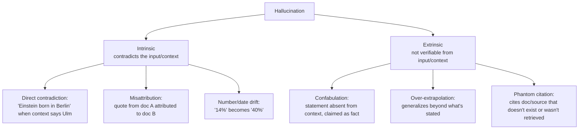
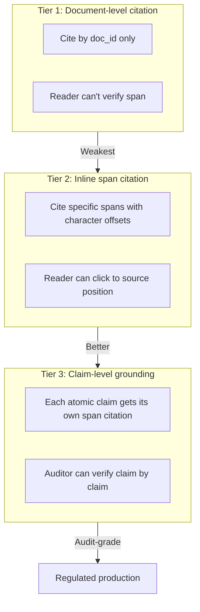
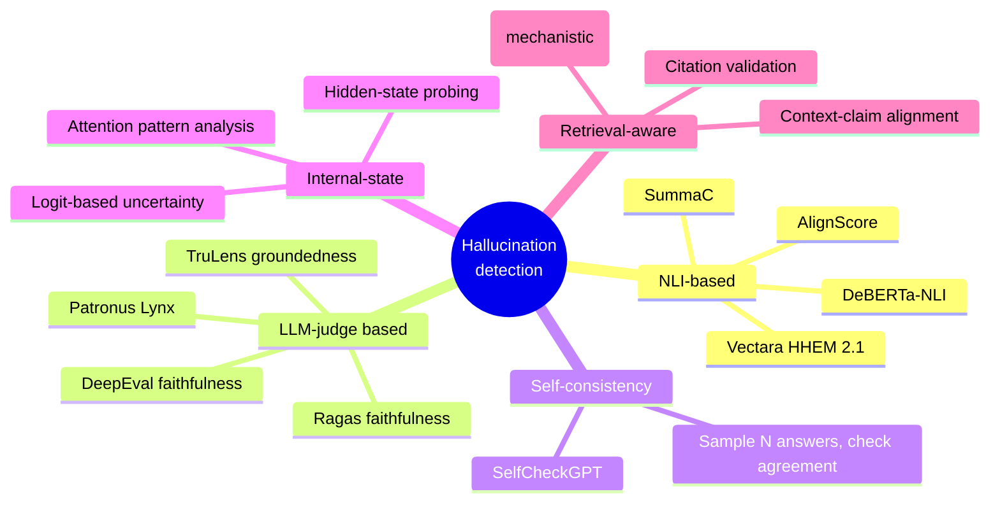
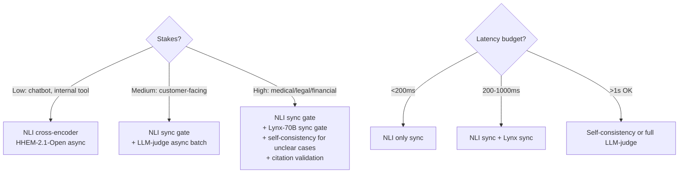

# Module 14 — Grounding, Citation & Hallucination Detection

> Module 13C touched these. This module is the deeper treatment.
>
> **Why this matters for healthcare / regulated work:** "the answer is supported by the corpus" isn't enough. You need to *show* which span supported which claim, in a way an auditor can check.

---

## Part 1 — Grounding vs faithfulness vs citation — three terms people conflate

| Term | What it means |
|------|---------------|
| **Grounding** | The output is anchored in retrieved evidence (vs free-floating from parametric knowledge). |
| **Faithfulness** | The output's claims do not contradict the retrieved context. (Module 13A.) |
| **Citation / attribution** | Each claim in the output is *linked to* the specific span(s) that support it. |
| **Factuality** | The output is consistent with reality (regardless of the retrieved context). |

**A fully faithful answer can be wrong** if the corpus is wrong. (Module 8 covered this.) **A correctly cited answer can be unfaithful** if it cites a chunk that doesn't actually say what's claimed. **All three are independently measurable** — and a senior architect should be able to articulate the difference.

---

## Part 2 — Hallucination taxonomy (the proper one)

The 2025 literature has converged on a more precise taxonomy than "the model made stuff up."



### Intrinsic vs extrinsic — why the distinction matters

- **Intrinsic** is *checkable* against the retrieved context. Detect with NLI, claim-decomposition (Ragas pattern), or specialized models (Lynx, HHEM).
- **Extrinsic** is harder — the model invented something the context doesn't address. Detection requires either checking against an external source of truth (factuality) or using model-internal signals (uncertainty, attention patterns).

A 2025 University of Barcelona taxonomy (arXiv:2508.01781) extends this with **mechanistic** subcategories — hallucinations from prompting strategy, from training data limits, from inference-time decoding (temperature, sampling). Useful for diagnosing root causes.

### Hallucination ≠ Factuality

Important distinction in modern literature:

- **Hallucination:** output inconsistent with the *input/context or training corpus*.
- **Factuality:** output inconsistent with the *real world*.

A faithful RAG answer over an incorrect corpus is **not hallucinating but is unfactual**. RAG primarily addresses hallucination, not factuality. Factuality requires curating the corpus AND validating retrieved content against authoritative sources.

### The "RAG paradoxically increases hallucinations" finding

A non-obvious 2025 result: under certain conditions, adding RAG can *increase* hallucination rates compared to no-RAG generation. Causes:

1. **Distractor chunks** — irrelevant retrieved content invites the model to confabulate connections that aren't there.
2. **Conflicting chunks** — corpus contains contradictions; model picks one and runs with it confidently.
3. **Model forced to use retrieved content** — when the system prompt insists "answer using only the provided context," the model fabricates support rather than refusing.

Mitigation: refusal-aware generation (CRAG, Self-RAG, abstention triggers).

---

## Part 3 — Citation mechanics (how production systems actually do it)

### Three citation strategies, ranked by trust



**Document-level** citations are mostly useless — "this answer is supported by these 5 documents" doesn't tell you *which* span in *which* document.

**Inline span** citations let the user click "[1]" and jump to the supporting passage. The Perplexity / Bing Chat / Claude pattern.

**Claim-level grounding** is the gold standard — each factual statement has its own attribution. Required for: regulated industries (medical/legal), audit-able systems, anything with liability exposure.

### Anthropic's Citations API — the reference implementation

Claude's Citations feature is one of the cleanest production implementations:

- Documents are passed in a structured `<documents>` block.
- The model emits responses with structured `<cited_text>` markup pointing to specific document indices and character ranges.
- The API parses these and returns guaranteed-valid pointers — **citations cannot point at nonexistent text**, because the parser validates before returning.

This last property is non-trivial: the model can't fabricate a citation that doesn't exist in the input.

### The "GTR / RTG vs inline" distinction

Two architectural patterns for citation generation:

- **GTR (Generate-Then-Retrieve / post-hoc citation):** model writes the answer, then a second pass tries to find supporting spans. Common in early retrieval systems (Bing 1.0, basic RAG). **Structurally unable to be faithful** — the model generates first, then cherry-picks support, often misattributing.
- **RTG (Retrieve-Then-Generate):** standard RAG. Better, but still allows model to drift from the citations during generation.
- **Inline citation generation:** model emits citations *while writing each claim*, anchored to retrieved chunk indices in real time. The only architecture that's consistent by construction.

If you're choosing how citations should work in a regulated product: **inline generation, validated by the API/parser layer.** GTR-style post-hoc citation is structurally unsuitable.

### Citation hallucinations (a category of their own)

A specific failure: the model emits a citation that *looks* valid but points at the wrong span — or at content that doesn't exist (phantom citation).

The 2026 paper **FACTUM** (arXiv:2601.05866) studied this mechanistically and found that ~3-15% of citations in long-form RAG outputs are hallucinated even when the underlying facts are correct. Detection signals: divergence between the model's attention to the cited span vs others; mismatch between cited span content and claim semantics.

**Mitigation in production:**
- Validate every citation server-side: extract the cited span from the document, run a separate NLI check on (claim, span), reject the answer if no claim is entailed by its citation.
- Anthropic-style guaranteed-pointer parsing.
- Penalize during fine-tuning (RLHF reward function on citation correctness).

---

## Part 4 — Citation evaluation — how to measure it

| Metric | What it measures |
|--------|------------------|
| **Citation precision** | Of cited claims, how many are actually supported by their citation? |
| **Citation recall** | Of claims that should be cited, how many are? |
| **Attribution F1** | Harmonic mean. |
| **Span-level accuracy** | Exact-match or IoU on the cited span vs the gold span. |

### Benchmarks

- **ALCE** (EMNLP 2023, "Enabling Large Language Models to Generate Text with Citations") — the standard benchmark. Three datasets: ASQA, QAMPARI, ELI5. Metrics for citation precision, recall, fluency, correctness.
- **GaRAGe** (June 2025, arXiv:2506.07671) — 2,366 questions, 35K+ annotated grounding passages, both private docs and web. Larger and more rigorous than ALCE.
- **AttributedQA** — earlier, narrower benchmark.
- **What Should I Cite?** (2026) — academic citation prediction, niche but interesting for research-document corpora.

### A critical 2025 finding

ALCE follow-up work showed: **fine-tuning Llama-2-7B to emit *line-level* citations rather than document-level boosted precision by >14 percentage points.** This is in the same family as "smaller chunks → sharper retrieval" but applied to attribution. Granularity matters.

---

## Part 5 — Hallucination detection deeper (the toolset)

Module 13C introduced detectors. Here's the deeper view.

### Detection categories



### The detector lineup, depth view

#### NLI-based (cheap, fast, narrow)

A Natural Language Inference model classifies (premise, hypothesis) pairs as **entailment / contradiction / neutral**. For RAG hallucination: premise = retrieved chunk, hypothesis = claim from answer.

| Model | Notes |
|-------|-------|
| **DeBERTa-NLI / DeBERTa-v3-large-mnli** | Open, fast, ~40ms per pair on GPU. Strong baseline. |
| **AlignScore** | Specifically trained for fact-verification. |
| **SummaC** | Summarization-fact-consistency model. |
| **Vectara HHEM-2.1-Open** | Cross-encoder, RAG-tuned. CPU-friendly. |

When to use: high-volume production scoring where LLM-judge is too slow/expensive. NLI models miss subtle paraphrase but catch most obvious contradictions.

#### LLM-judge based (slow, expensive, flexible)

Module 13A covered this. For hallucination specifically:

- **Patronus Lynx-8B / 70B** — Llama-3 fine-tunes; SOTA on hallucination benchmarks; outperform GPT-4o on RAGTruth.
- **Galileo Hallucination Index** — combined detection + leaderboard; commercial.
- **Generic GPT-4-class judge** — good with a strong rubric; expensive.

#### Self-consistency

Sample N answers from the same model with temperature > 0; if they disagree, the original is likely a hallucination.
- **SelfCheckGPT** is the canonical implementation.
- Cheap conceptually (no extra training, no separate model).
- Expensive operationally (N× generation cost).

#### Internal-state / mechanistic

Use the model's own hidden states or attention patterns as a hallucination signal.
- **FACTUM** (2026) — specifically for citation hallucinations in long-form RAG; mechanistic detection from attention patterns.
- Logit-based uncertainty: low-confidence tokens correlate with hallucination, but not perfectly.
- These approaches require white-box access (open-weight models or special API hooks).

### Choosing a detector



---

## Part 6 — Abstention / refusal triggers

A grounded production RAG system **refuses to answer** when it can't find adequate evidence. This is sometimes the right output.

### Abstention signals to combine

| Signal | What it indicates |
|--------|-------------------|
| **Top retrieved cosine similarity < threshold** | Retrieval found nothing close. |
| **Reranker top score < threshold** | No retrieved doc is a strong match. |
| **Faithfulness < threshold (computed mid-stream)** | Generated answer drifting from context. |
| **NLI: claims not entailed by any retrieved chunk** | Answer is hallucinating extrinsically. |
| **Self-consistency: low agreement across samples** | Model uncertain. |
| **Detector signal (Lynx, HHEM)** | Direct hallucination flag. |

Combine these into a refusal policy: if any signal exceeds threshold, return "I don't have enough information to answer this confidently" with the closest retrieved chunks as fallback.

### The cost of over-abstention (FRR — False Refusal Rate)

You can refuse everything and have zero hallucinations. That's not the goal. Module 13B's ASR/FRR balance applies — track both metrics; over-cautious systems erode trust differently than confidently-wrong systems but erode it nonetheless.

### Practical refusal policy template

```python
# Pseudo-code
def should_abstain(query, retrieved_chunks, draft_answer):
    if not retrieved_chunks:
        return True
    if max_retrieval_similarity(retrieved_chunks) < 0.55:
        return True
    if reranker_top_score(retrieved_chunks) < 0.4:
        return True
    if claims_unsupported_fraction(draft_answer, retrieved_chunks) > 0.3:
        return True
    if hallucination_detector_score(draft_answer, retrieved_chunks) > 0.7:
        return True
    return False
```

Tune thresholds against your eval set; balance ASR and FRR.

---

## Part 7 — Domain-specific grounding requirements

Different domains have different bars.

| Domain | Required grounding level | Why |
|--------|-------------------------|-----|
| Casual chat | Document citation | Convenience |
| Customer support | Inline span | Audit / training |
| Internal knowledge base | Inline span | Discoverability |
| Medical advice | Claim-level + source authority check | FDA/HIPAA, harm prevention |
| Legal research | Claim-level + jurisdiction-checked | Malpractice exposure |
| Financial advice | Claim-level + numerical verification | Compliance |
| Investigative journalism | Claim-level + multi-source corroboration | Fact-checking standards |

For Optum-style healthcare specifically: **claim-level grounding plus authority-source check** (was the citation from a peer-reviewed source, an internal policy doc, or a random forum post?). The grounding pipeline itself needs an **authority filter** at retrieval time so the model only ever cites trusted sources.

---

## Sanity check

1. Distinguish hallucination from factuality with one example each.
2. What's a "citation hallucination," and what's the standard mitigation?
3. Why is GTR (generate-then-retrieve) citation structurally unsuitable for regulated domains?
4. Name three categories of hallucination detector and one example tool per category.
5. You're designing a refusal policy. Name 4 signals you'd combine.
6. Why does fine-grained (line-level) citation outperform document-level citation by 14+ points on ALCE?
7. What's the "RAG paradoxically increases hallucinations" finding, and what's the mitigation?

---

## References

- Liu et al. — [Lost in the Middle (TACL 2024)](https://arxiv.org/abs/2307.03172) [next module]
- ALCE — [Enabling LLMs to Generate Text with Citations (EMNLP 2023)](https://arxiv.org/abs/2305.14627)
- GaRAGe — [arXiv:2506.07671](https://arxiv.org/abs/2506.07671)
- FACTUM — [arXiv:2601.05866](https://arxiv.org/pdf/2601.05866)
- Anthropic — [Claude Citations API docs](https://docs.anthropic.com/en/docs/build-with-claude/citations)
- Hallucination Taxonomy — [arXiv:2508.01781](https://arxiv.org/pdf/2508.01781)
- HalluLens — [ACL 2025](https://aclanthology.org/2025.acl-long.1176.pdf)
- SelfCheckGPT — [Manakul et al. 2023](https://arxiv.org/abs/2303.08896)
- Patronus Lynx — [patronus.ai/blog/lynx](https://www.patronus.ai/blog/lynx-state-of-the-art-open-source-hallucination-detection-model)
- Vectara HHEM — [huggingface.co/vectara/hallucination_evaluation_model](https://huggingface.co/vectara/hallucination_evaluation_model)

---

**Next:** [Module 15 — Multilingual Retrieval & Long-Context Failures](15_multilingual_long_context.md)

**TOC** [Table of Contents](00_Table_Of_Contents.md)