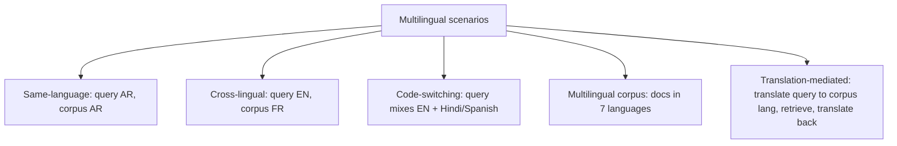
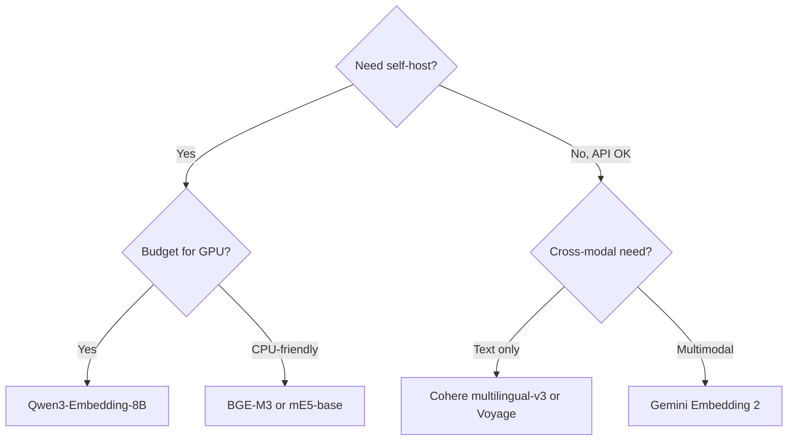
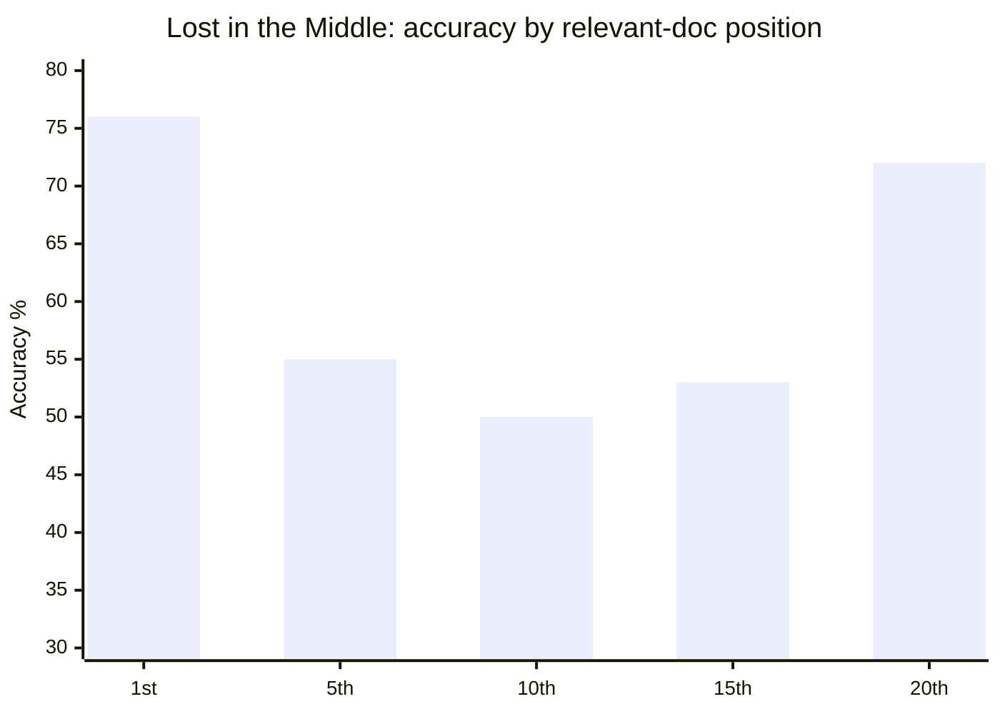
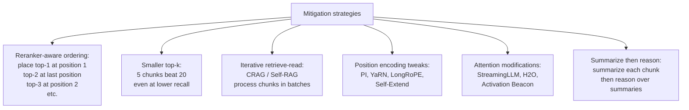
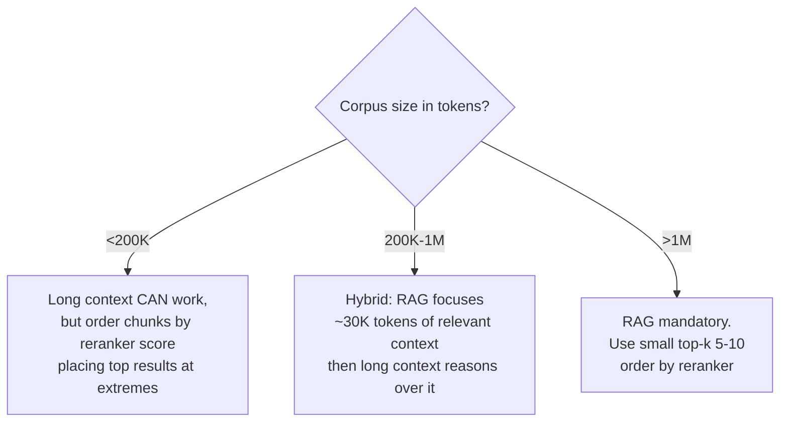

# Module 15 — Multilingual Retrieval & Long-Context Failures

> Two related problems: **the system gets a query in language A and the corpus is in language B**, and **the system has too much context and uses the middle of it badly.**

---

## Part 1 — Multilingual retrieval

### The problem space

Real production RAG hits multiple language scenarios:



US healthcare (Optum's space) has at minimum English + Spanish + Vietnamese + Mandarin + Tagalog as user-facing requirements; documentation may be in many more.

### Three architectural patterns

| Pattern | How | Pros | Cons |
|---------|-----|------|------|
| **Translation-as-bridge** | Translate query to corpus language; retrieve; translate output | Works with monolingual embedder | Translation errors compound; slow; loses nuance |
| **Native cross-lingual embeddings** | One embedder maps multiple languages to shared vector space | Single index; no translation step; cheaper at runtime | Quality varies by language pair; less explainable |
| **Per-language indexes** | Separate embedder + index per language; route at query time | Quality per language can be tuned | Operational overhead; cross-language queries hard |

**2026 default:** native cross-lingual embedding for top languages; per-language tuning for high-value tail; translation as fallback.

### The multilingual embedder lineup (early 2026)

| Model | Languages | Notes |
|-------|-----------|-------|
| **BGE-M3** | 100+ | Open. Dense + sparse + multi-vector in one model. **MIRACL nDCG@10 ≈ 70.0** averaged across 18 languages. The de-facto open-source default. |
| **multilingual-E5** (small/large) | 100+ | Open. Solid, smaller. Used widely for Arabic and Indic-language RAG. |
| **Cohere embed-multilingual-v3** | 100+ | Commercial API; strong baseline. |
| **Qwen3-Embedding (0.6B / 4B / 8B)** | 100+ | Apache 2.0. **Tops MMTEB.** 0.6B model competitive with Gemini Embedding. Best open-source frontier. |
| **Gemini Embedding 2** | natively multilingual | Cross-modal AND cross-lingual; commercial leader. |
| **OpenAI text-embedding-3-large** | multilingual but English-centric | OK on European languages, weaker on Asian/African. |

**Choice criteria:**



### Multilingual benchmarks (the proper ones)

- **MIRACL** — 18 languages; queries and docs in same language. The standard for monolingual-per-language retrieval. [BGE-M3 averages 70.0 nDCG@10.]
- **mMARCO** — multilingual MS-MARCO; cross-lingual.
- **XOR-TyDi** — cross-lingual open-domain QA across typologically diverse languages.
- **MMTEB** — Massive Multilingual Text Embedding Benchmark; the multilingual extension of MTEB.

### Cross-lingual is harder than multilingual

**Multilingual:** query and doc in the **same** non-English language. Mostly solved.

**Cross-lingual:** query in language A, doc in language B. Still hard.

Why: shared embedding space across languages is imperfect. English-French is decent (lots of training data, related languages); English-Yoruba is brittle (less training data, distant typology).

**Practical mitigations for cross-lingual:**
- Translate the query to the corpus language before retrieval.
- Retrieve in both query language and translated query, fuse with RRF.
- Use a hybrid: dense (cross-lingual embedder) + sparse (BM25 over translated query).

### Code-switching

Real users in multilingual societies type things like `"refund policy ka rules kya hai?"` (Hindi-English) or `"meu cartão não funciona en la app"` (Portuguese-Spanish-English). This breaks pure monolingual indexes and pure translation pipelines.

**Mitigations:**
- Code-switch-aware embedders (some BGE-M3 / Qwen3 variants handle it natively).
- Detect code-switching, route to a code-switch-trained model.
- Generate query rewrites in each language separately, retrieve for each, fuse.

### The unequal-quality problem

Even multilingual benchmarks reveal that **English consistently outperforms** other languages in retrieval scores by 10-30 points. Production implications:

- An English query on a multilingual corpus retrieves better than the equivalent Spanish query on the same corpus.
- Quality SLOs must be **per language**, not global. A single "recall@10 > 0.85" target is misleading.
- Latency / cost may also vary — some embedders are slower on certain scripts.

### Multilingual reranking

Cross-encoder rerankers also vary by language. Cohere Rerank v4 supports 100+ languages and is the production default for multilingual re-ranking. BGE-reranker-v2-m3 is the open alternative.

---

## Part 2 — Long-context failures

We've referenced "Context Rot" and "Lost in the Middle" several times. This is the deep treatment.

### The canonical paper — Liu et al. 2023, "Lost in the Middle"

**Reference:** [arXiv:2307.03172](https://arxiv.org/abs/2307.03172) (TACL 2024).

**The finding:** model performance on multi-document QA is highest when the relevant document sits at the **start or end** of the context — and significantly degrades when it's in the middle. A U-shaped curve.



The shape is roughly U: ~75% at extremes, ~50% in the middle. **Even with explicit "long context" model upgrades.**

This effect has a name in psychology — the **serial-position effect** (Ebbinghaus 1913, Murdock 1962). Humans show the same pattern in free-recall tasks. LLMs inherit it from training data and architectural priors.

### Why this matters for RAG

If you retrieve 20 chunks and stuff them into the prompt:
- The 1st and 20th get attended to.
- The 10th gets ignored.
- **Your reranker's #1 result, if you place it in the middle, may not actually get used.**

This explains the "I retrieved the right chunk, why is the answer still wrong?" mystery.

### The "Context Rot" research (Chroma)

A 2024 deep-dive by Chroma [research.trychroma.com/context-rot] showed:

- Quality degrades non-linearly with input length even *within* the rated context window.
- Drop becomes visible around **2,500 input tokens.**
- Steepens above 32K tokens.
- Affects ALL frontier models (GPT-4, Claude, Gemini) — not just specific architectures.

### NoLiMa — the honest long-context test

Module 13A introduced NoLiMa. To restate with depth:

- Tests retrieval over long contexts where **the question and the relevant chunk have minimal lexical overlap** (forces semantic, not literal, matching).
- GPT-4o: 99.3% accuracy at 1K tokens, **drops to 69.7% at 32K tokens.**
- 11 of the tested models drop below 50% of their short-context baseline at 32K.

**Take:** "supports 1M tokens" doesn't mean "uses 1M tokens well." Specifically multi-needle retrieval over long contexts is the production-relevant scenario, and frontier models drop hard.

### Mitigations for lost-in-the-middle



#### 1. Reorder by reranker score (the cheap, high-leverage fix)

The most underused: place your top-ranked chunk at position 1, second-best at the **last** position, third at position 2, fourth at position N-1, etc. Exploit the U-curve instead of fighting it.

```python
# Pseudo-code
ordered_chunks = []
ranked = reranker.rank(chunks)  # sorted by relevance
front, back = [], []
for i, chunk in enumerate(ranked):
    if i % 2 == 0:
        front.append(chunk)
    else:
        back.insert(0, chunk)
ordered_chunks = front + back
```

This costs zero compute and routinely lifts answer quality 5-10% on long-context RAG. Most teams don't do it.

#### 2. Top-k smaller is better past a point

Empirically: 5-10 well-chosen chunks beat 20-50. Excess chunks introduce middle-of-context that the model doesn't read AND distract from the relevant ones. Reranker quality > recall quantity.

#### 3. Iterative retrieve-read (CRAG / Self-RAG / Adaptive RAG)

Instead of one big retrieval, do many small ones interleaved with reasoning. Each retrieval has a small, focused context. Module 7 covered the architectures; the lost-in-the-middle perspective explains *why* they win.

#### 4. Position-encoding solutions (research-side)

Frontier models use various position-encoding tweaks to extend usable context: **PI (Position Interpolation)**, **YaRN**, **LongRoPE**, **CLEX**, **Self-Extend**. These shift the U-curve but don't eliminate it. Useful to know they exist; usually you consume the resulting model rather than implement these yourself.

#### 5. Attention modifications

**StreamingLLM**, **H2O**, **TOVA**, **Activation Beacon**, **Zebra**: modify attention sparsity or memory at inference time to focus compute on important positions. Architectural; consumed via the model.

#### 6. Hierarchical summarization

For very long contexts: summarize chunks in batches, reason over summaries, retrieve back to source for citations. GraphRAG community summaries are a structured version of this.

### Long-context vs RAG decision (revisited)

Module 7 had this; restating with the lost-in-the-middle lens:



The takeaway: **long-context is a tool inside RAG, not a replacement for it.** Even Gemini 3 with 1M tokens benefits from RAG focusing the context first.

---

## Part 3 — When the two interact: long context in non-English

A subtle compound failure: lost-in-the-middle is **worse on non-English languages**. Reasons:

- Frontier models are trained predominantly on English; their long-context attention is best-trained on English.
- Non-English tokenization is often less efficient (more tokens per word), pushing relevant info further into the context.
- Position-encoding extensions are tuned on English benchmarks.

**Implication:** if your corpus is multilingual AND long-context, expect compounded degradation. Mitigate by per-language top-k tuning (smaller k for non-English) and aggressive reranking quality.

---

## Sanity check

1. Three architectural patterns for multilingual retrieval — name and one trade-off each.
2. Which open-source embedder has 100+ language support and dense+sparse+multi-vector in one model?
3. What's the U-shaped curve in "Lost in the Middle"? What psychological phenomenon is it called?
4. You retrieve 20 chunks ordered by reranker score and dump them into the prompt in order. What's the failure mode and the cheap fix?
5. NoLiMa shows GPT-4o drops from 99.3% to 69.7% at 32K tokens. What does that say about "supports 1M tokens"?
6. Why do non-English corpora compound long-context degradation?

---

## References

- Liu et al. 2024 — [Lost in the Middle (TACL)](https://arxiv.org/abs/2307.03172)
- BGE-M3 — [arXiv technical report](https://arxiv.org/abs/2506.05176) and [HuggingFace](https://huggingface.co/BAAI/bge-m3)
- MIRACL — [project.miracl.ai](https://project.miracl.ai/)
- MMTEB — extension of MTEB to multilingual
- Qwen3-Embedding — [github.com/QwenLM/Qwen3-Embedding](https://github.com/QwenLM/Qwen3-Embedding)
- Chroma — [Context Rot research](https://research.trychroma.com/context-rot)
- NoLiMa — [arXiv:2502.05167](https://arxiv.org/abs/2502.05167)
- Found in the Middle — [arXiv:2403.04797](https://arxiv.org/abs/2403.04797)
- Position Interpolation, YaRN, LongRoPE — frontier position-encoding extensions

---

**Back to:** [README](README.md) | [FACTS.md](FACTS.md)

**Next** [Domain Case Studies](16_domain_case_studies.md)

**TOC** [Table of Contents](00_Table_Of_Contents.md)