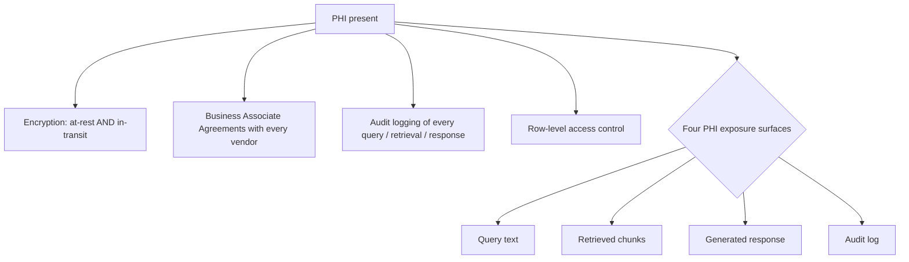
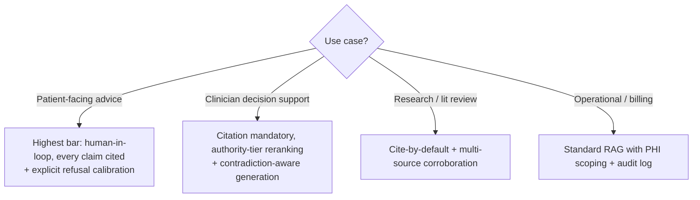
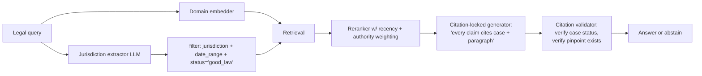
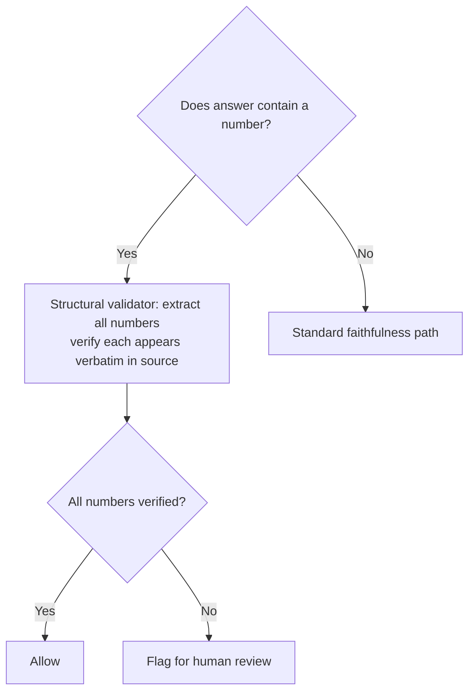
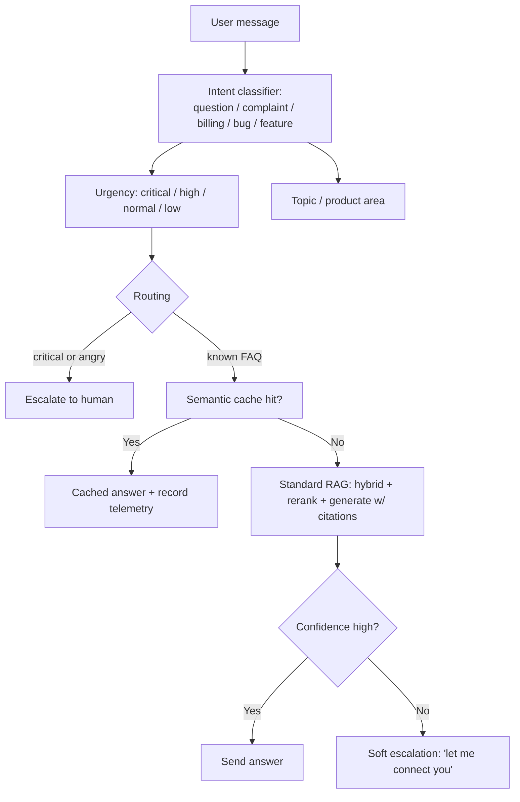

# Module 16 — Domain Case Studies

> Most RAG tutorials are domain-generic. Production RAG isn't. This module is a tour of how four high-stakes domains diverge from the generic recipe — what's harder, what's required, what unique tooling exists.

---

## Why domain matters

Generic RAG treats every chunk as equally citable, every claim as equally consequential, every source as equally authoritative. Real domains don't:

- A medical claim wrong by 5% can kill someone.
- A legal citation pointing at a vacated case is malpractice.
- A financial number off by a decimal moves markets.
- A customer-support answer wrong about refund eligibility is a billing dispute.

Each domain has its own benchmarks, its own grounding bar, and its own regulatory overhead. Below is the working knowledge an architect needs to articulate per domain.

---

## Part 1 — Healthcare / Clinical RAG

### Why generic RAG fails in healthcare

1. **Citation is mandatory, not nice-to-have.** Clinicians need to verify which guideline informed an answer.
2. **PHI everywhere.** HIPAA imposes strict logging, encryption, BAA, and access-control requirements.
3. **Authority hierarchy matters.** Peer-reviewed > internal protocol > forum post. Your retrieval must respect that ordering.
4. **Refusal is often the right answer.** "I don't know" beats "here's a confident wrong answer" in medicine.

### The non-negotiables (HIPAA-grounded)

**Implication:** every component touching PHI needs a BAA — embedding API, vector DB, LLM, telemetry, observability. This shrinks your vendor list dramatically. Self-host or use vendors with explicit healthcare BAAs (Anthropic via AWS Bedrock with BAA, Azure OpenAI with BAA, etc.).

### Architecture patterns

- **On-prem or VPC-bound:** keep PHI in your network; don't ship it to public APIs without BAA.
- **De-identification at ingestion:** strip names, dates, addresses, MRNs from chunks where possible. Re-identify only at output if needed.
- **Authority-tier retrieval:** index has metadata `authority_tier ∈ {peer_reviewed, fda_label, internal_protocol, ehr_note, forum}`; reranker boosts by tier.
- **Citation-mandatory generation:** prompt enforces "every clinical claim must cite a source"; an output filter rejects responses missing citations.
- **Strong abstention:** if retrieval similarity below threshold OR no peer-reviewed source available, refuse.

### Benchmarks
- **MedQA** — USMLE-style multiple choice; tests medical knowledge.
- **MIMIC-CDR** — clinical decision-support QA against MIMIC ICU notes.
- **PubMedQA** — biomedical QA from PubMed abstracts.
- **MedRAG** — purpose-built RAG benchmark for medical literature.

### Specialized models / tools
- **MEDITRON-70B / Lynx-Medical** — domain-tuned generators / judges.
- **BioBERT, PubMedBERT, MedCPT** — domain-specialized embedders.
- **AWS Bedrock** + Claude with healthcare BAA — production deployment baseline at large hospital systems.

### Decision framework

---

## Part 2 — Legal RAG

### Why generic RAG fails in law

1. **Citations need exact authority** — case name + court + year + jurisdiction + pinpoint paragraph. Document-level citation isn't enough.
2. **Jurisdiction matters.** A California precedent doesn't apply in Texas. The retriever must filter or the answer is wrong.
3. **Vacated / overruled status.** Citing a case overruled in 2018 is malpractice.
4. **Reasoning chains are long.** Legal arguments often hop across 5-10 cases.

### The 2024-2025 specialized stack

| Tool | Role |
|------|------|
| **Harvey** | Production legal AI assistant; trained on legal corpora. |
| **CoCounsel (Thomson Reuters)** | Legal research + drafting on top of Westlaw. |
| **Vincent AI (vLex)** | Multi-jurisdictional case-law retrieval. |
| **Oliver (Vecflow)** | Specialized legal Q&A. |
| **LegalBench-RAG** | The reference benchmark — **6,858 query-answer pairs over 79M chars, fully expert-annotated.** Specifically tests retrieval (not just generation). |

The 2025 **VLAIR (Vals Legal AI Report)** benchmark across these four tools found:
- All four outperform the lawyer baseline on document Q&A, summarization, data extraction.
- **All four struggle on multi-jurisdictional questions.** This is the field-wide unsolved problem.

### Architecture patterns

The validator step is essential. A 2024 incident saw lawyers sanctioned for AI-generated briefs citing **fabricated cases.** A validator that pings a case-status API (Westlaw, LexisNexis) before allowing the response prevents this class of incident entirely.

### Specific patterns
- **Hierarchical retrieval:** statutes → cases interpreting them → secondary sources. Three separate indexes; merge with priority.
- **Vector + KG hybrid:** legal knowledge has dense relationship structure (citation graphs, court hierarchies). [Vector RAG + KG (BIM-RAG style)](https://arxiv.org/abs/2502.20364) wins on multi-hop legal reasoning.
- **Document-level vs span-level:** law cares about pinpoints. Citation must include paragraph or page numbers, not just the case.

### Benchmarks
- **LegalBench** (162 tasks)
- **LegalBench-RAG** (retrieval-specific)
- **CaseHOLD** (multiple-choice case-holding identification)
- **ContractNLI** (contract NLI)

---

## Part 3 — Financial RAG

### Why generic RAG fails in finance

1. **Numerical precision is everything.** "$1.4M" vs "$1,400" is a 1000× error.
2. **Time-sensitive.** "Q3 2024 revenue" must NOT retrieve Q3 2023 docs.
3. **Regulatory regime** (SR 11-7 model risk management for banks; SOX for public companies; GDPR for EU operations).
4. **Tabular data everywhere.** Most "financial answers" come from tables, not prose. (Module 12 territory.)

### Patterns
- **Structural number-match assertions in eval:** beyond Ragas faithfulness, add regex/structural checks ("answer must contain `$1.4M` exactly as written in source").
- **Time-aware retrieval:** every chunk has `as_of_date`; queries either specify or default to "most recent."
- **Text-to-SQL + RAG hybrid:** route quantitative queries to SQL, qualitative to RAG. (Module 12.)
- **Compliance trail:** every query/response logged with model version, prompt version, retrieved chunks; retained per regulatory schedule (often 7+ years).

### Benchmarks
- **FinQA** — numerical QA over financial reports.
- **TAT-QA** — table + text QA.
- **ConvFinQA** — conversational financial QA.
- **FinanceBench** — broader financial benchmark.

### Tools / vendors
- **Bloomberg GPT** — domain-specialized model.
- **FinGPT** — open variant.
- **Hebbia, Patronus AI Finance** — production financial AI tools.

### Production sanity check

---

## Part 4 — Customer Support RAG

### Why this case is different

Customer support is the **highest-volume, lowest-stake-per-query** RAG deployment. Different optimization profile from medical/legal:
- Volume: millions of queries/day.
- Stakes per query: usually low, but aggregate CSAT and escalation rates matter.
- Latency: users expect chat-speed (1-3s).
- Cost: per-query economics matter; pennies multiply.

### The numbers

Reported across 2025 vendors (Wonderchat, Cobbai, Pylon, Inkeep):
- **40-60% ticket deflection** is achievable with mature RAG.
- **30% operational cost reduction** typical.
- **CSAT ↑ ~25%** when the bot is well-tuned.

**Knowledge base quality determines ~80% of agent performance.** Stale KBs cap RAG quality regardless of model.

### Architecture patterns

### Specific tactics

- **Intent-based routing.** Cheap classifier in front; only RAG-search the queries that warrant it.
- **Semantic cache aggressive.** ~30-50% of queries are duplicates of past queries. Cache hits are free wins.
- **Citation links to KB articles.** Users trust answers more when they can verify; reduces follow-up tickets.
- **Bot-to-human handoff design.** Track when the bot says "I don't know" or user says "talk to a human." Optimize for graceful handoff, not maximum deflection.
- **Reasoning-first systems** (verify decisions against approved KB entries) are showing up in regulated-industry support (banking, insurance) for audit-trail reasons.

### Benchmarks
- **DSTC** (Dialogue System Technology Challenge) — historical benchmark for support dialogue.
- Internal benchmarks dominate here; vendors don't share data.

### Production metrics that matter
- **Deflection rate** (% of inbound resolved without human)
- **First-contact resolution** (resolved in one interaction)
- **CSAT after bot interaction**
- **Re-query rate within 24h** (signal of failure)
- **Escalation reasons distribution** (signal of corpus gaps)

---

## A common-architecture cheat sheet across domains

| Domain | Citation level | Refusal aggressiveness | Authority filter | Eval rigor | Latency budget |
|--------|---------------|----------------------|------------------|-----------|----------------|
| **Medical** | Claim-level + tier | Very high | Mandatory | 1000+ samples, human SxS, regulatory | 2-5s |
| **Legal** | Pinpoint citation | High | Mandatory + jurisdiction + status | 500+ samples, attorney review | 5-30s |
| **Financial** | Span citation + structural validator | Medium-high | Mandatory + time | Structural + faithfulness | 2-5s |
| **Customer support** | KB article link | Low-medium | Optional | Behavioral metrics dominate | 1-3s |

Every domain takes the generic RAG architecture from Modules 1-15 and applies a different filter / validator / abstention tuning. The architecture is shared; the rules and eval are not.

---

## Sanity check

1. List 4 PHI exposure surfaces in a medical RAG system.
2. Why does multi-jurisdictional legal questioning still trip the leading legal AI tools, and what's a mitigation?
3. A financial RAG returns "$1,400" when the source says "$1.4M." Faithfulness might score 0.9. What additional check catches this?
4. Why is "knowledge base quality determines 80% of customer support agent performance"?
5. Customer support deflection target is 50%. Your bot hits 70%. What signal would tell you you're over-deflecting?
6. Authority-tier reranking — what is it, and which domains demand it?

---

## References

- Healthcare: [iatroX RAG in healthcare guide](https://www.iatrox.com/blog/rag-in-healthcare-benefits-evidence-safe-deployment-guide), [Kiteworks HIPAA-RAG](https://www.kiteworks.com/hipaa-compliance/healthcare-rag-hipaa-compliance-controls/), [Privacy challenges in RAG-LLMs (arXiv:2511.11347)](https://arxiv.org/pdf/2511.11347)
- Legal: [LegalBench-RAG (arXiv:2408.10343)](https://arxiv.org/abs/2408.10343), [VLAIR](https://www.vals.ai), Harvey, CoCounsel, Vincent AI
- Financial: FinQA, TAT-QA, ConvFinQA, FinanceBench benchmarks; Bloomberg GPT
- Support: [Wonderchat 2025 RAG report](https://wonderchat.io/blog/rag-ai-customer-support-2025), [Cobbai AI KB architecture](https://cobbai.com/blog/ai-knowledge-base-for-customer-service)

---

**Next:** [Module 17 — Security, Privacy & Auditing](17_security_privacy_auditing.md)

**TOC** [Table of Contents](00_Table_Of_Contents.md)