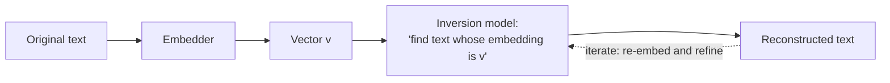
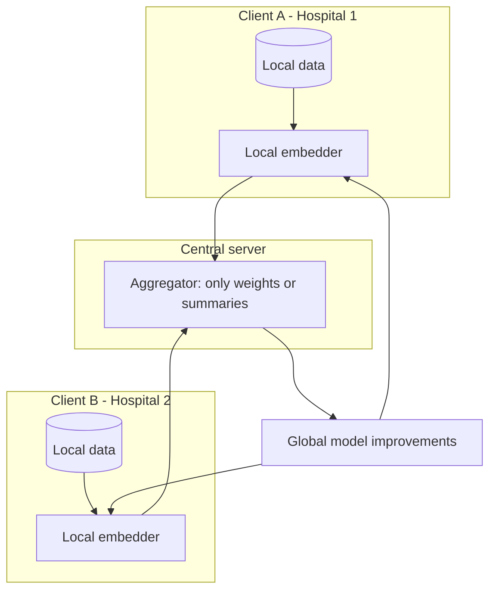
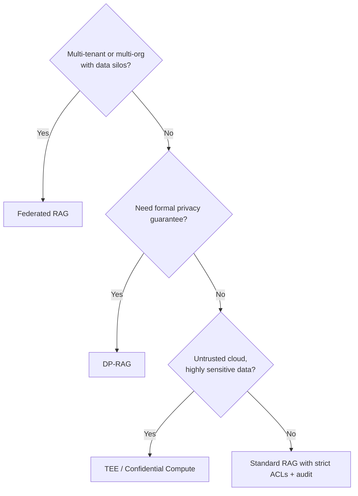
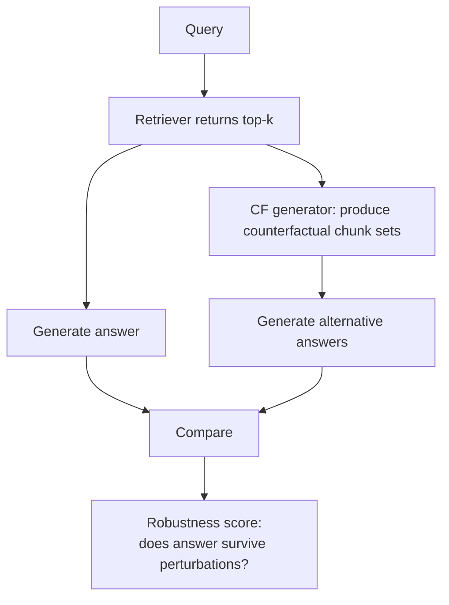

# Module 17 — Security, Privacy & Auditing

> Module 9 covered indirect prompt injection — the attack surface most teams know about. This module is the rest: privacy of the data your system holds, recovery attacks against embeddings, and the auditing infrastructure regulated industries need.

---

## Part 1 — Embedding inversion attacks (the surprising one)

### What it is

For years, embeddings were assumed to be "lossy enough that you can't recover the source text." That assumption is **wrong**.

**Vec2Text** (Morris et al. 2023, arXiv:2310.06816) showed an embedding inversion model can:
- Recover **92% of 32-token text inputs exactly** given just the embedding.
- Recover **personal information** (full names, IDs) from embedded clinical notes.

The implication: an embedding vector, treated as opaque, **leaks the source text.** If you store embeddings in a vector DB that's later breached, an attacker can reconstruct the original documents from the vectors alone.

### How Vec2Text works (briefly)



It's iterative — generate text candidates, embed them, compare to the target vector, refine. Treats inversion as controlled generation.

### Newer attacks (2024-2025)

- **ALGEN** — exploits the fact that embedding spaces are nearly **isomorphic** across encoders. With ~1,000 leaked (text, embedding) pairs, a one-step linear alignment achieves ROUGE-L 45-50 on inversion. **Defense bypass** for naive obfuscation.
- **ZSinvert** — universal, zero-shot; no per-embedding-model training needed. Adversarial decoding generalizes across embedders.
- **Transferable Embedding Inversion** (ACL 2024) — works **without queries** to the target embedder.
- **BeamClean** — adapts on-the-fly even under noise defenses.

### Defenses

| Defense | Effectiveness | Cost |
|---------|--------------|------|
| **Gaussian noise added to embeddings** | Mild — degrades older inversion models, modern ones adapt | Small retrieval recall hit |
| **Quantization (PQ, scalar quantization)** | Mild — same effect as noise | Storage savings as bonus |
| **Concept-aware obfuscation** (mask sensitive concepts before embedding) | Better — domain-tuned | Engineering cost |
| **Don't expose embeddings to clients** | Best | Easy to enforce in well-designed APIs |
| **Encrypt embeddings at rest** | Strong if keys are well-managed | Standard infra cost |
| **Differential privacy on training data** | Strongest formal guarantee | Quality cost |

**Practical baseline:** never expose raw embedding vectors to clients. Encrypt at rest. Don't store embeddings of PII / PHI in any system that doesn't have full audit / access control.

---

## Part 2 — Privacy-preserving RAG

When the corpus contains sensitive data and you need RAG over it without leaking it, three frontier patterns:

### Pattern 1 — Federated RAG (FedE4RAG, FRAG, HyFedRAG)



- Raw data never leaves client.
- Server aggregates **weights** (or differentially private summaries), not data.
- **FRAG** uses single-key homomorphic encryption (SK-MHE) for vector ops in ciphertext.
- Use cases: cross-hospital research collaborations, multi-bank fraud detection, multi-tenant enterprise retrieval where tenants can't see each other.

### Pattern 2 — Differential privacy on retrieval (DP-RAG)

[Privacy-Preserving RAG with Differential Privacy (Dec 2024, arXiv:2412.04697)](https://arxiv.org/abs/2412.04697):
- Inject calibrated noise into retrieval scoring AND token generation.
- Provides formal `(ε, δ)` privacy guarantees.
- DP-RAG: high-utility outputs viable at **ε ≈ 5** *if facts appear in ≥ 100 documents.*
- The catch: rare facts (single-doc references) have low utility under DP. Suitable for aggregate retrieval, not specific-record lookup.

### Pattern 3 — Confidential computing / TEE-based RAG

Run the retrieval + generation inside a Trusted Execution Environment (Intel SGX, AMD SEV, Azure Confidential Compute). The cloud provider can't see the data; you get hardware-attested isolation.

- **RemoteRAG** (ACL 2025) — privacy-preserving cloud RAG.
- More performant than full homomorphic encryption.
- Defense in depth: TEE + DP on what comes out is layered.

### When to reach for which



For most production RAG: **strict ACLs + at-rest encryption + audit log** is sufficient. Reach for federated/DP/TEE only when you have a real privacy requirement (multi-org collaboration, regulatory mandate, or untrusted-cloud threat model).

---

## Part 3 — Retrieval auditing & explainability

### Two distinct questions

1. **"Why was this chunk retrieved?"** — explainability of the retriever.
2. **"How would the answer change if we'd retrieved differently?"** — counterfactual evaluation.

These are different in research and in tooling.

### Explainability for retrievers

Standard retrieval is opaque — a vector cosine score gives a number, not a reason.

**Tools / techniques:**
- **Token-level attribution** (ColBERT-style late interaction). MaxSim per query token tells you *which query token matched which doc token.*
- **Sparse retrieval (BM25, SPLADE) is intrinsically explainable** — exact term matches are auditable.
- **LLM-judge per-claim attribution** (Module 13A) — for each claim in the answer, report which chunk supported it.
- **Phoenix / Langfuse traces** — show retrieved chunks with scores in a UI; click to inspect.

### Counterfactual RAG (CF-RAG)

A 2025 research line: systematically ask "what if the retriever had returned X instead of Y?"



- **Causal-Counterfactual RAG** (arXiv:2509.14435) builds explicit causal graphs and tests counterfactual scenarios.
- **CF-RAG** uses parallel arbitration to reconcile conflicting evidence.

### Why this matters in regulated industries

- **Auditor:** "show me why the model produced this output."
- **Naive answer:** "the model used these chunks." (Insufficient.)
- **Better answer:** "these chunks supported these claims; if we'd swapped chunk X for the next-best alternative, the answer would have been Y; here's the per-stage trace; here's the model + prompt + corpus version."

That's **audit-grade explainability.** It requires:
- Per-query trace (Module 13C): every retrieval, every score, every prompt token logged.
- Counterfactual replay capability: stored chunks + retriever + generator versions allow re-running with different inputs.
- Frozen eval baselines with versioned eval-set tags.

### Practical audit logging schema

```yaml
audit_event:
  event_id: uuid
  timestamp: ISO-8601
  user_id_hash: ...
  query_text_hash: ...   # or full query if PHI/PII permits
  pipeline_version: "v3.2.1"
  embedder_version: "voyage-3-large@2024-12"
  retriever_config: { hybrid: true, rrf_k: 60, top_k: 100 }
  retrieved_chunks:
    - { id: "doc_142_chunk_07", score: 0.83, rank: 1, source_uri: "..." }
    - { id: "doc_88_chunk_03",  score: 0.79, rank: 2, source_uri: "..." }
  reranker_version: "cohere-rerank-v3.5"
  reranked: [...]
  prompt_version: "p_5b4c"
  prompt_tokens: 4523
  llm_model: "claude-sonnet-4-5"
  response_text_hash: ...
  citations: [...]
  abstain_reasons: []
  human_feedback: null
  retention_until: "2031-05-10"   # 7-year retention for SOX-class data
```

Retention durations are domain-specific:
- HIPAA: 6 years from creation or last use.
- SOX: 7 years.
- GDPR: minimization principle — keep what's needed, no longer.

---

## Part 4 — Threat model checklist

A RAG-specific security review covers more than typical web apps:

| Threat | Mitigation in RAG context |
|--------|--------------------------|
| **Indirect prompt injection** (Module 9) | Source allowlist, sanitization, classifier screening, attribution-gated answering |
| **Embedding inversion** | Don't expose raw vectors; encrypt at rest; consider DP for high-sensitivity corpora |
| **Adversarial doc poisoning** (insider uploads malicious doc) | Provenance tracking; ingestion-time content classifier; review queue for sensitive corpora |
| **Cross-tenant data leakage** | Strict tenant ID filters in retrieval; per-tenant keys for embeddings; verify filter not bypassable |
| **Replay attacks via cached responses** | Versioned semantic cache; invalidate on corpus updates |
| **Training-data inference** (membership inference on embedders) | Use embedders not fine-tuned on your sensitive data; prefer external API embedders for non-sensitive only |
| **Data exfiltration via tool calls** (in agentic RAG) | Action screening; least-privilege tools; rate-limit egress |
| **Model output as exfil channel** | Output filters for sensitive patterns (PII, secrets, internal IDs) |

---

## Sanity check

1. Vec2Text's headline claim: what % of 32-token inputs are exactly recoverable from embeddings?
2. Three production-ready defenses against embedding inversion.
3. Federated RAG vs DP-RAG — when does each win?
4. What does counterfactual RAG add to explainability that vanilla retrieval traces don't?
5. List five fields you'd include in a regulated-industry audit log per query.
6. A threat: "an internal user uploads a doc to manipulate retrieval results." What's it called and what's the mitigation?

---

## References

- Vec2Text — Morris et al. 2023, [arXiv:2310.06816](https://arxiv.org/abs/2310.06816)
- ALGEN, ZSinvert — embedding inversion attacks, 2024-2025
- DP-RAG — [arXiv:2412.04697](https://arxiv.org/abs/2412.04697)
- FRAG / federated RAG — [arXiv:2410.13272](https://arxiv.org/abs/2410.13272)
- FedE4RAG — privacy-preserving federated embedding learning, [arXiv:2504.19101](https://arxiv.org/abs/2504.19101)
- RemoteRAG — [ACL 2025 Findings](https://aclanthology.org/2025.findings-acl.197.pdf)
- Privacy challenges in RAG — [arXiv:2511.11347](https://arxiv.org/pdf/2511.11347)
- Causal-Counterfactual RAG — [arXiv:2509.14435](https://arxiv.org/html/2509.14435v1)

---

**Next:** [Module 18 — Frontier Retrieval Patterns](18_frontier_retrieval_patterns.md)

**TOC** [Table of Contents](00_Table_Of_Contents.md)