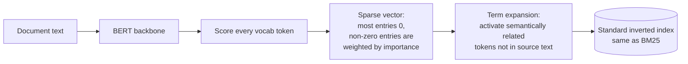
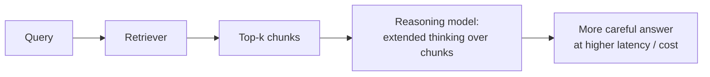
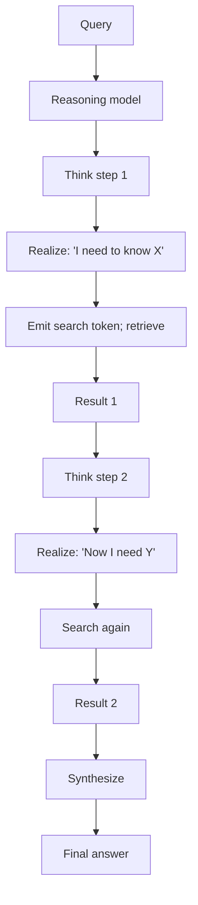
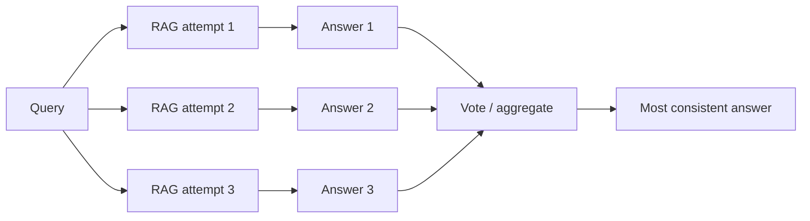
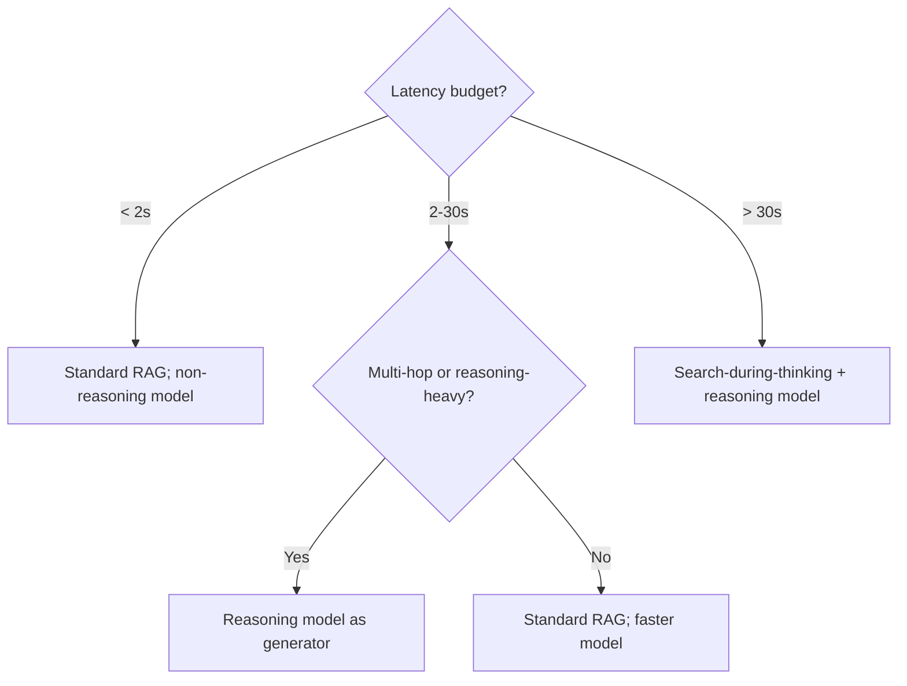
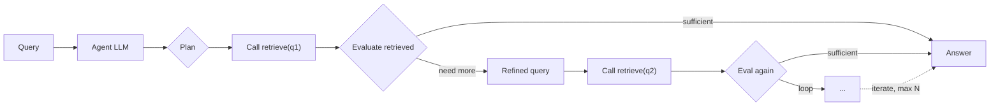
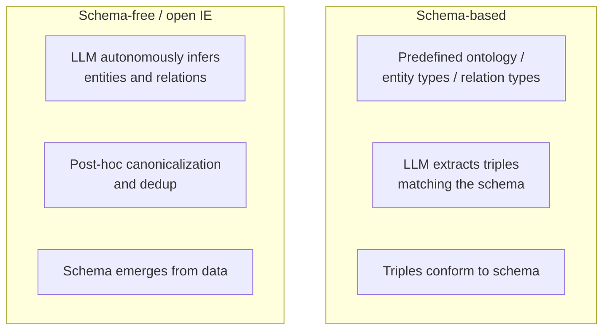
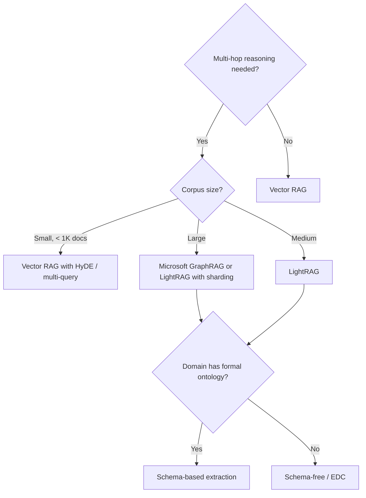

# Module 18 — Frontier Retrieval Patterns

> Patterns that have moved from research to production-relevant in 2024-2025: learned sparse retrieval (deeper than BM25), reasoning-model RAG (o1-style), LLM-driven retrieval iteration, and KG construction at scale.

---

## Part 1 — Learned sparse retrieval (deeper)

### Recap from Module 5

BM25 is the old workhorse — exact-match scoring with TF-IDF + length normalization. Strong, simple, fast. Limited because it doesn't understand semantics.

Dense retrieval has the opposite problem — strong semantics, weak on exact matches.

**Learned sparse retrieval (LSR)** is the synthesis: train a neural model that produces *sparse* vectors (most entries zero) but with semantically-aware term weights and term expansion.

### How SPLADE works

Two key tricks:
1. **Term weighting via attention** — tokens that matter for retrieval get higher weights than mere frequency would suggest.
2. **Term expansion** — the model activates semantically related tokens *not present in the source text*. The chunk "401(k) match" can light up "retirement" and "vesting" in its sparse vector.

### The SPLADE family
- **SPLADE v1** (SIGIR '21) — original.
- **SPLADE v2** — improved training.
- **DistilSPLADE-max, SPLADE-max** — distilled variants.
- **TILDE / TILDEv2** — alternative learned-sparse approach.
- **DeepImpact, uniCOIL, EPIC** — sibling techniques.

### Why this matters

- **Inverted-index compatible** — runs on the same infrastructure as BM25 (Lucene, Elasticsearch, OpenSearch). No new vector DB needed.
- **Latency similar to BM25** — well under cosine search on dense vectors at billion scale.
- **Quality between BM25 and dense** in many settings; **better than both on some** (especially complex queries with rare terms).

### When to reach for SPLADE

| Scenario | Choose |
|----------|--------|
| Have an inverted-index infra (Elasticsearch/OpenSearch) | SPLADE v2 (drop into existing system) |
| Pure cosine vector store | Dense-only or hybrid with BM25 |
| Complex queries with rare vocabulary | SPLADE often beats both |
| English-only, simple query patterns | BM25 hard to beat on cost/perf |
| Multilingual | BGE-M3 has SPLADE-style sparse head built in |

**Production reality:** most teams should at minimum **add BM25** to a dense system (Module 5). Once you've proven hybrid works, consider upgrading the sparse half from BM25 to SPLADE if your queries have heavy rare-term distribution.

---

## Part 2 — Reasoning-model / test-time-compute RAG

### The shift

Models like **OpenAI o1, o3**, **DeepSeek R1**, **Claude with extended thinking**, **Qwen QwQ**, **s1**, **LIMO** allocate compute at *inference time* to reason in chain-of-thought before answering. This changes RAG.

### Three integration patterns

#### Pattern A — Reasoning model as the generator

Drop a reasoning model into the standard RAG pipeline:

**Wins:** better multi-hop synthesis; better refusal calibration; better number / logic correctness.
**Trade-off:** 5-20× higher token cost (thinking tokens count); 5-30s latency.

#### Pattern B — Search-during-thinking (Search-R1, Search-o1)

Reasoning model **interleaves retrieval with thought**:

The model decides what to retrieve, when, with control over whole reasoning chain. Search-o1 / Search-R1 are the reference architectures.

#### Pattern C — Self-consistency over multiple RAG passes

Run RAG N times with **different sampling**, take majority answer.

Cheap to implement, expensive to run. Works well for short-answer questions where votes can be aggregated.

### A 2025 caveat

Recent research (arXiv:2502.12215, ACL 2025) **questioned whether longer chains-of-thought always help.** Findings:
- Correct solutions are sometimes *shorter* than incorrect ones for the same question.
- Test-time compute scaling has diminishing returns past some point.
- Don't blindly crank up reasoning; **measure**.

### When to use which

---

## Part 3 — LLM-driven retrieval iteration (deeper than CRAG)

### Beyond Module 7's Self-RAG / CRAG

Module 7 covered the basics. Two recent extensions:

#### Pattern: agentic loop with retrieval as a tool

Differences from CRAG:
- **Multi-step retrieval** — the agent decomposes a complex query into multiple sub-queries.
- **Self-correction** — if retrieved content seems inadequate, agent rewrites the query.
- **Stop conditions** — explicit max iterations / token budget / "no new info" detection.

Implementations:
- **LangGraph** — state-machine framework with retrieval nodes.
- **DSPy** — compiled programs that include adaptive retrieval.
- **OpenAI Assistants API** — file_search tool with agentic loop built in.
- **Anthropic Claude with tools** — function-calling RAG (Notebook 10).

#### Pattern: corrective rewrite + re-rank loop

When the initial retrieval is bad, instead of accepting it, rewrite the query (HyDE-style or just paraphrased) and re-retrieve. Loop until quality threshold met or budget exhausted.

### The risks of going too far

- **Cost runaway** — agentic loops can call N tool invocations per query; bills explode.
- **Latency spirals** — each loop adds 1-3s; users abandon.
- **Quality plateaus** — past 3-5 iterations, additional retrievals rarely improve answers; they often degrade them.
- **Failure modes harder to debug** — multi-step traces are harder to read than single-step.

### Production guardrails

- **Cap iterations** at 5-7.
- **Token budget per query** (e.g., 50K input tokens max).
- **Cost per query alarm** in observability.
- **Fall back to single-shot** if iteration budget exhausted without good answer.
- **A/B test** iterative vs single-shot; sometimes the simpler approach wins on user metrics.

---

## Part 4 — Knowledge graph construction at scale

### Beyond GraphRAG basics (Module 7)

Module 7 introduced GraphRAG. The deeper question: *how do you actually build the graph?* Manual construction doesn't scale past a few hundred docs. **LLM-driven KG construction** is the 2024-2025 frontier.

### Two paradigms

**Schema-based** (e.g., **CQbyCQ**, ontology-grounded pipelines):
- Better when domain has well-defined vocabulary (medical, legal, financial).
- Multi-stage prompting keeps extracted triples consistent.
- Curation of the ontology is its own project.

**Schema-free** (Open Information Extraction, OIE; **Extract-Define-Canonicalize / EDC**):
- Better when corpus is heterogeneous (web data, mixed-domain).
- Decouples raw extraction from schema application.
- Automatic canonicalization removes redundancy.

### Scaling realities (2025 numbers)

LLM-based extraction on expert-annotated benchmarks:
- **Entity extraction:** Precision ~98.8%, Recall ~93.2%, F1 ~95.9%.
- **Relation extraction:** Precision often >75%; recall lower.
- **Cost:** GraphRAG indexing is **100-1000× more expensive than vector RAG.**

### LightRAG — the practical answer

[LightRAG (EMNLP 2025)](https://github.com/hkuds/lightrag) — a 2024-2025 framework that retains GraphRAG's reasoning benefits at a fraction of the cost.

- **Dual-level retrieval** — local (entity-specific) AND global (theme-level).
- **10× token reduction** vs standard GraphRAG.
- **65-80% cost savings** for 1500+ documents/month workloads.
- Production-ready; widely adopted.

### Other notable frameworks

- **AutoSchemaKG** (May 2025) — autonomously induces schema from web-scale corpora.
- **Microsoft GraphRAG / LazyGraphRAG** — Microsoft's official versions; LazyGraphRAG defers extraction to query time.
- **Neo4j LLM Knowledge Graph Builder** — UI-driven KG construction.

### When to build a KG vs. when to skip

### Pitfalls

- **Hallucinated entities/relations.** LLM extraction makes things up. Validate against source spans.
- **Canonicalization is hard.** "Acme" / "Acme Inc" / "Acme Corp" must merge.
- **Drift over time.** Updates to the corpus require KG diffs, not full rebuilds (LightRAG handles this; full GraphRAG doesn't).
- **Eval is harder than vector RAG.** Few public KG-RAG benchmarks; mostly internal.

---

## Sanity check

1. Why does SPLADE run on the same infra as BM25?
2. What does "term expansion" let SPLADE do that BM25 can't?
3. Three patterns for integrating reasoning models with RAG. Latency for each?
4. The 2025 caveat on test-time compute scaling — what was the surprising finding?
5. Schema-based vs schema-free KG construction — when to pick each?
6. Why is LightRAG often the right choice over Microsoft GraphRAG for production?

---

## References

- SPLADE — [github.com/naver/splade](https://github.com/naver/splade) (SIGIR '21, '22)
- Modern Sparse Neural Retrieval — [Qdrant article](https://qdrant.tech/articles/modern-sparse-neural-retrieval/)
- Test-Time Compute survey — [arXiv:2501.02497](https://arxiv.org/html/2501.02497v3)
- Search-R1 / Search-o1 — search-during-thinking patterns
- LightRAG — [github.com/hkuds/lightrag](https://github.com/hkuds/lightrag) (EMNLP 2025)
- AutoSchemaKG — [arXiv:2505.23628](https://arxiv.org/html/2505.23628v1)
- LLM-empowered KG survey — [arXiv:2510.20345](https://arxiv.org/html/2510.20345v1)
- Practical GraphRAG at scale — [arXiv:2507.03226](https://arxiv.org/abs/2507.03226)

---

**Next:** [Module 19 — Web, Real-time & Multimodal Retrieval](19_web_realtime_multimodal.md)

**TOC** [Table of Contents](00_Table_Of_Contents.md)