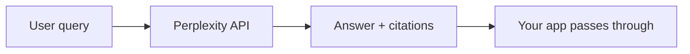
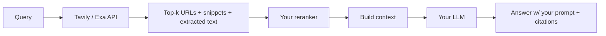
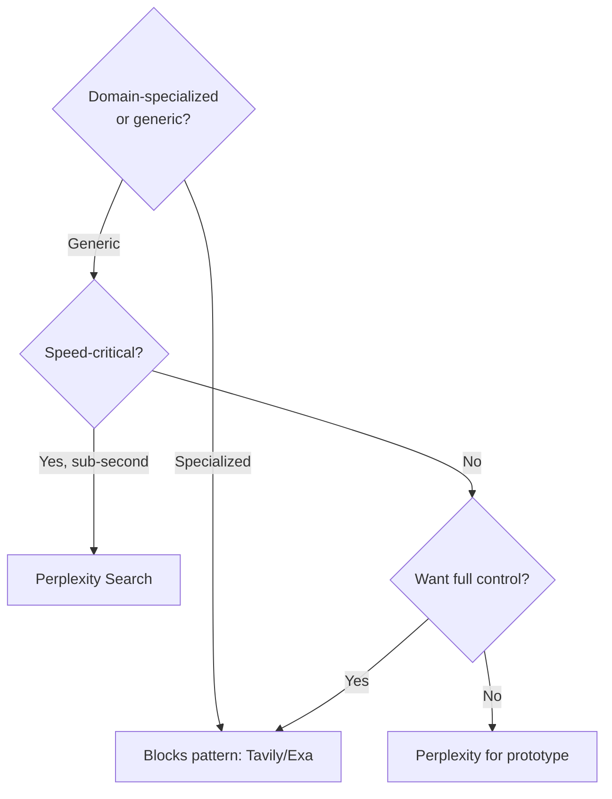
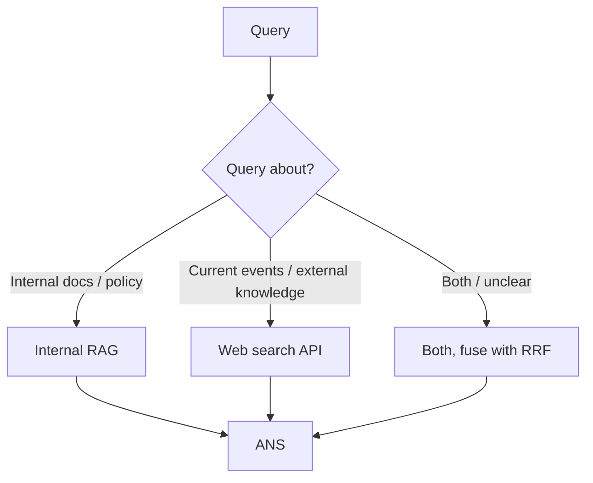
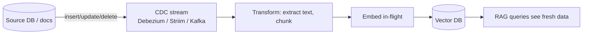
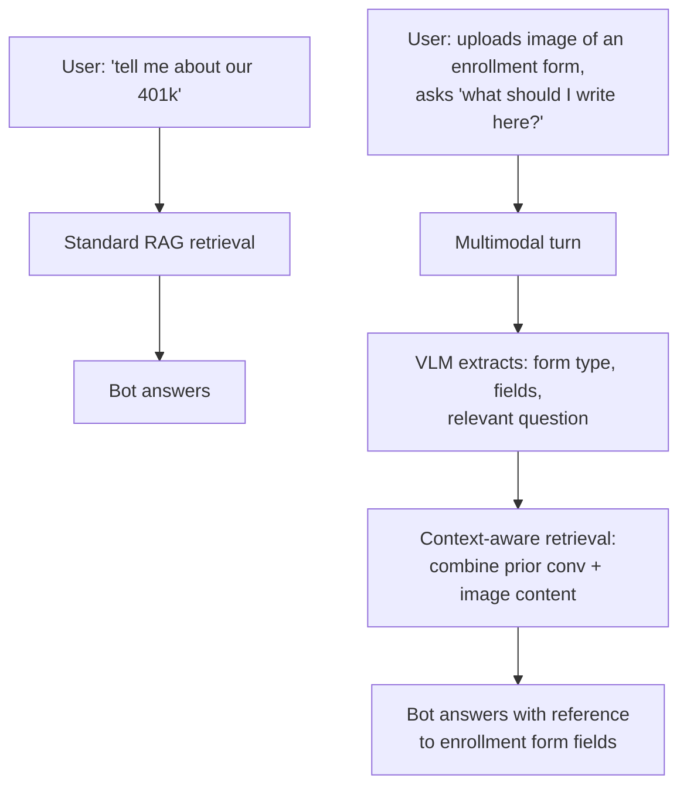
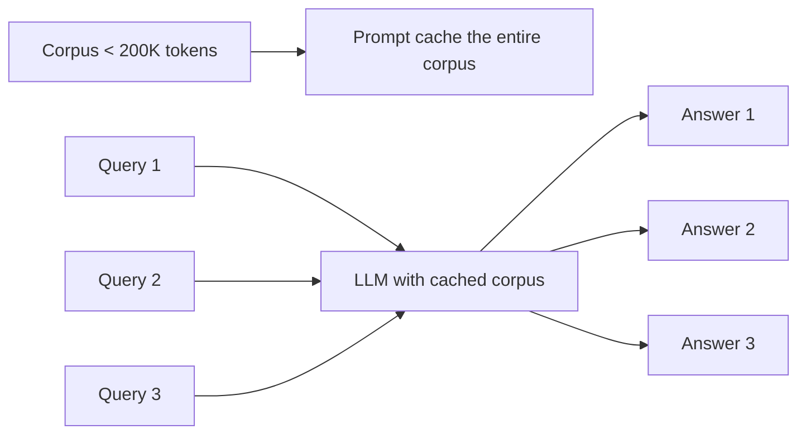

# Module 19 — Web, Real-time & Multimodal Retrieval

> Three patterns that extend RAG beyond the static-corpus assumption: pulling from the live web, ingesting changes in real-time, and handling multimodal turns in conversations.

---

## Part 1 — Web search APIs (the "external corpus" pattern)

When the corpus is **the entire internet**, you don't index it yourself. You delegate to a web-search API.

### The 2025-2026 landscape

| API | Strengths | Latency | Notes |
|-----|-----------|---------|-------|
| **Tavily** | RAG-quality, factual verification, SOC 2 | ~1-2s | Acquired by Nebius Feb 2026; production default for many. |
| **Exa** | Semantic / research queries; **94.9% on SimpleQA** with their Research API | ~2-3s | Best for "find a paper / article on..." style queries. |
| **Perplexity Search API** | Returns finished answers (not just URLs); current events | **~358ms median** (fastest) | "Already-synthesized" answers — different from giving you snippets. |
| **You.com Search API** | Multi-step reasoning queries | ~1-3s | Strong on complex queries needing multiple retrievals. |
| **Linkup** | Citation grounding, entity coverage | ~1-2s | Strong on retrieval breadth + grounding accuracy. |
| **Serper / Brave Search API** | Volume / cost | ~500ms | Cheaper at scale; less polished. |
| **Google / Bing official** | Ground truth | varies | Heavy quota / cost. |

The **15× latency spread** (358ms Perplexity vs 5.49s slowest) is real and matters. For interactive products, latency is often the deciding factor.

### Two architectural choices

#### Choice A — Web search returns finished answers (Perplexity-style)



**Pros:** fastest path to a working product. Quality is "Perplexity-quality."
**Cons:** you don't control retrieval, ranking, or generation. Hard to fine-tune for your domain. Citation/grounding quality is whatever Perplexity decided.

#### Choice B — Web search returns URLs + snippets (Tavily / Exa style)



**Pros:** you control everything downstream. Plug into your existing reranker, prompt, citation logic, abstention rules.
**Cons:** more engineering. More latency (your stack on top of theirs).

### When to pick which



### Hybrid — internal corpus + web

The mature production pattern is **route based on query type:**



A function-calling LLM (Module 10) can pick. ChatGPT, Perplexity, and Claude.ai all do versions of this internally.

### Production gotchas

- **Rate limits.** Most web search APIs throttle hard at scale.
- **Cost per query.** Tavily ~$0.005-0.02/query depending on tier. Multiplies at scale.
- **Citation quality varies wildly.** Always validate citations exist (Module 14's pattern) — the API may return URLs that 404.
- **Stale snippets.** Some APIs return cached snippets that are days old.
- **Geographic / language bias.** APIs trained on English Western web underperform on other languages / regions.

---

## Part 2 — Real-time / CDC ingestion

The static-corpus assumption breaks when:
- Source data changes minute-by-minute (orders, tickets, sensor data).
- Users expect "what happened in the last 5 minutes" to be answerable.
- Compliance requires near-real-time consistency.

### Naive approach (what most teams start with)

```
nightly_cron:
    re-embed entire corpus
    rebuild index
```

Works at low scale; falls apart when:
- Corpus is too big to re-embed nightly.
- Users need < hour latency.
- Most documents didn't change but you re-embed all of them anyway (90%+ wasted work).

### Change Data Capture (CDC) approach



Every insert/update/delete in the source database triggers an embedding update in the vector store. The vector DB becomes a real-time mirror.

### Tooling

| Tool | Role |
|------|------|
| **Debezium** | Open-source CDC for MySQL, Postgres, MongoDB, etc. |
| **Striim** | Commercial CDC + streaming embedding generation. |
| **Streamkap** | Newer; managed CDC-to-vector platform. |
| **Confluent Flink + embedding actions** | Streaming SQL with inline embedding generation; "any model, any vector DB, any cloud." |
| **Kafka Connect + custom processor** | Roll your own. |

### LiveVectorLake (2025 research)

[LiveVectorLake](https://arxiv.org/abs/2601.05270) — chunk-level CDC. Detects which **chunks** within a document changed (not just "this document changed") and only re-embeds those.
- **10-15% content re-processing** (vs 85-95% for standard upsert).
- Versioned snapshots — query "as of timestamp X" works.

### Performance / quality wins

Striim's reported numbers: **40-60% accuracy improvement** for time-sensitive queries vs daily batch.

### Architectural decisions

1. **Latency target.** Sub-minute → CDC; sub-day → batch may be enough.
2. **Embedding cost.** API embedding has per-request cost; in-flight embedding for high-volume CDC can get expensive.
3. **Vector DB write throughput.** Some DBs handle high write volume better (Qdrant, Milvus); others are read-optimized.
4. **Versioning.** Do you need to query "as of last week"? Then you need versioned snapshots, not a live mirror.

### Common failure modes

- **Schema drift.** Source schema changes; downstream embedder breaks. Track schema versions.
- **Backpressure.** CDC produces faster than embedder consumes; queue grows. Need buffer + scaling.
- **Embedder API outages.** When the embedder is down, the pipeline halts. Need fallback / queue persistence.
- **Late-arriving data.** Out-of-order events in distributed systems. Watermarking matters.

---

## Part 3 — Multimodal RAG (deeper than Module 12)

Module 12 covered the basics: caption-then-text, native multimodal embedders, hybrid. This part extends to **multimodal conversational RAG** — a user uploads an image mid-conversation; what does retrieval do?

### The pattern



Key design choices:
- **VLM-as-encoder vs VLM-as-decoder?**
  - Encoder: image → caption / description → text retrieval. Lossy, simple.
  - Decoder: image is in the LLM's input; LLM reasons over image AND retrieved text. Higher quality, higher cost.
- **Single multimodal embedder vs separate text + image indexes?**
  - Single (Gemini Embedding 2, ColPali) — uniform retrieval; less mature.
  - Separate — well-trodden; need RRF fusion to combine results.

### When user content is multimodal

- **Documents with images** (forms, receipts, screenshots): use ColPali-style late interaction over image patches; or VLM-caption + text-embed fallback.
- **User-uploaded images mid-conversation**: VLM extraction at the conversation rewriter step (Module 11), then standard RAG with the extracted query.
- **Voice / audio**: Whisper transcribes; treat as text. For real-time speech RAG, transcription latency dominates.

### Multimodal embedders (re-table from Module 12)

| Model | Modalities | Notes |
|-------|-----------|-------|
| **Gemini Embedding 2** | text+image+video+audio+PDF | Single 3072-dim space. MTEB English 68.32. Production-ready. |
| **Qwen3-VL-2B** | text+image | Apache 2.0; smaller modality gap (0.25 vs Gemini's 0.73). |
| **ColPali / ColQwen** | text+image patches | Late interaction; SOTA for visually-rich PDFs. |
| **CLIP / OpenCLIP** | text+image | Foundational; less competitive in 2026. |
| **Voyage Multimodal 3.5** | text+image+PDF | API alternative. |

---

## Part 4 — Long-context as cache (the "load it all" pattern)

A pragmatic alternative to RAG when corpus fits in context: **load the entire corpus once, cache it, query many times.**

### How it works



### Numbers (mid-2025)

- **Anthropic prompt caching:** cached tokens cost ~10% of normal input tokens; cache TTL 5 min (extendable).
- **Gemini 2.5 Pro context caching:** ~75% cost reduction on cached tokens.
- **OpenAI prompt caching:** automatic for repeated prefixes; ~50% discount.

### When this beats RAG

- **Small-to-medium corpus** (< 200K tokens) that's **stable**.
- **Many queries against the same corpus** (e.g., a chatbot that repeatedly answers questions about one product manual).
- **Quality matters more than cost** — long-context lets the model see everything; RAG only sees top-k.

### When RAG still wins

- **Corpus too big** for any model's context window.
- **Frequent updates** (cache TTL of 5 min vs corpus that changes hourly).
- **Multi-tenant** (each tenant has different corpus; no shared cache).
- **Strict latency** (loading 200K cached tokens still adds latency vs retrieving 5K tokens).
- **Cost-per-query at scale** (cache discount helps but RAG's smaller context wins on volume).

### The "context caching as RAG" pattern

For sub-200K stable corpora, this often beats RAG outright:
- Load corpus once → cache.
- Each query gets full corpus context, model picks what's relevant.
- No retrieval failures (the model "retrieves" via attention).
- Citation quality is high (model can point to any span).

The corpus needs to fit AND be stable. If it does and is, **try this before building RAG.** Many teams over-engineer.

---

## Sanity check

1. Three web-search APIs and their differentiation in one sentence each.
2. The 15× latency spread across web-search APIs — what's the fastest reported median?
3. CDC vs nightly batch — at what latency target does CDC start to earn its keep?
4. LiveVectorLake's chunk-level CDC reduces re-processing from 85-95% to what?
5. Multimodal embedder choice: when does ColPali beat caption-then-text?
6. The "long context as cache" pattern: corpus size cutoff and TTL constraint?

---

## References

- Web search APIs comparison — [HumAI 2025 guide](https://www.humai.blog/tavily-vs-exa-vs-perplexity-vs-you-com-the-complete-ai-search-api-comparison-2025/), [WebSearchAPI.ai alternatives](https://websearchapi.ai/blog/tavily-alternatives)
- Striim — [Real-time RAG streaming embeddings](https://www.striim.com/blog/real-time-rag-streaming-vector-embeddings-and-low-latency-ai-search/)
- Streamkap — [CDC to vector DBs](https://streamkap.com/resources-and-guides/streaming-to-vector-databases)
- LiveVectorLake — [arXiv:2601.05270](https://arxiv.org/abs/2601.05270)
- Confluent — [Real-time embeddings with Flink](https://www.confluent.io/blog/flink-action-create-vector-embeddings/)
- Anthropic prompt caching — [docs](https://platform.claude.com/docs/en/build-with-claude/prompt-caching)
- Gemini context caching — [Vertex AI docs](https://cloud.google.com/vertex-ai/generative-ai/docs/context-cache/context-cache-overview)

---

**Next:** [Module 20 — Production Engineering](20_production_engineering.md)

**TOC** [Table of Contents](00_Table_Of_Contents.md)