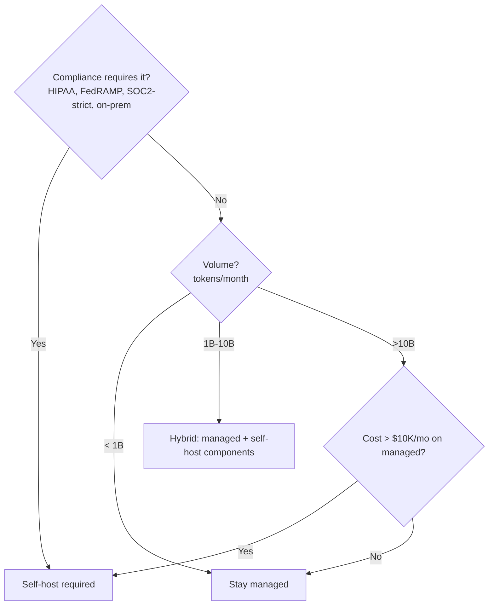
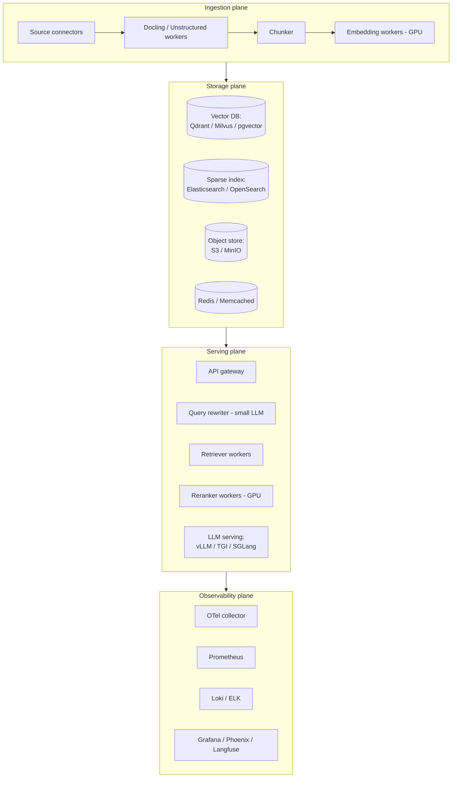
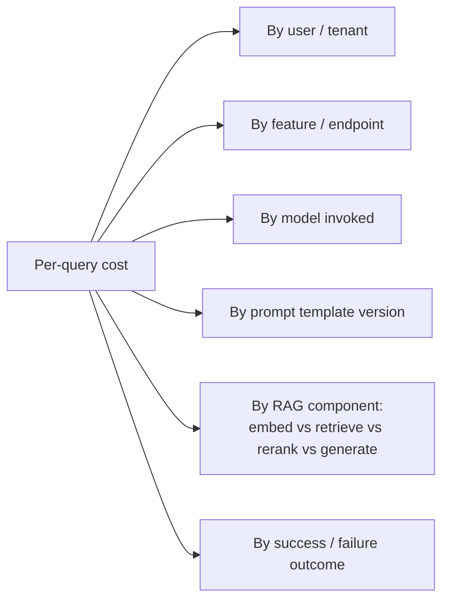
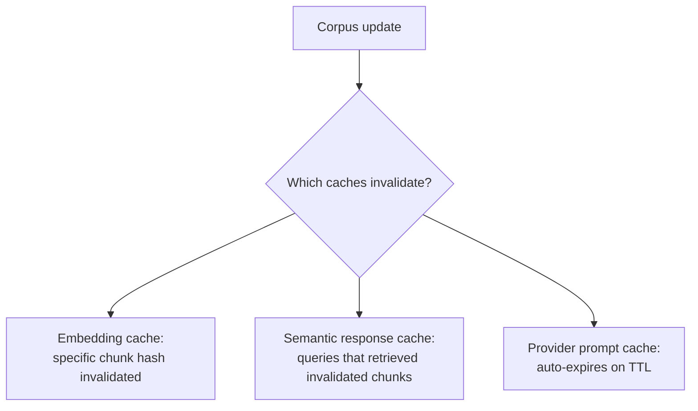
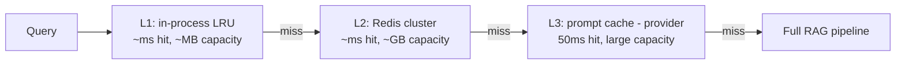

# Module 20 — Production Engineering

> Module 9 covered production *concerns*. This module covers production *engineering*: self-hosted infrastructure, FinOps for RAG, and advanced caching patterns.

---

## Part 1 — Self-hosted RAG infrastructure

When you outgrow managed services (Pinecone, OpenAI API, Cohere API) the question becomes: **what does a real self-hosted production stack look like?**

### When to self-host



**Rule of thumb:** > 10B embedding tokens/month OR > $10K/mo managed costs is when self-host starts winning. Below that, managed services are usually cheaper after fully-loaded ops cost.

### The components in a self-hosted stack



### LLM serving — the GPU question

| Server | Strengths | Trade-offs |
|--------|-----------|-----------|
| **vLLM** | OpenAI-compatible API; PagedAttention; Apache 2.0; broad model support | The 2026 default. Some operational complexity. |
| **TGI (Text Generation Inference)** | HF-native; production-grade | Continuous batcher lacks chunked prefill; less flexible than vLLM |
| **SGLang** | Best-in-class throughput; structured generation | Newer; smaller community |
| **TensorRT-LLM** | Best NVIDIA-native perf | NVIDIA-locked; complex |
| **Ollama** | Easy local dev | Single-user; not production |

**2026 default for production:** vLLM on Kubernetes with KEDA autoscaling.

### Kubernetes deployment patterns

Key things you have to get right:

1. **GPU node pool with taints/tolerations** — `nvidia.com/gpu=present:NoSchedule` taint; GPU workloads tolerate it; non-GPU workloads can't accidentally land on expensive nodes.
2. **NVIDIA device plugin / GPU operator** — exposes GPUs to Kubernetes scheduler.
3. **KEDA-based autoscaling** — scale replicas based on queue depth (Prometheus metrics) NOT just CPU. LLM workloads' "busyness" is queue depth, not CPU.
4. **Pod disruption budgets** — protect against simultaneous evictions.
5. **Topology spread constraints** — distribute replicas across availability zones.
6. **Resource requests AND limits** — without limits, one runaway request can OOM the GPU.

### NVIDIA reference architecture

[NVIDIA released an official agentic RAG reference architecture in 2025-2026](https://docs.nvidia.com/) bundling:
- **NVIDIA NIM microservices** — packaged inference for LLMs and embedders.
- **NVIDIA cuVS** — GPU-accelerated vector search library.
- Reference Helm charts for Kubernetes.
- Standardized OTel-LLM observability.

If you're an NVIDIA shop, the reference architecture is the cheapest path. If not, build with vLLM + Qdrant + Langfuse.

### Cost comparison (rough)

For a workload of 10B tokens/month embeddings + 100M queries (estimate):

| Configuration | Estimated monthly cost |
|---------------|------------------------|
| Fully managed (OpenAI + Pinecone + Cohere) | $40K-80K |
| Hybrid (managed LLM + self-hosted vectors) | $20K-40K |
| Fully self-hosted (vLLM + Qdrant + Anthropic API for non-PHI) | $10K-20K + GPU lease costs |
| Fully self-hosted on-prem | $5K-15K + amortized hardware |

Numbers depend heavily on workload patterns. Don't take these as gospel; **always model your specific case.**

---

## Part 2 — FinOps for RAG (TokenOps)

The discipline of attributing AI costs to teams / users / features. Increasingly its own specialty.

### The visibility problem

> "In most organizations scaling AI agents, model access outpaces cost visibility — teams know their total monthly API spend but not which model, prompt, workflow, or user is responsible for it."

A single $100K/month bill that can't be broken down is a management failure. Per-query attribution is non-negotiable at scale.

### What to attribute



### Tooling for cost attribution

| Tool | Role |
|------|------|
| **Portkey / Helicone** | LLM gateway proxies that inject per-request cost tracking. Drop-in. |
| **Langfuse / Traceloop** | OSS LLM tracing with cost attribution; per-trace cost rollup. |
| **Datadog LLM Observability** | If you're already on Datadog. |
| **Finout / Vantage** | Multi-cloud + LLM FinOps platforms. |
| **Cloudchipr** | AI infrastructure cost optimization. |

### Cost reduction levers (in priority order)

1. **Trim irrelevant context** — most native RAG sends 70-80% irrelevant tokens to the model. Tighter reranking → 30-60% input-token reduction.
2. **Model routing** — easy queries go to cheap model; hard ones to expensive. GPT-5's architecture explicitly does this.
3. **Prompt caching** (provider-side) — Anthropic / OpenAI / Gemini all support; 70-90% reduction on stable prompt prefixes.
4. **Semantic response cache** — 30-50% hit rate on repetitive workloads cuts cost proportionally.
5. **Right-size embedder** — text-embedding-3-small is 1/6 the cost of -large; quality delta often < 5%.
6. **Right-size reranker** — mxbai-rerank-base often gets 90% of Cohere v4 quality at fraction of cost.
7. **Batch where possible** — embedding APIs often have batch tiers.
8. **Self-host high-volume components** — once breakeven analysis says yes.

### The 2025 spend reality

- Average monthly AI spend: **$85,521 / organization in 2025** (36% YoY jump).
- Native RAG implementations waste **70-80% of input tokens.**
- Aggressive optimization can cut costs **30-60% without quality loss.**

### Per-query cost target

For a healthcare or financial RAG product:
- **Acceptable:** $0.05-0.20 per query.
- **Aspirational:** $0.01-0.05 per query.
- **Unacceptable:** $1.00+ per query at scale.

Track p50 AND p99 cost. Tail-cost spikes (a single agent loop ballooning) are how budgets blow up.

---

## Part 3 — Advanced caching

### Recap

Module 9 introduced three caches: embedding cache, semantic response cache, prompt cache. This part goes deeper into operational realities.

### Cache invalidation — the hard problem



**Key invariant:** the semantic response cache must know **which retrieved chunks** an answer was based on. When any of those chunks change/delete, the cached response is stale.

Implementation:
```python
cached_response = {
    "query_hash": "...",
    "answer": "...",
    "supporting_chunk_ids": ["doc_142_chunk_07", ...],
    "supporting_chunk_versions": ["v3", "v1", ...],
    "ttl": "...",
}

# Invalidation
def invalidate_on_chunk_change(chunk_id, new_version):
    # find all cached responses whose supporting_chunk_ids contain this chunk
    # and whose supporting_chunk_versions don't match new_version
    # → invalidate them
```

This is real engineering work. Teams skipping it serve stale answers indefinitely.

### Multi-tier cache hierarchy



Each tier catches different patterns:
- **L1** — repeated identical queries within seconds (e.g., a UI re-renders).
- **L2** — semantic-similar queries within minutes-hours.
- **L3** — same prompt template used by many users.

### Matryoshka two-stage retrieval as a cache trick

If your embedder is MRL-trained:
- Search 256-dim first → top 200 candidates fast.
- Rescore with 1536-dim → top 10 accurate.

This is effectively a **dimension cache** — store and search a smaller version first, then expand to full only on the survivors. Almost-free quality-preserving cost cut.

### Cache poisoning concerns

A subtle attack: if your semantic cache caches answers based on query embeddings, an attacker can craft queries that look semantically similar to legitimate queries but exploit the cache to return their own injected content.

Mitigation:
- Cache only **vetted** answers (passed all your faithfulness / abstention checks).
- Sign cached entries with HMAC; verify on read.
- Per-tenant cache namespaces; no cross-tenant cache hits.

---

## Part 4 — Operational maturity ladder

A mental model for where your RAG ops sit:

| Level | What you have |
|-------|---------------|
| **0 — Demo** | Notebook + API keys + small corpus |
| **1 — Prototype** | Service deployed, basic eval set, one model, no caching |
| **2 — Beta** | OTel tracing, response cache, eval-as-CI, alerting on errors |
| **3 — Production** | Per-stage metrics, drift monitoring, hallucination detector, feature flags, A/B framework |
| **4 — Mature** | Cost attribution, automated re-indexing on embedder upgrade, periodic eval refresh, red-team probes weekly, quarterly human SxS, capacity planning |
| **5 — Scaled** | Self-hosted infrastructure, multi-region, FedRAMP/HIPAA-compliant, full audit trails, FinOps reporting, dedicated platform team |

Most teams plateau at level 2-3. Level 4-5 takes a dedicated platform team.

For your goals (Optum architect/EM track in healthcare): **fluency at level 3-4** is the architect interview bar; level 5 is what you'd build in role.

---

## Sanity check

1. At what monthly cost level does self-hosting start to win over managed services?
2. Why is **queue depth** the right autoscaling signal for LLM workloads (not CPU)?
3. Three priority levers for cutting RAG costs without quality loss.
4. What invariant must the semantic response cache maintain to avoid serving stale answers?
5. The cache-poisoning attack: what is it and what mitigates it?
6. Per-query cost target ranges for healthcare RAG (acceptable / aspirational / unacceptable).

---

## References

- vLLM production guide — [SitePoint](https://www.sitepoint.com/vllm-production-deployment-guide-2026/)
- vLLM on Kubernetes — [renezander.com](https://renezander.com/blog/self-hosted-llm-kubernetes/)
- NVIDIA agentic RAG reference architecture — [docs.nvidia.com](https://docs.nvidia.com/)
- Token economics / TokenOps — [Finout guide](https://www.finout.io/blog/token-economics-and-tokenops-the-definitive-guide-to-finops-for-tokens)
- AI cost optimization guide — [Cloudchipr](https://cloudchipr.com/blog/ai-cost-optimization)
- Economics of RAG — [thedataguy.pro](https://thedataguy.pro/blog/2025/07/the-economics-of-rag-cost-optimization-for-production-systems/)
- FinOps for AI — [Truefoundry](https://www.truefoundry.com/blog/finops-for-ai)

---

**Next:** [Module 21 — Benchmarks, Tokenization & Trade Studies](21_benchmarks_tokenization_trades.md)

**TOC** [Table of Contents](00_Table_Of_Contents.md)