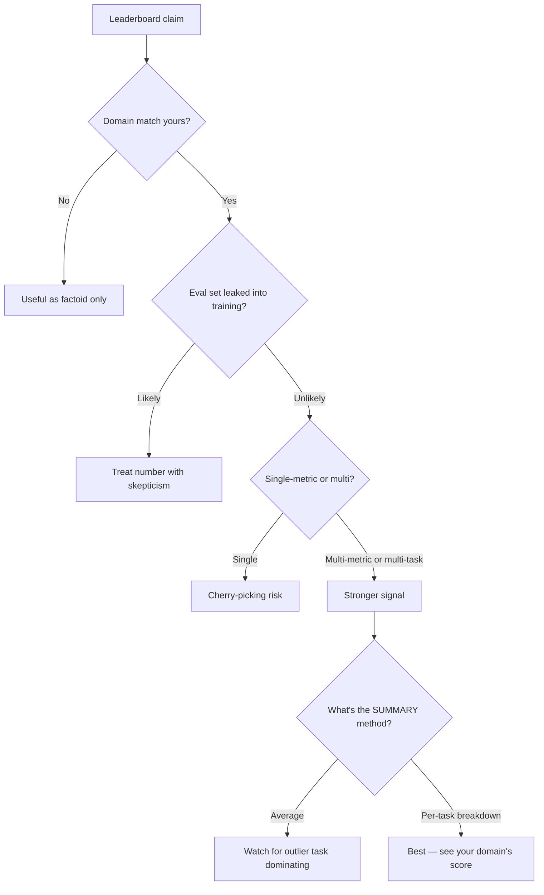
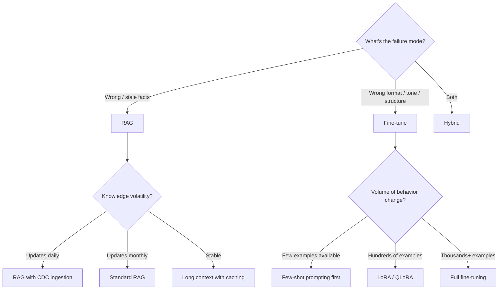

# Module 21 — Benchmarks, Tokenization & Strategic Trade Studies

> The closing module on this topic. Three things every senior architect needs fluency in before walking into a RAG-design interview: which benchmark proves what, the tokenization edge cases that silently break retrieval, and the RAG-vs-fine-tune decision framework.

---

## Part 1 — The benchmark zoo, by use case

Module 13A introduced the benchmarks. This is the **decision-tree version** for fast lookup.

### "What benchmark do I cite for X?"

| You want to claim... | Cite this benchmark | Headline metric |
|---------------------|--------------------|-----------------|
| "Our embedder is competitive on retrieval" | **MTEB Retrieval** sub-track | NDCG@10 average |
| "Our reranker meaningfully helps" | **BEIR** | NDCG@10 across 18 zero-shot domains |
| "We handle exact-match in-distribution well" | **MS-MARCO** passage ranking | MRR@10 |
| "We handle multi-hop reasoning" | **HotpotQA** or **FRAMES** | Exact-match / accuracy |
| "Our RAG is end-to-end production-quality" | **RAGBench** (TRACe metrics) | Multiple |
| "Our hallucination rate is low" | **RAGTruth** | Word-level hallucination F1 |
| "We're robust to multi-turn conversation" | **MTRAG** | Recall@5 across turns |
| "We handle long context honestly" | **NoLiMa** | Accuracy degradation 1K→32K |
| "Multilingual retrieval works" | **MIRACL** (18 langs) | NDCG@10 average |
| "We do code retrieval" | **CodeSearchNet** or **MTEB-Code** | NDCG / MRR |
| "Legal retrieval works" | **LegalBench-RAG** | Precision / recall on pinpoint citations |
| "Medical knowledge holds" | **MedQA**, **MIRAGE**, **MedRAG** | Accuracy |
| "Text-to-SQL is solid" | **BIRD**, **Spider** | Execution accuracy |

**Rule:** never quote one benchmark without naming the metric AND the version. "We score 0.71 on BEIR" is meaningless without "(NDCG@10, average across 18 datasets, BEIR v1.0.0)."

### Benchmark gotchas

1. **Saturation.** MS-MARCO is largely saturated; new methods barely move the needle. Cite NoLiMa for current frontiers in long-context.
2. **Test-set contamination.** Many models trained on benchmark training sets; some leaked into test sets. Always check the benchmark's leakage status.
3. **English bias.** Most benchmarks are English. Multilingual scores on MTEB are notoriously inconsistent across languages.
4. **Retrieval vs end-to-end.** A reranker that wins BEIR may not lift end-to-end RAG quality. Always measure end-to-end on your eval set too.
5. **Single-needle lies.** NIAH (Needle In A Haystack) saturates at 99% on frontier models; multi-needle / NoLiMa show real degradation.

### Reading a leaderboard well



---

## Part 2 — Tokenization edge cases that break RAG

These are bugs you discover *after* you ship.

### Edge case 1 — Invisible Unicode characters

Zero-width characters break tokenization silently:

| Char | Code | Effect |
|------|------|--------|
| ZWSP (zero-width space) | `U+200B` | Splits a word into rare subword fragments |
| Soft hyphen | `U+00AD` | Same |
| BOM | `U+FEFF` | Common in Windows-saved files |
| RTL marks | `U+202E` | Reverses display; can hide injected content |
| Hair space | `U+200A` | Subtle whitespace variant |

**Symptom:** the user types "401k" but copy-pasted from a wiki it's actually "401​k". Embedding produces a different vector → retrieval fails completely.

**Fix:** Unicode normalization at ingestion AND query time:
```python
import unicodedata, re

def normalize_text(s: str) -> str:
    s = unicodedata.normalize("NFKC", s)         # canonical decomposition + composition
    s = re.sub(r"[​-‏‪-‮⁠-⁤]", "", s)
    return s.strip()
```

Apply to every text entering the pipeline. Most teams discover this only after a security audit or a customer complaint.

### Edge case 2 — BPE pre-tokenization quirks

Most tokenizers (GPT, Claude, BERT-family) don't operate on raw Unicode. They first split by whitespace and punctuation (pre-tokenization), then BPE within each pre-token.

Implications:
- **Words separated by NBSP (non-breaking space) tokenize differently** from words separated by regular space.
- **Punctuation differences** ("Q4 2024" vs "Q4 2024," — the comma changes nearby token splits).
- **Non-English languages** without space-delimited words (Chinese, Japanese, Thai, Khmer) tokenize less efficiently — more tokens per word.

This is why the "context cliff" is **worse in non-English** (Module 15) — the same content in Chinese consumes more tokens than in English, pushing relevant info further into the context window where lost-in-the-middle hurts.

### Edge case 3 — Token boundaries vs chunk boundaries

A 512-token chunk limit is enforced at the *tokenizer's* boundary, not yours. Implications:
- A "200-character chunk" can be 50-300 tokens depending on language and content.
- BPE chunk boundaries may split mid-word on rare vocabulary.
- Chunk overlap measured in characters can produce 0-token overlap on dense content.

**Best practice:** chunk by tokens (using the embedder's actual tokenizer), not by characters. LangChain's `RecursiveCharacterTextSplitter.from_huggingface_tokenizer(tokenizer, chunk_size=...)` does this.

### Edge case 4 — Subword robustness

A typo (`"refund"` → `"refnud"`) tokenizes into completely different subwords. Embedding similarity drops. Module 11's query rewriter helps; spell correction at the query layer (cheap LLM call) helps more.

### Edge case 5 — Padding / special tokens

Some tokenizers prepend `[CLS]`, append `[SEP]`, etc. If you compute embeddings on raw text but your tokenizer adds these, the embedding is over text + special tokens, which is what was trained — but if you're combining manual concatenation, you can accidentally double-add specials and produce nonsense embeddings.

### Production checklist

- [ ] Unicode normalization at ingestion AND query time.
- [ ] Token-aware chunking using the actual embedder's tokenizer.
- [ ] Spell / typo correction layer for user queries (cheap LLM rewrite).
- [ ] Visibility test: pipe random Unicode garbage through your pipeline; verify nothing crashes.
- [ ] Per-language token-density audit — non-English content uses 2-3× more tokens.

---

## Part 3 — RAG vs Fine-tuning: the strategic trade study

The most-asked architect interview question. Here's the proper framework.

### What each is FOR

| | RAG | Fine-tuning |
|---|---|---|
| **Strength** | Knowledge that changes / can't fit in weights | Behavior, format, tone, style consistency |
| **Update mechanism** | Update the corpus | Re-train (slow, expensive) |
| **Failure mode if wrong** | Returns "I don't know" or hallucinates | Locked-in mistakes / staleness |
| **Cost per inference** | Higher (retrieval + larger context) | Lower (smaller context) |
| **Citation / grounding** | Native | None |
| **Best for** | Facts, regulations, ever-changing data | Voice, classification, structured output, decision policies |

### The decision tree



### Empirical findings (2025)

A few data points from the recent literature:

1. **Code completion benchmark** (arXiv:2505.15179): scaling fine-tuning from 90K → 120K files gave only **0.16-0.35% improvement** (diminishing returns). RAG (BM25 / CoCoSoDa) gave **2.13-2.26%** improvements at the same scale. **Fine-tuning saturates around 300M tokens; RAG keeps improving with corpus size.**

2. **Medical study (PMC 2025)**: comparison across Llama-3.1-8B, Phi-3.5-mini, Gemma-2-9B, Mistral-7B, Qwen2.5-7B with three strategies (FT, RAG, FT+RAG). Results varied by model and question type, but **hybrid (FT + RAG) consistently beat either alone** for safety-critical clinical QA.

3. **Snorkel AI study**: a fine-tuned smaller model can match GPT-3 performance while being **1,400× smaller** — for narrow tasks. This is the case for FT.

4. **Agriculture domain** (arXiv:2401.08406): Microsoft's RAG-vs-FT case study found that combining RAG with FT consistently outperformed either alone on factual + style requirements.

### The 2026 production consensus

> **Volatile knowledge → retrieval. Stable behavior → fine-tuning.**

This is the architecturally clean separation. Concrete example:

- A customer-support chatbot for a SaaS product:
  - **Fine-tune** on tone, brand voice, refund policy decision logic, escalation rules.
  - **RAG** on the help center articles (which update weekly), customer-specific data (constantly changing), pricing tiers (rarely changes).

### When to consider neither

Sometimes the right answer is "use a frontier model with prompt engineering." Reasons:
- Your need fits in a 5-shot prompt.
- The task is genuinely general (translation, summarization, code review).
- Update cadence is "never" (stable forever).

This is your "do less" baseline. Always evaluate it before RAG / FT.

### Cost comparison (rough orders of magnitude)

| Approach | Setup cost | Per-query cost | Update cost |
|----------|-----------|----------------|-------------|
| **Prompt only (frontier model)** | ~0 | high | 0 |
| **RAG over frontier model** | $1K-10K (corpus prep) | medium-high | low (per-doc embed) |
| **LoRA fine-tune** | $5K-50K (data + train) | low | medium (re-train) |
| **Full fine-tune** | $50K-500K | low | high |
| **Continued pre-training** | $500K+ | low | very high |

For most projects: prompt → RAG → LoRA → full FT, in that order, with each step justified by clear gains over the previous.

### A clarifying interview answer

> "RAG handles knowledge that changes; fine-tuning handles behavior that's stable. Most production systems need both: fine-tune for tone, decision policies, and structured output; retrieve for facts, regulations, and customer-specific data. The architecture cleanly separates volatile-knowledge concerns from stable-behavior concerns. For my use case at [Optum], we have stable clinical decision frameworks (LoRA candidate) layered on top of constantly-updated medical guidelines and patient records (RAG mandatory). Trying to fine-tune on guidelines would lock in stale knowledge; trying to RAG on tone would produce inconsistent voice. Doing both, on appropriate components, is the production answer."

This is the architect-level answer interviewers want.

---

## Sanity check

1. You want to claim "our reranker is competitive." Which benchmark and metric?
2. Why does the same content take 2-3× more tokens in Chinese than English, and how does this compound long-context degradation?
3. Three Unicode categories you'd strip during ingestion, and one example char per category.
4. Failure mode → diagnosis: "the model is confidently giving last year's pricing."
5. Failure mode → diagnosis: "the bot's tone is inconsistent — sometimes formal, sometimes casual."
6. Empirical 2025 finding on fine-tuning at scale: what plateau effect was observed in code completion?

---

## References

- BEIR — [github.com/beir-cellar/beir](https://github.com/beir-cellar/beir)
- MTEB — [huggingface.co/spaces/mteb/leaderboard](https://huggingface.co/spaces/mteb/leaderboard)
- RAGBench — [arXiv:2407.11005](https://arxiv.org/abs/2407.11005)
- RAGTruth — [github.com/ParticleMedia/RAGTruth](https://github.com/ParticleMedia/RAGTruth)
- FRAMES — Google's multi-hop benchmark
- NoLiMa — [arXiv:2502.05167](https://arxiv.org/abs/2502.05167)
- Tokenization pitfalls — [Invisible Characters That Break Prompts and RAG](https://blog.thegenairevolution.com/article/tokenization-pitfalls-invisible-characters-that-break-prompts-and-rag-2)
- Subword robustness — [arXiv:2406.11687](https://arxiv.org/html/2406.11687)
- RAG vs Fine-tuning agriculture case study — [arXiv:2401.08406](https://arxiv.org/abs/2401.08406)
- RAG vs FT in code completion (2025) — [arXiv:2505.15179](https://arxiv.org/html/2505.15179v1)
- Medical RAG vs FT study (2025) — [PMC 12292519](https://pmc.ncbi.nlm.nih.gov/articles/PMC12292519/)

---

This concludes the deep-dive RAG topic. **22 modules, 22 quizzes (counting 13A/B/C as three), 10 code notebooks, FACTS.md, full citation trail.**

**Back to:** [README](README.md) | [FACTS.md](FACTS.md)

**TOC** [Table of Contents](00_Table_Of_Contents.md)