# Module 22 — GraphRAG, Deep Dive

> Modules 7 and 18 introduced GraphRAG and graph-RAG construction. This module is the **deep treatment**: the full pipeline of Microsoft's GraphRAG with a worked example, the alternative architectures (HippoRAG/2, PathRAG, OG-RAG, HyKGE, GraphReader, MedGraphRAG), hybrid Vector+Graph routing patterns, evaluation methodology aimed at graph-RAG specifically, a cost calculator, and a healthcare-domain case study.
>
> No length cap. This is the architect-interview-ready treatment.

---

## Part 1 — Why graphs at all?

### The problem vanilla RAG cannot solve

Take a query like:

> *"What are the main risks that recur across our last five 10-K filings, and which executives are responsible for each?"*

A vanilla vector RAG sees this as one query. It retrieves the top-K most semantically similar chunks. It cannot:

1. **Aggregate across documents** — by design, vector RAG returns per-chunk hits; it doesn't "summarize themes across an entire corpus."
2. **Traverse relationships** — risks → mitigations → executives → org-chart roles → which person is accountable.
3. **Reason multi-hop** — combine a fact from doc A with a relationship from doc B to derive a conclusion not stated in either.

These three failure modes — **aggregation, traversal, multi-hop** — are exactly what graphs are built for. Graph-based RAG explicitly models entities and relationships, lets you traverse them, and supports both local entity-anchored queries and global themes-across-the-corpus queries.

### The two question types graph-RAG is built for

- **Local / specific** — "What did Dr. Lee say about cardiology in the May 2024 board minutes?" (Anchored on entities, walk a few hops, assemble context.)
- **Global / aggregative** — "What are the top three recurring concerns about reimbursement across the last 12 months of clinical notes?" (Requires summarization across many documents and aggregation up to themes.)

Pure vector RAG handles neither well. The local case may sort-of work if entity names are textually rare and dense embeddings can match them; the global case is a structural failure for vanilla RAG.

### Where the cost lives

Graph-RAG is **expensive at indexing, sometimes faster at query**. The cost asymmetry is the entire economic story:

- Microsoft GraphRAG: **100-1000× more expensive at indexing** than vector RAG; comparable or cheaper at query.
- LazyGraphRAG: defers extraction to query time → **0.1% of full GraphRAG's indexing cost**.
- HippoRAG / HippoRAG 2: schemaless graph + Personalized PageRank → **10-20× cheaper than iterative retrieval**, 6-13× faster on multi-hop queries.

Whether the index-time cost is worth it depends entirely on **how many queries amortize over the index**. We come back to a cost calculator in Part 6.

---

## Part 2 — Microsoft GraphRAG, end-to-end

The Microsoft GraphRAG paper ("From Local to Global: A Graph RAG Approach to Query-Focused Summarization", arXiv:2404.16130, April 2024) is the canonical reference. Here is the full pipeline.

### 2.1 — The indexing pipeline

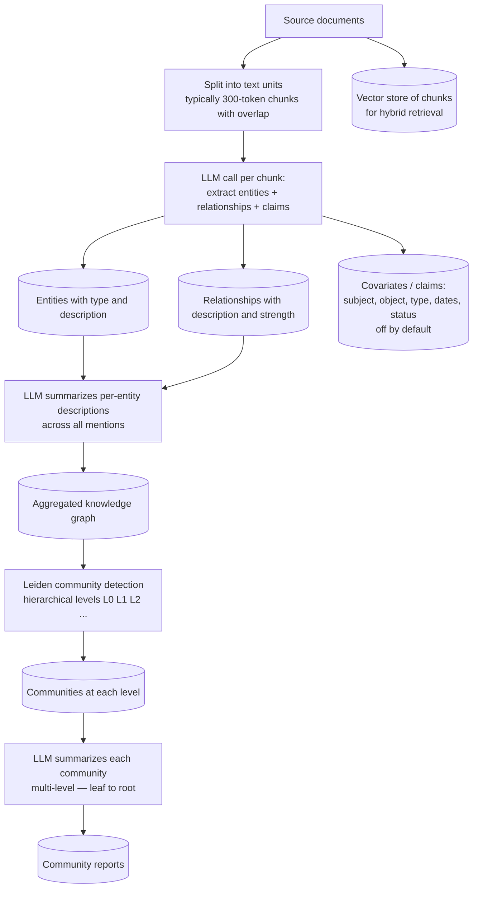

**What's actually extracted:**

For every chunk (~300 tokens), one or more LLM calls produce:

1. **Entities** — `(name, type, description)`. The default prompt extracts `person | organization | geo | event` types; this is customizable for domain corpora.
2. **Relationships** — `(source_entity, target_entity, description, strength)`. Strength is an LLM-judged number from 1-10.
3. **Claims (covariates, off by default)** — `(subject, object, type, status ∈ {TRUE, FALSE, SUSPECTED}, source_text, start_date, end_date, description)`. Example covariate: *"Celia murdered her husband and child (suspected)."* These are positive factual statements with status and time bounds.

**Why the prompt is multi-part:** entities first → use the entity list as anchors to find relationships → independently extract claims. Single-prompt approaches were tried and abandoned because the LLM mixes the roles.

**Entity de-duplication and merging:** the same entity (e.g., "Dr. Lee" appearing in 50 chunks) gets one consolidated node with a merged description. Microsoft uses an LLM to produce the consolidated description from all the individual mentions.

### 2.2 — Leiden community detection

After the graph is built, Microsoft applies the **Leiden algorithm** to detect communities. Why Leiden over Louvain (the older standard)?

- Louvain can produce **disconnected communities** — graphs where the algorithm says "this is one community" but the nodes aren't actually connected through the community's own edges.
- Leiden adds a refinement phase that guarantees **connected, well-separated communities**.

Leiden runs **hierarchically**:

```
Level 0:   ~50-500 small dense communities (fine-grained themes)
Level 1:   ~10-50 medium communities (combine adjacent small ones)
Level 2:   ~3-10 large communities (major themes)
Level 3+:  even larger (root-level abstractions)
```

Each level is *itself* a community structure of the previous level's communities. So you can navigate from "fine-grained sub-theme" up to "broad theme."

The actual algorithm at each level:
1. Local moving — each node tries moving to a neighbor's community if it improves modularity.
2. Refinement — within each community, subdivide if doing so improves modularity.
3. Aggregation — collapse communities into super-nodes; repeat.

### 2.3 — Community report generation

For each community at each level, the LLM produces a **community report**:

```
[Community level 1, ID 47]
- Summary: This community concerns regulatory compliance challenges
  in B2B SaaS contracts during fiscal year 2024...
- Top entities: Acme Inc, Refund Policy 2024, Marketing Director Jane Smith, ...
- Top relationships: Refund Policy 2024 supersedes Refund Policy 2023, ...
- Findings:
  - Finding 1 (importance 8/10): The Q4 2024 refund policy update was driven by ...
  - Finding 2 (importance 6/10): Cross-border tax implications affected ...
```

These community reports are the **primary retrieval targets for global search**. They're stored, indexed, and become the building blocks of cross-document answers.

### 2.4 — Three query strategies

Microsoft GraphRAG ships three:

#### Local search

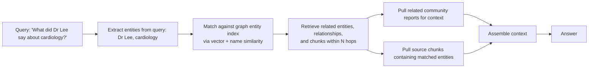

For queries anchored on specific entities. The graph walk surfaces docs that mention those entities directly OR are connected to them through relationships.

#### Global search

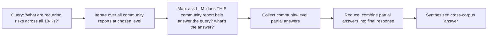

Map-reduce over community reports. Scales because community summaries are pre-computed; each is small (~1-2K tokens). For 10K-doc corpus you might have ~50 community reports at level 1 → 50 LLM calls in the map phase, much cheaper than reading the whole corpus.

#### DRIFT search

Microsoft's "**D**ynamic **R**easoning and **I**nference with **F**lexible **T**raversal" — added late 2024. Combines local and global:

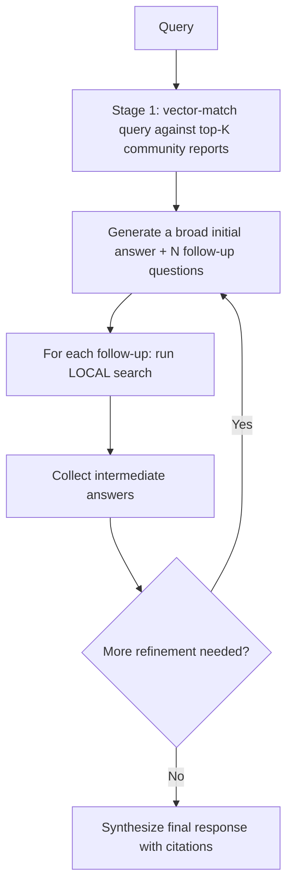

The user query starts global, the system generates follow-ups, follow-ups go local. Balances cost and detail.

### 2.5 — A worked example end-to-end

Let's walk a query through Microsoft GraphRAG on a small concrete corpus.

**Corpus:** 100 healthcare policy documents at Acme Health Network. Topics include: refund policy, prior authorization, parental leave, EHR access, vendor contracts, compliance training.

**Indexing (one-time):**

1. Chunk all 100 docs into ~300-token chunks → ~600 chunks total.
2. For each of 600 chunks, run entity-extraction LLM call. Cost: 600 calls × ~$0.01 = **$6 in extraction**.
3. Consolidate entity mentions across chunks. Say we get ~200 unique entities, ~500 relationships.
4. Run Leiden on the resulting 200-node graph. Get communities at levels 0/1/2: maybe ~40/12/4 communities.
5. For each community, generate a community report. ~56 LLM calls × ~$0.05 (longer context per call) = **$2.80**.
6. Embed the original chunks for fallback vector retrieval. ~$0.05.

**Total indexing cost:** ~$9 for 100 documents (small example). Scales roughly linearly with corpus size up to a point; at 100K documents you're looking at **$2,000-$10,000 in indexing LLM costs**.

**Query (online):** *"What patterns emerge in our refund-related compliance training requirements over the past two years?"*

This is a global/aggregative query. DRIFT or global search:

1. **Match query to top-K community reports.** Top community: "Refund and Compliance Themes 2023-2024" at level 1. Second-top: "Training Programs at Acme."
2. **Generate broad initial answer + follow-ups.** Initial: "The corpus suggests three recurring themes..." Follow-ups: "What specific changes were made in 2024?", "Which roles received the training?", "What were the outcomes?"
3. **Run local search on each follow-up.** Each follow-up has specific entities (e.g., "Q4 2024 update", "manager-level employees"). Local search finds the chunks that mention those entities directly.
4. **Synthesize final answer.** "Three patterns emerged: (a) the Q4 2024 policy update required new training for managers within 30 days of role transitions; (b) cross-border revenue compliance training was added to the curriculum; (c)..." Each statement cites the source chunk and community report.

**Why vector RAG fails here:** the question isn't anchored on any specific entity, isn't paraphraseable into a single semantic match, and requires aggregation across many docs. Vector RAG would return one or two docs that semantically resemble "compliance training" but miss the cross-doc patterns.

---

## Part 3 — The alternative architectures

GraphRAG is one family. The 2024-2025 literature has produced several other graph-based RAG approaches, each with different design trade-offs.

### 3.1 — HippoRAG (NeurIPS 2024)

**Paper:** [arXiv:2405.14831](https://arxiv.org/abs/2405.14831), Ohio State University NLP Group.

**Core idea:** mimic the hippocampal indexing theory of human long-term memory. The hippocampus indexes which neocortical regions hold which memories; when a cue arrives, the hippocampus activates the indexed regions to reconstruct the memory.

**Architectural mapping:**

| Brain | HippoRAG |
|-------|----------|
| Neocortex (where actual memory content lives) | The original passages |
| Hippocampus (index linking concepts) | A **schemaless knowledge graph** built from entity-relationship extraction |
| Parahippocampal region (matching cues to indices) | Embedding-based concept matcher |
| Pattern completion (PageRank-like spreading activation) | **Personalized PageRank (PPR)** over the KG |

**The PPR step is the key innovation.** At query time:

1. LLM extracts query concepts (e.g., for "Stanford alum who founded the company that owns the Pinta brewery": concepts = `[Pinta brewery, founded, alum, Stanford]`).
2. Each concept maps to one or more entity nodes in the KG via embedding similarity.
3. Run **Personalized PageRank** seeded at those query nodes. PPR distributes probability mass across the graph, weighted toward nodes near the seeds.
4. Highest-PPR passages are the retrieved context.

**Why this works for multi-hop:** PPR naturally spreads through the graph, so even if no single passage contains all the query concepts, the PPR random walk visits passages connected through intermediate entities.

**Numbers:**
- Up to **20% improvement** on multi-hop QA over state-of-the-art.
- **Single-step** retrieval matches **iterative retrieval** (IRCoT) quality.
- **10-20× cheaper** and **6-13× faster** than IRCoT at inference time.

**When to reach for HippoRAG over Microsoft GraphRAG:**

- You need multi-hop reasoning without the cost of community detection + summarization.
- Your queries are mostly anchored on entities (PPR thrives when seeds are clear).
- You can't afford the indexing budget of Microsoft GraphRAG.

### 3.2 — HippoRAG 2 (Feb 2025)

**Paper:** [arXiv:2502.14802](https://arxiv.org/abs/2502.14802) ("From RAG to Memory: Non-Parametric Continual Learning for Large Language Models").

**What's new:**

- **Dual-node KG:** both **passage nodes** (chunks) AND **phrase nodes** (extracted concepts) coexist in the graph. PPR seeds and spreads over both types.
- **LLM-based triple filtering** at query time — the LLM judges which retrieved (subject, predicate, object) triples are relevant to the query, removing noise from PPR's broad spread.
- **Unification of dense + sparse retrieval** — embedding retrievers feed seeds; sparse (BM25-like) signals also seed PPR.
- **Continual learning angle** — designed so new documents can be added incrementally without re-indexing everything.

**Three evaluation axes:**

| Axis | What it measures | Best benchmarks |
|------|-------------------|-----------------|
| **Factual memory** | Single-hop factual recall | NaturalQuestions, PopQA |
| **Sense-making** | Integrating large complex contexts | NarrativeQA |
| **Associativity** | Multi-hop traversal | MuSiQue, 2Wiki, HotpotQA, LV-Eval |

**Numbers:**
- On associative benchmarks: **+7 F1** over NV-Embed-v2 (a very strong dense retriever).
- Significantly fewer indexing resources than GraphRAG / RAPTOR / LightRAG.

### 3.3 — PathRAG (Feb 2025)

**Paper:** [arXiv:2502.14902](https://arxiv.org/abs/2502.14902), Beijing University of Posts & Telecommunications.

**Problem PathRAG attacks:** GraphRAG retrieves entire communities, and LightRAG retrieves immediate neighbors — both bring in noise. PathRAG retrieves *only the relational paths between query-relevant nodes*.

**Mechanism:**

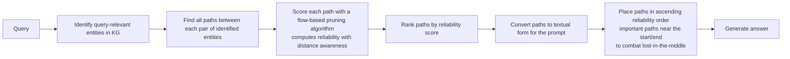

The "flow-based pruning" treats reliability as a network flow problem — high-confidence paths are those where flow accumulates with low decay over distance.

**Results:**

- **59.93% win rate over Microsoft GraphRAG** in head-to-head LLM-judge eval.
- **57.09% win rate over LightRAG.**
- **13.69% token reduction vs. LightRAG.**
- Path-level explanations enable better citation quality.

### 3.4 — OG-RAG (Dec 2024, EMNLP 2025)

**Paper:** [arXiv:2412.15235](https://arxiv.org/abs/2412.15235), Microsoft (different team from GraphRAG).

**Different from GraphRAG:** instead of building a schemaless graph, OG-RAG anchors retrieval in a **domain ontology** provided upfront.

**Workflow:**

1. **Ontology in.** A domain-specific ontology (think SNOMED CT for medical, FIBO for finance) is required as input.
2. **Hypergraph construction.** Each document is parsed and mapped to ontological concepts. Related facts are clustered into **hyperedges** — single edges connecting multiple nodes at once (a more general structure than pairwise edges).
3. **Retrieval.** Query → ontology-mapped concept → relevant hyperedges → context-rich retrieval.

**Why hyperedges instead of regular edges:** facts often involve more than two entities. *"In 2024, Acme launched Product X in Region Y under Compliance Framework Z"* is a 5-way relationship best represented as one hyperedge over `{Acme, 2024, ProductX, RegionY, FrameworkZ}` instead of many pairwise edges that lose the joint constraint.

**Performance:**

- **+55% recall of accurate facts.**
- **+40% response correctness** across 4 LLMs.
- **+27% fact-based reasoning accuracy.**
- **30% faster attribution** of responses to context.

**When to reach for OG-RAG:** regulated domains with mature ontologies — healthcare (SNOMED, ICD-10, RxNorm), legal (LKIF), finance (FIBO), agriculture (AgrO). Avoid for open-domain or schema-less corpora.

### 3.5 — HyKGE (ACL 2025)

**Paper:** [arXiv:2312.15883](https://arxiv.org/abs/2312.15883), tested on Chinese medical QA.

**Key insight:** user queries are often underspecified or incomplete. Don't retrieve directly from the query — *hypothesize* what a complete answer would look like first, then retrieve based on that.

**Pipeline:**

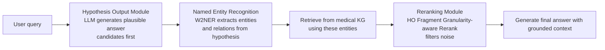

This is essentially **HyDE (Module 5) applied to graph retrieval** — generate hypothetical answer, use it to seed graph traversal. Combined with domain NER (W2NER trained on Chinese medical text) and a rerank module that's aware of *fragment granularity* (fine-grained vs. coarse evidence types).

**Numbers:** evaluated on two Chinese medical multiple-choice datasets and one open-domain Chinese medical QA — outperforms vanilla RAG, vanilla KG-RAG, and CoT prompting on accuracy and explainability.

**When to reach for HyKGE:** specialized domains (medical, legal) where queries are short and an LLM can plausibly hypothesize answer shapes.

### 3.6 — GraphReader (EMNLP 2024 Findings)

**Paper:** [arXiv:2406.14550](https://arxiv.org/abs/2406.14550).

**Different angle:** GraphReader is not really a knowledge-graph approach — it's a **long-context approach using a graph as a navigation aid**. Structure a long text into a graph, then let an agent navigate the graph autonomously.

**Pipeline:**

1. **Build graph:** chunk the long document, extract entities/facts, link chunks through shared entities into a graph.
2. **Agent plans:** given a question, agent generates a plan ("first I'll look up X, then explore neighbors of Y").
3. **Agent navigates:** uses predefined functions to read node content and traverse neighbors.
4. **Agent reflects:** records notes; reflects on whether it has enough information; iterates.

**Numbers:**

- Using a **4K context window**, GraphReader beats **GPT-4 with 128K context** across context lengths from 16K to 256K.
- Strong on single-hop AND multi-hop benchmarks.

**Implication:** for long single documents (book, report, legal filing), GraphReader-style approaches can sometimes beat long-context models AT the same model's own context budget by being more selective about what to attend to.

### 3.7 — MedGraphRAG (ACL 2025)

**Paper:** [arXiv:2408.04187](https://arxiv.org/abs/2408.04187).

Custom-designed for medical. Two innovations:

1. **Triple-graph construction.** Three connected layers:
   - User documents (clinical notes, protocols).
   - Credible medical sources (PubMed abstracts, FDA labels, guidelines).
   - A general knowledge graph (e.g., UMLS).

   Every response can be traced from the user doc → credible source → general knowledge.

2. **U-Retrieval.** Top-down precise retrieval (from query to specific evidence) AND bottom-up response refinement (from evidence back up to general context for sense-making) — combined in a "U" shape, balancing precision with coverage.

**Validation:** 9 medical QA benchmarks + 2 health fact-checking sets + long-form generation. **Outperforms state-of-the-art** on multiple medical benchmarks. Designed to **boost GPT-4 and LLaMA-3-70B** above human-expert accuracy on certain medical tasks.

### 3.8 — Comparison table

| Architecture | Year | Strength | Indexing cost | Best for |
|--------------|------|----------|---------------|----------|
| **Microsoft GraphRAG** | Apr 2024 | Mature; global+local search; community summaries | **Very high** (100-1000× vector RAG) | Cross-corpus theme questions, multi-hop |
| **LazyGraphRAG** | Late 2024 | Same quality, lazy extraction | **~0.1% of GraphRAG** | Smaller corpora or many queries |
| **LightRAG** | Oct 2024 / EMNLP'25 | Dual-level (low/high) retrieval | **~10% of GraphRAG** | Production with budget pressure |
| **HippoRAG** | NeurIPS'24 | PPR-based; single-step beats iterative | Mid | Entity-anchored multi-hop |
| **HippoRAG 2** | Feb 2025 | Passage+phrase dual-node, continual learning | Lower than GraphRAG | Long-running systems with incremental updates |
| **PathRAG** | Feb 2025 | Paths-only — minimal noise, citation-friendly | Mid-high | Quality-first deployments |
| **OG-RAG** | Dec'24 / EMNLP'25 | Ontology-grounded hyperedges | Mid (needs ontology) | Regulated domains with formal ontology |
| **HyKGE** | ACL'25 | Hypothesis-driven retrieval | Mid (medical-tuned) | Underspecified queries in specialized domains |
| **GraphReader** | EMNLP'24 | Long-text agent navigation | Low (per-document) | Long single documents (book, brief, filing) |
| **MedGraphRAG** | ACL'25 | Triple-graph (docs+sources+general KG) + U-Retrieval | High | Healthcare specifically |

---

## Part 4 — Hybrid Vector+Graph routing patterns

Module 7 said "hybrid pattern" without giving a detailed architecture. The honest production answer is that **most queries don't need graph-RAG**. Roughly the field distribution:

```
~80% of queries:  simple semantic lookup     → vector RAG handles fine
~15% of queries:  multi-hop / cross-corpus    → graph-RAG earns its keep
~5% of queries:   agentic / multi-step plan   → full agent loop
```

If you route every query through graph-RAG, you waste 80% of your indexing investment on queries that didn't need it. If you skip graph-RAG, you fail on the 15%. The mature answer is **routing**.

### 4.1 — Three hybrid patterns

#### Pattern A — Vector-first enhancement

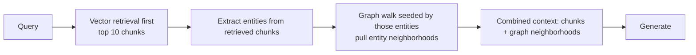

Vector finds the entry points; graph expands. Good for **exploratory queries** where the user doesn't name specific entities. Cheap because the graph walk is bounded by the small set of seeds.

#### Pattern B — Graph-first enhancement

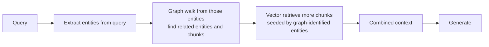

Graph finds the relevant entity neighborhood; vector enriches with semantically similar additional chunks. Good for **entity-anchored queries** where relationships matter. Higher cost per query than vector-first.

#### Pattern C — Dynamic routing (the production answer)

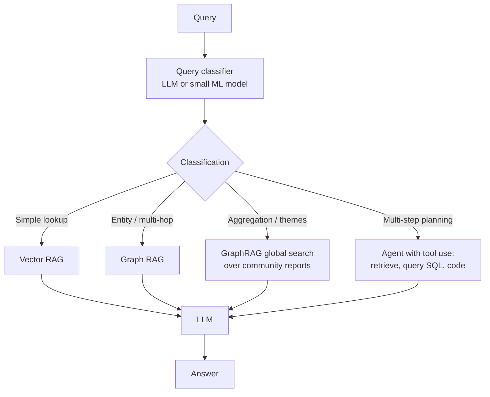

Each query takes the cheapest path that produces a correct answer. Implementations:

- **Adaptive RAG-style classifier** (Module 7): small fine-tuned T5 or even a cheap LLM-as-classifier. Predicts `vector | local-graph | global-graph | agent`.
- **Function-calling LLM router** (Module 10): expose each retrieval mode as a tool; let the LLM pick.
- **Heuristic router**: entity-density of the query, query length, presence of aggregator words ("recurring", "across all", "themes") → route accordingly.

### 4.2 — Storage layout for a hybrid system

A production hybrid Vector+Graph system needs **multiple stores wired together**:

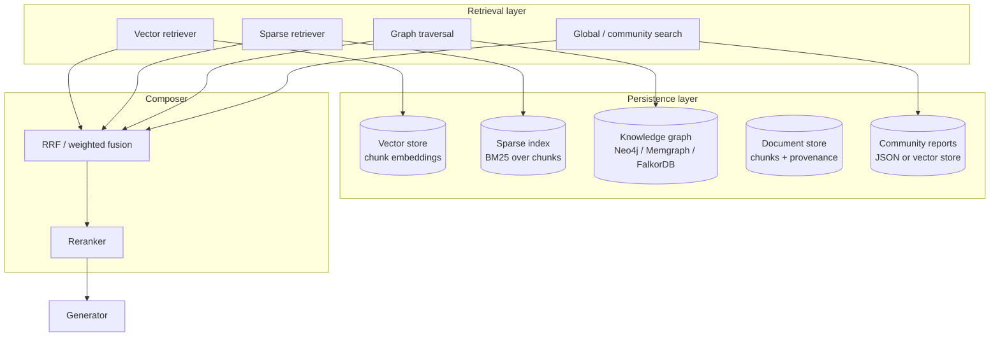

The cost of "all five storage types" is real (operational complexity, sync logic, more failure modes), which is exactly why most production starts with vector-only and grows graph as the failure-mode analysis demands.

### 4.3 — Practical query-routing heuristics

Beyond classifiers, simple heuristics work surprisingly well at the start:

- **Query length:** very short (1-5 words) → almost always vector lookup. Long descriptive queries → consider graph.
- **Question words:** "What patterns / themes / across" → graph global. "Who is / what is / where does" → vector or graph local. "Compare X and Y" → graph local + multi-hop.
- **Entity density:** queries naming many entities → graph local. Queries with no proper nouns → vector.
- **Aggregator keywords:** "recurring", "summary of", "main risks", "overall trends" → graph global.
- **Time scope:** "over the past two years", "between Q1 and Q3" → metadata filter + graph (because aggregation across a time window is graph's strength).

You can implement this in <100 lines and serve a meaningful percentage of queries before adding ML classifier complexity.

---

## Part 5 — Evaluation methodology specific to graph-RAG

Module 13A introduced general RAG eval. Graph-RAG needs additional/different methodology because the failure modes are different.

### 5.1 — Why standard RAG eval is insufficient for graph-RAG

Standard RAG eval (Ragas faithfulness, context precision/recall) measures:

- Did we retrieve relevant *chunks*?
- Is the answer supported by those chunks?

It doesn't measure:

- Did we *traverse* the right relationships?
- Did we *aggregate* correctly across documents?
- Did our community summaries capture the right theme?
- Is the answer's path through the KG traceable?

For graph-RAG, these are the failure modes that matter most.

### 5.2 — Multi-hop benchmark performance reference

The three canonical multi-hop QA benchmarks (covered in Module 13A but applied here to graph-RAG specifically):

| Benchmark | Hops | Domain | What it tests |
|-----------|------|--------|---------------|
| **HotpotQA** | 2-hop | Wikipedia | Bridge questions requiring 2 articles |
| **2WikiMultiHopQA** | 2-3 hop | Wikipedia | Compositional reasoning, more controlled |
| **MuSiQue** | 2-4 hop | Wikipedia | Constructed to minimize disconnected reasoning; harder than HotpotQA |

**Published numbers (approximate; consult original papers for exact configurations):**

| System | 2WikiMultiHopQA F1 | HotpotQA F1 | MuSiQue F1 |
|--------|---------------------|-------------|------------|
| Vector RAG (dense + BM25, top-k=5) | ~0.45 | ~0.50 | ~0.20 |
| Microsoft GraphRAG | ~0.63 | ~0.65 | ~0.33 |
| HippoRAG | ~0.65-0.70 | ~0.67 | ~0.35 |
| HippoRAG 2 | ~+7 F1 over NV-Embed-v2 on associative | mid-0.70s | high-0.30s / low-0.40s |
| PathRAG | (LLM-judged) **+57-60% win rate vs GraphRAG/LightRAG** | | |
| HopRAG | reports +3.08% over HippoRAG average | | |
| EcphoryRAG | mean EM 0.474 (vs HippoRAG 0.392) | | |
| StepChain GraphRAG | +4.70% EM / +3.44% F1 over SOTA on HotpotQA | | |

**Reading these numbers honestly:**

- MuSiQue scores are dramatically lower across the board — that benchmark was constructed to be hard.
- Vector RAG performs decently on HotpotQA's 2-hop questions because they're often paraphrasable in single docs.
- Graph approaches genuinely win on multi-hop; the win is 10-25 F1 points typically.
- The state-of-the-art shifts every quarter; the right move is to **evaluate on YOUR queries**, not pick the leaderboard winner.

### 5.3 — Graph-specific eval dimensions

Beyond the standard triad, add:

#### Entity recall

> *Of the entities that should be in the retrieved context to answer correctly, what fraction were actually retrieved?*

Calculated by hand-labeling the gold entities for each eval question, comparing against the entities surfaced in the retrieved context.

#### Path correctness

> *For multi-hop questions, was the right inference path traversed?*

Hand-label the gold reasoning path (e.g., for "who founded the company that owns Pinta brewery?" the path is `Pinta → owned_by → CompanyX → founded_by → PersonY`). Check whether the system surfaced enough of that path to support the answer.

#### Community report quality

> *For each community report, is it accurate, complete, and at the right level of abstraction?*

Two sub-metrics:
- **Faithfulness** — does the community report contradict any source chunk in that community? (LLM-as-judge)
- **Coverage** — does the report mention all the major entities/themes in that community? (Recall-style metric over hand-labeled gold)

#### Aggregation accuracy

> *For global queries, did the system correctly summarize across documents, or did it cherry-pick one doc and extrapolate?*

Manual eval on ~20-30 queries; have annotators count which source docs contributed to the answer.

#### Latency budget per stage

Graph-RAG has more stages than vector RAG. Track:

```
Query classification:              10-50ms
Entity extraction from query:      50-200ms
Graph walk / PPR:                  10-500ms (depends on graph size)
Vector retrieval (still happens):  20-50ms
Reranker:                          100-300ms
LLM generation:                    1-3s
Total:                             1.5-4s typically
```

Per-stage observability (Module 13C) is more important here because slow tails are easier to localize.

### 5.4 — Specific benchmarks to add for graph-RAG eval

Beyond HotpotQA / MuSiQue / 2WikiMultiHopQA, the graph-RAG-specific eval set should include:

| Benchmark | Why include |
|-----------|-------------|
| **LV-Eval** | Long-context multi-hop; tests scaling |
| **NarrativeQA** | Sense-making over long narrative texts; HippoRAG 2 uses this |
| **PopQA** | Single-hop factual, controls for vector RAG baseline |
| **Custom golden set from YOUR corpus** | The only one that matters in production |

Plus **claim-level checks** (Module 14): for every entity / fact extracted into the KG, can we trace it to a specific source chunk? If not, the graph has hallucinated entities.

---

## Part 6 — Cost calculator: when does graph-RAG pay for itself?

This is the most-requested-and-rarely-answered question in graph-RAG.

### 6.1 — The components of cost

**Indexing (one-time, occasionally re-run):**

| Component | Driver | Approximate scaling |
|-----------|--------|---------------------|
| Entity / relation extraction LLM call per chunk | # chunks × tokens per chunk × LLM rate | Linear in corpus size |
| Claim extraction (if enabled) | # chunks × extraction prompt | Linear in corpus size |
| Entity de-duplication / merge LLM calls | # unique entities × merge prompt | Sub-linear (sub-linear in corpus) |
| Community detection (Leiden, CPU) | Graph node/edge count | ~O(n log n) typically |
| Community report generation | # communities × ~1-2K context per call | Sub-linear |
| Chunk embedding | # chunks × embedding rate | Linear |

**Query (per-query):**

| Component | Driver | Approximate cost |
|-----------|--------|------------------|
| Query embedding | One embedding call | ~$0.00001-0.0001 |
| Entity extraction from query | One small LLM call | ~$0.0005 |
| Graph walk / community search | DB queries; no LLM | ~$0 |
| LLM context assembly + generation | Prompt size + output tokens | ~$0.001-0.05 typical |

Online cost per query is roughly **2-5× vector RAG's per-query cost** because of extra LLM calls for entity extraction and richer context assembly.

### 6.2 — Worked example: 100K document corpus

Assume Sonnet-class model at $3 / 1M input tokens, $15 / 1M output tokens.

**Corpus parameters:**
- 100,000 documents.
- Average 5,000 tokens per document (so ~500M total tokens).
- 300-token chunks with 50-token overlap → roughly 16-17 chunks per doc → **~1.6M chunks total**.

**Indexing — Microsoft GraphRAG with all features:**

- Entity/relation extraction prompt: avg ~3K input tokens, ~500 output → ~3.5K tokens/chunk → 1.6M × 3.5K = **5.6B tokens**.
- At Sonnet pricing: 5.6B input + ~800M output ≈ **$28,800 (input) + $12,000 (output) = $40,800**.
- Claim extraction (if enabled): another ~50%. **+$20,000.**
- Community summary generation: ~10K communities at level 1+ × ~3K tokens each = 30M tokens → **~$300**.
- Chunk embeddings: 500M tokens × $0.13/1M = **$65**.

**Total Microsoft GraphRAG indexing: ~$40,000-$60,000** for 100K docs with full features.

**LazyGraphRAG variant:** **~$300-$1,000** (0.1% to 2% of full GraphRAG).

**LightRAG variant:** **~$4,000-$8,000** (~10% of full GraphRAG).

**Vector RAG baseline:** **~$65** for embeddings only (no LLM extraction). **~600-900× cheaper indexing.**

### 6.3 — When does it pay back?

Suppose graph-RAG gives 20% better answer quality on the 15% of queries that need it. The amortization math:

```
extra_indexing_cost  = $40,000 (one-time)
queries_per_month    = N
fraction_helped      = 15%
value_per_better_answer = V

monthly_benefit  = N * 0.15 * V * (quality_lift)
break_even_months = extra_indexing_cost / monthly_benefit
```

For a customer-support product at:
- 100K queries/month
- 15% benefit (~15K queries)
- $1 value per better answer (modest deflection assumption)
- 20% quality lift

→ monthly benefit = 100K × 0.15 × $1 × 0.20 = **$3,000/month** → break-even **~13 months**.

For a high-stakes clinical-decision-support product at:
- 10K queries/month
- 30% benefit (multi-hop is more common in clinical decision-making)
- $50 value per better answer (avoided unnecessary tests, faster diagnosis)
- 30% quality lift

→ monthly benefit = 10K × 0.30 × $50 × 0.30 = **$45,000/month** → break-even **<1 month**.

The math is brutal in low-value, low-volume settings. Graph-RAG's expensive indexing only pays back at one of:
- Very high query volume (amortize over many queries)
- High value per query (clinical, legal, financial)
- Heavy multi-hop / aggregation query distribution

### 6.4 — Reducing indexing cost: practical levers

- **Switch to LazyGraphRAG or LightRAG.** Most teams save 80-99% of indexing without losing critical quality.
- **Smaller / cheaper extraction model.** Use Haiku-class for entity extraction; reserve Sonnet for community report generation. Often saves 70% on the extraction line.
- **Sample, don't process everything.** Many corpora have substantial redundancy; entity extraction over a representative sample, with deduplication, may produce most of the graph.
- **Skip claims (covariates).** Default-off in Microsoft GraphRAG for good reason; only enable if you'll use them.
- **Hybrid routing.** If only 15% of queries need graph, build a *smaller* graph from only the docs that get hit by graph-routed queries.

### 6.5 — Open-source contribution: cost estimation in Microsoft GraphRAG

In May 2025, a contributor added a `--estimate-cost` CLI flag to Microsoft GraphRAG that simulates the chunking + extraction pipeline and reports projected token counts + cost. **Always run this before kicking off a full index over a large corpus.**

---

## Part 7 — Production case study: hospital network deployment

A worked deployment pattern, drawn from public case studies and the MedGraphRAG paper.

### 7.1 — The use case

A regional hospital network's clinical decision-support tool. Doctors ask questions like:

- *"What's the recommended treatment for stage 3 hepatocellular carcinoma in a patient with portal hypertension?"* (specific, multi-fact)
- *"Are there any drug interactions among this patient's current 9 medications?"* (multi-hop across drug database)
- *"What protocols apply to this presentation of cardiac arrhythmia with renal insufficiency?"* (cross-condition)

Vector RAG handles ~20% of these well. The rest need graph traversal.

### 7.2 — The architecture

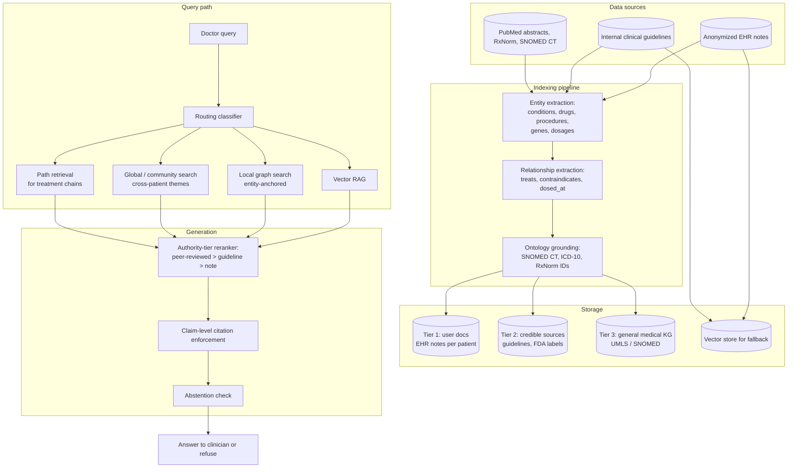

### 7.3 — Non-obvious design choices

1. **Three-tier graph** (MedGraphRAG-style). Every answer must trace from EHR/patient context → credible source (guideline, PubMed) → general KG (SNOMED). If any link is missing, the system refuses.

2. **Ontology grounding mandatory.** OG-RAG-style — every extracted entity must map to an ontology ID (SNOMED CT, ICD-10, RxNorm). Eliminates ambiguity ("MI" → myocardial infarction vs. mitral insufficiency vs. Michigan).

3. **PathRAG for treatment chains.** When the query asks about a treatment plan (`condition → recommended therapy → contraindications`), retrieve only the relational paths, not whole communities. Cleaner context, better citation.

4. **HippoRAG-style PPR for cross-patient queries.** "Have we seen this presentation before?" → PPR over patient-graph seeded by current patient's entities.

5. **Strict authority-tier reranking.** Peer-reviewed > FDA label > internal guideline > clinician note. Reranker uses tier as a hard feature.

6. **Liberal abstention.** If no peer-reviewed or guideline source supports the answer, refuse with "consult your clinician."

7. **Audit trail per query.** Every retrieval step, every cited source, every reranker score logged with patient ID hash, model version, prompt version. Retention: 6 years per HIPAA, longer if local regulation requires.

8. **No PHI in third-party APIs.** Embedder + LLM + reranker all run inside the hospital's BAA-covered cloud (Azure OpenAI Service with healthcare BAA, or fully on-prem deployment of open models).

### 7.4 — What the case study teaches

- **No single architecture is enough.** This system combines MedGraphRAG (triple-graph), OG-RAG (ontology), PathRAG (treatment paths), HippoRAG (cross-patient PPR), and standard vector RAG (fallback). Each component serves a query class.
- **Routing is the product.** The classifier decides which subsystem answers. Its quality determines user-facing quality more than any single retriever.
- **Authority is structural, not heuristic.** Tier metadata is enforced in retrieval, not "considered" in reranking.
- **Refusal is a feature, not a fallback.** Better to refuse 5% of legitimate questions than answer 1% wrongly in a clinical setting.

---

## Part 8 — When NOT to use graph-RAG (the honest counter-argument)

Graph-RAG is widely over-deployed. A senior architect should be able to make the case *against* it when it's wrong.

### 8.1 — Signs you don't need graph-RAG

- **80%+ of your queries are simple semantic lookups** ("what does our refund policy say?") — vector RAG handles these.
- **Your corpus is flat prose** (Q&A pages, FAQ docs, support tickets) with little relational structure.
- **Your queries don't aggregate across documents** — single-doc answers are sufficient.
- **Your indexing budget is < $5K/month** for the corpus size — graph-RAG indexing dominates.
- **Your corpus updates faster than the indexing pipeline runs** — graph-RAG indexing time means stale graphs.

### 8.2 — Symptoms of over-deployed graph-RAG

- Queries that vector RAG answered fine in 200ms now take 3s.
- Indexing costs increased 50-500× with little quality improvement.
- The team spends 30%+ of engineering effort on graph pipeline maintenance.
- "GraphRAG accuracy" is great on the curated multi-hop eval set but worse than vector RAG on real production queries.

### 8.3 — The decision question

> *Do at least 15-20% of your real production queries require multi-hop reasoning or cross-corpus aggregation?*

If yes → start graph-RAG. If no → stay with vector + hybrid + reranking; revisit in 6 months.

### 8.4 — The minimum-viable graph

If you do decide to go graph, **don't start with full Microsoft GraphRAG**. Start with:

1. **LazyGraphRAG or LightRAG** (cheap indexing).
2. **Two query types** (local + global). Skip DRIFT initially.
3. **A routing classifier** so vector RAG remains the default; graph kicks in only when needed.
4. **No covariates / claims** until you have a use case for them.
5. **Ship it for 1 month** then measure: did the 15-20% query class actually benefit?

You can always grow into full GraphRAG complexity. Most teams don't need to.

---

## Part 9 — Tooling landscape (early 2026)

The graph-RAG ecosystem is no longer "Microsoft GraphRAG or build it yourself."

### 9.1 — Frameworks

| Tool | Type | Notes |
|------|------|-------|
| **Microsoft GraphRAG** | Reference impl | The original; Python; Azure-tilted but cloud-agnostic |
| **LazyGraphRAG** | Microsoft follow-up | Lazy extraction; in graphrag repo |
| **LightRAG** | Open (EMNLP'25) | HKU dual-level retrieval; production-ready; widely adopted |
| **HippoRAG / HippoRAG 2** | OSU NLP Group | NeurIPS'24 + Feb'25; reference Python implementation |
| **Neo4j LLM Knowledge Graph Builder** | Hosted + open | React + FastAPI; UI-driven KG construction; LangChain integration |
| **neo4j-graphrag-python** | Library | Neo4j's official GraphRAG Python lib |
| **Memgraph + Memgraph Lab** | Database + UI | Streaming-friendly graph DB; good for live updates |
| **LangChain GraphCypherQAChain** | Integration | Text-to-Cypher over Neo4j |
| **LlamaIndex KnowledgeGraphIndex** | Integration | Built-in KG construction; less polished than Neo4j's |
| **Fast-GraphRAG (circlemind)** | Lightweight | Smaller open-source GraphRAG; benchmarks vs Microsoft |

### 9.2 — Graph databases for graph-RAG

| DB | Strengths | Notes |
|----|-----------|-------|
| **Neo4j** | Mature; Cypher query language; AuraDB managed | Production default for most teams |
| **Memgraph** | In-memory; faster for some workloads; openCypher | Newer; good streaming-update support |
| **NebulaGraph** | Distributed; very large scale | Heavier ops |
| **FalkorDB** | Redis-based; very fast small graphs | Niche but interesting |
| **Apache AGE** (Postgres extension) | Postgres-native | If you already have Postgres for vectors (pgvector), AGE adds graphs |
| **TigerGraph** | Enterprise | Mature; pricey |
| **Amazon Neptune** | AWS managed | If you're AWS-locked |

### 9.3 — Recommended starter stack

For a healthcare team at Optum scale, starting graph-RAG today:

```
Storage:
  - Neo4j (graph) — managed AuraDB or self-hosted Enterprise
  - Vector store: pgvector (you probably have Postgres) or Qdrant
  - Document store: S3 / Azure Blob with provenance metadata

Indexing:
  - LightRAG framework OR LazyGraphRAG
  - Anthropic Claude (Haiku for extraction, Sonnet for community summaries)
  - Ontology grounding: UMLS / SNOMED CT REST API for medical
  - Embeddings: BGE-M3 or voyage-3-large

Query path:
  - Routing classifier (small fine-tuned model or LLM)
  - Vector + sparse hybrid via RRF
  - Local + global graph search via LightRAG
  - Cross-encoder reranker with authority-tier features
  - Anthropic Claude with Citations API

Observability:
  - Langfuse or Arize Phoenix
  - Custom audit log per query with 7-year retention

Eval:
  - Ragas + DeepEval with Claude judge (from Module 13A)
  - Custom multi-hop eval set (HotpotQA + your own gold)
  - Patronus Lynx or Vectara HHEM for hallucination detection (Module 14)
```

---

## Sanity check

1. Name the three primary query strategies in Microsoft GraphRAG and one use case for each.
2. What does "covariate" mean in Microsoft GraphRAG's vocabulary, and why is it off by default?
3. How does HippoRAG's Personalized PageRank step accomplish multi-hop retrieval without iterative LLM calls?
4. What's the architectural difference between HippoRAG and HippoRAG 2 (one sentence)?
5. PathRAG's headline win: ~60% over GraphRAG on LLM-judge eval. What's the structural reason it tends to win?
6. Why is OG-RAG limited to domains with formal ontologies?
7. When does GraphReader beat GPT-4-128K at long-context tasks, and what's the trick?
8. Map each of these query patterns to the right hybrid pattern (Vector-first, Graph-first, Dynamic): (a) "Who is Dr. Lee?" (b) "What themes recur across our last 100 clinical notes?" (c) "Tell me about cardiology guidelines."
9. Walk through the cost math for indexing 100K documents with Microsoft GraphRAG. Approximately what does it cost, and what's the LazyGraphRAG alternative?
10. Name three graph-RAG-specific eval dimensions that standard Ragas faithfulness doesn't measure.
11. List four signs that you should NOT deploy graph-RAG on a corpus.
12. Healthcare case study: name the three tiers of the triple-graph and why each exists.
13. Why is "routing is the product" a stronger architectural claim than "we use the best retriever"?

---

## References

### Foundational papers

- **Microsoft GraphRAG** — Edge et al., 2024 — [arXiv:2404.16130](https://arxiv.org/abs/2404.16130) — *From Local to Global: A Graph RAG Approach to Query-Focused Summarization* — [PDF in references/papers/graphrag/](references/papers/graphrag/Microsoft_GraphRAG_2404.16130.pdf)
- **HippoRAG** — Gutiérrez et al., NeurIPS 2024 — [arXiv:2405.14831](https://arxiv.org/abs/2405.14831) — *HippoRAG: Neurobiologically Inspired Long-Term Memory for Large Language Models* — [PDF](references/papers/graphrag/HippoRAG_2405.14831.pdf)
- **HippoRAG 2** — Feb 2025 — [arXiv:2502.14802](https://arxiv.org/abs/2502.14802) — *From RAG to Memory: Non-Parametric Continual Learning for Large Language Models* — [PDF](references/papers/graphrag/HippoRAG2_RAG_to_Memory_2502.14802.pdf)
- **PathRAG** — Feb 2025 — [arXiv:2502.14902](https://arxiv.org/abs/2502.14902) — *Pruning Graph-Based RAG with Relational Paths* — [PDF](references/papers/graphrag/PathRAG_2502.14902.pdf)
- **OG-RAG** — Dec 2024, EMNLP 2025 — [arXiv:2412.15235](https://arxiv.org/abs/2412.15235) — *Ontology-Grounded Retrieval-Augmented Generation* — [PDF](references/papers/graphrag/OG-RAG_2412.15235.pdf)
- **HyKGE** — Dec 2023, ACL 2025 — [arXiv:2312.15883](https://arxiv.org/abs/2312.15883) — *Hypothesis Knowledge Graph Enhanced Framework* — [PDF](references/papers/graphrag/HyKGE_2312.15883.pdf)
- **GraphReader** — EMNLP 2024 Findings — [arXiv:2406.14550](https://arxiv.org/abs/2406.14550) — *Graph-Based Agent to Enhance Long-Context Abilities* — [PDF](references/papers/graphrag/GraphReader_2406.14550.pdf)
- **LightRAG** — EMNLP 2025 — [arXiv:2410.05779](https://arxiv.org/abs/2410.05779) — [PDF](references/papers/graphrag/LightRAG_2410.05779.pdf)
- **MedGraphRAG** — ACL 2025 — [arXiv:2408.04187](https://arxiv.org/abs/2408.04187) — *Towards Safe Medical LLM via Graph RAG* — [PDF](references/papers/graphrag/MedGraphRAG_2408.04187.pdf)
- **Practical GraphRAG at Scale** — Jul 2025 — [arXiv:2507.03226](https://arxiv.org/abs/2507.03226) — [PDF](references/papers/graphrag/Practical_GraphRAG_at_Scale_2507.03226.pdf)

### Implementation & docs

- Microsoft GraphRAG official docs — [microsoft.github.io/graphrag](https://microsoft.github.io/graphrag/)
- Microsoft GraphRAG GitHub — [github.com/microsoft/graphrag](https://github.com/microsoft/graphrag)
- HippoRAG GitHub — [github.com/OSU-NLP-Group/HippoRAG](https://github.com/OSU-NLP-Group/HippoRAG)
- LightRAG GitHub — [github.com/HKUDS/LightRAG](https://github.com/HKUDS/LightRAG)
- Medical-Graph-RAG — [github.com/ImprintLab/Medical-Graph-RAG](https://github.com/ImprintLab/Medical-Graph-RAG)
- Neo4j LLM Knowledge Graph Builder — [neo4j.com/labs/genai-ecosystem/llm-graph-builder](https://neo4j.com/labs/genai-ecosystem/llm-graph-builder/)
- Awesome GraphRAG (curated list) — [github.com/DEEP-PolyU/Awesome-GraphRAG](https://github.com/DEEP-PolyU/Awesome-GraphRAG)
- GraphRAG cost-estimation PR — [Khaled Alam blog, May 2025](https://khaledalam.medium.com/how-i-added-token-llm-cost-estimation-to-the-indexing-pipeline-of-microsoft-graphrag-c310dd56cb0c)
- Microsoft DRIFT Search — [microsoft.github.io/graphrag/query/drift_search](https://microsoft.github.io/graphrag/query/drift_search/)

### Benchmarks

- HotpotQA — Yang et al., EMNLP 2018
- 2WikiMultiHopQA — Ho et al., COLING 2020
- MuSiQue — Trivedi et al., TACL 2022
- LV-Eval — long-context multi-hop benchmark
- NarrativeQA — sense-making benchmark (used in HippoRAG 2)

---

**Back to:** [README](README.md) | [FACTS.md](FACTS.md)

**TOC** [Table of Contents](00_Table_Of_Contents.md)
