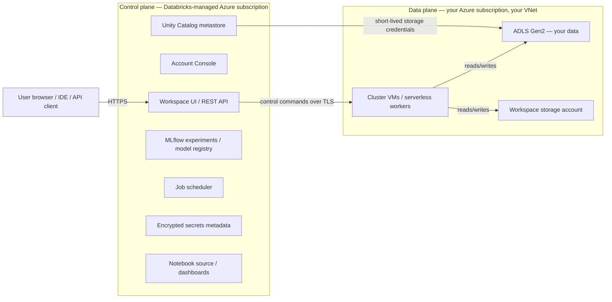
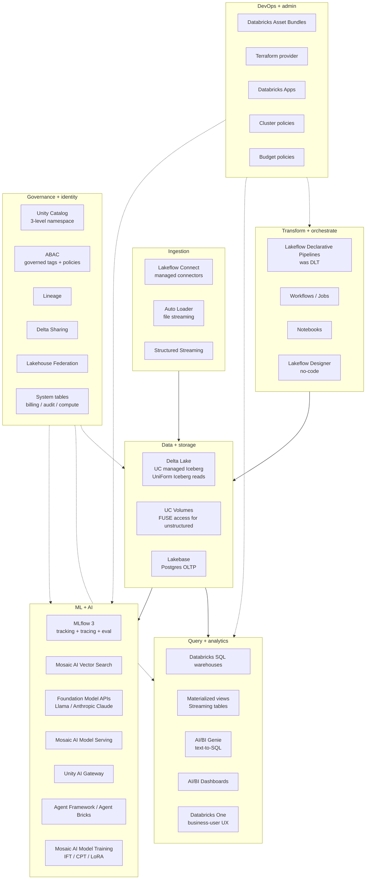

# Module 1 — Lakehouse Foundations & Platform Anatomy

> **Goal of this module:** build the mental model an architect needs to reason about Databricks at the platform level — why it exists, how the pieces fit, what's stable vs what's churn, and where the lock-in lives. Subsequent modules dig into the components.

---

## Why this exists

The lakehouse pitch sits on top of two old failures.

**Data warehouses** (Teradata, Netezza, Redshift, Synapse, Snowflake) were the right answer for structured BI. They took the "schema and serve" idea seriously: define tables, load them, query them with ANSI SQL, get fast aggregates. The price was rigidity — getting JSON, images, audio, or in-flight semi-structured data into a warehouse meant pre-modeling everything and copying data through ETL pipelines. Costs ballooned because warehouses bundled compute and storage, you paid for both even when you needed only one, and they were proprietary engines that locked your data into vendor formats.

**Data lakes** (S3, ADLS, GCS + Hive, Presto, Spark) were the reaction. Cheap object storage, open file formats (Parquet, ORC), schema-on-read. The price was governance — no transactions, no enforced schemas, no consistent metadata, no fine-grained permissions. Data scientists had freedom; auditors had heart attacks. The "data swamp" pejorative described thousands of petabytes of poorly-cataloged Parquet that nobody dared to delete.

The **lakehouse** ([Armbrust et al., CIDR 2021](https://www.cidrdb.org/cidr2021/papers/cidr2021_paper17.pdf)) is the third position: keep the cheap object storage and open formats of the lake, but layer transactional metadata, ACID semantics, indexing, and governance on top. Three implementations now exist in the open: Delta Lake (Databricks-led, originally proprietary, donated to Linux Foundation 2019), Apache Iceberg (Netflix-originated, now Apache top-level), and Apache Hudi (Uber-originated). Databricks-the-company ships **Databricks-the-platform** as the hosted answer: managed Spark + Delta + Unity Catalog + ML/AI tooling on top of the customer's own cloud storage.

The strategic claim — *"one platform for BI, ETL, ML, and AI on the same data"* — is real, partial, and politically loaded. It is real in that the same Delta tables really do serve SQL warehouses, ML feature engineering, and RAG pipelines without copies. It is partial because BI on Databricks has historically lagged Snowflake on pure-SQL price/performance ([Akincilar benchmark, 2025](https://medium.com/@nickakincilar/snowflake-is-cheaper-faster-than-databricks-serverless-with-real-data-by-a-lot-dc2fe021838a) — Snowflake 58% faster and 28% cheaper on a 24B-row 16-query mix), and ML on Databricks is more credible than ML on Snowflake but less credible than ML on dedicated GPU clusters with vLLM. It is politically loaded because the practitioner-blogosphere reading is that "lakehouses are described in dizzying corporate doublespeak" ([Benn Stancil — *Category collapse*](https://benn.substack.com/p/category-collapse)) — i.e., the marketing language is denser than the engineering substance because the substance is mostly OSS.

The architect's job is to internalize all three readings. The corpus that follows treats Databricks as a serious platform with serious tradeoffs, not as a category-defining win.

---

## Platform anatomy

### Control plane vs data plane

Databricks splits the system into two planes that live in different places:

The **control plane** runs in Databricks' own Azure subscription. It hosts the workspace UI, REST API, notebook source, MLflow experiments, the job scheduler, the Unity Catalog metastore, secret metadata, dashboards. Crucially, it does **not** see your data — it sees commands you send (run this notebook, list catalogs, create a model serving endpoint), and it stores derived metadata about that work (job runs, query history, lineage edges, audit events).

The **data plane** runs in **your** Azure subscription and your VNet. Cluster VMs, serverless workers, your ADLS Gen2 storage accounts, the workspace storage account. Your data lives here and stays here. The control plane reaches the data plane to send commands either inbound (no Secure Cluster Connectivity — public IPs on workers, NSG-allowlisted) or via reverse-tunneled outbound TLS (with SCC, which is the default for healthcare-grade deployments — see Module 20).

Two implications matter at the architect level:

1. **The BAA boundary follows the data plane, not "Databricks the company."** Customer-defined fields that flow to the control plane — workspace names, cluster names, job names, tags, secret-scope names, query parameters — are *outside* the BAA. PHI in those fields is a compliance violation Databricks doesn't catch. ([HIPAA on Azure Databricks docs](https://learn.microsoft.com/en-us/azure/databricks/security/privacy/hipaa) — "*You are solely responsible for verifying that sensitive information is never entered in customer-defined input fields*".) Module 21 unpacks the consequences (naming-pollution lint).
2. **Audit logs are control-plane-managed but customer-retained.** `system.access.audit` lives in the control plane; native retention is ~1 year, vs HIPAA's 6-year requirement. You forward to your own SIEM or to an immutable Delta destination, and you carry that responsibility. Module 17 shows the pipeline.

### Account vs workspace

Two organizational levels exist:

- **Account**: the billing and identity root. One per Databricks contract per cloud. The account console (`accounts.azuredatabricks.net`) is where you administer SCIM groups, the metastore, network configurations (NCCs), workspaces, and consolidated billing. Account admins can do anything in the account.
- **Workspace**: one regional deployment of Databricks. Hosts clusters, notebooks, jobs, model serving endpoints, dashboards. Workspace admins are powerful within a workspace but cannot reach across to other workspaces or to the account.

The account-level view of identity is mandatory for Unity Catalog — workspace-level groups don't appear in `GRANT` statements. Workspace-level SCIM is being deprecated in favor of account-level SCIM ([UC requirements](https://learn.microsoft.com/en-us/azure/databricks/data-governance/unity-catalog/get-started)). For an Azure-shop architect this means **identity flows from Entra ID → SCIM → Databricks account → assigned to workspaces** — never workspace-direct identity.

For a healthcare org at Optum scale, you do not run "one workspace." You run a hub-and-spoke topology: per-business-line workspaces, separate PHI vs analytics workspaces, a tier-0 governance workspace where the metastore admin role lives, and a separate browser-auth workspace per region (because the browser-auth private endpoint is one-per-region-per-DNS-zone and deleting its host workspace breaks SSO for every dependent workspace — a real footgun, see Module 20).

### Region and metastore

Unity Catalog metastores are **regional and singleton** — exactly one UC metastore per cloud region per Databricks account ([UC best practices](https://learn.microsoft.com/en-us/azure/databricks/data-governance/unity-catalog/best-practices)). This single fact drives more architecture than people expect:

- **Lineage doesn't cross regions.** Period. Multi-region setups have multi-metastore setups, and stitching cross-region lineage is a customer build.
- **Permissions don't cross regions.** GRANTs in `eastus` metastore mean nothing in `eastus2` metastore. Delta Sharing transmits data, not grants.
- **Cross-region DR is a customer-driven workspace replication exercise** ([DR docs](https://learn.microsoft.com/en-us/azure/databricks/admin/disaster-recovery)) — Module 23.

The metastore decision *cannot* be reversed without a full re-grant + re-bind cycle, so it's worth treating as architectural. Optum-scale orgs typically have one metastore per region they operate in, and treat each as a tier-0 asset.

---

## The 2026 product map

A senior engineer needs to recognize the surface area without memorizing it. Here is the May 2026 view of Databricks-the-platform, organized by what each layer does.

A few observations worth flagging up front:

- **Lakeflow** is the umbrella that consolidated formerly-separate names: ingestion (was Auto Loader + custom Spark + connectors) is now Lakeflow Connect, declarative pipelines (was DLT) are now Lakeflow Declarative Pipelines, orchestration (was Jobs) is now Lakeflow Jobs / Workflows. Modules 4 and 8 unpack the practical implications of the rename.
- **Mosaic AI** is the GenAI/ML umbrella: Vector Search, Model Serving, Foundation Model APIs, AI Gateway, Agent Framework, Agent Bricks, Model Training. Modules 12–15 cover this.
- **Unity Catalog** is the governance spine that ties everything together. ABAC (Public Preview April 2026), Volumes, Metric Views, Delta Sharing, Lakehouse Federation are all UC-centric. Modules 9–11.
- **Lakebase** (Postgres on the lakehouse, June 2025 Public Preview) is the new face. Targets agent state stores, online feature stores, and operational app backends. Verify GA status before betting a roadmap on it; the latest signal as of February 2026 is still Public Preview ([InfoQ Feb 2026](https://www.infoq.com/news/2026/02/databricks-lakebase-postgresql/)). For healthcare it's "wait for v2."
- **Databricks One** (June 2025 Public Beta) is a role-based UX shell over Genie + AI/BI Dashboards + Apps for non-technical business users. Different from the workspace UI. Mostly a packaging move.
- **Apps** (GA August 2025) lets you build Streamlit/Dash/Gradio/React apps natively on Databricks with serverless infra, UC governance, OAuth. 20K+ apps across 2.5K orgs at GA ([Apps GA blog](https://www.databricks.com/blog/announcing-general-availability-databricks-apps)). The architect-relevant point: it gives you a way to ship internal apps without standing up a separate AKS cluster.

### Acquisitions trail (so the names make sense)

Eight acquisitions in 2023–2025 explain most of the 2026 product map:

| Acquisition | Year | Cost | Became |
|---|---|---|---|
| MosaicML | Jun 2023 | ~$1.4B | Mosaic AI brand + foundation-model training stack |
| Arcion | Oct 2023 | ~$100M | Lakeflow Connect CDC engine |
| Lilac | Mar 2024 | undisclosed | Mosaic AI dataset / eval tooling |
| Tabular | Jun 2024 | $1B+ | UC managed Iceberg + UniForm + Iceberg REST |
| BladeBridge | early 2025 | undisclosed | DW migration tooling (Teradata → Databricks) |
| Neon | May 2025 | ~$1B | Lakebase |
| Mooncake Labs | 2025 | undisclosed | Lakebase acceleration |

Tracxn lists 17 total acquisitions through April 2026. The Tabular acquisition (Iceberg's original creators — Ryan Blue, Dan Weeks) is the strategically most important one — it is Databricks' defensive answer to "we keep our data in Iceberg so we have an exit option." See Module 11 for what that bought architecturally.

---

## Stable vs volatile surfaces

A 2026 architect can't teach Databricks as a snapshot — too much moves quarter to quarter. Distinguish three layers:

**Stable.** The lakehouse storage primitives (Delta Lake transaction log, Parquet underneath, ADLS Gen2 for Azure), Spark APIs (DataFrame, SQL, Structured Streaming), MLflow tracking semantics, Unity Catalog three-level namespace, the workspace/account separation, the control-plane/data-plane split, BAA-relevant compliance toggles. These don't change in a way that breaks last year's architecture diagrams. Teach them confidently.

**Slow-moving.** Major new product surfaces (Lakeflow rebrand, Mosaic AI Vector Search, Agent Framework, Lakebase). Renames happen but backward compatibility is preserved. Teach them as "current as of [date]" with a re-verification habit.

**Volatile.** Pricing, Foundation Model API model lineup, GA-vs-Preview status of new features, exam blueprints, BAA scope on Beta features, GPU SKU availability per region. This stuff genuinely shifts month-to-month. **Treat every dollar figure, GA date, and BAA claim in this corpus as needing re-verification before betting a roadmap on it.** [`FACTS.md`](FACTS.md) carries "Last verified" stamps for the volatile items.

For DBR (Databricks Runtime) versions specifically, the LTS cadence is the stable scaffolding: ~one LTS per year, supported for 2 years. **Standardize new pipelines on the most recent LTS.** As of May 2026 that's **DBR 17.3 LTS** (October 2025, Spark 4.0). 16.4 LTS (May 2025, Spark 3.5) is fine if you have a hard dependency on Spark 3.5; 14.x and earlier are end-of-support and should not be in greenfield work. Module 17 covers DBR upgrade planning as an admin event.

---

## Where the lock-in lives

This is the question CFOs ask architects, and a careful read of the product map tells you the answer.

**Things you can leave with your data intact:**
- Delta tables in your own ADLS — readable by Spark OSS, by Iceberg-aware engines via UniForm, by DuckDB, by Trino. Storage lock-in is essentially zero.
- UC-managed Iceberg tables (Public Preview) — explicitly readable+writable from external engines via the Iceberg REST Catalog API. Snowflake's Iceberg-write-to-UC went GA on Azure on **2026-04-06** ([Snowflake release note](https://docs.snowflake.com/en/release-notes/2026/other/2026-04-06-iceberg-write-support-azure-unity-catalog)). You can mix engines today.
- Parquet/ORC in volumes — unstructured-data exit is straightforward.

**Things you lose if you leave:**
- Unity Catalog grants, ABAC policies, governed tags, lineage, audit history. UC is *the* moat. You'd reproduce the catalog in OpenMetadata or DataHub or Atlan.
- MLflow run history for models trained against UC tables — exportable but the lineage links break.
- Workspace artifacts: notebooks (exportable but format-shifted), dashboards (exportable as JSON), Lakeflow pipelines (re-implementable on OSS Spark Declarative Pipelines once Spark 4.1 ships).
- Mosaic AI products: Vector Search indexes (rebuild elsewhere), serving endpoints (re-deploy elsewhere), Agent Framework wrapping (rewrite to LangGraph + your own gateway), AI Functions in SQL (rewrite as UDFs against your chosen LLM provider).
- DBSQL warehouses (rewrite for Snowflake or Trino).

The architect's exit-door discipline: **keep your data in Delta or UC-managed Iceberg, your transformation logic in dbt or as portable PySpark, your model registry exportable, and your governance documented in catalog metadata that's exportable.** Avoid putting irreplaceable intellectual property into Mosaic-only constructs (Agent Bricks templates, AI Functions calls embedded in production logic) until they have multi-year track records and you've validated the exit cost.

This is not an argument against Databricks. It is the argument *for* taking the platform's best parts (Delta, UC, MLflow, Spark, Vector Search) seriously while resisting the temptation to ship production-critical IP into the parts that lock you in.

---

## When NOT to use Databricks

The Career_upskill habit is to teach when something is wrong as well as when it is right. Cases where Databricks is not the answer:

1. **Pure structured BI on a stable warehouse-shaped workload.** If the use case is "report on yesterday's sales" with terabytes-not-petabytes and well-known schemas, Snowflake or Microsoft Fabric typically wins on price and operational simplicity. The Akincilar SQL-only benchmark (above) is real. Don't pay the Databricks Spark/ML markup for workloads that don't need Spark or ML.
2. **Sub-second OLTP.** Lakebase is the new move here, but it's Public Preview; for production OLTP today, Postgres or Cosmos DB or Aurora are the right answer. The lakehouse architecture is fundamentally for analytical workloads.
3. **Sub-100ms model serving at extreme cost-per-token discipline.** Mosaic AI Model Serving is competitive but a mature platform team running vLLM-on-AKS will beat it on $/token at the cost of platform engineering. For latency-critical consumer products with deep MLE muscle, vLLM/AKS wins. For 80% of enterprises, Mosaic Serving is the right tradeoff.
4. **Greenfield "we have no data infrastructure yet."** Databricks shines when there is data to govern. Greenfield startups doing 100-row classification problems should not start by adopting a lakehouse. Start with DuckDB + a notebook; graduate when scale demands it.
5. **Strict data residency in a region Databricks doesn't have.** Especially relevant for healthcare in regulated jurisdictions outside the US/EU; check Azure region availability + Databricks regional availability + HIPAA/HITRUST coverage *before* committing.
6. **Deeply customized C++/CUDA training pipelines.** Databricks GPU clusters are managed and constrain CUDA/Triton/FlashAttention versions. If you need to swap CUDA versions weekly for research, raw AKS with GPU operator is the right answer.

For Optum specifically, none of these are blockers — the workload mix is heavy ETL + ML + GenAI on PHI-bearing data, which is Databricks' sweet spot. But it's worth knowing where the platform stops fitting.

---

## Production reality

A few cross-cutting truths an architect at this level should carry into every conversation:

### The two-bill surprise

Databricks pricing has two sides: the **DBU charge** (Databricks software fee) and the **Azure compute/storage/network charge** (Microsoft). They show up in different places in Azure Cost Management. Practitioners now warn newcomers to **budget $2–$3 of total spend per $1 of DBU spend** ([Flexera](https://www.flexera.com/blog/finops/snowflake-vs-databricks/)). Forecasts that count only DBUs are systematically low. Module 16 unpacks the math.

### The Standard-tier retirement

New Standard-tier workspaces stopped being available **2026-04-01**; existing Standard workspaces auto-upgrade to Premium by **2026-10-01**, with a ~35% DBU rate increase for All-Purpose-heavy shops. Healthcare orgs almost always run Premium anyway (UC ABAC, customer-managed keys, IP access lists, PHI-safe audit logs are Premium-gated), but if you've inherited a Standard workspace via M&A, plan the cost shift.

### The vendor-relationship reality

Databricks engages publicly. Their official Reddit presence is engineered (Foundation Inc. [publicly documented](https://foundationinc.co/lab/databricks-reddit-strategy) turning r/databricks into "a powerful community engine"), and the company has reportedly contacted public critics at their employer over Reddit/LinkedIn posts ([Daniel Beach](https://www.confessionsofadataguy.com/databricks-doubles-cost-reddit-explodes-im-in-trouble/) — "*Databricks folk hunted me down at work*"). For honest practitioner pain reports, r/dataengineering and Hacker News are richer than r/databricks. This is itself a teaching point about vendor relationships at the architect/EM level — public critique can carry account-team consequences.

### The strategic frame

Databricks won the lakehouse category narrative ([Mir Report — *How Databricks Won the Battle*](https://mir.report/p/how-databricks-won-the-battle-for)), but the win is about ecosystem gravity (Iceberg interop, Mosaic AI, Lakebase) more than irreplaceable engineering. **Betting on Databricks today is a bet on ecosystem lock-in, not on a unique technical moat.** The architect's protective discipline — keep data in formats that other engines can read — is the right posture even while you adopt the platform.

The Series L raise (September 2025: >$4B at $134B valuation, $4.8B revenue run-rate, 55% YoY growth) tells you the company is well-funded and not going anywhere ([press](https://www.databricks.com/company/newsroom/press-releases/databricks-surpasses-4-8b-revenue-run-rate-growing-55-year-over-year)). For a multi-year architecture commitment, vendor risk is low. For a five-year platform bet, the open-format discipline is what protects you regardless.

---

## Sanity check

Before moving on, you should be able to answer these in your head:

1. What lives in the **control plane** vs the **data plane**, and why does that distinction matter for HIPAA BAA scope?
2. Why is the Unity Catalog metastore *regional and singleton*, and what does that imply for multi-region disaster recovery?
3. Name three things you would lose if you migrated off Databricks tomorrow, and three you would keep. Which of the things-you'd-lose is reproducible elsewhere with engineering work, and which would require rebuilding governance from scratch?
4. What is the difference between **Premium tier** and the (now-retired-for-new) **Standard tier**, and why is Premium effectively mandatory for a healthcare workspace?
5. Why is **Tabular** ($1B+, June 2024) the strategically most important of Databricks' 17 acquisitions through April 2026?
6. What's the practical implication of the "two-bill surprise" for your forecasting math?

---

## Further reading

- [The Lakehouse: A New Generation of Open Platforms — Armbrust et al., CIDR 2021](https://www.cidrdb.org/cidr2021/papers/cidr2021_paper17.pdf) — the foundational paper.
- [Azure Databricks platform overview — Microsoft Learn](https://learn.microsoft.com/en-us/azure/databricks/) — the official map.
- [Databricks blog: DAIS 2025 announcements](https://www.databricks.com/events/dataaisummit-2025-announcements) — the largest single product drop in recent years.
- [Wikipedia — Databricks](https://en.wikipedia.org/wiki/Databricks) — surprisingly accurate timeline of acquisitions.
- [Mir Report — How Databricks Won the Battle for AI Infrastructure](https://mir.report/p/how-databricks-won-the-battle-for) — the strategic-state-of-play read.
- [Benn Stancil — Category collapse](https://benn.substack.com/p/category-collapse) — the contrarian read on lakehouse marketing.
- [Confessions of a Data Guy — Daniel Beach's Databricks essays](https://www.confessionsofadataguy.com/) — practitioner-grade honesty about the platform's edges.
