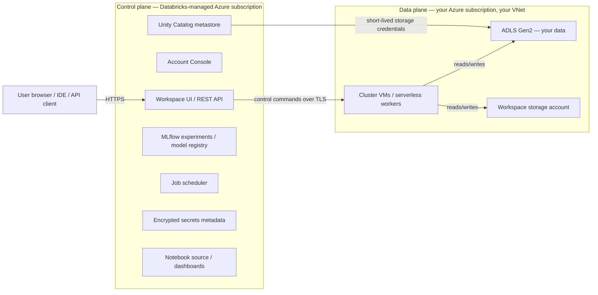
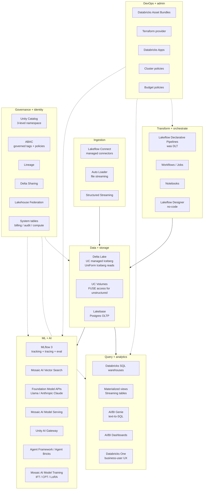

# Topic 02 — Azure Databricks

> **Audience:** Senior AI/ML Engineer (Optum, Azure-shop) targeting AI Architect or Engineering Manager. Already fluent in Python and PySpark. Already done Topic 01 (RAG/Vector DBs/Reranking).
>
> **Goal:** A teaching corpus that goes beyond marketing — production reality, performance discipline, admin operations, healthcare/HIPAA architecture, and the strategic lens for an architect-track engineer.
>
> **Last updated:** 2026-05-10

---

## Learning path

| # | Module | Why it matters |
|---|--------|----------------|
| **Foundations (1–7)** | | |
| 1 | [Lakehouse foundations & platform anatomy](01_foundations.md) | Why Databricks exists, control plane vs data plane, account vs workspace, the 2026 product map |
| 2 | [Compute model deep dive](02_compute_model.md) | Clusters, Photon, serverless, cluster policies, instance pools, init scripts, Photon ROI math |
| 3 | [Delta Lake fundamentals + 2025-2026 reality](03_delta_lake.md) | ACID, transaction log, Liquid Clustering, Predictive Optimization, deletion vectors, UniForm |
| 4 | [Notebooks vs Jobs vs Workflows vs Lakeflow Declarative Pipelines](04_notebooks_jobs_workflows_lakeflow.md) | When to use which orchestration surface; the DLT→Lakeflow rebrand |
| 5 | [Spark on Databricks — practitioner discipline](05_spark_practitioner.md) | Spark UI diagnostics, MERGE/SCD2, Auto Loader, streaming watermarks, schema evolution |
| 6 | [PySpark + SQL performance on Databricks](06_performance.md) | Joins, skew, AQE, shuffle, caching layers, Photon-aware code, file layout for query speed |
| 7 | [Databricks SQL & DBSQL](07_dbsql.md) | Warehouses, Photon SQL, materialized views & streaming tables, predictive I/O |
| **Governance & catalog (8–10)** | | |
| 8 | [Lakeflow Connect & ingestion](08_ingestion.md) | Managed connectors, Auto Loader, Structured Streaming patterns; vs Fivetran/Airbyte |
| 9 | [Unity Catalog deep](09_unity_catalog.md) | Three-level namespace, ABAC, dynamic views, the three-permission collision, Azure RBAC bypass |
| 10 | [HMS → UC migration reality](10_uc_migration.md) | UCX, HMS Federation, the 10-month timeline, war stories |
| 11 | [UC adjacency products](11_uc_adjacency.md) | Lineage (and what it misses), Lakehouse Federation, Delta Sharing, Volumes & FUSE |
| **ML/AI track (12–15)** | | |
| 12 | [MLflow 3.0 deep](12_mlflow3.md) | Tracking + registry + GenAI tracing + prompt registry + eval harness |
| 13 | [Mosaic AI Vector Search & RAG-on-Databricks](13_vector_search_rag.md) | Delta Sync, hybrid BM25+ANN, scale limits, healthcare ICD/CPT use case |
| 14 | [FMAPI + Model Serving + AI Gateway](14_serving_gateway.md) | Pay-per-token vs PT, the HIPAA breakthrough, Anthropic native, scale-to-zero reality |
| 15 | [Agent Framework / Agent Bricks / AI Functions / fine-tuning](15_agents_finetune.md) | Lakeguard, MCP bridging, IFT/CPT/LoRA, why pre-training is not the enterprise pattern |
| **Operations (16–20)** | | |
| 16 | [Cost & FinOps for AI architects](16_cost_finops.md) | DBU mechanics, system tables, attribution, Photon/serverless ROI, DBCU forfeit trap |
| 17 | [Admin playbook — accounts, workspaces, identity, audit](17_admin_playbook.md) | Role hierarchy, cluster policies, budget policies, identity ops, audit pipeline, runbooks |
| 18 | [Production pain, anti-patterns, war stories](18_production_pain.md) | What teams hit, who left and why, happy-path vs reality |
| 19 | [CI/CD with Asset Bundles + Terraform](19_cicd.md) | DABs, Brickflow, OIDC federation, environment promotion, testing in CI |
| 20 | [Networking, Private Link, SCC, VNet](20_networking.md) | Six-PE HIPAA topology, NCC limits, browser-auth PE footgun, Mar 31 2026 NAT change |
| **Healthcare & regulated (21–22)** | | |
| 21 | [HIPAA on Azure Databricks 2026](21_hipaa.md) | CSP permanent setting, three CMK products, BAA scope, audit retention vs HIPAA's 6 yrs |
| 22 | [Healthcare reference architectures](22_healthcare_archs.md) | Payor patterns (claims X12, Member 360, HEDIS, HCC), FHIR + AHDS de-id, two-workspace split |
| **Strategic (23–25)** | | |
| 23 | [Disaster Recovery & multi-region](23_dr_multiregion.md) | Customer-driven reality, active-passive vs active-active, deep clone, GRS gotchas |
| 24 | [Ecosystem & integration](24_ecosystem.md) | Observability (Datadog/Splunk/MC), DQ (DQX/GE/Soda), security wrappers (Privacera/Immuta) |
| 25 | [Cert paths & decision framework](25_certs_decisions.md) | DBX DE/ML/GenAI Engineer Associate vs AZ-305/AI-102; the 12-17 week recommended path |

## Companion files

- [`FACTS.md`](FACTS.md) — atomic, citable facts (numbers, model names, GA dates, retirements). Single source of truth, updated whenever something stale gets caught.
- [`quizzes/`](quizzes/) — per-module questions. Recall + apply + diagnose + defend. Use to test understanding after reading.
- [`code/`](code/) — runnable artifacts (`.py` notebooks via `# %%` cells, JSON cluster policies, Terraform modules, SQL queries).
- [`references/`](references/) — downloaded papers and archived blog posts where licensing allows.

## How to use this

1. Read modules in order **1 → 7** for foundations and Spark-on-Databricks discipline. **6** is the "make code fast" module worth a slow read.
2. **8 → 11** is the governance/catalog cluster — Unity Catalog dominates the architect interview.
3. **12 → 15** is the ML/AI track — builds on Topic 01's RAG/eval material with Databricks-specific surfaces.
4. **16 → 20** is operations — Cost, Admin, CI/CD, Networking. Read sequentially.
5. **21 → 22** is the Optum lens — regulated industry / HIPAA / healthcare.
6. **23 → 25** closes the corpus with strategic decisions: DR, ecosystem fit, cert paths.

Each module ends with a **Sanity check** — 3–5 questions you should be able to answer in your head before moving on. After finishing a module, take its quiz cold (no peeking).

Cross-reference [`FACTS.md`](FACTS.md) anytime you want a number, GA date, or citation.

## Scope notes

- **Cutoff:** content reflects **2025–early 2026** state of the art. Databricks ships features fast — re-verify GA/preview status before betting a roadmap on a single feature. `FACTS.md` carries "Last verified" dates.
- **Bias:** Azure Databricks (Optum is an Azure shop). AWS-specific differences are flagged where they matter; GCP is essentially ignored.
- **Anti-bias:** treats marketing critically. War stories, anti-patterns, and "why teams left" sit alongside the official path.
- **Stack convention:** no OpenAI in code samples; prefer Anthropic Claude or open-source models. PySpark code assumes fluency (no DataFrame intro).
- **Healthcare lens:** HIPAA, BAA scope, Compliance Security Profile, audit-log retention, naming-pollution discipline are woven throughout, not bolted on at the end.

## Stack baseline (additions to the project `.venv`)

```
databricks-sdk
databricks-connect    # version-pinned per cluster DBR
databricks-cli        # >=0.218
pyspark               # for local Spark fallback
delta-spark           # local Delta
mlflow                # >=3.0 for GenAI features
anthropic             # for AI Functions / Claude as judge examples
```

## Research provenance

This corpus is built from 11 deep research reports under [`../../.claude/worktrees/gifted-kilby-e6bd76/research_inputs/`](../../.claude/worktrees/gifted-kilby-e6bd76/research_inputs/) covering: production pain (`01`), third-party ecosystem (`02`), Unity Catalog governance (`03`), healthcare/HIPAA (`04`), 2024-2026 features (`05`), AI/ML for engineers (`06`), cost & FinOps (`07`), certs/networking/CI-CD (`08`), PySpark+SQL performance (`09`), Delta internals & data modeling (`10`), and admin operations (`12`). Plus a consolidated mid-research checkpoint (`00`) with 176 items beyond the original prompt seeds.


ewpage


# FACTS — Topic 02 Azure Databricks

> Atomic, citable claims. Numbers, model names, GA dates, retirements. Each entry has a "Last verified" date so you know how stale it is. Re-verify volatile items before teaching or betting a roadmap on them.
>
> **Convention:** if something changed and a previous fact is stale, mark the old one ~~struck-through~~ and add the new one with a fresh date below.

---

## Pricing — Azure Databricks (USD list, Premium tier, US regions)

- **Jobs Compute (classic):** $0.15/DBU-hr. _Last verified: 2026-05-10. Source: [Azure Databricks pricing](https://azure.microsoft.com/en-us/pricing/details/databricks/)._
- **Jobs Light Compute:** $0.22/DBU-hr (legacy, narrowing relevance).
- **All-Purpose Compute:** $0.55/DBU-hr — ~3.6× Jobs Compute.
- **SQL Classic:** $0.22/DBU-hr.
- **SQL Pro:** $0.55/DBU-hr.
- **SQL Serverless:** $0.70/DBU-hr (VM cost included; no separate Azure VM line).
- **DLT Core / Pro / Advanced:** $0.20 / $0.25 / $0.36 per DBU-hr.
- **Serverless Jobs:** ~$0.35/DBU-hr (VM included).
- **Model Serving CPU base:** $0.07/DBU.
- **Model Serving GPU (DBU/hr):** Small T4 = 10.48 · Medium A10G ×1 = 20 · Medium 4× = 112 · Medium 8× = 290.8 · Large 8× A100 40GB = 538.4 · Large 8× A100 80GB = 628.

## DBCU (committed use)

- **1-year discount:** typically 10–15% off list. _Source: [MS Learn — Prepay Databricks reserved capacity](https://learn.microsoft.com/en-us/azure/cost-management-billing/reservations/prepay-databricks-reserved-capacity)._
- **3-year discount:** up to ~37% off list.
- **Forfeit-not-rollover:** unused DBCUs do NOT roll over past the term — right-size to p25–p50, not p75.
- **Material enterprise discount threshold:** ~$235K+ annual committed spend (procurement intel).

## Tier retirement (2026)

- **Standard tier:** new Standard workspaces stopped **2026-04-01**; existing auto-upgrade to Premium by **2026-10-01**. Migration produces ~35% DBU rate increase for All-Purpose-heavy workloads.

## Foundation Model API token rates (DBU per million tokens, May 2026)

| Model | Input DBU/M | Output DBU/M |
|---|---:|---:|
| Llama 4 Maverick | 7.143 | 21.429 |
| Llama 3.3 70B | 7.143 | 21.429 |
| Qwen 3 Next 80B | 2.143 | 17.143 |
| GPT OSS 120B | 2.143 | 8.571 |
| Gemma 3 12B | 2.143 | 7.143 |
| Llama 3.1 8B | 2.143 | 6.429 |
| GPT OSS 20B | 1.000 | 4.286 |

**Embeddings:** Qwen 3 0.6B = 0.286 DBU/M · GTE = 1.857 DBU/M · BGE Large = 1.429 DBU/M.

## Compliance & retention

- **Audit log default retention:** ~1 year. _HIPAA Security Rule §164.316(b)(2)(i) requires 6 years_ — must forward to immutable destination. _Source: [Audit logs system table reference](https://learn.microsoft.com/en-us/azure/databricks/admin/system-tables/audit-logs)._
- **CSP (Compliance Security Profile) is permanent** — cannot be removed once a workspace has processed regulated data. Must delete and recreate to revert. _Source: [Compliance security profile](https://learn.microsoft.com/en-us/azure/databricks/security/privacy/security-profile)._
- **Three CMK products** with distinct scopes: managed services CMK (control plane), DBFS root CMK (workspace storage), managed disks CMK (cluster VM disks — classic only, NOT serverless).
- **AI/BI dashboards pre-Nov 2024** and **Genie Spaces pre-Apr 2025** are NOT encrypted with CMK at all.
- **Azure VNet outbound default change:** new VNets after **2026-03-31** no longer get default outbound internet access — NAT Gateway becomes mandatory for new Databricks workspaces.
- **NCC limits (account-level):** 50 workspaces per NCC, 100 PEs per region per account, 10 NCCs per region.

## Databricks Runtime (DBR)

- **DBR 17.3 LTS** — released October 2025; Spark 4.0; **the recommended LTS to standardize on for 2026 greenfield**. _Source: [DBR 17.3 LTS](https://docs.databricks.com/aws/en/release-notes/runtime/17.3lts)._
- **DBR 16.4 LTS** — released May 2025; Spark 3.5; baseline for UC managed Iceberg (Public Preview).
- **DBR 15.4 LTS** — Spark 3.5; baseline for Liquid Clustering GA.
- **DBR 14.3 LTS and earlier** — end-of-support approaching. Avoid for new work.
- **DBR 18.x** — 18.2 GA May 2026 (non-LTS, latest features).

## Apache Spark

- **Spark 4.0** GA **2025-05-23**. ANSI SQL on by default, VARIANT type, Spark Connect parity, Python Data Source API. Adopted in DBR 17.x. _Source: [Spark 4.0 release](https://spark.apache.org/releases/spark-release-4-0-0.html)._
- **Spark 4.1** brings Apache Spark Declarative Pipelines (the OSS landing of DLT/Lakeflow tech).

## Major rebrands and renames

- **Delta Live Tables (DLT) → Lakeflow Spark Declarative Pipelines (SDP)** — rename in 2024–2025; backward compatible. SKU codes still begin with "DLT" and event log schemas still say `dlt`. _Source: [What happened to DLT?](https://learn.microsoft.com/en-us/azure/databricks/ldp/where-is-dlt)._
- **MosaicML → Mosaic AI** — the GenAI/ML stack umbrella since 2024.
- **UniForm → "Iceberg reads"** — the feature where Delta tables expose Iceberg metadata async.
- **Mosaic AI Gateway → Unity AI Gateway** — rebranded.
- **Workflows ← Jobs** — naming shifted around 2023–2024.
- **DABs ("Databricks Asset Bundles") → "Declarative Automation Bundles"** — late 2024 rename.

## Acquisitions & valuations

- **MosaicML** — Jun 2023, ~$1.4B. _Source: [Wikipedia](https://en.wikipedia.org/wiki/Databricks)._
- **Arcion** — Oct 2023, ~$100M → CDC engine in Lakeflow Connect.
- **Lilac** — Mar 2024 → Mosaic AI dataset/eval tooling.
- **Tabular** — Jun 2024, $1B+ → UC managed Iceberg + UniForm + Iceberg REST.
- **BladeBridge** — early 2025 → DW migration tooling.
- **Neon** — May 2025, ~$1B → Lakebase.
- **Mooncake Labs** — 2025 → Lakebase acceleration.
- **Total acquisitions:** 17 as of April 2026 per Tracxn.
- **Series L:** September 2025; >$4B raised at $134B valuation; $4.8B revenue run-rate; 55% YoY growth.

## GA / Preview status (May 2026)

- **Liquid Clustering:** GA in DBR 15.2 (May 22, 2024). Automatic Liquid Clustering GA 2025.
- **Predictive Optimization:** GA 2025; **default-on for new UC managed tables, workspaces, and accounts**.
- **Hive Metastore Federation:** GA March 2025.
- **Lakehouse Federation:** GA (covers Snowflake, Postgres, MySQL, Redshift, SQL Server, Synapse, BigQuery, Salesforce DC, SAP BDC).
- **Lakeflow GA + Lakeflow Connect GA:** DAIS June 2025.
- **MLflow 3.0:** GA June 2025.
- **Mosaic AI Vector Search Hybrid (BM25 + dense):** GA 2025.
- **Mosaic AI Agent Framework:** GA 2024; **Agent Bricks:** Beta/Public Preview from June 2025.
- **Lakebase:** Public Preview from June 2025; GA status as of May 2026 — verify before teaching (latest signal Feb 2026 still preview).
- **Databricks Apps:** GA August 2025.
- **Databricks One:** Public Beta from June 2025.
- **Lakeflow Designer:** Public Preview from June 2025.
- **AI/BI Genie:** GA. Verified Answers / Trusted Assets GA 2025. Genie Code (autonomous data-team agent) introduced 2025–2026.
- **UC ABAC:** Public Preview April 2026 (tables, materialized views, streaming tables only — not yet model serving / volumes / functions).
- **UC Volumes:** GA.
- **UC Metric Views:** GA + open-sourced.
- **UC managed Iceberg tables:** Public Preview from DBR 16.4 LTS.
- **Iceberg REST Catalog API in UC:** Public Preview.
- **Snowflake Iceberg-write-to-UC:** GA on Azure **2026-04-06**.
- **Automatic Identity Management for Entra ID:** Public Preview 2026.
- **Foundation Model APIs pay-per-token under HIPAA (with Compliance Security Profile):** **major 2025 unlock** — for years FMAPI was non-HIPAA.

## Retirements

- **DBRX** — retired from FMAPI pay-per-token + fine-tuning **April 2025**. Still on Hugging Face for self-host.
- **Mistral 8x7B** — retired from FMAPI 2025.
- **Claude 3.7 Sonnet via Anthropic Messages API on Databricks** — retiring **2026-04-12**.
- **dbx** (deprecated successor of DABs) — explicitly deprecated by Databricks.
- **Hyperopt** — deprecated → migrate to Optuna.
- **Overwatch (Databricks Labs cost+observability)** — deprecated; replaced by `system.billing.usage`.
- **Databricks Labs Mosaic** (geospatial) — EOL with DBR 13.3 in **August 2026** → successor is **GeoBrix**.
- **Workspace-level SCIM** — being deprecated in favor of account-level SCIM.
- **Azure API for FHIR** — retiring **2026-09-30**; no new deployments since 2025-04-01.
- **NC v3 (V100) GPU SKUs** — being deprecated for Databricks workloads.

## Healthcare partnerships

- **Anthropic 5-year native partnership** signed **March 2025** — Claude (Haiku 4.5, Sonnet 4.6, Opus 4.7 with 1M context) available natively via SQL functions and model endpoints, governed by UC, no data egress to Anthropic's API.
- **John Snow Labs** — clinical NLP, de-id models, ICD-10 coding via foundation models in Model Serving.
- Healthcare customer references on databricks.com/customers (verify directly): CVS Health, Walgreens, Humana, Regeneron, Providence, Mayo Clinic, AstraZeneca, Sanofi, Eli Lilly.
- **No publicly published Optum or UHG end-to-end Databricks architecture** as of start of 2026.

## Performance numbers worth remembering

- **Photon breakeven margin:** ~20% speedup needed to break even on cost (because speedup affects both VM and DBU hours, not just DBU). Sync TPC-DS 1TB benchmark. _Source: [Sync benchmark](https://medium.com/sync-computing/are-databricks-clusters-with-photon-and-graviton-instances-worth-it-845641d464f2)._
- **Default autoscaling worse than tuned fixed cluster:** 37% more cost AND 14% slower on TPC-DS 100GB (Sync).
- **Snowflake-vs-Databricks SQL benchmark** (Akincilar): 24B-row dataset, 16 queries — DBX Large 636s vs Snowflake XL Gen1 266s (Snowflake **58% faster, 28% cheaper**).
- **Photon DBU multiplier:** 2× (the "premium" you pay for vectorized C++).
- **Idle GPU model serving cost:** Medium A10G held warm = ~$1,400/mo; Large 8X A100 80GB = ~$32K/mo per endpoint.
- **VM cost on top of DBU:** budget **$2–$3 of total spend per $1 of DBU**.

## Vector Search numbers

- **Standard endpoint cap:** ~320M vectors. **Storage-optimized:** ~1B vectors at 768-dim, ~7× cheaper per vector, ~250ms latency.
- **Hybrid scoring:** RRF with `rrf_param=60` default.

## Migration timelines (real)

- **Databricks' own internal HMS→UC migration:** 10 months with 4-person team.
- **Ensemble (healthcare RCM):** ~10,000 tables; single-night cutover after months of prep.
- **UCX (Databricks Labs):** explicitly "no SLA" — assessment dashboards stale on re-run.

## Audit-log retention reality

- Native: ~1 year.
- HIPAA requires: 6 years (45 CFR §164.316(b)(2)(i)).
- **`request_params` field of `system.access.audit` CAN contain PHI** — literal SQL values inlined into queries persist there.

---

## Source-of-truth pages worth bookmarking

- [Azure Databricks pricing — Microsoft](https://azure.microsoft.com/en-us/pricing/details/databricks/)
- [Databricks Foundation Model APIs supported models — Azure](https://learn.microsoft.com/en-us/azure/databricks/machine-learning/foundation-model-apis/supported-models)
- [Databricks Runtime release notes — Azure](https://learn.microsoft.com/en-us/azure/databricks/release-notes/runtime/)
- [HIPAA on Azure Databricks](https://learn.microsoft.com/en-us/azure/databricks/security/privacy/hipaa)
- [Compliance security profile](https://learn.microsoft.com/en-us/azure/databricks/security/privacy/security-profile)
- [Customer-managed keys for encryption](https://learn.microsoft.com/en-us/azure/databricks/security/keys/customer-managed-keys)
- [Audit log system table reference](https://learn.microsoft.com/en-us/azure/databricks/admin/system-tables/audit-logs)
- [Unity Catalog ABAC](https://learn.microsoft.com/en-us/azure/databricks/data-governance/unity-catalog/abac/)
- [Disaster recovery on Azure Databricks](https://learn.microsoft.com/en-us/azure/databricks/admin/disaster-recovery)
- [Predictive Optimization docs](https://learn.microsoft.com/en-us/azure/databricks/optimizations/predictive-optimization)
- [Liquid Clustering docs](https://learn.microsoft.com/en-us/azure/databricks/delta/clustering)
- [Lakeflow / What happened to DLT?](https://learn.microsoft.com/en-us/azure/databricks/ldp/where-is-dlt)

## Last full review

2026-05-10 (initial Topic 02 build).


ewpage


ewpage


# Module 1 — Lakehouse Foundations & Platform Anatomy

> **Goal of this module:** build the mental model an architect needs to reason about Databricks at the platform level — why it exists, how the pieces fit, what's stable vs what's churn, and where the lock-in lives. Subsequent modules dig into the components.

---

## Why this exists

The lakehouse pitch sits on top of two old failures.

**Data warehouses** (Teradata, Netezza, Redshift, Synapse, Snowflake) were the right answer for structured BI. They took the "schema and serve" idea seriously: define tables, load them, query them with ANSI SQL, get fast aggregates. The price was rigidity — getting JSON, images, audio, or in-flight semi-structured data into a warehouse meant pre-modeling everything and copying data through ETL pipelines. Costs ballooned because warehouses bundled compute and storage, you paid for both even when you needed only one, and they were proprietary engines that locked your data into vendor formats.

**Data lakes** (S3, ADLS, GCS + Hive, Presto, Spark) were the reaction. Cheap object storage, open file formats (Parquet, ORC), schema-on-read. The price was governance — no transactions, no enforced schemas, no consistent metadata, no fine-grained permissions. Data scientists had freedom; auditors had heart attacks. The "data swamp" pejorative described thousands of petabytes of poorly-cataloged Parquet that nobody dared to delete.

The **lakehouse** ([Armbrust et al., CIDR 2021](https://www.cidrdb.org/cidr2021/papers/cidr2021_paper17.pdf)) is the third position: keep the cheap object storage and open formats of the lake, but layer transactional metadata, ACID semantics, indexing, and governance on top. Three implementations now exist in the open: Delta Lake (Databricks-led, originally proprietary, donated to Linux Foundation 2019), Apache Iceberg (Netflix-originated, now Apache top-level), and Apache Hudi (Uber-originated). Databricks-the-company ships **Databricks-the-platform** as the hosted answer: managed Spark + Delta + Unity Catalog + ML/AI tooling on top of the customer's own cloud storage.

The strategic claim — *"one platform for BI, ETL, ML, and AI on the same data"* — is real, partial, and politically loaded. It is real in that the same Delta tables really do serve SQL warehouses, ML feature engineering, and RAG pipelines without copies. It is partial because BI on Databricks has historically lagged Snowflake on pure-SQL price/performance ([Akincilar benchmark, 2025](https://medium.com/@nickakincilar/snowflake-is-cheaper-faster-than-databricks-serverless-with-real-data-by-a-lot-dc2fe021838a) — Snowflake 58% faster and 28% cheaper on a 24B-row 16-query mix), and ML on Databricks is more credible than ML on Snowflake but less credible than ML on dedicated GPU clusters with vLLM. It is politically loaded because the practitioner-blogosphere reading is that "lakehouses are described in dizzying corporate doublespeak" ([Benn Stancil — *Category collapse*](https://benn.substack.com/p/category-collapse)) — i.e., the marketing language is denser than the engineering substance because the substance is mostly OSS.

The architect's job is to internalize all three readings. The corpus that follows treats Databricks as a serious platform with serious tradeoffs, not as a category-defining win.

---

## Platform anatomy

### Control plane vs data plane

Databricks splits the system into two planes that live in different places:



The **control plane** runs in Databricks' own Azure subscription. It hosts the workspace UI, REST API, notebook source, MLflow experiments, the job scheduler, the Unity Catalog metastore, secret metadata, dashboards. Crucially, it does **not** see your data — it sees commands you send (run this notebook, list catalogs, create a model serving endpoint), and it stores derived metadata about that work (job runs, query history, lineage edges, audit events).

The **data plane** runs in **your** Azure subscription and your VNet. Cluster VMs, serverless workers, your ADLS Gen2 storage accounts, the workspace storage account. Your data lives here and stays here. The control plane reaches the data plane to send commands either inbound (no Secure Cluster Connectivity — public IPs on workers, NSG-allowlisted) or via reverse-tunneled outbound TLS (with SCC, which is the default for healthcare-grade deployments — see Module 20).

Two implications matter at the architect level:

1. **The BAA boundary follows the data plane, not "Databricks the company."** Customer-defined fields that flow to the control plane — workspace names, cluster names, job names, tags, secret-scope names, query parameters — are *outside* the BAA. PHI in those fields is a compliance violation Databricks doesn't catch. ([HIPAA on Azure Databricks docs](https://learn.microsoft.com/en-us/azure/databricks/security/privacy/hipaa) — "*You are solely responsible for verifying that sensitive information is never entered in customer-defined input fields*".) Module 21 unpacks the consequences (naming-pollution lint).
2. **Audit logs are control-plane-managed but customer-retained.** `system.access.audit` lives in the control plane; native retention is ~1 year, vs HIPAA's 6-year requirement. You forward to your own SIEM or to an immutable Delta destination, and you carry that responsibility. Module 17 shows the pipeline.

### Account vs workspace

Two organizational levels exist:

- **Account**: the billing and identity root. One per Databricks contract per cloud. The account console (`accounts.azuredatabricks.net`) is where you administer SCIM groups, the metastore, network configurations (NCCs), workspaces, and consolidated billing. Account admins can do anything in the account.
- **Workspace**: one regional deployment of Databricks. Hosts clusters, notebooks, jobs, model serving endpoints, dashboards. Workspace admins are powerful within a workspace but cannot reach across to other workspaces or to the account.

The account-level view of identity is mandatory for Unity Catalog — workspace-level groups don't appear in `GRANT` statements. Workspace-level SCIM is being deprecated in favor of account-level SCIM ([UC requirements](https://learn.microsoft.com/en-us/azure/databricks/data-governance/unity-catalog/get-started)). For an Azure-shop architect this means **identity flows from Entra ID → SCIM → Databricks account → assigned to workspaces** — never workspace-direct identity.

For a healthcare org at Optum scale, you do not run "one workspace." You run a hub-and-spoke topology: per-business-line workspaces, separate PHI vs analytics workspaces, a tier-0 governance workspace where the metastore admin role lives, and a separate browser-auth workspace per region (because the browser-auth private endpoint is one-per-region-per-DNS-zone and deleting its host workspace breaks SSO for every dependent workspace — a real footgun, see Module 20).

### Region and metastore

Unity Catalog metastores are **regional and singleton** — exactly one UC metastore per cloud region per Databricks account ([UC best practices](https://learn.microsoft.com/en-us/azure/databricks/data-governance/unity-catalog/best-practices)). This single fact drives more architecture than people expect:

- **Lineage doesn't cross regions.** Period. Multi-region setups have multi-metastore setups, and stitching cross-region lineage is a customer build.
- **Permissions don't cross regions.** GRANTs in `eastus` metastore mean nothing in `eastus2` metastore. Delta Sharing transmits data, not grants.
- **Cross-region DR is a customer-driven workspace replication exercise** ([DR docs](https://learn.microsoft.com/en-us/azure/databricks/admin/disaster-recovery)) — Module 23.

The metastore decision *cannot* be reversed without a full re-grant + re-bind cycle, so it's worth treating as architectural. Optum-scale orgs typically have one metastore per region they operate in, and treat each as a tier-0 asset.

---

## The 2026 product map

A senior engineer needs to recognize the surface area without memorizing it. Here is the May 2026 view of Databricks-the-platform, organized by what each layer does.



A few observations worth flagging up front:

- **Lakeflow** is the umbrella that consolidated formerly-separate names: ingestion (was Auto Loader + custom Spark + connectors) is now Lakeflow Connect, declarative pipelines (was DLT) are now Lakeflow Declarative Pipelines, orchestration (was Jobs) is now Lakeflow Jobs / Workflows. Modules 4 and 8 unpack the practical implications of the rename.
- **Mosaic AI** is the GenAI/ML umbrella: Vector Search, Model Serving, Foundation Model APIs, AI Gateway, Agent Framework, Agent Bricks, Model Training. Modules 12–15 cover this.
- **Unity Catalog** is the governance spine that ties everything together. ABAC (Public Preview April 2026), Volumes, Metric Views, Delta Sharing, Lakehouse Federation are all UC-centric. Modules 9–11.
- **Lakebase** (Postgres on the lakehouse, June 2025 Public Preview) is the new face. Targets agent state stores, online feature stores, and operational app backends. Verify GA status before betting a roadmap on it; the latest signal as of February 2026 is still Public Preview ([InfoQ Feb 2026](https://www.infoq.com/news/2026/02/databricks-lakebase-postgresql/)). For healthcare it's "wait for v2."
- **Databricks One** (June 2025 Public Beta) is a role-based UX shell over Genie + AI/BI Dashboards + Apps for non-technical business users. Different from the workspace UI. Mostly a packaging move.
- **Apps** (GA August 2025) lets you build Streamlit/Dash/Gradio/React apps natively on Databricks with serverless infra, UC governance, OAuth. 20K+ apps across 2.5K orgs at GA ([Apps GA blog](https://www.databricks.com/blog/announcing-general-availability-databricks-apps)). The architect-relevant point: it gives you a way to ship internal apps without standing up a separate AKS cluster.

### Acquisitions trail (so the names make sense)

Eight acquisitions in 2023–2025 explain most of the 2026 product map:

| Acquisition | Year | Cost | Became |
|---|---|---|---|
| MosaicML | Jun 2023 | ~$1.4B | Mosaic AI brand + foundation-model training stack |
| Arcion | Oct 2023 | ~$100M | Lakeflow Connect CDC engine |
| Lilac | Mar 2024 | undisclosed | Mosaic AI dataset / eval tooling |
| Tabular | Jun 2024 | $1B+ | UC managed Iceberg + UniForm + Iceberg REST |
| BladeBridge | early 2025 | undisclosed | DW migration tooling (Teradata → Databricks) |
| Neon | May 2025 | ~$1B | Lakebase |
| Mooncake Labs | 2025 | undisclosed | Lakebase acceleration |

Tracxn lists 17 total acquisitions through April 2026. The Tabular acquisition (Iceberg's original creators — Ryan Blue, Dan Weeks) is the strategically most important one — it is Databricks' defensive answer to "we keep our data in Iceberg so we have an exit option." See Module 11 for what that bought architecturally.

---

## Stable vs volatile surfaces

A 2026 architect can't teach Databricks as a snapshot — too much moves quarter to quarter. Distinguish three layers:

**Stable.** The lakehouse storage primitives (Delta Lake transaction log, Parquet underneath, ADLS Gen2 for Azure), Spark APIs (DataFrame, SQL, Structured Streaming), MLflow tracking semantics, Unity Catalog three-level namespace, the workspace/account separation, the control-plane/data-plane split, BAA-relevant compliance toggles. These don't change in a way that breaks last year's architecture diagrams. Teach them confidently.

**Slow-moving.** Major new product surfaces (Lakeflow rebrand, Mosaic AI Vector Search, Agent Framework, Lakebase). Renames happen but backward compatibility is preserved. Teach them as "current as of [date]" with a re-verification habit.

**Volatile.** Pricing, Foundation Model API model lineup, GA-vs-Preview status of new features, exam blueprints, BAA scope on Beta features, GPU SKU availability per region. This stuff genuinely shifts month-to-month. **Treat every dollar figure, GA date, and BAA claim in this corpus as needing re-verification before betting a roadmap on it.** [`FACTS.md`](FACTS.md) carries "Last verified" stamps for the volatile items.

For DBR (Databricks Runtime) versions specifically, the LTS cadence is the stable scaffolding: ~one LTS per year, supported for 2 years. **Standardize new pipelines on the most recent LTS.** As of May 2026 that's **DBR 17.3 LTS** (October 2025, Spark 4.0). 16.4 LTS (May 2025, Spark 3.5) is fine if you have a hard dependency on Spark 3.5; 14.x and earlier are end-of-support and should not be in greenfield work. Module 17 covers DBR upgrade planning as an admin event.

---

## Where the lock-in lives

This is the question CFOs ask architects, and a careful read of the product map tells you the answer.

**Things you can leave with your data intact:**
- Delta tables in your own ADLS — readable by Spark OSS, by Iceberg-aware engines via UniForm, by DuckDB, by Trino. Storage lock-in is essentially zero.
- UC-managed Iceberg tables (Public Preview) — explicitly readable+writable from external engines via the Iceberg REST Catalog API. Snowflake's Iceberg-write-to-UC went GA on Azure on **2026-04-06** ([Snowflake release note](https://docs.snowflake.com/en/release-notes/2026/other/2026-04-06-iceberg-write-support-azure-unity-catalog)). You can mix engines today.
- Parquet/ORC in volumes — unstructured-data exit is straightforward.

**Things you lose if you leave:**
- Unity Catalog grants, ABAC policies, governed tags, lineage, audit history. UC is *the* moat. You'd reproduce the catalog in OpenMetadata or DataHub or Atlan.
- MLflow run history for models trained against UC tables — exportable but the lineage links break.
- Workspace artifacts: notebooks (exportable but format-shifted), dashboards (exportable as JSON), Lakeflow pipelines (re-implementable on OSS Spark Declarative Pipelines once Spark 4.1 ships).
- Mosaic AI products: Vector Search indexes (rebuild elsewhere), serving endpoints (re-deploy elsewhere), Agent Framework wrapping (rewrite to LangGraph + your own gateway), AI Functions in SQL (rewrite as UDFs against your chosen LLM provider).
- DBSQL warehouses (rewrite for Snowflake or Trino).

The architect's exit-door discipline: **keep your data in Delta or UC-managed Iceberg, your transformation logic in dbt or as portable PySpark, your model registry exportable, and your governance documented in catalog metadata that's exportable.** Avoid putting irreplaceable intellectual property into Mosaic-only constructs (Agent Bricks templates, AI Functions calls embedded in production logic) until they have multi-year track records and you've validated the exit cost.

This is not an argument against Databricks. It is the argument *for* taking the platform's best parts (Delta, UC, MLflow, Spark, Vector Search) seriously while resisting the temptation to ship production-critical IP into the parts that lock you in.

---

## When NOT to use Databricks

The Career_upskill habit is to teach when something is wrong as well as when it is right. Cases where Databricks is not the answer:

1. **Pure structured BI on a stable warehouse-shaped workload.** If the use case is "report on yesterday's sales" with terabytes-not-petabytes and well-known schemas, Snowflake or Microsoft Fabric typically wins on price and operational simplicity. The Akincilar SQL-only benchmark (above) is real. Don't pay the Databricks Spark/ML markup for workloads that don't need Spark or ML.
2. **Sub-second OLTP.** Lakebase is the new move here, but it's Public Preview; for production OLTP today, Postgres or Cosmos DB or Aurora are the right answer. The lakehouse architecture is fundamentally for analytical workloads.
3. **Sub-100ms model serving at extreme cost-per-token discipline.** Mosaic AI Model Serving is competitive but a mature platform team running vLLM-on-AKS will beat it on $/token at the cost of platform engineering. For latency-critical consumer products with deep MLE muscle, vLLM/AKS wins. For 80% of enterprises, Mosaic Serving is the right tradeoff.
4. **Greenfield "we have no data infrastructure yet."** Databricks shines when there is data to govern. Greenfield startups doing 100-row classification problems should not start by adopting a lakehouse. Start with DuckDB + a notebook; graduate when scale demands it.
5. **Strict data residency in a region Databricks doesn't have.** Especially relevant for healthcare in regulated jurisdictions outside the US/EU; check Azure region availability + Databricks regional availability + HIPAA/HITRUST coverage *before* committing.
6. **Deeply customized C++/CUDA training pipelines.** Databricks GPU clusters are managed and constrain CUDA/Triton/FlashAttention versions. If you need to swap CUDA versions weekly for research, raw AKS with GPU operator is the right answer.

For Optum specifically, none of these are blockers — the workload mix is heavy ETL + ML + GenAI on PHI-bearing data, which is Databricks' sweet spot. But it's worth knowing where the platform stops fitting.

---

## Production reality

A few cross-cutting truths an architect at this level should carry into every conversation:

### The two-bill surprise

Databricks pricing has two sides: the **DBU charge** (Databricks software fee) and the **Azure compute/storage/network charge** (Microsoft). They show up in different places in Azure Cost Management. Practitioners now warn newcomers to **budget $2–$3 of total spend per $1 of DBU spend** ([Flexera](https://www.flexera.com/blog/finops/snowflake-vs-databricks/)). Forecasts that count only DBUs are systematically low. Module 16 unpacks the math.

### The Standard-tier retirement

New Standard-tier workspaces stopped being available **2026-04-01**; existing Standard workspaces auto-upgrade to Premium by **2026-10-01**, with a ~35% DBU rate increase for All-Purpose-heavy shops. Healthcare orgs almost always run Premium anyway (UC ABAC, customer-managed keys, IP access lists, PHI-safe audit logs are Premium-gated), but if you've inherited a Standard workspace via M&A, plan the cost shift.

### The vendor-relationship reality

Databricks engages publicly. Their official Reddit presence is engineered (Foundation Inc. [publicly documented](https://foundationinc.co/lab/databricks-reddit-strategy) turning r/databricks into "a powerful community engine"), and the company has reportedly contacted public critics at their employer over Reddit/LinkedIn posts ([Daniel Beach](https://www.confessionsofadataguy.com/databricks-doubles-cost-reddit-explodes-im-in-trouble/) — "*Databricks folk hunted me down at work*"). For honest practitioner pain reports, r/dataengineering and Hacker News are richer than r/databricks. This is itself a teaching point about vendor relationships at the architect/EM level — public critique can carry account-team consequences.

### The strategic frame

Databricks won the lakehouse category narrative ([Mir Report — *How Databricks Won the Battle*](https://mir.report/p/how-databricks-won-the-battle-for)), but the win is about ecosystem gravity (Iceberg interop, Mosaic AI, Lakebase) more than irreplaceable engineering. **Betting on Databricks today is a bet on ecosystem lock-in, not on a unique technical moat.** The architect's protective discipline — keep data in formats that other engines can read — is the right posture even while you adopt the platform.

The Series L raise (September 2025: >$4B at $134B valuation, $4.8B revenue run-rate, 55% YoY growth) tells you the company is well-funded and not going anywhere ([press](https://www.databricks.com/company/newsroom/press-releases/databricks-surpasses-4-8b-revenue-run-rate-growing-55-year-over-year)). For a multi-year architecture commitment, vendor risk is low. For a five-year platform bet, the open-format discipline is what protects you regardless.

---

## Sanity check

Before moving on, you should be able to answer these in your head:

1. What lives in the **control plane** vs the **data plane**, and why does that distinction matter for HIPAA BAA scope?
2. Why is the Unity Catalog metastore *regional and singleton*, and what does that imply for multi-region disaster recovery?
3. Name three things you would lose if you migrated off Databricks tomorrow, and three you would keep. Which of the things-you'd-lose is reproducible elsewhere with engineering work, and which would require rebuilding governance from scratch?
4. What is the difference between **Premium tier** and the (now-retired-for-new) **Standard tier**, and why is Premium effectively mandatory for a healthcare workspace?
5. Why is **Tabular** ($1B+, June 2024) the strategically most important of Databricks' 17 acquisitions through April 2026?
6. What's the practical implication of the "two-bill surprise" for your forecasting math?

---

## Further reading

- [The Lakehouse: A New Generation of Open Platforms — Armbrust et al., CIDR 2021](https://www.cidrdb.org/cidr2021/papers/cidr2021_paper17.pdf) — the foundational paper.
- [Azure Databricks platform overview — Microsoft Learn](https://learn.microsoft.com/en-us/azure/databricks/) — the official map.
- [Databricks blog: DAIS 2025 announcements](https://www.databricks.com/events/dataaisummit-2025-announcements) — the largest single product drop in recent years.
- [Wikipedia — Databricks](https://en.wikipedia.org/wiki/Databricks) — surprisingly accurate timeline of acquisitions.
- [Mir Report — How Databricks Won the Battle for AI Infrastructure](https://mir.report/p/how-databricks-won-the-battle-for) — the strategic-state-of-play read.
- [Benn Stancil — Category collapse](https://benn.substack.com/p/category-collapse) — the contrarian read on lakehouse marketing.
- [Confessions of a Data Guy — Daniel Beach's Databricks essays](https://www.confessionsofadataguy.com/) — practitioner-grade honesty about the platform's edges.


ewpage


# Module 2 — Compute Model Deep Dive

> **Goal of this module:** be able to pick the right compute shape for any Databricks workload, write a production-grade cluster policy, understand exactly what Photon and serverless cost vs deliver, and not get surprised by the hidden gotchas (cold starts, init-script deprecations, Spot fallbacks, autoscaling thrashing).

---

## Why this exists

Databricks' compute story is not "Spark on managed VMs." It's a five-dimensional product: **{cluster mode (single user / shared / no isolation), tier (classic / serverless), runtime (DBR version), engine (JVM Spark / Photon), instance shape (CPU / memory / GPU / Spot)}** — every combination has different price, latency, security, and feature trade-offs. The architect's job is to know which combination fits which workload, codify that as a cluster policy, and audit drift.

The pitfall most teams fall into: **everything runs on All-Purpose Compute with autoscaling enabled, Photon turned on globally, default cluster policies.** That configuration is ~3.6× more expensive than Jobs Compute, has 37% higher cost than tuned fixed clusters with worse runtime ([Sync Computing benchmark](https://medium.com/sync-computing/is-databrickss-autoscaling-cost-efficient-610e6ece4831)), and pays Photon's 2× DBU multiplier on workloads that don't benefit. Module 16 tells you to find this and fix it; this module tells you how to design around it.

---

## How it works — the cluster taxonomy

### Five compute SKUs that matter in 2026

| SKU | Use | $/DBU-hr (Azure, Premium, US) | VM in price? | Typical startup |
|---|---|---:|---|---|
| **Jobs Compute** (classic) | Scheduled, ephemeral runs | **$0.15** | No (separate Azure VM bill) | 3–7 min |
| **All-Purpose Compute** | Interactive notebooks, dev | **$0.55** | No | 3–10 min |
| **Serverless Jobs** | Scheduled, fast startup | ~$0.35 | **Yes** | seconds |
| **SQL Serverless** | DBSQL warehouses | **$0.70** | **Yes** | 5–10 sec |
| **Model Serving** | Online inference | varies, GPU 10–628 DBU/hr | **Yes** | 10s–min cold |

_Sources: [Azure Databricks pricing](https://azure.microsoft.com/en-us/pricing/details/databricks/), [databrickspricing.com rate tables](https://www.databrickspricing.com/dbu-pricing-explained). All numbers May 2026._

The first decision is **Jobs Compute vs All-Purpose Compute** — and the answer is "Jobs Compute, always, for anything scheduled." All-Purpose is for *interactive* work where humans are typing in notebooks. Migrating scheduled workloads from All-Purpose to Jobs is a **3.6× cost cut on the Databricks side**, no engineering work other than changing where the job runs ([Youssef cost playbook](https://medium.com/@ahmed.youssef12377/databricks-cost-optimization-playbook-lessons-from-cutting-production-costs-by-over-80-0e81d8b7a374)). It is the single highest-ROI lever on the platform.

### Cluster modes (access mode)

Three modes since 2024 ([UC compute docs](https://learn.microsoft.com/en-us/azure/databricks/compute/configure)):

- **Single User** — one user owns the cluster; runs as that user's identity. Works with all UC features. The 2026 default for ML / individual dev work.
- **Standard / Shared** — multiple users, isolated Python environments per user, runs queries as the *querying* user (so UC permissions enforce per-user). Required for analyst clusters where you want one warm pool serving the team.
- **No Isolation Shared** — legacy, multiple users, shared identity. **Cannot use Unity Catalog for tables with row/column filters.** Avoid for new work; deprecate where you find it.

For UC + ABAC + row filters + column masks, **Standard or Single User mode is mandatory** ([UC requirements](https://learn.microsoft.com/en-us/azure/databricks/data-governance/unity-catalog/get-started)). The legacy "passthrough" mode many shops grew up on is gone.

### Photon — the 2× DBU question

Photon is Databricks' vectorized C++ execution engine, originally announced at Data + AI Summit 2020 and now the default for SQL and DLT. It charges a **2× DBU multiplier** on the cluster ([Photon docs](https://learn.microsoft.com/en-us/azure/databricks/compute/photon)).

The breakeven test: Photon must produce **~20% more speedup than the bare instance** to be net-positive on cost — because the speedup also reduces VM hours and DBU-hours, the math is not pure 2×/2× ([Sync Computing benchmark on TPC-DS 1TB](https://medium.com/sync-computing/are-databricks-clusters-with-photon-and-graviton-instances-worth-it-845641d464f2)).

**Photon-friendly workloads (turn it on):**
- SQL warehouses, Spark SQL queries, DataFrame native operations
- Joins, aggregations, window functions, sorts
- Native Parquet read/write, Delta MERGE/UPDATE/DELETE (Photon got a native Parquet writer in 2024 that accelerates DML)

**Photon-hostile workloads (don't pay the 2×):**
- **Python UDFs** — execution falls back to Python; Photon does nothing
- **Pandas UDFs** — partial benefit, but generally below the 20% margin
- **RDD code** — Photon doesn't run RDDs at all
- **Spark MLlib / pyspark.ml training loops** — iterative; Photon barely helps
- **Tiny data jobs** — Photon's setup overhead amortizes poorly under ~10 GB
- **Append-mostly streaming with simple transformations** — already cheap; Photon adds DBU

**Miles Cole's TPC-style benchmark** ([Is Databricks Photon a no-brainer?](https://milescole.dev/data-engineering/2024/04/30/Is-Databricks-Photon-A-NoBrainer.html)) found ~2.7× average speedup but **Query 6 cost 72% MORE with Photon** ($0.054 → $0.093). The takeaway: **"Photon everywhere by default" is an anti-pattern**. Benchmark per workload type, then enforce via cluster policy.

### Serverless compute — the 2024–2025 wave

Serverless is now GA across the board: SQL warehouses (longstanding), jobs/notebooks (2024), model serving (2024), DLT/Lakeflow (2025), and serverless GPU compute beta on Azure (A10 only as of late 2025).

**What serverless gives you:**
- Sub-minute startup — vs 3–10 min on classic
- Scale to zero in seconds — no idle bill
- VM cost included in the DBU rate (one bill instead of two)
- No cluster config to manage — no Spot/On-Demand decisions, no instance type tuning

**What serverless takes away:**
- **You cannot pick instance type, use Spot, or run a custom Docker image.**
- **You cannot `.persist()` DataFrames** — caching API is restricted on serverless ([HN 43899252](https://news.ycombinator.com/item?id=43899252)).
- **No per-job memory/CPU metrics via API.**
- **Cold-start re-installs your full dependency tree** every time. The startup cost reproduces in seconds rather than minutes, but it reproduces ([Bauplan analysis](https://www.bauplanlabs.com/post/to-serverless-or-not-to-serverless)).
- **Higher per-DBU rate** ($0.70 SQL Serverless vs $0.55 SQL Pro). Pays back when utilization is jagged; loses on flat-line saturated warehouses.

**Real production reports of serverless cost explosions** for DLT specifically: 3–5× cost increases moving DLT to serverless; one user reported €2,000 burned in two days across four pipelines ([Zipher analysis](https://zipher.cloud/databricks-serverless-pros-cons/)). Databricks markets 98% lower cost for materialized view refreshes — the discrepancy is workload-shape-dependent and the buyer can't see DBU consumption inside serverless to validate. **Default to classic Jobs Compute for predictable production workloads; default to serverless for spiky / interactive / unknown-utilization paths.**

### GPU compute on Azure Databricks

The 2026 SKU lineup ([Azure Databricks GPU docs](https://learn.microsoft.com/en-us/azure/databricks/compute/gpu)):

| Family | GPU | Memory | Use |
|---|---|---|---|
| NCadsA10_v4 | A10g | 24 GB | Cheap inference, light fine-tuning |
| NCads_A100_v4 | A100 40 GB | 40 GB | 7B–13B fine-tunes |
| NDasrA100_v4 | A100 80 GB | 80 GB | Larger models, larger batches |
| ND_H100_v5 (8× H100) | H100 | 8× 80 GB NVLink | 70B fine-tunes, distributed training |
| NV_v5 | various | — | Visualization (rare in DBX) |
| NC v3 (V100) | V100 | 16 GB | **Being deprecated — don't start here** |

ND_H100_v5 lists ~$98/hr Azure on-demand (~$12.30/GPU-hr); spot ~$70-75/hr. Reserved 1y/3y up to 60% off ([Vantage instance pricing](https://instances.vantage.sh/azure/vm/nd96isrh100-v5)).

**Azure capacity reality:** H100 capacity in HIPAA-eligible regions (East US, Central US) is tightest. East US 2, South Central, West US 3 are most reliable but may not satisfy data residency. **Check capacity availability before committing roadmap.**

### Cluster mode meets DBR

Each cluster picks a Databricks Runtime (DBR) version. The 2026 picture:

| DBR | Spark | Status | Use for |
|---|---|---|---|
| 14.3 LTS | 3.5 | EoS approaching | Avoid for new work |
| 15.4 LTS | 3.5 | Supported | If hard dep on Spark 3.5 |
| 16.4 LTS | 3.5 | Supported (May 2025) | Liquid Clustering GA, UC managed Iceberg Public Preview |
| **17.3 LTS** | **4.0** | **Recommended** (Oct 2025) | **2026 greenfield default** |
| 18.x | 4.0 | Non-LTS, latest features | Edge cases |

DBR upgrade is the single most disruptive recurring admin event — Spark 4 / Scala 2.13 / `input_file_name` removal in 17.x are real breaking changes for code that depended on legacy APIs. Module 17 covers the upgrade runbook.

### Init scripts — the lifecycle that won't sit still

Init scripts run on every cluster node at startup. Used for: corp CA cert install, library install for offline workspaces, monitoring agent install, custom `LD_LIBRARY_PATH` for proprietary libs.

**The deprecation history (3 migrations in ~3 years):**
1. **Pre-2023:** DBFS-stored cluster-scoped init scripts.
2. **May 2023:** DBFS deprecated; migrate to **workspace files**.
3. **Dec 1, 2023:** cluster-named DBFS scripts disabled outright.
4. **2024+:** workspace files OK, but **UC Volumes is the recommended pattern** for governance and versioning.

The pattern that sticks ([Databricks KB migration](https://kb.databricks.com/clusters/migration-guidance-for-init-scripts-on-dbfs)):

```bash
# Store at: /Volumes/_admin/init/scripts/install_corp_ca_v3.sh
# Reference in cluster policy as init_scripts: [{ "volumes": { "destination": "..." } }]
```

Use a **`_v<n>` suffix** in the path to enable rollforward without overwriting in place — every cluster restart re-pulls; if the new version is bad, you flip the policy to `_v(n-1)` and bounce. **Never edit init scripts in place** — the wave of cluster restarts touching the bad version is hard to undo.

---

## Cluster policies — the central admin lever

A cluster policy is JSON that constrains what users can configure when they create a cluster. Policies enforce tags (for chargeback), instance types (for cost), DBR versions (for stability), auto-termination (against forgotten clusters), and security mode (for UC compatibility). They are the single highest-ROI admin artifact.

The pattern: **one policy per persona**, not per team. Personas are stable; teams come and go.

### The four canonical personas

```json
// 1. Analyst — interactive, smallish, hard auto-term
{
  "spark_version": {"type": "regex", "pattern": "^17\\.[0-9]+\\.x-scala2\\.13$"},
  "node_type_id": {"type": "allowlist", "values": [
    "Standard_DS4_v5", "Standard_DS5_v5", "Standard_E8ds_v5"
  ]},
  "data_security_mode": {"type": "fixed", "value": "USER_ISOLATION"},
  "autotermination_minutes": {"type": "range", "minValue": 10, "maxValue": 60, "defaultValue": 30},
  "num_workers": {"type": "range", "maxValue": 8},
  "custom_tags.cost_center": {"type": "regex", "pattern": "^cc-[0-9]{6}$"},
  "custom_tags.business_unit": {"type": "allowlist", "values": ["claims", "member", "provider", "rx", "stars", "actuarial"]},
  "custom_tags.data_classification": {"type": "allowlist", "values": ["non-phi", "deid"]},
  "spark_conf.spark.databricks.cluster.profile": {"type": "fixed", "value": "singleNode", "hidden": true},
  "init_scripts.0.volumes.destination": {"type": "fixed", "value": "/Volumes/_admin/init/analyst_v3.sh"}
}
```

```json
// 2. ML Engineer — GPU allowed, longer runtime, Spot for cost
{
  "spark_version": {"type": "regex", "pattern": "^17\\.[0-9]+\\.x-(gpu-)?ml-scala2\\.13$"},
  "node_type_id": {"type": "allowlist", "values": [
    "Standard_DS5_v5", "Standard_E8ds_v5",
    "Standard_NC24ads_A100_v4", "Standard_ND96isr_H100_v5"
  ]},
  "data_security_mode": {"type": "allowlist", "values": ["SINGLE_USER", "USER_ISOLATION"]},
  "autotermination_minutes": {"type": "range", "minValue": 30, "maxValue": 240, "defaultValue": 120},
  "num_workers": {"type": "range", "maxValue": 32},
  "azure_attributes.availability": {"type": "fixed", "value": "SPOT_WITH_FALLBACK_AZURE"},
  "azure_attributes.first_on_demand": {"type": "fixed", "value": 1},
  "azure_attributes.spot_bid_max_price": {"type": "fixed", "value": -1},
  "custom_tags.cost_center": {"type": "regex", "pattern": "^cc-[0-9]{6}$"},
  "custom_tags.workload": {"type": "fixed", "value": "ml"},
  "custom_tags.data_classification": {"type": "allowlist", "values": ["non-phi", "deid", "phi"]}
}
```

```json
// 3. Job (production, no humans) — narrow, Photon-default, Jobs Compute
{
  "cluster_type": {"type": "fixed", "value": "job"},
  "spark_version": {"type": "regex", "pattern": "^17\\.[0-9]+\\.x-scala2\\.13$"},
  "node_type_id": {"type": "allowlist", "values": [
    "Standard_DS4_v5", "Standard_DS5_v5", "Standard_E8ds_v5", "Standard_E16ds_v5"
  ]},
  "data_security_mode": {"type": "fixed", "value": "SINGLE_USER"},
  "runtime_engine": {"type": "fixed", "value": "PHOTON"},
  "azure_attributes.availability": {"type": "fixed", "value": "SPOT_WITH_FALLBACK_AZURE"},
  "azure_attributes.first_on_demand": {"type": "fixed", "value": 1},
  "num_workers": {"type": "range", "maxValue": 50},
  "custom_tags.cost_center": {"type": "regex", "pattern": "^cc-[0-9]{6}$"},
  "custom_tags.workload": {"type": "fixed", "value": "etl"},
  "custom_tags.data_classification": {"type": "allowlist", "values": ["non-phi", "deid", "phi"]}
}
```

```json
// 4. Platform Admin / Break-Glass — broad, audited, time-limited
{
  "spark_version": {"type": "unlimited", "isOptional": false},
  "node_type_id": {"type": "unlimited"},
  "data_security_mode": {"type": "allowlist", "values": ["SINGLE_USER", "USER_ISOLATION"]},
  "autotermination_minutes": {"type": "range", "minValue": 5, "maxValue": 120, "defaultValue": 60},
  "num_workers": {"type": "range", "maxValue": 100},
  "custom_tags.cost_center": {"type": "fixed", "value": "cc-platform-admin"},
  "custom_tags.purpose": {"type": "regex", "pattern": "^break-glass-(incident|investigation|maintenance)-[A-Z]+-[0-9]{4}-[0-9]{2}-[0-9]{2}$"}
}
```

The break-glass policy's `purpose` regex forces every cluster created under it to carry an incident ticket reference, which lands in `system.access.audit` for compliance review. Permission to *use* this policy is granted to the on-call SRE group only and audited monthly.

### The hidden tax: tag enforcement

Tag enforcement at policy level is the single thing that makes chargeback work. Without it, you get free-text tags that don't normalize (`cost-center` vs `cost_center` vs `costcenter`), and the chargeback report explodes. The pattern: enforce a regex on `custom_tags.cost_center`, allowlist on `custom_tags.business_unit`, and require `custom_tags.data_classification` for any HIPAA workspace ([MS Learn — usage detail tags](https://learn.microsoft.com/en-us/azure/databricks/admin/account-settings/usage-detail-tags)).

For serverless workloads, cluster policies don't apply — you need **Serverless Budget Policies** ([Revefi guide](https://www.revefi.com/blog/databricks-serverless-budget-policies-2026)) to enforce the same tags. Module 17 covers this.

---

## Instance pools — the latency-vs-cost trade

**Instance pools** are pre-warmed VM pools; clusters claim from the pool instead of waiting on Azure VM provisioning. Reduces classic-cluster startup from 3–7 min to ~30 sec for the cluster scheduler portion (the DBR install still happens). Tags on pools propagate to clusters that use them.

**When pools save money:** teams with frequent ephemeral cluster creation (CI integration jobs, ad-hoc analyst sessions). The idle-VM cost of the pool is offset by faster startup × frequency.

**When pools waste money:** low-frequency clusters. A pool with 4 idle VMs at $0.40/hr each that gets one cluster spin-up per day burns $35/day for ~5 minutes saved. Don't run pools at min_idle > 0 for low-traffic environments.

**Tag inheritance gotcha:** **cluster tags override pool tags on billing rows.** If a cluster forgets a `cost_center` tag, the pool's tag does *not* automatically backfill. Enforce both at policy level.

---

## Autoscaling — when it helps, when it actively hurts

Autoscaling adjusts worker count based on pending tasks. Sounds great. The Sync Computing TPC-DS 100GB benchmark found **default autoscaling 37% more expensive AND 14% slower** than a tuned fixed cluster ([Sync benchmark](https://medium.com/sync-computing/is-databrickss-autoscaling-cost-efficient-610e6ece4831)). Two reasons:
1. **Upscale events burn minutes** in `RESIZING → UPSIZE_COMPLETED`, plus init-script reinitialization on new nodes.
2. **The autoscaler bounces 1↔2 nodes** mid-job for short bursts that don't justify the up/down cost.

**When autoscaling actually wins:**
- **Ad-hoc / interactive** workloads where load is unpredictable.
- **Long-running clusters** where the savings on idle minutes outweigh the upscale cost.

**When fixed clusters win:**
- **Predictable batch jobs** — size once with empirical data, run forever. This is most production ETL.
- **Photon-heavy SQL** where startup-on-demand is short anyway.

**The Spot interaction trap:** autoscaling sees pending tasks and asks for more workers. If Spot capacity is unavailable in the region, Databricks falls back to On-Demand silently. You signed up for 90% savings and ended up paying list price during a regional Spot crunch. Mitigation:
- `azure_attributes.first_on_demand` = 1 — the driver is always On-Demand (avoids preemption killing the cluster mid-run)
- `azure_attributes.availability` = `SPOT_WITH_FALLBACK_AZURE` — workers are Spot, fall back to On-Demand if needed
- Set explicit Spot ceilings in cluster policy so the fallback is bounded.

---

## When NOT to use Databricks compute

For completeness, cases where some other compute fits better:

1. **Pure SQL BI under 1 TB** — DuckDB on a beefy VM beats spinning a Spark cluster, no DBU, no shuffle.
2. **Sub-100ms streaming feature serving** — Lakebase or a dedicated Redis / DynamoDB beats round-tripping through Spark.
3. **Sub-second model inference at extreme cost-per-token** — vLLM-on-AKS will outprice Mosaic Serving for a mature MLE team.
4. **Custom CUDA / Triton / FlashAttention research** — DBR pins CUDA versions; raw AKS with GPU operator gives full control.
5. **Notebook with ten users, one shared dataset, hourly load** — Snowflake at warehouse-suspended-when-idle is operationally simpler.

For Optum scale none of these are blockers; they exist to know when *not* to over-fit Databricks to a problem.

---

## Production reality

### The "default cluster" tax

Most workspaces run with default cluster policies (or none) for the first 6–12 months. The cost shape that emerges:
- Devs make per-person All-Purpose clusters (~$400/mo idle each × 30 devs = **$144K/yr of nothing**).
- One forgotten cluster left running over a month: **$1,000+** ([Youssef cost playbook](https://medium.com/@ahmed.youssef12377/databricks-cost-optimization-playbook-lessons-from-cutting-production-costs-by-over-80-0e81d8b7a374)).
- A "scheduled" workload accidentally on All-Purpose: 3.6× the real cost.
- Photon turned on globally: 2× DBU on every UDF-heavy ETL job for nothing.

The fix is mostly admin, not engineering — see Module 17.

### Cluster startup pain

Classic cluster startup is 3–7 min typical, sometimes 10 min ([Community thread 78172](https://community.databricks.com/t5/data-engineering/databricks-cluster-random-slow-start-times/td-p/78172)). For a job that runs in 90 seconds the math doesn't work — you spend 4 minutes warming the cluster to do 1.5 minutes of work. Three workarounds, in order of preference:
1. **Move to Serverless Jobs Compute.** Sub-minute startup. The right answer when latency matters and the workload isn't streaming-cheap.
2. **Use Instance Pools.** Cluster scheduler runs in ~30 sec; DBR install still happens. Helps if you're not on serverless.
3. **Co-locate small jobs into one larger job.** If you're running 50 jobs of 90 sec each on independent clusters, batch them into one DAG.

### Library install conflicts

Databricks "cannot guarantee the order in which specific libraries are installed on the cluster" ([library docs](https://docs.databricks.com/aws/en/libraries/)). Built-in DBR libs silently override user-installed libs. One community report: a wheel installed as a JAR by Python Wheel Task ([Community 33146](https://community.databricks.com/t5/data-engineering/bug-databricks-install-whl-as-jar-in-python-wheel-task/td-p/33146)). The recommended fix — "use one wheel containing all deps" — collides with corporate artifact-repo policies that forbid bundling third-party code.

The pragmatic discipline: **pin all your dep versions in a `pyproject.toml`-driven wheel; build it in CI; install it as the only library on the cluster; let DBR provide everything else.** Use a private PyPI mirror (Azure Artifacts, JFrog) for the regulated case where you can't pull from public PyPI.

### `databricks-connect` version drift

The local `databricks-connect` package's major.minor must match the cluster's DBR version, but the VS Code extension defaulted to the wrong version for over a year ([GitHub #1391](https://github.com/databricks/databricks-vscode/issues/1391)). Worse: installing `databricks-connect` removes local `pyspark` (mutually exclusive). Every DBR upgrade triggers a coordinated team-wide local-env upgrade, or CI breaks silently. Plan for it.

---

## Sanity check

1. A scheduled job currently runs on **All-Purpose Compute** at $0.55/DBU. What's the dollar cut from migrating it to Jobs Compute, and what — if anything — has to change in the job code?
2. You're benchmarking Photon on a Spark job that's 70% Python UDF. The job runs 8% faster with Photon on. Should you keep it on?
3. Your team has 30 dev ML clusters, one per person. You suspect $100K+/yr in idle waste. What three policy levers would you pull?
4. A user reports their cluster won't accept a `databricks-connect` connection from VS Code. The cluster is on DBR 17.3 LTS. What's the most likely root cause and how do you fix it?
5. The platform team wants to enforce that **every cluster carries a `cost_center` tag and uses an approved DBR LTS**. What's the JSON snippet inside a cluster policy that does this?
6. A streaming Bronze job is auto-scaling between 1 and 2 nodes for short bursts and the bill is high. What would you do, and why is autoscaling sometimes the wrong default?

---

## Further reading

- [Compute configuration reference — Microsoft Learn](https://learn.microsoft.com/en-us/azure/databricks/compute/configure)
- [GPU-enabled compute — Microsoft Learn](https://learn.microsoft.com/en-us/azure/databricks/compute/gpu)
- [Photon — Microsoft Learn](https://learn.microsoft.com/en-us/azure/databricks/compute/photon)
- [Cluster policies reference — Microsoft Learn](https://learn.microsoft.com/en-us/azure/databricks/admin/clusters/policies)
- [Init scripts migration guidance — Databricks KB](https://kb.databricks.com/clusters/migration-guidance-for-init-scripts-on-dbfs)
- [Sync Computing — Photon TPC-DS benchmark](https://medium.com/sync-computing/are-databricks-clusters-with-photon-and-graviton-instances-worth-it-845641d464f2)
- [Sync Computing — Is autoscaling cost-efficient?](https://medium.com/sync-computing/is-databrickss-autoscaling-cost-efficient-610e6ece4831)
- [Miles Cole — Is Databricks Photon a no-brainer?](https://milescole.dev/data-engineering/2024/04/30/Is-Databricks-Photon-A-NoBrainer.html)
- [Spot instance best practices — MS Tech Community](https://techcommunity.microsoft.com/blog/microsoftmissioncriticalblog/azure-databricks---best-practices-for-using-spot-instances-in-cluster-scaling/4402018)
- [Bauplan — To serverless or not](https://www.bauplanlabs.com/post/to-serverless-or-not-to-serverless)
- [Zipher — When is Photon worth it?](https://zipher.cloud/when-is-databricks-photon-worth-it/)


ewpage


# Module 3 — Delta Lake Fundamentals + 2025-2026 Reality

> **Goal of this module:** internalize the Delta Lake mental model an architect needs — how the transaction log works, what data skipping costs and gives you, when Liquid Clustering replaces Z-Order, what Predictive Optimization auto-decides, why deletion vectors changed the MERGE economics, and which schema-evolution moves are free vs which require rewrites. This module is the storage-layer companion to Module 6 (PySpark/SQL performance).

---

## Why this exists

Before Delta Lake, "data on object storage" meant a pile of Parquet files in S3 or ADLS, with metadata maintained by a separate Hive metastore. The arrangement worked for read-only analytics but broke down for any workload that needed the things warehouses gave you — atomic updates, concurrent writers, transactional schema changes, time travel, lineage of writes. The "data swamp" critique landed on this gap: lake storage was cheap and open but uncoordinated.

Delta Lake (originated at Databricks, donated to the Linux Foundation in 2019, [delta.io](https://delta.io/)) is the answer that won at Databricks: a transaction log layered on top of Parquet that gives you ACID, schema enforcement, time travel, statistics-based pruning, and a clean concurrency model — without giving up the open file format underneath. Apache Iceberg (Netflix-originated) and Apache Hudi (Uber-originated) are the other open answers. The 2024 Tabular acquisition brought Iceberg's creators to Databricks, and the 2026 picture is "pick Delta or Iceberg in Unity Catalog and largely it doesn't matter for analytics" (see Module 11).

The architect-level mental model is one sentence: **a Delta table is a directory of Parquet files plus a `_delta_log/` directory whose JSON commits are the only authoritative answer to "what is this table?"** Everything in this module is a consequence of that fact.

---

## The transaction log: `_delta_log/` is the table

Drop the `_delta_log/` directory and you have an unstructured Parquet dump. Lose the Parquet and you have an empty schema. The log is the source of truth for what files exist, what schema they have, and what version of the table you're seeing.

### Physical layout

Inside `_delta_log/` you find:

- **Commit files** (`00000000000000000000.json`, `…0001.json`, …) — one per transaction, each an ordered list of `Action` records: `add` (a new file), `remove` (a tombstoned file), `metaData` (schema), `protocol` (reader/writer version), `commitInfo`, `txn` (idempotent commit ID), `cdc` (change-data-feed action), `domainMetadata`.
- **Checkpoint files** (`…0010.checkpoint.parquet`) — every 10 commits by default (`delta.checkpointInterval`), Delta materializes the full state into a Parquet checkpoint so cold readers don't have to replay every JSON. Modern Delta versions also write **multi-part checkpoints** (`*.checkpoint.NNNN.MMMM.parquet`) and **V2 checkpoints** (manifest + sidecar files) for very large tables.
- **`_last_checkpoint`** — a tiny JSON pointer to the most recent checkpoint version. Saves a directory listing on cold reads.
- **`_change_data/`** — a sibling directory holding CDF Parquet for non-insert-only commits when Change Data Feed is enabled.

A reader resolves "table at version N" by: read `_last_checkpoint` → load that checkpoint Parquet → replay JSON commits *after* it up to N. ([delta.io transaction log protocol](https://delta.io/blog/2023-07-07-delta-lake-transaction-log-protocol/), [Databricks: Diving into Delta Lake](https://www.databricks.com/blog/2019/08/21/diving-into-delta-lake-unpacking-the-transaction-log.html)).

This is why **log compaction matters**: with a million commits and no checkpoint, a cold reader pays for a million tiny JSON reads from object storage. On a streaming Bronze table that commits every minute, that's >500K commits/year. Checkpoints make state retrieval O(log N). For very high-velocity tables, raise `delta.checkpointInterval`, enable V2 checkpoints, and consider **log compactions** (`delta.logCompactionInterval`, Delta 3.2+) which collapse runs of JSON commits into single compacted JSONs without doing a full checkpoint.

### Reader / writer protocol versions

Historically, the protocol used monotonic integer versions: R1/W1 → R3/W7. The modern model is **`R3/W7` + table features** — each capability (deletion vectors, column mapping, type widening, Liquid Clustering, identity columns, V2 checkpoints, generated columns, row tracking, timestampNTZ, variant) is a named feature you opt into, and the writer advertises only the features it needs. This is why a "Delta 3.x" writer can produce a table that a "Delta 2.x" reader can't open even though the integer protocol numbers haven't changed: the missing piece is a feature flag, not a version number ([Delta PROTOCOL.md](https://github.com/delta-io/delta/blob/master/PROTOCOL.md)).

Operationally: when you enable a new table feature (e.g., `ALTER TABLE … SET TBLPROPERTIES ('delta.enableDeletionVectors' = true)`), older readers without that feature stop being able to read the table. Plan feature adoption with downstream consumers in mind — especially for Delta Sharing recipients on older clients.

### Concurrency: optimistic + log-rename

Every writer (a) reads the current latest version `V`, (b) stages its commit as `V+1.json`, (c) atomically renames into `_delta_log/` using the underlying store's putIfAbsent semantics. If two writers race, one wins the rename, the other detects the conflict, re-runs *only* the conflict-resolution rules (not the full re-execution; e.g., a concurrent INSERT of disjoint data is auto-retried), and tries `V+2`. On ABFS / ADLS Gen2 and S3 (with conditional writes / DynamoDB lock historically) this is safe; on plain S3 without conditional puts you used to need the multi-cluster lock — mostly history now, but worth knowing for legacy pipelines. ([Delta concurrency control](https://docs.delta.io/latest/concurrency-control.html))

The architect-relevant point: **Delta is ACID at the table level, not the row level.** A failed write doesn't corrupt the table; it just doesn't commit. Concurrent UPDATEs to disjoint partitions auto-retry; concurrent UPDATEs to the same partition error out with a `ConcurrentAppendException` that the application must handle.

---

## Data skipping and statistics

The cheapest optimization Delta offers. At write time, Delta computes per-file statistics — `numRecords`, `minValues`, `maxValues`, `nullCount`, `tightBounds` — and stores them in the `add` action of the commit. At query time, the planner uses min/max to **skip files**: a query for `WHERE date = '2026-05-10'` against a file with `min=2024-01-01, max=2024-12-31` skips the file entirely.

### `delta.dataSkippingNumIndexedCols` defaults to 32

Two consequences:

1. **If your filter columns are at schema position 33+, you get zero skipping.** Full-file scans every time. Move them earlier in the schema, or use `delta.dataSkippingStatsColumns` to name them explicitly.
2. **The default protects you from collecting stats on long string columns** — every `minValue`/`maxValue` is stored in the log per file. An HL7 message body or FHIR JSON column would balloon the log into uselessness.

```python
# Healthcare pattern: limit indexed columns to the hot filter set
spark.sql("""
  ALTER TABLE silver.claim_line SET TBLPROPERTIES (
    'delta.dataSkippingNumIndexedCols' = '8',
    'delta.dataSkippingStatsColumns' = 
      'service_date,member_id,payer_id,procedure_code,paid_amount'
  )
""")
```

The narrower the indexed-cols set, the smaller and faster the log, and the more useful the stats.

### Skipping by data type

- **Numeric, date, timestamp** — skip cleanly. Tight ranges, small log footprint.
- **Short categorical strings** (state codes, ICD-10 prefixes) — skip well at moderate cardinality.
- **Long strings, JSON, structs, arrays, maps** — skip poorly or not at all. Delta truncates string min/max at 32 chars by default; for high-cardinality random-looking strings (UUIDs), the min/max range covers practically the whole space, so skipping never fires.
- **Structs** — only top-level fields up to the indexed-cols budget get stats; deeply nested fields are opaque to skipping. **Anti-pattern**: dumping FHIR Bundles as a single deep `bundle: STRUCT` column kills skipping for everything inside it.

### `ANALYZE TABLE` is different from file stats

`ANALYZE TABLE … COMPUTE STATISTICS FOR ALL COLUMNS` computes **table-level** stats — histograms, NDV (number of distinct values) — used by the cost-based optimizer for join reordering, broadcast decisions, etc. Separate from the file-level min/max stats Delta auto-collects. Run ANALYZE after large loads on dimension tables that are join keys. Predictive Optimization on UC managed tables now runs this for you.

---

## File layout primitives

### Partitioning — useful, but narrower than people think

Hive-style partitioning (`/year=/month=/`) maps to physical directories and lets the planner prune directory listings before reading file stats.

**When it still wins:**
- Time-series tables filtered almost exclusively by date (`service_date`, `claim_received_date`)
- Each partition is ≥ 1 GB and ≤ a few thousand files
- Cardinality is bounded (e.g., date is fine; `member_id` is not)

**When it hurts:**
- **High cardinality** — partitioning by `member_id` in a 10M-member health plan = 10M directories, each with one tiny file. Object-store list operations dominate; OPTIMIZE can't help across partitions.
- **Small partitions** — under ~1 GB per partition you spend more on file overhead than you save on pruning.
- **Skewed cardinality** — if 80% of claims come from one payer, partitioning by `payer_id` creates one elephant partition and many crumb partitions.

The 2026 default for new tables on Databricks is **no partitioning** — use Liquid Clustering instead.

### Z-Order — multidim clustering, but rewrite-heavy

Z-Order interleaves the bits of the clustering columns ("Z-curve" / Morton order) so files contain rows that are close in the chosen multi-dimensional space. `OPTIMIZE t ZORDER BY (member_id, service_date)` rewrites every file in the affected scope to achieve this layout — every Z-Order pass is **O(table size)**.

Z-Order works best on 1–4 columns; with more, the curve fragmentation degrades skipping. Z-Order does **not** record cluster identity in the log, so subsequent OPTIMIZE passes redo the entire layout. Z-Order is being **superseded by Liquid Clustering** for new tables, but you'll see Z-Ordered tables in any Databricks shop with a >2-year history.

### Liquid Clustering — incremental, log-aware, the new default

Liquid Clustering (LC) maintains a **ZCube ID** in the transaction log, marking which files belong to which "incrementally clustered group." Subsequent OPTIMIZE passes only touch *unclustered* ZCubes, making clustering **incremental** rather than table-wide. It uses a **Hilbert curve** (better locality than Z-curve at higher dimensions) and supports up to 4 clustering keys.

Crucially:
- You specify clustering keys at table-creation time, **and you can change them later without rewriting the whole table.**
- Existing partitions on a Z-Ordered or partitioned table can be migrated to LC via `ALTER TABLE … CLUSTER BY (...)`; the OPTIMIZE that follows is incremental.
- LC is GA in DBR 15.2+ ([Liquid Clustering GA blog](https://www.databricks.com/blog/announcing-general-availability-liquid-clustering)).

```sql
-- Create-time
CREATE TABLE silver.claim_line (
  claim_id STRING, claim_line_id STRING, member_id STRING,
  service_date DATE, procedure_code STRING, paid_amount DECIMAL(18,2)
) CLUSTER BY (member_id, service_date);

-- Change later — incremental, not full rewrite
ALTER TABLE silver.claim_line CLUSTER BY (payer_id, service_date);

-- Migration from Z-Order or partitioned table
ALTER TABLE bronze.claim_837 CLUSTER BY (received_date);
-- subsequent OPTIMIZE incrementally clusters
```

**Automatic Liquid Clustering** (GA 2025): `CLUSTER BY AUTO`. Predictive Optimization observes query telemetry, models the workload, runs cost-benefit on candidate keys, and picks for you. Reported to be optimizing millions of tables in production ([Automatic LC announcement](https://www.databricks.com/blog/announcing-automatic-liquid-clustering)). For greenfield healthcare tables in 2026, default to `CLUSTER BY AUTO` and let PO learn the workload.

### Bucketing — mostly dead

Hash bucketing (Hive-era) is essentially deprecated for Delta. Liquid Clustering subsumes the use case (co-locate by key) without the rigidity (fixed bucket count, no incremental change). Don't introduce buckets on new tables.

---

## OPTIMIZE / VACUUM / Predictive Optimization

### File size targets

Default `spark.databricks.delta.optimize.maxFileSize = 1 GB`. `OPTIMIZE` runs a **bin-packing algorithm**: filters files smaller than `maxFileSize`, packs them sequentially into ~1 GB bins, rewrites. Operation is **idempotent** — running it twice does nothing the second time. ([delta.io: small-file compaction](https://delta.io/blog/2023-01-25-delta-lake-small-file-compaction-optimize/))

For very large tables (multi-TB), consider 2 GB files; for high-concurrency MERGE workloads, smaller files (256 MB–512 MB) reduce write amplification. Auto-tune with `delta.tuneFileSizesForRewrites = true` so Delta picks based on observed write/read ratio.

### Auto-Compact and Optimized Writes

Two write-path companions to OPTIMIZE:

- **Optimized Writes** (`spark.databricks.delta.optimizeWrite.enabled`) inserts a **shuffle before the final write** to coalesce small per-task partitions into larger files. Trades shuffle for fewer files. Recommended for streaming and high-fan-in batch.
- **Auto-Compact** (`spark.databricks.delta.autoCompact.enabled`) runs a **small synchronous OPTIMIZE after each commit**, packing files to ~128 MB (smaller than the manual OPTIMIZE 1 GB target — by design, to keep auto-compact cheap).

Use **both for streaming ingestion** (Bronze layer). Don't expect them to replace a scheduled OPTIMIZE; they keep things from getting *worse*, but a weekly OPTIMIZE is still needed for hot tables.

### VACUUM math

- Default file retention 7 days (`delta.deletedFileRetentionDuration`).
- Default log retention 30 days (`delta.logRetentionDuration`).
- VACUUM physically deletes files no longer referenced by *any* version younger than the retention threshold.
- **Once you VACUUM, time-travel earlier than the retention threshold is gone forever.** That's the key trade.
- With deletion vectors, VACUUM also cleans orphan DV files.

**HIPAA conversation:** retention has two opposing pressures. (a) **Right-to-be-forgotten / minimum necessary** wants data physically gone after deletion or expiry — VACUUM at the *short* retention. (b) **Audit trail** wants long history — argues for long retention, but **time-travel is the *wrong tool* for HIPAA audit.** Use Change Data Feed → an audit-log table for compliance, and keep VACUUM at 7–30 days. PHI deleted from a Delta table is *not gone* until VACUUM has run past the retention window — important for breach response and BAA conversations.

### Predictive Optimization (GA 2025)

Replaces hand-tuned OPTIMIZE/VACUUM/ANALYZE schedules on UC managed tables. **Default-on for accounts created after Nov 11, 2024**; rolling out to existing accounts through April 2026. Runs on a serverless SKU billed separately. Auto-decides:
- When to OPTIMIZE
- What file size
- When to VACUUM
- What stats to collect
- (With `CLUSTER BY AUTO`) what clustering keys to use

**When PO is wrong:**
- **Very small tables** (overhead > benefit)
- **Tables with bursty workloads** where telemetry is non-stationary
- **Tables you intentionally want at small file sizes** (e.g., for high-concurrency point lookups)

You can disable per-table. ([Predictive Optimization docs](https://docs.databricks.com/aws/en/optimizations/predictive-optimization))

For an architect's defaults: **enable PO at the catalog level for all UC managed tables**, then disable per-table where you have a documented reason.

---

## Deletion Vectors — Merge-on-Read for Delta

Pre-DV, every DELETE/UPDATE/MERGE that touched even one row in a 1 GB file rewrote the entire file. This was the dominant cost driver of Silver-layer pipelines.

DV makes Delta a **Merge-on-Read** format: row-level deletes are written as a compact bitmap (a `.bin` file) and recorded in the log as a `deletionVector` field on the `add` action. The existing data file is **untouched**. ([delta.io: Deletion Vectors](https://delta.io/blog/2023-07-05-deletion-vectors/), [Databricks docs](https://docs.databricks.com/aws/en/delta/deletion-vectors))

### Performance profile

- **DELETE/UPDATE/MERGE 10–100× faster** on selective changes (mark-not-rewrite).
- **Read-side overhead is small**: readers AND-out the DV bitmap during scan. Photon and Spark have native paths.
- **DVs accumulate.** After many small deletes, scanning a file means reading 1 GB of Parquet then masking out rows — the I/O is unchanged.

### `REORG TABLE … APPLY (PURGE)`

Rewrites only files that have DVs, materializing the deletes and clearing DVs. **Not the same as VACUUM** — REORG produces new Parquet, then VACUUM later cleans the now-unreferenced old files.

A typical schedule: **REORG monthly** on tables with heavy DV churn (Silver claim corrections, member-update tables); VACUUM after that.

### Compatibility

- **DV + Liquid Clustering** — fully compatible, recommended combination for new tables in 2026.
- **DV + UniForm/Iceberg reads** — Iceberg readers see DV-applied data via the async-generated Iceberg metadata, but only after the metadata gen run completes (lag of seconds to minutes).
- **DV + CDF** — compatible; CDF emits row-level deletes correctly.
- **DV + older OSS Delta readers** — requires `deletionVectors` writer feature, blocking pre-3.0 OSS readers.

### Healthcare angle

DVs make member-attribute corrections (gender, address fix) cheap on Silver tables. Without DV, a single member correction in a 100M-row member table could rewrite every file containing that member's claim history. With DV, the correction is metadata + a small bitmap.

---

## MERGE optimization

The MERGE operator is the workhorse of Silver-layer pipelines and dominates many Databricks bills. Three layers of optimization stack:

### 1. Low-Shuffle Merge (LSM)

Default in DBR 10.4+ ([docs](https://learn.microsoft.com/en-us/azure/databricks/optimizations/low-shuffle-merge)). Pre-LSM, MERGE shuffled both source and target through the same plan, even for unmodified rows. LSM splits the plan: a join identifies the touched files, modified rows go through a shuffle path, **unmodified rows in those files bypass shuffle** and stream directly. ~2–3× speedup average, up to 5×. LSM also preserves Z-Order/LC layout on unmodified rows on a best-effort basis.

### 2. DV-enabled MERGE

With DVs, MERGE doesn't rewrite the unmodified portion of a file at all — it writes a DV for deleted/updated rows and appends new versions to a fresh file. **Combine LSM + DV and a MERGE that updates 0.1% of rows touches ~0.1% of bytes.**

### 3. `WHEN MATCHED BY SOURCE` / `WHEN NOT MATCHED BY SOURCE`

Newer clauses (DBR 14+). Lets you act on rows in the *target* that don't match the source — the missing piece needed for full-outer-MERGE and for SCD2 closure logic. Pre-existing pattern was a separate UPDATE pass; now it's one statement.

```python
# Member SCD2 with WHEN NOT MATCHED BY SOURCE for full closure
(target.alias("t")
  .merge(updates.alias("s"), 
         "t.member_id = s.member_id AND t.is_current = true")
  .whenMatchedUpdate(
     condition="s.row_hash <> t.row_hash",
     set={"is_current": "false", "valid_to": "s.effective_date"})
  .whenNotMatchedInsert(values={
     "member_id": "s.member_id",
     "is_current": "true",
     "valid_from": "s.effective_date",
     "row_hash": "s.row_hash"})
  # close out members no longer in feed (e.g., termed members)
  .whenNotMatchedBySourceUpdate(
     condition="t.is_current = true",
     set={"is_current": "false", "valid_to": "current_date()"})
  .execute())
```

### MERGE-key cardinality is the single biggest cost driver

Merging on a low-cardinality key (e.g., `payer_id` instead of `claim_id`) makes every file a candidate; the engine rewrites broadly. If cardinality is unavoidably low, **partition or cluster by that key** to keep matched files in a narrow zone.

### MERGE write path differs by table type

- **UC managed Delta** — gets the latest optimizations (DV, LSM, predictive layouts), Photon-accelerated, Predictive Optimization runs.
- **External Delta on ADLS/S3** — same engine, but you own the layout. PO on external tables is more limited.

---

## Schema evolution

### `mergeSchema = true`

Write-side option (`mergeSchema = true`) and table-level (`delta.enableMergeSchema = true`) auto-add new columns of compatible types on append/MERGE. Existing files keep their old schema; new files have the new column; readers project NULL for missing columns.

### Type widening (Delta 3.3+)

`int → bigint`, `float → double`, `decimal(p,s) → decimal(p',s')` (wider precision), `date → timestampNTZ`. **Critically, Parquet files are not rewritten** — the metadata change updates the schema, and readers cast at scan time. Enable via `delta.enableTypeWidening = true` (a writer feature). Without this, a `bigint` overflow in a column once typed `int` requires a full rewrite. ([delta.io type widening](https://docs.delta.io/latest/delta-type-widening.html))

### Column rename / drop

Requires **column mapping** (`delta.columnMapping.mode = 'name'`). Column mapping decouples the logical column name in the schema from the **physical column ID** in the Parquet files. Once enabled:
- **Rename** — zero data movement.
- **Drop** — zero data movement; column simply hidden.

Tradeoffs: column-mapped tables require column-mapping-aware readers (Delta 1.2+, modern Iceberg via UniForm). Streaming readers need **schema tracking** (Delta 3.0+) on column-mapped tables that have undergone rename/drop, otherwise streams fail. ([Schema evolution docs](https://docs.databricks.com/aws/en/data-engineering/schema-evolution))

### Generated columns and constraints

```sql
CREATE TABLE silver.claim_line (
  ...
  service_date DATE,
  service_year INT GENERATED ALWAYS AS (year(service_date)),
  paid_amount DECIMAL(18,2),
  CONSTRAINT positive_paid CHECK (paid_amount >= 0)
) CLUSTER BY (member_id, service_date);
```

Generated columns compute on write and let the optimizer push date predicates into clustering keys without forcing the user to remember the derived column. Constraints (`CHECK`) are enforced on write and propagate to data-quality dashboards.

---

## Change Data Feed (CDF)

Enable per-table: `ALTER TABLE t SET TBLPROPERTIES ('delta.enableChangeDataFeed' = true)`. Each non-insert-only commit emits a `_change_data/` Parquet with `_change_type ∈ {insert, update_preimage, update_postimage, delete}` and `_commit_version`, `_commit_timestamp`. ([delta.io: CDF](https://delta.io/blog/2023-07-14-delta-lake-change-data-feed-cdf/))

```python
df = (spark.read.format("delta")
        .option("readChangeFeed", "true")
        .option("startingVersion", 1234)
        .table("silver.claim_line"))
# or via SQL: SELECT * FROM table_changes('silver.claim_line', 1234)
```

### Storage cost

Typically **10–30% extra** on heavy-update tables; near zero on insert-only Bronze (CDF infers from `add` actions). Insert-only and full-partition-delete commits don't write `_change_data/` at all — Delta reconstructs from the main Parquet ([Community thread on CDF cost](https://community.databricks.com/t5/data-governance/change-data-feed-cost/td-p/75871)).

Retention follows the same VACUUM rules — CDF older than the retention window is unreadable.

### Use cases beyond CDC

- **HIPAA audit trail** — persist CDF to a separate immutable audit table (the right tool for "who changed what, when").
- **ML feature stores** — incrementally refresh feature aggregations from claim_line CDF rather than full re-aggregation.
- **Streaming gold tables** — Silver CDF → DLT/Streaming Tables with stateful aggregation.

**Don't enable CDF on every table "just in case."** Pay-per-table; enable where you have a real downstream consumer.

---

## Time travel and clones

### Time travel

`SELECT * FROM t VERSION AS OF 1234` or `TIMESTAMP AS OF '2026-05-01'`. Cheap to read (one log replay), expensive to keep (every old file pinned in storage).

**HIPAA reality check.** Time travel is a great *engineering* feature (rollback after a bad ETL) and a poor *compliance* feature. Three reasons:
1. After VACUUM, the time-travel window collapses to the retention period.
2. Time-travel cannot answer "who deleted this PHI and when" — only "what did the table look like."
3. Time-travel storage cost grows monotonically until VACUUM.

**Practical pattern:** 7-day VACUUM for cost; CDF → audit_log table for the "who, what, when" trail; deep clones at quarter-end for any longer-horizon "snapshot" need.

### Clones

**Shallow clone** copies *log + manifest only*; data files are still pointed at the source. Cheap (seconds), independent metadata (separate ACLs), but **if the source VACUUMs, the shallow clone breaks** (FileNotFoundException). ([Databricks: clone](https://docs.databricks.com/aws/en/delta/clone))

**Deep clone** copies metadata + all data files. Independent. **Incremental** — re-running clone copies only changed files since last clone (uses the transaction log to compute the delta).

**Patterns:**
- **DR**: nightly deep clone to secondary region; incremental cost. Cross-region replication for healthcare BCP — see Module 23.
- **Testing**: shallow clone of prod into dev catalog, hammer with experiments, drop. **Don't VACUUM the source while a shallow clone is live.**
- **Branching / "Git for data" lite**: shallow clone, mutate, validate, then atomic-swap the catalog name.

**Limitations:** history is *not* preserved — clones start at version 0. Stream / COPY INTO checkpoints copy only with deep clones.

---

## UniForm / Iceberg reads

UniForm (now sometimes called "Iceberg reads on Delta") writes Delta as the system of record and **asynchronously generates Iceberg v2 metadata** on the same compute that did the Delta commit. Iceberg readers (Trino, Snowflake, Athena) see the table after the async generation lands, with some lag (seconds to minutes depending on commit rate). ([Databricks: Read Delta with Iceberg clients](https://learn.microsoft.com/en-us/azure/databricks/delta/uniform))

**UC managed Iceberg** (Public Preview from DBR 16.4 LTS): Unity Catalog can also manage *native* Iceberg tables alongside Delta, with a federation layer (Iceberg REST Catalog) so the same governed catalog serves both. UniForm is the Delta-first path; UC managed Iceberg is for shops that pick Iceberg as system of record.

**Practical caution for healthcare:** if you publish to external readers (Snowflake for the analytics team, Athena for ad-hoc), the lag in async metadata generation means your readers can be a commit or two behind. **Don't promise sub-minute SLAs on the Iceberg path; document the lag.**

For greenfield work in May 2026: pick **Delta** as default; enable UniForm when you have an Iceberg-reader consumer; pick **UC managed Iceberg** only when Iceberg is the strategic choice (e.g., a multi-engine shop that has standardized on Iceberg).

---

## UC managed vs external tables

**Managed (UC):** Delta only (or managed Iceberg in 2025+). UC owns the storage path, lifecycle, optimization. Drop the table → data is deleted (after retention). Predictive Optimization, full feature set. **Recommended default.** ([UC managed tables](https://docs.databricks.com/aws/en/tables/managed))

**External:** points at a path you control via a **Storage Credential** (the IAM/Service-Principal identity) + **External Location** (the path it covers). Drop the table → data stays. Required for: reading existing ADLS data you can't move, multi-engine writes (Snowflake also writes the same path), or contractual data-residency carve-outs. Predictive Optimization on external tables exists but is more limited.

**Decision rule:** **start managed**. Go external only when you have a hard requirement.

---

## Production reality

### The medallion architecture is *not* a data model

Joe Reis and Daniel Beach's critique is correct: Bronze/Silver/Gold tells you nothing about Kimball-vs-Inmon, surrogate keys, conformed dimensions, or grain. Use it as the **directory naming convention** for raw → cleansed → curated, then put real modeling underneath. ([Joe Reis: Medallion is not a data model](https://practicaldatamodeling.substack.com/p/medallion-architecture-is-not-a-data), [Confessions of a Data Guy: Medallion farce](https://www.confessionsofadataguy.com/the-medallion-architecture-farce/))

Practical rules:
- **Bronze** = raw landing, append-only, retention by regulation.
- **Silver** = conformed, grain-stable, deduped, late-binding views OK.
- **Gold** = analytics-ready; here is where you actually *model* (star, OBT, or hybrid).

Don't apply the pattern to every dataset by reflex — three layers per dataset triples storage and compute for trivial datasets.

### Star vs flat (OBT) on the lakehouse

Star schema still wins for human analysts (Power BI / Tableau). One-Big-Table (OBT) wins for ML feature pipelines and BI tools that exploit columnar pruning. With Liquid Clustering and column mapping you can have both: model star in Gold, materialize OBT views with `CREATE MATERIALIZED VIEW` for ML.

### SCD types in PySpark/SQL on Delta

- **Type 1** (overwrite): trivial MERGE … WHEN MATCHED UPDATE.
- **Type 2** (history): MERGE with `is_current` flag + `valid_from/valid_to`. Use surrogate key on the dimension. With LC on `(natural_key, is_current)` lookups stay fast.
- **Type 3** (limited history): two columns `current_x`, `previous_x`. Rare in practice.
- **Type 6** (1+2+3 hybrid): used for member-attribute lineage in healthcare where both "as-was" and "as-is" reporting are required.

### Surrogate keys

Use 64-bit BIGINT identity columns (`GENERATED BY DEFAULT AS IDENTITY`) on dimensions. Joining on surrogate keys is faster than on long natural keys, and SCD2 *requires* surrogate keys to disambiguate row-versions. **Don't use UUIDs** — they kill data skipping (high entropy) and bloat join keys.

### Late-binding views vs materialized views

Views = cheap to maintain, expensive at query. **Materialized views** (Databricks DLT or `CREATE MATERIALIZED VIEW` in DBSQL) = pre-computed, refreshed on schedule or incrementally. **Streaming Tables** (`CREATE STREAMING TABLE`) are the recommended path for incremental Gold.

---

## When NOT to use Delta features

- **CDF on every table** — pay-per-table, enable only with a real downstream consumer.
- **Shallow clones for DR** — source VACUUM kills the clone; use deep clones.
- **Time-travel as audit** — wrong tool. Use CDF → audit_log instead.
- **VACUUM RETAIN 0 HOURS** in production — permanent loss of in-flight rollback. Allowed only for explicit privacy-purge runs after legal review.
- **Z-Order on a Liquid-Clustered table** — mutually exclusive; pick LC.
- **`mergeSchema = true` in production** — silent schema drift; require explicit ALTER TABLE.

---

## Healthcare anti-patterns (specific to PHI / claims data)

1. **Over-partition by `member_id`** — 10M-member plan = 10M tiny partitions. Use Liquid Clustering on `member_id` instead.
2. **No OPTIMIZE schedule on streaming Bronze** — Auto-Compact alone leaves you at 128 MB files; reads suffer.
3. **MERGE on a low-cardinality key** — merging on `payer_id` causes the planner to consider every file as a candidate. Add `claim_id` to the merge key, even if it's not part of business logic.
4. **Time-travel-as-undo with VACUUM=0** — storage grows unbounded, and "time travel" gives a false sense of HIPAA audit compliance.
5. **Giant struct columns** — a `fhir_bundle: STRING` or `claim_837_raw: STRUCT` column with 500 nested fields = no skipping. Shred at Silver.
6. **Forgetting `dataSkippingNumIndexedCols` after schema growth** — you added 40 audit columns; your filter columns are now at position 35–45. Skipping silently stopped working.
7. **Z-Order on a Liquid-Clustered table** — pick one (LC).
8. **Shallow clone of prod for "DR"** — source VACUUM kills the clone. DR needs deep clone.
9. **Enable CDF on every table** — 10–30% extra storage on heavy-update tables.
10. **Forgetting REORG TABLE … APPLY (PURGE)** on heavy-DV tables — DV bitmaps accumulate, scans slow.

---

## Sanity check

1. What does `_delta_log/` actually contain physically, and why do checkpoints exist?
2. Why does `delta.dataSkippingNumIndexedCols` defaulting to 32 silently destroy query performance for some healthcare schemas, and how would you detect it?
3. What does Liquid Clustering do that Z-Order doesn't, and why is it the 2026 default for new tables?
4. A senior data engineer says "we should enable Predictive Optimization everywhere." When would you *not*?
5. What's the difference between a **shallow clone** and a **deep clone**, and why is shallow clone a footgun for DR specifically?
6. A MERGE on a 100M-row member table is taking 6 hours. The merge key is `payer_id`. What three things would you change?
7. You enable CDF on a heavy-update Silver table to support an ML feature store. What's the rough storage overhead, and what's the retention policy you should set?

---

## Further reading

- [Delta Lake transaction log protocol — delta.io](https://delta.io/blog/2023-07-07-delta-lake-transaction-log-protocol/)
- [Delta PROTOCOL.md — github](https://github.com/delta-io/delta/blob/master/PROTOCOL.md)
- [Diving into the Delta Lake transaction log — Databricks blog](https://www.databricks.com/blog/2019/08/21/diving-into-delta-lake-unpacking-the-transaction-log.html)
- [Internals of Delta Lake — japila-books](https://books.japila.pl/delta-lake-internals/DeltaLog/)
- [Use Liquid Clustering — Microsoft Learn](https://learn.microsoft.com/en-us/azure/databricks/delta/clustering)
- [Predictive Optimization — Databricks docs](https://docs.databricks.com/aws/en/optimizations/predictive-optimization)
- [Announcing Automatic Liquid Clustering — Databricks blog](https://www.databricks.com/blog/announcing-automatic-liquid-clustering)
- [Delta Lake Deletion Vectors — delta.io blog](https://delta.io/blog/2023-07-05-deletion-vectors/)
- [Low Shuffle Merge — Microsoft Learn](https://learn.microsoft.com/en-us/azure/databricks/optimizations/low-shuffle-merge)
- [Lessons from MERGE on billions of records — Confessions of a Data Guy](https://www.confessionsofadataguy.com/lessons-learned-from-merge-operations-with-billions-of-records-on-databricks-spark/)
- [Schema evolution in Databricks](https://docs.databricks.com/aws/en/data-engineering/schema-evolution)
- [Delta type widening — delta.io](https://docs.delta.io/latest/delta-type-widening.html)
- [Change Data Feed — delta.io blog](https://delta.io/blog/2023-07-14-delta-lake-change-data-feed-cdf/)
- [Read Delta tables with Iceberg clients — Microsoft Learn](https://learn.microsoft.com/en-us/azure/databricks/delta/uniform)
- [Joe Reis — Medallion Architecture is NOT a data model](https://practicaldatamodeling.substack.com/p/medallion-architecture-is-not-a-data)
- [SCD Type 2 with Delta MERGE — Sandeep Manocha](https://medium.com/@smanocha/slowly-changing-dimension-scd-type-2-with-delta-merge-in-databricks-2736fba1a10f)


ewpage


# Module 4 — Notebooks vs Jobs vs Workflows vs Lakeflow Declarative Pipelines

> **Goal of this module:** be able to pick the right orchestration surface for any workload, navigate the 2024–2025 rebrand from DLT to Lakeflow without confusion, and avoid the common traps (notebook code review hell, DLT-target-vs-schema confusion, silent breaking schema changes in declarative pipelines).

---

## Why this exists

Databricks ships **four overlapping orchestration surfaces**, each with its own DSL and operational shape:

1. **Notebooks** — interactive prototyping; can be run on a schedule but shouldn't be the production deployment artifact.
2. **Jobs / Workflows** — imperative, multi-task DAG of notebooks/wheels/scripts/SQL with retries, alerts, parameterization. The general-purpose orchestrator.
3. **Lakeflow Declarative Pipelines** (formerly Delta Live Tables, "DLT") — declarative, decorator-based, automatic dependency graph, automatic streaming/CDC handling, automatic data quality. The Spark-shaped ETL specialist.
4. **Lakeflow Designer** — no-code drag-and-drop with GenAI assistance, generates real Lakeflow pipelines under the hood. Public Preview from June 2025.

These are not interchangeable. The architect's job is to know when each fits, when teams reach for the wrong one (very common), and when to *combine* them (the canonical 2026 pattern is Workflows orchestrating a mix of Lakeflow pipelines and ad-hoc notebook tasks).

The 2024–2025 rebrand of DLT → "Lakeflow Declarative Pipelines (SDP — Spark Declarative Pipelines)" added taxonomy churn on top — backward compatible, but you'll see "DLT" in event log schemas, billing SKUs, and older docs while seeing "Lakeflow" in newer surfaces. Don't get confused; the underlying engine is the same.

---

## Notebooks — interactive, not production

### What they are

A Databricks notebook is either:
- **`.ipynb`** — Jupyter format, JSON, with embedded outputs; the format Databricks displays in the UI by default.
- **`.py` (or `.sql`, `.scala`)** — "Databricks-format" source notebooks that use `# Databricks notebook source` headers and `# COMMAND ----------` separators. Git-friendly. The recommended format for any notebook that lives in version control.

Both formats run identically in Databricks; the format choice is about source-control mechanics. **`.py` format is the right default for anything destined for review.**

### The code review problem

Notebooks were designed for solo iteration, not collaborative engineering. Every team that grew past ~5 engineers hits the same problems:

- **`.ipynb` JSON diffs are unreadable** in GitHub / Azure DevOps. A single cell edit produces noise across line numbers, output cells, and execution counts.
- **Embedded outputs blow up repo size.** A notebook that ran `display(df)` on a 1000-row DataFrame carries 100 KB of HTML in the JSON. Multiply across notebooks and PRs and you hit Git's size limits.
- **`.gitignore` after the fact doesn't shrink history** — once you committed outputs, you have to rewrite history (BFG, `git filter-repo`) to reclaim space.
- **Autosave fights "save when I commit"** — Databricks autosaves notebook source on every cell run, producing dirty trees.
- **Repos limits** — Databricks Git folders explicitly recommend against monorepo-backed clones; "cloning a monorepo can exceed Git folder memory and disk limits and slow Git operations" ([Repos limits](https://learn.microsoft.com/en-us/azure/databricks/repos/limits)). Notebook UI render limit is 10 MB.

**The pattern that survives PR review:**

1. **Use `.py` format** for any notebook that lives in Git. Convert from `.ipynb` to `.py` with the Databricks CLI: `databricks workspace export-dir … --format SOURCE`.
2. **Strip outputs before commit** with `nbstripout` (for `.ipynb`) or by configuring the `.py` save mode.
3. **Move reusable logic into Python modules** in the same Repo (`src/` directory). The notebook becomes a thin orchestrator that calls module functions. This makes the logic testable with `pytest` + `chispa` (Module 5 covers this pattern).
4. **Use `blackbricks`** ([repo](https://github.com/inspera/blackbricks)) as a pre-commit hook to apply `black` to Python cells and `sqlparse` to SQL cells — vanilla `black` doesn't parse Databricks notebook headers.
5. **Use `databricks-pylint-plugin`** ([Databricks Labs](https://github.com/databrickslabs)) to catch Databricks-specific anti-patterns (dbutils misuse, hardcoded cluster IDs).

### When notebooks are still the right answer

- **Interactive data exploration** — the cell-by-cell loop is genuinely better than a `.py` REPL for analytical work.
- **Throwaway one-off analyses** — "what does this distribution look like?" doesn't need to be a wheel.
- **Demo / educational content** — the rich output is the point.

For everything else (production ETL, ML training pipelines, infrastructure code), **`.py` modules + Asset Bundles + CI** is the path. Module 19 covers DABs.

---

## Jobs / Workflows — the general-purpose orchestrator

### Mental model

A **Workflow** (formerly "Job," renamed around 2023–2024) is a DAG of **tasks**. Each task is one of:
- Notebook
- Python wheel (a `.whl` with an entry point)
- Python script
- SQL (warehouse query, dashboard refresh, or alert)
- DLT / Lakeflow Pipeline
- Spark JAR
- Spark Submit
- dbt task
- "If/Else" condition

Tasks declare dependencies (`depends_on`) and form a DAG. The scheduler handles ordering, retries, alerting.

### What Workflows give you

- **Retries** — at the task level (max retries, retry interval, retry on timeout).
- **Alerting** — email / webhook / Microsoft Teams / Slack / PagerDuty on success / failure / start / duration warning.
- **Parameterization** — task parameters with templating (`{{job.start_time}}`, `{{job.run_id}}`, `{{tasks.upstream.values.x}}`).
- **Multi-cluster** — different tasks can use different clusters; Job Compute is the default.
- **Concurrency limits** — `max_concurrent_runs` on the workflow level.
- **For-each loops** — iterate a task over a list of parameter values; runs concurrently up to the limit.
- **Continuous / triggered / scheduled** — cron, file-arrival trigger, REST trigger.
- **Repair runs** — when a task fails, fix the code and "repair-run" only the failed branch instead of re-running the whole DAG.

### Anti-patterns

1. **One giant notebook task that does everything** — defeats the point of the DAG. Split by logical step.
2. **All tasks on a single shared All-Purpose cluster** — pays $0.55/DBU instead of $0.15. Use Job Compute (cluster definition embedded in the workflow).
3. **No alerting on failure** — silently broken pipelines are how data gets stale.
4. **Tasks calling tasks via REST API instead of declared dependencies** — bypasses the DAG; the scheduler doesn't know about the dependency.
5. **Hardcoded cluster IDs** — pin to a cluster ID, the cluster gets deleted, the job dies forever. Use Job clusters or instance pools by tag.

### Multi-task patterns worth knowing

```yaml
# Example Asset Bundle workflow definition (databricks.yml)
resources:
  jobs:
    silver_refresh:
      name: silver_refresh
      tasks:
        - task_key: ingest_claims
          existing_cluster_id: ${var.silver_cluster_id}
          notebook_task: { notebook_path: ./src/ingest/claims.py }
        - task_key: ingest_eligibility
          existing_cluster_id: ${var.silver_cluster_id}
          notebook_task: { notebook_path: ./src/ingest/eligibility.py }
        - task_key: build_member_month
          depends_on:
            - { task_key: ingest_claims }
            - { task_key: ingest_eligibility }
          notebook_task: { notebook_path: ./src/silver/member_month.py }
        - task_key: data_quality
          depends_on:
            - { task_key: build_member_month }
          notebook_task: { notebook_path: ./src/checks/run.py }
      schedule: { quartz_cron_expression: "0 0 6 * * ?" }
      email_notifications:
        on_failure: [data-platform-oncall@optum.com]
        no_alert_for_skipped_runs: true
      max_concurrent_runs: 1
```

The `max_concurrent_runs: 1` is important — it prevents a slow nightly run from starting a second run on top of itself.

---

## Lakeflow Declarative Pipelines (the rebrand of DLT)

### What it is

Lakeflow Declarative Pipelines (SDP) is the **declarative ETL framework** built into Databricks. You write Python or SQL with decorators / SQL keywords describing **what each table/view should be** (input + transformation), and the framework figures out:

- Dependency graph from the table references
- Streaming vs batch (from the source)
- Incremental processing (CDC handling)
- Data quality (`EXPECT … ON VIOLATION DROP/FAIL`)
- Backfill and schema migration
- Observability (event log, lineage)

The DLT → Lakeflow rebrand happened progressively in 2024–2025; at DAIS 2025 Databricks **open-sourced** the core declarative pipeline tech to the Apache Spark project (lands fully in **Apache Spark 4.1** as Spark Declarative Pipelines). Existing DLT pipelines run unchanged — fully backward compatible. Python code can migrate from `import dlt` to `from pyspark import pipelines as dp`, with `@dp.table` for streaming tables and `@materialized_view` for materialized views ([Lakeflow July 2025 update](https://www.databricks.com/blog/whats-new-lakeflow-declarative-pipelines-july-2025)).

**SKU codes still begin with "DLT"**, event log schemas still say `dlt`. The term lingers in admin/billing surfaces; that's why "DLT" won't die fully.

### When Lakeflow wins

- **Streaming + CDC ingestion** with `APPLY CHANGES INTO` — handles late-arriving deletes, schema evolution, idempotency. Implementing this manually with `MERGE` is error-prone.
- **Data quality at the pipeline level** — `EXPECT (paid_amount >= 0) ON VIOLATION DROP ROW` runs in-line, not after the fact.
- **Multi-table dependency graphs** that change frequently — you don't have to re-author the DAG; the framework derives it from `dlt.read("table_name")` references.
- **Materialized views** with incremental refresh.
- **Backfill** — a single command rebuilds a table from sources.

### When Lakeflow loses

- **Imperative logic** — branching, looping, calling external APIs, complex state machines. Workflows + notebook tasks fit better.
- **Complex Python that doesn't fit the table-as-function model** — anything that needs to do non-tabular work mid-pipeline.
- **CI/CD against ephemeral environments** — DLT pipelines have "target" and "schema" config that can be confusing in DABs deployments ([Community 127147](https://community.databricks.com/t5/data-engineering/problems-and-questions-with-deploying-lakeflow-declarative/td-p/127147)).
- **Debugging** — declarative errors propagate through generated Spark code; stack traces are harder to read than imperative Spark.

### The DLT → Lakeflow code surface

```python
# 2024-style DLT
import dlt
from pyspark.sql.functions import *

@dlt.table(
  comment="Bronze claims, raw landing zone",
  table_properties={"quality": "bronze"}
)
def claims_bronze():
    return (
      spark.readStream
        .format("cloudFiles")
        .option("cloudFiles.format", "json")
        .load("/Volumes/raw/edi/claims/")
    )

@dlt.table(comment="Silver claims, deduped, schema-enforced")
@dlt.expect_or_drop("valid_claim", "claim_id IS NOT NULL")
@dlt.expect_or_drop("positive_paid", "paid_amount >= 0")
def claims_silver():
    return (
      dlt.read_stream("claims_bronze")
        .dropDuplicates(["claim_id"])
        # ... transformations ...
    )
```

```python
# 2025-style Lakeflow / Spark Declarative Pipelines
from pyspark import pipelines as dp
from pyspark.sql.functions import *

@dp.table(
  comment="Bronze claims, raw landing zone",
  table_properties={"quality": "bronze"}
)
def claims_bronze():
    # same body
    ...

@dp.materialized_view(comment="Member-month aggregates")
def member_month():
    return (
      dp.read("claims_silver")
        .groupBy("member_id", date_trunc("month", "service_date").alias("year_month"))
        .agg(sum("paid_amount").alias("paid"))
    )
```

The decorators changed (`@dlt` → `@dp`), `@materialized_view` is new, `dlt.read` becomes `dp.read`. Pipelines can mix old and new in transition.

### `target` vs `schema` (the gotcha)

DLT/Lakeflow pipelines deploy to a **target schema** in the metastore. The pipeline configuration has a `target` field (legacy) and a `schema` field (newer). They serve overlapping purposes; mixing them (or not setting one consistently) causes deployment confusion. **Use `schema` in modern pipelines; treat `target` as deprecated** unless you have a specific reason.

When deploying via DABs (Module 19), the pattern is:

```yaml
resources:
  pipelines:
    silver_pipeline:
      name: silver_${bundle.target}
      schema: silver_${bundle.target}     # not target
      libraries:
        - notebook: { path: ./src/silver/main.py }
      configuration:
        env: ${bundle.target}             # parameter your code can read
```

### Breaking schema changes

A breaking schema change in a source table (e.g., a column type change without `delta.enableTypeWidening`) leaves a Lakeflow pipeline unable to recover **without manually resetting the CDC checkpoint and recreating the bundle deployment.** This is documented pain ([Community 127147](https://community.databricks.com/t5/data-engineering/problems-and-questions-with-deploying-lakeflow-declarative/td-p/127147)). Plan for it: discipline schema changes upstream, use type widening where possible, and have a runbook for "Lakeflow pipeline stuck on schema change."

### The new IDE (DAIS 2025)

Databricks shipped a **new IDE for data engineering** built around Lakeflow pipelines, with code-DAG pairing (you see the dependency graph next to the code you're editing), contextual previews, and AI-assisted authoring ([July 2025 update](https://www.databricks.com/blog/whats-new-lakeflow-declarative-pipelines-july-2025)). Worth trying for greenfield Lakeflow work; the workspace UI is the older path.

---

## Lakeflow Designer — no-code with a real artifact

Public Preview June 2025. Drag-and-drop ETL canvas + GenAI assistant; **generates real Lakeflow Declarative Pipelines code under the hood that's git-versionable.** Pay-for-compute, no per-user license.

The architect-relevant point: **the output is the same Lakeflow Python/SQL that an engineer would write**, so you can use Designer for non-engineer prototypes and then take ownership of the generated code in source control. Doesn't paint you into a no-code corner the way some legacy ETL tools did.

For Optum-scale healthcare, Designer's likely use is **business analyst self-service** for non-PHI workloads (provider lookups, network adequacy reports). Don't use it on PHI catalogs without the same governance discipline as engineer-written pipelines.

---

## The decision tree

When a workload arrives, ask in this order:

```
Q1. Is it a one-off exploration or demo?
    → Notebook (interactive)

Q2. Is it a streaming / CDC ingestion or a multi-table DAG of tabular transformations?
    → Lakeflow Declarative Pipelines

Q3. Is it imperative — branching, calling APIs, ML training, generic Python?
    → Workflows with Job Compute

Q4. Does the workload mix Lakeflow ETL + ML training + a final SQL refresh?
    → Workflows orchestrating a Lakeflow pipeline task + Python wheel task + SQL task
    (the canonical 2026 pattern)

Q5. Is the author a non-engineer who needs an ETL prototype?
    → Lakeflow Designer (then promote the generated code to source control)
```

The "Workflows orchestrating other things" is the answer for most production architectures — Workflows is the orchestrator, Lakeflow is the ETL specialist, notebooks are for tasks that don't fit either.

---

## Production reality

### The DABs YAML sprawl

DABs is the recommended CI/CD path for both Workflows and Lakeflow pipelines (Module 19), but the community sentiment is captured by Daniel Beach: *"I don't want to be a YAML engineer any more than you do. It's one thing to have IaC (Infrastructure as Code), and another thing to have Pipelines as Code"* ([Data Engineering Central](https://dataengineeringcentral.substack.com/p/simplifying-cicd-with-databricks)). Reuse / abstraction of `job_clusters` blocks across bundles is awkward; teams resort to YAML anchors, Jinja, or cookiecutter templating. **Brickflow** (Nike OSS, ~220 stars) is the third-party Python DSL that compiles to DABs YAML — worth knowing if your bundles get unwieldy ([Nike-Inc/brickflow](https://github.com/Nike-Inc/brickflow)).

### Notebook code-review mitigation in practice

Most teams that survive notebook-driven PR fatigue end up with this discipline:
- **`.py` format** for all version-controlled notebooks
- **Reusable logic in `src/` Python modules**, imported into thin notebooks
- **`pytest` + `chispa`** for unit tests on the modules (Module 5)
- **`blackbricks`** as a pre-commit hook
- **DABs** for deployment to dev/stage/prod targets
- **Notebooks-only-in-Repos**, never in `/Workspace/Users/<name>/...` for any production code

### The "Workflow stuck because of an upstream cluster failure" pattern

A common operational pain: a Workflow has 12 tasks; the upstream cluster fails to start; the workflow times out; you "repair run" but the cluster is still misbehaving and re-fails. This is where **Serverless Jobs Compute** earns its keep — startup is sub-minute and the cluster failure mode largely disappears.

For non-serverless Job Compute, instance pools (Module 2) reduce startup variance.

---

## When NOT to use each surface

- **Notebooks for production code paths** — pay the upfront cost of `.py` modules + tests; you'll save it back many times in code review and debugging.
- **Lakeflow for imperative logic** — the framework is for declarative tabular pipelines; imperative work fights it.
- **Workflows for sub-second triggered work** — Workflows have minimum scheduling overhead (~seconds). If you need millisecond response, you're in Model Serving or Apps territory.
- **Lakeflow Designer for production PHI workloads** — until governance discipline matures, treat Designer as prototype-grade.

---

## Sanity check

1. A team has 20 production "jobs" all running on a single shared All-Purpose cluster. Walk through the migration path and the cost impact.
2. What's the difference between `target` and `schema` in a DLT/Lakeflow pipeline configuration, and why does it matter for DABs deployments?
3. Why is `.py` notebook format strictly preferable to `.ipynb` for any version-controlled work, and how do you migrate?
4. A 12-task Workflow has been failing intermittently because a cluster takes 10 min to start and the first task times out at 8 min. Three options to fix?
5. When does Lakeflow Declarative Pipelines win over Workflows + notebook tasks, and when does it lose?
6. What is `Lakeflow Designer` and what's the architect's policy on its output?

---

## Further reading

- [Workflows / Jobs — Microsoft Learn](https://learn.microsoft.com/en-us/azure/databricks/jobs/)
- [Lakeflow Declarative Pipelines — Microsoft Learn](https://learn.microsoft.com/en-us/azure/databricks/ldp/)
- [What happened to DLT? — Azure docs](https://learn.microsoft.com/en-us/azure/databricks/ldp/where-is-dlt)
- [What's new in Lakeflow Declarative Pipelines (July 2025)](https://www.databricks.com/blog/whats-new-lakeflow-declarative-pipelines-july-2025)
- [Lakeflow Designer Public Preview blog](https://www.databricks.com/blog/announcing-public-preview-lakeflow-designer)
- [Repos limits — Microsoft Learn](https://learn.microsoft.com/en-us/azure/databricks/repos/limits)
- [blackbricks — formatting for Databricks notebooks](https://github.com/inspera/blackbricks)
- [Daniel Beach — Simplifying CI/CD with Databricks](https://dataengineeringcentral.substack.com/p/simplifying-cicd-with-databricks)
- [Nike-Inc/brickflow — Pythonic DSL on top of DABs](https://github.com/Nike-Inc/brickflow)


ewpage


# Module 5 — Spark on Databricks: Practitioner Discipline

> **Goal of this module:** the Databricks-specific operational muscle a senior PySpark engineer needs — reading the Spark UI to diagnose problems, MERGE / SCD patterns that don't blow up at scale, Auto Loader and Structured Streaming on Databricks specifically, schema-evolution gotchas, and the diagnostic loop ("this job is slow / this bill is wrong" → which tab in which UI → what to change).
>
> **Assumes:** you can write PySpark and SQL daily. We skip DataFrame basics and go to the discipline level.

---

## Why this module exists separately from "Performance" (Module 6)

Module 6 is the **performance cookbook** — join strategies, AQE, Photon-friendly code, file layout for query speed. This module is the **diagnostic operational muscle** — given a problem you didn't expect, what UI do you open, what do you look for, and what do you change. The two are companions; this one is "how to operate Spark on Databricks day-to-day."

---

## Reading the Spark UI on Databricks

Databricks routes the Spark UI per cluster. From a notebook attached to a cluster, click "Spark UI" to open it. The five tabs that matter, in order of most-frequently-useful:

### 1. SQL / DataFrame tab — start here for DataFrame jobs

For every Spark SQL or DataFrame query, this tab shows the **query plan** as a graph plus an **execution timeline**. The plan annotates each node with:
- `numFilesPruned` / `numFilesRead` — how much data skipping fired (Module 3). Big mismatch (low pruning, high read) means your filter columns aren't in the indexed-cols set.
- `dataSize` per stage — bytes shuffled, bytes broadcast.
- `BroadcastHashJoin` vs `SortMergeJoin` vs `ShuffleHashJoin` — the join strategy. Module 6 covers when each fires.
- AQE (Adaptive Query Execution) annotations — when AQE kicked in mid-query to coalesce partitions, switch a join strategy, or split a skewed partition.

**The first thing to look for:** "expected to broadcast, actually shuffled" or vice versa. Broadcasting a large table OOMs the driver; shuffling a small dimension that should have been broadcast wastes time.

### 2. Stages tab — for shuffle / skew problems

Each stage's detail page shows **task duration distribution** as a histogram + a sortable table.

**Skew detection look-fors:**
- **Long-tail in the duration histogram** — most tasks finish in 30s, two tasks take 12 minutes. That's skew.
- **`shuffle read remote bytes` per task heavily skewed** — same diagnosis from a different angle.
- **One task with >5× the median input size** — explicit skew.

**The fix paths** (Module 6 has the cookbook):
- AQE skew join (default-on in DBR 17.3) auto-splits skewed partitions
- Manual salting if AQE doesn't catch it
- Repartitioning by a different key
- Pre-aggregating before the join

### 3. Storage tab — caching diagnostics

Lists cached RDDs/DataFrames and their memory + disk consumption. **Use this when** you see `OutOfMemory` errors or sluggish reads on a job that should hit cache.

Common findings:
- **Cache evicted but query still expects it** — happens when memory pressure forces eviction; the next read regenerates from source.
- **Disk spill** — items in cache spilled to local SSD because they didn't fit in memory; reads are slower than expected.
- **Photon row cache vs Delta disk cache vs `df.cache()`** — three different layers. Module 6 unpacks them.

### 4. Executors tab — node-level health

Per-executor view of RAM used, GC time, shuffle write/read, task counts.

**The two important columns:**
- **GC Time** — if a task spent 30% of its time in GC, the executor is memory-pressured. Add memory or reduce per-task data.
- **Failed Tasks** — node-local failures often signal Spot preemption, init-script flakiness, or driver-worker network issues.

### 5. Jobs / Stages tab — for job-level timing

The first tab, but actually the least useful for diagnosis once you know the others. Use it to find the slow stage, then drill into the SQL/DataFrame tab for the query plan and the Stages tab for the task distribution.

### Photon UI annotations

When Photon is enabled, query plans annotate which operators ran in Photon (the C++ kernel) vs JVM Spark. **Operators that fall back to JVM are typically Python UDFs, certain expressions, or unsupported types** — these defeat Photon's value (Module 6). The UI doesn't shout at you about it; you have to look. Make a habit of it.

---

## The diagnostic loop — "this job is slow"

A senior practitioner has a mental loop they run when something is slow:

```
1. SQL/DataFrame tab → query plan
   - Is the join strategy what I expected? (BHJ vs SMJ vs SHJ)
   - Is data skipping firing? (numFilesPruned vs numFilesRead)
   - Are AQE annotations showing up? (coalesce, skew split)
   - Is Photon doing the work, or did it fall back?

2. Stages tab → slow stage
   - Task duration histogram — long tail = skew
   - Shuffle read/write sizes — am I shuffling more than I should?
   - Spill metrics — disk spill = memory pressure

3. Executors tab
   - GC time > 20% = memory pressure
   - Failed tasks pattern = node-level issue

4. Storage tab (if caching is involved)
   - Did the cache evict?

5. Cluster page
   - Right size for the workload?
   - Photon worth the 2× DBU here? (Module 6)
   - Spot fallback hit? (Module 2)
```

**The discipline that separates intermediate from senior practitioners:** *forming a hypothesis from the symptom before opening the UI*, then opening the specific tab to confirm. "Job is slow on a 10× larger input" → suspect skew → open Stages → confirm or reject. "Job is slow on a workload that runs nightly fine" → suspect data growth crossing a threshold → check `system.billing.usage` for input size growth, then open Stages.

---

## MERGE patterns and SCD2 implementation

MERGE is the single most cost-driving operation in Silver-layer pipelines. The Module 3 internals (Low-Shuffle Merge, Deletion Vectors, `WHEN NOT MATCHED BY SOURCE`) are the engine; this section is the practitioner code.

### Pattern 1 — Idempotent insert / upsert

Every Silver-layer ingest must be idempotent — reruns must produce the same state. The pattern:

```python
from delta.tables import DeltaTable

target = DeltaTable.forName(spark, "silver.claim_line")

(target.alias("t")
   .merge(updates_df.alias("s"), 
          "t.claim_id = s.claim_id AND t.claim_line_id = s.claim_line_id")
   .whenMatchedUpdate(
       condition="s.row_hash <> t.row_hash",  # only update if actual change
       set={
         "billed_amount": "s.billed_amount",
         "paid_amount":   "s.paid_amount",
         "row_hash":      "s.row_hash",
         "ingestion_ts":  "current_timestamp()",
       })
   .whenNotMatchedInsert(values={
         "claim_id":        "s.claim_id",
         "claim_line_id":   "s.claim_line_id",
         "billed_amount":   "s.billed_amount",
         "paid_amount":     "s.paid_amount",
         "row_hash":        "s.row_hash",
         "ingestion_ts":    "current_timestamp()",
       })
   .execute())
```

The `row_hash` discipline is what makes the MERGE truly idempotent — `WHEN MATCHED UPDATE` only fires when something *actually changed*, not on every rerun. Compute `row_hash` upstream as `sha2(concat_ws('|', col1, col2, ...), 256)` over the business attributes.

### Pattern 2 — SCD Type 2 (member dimension with history)

```python
# Member SCD2 with WHEN NOT MATCHED BY SOURCE for full closure
target = DeltaTable.forName(spark, "silver.dim_member")

(target.alias("t")
   .merge(member_updates.alias("s"),
          "t.member_id = s.member_id AND t.is_current = true")
   .whenMatchedUpdate(
       condition="s.row_hash <> t.row_hash",
       set={"is_current": "false", "valid_to": "s.effective_date"})
   .whenNotMatchedInsert(values={
       "member_sk":     "uuid()",
       "member_id":     "s.member_id",
       "is_current":    "true",
       "valid_from":    "s.effective_date",
       "valid_to":      "lit('9999-12-31')",
       "row_hash":      "s.row_hash",
       # ... other attributes ...
       })
   # Close out members no longer in feed (e.g., termed members)
   .whenNotMatchedBySourceUpdate(
       condition="t.is_current = true",
       set={"is_current": "false", "valid_to": "current_date()"})
   .execute())

# Insert new "current" rows for members that had a change above
new_currents = (member_updates.alias("s")
                  .join(target.toDF().alias("t"), 
                        ["member_id"])
                  .where("s.row_hash <> t.row_hash AND t.is_current = false")
                  .select(...))
new_currents.write.format("delta").mode("append").saveAsTable("silver.dim_member")
```

The two-step pattern is needed because MERGE's `whenMatchedUpdate` can only update existing rows, not insert a new one. So you (a) close the old "current" version, (b) close out any members no longer in the feed, (c) insert new "current" rows in a follow-up step.

DLT/Lakeflow's `APPLY CHANGES INTO ... STORED AS SCD TYPE 2` is the declarative shortcut that handles this for you — when applicable, it's cleaner.

### Pattern 3 — Cancel-and-replace (HL7 / X12 corrections)

```python
# When upstream sends a correction message that supersedes a prior message
(target.alias("t")
   .merge(corrections.alias("c"),
          "t.message_control_id = c.original_message_control_id")
   .whenMatchedUpdate(set={
       "is_canceled":          "true",
       "canceled_by_msg_id":   "c.message_control_id",
       "canceled_ts":          "current_timestamp()",
   })
   .execute())

# Insert the new corrected message
corrections.write.format("delta").mode("append").saveAsTable("silver.message")
```

Pre-DV, this was painful because every cancel rewrote the file containing the canceled message. With DV (`delta.enableDeletionVectors = true`), it's cheap.

### MERGE-key cardinality discipline

The MERGE join column(s) must be **at least one high-cardinality key**. If you absolutely have to merge on a low-cardinality column (e.g., `payer_id`), add a high-cardinality column to the join condition (`payer_id AND claim_id`) or you'll cause the planner to consider every file as a candidate. Module 3 covers this.

---

## Auto Loader — file ingestion that scales

### Why Auto Loader specifically

`spark.readStream.format("cloudFiles")` is Databricks' file-source connector with two improvements over vanilla Structured Streaming on object storage:
1. **File listing optimization** — uses cloud-native notification or efficient listing instead of repeatedly listing the directory.
2. **Schema evolution** — auto-detects new columns and either fails / drops / rescues them based on configuration.

### File discovery modes

```python
# Directory listing mode (default) — list directory each trigger
df = (spark.readStream.format("cloudFiles")
        .option("cloudFiles.format", "json")
        .option("cloudFiles.inferColumnTypes", "true")
        .option("cloudFiles.schemaLocation", "/Volumes/_admin/schemas/claims_bronze/")
        .load("/Volumes/raw/edi/claims/"))

# File notification mode — uses Azure Event Grid + Storage Queue
df = (spark.readStream.format("cloudFiles")
        .option("cloudFiles.useNotifications", "true")
        .option("cloudFiles.format", "json")
        .option("cloudFiles.schemaLocation", "/Volumes/_admin/schemas/claims_bronze/")
        .load("/Volumes/raw/edi/claims/"))
```

**Directory listing** is fine up to ~10K files in the directory; beyond that, listing dominates the trigger time. **File notification mode** uses cloud-native events (Event Grid → Storage Queue on Azure) and scales to millions of files, but requires:
- Permission to provision Event Grid topics on the source storage account
- An ongoing cost for the queue infrastructure
- DR considerations (the queue is a failure point)

For Optum-scale workloads with high file fan-in (real-time claims drops, lab feeds), **file notification mode** is usually the right answer.

### Schema evolution modes

```python
df = (spark.readStream.format("cloudFiles")
        .option("cloudFiles.format", "json")
        .option("cloudFiles.schemaLocation", "/Volumes/_admin/schemas/claims_bronze/")
        .option("cloudFiles.schemaEvolutionMode", "addNewColumns")
        # other options: "rescue", "failOnNewColumns", "none"
        .load(...))
```

- **`addNewColumns`** (default) — auto-add new columns of compatible types. Fails the stream on the first occurrence, then resumes (the new column appears).
- **`rescue`** — captures unexpected columns into a `_rescued_data` STRING column. The stream doesn't fail. Use when you want forward progress over schema fidelity.
- **`failOnNewColumns`** — strict; fails on any new column. Use for highly governed feeds where unexpected schema is a contract violation.
- **`none`** — ignores new columns. Don't use; you lose data silently.

### `cloudFiles.maxFilesPerTrigger`

Caps how many files each trigger ingests. Without it, a backfill of 100K files in one trigger overwhelms the cluster. Default in 2026 is 1000 — explicit control is recommended.

---

## Structured Streaming — the operational levers

### Triggers

Three trigger modes:
- **`Trigger.ProcessingTime("30 seconds")`** — micro-batch every N seconds. Default if unspecified, default interval ~500ms. Best for steady-state streaming with bounded latency SLO.
- **`Trigger.AvailableNow()`** — process all currently-available data, then stop. The 2025+ recommended default for "incremental batch" — replaces the old `Trigger.Once()`. Run nightly, process whatever arrived since the last run, exit.
- **`Trigger.Continuous("1 second")`** — true continuous (sub-second latency), limited operator coverage; rarely used.

For most healthcare ETL, **`Trigger.AvailableNow()` triggered nightly** is the right answer. Continuous-streaming mode only when latency SLO < 5 minutes.

### Watermarks

```python
df_with_watermark = df.withWatermark("event_time", "2 hours")
```

Watermarks tell the engine "data older than this is expected to have arrived; you can drop state for it." Required for stateful operations (aggregations, stream-stream joins, deduplication) that retain state across micro-batches. Without watermarks, state grows unbounded.

**The trade:** smaller watermark = lower latency but data older than the watermark is dropped (lost late events). Larger watermark = better late-data tolerance but bigger state.

For healthcare claims (where late corrections can arrive 90+ days later), watermarks aren't a substitute for cancel-and-replace MERGE patterns on Silver. Use watermarks on real-time aggregations (last-hour denials, this-shift admissions); use MERGE for late-arriving corrections.

### Output modes

- **`append`** — only new rows are output. Default. Most common.
- **`update`** — only changed rows are output. Required for stateful aggregations on streaming sinks that support upsert.
- **`complete`** — full result table on each trigger. Expensive; only for small-cardinality aggregations.

### State store backends

- **Default state store** — in-memory + checkpointed to object storage. Fine for small state.
- **RocksDB state store** — disk-backed, lower memory footprint, default for large-state pipelines in DBR 17.3+. Enable via `spark.sql.streaming.stateStore.providerClass`.

For multi-million-state pipelines (hundreds of millions of unique keys in a streaming aggregation), **RocksDB is mandatory** — the in-memory store will OOM the cluster.

---

## Schema evolution gotchas

### Auto-merge in production

`spark.databricks.delta.schema.autoMerge.enabled = true` lets writes auto-add new columns. **Don't enable globally in production.** Schema drift becomes invisible — a typo in a column name silently creates a new column. Use it explicitly in CI test environments and require explicit `ALTER TABLE` in prod.

### Type widening

```sql
ALTER TABLE silver.claim_line SET TBLPROPERTIES ('delta.enableTypeWidening' = true);
```

Without this, an `int → bigint` change requires a full rewrite. With it, it's a metadata-only operation. **Enable on every Silver+ table by default.** Module 3 has the full coverage.

### Column rename — requires column mapping

```sql
ALTER TABLE silver.member SET TBLPROPERTIES ('delta.columnMapping.mode' = 'name');
ALTER TABLE silver.member RENAME COLUMN old_name TO new_name;
```

Once column mapping is on, the table requires column-mapping-aware readers (Delta 1.2+). **Streaming readers need schema tracking** (Delta 3.0+) on column-mapped tables; otherwise streams fail. Module 3.

### The "I added a column at position 35" silent failure

Discussed in Module 3: `delta.dataSkippingNumIndexedCols = 32` means columns at position 33+ get no stats. Schema growth past 32 columns silently breaks data skipping for filters on the late columns. **Detection:** look at Spark UI for `numFilesPruned = 0` despite predicate filtering. **Fix:** `dataSkippingStatsColumns` to name the hot filter columns explicitly.

---

## Notebook hygiene that survives PR review

(Module 4 covered the notebook-format and tooling decisions. This section is the *coding* discipline.)

### Code organization pattern

```
my-bundle/
  databricks.yml
  src/
    __init__.py
    silver/
      __init__.py
      member_month.py        # pure function: build_member_month(spark, catalog, schema)
      claim_line.py
    bronze/
      claims_loader.py
    common/
      delta_helpers.py
      io.py
  notebooks/
    silver/
      member_month_runner.py # 30 lines: import, call, log
      claim_line_runner.py
  tests/
    silver/
      test_member_month.py   # pytest + chispa
```

The notebook calls a pure function. The function is pytest-testable. The notebook is a thin orchestrator that reads parameters, calls the function, logs MLflow tags, and exits.

```python
# notebooks/silver/member_month_runner.py
# Databricks notebook source

# COMMAND ----------
import mlflow
from src.silver.member_month import build_member_month

# COMMAND ----------
catalog = dbutils.widgets.get("catalog")
schema  = dbutils.widgets.get("schema")
run_id  = dbutils.widgets.get("run_id")

# COMMAND ----------
with mlflow.start_run(run_name=f"silver_member_month_{run_id}"):
    mlflow.log_param("catalog", catalog)
    mlflow.log_param("schema", schema)
    n_rows = build_member_month(spark, catalog=catalog, schema=schema)
    mlflow.log_metric("rows_written", n_rows)
```

```python
# src/silver/member_month.py
from pyspark.sql import SparkSession, DataFrame, functions as F

def build_member_month(spark: SparkSession, catalog: str, schema: str) -> int:
    claims = spark.table(f"{catalog}.{schema}.claim_line")
    eligibility = spark.table(f"{catalog}.{schema}.eligibility")
    
    member_month = (
        claims
        .alias("c")
        .join(eligibility.alias("e"), 
              (F.col("c.member_id") == F.col("e.member_id")) &
              (F.col("c.service_date").between(F.col("e.eff_dt"), F.col("e.term_dt"))),
              "inner")
        .groupBy("c.member_id", F.date_trunc("month", "c.service_date").alias("year_month"))
        .agg(F.sum("c.paid_amount").alias("paid"),
             F.count("c.claim_line_id").alias("claim_count"))
    )
    
    member_month.write.format("delta").mode("overwrite").saveAsTable(f"{catalog}.{schema}.member_month")
    return member_month.count()
```

```python
# tests/silver/test_member_month.py
from chispa.dataframe_comparer import assert_df_equality
from src.silver.member_month import build_member_month
# ... build a small fixture DataFrame, call the function, assert
```

The benefit: **the logic is reviewable in plain Python**, the test runs without a cluster (local Spark or Databricks Connect), and the notebook becomes a 30-line wrapper that any reviewer can scan in seconds.

### Avoid in notebooks

- **Hardcoded paths** — use `dbutils.widgets` parameters
- **`display()` on huge DataFrames** — triggers a query and pulls 1000 rows; cost surprise. Use `.limit(10).show()` for cheap eyeballing
- **`.collect()` on production data** — pulls all rows to driver; OOMs the cluster
- **Mutating state across cells** — order-dependent code that breaks on re-run
- **Inline secrets** — use `dbutils.secrets.get(scope, key)`

### `dbutils` mocking for tests

```python
# tests/conftest.py
import pytest
from unittest.mock import MagicMock

@pytest.fixture
def mock_dbutils():
    dbutils = MagicMock()
    dbutils.widgets.get.side_effect = lambda key: {
        "catalog": "test_catalog",
        "schema":  "test_schema",
        "run_id":  "test_run",
    }[key]
    dbutils.secrets.get.return_value = "fake-secret"
    return dbutils
```

When your notebook code uses `dbutils`, mock it in tests so they run without a cluster.

---

## Production reality

### The `databricks-connect` setup pain

The local `databricks-connect` package's major.minor must match the cluster's DBR version. Installing `databricks-connect` removes local `pyspark` (mutually exclusive). The VS Code extension defaulted to the wrong version for over a year ([GitHub #1391](https://github.com/databricks/databricks-vscode/issues/1391)). Module 2 flagged this; the practitioner habit is:
- **Pin `databricks-connect==<DBR major>.<DBR minor>.*` in pyproject.toml**
- **Coordinate DBR upgrades team-wide** — every engineer's local env must move together
- **Use `uv` or `poetry` for env management** so the swap is easy

### `display()` is expensive — `.show()` is cheaper

`display()` triggers a query, materializes results, renders rich HTML, and pulls 1000 rows by default. On a streaming source it spawns a streaming query. **For quick eyeballing in dev, prefer `df.limit(10).show()`** — it pulls only 10 rows and skips the HTML rendering.

### Library install conflicts on shared clusters

Module 2 covered this: Databricks "cannot guarantee the order in which specific libraries are installed." Built-in DBR libs override user libs; one community report had a wheel installed as a JAR. **The discipline:** pin all deps in a `pyproject.toml`-driven wheel built in CI, install that wheel as the cluster's only library, let DBR provide everything else.

### Cluster restart kills notebook state

`%pip install` at notebook level installs a library *for that session*; cluster restart kills it. Workaround: cluster libraries (persistent) or init scripts. For experimentation, `%pip install` is fine; for production, use cluster libraries via Asset Bundles.

---

## When NOT to use these patterns

- **Shallow MERGE on insert-only Bronze** — appending is faster; only MERGE when you actually need upsert semantics.
- **Watermarks on tables with 90+ day correction windows** — use cancel-and-replace MERGE on Silver instead.
- **File notification mode for low-volume feeds** — directory listing is simpler and free; only switch when listing dominates trigger time.
- **`Trigger.Continuous` for non-real-time SLOs** — pay for the latency you need, not more.
- **Custom RocksDB tuning when defaults work** — only when you've verified the default state store can't fit your state.

---

## Sanity check

1. Walk through your diagnostic loop for "the same job that ran in 20 min last week is now taking 90 min." Which UI tab first, what do you look for?
2. What's the discipline that makes a MERGE truly idempotent across re-runs, and why is `WHEN NOT MATCHED BY SOURCE` useful for SCD2 specifically?
3. When would you use Auto Loader's `useNotifications` mode vs default directory listing?
4. What does `Trigger.AvailableNow()` give you that `Trigger.Once()` didn't?
5. A schema-rename on a Silver table broke the streaming reader. What feature should have been enabled, and what's the recovery path?
6. A junior engineer's notebook PR has a 600-line single notebook with `display()` calls everywhere. Walk through the refactor.
7. Why is `databricks-connect` version coupling a team-coordination problem rather than a per-engineer problem?

---

## Further reading

- [Spark UI overview — Microsoft Learn](https://learn.microsoft.com/en-us/azure/databricks/compute/access-mode-limitations) (linked from cluster pages)
- [Auto Loader — Microsoft Learn](https://learn.microsoft.com/en-us/azure/databricks/ingestion/cloud-object-storage/auto-loader/)
- [Structured Streaming on Databricks](https://learn.microsoft.com/en-us/azure/databricks/structured-streaming/)
- [Schema evolution — Microsoft Learn](https://learn.microsoft.com/en-us/azure/databricks/data-engineering/schema-evolution)
- [Delta MERGE — Microsoft Learn](https://learn.microsoft.com/en-us/azure/databricks/delta/merge)
- [chispa — DataFrame comparison for tests](https://github.com/MrPowers/chispa)
- [Databricks Connect v2 — Microsoft Learn](https://learn.microsoft.com/en-us/azure/databricks/dev-tools/databricks-connect/)
- [Notebooks testing best practices — Microsoft Learn](https://learn.microsoft.com/en-us/azure/databricks/notebooks/testing)
- [Delta MERGE billions of records lessons — Confessions of a Data Guy](https://www.confessionsofadataguy.com/lessons-learned-from-merge-operations-with-billions-of-records-on-databricks-spark/)


ewpage


# Module 6 — PySpark + Spark SQL Performance on Databricks

> **Goal of this module:** the practitioner cookbook for making PySpark and Spark SQL fast on Databricks specifically. Joins, skew, shuffle, caching, Photon-aware code, file layout for query speed, AQE 2024–2026, DBSQL warehouse tuning. The "best ways to join two tables" answer for the lakehouse era.
>
> **Assumes:** you can read `df.explain(extended=True)` and recognize a `BroadcastHashJoin` vs a `SortMergeJoin`. We start at the discipline level.

---

## Why this module is its own thing

Module 5 covered *operational* discipline — how to use the Spark UI to diagnose problems. This module is the **performance cookbook** — given a workload, how do you make it run as fast as it can on Databricks. The two are companions. The diagnostic loop in Module 5 sends you here when the answer is "the job is slow because the join strategy is wrong" or "the file layout is wrong for the query pattern."

The 2026 hierarchy of who optimizes what:
1. **CBO (Cost-Based Optimizer)** picks the initial plan from stats.
2. **AQE (Adaptive Query Execution)** corrects at runtime based on actual stage outputs.
3. **Photon** executes whatever plan survives, falling back to JVM Spark per-operator when needed.
4. **Liquid Clustering + Predictive Optimization** keep the file layout aligned with query patterns automatically.

Your job as the engineer: (a) **stay out of AQE's way** (don't pin shuffle partition counts unnecessarily, don't use legacy hints), (b) **write Photon-friendly code** (built-ins, not Python UDFs), and (c) **declare the right cluster keys** for the join and filter patterns the workload actually does.

---

## Join strategies — knowing which one fires and why

Spark physically executes joins as one of four strategies. The choice (or letting AQE choose) is the single biggest lever in PySpark performance.

### Broadcast Hash Join (BHJ) — the default for small-side joins

The optimizer ships the small side to every executor and avoids a shuffle entirely. The threshold is governed by `spark.sql.autoBroadcastJoinThreshold` (OSS default 10 MB) plus an additional Databricks AQE-time threshold `spark.databricks.adaptive.autoBroadcastJoinThreshold` (~30 MB) that allows broadcasting based on **actual** post-shuffle size, not just the optimizer's estimate ([Databricks AQE docs](https://docs.databricks.com/aws/en/optimizations/aqe)).

**Practitioner discipline:**

- The threshold operates on **estimated size**, not row count. Wide tables with many string columns blow up beyond their on-disk Parquet size after decompression — that's why a broadcast you forced via hint can still OOM the driver.
- Databricks documents the absolute upper bounds: roughly **8 GB and 512 million records** per broadcast ([Databricks community](https://community.databricks.com/t5/data-engineering/what-is-the-maximum-limit-of-data-that-can-be-broadcasted-using/td-p/18600)).
- Force a broadcast with `from pyspark.sql.functions import broadcast; df.join(broadcast(small_df), "k")` or the SQL hint `/*+ BROADCAST(small_df) */`.
- Disable broadcasting completely (useful when a `BroadcastNestedLoopJoin` appears — almost always a sign of a missing equi-join key) by setting the threshold to `-1` ([Databricks KB](https://kb.databricks.com/sql/disable-broadcast-when-broadcastnestedloopjoin)).
- **The hint alone doesn't override the threshold** — you also have to raise `spark.sql.autoBroadcastJoinThreshold` if the table size estimate exceeds the configured threshold ([Databricks KB on broadcast hint not used](https://kb.databricks.com/execution/broadcast-join-hash-not-being-used-despite-hints)).
- **Driver OOM on broadcast** is a Databricks-support classic. The driver materializes the broadcast variable before shipping; pick a driver with at least 4× the broadcast size in memory ([Databricks KB](https://kb.databricks.com/sql/bchashjoin-exceeds-bcjointhreshold-oom)).

```python
from pyspark.sql.functions import broadcast

# Force broadcast even if AQE doesn't pick it
big = spark.table("silver.claim_line")
small = spark.table("silver.dim_payer")  # 200 rows
result = big.join(broadcast(small), "payer_id")
```

### Sort-Merge Join (SMJ) — the default for big-big joins

Both sides are shuffled by the join key, sorted within each partition, and merged. Safe default but expensive — pays for both shuffle and sort. The way to make SMJ cheaper is rarely to fight Spark; it's to **make the inputs smaller before they hit the join** (predicate pushdown, projection pruning, partition pruning, pre-aggregation) and to use **Liquid Clustering on the join key** so co-located ranges skip shuffle entirely ([Spark perf tuning](https://spark.apache.org/docs/latest/sql-performance-tuning.html)).

### Shuffle Hash Join (SHJ) — niche but useful

Builds a hash table per partition without sorting. Spark prefers SMJ over SHJ by default because SMJ has better memory-spill behavior, but SHJ wins when one side is meaningfully smaller per partition than the other but still too large to broadcast. Force with `/*+ SHUFFLE_HASH(t) */`.

### Broadcast Nested Loop Join (BNLJ) — almost always a bug

Fires for non-equi joins (`a.ts BETWEEN b.start AND b.end`) when no broadcast hint disables it. **O(N×M).** If the Spark UI shows a `BroadcastNestedLoopJoin` node and the query is slow, the fix is usually to rewrite the predicate as an equality join via bucketing the time range, or to apply a range-join optimization.

### Runtime join strategy switching (AQE)

The biggest 2020+ improvement: with AQE on (default in DBR 7.3+), Spark can **demote a planned SMJ to a BHJ at runtime** once it observes the actual post-shuffle size of one side ([AQE blog](https://www.databricks.com/blog/2020/05/29/adaptive-query-execution-speeding-up-spark-sql-at-runtime.html)). Even if your optimizer-time stats are stale, AQE catches up after the first stage and avoids the second shuffle.

### Dynamic Partition Pruning (DPP) — fact-dimension joins

DPP fires when joining a large partitioned (or clustered) fact table with a filtered dimension table on the partition column. Spark builds a broadcast filter from the dimension's filtered values and pushes it as a runtime predicate to the fact-table scan, **pruning entire partitions that can't match** ([Databricks DFP blog](https://www.databricks.com/blog/2020/04/30/faster-sql-queries-on-delta-lake-with-dynamic-file-pruning.html)).

The Databricks-specific extension: `spark.databricks.optimizer.dynamicFilePruning` (default `true`) extends DPP from partition columns to **any column with statistics** — so a `WHERE region = 'US'` filter on a non-partitioned but Liquid-Clustered fact table still skips files at runtime. **DPP silently fails when the dimension filter is non-deterministic or wrapped in a UDF.**

### Streaming joins

- **Stream-static** — cheap; the static side is broadcast or read fresh per micro-batch. No state.
- **Stream-stream** — requires watermarks on **both** sides plus a time-bound join condition; otherwise state grows unbounded ([Databricks watermark docs](https://docs.databricks.com/aws/en/structured-streaming/watermarks)). Output mode restricted to append. The engine maintains one global watermark — the slowest stream sets it.

---

## Skew handling

Skew = a few partition keys have orders of magnitude more rows than the median. The Spark UI signature: **one or two stragglers in the join stage running 10× longer than peers, with massively imbalanced shuffle reads.**

### AQE skew join — try this first

`spark.sql.adaptive.skewJoin.enabled` is `true` by default. AQE detects a partition as skewed when both:
- `partition_size > skewedPartitionFactor * median_partition_size` (default factor=5)
- `partition_size > skewedPartitionThresholdInBytes` (default 256 MB)

Skewed partitions are **split into smaller subpartitions and replicated against the matching partition on the other side.** Databricks recommends relying on AQE skew handling rather than the legacy `/*+ SKEW */` hint ([Databricks AQE docs](https://docs.databricks.com/aws/en/optimizations/aqe)).

### When AQE skew handling doesn't fire — salting

AQE only operates **after a shuffle, only on SMJ and SHJ**, and won't help if your skew is below the absolute threshold but still hurting tail latency, or in stream-stream joins where AQE doesn't apply ([Community on AQE limitations](https://community.databricks.com/t5/community-articles/understanding-coalesce-skewed-joins-and-why-aqe-doesn-t-always/td-p/115586)).

The salting pattern in PySpark:

```python
from pyspark.sql import functions as F

NUM_SALTS = 50

# Skewed left side: assign random salt
left_salted = (
    df_large
    .withColumn("salt", (F.rand() * NUM_SALTS).cast("int"))
    .withColumn("k_salted", F.concat_ws("-", F.col("k"), F.col("salt")))
)

# Right side: replicate N times so every salt has a match
right_salted = (
    df_small
    .withColumn("salt", F.explode(F.array([F.lit(i) for i in range(NUM_SALTS)])))
    .withColumn("k_salted", F.concat_ws("-", F.col("k"), F.col("salt")))
)

joined = left_salted.join(right_salted, "k_salted").drop("k_salted", "salt")
```

The cost is a `NUM_SALTS`× explosion of the small side. Pick the salt count to balance shuffle reduction against the inflation of the smaller table.

### Photon and skew

Photon's columnar shuffle is generally more memory-efficient under skew because it processes batches rather than rows, but **skew is a partitioning problem, not an engine problem** — Photon does not magically dissolve a hot key.

### Don't partition by a high-cardinality, skew-prone column

A common healthcare-data anti-pattern: partitioning a claims table by `member_id` or `patient_id`. You get millions of tiny partitions, the metastore chokes on listing, and joins remain skewed because the partition column is also the join column. **Use Liquid Clustering** on `member_id` instead.

---

## Shuffle and AQE in detail

### The default-200 myth

`spark.sql.shuffle.partitions` defaults to 200. With AQE on, this is the **initial** count after shuffle; AQE then coalesces post-shuffle partitions into reasonably-sized ones based on actual map output sizes. So the practical advice on Databricks is to **set the initial number high (1000–4000 for large jobs) and let AQE coalesce down** ([Databricks community](https://community.databricks.com/t5/data-engineering/tuning-shuffle-partitions/td-p/22378), [Confessions of a Data Guy](https://www.confessionsofadataguy.com/how-to-tune-spark-shuffle-partitions/)).

### Auto-Optimized Shuffle (Databricks-specific)

`spark.databricks.adaptive.autoOptimizeShuffle.enabled`. **Off by default.** When enabled, picks the initial shuffle partition number based on data size and executor count, removing the need to tune `spark.sql.shuffle.partitions` manually. Suitable for "the vast majority of use cases."

### AQE coalesce post-shuffle partitions

`spark.sql.adaptive.coalescePartitions.enabled` (true by default). After each shuffle, AQE looks at map output stats and merges adjacent small partitions. Target output partition size: `spark.sql.adaptive.advisoryPartitionSizeInBytes` (default **64 MB**).

### Photon shuffle vs JVM shuffle

Photon implements its own **columnar shuffle** that's incompatible with JVM Spark's row-based shuffle format — once a stage is Photon, the next read must also be Photon. When Photon falls back (UDFs, unsupported operators), the boundary incurs a **format conversion**. Photon uses off-heap memory and coordinates with Spark's unified memory manager, so insufficient cluster memory shows up as shuffle spills regardless of which engine is running ([Databricks Photon docs](https://docs.databricks.com/aws/en/compute/photon)).

---

## Caching — there are actually four layers

Engineers conflate these. They behave differently and live in different places.

### `df.cache()` / `df.persist()` — JVM/Photon executor memory

In-memory or memory-and-disk on the **executor JVM** (or Photon's off-heap). **Lazy:** only materializes when an action triggers it. `df.cache().count()` is the idiomatic force. Lost on cluster restart, lost when an executor dies. Useful for iterative algorithms (ML training loops) where the same DataFrame is scanned repeatedly.

### Disk Cache (formerly Delta cache / IO cache) — local SSD

Auto-managed cache of remote Parquet files on the worker's local NVMe SSDs. **Enabled by default** on Databricks compute that uses SSD-backed instance types. Configuration: `spark.databricks.io.cache.enabled`. Works for all Parquet (including Delta), uses up to half of local SSD by default ([Disk cache docs](https://docs.databricks.com/aws/en/optimizations/disk-cache)).

The name was changed from "Delta cache" to "disk cache" specifically to reduce confusion that it was part of the Delta protocol.

### Photon's columnar in-memory cache

Photon also leverages a columnar in-memory representation that complements the disk cache for hot data. Provides "faster repeat access via the disk cache and improves throughput for concurrent queries in interactive BI workloads."

### DBSQL result cache and UI cache

Two distinct DBSQL-only caches:
- **Local query result cache** (per-warehouse): caches results for repeated queries within a warehouse session.
- **Remote / cross-warehouse result cache**: persists results across warehouse restarts when the underlying data hasn't changed.
- Plus the disk cache layer above.

### Common misuse

- **`df.cache()` with no subsequent reuse** — pure overhead; you paid the materialization cost for nothing.
- **Caching wide DataFrames** — eats executor memory that could be doing real work.
- **Using `cache()` for "I'm reading the same file twice"** — disk cache already handles this; redundant.

---

## File layout for query performance

### Target file size

Databricks autotunes based on table size:
- **256 MB** for tables under 2.56 TB
- **256 MB → 1 GB** linearly scaled between 2.56 TB and 10 TB
- **1 GB** above 10 TB

Override with table property `delta.targetFileSize` ([Databricks file size docs](https://docs.databricks.com/aws/en/delta/tune-file-size)).

### Optimized Writes and Auto Compaction

Two distinct Databricks-specific knobs (Module 3 covered them; quick recap here):

- `spark.databricks.delta.optimizeWrite.enabled` — pre-shuffles writes so each file is closer to target size, reducing the small-file output rate per write.
- `spark.databricks.delta.autoCompact.enabled` — runs a synchronous, opportunistic compaction after each write succeeds; combines small files within partitions. Output file size controlled by `spark.databricks.delta.autoCompact.maxFileSize`.

The legacy combined alias `delta.autoOptimize` is retired.

### Liquid Clustering — the new default for join keys

Liquid Clustering replaces both static partitioning and ZORDER for most tables. Declare cluster keys (`CLUSTER BY (member_id, claim_date)`); Databricks maintains the layout incrementally.

Key 2025 numbers: **7× faster writes** than partition+ZORDER on incrementally ingested tables, and **2.5× faster clustering** than ZORDER on a 1 TB warehouse benchmark ([Liquid Clustering GA blog](https://www.databricks.com/blog/announcing-general-availability-liquid-clustering)).

**For joins specifically:** when both tables share a cluster key, data is co-located by key range and Spark can skip shuffle for portions of the join.

Liquid Clustering is **incompatible with partitioning and ZORDER on the same table** — all-or-nothing. 2025 added **Automatic Liquid Clustering** (`CLUSTER BY AUTO`) — Databricks picks cluster keys based on observed query patterns.

### When partitioning still makes sense

Time-series append-mostly tables where you query date ranges and lifecycle data per partition (drop old partitions). Date partitioning is cheap because cardinality is bounded. **Never partition by user_id, member_id, account_id, or any high-cardinality column** — use Liquid Clustering instead.

### Predictive Optimization — auto OPTIMIZE/VACUUM/ANALYZE

For UC managed tables, PO automatically runs ANALYZE, OPTIMIZE, and VACUUM on serverless compute. **Default-on for accounts created after Nov 11, 2024.** 2025 added an optimized VACUUM path that uses the Delta log directly to identify removable files instead of doing directory listings ([PO at scale blog](https://www.databricks.com/blog/predictive-optimization-scale-year-innovation-and-whats-next)).

PO does **not** auto-tune cluster keys (that's Automatic Liquid Clustering's job) and does not change file sizes per partition.

### Data Skipping — column statistics

Delta collects min/max/null-count stats on the first `delta.dataSkippingNumIndexedCols` columns (default **32**). Each nested field counts as a separate column. Set to `-1` to collect on all (rarely correct — penalizes writes for wide tables).

DBR 13.3+ supports `delta.dataSkippingStatsColumns`, which lets you name the columns to collect stats on explicitly — strictly better than relying on column position. **Pick your top 10–20 most frequently filtered columns.**

```sql
ALTER TABLE silver.claim_line SET TBLPROPERTIES (
  'delta.dataSkippingStatsColumns' = 
    'service_date,member_id,payer_id,procedure_code,paid_amount,claim_id'
);
```

---

## Predicate / projection pushdown

Pushdown means filters and column selections are evaluated at the file-reader layer rather than after data is materialized into Spark.

For Delta on Databricks, **pushdown silently fails** in these cases:
- The filter wraps a Python or Scala UDF — the executor has no way to push UDF logic into the Parquet reader.
- The filter uses non-deterministic functions (`rand()`, row-wise `current_timestamp()`).
- Aggregation pushdown is available in Photon for some shapes but is more limited than scan/filter pushdown.

Photon explicitly implements filter pushdown, dictionary pruning, and row-group skipping at the Parquet level, but a UDF-containing filter forces fallback to JVM Spark for that operator.

---

## Photon-aware code

### What Photon does (2024–2026)

Photon is a vectorized C++ query engine compatible with Spark APIs. Operator coverage in 2024–2026 includes Scan, Filter, Project, Hash Aggregate, Hash Join, Shuffle, Nested-Loop Join, Null-Aware Anti Join, Union, Expand, ScalarSubquery, with date/timestamp coverage ~95% ([Photon docs](https://docs.databricks.com/aws/en/compute/photon), [Photon SIGMOD 2022 paper](https://people.eecs.berkeley.edu/~matei/papers/2022/sigmod_photon.pdf)).

The native Parquet writer (rolled out 2024+) accelerates DML — INSERT, UPDATE, DELETE, MERGE INTO, CTAS — for Delta, Iceberg, and plain Parquet tables. **Wide tables with thousands of columns benefit most.** Predictive I/O for read and write is Photon-exclusive.

### What Photon does NOT accelerate

- **Python UDFs** — execute in a Python process outside Photon's address space. The query falls back to JVM Spark for that operator.
- **Pandas (Arrow) UDFs** — better than plain Python UDFs because of vectorized batch transfer via Arrow, but still cause Photon fallback for the UDF operator.
- **RDD APIs and Dataset APIs** in Scala.
- **MLlib / scikit-learn UDFs** — Photon doesn't accelerate ML training or inference paths inside Spark.

**The discipline rule: replace Python UDFs with Spark SQL built-ins whenever possible.** A simple `lambda x: x.upper()` UDF runs **100× slower** than `F.upper()` after Photon kicks in.

### When Photon's 2× DBU premium pays back

Photon clusters cost roughly 2× the DBU rate of standard runtime. Pays back when:
- Workload is dominated by SQL/DataFrame operations on large data (>tens of GB scanned per query).
- Lots of joins, aggregations, window functions on columnar data.
- You're writing large Delta tables (native writer benefits MERGE/UPDATE/DELETE).
- Concurrent BI on DBSQL warehouses (Photon is always on for serverless and pro warehouses).

**Does NOT pay back when:** heavy Python UDF workloads, ML training, or RDD-API code.

---

## DataFrame API idioms (the kind that bite in code review)

### Don't `.collect()` or `.toPandas()` on large DataFrames

Both pull all data to the driver. `.toPandas()` is especially seductive in notebooks. With Arrow-based PyArrow integration enabled (`spark.sql.execution.arrow.pyspark.enabled=true`) it's faster but **still bounded by driver memory.**

### `display()` triggers a query and pulls 1000 rows

`display(df)` in a notebook is an action — runs the query plan and materializes 1000 rows. Calling `display()` after every transformation in a notebook is a hidden cost surprise: each call re-executes the plan unless you've cached upstream.

### Lazy vs eager — `cache()` does not materialize

`df.cache()` is a lazy hint. Force materialization with `df.cache().count()` or follow it with the action you actually want to cache for.

### `repartition()` vs `coalesce()`

- **`repartition(n)`** — full shuffle; can increase or decrease partitions; produces evenly sized partitions.
- **`coalesce(n)`** — no shuffle; can only **decrease** partitions; produces unevenly sized partitions because it merges adjacent ones without rebalancing.

Use `coalesce()` to reduce partitions before write to avoid tiny output files. Use `repartition()` when input is skewed and you need rebalancing, or when you need to repartition by a specific key prior to a join (`df.repartition(N, "join_key")`).

### `withColumn` chained 50 times = analyzer cost

Each `withColumn` creates a new logical plan node. Catalyst optimization is roughly O(plan depth × passes). 50+ chained `withColumn` calls (a real pattern in feature engineering pipelines) can cause analysis-phase delays of seconds. Prefer:

```python
# Better: one select with multiple expressions
df = df.select(
    "*",
    (F.col("a") + F.col("b")).alias("c"),
    F.when(F.col("x") > 0, "pos").otherwise("neg").alias("sign"),
    # ...
)
```

### Don't loop over DataFrames in Python

`for row in df.collect():` defeats the entire point of Spark. Use `selectExpr`, built-in functions, or as a last resort a Pandas UDF.

---

## Spark configs that actually matter on Databricks

| Config | Default | Notes |
|---|---|---|
| `spark.sql.adaptive.enabled` | `true` | AQE on by default in DBR 7.3+ |
| `spark.sql.adaptive.coalescePartitions.enabled` | `true` | Post-shuffle coalescing |
| `spark.sql.adaptive.skewJoin.enabled` | `true` | AQE skew handling |
| `spark.sql.adaptive.skewJoin.skewedPartitionFactor` | `5` | Skew detection multiplier |
| `spark.sql.adaptive.skewJoin.skewedPartitionThresholdInBytes` | 256 MB | Absolute floor for skew detection |
| `spark.sql.adaptive.advisoryPartitionSizeInBytes` | 64 MB | Target post-coalesce size |
| `spark.sql.shuffle.partitions` | 200 | Initial; AQE coalesces down |
| `spark.sql.autoBroadcastJoinThreshold` | 10 MB | OSS broadcast threshold |
| `spark.databricks.adaptive.autoBroadcastJoinThreshold` | ~30 MB | Databricks AQE-time threshold |
| `spark.databricks.adaptive.autoOptimizeShuffle.enabled` | `false` | Auto-tune initial shuffle partitions |
| `spark.databricks.delta.optimizeWrite.enabled` | varies | Pre-shuffle for target file size |
| `spark.databricks.delta.autoCompact.enabled` | varies | Synchronous post-write compaction |
| `spark.databricks.io.cache.enabled` | `true` on SSD types | Disk cache |
| `spark.databricks.optimizer.dynamicFilePruning` | `true` | DPP extended to non-partition columns |
| `spark.databricks.photon.enabled` | depends on cluster | Photon engine |
| `delta.dataSkippingNumIndexedCols` | 32 | Stats collection scope |
| `delta.dataSkippingStatsColumns` | unset | DBR 13.3+; named-column stats |

---

## Window functions

Window functions (`row_number`, `rank`, `lag`, running aggregates) shuffle by `partitionBy` columns, then sort by `orderBy`. The skew rules apply: partitioning a window over `customer_id` when one customer has 100M events is a skew incident.

- **Range frames vs row frames** — `rangeBetween` operates on the order column's value range; `rowsBetween` operates on row offsets. Range frames over timestamp columns can be expensive when groups are huge — Spark must scan the frame.
- **Sort within partitions** — use `sortWithinPartitions` rather than full `orderBy` when you don't need a global sort; skips one shuffle.
- AQE skew handling does **not** rebalance window function shuffles the same way as joins — salting is the answer for skewed partitionBy keys.

---

## Streaming performance

### State store backend — RocksDB is the default in DBR 17.3+

Pre-17.3 the JVM HDFS state store was default; large state (>1M keys) caused GC pressure. **RocksDB stores state off-heap in an embedded LSM-backed store, persisted via stream checkpointing** ([RocksDB state store docs](https://docs.databricks.com/aws/en/structured-streaming/rocksdb-state-store)). Switch with `spark.sql.streaming.stateStore.providerClass=com.databricks.sql.streaming.state.RocksDBStateStoreProvider`. **Use it for any stateful streaming workload large enough to matter.**

### Watermarks and state TTL

Watermark = `max(event_time_seen) - allowed_late_threshold`. State older than the watermark plus the join/window bound is dropped. **Smaller watermark threshold = smaller state and lower latency, but more dropped late records.** This is a business-data tradeoff, not a tuning knob.

### Output modes

- **Append** — only new rows; the only mode supported for stream-stream joins.
- **Update** — changed rows; cheaper than complete for aggregations.
- **Complete** — full result set per batch; only for small aggregations.

### Trigger modes

- **`Trigger.AvailableNow`** is the recommended mode for incremental batch processing — processes everything currently available, then stops, in multiple batches (replaces `Trigger.Once` which forced a single batch and is deprecated in DBR 11.3+ LTS).
- **`ProcessingTime("30 seconds")`** for steady micro-batch streaming.
- **`Continuous`** is largely abandoned for production; AvailableNow + frequent scheduling has replaced it.
- On serverless compute, **only `AvailableNow` and `Once` are supported.**

### Micro-batch sizing

Use `maxFilesPerTrigger` (file sources) or `maxOffsetsPerTrigger` (Kafka) to bound batch size. Without bounds, a stream restart after downtime processes a giant catch-up batch that can OOM the executors.

---

## DBSQL warehouse tuning

### Warehouse types

Three flavors, in increasing capability:
- **Classic** — Photon supported, but no Predictive I/O, no Intelligent Workload Management.
- **Pro** — Photon + Predictive I/O.
- **Serverless** — Photon + Predictive I/O + Intelligent Workload Management; instant startup; **recommended default** ([Warehouse types docs](https://docs.databricks.com/aws/en/compute/sql-warehouse/warehouse-types)).

### Sizing and concurrency

Warehouse "T-shirt sizes" (2X-Small through 4X-Large) determine cluster size; **concurrency scales by adding clusters horizontally.** Intelligent Workload Management (serverless only) auto-scales clusters up to a configured max based on queued queries.

### Predictive I/O for SELECT/UPDATE/DELETE/MERGE

Photon-exclusive feature that minimizes data read and file rewrites. For SELECT it drives selective-scan acceleration; for DELETE/UPDATE/MERGE it minimizes the number of files rewritten via deletion vectors.

### Materialized Views and Streaming Tables

Both run on serverless Lakeflow Spark Declarative Pipelines, billed independently of the warehouse you submit from. **Materialized view refresh on a 200B-row Databricks-internal benchmark was 98% cheaper and 85% faster** than full table rebuild, ~7× better data freshness at 1/50th cost vs CREATE TABLE AS ([MV/ST GA blog](https://www.databricks.com/blog/announcing-the-general-availability-of-materialized-views-and-streaming-tables-databricks-sql)). Default refresh strategy uses a cost model to pick incremental vs full.

### Statistics — when manual ANALYZE matters

With Predictive Optimization on, ANALYZE runs automatically — collected once during Photon writes, then re-collected as data degrades from UPDATE/DELETE ([PO for Statistics blog](https://www.databricks.com/blog/introducing-predictive-optimization-statistics)). Manual `ANALYZE TABLE … COMPUTE STATISTICS FOR COLUMNS …` is still relevant for non-UC-managed tables, freshly migrated tables before the first write, and any case where the CBO is making bad join-order decisions. Reported impact: **~22% average speedup** across observed workloads.

---

## Production patterns — putting it together

### Pattern: optimize a slow MERGE on a 100M-row Silver

Symptom: nightly MERGE takes 4 hours.

Diagnosis (from Module 5's loop):
1. **Spark UI SQL plan** — what's the join strategy? `BroadcastHashJoin`? `SortMergeJoin`?
2. **Stages tab** — task duration histogram. Long tail = skew.
3. **Storage tab** — disk cache hit rate.
4. **Executors tab** — GC time elevated?

Common causes and fixes:
- **MERGE-key cardinality too low** — fix the join condition to include a high-cardinality key.
- **No Liquid Clustering on merge key** — `ALTER TABLE … CLUSTER BY (member_id, service_date)`.
- **DV not enabled** — `delta.enableDeletionVectors = true` makes selective MERGE 10–100× faster.
- **Skew on the source side** — AQE skew, or salt manually.
- **Photon not enabled but workload is SQL-shaped** — turn Photon on for this job.
- **File size too small** — schedule weekly OPTIMIZE; enable PO.

### Pattern: optimize a slow analytical query

Symptom: a Power BI dashboard query takes 90 seconds.

Diagnosis:
1. **DBSQL Query Profile** — show the plan, file pruning, shuffle sizes.
2. **Is the warehouse on Serverless?** Predictive I/O only on Pro/Serverless.
3. **Photon active?** Should be by default on Pro/Serverless.
4. **Stats fresh?** ANALYZE TABLE if manual.
5. **File layout aligned with the query?** Liquid Clustering on filter columns.

Common fixes:
- Move warehouse to Serverless (Predictive I/O, IWM).
- Materialize the query as a Materialized View if it's a hot dashboard.
- Liquid Clustering on the dashboard filter columns.
- Pre-aggregate to a Streaming Table if real-time isn't required.

### Pattern: a stream-stream join with growing state

Symptom: streaming pipeline gets slower week over week; cluster RAM under pressure.

Diagnosis:
1. **Executors tab** — GC time growing; RAM near limit.
2. Are watermarks set on **both** sides of the join?
3. Is the time-bound join condition tight enough?
4. Is RocksDB the state store?

Fixes:
- Set / shorten watermarks.
- Tighten the time-bound condition.
- Switch to RocksDB state store backend.
- Monitor with `streaming.lastProgress()` for `inputRowsPerSecond` vs `processedRowsPerSecond`.

---

## Sanity check

1. A peer says "increase `spark.sql.shuffle.partitions` to 4000 to make this job faster." When is that right, and when is it superstition?
2. Walk through the AQE skew detection thresholds and explain why they sometimes fail to fire on real skew.
3. Why does forcing a broadcast with `broadcast(df)` sometimes still not produce a BHJ in the plan?
4. Name the four caching layers on Databricks and one valid use case for each.
5. A peer wants to partition `claim_line` by `member_id` for query speed. What's wrong, and what would you do instead?
6. The 2× DBU premium for Photon: when does it pay back, and when is it actively wasteful?
7. A stream-stream join's state is growing unbounded. What three things do you check?

---

## Further reading

- [Spark SQL Performance Tuning (4.x) — Apache Spark](https://spark.apache.org/docs/latest/sql-performance-tuning.html)
- [Adaptive Query Execution — Microsoft Learn](https://learn.microsoft.com/en-us/azure/databricks/optimizations/aqe)
- [Photon — Microsoft Learn](https://learn.microsoft.com/en-us/azure/databricks/compute/photon)
- [Photon SIGMOD 2022 paper](https://people.eecs.berkeley.edu/~matei/papers/2022/sigmod_photon.pdf)
- [Liquid Clustering — Microsoft Learn](https://learn.microsoft.com/en-us/azure/databricks/delta/clustering)
- [Liquid Clustering GA blog](https://www.databricks.com/blog/announcing-general-availability-liquid-clustering)
- [Disk cache — Microsoft Learn](https://learn.microsoft.com/en-us/azure/databricks/optimizations/disk-cache)
- [Data skipping — Microsoft Learn](https://learn.microsoft.com/en-us/azure/databricks/delta/data-skipping)
- [Predictive Optimization — Microsoft Learn](https://learn.microsoft.com/en-us/azure/databricks/optimizations/predictive-optimization)
- [SQL warehouse types — Microsoft Learn](https://learn.microsoft.com/en-us/azure/databricks/compute/sql-warehouse/warehouse-types)
- [Confessions of a Data Guy — Tuning shuffle partitions](https://www.confessionsofadataguy.com/how-to-tune-spark-shuffle-partitions/)
- [Canadian Data Guy — Skewed joins deep dive](https://www.canadiandataguy.com/p/a-deep-dive-into-skewed-joins-groupby)
- [B EYE — Photon optimization guide](https://b-eye.com/blog/databricks-photon-performance-optimization-guide/)
- [TantusData — Photon internals](https://tantusdata.com/insights/databricks-photon/)
- [Databricks comprehensive Optimize Workloads guide](https://www.databricks.com/discover/pages/optimize-data-workloads-guide)


ewpage


# Module 7 — Databricks SQL & DBSQL Warehouses

> **Goal of this module:** know when to use DBSQL warehouses vs Spark clusters, pick the right warehouse type, understand the 2026 caching layers and performance levers (Predictive I/O, IWM, Materialized Views, Streaming Tables), and not get surprised by the Snowflake-vs-Databricks SQL benchmark conversation.

---

## Why DBSQL exists separately from Spark

Databricks SQL warehouses are a **purpose-built compute layer for SQL workloads** — BI dashboards, ad-hoc analyst queries, embedded analytics in apps. They share the same underlying data (Delta in UC) and the same Photon engine, but they're packaged differently from Spark clusters:

- **Always-on Photon** on Pro and Serverless tiers (no decision to make).
- **SQL-only interface** — no notebook, no PySpark, no ML.
- **Connection model is JDBC/ODBC + REST** — Power BI, Tableau, dbt, Hightouch, Airflow connect over standard endpoints.
- **Concurrency-oriented sizing** — clusters scale horizontally for concurrent queries, not vertically for one big query.
- **Result caches and predictive I/O** that don't exist on Spark clusters.

The architect's job: route SQL workloads (BI, analytics, dbt transformations) to DBSQL; route ML, ETL, and complex Python to Spark clusters; let UC make the data the same on both sides.

---

## Warehouse types — three flavors

| Type | Photon | Predictive I/O | Intelligent Workload Management | Cold start | Use |
|---|---|---|---|---|---|
| **Classic** | Yes | No | No | 4–10 min | Legacy / cost-sensitive Pro alternative |
| **Pro** | Yes | Yes | No | 4–10 min | Mid-tier; Photon + Predictive I/O without serverless premium |
| **Serverless** | Yes | Yes | **Yes** | 5–10 sec | **Recommended default** for BI |

Source: [SQL warehouse types — Microsoft Learn](https://learn.microsoft.com/en-us/azure/databricks/compute/sql-warehouse/warehouse-types).

**The 2026 default for any new BI workload is Serverless.** Classic exists only for legacy / very cost-tight scenarios; Pro is a niche middle ground. The cost premium of Serverless ($0.70/DBU vs $0.55 SQL Pro on Azure Premium) is more than offset by Intelligent Workload Management and 5-second cold starts on bursty workloads.

---

## Sizing and concurrency

### T-shirt sizes

Warehouse sizes go from **2X-Small → X-Small → Small → Medium → Large → X-Large → 2X-Large → 3X-Large → 4X-Large.** Each step roughly doubles the cluster size (vCPU + memory) and DBU rate.

**Sizing rule:** pick the smallest size that handles your **slowest acceptable single query**. Bigger size = bigger per-query cluster = each query gets more parallelism. *Concurrency* scales by adding clusters horizontally (auto-scaling), not by going bigger.

### Auto-scaling and Intelligent Workload Management

On Serverless, **IWM auto-scales the warehouse up to a configured max** based on queued queries. Set:
- **Cluster count** — min and max (e.g., 1 minimum, 8 maximum)
- **Auto-stop** — minutes idle before stopping (default 10 minutes)

For a BI dashboard hit by 500 analysts during 9 AM Monday, set max=10; IWM scales out, then scales back during quiet hours. This is one of the things Pro/Classic don't get — you'd manage cluster count manually.

### Concurrency on a single cluster

Each warehouse cluster handles a configurable number of concurrent queries. **Default ~10 per cluster.** Beyond that, queries queue. IWM (serverless only) decides whether to scale clusters or let queries queue based on observed patterns.

---

## Caching layers (DBSQL-specific)

Module 6 covered the four caching layers; the DBSQL-specific ones to remember:

### Disk cache

Same as on Spark clusters — auto-managed cache of remote Parquet on local NVMe SSDs. **On by default** for all warehouse types. Survives across queries within a warehouse session.

### Local query result cache

Per-warehouse cache of query results for **identical queries within the same warehouse session.** A second analyst running the same SQL (same query text, same parameters) gets the cached result back in milliseconds. Configurable per query via `RESULT_CACHE_ENABLED` SQL hint.

### Remote query result cache

**Persists results across warehouse restarts** when the underlying data hasn't changed. Powered by table-version metadata — if the source Delta tables haven't been written to since the cached result was computed, the cache is valid.

### UI caches

The web UI itself caches dashboard queries — separate from SQL warehouse caching. For embedded analytics in Apps or Power BI, this layer doesn't apply; only the warehouse layers do.

[Databricks blog: caching in DBSQL](https://www.databricks.com/blog/understanding-caching-databricks-sql-ui-result-and-disk-caches) is the canonical reference.

---

## Predictive I/O

Photon-exclusive feature on Pro and Serverless. Two modes:

**Predictive I/O for SELECT** — minimizes data read by predicting which files are likely needed and prefetching them; combined with Liquid Clustering and data skipping, lights up selective queries on large fact tables.

**Predictive I/O for UPDATE / DELETE / MERGE** — minimizes file rewrites via deletion vectors. A targeted UPDATE that touches 0.1% of rows touches ~0.1% of bytes (Module 3 covered DV).

**Why this matters for SQL workloads:** the dominant cost in BI is full-table scans hidden behind selective predicates. Predictive I/O turns those into selective scans.

[Photon docs](https://docs.databricks.com/aws/en/compute/photon).

---

## Materialized Views and Streaming Tables

Both run on **serverless Lakeflow Spark Declarative Pipelines under the hood**, billed independently of the warehouse you submit from.

### Materialized Views

```sql
CREATE MATERIALIZED VIEW gold.member_month_mv AS
SELECT 
  member_id,
  date_trunc('month', service_date) AS year_month,
  SUM(paid_amount) AS paid,
  COUNT(claim_line_id) AS claim_count
FROM silver.claim_line
GROUP BY member_id, year_month;

-- Refresh on schedule
ALTER MATERIALIZED VIEW gold.member_month_mv 
  SET SCHEDULE EVERY 1 HOUR;
```

**The 2025 Databricks-internal benchmark** ([MV/ST GA blog](https://www.databricks.com/blog/announcing-the-general-availability-of-materialized-views-and-streaming-tables-databricks-sql)): on a 200B-row workload, **MV refresh was 98% cheaper and 85% faster than full table rebuild**, with ~7× better data freshness at 1/50th cost vs CREATE TABLE AS.

The default refresh strategy uses a cost model to pick incremental vs full. Most refreshes are incremental, materializing only the deltas via Delta CDF.

### Streaming Tables

```sql
CREATE STREAMING TABLE bronze.claims_landing
AS SELECT *, current_timestamp() AS ingestion_ts
FROM STREAM read_files('/Volumes/raw/edi/claims/', format => 'json');
```

Continuously appends new data from a streaming source. Runs serverless under the hood. The SQL-side answer to "I want incremental Bronze ingestion without Lakeflow Python."

### When to materialize

- **Hot dashboards** that get hit hundreds of times per hour — materialize, refresh hourly.
- **Heavy aggregations on large fact tables** that take >10 sec to compute — materialize.
- **Cross-table joins that are stable** (fact + 5 dimensions, run thousands of times) — materialize.

**Don't materialize:**
- Queries that are run rarely (compute-on-demand is cheaper).
- Queries over rapidly-changing data with stale-data tolerance < refresh frequency.
- Queries that take <1 second already (the materialization cost won't pay back).

---

## Statistics and the optimizer

With Predictive Optimization on UC managed tables, ANALYZE runs automatically — collected once during Photon writes, then re-collected as data degrades from UPDATE/DELETE ([PO for Statistics blog](https://www.databricks.com/blog/introducing-predictive-optimization-statistics)). Reported impact: **~22% average speedup** across observed workloads.

Manual `ANALYZE TABLE … COMPUTE STATISTICS FOR COLUMNS …` is still relevant for:
- Non-UC-managed tables (PO doesn't apply)
- Freshly migrated tables before the first write
- Cases where the CBO is making bad join-order decisions (verify via Query Profile)

---

## Production patterns — DBSQL-specific

### Pattern: BI on a payor's claims data

Architecture:
- **Silver tables** in UC — `silver.claim_line`, `silver.dim_member`, `silver.dim_provider`, etc.
- **Gold materialized views** — `gold.member_month_mv`, `gold.utilization_summary_mv`. Refresh hourly.
- **Serverless SQL warehouse** sized Medium with auto-scale up to 5 clusters.
- **Power BI / Tableau** connect via JDBC.

Performance discipline:
- **Liquid Clustering** on Silver tables for the dashboard filter columns (service_date, payer_id).
- **Predictive Optimization** on. PO handles ANALYZE, OPTIMIZE, VACUUM.
- **Photon always on** (default for Serverless).
- **MV refresh schedule** aligned to dashboard SLA — not "every minute" if the SLA is "yesterday's data."

### Pattern: dbt-on-Databricks

dbt-databricks (`dbt-databricks` provider) is the recommended adapter. Pattern:
- dbt models compile to SQL DDL/DML
- Run via dbt Cloud or Airflow against a **Pro or Serverless warehouse** (avoid Classic for transformation workloads — no Predictive I/O)
- Materialization strategy matters: `incremental` for fact tables, `view` for thin lookups, `materialized_view` for hot Gold tables.

### Pattern: embedded analytics in a Databricks App

A Streamlit / React app on Databricks Apps queries DBSQL via the SQL connector:
- **Serverless warehouse** with auto-stop set short (e.g., 5 min) to scale to zero between users
- **Result cache** is your friend — repeat user queries hit the cache and don't pay compute
- **Materialized views** for dashboard widgets that are hit on every page load

---

## Cost economics — when DBSQL wins, when it loses

**Wins:**
- Bursty BI workloads that are quiet 70%+ of the time
- Embedded analytics with sub-100-query/min steady-state
- Use cases where 5-second cold start is acceptable
- Multi-tenant analyst pools that benefit from result caching

**Loses:**
- 24/7 saturated warehouses where classic + Reserved VMs underneath SQL Pro is cheaper
- Workloads that need Photon + non-SQL compute (Spark cluster wins because you're not paying twice)
- Single-user heavy SQL that doesn't benefit from concurrency scaling

**The Snowflake comparison.** [Akincilar's 2025 benchmark](https://medium.com/@nickakincilar/snowflake-is-cheaper-faster-than-databricks-serverless-with-real-data-by-a-lot-dc2fe021838a): 24B-row dataset, 16 test queries. **Databricks Large 636s vs Snowflake XL Gen1 266s — 58% faster, 28% cheaper on Snowflake.** Caveat: SQL-only benchmarks. On ML training, Spark, data engineering with custom Python, Snowflake has no comparable native answer.

**The architect's defensible position:** Databricks SQL is competitive but **not category-leading** on pure SQL price/performance. The value defense is co-location with Spark/ML/AI workloads on the same governed data — you avoid copying data to a separate warehouse. For shops that want best-in-class SQL only, Snowflake is honestly cheaper and faster on the SQL workloads tested.

---

## When NOT to use DBSQL

- **For ETL workloads** — Spark + Lakeflow is more expressive and cheaper.
- **For ML feature engineering** — needs Spark + Python.
- **When 24/7 saturation makes Reserved VMs underneath classic Spark cheaper than $0.70/DBU Serverless** — rare, but exists.
- **For pure ad-hoc on small data** (< 1 GB) — DuckDB on a single VM beats spinning a warehouse.

---

## Sanity check

1. A team's BI dashboard is slow and they're using a Classic warehouse. What's the lowest-effort win, and why?
2. What's the Snowflake-vs-Databricks SQL benchmark answer for your CFO, in two sentences?
3. When does Materialized View refresh cost less than recomputing each query, with rough order-of-magnitude reasoning?
4. The remote query result cache invalidates when … what? Be precise.
5. A peer wants to put a 100K-query/hour analyst pool on a Classic warehouse. Why is that wrong?

---

## Further reading

- [SQL warehouse types — Microsoft Learn](https://learn.microsoft.com/en-us/azure/databricks/compute/sql-warehouse/warehouse-types)
- [Materialized Views & Streaming Tables GA — Databricks blog](https://www.databricks.com/blog/announcing-the-general-availability-of-materialized-views-and-streaming-tables-databricks-sql)
- [Photon docs](https://docs.databricks.com/aws/en/compute/photon)
- [Caching in Databricks SQL](https://www.databricks.com/blog/understanding-caching-databricks-sql-ui-result-and-disk-caches)
- [High-concurrency DBSQL architecture](https://www.databricks.com/blog/architecting-high-concurrency-low-latency-data-warehouse-databricks-scales)
- [Predictive Optimization for Statistics](https://www.databricks.com/blog/introducing-predictive-optimization-statistics)
- [Akincilar — Snowflake vs Databricks Serverless benchmark](https://medium.com/@nickakincilar/snowflake-is-cheaper-faster-than-databricks-serverless-with-real-data-by-a-lot-dc2fe021838a)


ewpage


# Module 8 — Lakeflow Connect & Ingestion Patterns

> **Goal of this module:** know the four canonical ways data lands in Databricks (Lakeflow Connect, Auto Loader, Structured Streaming, COPY INTO), pick the right one per source, and not get surprised by the Fivetran-vs-Lakeflow vs build-vs-buy conversation.

---

## The four ingestion paths

| Path | Use for | Cost shape |
|---|---|---|
| **Lakeflow Connect** (managed connectors) | SaaS sources (Salesforce, Workday, ServiceNow, SQL Server, NetSuite, GA4, SharePoint) | Per-source-row pricing + serverless compute |
| **Auto Loader** (`cloudFiles`) | Files landed in object storage (ADLS, S3, GCS) — JSON, CSV, Parquet, etc. | Spark cluster compute only |
| **Structured Streaming** (Kafka, Event Hubs) | Real-time streaming sources | Spark cluster compute only |
| **COPY INTO** | One-shot SQL bulk load | Warehouse compute |

The architect's job: route each source to the right path. Most healthcare orgs use **all four** — Lakeflow Connect for SaaS, Auto Loader for partner file feeds, Structured Streaming for real-time HL7/X12 over Event Hubs, COPY INTO for one-time loads.

---

## Lakeflow Connect — managed connectors (GA at DAIS 2025)

The youngest of the four; **GA at DAIS June 2025** for Salesforce Sales Cloud, Workday, ServiceNow, Google Analytics 4, SharePoint, Microsoft SQL Server, and Oracle NetSuite ([GA blog](https://www.databricks.com/blog/announcing-general-availability-lakeflow-connect)). PostgreSQL, SFTP, and Zerobus Ingest were on the near-term roadmap as of mid-2025.

### What it does

- **Source-aware schema discovery** — connector knows the source's catalog and pulls table-level metadata.
- **Initial snapshot + ongoing CDC** — first run pulls the full table; subsequent runs pull only changes.
- **Serverless DLT/Lakeflow under the hood** — pipeline lifecycle managed for you.
- **Unity Catalog governance** — destination is a UC managed table; lineage tracked end-to-end.
- **Incremental processing** — uses source-specific change-tracking (Salesforce log, SQL Server CDC, etc.).

### When Lakeflow Connect wins

- **You want one vendor for governance.** Data lands directly in UC; lineage and audit are unified.
- **The source is on the supported list.**
- **The volume / freshness profile matches** — minutes-of-lag is typical, not seconds.

### When it loses

- **The source isn't supported.** Lakeflow's connector breadth is much narrower than Fivetran's (~500+ connectors). For partner CRM SaaS that's not in the GA list, Fivetran or Airbyte is the answer.
- **You need second-level latency.** Lakeflow Connect is incremental-batch, not true streaming.
- **You want full data ownership end-to-end.** Some Lakeflow Connect connectors require credentials to flow through Databricks' managed plane; review for HIPAA scope.

### vs Fivetran / Airbyte

| | Lakeflow Connect | Fivetran | Airbyte |
|---|---|---|---|
| Connector breadth | ~10 GA + roadmap | 500+ | 350+ |
| Governance / lineage | UC-native | Bolt-on | Bolt-on |
| Pricing | Per-row + serverless DBUs | Per active row, transparent | OSS or Cloud per-MAR |
| HIPAA-eligible | Yes (with CSP workspace) | Yes (paid tier) | Self-host or Cloud Enterprise |
| Connector quality | Maturing | Mature, big QA team | Variable (OSS) |
| Custom connectors | Limited | Marketplace + custom | OSS connectors |

**For Optum-scale healthcare**: Lakeflow Connect for the GA-list SaaS sources (Workday HR, ServiceNow tickets, SharePoint policies, SQL Server claims systems), Fivetran for the long-tail SaaS the GA list doesn't cover, custom Spark + Auto Loader for partner file feeds and EDI gateways. Don't try to force everything onto one ingestion path.

---

## Auto Loader (`cloudFiles`) — files in object storage

The workhorse for **file-based ingestion at scale.** Module 5 covered the operational details; this section is the architectural decisions.

### Two file-discovery modes

```python
# Directory listing mode (default, simpler)
df = (spark.readStream.format("cloudFiles")
        .option("cloudFiles.format", "json")
        .option("cloudFiles.schemaLocation", "/Volumes/_admin/schemas/claims/")
        .load("/Volumes/raw/edi/claims/"))

# File notification mode (Event Grid + Storage Queue on Azure)
df = (spark.readStream.format("cloudFiles")
        .option("cloudFiles.useNotifications", "true")
        .option("cloudFiles.format", "json")
        .option("cloudFiles.schemaLocation", "/Volumes/_admin/schemas/claims/")
        .load(...))
```

**Directory listing** — fine up to ~10K files in the directory; beyond that, listing dominates trigger time. The simple default.

**File notification mode** — uses cloud-native events (Azure Event Grid + Storage Queue) and scales to millions of files. Requires:
- Permission to provision Event Grid topics on the source storage account
- Ongoing cost for the queue infrastructure
- DR considerations (the queue is a failure point)

**For Optum-scale workloads with high file fan-in** (real-time claims drops, lab feeds, prior-auth files): file notification mode is usually the right answer.

### Schema evolution modes

- **`addNewColumns`** (default) — auto-add new columns of compatible types; fails the stream on first occurrence, then resumes.
- **`rescue`** — captures unexpected columns into a `_rescued_data` STRING column. Stream doesn't fail. Use when forward progress > schema fidelity.
- **`failOnNewColumns`** — strict; fails on any new column. Use for highly-governed feeds where unexpected schema is a contract violation.
- **`none`** — ignores new columns. **Don't use; you lose data silently.**

For healthcare claims feeds where schema is contractual (the payer or trading partner sends an agreed schema), **`failOnNewColumns`** is the right default — alerts you to upstream changes before they hit production.

### `cloudFiles.maxFilesPerTrigger`

Caps how many files each trigger ingests. Without it, a backfill of 100K files in one trigger overwhelms the cluster. **Default is 1000** — explicit control is recommended.

For healthcare ingestion runbooks: when an upstream system goes offline for hours and recovers with a backlog, having `maxFilesPerTrigger` set protects the downstream cluster from the catch-up wave.

---

## Structured Streaming — Kafka, Event Hubs, Kinesis

For real-time streaming sources. Module 5 covered watermarks, output modes, triggers; this section is the source-side architecture.

### Azure Event Hubs

```python
df = (spark.readStream
        .format("eventhubs")
        .option("eventhubs.connectionString", connection_string)
        .option("eventhubs.consumerGroup", "$Default")
        .load())
```

For HL7v2 ingestion via Rhapsody → Event Hubs → Databricks, this is the canonical path. Azure Event Hubs supports the Kafka API, so you can also use the Kafka connector if the team is already kafka-shaped:

```python
df = (spark.readStream
        .format("kafka")
        .option("kafka.bootstrap.servers", "namespace.servicebus.windows.net:9093")
        .option("subscribe", "claims-hl7")
        .option("kafka.security.protocol", "SASL_SSL")
        .option("kafka.sasl.mechanism", "PLAIN")
        .option("kafka.sasl.jaas.config", jaas_config)
        .load())
```

### Production patterns

- **Watermarks always** for stateful operations (joins, aggregations, dedup).
- **`Trigger.AvailableNow()`** for incremental batch (run nightly, process backlog, exit).
- **`Trigger.ProcessingTime("30 seconds")`** for steady micro-batch with bounded latency SLO.
- **RocksDB state store** (default in DBR 17.3+) for any large-state pipeline.
- **Checkpoint location in UC volume** (not in DBFS — UC volumes give governance and survival across cluster restarts).
- **`maxOffsetsPerTrigger`** (Kafka) or equivalent — bound batch size for restart safety.

---

## COPY INTO — one-shot SQL bulk loads

```sql
COPY INTO silver.claim_line
FROM '/Volumes/raw/edi/claims/'
FILEFORMAT = JSON
PATTERN = '*.json'
FORMAT_OPTIONS ('multiLine' = 'true');
```

**When COPY INTO wins:**
- One-time historical backfill from a known set of files.
- Manual loads triggered by ops (vendor sends a file, ops loads it).
- Cases where streaming overhead is overkill.

**When Auto Loader wins:**
- Recurring ingestion (Auto Loader checkpoints automatically; COPY INTO requires you to track what's been loaded).
- Schema evolution.
- Large file counts where notification mode pays back.

For healthcare: COPY INTO for one-time historical loads ("here are 5 years of legacy claims, load them once"); Auto Loader for ongoing partner feeds.

---

## Healthcare-specific ingestion patterns

### HL7v2 over Event Hubs

```
Provider EHRs → Rhapsody / Mirth (HL7v2 routing layer)
              → Azure Event Hubs (TLS 1.2, encrypted in transit)
              → Databricks Structured Streaming
              → Bronze: raw HL7 message text + envelope metadata
              → Silver: parsed segments (MSH, PID, OBX, etc.) per resource type
```

**Bronze table:** keep the raw HL7 string immutable (regulator-friendly). Cluster by `received_date`; CDF disabled (insert-only).

**Silver shred:** custom parser UDF (or a wrapped Java HL7 parser like HAPI). Output one row per logical entity, not one row per segment. Cluster by `(member_id, received_date)`.

### X12 EDI claims (837 / 835 / 834 / 270 / 271)

```
EDI gateway / clearinghouse → ADLS landing zone (encrypted, PHI-aware)
                            → Auto Loader (file notification mode for high volume)
                            → Bronze: raw X12 text + envelope metadata
                            → Custom parser UDF (pyx12, Edifecs, custom)
                            → Silver: claim_header, claim_line, service_line_adjustment per transaction
```

X12 is hierarchical (interchange → functional group → transaction set → loop → segment). Two reasonable Silver layouts:
1. **Wide-segment** — one Silver table per logical entity. Best for analytics. Requires good X12 parser.
2. **EAV-by-segment** — one row per segment, columns `(claim_id, loop_id, segment_id, element_position, value)`. Good for full-fidelity audit; bad for analytics. Use sparingly.

### FHIR Bundles via Azure Health Data Services

```
Provider FHIR APIs → AHDS FHIR service (BAA-covered)
                   → $export with anonymization config (Safe Harbor)
                   → ADLS deid container (CMK + PE)
                   → Auto Loader → Databricks
                   → Bronze: raw bundle JSON + meta.lastUpdated
                   → Silver: per-resourceType tables (patient, encounter, observation, condition)
```

**Anti-pattern**: landing the FHIR Bundle as one giant `STRUCT` column. Kills data skipping for everything inside. **Pattern**: shred at Silver into per-resourceType tables. Module 22 has the full reference architecture.

### Lakeflow Connect for SQL Server claims systems

For payors whose claims system is on SQL Server (legacy or IBM Curam-based), **Lakeflow Connect's SQL Server connector** is the recommended path:

- **CDC-based incremental**: configures SQL Server CDC, pulls deltas
- **Initial snapshot**: parallel reads, configurable
- **UC-managed destination**: lands directly into UC managed Delta with governance
- **Networking**: requires PE to SQL Server (Azure Private Link to SQL DB / Managed Instance, or ExpressRoute to on-prem)

Compare to the alternative: custom Spark + JDBC, which is more flexible but more operational overhead.

### Other partner systems

- **CSV / fixed-width files** dropped into SFTP — pickup via Azure Data Factory or AzCopy to ADLS, then Auto Loader.
- **REST APIs from partners** — custom Python in a Workflows task, paginate, write to Delta. Use `databricks-sdk` for orchestration; `requests` or `httpx` for the HTTP calls.
- **Partner Delta Sharing** — provider issues a recipient profile; you read directly into your UC catalog as a foreign share. No copy. Module 11.

---

## Watermarking, idempotency, and replay

The three properties every healthcare ingestion pipeline must have:

1. **Idempotent** — re-running the same source must produce the same Silver state. The MERGE-with-row-hash pattern (Module 5) is the discipline.
2. **Watermark-aware** — for streaming aggregations, late-arriving data beyond the watermark is dropped. For corrections (90+ day window), use cancel-and-replace MERGE on Silver instead.
3. **Replayable** — Bronze is immutable; you can rebuild Silver from Bronze if a transformation bug is found. Don't transform in Bronze.

For a healthcare org, **the regulator-relevant property** is replayability — "I can prove what was in the source on date X" requires Bronze that hasn't been mutated.

---

## When NOT to use each path

- **Lakeflow Connect for sources outside the GA list** — don't build custom connectors when Fivetran/Airbyte already has them.
- **Auto Loader for high-frequency streaming** (Kafka-style) — that's Structured Streaming territory.
- **Structured Streaming for one-time loads** — COPY INTO or Auto Loader's `Trigger.AvailableNow` is simpler.
- **COPY INTO for recurring ingestion** — you'll lose track of what's been loaded; checkpoints aren't free with COPY INTO.

---

## Sanity check

1. A team needs to ingest Workday HR data daily. What path, and why?
2. A partner sends 5K JSON claim files per day to your ADLS. What path, and what discovery mode?
3. An EHR system is sending HL7v2 messages to an Event Hubs topic at 10K msg/sec. What path?
4. Your team needs to do a one-time load of 5 years of historical files. What path?
5. The CFO asks "should we just use Fivetran for everything?" What's the architect's two-sentence answer?
6. A schema-evolution change in a partner JSON feed broke the Auto Loader stream. What `cloudFiles.schemaEvolutionMode` would have prevented or controlled the failure differently?

---

## Further reading

- [Lakeflow Connect — Microsoft Learn](https://learn.microsoft.com/en-us/azure/databricks/ingestion/lakeflow-connect/)
- [Lakeflow Connect GA blog](https://www.databricks.com/blog/announcing-general-availability-lakeflow-connect)
- [Auto Loader — Microsoft Learn](https://learn.microsoft.com/en-us/azure/databricks/ingestion/cloud-object-storage/auto-loader/)
- [Structured Streaming on Azure Databricks](https://learn.microsoft.com/en-us/azure/databricks/structured-streaming/)
- [Event Hubs Spark connector](https://github.com/Azure/azure-event-hubs-spark)
- [COPY INTO — Microsoft Learn](https://learn.microsoft.com/en-us/azure/databricks/ingestion/copy-into/)
- [SQL Server connector GA blog](https://www.databricks.com/blog/announcing-sql-server-connector-lakeflow-connect-now-generally-available)
- [Connecting FHIR Data to Databricks Delta — Microsoft Tech Community](https://techcommunity.microsoft.com/t5/healthcare-and-life-sciences/connecting-fhir-data-to-azure-databricks-delta-lake-in-azure/ba-p/3682104)


ewpage


# Module 9 — Unity Catalog Deep

> **Goal of this module:** internalize the UC mental model an architect lives in — the three-level namespace, the permissions model (GRANT + dynamic views + ABAC + workspace-catalog binding), the three-permission collision (workspace ACL ↔ UC ↔ workspace binding), the storage-credential layer that brokers ADLS access, and the Azure RBAC bypass risk healthcare orgs need to close.

---

## Why UC dominates the architect interview

For an architect role on Databricks at a healthcare org, **Unity Catalog is the single most important topic.** It governs:
- Who can read what data (PHI vs non-PHI)
- Where data physically lives (UC managed vs external)
- What lineage and audit you can produce
- What the BAA boundary looks like in operational terms
- How identities flow from Entra ID through to GRANTs

Get UC wrong, and the rest of the platform is a security incident waiting to happen. Get it right, and Databricks becomes a credible HIPAA platform.

---

## Three-level namespace: `catalog.schema.object`

UC's first hard rule: **`catalog.schema.object`** replaces the legacy two-level `database.table` of `hive_metastore`. Catalogs are securable, schemas inherit from catalogs, and tables/views/volumes/models/functions/metrics all sit at the third level.

The metastore itself is **regional and singleton** — one UC metastore per cloud region per Databricks account ([UC best practices](https://learn.microsoft.com/en-us/azure/databricks/data-governance/unity-catalog/best-practices)).

### What a catalog represents — the design choice

The architect-relevant decision: **what does a catalog mean in your org?** Two patterns dominate:

**Per-environment** (`dev_finance`, `staging_finance`, `prod_finance`)
- Recommended starting point because workspace-catalog binding can hard-block prod access from dev workspaces
- Maps cleanly to dev/stage/prod promotion lifecycles
- The default for most teams ([Leigh Robertson on UC structure](https://medium.com/@leighrobertson512/how-should-you-structure-your-databricks-unity-catalog-91e633651e18))

**Per-domain** (`claims`, `member`, `provider`, `pharmacy`)
- Better for data-mesh shops with strict business-line isolation
- Doubles your environment dimension into schemas (`claims.dev_silver`, `claims.prod_silver`), which many find awkward
- Common in large orgs with autonomous data-product teams

**The healthcare hybrid:** for an Optum-scale org, a useful pattern is `prod_phi_<domain>` catalogs bound to a small set of workspaces with stricter network ACLs, plus `prod_deidentified_<domain>` catalogs bound broadly. This is the **two-workspace PHI/analytics split** the healthcare reference architecture (Module 22) builds on.

Daniel Beach's blunt summary: ["catalogs become your primary isolation boundary, and schemas and tables inherit from those decisions"](https://www.confessionsofadataguy.com/migrating-to-databricks-a-guide/) — get this wrong and you'll be re-cataloging two years in.

### Schema and object hierarchy

Inside a catalog, schemas group objects logically (analogous to a "database" in legacy SQL terms). Each schema contains:
- **Tables** (managed Delta, managed Iceberg, external Delta/Iceberg/Parquet, foreign tables via Lakehouse Federation)
- **Views** (regular and dynamic)
- **Materialized views**
- **Streaming tables**
- **Volumes** (managed and external) — for unstructured data
- **Functions** (UDFs, AI Functions registered as UC objects)
- **Models** (MLflow models, registered in UC)
- **Metric views** (semantic-layer measures + dimensions)

Each is a **securable** with its own GRANT lattice.

---

## Permissions model

### GRANT semantics — ANSI plus a few twists

```sql
-- Grant SELECT at catalog level — applies to all schemas/tables unless overridden
GRANT SELECT ON CATALOG prod_phi_claims TO `actuaries-group`;

-- Grant USE CATALOG — needed for any read in the catalog
GRANT USE CATALOG ON CATALOG prod_phi_claims TO `actuaries-group`;

-- Grant at schema level
GRANT SELECT ON SCHEMA prod_phi_claims.silver TO `data-engineers-group`;

-- Grant at table level
GRANT SELECT ON TABLE prod_phi_claims.silver.claim_line TO `actuaries-group`;

-- Show effective grants
SHOW GRANTS ON TABLE prod_phi_claims.silver.claim_line;
```

Key points:
- **`USE CATALOG` is a separate privilege** from `SELECT` — users need both to query.
- **Privileges flow downward** — grants at catalog apply to all schemas/tables unless overridden.
- **Every securable has an `OWNER`.** Owner can grant. Default is the principal who created it.
- **Group-based grants are the production discipline** — never grant to named users; always to Entra/SCIM groups.

### Dynamic views — pre-ABAC fine-grained access

Pre-ABAC, fine-grained access used **dynamic views** with `current_user()` or `is_account_group_member()` predicates:

```sql
CREATE OR REPLACE VIEW silver.claim_line_secured AS
SELECT 
  claim_id,
  claim_line_id,
  service_date,
  CASE 
    WHEN is_account_group_member('clinical-staff') THEN diagnosis_code
    ELSE 'REDACTED'
  END AS diagnosis_code,
  -- mask member_id for non-clinical groups
  CASE 
    WHEN is_account_group_member('clinical-staff') THEN member_id
    WHEN is_account_group_member('actuaries') THEN sha2(member_id, 256)
    ELSE NULL
  END AS member_id,
  paid_amount
FROM silver.claim_line;
```

These work but require per-table wiring and quickly explode in a large estate. **ABAC is the modern answer.**

### Row filters and column masks (pre-ABAC)

```sql
-- Column mask
CREATE FUNCTION mask_member_id(member_id STRING)
RETURNS STRING
RETURN CASE 
  WHEN is_account_group_member('clinical-staff') THEN member_id
  ELSE sha2(member_id, 256)
END;

ALTER TABLE silver.claim_line ALTER COLUMN member_id 
  SET MASK mask_member_id;

-- Row filter
CREATE FUNCTION filter_by_payer(payer_id STRING)
RETURNS BOOLEAN
RETURN payer_id IN (SELECT payer_id FROM admin.user_payer_assignments 
                    WHERE user_email = current_user());

ALTER TABLE silver.claim_line SET ROW FILTER filter_by_payer ON (payer_id);
```

Row filters and column masks are functional but per-table — at scale you have hundreds of tables and dozens of policy variations. **ABAC is the scaling answer.**

### ABAC (Public Preview April 2026)

ABAC is the big 2026 governance move. **Tags ("governed tags") attach to securables, then policies attach at catalog/schema/table level and are evaluated dynamically.** Currently scoped to **column masks and row filters on tables, materialized views, streaming tables**. Not yet: model serving, volumes, functions ([ABAC docs](https://learn.microsoft.com/en-us/azure/databricks/data-governance/unity-catalog/abac/)).

```sql
-- Define a governed tag taxonomy
CREATE TAG SCOPE phi_class WITH VALUES ('high', 'medium', 'low', 'none');
CREATE TAG SCOPE retention_class WITH VALUES ('7yr', '6yr', '3yr', '1yr');

-- Tag a column
ALTER TABLE silver.claim_line 
  ALTER COLUMN member_id SET TAGS ('phi_class' = 'high');

-- Define a policy that applies based on tag
CREATE POLICY mask_high_phi
ON COLUMN MASKED WITH SHA2
WHEN tag('phi_class') = 'high' AND NOT is_account_group_member('clinical-staff')
APPLY TO TABLES IN CATALOG prod_phi_claims;
```

**Tag once at ingest, policy at catalog, audit centrally.** Key wins:
- One policy covers thousands of tables
- New tables that get tagged correctly inherit the policy automatically
- Audit trail: `system.access.audit` shows policy applications

**Realistic gap:** ABAC doesn't yet cover **purpose-based access** (research vs operations vs billing). Healthcare with HIPAA Minimum Necessary still bolts on Immuta or Privacera ([Immuta UC integration](https://www.immuta.com/blog/scaling-secure-data-access-with-immuta-databricks-unity-catalog/)).

### Workspace-catalog binding — the hard isolation primitive

```sql
-- Bind a catalog to specific workspaces only
ALTER CATALOG prod_phi_claims 
  SET WORKSPACE BINDING (WORKSPACES = ['ws-phi-001', 'ws-phi-002'])
  ISOLATED;
```

**This supersedes user-level grants.** Even if a user has SELECT on the catalog, they cannot read from a non-bound workspace ([UC access control](https://learn.microsoft.com/en-us/azure/databricks/data-governance/unity-catalog/access-control/workspace-catalog-binding)).

**For healthcare:** the load-bearing primitive that makes "PHI workspace" vs "analytics workspace" a hard isolation boundary, not just a grant pattern. Even if ABAC policies fail or a grant is overly permissive, workspace binding acts as a second-layer veto.

### The three-permission collision

In a real Databricks workspace at any reasonable scale, **three permission systems coexist:**

1. **Workspace-level ACLs** (legacy; cluster ACLs, job ACLs, notebook ACLs at workspace scope)
2. **Unity Catalog grants** (account-level on securables: catalog, schema, table, etc.)
3. **Workspace-catalog bindings** (which can override individual UC grants)

Mid-migration from `hive_metastore` to UC, dashboards break and engineers lose access to data they previously owned. The field anti-pattern is "migrate tables first, then grant broadly when people complain" ([Polestar Analytics](https://www.polestaranalytics.com/blog/unity-catalog-migration)).

**The architect's debugging mental model:** when a user says "I can't read X," check in this order:
1. Is `USE CATALOG` granted?
2. Is `SELECT` granted on the table (or inheritable from schema/catalog)?
3. Is the workspace bound to the catalog (if isolation is on)?
4. Is there a workspace-level deny lurking from the legacy ACL system?
5. Does the user need access to the storage credential / external location (for external tables)?

Module 17 (Admin Playbook) has the full troubleshooting tree.

---

## Storage credentials and external locations

UC sits *above* storage and brokers access via:

- **Storage credential** — an Azure managed identity (preferred) or service principal (legacy) that has data-plane RBAC on ADLS.
- **External location** — a path under that credential's authority (e.g., `abfss://container@account.dfs.core.windows.net/`).

External tables register against an external location; UC managed tables get a generated path under the metastore's root location.

```sql
-- Create the storage credential (one-time, account admin)
CREATE STORAGE CREDENTIAL prod_uc_credential
  WITH (AZURE_MANAGED_IDENTITY = '/subscriptions/.../managedIdentities/uc-mi-prod')
  COMMENT 'Production UC storage credential';

-- Create an external location backed by it
CREATE EXTERNAL LOCATION prod_phi_data
  URL 'abfss://phi-data@prodstg.dfs.core.windows.net/'
  WITH (CREDENTIAL prod_uc_credential)
  COMMENT 'PHI data root';

-- Register an external table against that location
CREATE TABLE prod_phi_claims.silver.claim_line_external (
  ...
)
USING DELTA
LOCATION 'abfss://phi-data@prodstg.dfs.core.windows.net/silver/claim_line/';
```

**Service principals are now "legacy"** because they can't reach storage accounts behind firewall rules; **managed identities are the modern default.** Full identity flow:

```
Azure Entra ID → Azure Managed Identity → Storage Blob Data Contributor on ADLS
                                       ↓
UC Storage Credential (wraps the MI)
                                       ↓
UC External Location (defines the path scope)
                                       ↓
UC Tables / Volumes (point at paths under that location)
                                       ↓
UC GRANTs decide WHO can use the table → UC issues short-lived access to ADLS
```

### The Azure RBAC bypass risk

This is the single most-missed gap in healthcare UC deployments:

**A user with Azure-portal `Storage Blob Data Reader` on the same container can read the raw Parquet directly, bypassing UC row filters and column masks.**

The UC layer's enforcement only applies when access goes *through* UC. If anyone has direct storage-side RBAC, they have an end-run around governance.

**The fix:** lock down the storage account so **only the UC managed identity** has data-plane RBAC. Humans get UC-mediated access only. No `Storage Blob Data Reader` on PHI containers for individuals or groups; the UC managed identity is the single principal that touches the bytes.

For healthcare, this is non-negotiable. Module 21 covers the audit checklist.

### Other Azure-RBAC gotchas

- **Service-principal-based credentials don't work with storage firewalls or private endpoints** — must switch to managed identities.
- **`User Access Administrator`** on the storage account (not just Owner) is required to *create* the storage credential, which trips up shops where networking and IAM are owned by different teams.

---

## Identity federation with Entra ID

### Account-level identity is mandatory

UC requires **account-level** identities, not workspace-local. **Workspace-level groups don't appear in `GRANT` statements** ([UC requirements](https://learn.microsoft.com/en-us/azure/databricks/data-governance/unity-catalog/get-started)). Workspace-level SCIM is being deprecated in favor of account-level SCIM.

### Automatic Identity Management (Public Preview 2026)

Replaces the SCIM-connector dance. Users, groups, and SPs flow from Entra ID into the Databricks account console **without a separate sync app** ([AIM docs](https://learn.microsoft.com/en-us/azure/databricks/admin/users-groups/automatic-identity-management/)). This was a major pain point through 2024 (group drift, deletes-not-propagating, nested-group flattening) and is now mostly solved on Azure.

### Recommended pattern

From [Databricks identity best practices](https://learn.microsoft.com/en-us/azure/databricks/admin/users-groups/best-practices):

1. **Manage all access through groups** (never named users)
2. **Assign one Entra group containing all Databricks users** to the account-level SCIM (the umbrella group)
3. **Assign sub-groups to specific workspaces** (workspace assignment is per-group)
4. **Use sub-groups for GRANTs** — `actuaries-claims-readers`, `clinicians-phi-readers`, etc.

Group naming pattern that works at scale: `<role>-<domain>-<access-level>` (e.g., `dataeng-claims-writers`, `analyst-member-readers`, `oncall-platform-admins`).

---

## Lineage — what it captures, what it misses

UC lineage is automatic for SQL run on Databricks compute and surfaces in Catalog Explorer up to **column level** ([lineage docs](https://learn.microsoft.com/en-us/azure/databricks/data-governance/unity-catalog/data-lineage)). Backed by `system.access.column_lineage` and `system.access.table_lineage`.

### What it captures well

- SQL queries, notebook SQL cells, Spark DataFrame ops with native functions, DLT/Lakeflow pipelines, dbt-on-Databricks runs
- Reads/writes through Spark on UC-enabled compute

### What it misses (in practice)

- **Python UDFs and Scala UDFs** — "obscure the mapping between source and target columns." The mapping is captured as a coarse table-to-table edge, not column-level.
- **Pandas / non-Spark Python** that reads via direct file API misses lineage entirely.
- **External jobs** — anything that pulls a Delta table over Delta Sharing or a JDBC reader from outside doesn't record lineage on the UC side.
- **BI tools** — Power BI / Tableau queries are recorded as "BI tool reads" but the downstream report graph is opaque to UC. [Microsoft Q&A confirms](https://learn.microsoft.com/en-us/answers/questions/5773525/end-to-end-lineage-not-visible-between-azure-datab) Purview cannot stitch end-to-end Databricks→Power BI lineage today.
- **Cross-metastore / cross-region** lineage is hard-broken: ["Lineage graphs are created at the metastore level, and do not cross region or platform boundaries"](https://learn.microsoft.com/en-us/azure/databricks/data-governance/unity-catalog/best-practices).
- **30/90-day windows** in the UI; the system tables go further but the pretty graph clips.

### How teams supplement

- Pipe `system.access.*` to a side store (Snowflake or another Delta), build column-lineage stitching for UDFs by parsing notebook AST
- Accept that Power BI lineage lives in Purview/Fabric and federate manually
- Use OpenLineage + DataHub or Marquez for an end-to-end view (Module 24)

---

## Multi-workspace patterns

Three real-world buckets:

- **One workspace** (rare past 50 users) — fast to set up, becomes a noisy-neighbor blob. Cost attribution and security blast radius both suffer.
- **3–10 workspaces** (most common) — typical layout: `dev`, `stage`, `prod_general`, `prod_phi`, `analytics`, `ml`, `shared_services`. Each bound to specific catalogs.
- **100+ workspaces** (large enterprises, hub-and-spoke per business line) — each business line owns its own workspace with bound prod catalog; a shared `governance` workspace owns the metastore admin role and runs UCX/audit/policy jobs.

Account-level identity federation makes this tractable in 2026: one Entra group → account console → assigned to whichever workspaces apply.

**Practical tip:** the metastore-admin role is **powerful** — on Azure it's a workspace-local admin in one designated workspace, by design. **Treat that workspace like a tier-0 admin host:** locked-down, MFA, conditional access, no notebooks for general work. Module 17 covers the admin playbook.

---

## Production reality

### The catalog-naming decisions you can't reverse cheaply

Catalog names are sticky. You can rename a catalog, but every downstream reference (notebooks, dbt projects, Power BI semantic models, MLflow run IDs) breaks. Pick names that age well — avoid version numbers (`prod_v2_claims`), avoid project codenames that change, avoid anything tied to a specific team org chart.

A pattern that ages well: **`<env>_<phi-class>_<domain>`** (`prod_phi_claims`, `prod_deid_claims`, `dev_deid_member`).

### The "I migrated to UC but my dashboards broke" story

Discussed in Module 10 (next). Briefly: dashboards reference tables by their three-part name (`hive_metastore.default.claims` becomes `prod_catalog.silver.claim_line`). Without rewriting every dashboard, dbt model, and notebook, the dashboards break.

### The "metastore admin is the most powerful role in your org" reality

A metastore admin can grant themselves access to any catalog, read any table, modify any policy. **Treat metastore admin like a tier-0 production credential** — short list (3–5 people), require MFA + conditional access, audit every action, rotate annually.

---

## When NOT to use UC features

- **Workspace-level groups for GRANTs** — UC requires account-level. Migrate.
- **Column-mapping mode without testing readers** — older Delta readers can't open column-mapped tables.
- **ABAC for purpose-based access** — Public Preview only covers tables/MVs/streaming tables; volumes, functions, model serving aren't yet supported.
- **Lineage as the audit trail** — it's an engineering tool; for HIPAA audit, use `system.access.audit` forwarded to immutable storage.

---

## Sanity check

1. What does workspace-catalog binding *actually do*, and why is it the load-bearing primitive for PHI/non-PHI isolation?
2. What's the Azure RBAC bypass risk with UC, and how do you close it?
3. What three permissions systems coexist in a Databricks workspace, and what's the debugging order when a user says "I can't read X"?
4. ABAC is in Public Preview as of April 2026. What does it cover, and what's NOT yet covered?
5. Why is `User Access Administrator` on the storage account the gotcha for creating a UC storage credential?
6. Lineage doesn't work for what four classes of operation? How do teams supplement?
7. The metastore-admin role: what makes it tier-0 and what's the operational discipline?

---

## Further reading

- [Unity Catalog overview — Microsoft Learn](https://learn.microsoft.com/en-us/azure/databricks/data-governance/unity-catalog/)
- [Best practices — Microsoft Learn](https://learn.microsoft.com/en-us/azure/databricks/data-governance/unity-catalog/best-practices)
- [Manage privileges](https://learn.microsoft.com/en-us/azure/databricks/data-governance/unity-catalog/manage-privileges/)
- [ABAC — Microsoft Learn](https://learn.microsoft.com/en-us/azure/databricks/data-governance/unity-catalog/abac/)
- [Workspace-catalog binding](https://learn.microsoft.com/en-us/azure/databricks/data-governance/unity-catalog/access-control/workspace-catalog-binding)
- [Row filters / column masks](https://learn.microsoft.com/en-us/azure/databricks/data-governance/unity-catalog/filters-and-masks/)
- [Azure managed identities for UC](https://learn.microsoft.com/en-us/azure/databricks/connect/unity-catalog/cloud-storage/azure-managed-identities)
- [Automatic Identity Management for Entra](https://learn.microsoft.com/en-us/azure/databricks/admin/users-groups/automatic-identity-management/)
- [Identity best practices](https://learn.microsoft.com/en-us/azure/databricks/admin/users-groups/best-practices)
- [Daniel Beach — Migrating to Databricks](https://www.confessionsofadataguy.com/migrating-to-databricks-a-guide/)
- [Karlo Kotarac — UC migration lessons](https://medium.com/valcon-consulting/unity-catalog-migration-best-practices-lessons-learned-from-two-implementations-part-1-f692811643a6)


ewpage


# Module 10 — Hive Metastore → Unity Catalog Migration Reality

> **Goal of this module:** internalize what a real `hive_metastore` → UC migration looks like, what UCX gives you and where it falls short, why HMS Federation (GA March 2025) is the single most important escape hatch, and the war stories you'll encounter at Optum-scale.

---

## Why this is its own module

The marketing version says "use UCX, you'll be migrated by Friday." The reality is **6–12 months for a non-trivial estate.** Databricks' own internal migration took 10 months with a 4-person team ([Databricks blog: kicking off UC governance journey](https://www.databricks.com/blog/databricks-databricks-kicking-journey-governance-unity-catalog)). Ensemble (a healthcare RCM company) did a single-night cutover after several months of prep covering ~10,000 tables ([Ensemble UC case study](https://www.databricks.com/customers/ensemble/unity-catalog)).

For an architect at Optum, this is a **multi-quarter platform-engineering project**, not a tool run.

---

## What you're actually migrating

UC migration touches four largely-independent layers:

1. **Tables and storage** — registering existing tables with UC, sometimes converting external→managed or relocating storage
2. **Permissions** — workspace-local groups become account-level; HMS GRANTs become UC GRANTs; storage-side IAM becomes UC storage credentials
3. **Code references** — every `spark.sql("USE hive_metastore.default...")` becomes `prod_catalog.silver...`; dbt `{{ ref('x') }}` becomes `{{ ref('catalog.schema.x') }}`; notebook hardcodes get rewritten
4. **Compute** — UC-enabled clusters require Standard or Single User mode; legacy "passthrough" / "no isolation shared" clusters can't see UC tables with row/column filters

Each layer has its own pain. Migrating one without the others breaks production.

---

## UCX (Databricks Labs) — what it is and isn't

[`databrickslabs/ucx`](https://github.com/databrickslabs/ucx) is the **unsupported** Labs project (no SLA — "provided as-is") that automates most of the heavy lifting.

### The four headline workflows

1. **Assessment** — inventories tables, mounts, jobs, clusters, init scripts, permissions; produces a dashboard.
2. **Group migration** — promotes workspace-local groups to account-level groups (UC requires account-level identities).
3. **Table migration** — converts managed/external HMS tables to UC, handling ADLS Gen1 → Gen2 path translation.
4. **Code migration** — lints notebooks/jobs/queries for `hive_metastore.*` references and DBFS mounts.

The [common-challenges page](https://databrickslabs.github.io/ucx/docs/reference/common_challenges/) is brutally honest about the rough edges.

### Real gotchas from GitHub issues and community

- **Mounts are second-class.** [Issue #2498](https://github.com/databrickslabs/ucx/issues/2498) — table migration fails on shared clusters with `DBUtilsCore.mounts() is not whitelisted` on DBR 15.4. Workaround: rely on the `ucx.mounts` table, not `dbutils.fs.mounts()`.
- **Spark SQL migration is partial.** [Issue #2551](https://github.com/databrickslabs/ucx/issues/2551) — `spark.sql("…")` queries get table-migration linting but not full code rewrite. Anything dynamically constructed escapes the linter.
- **429 throttling.** Bulk `migrate-tables` jobs hit Databricks API rate limits in large estates ([Community 90825](https://community.databricks.com/t5/get-started-discussions/error-in-migration-with-ucx-tool/td-p/90825)).
- **Time travel is lost on CLONE.** Cloned tables are new tables; no pre-migration history.
- **Azure-specific:** `wasb://` and `adl://` (gen1) paths must be moved to `abfss://` (gen2) before UC will register them.
- **Hive partition commands** (`ALTER TABLE … PARTITION`) don't translate to UC managed tables.
- **Performance regressions.** [One retail case study](https://www.adityagoyalportfolio.com/story-uc-migration) reports jobs that took minutes on HMS taking hours on UC after migration — usually because legacy code relied on direct DBFS path access (now blocked under UC shared-access mode) and fell back to slower paths.
- **Network-restricted enterprises** (read: healthcare, finance) hit additional pain because UCX needs egress to GitHub during install ([Rearc on UCX in restricted networks](https://www.rearc.io/blog/network-restricted-databricks-ucx-installation)).

### The UCX maturity reality

7-Eleven's 2025 DAIS talk was titled **"Story of a UC Migration: Reorienting a Complex UC Migration"** ([DAIS 2025 session](https://www.databricks.com/dataaisummit/session/story-unity-catalog-uc-migration-using-ucx-7-eleven-reorient-complex-uc)) — the framing alone signals how often the first attempt doesn't land.

UCX is a **starting point**, not a finish line. Plan for at least one "we're going to redo the assessment because the first one missed N% of our jobs."

---

## HMS Federation — the single most important escape hatch

[GA'd March 2025](https://www.databricks.com/blog/announcing-public-preview-hive-metastore-and-aws-glue-federation-unity-catalog), [HMS Federation](https://learn.microsoft.com/en-us/azure/databricks/query-federation/hms-federation-concepts) lets you **mount the entire HMS as a *foreign catalog* in UC.** You get UC permissions, lineage, and audit over HMS tables **without moving data.**

```sql
-- Federate the workspace's HMS into UC
CREATE FOREIGN CATALOG legacy_hms_catalog
  USING CONNECTION my_hms_connection
  COMMENT 'Foreign catalog wrapping the legacy HMS';
```

Now `hive_metastore` becomes `legacy_hms_catalog` (or whatever you name the foreign catalog), code keeps working, and you migrate at your own pace.

- **Read/write to internal HMS** (the workspace's own HMS)
- **Read-only to external HMS and Glue**

This is the single best change for incremental migration — it was missing for the first ~2 years of UC and forced big-bang cutovers. Now you can:
1. Federate HMS so existing code keeps working
2. Migrate hot tables to UC managed at your own pace
3. Update code references gradually (over months, not all at once)
4. Decommission HMS when migration is complete

For Optum-scale, this is the difference between a 3-month coordinated cutover and a 12+ month gradual migration without a hard deadline.

---

## Migration patterns — what actually works

### Pattern 1: assessment → federation → gradual migration (recommended)

```
Week 1-2: Run UCX assessment, build inventory
Week 3-4: Set up account-level identity federation; deploy AIM if available
Week 5-6: Set up storage credentials, external locations, target catalogs
Week 7-8: Federate HMS → UC (HMS Federation)
Week 9+:  Gradually migrate hot tables; update code references
Month 6+: Migrate remaining tables; decommission HMS
```

This is the multi-quarter version that doesn't break production.

### Pattern 2: big-bang cutover (high-risk, only with a clear forcing function)

```
Month 1-3: Heavy prep — UCX runs, code rewrites, group migrations, dashboard re-points
Month 4: Single-night cutover — all jobs paused, tables migrated, code redeployed
Month 5: Stabilization — fix edge cases, performance regressions
```

Ensemble did this with ~10K tables. Most healthcare orgs shouldn't.

### Pattern 3: greenfield UC, freeze HMS (the "hard policy" approach)

Databricks itself used this internally: **no new HMS tables allowed past a quarter in.** This forces HMS counts to zero by attrition rather than active migration.

Works if your team has the political muscle to enforce the policy. Less useful at Optum-scale where dozens of teams have HMS-shaped pipelines.

---

## Specific migration challenges to plan for

### 1. dbt model rewrites

Reliable Data Engineering's 500-model dbt migration documented:
- Every `{{ ref('x') }}` had to become `{{ ref('catalog.schema.x') }}`
- ~60 incremental models broke on `{{ this }}`
- 40+ S3 external tables failed because workspace-IAM didn't transfer to metastore-level credentials
- `spark.databricks.delta.schema.autoMerge.enabled` had to be set explicitly to keep schema evolution working

([Reliable Data Engineering / Medium](https://medium.com/@reliabledataengineering/i-migrated-500-dbt-models-to-databricks-unity-catalog-heres-what-broke-and-what-got-10x-2a2dc93f548b))

### 2. Iterative jobs slowing down

A repeated horror-story pattern: "jobs that ran perfectly fine on Hive suddenly took hours on UC — especially parts of the pipeline that involved loops or iterative processing" ([Tredence](https://www.tredence.com/blog/migrating-to-unity-catalog), [Aditya Goyal portfolio](https://www.adityagoyalportfolio.com/story-uc-migration)).

The UC permission lookup path adds overhead per call; iterative workloads that did 10K+ small queries amplified it. **Workarounds involve refactoring loops into bulk operations** — i.e., a code rewrite, not a config flip.

### 3. The three-permission collision (mid-migration is the worst)

Mid-migration you have BOTH legacy workspace ACLs and UC grants live. **Reasoning about effective permissions requires reading three permission models simultaneously** ([UC access control](https://learn.microsoft.com/en-us/azure/databricks/data-governance/unity-catalog/access-control)). The field anti-pattern is "migrate tables first, then grant broadly when people complain" — which produces over-grants you spend a year clawing back.

The discipline: **finish the group migration before migrating tables.** Account-level groups must exist and be assigned before tables move; otherwise grants fall through.

### 4. Storage credentials and external locations

External tables on HMS used direct IAM (workspace cluster identity → ADLS). On UC, this has to become a storage credential + external location. Without it, the migrated table is registered but unreadable.

The discipline: **set up storage credentials before migrating any external table.** The UCX assessment dashboard shows you the storage paths in use; pre-create credentials and locations covering all of them.

### 5. SCIM workspace → account migration

Workspace-local SCIM groups don't appear in UC GRANTs. **Move SCIM provisioning from workspace level to account level** ([Marczak.IO Lessons Learned](https://marczak.io/posts/2025/12/migrating-to-unity-catalog-the-big-picture/)). Many teams discover this only after groups go missing in UC.

The 2026 fix: **Automatic Identity Management for Entra ID** (Public Preview) replaces the SCIM-connector dance entirely.

### 6. Cluster mode upgrades

Legacy "no-isolation shared" clusters can't see UC tables with row filters or column masks. The migration includes:
- Upgrade clusters to **Standard (Shared)** or **Single User** mode
- Update notebooks that depended on now-blocked patterns (direct DBFS path access, `dbutils.fs.mounts()`, etc.)

### 7. Dashboards re-pointing

Power BI semantic models, Tableau workbooks, Lakeview dashboards — all reference tables by their three-part name. Migration involves a coordinated dashboard refresh: republish each dashboard against the new UC catalog name.

For healthcare: dashboards referencing PHI tables also need to move to PHI-bound workspaces. Don't migrate the catalog without re-binding the dashboards.

---

## Production reality

### Plan for 2× the estimated duration

Whatever the plan says, multiply by 2. Migration discovers things UCX assessment missed: legacy `dbutils` calls in obscure notebooks, custom Spark configs, SQL queries with dynamic table names that escape the linter.

### "It won't take that long" is the leading indicator of pain

The 7-Eleven DAIS 2025 talk title — **"Reorienting a Complex UC Migration"** — is the universal experience. Plan for at least one mid-course correction.

### The forcing function that helps

For Databricks itself, the forcing function was a **hard policy: no new HMS tables.** That policy is what drove HMS counts to zero. Without a forcing function, attrition is slow and HMS lingers for years.

For an Optum-scale org, get an exec to sign the policy *before* you start. Migration without a forcing function meanders.

### The success criterion

You're done when:
- All hot tables are in UC managed
- Code references are updated
- HMS is read-only / decommissioned
- Workspace-level groups are gone
- Audit is flowing through `system.access.audit`
- Lineage works end-to-end on at least the priority pipelines

This is a **6–12 month project**, not a sprint goal.

---

## When NOT to migrate (yet)

- **You don't have account-level identity** — fix that first.
- **You haven't decided your catalog naming convention** — once you pick names, they're sticky.
- **You don't have a UCX assessment dashboard with a credible inventory** — flying blind into a complex migration produces the "we didn't know that was there" failures.
- **You don't have a forcing function** — without one, the migration drags.

---

## Sanity check

1. What does HMS Federation give you that didn't exist in UC's first 2 years, and why is it the most important migration unlock?
2. What's the realistic timeline for a 1000-table migration at Optum scale, and what's the riskiest dependency to plan for?
3. Why did Databricks' own UC migration take 10 months, and what was their forcing function?
4. UCX is "no SLA, Labs project." What does that mean for your migration plan?
5. A team migrated their tables to UC and now their iterative pipeline is 10× slower. What's the likely cause?
6. The three-permission collision is worst mid-migration. What discipline minimizes the pain?

---

## Further reading

- [databrickslabs/ucx](https://github.com/databrickslabs/ucx)
- [UCX common challenges](https://databrickslabs.github.io/ucx/docs/reference/common_challenges/)
- [HMS Federation — Microsoft Learn](https://learn.microsoft.com/en-us/azure/databricks/query-federation/hms-federation-concepts)
- [HMS+Glue Federation announcement](https://www.databricks.com/blog/announcing-public-preview-hive-metastore-and-aws-glue-federation-unity-catalog)
- [Migrate tables to UC](https://learn.microsoft.com/en-us/azure/databricks/data-governance/unity-catalog/migrate)
- [Databricks-on-Databricks UC journey](https://www.databricks.com/blog/databricks-databricks-kicking-journey-governance-unity-catalog)
- [Ensemble UC case study](https://www.databricks.com/customers/ensemble/unity-catalog)
- [Reliable Data Engineering — 500 dbt models migration](https://medium.com/@reliabledataengineering/i-migrated-500-dbt-models-to-databricks-unity-catalog-heres-what-broke-and-what-got-10x-2a2dc93f548b)
- [Karlo Kotarac — UC migration lessons (Valcon)](https://medium.com/valcon-consulting/unity-catalog-migration-best-practices-lessons-learned-from-two-implementations-part-1-f692811643a6)
- [Marczak.IO — Migrating to UC the big picture](https://marczak.io/posts/2025/12/migrating-to-unity-catalog-the-big-picture/)
- [Daniel Beach — Migrating to Databricks](https://www.confessionsofadataguy.com/migrating-to-databricks-a-guide/)


ewpage


# Module 11 — UC Adjacency Products: Lineage, Federation, Delta Sharing, Volumes

> **Goal of this module:** the UC features that orbit the catalog — lineage and what it actually captures, Lakehouse Federation for live access to non-Databricks sources, Delta Sharing for outbound data products, Volumes for governed unstructured data, and the Iceberg interop story post-Tabular acquisition.

---

## Lineage — what it captures, what it misses

UC lineage is automatic for SQL run on Databricks compute and surfaces in Catalog Explorer up to **column level** ([lineage docs](https://learn.microsoft.com/en-us/azure/databricks/data-governance/unity-catalog/data-lineage)). Backed by `system.access.column_lineage` and `system.access.table_lineage` system tables.

### What it captures well

- SQL queries, notebook SQL cells
- Spark DataFrame operations with native functions
- DLT/Lakeflow pipelines (declarative)
- dbt-on-Databricks runs
- Reads/writes through Spark on UC-enabled compute
- AI Functions (`ai_query`, `ai_classify`, etc.) input/output edges

### What it misses (in practice)

- **Python UDFs and Scala UDFs** "obscure the mapping between source and target columns" — the mapping is captured as a coarse table-to-table edge, not column-level
- **Pandas / non-Spark Python** that reads via direct file API misses lineage entirely
- **External jobs** — anything that pulls a Delta table over Delta Sharing or a JDBC reader from outside doesn't record lineage on the UC side
- **BI tools** — Power BI / Tableau queries are recorded as "BI tool reads" but the downstream report graph is opaque to UC. [Microsoft Q&A confirms](https://learn.microsoft.com/en-us/answers/questions/5773525/end-to-end-lineage-not-visible-between-azure-datab) Purview cannot stitch end-to-end Databricks→Power BI lineage today
- **Cross-metastore / cross-region** lineage is hard-broken: ["Lineage graphs are created at the metastore level, and do not cross region or platform boundaries"](https://learn.microsoft.com/en-us/azure/databricks/data-governance/unity-catalog/best-practices)
- **30/90-day windows** in the UI; the system tables go further but the pretty graph clips

### How teams supplement

- **OpenLineage + Marquez or DataHub** — installed as a Spark listener via init script ([OpenLineage Spark integration](https://github.com/OpenLineage/OpenLineage/tree/main/integration/spark/databricks)). Captures what UC misses.
- **Pipe `system.access.*` to a side store** — extend retention beyond UI clipping; build cross-region stitching.
- **DataHub with `acryl-spark-lineage`** — column-level lineage for non-Databricks-native flows. Module 24 covers the ecosystem options.

For a healthcare audit conversation, **don't promise UC lineage as the audit trail.** It's an engineering tool. Use `system.access.audit` forwarded to immutable storage for actual audit, and supplement UC lineage with OpenLineage for cross-platform visibility.

---

## Lakehouse Federation — live access to other engines

[GA'd as Lakehouse Federation](https://www.databricks.com/blog/announcing-general-availability-lakehouse-federation), supporting:
- Snowflake, Postgres, MySQL, Redshift, SQL Server, Synapse, BigQuery
- Salesforce Data Cloud, SAP BDC

Each shows up as a **foreign catalog** in UC with normal three-level naming.

### What works

- **Predicate, projection, aggregation, and limit pushdown** for the major engines — analytical joins on small dimensions work fine.
- **Snowflake Catalog Federation** ([docs](https://learn.microsoft.com/en-us/azure/databricks/query-federation/snowflake-catalog-federation)) is a meaningful upgrade over query federation: UC reads Snowflake-managed Iceberg tables directly from cloud storage, so compute is Databricks-only. Cheaper and faster than going through Snowflake compute.
- **Latency** quoted as 100–500 ms for federated catalogs and ~150 ms for cross-region — fine for analytics, **not fine for OLTP-style point lookups**.

### Where it breaks down

- **Wide joins** between a Databricks fact and a remote 100M-row table — pushdown helps but you're still pulling significant data. Most teams snapshot daily into a UC table once it matters.
- **Governance is per-catalog** — UC permissions you grant on a foreign catalog *do not* propagate to the source. A user with UC SELECT on `snowflake_fc.public.claims` is using the *connection's* credentials at the source. **Don't confuse "UC governs the federated view" with "UC governs Snowflake."**
- **Write-back is limited** — federation is read-mostly; not a substitute for ETL.
- For Postgres specifically, [Daniel Beach's streaming-from-Postgres post](https://www.confessionsofadataguy.com/streaming-postgres-data-to-databricks-delta-lake-in-unity-catalog/) lays out why CDC-to-Delta still beats federation for large tables.

### Rule of thumb

**Federate to discover, replicate to operate.** Use federation for ad-hoc cross-platform queries and small-dimension joins; replicate (via Lakeflow Connect, CDC, or scheduled snapshot) for any production workload.

---

## Delta Sharing — outbound data products

Two flavors:

### Databricks-to-Databricks (D2D)

Provider and recipient both on Databricks. Recipient sees shares as a UC catalog. Identity, audit, and notebook sharing native.

**For healthcare:** D2D is **fine for BAA-covered partners** (other Databricks shops with HIPAA-mode workspaces). PHI in a D2D share is bound by the recipient's UC, not just a token.

### Open protocol

Provider issues a recipient profile (token + endpoint); any [delta-sharing](https://delta.io/sharing/) client connects (Pandas, Spark OSS, Power BI, Tableau, etc.).

**Why open protocol is rarely used for PHI:**
- Bearer-token model concentrates risk on a long-lived secret rotated manually
- Audit on the recipient side is best-effort (provider can see *who* downloaded, not what they did with it downstream)
- BAA coverage doesn't transit the open protocol cleanly
- Most regulated shops use Delta Sharing for **de-identified or aggregate** data (research datasets, public health rollups, vendor analytics feeds)

### Documented limits worth knowing

- **Cannot share liquid-clustered tables with partition filtering**
- **Cannot share row-filtered or column-masked tables**
- **Cannot share SHALLOW CLONE tables**
- **View-sharing recipients can't query >20 shared views per query or from >5 different provider-shares**
- **Cross-environment** (commercial → GovCloud, AWS GovCloud → Azure China) is unsupported

[Create share docs](https://docs.databricks.com/aws/en/delta-sharing/create-share).

### Audit

Both flavors audit through provider-side `system.access.audit` and `system.access.outbound_*` tables ([audit logs docs](https://learn.microsoft.com/en-us/azure/databricks/delta-sharing/audit-logs)).

---

## Volumes — governed unstructured data

[Volumes GA'd](https://www.databricks.com/blog/announcing-general-availability-unity-catalog-volumes) as the answer to "where do my PDFs live in UC."

### Two flavors

- **Managed volumes** — UC-managed storage location, fully governed lifecycle. Drop the volume → data is deleted (after retention).
- **External volumes** — point at an existing ADLS path, governance only. Drop the volume → data stays.

### FUSE access

Volumes are addressable as `/Volumes/<catalog>/<schema>/<volume>/...` via [FUSE](https://learn.microsoft.com/en-us/azure/databricks/volumes/) — Python's `open()`, PIL, PyMuPDF, transformers' `from_pretrained`, etc. all just work. **This is what unlocks GenAI on PDFs/images as a governed UC workload:** chunking pipelines read `/Volumes/clinical/raw/notes/*.pdf`, write embeddings to a UC Delta table, and the whole pipeline is permissioned and audited.

### Use cases

- **Clinical notes / FHIR Bundles** in raw form (PDF, JSON, XML)
- **Init scripts** (the modern pattern — Module 2)
- **Cluster libraries** (custom wheels mirrored internally)
- **Model artifacts** (large checkpoints that don't belong in MLflow's `artifacts` folder)
- **Reference datasets** (ICD-10 vocabularies, CMS code lists)

### Limits

- **ABAC doesn't apply to volumes yet** (only tables, materialized views, streaming tables). Volume-level access control is GRANT-based, not policy-based.
- **Lineage on volumes is coarser than tables** — you'll see "volume read by job X" but not which file.
- **FUSE mounts are per-cluster and respect UC ACLs**, but path-traversal-style code in init scripts can still escape.

For healthcare: volumes are the right place for raw clinical PDFs / images / structured documents. Module 22 covers the FHIR de-id pipeline that lands in volumes.

---

## Iceberg interop — UniForm and managed Iceberg

### UniForm (now "Iceberg reads on Delta")

UniForm writes Delta as the system of record and **asynchronously generates Iceberg v2 metadata** on the same compute that did the Delta commit. Iceberg readers (Trino, Snowflake, Athena) see the table after the async generation lands, with some lag (seconds to minutes depending on commit rate). ([UniForm docs](https://learn.microsoft.com/en-us/azure/databricks/delta/uniform))

```sql
ALTER TABLE silver.claim_line SET TBLPROPERTIES (
  'delta.universalFormat.enabledFormats' = 'iceberg'
);
```

### UC managed Iceberg tables

**Public Preview from DBR 16.4 LTS:** Unity Catalog can manage *native* Iceberg tables alongside Delta, with a federation layer (Iceberg REST Catalog) so the same governed catalog serves both. UniForm is the Delta-first path; UC managed Iceberg is for shops that pick Iceberg as system of record.

### Iceberg REST Catalog API

External engines read managed Delta with Iceberg reads enabled, **and read/write managed Iceberg tables** (Public Preview). Snowflake's Iceberg-write-to-UC went GA on Azure on **2026-04-06** ([Snowflake release note](https://docs.snowflake.com/en/release-notes/2026/other/2026-04-06-iceberg-write-support-azure-unity-catalog)).

### Practical caution for healthcare

If you publish to external readers (Snowflake for the analytics team, Athena for ad-hoc), the lag in async metadata generation means your readers can be a commit or two behind. **Don't promise sub-minute SLAs on the Iceberg path; document the lag.**

For greenfield in May 2026:
- **Pick Delta** as default (more mature, more Databricks features)
- **Enable UniForm** when you have Iceberg-reader consumers
- **Pick UC managed Iceberg** only when Iceberg is the strategic choice (multi-engine shop standardized on Iceberg)

### Apache XTable

[XTable](https://xtable.apache.org/) (incubating) — Onehouse-led omni-directional translation across Delta, Hudi, Iceberg, Paimon. Useful when you need to bridge to Hudi-shop partners; less critical now that Iceberg is first-class in UC.

---

## OneLake / Microsoft Fabric integration

Three integration stories with three quality levels:

### OneLake / Fabric — the cleanest

**Mirrored Azure Databricks Catalog** is GA — mirror a UC catalog into OneLake; Fabric creates shortcuts (no data copy) per table. Fabric SQL endpoint, semantic models, Power BI Direct Lake all read from those shortcuts. **UC remains the source of truth and ACL enforcer.** This is the integration the Microsoft↔Databricks alliance actually shipped well.

### Microsoft Purview — mediocre but improving

[Purview can register UC as a data source](https://learn.microsoft.com/en-us/purview/register-scan-azure-databricks-unity-catalog) and pull metadata + lineage. But the [known limits](https://learn.microsoft.com/en-us/answers/questions/5510715/issue-with-unity-catalog-lineage-not-appearing-in) bite:
- External tables are not lineage-supported by the UC scanner
- Cannot scan a subset of *tables* — only catalogs
- No end-to-end Databricks→Power BI lineage (each side's lineage is captured but not stitched)
- Notebook transformation logic (Python/SQL inside cells) is not extracted — you see edges but not the "why"
- China region not supported for system-table-based lineage extraction

### Recommended posture

**UC is the operational governance plane; Purview is the enterprise catalog of *catalogs*** — useful for discovery and classification across non-Databricks sources (Synapse, on-prem, SaaS), but **don't double-write policy in both.** For column classification, do it in UC governed tags, sync labels to Purview, not the other way.

---

## Production patterns

### Pattern: outbound data product to a payor partner

```
Source: prod_phi_claims.gold.claim_summary (UC managed Delta, ABAC-policied)
   │
   ↓ De-identify via Silver→Gold pipeline
   │
   ↓
Target: prod_deid_claims.gold.claim_summary_deid
   │
   ↓ CREATE SHARE outbound_payer_x
   │   ADD TABLE prod_deid_claims.gold.claim_summary_deid;
   │
   ↓ D2D recipient registration (partner is on Databricks)
   │
Partner receives: their_workspace.shared.claim_summary_deid
```

**Audit trail:** `system.access.outbound_*` shows every access by partner.

**Governance discipline:**
- Never share PHI tables directly — always de-identify into a Gold table first
- Use D2D when partner is on Databricks; reserve open protocol for non-PHI / aggregate
- Set token expiration short (24-48 hr) and rotate on schedule
- Document the share in the data-products catalog

### Pattern: live federation to legacy Snowflake

```
Snowflake EDW (legacy, decade of tables) ──→ Lakehouse Federation foreign catalog
                                                       │
                                                       ↓
                                          UC: snowflake_legacy.public.member
                                                       │
                                                       ↓
Federated query in Databricks dashboard
```

**When to federate vs replicate:**
- Federate for **ad-hoc cross-platform queries** and **small-dimension joins** with predicate pushdown
- Replicate (CDC into UC) for **production analytics**, **wide joins**, or **anything ML-bound**
- Recognize **federation isn't a path to "UC governs Snowflake"** — it's a path to "UC sees Snowflake metadata"

### Pattern: GenAI on clinical PDFs

```
Source PDFs (provider documents, prior-auth letters)
         │
         ↓
ADLS landing → UC managed Volume
   /Volumes/clinical/raw/pdfs/
         │
         ↓ Auto Loader streams new files
         │
         ↓ Chunking pipeline (PyMuPDF + chunker)
         │
         ↓ Embeddings (Foundation Model APIs / BGE-large)
         │
         ↓ Mosaic AI Vector Search index (Module 13)
         │
         ↓ Agent retrieves
         │
Clinical user asks question in app
```

The volume is the **governed unstructured data layer** that anchors the whole pipeline. Module 13 covers Vector Search; Module 22 has the full healthcare reference architecture.

---

## When NOT to use these features

- **Lineage as the HIPAA audit trail** — engineering tool, not compliance tool. Use `system.access.audit` forwarded to immutable storage.
- **Federation for production OLTP-style queries** — latency is too high; replicate instead.
- **Delta Sharing open protocol for PHI** — bearer-token model is the wrong governance shape.
- **UC managed Iceberg as default** in May 2026 — Public Preview, less mature than Delta. Pick Delta unless Iceberg is the strategic choice.
- **Volumes as a general-purpose file mount** — they're for governed unstructured data; for ephemeral cluster scratch, use `/tmp` or DBFS.

---

## Sanity check

1. UC lineage misses four classes of operation. Name them, and explain how teams supplement.
2. What's the difference between Lakehouse Federation and Snowflake Catalog Federation, and why does the latter matter?
3. Why is Delta Sharing's open protocol rarely used for PHI?
4. What does FUSE access on Volumes give you that DBFS mounts didn't?
5. UniForm vs UC managed Iceberg — when do you pick each?
6. The Microsoft Fabric / OneLake integration with UC: what works well, and what's your governance discipline around Purview?

---

## Further reading

- [Lineage on UC — Microsoft Learn](https://learn.microsoft.com/en-us/azure/databricks/data-governance/unity-catalog/data-lineage)
- [Lakehouse Federation GA blog](https://www.databricks.com/blog/announcing-general-availability-lakehouse-federation)
- [Snowflake Catalog Federation](https://learn.microsoft.com/en-us/azure/databricks/query-federation/snowflake-catalog-federation)
- [Delta Sharing — Microsoft Learn](https://learn.microsoft.com/en-us/azure/databricks/delta-sharing/)
- [Delta Sharing audit](https://learn.microsoft.com/en-us/azure/databricks/delta-sharing/audit-logs)
- [Volumes — Microsoft Learn](https://learn.microsoft.com/en-us/azure/databricks/volumes/)
- [Volumes GA blog](https://www.databricks.com/blog/announcing-general-availability-unity-catalog-volumes)
- [UniForm / Iceberg reads](https://learn.microsoft.com/en-us/azure/databricks/delta/uniform)
- [UC managed tables](https://docs.databricks.com/aws/en/tables/managed)
- [Iceberg REST Catalog](https://docs.databricks.com/aws/en/external-access/iceberg)
- [OneLake-UC integration](https://learn.microsoft.com/en-us/fabric/onelake/onelake-unity-catalog)
- [Purview UC integration](https://learn.microsoft.com/en-us/purview/register-scan-azure-databricks-unity-catalog)
- [Apache XTable](https://xtable.apache.org/)


ewpage


# Module 12 — MLflow 3.0 Deep

> **Goal of this module:** know what MLflow 3.0 (June 2025) brought to the GenAI side, why it's the strongest piece of the Mosaic AI stack, and how it stacks against LangSmith / Langfuse / Phoenix / Helicone for an AI architect at a healthcare org.
>
> **Assumes:** you understand the basics of experiment tracking from Topic 01's evaluation modules (13A/13B/13C). This module is about how Databricks-hosted MLflow specifically extends the OSS picture.

---

## Why MLflow 3.0 matters

Pre-3.0 MLflow was "the experiment tracker" — runs, parameters, metrics, artifacts, model registry. That mental model was sufficient for classical ML and incomplete for GenAI.

**MLflow 3.0 (released June 2025 at DAIS)** is a major rewrite focused on GenAI: **trace-first observability**, **prompts as first-class entities**, **LLM-judge evaluation** built in, and a new **`LoggedModel`** versioning concept that links a model version to its Git commit, configs, traces, and eval runs ([MLflow 3 launch blog](https://www.databricks.com/blog/mlflow-30-unified-ai-experimentation-observability-and-governance), [MLflow.org 3 release](https://mlflow.org/releases/3)).

It's **open source, Apache 2.0, Linux Foundation.** Databricks reports adoption by ~60% of the Fortune 500. For an architect on Databricks, **it's no longer "the experiment tracker" — it's the LLM observability + evaluation + prompt registry platform that competes head-on with LangSmith / Langfuse / Phoenix / Helicone.**

---

## What ships in MLflow 3 for GenAI

### Tracing with autolog for 20+ libraries

```python
import mlflow

# One-line instrumentation
mlflow.openai.autolog()
mlflow.anthropic.autolog()
mlflow.langchain.autolog()
mlflow.llama_index.autolog()
mlflow.dspy.autolog()

# Now any call through these libs produces OpenTelemetry-compatible spans
```

Autolog produces:
- **Traces** with inputs, outputs, token counts, latency, tool calls
- **Nested traces** logged automatically via the LangChain Callbacks framework
- **OTEL-compatible spans** that interoperate with broader observability (Datadog, Splunk via OTLP)

This is the **single biggest reason** to be on MLflow 3 — one line gives you GenAI observability that you'd otherwise pay LangSmith / Langfuse for.

### Prompt Registry — first-class prompts

```python
# Register a prompt as a versioned UC object
mlflow.prompts.register(
    name="claim_summary_v3",
    template="Summarize this claim line for a clinical reviewer: {claim_line}",
    version="v3",
    tags={"team": "claims", "use_case": "review"}
)

# Set an alias (champion / challenger)
mlflow.prompts.set_alias("claim_summary_v3", alias="champion")

# Use the prompt by alias
prompt = mlflow.prompts.load("claim_summary", alias="champion")
```

**Git-style versioning, aliases (`champion`, `challenger`), visual diffs in the UI, rollback.** The closest first-party competitor to PromptLayer — and it lives next to your model artifacts in UC.

### Evaluation harness

```python
import mlflow.evaluate as mle

# Built-in scorers
results = mlflow.evaluate(
    data=eval_dataset,
    model="prod_phi_claims.models.claim_summarizer",
    targets="ground_truth",
    metrics=[
        "exact_match",
        "rouge",
        mlflow.metrics.genai.faithfulness(),    # built-in LLM judge
        mlflow.metrics.genai.relevance(),
        mlflow.metrics.genai.answer_correctness(),
    ],
    judge_model="endpoints:/databricks-claude-sonnet-4-6"
)
```

- **Built-in scorers** plus integrations to RAGAS, DeepEval, Phoenix, TruLens, Guardrails AI.
- **Multi-turn evaluation** for agent flows.
- **Online evaluation** against production traffic (samples from inference tables).
- **Judge alignment** — calibrate an LLM-as-judge against a labeled human-feedback set.

### Agent eval — trajectory-level scoring

```python
# Score the full agent trajectory, not just the final answer
results = mlflow.evaluate(
    data=eval_dataset,
    model=my_agent,
    metrics=[
        mlflow.metrics.genai.tool_use_correctness(),  # right tools in right order
        mlflow.metrics.genai.groundedness(),
        mlflow.metrics.genai.relevance(),
    ]
)
```

Most agent failure modes are at **step transitions** (wrong tool selected, wrong arguments, hallucinated tool output). Trajectory-level scoring catches them.

### DSPy compile tracing

```python
import mlflow

mlflow.dspy.autolog(log_traces_from_compile=True)

# DSPy compile fires thousands of LM calls; off-by-default for trace explosion
optimized = compile_program(my_module, trainset)
```

By default off (compilation can fire thousands of module calls); opt-in via `log_traces_from_compile=True`. Critical for anyone doing prompt optimization with DSPy.

### `LoggedModel` — the full lineage

A LoggedModel ties together:
- **Model code** (Git commit hash)
- **Configs** (prompt versions, model parameters, retrieval params)
- **Traces** (every inference run logged)
- **Eval runs** (the eval results that justified deploying this version)
- **MLflow Run** (the training run if applicable)
- **UC model registry entry**

For a healthcare audit conversation, this is the **answer to "show me what model produced this output, with what prompt, against what data."**

---

## Honest comparison vs alternatives

| Need | MLflow 3 | LangSmith | Langfuse | Phoenix | Helicone |
|---|---|---|---|---|---|
| OSS + self-host | Yes (Apache 2.0) | No | Yes | Yes | Partial |
| Prompt registry depth | Strong | Strong | Medium | Weak | Weak |
| Built-in judge alignment | Yes | Yes | No | Limited | No |
| Native Databricks integration | Native | Bolt-on | Bolt-on | Bolt-on | Bolt-on |
| Multi-turn / agent eval | Yes | Yes | Basic | Yes | No |
| Multi-step trajectory analysis | Strong | Strong | Basic | **Best (50+ research-backed metrics)** | Weak |
| Cost / token analytics | Built-in | Strong | Strong | Strong | **Best (gateway-first)** |

### Architect take

**If you're on Databricks, MLflow 3 is the default** — not because it's the best at every dimension (Phoenix is still arguably better at multi-step trajectory analysis), but because the **lineage to UC tables, Vector Search indexes, and serving endpoints is automatic.**

**For a healthcare org under HIPAA, "no third-party LLM observability vendor in the data path" is a real procurement win.** Sending traces to a SaaS LangSmith means PHI may transit a third party that needs its own BAA — usually a non-starter. MLflow 3 self-hosts (or runs on Databricks-managed infra under your BAA scope) and avoids that conversation.

---

## Production patterns

### Pattern: agent inference traced end-to-end

```python
import mlflow
from langgraph.graph import StateGraph

mlflow.langchain.autolog()
mlflow.openai.autolog()  # or mlflow.anthropic.autolog()

# Build the agent graph
graph = StateGraph(MyState)
graph.add_node("retrieve", retrieve_node)
graph.add_node("generate", generate_node)
graph.add_node("validate", validate_node)
agent = graph.compile()

# Every invocation is traced
with mlflow.start_run(run_name="agent_invoke") as run:
    result = agent.invoke({"query": user_query})
    mlflow.log_param("user_id", user_id)
```

The trace UI shows every node, every retrieval call, every LLM call, every tool invocation, with token counts and latency. **Debugging an agent that "sometimes hallucinates" reduces to looking at the trace for the bad case.**

### Pattern: prompt registry as the change-control surface

```python
# Production code references prompts by alias, not literal
prompt = mlflow.prompts.load("claim_summary", alias="champion")

# A new prompt version is registered (manually or via PR)
mlflow.prompts.register(
    name="claim_summary",
    template="...",
    version="v4",
    tags={"author": "alice", "ticket": "JIRA-12345"}
)

# Promote in CI after eval gate passes
mlflow.prompts.set_alias("claim_summary", alias="challenger", version="v4")

# After A/B testing, promote
mlflow.prompts.set_alias("claim_summary", alias="champion", version="v4")
```

The architect's rule: **never hardcode prompts in production code.** Every prompt lives in the registry; production references by alias. Changes go through registry promotion + eval gate.

### Pattern: judge alignment for healthcare-specific metrics

```python
# Step 1: gather a labeled set of (prompt, response, human_judgment) examples
labeled_set = spark.table("eval.clinical_review_labels")

# Step 2: define the judge
clinical_judge = mlflow.metrics.genai.make_genai_metric(
    name="clinical_appropriateness",
    judge_model="endpoints:/databricks-claude-sonnet-4-6",
    grading_prompt="""Rate the clinical appropriateness of this summary 
for review by a registered nurse on a 1-5 scale. 
Considerations: factual accuracy, omission of relevant details, 
overstatement of clinical significance.""",
    examples=labeled_set
)

# Step 3: validate the judge against held-out human labels
validation = mlflow.evaluate(
    data=held_out_set,
    metrics=[clinical_judge]
)

# If alignment with human labels > some threshold, deploy the judge
```

**Judge alignment** is the discipline that makes LLM-as-judge defensible. Without it, you're using one LLM to grade another with no calibration to ground truth.

---

## When MLflow 3 isn't the right answer

- **You need multi-step trajectory analysis with research-grade metrics** — Phoenix has 50+ specialized metrics; MLflow 3's built-in set is smaller.
- **You're not on Databricks** — MLflow 3 is OSS, but the deep integration with UC / Vector Search / Model Serving is the value-add. Off-Databricks, LangSmith may have a smoother experience.
- **You need a gateway with cost-per-customer attribution** — Helicone is gateway-first and better at this.
- **Your team is heavily invested in LangSmith already** — switching cost may not pay back.

For Optum specifically, **MLflow 3 is the right default** — Databricks-native, BAA-eligible, no third-party data path.

---

## Pain points to know

- **Artifact bloat** — large LoRA adapters or full-tune checkpoints push artifact stores to GBs. Use `mlflow.pyfunc.log_model` with model code paths and external artifact references rather than `log_artifact` for everything.
- **Trace volume** — high-throughput agents produce huge traces; sample in production via `mlflow.set_logging_sample_rate(0.1)` or filter what's traced.
- **Cross-platform monitoring** — works for agents running outside Databricks, but the integration is rougher than for Databricks-native serving endpoints.
- **DSPy compile traces are off by default** for good reason — opting in produces a flood; only enable when you specifically need to debug optimization.

---

## Sanity check

1. What's the difference between MLflow 2.x's "run + params + metrics + artifacts" model and MLflow 3.0's GenAI surface?
2. Why is judge alignment important, and what does it mean operationally?
3. How does the Prompt Registry change the production code-vs-prompt change control story?
4. When is Phoenix better than MLflow 3 for agent trajectory analysis?
5. Why does "no third-party LLM observability vendor in the data path" matter for healthcare?
6. A team is using DSPy and complains traces are exploding. What's the lever?

---

## Further reading

- [MLflow 3 launch blog (Databricks)](https://www.databricks.com/blog/mlflow-30-unified-ai-experimentation-observability-and-governance)
- [MLflow 3 release (mlflow.org)](https://mlflow.org/releases/3)
- [MLflow GenAI tracing](https://mlflow.org/docs/latest/genai/tracing/)
- [MLflow Langfuse alternative comparison](https://mlflow.org/langfuse-alternative/)
- [MLflow top-5 agent observability tools](https://mlflow.org/top-5-agent-observability-tools/)
- [MLflow DSPy integration on Azure Databricks](https://learn.microsoft.com/en-us/azure/databricks/mlflow3/genai/tracing/integrations/dspy)
- [Perficient — MLflow 3 features](https://blogs.perficient.com/2025/06/30/mlflow-3-0-genai-features-revolutionizing-ai-development/)
- [Phoenix (Arize) — multi-step agent metrics](https://docs.arize.com/phoenix)
- [LangSmith comparison](https://www.langchain.com/langsmith)


ewpage


# Module 13 — Mosaic AI Vector Search & RAG on Databricks

> **Goal of this module:** know how Vector Search differs from Pinecone / Azure AI Search / Qdrant for healthcare RAG, when its scale limits hurt, the canonical RAG-on-Databricks reference architecture, and the healthcare-specific use cases (ICD-10 / CPT / SNOMED) where hybrid search wins.
>
> **Assumes:** you understand RAG fundamentals, embeddings, hybrid retrieval, reranking from Topic 01. This module is about how Databricks-native Vector Search specifically supports those patterns.

---

## What Mosaic AI Vector Search is

A **Databricks-native vector database** built on **HNSW with L2 distance** (cosine via normalized vectors). Two endpoint flavors:

- **Standard endpoint** — in-memory, full precision, tens-of-ms latency. Caps around **320M vectors**.
- **Storage-optimized endpoint** — compressed, ~250ms latency, billion-scale, **~7× cheaper per vector.** Up to ~1B vectors at 768-dim ([Decoupled design blog](https://www.databricks.com/blog/decoupled-design-billion-scale-vector-search)).

Two index types:
- **Delta Sync indexes** — source Delta table → vector index, automatic incremental sync via Change Data Feed. **The killer feature.**
- **Direct Access indexes** — caller-managed; you upsert vectors directly. For when you need full control of the indexing pipeline.

Hybrid search GA 2025: **BM25 + ANN** with Reciprocal Rank Fusion (`rrf_param=60` default). The keyword index is **trained on your data**, which matters for healthcare codes (ICD-10, CPT, SNOMED, NDC) — pure dense retrieval is bad at these.

---

## When Vector Search wins

### vs Azure AI Search

| Feature | Mosaic Vector Search | Azure AI Search |
|---|---|---|
| Auto-sync from source | **Delta only (great if on lakehouse)** | Manual / indexer |
| Hybrid search | Yes (RRF) | Yes (semantic ranker) |
| Multi-tenant filters | Yes | Yes |
| Latency at scale | 10–250ms | 10–50ms |
| HIPAA BAA | Yes (with CSP workspace) | Yes |
| Lock-in | Hard (Delta) | Medium |

### vs Pinecone

- **Pinecone** wins on extreme-scale serverless query latency and multi-cloud availability
- **Mosaic** wins on no extra vendor, UC ACLs, automatic Delta sync, no extra data movement (PHI stays in lakehouse)

### vs Qdrant on Databricks

- **Qdrant** is OSS, self-host, lower lock-in, full control
- **Mosaic** is managed; you don't run the index infrastructure

### Architect take

**If your golden source is already in Delta + UC, Mosaic Vector Search is the lowest-friction option.** The Delta Sync semantics alone justify it — every other vector DB requires a re-embedding pipeline you have to maintain.

**If you have data in SQL Server / Cosmos / S3 not yet on the lakehouse, Azure AI Search is more pragmatic** — it has connectors to those sources you'd otherwise rebuild.

**Don't fight the data gravity.** For Optum-scale, where most data is heading toward the lakehouse anyway, Mosaic is the right default for new RAG deployments.

---

## Performance honest numbers

- **Beyond 2M (standard) or 64M (storage-opt) vectors per unit**, latency rises and QPS plateaus around **30 QPS**.
- **Index creation is famously slow** — community thread complaints from 2024 still relevant. Plan for **hours, not minutes**, on first build of 10M+ corpora.
- **Cost** — pricing per "vector search unit," roughly 2M vectors of 768-dim per unit. For a healthcare org with ~50M PHI-bearing chunks, you're in storage-optimized territory unless you can shard by tenant or therapy area.

---

## Healthcare-specific use cases

### Clinical notes RAG

```
Provider notes (PDF / Word / EHR exports)
    ↓
UC Volume: /Volumes/clinical/raw/notes/
    ↓ Auto Loader streaming ingest
    ↓
Bronze: clinical.bronze.notes_raw (full text + metadata)
    ↓ Chunking pipeline (sentence-boundary, ~512 token chunks)
    ↓
Silver: clinical.silver.note_chunks (chunk_id, text, member_id, encounter_id, source_doc)
    ↓ Embedding via FMAPI BGE-large
    ↓
Silver: clinical.silver.note_chunks_with_embeddings
    ↓ Delta Sync → Vector Search
    ↓
Mosaic AI Vector Search index: clinical.indexes.notes_v1
    ↓
Agent retrieval node (Module 15)
```

**Discipline:**
- **Chunk on sentence boundaries**, not arbitrary tokens — clinical text has structure that arbitrary chunking destroys.
- **Preserve metadata** — `member_id`, `encounter_id`, `source_doc`, `created_at` for filtering and citation.
- **De-identify before indexing** if the consumer is a non-clinical audience (Module 22 has the FHIR de-id pipeline).
- **Hybrid BM25 + dense** because clinical notes mix prose with codes (ICD-10, CPT) — dense retrieval misses exact-code matches.

### Code-aware retrieval

```sql
-- Search ICD-10-coded claims with both keyword and semantic
SELECT 
  claim_id,
  diagnosis_code,
  diagnosis_description,
  -- Hybrid search: BM25 on the code + dense on the description
  vector_search(
    'clinical.indexes.icd10_v1',
    query_text => 'shortness of breath',
    columns => ['diagnosis_code', 'diagnosis_description'],
    num_results => 20
  ) AS results
FROM silver.claim_diagnosis;
```

**The hybrid scoring** (BM25 + ANN with RRF) is essential here — pure dense retrieval would miss exact code matches like "I50.9" (heart failure unspecified); pure BM25 would miss semantic relatives.

### Member-level filtering

```python
results = vsc.get_index("clinical.indexes.notes_v1").similarity_search(
    query_text="recent admission for chest pain",
    columns=["chunk_id", "text", "member_id", "encounter_id"],
    filters={"member_id": ["MBR-12345"]},  # filter at retrieval time
    num_results=10
)
```

Metadata filtering at query time is essential for **per-member RAG** — the agent retrieves only chunks from this member's record.

---

## The canonical RAG-on-Databricks reference architecture

```
Source docs (S3/ADLS/SharePoint/SQL)
   ↓
Lakeflow ingestion → Delta (raw)
   ↓
DLT/SDP cleansing → Delta (silver, chunked + metadata)
   ↓
ai_query (embeddings via FMAPI BGE/GTE) → Delta (vectors)
   ↓
Mosaic Vector Search index (Delta Sync, hybrid BM25+ANN)
   ↓
Agent Framework retrieval node → MLflow PyFunc agent
   ↓
Mosaic Serving endpoint behind AI Gateway
   ↓
Databricks Apps / external client
```

**UC governs every step. MLflow traces every request. Eval set in MLflow Prompt Registry.**

This is the **"RAG on Databricks" architecture diagram for any healthcare proposal.** Every component lives in UC; PHI stays in lakehouse; lineage is end-to-end.

---

## Production patterns

### Pattern: Delta Sync index for incremental updates

```python
from databricks.vector_search.client import VectorSearchClient

vsc = VectorSearchClient()

vsc.create_delta_sync_index(
    endpoint_name="prod_vs_endpoint",
    source_table_name="clinical.silver.note_chunks_with_embeddings",
    index_name="clinical.indexes.notes_v1",
    pipeline_type="TRIGGERED",  # or "CONTINUOUS"
    primary_key="chunk_id",
    embedding_dimension=1024,  # for BGE-large
    embedding_vector_column="embedding",
    columns_to_sync=["chunk_id", "text", "member_id", "encounter_id", "source_doc"]
)
```

- `TRIGGERED` — manual sync; cheaper, run nightly.
- `CONTINUOUS` — Delta CDF tails the source; ~minutes lag; more expensive.

### Pattern: hybrid search query

```python
results = vsc.get_index("clinical.indexes.notes_v1").similarity_search(
    query_text="shortness of breath chest pain emergency",
    columns=["chunk_id", "text", "member_id", "encounter_id"],
    num_results=10,
    query_type="HYBRID",  # BM25 + ANN
    filters={"encounter_date": ">= '2025-01-01'"},
)
```

The hybrid mode is the default-on switch for healthcare retrieval.

### Pattern: index rebuild for embedding model changes

Embedding model upgrades (BGE-large → BGE-large-v2) require **full re-embedding of the corpus.** Plan for it:
1. Build the new index in parallel (`notes_v2`).
2. Backfill: `ai_query` over the source Delta to compute new embeddings; write to a new Delta table; trigger Delta Sync.
3. Plan for hours of compute on ~10M+ corpora.
4. Switch the agent's index reference; deprecate the old index.

**Don't try to swap embedding models on the same index.** The vector space is incompatible.

---

## Pain points

- **Index rebuild time** — first build of 10M+ vectors can take hours; "incremental" via Delta Sync is the only sane path. Plan re-embedding strategy for model upgrades carefully — full rebuild blocks query traffic on the same endpoint at scale.
- **QPS plateau around 30 QPS per endpoint** at large scale — for high-throughput scenarios, you may need multiple endpoints or storage-optimized variant.
- **Storage-optimized endpoint cold start** — first query after idle takes seconds.
- **Filter cardinality** — high-cardinality filters (`member_id` for a 10M-member plan) work but add latency. Consider sharding by tenant or therapy area for very high-cardinality cases.
- **No native cross-region replication** — for DR, you replicate the source Delta + rebuild the index in the secondary region (Module 23).

---

## When NOT to use Vector Search

- **Source data is not in Delta / UC** — the Delta Sync magic doesn't apply; you'd build a re-embedding pipeline anyway. Azure AI Search may be more pragmatic.
- **Sub-10ms latency requirement** at high QPS — Pinecone or self-hosted Qdrant on a tuned cluster are faster.
- **You need real-time updates** with sub-second freshness — Delta Sync is incremental but has minutes of lag.
- **Billion-scale at single-digit-ms latency** — neither Mosaic nor most managed vector DBs hit this; you're in custom-infrastructure territory.

---

## Sanity check

1. What's the difference between Standard and Storage-optimized Vector Search endpoints, and when do you pick each?
2. Why is hybrid search (BM25 + ANN with RRF) essential for healthcare retrieval specifically?
3. Delta Sync indexes have two pipeline types. What are they and when do you pick each?
4. A team needs to upgrade embedding models. What's the migration path?
5. When does Azure AI Search beat Mosaic Vector Search architecturally?
6. What's the expected latency profile at 100M vectors on a Standard endpoint?

---

## Further reading

- [Mosaic AI Vector Search GA blog](https://www.databricks.com/blog/announcing-mosaic-ai-vector-search-general-availability-databricks)
- [Hybrid search GA blog](https://www.databricks.com/blog/announcing-hybrid-search-general-availability-mosaic-ai-vector-search)
- [Vector Search docs — Microsoft Learn](https://learn.microsoft.com/en-us/azure/databricks/vector-search/vector-search)
- [Vector Search best practices — Microsoft Learn](https://learn.microsoft.com/en-us/azure/databricks/vector-search/vector-search-best-practices)
- [Vector Search cost management](https://learn.microsoft.com/en-us/azure/databricks/vector-search/vector-search-cost-management)
- [Decoupled design — billion-scale Vector Search](https://www.databricks.com/blog/decoupled-design-billion-scale-vector-search)
- [Build compound AI systems faster — Mosaic AI](https://www.databricks.com/blog/build-compound-ai-systems-faster-databricks-mosaic-ai)
- [Retrieval-augmented generation on Databricks](https://docs.databricks.com/aws/en/generative-ai/retrieval-augmented-generation)


ewpage


# Module 14 — Foundation Model APIs + Model Serving + AI Gateway

> **Goal of this module:** know what each Mosaic AI Model Serving endpoint type is for, the FMAPI HIPAA breakthrough, the scale-to-zero reality, what AI Gateway gives you that raw Azure ML doesn't, and the GPU economics for healthcare AI on Azure.

---

## The four endpoint types

Mosaic AI Model Serving covers four distinct endpoint kinds. Knowing which is which is the architect's first decision:

1. **Foundation Model APIs (FMAPI), pay-per-token** — Databricks-hosted Llama 3.3 70B, Llama 4 Maverick, GTE-large, BGE-large embeddings. Pre-provisioned by Databricks; you pay per token only.
2. **Foundation Model APIs, provisioned throughput** — same models, but you reserve throughput in tokens/sec. **HIPAA-compliant in GA.** Concurrency guarantees, predictable cost.
3. **External models** — Azure OpenAI, Anthropic on Bedrock, **Anthropic native via the Databricks Anthropic Messages API** (Claude Haiku 4.5, Sonnet 4.6, Opus 4.7 with 1M context). Routed through Databricks AI Gateway.
4. **Custom models** — your own fine-tune, your own HuggingFace model, MLflow-logged PyFunc. Deploy to CPU or GPU endpoints.

---

## FMAPI — what's actually available (May 2026)

### Pay-per-token Databricks-hosted models

- **Llama 3.3 70B Instruct** (128k ctx)
- **Llama 4 Maverick** (MoE, multimodal)
- **GTE-large embeddings** (1024-dim, 8192 ctx window)
- **BGE-large embeddings** (1024-dim, 512 ctx window)
- **Anthropic Claude Haiku 4.5 / Sonnet 4.6 / Opus 4.7** (1M ctx) — via the Anthropic Messages API on Databricks; only available as pay-per-token external models
- Tool use / function calling supported on Llama-class and Anthropic
- Structured output via JSON schema response format
- Batch inference via `ai_query` (Module 15)

### Retirements worth tracking

- **Claude 3.7 Sonnet** retiring April 12, 2026
- **Mistral 8x7B** already retired
- **DBRX** retired April 2025 from FMAPI pay-per-token + fine-tuning

### Pricing

[FACTS.md](FACTS.md) has the May 2026 DBU per million tokens table. Quick reference:

| Model | Input DBU/M | Output DBU/M |
|---|---:|---:|
| Llama 4 Maverick | 7.143 | 21.429 |
| Llama 3.3 70B | 7.143 | 21.429 |
| Qwen 3 Next 80B | 2.143 | 17.143 |
| Llama 3.1 8B | 2.143 | 6.429 |

Embeddings: BGE-large 1.429 DBU/M, GTE 1.857 DBU/M.

---

## The HIPAA breakthrough

**Pay-per-token FMAPI is now BAA-eligible** with Compliance Security Profile (CSP) workspace + HIPAA-supported region. **For years, FMAPI was non-HIPAA**, forcing healthcare orgs to use only Azure OpenAI Service or self-hosted models for any LLM that touched PHI. ([FMAPI compliance docs](https://docs.databricks.com/aws/en/machine-learning/foundation-model-apis/compliance))

**Specifically eligible (with CSP):**
- Llama 3.3 70B at pay-per-token
- BGE-large / GTE-large embeddings
- `LLM batch inference with ai_query` (HIPAA-only preview list as of May 2026)

**Provisioned throughput FMAPI** — HIPAA-compliant in GA across regions.

**Anthropic Claude via Databricks** — needs careful review. Being a third-party external model, you must validate that **Anthropic's BAA + Databricks' BAA + Azure's BAA all stack.** Many healthcare orgs prefer Claude via Bedrock for documented BAA chain. **Default position for PHI-prompts: use FMAPI Llama or AOAI; use Anthropic for non-PHI-prompts.**

**BAAs typically exclude Beta and Preview features.** Agent Bricks was Beta as of summit; flag for the security team.

### Architect take

**Llama 3.3 70B at pay-per-token under HIPAA is the most underrated 2025 unlock for healthcare.** For ~80% of enterprise RAG / extraction / classification workloads it's "good enough" and avoids the AOAI quota dance. **Reserve provisioned throughput for the latency-critical chat-completion path.**

---

## Mosaic AI Model Serving — the "everything endpoint"

### GPU options on Azure

| Family | GPU | Memory | Use |
|---|---|---|---|
| `NCadsA10_v4` | A10g | 24 GB | Cheap inference, light fine-tuning |
| `NCads_A100_v4` | A100 40 GB | 40 GB | 7B–13B fine-tunes |
| `NDasrA100_v4` | A100 80 GB | 80 GB | Larger models, larger batches |
| `ND_H100_v5` (8× H100) | H100 | 8× 80 GB NVLink | 70B fine-tunes |
| `NV_v5` | various | — | Visualization (rare) |
| NC v3 (V100) | V100 | 16 GB | **Being deprecated** |

ND H100 v5 lists ~$98/hr on-demand on Azure (~$12.30/GPU-hr); spot ~$70-75/hr.

### GPU model serving cost (May 2026)

| Endpoint Size | GPU | DBU/hr |
|---|---|---:|
| Small | T4 or eq. | 10.48 |
| Medium | A10G ×1 | 20.00 |
| Medium 4× | A10G ×4 | 112.00 |
| Medium 8× | A10G ×8 | 290.80 |
| Large 8× 40GB | A100 40GB ×8 | 538.40 |
| Large 8× 80GB | A100 80GB ×8 | 628.00 |

At ~$0.07/DBU base, a Medium A10G is **~$1.40/hr** = ~$1,000/mo if held warm. A Large 8X A100 80GB is **~$44/hr** = **~$32K/mo per endpoint held warm**. The most underestimated GenAI cost line in healthcare AI proposals.

---

## Scale-to-zero reality

**30-min idle window**, **10–20 sec cold start "usually" but can stretch to minutes**, **no SLA on cold start**. For GPU endpoints, the first request is "extra high latency."

Databricks' own docs explicitly say **don't use scale-to-zero for production with consistent uptime needs** ([production optimization docs](https://docs.databricks.com/aws/en/machine-learning/model-serving/production-optimization)).

**Translation:** scale-to-zero is a **dev/staging feature**, not a prod cost-saving lever. For production:
- **Min concurrency > 0** (typically 1) — accept ~$1,400/mo idle cost for an A10G endpoint to avoid p99 cold-start surprises
- **Auto-scale up** to the configured max for traffic spikes
- **Document the cost** so the FinOps team isn't surprised

### Azure GPU capacity reality

**H100 capacity in HIPAA-eligible regions (East US, Central US) is tightest.** East US 2, South Central, West US 3 are most reliable but may not satisfy data residency. **Check capacity availability before committing roadmap.**

---

## AI Gateway — the governance layer

**Renamed from "Mosaic AI Gateway" to "Unity AI Gateway"** in 2025. Sits in front of Model Serving endpoints providing:

- **Per-endpoint, per-user, per-group rate limits** (QPM and TPM)
- **Provider fallback chains** (e.g., GPT-4 → Claude on 429/5XX) without client-side changes
- **PII detection & redaction** (emails, SSN, phone) before prompt leaves the workspace
- **Custom guardrails** (March 2025 release)
- **Audit logging** to `system.access.audit`
- **Usage tracking** attributed to UC principals
- **Payload logging to inference tables**

**AI Gateway features were free in Beta through 2025** ([Unity AI Gateway product page](https://www.databricks.com/product/artificial-intelligence/ai-gateway), [Configure AI Gateway docs](https://learn.microsoft.com/en-us/azure/databricks/ai-gateway/configure-ai-gateway-endpoints)).

### Why AI Gateway matters for healthcare

- **PII redaction at the gateway layer** — prompts containing PHI are detected and redacted before they hit a non-BAA-covered LLM
- **Per-group rate limits** — prevent runaway agent loops from burning budget
- **Audit log unification** — all LLM access lands in `system.access.audit` regardless of which model was called
- **Provider fallback** — when AOAI is throttled, fall back to FMAPI Llama; when both are down, fail closed gracefully

**AI Gateway is what differentiates Mosaic Serving from raw Azure ML endpoints.** For an architect at Optum, this is a real value-add over rolling your own gateway.

---

## Architect take vs alternatives

### vs Azure ML online endpoints

- **AML** — more flexible (any container, any framework), no opinion on prompts/tokens
- **Mosaic Serving** — opinionated specifically for LLMs; integrates token accounting, AI Gateway, MLflow tracing, UC governance natively

**If you're on Databricks anyway, AML endpoints become an integration tax.** Use Mosaic.

### vs vLLM-on-AKS

- **vLLM-on-AKS** gives the absolute best $/token economics if you have an MLE comfortable with Kubernetes, GPU operator, autoscaling, operational overhead
- **Mosaic Serving** gives you ~80% of the throughput at 30%+ price premium with zero ops

**For a healthcare org without a deep platform team: Mosaic.** For a mature AI platform team with K8s muscle: vLLM-on-AKS.

### vs Azure OpenAI

- **AOAI** — Azure-native quota, regional pinning, BAA in-scope
- **Mosaic FMAPI** — Llama and open weights; different model menu

**Most enterprise architectures will end up using both, with AI Gateway as the reverse proxy.** Don't try to standardize on one; the model catalogs are complements.

---

## Production patterns

### Pattern: HIPAA-compliant LLM serving for clinical RAG

```
Clinical PDFs in UC Volume
   ↓
Vector Search (Module 13)
   ↓
Agent retrieves top-5 chunks
   ↓ (PHI in retrieved chunks)
Pay-per-token FMAPI (Llama 3.3 70B) — HIPAA-eligible with CSP
   ↓ Routed via AI Gateway
   ↓
Response with PII redacted (gateway-side)
   ↓
Inference table logs (request + response, encrypted with DBFS-root CMK)
   ↓
Audit trail in system.access.audit
```

**Discipline:**
- **CSP=HIPAA workspace** with all the network controls (Module 21)
- **AI Gateway with PII redaction enabled** as a defense in depth — even if the prompt accidentally contains member SSN, gateway redacts before transit
- **Inference tables tagged with `phi_class=high`** in UC; ABAC policies prevent unauthorized reads
- **Per-group rate limits** on the agent endpoint to prevent budget runaway

### Pattern: provisioned throughput for chat SLO

For a clinical chat app with sub-3-second p99 latency requirement:

```python
# Provisioned throughput endpoint
endpoint_config = {
    "name": "clinical-chat-pt",
    "config": {
        "served_models": [{
            "name": "claude-sonnet-46-pt",
            "external_model": {
                "name": "claude-sonnet-4-6",
                "provider": "databricks-anthropic",
                "task": "llm/v1/chat",
            },
            "min_provisioned_throughput": 100,   # tokens/sec
            "max_provisioned_throughput": 500,
            "scale_to_zero_enabled": False,       # DON'T for prod
        }],
        "auto_capture_config": {
            "catalog_name": "prod_phi_clinical",
            "schema_name": "ai_observability",
            "enabled": True,
            "table_name_prefix": "clinical_chat"
        }
    }
}

w = WorkspaceClient()
w.serving_endpoints.create(**endpoint_config)
```

**Provisioned throughput pays back when:**
- Traffic is predictable (you know the floor)
- p99 latency matters (no scale-up jitter)
- Cost-per-token at scale beats per-token rates

**Pay-per-token wins when:**
- Traffic is bursty and unpredictable
- Cold-start latency is acceptable
- Volume is small enough that PT min commitment exceeds actual usage

### Pattern: AI Gateway with fallback for resilience

```python
# Gateway routes requests to a primary endpoint with fallback
gateway_route = {
    "name": "clinical-chat-route",
    "primary_endpoint": "clinical-chat-pt",
    "fallback_endpoints": [
        "clinical-chat-fmapi-llama-3-3",  # if PT throttles or fails
        "clinical-chat-aoai-gpt-4o"        # second-tier fallback
    ],
    "rate_limits": [
        {"calls": 1000, "renewal_period": "minute", "key": "user"},
        {"calls": 10000, "renewal_period": "hour", "key": "endpoint"}
    ],
    "guardrails": {
        "pii_detection": {"enabled": True, "action": "REDACT"},
        "input_max_tokens": 8000,
        "output_max_tokens": 2000
    }
}
```

The fallback chain handles AOAI throttling, region issues, model deprecations transparently.

---

## Pain points

- **Model artifact size** — large LoRA adapters or full-tune checkpoints push artifact stores to GBs.
- **Cold start** — 10s–minutes, no SLA. **Always have a warm pool for prod.**
- **Region availability for GPUs** — H100 capacity on Azure is fluid. Plan capacity with the Azure account team before committing roadmap.
- **BAA scope on previews** — every "Beta" or "Preview" feature is **out of BAA by default**. Maintain a canonical list of BAA-covered features per workspace.
- **NCCL multi-node debugging** — real grunt work even on managed Databricks; budget 15-25% extra for first multi-node fine-tune.
- **Cost attribution** — token spend across FMAPI, external models, agent endpoints requires `system.serving` table queries; not visible in default cost dashboards. Build the FinOps dashboard yourself in Lakeview.

---

## When NOT to use Mosaic Serving

- **Sub-100ms inference latency at extreme cost-per-token discipline** — vLLM-on-AKS or self-hosted will beat Mosaic if you have the ops team
- **Custom containers / unusual frameworks** — AML's flexibility wins
- **Pure batch inference without real-time** — `ai_query` (Module 15) is cheaper than spinning a serving endpoint
- **Models you can't get on FMAPI and don't want to manage** — use Bedrock directly via the Anthropic Messages API or AOAI

---

## Sanity check

1. What are the four Model Serving endpoint types, and when do you use each?
2. The pay-per-token FMAPI HIPAA breakthrough — what specifically changed and what's the architect implication?
3. Why does Databricks tell you NOT to use scale-to-zero in production?
4. What does AI Gateway give you that raw Azure ML endpoints don't?
5. A Large 8X A100 80GB endpoint held warm costs how much per month, roughly? Why does this matter for your cost projection?
6. Anthropic Claude via Databricks — what's the BAA conversation you need to have for PHI prompts?

---

## Further reading

- [Mosaic AI Model Serving — Microsoft Learn](https://learn.microsoft.com/en-us/azure/databricks/machine-learning/model-serving/)
- [Foundation Model APIs supported models](https://learn.microsoft.com/en-us/azure/databricks/machine-learning/foundation-model-apis/supported-models)
- [FMAPI compliance / HIPAA](https://docs.databricks.com/aws/en/machine-learning/foundation-model-apis/compliance)
- [Anthropic Messages API on Databricks](https://docs.databricks.com/aws/en/machine-learning/model-serving/query-anthropic-messages)
- [Unity AI Gateway product page](https://www.databricks.com/product/artificial-intelligence/ai-gateway)
- [Configure AI Gateway endpoints](https://learn.microsoft.com/en-us/azure/databricks/ai-gateway/configure-ai-gateway-endpoints)
- [GPU-enabled compute](https://learn.microsoft.com/en-us/azure/databricks/compute/gpu)
- [Production optimization for Model Serving](https://docs.databricks.com/aws/en/machine-learning/model-serving/production-optimization)
- [Vantage instance pricing — Azure ND H100 v5](https://instances.vantage.sh/azure/vm/nd96isrh100-v5)


ewpage


# Module 15 — Agent Framework, Agent Bricks, AI Functions, Fine-tuning

> **Goal of this module:** know what each Mosaic AI surface is for — Agent Framework as governance layer, Agent Bricks as auto-tuned beta, AI Functions in SQL as the underrated batch-inference unlock, and fine-tuning's reality. Plus an honest hype-vs-substance scorecard for the 2026 catalog.

---

## Mosaic AI Agent Framework — pragmatic, not magical

The Agent Framework is **deliberately not** a competitor to LangGraph or AutoGen. It's the **deployment + governance layer beneath them.** You author your agent in LangChain, LangGraph, LlamaIndex, OpenAI Agents SDK, or vanilla Python; you log it as an MLflow PyFunc; you deploy it via Mosaic Serving; and the framework adds:

- **Unity Catalog tools** — register Python functions as UC objects → callable as agent tools with RBAC, lineage, and discovery. The UC Tool Catalog is a real differentiator vs ad-hoc tool registries.
- **Lakeguard execution** — tools run remotely on serverless generic compute under user identity, not service principal. Defends against prompt-injection-as-code-execution.
- **MCP server bridging** — the framework can expose UC functions as Model Context Protocol servers and consume external MCP servers.
- **MLflow tracing automatic** — every step in the agent shows in the trace UI.
- **AI Gateway in front** — same governance applies to agent endpoints.

### What you actually do

```python
import mlflow
from mlflow.types.llm import ChatMessage, ChatCompletionResponse
from databricks.sdk.service.serving import EndpointCoreConfigInput

# 1. Author the agent however you want — LangGraph below
from langgraph.graph import StateGraph
graph = StateGraph(MyState)
graph.add_node("retrieve", retrieve_node)
graph.add_node("generate", generate_node)
agent = graph.compile()

# 2. Wrap as MLflow PyFunc
class MyAgent(mlflow.pyfunc.PythonModel):
    def predict(self, context, model_input):
        return agent.invoke(model_input)

# 3. Log with MLflow
with mlflow.start_run():
    mlflow.pyfunc.log_model(
        artifact_path="agent",
        python_model=MyAgent(),
        registered_model_name="prod_phi_clinical.models.clinical_agent_v3",
    )

# 4. Deploy via Mosaic Serving
w = WorkspaceClient()
w.serving_endpoints.create(...)
```

The framework is a thin wrapper. **You keep your orchestration framework choice (LangGraph for stateful agents); the framework gives you governance + serving + observability.**

### Honest limitations

- **Hard to enforce strict structured outputs end-to-end** through the serving wrapper.
- **Multi-step workflows are *possible* but the framework doesn't add much over LangGraph itself.**
- **Extra endpoint hop adds 50-200ms latency** vs direct model call — bad for sub-second SLAs.
- **Cost** — serverless compute + serving endpoint + tool execution stacks up.

### Architect take

**Use Agent Framework when you need governed enterprise tools** (UC functions over PHI tables) and don't want to build your own MCP server. **Author the orchestration in LangGraph** (best state management) or stay vanilla. **Skip the framework for low-latency consumer-facing agents.**

---

## Agent Bricks — auto-optimized, Beta

Announced at Data + AI Summit June 11, 2025. **What it actually is:** a higher-level abstraction *on top of* Agent Framework. You describe the task in natural language, point at your enterprise data, and Databricks:

1. Auto-generates synthetic data resembling your data
2. Auto-generates an evaluation set + LLM judges
3. Searches the optimization space (model, prompts, retrieval params, judge calibration)
4. Returns an optimized agent with cost/quality Pareto curve

### Templates

- **Structured information extraction**
- **Knowledge assistant (RAG)**
- **Custom text transformation**
- **Multi-agent supervisor**

### Reference customer claim

AstraZeneca: **400,000 clinical trial documents, structured extraction in <60 minutes, no code.**

### Hype vs real

This is the most "demo-driven" of the new offerings. The 60-minute claim is a single optimized template path. Real-world enterprise extraction tasks typically need iteration on schema, edge cases, and judge calibration that no auto-optimizer fully solves.

**Treat Agent Bricks as the new "low-code RAG" — useful for proofs of concept and second-tier internal tools, not the right place to put the regulated patient-facing pipeline.** Beta status also means probably **not in BAA scope yet** — flag for the security team.

### Architect's verdict

For Optum, **Agent Bricks is appropriate for**:
- Internal-only PoCs to demonstrate value
- Non-PHI workloads (provider directories, public health data)
- Rapid iteration before standing up an Agent Framework production pipeline

**NOT appropriate (yet) for:**
- PHI-touching production agents (Beta + BAA scope unclear)
- Customer-facing or clinician-facing tools
- Anything that requires explainable, auditable per-step behavior

---

## AI Functions in SQL — the underrated batch-inference unlock

`ai_query`, `ai_classify`, `ai_extract`, `ai_summarize`, `ai_translate`, `ai_similarity`, `ai_mask`, `vector_search`. Run from Databricks SQL, notebooks, Lakeflow Spark Declarative Pipelines, or Workflows.

**Cost rolls up under MODEL_SERVING / BATCH_INFERENCE in `system.billing.usage`** — actually attributable per warehouse / per user.

### Why this matters for AI engineers (not BI analysts)

**Batch inference.** The 2025 serverless batch inference release means you can do:

```sql
SELECT 
  claim_id,
  ai_query(
    'databricks-llama-3-3-70b',
    concat('Summarize this claim line: ', claim_text)
  ) AS summary
FROM silver.claim_line_with_text
WHERE ingestion_date = current_date();
```

over a 100M-row Delta table, and the scheduler auto-scales the underlying serving fleet. Performance claim: **up to 3× faster than alternative approaches.** In practice the win is *not* writing your own UDF + concurrency + retry logic.

### Production patterns

- **Bulk PHI de-identification:** `ai_mask` over claims notes
- **Coding/extraction:** `ai_extract` with JSON schema for ICD-10 / CPT extraction from clinical text
- **Categorization at ETL time:** `ai_classify` for triage tier on inbound case notes
- **RAG corpus refresh:** `ai_query` to regenerate summaries on Delta CDC events

```sql
-- ai_extract with JSON schema for clinical coding
SELECT 
  note_id,
  ai_extract(
    'databricks-claude-haiku-4-5',
    note_text,
    'icd10_codes ARRAY<STRING>, cpt_codes ARRAY<STRING>, diagnoses ARRAY<STRING>'
  ) AS codes
FROM silver.clinical_notes
WHERE encounter_date >= '2025-01-01';
```

### Governance note

AI Functions inherit the AI Gateway's PII redaction and rate limits **only if the underlying endpoint has them configured.** Confirm at endpoint level; don't assume.

### Architect take

**This is the single biggest "I couldn't do this on Azure ML alone" feature.** For batch-scale enrichment of healthcare data, the alternative is a Spark UDF wrapping AOAI with hand-rolled concurrency, retry, and cost tracking — and you'll spend a sprint getting it stable.

**Default-on for any large-scale text enrichment workload.**

---

## Fine-tuning on Databricks

Mosaic AI Model Training supports:

- **Instruction Fine-Tuning (IFT)** — jsonl with `prompt`/`response` columns, supervised. The 90% case.
- **Continued Pretraining (CPT)** — raw text, language adaptation / domain shift. Useful for clinical-language corpora.
- **Chat completion fine-tuning** — multi-turn `messages` format.
- **LoRA / PEFT** — parameter-efficient tuning, cheap and fast.
- Full-parameter fine-tuning for smaller models.

**Supported model families:** Llama 3 / 3.1 / 3.3, Mistral, plus continued availability of MPT checkpoints. **DBRX retired April 2025** from FMAPI fine-tuning.

Output is a **Databricks-served model on a provisioned throughput endpoint.**

### Cost claim

Databricks markets "10× lower cost" than naive multi-node training, attributed to system-level optimizations (Composer, Streaming, FSDP+TP) inherited from MosaicML.

### Honest comparison

| | Databricks Mosaic | Bedrock fine-tuning | OpenAI fine-tuning | DIY GPU + PEFT |
|---|---|---|---|---|
| Models supported | Llama, Mistral | Claude, Llama, Titan | GPT-4o, GPT-4.1 | Anything OSS |
| Data stays in lakehouse | Yes | Cross-cloud | No | Yes |
| Serving auto-deploy | Yes (PT endpoint) | Yes | Yes | Build yourself |
| LoRA/QLoRA | Yes | Limited | Hidden | Full control |
| HIPAA path | Yes (with BAA) | Yes | No (most contracts) | Yes |
| Cost/quality control | Medium | Low | Lowest | Highest |

### Architect take

**For a regulated org doing IFT on Llama-class models, Databricks is the right answer because the data never leaves UC.**

**For aggressive PEFT experimentation with novel architectures** (Qwen, DeepSeek, custom MoE), drop to GPU clusters with HuggingFace + PEFT directly — the Mosaic training service is too constrained on model menu.

### Pre-training reality check

Databricks bought MosaicML for $1.3B in 2023 partly for the pretraining narrative. **Reality in 2026:** the overwhelming majority of customer training on Databricks is *fine-tuning*. **Enterprises are not pretraining 70B+ models from scratch in 2026. Economics killed it.**

The interesting pre-training-adjacent workload is **continued pretraining (CPT) of a Llama checkpoint on a domain corpus** (clinical notes, claims data, drug ontologies) — that *is* a real pattern, supported by Mosaic CPT, and worth knowing for an EM pitching a "differentiated clinical LLM" line item to an exec. **CPT yes; full pretraining no.**

---

## Reference architecture: enterprise RAG + agent on Databricks

```
Source docs (S3/ADLS/SharePoint/SQL)
   ↓
Lakeflow Connect → Delta (raw)
   ↓
Lakeflow Declarative Pipelines (silver, chunked + metadata)
   ↓
ai_query (BGE-large embeddings via FMAPI) → Delta (vectors)
   ↓
Mosaic Vector Search index (Delta Sync, hybrid BM25+ANN)
   ↓
Agent Framework retrieval node
   ↓
LangGraph orchestration (state, retries, branching)
   ↓
Mosaic Serving endpoint behind AI Gateway (PII redaction, rate limit)
   ↓
MLflow tracing on every step
   ↓
Databricks Apps / external client
```

**Every step lives in UC.** PHI never leaves the lakehouse. MLflow traces every request. Eval set in MLflow Prompt Registry.

### Multi-agent supervisor pattern

Databricks pushed this pattern hard in 2025–2026:

```
Supervisor agent (router/planner)
  ├── Retrieval agent (Vector Search)
  ├── Structured-extraction agent (Agent Bricks template or custom)
  ├── Computation agent (UC SQL functions)
  └── Action agent (UC tool functions, external MCP servers)
```

Each sub-agent is a separate Mosaic Serving endpoint. Supervisor in LangGraph. **Useful template; do not over-engineer if a single agent solves the use case.**

---

## Hype vs Substance scorecard (the 2026 picture)

| Offering | Hype level | Substance | Healthcare-architect verdict |
|---|---|---|---|
| MLflow 3 GenAI tracing/eval | High | High | **Adopt.** Best-in-class for the price (free OSS). |
| Mosaic Vector Search | Medium | High (if on Delta) | **Adopt** when data already on lakehouse; skip otherwise. |
| FMAPI pay-per-token (HIPAA) | Medium | High | **Major unlock** — primary path for non-Anthropic LLM access under BAA. |
| Mosaic Model Serving (custom) | Medium | High | Solid; competitive with AML for opinionated LLM serving. |
| AI Gateway | Medium | Medium-High | Real value for governance; thinner than dedicated gateways like Kong/LiteLLM Proxy on features but UC-integrated. |
| Mosaic Agent Framework | High | Medium | Use as deployment+governance layer, **not as orchestrator**. |
| Agent Bricks | **Very High** | Low-Medium | PoC tool. **Don't put regulated workloads on it yet.** |
| Mosaic Model Training (FT) | Medium | High | Best when data on UC; constrained model menu otherwise. |
| Mosaic Pretraining | High (legacy) | Low (for typical enterprise) | Almost no enterprise actually pre-trains. **CPT yes.** |
| AI Functions in SQL | Medium | **High** | Underrated. Real productivity unlock for batch enrichment. |
| Genie | Very High (keynote) | Medium | BI feature; not your daily tool. |
| Databricks Connect VS Code | Low | Medium | Improved but rough. Use `.py`-first discipline. |
| Vector Search billion-scale | High (2026 announcement) | Wait-and-see | New, watch real benchmarks before committing. |

---

## TL;DR for the AI Architect interview pitch

1. **The Databricks AI value proposition for a healthcare org is data gravity + governance** — PHI is in Delta + UC anyway, so RAG, batch enrichment, fine-tuning, and serving all happen without copying data to a third-party AI vendor.
2. **The strongest pieces of the platform** are MLflow 3 (GenAI obs/eval), AI Functions in SQL (batch inference), and HIPAA-scoped FMAPI.
3. **The weakest "marketed" pieces** are Agent Bricks (Beta, demo-driven), scale-to-zero serving (don't use in prod), and pretraining (almost no enterprise actually does it).
4. **The right reference architecture** for an enterprise RAG/agent system: Delta → Vector Search (hybrid) → Agent Framework wrapping LangGraph → Mosaic Serving → AI Gateway, all governed by UC, all traced by MLflow.
5. **Skip the "Databricks does everything" pitch.** Most mature healthcare AI architectures will run Databricks for data+ML+RAG, AOAI/Anthropic for premium frontier models, and AI Gateway as the policy layer between them. **Argue the pluralist architecture; it's the credible one.**

---

## Sanity check

1. Why is Agent Framework "not a LangGraph competitor"? What's it actually for?
2. Agent Bricks claim: 400K AstraZeneca trial docs in <60 min. What's the architect's calibration on this for a regulated production use case?
3. What does `ai_query` over a 100M-row Delta table give you that hand-rolled UDF + concurrency wouldn't?
4. Continued Pretraining (CPT) vs full pretraining — which is the real enterprise pattern in 2026, and why?
5. Walk through the canonical RAG-on-Databricks reference architecture from source docs to client.
6. The hype-vs-substance scorecard: what's the most overhyped offering, and what's the most underrated?

---

## Further reading

- [Build compound AI systems faster — Mosaic AI](https://www.databricks.com/blog/build-compound-ai-systems-faster-databricks-mosaic-ai)
- [Agent Framework + Agent Evaluation announcement](https://www.databricks.com/blog/announcing-mosaic-ai-agent-framework-and-agent-evaluation)
- [Multi-agent supervisor architecture](https://www.databricks.com/blog/multi-agent-supervisor-architecture-orchestrating-enterprise-ai-scale)
- [Agent Bricks press release](https://www.databricks.com/company/newsroom/press-releases/databricks-launches-agent-bricks-new-approach-building-ai-agents)
- [Agent Bricks — The New Stack](https://thenewstack.io/databricks-launches-agent-bricks-its-new-no-code-ai-agent-builder/)
- [AI Gateway as governance layer for agentic AI](https://www.databricks.com/blog/ai-gateway-governance-layer-agentic-ai)
- [AI Functions docs](https://docs.databricks.com/aws/en/large-language-models/ai-functions)
- [`ai_query` reference](https://learn.microsoft.com/en-us/azure/databricks/sql/language-manual/functions/ai_query)
- [Introducing serverless batch inference](https://www.databricks.com/blog/introducing-serverless-batch-inference)
- [Mosaic AI Model Training](https://www.databricks.com/product/machine-learning/mosaic-ai-training)
- [Foundation Model fine-tuning data preparation](https://learn.microsoft.com/en-us/azure/databricks/large-language-models/foundation-model-training/data-preparation)
- [LLM fine-tuning blog](https://www.databricks.com/blog/llm-fine-tuning)


ewpage


# Module 16 — Cost & FinOps for AI Architects

> **Goal of this module:** the budget-ownership muscle for an AI Architect / EM. DBU mechanics, the system tables that drive chargeback, where teams burn money, real cost-cut case studies, the DBCU forfeit trap, and the Snowflake-vs-Fabric-vs-Databricks comparison conversation for the CFO.
>
> **Closes the "budget ownership" gap** flagged in the user's career profile.

---

## The DBU model — what you're actually buying

A **DBU (Databricks Unit)** is a unit of processing capability per hour, billed per second. It is **not** an Azure VM hour. The DBU is the Databricks software fee on top of the VM. Your bill has two line items: **DBUs (Databricks) + Azure VM/storage/network (Microsoft).** They show up in different places in Azure Cost Management — a foot-gun for FinOps teams who think they have one bill.

### DBU rate per workload SKU (Azure Premium, US, May 2026)

| SKU | $/DBU-hr | Notes |
|---|---:|---|
| Jobs Compute (classic) | **$0.15** | Scheduled, ephemeral. Cheapest for production ETL. |
| All-Purpose Compute | **$0.55** | Interactive notebooks. ~3.6× Jobs. |
| SQL Classic | $0.22 | Customer-managed warehouse VMs. |
| SQL Pro | $0.55 | Adds query federation, materialized views. |
| SQL Serverless | **$0.70** | Includes VM cost. Higher rate, no idle bill. |
| DLT Core / Pro / Advanced | $0.20 / $0.25 / $0.36 | Lakeflow declarative pipelines. |
| Serverless Jobs | ~$0.35 | Includes VM. |
| Model Serving CPU | $0.07/DBU base | DBU-hours scale with concurrency. |
| Model Serving GPU | 10.48–628 DBU/hr | See FACTS.md. |

[FACTS.md](FACTS.md) carries the full table with last-verified date.

### The Premium-vs-Standard story changed in 2026

Microsoft retired new Standard-tier workspaces on **April 1, 2026**, and existing Standard workspaces auto-upgrade to Premium by **October 1, 2026**. Teams that had Standard interactive workloads see a **~35% DBU rate increase** at migration. Healthcare orgs almost always run Premium anyway (UC ABAC, CMK, IP access lists, PHI-safe audit logs are Premium-gated), but plan for cost-model shifts in any old Standard workspaces inherited via M&A.

### The $1 of DBU = $2–$3 of total spend rule

The Two-Bill Surprise is real. Practitioners now warn newcomers to **budget $2–$3 of total spend per $1 of DBU spend** ([Flexera comparison](https://www.flexera.com/blog/finops/snowflake-vs-databricks/), [Confessions of a Data Guy](https://www.confessionsofadataguy.com/databricks-doubles-cost-reddit-explodes-im-in-trouble/)). Forecasts that count only DBUs are systematically low.

### The single biggest move

**Migrate scheduled jobs from All-Purpose to Jobs Compute.** That's a **3.6× cost cut on the Databricks side**, no engineering work other than changing where the job runs. The single highest-ROI lever on the platform.

---

## Azure compute on top of DBUs

The VM is a separate bill. You will own both.

VM types Databricks workloads gravitate to:
- **DS_v5 / DDS_v5** — general-purpose for most ETL
- **E_v5 / EDS_v5** — memory-optimized for shuffle-heavy joins and ML feature engineering
- **Ls_v3** — storage-optimized for cache-heavy SQL warehouses
- **NC_A100_v4 / NCads_H100_v5** — GPU training and model serving
- **NV_v5** — rare, mostly visualization

**Spot on Databricks:** Microsoft documents up to **90% savings** on VM cost with Spot workers ([Spot best practices](https://techcommunity.microsoft.com/blog/microsoftmissioncriticalblog/azure-databricks---best-practices-for-using-spot-instances-in-cluster-scaling/4402018)). The driver should always be On-Demand; workers can be Spot for fault-tolerant batch ETL. **Don't use Spot for SLO-sensitive streaming or for jobs that re-read 2 TB of data on every preemption.**

**Reserved capacity / Savings Plans on the VMs** apply normally. The DBU side has its own commit (DBCU, see below).

**The autoscaling × Spot trap:** autoscaling sees pending tasks, asks for more workers; if Spot capacity is unavailable, Databricks falls back to On-Demand without telling you. **Mitigation:** explicit On-Demand floors and Spot ceilings in cluster policy.

---

## Photon ROI — when the 2× DBU premium pays off

(Module 6 has the full performance treatment; this section is the cost lens.)

Photon imposes a flat **2× DBU multiplier**, so it must produce >2× speedup to be net-positive. **Sync Computing's TPC-DS 1TB benchmark** found **~2× faster on average across the SQL-heavy mix**, with **Photon needing ~20% more speedup than the bare instance to break even on cost** ([Sync benchmark](https://medium.com/sync-computing/are-databricks-clusters-with-photon-and-graviton-instances-worth-it-845641d464f2)).

**Where Photon does NOT pay back:**
- Python UDFs / Pandas UDFs
- ML training loops
- Tiny data jobs
- Streaming with append-mostly logic and simple transformations
- High-cardinality groupBy with skew (bottleneck is shuffle, not execution)

**Architect rule of thumb:** turn Photon ON by default for SQL warehouses and DLT silver/gold tables; **benchmark before turning it on for ML and Python-UDF-heavy ETL.** Pull DBU-by-cluster from `system.billing.usage` before/after to prove it.

---

## Serverless economics

(Module 2 covered this; reprise the cost angle.)

**When Serverless SQL wins:**
- Bursty BI dashboards, ad-hoc analyst queries, internal tools where a classic warehouse would idle 70%+ of the time.
- If utilization is <30%, serverless almost always cheaper.

**When it loses:**
- A warehouse that runs 24/7 at 70%+ utilization on Photon-friendly queries. The 27% premium ($0.70 vs $0.55 SQL Pro) doesn't pay back.

**Serverless DLT cost explosions:** practitioner reports of 3–5× cost increases moving DLT to serverless; one user reported €2,000 burned in two days; Zipher analysis: Serverless 3× more expensive than cheapest on-demand worker, 4.5× vs spot ([Zipher analysis](https://zipher.cloud/databricks-serverless-pros-cons/)). **For DLT specifically, serverless wins are workload-dependent and not transparent to the buyer because DBU consumption inside serverless is opaque.**

---

## Real cost cuts — what teams actually did

**"How We Cut Databricks Costs by 80%" — Ahmed Youssef, Medium** ([link](https://medium.com/@ahmed.youssef12377/databricks-cost-optimization-playbook-lessons-from-cutting-production-costs-by-over-80-0e81d8b7a374)):

1. Pulled `system.billing.usage` to find the cost concentrators. **One job was 70%+ of total job spend.**
2. Migrated scheduled workloads from All-Purpose to Jobs Compute (the 3.6× lever).
3. Autoscaling 2–10 with hard ceiling.
4. Spot for fault-tolerant batch ETL.
5. Auto-termination 60–120 min on interactive clusters — a single forgotten cluster cost $1,000+ over a month.
6. Liquid Clustering on new Delta tables instead of partitioning.
7. Cluster policies enforcing tags, max nodes, default termination.

**Sync Computing Gradient** ([Forma.ai case study](https://medium.com/sync-computing/how-forma-ai-improved-their-databricks-costs-quickly-and-easily-with-gradient-746c1480e253)):
- Forma.ai: **−18% cost, +19% speed**
- One job: **−34% cost, −17% runtime**
- Sync-tuned cluster vs Databricks autoscaling: **−37% cost, −14% runtime**
- Cross-customer range: **20–63% job cost reduction**

**Capital One Slingshot:** up to **40% savings** for customers, 50K+ engineering hours saved/yr at Capital One itself ([product page](https://www.capitalone.com/software/products/slingshot/)).

**Unravel:** customers **up to 70% wasted-spend reduction in 6 months** ([Databricks page](https://www.unraveldata.com/solutions/technologies/databricks/)).

**The pattern across all of them:** the single biggest lever is **rarely Photon or instance type.** It is **workload routing (Jobs vs All-Purpose), autoscaling ceilings, and finding the one or two jobs that dominate the bill.**

---

## Cost attribution — `system.billing` and tagging

`system.billing.usage` is the source of truth. Per-record granularity at the cluster/warehouse/SKU level, with `custom_tags` map propagated from the resource to the billing row ([billing system table](https://learn.microsoft.com/en-us/azure/databricks/admin/system-tables/billing)).

### A workable chargeback query

```sql
SELECT
  custom_tags['business_unit']  AS bu,
  custom_tags['cost_center']    AS cc,
  custom_tags['environment']    AS env,
  sku_name,
  SUM(usage_quantity)              AS dbu,
  SUM(usage_quantity * list_price) AS list_cost
FROM system.billing.usage
WHERE usage_date >= current_date - INTERVAL 30 DAYS
GROUP BY 1,2,3,4
ORDER BY list_cost DESC;
```

### Tagging strategy that works

- **Mandatory tags enforced via cluster policies and serverless budget policies:** `business_unit`, `cost_center`, `project`, `environment`, `data_classification` (PHI / non-PHI matters for healthcare audit).
- **UC catalog/schema-level tags** for storage attribution.
- **Job-level tags** inherit to the cluster automatically when the job creates an ephemeral cluster.

### What does NOT work

- Free-text tags. Teams type `cost-center` vs `cost_center` and the chargeback report explodes.
- Tagging only at the workspace level. Every team in the workspace gets the same bucket.
- Relying on Azure Cost Management resource tags alone — those cover the VM, not the DBU.
- Retroactive tagging. Existing usage rows do not retag; you have to enforce on resource creation.

**For a Senior IC moving to Architect:** owning the tag taxonomy in Unity Catalog and the cluster-policy enforcement is one of the highest-ROI architect deliverables. It is what lets finance say "AI is X% of the data platform bill" instead of "Databricks costs a lot."

---

## Cost foot-guns — where money actually burns

1. **Idle All-Purpose clusters.** A 4-node DS_v3 left overnight is ~$10–15/night in VM alone, plus DBU. A "forgotten cluster running for a month" is documented at $1,000+. **Multiply across a 50-engineer team: $144K/yr of nothing.**
2. **Autoscaling to massive node counts on a bad query.** Skewed join → driver dispatches huge fan-out → autoscaler honors it. **No max_workers ceiling = unbounded blast radius.** Always cap.
3. **Cross-region egress.** Storage in East US, compute in West US 2 = 2¢/GB egress. Two TB shuffle reads daily = $400+/mo silent. Healthcare data residency + co-location matters here.
4. **Frequent small file writes.** Streaming append every 10s with no compaction → millions of tiny Parquet files → OPTIMIZE later costs more DBU than the writes did.
5. **VACUUM with default 7-day retention** combined with heavy MERGE. Storage doubles or triples vs source data and stays there.
6. **DLT in continuous mode overnight** when SLAs are next-business-day. Continuous mode is for sub-minute SLAs; "data ready by 6 AM" should be **DLT triggered (Standard)**, not continuous.
7. **Notebooks with `display(df)` on huge DataFrames** triggering autoscale.
8. **Cluster sprawl.** Every dev makes their own. 30 devs × 1 always-on dev cluster × $400/mo idle = **$144K/yr**.
9. **Photon turned on globally for UDF-heavy jobs.** Pure 2× DBU tax with no speedup.
10. **Model Serving endpoints with min concurrency > 0 sitting idle on GPU.** A medium A10G endpoint at 20 DBU/hr is **~$1,400/mo** of pure idle if traffic is bursty.

---

## Storage cost vs compute cost

Compute usually dominates the Databricks line (60–80% of bill in published case studies), but storage grows monotonically and quietly.

**Delta growth math:**
- Default `delta.deletedFileRetentionDuration` = 7 days. Every UPDATE/MERGE/DELETE leaves the old files for 7 days minimum.
- A daily MERGE on a 1 TB table that touches 10% of files = **+100 GB/day of obsolete files** retained for 7 days = ~700 GB always-extra.
- VACUUM removes them. ProCogia-cited retail client: OPTIMIZE + VACUUM cut storage **40%** and dropped query times from 90s to 12s ([ProCogia](https://procogia.com/cut-cloud-storage-costs-with-delta-lake-vacuum-operations/)).

**Predictive Optimization GA 2025** auto-runs OPTIMIZE / VACUUM / Liquid Clustering on UC managed tables when predicted savings exceed predicted cost. Default-on for new UC managed tables. Bills small DBUs under `predictive_optimization` SKU. **Turn it on at the catalog level for all UC managed tables; disable per-table where you have a documented reason.**

---

## DBCU — committed use and negotiation

**DBCU = Databricks Commit Units.** Prepurchased on Azure, 1-year or 3-year, deduct against DBU usage automatically ([Prepay reserved capacity docs](https://learn.microsoft.com/en-us/azure/cost-management-billing/reservations/prepay-databricks-reserved-capacity)).

**Discount levels:**
- **1-year:** typically 10–15% off list
- **3-year:** **up to ~37%** off list per Microsoft published guidance
- **Cross-SKU flexibility:** DBCUs apply across all SKUs (Jobs, All-Purpose, SQL, Serverless), so you don't have to predict mix perfectly
- **Universal Usage Commitments (UUC)** apply across AWS / Azure / GCP if you're multi-cloud

**Negotiation realities:**
- Meaningful enterprise discounts kick in around **$235K+ annual** committed spend
- Multi-year contracts unlock 15–25% additional discount levers
- Add-ons routinely negotiated: training credits, dedicated solution architect hours, free professional-services days

### The forfeit-not-rollover trap

**If you under-commit, you get list price on overage, no penalty. If you over-commit, DBCUs do NOT roll over past the term — you forfeit unused units.**

**Right-size to the *p25–p50* of your forecasted spend, not p75.** Get the discount on the predictable floor; leave the rest on-demand.

For an EM doing first-time annual planning: forecast monthly DBU spend per workload type from `system.billing.usage`, take the lower-bound 25th percentile, commit that on a 3-year. **You get the discount on the predictable floor and avoid forfeit on the variable peak.**

---

## FinOps tooling

### Native

- **`system.billing.usage` + `system.compute.*` + `system.lakeflow.*`** system tables. **The API for FinOps.** Build your own dashboard in Lakeview or push to Power BI.
- **Account Console → Usage** dashboard. Adequate for small shops; weak for chargeback.
- **Budget Policies (serverless)** — enforce tags on serverless workloads ([Revefi 2026 budget policies](https://www.revefi.com/blog/databricks-serverless-budget-policies-2026)).
- **Cluster Policies** — enforce tags, instance types, node counts, auto-termination on classic.

### Third-party

- **Sync Computing Gradient** — autotuning of cluster configs based on past runs. **20–63% reported savings range.** Strongest for repeating Jobs Compute workloads.
- **Unravel** — observability + AI-agent recommendations + chargeback. **Up to 70% wasted-cost reduction in 6 months.**
- **Capital One Slingshot** — Databricks + Snowflake unified cost console. **Up to 40% savings reported.**
- **CloudZero** — cost-per-customer / cost-per-feature attribution. Best when you're building a SaaS on Databricks.
- **Vantage.sh** — multi-cloud cost agg.

**For a healthcare AI Architect:** native system tables + a Power BI / Lakeview chargeback dashboard + cluster policies covers 80% of FinOps for under $50K orgs. **Add Unravel or Slingshot when DBU spend crosses ~$2M/yr** — the human time saved becomes the ROI.

---

## Honest comparison — Databricks vs Snowflake vs Fabric vs EMR

The "Databricks is 2× more expensive than X" claim deserves real numbers.

### Snowflake vs Databricks Serverless SQL

[Akincilar Medium benchmark](https://medium.com/@nickakincilar/snowflake-is-cheaper-faster-than-databricks-serverless-with-real-data-by-a-lot-dc2fe021838a):
- 24B-row dataset, 16 test queries
- Databricks Large (16 nodes): 636s
- Snowflake XL Gen1 (16 nodes): 266s — **58% faster, 28% cheaper**
- Data-generation phase: Snowflake XL 48s / $0.64; Databricks XL 28 min / $26.13

**Caveat:** these are SQL-only benchmarks. **On ML training, Spark, data engineering with custom Python, Snowflake has no comparable native answer** — you'd be running the ML stack somewhere else and paying for both. Snowpark closes some of that gap but not all.

### Microsoft Fabric F-SKU vs Databricks

Aimpoint Digital scenario: low-utilization workload cost **$915 on Databricks vs $8,409 on Fabric.** Over-utilization scenario: **$13,735 Databricks vs $16,818 Fabric.**

**Rule:** Fabric capacity model wins on **steady, predictable, near-saturated workloads.** Databricks PAYG wins on **bursty, can-be-aggressively-terminated workloads.** Healthcare has both — usually **Databricks wins for the AI/ML bursty side, Fabric or Synapse for steady BI.**

### EMR Serverless on AWS

$0.052/vCPU-hr + $0.0057/GB-hr memory, no DBU markup. For pure open-source Spark with no Photon / Unity Catalog / MLflow, **EMR can be ~50–60% cheaper on raw compute.** You give up the entire Databricks tooling layer — most enterprises decide that layer is worth the markup for productivity and governance.

### The one-sentence honest answer for the CFO

*"Databricks at list is meaningfully more expensive than EMR Serverless on raw compute and slightly more expensive than Snowflake on pure SQL benchmarks; against Fabric the answer flips by workload shape; the value defense is Unity Catalog governance, MLflow/AI lifecycle, and the productivity of a single platform — quantify those in eng-hours saved (Capital One claims 50K+ hrs/yr) and the math usually closes."*

---

## Architect takeaways for the budget-ownership track

Three muscles to build:

1. **Read `system.billing.usage` like a P&L.** Build the chargeback query yourself, pin it to a Lakeview dashboard, walk a finance partner through it. Architect-level credibility starts here.
2. **Own the cluster-policy + tag taxonomy.** Cost control is a governance problem disguised as a Spark-tuning problem. The architect who writes the policy is the one finance trusts.
3. **Have one contrarian take.** Mine: **serverless is overhyped for steady production ETL** — Jobs Compute + Spot + a sane cluster policy beats serverless on cost for any workload running >40% utilized. Be ready to defend it with `system.billing.usage` evidence.

---

## Sanity check

1. What's the single biggest cost lever on the Databricks side, and why does it require zero engineering?
2. The Two-Bill Surprise: explain it to your CFO in two sentences.
3. The DBCU forfeit-not-rollover trap: how does it shape the right commit size?
4. A team has 30 dev clusters always-on. Estimate the annual idle waste, and propose three policy levers.
5. Photon's 2× DBU multiplier — when does it pay back, when is it actively wasteful?
6. Walk through the Snowflake-vs-Databricks honest answer for the CFO.

---

## Further reading

- [Azure Databricks pricing — Microsoft](https://azure.microsoft.com/en-us/pricing/details/databricks/)
- [Cost management tools on Databricks](https://learn.microsoft.com/en-us/azure/databricks/admin/usage/)
- [Billable usage system table](https://learn.microsoft.com/en-us/azure/databricks/admin/system-tables/billing)
- [Use tags to attribute and track usage](https://learn.microsoft.com/en-us/azure/databricks/admin/account-settings/usage-detail-tags)
- [Prepay Databricks reserved capacity (DBCU)](https://learn.microsoft.com/en-us/azure/cost-management-billing/reservations/prepay-databricks-reserved-capacity)
- [Predictive Optimization](https://docs.databricks.com/aws/en/optimizations/predictive-optimization)
- [Sync Computing — Photon TPC-DS benchmark](https://medium.com/sync-computing/are-databricks-clusters-with-photon-and-graviton-instances-worth-it-845641d464f2)
- [Sync Computing — Forma.ai Gradient case study](https://medium.com/sync-computing/how-forma-ai-improved-their-databricks-costs-quickly-and-easily-with-gradient-746c1480e253)
- [Capital One Slingshot](https://www.capitalone.com/software/products/slingshot/)
- [Unravel — Databricks Optimization](https://www.unraveldata.com/solutions/technologies/databricks/)
- [Ahmed Youssef — How we cut Databricks costs by 80%](https://medium.com/@ahmed.youssef12377/databricks-cost-optimization-playbook-lessons-from-cutting-production-costs-by-over-80-0e81d8b7a374)
- [Akincilar — Snowflake cheaper & faster than DBSQL benchmark](https://medium.com/@nickakincilar/snowflake-is-cheaper-faster-than-databricks-serverless-with-real-data-by-a-lot-dc2fe021838a)
- [Vantage — Databricks vs Microsoft Fabric pricing analysis](https://www.vantage.sh/blog/databricks-vs-microsoft-fabric-pricing-analysis)
- [ProCogia — Cut cloud storage costs with VACUUM](https://procogia.com/cut-cloud-storage-costs-with-delta-lake-vacuum-operations/)
- [Revefi — Serverless Budget Policies 2026](https://www.revefi.com/blog/databricks-serverless-budget-policies-2026)
- [Spot instance best practices on Azure Databricks](https://techcommunity.microsoft.com/blog/microsoftmissioncriticalblog/azure-databricks---best-practices-for-using-spot-instances-in-cluster-scaling/4402018)


ewpage


# Module 17 — Admin Playbook: Accounts, Workspaces, Identity, Audit

> **Goal of this module:** the day-2 operations playbook for a Databricks workspace administrator at a healthcare-scale org. The role hierarchy, real cluster-policy JSON, identity ops, init script lifecycle, audit log pipeline, daily/weekly/monthly cadence, on-call patterns, compliance review.
>
> **The "how to administer Databricks properly" answer.**

---

## The role hierarchy — five distinct administrative roles

Don't collapse these into "admin." Each has a different scope and a different blast radius:

| Role | Scope | Cannot do |
|---|---|---|
| **Account admin** | Account console — billing, identity (account-level SCIM), workspaces, NCCs, metastore admin assignment | Doesn't automatically have data access in workspaces |
| **Metastore admin** | UC metastore — catalogs, ABAC policies, governed tags, system table access | Cannot create workspaces or manage Azure resources |
| **Workspace admin** | One workspace — clusters, jobs, ACLs, instance pools, cluster policies | Cannot grant UC catalog access (separate role); cannot reach other workspaces |
| **Catalog owner** | A single UC catalog — grants on schemas/tables in that catalog | Cannot create catalogs or modify ABAC policies (unless also metastore admin) |
| **Cluster policy admin** | Cluster policy permissions only | Cannot manage clusters directly |

### Healthcare separation pattern

Don't have one person hold all five roles. Reasonable separation:

- **Account admins** — 3 named individuals, MFA + conditional access, audit every action
- **Metastore admin** — 1 dedicated tier-0 service account + 2 named individuals (break-glass)
- **Workspace admins** — per-workspace, 2-3 individuals each
- **Catalog owners** — assigned to data-product teams; team-scoped
- **Cluster policy admins** — platform team

**The break-glass account** — an emergency-only account admin used during outage. Locked down; access requires C-level approval; every login alerts the security team. Module 21 covers the audit checklist.

### The Account Console vs Workspace Admin Console

**Account Console** (`accounts.azuredatabricks.net`): account-wide governance — workspaces, identity, billing, network configs, metastore admin assignment.

**Workspace Admin Console** (per-workspace): workspace-scoped — cluster policies, instance pools, ACLs, integrations.

**Different surfaces, different roles.** A workspace admin doesn't have access to the account console; they're orthogonal.

---

## Cluster policies — the central admin lever

Module 2 covered cluster policies as a *concept*; this is the operational artifact. **One policy per persona**, not per team. Personas are stable; teams come and go.

### Real production policy templates

#### 1. Analyst — interactive, smallish, hard auto-term, PHI-safe

```json
{
  "spark_version": {
    "type": "regex", 
    "pattern": "^17\\.[0-9]+\\.x-scala2\\.13$"
  },
  "node_type_id": {
    "type": "allowlist",
    "values": ["Standard_DS4_v5", "Standard_DS5_v5", "Standard_E8ds_v5"]
  },
  "data_security_mode": {"type": "fixed", "value": "USER_ISOLATION"},
  "autotermination_minutes": {
    "type": "range", "minValue": 10, "maxValue": 60, "defaultValue": 30
  },
  "num_workers": {"type": "range", "maxValue": 8},
  "custom_tags.cost_center": {
    "type": "regex", "pattern": "^cc-[0-9]{6}$"
  },
  "custom_tags.business_unit": {
    "type": "allowlist", 
    "values": ["claims", "member", "provider", "rx", "stars", "actuarial"]
  },
  "custom_tags.data_classification": {
    "type": "allowlist", "values": ["non-phi", "deid"]
  },
  "init_scripts.0.volumes.destination": {
    "type": "fixed", 
    "value": "/Volumes/_admin/init/analyst_v3.sh"
  }
}
```

Note: `data_classification` allowlist excludes `phi` — analysts don't get PHI-tagged clusters by this policy. PHI access requires the next persona.

#### 2. ML Engineer — GPU allowed, longer runtime, Spot for cost

```json
{
  "spark_version": {
    "type": "regex",
    "pattern": "^17\\.[0-9]+\\.x-(gpu-)?ml-scala2\\.13$"
  },
  "node_type_id": {
    "type": "allowlist",
    "values": [
      "Standard_DS5_v5", "Standard_E8ds_v5",
      "Standard_NC24ads_A100_v4", "Standard_ND96isr_H100_v5"
    ]
  },
  "data_security_mode": {
    "type": "allowlist", "values": ["SINGLE_USER", "USER_ISOLATION"]
  },
  "autotermination_minutes": {
    "type": "range", "minValue": 30, "maxValue": 240, "defaultValue": 120
  },
  "num_workers": {"type": "range", "maxValue": 32},
  "azure_attributes.availability": {
    "type": "fixed", "value": "SPOT_WITH_FALLBACK_AZURE"
  },
  "azure_attributes.first_on_demand": {"type": "fixed", "value": 1},
  "azure_attributes.spot_bid_max_price": {"type": "fixed", "value": -1},
  "custom_tags.cost_center": {
    "type": "regex", "pattern": "^cc-[0-9]{6}$"
  },
  "custom_tags.workload": {"type": "fixed", "value": "ml"},
  "custom_tags.data_classification": {
    "type": "allowlist", "values": ["non-phi", "deid", "phi"]
  }
}
```

#### 3. Job (production, no humans) — narrow, Photon-default, Jobs Compute

```json
{
  "cluster_type": {"type": "fixed", "value": "job"},
  "spark_version": {
    "type": "regex", "pattern": "^17\\.[0-9]+\\.x-scala2\\.13$"
  },
  "node_type_id": {
    "type": "allowlist",
    "values": [
      "Standard_DS4_v5", "Standard_DS5_v5",
      "Standard_E8ds_v5", "Standard_E16ds_v5"
    ]
  },
  "data_security_mode": {"type": "fixed", "value": "SINGLE_USER"},
  "runtime_engine": {"type": "fixed", "value": "PHOTON"},
  "azure_attributes.availability": {
    "type": "fixed", "value": "SPOT_WITH_FALLBACK_AZURE"
  },
  "azure_attributes.first_on_demand": {"type": "fixed", "value": 1},
  "num_workers": {"type": "range", "maxValue": 50},
  "custom_tags.cost_center": {
    "type": "regex", "pattern": "^cc-[0-9]{6}$"
  },
  "custom_tags.workload": {"type": "fixed", "value": "etl"},
  "custom_tags.data_classification": {
    "type": "allowlist", "values": ["non-phi", "deid", "phi"]
  }
}
```

#### 4. Platform Admin / Break-Glass — broad, audited, ticket-required

```json
{
  "spark_version": {"type": "unlimited"},
  "node_type_id": {"type": "unlimited"},
  "data_security_mode": {
    "type": "allowlist", "values": ["SINGLE_USER", "USER_ISOLATION"]
  },
  "autotermination_minutes": {
    "type": "range", "minValue": 5, "maxValue": 120, "defaultValue": 60
  },
  "num_workers": {"type": "range", "maxValue": 100},
  "custom_tags.cost_center": {
    "type": "fixed", "value": "cc-platform-admin"
  },
  "custom_tags.purpose": {
    "type": "regex",
    "pattern": "^break-glass-(incident|investigation|maintenance)-[A-Z]+-[0-9]{4}-[0-9]{2}-[0-9]{2}$"
  }
}
```

The `purpose` regex forces every cluster to carry an incident ticket reference, which lands in `system.access.audit` for compliance review. **Permission to use this policy is granted to the on-call SRE group only and audited monthly.**

### Tag enforcement — the chargeback foundation

Module 16 covered why this matters. The discipline:
- **Mandatory tags** at policy level: `cost_center`, `business_unit`, `data_classification`
- **Regex-validated `cost_center`** — prevents free-text drift
- **Allowlist-validated `business_unit` and `data_classification`** — bounds the dimension

Without policy-enforced tags, chargeback is a months-long FinOps cleanup before it's credible.

---

## Serverless usage policies — separate world

Cluster policies don't apply to serverless. **Serverless Budget Policies** ([Revefi guide](https://www.revefi.com/blog/databricks-serverless-budget-policies-2026)) enforce tags on serverless workloads. Per-team / per-project budget policy patterns are the equivalent of cluster policies for the serverless side.

**The discipline:** maintain mirror policies for cluster + serverless so the same persona's tag set applies regardless of compute path.

---

## Instance pools

Pre-warmed VM pools; clusters claim from the pool. Reduces cluster startup from 3–7 min to ~30 sec.

**When pools save money:**
- Frequent ephemeral cluster creation (CI integration jobs, ad-hoc analyst sessions)
- The idle-VM cost of the pool is offset by faster startup × frequency

**When pools waste money:**
- Low-frequency clusters
- A pool with 4 idle VMs at $0.40/hr each that gets one cluster spin-up per day burns $35/day for ~5 minutes saved

**Tag inheritance gotcha:** **cluster tags override pool tags on billing rows.** If a cluster forgets a `cost_center` tag, the pool's tag does *not* automatically backfill. Enforce both at policy level.

---

## Identity operations

### Account-level SCIM (mandatory in 2026)

UC requires account-level identities. Workspace-level SCIM is being deprecated.

### Automatic Identity Management for Entra ID (Public Preview 2026)

Replaces SCIM connector. Users, groups, SPs flow from Entra ID into the Databricks account console without a separate sync app ([AIM docs](https://learn.microsoft.com/en-us/azure/databricks/admin/users-groups/automatic-identity-management/)). The 2026 default for Azure-shop deployments.

### Service principal lifecycle

- **Creation** — provision via Terraform or account API; never click-ops in production
- **Rotation** — token rotation on schedule (e.g., quarterly); use Workload Identity Federation where possible to eliminate tokens
- **Retirement** — when a service is decommissioned, the SP must be retired; document the SP-to-service mapping in the platform inventory

### Conditional Access policies

Apply at the Entra layer:
- **MFA required** for all admin roles
- **Compliant device required** for production workspace access
- **Geographic restrictions** if applicable
- **Session timeout** — short for admin sessions

### Workload Identity Federation (the no-PAT pattern)

Databricks supports OIDC federation for CI/CD. **GitHub Actions / Azure DevOps pipelines authenticate to Databricks without long-lived PATs.** The 2025+ recommended CI/CD auth pattern; Module 19 has the details.

### Group-naming convention at scale

`<role>-<domain>-<access-level>`:
- `dataeng-claims-writers`
- `analyst-member-readers`
- `oncall-platform-admins`
- `clinicians-phi-readers`

Predictable naming makes GRANT statements grep-able and chargeback intuitive.

---

## Init script lifecycle

(Module 2 covered the deprecation history; this is the operational discipline.)

### UC Volumes pattern with version pinning

```bash
# Path: /Volumes/_admin/init/analyst_v3.sh
# Reference in cluster policy as:
# "init_scripts.0.volumes.destination": 
#   {"type": "fixed", "value": "/Volumes/_admin/init/analyst_v3.sh"}
```

The `_v<n>` suffix enables rollforward without overwriting in place:
- Version 4 ready: write `analyst_v4.sh`, update cluster policy to reference it, bounce clusters as they cycle
- v4 turns out bad: flip policy back to `analyst_v3.sh`, bounce again
- Old version stays available for rollback

**Never edit init scripts in place.** The wave of cluster restarts touching the bad version is hard to undo.

### Common init script use cases

- **Corp CA cert install** — for outbound TLS from cluster nodes
- **Library install for offline workspaces** — pip from internal mirror
- **Monitoring agent install** — Datadog, Splunk forwarder, custom OTEL collectors
- **Custom `LD_LIBRARY_PATH`** — for proprietary libs not on PyPI

### Don't-do list

- Don't put secrets in init scripts (use cluster-scoped secrets instead)
- Don't make init scripts depend on internet access if your workspace is network-restricted
- Don't store init scripts in DBFS (deprecated)
- Don't have init scripts run for >2 minutes (triggers cluster startup timeouts)

---

## System tables — the FinOps + audit pipeline backbone

The full list of `system.*` schemas:
- `system.billing` — usage, list_prices, budgets
- `system.access` — audit, table_lineage, column_lineage, outbound_share_events
- `system.compute` — clusters, cluster_events, warehouses, instance_pools
- `system.lakeflow` — pipelines, runs
- `system.marketplace` — listings, transactions
- `system.query` — history (DBSQL)
- `system.serving` — endpoints, requests, costs

### Enabling system tables

Account-admin gate. Enable per-schema via REST API:

```bash
databricks api post /api/2.0/unity-catalog/metastores/<id>/systemschemas/<schema> \
  --json '{"enabled": true}'
```

### The standard chargeback pattern

(Module 16 has the full SQL.)

### Materializing system table views into a `_admin` catalog

System table queries can be slow at scale; materialize daily snapshots into your own `_admin` catalog for dashboard performance:

```sql
CREATE OR REPLACE TABLE _admin.billing.usage_daily AS
SELECT * FROM system.billing.usage 
WHERE usage_date >= current_date - INTERVAL 90 DAYS;

-- schedule a refresh job nightly
```

For HIPAA: the long-retention compliance copy of audit logs lives in `_compliance` catalog with 6-year retention (see audit pipeline below).

### The standard "admin dashboard" every workspace should have

Lakeview dashboard with these tiles:
1. **30-day cost trend** by SKU (from `system.billing.usage`)
2. **Top 20 cost concentrators** (jobs, warehouses, endpoints)
3. **Idle cluster check** — clusters with no activity in 7 days
4. **Library inventory** — installed libraries per cluster, for CVE sweep
5. **Audit anomaly check** — unusual access patterns in last 24hrs

---

## Audit log pipeline (the HIPAA-grade version)

`system.access.audit` schema (Module 4 from research file 04 covered this):
- `event_time`, `user_identity`, `service_name`, `action_name`, `request_params` (a map), `response`, `source_ip_address`, `user_agent`, `audit_level`, `identity_metadata`

### Two retention layers

**Layer 1 — Long-retention Delta sink (6-year HIPAA compliance):**

```python
# DLT pipeline: system.access.audit → _compliance.audit.events
import dlt
from pyspark.sql.functions import current_timestamp

@dlt.table(
    name="audit_events",
    table_properties={
        "phi_class": "high",  # request_params CAN contain PHI
        "data_classification": "phi",
        "retention_years": "6",
        "delta.enableDeletionVectors": "false",  # immutable
    }
)
def audit_events():
    return (
        dlt.read_stream("system.access.audit")
        .withColumn("ingestion_ts", current_timestamp())
    )
```

The destination table:
- Lives in `_compliance` catalog
- Bound to a tier-0 governance workspace only
- Has 6-year retention via Azure Storage immutability + Delta retention
- Has PHI-redaction UDF applied to `request_params` before SIEM forwarding (don't redact in the compliance copy — keep the full record)

**Layer 2 — SIEM forwarding (real-time alerting):**

Configure Azure Monitor diagnostic settings → Event Hub → Splunk/Sentinel.

### Must-have alerting rules

1. **PHI grants** — any `GRANT` on a `prod_phi_*` catalog by a non-`metastore-admin` principal
2. **Failed login bursts** — >10 failed logins per user per minute
3. **Unrestricted-cluster creation** — cluster creation without a recognized policy
4. **`DOWNLOAD_QUERY_RESULT` from non-allowlisted users** — downloading PHI to local
5. **Admin-group changes** — any modification to `oncall-platform-admins` or other tier-0 groups

### PHI-in-audit-logs reality

`request_params` can contain PHI (literal SQL values like `WHERE member_id = '12345678'` get logged). **Audit logs themselves are PHI.**

Options:
1. **Tokenizing forwarder** — strip MRN-shaped values before SIEM
2. **Separate locked-down SIEM index** with the same controls as the source workspace
3. **Don't forward `request_params`** to non-PHI SIEM destinations

For Optum-grade healthcare: option 2 (locked SIEM index) is most common.

---

## DBR upgrade planning

The single most disruptive recurring admin event.

### Cadence

- **LTS releases** — every ~12-18 months. 2026 standard: DBR 17.3 LTS (Spark 4.0).
- **Non-LTS quarterly** — feature releases for early adopters

### The breaking-change-review process

For each release:
1. Read the release notes for breaking changes (Spark version bumps, Scala version, library defaults)
2. **Spark 4 / Scala 2.13 / `input_file_name` removal** in 17.x are real breaking changes — code that depended on legacy APIs breaks
3. Identify dependent jobs and notebooks via UCX-like tools or static analysis
4. Test on staging clusters with the new DBR
5. Coordinate the team-wide DBR upgrade (Module 5 covered the `databricks-connect` version coupling pain)

### Per-cluster vs per-job upgrade strategy

- **Job clusters** — upgrade by changing the bundle definition; staged rollout per job
- **All-purpose clusters** — coordinate with users; bounce off-hours
- **DLT/Lakeflow pipelines** — upgrade per-pipeline; CDC checkpoint state needs validation

### Rollback procedure

If a DBR upgrade breaks production:
1. Roll back the cluster policy to the previous DBR LTS
2. Bounce affected clusters
3. Investigate the breaking change; file a ticket for the next attempt

**Never roll forward through a broken DBR.** Roll back, fix, retry.

---

## Workspace lifecycle runbooks

### Create a new workspace (Terraform)

```hcl
resource "azurerm_databricks_workspace" "phi_east" {
  name                = "ws-phi-east-001"
  resource_group_name = azurerm_resource_group.databricks.name
  location            = "eastus2"
  sku                 = "premium"  # mandatory for HIPAA features
  
  custom_parameters {
    no_public_ip                = true  # SCC
    virtual_network_id           = azurerm_virtual_network.workspace.id
    public_subnet_name           = "ws-public-subnet"
    private_subnet_name          = "ws-private-subnet"
    public_subnet_network_security_group_association_id = azurerm_subnet_network_security_group_association.public.id
    private_subnet_network_security_group_association_id = azurerm_subnet_network_security_group_association.private.id
    require_default_storage_account_firewall = true
  }
  
  managed_services_cmk_key_vault_key_id = azurerm_key_vault_key.managed_services.id
  managed_disk_cmk_key_vault_key_id     = azurerm_key_vault_key.managed_disk.id
}

resource "databricks_workspace_compliance_security_profile" "phi_east_csp" {
  workspace_id          = azurerm_databricks_workspace.phi_east.workspace_id
  is_enabled            = true
  compliance_standards  = ["HIPAA"]  # PERMANENT — cannot be undone
}
```

(Module 20 has the full networking detail; Module 21 has the HIPAA detail.)

**Critical:** CSP=HIPAA is **permanent.** Test workspaces should NOT have CSP enabled, or you'll mark them as having processed regulated data.

### Decommission a workspace

10-step runbook:
1. Confirm no active jobs / streaming pipelines
2. Export notebooks and dashboards to source control
3. Migrate UC catalogs (or accept they're per-region; nothing to migrate)
4. Archive audit logs to `_compliance` catalog
5. Unbind workspace from any UC catalogs
6. Disable workspace assignments in account console (groups detach)
7. Run final cost report (closeout for finance)
8. Schedule workspace deletion (some metadata retains for audit)
9. Remove from Terraform state; delete via Azure portal or `terraform destroy`
10. Document the decommission ticket; close out

### Break-glass admin recovery

If all account admins are locked out:
1. Microsoft / Databricks support has an emergency-recovery procedure
2. Requires C-level signoff and identity verification
3. **Document the procedure in your IRP** — a 4am incident is the wrong time to discover the process

---

## Daily / weekly / monthly admin cadence

### Daily

- **Cost dashboard delta** — yesterday's DBU spend vs 7-day average
- **Failed jobs review** — what failed overnight; classify ETL, ML, system
- **Security alert triage** — Splunk/Sentinel alerts from the audit pipeline

### Weekly

- **DBU spend by team** — chargeback dashboard delta
- **Top-cost-jobs review** — anything new in the top 20?
- **Idle-cluster cleanup** — anyone forget to terminate?
- **PR backlog on shared infra** — unblock platform PRs

### Monthly

- **Group membership audit** — verify production groups match Entra source of truth
- **Library inventory + CVE sweep** — what's installed, what has vulnerabilities
- **DBR upgrade planning** — track LTS lifecycle, plan next quarter's upgrade
- **Capacity review** — NCC limits, region capacity, workspace counts
- **DR drill schedule** — tabletop exercises

### Quarterly

- **Tabletop DR exercise** — full simulation of region failure
- **Compliance review** — CSP, CMK, audit pipeline, network controls (Module 21 checklist)
- **Commitment (DBCU) right-sizing** — review against actual usage; plan renewal

---

## On-call patterns

### Common pages

- **Cluster won't start** — Azure VM provisioning, init script flake, Spot capacity
- **Job stuck** — upstream dependency, schema-change-stuck Lakeflow pipeline (Module 4)
- **User can't access UC object** — three-permission collision (Module 9)
- **SQL warehouse down** — Azure region issue, capacity, IWM misconfiguration
- **Audit log forwarding broken** — Event Hub or SIEM-side issue
- **FMAPI quota** — token-rate limit hit; check pay-per-token vs PT

### Triage trees

For each common page, document the triage tree. Example for "user can't access UC object":

```
1. Check if user has account-level SCIM membership in the relevant group
   → if no: SCIM sync issue or group membership not propagated; fix Entra side
2. Check if the relevant group has USE CATALOG + SELECT on the target
   → if no: GRANT missing; coordinate with catalog owner
3. Check if the workspace is bound to the catalog (workspace-catalog binding)
   → if no: this is intentional isolation; user needs to use the bound workspace
4. Check for legacy workspace-level ACL denies
   → rare but happens in mid-migration scenarios
5. For external tables: check the storage credential's permissions on ADLS
```

### When to engage Databricks support

- **P1** — production outage, no workaround. Engage immediately.
- **P2** — degraded production, workaround exists. Within business hours.
- **P3** — non-production or planning question. Standard response.

For Optum-grade healthcare: have a documented Solutions Architect contact at Databricks for fast escalation.

---

## Compliance review checklist (quarterly)

For each HIPAA workspace, verify:

1. ☐ Compliance Security Profile = enabled with HIPAA standard
2. ☐ Premium tier
3. ☐ Enhanced Security and Compliance add-on purchased
4. ☐ VNet injection enabled
5. ☐ Secure Cluster Connectivity enabled (no public IP)
6. ☐ Front-end + back-end Private Link operational
7. ☐ Workspace storage account firewall enabled with `dfs` and `blob` PEs
8. ☐ Three-tier CMK (managed services + DBFS + managed disks via Key Vault HSM)
9. ☐ Workspace-catalog binding for PHI catalogs
10. ☐ ABAC governed tags + row filters + column masks for PHI
11. ☐ Audit log forwarding to SIEM with 6-year retention
12. ☐ Naming standards lint in CI (PHI not in workspace/cluster/job/tag names)
13. ☐ DBR ≥ 17.3 LTS (or current supported LTS)
14. ☐ All preview features used by the workspace are on the HIPAA-allowed list

(Module 21 has the deeper HIPAA treatment.)

---

## Sanity check

1. Name the five distinct admin roles and what each cannot do.
2. Walk through the four canonical cluster policy personas and what each restricts.
3. Why is `_v<n>` suffix versioning on init scripts the discipline that survives production?
4. The audit log pipeline has two retention layers. What are they, and which one handles the HIPAA 6-year requirement?
5. The break-glass cluster policy has a `purpose` regex. What does it enforce, and why does it matter?
6. Describe the daily / weekly / monthly admin cadence in one sentence each.
7. The compliance review checklist has 14 items. Which two would you check first if you suspected a misconfiguration?

---

## Further reading

- [Databricks admin overview — Microsoft Learn](https://learn.microsoft.com/en-us/azure/databricks/admin/)
- [Cluster policies reference](https://learn.microsoft.com/en-us/azure/databricks/admin/clusters/policies)
- [Identity best practices](https://learn.microsoft.com/en-us/azure/databricks/admin/users-groups/best-practices)
- [Automatic Identity Management for Entra ID](https://learn.microsoft.com/en-us/azure/databricks/admin/users-groups/automatic-identity-management/)
- [System tables overview](https://learn.microsoft.com/en-us/azure/databricks/admin/system-tables/)
- [Audit logs system table](https://learn.microsoft.com/en-us/azure/databricks/admin/system-tables/audit-logs)
- [Compliance security profile](https://learn.microsoft.com/en-us/azure/databricks/security/privacy/security-profile)
- [Init scripts migration guidance](https://kb.databricks.com/clusters/migration-guidance-for-init-scripts-on-dbfs)
- [Disaster recovery](https://learn.microsoft.com/en-us/azure/databricks/admin/disaster-recovery)
- [databricks-industry-solutions/cluster-policy](https://github.com/databricks-industry-solutions/cluster-policy)
- [terraform-databricks-modules](https://github.com/databricks/terraform-databricks-modules)
- [Revefi — Serverless Budget Policies 2026](https://www.revefi.com/blog/databricks-serverless-budget-policies-2026)


ewpage


# Module 18 — Production Pain, Anti-Patterns, War Stories

> **Goal of this module:** the production reality that vendor marketing won't surface — the 25 pain points practitioners cite repeatedly, the teams who left Databricks (and why), the anti-patterns experienced engineers warn newcomers about, and the gaps between the happy path and what actually ships.

---

## Why this module exists

A teaching corpus that only covers "how things work in the brochure" produces architects who can't troubleshoot. This module captures the **failure modes** — the things that go wrong on real Databricks deployments — so that an architect at Optum recognizes them before they ship to production rather than after.

The frame: **Databricks is a serious platform with serious tradeoffs.** Marketing pretends the platform is the answer to everything; r/dataengineering and HN tell a different story. Both are right. The architect's job is to use the strong parts well and avoid the weak parts.

---

## The top 25 production pain points

### 1. The Two-Bill Surprise

DBU sticker shock + cloud infra invoice. Practitioners now warn newcomers to **budget $2–3 of total spend per $1 of DBU spend** ([Flexera](https://www.flexera.com/blog/finops/snowflake-vs-databricks/), [Confessions of a Data Guy](https://www.confessionsofadataguy.com/databricks-doubles-cost-reddit-explodes-im-in-trouble/)). Module 16.

### 2. Classic compute cluster startup latency (3–10 min)

Classic job clusters routinely take 3–7 minutes to spin up; community thread documented "random slow start times" up to 10 minutes ([Community 78172](https://community.databricks.com/t5/data-engineering/databricks-cluster-random-slow-start-times/td-p/78172)). For short jobs this dwarfs actual compute. Workarounds: shared all-purpose clusters with pool warmup, serverless, or instance pools.

### 3. Serverless cold start + dependency reinstall

Serverless was supposed to fix #2, but every cold start re-downloads and installs the full dependency tree onto fresh nodes ([Bauplan analysis](https://www.bauplanlabs.com/post/to-serverless-or-not-to-serverless), [HN 43899252](https://news.ycombinator.com/item?id=43899252)). Top HN comment: an *"endless progression of unpleasant surprises and being told 'oh no you can't do it that way.'"*

### 4. Serverless DLT cost explosions (3–5× classic)

Multiple production reports of 3–5× cost increases moving DLT to serverless. One user reported €2,000 burned in two days; Zipher analysis: Serverless 3× more expensive than cheapest on-demand worker, 4.5× vs spot ([Zipher](https://zipher.cloud/databricks-serverless-pros-cons/)).

### 5. Photon's actual ROI is workload-dependent, not "always on"

Photon imposes a flat 2× DBU multiplier; must produce >2× speedup to be net-positive. Miles Cole's TPC-style benchmark showed roughly 2.7× average speedup but **Query 6 cost 72% more with Photon** ([Miles Cole](https://milescole.dev/data-engineering/2024/04/30/Is-Databricks-Photon-A-NoBrainer.html)). "Photon everywhere by default" is an anti-pattern.

### 6. Autoscaling thrashing — slower AND more expensive

Sync Computing benchmarked default autoscaling against fixed clusters on TPC-DS 100GB: **37% more expensive AND 14% slower** than a tuned fixed cluster ([Sync Computing](https://medium.com/sync-computing/is-databrickss-autoscaling-cost-efficient-610e6ece4831)).

### 7. Unity Catalog migration is an organizational project, not a tool run

Real migrations break dashboards, dbt refs, IAM-backed external locations, and incremental model self-references. Reliable Data Engineering's 500-model dbt migration documented the breakage extensively ([Medium](https://medium.com/@reliabledataengineering/i-migrated-500-dbt-models-to-databricks-unity-catalog-heres-what-broke-and-what-got-10x-2a2dc93f548b)). Module 10.

### 8. UCX is "explore only" — not officially supported

The official UCX migration toolkit is a Databricks Labs project explicitly marked "not formally supported with SLAs" ([UCX docs](https://databrickslabs.github.io/ucx/)). Multiple community-reported failures.

### 9. Workspace ACL ↔ Unity Catalog permission collision

Three permission systems coexist; mid-migration produces broken dashboards and lost access. Module 9.

### 10. databricks-connect version drift vs cluster DBR

Local package's major.minor must match cluster DBR; VS Code extension defaulted to wrong version for over a year ([GitHub #1391](https://github.com/databricks/databricks-vscode/issues/1391)). Module 5.

### 11. Notebook code review hell

JSON `.ipynb` diffs unreadable; autosave fights "save when I commit"; outputs blow repo size; reviewers can't read JSON deltas with embedded outputs ([Repos limits](https://learn.microsoft.com/en-us/azure/databricks/repos/limits)). Module 4 covered the mitigation pattern.

### 12. Repos size limits and monorepo penalties

Databricks Git folders explicitly recommend against monorepo-backed clones — "cloning a monorepo can exceed Git folder memory and disk limits and slow Git operations." For healthcare orgs that want one shared monorepo for compliance traceability, this is a real architectural tax.

### 13. Init-script deprecation churn

DBFS-stored cluster-scoped init scripts deprecated May 2023; cluster-named scripts disabled Dec 1, 2023; UC volumes is the current pattern. **Multiple migration steps within ~3 years** has eroded trust that today's "right way" will still work in two years.

### 14. Library install conflicts and non-deterministic order

Databricks "cannot guarantee the order in which specific libraries are installed on the cluster" ([library docs](https://docs.databricks.com/aws/en/libraries/)); precedence rules between built-in DBR libs and user-installed libs cause silent version overrides; one community post reported a wheel installed as JAR by Python Wheel Task ([Community 33146](https://community.databricks.com/t5/data-engineering/bug-databricks-install-whl-as-jar-in-python-wheel-task/td-p/33146)).

### 15. Secrets handling friction (especially Azure Key Vault + RBAC)

Secret scope creation has no UI link — append `#secrets/createScope` to URL. Key-Vault-backed scopes don't natively work with RBAC-only Key Vaults — you must give the AzureDatabricks enterprise app the "Key Vault Secrets User" role at the vault level, which means **every Databricks workspace in your tenant can theoretically access that vault** ([Community 86836](https://community.databricks.com/t5/administration-architecture/secret-scope-with-azure-rbac/td-p/86836)).

### 16. Model Serving cold start with no SLA on scale-from-zero

Documented as "10–20 seconds, but can sometimes take minutes" with **no SLA** ([Databricks docs](https://docs.databricks.com/aws/en/machine-learning/model-serving/production-optimization)). Module 14.

### 17. DLT / Lakeflow Declarative Pipelines debugging opacity

`target` vs `schema` confusion; breaking schema changes leave pipelines unable to recover without manually resetting CDC and recreating bundles ([Community 127147](https://community.databricks.com/t5/data-engineering/problems-and-questions-with-deploying-lakeflow-declarative/td-p/127147)). Module 4.

### 18. Cost attribution / chargeback requires policy-enforced tagging

Tags don't propagate unless enforced via cluster policy and serverless budget policies; without policy, users create untagged clusters and DBUs become unattributable. **Months-long FinOps cleanup** before chargeback is credible.

### 19. Asset Bundles ("DABs") YAML sprawl

Daniel Beach: *"I don't want to be a YAML engineer any more than you do. It's one thing to have IAC (Infrastructure as Code), and another thing to have Pipelines as Code"* ([Substack](https://dataengineeringcentral.substack.com/p/simplifying-cicd-with-databricks)). Module 19.

### 20. Multi-region DR is customer-driven, not platform-provided

"Azure Databricks requires a customer-driven approach to disaster recovery" — you replicate workspaces, infra, security configs, and Delta tables yourself ([DR docs](https://learn.microsoft.com/en-us/azure/databricks/admin/disaster-recovery)). Module 23.

### 21. Delta Sharing — gotchas behind the marketing

Documented limits: cannot share liquid-clustered tables with partition filtering, cannot share row-filtered or column-masked tables, cannot share SHALLOW CLONE tables. Cross-environment (commercial → GovCloud, AWS GovCloud → Azure China) is unsupported. Module 11.

### 22. Caching and memory behavior is "unknowable" to users

A widely-shared Medium critique: *"You clear the cache; things remain mysteriously cached. You cache explicitly; your data evaporates like morning dew"* ([Medium / Uncle Charlie](https://medium.com/@charles_67574/a-critique-of-databricks-the-tyranny-of-false-intelligence-70d007ff64e1)). Module 6 covered the four caching layers; the practitioner experience is that they conflict in surprising ways.

### 23. UC migration causing performance regressions on iterative jobs

Jobs that ran in minutes on Hive take hours on UC because of per-call permission lookups in iterative workloads ([Tredence](https://www.tredence.com/blog/migrating-to-unity-catalog), [Aditya Goyal](https://www.adityagoyalportfolio.com/story-uc-migration)). Module 10.

### 24. The "Medallion Architecture" tax

Daniel Beach: *"the false gospel of the Medallion Architecture wreaked havoc on a generation of Data Engineers"* — three layers per dataset increases storage and compute that flows directly to Databricks revenue ([Confessions](https://www.confessionsofadataguy.com/the-medallion-architecture-farce/)). Module 3.

### 25. UI search and observability gaps

G2/Gartner reviewers complain workspace search "never finds results from a month ago," UI lags behind typing, table drawers auto-close. Per-job memory/CPU metrics aren't exposed via API ([HN 43899252](https://news.ycombinator.com/item?id=43899252)) — observability for a healthcare audit is mostly "build it yourself with system tables."

---

## Teams who left Databricks (or considered it)

### Snowflake migrations from Databricks

Snowflake publicly markets "savings of 50–70% on average when migrating from Databricks" ([Snowflake comparison page](https://www.snowflake.com/en/snowflake-vs-databricks/)). The driver in honest comparisons: **predictability of the bill**, not raw speed. Snowflake's 60-second minimum warehouse resume penalizes spiky workloads, but the tradeoff is fewer FinOps surprises.

### GetYourGuide migrated FROM Snowflake TO Databricks

At -20% cost ([GetYourGuide blog](https://www.getyourguide.careers/posts/from-snowflake-to-databricks-our-cost-effective-journey-to-a-unified-data-warehouse)). The honest reading: it depends on workload mix. **Heavy ML/streaming → Databricks usually wins on TCO. BI/SQL-only → Snowflake usually wins on simplicity.**

### The hybrid pattern — multi-platform is the new "left"

*"Successful enterprises in 2025 aren't choosing one platform — they're orchestrating two or three"* — Snowflake for governed BI, Databricks for ML/AI, Fabric as the integration layer for Microsoft-native shops ([Polestar](https://medium.com/@polestaranalytics/comparing-databricks-snowflake-and-fabric-why-all-three-are-the-best-approach-b04e814caa86)).

### Microsoft Fabric pull on Azure-native shops

Fabric is positioned as "the integration layer for Microsoft-native teams." Power BI shops that previously used Databricks SQL Warehouses now have a credible same-vendor path to leave the Databricks SQL plane.

### OSS Spark + Iceberg (the threat Databricks is most defensive about)

Iceberg interop is the major 2024–2026 concession (Databricks acquired Tabular for ~$1B in 2024). Practitioners considering "leaving" usually mean **replacing Databricks compute with EMR/Glue + Iceberg, or DuckDB + Iceberg for medium-data analytics**, while keeping the data in object storage they already own.

---

## Anti-patterns vendor marketing won't surface

10 anti-patterns to know:

1. **"Just enable Photon everywhere."** Wrong default. Photon costs 2× and is net-negative for VACUUM, OPTIMIZE, RDDs, UDF-heavy code, append-mode writes, dev clusters, short queries.
2. **"Just turn on autoscaling."** Default autoscaling can be 37% more expensive AND slower than a sized fixed cluster for predictable batch.
3. **"Bronze/Silver/Gold for every dataset."** Medallion is a guideline, not a law; applying it indiscriminately triples storage and compute for trivial datasets.
4. **"Use the workspace UI for secrets."** There is no UI for secret-scope creation — append `#secrets/createScope`. If your runbook says "go to the secrets page," you don't have a runbook.
5. **"Migrate tables first, fix permissions when people complain."** The dominant UC migration anti-pattern; produces broad over-grants you'll spend a year clawing back.
6. **"Scale-to-zero in production model serving."** Databricks' own docs say not to.
7. **"Commit notebooks with output."** Repo size explodes; `.gitignore` after-the-fact doesn't help; reviewers can't read JSON diffs.
8. **"DABs as the single source of truth for everything."** Pipelines-as-YAML-as-code becomes its own maintenance burden; abstract aggressively or you become a YAML engineer.
9. **"Key Vault RBAC works fine."** The AzureDatabricks enterprise app gets vault-level access for the whole tenant — review with security before signing off.
10. **"Run UCX, you'll be migrated by Friday."** UCX is unsupported labs code; assessment dashboards stale on re-run; code rewrites are still manual.

---

## Happy path vs reality gaps

### Unity Catalog migration

- **Happy path:** Run UCX → migrate-tables → grant catalog/schema permissions → done.
- **Reality:** Iterative jobs slow due to per-call permission lookups; 500-model dbt rewrites for three-level namespacing; workspace-level SCIM groups must be re-created at the account level; external locations need new IAM/storage credentials. **Plan for 2× the estimated duration.** Module 10.

### DLT / Lakeflow in CI/CD

- **Happy path:** Define pipeline in YAML bundle, deploy via DAB.
- **Reality:** `target` vs `schema` config confusion; breaking schema changes that require manual CDC reset and bundle recreation; opaque debugging through generated Spark code. Local unit testing of DLT logic is hard because DLT's decorator semantics don't replay outside a pipeline runtime.

### Cross-workspace governance

- **Happy path:** Single account, account-level groups, UC catalogs shared across workspaces.
- **Reality:** Workspace-catalog bindings can deny access even when UC grants exist. Mid-migration you have BOTH legacy workspace ACLs and UC grants live; reasoning about effective permissions requires reading three permission models simultaneously.

### Multi-region DR

- **Happy path:** Enable DR; Databricks handles it.
- **Reality:** Customer-driven; Terraform replication of workspace + IAM + UC + secret scopes; Delta deep-clones replicated cross-region; jobs and DAB definitions re-deployed. **For a healthcare payor with paired-region RTO of <4h, this is a multi-quarter platform-engineering project.** Module 23.

### Local development / databricks-connect

- **Happy path:** `databricks-connect configure`, run code locally as if on a cluster.
- **Reality:** Version must match cluster DBR; installation breaks local PySpark; VS Code extension defaulted to the wrong version for over a year. Each DBR upgrade is a coordinated team-wide local-env upgrade.

---

## Other surprises worth surfacing

### Lakebase: OLTP-on-the-lakehouse is brand new and unproven at scale

Databricks acquired Neon (serverless Postgres) and is pitching "Lakebase" as fused OLTP+lakehouse — Daniel Beach's analysis is appropriately skeptical about whether transactional workloads belong on a lakehouse foundation at all ([Confessions on Lakebase](https://www.confessionsofadataguy.com/lakebase-databricks-bold-play-to-fuse-oltp-and-the-lakehouse/)). For a healthcare team this is "wait for v2" territory.

### DBR major-version upgrades are opt-in with real breaking changes

Each new DBR ships Spark + library + behavioral changes that can break tested pipelines. Combined with #10 (databricks-connect lockstep) and #13 (init script churn), DBR upgrades are major undertakings, not patch-Tuesday events. Many shops run on 13.x or 14.x LTS for years, deferring 15.x/16.x adoption.

### Databricks-Reddit relationship is engineered

Foundation Inc. publicly documented how Databricks turned a private subreddit (r/databricks) "into a powerful community engine" ([Foundation case study](https://foundationinc.co/lab/databricks-reddit-strategy)). r/databricks moderation is closer to vendor-managed community than independent practitioner space — for honest pain reports, **r/dataengineering** (where Daniel Beach's posts blew up) and HN are richer.

### Databricks reaches out to public critics

Daniel Beach's account: posting Standard-Tier criticism on LinkedIn/Reddit got "the Databricks folk to hunt me down at work and tell me I'm naughty" ([Confessions](https://www.confessionsofadataguy.com/databricks-doubles-cost-reddit-explodes-im-in-trouble/)). **This is itself a teaching point about vendor relationships at the architect/EM level — public critique can carry account-team consequences.**

### "Databricks won the battle" — Mir Report 2025

A non-marketing recap of DAIS 2025 captured the strategic state: Databricks consolidated category leadership for ML/AI on the lakehouse, but the win was about **ecosystem gravity** (Iceberg interop, Mosaic AI, Lakebase) more than core platform improvements ([Mir Report](https://mir.report/p/how-databricks-won-the-battle-for)). Translation for an architect: **betting on Databricks today is a bet on ecosystem lock-in, not on irreplaceable engineering** — keep your data in Delta + Iceberg-readable form so you have an exit option.

---

## Bottom-line synthesis (for an AI Architect / EM in healthcare)

1. **Cost predictability is Databricks' weakest point.** Build a FinOps function before the platform expands, not after. Enforce tags via cluster policy from day one.
2. **Photon, autoscaling, and serverless are workload-specific tools, not defaults.** Benchmark per workload; Sync Computing-style empirical analysis pays for itself.
3. **Unity Catalog migration is a 6–18 month organizational project.** Treat it as one. UCX accelerates but does not replace governance design.
4. **Secrets, DR, and cross-workspace governance are mostly customer-built on Azure Databricks.** For HIPAA you'll own all three.
5. **Keep an exit door open.** Delta + Iceberg interop, dbt as transformation layer, and storage in the customer's own ADLS keep optionality. Resist Databricks-only constructs (Lakebase, fully proprietary Mosaic features) for production-critical paths until they have multi-year track records.
6. **Read r/dataengineering and HN, not r/databricks.** The first two surface honest pain; the third is a managed channel.

---

## Sanity check

1. The Two-Bill Surprise — what's the practitioner rule of thumb for total spend?
2. Why is "Photon everywhere by default" an anti-pattern?
3. Default autoscaling vs tuned fixed cluster — what's the Sync Computing benchmark result?
4. UC migration is "a 6–18 month organizational project, not a tool run." What's the discipline implication?
5. Why is r/dataengineering a more honest source than r/databricks for production pain reports?
6. What's the architect's exit-door discipline, and why does it matter for a 5-year roadmap?

---

## Further reading

- [Confessions of a Data Guy — Daniel Beach](https://www.confessionsofadataguy.com/) — practitioner-grade honest essays on Databricks
- [Mir Report — How Databricks Won the Battle](https://mir.report/p/how-databricks-won-the-battle-for) — strategic state-of-play
- [Benn Stancil — Category collapse](https://benn.substack.com/p/category-collapse) — contrarian read on lakehouse marketing
- [Sync Computing — Photon TPC-DS benchmark](https://medium.com/sync-computing/are-databricks-clusters-with-photon-and-graviton-instances-worth-it-845641d464f2)
- [Sync Computing — Autoscaling cost-efficient?](https://medium.com/sync-computing/is-databrickss-autoscaling-cost-efficient-610e6ece4831)
- [Miles Cole — Photon TCO analysis](https://milescole.dev/data-engineering/2024/04/30/Is-Databricks-Photon-A-NoBrainer.html)
- [Zipher — Serverless pros and cons](https://zipher.cloud/databricks-serverless-pros-cons/)
- [HN 43899252 — Databricks Serverless critique thread](https://news.ycombinator.com/item?id=43899252)
- [Foundation Inc — Databricks Reddit strategy case study](https://foundationinc.co/lab/databricks-reddit-strategy)
- [Polestar — Databricks + Snowflake + Fabric all three](https://medium.com/@polestaranalytics/comparing-databricks-snowflake-and-fabric-why-all-three-are-the-best-approach-b04e814caa86)
- [Reliable Data Engineering — 500 dbt models migration](https://medium.com/@reliabledataengineering/i-migrated-500-dbt-models-to-databricks-unity-catalog-heres-what-broke-and-what-got-10x-2a2dc93f548b)
- [Karlo Kotarac — UC migration lessons](https://medium.com/valcon-consulting/unity-catalog-migration-best-practices-lessons-learned-from-two-implementations-part-1-f692811643a6)


ewpage


# Module 19 — CI/CD with Asset Bundles + Terraform

> **Goal of this module:** know when to use Databricks Asset Bundles vs Terraform, what each is for, the canonical pipeline shape with OIDC federation (no PATs), environment promotion patterns, and the YAML-sprawl problem and how teams escape it.

---

## The two-tool answer

The right pattern in 2026:

- **Terraform for the platform** — workspaces, account-level resources (metastore, UC catalogs, account SPs, NCCs), networking, identity bindings.
- **Databricks Asset Bundles (DABs) for the application** — workspace-internal artifacts that ship with code: jobs, Lakeflow pipelines, notebooks, dashboards, ML experiments.

**Don't try to manage both layers from one tool.** Terraform's strength is account/cloud topology; DABs' strength is application lifecycle that follows the git repo.

---

## Databricks Asset Bundles (DABs)

### What it is

The **Databricks-blessed deployment artifact.** Replaces `dbx` (deprecated late 2023). Defined in `databricks.yml`, deploys notebooks, jobs, pipelines, ML experiments, dashboards as a **versioned bundle.**

GA April 2024 ([GA blog](https://www.databricks.com/blog/announcing-general-availability-databricks-asset-bundles)). Renamed to "Declarative Automation Bundles" in 2025 ([docs](https://learn.microsoft.com/en-us/azure/databricks/dev-tools/bundles/)) — but the term "DABs" remains in common use.

### Project structure

```
my-bundle/
  databricks.yml          # bundle config: name, targets (dev/stage/prod), variables
  resources/
    jobs.yml              # Workflow definitions
    pipelines.yml         # Lakeflow Declarative Pipelines
    models.yml            # MLflow models
  src/
    silver/
      __init__.py
      member_month.py     # pure-Python module
    bronze/
      claims_loader.py
  notebooks/
    silver/
      member_month_runner.py  # thin notebook orchestrator
  tests/
    test_member_month.py
  pyproject.toml
  .github/workflows/
    deploy.yml
```

### Lifecycle

```
databricks bundle validate
databricks bundle deploy --target dev
databricks bundle run silver_refresh --target dev
databricks bundle deploy --target stage  (auto on main merge)
databricks bundle deploy --target prod   (manual approval)
```

CI promotes by retargeting; same bundle artifact moves through environments.

### The honest pain points

The Rabobank tech blog ([3 die-hard lessons](https://rabobank.jobs/en/techblog/3-die-hard-lessons-we-ve-learned-when-using-databricks-asset-bundles/)) and Hiflylabs ([on isolated networks](https://hiflylabs.com/blog/2025/11/20/databricks-asset-bundles-isolated-networks)) document:
- **API rate limits (HTTP 429)** on file uploads at scale
- **Basic validation feedback** — bundle validate doesn't catch all the things prod will
- **No visibility into the underlying REST calls** — when something fails you guess
- **YAML cannot loop or branch** like Terraform — you write boilerplate

**Multi-tenant gotcha:** DABs assume a workspace is pre-existing — every client/tenant requires a duplicated bundle ([Prabhakaran Kanniappan / Medium](https://medium.com/@prabhakarankanniappan/databricks-asset-bundles-why-they-break-and-how-smart-engineers-fix-them-47f94f669547)).

Thoughtworks Tech Radar placed DABs in **"Trial"** — useful but with caveats ([Thoughtworks Radar](https://www.thoughtworks.com/en-us/radar/languages-and-frameworks/databricks-asset-bundles)).

### When YAML sprawl bites

Daniel Beach: *"I don't want to be a YAML engineer any more than you do. It's one thing to have IaC (Infrastructure as Code), and another thing to have Pipelines as Code"* ([Substack](https://dataengineeringcentral.substack.com/p/simplifying-cicd-with-databricks)).

Reuse / abstraction of `job_clusters` blocks across bundles is awkward. Teams resort to:
- **YAML anchors** (basic reuse, breaks at scale)
- **Jinja templating** (treats YAML as text)
- **Cookiecutter templates** (one-time scaffolding)
- **Brickflow** (Python DSL on top of DABs — see below)

---

## Brickflow — when DABs YAML gets unwieldy

[Nike-Inc/brickflow](https://github.com/Nike-Inc/brickflow) — Pythonic DAG framework that **deploys via DABs under the hood.** ~220 stars, active 2024–2025 release cadence. Engineering page: [engineering.nike.com/brickflow](https://engineering.nike.com/brickflow/).

**Why teams pick it over plain DABs:**
- **Python > YAML for any nontrivial fan-out** — looping over 50 similar jobs in YAML is awkward; trivial in Python
- **Native testing seams** — pytest the DAG construction
- **Opinionated project structure** — less time deciding, more time shipping

**When to use:**
- Bundles getting >500 lines of YAML
- Many similar jobs that differ only in parameters (per-tenant, per-source)
- Teams that prefer Python over YAML for "logic-shaped" deployment config

**When DABs alone is fine:**
- Small bundles (a few jobs, one pipeline)
- Teams without dedicated platform engineering capacity

---

## Terraform — `databricks/databricks` provider

### When to use Terraform

- **Account-level resources** — metastore, workspaces, UC catalogs, account SPs, network configurations
- **Cross-workspace topology** — bind catalogs to multiple workspaces, manage NCCs
- **Treating Databricks as part of the broader Azure landing zone** — same Terraform stack as your Azure infra

### When to use DABs alongside Terraform

- **Workspace-internal artifacts** — jobs, DLT pipelines, notebooks, dashboards that ship with the application repo
- **Application lifecycle that matches release cadence** — DAB versions track app versions

### Common pattern at Optum scale

**Terraform for the platform:** `optum-databricks-platform` repo
- Workspace provisioning (per region, per business unit)
- UC metastore + initial catalog structure
- Network configuration (VNet, NSG, NCC, private endpoints)
- Service principals, OIDC federation
- Cluster policies (Module 17)

**DABs for each application:** `claims-platform-bundle`, `member-platform-bundle`, etc.
- Jobs and Lakeflow pipelines for that app
- Notebooks and dashboards
- ML experiments

This separation is the canonical 2026 pattern. **Don't try to put everything in one Terraform monorepo** — application teams need lifecycle independence from the platform team.

### Terraform provider docs and modules

- [databricks/databricks Terraform provider](https://registry.terraform.io/providers/databricks/databricks/latest/docs)
- [databricks/terraform-databricks-modules](https://github.com/databricks/terraform-databricks-modules) — reference modules for UC bootstrap, workspace deployment, mounts, jobs

---

## CI/CD pipeline shape

The canonical pipeline shape on GitHub Actions or Azure DevOps:

```
1. lint        → ruff, black, sqlfluff
2. unit        → pytest with chispa or local PySpark; runs on runner, no cluster
3. validate    → databricks bundle validate
4. integration → bundle deploy --target ci → bundle run; teardown
5. deploy-stage → bundle deploy --target stage (auto on main)
6. smoke       → run a synthetic job, check outputs
7. deploy-prod → bundle deploy --target prod (manual approval)
```

### Auth: OIDC federation (no PATs)

Databricks supports OIDC federation. **GitHub Actions / Azure DevOps pipelines authenticate to Databricks without long-lived PATs.** The 2025+ recommended CI/CD auth pattern.

GitHub Actions example:

```yaml
# .github/workflows/deploy.yml
name: Deploy claims bundle
on:
  push:
    branches: [main]

jobs:
  deploy:
    runs-on: ubuntu-latest
    permissions:
      id-token: write   # needed for OIDC
      contents: read
    steps:
      - uses: actions/checkout@v4
      
      - name: Login to Azure via OIDC
        uses: azure/login@v2
        with:
          client-id: ${{ secrets.AZURE_CLIENT_ID }}
          tenant-id: ${{ secrets.AZURE_TENANT_ID }}
          subscription-id: ${{ secrets.AZURE_SUBSCRIPTION_ID }}
      
      - uses: databricks/setup-cli@main
      
      - name: Validate bundle
        run: databricks bundle validate --target stage
        env:
          DATABRICKS_HOST: ${{ vars.DATABRICKS_STAGE_HOST }}
          DATABRICKS_AUTH_TYPE: azure-oidc
      
      - name: Deploy bundle to stage
        run: databricks bundle deploy --target stage
        env:
          DATABRICKS_HOST: ${{ vars.DATABRICKS_STAGE_HOST }}
          DATABRICKS_AUTH_TYPE: azure-oidc
      
      - name: Smoke test
        run: databricks bundle run claims_silver_refresh --target stage
        env:
          DATABRICKS_HOST: ${{ vars.DATABRICKS_STAGE_HOST }}
          DATABRICKS_AUTH_TYPE: azure-oidc
```

The Entra Service Principal is configured to trust the GHA OIDC issuer; no client secret needed. Token rotation is handled by Entra.

For self-hosted runners inside the regulated VNet (healthcare standard), the runner has direct network access to the workspace; the OIDC flow is the same.

---

## Environment promotion patterns

| Pattern | Isolation | Cost | Best for |
|---|---|---|---|
| **Same workspace, different UC catalogs** (`dev_catalog`, `prod_catalog`) | Weak — shared compute, shared cluster policies | Low | Small teams, early lifecycle |
| **Different workspaces, same subscription** | Medium — separate quota, separate UC schemas under one metastore | Medium | Most enterprises |
| **Different workspaces, different subscriptions** | Strong — separate billing, separate Entra app regs, separate networks | High | Regulated (Optum-grade healthcare) |

### Optum recommendation

**Separate-subscription pattern for prod.** Dev and stage can share a subscription. UC metastore can still be one per region — catalogs are the isolation boundary.

Pattern:
```
Subscription:  optum-databricks-nonprod (dev + stage workspaces)
Subscription:  optum-databricks-prod (prod-general workspace, prod-phi workspace)
Subscription:  optum-databricks-prod-dr (DR region workspaces)
```

The separate-subscription split for prod gives:
- **Separate billing** — prod cost rolls up cleanly
- **Separate Entra app registrations** — different SPs, easier to lock down
- **Separate network blast radius** — a bad change in nonprod can't reach prod
- **Compliance isolation** — auditor sees prod as its own envelope

---

## Testing in CI

### Unit tests — fast, no cluster

```python
# tests/silver/test_member_month.py
import pytest
from chispa.dataframe_comparer import assert_df_equality
from src.silver.member_month import build_member_month

@pytest.fixture(scope="session")
def spark():
    from pyspark.sql import SparkSession
    return (SparkSession.builder
              .master("local[2]")
              .appName("test")
              .config("spark.sql.warehouse.dir", "/tmp/spark-warehouse")
              .getOrCreate())

def test_basic_member_month(spark, tmp_path):
    # Build small fixture DataFrames
    # Call build_member_month
    # Assert with chispa
    pass
```

`pytest` + `chispa` for DataFrame equality. **PySpark in local mode on the runner.** Fast (<2 min). **Required.**

### Integration tests — ephemeral target on serverless

```yaml
# CI step
- name: Integration tests
  run: |
    databricks bundle deploy --target ci
    databricks bundle run silver_refresh --target ci
    pytest tests/integration/  # validates the result table
    databricks bundle destroy --target ci  # teardown
```

Run on **serverless job compute** (cheaper than spinning a classic cluster). 5–15 min.

### Data quality tests

- **`dbt test`** for SQL-shaped transformations
- **DLT/Lakeflow expectations** (`@dp.expect_or_drop`) inline in pipelines
- **Lakehouse Monitoring** in a downstream job for drift detection

### Contract tests

- **Schema contracts via `pydantic`** for explicit input shapes
- **Delta `CHECK` constraints** for value-range invariants
- **Column-level lineage assertions** via `system.access.column_lineage` queries

### What teams skip and why

- **Integration tests against real Delta tables** — too slow, devs hate the wait. Skipped → caught in stage. Acceptable if stage has good monitoring.
- **DR-failover drills** — quarterly, often skipped after the first one. **Optum-grade orgs cannot skip these for HIPAA audit reasons.**
- **Cross-region read tests** — assumed to "just work" because of GRS. Often broken at Private DNS layer.

---

## Multi-target bundle config

Real-world `databricks.yml` for a multi-target bundle:

```yaml
bundle:
  name: claims_platform

include:
  - resources/*.yml

variables:
  catalog:
    description: UC catalog for the bundle's data
    default: dev_claims
  env:
    description: Environment label
    default: dev

targets:
  dev:
    mode: development
    workspace:
      host: https://adb-12345.azuredatabricks.net
    variables:
      catalog: dev_claims
      env: dev
  
  stage:
    mode: production
    workspace:
      host: https://adb-67890.azuredatabricks.net
    variables:
      catalog: stage_claims
      env: stage
    permissions:
      - level: CAN_MANAGE
        group_name: dataeng-claims
  
  prod:
    mode: production
    workspace:
      host: https://adb-99999.azuredatabricks.net
    variables:
      catalog: prod_phi_claims
      env: prod
    permissions:
      - level: CAN_MANAGE
        group_name: dataeng-claims-prod
      - level: CAN_RUN
        group_name: oncall-platform-admins
```

The same bundle artifact deploys to all three; only variables and workspace targets differ.

---

## Production patterns

### Pattern: change-controlled prod deploy with manual approval

```yaml
# .github/workflows/deploy-prod.yml
name: Deploy to prod
on:
  workflow_dispatch:  # manual trigger only
  
jobs:
  approval:
    runs-on: ubuntu-latest
    environment:
      name: production
      url: https://adb-99999.azuredatabricks.net
    # the 'environment: production' triggers the approval gate
    steps:
      - uses: actions/checkout@v4
      - uses: databricks/setup-cli@main
      - run: databricks bundle deploy --target prod
        env:
          DATABRICKS_AUTH_TYPE: azure-oidc
```

GitHub Environments give you the manual-approval gate. For Optum-grade prod, the approver is an on-call platform admin or a designated change-management engineer.

### Pattern: hotfix without breaking the promotion train

When a prod bug needs an immediate fix bypassing the normal stage gate:

1. Branch from the prod tag, not from main
2. Apply the minimum fix
3. Deploy to prod via emergency channel (still requires approval)
4. Cherry-pick the fix back into main
5. Re-deploy main to stage to re-establish the promotion train

This avoids the anti-pattern of "merge a bunch of WIP into main to ship a hotfix."

---

## When NOT to use these patterns

- **DABs for non-Databricks workloads** — they're Databricks-specific. Don't shoehorn other infra into them.
- **Terraform for application code** — Terraform's strength is infrastructure topology, not "this notebook runs on Tuesday."
- **Single-environment "we'll just deploy to prod"** — works for solo experiments; fails the moment a second person joins.
- **PAT-based auth in 2026** — OIDC federation is the standard; PATs are a tech-debt artifact.

---

## Sanity check

1. When do you use Terraform vs DABs?
2. Why does Brickflow exist, and when would a team adopt it over plain DABs?
3. What does OIDC federation give you that PAT-based auth doesn't?
4. Walk through the canonical CI/CD pipeline shape — 7 steps.
5. Why is the separate-subscription environment-promotion pattern the right answer for Optum's prod?
6. What testing layers belong in CI, and which do teams skip (rightly or wrongly)?

---

## Further reading

- [Databricks Asset Bundles GA blog](https://www.databricks.com/blog/announcing-general-availability-databricks-asset-bundles)
- [DABs / Declarative Automation Bundles docs](https://learn.microsoft.com/en-us/azure/databricks/dev-tools/bundles/)
- [Bundle examples — Databricks GitHub](https://github.com/databricks/bundle-examples)
- [databricks/databricks Terraform provider](https://registry.terraform.io/providers/databricks/databricks/latest/docs)
- [Terraform databricks modules](https://github.com/databricks/terraform-databricks-modules)
- [Nike-Inc/brickflow](https://github.com/Nike-Inc/brickflow)
- [databricks/cli (Databricks CLI)](https://github.com/databricks/cli)
- [Workload Identity Federation for CI/CD](https://learn.microsoft.com/en-us/azure/databricks/dev-tools/auth/oauth-m2m)
- [Daniel Beach — Simplifying CI/CD with Databricks](https://dataengineeringcentral.substack.com/p/simplifying-cicd-with-databricks)
- [Rabobank — 3 die-hard DABs lessons](https://rabobank.jobs/en/techblog/3-die-hard-lessons-we-ve-learned-when-using-databricks-asset-bundles/)
- [newmathdata — DABs vs Terraform deployment guide](https://newmathdata.com/blog/databricks-asset-bundles-dabs-vs-terraform-deployment-guide/)


ewpage


# Module 20 — Networking, Private Link, SCC, VNet

> **Goal of this module:** the Azure-specific networking topology a healthcare-grade Databricks workspace requires — VNet injection, Secure Cluster Connectivity, the six Private Endpoints, NCC limits, the browser-auth single-point-of-failure, and the March 31 2026 NAT Gateway change.

---

## Why this matters

For an Optum-grade HIPAA workspace, **only the "Complete private isolation" pattern is defensible.** Anything less and your security architects will reject it. This module is the architectural detail behind that pattern.

---

## The four network patterns

The Private Link concepts page ([Microsoft Learn](https://learn.microsoft.com/en-us/azure/databricks/security/network/concepts/private-link), updated May 2026) lays out four patterns:

| | Front-end only | Outbound serverless only | Back-end only | **Complete private isolation** |
|---|---|---|---|---|
| User connectivity | Private or public | Public | Public | **Private only** |
| Serverless data access | Public | Private | Public | **Private** |
| Cluster→control plane | Public | Public | Private | **Private** |
| Workspace public access | Enabled | n/a | Enabled | **Disabled** |
| Required NSG rules | AllRules | n/a | NoAzureDatabricksRules | **NoAzureDatabricksRules** |

**For Optum / a payor handling claims and clinical data, only Complete private isolation is defensible.** The rest of this module is the components.

---

## VNet injection (mandatory)

Workspace deployed into your own VNet with a host subnet and container subnet, each `/26` minimum.

**Subnet rules:**
- Both subnets delegated to `Microsoft.Databricks/workspaces`
- *"You can't share subnets across workspaces or deploy other Azure resources on the subnets used by your Azure Databricks workspace"*
- **`/26` minimum each**, **`/24` recommended** for prod
- Each cluster node consumes ~2 IPs (host + container). A 100-node job cluster uses 200 IPs. **Size for peak concurrent.**

**NSG:** Databricks injects required rules automatically when subnets are delegated. **Do not hand-edit** — additions are fine, but altering platform rules breaks the workspace silently.

**Once deployed, irreversible:**
- Cannot convert public workspace to VNet-injected in place — delete-and-redeploy (UC data preserves via metastore reattachment)
- Cannot change host/container subnet CIDRs after creation

For HIPAA: VNet injection is non-negotiable. Always.

---

## Secure Cluster Connectivity (SCC) — no public IP

**Mechanism:**
- **Without SCC**: data plane VMs have public IPs and the Databricks control plane reaches them inbound over those IPs (with NSG-locked source ranges).
- **With SCC**: data plane VMs have **no public IPs**. They establish an **outbound TLS tunnel to the regional control plane** over port 443. The control plane sends commands down that already-open tunnel — classic reverse-proxy pattern. **No inbound from internet.**
- Required outbound: workspace control-plane FQDN, **SCC relay FQDN** (region-specific), webapp/REST endpoints, log-blob, artifact-blob, system tables backend.

**Default-on for new workspaces** created via portal or ARM `2024-05-01+`. For healthcare/regulated, SCC is effectively mandatory. **Most enterprise Azure landing zones disallow public IP on PaaS-adjacent compute by policy.**

---

## Six Private Endpoints (the HIPAA layout)

A hardened workspace needs six PEs. Plan the topology before building.

```
┌──────────────────────────────────────────────────────────────┐
│ Transit VNet (hub)                                           │
│   ┌─────────────────────────────────────────────────────┐   │
│   │ user-access subnet                                  │   │
│   │   • Front-end PE (workspace UI/REST)                │   │
│   │   • Browser-auth PE (DEDICATED workspace per region)│   │
│   └─────────────────────────────────────────────────────┘   │
└──────────────────────────────────────────────────────────────┘
                              │ peered
┌──────────────────────────────────────────────────────────────┐
│ Workspace VNet (spoke)                                       │
│   ┌─────────────────────────────────────────────────────┐   │
│   │ workspace host subnet (delegated)                   │   │
│   │ workspace container subnet (delegated)              │   │
│   │ classic PE subnet (/28)                             │   │
│   │   • Back-end PE (data plane → control plane REST)   │   │
│   │   • Back-end PE (data plane → SCC relay)            │   │
│   │   • PE to ADLS Gen2 (each PHI storage account)      │   │
│   │   • PE to Key Vault                                 │   │
│   │   • PE to other PaaS (Event Hubs, ADX, etc.)        │   │
│   └─────────────────────────────────────────────────────┘   │
└──────────────────────────────────────────────────────────────┘
```

The six PEs:

1. **Front-end PE** (workspace UI/REST) — users → workspace, in user-access VNet (often hub)
2. **Back-end PE** (data plane → control plane REST) — clusters → control plane, in workspace VNet
3. **Back-end PE** (data plane → SCC relay) — separate sub-resource on the same workspace, often the same VNet
4. **PE to ADLS Gen2** for each storage account housing UC external locations / managed storage
5. **PE to Key Vault** holding CMKs
6. **PE to other PaaS** the workspace integrates with: Event Hubs, ADX, Azure SQL, OpenAI, AI Search

**DNS:** Azure Private DNS zones — one per PaaS family — must resolve correctly from both the workspace VNet and any spoke that holds users. Most enterprises route through a central DNS resolver in the hub.

**Why this matters for Optum:** PHI data path is fully private. Audit can prove no public network egress from data plane.

### Workspace storage account firewall

Separate setting (`default-storage-firewall Enabled`). Requires separate `dfs` and `blob` PEs on a dedicated `/28` subnet. **Public network access to the workspace storage account is blocked.** Module 21 covers the HIPAA dependency on this.

---

## The browser-auth PE single-point-of-failure

The most operationally dangerous gotcha in the entire networking story:

**`browser_authentication`** sub-resource: only one such endpoint can exist per Azure region per private DNS zone, and **deleting the host workspace breaks SSO for every other workspace using it in that region.**

Production guidance: **dedicate a "private web auth workspace" per region** whose only purpose is hosting this endpoint. This workspace:
- Hosts the browser-auth PE
- Has no other production workloads
- Locked-down: no notebooks, no jobs, no data
- Lives in the tier-0 governance pattern (Module 17)
- Treated as critical infrastructure — deletion is a P1 incident

If you don't dedicate a workspace to this, the first time someone deletes a workspace that happened to host the PE, **SSO breaks for every other workspace in the region.** A 3am incident.

---

## NCC (Network Connectivity Configuration) limits

**Network Connectivity Configuration** is the account-level construct that owns serverless private endpoints. Limits to plan around:

- **10 NCCs per region per account**
- **100 PEs per region distributed across NCCs**
- **Up to 50 workspaces per NCC**

At Optum scale (likely hundreds of workspaces across business units), **this pinches.** Plan multi-account topology — splitting Optum's Databricks footprint across multiple Databricks accounts (e.g., one per major business unit) sidesteps the per-account NCC limits.

---

## Stable egress and the March 31 2026 change

**Default managed VNet uses an auto-created NAT gateway in the managed RG.** With VNet injection, the architect must provide an Azure NAT Gateway.

### The breaking change

**After March 31, 2026, new Azure VNets default to no outbound internet access.** This means:
- New Databricks workspace deployments after that date *must* have an explicit NAT Gateway
- Without it, clusters can't reach pypi, the Databricks control plane, or any other internet endpoint
- Result: dead clusters that fail at startup

**Egress load balancers are explicitly forbidden under SCC due to port exhaustion.**

For Optum: existing workspaces are unaffected; new deployments must include NAT Gateway provisioning in the Terraform.

### Outbound allowlist (Azure Firewall Premium)

For workspaces routing 0.0.0.0/0 through Azure Firewall:

- `*.azuredatabricks.net`
- regional control-plane FQDN
- regional SCC relay FQDN
- `*.cloud.databricks.com`
- log/artifact/system-tables blob endpoints
- Container Registry (`*.azurecr.io` if using custom containers)
- PyPI/Maven mirrors if you don't run an internal repo
- GitHub if you use Repos

The exact list lives in [User-defined route settings for Azure Databricks](https://learn.microsoft.com/azure/databricks/security/network/udr) — **recheck before publishing, it changes.**

---

## Service principals and managed identities

(Module 9 covered the UC storage credential layer; this section is the network-side identity decisions.)

- **Workspace-level SPs** — created in Azure Entra ID, granted to workspace via SCIM, used by jobs that call REST APIs or write to ADLS
- **Managed identity for UC storage credentials** — modern pattern. UC metastore creates a **storage credential** backed by an **Azure Managed Identity**, then **external locations** point at ADLS containers. Removes secret-management entirely.
- **Workload Identity Federation [D26]** — Databricks supports OIDC federation so GitHub Actions / Azure DevOps pipelines authenticate to Databricks **without long-lived PATs.** The 2025+ recommended CI/CD auth pattern (Module 19).
- **Account-level SPs** (added 2024) — SPs scoped at the Databricks account, used for cross-workspace and account-API operations (provisioning, UC, billing).

**Service principals are now "legacy"** for storage access because they can't reach storage accounts behind firewall rules — **managed identities are mandatory** for the SCC + storage-firewall combo.

---

## Two-VNet topology — the canonical diagram

For Optum-scale healthcare, the topology that lands:

```
┌─ Subscription: optum-platform-network ────────────────────────────┐
│                                                                    │
│  ┌─ Hub VNet ─────────────────────────────────────────────────┐  │
│  │  Azure Firewall Premium (TLS inspection)                    │  │
│  │  Azure Private DNS Resolver                                 │  │
│  │  ExpressRoute Gateway (to on-prem)                          │  │
│  │  user-access subnet (front-end PE, browser-auth PE)         │  │
│  └─────────────────────────────────────────────────────────────┘  │
│              │ peered                                              │
│              ↓                                                     │
│  ┌─ Spoke VNet (per workspace) ───────────────────────────────┐   │
│  │  workspace host subnet (delegated) /24                     │   │
│  │  workspace container subnet (delegated) /24                │   │
│  │  classic PE subnet /28 (back-end PEs, ADLS, KV)            │   │
│  └────────────────────────────────────────────────────────────┘   │
│                                                                    │
└────────────────────────────────────────────────────────────────────┘
```

**Why two VNets:**
- **Hub** holds shared infrastructure: firewall, DNS resolver, ExpressRoute, user PEs
- **Spoke per workspace** holds workspace-specific: data plane subnets, workspace PEs
- Peering connects them; UDRs route through the firewall

This is the canonical Azure landing-zone pattern; Databricks fits into it as a regulated PaaS spoke.

---

## Workspace deployment vehicles

Three options ([Module 17 covered the lifecycle](17_admin_playbook.md)):

1. **Azure Portal** — fine for sandboxes, never for prod.
2. **ARM/Bicep** — `Microsoft.Databricks/workspaces` resource. The `parameters` block decides public-vs-VNet-injected and SCC. Bicep modules from `Azure-Samples/azure-databricks-pre-deployment-template` are common.
3. **Terraform** — `azurerm_databricks_workspace` for the Azure plane + the **databricks/databricks** provider for workspace-internal objects (clusters, jobs, UC). The dual-provider pattern.

**For Optum-grade prod: Terraform.** Reproducibility, code review, multi-environment.

---

## Production discipline

### "What's irreversible" checklist

Before running `terraform apply` on a new workspace:

- ☐ **Public vs VNet-injected** — cannot convert public to VNet-injected in place; delete-and-redeploy
- ☐ **CSP=HIPAA** — permanent; cannot be removed once enabled (Module 21)
- ☐ **Subnet CIDRs** — cannot change after creation; size for peak concurrent IP demand
- ☐ **Workspace storage account region** — cannot move; pick the right region
- ☐ **Metastore region** — once attached, expensive to migrate

Get these right on day 1. Mistakes here are weeks of rework.

### The browser-auth workspace pattern

Per region, dedicate a workspace solely to hosting the `browser_authentication` PE. This workspace:
- Has CSP enabled (HIPAA)
- Has no general user access
- Has no notebooks, jobs, or data
- Is monitored as tier-0 infrastructure
- Documented as "do not delete" in every relevant runbook

If you skip this and use a regular workspace's PE, **the first deletion of that workspace breaks SSO for every dependent workspace.**

### Audit network controls quarterly

Module 17 + 21 covers the compliance review checklist. The network-specific items:
- ☐ VNet injection enabled
- ☐ SCC enabled
- ☐ Front-end + back-end Private Link operational
- ☐ Public network access disabled
- ☐ NSG mode `NoAzureDatabricksRules`
- ☐ Workspace storage account firewall on
- ☐ DFS + blob PEs on the storage account
- ☐ NAT Gateway present (mandatory after Mar 31 2026)
- ☐ Outbound allowlist on Azure Firewall Premium current

---

## When NOT to use the full topology

- **Dev / sandbox environments** — full PE topology is overkill; single VNet + public-but-NSG-restricted is fine for cost
- **Customer demos / training environments** — same
- **Workspaces that genuinely don't process PHI** — non-PHI workspaces can be lighter, though most healthcare orgs standardize for consistency

For anything that touches PHI: **full Complete Private Isolation, no exceptions.**

---

## Sanity check

1. Why is "Complete private isolation" the only defensible network pattern for Optum-grade healthcare?
2. Walk through the six Private Endpoints needed for a HIPAA workspace.
3. The browser-auth PE single-point-of-failure: what is it, and what's the production discipline?
4. NCC limits at Optum scale — what's the architectural implication?
5. The March 31, 2026 NAT Gateway change — what breaks, and what's the fix?
6. What's irreversible about workspace deployment that you must get right on day 1?

---

## Further reading

- [Azure Private Link concepts](https://learn.microsoft.com/en-us/azure/databricks/security/network/concepts/private-link)
- [Secure cluster connectivity (SCC)](https://learn.microsoft.com/en-us/azure/databricks/security/network/classic/secure-cluster-connectivity)
- [VNet injection](https://learn.microsoft.com/en-us/azure/databricks/security/network/classic/vnet-inject)
- [Workspace storage firewall](https://learn.microsoft.com/en-us/azure/databricks/security/network/storage/firewall-support)
- [User-defined route settings](https://learn.microsoft.com/azure/databricks/security/network/udr)
- [Network Connectivity Configurations (NCC)](https://learn.microsoft.com/en-us/azure/databricks/security/network/serverless-network-security)
- [terraform-databricks-modules](https://github.com/databricks/terraform-databricks-modules)
- [Azure-Samples/azure-databricks-pre-deployment-template](https://github.com/Azure-Samples/azure-databricks-pre-deployment-template)


ewpage


# Module 21 — HIPAA on Azure Databricks 2026

> **Goal of this module:** the architect-level discipline for running PHI on Databricks — Compliance Security Profile, the three CMK products, BAA scope reality, audit log retention vs HIPAA's 6-year requirement, naming pollution, the AI-on-PHI dangers (Genie, inference tables, BAA scope on previews), and the 12-line "what does HIPAA-eligible mean in 2026" answer.

---

## Why this is its own module

HIPAA on Databricks isn't a feature toggle — it's an architecture. Get it wrong and you have a finding waiting to happen. Get it right and Databricks becomes a credible payor-grade platform. This module is the discipline.

---

## HIPAA-eligible workspaces — the actual gating (May 2026)

HIPAA eligibility is a **combination** of three things, all set at workspace creation, and one is **permanent** ([HIPAA on Azure Databricks docs](https://learn.microsoft.com/en-us/azure/databricks/security/privacy/hipaa)):

1. **Premium pricing tier** — Standard tier is unusable for PHI (no UC ABAC, no CMK, no audit log forwarding, no Private Link).
2. **Enhanced Security and Compliance add-on** purchased on the account (separate line item beyond Premium).
3. **Compliance Security Profile (CSP)** enabled on the workspace, with the `HIPAA` standard added to `complianceStandards`. *"Enabling the compliance security profile or adding compliance standards to a workspace is intended to be a permanent change... To revert, you must delete the workspace and create a new one."*

### What CSP enforces

- **CIS Level 1 hardened compute image** for all classic clusters
- **Automatic cluster updates** on a configurable maintenance window — design jobs to tolerate restart
- **Enhanced Security Monitoring** — agents on cluster nodes generate file/process/network logs
- **TLS 1.2+ enforced** for all intra-cluster, egress, and metastore communication
- **Instance type allowlist** — only a subset of Azure VM SKUs permitted; **ARM64 explicitly blocked**; Azure Virtual Network encryption required (D, DS, E, ES v4/v5+ generation)
- **Port 2443 must be allowed outbound** if egress is restricted
- **Preview features blocked by default.** Only an explicit list of preview features can process PHI. The 2026-05-07 list of HIPAA-allowed preview features includes:
  - `LLM batch inference with ai_query`
  - `ai_forecast()`
  - `Agent Framework: On-behalf-of-user authorization`
  - …but pointedly NOT several Genie features, several agent features, many connectors
- **AI assistive features (Genie Code, Partner-powered AI features) disabled by default** on CSP workspaces — admin must consciously turn them back on
- **Account-level Genie does not aggregate data from CSP workspaces** — cross-workspace natural-language analytics is silently degraded for HIPAA workspaces

---

## BAA scope reality — what the BAA covers and doesn't

> *"You are solely responsible for verifying that sensitive information is never entered in customer-defined input fields, such as workspace names, compute resource names, tags, job names, job run names, network names, credential names, storage account names, and Git repository IDs or URLs. These fields might be stored, processed, or accessed outside the compliance boundary."*
>
> — [HIPAA on Azure Databricks docs](https://learn.microsoft.com/en-us/azure/databricks/security/privacy/hipaa)

**The architect implication for Optum:** the BAA boundary is the *VM instance and control-plane data path* — NOT "anything I type into Databricks." Naming a job `claims_member_12345_run_for_jane_doe` puts PHI into telemetry **outside the BAA**.

### Naming pollution — the lint discipline

You need a **naming-standards lint in CI** that rejects PHI-shaped job/cluster/tag names. The discipline:

- Reject names matching MRN-shaped patterns (`MBR-?\d{6,12}`, `\d{9}` for SSN-shaped)
- Reject names from a known-name dictionary
- Reject names containing date-of-birth-shaped patterns
- Audit existing artifacts for non-compliant names

This is a **CI gate**, not a documentation suggestion. Without it, engineers will name things by member ID for "convenience" and PHI leaks into the control plane.

---

## Customer-managed keys — three CMK products with distinct gaps

Azure Databricks has **three** separate CMK features (CMK overview, updated 2026-05-04). Premium plan required for all. Both Azure Key Vault and **Azure Key Vault Managed HSM** supported (Managed HSM = FIPS 140-2 Level 3, what UHG/Optum-tier security teams expect).

| CMK feature | Encrypts | Key location |
|---|---|---|
| **Managed services CMK** | Notebook source/metadata, secrets, Git PATs, AI/BI dashboards (only those created after Nov 1, 2024), Genie Spaces (only those created after Apr 10, 2025), Vector Search indexes, Lakebase project data, SQL queries and query history, model serving container images | Control plane |
| **DBFS root CMK** | DBFS root data, FileStore, Job results, Databricks SQL results, MLflow model artifacts, Lakeflow pipelines storage, notebook revisions, system data not accessible through DBFS | Workspace storage account in your subscription |
| **Managed disks CMK** | Temporary disk storage on cluster VMs (classic compute only) | Customer Azure subscription (managed disks) |

### The subtle, important gaps

**Serverless compute does not use the managed-disks CMK.** *"Customer-managed keys for managed disk storage do not apply to serverless compute resources. Disks for serverless compute resources are short-lived and tied to the lifecycle of the serverless workload."* For PHI workloads on serverless SQL warehouses, serverless jobs, or Model Serving, you cannot bring your own disk-encryption key — you accept platform default.

**Older AI/BI dashboards (pre-Nov 2024) and older Genie Spaces (pre-Apr 2025) are NOT encrypted with CMK at all.** If your Optum org spun up a Databricks workspace in 2023 with member-data dashboards, those dashboard objects in the control plane are **not** covered by your CMK. **Recreating them is the only fix.** Migration debt.

**Double encryption** on the workspace storage account is a separate setting (`Configure double encryption for DBFS root`), independent of CMK. Healthcare audit teams typically expect both.

**Storage account firewall** on the workspace storage account is yet another separate setting (Module 20).

**Key rotation is on you** — Azure Key Vault rotation policies apply, and Databricks picks up the new key version automatically on next access. There is no service-side rotation for managed-services CMK that Databricks owns.

---

## Audit log architecture for HIPAA

There are **two audit log surfaces**, and the difference matters legally.

### `system.access.audit` (Public Preview as of 2026-04-22)

Schema includes `event_time`, `user_identity`, `service_name`, `action_name`, `request_params` (a map), `response`, `source_ip_address`, `user_agent`, `audit_level` (WORKSPACE_LEVEL or ACCOUNT_LEVEL), `identity_metadata` (with `run_by` and `run_as` for service principals).

**This is the complete record** — every Unity Catalog action, every cluster, every job, every Genie operation, every model serving call, every secret access. Account-level events (workspace creation, account-admin actions) only appear here, with `workspace_id=0`.

### Azure Monitor diagnostic settings

Workspace-level only, missing `groups`, `clusterPolicies`, `vectorSearch`. Native Splunk/Sentinel/Chronicle integration via Event Hub or Log Analytics is here, but you're missing data.

### Two practical issues for HIPAA

**1. Retention.** The audit-logs reference page states *"Azure Databricks retains a copy of audit logs for up to 1 year"*. **HIPAA Security Rule 45 CFR §164.316(b)(2)(i) requires 6 years.** Native retention is **insufficient.**

**The architect's job:**
- Configure diagnostic settings to forward to a Log Analytics workspace, OR Event Hub → Splunk/Sentinel — with **6-year retention enforced on the destination**
- *Plus* schedule a `system.access.audit` ETL job snapshotting to a long-retention Delta table in a `_compliance` catalog with object replication or immutability policies

(Module 17 has the DLT pipeline shape.)

**2. Whether PHI ends up in audit logs.** `request_params` is a map of every parameter to every API call. SQL queries are logged in audit events; **literal values inlined into a query (e.g., `WHERE member_id = '12345678'`) will appear in `request_params`.** This means **audit logs themselves can contain PHI.**

The compliance boundary for the audit log destination must be at least as strict as the source workspace. For Splunk-bound logs, this is typically why payors send audit logs to a *separate, equally-locked-down* Splunk index with PHI handling controls, **or use a tokenizing forwarder.**

---

## Network isolation — the only architecture pattern a payor should accept

Module 20 covered the network architecture. The HIPAA-relevant summary:

- **VNet injection** + **SCC** (no public IP)
- **Six Private Endpoints**: front-end, back-end (control plane), back-end (SCC relay), ADLS Gen2, Key Vault, other PaaS
- **Workspace storage account firewall** with `dfs` and `blob` PEs
- **Browser-auth dedicated workspace per region** (single-PE-per-region constraint)
- **Azure Firewall Premium with TLS inspection** on egress
- **NAT Gateway** mandatory after March 31, 2026

For HIPAA, this is **all required.** Anything less and the security architects will (rightly) reject the design.

---

## PHI handling patterns

### Tokenization & column-level controls

UC ABAC (Public Preview, updated 2026-05-08) is the modern pattern (Module 9):

- **Governed tags** on columns (`pii.phi`, `hipaa.identifier_type=mrn`) propagate via tag inheritance, evaluated at query time
- **Row filter policies** and **column mask policies** attached at catalog/schema/table level — *one policy can cover thousands of tables*
- VARIANT-based UDFs for multi-type masking and struct redaction
- Limitation: workloads in R don't support dynamic views for row/column-level security on compute running DBR 15.3 and below

### De-identification through Azure Health Data Services

- **Azure API for FHIR is being retired Sept 30, 2026** (no new deployments after Apr 1, 2025); path forward = **Azure Health Data Services FHIR service**
- `$export` operation with `_anonymizationConfig=anonymizationConfig.json` (FHIR-Tools-for-Anonymization, HIPAA Safe Harbor sample)
- Standard payor pattern (Module 22 covers in detail):
  1. Source systems → AHDS FHIR service (PHI)
  2. `$export` with anonymization → ADLS deid container
  3. Databricks Auto Loader → Bronze → Silver → Gold (de-identified path)
  4. Original PHI Bronze in separate UC catalog `phi_raw_*` workspace-bound to PHI workspace; de-identified views feed analytics workspace

Microsoft is explicit: *"Microsoft is unable to evaluate de-identified export outputs or determine the acceptability for your use cases and compliance needs. The FHIR service's de-identified export is not guaranteed to meet any specific legal, regulatory, or compliance requirements."* The Safe Harbor config is a *starting point*; **privacy office signs off on final fhirPathRules.**

### dbignite (Databricks Labs) — legacy path

`github.com/databrickslabs/dbignite` was Databricks' OSS library for FHIR Bundle parsing, OMOP CDM landing, DICOM helpers; activity slowed after 2023 as Databricks shifted to proprietary "Lakehouse for Healthcare and Life Sciences" + partnerships. **Treat as legacy; verify 2026 status before depending on it.**

### Alternative payor pattern

- **HL7v2 ingestion** via Rhapsody or Mirth → Event Hubs / Kafka → Databricks Auto Loader → custom HL7 parser UDF → Bronze tables
- **OMOP CDM** as a Silver-layer model on top
- **John Snow Labs** for clinical NLP, de-id models, ICD-10 coding via foundation models in Model Serving

---

## AI/ML on PHI — the section where most teams break

### RAG over clinical notes

Vector Search indexes are control-plane objects encrypted by managed-services CMK. **Available in HIPAA regions.** Pattern is fine *if* source documents have been de-identified before indexing **or** chat surface restricted to authorized clinical users with end-to-end audit.

**Commonly-overlooked failure:** embedding models hosted as Foundation Models Pay-Per-Token are a third-party API call. Per HIPAA preview list, `Model Serving - Foundation Models Pay-Per-Token` is gated to HIPAA-supported regions — **but you must still confirm with Databricks whether the specific foundation model endpoint is BAA-covered.** **Default position: use Provisioned Throughput endpoints running inside your workspace, not pay-per-token, for any prompt containing PHI.**

### Foundation model APIs and BAA scope

The HIPAA list now explicitly includes:
- `LLM batch inference with ai_query` (HIPAA-only preview)
- `Agent Framework: On-behalf-of-user authorization` (HIPAA-only preview)

Recent — these were not HIPAA-eligible in 2024. **Implication: modern agent patterns are now compatible with HIPAA on Databricks**, where 18 months ago they were not.

### Model Serving inference logs

Inference Tables capture every request/response. **Will contain PHI if prompts contain PHI.** Stored in workspace storage account → covered by DBFS-root CMK. **Must be tagged in UC and protected with row filters or column masks.** Many teams forget the tables exist.

### Genie over PHI is genuinely dangerous

Genie's prompts and chat history are stored in the control plane (managed-services CMK applies, but only for spaces created after Apr 10, 2025). User questions like "show me member 12345's claims" become persisted artifacts. The Genie page makes clear that *"Row filters and column masks defined in Unity Catalog are automatically enforced per user"*, which is good — **but the natural-language question itself is not row-filtered.** A user with no access to a member can still type the member's MRN into the chat box and have it persisted.

**Recommendation for Optum: do not enable Genie on PHI catalogs at all; enable only on the de-identified analytics catalog or aggregate views.** The CSP-default of disabling AI assistive features supports this stance.

### BAAs typically exclude Beta and Preview features

Agent Bricks was Beta as of summit; flag for the security team. **Maintain a canonical list of BAA-covered features per workspace** (Module 17).

### Federated learning / privacy-preserving ML

Not native to Databricks. Pattern:
- **NVIDIA FLARE** or Azure Confidential Computing-based VMs
- Databricks orchestrates the federation rounds via jobs
- Confidential VMs (DCasv5/ECasv5 with AMD SEV-SNP) are supported as cluster instance types on Azure
- Architect must verify each is on the CSP allowlist

---

## Other compliance frames

From the security-profile page, Azure Databricks supports the following compliance standards via CSP:

- **GA (CSP required to process regulated data)**: C5, K-FSI (Korean Financial Security Institute), PCI-DSS, UK Cyber Essentials Plus, CCCS Medium (Protected B), TISAX
- **Public Preview (CSP strongly recommended, will be required at GA)**: HITRUST, IRAP, ISMAP
- **HIPAA**: CSP strongly recommended but technically not required (in practice, your privacy office will require it)
- **SOC 2 Type II**: held at platform level; not a workspace-level toggle

### Notable absences vs payor leadership asks

- **HITRUST CSF certification** is Public Preview only — meaningful because UHG-tier orgs frequently demand HITRUST attestation for new platforms. Serverless HITRUST support is even more limited, restricted to: `australiaeast`, `australiasoutheast`, `canadacentral`, `eastus`, `eastus2`, `germanywestcentral`, `northeurope`, `uksouth`.
- **FedRAMP High / IL5 / IL6** — Azure Databricks is available in Azure Government (`usgovvirginia`, `usgovarizona`) under FedRAMP High; IL5 available through specific configurations. **IL6 NOT covered by commercial Azure Databricks** — requires Azure Government Secret/Top Secret clouds with separate procurement.
- **NHS DSPT** — not a CSP toggle; covered by Microsoft's overall NHS DSPT attestation for Azure but no Databricks-specific certification.
- **GDPR** — handled via Microsoft DPA / Databricks DPA; no technical CSP toggle.

**For Optum specifically, HITRUST is the one to watch.** As long as Public Preview, "is HITRUST certified" gets a "no, not for the workspace itself yet" answer.

---

## What doesn't work well — architect's risk register

1. **Naming pollution.** Workspace/cluster/job/tag/repo names sit *outside* BAA. PHI sneaks in via convenience naming. **No platform-level lint.** Build your own.
2. **Notebook artifact auditability.** Cell outputs persist with PHI. Workspace setting *"Store interactive notebook results in customer account"* mitigates; rarely enabled.
3. **Genie's chat history** persisting natural-language questions about PHI.
4. **Model Serving inference tables** containing PHI.
5. **Audit log retention 1 year native vs HIPAA's 6.**
6. **DBFS mounts and legacy `/mnt/` paths** routinely violate UC isolation.
7. **Pre-Nov 2024 dashboards / pre-Apr 2025 Genie spaces** not encrypted with CMK. Migration debt.
8. **Egress without inspection.** SCC enables egress, but unless 0.0.0.0/0 forced through Azure Firewall Premium with TLS inspection, can't detect PHI exfiltration.
9. **Permanent CSP setting.** Cannot turn HIPAA off. Test workspaces should NOT have CSP+HIPAA enabled.
10. **March 31, 2026 outbound default change.** Module 20.
11. **Browser-auth single point of failure.** Module 20.
12. **NCC limits.** 50 workspaces per NCC, 100 PEs per region per account. At Optum scale, plan multi-account topology.
13. **Workspace-level SCIM is being deprecated** — must move to account-level SCIM.

---

## The 12-line "what does HIPAA-eligible mean in 2026" answer

For when you need to explain to a CISO or audit team in one breath:

1. Premium tier workspace
2. Enhanced Security and Compliance add-on (paid)
3. Compliance Security Profile enabled with `HIPAA` standard (permanent)
4. VNet injection + Secure Cluster Connectivity (no public IP)
5. Front-end + back-end Private Link, public network access disabled, NSG mode `NoAzureDatabricksRules`
6. Workspace storage account firewall enabled with `dfs` and `blob` private endpoints
7. CMK on managed services + DBFS root + managed disks (Azure Key Vault Managed HSM)
8. Unity Catalog with workspace-catalog binding splitting PHI from de-identified
9. ABAC governed tags + row filters + column masks for PHI
10. Audit logs forwarded via Event Hub to SIEM with 6-year retention (HIPAA), independent of Databricks's 1-year native retention
11. Naming standards lint to keep PHI out of BAA-external metadata fields
12. AHDS FHIR service for the authoritative PHI store, with `$export` de-identification feeding the analytics workspace

---

## Sanity check

1. Why is CSP enablement "permanent," and what's the operational implication for test workspaces?
2. Walk through the three CMK products and their gaps (especially serverless and pre-Nov 2024 dashboards).
3. The audit log retention gap: native = 1 year, HIPAA = 6 years. What's the architect's pipeline?
4. Why is Genie over PHI categorically dangerous, and what's the recommendation?
5. The naming-pollution lint — what does it check, and why is it a CI gate?
6. Foundation Model APIs pay-per-token under HIPAA — what's the Anthropic Claude caveat?
7. Recite the 12-line "HIPAA-eligible in 2026" answer.

---

## Further reading

- [HIPAA on Azure Databricks](https://learn.microsoft.com/en-us/azure/databricks/security/privacy/hipaa)
- [Compliance security profile](https://learn.microsoft.com/en-us/azure/databricks/security/privacy/security-profile)
- [Configure enhanced security and compliance settings](https://learn.microsoft.com/en-us/azure/databricks/security/privacy/enhanced-security-compliance)
- [Customer-managed keys for encryption](https://learn.microsoft.com/en-us/azure/databricks/security/keys/customer-managed-keys)
- [Audit log system table reference](https://learn.microsoft.com/en-us/azure/databricks/admin/system-tables/audit-logs)
- [Unity Catalog ABAC](https://learn.microsoft.com/en-us/azure/databricks/data-governance/unity-catalog/abac/)
- [FMAPI compliance / HIPAA](https://docs.databricks.com/aws/en/machine-learning/foundation-model-apis/compliance)
- [Genie Spaces](https://learn.microsoft.com/en-us/azure/databricks/genie/)
- [Azure Health Data Services FHIR de-identified export](https://learn.microsoft.com/en-us/azure/healthcare-apis/fhir/deidentified-export)
- [Accountable HQ — Databricks HIPAA compliance write-up](https://www.accountablehq.com/post/databricks-hipaa-compliance-requirements-baa-and-best-practices-for-protecting-phi)


ewpage


# Module 22 — Healthcare Reference Architectures

> **Goal of this module:** the canonical reference architectures for payor-side healthcare workloads on Databricks — claims (X12), Member 360, HEDIS / Stars, risk adjustment / HCC coding, fraud detection, and the FHIR + AHDS de-identification pipeline. Plus what doesn't work well for healthcare specifically.

---

## The defensible payor reference architecture

The two-workspace PHI/analytics split is the load-bearing design choice — leverages workspace-catalog binding (Module 9) so a PHI catalog is unreadable from the analytics workspace even if a user has account-level grants. **The difference between "we trust ABAC" and "we have a hard isolation boundary that survives a single misconfigured policy."**

```
┌───────────────────────────────┐       ┌───────────────────────────────┐
│  Source systems               │       │  Source systems               │
│  (Epic, Optum claims, Cerner, │──────▶│  Rhapsody/Mirth + Event Hubs  │
│   external partners)          │  HL7  │  (PHI in transit, TLS 1.2)    │
└───────────────────────────────┘       └──────────────┬────────────────┘
                                                       │
                ┌──────────────────────────────────────▼─────────────────────────────────────┐
                │ Azure Health Data Services (FHIR + DICOM) — BAA, PaaS, AHDS encryption     │
                │ Authoritative PHI store, $export with anonymization config                 │
                └──────────────────────┬─────────────────────────────────┬───────────────────┘
                                       │ raw PHI export                  │ de-identified export
                                       ▼                                 ▼
              ┌──────────────────────────────┐         ┌──────────────────────────────────┐
              │  ADLS Gen2  (PHI container)  │         │  ADLS Gen2  (de-id container)    │
              │  CMK + double encryption     │         │  CMK + double encryption         │
              │  Storage firewall, PE only   │         │  PE only                         │
              └──────────────┬───────────────┘         └────────────────┬─────────────────┘
                             │                                          │
                             ▼                                          ▼
       ┌────────────────────────────────────┐    ┌─────────────────────────────────────────┐
       │ PHI Workspace (CSP=HIPAA, Premium) │    │ Analytics Workspace (CSP=HIPAA optional)│
       │ • VNet injection + SCC + back-end  │    │ • VNet injection + SCC                  │
       │   Private Link, no public IP       │    │ • Bound to UC catalogs `member_deid_*`  │
       │ • Storage firewall on              │    │ • RAG, ML training, BI, Genie           │
       │ • CMK (managed services + DBFS +   │    │                                         │
       │   managed disks via Key Vault HSM) │    │                                         │
       │ • Bound to UC catalogs `phi_raw_*` │    │                                         │
       │ • Bronze→Silver, no notebook       │    │                                         │
       │   exports, no Genie, no Model      │    │                                         │
       │   Serving                          │    │                                         │
       └────────────────────────────────────┘    └─────────────────────────────────────────┘
                             │                                          ▲
                             │  ABAC tagging + column masks +           │
                             │  row filters + de-id UDFs                │
                             └──────────────────────────────────────────┘

  Cross-cutting:
  • Audit: system.access.audit → ETL → 6-year compliance Delta → Sentinel/Splunk via Event Hub
  • Identity: Entra ID + SCIM at account level, per-workspace conditional access
  • Egress: Azure Firewall Premium with TLS inspection; UDR forces all 0.0.0.0/0 through
  • DR: paired-region UC metastore replication, separate workspaces in DR region
```

This is the architecture diagram for any Optum-grade healthcare proposal.

---

## Insurance / claims / actuarial — the Optum-shaped use cases

Most data at a payor falls into a small set of canonical workloads. Here are the patterns:

### Claims ingestion (X12 837/835/834/270/271)

```
EDI gateway / clearinghouse → ADLS landing zone (encrypted, PHI-aware)
  → Auto Loader (file notification mode for high volume)
  → Bronze: raw X12 text + envelope metadata (immutable, regulator-friendly)
  → Custom parser UDF (pyx12, Edifecs, custom)
  → Silver: claim_header, claim_line, service_line_adjustment per transaction type
  → Gold: member_month, claim_summary, denial_analysis
```

**X12 parser choice matters.** Three options:
- **`pyx12`** — OSS, decent quality, sufficient for most workloads
- **Edifecs** — commercial, used heavily in payor ETL, mature
- **Custom in Spark** — when you need specific behavior; expensive engineering

**Two reasonable Silver layouts:**
1. **Wide-segment** — one Silver table per logical entity (`claim_header`, `claim_line`, `service_line_adjustment`). Best for analytics. Requires good X12 parser.
2. **EAV-by-segment** — one row per segment, columns `(claim_id, loop_id, segment_id, element_position, value)`. Good for full-fidelity audit; bad for analytics. Use sparingly.

**Cluster `claim_header` by `(payer_id, received_date)`, `claim_line` by `(member_id, service_date)`.**

### Member 360 / Star Ratings

```
Claims (Silver) ──┐
Eligibility ──────┤
Pharmacy ─────────┤
Lab ──────────────┼─→ Gold: Member 360 (one row per member-month or member-year)
Clinical (FHIR) ──┤
Call-center ──────┤
SDOH ─────────────┘
```

Combine in a Gold layer. **ABAC tags drive who-sees-what:**
- `actuaries` group sees claims aggregates only (column mask hiding member identity)
- `care managers` group sees clinical only with consent attribute set (row filter)
- `data scientists` group sees de-identified version only (workspace-binding-enforced)

### HEDIS and Stars measures

Annual cycle; Databricks job-cluster pattern with Lakeflow Pipelines.

```
Member 360 → HEDIS measure functions (one per measure)
            → measure_results (one row per member-measure-year)
            → quality_summary (rolled up to plan / measure / year)
            → Power BI dashboards for Stars submission
```

Run on Job Compute (Module 16 — 3.6× cost cut vs All-Purpose). Schedule monthly; full annual rebuild for submissions.

### Risk adjustment / HCC coding

Clinical NLP on provider notes via John Snow Labs models in Model Serving.

```
Provider notes (UC volumes) → chunking pipeline → 
  John Snow Labs clinical NLP (Model Serving endpoint) → 
  ICD-10 + HCC code candidates → 
  human reviewer workflow (Databricks Apps) → 
  validated codes (Silver) → 
  risk score calculation
```

PHI in inference tables → CMK + ABAC. Provisioned throughput endpoint (not pay-per-token) for predictability.

### Fraud / waste / abuse detection

Graph + GBM models; classic batch and now agentic patterns reviewing flagged claims with `ai_query` over de-identified text.

```
Claims (Silver) → feature engineering → 
  GBM model (XGBoost / LightGBM) → flagged candidates → 
  Agent reviews each candidate via ai_query (de-identified): 
    "Is this claim consistent with the member's history? 
     What additional checks suggest fraud?" → 
  Investigator Databricks App for human review
```

**Use FMAPI Llama 3.3 70B at pay-per-token (HIPAA-eligible).** The agent's prompts contain de-identified flagged-claim text, not raw PHI.

### Provider directory and network adequacy

Light PHI but heavy entity-resolution work. Databricks well-suited. Lakehouse Federation can pull from Provider Master Data Management systems if those are on Snowflake or SQL Server.

### Actuarial

Historically SAS-heavy. Databricks displaces with Spark + Delta Lake for trend models, IBNR (Incurred But Not Reported), lapse/persistency. **Actuaries usually want Python or the SAS-on-Databricks bridge.**

---

## The FHIR + AHDS de-identification pipeline

Healthcare-AI architects need to know this end-to-end:

### Source layer

```
Provider EHRs → FHIR APIs / HL7v2 / X12
              → Rhapsody / Mirth (HL7v2 routing) — TLS 1.2
              → Event Hubs (PHI in transit, encrypted)
```

### Authoritative store

```
Azure Health Data Services FHIR service
  - BAA-covered PaaS
  - AHDS encryption at rest
  - PHI authoritative source
  - Receives ingested data
```

**Note:** Azure API for FHIR is being **retired Sept 30, 2026**; no new deployments after Apr 1, 2025. **Path forward = Azure Health Data Services FHIR service.**

### De-identification step

```
AHDS FHIR service → $export operation
                 → with _anonymizationConfig=anonymizationConfig.json
                 → using FHIR-Tools-for-Anonymization engine
                 → HIPAA Safe Harbor sample config (starting point)
                 → ADLS deid container (CMK + PE)
```

**Microsoft is explicit:** *"Microsoft is unable to evaluate de-identified export outputs or determine the acceptability for your use cases and compliance needs. The FHIR service's de-identified export is not guaranteed to meet any specific legal, regulatory, or compliance requirements."* The Safe Harbor config is a *starting point*; **privacy office signs off on final fhirPathRules.**

### Lakehouse layer

```
ADLS deid container → Auto Loader → 
  Bronze: raw bundle JSON + meta.lastUpdated → 
  Silver: per-resourceType tables (patient, encounter, observation, condition) → 
  Gold: analytical models (member 360, HEDIS, etc.)
```

**Critical anti-pattern:** landing the FHIR Bundle as one giant `STRUCT` column. **Kills data skipping for everything inside it.** Pattern: shred at Silver into per-resourceType tables.

### Two-workspace consumption

- **PHI workspace** binds to `phi_raw_*` catalogs — only authorized PHI users; locked-down
- **Analytics workspace** binds to `member_deid_*` catalogs — broader access for ML, BI, RAG

---

## Healthcare data products on Databricks

What Databricks ships for healthcare specifically:

### Lakehouse for Healthcare and Life Sciences solution accelerators

[`databricks.com/solutions/industries/healthcare-and-life-sciences`](https://www.databricks.com/solutions/industries/healthcare-and-life-sciences). Through 2024, accelerators for:
- HEDIS quality measures
- Real-world data (RWD) pipelines
- OMOP CDM ETL
- Drug discovery
- Clinical NLP with John Snow Labs
- ICD-10 coding with foundation models
- Claims fraud detection

### dbignite (legacy, treat with caution)

[`github.com/databrickslabs/dbignite`](https://github.com/databrickslabs/dbignite) — was Databricks Labs OSS for FHIR Bundle parsing, OMOP CDM landing, DICOM helpers. Activity slowed after 2023 as Databricks shifted to proprietary "Lakehouse for HCLS" + partnerships. **Verify current status before depending on it.**

### Partner ecosystem for healthcare

- **John Snow Labs** — clinical NLP, de-identification models, ICD-10 coding via foundation models
- **Innovaccer** — population health platform; integrates with Databricks
- **Rhapsody** — HL7v2 / FHIR routing
- **Privacera / Immuta** — column-level access control + tokenization layered on UC
- **Health Catalyst** — analytics + PHM platform

---

## Confirmed customer references

[`databricks.com/customers`](https://www.databricks.com/customers) lists healthcare customers (verify current list before quoting):
- CVS Health, Walgreens, Humana, Regeneron, Providence, Mayo Clinic, AstraZeneca, Sanofi, Eli Lilly

**Notable absence:** **no publicly published Optum or UHG end-to-end Databricks architecture** as of start of 2026. UHG/Optum has historically been more vocal about Snowflake and proprietary stacks (Optum Labs); Databricks penetration is real but largely below the public line. The user (Vatsal) is in a better position than I am to know what exists internally.

---

## Compliance frames beyond HIPAA

(Module 21 covered the breadth; recap for healthcare context.)

- **HITRUST CSF** — Public Preview only on Databricks; UHG-tier orgs frequently demand HITRUST. Serverless HITRUST is restricted to specific regions.
- **PCI-DSS** — GA via CSP for healthcare-payment workloads
- **FedRAMP High / IL5** — Azure Government Databricks under FedRAMP High; IL5 via specific configurations
- **NHS DSPT** — covered by Microsoft's overall Azure attestation; no Databricks-specific certification
- **GDPR** — handled via Microsoft DPA + Databricks DPA

For Optum specifically, **HITRUST is the one to watch.** As long as Public Preview, "is HITRUST certified" gets a "no, not for the workspace itself yet" answer.

---

## What doesn't work well for healthcare specifically

(Module 21 covered the architect's risk register; this is the healthcare lens.)

1. **Naming pollution** outside BAA — workspace/cluster/job/tag/repo names aren't BAA-covered
2. **Notebook artifact auditability** — cell outputs persist with PHI unless `Store interactive notebook results in customer account` is on
3. **Genie's chat history** persisting NL questions about PHI — categorically don't enable on PHI catalogs
4. **Model Serving inference tables** containing PHI — must be tagged + ABAC-protected
5. **Audit log retention** 1 year native vs HIPAA's 6
6. **DBFS mounts and `/mnt/` paths** routinely violate UC isolation
7. **Pre-Nov 2024 dashboards / pre-Apr 2025 Genie spaces** not encrypted with CMK — migration debt
8. **Egress without TLS inspection** — can't detect PHI exfiltration
9. **Permanent CSP setting** — test workspaces should NOT have it
10. **Browser-auth single point of failure** — Module 20
11. **NCC limits at Optum scale** — plan multi-account topology
12. **Workspace-level SCIM deprecation** — must move to account-level
13. **PHI in audit logs** — `request_params` can contain PHI; SIEM destination must match the workspace's controls

---

## When healthcare-on-Databricks is NOT the right answer

- **Clinical decision support requiring sub-100ms** — the lakehouse layer adds latency; for CDS, dedicated low-latency infrastructure
- **EHR replacement** — Databricks is for analytics + AI on EHR data, not the EHR itself
- **Real-time clinical alerting** — Event Hubs → custom Stream Analytics or Azure Data Explorer is faster
- **HL7v2 message routing** — Rhapsody / Mirth are purpose-built; don't replace with custom Spark
- **Pre-aggregated state-mandated regulatory submissions** — sometimes simpler with traditional BI tools

For Optum specifically, none of these are blockers; they exist to know where Databricks isn't the answer.

---

## Sanity check

1. Why is the two-workspace PHI/analytics split the load-bearing design choice for Optum?
2. Walk through the FHIR + AHDS de-identification pipeline end-to-end.
3. The X12 parser choice (`pyx12` vs Edifecs vs custom) — when would you pick each?
4. What does Microsoft explicitly NOT guarantee about FHIR `$export` de-identification?
5. Why is Optum's lack of public Databricks reference architecture a teaching point in itself?
6. Name three healthcare-specific anti-patterns that aren't covered by general Databricks anti-patterns.

---

## Further reading

- [HIPAA on Azure Databricks](https://learn.microsoft.com/en-us/azure/databricks/security/privacy/hipaa)
- [Lakehouse for Healthcare and Life Sciences](https://www.databricks.com/solutions/industries/healthcare-and-life-sciences)
- [databricks-industry-solutions/omop-cdm](https://github.com/databricks-industry-solutions/omop-cdm)
- [Connecting FHIR Data to Azure Databricks Delta Lake — MS Tech Community](https://techcommunity.microsoft.com/t5/healthcare-and-life-sciences/connecting-fhir-data-to-azure-databricks-delta-lake-in-azure/ba-p/3682104)
- [FHIR-Tools-for-Anonymization (Microsoft, OSS)](https://github.com/microsoft/FHIR-Tools-for-Anonymization)
- [Azure Health Data Services FHIR service](https://learn.microsoft.com/en-us/azure/healthcare-apis/fhir/)
- [FHIR de-identified export](https://learn.microsoft.com/en-us/azure/healthcare-apis/fhir/deidentified-export)
- [Azure API for FHIR retirement](https://learn.microsoft.com/en-us/azure/healthcare-apis/azure-api-for-fhir/overview) (note Sep 30 2026 retirement)
- [Databricks Customer stories](https://www.databricks.com/customers) (filter by healthcare)
- [John Snow Labs — clinical NLP](https://www.johnsnowlabs.com/healthcare/)


ewpage


# Module 23 — Disaster Recovery & Multi-Region

> **Goal of this module:** the customer-driven reality of Databricks DR, the three RTO/RPO patterns (backup-restore, active-passive, active-active), what's NOT covered by Databricks-managed DR, and the HIPAA contingency-plan requirement that makes this non-optional for healthcare.

---

## The fundamental fact

> *"Azure Databricks requires a customer-driven approach to disaster recovery."* — [DR docs](https://learn.microsoft.com/en-us/azure/databricks/admin/disaster-recovery)

A Databricks workspace is **regional.** The control plane is regional. The Unity Catalog metastore is regional and singleton. **DR is the customer's responsibility** — Databricks doesn't auto-fail-over your workspace cross-region.

For an Optum-grade healthcare org with paired-region RTO/RPO requirements (HIPAA contingency-plan rule, 45 CFR 164.308(a)(7)), this is a **multi-quarter platform-engineering project**, not a checkbox.

---

## Three DR patterns by RTO/RPO tier

| Pattern | RTO | RPO | Cost | Best for |
|---|---|---|---|---|
| **Backup-and-restore** (single region, restore from ADLS GRS) | hours-to-days | hours | $ | Cheap; not real DR for healthcare |
| **Active-passive** (warm secondary workspace, replicated artifacts, on-demand promote) | 1–4 hours | 15 min – 1 hour | $$ | **Most common for healthcare** |
| **Active-active** (two workspaces serving, traffic split) | minutes | seconds-to-minutes | $$$ | Rare; pricing/operational complexity high |

**For Optum healthcare**: Active-passive is the standard. RTO 1-4 hours typically meets HIPAA contingency requirements.

---

## What you have to replicate (the customer's checklist)

The customer owns **all** of:

1. **Workspace re-provisioning** in DR region (Terraform — Module 19, 20)
2. **UC metastore content replication** — catalogs, schemas, grants. **Not auto-replicated cross-region.** Catalogs/schemas/grants must be re-applied via Terraform or scripted UC API calls in the secondary region.
3. **Cluster policies, instance pools, init scripts** — re-deploy via Terraform / DABs
4. **Job and pipeline definitions** — DABs in a DR target
5. **Notebooks and code** — git is the source of truth; redeploy via DABs
6. **Secrets** — Key Vault GRS or re-create on failover
7. **Network artifacts**: VNets, NSGs, route tables, private endpoints, Private DNS in the DR region
8. **Service principals and SCIM groups** — mostly tenant-global (Entra ID), but workspace assignments must be re-applied
9. **Data** — Delta deep clones or GRS, both with caveats (see below)
10. **Identity-provider integrations** — Entra ID conditional access policies must be present in DR region's user-flow

**For a healthcare org:** HIPAA contingency-plan rule (**45 CFR 164.308(a)(7)**) requires documented data backup, disaster recovery, and emergency-mode operation plans. **The Databricks layer of that plan must be explicit in your IRP** (Incident Response Plan).

---

## Workspace-level replication

### Code is in git, config is in IaC

The discipline:
- **Source code** in git (private repo)
- **Workspace artifacts** (jobs, pipelines, notebooks, dashboards) in Asset Bundles
- **Workspace and account topology** in Terraform
- **No artifact in only-one-place** — if it's not in git or Terraform, it's not part of DR

### UC metastore in DR

Each region has its own UC metastore. **Catalogs/schemas/grants are not auto-replicated.** Your options:

1. **Terraform re-apply** — same Terraform that built primary applies to DR; re-creates catalogs, schemas, grants. Run periodically (nightly?) so DR metastore tracks primary changes.
2. **Scripted UC API calls** — a custom script that reads `system.information_schema.*` and applies via UC API in DR. More fragile than Terraform.
3. **Manual** — only for very stable estates; not Optum-scale.

### Secrets

- **Azure Key Vault GRS** — automatic geo-replication, manual failover. ~15 min RPO typical.
- **Cross-region Key Vault replication** — set up paired KVs; sync secret values via script.
- **Re-create on failover** — for low-secret-count workspaces; manual but simple.

### Service principals / SCIM groups

Entra ID is **global** — SPs and groups exist in your tenant, not per-region. **No replication needed.** What needs replication:
- **Workspace assignments** of those SPs/groups (per-workspace)
- **Conditional Access policies** apply at tenant scope; verify they cover the DR region URLs

---

## Data-layer DR

### Delta Deep Clone

```sql
CREATE TABLE silver.claim_line 
DEEP CLONE silver.claim_line LOCATION 'abfss://dr-data@drstorage.dfs.core.windows.net/silver/claim_line/';
```

Incremental — re-running clones only new files. **Standard cross-region replication primitive.**

**Patterns:**
- **Nightly deep clone** to secondary region; incremental cost
- **Cross-region replication for healthcare BCP** (Business Continuity Planning)

### Delta Sharing for DR

Emerging pattern: share prod tables read-only to DR workspace. Faster cutover; doesn't replicate writes. Useful for read-heavy workloads.

### ADLS GRS / RA-GRS

- **GRS** (Geo-Redundant Storage) — paired region, manual failover, ~15 min RPO typical
- **RA-GRS** (Read-Access GRS) — read access to secondary at any time. **The right default for DR-readable Delta tables.**

### The transaction-log ordering trap

**GRS replicates the Delta files but transaction log ordering across regions is eventually consistent.** After a real failover, you may need:
- `FSCK REPAIR TABLE` — reconciles the log against the actual file inventory
- A fresh checkpoint
- Possibly time-travel restore to a known-good version

**Build this into your runbook.** The first time you discover this is during a real failover is too late.

---

## DR runbook patterns

### Active-passive runbook (healthcare-grade)

```
PRE-FAILOVER (continuous):
  1. Terraform applies to both prod and DR regions
  2. DABs deploys to both prod and DR (DABs target = dr-region)
  3. UC catalog re-creation script runs nightly in DR
  4. Delta Deep Clone of all hot tables runs nightly to DR ADLS
  5. Key Vault GRS for secrets
  6. SIEM forwarding from BOTH regions for audit unification

FAILOVER TRIGGER:
  - Azure region declared down (>X minutes)
  - OR planned failover exercise (quarterly)

DURING FAILOVER:
  1. DNS / traffic failover to DR region (Front Door / Traffic Manager)
  2. UC metastore admin verifies DR metastore is current
  3. Promote DR workspace to "primary" — change client connection strings
  4. Start jobs in DR (DABs already deployed; just trigger schedules)
  5. Verify dashboards work
  6. Communicate to stakeholders

POST-FAILOVER:
  1. Reconcile the transaction log if GRS lag created inconsistency
  2. Document any data loss (RPO actual vs target)
  3. Plan reverse-failover when primary region is restored
  4. Post-mortem within 5 business days

REVERSE-FAILOVER (when primary recovered):
  1. Sync any data changes from DR back to primary
  2. Test primary in shadow mode
  3. Switch traffic back
  4. Decommission temporary DR mode
```

### Quarterly DR drill

- **Tabletop exercise**: walk through the runbook with the on-call team
- **Functional test**: actually fail over a non-prod workspace; measure RTO/RPO
- **Document gaps**: every drill finds at least one undocumented step

For HIPAA: quarterly drills are a compliance expectation; document them in your IRP.

---

## What's NOT covered by Databricks-managed DR

The customer owns ALL of (from the docs):
1. Workspace re-provisioning in DR region (Terraform)
2. UC metastore content replication (catalogs, schemas, grants)
3. Cluster policies, instance pools, init scripts
4. Job and pipeline definitions (DABs in a DR target)
5. Notebooks and code (git)
6. Secrets (Key Vault replication strategy)
7. Network artifacts: VNets, NSGs, route tables, private endpoints, Private DNS in the DR region
8. Service principals and SCIM groups (mostly tenant-global, but workspace assignments must be re-applied)
9. Data: Delta deep clones or GRS, both with caveats
10. Identity-provider integrations (Entra ID conditional access policies must be present in DR region's user-flow)

**There is no "enable DR" toggle.** Plan accordingly.

---

## When NOT to invest in full DR

- **Dev / staging workspaces** — recreate from Terraform; no DR needed
- **Workspaces with no PHI and no regulatory contingency requirement** — backup-and-restore is enough
- **One-time analytical workspaces** for short projects — cost of DR exceeds value

For prod PHI workspaces at Optum: **always.** HIPAA contingency-plan rule makes it non-optional.

---

## Sanity check

1. Why does the docs page say "Azure Databricks requires a customer-driven approach to disaster recovery"?
2. Walk through the customer's 10-item replication checklist.
3. Active-passive vs Active-active — what's the cost/RTO tradeoff, and which fits Optum?
4. The transaction-log ordering trap with GRS — what is it, and what's the recovery action?
5. UC metastore replication: name two options for keeping DR metastore current.
6. HIPAA contingency-plan rule — what's the regulatory basis for DR being non-optional?

---

## Further reading

- [Disaster recovery on Azure Databricks — Microsoft Learn](https://learn.microsoft.com/en-us/azure/databricks/admin/disaster-recovery)
- [Azure Databricks + Fabric DR — MS Tech Community](https://techcommunity.microsoft.com/blog/analyticsonazure/azure-databricks--fabric-disaster-recovery-the-better-together-story/4481323)
- [Delta clones for DR — Databricks blog](https://www.databricks.com/blog/2021/04/20/attack-of-the-delta-clones-against-disaster-recovery-availability-complexity.html)
- [Azure Storage GRS](https://learn.microsoft.com/en-us/azure/storage/common/storage-redundancy)
- [HIPAA Security Rule §164.308](https://www.hhs.gov/hipaa/for-professionals/security/laws-regulations/index.html)
- [Azure Front Door for traffic failover](https://learn.microsoft.com/en-us/azure/frontdoor/)


ewpage


# Module 24 — Ecosystem & Integration

> **Goal of this module:** know the third-party tooling teams build *around* Databricks because the platform either doesn't ship it, ships it incompletely, or healthcare orgs have already standardized on it. Cost, lineage, observability, DQ, security, orchestration, reverse ETL.
>
> **The "what's outside the Databricks brochure" map.**

---

## Why this module exists

Databricks ships a lot of "official" answers (DABs, Unity Catalog lineage, Lakehouse Monitoring, Workflows, Lakehouse Apps). For each of those, **there is an ecosystem of third-party and OSS replacements that exist for a reason** — rate limits, missing column-level lineage hooks, single-workspace assumptions, or simply that healthcare orgs already standardized on Datadog / Splunk / Immuta and aren't rebuilding their stack around UC.

This module is the map of what to know.

---

## CI/CD & deployment frameworks

(Module 19 covered this in detail; reprise:)

- **Databricks Asset Bundles** — Databricks-blessed; the default for new projects
- **Brickflow** (Nike OSS) — Pythonic DSL on top of DABs; for when YAML gets unwieldy
- **dbx** — DEAD; deprecated late 2023; never start new projects there
- **MLOps Stacks** — cookiecutter templates for ML projects on top of DABs
- **Terraform databricks/databricks provider** — for platform topology + account-level resources

---

## Cost optimization

### Native: System Tables

`system.billing.usage` + `system.compute.*` + `system.access.audit`. The API for FinOps. Most teams build their **own** Lakeview dashboard on top because the built-in cost dashboards are coarse.

### Sync Computing Gradient

[synccomputing.com](https://synccomputing.com/introducing-gradient-for-databricks/) — auto-tunes cluster shape (instance type, node count, spot vs on-demand) using ML. **Reported 30–60% production savings**, occasionally 5x vs serverless on classic clusters per [Sync benchmark](https://medium.com/sync-computing/optimizing-ec2-costs-on-databricks-fa67a02505ab). 2025 added job-level cost breakdown.

### Unravel

[unraveldata.com](https://www.unraveldata.com/solutions/technologies/databricks/) — APM-style observability + FinOps "Cost 360 for Databricks." Multi-platform (Databricks + Snowflake + EMR + BigQuery), which matters in healthcare conglomerates running multiple stacks. **Up to 70% wasted-spend reduction reported in 6 months.**

### Capital One Slingshot

[capitalone.com/software/products/slingshot](https://www.capitalone.com/software/products/slingshot/) — Databricks + Snowflake unified cost console. **Up to 40% savings**; 50K+ engineering hours saved/yr at Capital One itself.

### CloudZero

Cost-per-customer / cost-per-feature attribution. Best when you're building a SaaS on top of Databricks and need unit economics.

### Vantage.sh

Multi-cloud cost aggregation including Databricks. Good for multi-cloud shops.

### Dead/deprecated to know

- **Overwatch** (Databricks Labs) — was the canonical OSS cost+observability pipeline; **deprecated**, replaced by `system.billing.usage`. Plenty of orgs still run it; phase out.

### Architect take

- Native system tables + a Lakeview chargeback dashboard + cluster policies covers **80% of FinOps for under $50K orgs**.
- Add **Unravel** or **Slingshot** when DBU spend crosses ~$2M/yr — the human time saved becomes the ROI.

---

## Lineage & observability beyond Unity Catalog

UC ships table-level lineage and (since 2024) column-level lineage *for queries that ran in UC-governed compute*. **Gaps** (Module 11 covered):
- Cross-workspace lineage
- Spark structured streaming with custom sinks
- Lineage to/from non-UC systems (Kafka topics, S3 buckets via legacy mounts, external tools)
- Richer impact analysis

### OpenLineage + Marquez

[OpenLineage/OpenLineage](https://github.com/OpenLineage/OpenLineage) — installs as a Spark listener via init script ([Databricks integration folder](https://github.com/OpenLineage/OpenLineage/tree/main/integration/spark/databricks)). Marquez = LF AI & DATA reference backend.

**Open-spec escape hatch** — emit lineage to *any* backend (Marquez, DataHub, Atlan, Astronomer, Microsoft Purview).

### DataHub (Acryl)

[datahub-project/datahub](https://github.com/datahub-project/datahub) — Databricks/UC source documented at [docs.datahub.com](https://docs.datahub.com/docs/generated/ingestion/sources/databricks). Real-time Spark agent: [acryl-spark-lineage](https://docs.datahub.com/docs/metadata-integration/java/acryl-spark-lineage). **Column-level lineage native since v0.14.**

### Monte Carlo

[montecarlodata.com](https://www.montecarlodata.com) — most widely deployed data observability; pharma/financial services use cases. Now adds unstructured/LLM observability ([2025 expansion](https://www.techtarget.com/searchdatamanagement/news/366625053/Monte-Carlo-adds-observability-for-unstructured-data)).

### Other observability tools to know

- **Acceldata** ([acceldata.io/databricks](https://www.acceldata.io/databricks)) — Databricks-specific perf+cost+quality angle
- **Bigeye** — deep Databricks integration; SLA-precision pitch
- **Anomalo** — unsupervised ML anomaly detection; strong in regulated industries
- **Sifflet** — lineage + cataloging + observability bundled
- **Metaplane** — ACQUIRED by Datadog April 2025; now part of Datadog's data observability story
- **Atlan** ([atlan.com](https://atlan.com/databricks-lineage/)) — modern data catalog often paired with Databricks; positioned against DataHub for "active metadata"

### Datadog & Splunk

- **Datadog Databricks integration** ([docs.datadoghq.com/integrations/databricks](https://docs.datadoghq.com/integrations/databricks/)) — Spark metrics + cluster logs. Strong fit for healthcare orgs already paying Datadog.
- **Splunk** — many shops route Databricks **audit log delivery** (S3/ADLS) into Splunk for SIEM coverage. Module 17.

### Spline (legacy)

[absaoss/spline](https://absaoss.github.io/spline/) — older Spark lineage agent + UI, pre-OpenLineage. Mostly historical; still encountered in long-running European banking/insurance stacks.

### Architect take

- **UC lineage is necessary but not sufficient.** OpenLineage + DataHub or Monte Carlo is what you actually present to a healthcare compliance auditor when asked "show me where this PHI flows."
- **Don't fight Datadog / Splunk in healthcare.** Audit log delivery → Splunk is a fixed assumption in nearly every regulated org. Databricks's native dashboards lose to existing SOC tooling.

---

## Testing frameworks

### Nutter (Microsoft)

[microsoft/nutter](https://github.com/microsoft/nutter) — notebook test runner with `nutter run` CLI for CI; still maintained as of late 2025. Best for teams that *insist* on testing notebooks rather than refactoring to packages.

### chispa

[MrPowers/chispa](https://github.com/MrPowers/chispa) — pretty-printed PySpark DataFrame assertions. **De facto pytest companion for PySpark testing.**

### pytest-spark

pytest fixtures for SparkSession. Pair with chispa.

### Databricks Connect v2 + pytest (the "modern" pattern)

Run pytest *locally* against a remote serverless or all-purpose cluster. See [docs.databricks.com testing](https://docs.databricks.com/aws/en/notebooks/testing) and the [Databricks Community technical blog](https://community.databricks.com/t5/technical-blog/writing-unit-tests-for-pyspark-in-databricks-approaches-and-best/ba-p/122398).

### dbt-databricks tests

[databricks/dbt-databricks](https://github.com/databricks/dbt-databricks) — built-in test framework + `databricks_copy_into` macro. SQL-side answer for transformation correctness.

### DLT-META (data product test seam)

[databrickslabs/dlt-meta](https://github.com/databrickslabs/dlt-meta) — metadata-driven Lakeflow Declarative pipeline framework; `onboarding.json` schema is testable independently of pipeline runtime.

---

## Local dev / IDE story

- **Databricks Connect v2** — rewritten on Spark Connect protocol. Works with PyCharm, IntelliJ, VS Code, Cursor.
- **Official VS Code Extension** ([marketplace](https://marketplace.visualstudio.com/items?itemName=databricks.databricks)) — notebook sync, debugger via Databricks Connect, bundle deploy/run.
- **Third-party VS Code Extension** [paiqo/Databricks-VSCode](https://github.com/paiqo/Databricks-VSCode) — predates the official extension; still useful for cluster/job UX features the official one lacks.
- **JetBrains plugin** — shipped 2024; both IDEs use Databricks Connect under the hood.
- **Databricks CLI v0.218+** — single binary (Go); old Python CLI (≤0.18) is incompatible.

---

## Orchestration alternatives

Healthcare orgs almost always have an existing scheduler (Airflow, Control-M, IBM Workload Automation). **Databricks Workflows rarely *replaces* that;** it more often becomes a target invoked by the existing scheduler.

### Airflow + Databricks

- `apache-airflow-providers-databricks` ships `DatabricksRunNowOperator`, `DatabricksSubmitRunOperator`, `DatabricksSqlOperator`, `DatabricksWorkflowTaskGroup`
- **Astronomer Cosmos** for dbt-on-Databricks-via-Airflow: [astronomer/astronomer-cosmos](https://github.com/astronomer/astronomer-cosmos) — **200M+ downloads in 2025**

### Dagster + Databricks

Asset-centric model fits the lakehouse paradigm well; cross-workspace control plane is a real selling point.

### Prefect + Databricks

`prefect-databricks` block; smaller footprint than Airflow.

### dbt Cloud calling Databricks

Common pattern: dbt Cloud orchestrates dbt-databricks runs against a SQL Warehouse. Decouples transformation logic from Workflows.

### Reverse ETL (out of Databricks)

- **Hightouch** ([databricks integration](https://hightouch.com/docs/sources/databricks))
- **Census** (now part of Fivetran)
- **Multiwoven** ([multiwoven/multiwoven](https://github.com/Multiwoven/multiwoven)) — open-source alternative to Hightouch/Census; relevant if procurement blocks SaaS reverse ETL

Healthcare use: pushing curated cohorts to Salesforce Health Cloud, Epic-adjacent CRMs, payer outreach systems.

---

## Migration tooling

### UCX (Unity Catalog migration)

[databrickslabs/ucx](https://github.com/databrickslabs/ucx) — see Module 10. **No SLA, Labs project.**

### Remorph / Lakebridge (SQL transpilation)

[databrickslabs/remorph](https://github.com/databrickslabs/remorph) (renamed to **Lakebridge**) — SQL transpiler from **Snowflake/Teradata/Oracle/Synapse to Databricks SQL** + reconciliation tool. **Crucial for EDW migrations** at Optum scale.

---

## Notebook governance & code review

### blackbricks

[inspera/blackbricks](https://github.com/inspera/blackbricks) — runs `black` on Python cells + `sqlparse` on SQL cells of Databricks-format notebooks. **Vanilla `black` does NOT parse Databricks notebook headers.**

### nbstripout

[kynan/nbstripout](https://github.com/kynan/nbstripout) — strips notebook outputs before commit. Critical for `.ipynb` exports.

### Databricks Labs Pylint plugin

[databrickslabs](https://github.com/databrickslabs) — pylint checks for Databricks-specific anti-patterns (dbutils misuse, hardcoded cluster IDs).

### Databricks Labs Blueprint

[databrickslabs/blueprint](https://github.com/databrickslabs/blueprint) — internal building blocks (path handling, install logic, telemetry) used by UCX and other Labs projects.

---

## Data quality

### DLT / Lakeflow Declarative Expectations (native)

`EXPECT … ON VIOLATION DROP/FAIL` syntax inside Lakeflow Declarative Pipelines. Validation runs *during* the write transaction, not after. **Best for pipeline-shaped DQ.**

### Lakehouse Monitoring (native)

Time-series profile + drift metrics auto-generated for tables and ML models. **Best for "watch this table change over time" not "validate this batch right now."**

### DQX (Databricks Labs)

[databrickslabs/dqx](https://github.com/databrickslabs/dqx) — Spark-native DQ framework with row- *and* dataset-level checks, in-transit & at-rest validation, and a no-code **"DQX Studio"** Databricks App with AI-assisted rule generation. Newer than UCX, gaining traction.

### Great Expectations

[Great Expectations](https://greatexpectations.io) — pre-existing standard. Strong profiling and Data Docs. **Pattern: GX on raw zone, DLT expectations downstream.**

### Soda (Soda Core / Soda Cloud)

[soda.io/integrations/databricks](https://www.soda.io/integrations/databricks) — SodaCL config language; Metrics Observability + Collaborative Data Contracts launched 2025.

### Capital One DataProfiler (PII-focused)

[capitalone/DataProfiler](https://github.com/capitalone/DataProfiler) — pre-trained DL model for PII/NPI detection; useful in healthcare ingest before data hits the lakehouse.

### Deequ / PyDeequ (AWS Labs, adjacent)

Older but still encountered; constraint-suggestion is unique to Deequ's anomaly detection.

---

## Security / compliance wrappers

### Privacera

[privacera.com](https://privacera.com/blog/privacera-databricks-unity-catalog-a-secure-combination-for-open-data-sharing/) — extends UC with cross-platform fine-grained access control (when an org uses Databricks *plus* Snowflake, Trino, EMR, BigQuery). **Pitched as enterprise-wide vs UC's intra-Databricks scope.** HIPAA scenario: provider → payer Delta Sharing with row/column policy enforcement at the wire.

### Immuta

[immuta.com](https://www.immuta.com/blog/how-to-provision-access-in-databricks-unity-catalog-with-immuta/) — ABAC layer with dynamic masking, row filters, **purpose-based access**. Recent architecture changes made Immuta *additive* to UC grants ([Immuta changelog](https://changelog.immuta.com/en/architecture-improvements-and-updates-for-databricks-unity-catalog-integration-KyU8Qh6h)). Healthcare uses: **HIPAA Safe Harbor / Expert Determination tokenization at query time without copying tables.**

### BlueTalon — DEFUNCT

Acquired by Microsoft in 2019, folded into Purview. Mentioned only because older RFPs still reference it.

### Databricks Compliance Security Profile + BAA

Module 21 covered. The "official" answer.

### Microsoft Purview

Native catalog-level governance on Azure; integrates with UC via metadata sync. Healthcare orgs already on Microsoft 365 / Azure tend to use Purview as the enterprise catalog with UC as the lakehouse-local metastore.

---

## Bonus: Databricks Labs broader set

Worth knowing:
- **[databrickslabs/sandbox](https://github.com/databrickslabs/sandbox)** — experimental playground (often source of next-gen Labs projects)
- **[databrickslabs/lsql](https://github.com/databrickslabs/lsql)** — lightweight SQL execution wrapper on the SDK; valuable for serverless/Lambda apps that need to query Databricks without dragging in PySpark
- **[databrickslabs/mosaic](https://github.com/databrickslabs/mosaic)** — geospatial extension. **End of support with DBR 13.3 in August 2026** — successor is **GeoBrix**. Critical to know if you have geospatial workloads.
- **[databrickslabs/tempo](https://github.com/databrickslabs/tempo)** — time-series PySpark abstractions (sensor data, EHR vitals)
- **[databrickslabs/blueprint](https://github.com/databrickslabs/blueprint)** — see notebook governance section

---

## Other tools worth knowing

- **Polytomic** — ETL + reverse ETL combined; positioned against Hightouch/Census
- **ChaosSearch** — log/event analytics specifically against Databricks logs in object storage
- **Coalesce Quality** (formerly SYNQ), **DQLabs**, **Lightup**, **OvalEdge** — adjacent observability vendors with Databricks connectors
- **Rakuten SixthSense** — newer entrant against Monte Carlo / Bigeye / Acceldata

---

## Honest takeaways for an architect at Optum

1. **DABs is "good enough" for greenfield, painful for multi-tenant healthcare.** If you have multiple regulated workspaces (per business unit, per BAA scope), expect Terraform underneath DABs, plus Brickflow if your team writes Python.

2. **Cost optimization is mostly a process problem.** System tables + a Lakeview dashboard built in-house beat most third-party tools for awareness; **Sync Computing or Unravel earn their keep when you cross ~$1M/year DBU spend** or when ML-driven cluster shape tuning pays back its license fee.

3. **UC lineage is necessary but not sufficient.** OpenLineage + DataHub or Monte Carlo is what you actually present to a healthcare compliance auditor when asked "show me where this PHI flows."

4. **Don't fight Datadog / Splunk in healthcare.** Audit log delivery → Splunk is a fixed assumption in nearly every regulated org. Databricks's native dashboards lose to existing SOC tooling.

5. **Immuta vs Privacera vs UC-only is a procurement question, not a tech one.** UC alone covers the Databricks-only org. Multi-platform orgs (Databricks + Snowflake + Trino) almost universally pick Immuta or Privacera. **Healthcare slants toward Immuta because of its strong purpose-based access primitives matching IRB / 21 CFR Part 11 use-case framing.**

6. **Watch the deprecations:** dbx (dead), Overwatch (dead), Mosaic (dying Aug 2026 → GeoBrix), BlueTalon (acquired-and-buried). **Citing these in a roadmap doc dates you.**

7. **Bet your roadmap on Lakeflow + DABs + UC + Lakehouse Monitoring as the spine**, with **OpenLineage, Immuta or Privacera, Datadog/Splunk, and Sync/Unravel** as the *opinionated* additions. **That story sells in an architecture review.**

---

## Sanity check

1. Why is "system tables + a Lakeview dashboard" the right starting answer for FinOps before reaching for Sync or Unravel?
2. UC lineage + OpenLineage — what does each cover, and why do you usually need both for healthcare?
3. Immuta vs Privacera vs UC-only — what's the procurement-vs-tech framing?
4. Which Databricks Labs projects are dead or dying in 2026, and what should replace them?
5. Why does Databricks Workflows rarely *replace* an existing healthcare scheduler (Control-M, IBM Workload Automation)?

---

## Further reading

- [databricks/cli (Asset Bundles)](https://github.com/databricks/cli)
- [Nike-Inc/brickflow](https://github.com/Nike-Inc/brickflow)
- [Sync Computing — Gradient for Databricks](https://synccomputing.com/introducing-gradient-for-databricks/)
- [Unravel for Databricks](https://www.unraveldata.com/solutions/technologies/databricks/)
- [Capital One Slingshot](https://www.capitalone.com/software/products/slingshot/)
- [OpenLineage Spark integration](https://github.com/OpenLineage/OpenLineage/tree/main/integration/spark/databricks)
- [DataHub Databricks source](https://docs.datahub.com/docs/generated/ingestion/sources/databricks)
- [Monte Carlo data observability](https://www.montecarlodata.com)
- [Datadog Databricks integration](https://docs.datadoghq.com/integrations/databricks/)
- [Microsoft nutter (notebook tests)](https://github.com/microsoft/nutter)
- [MrPowers/chispa](https://github.com/MrPowers/chispa)
- [databrickslabs/ucx (UC migration)](https://github.com/databrickslabs/ucx)
- [databrickslabs/remorph (Lakebridge)](https://github.com/databrickslabs/remorph)
- [databrickslabs/dqx](https://github.com/databrickslabs/dqx)
- [Privacera Databricks integration](https://privacera.com/blog/privacera-databricks-unity-catalog-a-secure-combination-for-open-data-sharing/)
- [Immuta UC integration](https://www.immuta.com/blog/how-to-provision-access-in-databricks-unity-catalog-with-immuta/)
- [astronomer/astronomer-cosmos (Airflow + dbt + Databricks)](https://github.com/astronomer/astronomer-cosmos)


ewpage


# Module 25 — Cert Paths & Decision Framework

> **Goal of this module:** the credentialing-vs-time decision for Vatsal at Optum (Azure shop, 45, Sr AI/ML targeting AI Architect or EM). The Databricks cert ladder, vs Azure AZ-305 + AI-102, and the recommended 12-17 week path with budget.
>
> **The strategic capstone for the corpus.**

---

## The Databricks cert ladder (May 2026 picture)

| Cert | Format | Cost (USD) | Prep time | Value for AI Architect track |
|---|---|---:|---|---|
| **DE Associate** | 45 Q, 90 min | $200 | 2-4 weeks | Moderate — gateway signal |
| **DE Professional** | 60 Q, 120 min | $200 | 6-8 weeks | Marginal for architect; better for senior DE |
| **ML Associate** | 45 Q, 90 min | $200 | 2-3 weeks | Cheap credibility chip |
| **ML Professional** | 60 Q, 120 min | $200 | 6-8 weeks | Partially superseded by GenAI for LLM roadmaps |
| **Generative AI Engineer Associate** | 45 Q, 90 min | $200 | 3-5 weeks | **High** — direct match for AI architect/RAG narrative |

(Pricing and prep estimates verified directionally for May 2026; verify against the Databricks credentials portal before booking — they change.)

---

## Each cert in detail

### Databricks Certified Data Engineer Associate

**Domain blueprint:**
- Databricks Lakehouse Platform (~24%): workspace UI, clusters, notebooks, repos, Unity Catalog basics
- ELT with Spark SQL & Python (~29%): `CREATE TABLE`, CTEs, higher-order functions, complex types, UDFs, PIVOT
- Incremental Data Processing (~22%): Auto Loader, Structured Streaming, Lakeflow Declarative Pipelines (rebrand from DLT), CDC with `APPLY CHANGES INTO`, watermarks
- Production Pipelines (~16%): Workflows (formerly Jobs), task dependencies, retries, alerts, dashboards
- Data Governance (~9%): Unity Catalog three-level namespace, dynamic views, access control

**Recent shifts (since 2024 refresh):**
1. **Unity Catalog assumed-default** — legacy Hive metastore content dropped
2. **DLT rebranded Lakeflow Declarative Pipelines** — expect questions on the new naming
3. **Photon as default runtime** — questions framing serverless vs classic more common

**Practitioner-recommended prep:**
- Derar Alhussein's Udemy practice tests (consensus #1)
- Databricks Academy "Data Engineering with Databricks" learning path (free with partner login)
- Databricks Skills Network on Coursera

**For Vatsal:** **moderate value.** The Associate is the common-floor signal — credible on a resume but easy to dismiss as "table stakes." For an architect role, it's mostly a *gateway* to Professional or GenAI exams. **Cheapest signal that you can speak Databricks-native** (vs translating from Synapse/Fabric).

### Databricks Certified Data Engineer Professional

**Domain blueprint:**
- Databricks Tooling (~20%): CLI, REST API, Repos/Git, secrets, dbutils
- Data Processing (~30%): advanced Delta (OPTIMIZE, ZORDER, liquid clustering, deletion vectors, deep/shallow clone, time travel, change data feed), advanced Structured Streaming (state stores, watermarking, stream-stream joins)
- Data Modeling (~20%): Bronze/Silver/Gold, SCD Type 1/2 with `MERGE`, partitioning vs liquid clustering tradeoffs
- Security & Governance (~10%): UC volumes, service principals, table ACLs, dynamic data masking
- Monitoring & Logging (~20%): cluster event logs, system tables, job alerting, lineage

**Is it harder?** Yes — meaningfully. Pass rate anecdotes on r/databricks in the **40–55% range first attempt**, vs 75–85% for Associate. Hard parts: streaming state management (watermarks, output modes, late data) and reading Spark UI screenshots to diagnose skew/shuffle.

**Worth it for AI architect?** **Marginal — only if your day job is heavily ETL.** This exam tests senior data engineering. **For an AI architect targeting GenAI/RAG/agents, time better invested in GenAI Engineer Associate plus AZ-305.** The Professional makes sense if your platform team owns the Databricks workspace and you debug streaming jobs at 2am.

### Databricks Machine Learning Associate / Professional

**ML Associate** (45 Q, 90 min, $200):
- Databricks ML (~29%): clusters with ML Runtime, Feature Store/Engineering in UC, AutoML, MLflow Tracking
- ML Workflows (~29%): exploratory analysis, feature engineering, training, evaluation
- Spark ML (~33%): pyspark.ml pipelines, distributed training, hyperparameter search with **Optuna** (Hyperopt deprecated)
- Scaling ML Models (~9%): pandas UDFs, Pandas API on Spark, distributed inference

**ML Professional** — adds production: MLflow Model Registry (now **Models in Unity Catalog**), Model Serving endpoints, drift monitoring with **Lakehouse Monitoring**, online tables, batch vs streaming inference, A/B and shadow deployment patterns.

**MLflow heaviness:** Both exams test MLflow. Associate tests *tracking* (logging params/metrics/artifacts, autolog). Professional tests *registry, serving, signatures, evaluators, the UC migration from workspace-scoped registry*.

**For Vatsal:** ML Associate is a **2-week skim and a cheap credibility chip.** ML Professional is **partially superseded by the GenAI Engineer Associate for anyone whose roadmap is LLM-heavy.** If the next role is "AI architect supporting GenAI products," **prefer GenAI**; if it's "ML platform architect," prefer ML Professional.

### Databricks Certified Generative AI Engineer Associate

Released GA late 2024; first refresh expected late 2025/2026.

**Domain blueprint:**
- Design Applications (~14%): use-case framing, choosing chains vs agents, model selection (open vs proprietary)
- Data Preparation (~14%): chunking strategies, embedding models, metadata enrichment for RAG
- Application Development (~30%): LangChain on Databricks, prompt engineering, few-shot, structured outputs, **Mosaic AI Agent Framework**
- Assembling and Deploying (~22%): **Vector Search index types** (Delta Sync vs Direct Vector Access), Model Serving endpoints, AI Gateway, MLflow logging of chains, deploying agents
- Governance (~8%): PII handling, AI Gateway guardrails, auditing
- Evaluation and Monitoring (~12%): **Mosaic AI Agent Evaluation** (LLM-as-judge), MLflow `evaluate`, latency/cost/quality tradeoffs, online inference tables

**Difficulty:** Reddit/community signal — passing achievable in **3–5 weeks for someone who has built a RAG pipeline.** Trickier areas: Vector Search index *type* selection (Delta Sync vs Direct Vector Access vs Hybrid Keyword), and Agent Evaluation specifics (correctness, groundedness, relevance, safety judges).

**For Vatsal:** **direct match for AI architect/RAG narrative.** Most of the corpus you've just read aligns to this exam. Newer cert = scarcer signal.

---

## vs Azure AI-102 (and AZ-305)

### Azure AI-102 — Azure AI Engineer Associate

Covers **Azure AI Services** (Vision, Speech, Language, OpenAI on Azure) end-to-end — much broader, less depth on RAG architecture.

### Azure AZ-305 — Azure Solutions Architect Expert

EM/Architect roles at Azure shops want this. Covers networking, IAM, governance — the "speak architect" layer.

### How they relate to Databricks GenAI cert

- **AI-102** teaches the Azure provider catalog (AOAI, AI Search, etc.)
- **Databricks GenAI** teaches a production RAG/agents stack on Databricks
- **They are complements, not substitutes.** For an AI architect at an Azure shop running Databricks, **both are credible, and the combined signal is stronger than either alone.**

---

## Decision framework for Vatsal

Given: 45, Sr AI/ML at Optum (Azure-heavy), targeting AI Architect/EM, gaps in persuasion/PM/budget (per memory).

### Tiered recommendation

| Tier | Cert | Effort | Why |
|---|---|---|---|
| **Must-do** | **AZ-305 Azure Solutions Architect Expert** | 6-8 wks | EM/Architect roles at Azure shops want this. Networking, IAM, governance — the "speak architect" layer. |
| **Must-do** | **Databricks GenAI Engineer Associate** | 3-5 wks | Direct match for AI architect/RAG narrative. Newer cert = scarcer signal. |
| **High-value** | **AI-102 Azure AI Engineer Associate** | 3-4 wks | Pairs with AZ-305 for Azure-native AI service catalog literacy. |
| Optional | **Databricks Data Engineer Associate** | 2-3 wks | Cheap floor signal; only if recruiters at Optum-adjacent orgs ask for it. |
| **Skip-for-now** | **Databricks DE Professional / ML Professional** | 6-8 wks each | Wrong altitude for architect/EM. Signal "deep IC", not "leads architecture." |

### Total recommended path

**~12-17 weeks for AZ-305 + GenAI Engineer + AI-102.**

**Budget:** ~USD 400 (Databricks GenAI) + USD 165 each for the two Microsoft exams ≈ **USD 730.** Optum likely reimburses.

### Signal-vs-time take

For someone 45 pivoting to architect/EM:
- **One deeply credible Azure architect cert** (AZ-305) plus **one GenAI-specific cert** (Databricks GenAI Engineer or AI-102 — both is best) is plenty.
- **More certs past that point have diminishing returns** — recruiters look at 2-3 strong certs, not 6 stacked.
- The actual gap (per the user-profile memory note) is **persuasion/PM/budget**, which **no exam tests.** PMP or an MIT exec cert in AI strategy moves that needle more than a fourth Databricks exam.

---

## Sequencing recommendation

**Phase 1 (weeks 1-6): AZ-305**
- The most foundational. Establishes "Azure architect" credibility at Optum.
- Heavily networking + IAM + governance — pairs with this corpus's Modules 17, 20, 21.
- Microsoft Learn curriculum is high-quality and free; pair with Tutorials Dojo or A Cloud Guru practice tests.

**Phase 2 (weeks 7-11): Databricks GenAI Engineer Associate**
- Builds on AZ-305 (you now know networking + IAM at Azure level)
- Most of this corpus's Modules 11-15 + 21 align directly
- 3-5 weeks of focused prep + practice tests + reading Mosaic AI docs

**Phase 3 (weeks 12-17): AI-102**
- Lighter than the others; review Azure AI Services catalog
- Pairs with AZ-305 to round out Azure-native AI architect credentials
- Skipping is fine if time-constrained; rest can stay strong without it.

**After:**
- Take the live oral quiz on Topic 02 (this corpus); verify mental model retention
- Begin shadowing or interviewing for AI Architect / EM roles
- **The certs are the credentialing signal; the corpus content is what makes you credible in the actual interview**

---

## What about PMP / PM-side certs?

The user's career-profile memory flags **persuasion/PM/budget** as the gap. The corpus + AZ-305 + GenAI Engineer covers the technical-architect side. For the gap:

- **PMP** — credentialing signal, but slow (35h prep + 35 PDUs ongoing). Useful for EM track; less useful for pure architect track.
- **PMI-ACP** — for agile-shaped PM roles
- **Lean / Six Sigma Black Belt** — process-improvement angle; sometimes valued in operations-heavy healthcare teams
- **MIT Exec ed: AI Strategy / Leading AI Transformations** — strategy + persuasion shaped; ~3-5 weeks; pricey but strong signal for EM track
- **Wharton / Stanford Exec Ed** — similar

**Frank decision:** these are **strategic** decisions about which side of the manager-vs-architect track Vatsal leans toward. The AI Architect path values AZ-305 + Databricks GenAI more than PMP. The EM path values PMP + a strategy cert more.

**The user's existing notes flag this as an open strategic question.** Module 25 doesn't decide it for them; it provides the framing.

---

## What ALL the certs don't teach you

- **Persuasion / executive communication** — only practice and feedback
- **Budget ownership for AI** — Module 16 is closer; real practice on actual Databricks bills is closer still
- **Stakeholder management at scale** — only by doing
- **Interview craft** — separate skill; mock interviews + reading "Cracking the PM Interview" / "Designing Data-Intensive Applications"
- **Producing a working Databricks-native architecture from scratch** — only by doing

**The architect's discipline:** treat certs as **credentials, not education.** The education comes from the corpus, the production experience, and the practice. The certs document what you already know; they don't make you know things.

---

## Sanity check

1. Why is the Databricks DE Professional "marginal for AI architect track"?
2. AI-102 vs Databricks GenAI Engineer — when do they substitute, and when do they complement?
3. The recommended 12-17 week path: which three certs, what order, what's the total budget?
4. The actual gap per the user-profile memory is "persuasion/PM/budget" — why does that mean PMP > 4th Databricks cert for the EM track?
5. What do certs NOT teach you, and where do you get those skills?

---

## Further reading

- [Databricks Certifications portal](https://www.databricks.com/learn/certification)
- [Databricks Data Engineer Associate](https://www.databricks.com/learn/certification/data-engineer-associate)
- [Databricks Data Engineer Professional](https://www.databricks.com/learn/certification/data-engineer-professional)
- [Databricks Machine Learning Associate](https://www.databricks.com/learn/certification/machine-learning-associate)
- [Databricks Generative AI Engineer Associate](https://www.databricks.com/learn/certification/generative-ai-engineer-associate)
- [Microsoft AZ-305 Azure Solutions Architect Expert](https://learn.microsoft.com/credentials/certifications/azure-solutions-architect/)
- [Microsoft AI-102 Azure AI Engineer Associate](https://learn.microsoft.com/credentials/certifications/azure-ai-engineer/)
- [Databricks Academy](https://www.databricks.com/learn/training/home)


ewpage

# Module Quizzes


ewpage

# Quiz — Module 1: Lakehouse Foundations & Platform Anatomy

> Take this cold, no peeking. Answers in collapsed `<details>` blocks.

---

## Recall

**Q1.** What is the difference between the *control plane* and *data plane* in Azure Databricks, and which Azure subscription does each live in?

<details><summary>Answer</summary>

The **control plane** runs in **Databricks' own Azure subscription**. It hosts the workspace UI / REST API, account console, Unity Catalog metastore, MLflow experiments and model registry, the job scheduler, secret metadata, and notebook source. It does not see your data — it sees commands and stores derived metadata about runs, lineage edges, and audit events.

The **data plane** runs in **your Azure subscription, in your VNet**. Cluster VMs, serverless workers, your ADLS Gen2 storage accounts, and the workspace storage account live here. Your data stays here and never crosses into Databricks' subscription.
</details>

**Q2.** How many Unity Catalog metastores can you have in a single Azure region under one Databricks account?

<details><summary>Answer</summary>

**Exactly one.** UC metastores are regional and singleton — one per cloud region per Databricks account. This means lineage doesn't cross region boundaries, permissions don't cross region boundaries, and cross-region disaster recovery is a customer-driven workspace replication exercise (Module 23 covers it).
</details>

**Q3.** What are the two distinct line items in a Databricks bill, and roughly what's the rule of thumb for total spend relative to DBU spend?

<details><summary>Answer</summary>

**DBU charge** (Databricks software fee) + **Azure compute/storage/network charge** (Microsoft). They appear in different places in Azure Cost Management. Practitioner rule of thumb: **budget $2–$3 of total spend per $1 of DBU spend**. Forecasts that count only DBUs are systematically low.
</details>

**Q4.** Name three Databricks acquisitions and what each became.

<details><summary>Answer</summary>

Any three of:
- **MosaicML** (Jun 2023, ~$1.4B) → Mosaic AI brand and the foundation-model training/serving stack
- **Arcion** (Oct 2023, ~$100M) → Lakeflow Connect's CDC engine
- **Lilac** (Mar 2024) → Mosaic AI dataset/eval tooling
- **Tabular** (Jun 2024, $1B+) → UC managed Iceberg + UniForm + Iceberg REST (the Iceberg creators)
- **BladeBridge** (early 2025) → DW migration tooling (Teradata/Netezza → Databricks)
- **Neon** (May 2025, ~$1B) → Lakebase
- **Mooncake Labs** (2025) → Lakebase acceleration
</details>

**Q5.** What is the recommended Databricks Runtime LTS to standardize new pipelines on for 2026 greenfield work, and why?

<details><summary>Answer</summary>

**DBR 17.3 LTS** (released October 2025). It ships **Apache Spark 4.0**, has 2 years of support runway, and includes the current Photon improvements and full UC managed Iceberg support. DBR 16.4 LTS is acceptable if there's a hard dependency on Spark 3.5; 14.x and earlier are end-of-support and should not be in greenfield work.
</details>

---

## Apply

**Q6.** A new Optum business unit has just inherited a Standard-tier Databricks workspace via an acquisition. The acquired team uses it heavily for interactive notebook work on All-Purpose Compute. What's going to happen on or before October 1, 2026, and what's the cost implication?

<details><summary>Answer</summary>

The Standard workspace will **auto-upgrade to Premium** (no new Standard-tier workspaces have been creatable since April 1, 2026). For the All-Purpose-heavy interactive workload, expect a **~35% DBU rate increase** at migration. Plan for: (a) a finance conversation about the cost shift, (b) an audit of Premium-only features now available (UC ABAC, customer-managed keys, IP access lists) that the team should adopt to extract value from the price increase, and (c) a healthcare-specific compliance review since the team is now joining an Optum BAA scope.
</details>

**Q7.** You're designing the workspace topology for a new healthcare AI initiative on Optum's Azure tenant. Why is "one big workspace for everything" the wrong answer, and what topology would you propose instead?

<details><summary>Answer</summary>

One big workspace fails for at least four reasons:

1. **PHI vs non-PHI isolation** — workspace-catalog binding is the load-bearing primitive for "even with a bad grant, this user cannot reach PHI from this workspace." Collapse the workspaces, you collapse that boundary.
2. **Cost attribution at the team level** — single-workspace tagging is doable but inferior to per-team workspaces for chargeback clarity.
3. **Blast radius of admin error** — a misconfigured cluster policy or budget policy in a single workspace hits everyone; sharded workspaces contain the damage.
4. **Browser-auth PE single-point-of-failure** — one PE per region per DNS zone; deleting the host workspace breaks SSO for every dependent workspace, so you actually want a *dedicated* private-web-auth workspace per region.

Proposed topology for an Optum-grade healthcare initiative:
- **Tier-0 governance workspace** (per region) — metastore admin role, UCX runs, audit jobs, locked-down, MFA + conditional access, no general user notebooks
- **Browser-auth workspace** (per region) — hosts the browser-auth PE, no general work
- **PHI workspace** (per business unit) — CSP=HIPAA, VNet-injected, SCC, full PE topology, bound to `prod_phi_*` catalogs only
- **Analytics workspace** (per business unit) — bound to `prod_deidentified_*` catalogs, where ML / Genie / dashboards live
- **Dev/stage workspaces** — shared subscription, separate from prod subscriptions
</details>

---

## Diagnose

**Q8.** A junior engineer on your team proudly shows you a notebook called `claims_member_12345_run_for_jane_doe.ipynb` running in your HIPAA-eligible workspace. The notebook itself contains no PHI in its source code. Is there a problem? What is it?

<details><summary>Answer</summary>

**Yes — there's a real HIPAA problem.** The BAA boundary follows the data plane, not the entire Databricks platform. **Customer-defined fields that flow to the control plane — workspace names, cluster names, job names, notebook names, tags, secret-scope names, query parameters — are *outside* the BAA scope.** The notebook source code may be free of PHI, but the *filename* is itself a control-plane artifact: it gets stored in notebook revision history, appears in audit logs, surfaces in workspace search results, and travels with the artifact in any export. Embedding `member_12345_for_jane_doe` in the filename is a PHI disclosure outside the BAA boundary.

Fixes: (a) rename the notebook to a member-anonymous identifier; (b) introduce a **naming-standards lint** in CI that rejects PHI-shaped names (member IDs, SSN-like patterns, names from a known-name dictionary) in workspace assets; (c) include this in the platform team's quarterly compliance review.
</details>

**Q9.** Your team is debating whether to commit to Databricks for a 5-year roadmap. The CFO is worried about lock-in and wants to know what's reversible vs irreversible. Walk through the answer.

<details><summary>Answer</summary>

**Reversible (data layer):**
- Delta tables in your own ADLS — readable by Spark OSS, by Iceberg-aware engines via UniForm, by DuckDB, by Trino. Storage lock-in is essentially zero.
- UC-managed Iceberg tables — readable+writable from external engines via Iceberg REST Catalog API. Snowflake's Iceberg-write-to-UC is GA on Azure as of April 6, 2026.
- Unstructured files in UC Volumes — Parquet/ORC/PDF/etc, exit is straightforward.

**Reproducible-with-engineering:**
- Notebooks (exportable but format-shifted)
- Lakeflow pipelines (re-implementable on OSS Spark Declarative Pipelines once Spark 4.1 ships)
- DBSQL warehouses (rewrite for Snowflake or Trino)
- MLflow run history (exportable but lineage links break)
- Mosaic AI Vector Search indexes (rebuild on Pinecone, Azure AI Search, Qdrant)
- Mosaic AI Model Serving endpoints (re-deploy on Azure ML / vLLM-on-AKS / Bedrock)
- Agent Framework wrappers (rewrite to LangGraph + your own gateway)

**Hardest to rebuild — the moat:**
- Unity Catalog grants, ABAC policies, governed tags, lineage, audit history. UC itself.
- AI Functions in SQL (`ai_query`, `ai_classify`, `ai_extract`) embedded in production logic
- Agent Bricks template optimizations

**Discipline to reduce the risk:** keep your data in Delta or UC-managed Iceberg, transformation logic in dbt or as portable PySpark, your model registry exportable, and your governance documented in catalog metadata that's exportable. Avoid putting irreplaceable IP into Mosaic-only constructs until they have multi-year track records.

**Vendor risk:** Series L (Sept 2025) raised >$4B at $134B valuation with $4.8B revenue run-rate at 55% YoY growth. The company is well-funded; vendor risk for a 5-year commitment is low.
</details>

---

## Defend

**Q10.** A peer architect argues "lakehouse is just marketing — it's all open-source Spark + Parquet underneath, the platform is replaceable." Defend or refute.

<details><summary>Answer</summary>

**Both partially right.**

Where the peer is right:
- The storage layer (Parquet + Delta or Iceberg) is genuinely open. You can leave Databricks-the-platform without leaving your data.
- Spark is OSS. Photon is proprietary, but the workload runs on Spark APIs.
- Benn Stancil's [*Category collapse*](https://benn.substack.com/p/category-collapse) makes the case that lakehouse marketing is denser than the engineering substance because the substance is mostly OSS.
- A determined platform team with vLLM-on-AKS can match Mosaic AI Model Serving on $/token at the cost of platform engineering.

Where the peer is wrong:
- **Unity Catalog is not OSS-replaceable** at the same maturity. ABAC, governed tags, the three-level namespace, system tables, and lineage form a governance plane that takes years to rebuild.
- **The integrated ML lifecycle** — MLflow tracking + UC model registry + Vector Search + Model Serving + AI Gateway, all governed by UC — is operationally cheaper than assembling the equivalent from OSS components, and a healthcare org will value the cohesion over the OSS-purity argument.
- **The one-platform-for-data+ML+AI claim is real** for workloads that genuinely span all three. The Akincilar SQL benchmark (Snowflake 58% faster, 28% cheaper on pure SQL) is real, *and* it's not the workload Databricks is optimized for.
- **Mosaic AI's HIPAA-eligible Foundation Model APIs** (the 2025 unlock) eliminate a class of architecture that previously required AOAI as the only BAA-covered LLM path. That's a substantive product win, not marketing.

The honest synthesis: **the storage moat is small, the governance + integration moat is large, the cost is real.** The right move for an architect is to use Databricks' best parts seriously while keeping the data layer portable, so you have an exit option you don't need.
</details>

**Q11.** Your CFO asks: *"Why are we not just consolidating on Microsoft Fabric, since we're an Azure shop and it would be one less vendor?"* Make the case for keeping Databricks alongside Fabric.

<details><summary>Answer</summary>

The honest answer is *workload-specific.* Frame it this way:

**Where Fabric wins:**
- Steady-state, high-utilization BI and analytics workloads — Fabric's capacity-unit pricing model beats Databricks PAYG when utilization is consistently >70%.
- Power BI integration is tighter (same vendor, same identity, OneLake shortcuts).
- Lower-floor cost for BI-focused teams not doing ML or large-scale Spark.

**Where Databricks wins:**
- ML/AI workloads — Mosaic AI (Vector Search, Model Serving, FMAPI, MLflow 3, Agent Framework) is a mature stack; Fabric's AI story is thinner.
- Large-scale Spark ETL — Photon, AQE, Liquid Clustering, Predictive Optimization are real engineering wins on petabyte-scale workloads.
- Multi-cloud optionality — Databricks runs on Azure, AWS, GCP. Fabric is Azure-only. Healthcare orgs operating across cloud regions or with M&A history value this.
- HIPAA-eligible Foundation Model APIs (the 2025 BAA unlock).

**The 2026 enterprise pattern that's emerging:**
*"Successful enterprises in 2025 aren't choosing one platform — they're orchestrating two or three"* ([Polestar Analytics](https://medium.com/@polestaranalytics/comparing-databricks-snowflake-and-fabric-why-all-three-are-the-best-approach-b04e814caa86)). Snowflake or Fabric for governed BI, Databricks for ML/AI, with **Unity Catalog as the source of truth and OneLake mirrors / Iceberg interop bridging to other engines.**

**Concrete number** (for the CFO conversation): the Aimpoint Digital benchmark showed a low-utilization workload at $915 on Databricks vs $8,409 on Fabric, while at over-utilization the gap closed to $13,735 vs $16,818. Capacity-unit pricing on Fabric is great when you're saturated; PAYG on Databricks wins on bursty. **Pick the engine that fits the workload shape, not the vendor that fits the procurement org chart.**

That said, if the CFO's real concern is "one less vendor relationship," the architecturally clean answer is: **use both, with Databricks as the data + ML platform of record, OneLake as the BI-mirror layer, Power BI on top, and Unity Catalog as the universal governance plane.** That's the multi-platform pattern healthcare orgs are actually shipping in 2026.
</details>


ewpage

# Quiz — Module 2: Compute Model Deep Dive

## Recall

**Q1.** Name the five Databricks compute SKUs an architect should know, with their May 2026 Azure Premium $/DBU-hr.

<details><summary>Answer</summary>

- **Jobs Compute (classic):** $0.15/DBU-hr
- **All-Purpose Compute:** $0.55/DBU-hr
- **Serverless Jobs:** ~$0.35/DBU-hr (VM included)
- **SQL Serverless:** $0.70/DBU-hr (VM included)
- **Model Serving:** varies; CPU base $0.07/DBU; GPU 10–628 DBU/hr depending on size
</details>

**Q2.** What is Photon's DBU multiplier, and what's the breakeven speedup needed for it to be net-positive on cost?

<details><summary>Answer</summary>

**2× DBU multiplier.** Breakeven is **~20% speedup** above the bare-instance baseline — the speedup also reduces VM hours and DBU-hours, so the math is not pure 2×/2×. Below 20% speedup, you pay more than you save; above ~30%, Photon clearly wins.
</details>

**Q3.** What three cluster access modes exist as of 2026, and which one is being phased out?

<details><summary>Answer</summary>

- **Single User** — one user, all UC features supported (default for ML)
- **Standard / Shared** — multiple users, isolated Python environments per user, runs queries as the querying user (required for analyst clusters with UC ABAC)
- **No Isolation Shared** — legacy, multiple users, shared identity. **Cannot use UC tables with row/column filters.** Avoid for new work; deprecate where you find it.
</details>

**Q4.** What is the recommended pattern for storing init scripts in 2026, and what was wrong with the previous patterns?

<details><summary>Answer</summary>

**UC Volumes** — store at e.g. `/Volumes/_admin/init/analyst_v3.sh`. Provides governance (UC ACLs), versioning (`_v<n>` suffix in path for rollforward), and audit (every read shows in `system.access.audit`).

The previous patterns:
1. **DBFS-stored cluster-scoped init scripts** — deprecated May 2023.
2. **Cluster-named DBFS init scripts** — disabled outright Dec 1, 2023.
3. **Workspace files** — works but lacks governance/audit primitives Volumes provide.

The "3 migrations in ~3 years" history is itself a teaching point — the platform's right answer churns; design for change.
</details>

---

## Apply

**Q5.** A team has 50 scheduled jobs running on All-Purpose clusters at an average of 20 DBU-hours each per night. They run 250 nights a year. What's the annual savings from migrating these jobs to Jobs Compute, and is there any code change required?

<details><summary>Answer</summary>

Per-job savings: 20 DBU-hr × ($0.55 - $0.15) = **$8/job/night**.
Annual savings: 50 jobs × $8 × 250 nights = **$100,000/yr** on the Databricks side. Azure VM cost is unchanged (same instance types).

**Code change:** none. The job code is identical; only the *where it runs* changes. In a Databricks Asset Bundle, you change `existing_cluster_id` to a `job_cluster` definition (or to a serverless job). For ad-hoc one-off jobs, configure the job-level cluster instead of attaching to an interactive cluster.

This is the **single highest-ROI lever on the platform** for any team that grew up doing scheduled work on shared interactive clusters.
</details>

**Q6.** Write a cluster policy snippet that enforces:
- DBR 17.3 LTS only
- `cost_center` tag matching `cc-` followed by 6 digits
- `business_unit` from a fixed list of {`claims`, `member`, `provider`}
- USER_ISOLATION mode
- Auto-termination between 15 and 120 minutes

<details><summary>Answer</summary>

```json
{
  "spark_version": {"type": "fixed", "value": "17.3.x-scala2.13"},
  "data_security_mode": {"type": "fixed", "value": "USER_ISOLATION"},
  "autotermination_minutes": {"type": "range", "minValue": 15, "maxValue": 120, "defaultValue": 30},
  "custom_tags.cost_center": {"type": "regex", "pattern": "^cc-[0-9]{6}$"},
  "custom_tags.business_unit": {"type": "allowlist", "values": ["claims", "member", "provider"]}
}
```

In production you'd also constrain `node_type_id`, `num_workers`, and `init_scripts` — see the Module 2 examples.
</details>

---

## Diagnose

**Q7.** A team complains their classic cluster takes 8 minutes to start up "randomly" — sometimes 3 minutes, sometimes 10. What are the likely contributing factors, and what would you propose?

<details><summary>Answer</summary>

Contributing factors (in rough likelihood order):
1. **Azure VM provisioning latency** — 1–4 min, varies by region, instance type, and current capacity pressure. H100 capacity is especially fluid in HIPAA-eligible regions.
2. **DBR install on each node** — 30–90 sec per node; hits *every node* even when an instance pool warms the VM.
3. **Init script execution** — every node runs init scripts at boot. A slow corp-CA install or a `pip install` of a heavy library can add minutes. Library install conflicts can extend further.
4. **Spot capacity unavailability** — if the cluster requested Spot and Azure says no, the autoscaler falls back silently to On-Demand, which adds time.
5. **NSG / Private Link DNS resolution** — for VNet-injected workspaces, DNS resolution to control-plane FQDNs can stall.

Proposals:
- Move to **Serverless Jobs** for any latency-sensitive scheduled workload (sub-minute startup).
- Use **Instance Pools** with min_idle > 0 if the workload pattern justifies it.
- **Profile the init scripts** — replace heavy `pip install` with a pre-built wheel; cache corp CAs in the DBR custom container if possible.
- For VNet-injected workspaces, audit the DNS path — Module 20 covers this.
</details>

**Q8.** A platform admin sees that the same job sometimes takes 12 minutes and sometimes takes 25 minutes on the same All-Purpose cluster. Spot is enabled. What's the most likely cause, and how would you make the runtime predictable?

<details><summary>Answer</summary>

**Most likely:** Spot preemption mid-run. When Azure reclaims a Spot node, Spark loses an executor and re-runs the lost tasks on a new node. For a job with broad shuffle dependencies, this cascades — the re-run can take longer than the original run.

The autoscaler also can mask this — when a Spot is preempted, the autoscaler asks for a replacement; if Spot is unavailable, it falls back to On-Demand silently, restoring runtime but with a billing surprise.

**To make runtime predictable:**
1. Move scheduled work off All-Purpose to **Jobs Compute** (cost cut + isolation).
2. Set **`first_on_demand` = 1** so the driver is always On-Demand (driver preemption kills the cluster mid-run, much worse than worker preemption).
3. For SLA-sensitive workloads, **disable Spot entirely** and accept the higher VM cost. Spot is for fault-tolerant batch ETL with retries enabled, not for streaming or near-real-time.
4. Right-size the cluster from `system.billing.usage` data — fixed beats autoscaling for predictable batch.
5. Consider **Serverless Jobs** if the workload isn't huge — Spot risk is the platform's, not yours.
</details>

---

## Defend

**Q9.** A peer engineer argues "Photon should be on by default everywhere — Databricks recommends it." Defend or refute.

<details><summary>Answer</summary>

**Refute, with calibration.**

Where the peer is right:
- For **SQL warehouses, Spark SQL, and DataFrame native operations** (joins, aggregations, sorts, window functions, native Parquet read/write, MERGE/UPDATE/DELETE), Photon delivers ~2–3× speedup that comfortably clears the 20% breakeven. Default-on for those is correct.
- DLT/Lakeflow defaults to Photon; that's correct because the typical declarative pipeline is SQL/DataFrame-shaped.

Where the peer is wrong:
- For **Python UDF-heavy code**, Photon doesn't help — UDFs run in Python, the C++ kernel doesn't apply. You pay 2× DBU for nothing.
- For **Pandas UDFs**, partial benefit but generally below the 20% margin.
- For **RDD code, Spark MLlib training loops, and append-mostly streaming with simple transformations**, Photon either doesn't run or doesn't help enough.
- **Tiny data jobs** (< 10 GB) don't amortize Photon's setup overhead.
- Miles Cole's TPC-style benchmark documented **Query 6 cost 72% MORE with Photon** — this isn't theoretical, it's a measured outcome.

**Production discipline:** benchmark per workload type, then encode the decision in cluster policy. Job clusters for SQL/ETL → Photon on. Job clusters for ML training or UDF-heavy ETL → Photon off, benchmark per case. The 2× DBU multiplier is a real tax; pay it where it pays back.
</details>

**Q10.** A FinOps lead argues the team should "go all-in on Serverless Jobs Compute — it's the future, and we'll save money on idle." Defend or refute.

<details><summary>Answer</summary>

**Calibrate — partially right, partially wrong.**

Where they're right:
- **Spiky / interactive / unknown-utilization workloads** absolutely save on serverless because there's no idle bill.
- **Sub-minute startup** is a real productivity win for development.
- **One billing line** (DBU includes VM) is simpler than two.

Where they're wrong:
- **DLT/Lakeflow on serverless has been known to cost 3–5× classic** — €2,000 burned in two days reported in production ([Zipher](https://zipher.cloud/databricks-serverless-pros-cons/)). Workload-shape dependent.
- **Predictable, large, long-running batch jobs** at high utilization are cheaper on classic Jobs Compute with Spot workers. Serverless's $0.35/DBU + included VM doesn't always beat $0.15/DBU + Spot VM at $0.05/hr.
- **No instance type, no Spot, no custom Docker image** — you lose the levers that classic gives you.
- **Cold-start re-installs your dependencies every time** — heavy deps (transformers, torch) make this painful.
- **No `.persist()` on serverless** — caching API restricted; some Spark patterns don't translate.

**The right framing for the FinOps lead:** serverless wins on flexibility and idle-cost; classic wins on predictable saturated workloads. Pull `system.billing.usage` for the team's existing workloads, classify each by utilization shape, route accordingly. **"All-in on serverless" is a bumper sticker, not a strategy.** Module 16 has the math.
</details>


ewpage

# Quiz — Module 3: Delta Lake Fundamentals + 2025-2026 Reality

## Recall

**Q1.** What does the `_delta_log/` directory physically contain, and what does a Delta reader do to resolve "table at version N"?

<details><summary>Answer</summary>

`_delta_log/` contains:
- **Commit JSON files** (`...0001.json`, `...0002.json`, ...) — one per transaction, each with ordered `Action` records (`add`, `remove`, `metaData`, `protocol`, `commitInfo`, `txn`, `cdc`, `domainMetadata`)
- **Checkpoint Parquet files** (`...0010.checkpoint.parquet`) — every 10 commits by default, materializing full state
- **`_last_checkpoint`** — small JSON pointer to the most recent checkpoint version
- **`_change_data/`** — sibling directory holding CDF Parquet for non-insert-only commits when CDF is enabled

To resolve "table at version N": read `_last_checkpoint` → load that checkpoint Parquet → replay JSON commits *after* it up to N. This is why log compaction matters — without checkpoints, every cold reader pays O(commits) JSON reads.
</details>

**Q2.** What is the default value of `delta.dataSkippingNumIndexedCols`, and what's the silent failure mode it creates?

<details><summary>Answer</summary>

Default is **32**. Only the first 32 columns of the schema get min/max statistics. **Silent failure mode:** if your filter columns are at schema position 33 or later, you get **zero data skipping** — full-file scans for every query. This often happens when a table grows new audit/metadata columns over time and the filter columns drift to higher positions.

**Detection:** look at Spark UI query plan for `numFilesPruned = 0` despite predicate filtering. **Fix:** either reorder schema, or use `delta.dataSkippingStatsColumns` to name your hot filter columns explicitly:

```sql
ALTER TABLE silver.claim_line SET TBLPROPERTIES (
  'delta.dataSkippingStatsColumns' = 
    'service_date,member_id,payer_id,procedure_code,paid_amount'
);
```
</details>

**Q3.** What's the key difference between **Z-Order** and **Liquid Clustering**, and why is LC the 2026 default?

<details><summary>Answer</summary>

**Z-Order** — every `OPTIMIZE … ZORDER BY (...)` rewrites every file in scope to achieve Z-curve interleaving. **Operation is O(table size)** every time. Doesn't track cluster identity in the log.

**Liquid Clustering** — maintains a **ZCube ID** in the transaction log marking which files belong to which "incrementally clustered group." Subsequent OPTIMIZE only touches *unclustered* ZCubes. **Incremental, not table-wide.** Uses Hilbert curve (better at higher dimensions). Supports up to 4 clustering keys, **changeable later without rewriting the whole table**. With `CLUSTER BY AUTO`, Predictive Optimization picks the keys for you based on observed query telemetry.

LC is the 2026 default because the operational cost is dramatically lower (incremental beats O(n) every iteration), the ergonomics are better (change keys later), and PO can pick keys autonomously.
</details>

**Q4.** What does Predictive Optimization auto-decide on UC managed tables, and when is it the wrong default?

<details><summary>Answer</summary>

PO auto-decides:
- When to OPTIMIZE
- What file size to target
- When to VACUUM
- What stats to collect (`ANALYZE TABLE`)
- With `CLUSTER BY AUTO`: what clustering keys to pick

**Default-on for accounts created after Nov 11, 2024**; rolling out to existing accounts through April 2026.

**When it's wrong:**
1. **Very small tables** — overhead of PO > benefit of optimization.
2. **Tables with bursty / non-stationary workloads** — PO models the workload from telemetry; if patterns shift weekly, PO's decisions lag.
3. **Tables intentionally kept at small file sizes** (e.g., for high-concurrency point lookups where small files reduce read amplification).

You can disable per-table via `ALTER TABLE … SET TBLPROPERTIES ('delta.predictiveOptimization' = 'manual')`.
</details>

---

## Apply

**Q5.** Write a CREATE TABLE statement for a Silver-layer claim_line table at a payor — Liquid Clustered on the right keys, with PO enabled, and with stats focused on hot filter columns.

<details><summary>Answer</summary>

```sql
CREATE TABLE silver.claim_line (
  claim_line_sk BIGINT GENERATED BY DEFAULT AS IDENTITY,
  claim_id STRING,
  claim_line_id STRING,
  member_id STRING,
  payer_id STRING,
  service_date DATE,
  service_year INT GENERATED ALWAYS AS (year(service_date)),
  procedure_code STRING,
  diagnosis_code STRING,
  place_of_service STRING,
  billed_amount DECIMAL(18,2),
  paid_amount DECIMAL(18,2),
  is_adjusted BOOLEAN,
  source_file STRING,
  ingestion_ts TIMESTAMP,
  CONSTRAINT positive_paid CHECK (paid_amount >= 0)
)
CLUSTER BY (member_id, service_date)
TBLPROPERTIES (
  'delta.enableDeletionVectors' = 'true',
  'delta.enableChangeDataFeed' = 'true',
  'delta.dataSkippingNumIndexedCols' = '8',
  'delta.dataSkippingStatsColumns' = 
    'service_date,member_id,payer_id,procedure_code,paid_amount,claim_id'
);
```

Notes on the choices:
- **`claim_line_sk`** — surrogate key as BIGINT IDENTITY for downstream SCD2 dimensions.
- **`CLUSTER BY (member_id, service_date)`** — the hot filter pair for member-month and patient-journey queries. With LC, can change later without rewrite.
- **`generated service_year`** — lets the optimizer push date predicates into clustering keys.
- **`positive_paid` constraint** — propagates to data-quality dashboards.
- **`enableDeletionVectors`** — claim corrections are common; DV makes them cheap.
- **`enableChangeDataFeed`** — Silver feeds member-month aggregations and the audit pipeline.
- **`dataSkippingNumIndexedCols = 8`** — narrow the indexed set; explicit `dataSkippingStatsColumns` names what we actually filter on.
</details>

**Q6.** A 200M-row Silver table needs 50,000 member-attribute corrections (gender / address fixes) per month. Currently each batch takes 4 hours on a 16-node cluster. How would Deletion Vectors change the math?

<details><summary>Answer</summary>

**Without DV:** every UPDATE that touches one row in a 1 GB file rewrites the entire file. 50,000 corrections spread across (say) 5,000 files = 5 TB rewrite per month, even though the actual data change is ~5 MB.

**With DV (`delta.enableDeletionVectors = true`):**
- The UPDATE writes a **deletion vector bitmap** (a small `.bin` file) marking the affected rows in each file as logically deleted.
- The new rows append to a fresh file.
- The **existing 1 GB Parquet files are untouched.**
- Speedup: typically **10–100×** on the UPDATE/MERGE itself.
- Read cost: small (Photon and Spark have native DV-aware paths).

**The follow-on you must remember:** DVs accumulate. Run **`REORG TABLE silver.member APPLY (PURGE)`** monthly to materialize the deletes and clear DVs (otherwise scans slow over time as you read 1 GB Parquet then mask out rows). VACUUM after that to clean the now-unreferenced old files.

**Combined with Low-Shuffle Merge** (default in DBR 10.4+), the UPDATE that previously took 4 hours can drop to minutes.
</details>

---

## Diagnose

**Q7.** A streaming Bronze table on Auto Loader with Auto-Compact enabled is producing 10,000 small files per day. Reads are slow. What's wrong, and what would you do?

<details><summary>Answer</summary>

Auto-Compact runs a small synchronous OPTIMIZE after each commit, packing files to **~128 MB** (deliberately smaller than manual OPTIMIZE's 1 GB target — to keep auto-compact cheap). For a streaming Bronze that commits every minute with small batches, this still leaves you at 128 MB files — better than nothing, but at scale you accumulate thousands of 128 MB files per partition where you'd want 1 GB.

**Fix in priority order:**
1. **Enable Optimized Writes** (`spark.databricks.delta.optimizeWrite.enabled = true`) — inserts a shuffle before the write to coalesce small per-task partitions. Trades shuffle for fewer/larger files at write time.
2. **Schedule a daily/weekly OPTIMIZE** — bins to 1 GB, idempotent (running twice does nothing the second time).
3. **Enable Predictive Optimization** if you're on UC managed Delta — auto-decides when and at what target size.
4. **Investigate the commit frequency** — if you can batch every 5 min instead of every 1 min, you naturally get larger files at write.

**Don't forget VACUUM** — without it, the small files don't actually get removed from storage even after OPTIMIZE has rewritten them. Default 7-day retention is fine for most cases.
</details>

**Q8.** A team enables CDF on every Silver table because "we might need audit later." Costs spike. Walk through the diagnosis.

<details><summary>Answer</summary>

**The cost spike makeup:**
- CDF adds **10–30% storage overhead** on heavy-update tables (each non-insert-only commit writes `_change_data/` Parquet).
- **Insert-only Bronze tables**: near-zero overhead — Delta reconstructs CDF from `add` actions, no `_change_data/` written.
- **Heavy-update Silver tables (MERGE-driven)**: every MERGE writes change rows. At scale, this is real money.
- **CDF retention follows VACUUM**: if you VACUUM at 7 days, CDF older than 7 days is gone. If you set longer retention "for audit," storage grows unbounded.

**Diagnosis approach:**
1. Query `system.billing.usage` for storage growth by table, last 30 days. Identify the CDF-enabled tables in the top contributors.
2. For each: confirm there's a *real downstream consumer*. If no one actually reads `table_changes()` from this table, **disable CDF**.
3. For the tables that genuinely need audit: don't rely on CDF storage as the audit trail. **Persist CDF to a separate `_compliance.audit.<table>` Delta table** with long retention, then keep CDF-on-source at the default short retention.
4. For HIPAA: time travel and CDF retention are *not* the audit trail. Use the persisted compliance table; this is the right tool.

**The lesson:** CDF should be on per *downstream consumer*, not per "we might need it." Module 17 covers this in the audit-pipeline section.
</details>

---

## Defend

**Q9.** A peer architect says "VACUUM with 0-hour retention is fine for our prod tables — it saves storage." Defend or refute.

<details><summary>Answer</summary>

**Refute, strongly.**

`VACUUM RETAIN 0 HOURS` permanently deletes all files no longer referenced by the *current* table version. The consequences:

1. **In-flight rollback is gone.** If a bad ETL writes corrupt data, you can't `RESTORE TABLE … VERSION AS OF` anything. Your only recovery is restoring from a backup or replaying upstream — both slow and possibly impossible.
2. **Concurrent reads break.** Readers that started before the VACUUM may have referenced files that no longer exist; queries fail with FileNotFoundException.
3. **Streaming readers checkpointed against older versions break.**
4. **Shallow clones of the table break** — clones that pointed at now-deleted files fail.
5. **Time-travel goes from "default 30 days" to "zero."**

**The minimum-default reasoning:** `delta.deletedFileRetentionDuration` defaults to 7 days specifically to give you a rollback window. Healthcare orgs often *extend* this for compliance, not shorten it.

**When 0-hour is genuinely allowed:** privacy purges (right-to-be-forgotten requests) where you must remove PHI immediately and have legal sign-off. **In production, behind change control.** Automating it for "storage savings" is a recipe for a 3am incident with no recovery path.

**Production discipline:** keep VACUUM at 7–30 days for engineering rollback; use **CDF → audit table with 6-year retention** for HIPAA; use **deep clones** for any longer-horizon snapshot need.
</details>

**Q10.** A peer says "Bronze/Silver/Gold (Medallion) is the data model — every table goes through three layers." Defend or refute.

<details><summary>Answer</summary>

**Refute, with calibration.**

Medallion is a **staging pattern**, not a data model. It tells you where data is in its cleansing lifecycle (raw → cleansed → curated). It doesn't tell you anything about Kimball-vs-Inmon, surrogate keys, conformed dimensions, grain stability, or SCD types — the actual data-modeling decisions.

The peer's "every table through three layers" version is the **anti-pattern Joe Reis and Daniel Beach critique** — it triples storage and compute for trivial datasets and gives engineers permission to skip real modeling because "we have layers."

**The correct framing:**
- **Bronze** = directory naming convention for raw landing, append-only, retention by regulation.
- **Silver** = directory naming convention for conformed, grain-stable, deduped data. *This is where real modeling starts.*
- **Gold** = analytics-ready; star schema, OBT, or hybrid — *this is where real modeling lives.*

**Calibration of when the pattern is fine:**
- For **streaming pipelines with quality concerns**, B/S/G is genuinely useful — Bronze captures the immutable original, Silver enforces schemas and dedupes, Gold serves analytics.
- For **simple lookup tables** (a 100-row vocabulary table), one layer is fine. Don't force three.
- For **pre-modeled feeds** (a partner sends you a clean star), Silver may be redundant — land directly to Gold.

**The architect's discipline:** apply medallion as a *guideline*, not a rule. Healthcare organizations that bought into "every dataset goes through three layers" have spent millions on storage and compute layers that produce no analytical value. The `system.billing.usage` data tells the story — find the Silver tables that no Gold table reads from, and delete them.

**Source:** [Joe Reis on Medallion as not a data model](https://practicaldatamodeling.substack.com/p/medallion-architecture-is-not-a-data), [Daniel Beach's Medallion Farce](https://www.confessionsofadataguy.com/the-medallion-architecture-farce/).
</details>


ewpage

# Quiz — Module 4: Notebooks vs Jobs vs Workflows vs Lakeflow Declarative Pipelines

## Recall

**Q1.** What are the four orchestration surfaces in Databricks 2026, and what's the one-line role of each?

<details><summary>Answer</summary>

- **Notebooks** — interactive prototyping; not the production deployment artifact
- **Jobs / Workflows** — imperative, multi-task DAG of notebooks/wheels/scripts/SQL with retries/alerts/parameterization (the general-purpose orchestrator)
- **Lakeflow Declarative Pipelines** (formerly DLT) — declarative, decorator-based, automatic dependency graph, automatic streaming/CDC, automatic data quality (the Spark-shaped ETL specialist)
- **Lakeflow Designer** — no-code drag-and-drop with GenAI assistance; generates real Lakeflow code under the hood (Public Preview June 2025)
</details>

**Q2.** What's the difference between `.py` and `.ipynb` notebook format, and which should you use for version-controlled work?

<details><summary>Answer</summary>

- **`.ipynb`** — Jupyter JSON format with embedded outputs. Default Databricks display format. Hard to review in Git (JSON diffs).
- **`.py` (Databricks-format)** — uses `# Databricks notebook source` headers and `# COMMAND ----------` separators. Plain Python. Git-friendly diffs.

**Use `.py` for any notebook destined for review or production.** Convert from `.ipynb` with `databricks workspace export-dir … --format SOURCE`.
</details>

**Q3.** What is the rebrand history of "DLT" in 2024–2026, and what's still backward compatible?

<details><summary>Answer</summary>

- **DLT → Lakeflow Declarative Pipelines (SDP)** — rename in 2024–2025
- **DAIS 2025**: Databricks open-sourced the core declarative engine to the Apache Spark project ("Spark Declarative Pipelines"); lands fully in **Apache Spark 4.1**

**Backward compat:** existing DLT pipelines run unchanged. Code can migrate from `import dlt` to `from pyspark import pipelines as dp`, with `@dp.table` for streaming tables and `@materialized_view` for materialized views — but the old `@dlt.table` decorators continue to work.

**What still says "DLT":** SKU codes still begin with "DLT" and the event log schema still says `dlt`. The term lingers in admin/billing surfaces.
</details>

---

## Apply

**Q4.** Write the Asset Bundle YAML for a Workflow with three tasks: `ingest_claims` and `ingest_eligibility` running in parallel on a shared Job cluster, then `build_member_month` running after both succeed. Include failure alerting.

<details><summary>Answer</summary>

```yaml
resources:
  jobs:
    silver_refresh:
      name: silver_refresh
      job_clusters:
        - job_cluster_key: silver
          new_cluster:
            spark_version: "17.3.x-scala2.13"
            node_type_id: Standard_DS5_v5
            num_workers: 4
            data_security_mode: SINGLE_USER
            runtime_engine: PHOTON
            custom_tags:
              cost_center: cc-123456
              business_unit: claims
              workload: etl
      tasks:
        - task_key: ingest_claims
          job_cluster_key: silver
          notebook_task: { notebook_path: ./src/ingest/claims.py }
        - task_key: ingest_eligibility
          job_cluster_key: silver
          notebook_task: { notebook_path: ./src/ingest/eligibility.py }
        - task_key: build_member_month
          depends_on:
            - { task_key: ingest_claims }
            - { task_key: ingest_eligibility }
          job_cluster_key: silver
          notebook_task: { notebook_path: ./src/silver/member_month.py }
      schedule: { quartz_cron_expression: "0 0 6 * * ?" }
      email_notifications:
        on_failure: [data-platform-oncall@optum.com]
        no_alert_for_skipped_runs: true
      max_concurrent_runs: 1
```

Notes:
- Single shared **Job cluster** keyed `silver` — all three tasks share it (cheaper than starting three independent clusters), and **Job Compute** at $0.15/DBU vs All-Purpose's $0.55/DBU is a 3.6× cost cut.
- `max_concurrent_runs: 1` prevents a slow nightly run from starting on top of itself.
- `no_alert_for_skipped_runs: true` reduces alert noise — failed runs alert; skipped runs don't.
</details>

**Q5.** A team is debating whether to use Lakeflow Declarative Pipelines or a regular Workflow with notebook tasks for a new claims-ingestion pipeline. The pipeline reads JSON from ADLS, dedupes by `claim_id`, validates `paid_amount >= 0`, and writes to a Silver Delta table. Which would you recommend, and why?

<details><summary>Answer</summary>

**Lakeflow Declarative Pipelines.** This is exactly the workload it's optimized for:

- **Streaming ingestion from object storage** — `cloudFiles` (Auto Loader) integration is built in; you write `spark.readStream.format("cloudFiles")` and Lakeflow handles the rest.
- **Tabular dedup** — declarative; no manual checkpoint management.
- **Data quality validation** — `@dp.expect_or_drop("positive_paid", "paid_amount >= 0")` enforces the constraint inline; quarantined rows go to a separate path automatically.
- **Multi-table downstream growth** — when you add `member_month`, `claim_line_aggregates`, etc., the framework derives the dependency graph from `dp.read("claims_silver")` references; you don't author the DAG.

**When you'd reach for Workflows + notebooks instead:**
- The pipeline needs to call an external API (e.g., enrich with a third-party provider directory) — that's imperative work, fits Workflows better.
- The pipeline needs branching logic (e.g., "if file is from payer X, run alternate parser") — declarative isn't the right shape.

**The canonical 2026 pattern** is often a hybrid: a Workflow that orchestrates (a) a Lakeflow pipeline task for the tabular ETL, (b) a notebook task for any imperative enrichment, (c) a SQL task to refresh downstream views.
</details>

---

## Diagnose

**Q6.** A team's Lakeflow pipeline is stuck — every run fails with a schema-evolution error after an upstream source added a column. They've already tried re-deploying the bundle. What's the likely root cause and the fix?

<details><summary>Answer</summary>

**Likely root cause:** Lakeflow pipelines maintain CDC checkpoints in the pipeline storage location. When an upstream schema change happens that the pipeline can't auto-handle (e.g., a type change that's not covered by `delta.enableTypeWidening`), the checkpoint becomes inconsistent with the current source schema. Re-deploying the bundle doesn't reset the checkpoint — the bundle code is fine; it's the *pipeline state* that's stuck.

**The fix sequence:**
1. **Check whether type widening would have prevented this.** Set `delta.enableTypeWidening = true` upstream so int→bigint, float→double, etc. happen as metadata-only changes.
2. **For the existing stuck pipeline**, you'll likely need to manually reset the CDC checkpoint and recreate the pipeline storage. The Lakeflow UI has a "Full refresh" option that resets state and recomputes from source — costs a full reprocess but unblocks.
3. **Verify the `target` vs `schema` config** — common confusion. Modern pipelines should set `schema`; legacy `target` works but creates ambiguity. Ensure your DABs deployment sets only one.
4. **Document the recovery in the runbook** for the on-call team.

**Production discipline:** monitor for upstream schema changes proactively (e.g., a dashboard on `system.access.column_lineage` plus `INFORMATION_SCHEMA.COLUMNS` deltas), and gate them through a controlled change process. A surprise column-type change should not be the first you hear of it.

**Source:** [Community thread 127147](https://community.databricks.com/t5/data-engineering/problems-and-questions-with-deploying-lakeflow-declarative/td-p/127147).
</details>

**Q7.** Code review on a notebook PR is taking 45+ minutes per review. The reviewers complain the JSON diff is unreadable and outputs blow up the GitHub diff viewer. What changes would you make?

<details><summary>Answer</summary>

The fix is process + tooling, not philosophy:

1. **Switch all version-controlled notebooks to `.py` (Databricks source format).** Convert with `databricks workspace export-dir … --format SOURCE`. Plain Python, readable Git diffs.
2. **Strip notebook outputs before commit.** For `.ipynb`, use `nbstripout` as a pre-commit hook. For `.py`, configure the save mode so outputs aren't embedded.
3. **Move reusable logic into `src/` Python modules.** The notebook becomes a thin orchestrator: `from src.silver import build_member_month; build_member_month(catalog, schema)`. Now the *logic* is reviewed in regular `.py` files, not notebook cells.
4. **Add `blackbricks`** as a pre-commit hook — applies `black` to Python cells and `sqlparse` to SQL cells. Vanilla `black` doesn't parse Databricks headers correctly.
5. **Add `databricks-pylint-plugin`** to catch `dbutils` misuse, hardcoded cluster IDs, and other anti-patterns.
6. **Limit notebook size.** A 1000-line notebook is reviewer poison. Split into smaller notebooks or — better — move logic into modules and have the notebook be 30 lines that call the modules.
7. **Repos discipline.** No production code in `/Workspace/Users/<name>/...` — production lives in a Repo with PR review enforced.

These changes typically cut review time by 60–80% and make the PR diff useful. The hard part is the political move of getting the team to accept "you can't just commit a 600-line notebook with outputs anymore."
</details>

---

## Defend

**Q8.** A peer engineer says "we should put everything in Lakeflow Declarative Pipelines — it's the future, it has built-in data quality and lineage, and it's getting open-sourced into Apache Spark anyway." Defend or refute.

<details><summary>Answer</summary>

**Refute, with calibration.**

Where the peer is right:
- Lakeflow's declarative model genuinely simplifies CDC ingestion, multi-table dependency graphs, and data quality enforcement. For Spark-shaped ETL on tabular data, it's excellent.
- The OSS landing in Spark 4.1 means the pattern won't be locked to Databricks long-term — you have an exit option.
- Built-in lineage and event log give you observability without building it yourself.

Where the peer is wrong:
- **Imperative logic doesn't fit.** Branching, looping, calling external APIs, ML training, complex state machines all fight the declarative model. Forcing them into Lakeflow produces awkward code that's harder to debug than the same logic in Workflows + notebook tasks.
- **Debugging is genuinely harder.** Errors propagate through generated Spark code; stack traces don't read like the imperative source.
- **The `target` vs `schema` config confusion** in DABs deployments is real ([Community 127147](https://community.databricks.com/t5/data-engineering/problems-and-questions-with-deploying-lakeflow-declarative/td-p/127147)).
- **Schema-change stuck-pipeline pain** is documented and recurring.
- **Cost** — Serverless DLT/Lakeflow has had documented 3–5× cost explosions vs classic ([Zipher analysis](https://zipher.cloud/databricks-serverless-pros-cons/)).

**The right framing:** **Lakeflow is a specialist, not a generalist.** Use it where it shines (streaming/CDC ingestion, multi-table tabular DAGs, data quality, materialized views) and use Workflows-with-notebook-tasks where the workload is imperative. The canonical 2026 pattern is **Workflows orchestrating Lakeflow pipelines + Python tasks + SQL tasks**, not "everything in Lakeflow."

The "future + OSS" part of the peer's argument is true and supports adoption *for the right workloads*. It doesn't make Lakeflow the answer for everything.
</details>


ewpage

# Quiz — Module 5: Spark on Databricks: Practitioner Discipline

## Recall

**Q1.** Name the five Spark UI tabs that matter and what each one is best for.

<details><summary>Answer</summary>

1. **SQL / DataFrame** — query plan, join strategies (BHJ/SMJ/SHJ), data skipping (numFilesPruned vs numFilesRead), AQE annotations, Photon vs JVM operators. **First stop for any DataFrame job.**
2. **Stages** — task-duration histograms, shuffle read/write per task, spill metrics. **Best for skew detection.**
3. **Storage** — cached RDDs/DataFrames, memory + disk consumption. **Caching diagnostics.**
4. **Executors** — per-node memory, GC time, failed-task pattern. **Node-level health.**
5. **Jobs / Stages summary** — job-level timing. **Find the slow stage, then drill into the others.**
</details>

**Q2.** What's the difference between `Trigger.AvailableNow()`, `Trigger.ProcessingTime()`, and `Trigger.Continuous()`?

<details><summary>Answer</summary>

- **`Trigger.AvailableNow()`** — process all currently-available data, then stop. The 2025+ recommended default for incremental batch (replaces the older `Trigger.Once()`). Run nightly; processes whatever arrived since the last run.
- **`Trigger.ProcessingTime("30 seconds")`** — micro-batch every N seconds. Default if unspecified (~500ms). Best for steady-state streaming with bounded latency SLO.
- **`Trigger.Continuous("1 second")`** — true continuous mode (sub-second latency). Limited operator coverage; rarely used in practice.

For most healthcare ETL, **`Trigger.AvailableNow()` triggered nightly via Workflows** is the right pattern.
</details>

**Q3.** What two improvements does `cloudFiles` (Auto Loader) give you over vanilla Structured Streaming on object storage?

<details><summary>Answer</summary>

1. **File listing optimization** — uses cloud-native notifications (`useNotifications=true`, Event Grid + Storage Queue on Azure) or efficient listing instead of repeatedly listing the directory. Critical when the source dir has > 10K files.
2. **Schema evolution** — auto-detects new columns and either fails / drops / rescues them based on `cloudFiles.schemaEvolutionMode` (`addNewColumns` default, `rescue`, `failOnNewColumns`, `none`).
</details>

---

## Apply

**Q4.** Write a MERGE statement that's truly idempotent across re-runs, using a `row_hash` column for change detection on a Silver claim_line target.

<details><summary>Answer</summary>

```python
from delta.tables import DeltaTable
import pyspark.sql.functions as F

# Compute row_hash on the source upstream
updates_df = (raw_df
              .withColumn("row_hash",
                          F.sha2(
                              F.concat_ws("|", 
                                          F.col("billed_amount"),
                                          F.col("paid_amount"),
                                          F.col("status"),
                                          F.col("adjustment_code")), 
                              256)))

target = DeltaTable.forName(spark, "silver.claim_line")

(target.alias("t")
  .merge(updates_df.alias("s"),
         "t.claim_id = s.claim_id AND t.claim_line_id = s.claim_line_id")
  .whenMatchedUpdate(
      condition="s.row_hash <> t.row_hash",   # only update if actual change
      set={
          "billed_amount":  "s.billed_amount",
          "paid_amount":    "s.paid_amount",
          "status":         "s.status",
          "adjustment_code":"s.adjustment_code",
          "row_hash":       "s.row_hash",
          "ingestion_ts":   "current_timestamp()",
      })
  .whenNotMatchedInsert(values={
          "claim_id":       "s.claim_id",
          "claim_line_id":  "s.claim_line_id",
          "billed_amount":  "s.billed_amount",
          "paid_amount":    "s.paid_amount",
          "status":         "s.status",
          "adjustment_code":"s.adjustment_code",
          "row_hash":       "s.row_hash",
          "ingestion_ts":   "current_timestamp()",
      })
  .execute())
```

**Why idempotent:** the `condition="s.row_hash <> t.row_hash"` on `whenMatchedUpdate` makes re-running the same source produce zero updates after the first run. With `delta.enableDeletionVectors`, even the first run's updates touch only the bytes that changed.
</details>

**Q5.** Refactor this 200-line notebook anti-pattern into the recommended `src/` modules + thin notebook + pytest pattern.

```python
# silver_member_month.py (notebook, .ipynb)
spark.sql("USE prod_catalog.silver")
claims = spark.table("claim_line")
elig = spark.table("eligibility")
df = claims.join(elig, ...).groupBy("member_id", ...).agg(...)
df.write.mode("overwrite").saveAsTable("member_month")
display(df)  # 1000-row render in notebook
```

<details><summary>Answer</summary>

**Module:**

```python
# src/silver/member_month.py
from pyspark.sql import SparkSession, DataFrame
import pyspark.sql.functions as F

def build_member_month(spark: SparkSession, catalog: str, schema: str) -> int:
    """Build member-month aggregate. Returns row count."""
    claims = spark.table(f"{catalog}.{schema}.claim_line")
    elig   = spark.table(f"{catalog}.{schema}.eligibility")
    
    member_month = (
        claims.alias("c")
        .join(elig.alias("e"),
              (F.col("c.member_id") == F.col("e.member_id")) &
              (F.col("c.service_date").between(F.col("e.eff_dt"), F.col("e.term_dt"))),
              "inner")
        .groupBy("c.member_id", 
                 F.date_trunc("month", F.col("c.service_date")).alias("year_month"))
        .agg(F.sum("c.paid_amount").alias("paid"),
             F.count("c.claim_line_id").alias("claim_count"))
    )
    
    target = f"{catalog}.{schema}.member_month"
    member_month.write.format("delta").mode("overwrite").saveAsTable(target)
    return member_month.count()
```

**Notebook (thin runner):**

```python
# notebooks/silver/member_month_runner.py
# Databricks notebook source

# COMMAND ----------
import mlflow
from src.silver.member_month import build_member_month

# COMMAND ----------
catalog = dbutils.widgets.get("catalog")
schema  = dbutils.widgets.get("schema")
run_id  = dbutils.widgets.get("run_id")

# COMMAND ----------
with mlflow.start_run(run_name=f"silver_member_month_{run_id}"):
    mlflow.log_param("catalog", catalog)
    mlflow.log_param("schema", schema)
    n_rows = build_member_month(spark, catalog=catalog, schema=schema)
    mlflow.log_metric("rows_written", n_rows)
    print(f"Wrote {n_rows} rows to {catalog}.{schema}.member_month")
```

**Test:**

```python
# tests/silver/test_member_month.py
import pytest
from chispa.dataframe_comparer import assert_df_equality
from pyspark.sql import SparkSession
from src.silver.member_month import build_member_month

@pytest.fixture(scope="session")
def spark():
    return (SparkSession.builder
              .master("local[2]")
              .appName("test")
              .config("spark.sql.warehouse.dir", "/tmp/spark-warehouse")
              .getOrCreate())

def test_basic_member_month(spark, tmp_path):
    # ... build small fixture claims and eligibility DataFrames
    # ... write them to a test catalog/schema
    # ... call build_member_month
    # ... assert the result matches expected
    pass
```

**What changed:**
- Logic moved to **`src/silver/member_month.py`** — reviewable as plain Python, testable without a cluster.
- Notebook is **30 lines** that orchestrate parameters + MLflow + the call. Reviewable in seconds.
- **`display()` removed** — the notebook output isn't a debugging tool; if reviewers need to see the data, they query the result table.
- **`pytest` test** runs in CI without a cluster (local Spark or Databricks Connect).

The PR review burden drops from ~45 minutes to ~5 minutes.
</details>

---

## Diagnose

**Q6.** A streaming Bronze pipeline that processes claims has been running for 6 months. The team gets paged because tasks are taking 4× longer than baseline. The cluster Storage tab shows nothing in cache. The data volume hasn't increased. Walk through the diagnosis.

<details><summary>Answer</summary>

**Hypothesis menu** (in order of likelihood):

1. **Small file accumulation** — 6 months of streaming Bronze writes. If Auto-Compact alone is enabled (no scheduled OPTIMIZE), files cap at ~128 MB and accumulate as thousands per partition. Reads slow as the file count grows.
   - **Check:** count files per partition: `DESCRIBE DETAIL table` shows `numFiles`. Or in the Spark UI's SQL plan, look at `numFilesRead`.
   - **Fix:** schedule weekly OPTIMIZE; enable Predictive Optimization on UC managed tables.

2. **Data skipping silently broke** — schema grew over 6 months; filter columns drifted past the first 32. `delta.dataSkippingNumIndexedCols = 32` default means stats stopped being collected for the new columns.
   - **Check:** Spark UI SQL plan — `numFilesPruned = 0` despite the WHERE clause? Yes → no skipping.
   - **Fix:** `delta.dataSkippingStatsColumns` to name the hot filter columns explicitly.

3. **State store growth** — if the streaming pipeline does aggregation or stream-stream joins, state grows over time without watermark cleanup.
   - **Check:** Executors tab — GC time elevated? RAM pressure?
   - **Fix:** add or shorten watermarks; switch to RocksDB state store.

4. **Spot preemption frequency increased** — Azure region hitting Spot capacity pressure.
   - **Check:** `system.compute.clusters` for cluster events; Executors tab for failed-task pattern.
   - **Fix:** more On-Demand workers, or move to Serverless Jobs.

5. **Cluster start time degraded** — instance pool or cluster pool changes.
   - **Check:** cluster event log.
   - **Fix:** instance pools, or move to Serverless.

**The discipline:** form the hypothesis from the symptom, then *verify* in the right UI tab. Don't randomly tune.
</details>

**Q7.** A team has 50 engineers, all running their own All-Purpose dev clusters. The bill is huge. The platform team rolls out Databricks Connect with VS Code as the recommended local-dev path. Two weeks later, half the team's local environments are broken. What happened, and how do you fix it?

<details><summary>Answer</summary>

**Most likely cause:** `databricks-connect` version mismatch with cluster DBR.

The package's major.minor must match the cluster's DBR (`databricks-connect==17.3.*` for DBR 17.3 LTS). Installing `databricks-connect` also removes local `pyspark` (mutually exclusive). The VS Code extension defaulted to a fixed version for a long stretch ([GitHub #1391](https://github.com/databricks/databricks-vscode/issues/1391)).

What probably happened:
- Some engineers installed `databricks-connect` with `pip install databricks-connect` (gets latest) on a workspace with DBR 16.4 LTS clusters → mismatch errors
- Others had local `pyspark` installed for non-Databricks projects, and `databricks-connect` install removed it
- Some clusters were recently upgraded to DBR 17.3 but local envs weren't updated → mismatch on the other direction

**The fix:**
1. **Pin `databricks-connect==<DBR-major>.<DBR-minor>.*`** in a project `pyproject.toml`. Use `uv` or `poetry` for env management.
2. **Document the canonical DBR per project** in the README. When the cluster upgrades, update the pinned dep and bump everyone's local env in coordinated fashion.
3. **Use Databricks Connect with the new IDE features** (the 2025 IDE) which manages this automatically for greenfield projects.
4. **For projects that need local PySpark separately**, isolate them in their own venv — don't share with `databricks-connect` projects.

**The systemic point:** this is a *team-coordination* problem, not a per-engineer problem. DBR upgrades are infrastructure events that touch every engineer's local env. Treat them like any other coordinated-rollout change. Module 17 has the DBR upgrade runbook.
</details>

---

## Defend

**Q8.** A peer engineer says "we should put `display(df)` calls everywhere in our pipeline notebooks for visibility." Defend or refute.

<details><summary>Answer</summary>

**Refute, with calibration.**

`display(df)` is fine for **interactive exploration in dev**. In production pipeline notebooks, it's an anti-pattern for at least four reasons:

1. **It triggers a full Spark query** — even on a "preview" expectation, it materializes 1000 rows by default. Cost surprise on large DataFrames.
2. **It renders rich HTML** — embedded in notebook output, blowing up notebook revision storage and Git diff size.
3. **It commits PHI to control-plane storage** — for any healthcare workspace, `display(df)` on a DataFrame containing member-level data persists that data in the notebook revision history (control plane). The notebook source is governed under managed-services CMK, but it's still a place PHI is written that the architect didn't necessarily intend. The workspace setting *"Store interactive notebook results in customer account"* mitigates this but is rarely enabled.
4. **It pulls data to the driver** — `display()` is similar to `collect()` for the rendered subset; on a sufficiently large frame it triggers OOM.

**The right pattern:**
- For pipeline observability: write summary metrics to MLflow (`mlflow.log_metric`) or to a dedicated `_observability.pipeline_metrics` Delta table. Both are queryable, governed, and don't pollute notebook outputs.
- For per-run debugging: use `df.printSchema()` and `df.limit(10).show()` (cheaper than `display()`).
- For dashboards: build a Lakeview dashboard or a Databricks SQL alert on the pipeline metrics table.

**Where `display()` is fine:** Dev notebooks during initial development, throwaway analyses, demo content. Anywhere it isn't going through code review and doesn't persist past the session.

**Production discipline:** treat `display()` calls in PR'd code the way you'd treat `print()` statements in production Python — almost always wrong, occasionally justified with a comment explaining why.
</details>

**Q9.** A peer engineer says "watermarks are the answer to all our late-data problems." Defend or refute, in the context of a healthcare claims pipeline where corrections can arrive 90+ days after the original message.

<details><summary>Answer</summary>

**Refute, with calibration.**

Watermarks are the right tool for **streaming aggregations / stateful operations** where:
- The latency requirement is real-time (minutes to seconds)
- Late data beyond the watermark is acceptable to drop
- Continuous state cleanup is required to keep memory bounded

For healthcare claims with **90+ day correction windows**, watermarks are the wrong tool because:

1. **A 90-day watermark = 90 days of state** in the streaming engine. Memory grows; state-store performance degrades; cluster cost balloons.
2. **Dropping data beyond the watermark loses claim corrections** — a HIPAA / accounting / audit problem.
3. **Watermark semantics are about *event time* state cleanup, not corrections** — a "correction" in claims is logically a new message that supersedes a prior one, not a late-arrival of the original.

**The right pattern for healthcare:**
- **Use watermarks** on truly real-time aggregations: last-hour denials, this-shift admissions, current-day in-network utilization. Watermark of 1–4 hours is appropriate.
- **Use cancel-and-replace MERGE** on Silver tables for the correction case. The original message stays in Bronze (immutable, regulator-friendly); a correction comes in as a new message; the Silver pipeline applies a MERGE that marks the original as `is_canceled = true` and inserts the new message.
- **Use Change Data Feed** to feed downstream consumers (audit pipeline, ML feature store, Gold aggregations) with the row-level change events.

**The synthesis:** watermarks aren't *the* answer to late data; they're one tool with a specific use. For long-horizon corrections, MERGE on Silver + CDF for downstream propagation is the right architecture. Module 3 has the patterns; Module 22 has the healthcare-specific reference architecture.
</details>


ewpage

# Quiz — Module 6: PySpark + Spark SQL Performance on Databricks

## Recall

**Q1.** Name the four physical join strategies in Spark and the one-line "when does each fire" rule.

<details><summary>Answer</summary>

- **Broadcast Hash Join (BHJ)** — fires when one side fits under `spark.sql.autoBroadcastJoinThreshold` (10 MB OSS / ~30 MB Databricks AQE-time).
- **Sort-Merge Join (SMJ)** — default for big-big joins; both sides shuffled, sorted, merged.
- **Shuffle Hash Join (SHJ)** — niche; force with `/*+ SHUFFLE_HASH(t) */` when one side is meaningfully smaller per partition than the other but too large to broadcast.
- **Broadcast Nested Loop Join (BNLJ)** — non-equi joins; **almost always a bug**. O(N×M).

AQE can demote a planned SMJ to BHJ at runtime once it observes actual post-shuffle size — this is why even stale stats don't kill you.
</details>

**Q2.** What are the four caching layers on Databricks?

<details><summary>Answer</summary>

1. **`df.cache()` / `df.persist()`** — JVM/Photon executor memory; lazy, lost on cluster restart. Use for iterative algorithms.
2. **Disk Cache (formerly Delta cache)** — auto-managed cache of remote Parquet on worker NVMe SSDs. Default-on with SSD instances. The most useful default cache.
3. **Photon's columnar in-memory cache** — complements disk cache for hot data, off-heap.
4. **DBSQL result cache** (per-warehouse local + cross-warehouse remote) + DBSQL UI cache — exclusive to Databricks SQL.
</details>

**Q3.** What does `spark.sql.adaptive.skewJoin.enabled` actually do, and what are the two thresholds that must both be exceeded for skew to be detected?

<details><summary>Answer</summary>

When enabled (default), AQE detects a partition as skewed when **both**:
- `partition_size > skewedPartitionFactor * median_partition_size` (default factor=5)
- `partition_size > skewedPartitionThresholdInBytes` (default 256 MB)

Skewed partitions are split into smaller subpartitions and replicated against the matching partition on the other side.

**Limitations:**
- Only operates after a shuffle; only on SMJ and SHJ
- Won't help if skew is below 256 MB but still hurting tail latency
- Doesn't apply to stream-stream joins
- Doesn't apply to window function partitionBy skew (use salting for that)
</details>

**Q4.** Why does Photon NOT accelerate Python UDFs, and what's the typical performance penalty?

<details><summary>Answer</summary>

Python UDFs execute in a Python process **outside Photon's address space** (and outside the JVM's). The query engine has to round-trip data between Photon (C++ / off-heap) and the Python interpreter (Python objects), which:
1. Forces a per-row format conversion
2. Disables Photon's vectorized execution for the operator containing the UDF
3. Means the entire query stage falls back to JVM Spark for that operator, with format conversion at the boundary

**Typical penalty:** a simple `lambda x: x.upper()` Python UDF can run **100× slower** than the equivalent `F.upper()` built-in once Photon kicks in. Pandas (Arrow) UDFs are better than plain Python UDFs because of vectorized batch transfer via Arrow, but still cause Photon fallback for the UDF operator.

**The discipline rule:** replace Python UDFs with Spark SQL built-ins whenever possible.
</details>

---

## Apply

**Q5.** A claims fact table is being joined to a 50K-row payer dimension. The query plan shows `SortMergeJoin`. The query takes 12 minutes. What would you change?

<details><summary>Answer</summary>

50K rows is well within broadcast territory. The likely issues:
1. **The optimizer's size estimate is off** — wide row size or stale stats may make 50K rows look bigger than they are.
2. **Broadcast threshold not raised** — even with a hint, the threshold can refuse the broadcast.

**Fix sequence:**
1. **Force the broadcast** with `df.join(broadcast(payer_dim), "payer_id")` or `/*+ BROADCAST(payer_dim) */`.
2. **Raise the threshold** if the hint alone doesn't take effect: `SET spark.sql.autoBroadcastJoinThreshold = 100MB` for the session.
3. **Refresh stats** on the dimension: `ANALYZE TABLE silver.dim_payer COMPUTE STATISTICS FOR ALL COLUMNS`.
4. **Verify in the plan** post-change — Spark UI should show `BroadcastHashJoin` instead of `SortMergeJoin`.
5. **Driver size** — if the broadcast is non-trivial, ensure the driver has 4× the broadcast size in memory.

**Expected outcome:** the 12-minute SMJ becomes a 1–2 minute BHJ (or faster), because the entire shuffle on the fact-table side is eliminated.

**Anti-pattern to avoid:** broadcasting a wide table that's "small in row count but huge in bytes" because of long string columns — that OOMs the driver.
</details>

**Q6.** Write a salting pattern for joining a 100M-row claim_line to a 1M-row provider table where one provider (`pcp_id = '99'`) accounts for 60% of claims.

<details><summary>Answer</summary>

```python
from pyspark.sql import functions as F

NUM_SALTS = 50

# Skewed left (claim_line): assign random salt
claim_salted = (
    claim_line
    .withColumn("salt", (F.rand() * NUM_SALTS).cast("int"))
    .withColumn("pcp_salted", F.concat_ws("-", F.col("pcp_id"), F.col("salt")))
)

# Right (provider): replicate N times so every salt has a match
provider_salted = (
    provider
    .withColumn("salt", F.explode(F.array([F.lit(i) for i in range(NUM_SALTS)])))
    .withColumn("pcp_salted", F.concat_ws("-", F.col("pcp_id"), F.col("salt")))
)

joined = (claim_salted
            .join(provider_salted, "pcp_salted")
            .drop("pcp_salted", "salt"))
```

**Why this works:** the original `pcp_id = '99'` rows are now spread across 50 different salted keys (`99-0`, `99-1`, ..., `99-49`), each going to a different shuffle partition. The provider table is replicated 50× so that every salted key has a matching row. The skew is eliminated at the cost of a 50× explosion of the smaller side (1M → 50M rows, still small enough).

**Tradeoffs:**
- Pick `NUM_SALTS` to balance shuffle reduction against small-side inflation. 50 is a reasonable default; 10 may not be enough for severe skew, 200+ inflates the small side too much.
- Try AQE skew detection first (`spark.sql.adaptive.skewJoin.enabled = true`) before manually salting. AQE handles many cases automatically.
- This pattern is for SMJ/SHJ; doesn't apply to BHJ (no shuffle to skew on).
</details>

---

## Diagnose

**Q7.** A team's Power BI dashboard is timing out at 60 seconds. The query is a 5-table join. The team is on a **Classic** SQL warehouse with Photon enabled. They've added more warehouse cluster size; it didn't help. Walk through the diagnosis.

<details><summary>Answer</summary>

**Hypothesis menu:**

1. **Warehouse type missing Predictive I/O.** Classic warehouse has Photon but **no Predictive I/O and no Intelligent Workload Management**. For analytical queries with selective filters, Predictive I/O is a real win — it's Photon-exclusive but only available on **Pro and Serverless** warehouses.
   - **Fix:** move to Serverless SQL warehouse (recommended default for BI workloads anyway).

2. **Stale statistics on dimension tables.** With CBO making bad join-order decisions, even Photon can't save the plan.
   - **Check:** open the DBSQL Query Profile, look at the plan tree. Are joins reordered by the CBO?
   - **Fix:** `ANALYZE TABLE ... COMPUTE STATISTICS FOR ALL COLUMNS` on the dimensions. Or enable Predictive Optimization (UC managed tables get this automatically).

3. **No Liquid Clustering on filter columns.** The dashboard probably filters on `service_date`, `member_state`, `payer_id` — if the fact table isn't clustered on those, every query scans the whole table.
   - **Fix:** `ALTER TABLE silver.claim_line CLUSTER BY (service_date, payer_id)`. PO will incrementally cluster.

4. **DPP not firing.** Are dimension filters being pushed into the fact-table scan? Sometimes a UDF on the dimension side breaks DPP.
   - **Check:** Spark UI plan; look for `dynamicPruning` annotations.
   - **Fix:** rewrite the dimension predicate without UDFs.

5. **Materialize the dashboard query.** If the query is hot and re-runs frequently, a Materialized View is the cleanest fix.
   - **Cost:** small — MVs run on serverless DLT/Lakeflow with cost model picking incremental vs full.

6. **More warehouse size doesn't help if the bottleneck is per-query**, not concurrency. Adding clusters scales concurrency horizontally; making each cluster bigger only helps if the query is parallelizable. For a single query, **bigger T-shirt size on the cluster** (2X-Small → Small → Medium) is the right lever, not more clusters.

**Likely root cause for this scenario:** Classic warehouse missing Predictive I/O. **Move to Serverless** is the highest-ROI change.
</details>

---

## Defend

**Q8.** A peer says "we should turn on `spark.sql.shuffle.partitions = 800` for all our jobs to be safe." Defend or refute.

<details><summary>Answer</summary>

**Refute, with calibration.**

The peer is *partially right* in spirit: 200 (the OSS default) is too low for many large jobs on modern hardware. But pinning to 800 globally is misguided:

1. **AQE coalesces post-shuffle.** With `spark.sql.adaptive.coalescePartitions.enabled = true` (default-on Databricks), AQE looks at actual map output sizes and merges small partitions. Setting 800 is just the *initial* count — AQE will coalesce down to whatever the advisory size dictates (default 64 MB target). So setting 800 vs 200 vs 4000 mostly doesn't matter for the *post-shuffle* world.

2. **The real lever** for "I want bigger or smaller post-shuffle partitions" is `spark.sql.adaptive.advisoryPartitionSizeInBytes` (default 64 MB), not `shuffle.partitions`.

3. **Auto-Optimized Shuffle** (`spark.databricks.adaptive.autoOptimizeShuffle.enabled = true`) is the Databricks-specific feature that picks the initial number based on data size and executor count — strictly better than a global default. Enable that and stop tuning `shuffle.partitions` manually.

4. **Pinning a high number can hurt small jobs** — for a 100MB job, you don't need 800 initial partitions; you'll spend the time shuffling tiny things.

**Production discipline:**
- Leave `shuffle.partitions` at default (or whatever Databricks LTS picks).
- Let AQE coalesce do the work.
- Tune `advisoryPartitionSizeInBytes` (rare; default is fine for most workloads).
- Enable `autoOptimizeShuffle.enabled` on jobs you've benchmarked it for.

**The 2026 mental model:** AQE makes most pre-Spark-3.0 shuffle-tuning advice obsolete. Stay out of AQE's way; don't hand-tune what the engine corrects automatically.
</details>

**Q9.** A peer says "we should put `cache()` on every DataFrame in our pipeline, just to be safe." Defend or refute.

<details><summary>Answer</summary>

**Refute, decisively.**

`df.cache()` is **not free.** It costs:
1. **Memory** — the cached DataFrame occupies executor memory or local SSD, evicting things that might genuinely benefit from caching.
2. **Materialization** — the first action triggers a full compute and write of the cached representation. If you don't reuse the DataFrame, that's pure waste.
3. **Eviction risk** — under memory pressure, Spark evicts cached partitions. The next read regenerates from source, often **slower** than if you'd never cached because of disk-spill overhead.

**When `df.cache()` is right:**
- **Iterative algorithms** that scan the same DataFrame many times (ML training loops, graph algorithms).
- **DataFrames used by multiple downstream transformations** in a single query (a single `count()` would re-execute upstream lazily).
- **Diagnostic / profiling work** where you want to inspect the same data multiple times in a notebook.

**When `df.cache()` is wrong:**
- **One-shot pipelines** — read, transform, write. The disk cache (auto-managed) handles "I read the same file twice" cases automatically.
- **Wide DataFrames** that consume too much memory.
- **`cache()` immediately followed by a single `count()` and never used again.**

**The disk cache (automatic, free, on by default with SSD instances) handles the "I'm reading the same Parquet file multiple times" case for you.** That's the case 80% of the time. Adding explicit `cache()` calls is usually performance theater that the disk cache already handles better.

**Production discipline:**
- Default to no `cache()`.
- Add it deliberately for iterative or multi-action use cases.
- Verify with the Storage tab in Spark UI that the cache is actually reused.
- Remove caches that don't show measurable benefit.

**The peer's "just to be safe" framing is the tell** — they're treating cache like belt-and-suspenders, but it's a tradeoff with real costs.
</details>


ewpage

# Quiz — Module 7: Databricks SQL & DBSQL Warehouses

## Recall

**Q1.** What are the three DBSQL warehouse types and what's the key feature gap between them?

<details><summary>Answer</summary>

- **Classic** — Photon, no Predictive I/O, no Intelligent Workload Management. Cold start 4–10 min.
- **Pro** — Photon + Predictive I/O. No IWM. Cold start 4–10 min.
- **Serverless** — Photon + Predictive I/O + IWM. Cold start 5–10 sec. **Recommended default for BI.**

The 2026 picture: Classic exists only for legacy / cost-tight; Pro is niche middle; Serverless is the default. The $0.70/DBU Serverless premium is more than offset by IWM and 5-sec cold starts on bursty workloads.
</details>

**Q2.** What does Predictive I/O do, and which warehouse types have it?

<details><summary>Answer</summary>

Photon-exclusive feature, available on **Pro and Serverless** (not Classic).

Two modes:
- **Predictive I/O for SELECT** — minimizes data read by predicting which files are likely needed and prefetching them. Combined with Liquid Clustering and data skipping, lights up selective queries on large fact tables.
- **Predictive I/O for UPDATE/DELETE/MERGE** — minimizes file rewrites via deletion vectors. A targeted UPDATE that touches 0.1% of rows touches ~0.1% of bytes.

Why it matters: the dominant cost in BI is full-table scans hidden behind selective predicates. Predictive I/O turns those into selective scans.
</details>

**Q3.** What's the difference between **local query result cache** and **remote query result cache**?

<details><summary>Answer</summary>

Both are DBSQL-specific (not on Spark clusters):

- **Local query result cache** — per-warehouse, caches results for identical queries within the same warehouse session. Second analyst running the same SQL (same text, same params) gets a cached result in milliseconds.
- **Remote query result cache** — persists results **across warehouse restarts** when the underlying data hasn't changed. Powered by table-version metadata: if source Delta tables haven't been written to since the cached result was computed, the cache is valid.

Both are above the disk cache (auto-managed Parquet cache on local NVMe SSDs).

The remote cache invalidates when **any source table version changes** — even appends. So for a streaming Bronze table, the cache is constantly invalidated.
</details>

---

## Apply

**Q4.** Write a CREATE MATERIALIZED VIEW for a hot dashboard query that aggregates `silver.claim_line` to member-month grain, refreshing hourly.

<details><summary>Answer</summary>

```sql
CREATE MATERIALIZED VIEW gold.member_month_mv
AS
SELECT 
  member_id,
  date_trunc('month', service_date) AS year_month,
  SUM(paid_amount) AS paid,
  SUM(billed_amount) AS billed,
  COUNT(claim_line_id) AS claim_count,
  COUNT(DISTINCT claim_id) AS unique_claims
FROM silver.claim_line
WHERE is_void = FALSE  -- exclude voided claims
GROUP BY member_id, date_trunc('month', service_date);

ALTER MATERIALIZED VIEW gold.member_month_mv 
  SET SCHEDULE EVERY 1 HOUR;

-- Optional: cluster the MV for downstream filter patterns
ALTER MATERIALIZED VIEW gold.member_month_mv 
  CLUSTER BY (member_id, year_month);
```

The default refresh strategy uses a cost model to pick **incremental vs full**. Most refreshes will be incremental via Delta CDF on the source. The 2025 Databricks-internal benchmark on a 200B-row workload showed **98% cheaper, 85% faster** than full table rebuild for this pattern.

For a Power BI dashboard hitting this hourly, the architect's full pattern:
- Silver tables Liquid Clustered on filter columns
- Gold MV refreshed hourly
- Serverless SQL warehouse with IWM
- Power BI Direct Query against the MV — first query computes; subsequent within the hour hit the result cache
</details>

---

## Diagnose

**Q5.** A team has a 50K-row dimension table joined to a 10B-row fact table. Their dbt model takes 30 minutes nightly on a **Classic** warehouse. The data engineer increased the warehouse size from Medium to Large; runtime dropped only 5%. What's wrong?

<details><summary>Answer</summary>

**Diagnosis layers:**

1. **Classic warehouse missing Predictive I/O.** This is likely the biggest issue. Predictive I/O on Pro/Serverless prefetches selectively-needed files; without it, every query scans the whole fact table. **Move to Serverless** is probably the highest-ROI single change.

2. **Increasing warehouse size scales per-query parallelism, not query plan.** Bigger T-shirt = more vCPU per cluster, but if the query plan is fundamentally inefficient (full scans, missing data skipping), bigger compute just does the inefficient thing faster. The 5% improvement reflects that — modest scaling helps a little but doesn't fix the plan.

3. **Liquid Clustering on the fact table** — if the fact table isn't clustered on the join key or filter columns, every query is a full scan. `ALTER TABLE … CLUSTER BY (...)` would help.

4. **Stats stale** — for the CBO to pick the right join strategy, the dimension table needs accurate statistics. `ANALYZE TABLE silver.dim_payer COMPUTE STATISTICS FOR ALL COLUMNS` if the table is non-UC-managed (UC managed tables get this from PO automatically).

5. **DPP not firing** — Dynamic Partition Pruning needs the dimension filter to be deterministic and not wrapped in UDFs. If the dbt model has a UDF in the dimension `WHERE`, DPP silently fails.

6. **dbt materialization strategy** — if the model is `view`, every dashboard hit re-computes the join. Consider `materialized_view` (or dbt's `materialized_view` materialization) so the join runs once on schedule, not per-query.

**Likely root cause:** Classic warehouse + missing Predictive I/O + missing Liquid Clustering. Move to Serverless and add Liquid Clustering. Expect 5–10× speedup, not 5%.
</details>

---

## Defend

**Q6.** A peer says "we should put all our analyst SQL on a Pro warehouse to save money — Serverless is too expensive." Defend or refute.

<details><summary>Answer</summary>

**Calibrate — partially right, mostly wrong.**

Where the peer is right:
- **At sustained 70%+ utilization**, Pro at $0.55/DBU + classic VM cost can come out ahead of Serverless at $0.70/DBU. The math depends on workload utilization shape.
- For a **single dedicated analyst team** with predictable hours, Pro is reasonable.

Where the peer is wrong (which is most cases):
- **Bursty BI workloads** are common in healthcare — analysts come in 9 AM Monday, peak load for 3 hours, then quiet for 21 hours. Serverless scales to zero in minutes; Pro pays for the cluster across the quiet period.
- **5-second cold start vs 4–10 minutes** matters when an analyst opens a dashboard. Pro requires keeping the warehouse warm; that idle cost adds up.
- **No IWM on Pro** — concurrency scaling has to be managed manually. For a 50-analyst pool, that's operational overhead the peer is signing up for.
- **Result caches on Serverless are the same** — both Pro and Serverless have local + remote query result cache, so the caching argument is a wash.

**The honest framing for the CFO:**
- For **24/7 high-utilization shared warehouses** (rare in healthcare BI): Pro can be cheaper.
- For **bursty analyst pools** (common): Serverless wins on TCO once you account for cold-start productivity loss + IWM operational savings.
- For **embedded analytics in apps**: Serverless wins because of scale-to-zero between user sessions.

**Production discipline:** measure, don't assume. Pull `system.billing.usage` for the existing Pro warehouse, model the equivalent Serverless cost, factor in IWM auto-scaling savings during off-peak. The answer is workload-shape-dependent. Module 16 has the math.
</details>

**Q7.** A peer says "we should materialize every Gold table as a Materialized View." Defend or refute.

<details><summary>Answer</summary>

**Refute, with calibration.**

Materialized Views are excellent for hot dashboard queries — the 2025 benchmark showed 98% cheaper / 85% faster than CTAS on a 200B-row workload. But "materialize everything" is wrong because:

1. **MV refresh has cost.** Even incremental refresh (the default) runs serverless DLT/Lakeflow under the hood and bills DBUs. For an MV that's queried twice a week, the refresh cost dwarfs compute-on-demand.

2. **MV refresh frequency vs query frequency tradeoff.** If you refresh every minute and query once an hour, you're paying 60× more for refresh than necessary. Match the refresh schedule to the SLA.

3. **Some queries don't materialize well.** Highly parameterized queries (different filter every time) don't benefit from MV — each unique parameter combo requires a new materialization.

4. **MV staleness vs source data changes.** For rapidly-changing source data, MV refresh can lag; users see stale results between refreshes.

5. **Streaming Tables are often the better answer** for incremental Gold — `CREATE STREAMING TABLE` continuously appends from a streaming source. Use ST for "always up to date Gold," MV for "scheduled aggregates with stale-data tolerance."

**The right discipline:**
- **Measure query frequency** from `system.access.audit` and `system.query.history` (system tables). Materialize the **top 20% of queries that consume 80% of compute.**
- **Match refresh frequency to SLA.** Hourly dashboards = hourly refresh. Daily report = daily refresh.
- **Use Streaming Tables** for incremental ingestion patterns where you want "Gold mirrors Bronze + transformations" with sub-minute lag.
- **Use Views (not materialized)** for thin lookups or rarely-queried derived tables — the compute-on-demand cost is nothing compared to MV refresh.

**Production rule of thumb:** "When in doubt, view; when in dashboard, MV; when in stream, ST."
</details>


ewpage

# Quiz — Module 8: Lakeflow Connect & Ingestion Patterns

## Recall

**Q1.** Name the four ingestion paths and the canonical use case for each.

<details><summary>Answer</summary>

- **Lakeflow Connect** — managed connectors for SaaS sources (Salesforce, Workday, ServiceNow, SQL Server, NetSuite, GA4, SharePoint). GA at DAIS June 2025.
- **Auto Loader (`cloudFiles`)** — files landed in object storage (ADLS, S3) — JSON, CSV, Parquet, etc.
- **Structured Streaming** — real-time streaming sources (Kafka, Event Hubs, Kinesis).
- **COPY INTO** — one-shot SQL bulk load (historical backfill, manual ops loads).
</details>

**Q2.** What are the two file-discovery modes in Auto Loader, and when do you switch from one to the other?

<details><summary>Answer</summary>

- **Directory listing** (default) — lists the directory each trigger. Simpler. Fine up to ~10K files.
- **File notification mode** (`useNotifications=true`) — uses Azure Event Grid + Storage Queue for cloud-native file events. Scales to millions of files. Requires permission to provision Event Grid topics + ongoing queue cost + DR considerations.

**Switch when** directory listing dominates trigger time (typically beyond ~10K files), or when you have very high file fan-in (thousands per minute).
</details>

---

## Apply

**Q3.** Write an Auto Loader streaming read for partner claim files in ADLS, with explicit schema-evolution control (strict — fail on new columns), max 1000 files per trigger, and writing to Bronze with Auto-Compact enabled.

<details><summary>Answer</summary>

```python
from pyspark.sql.functions import current_timestamp, lit

bronze_table = "bronze.claims_landing"

(spark.readStream.format("cloudFiles")
   .option("cloudFiles.format", "json")
   .option("cloudFiles.useNotifications", "true")
   .option("cloudFiles.schemaLocation", "/Volumes/_admin/schemas/claims/")
   .option("cloudFiles.schemaEvolutionMode", "failOnNewColumns")
   .option("cloudFiles.maxFilesPerTrigger", 1000)
   .option("cloudFiles.includeExistingFiles", "false")  # only new arrivals
   .load("/Volumes/raw/edi/claims/")
   .withColumn("ingestion_ts", current_timestamp())
   .withColumn("source", lit("partner_payer_x"))
   .writeStream
   .format("delta")
   .option("checkpointLocation", "/Volumes/_admin/checkpoints/claims_landing/")
   .option("mergeSchema", "false")  # never auto-merge in prod
   .toTable(bronze_table))

# Pre-create the table with the right properties
spark.sql(f"""
ALTER TABLE {bronze_table} SET TBLPROPERTIES (
  'delta.autoOptimize.optimizeWrite' = 'true',
  'delta.autoOptimize.autoCompact'   = 'true',
  'delta.enableChangeDataFeed'       = 'false'  -- insert-only Bronze
)
""")
```

**Key choices:**
- **`failOnNewColumns`** — alerts you when partner schema changes; never silently lose data.
- **`useNotifications=true`** — assumes high enough file volume to justify Event Grid setup.
- **`maxFilesPerTrigger=1000`** — bounded restart safety.
- **Bronze append-only** — no CDF; raw immutable history.
- **`mergeSchema=false`** on the write — explicit ALTER TABLE for any schema change.
- **Optimized Writes + Auto Compact** — for streaming Bronze, both should be on.
</details>

---

## Diagnose

**Q4.** A team uses Lakeflow Connect for Salesforce ingestion. After a Salesforce admin added a custom field to the Account object, the next pipeline run failed with a schema-mismatch error. Walk through the diagnosis and fix.

<details><summary>Answer</summary>

**Likely cause:** schema drift between source (Salesforce) and the Lakeflow Connect pipeline's known schema. Lakeflow Connect tracks the source schema in its pipeline config; an upstream change requires the pipeline to re-discover the schema.

**Fix sequence:**
1. **Check the pipeline event log** — confirm the failure is schema-related vs an auth or rate-limit issue.
2. **Trigger a schema refresh** in the Lakeflow Connect UI (or via the REST API) — re-discovers source columns.
3. **Verify the destination Delta table** — the new column gets added (Lakeflow handles `ALTER TABLE ADD COLUMN`).
4. **Resume the pipeline.**

**Prevention:**
- **Coordinate with source-system admins** so schema changes flow through change control. A Salesforce admin adding a custom field shouldn't surprise Data Engineering.
- **Monitor `system.access.column_lineage`** for unexpected schema changes downstream — gives a window into which sources changed.
- **Document the runbook** — when a Salesforce schema change happens, here's the recovery procedure.

**Architectural note:** this is one of the gaps Lakeflow Connect has compared to Fivetran. Fivetran's larger QA team and longer history with these connectors mean fewer surprises on schema evolution. For mission-critical SaaS sources where every schema change is a production incident, Fivetran's track record may justify the additional vendor relationship despite the UC-governance loss.
</details>

---

## Defend

**Q5.** A peer says "we should standardize on Lakeflow Connect for all SaaS ingestion — one vendor, UC-native governance, no Fivetran license." Defend or refute for an Optum-scale healthcare org.

<details><summary>Answer</summary>

**Refute, with calibration.**

**Where the peer is right:**
- For sources on the **GA connector list** (Salesforce, Workday, ServiceNow, SQL Server, NetSuite, GA4, SharePoint), Lakeflow Connect is the right answer. UC-native governance, lineage end-to-end, no extra vendor relationship.
- The HIPAA-eligible workspace path includes Lakeflow Connect.

**Where the peer is wrong:**
- **Connector breadth is much narrower than Fivetran.** Lakeflow Connect has ~10 GA connectors + a roadmap. Fivetran has 500+. For an Optum-scale org with many SaaS partners (provider directories, network adequacy systems, member outreach platforms, vendor analytics, third-party care management), most won't be in Lakeflow's GA list.
- **Custom connector capability is limited.** If the source is exotic (a partner's proprietary REST API), you're going to write Spark code anyway.
- **Connector quality is maturing.** Fivetran has years of QA on each connector; Lakeflow's are newer. For sources where every schema change is a production incident, the maturity gap matters.

**The architect's decision rule:**
- **Use Lakeflow Connect** for the GA-list sources where UC governance is a substantive win.
- **Use Fivetran** for the long-tail SaaS sources outside the GA list. Treat the second vendor relationship as the price of breadth.
- **Use custom Spark + Auto Loader** for partner file feeds (EDI, SFTP-dropped CSV) — neither managed-connector vendor is designed for this.
- **Use custom Spark + REST clients** for proprietary APIs.

**The pragmatic 2026 healthcare ingestion stack:**
- **Lakeflow Connect** for ~30% of SaaS sources
- **Fivetran or Airbyte** for ~50% of long-tail SaaS
- **Auto Loader** for partner files
- **Structured Streaming** for HL7/X12 over Event Hubs
- **Lakehouse Federation** for live access to Snowflake / Postgres without copy

**Don't try to force everything onto one ingestion path.** The "one vendor" argument is procurement-shaped, not architecture-shaped.
</details>


ewpage

# Quiz — Module 9: Unity Catalog Deep

## Recall

**Q1.** What is UC's three-level namespace, and how does the metastore relate to it?

<details><summary>Answer</summary>

**`catalog.schema.object`** — replaces `database.table` of `hive_metastore`. Catalogs are securable; schemas inherit from catalogs; tables, views, materialized views, streaming tables, volumes, functions, models, and metric views all sit at the third level.

**The metastore** is the regional container for catalogs — **one UC metastore per cloud region per Databricks account.** All catalogs in a region share that single metastore. Lineage and permissions don't cross metastore boundaries.
</details>

**Q2.** What does workspace-catalog binding do, and how does it interact with regular GRANTs?

<details><summary>Answer</summary>

Workspace-catalog binding restricts which workspaces can access a catalog. **It supersedes user-level grants.** Even if a user has SELECT on a catalog, they cannot read from a non-bound workspace.

For healthcare PHI/analytics isolation, this is the **load-bearing primitive** — it makes "PHI workspace" a hard isolation boundary, not just a grant pattern. Even if ABAC policies fail or a grant is overly permissive, workspace binding acts as a second-layer veto.

```sql
ALTER CATALOG prod_phi_claims 
  SET WORKSPACE BINDING (WORKSPACES = ['ws-phi-001', 'ws-phi-002'])
  ISOLATED;
```
</details>

**Q3.** What are the three permission systems that coexist in a Databricks workspace, and what's the debugging order when a user says "I can't read X"?

<details><summary>Answer</summary>

Three systems:
1. **Workspace-level ACLs** (legacy; cluster ACLs, job ACLs, notebook ACLs at workspace scope)
2. **Unity Catalog grants** (account-level on securables: catalog, schema, table, view, volume, function, model)
3. **Workspace-catalog bindings** (override individual UC grants)

**Debugging order when access fails:**
1. Is **`USE CATALOG`** granted? (separate from SELECT)
2. Is **SELECT** granted on the table (or inheritable from schema/catalog)?
3. Is the **workspace bound** to the catalog (if isolation is on)?
4. Is there a **workspace-level deny** lurking from the legacy ACL system?
5. For external tables: does the user have access to the **storage credential / external location**?
</details>

---

## Apply

**Q4.** Set up a UC storage credential and external location for a healthcare PHI ADLS container, with managed identity (not service principal) and the right permissions.

<details><summary>Answer</summary>

```sql
-- 1. Account admin creates the storage credential backed by an Azure Managed Identity
-- (the MI must have Storage Blob Data Contributor on the ADLS account)
CREATE STORAGE CREDENTIAL prod_phi_credential
  WITH (AZURE_MANAGED_IDENTITY = '/subscriptions/<sub-id>/resourceGroups/optum-uc-prod/providers/Microsoft.ManagedIdentity/userAssignedIdentities/uc-mi-phi-prod')
  COMMENT 'Production PHI UC storage credential';

-- Grant the storage credential to a metastore admin or specific catalog admins
GRANT CREATE EXTERNAL LOCATION ON STORAGE CREDENTIAL prod_phi_credential 
  TO `metastore-admins-group`;

-- 2. Create the external location bound to that credential
CREATE EXTERNAL LOCATION prod_phi_claims_root
  URL 'abfss://phi-claims@optumphiprod.dfs.core.windows.net/'
  WITH (CREDENTIAL prod_phi_credential)
  COMMENT 'Root path for prod_phi_claims catalog';

GRANT CREATE TABLE, CREATE VOLUME ON EXTERNAL LOCATION prod_phi_claims_root 
  TO `dataeng-claims-writers`;

-- 3. Create the catalog using the external location for managed-table storage
CREATE CATALOG prod_phi_claims
  MANAGED LOCATION 'abfss://phi-claims@optumphiprod.dfs.core.windows.net/'
  COMMENT 'Production PHI claims catalog — bound to PHI workspaces only';

-- 4. Workspace-bind the catalog (the hard isolation primitive)
ALTER CATALOG prod_phi_claims
  SET WORKSPACE BINDING (WORKSPACES = ['ws-phi-east-001', 'ws-phi-central-002'])
  ISOLATED;
```

**Critical Azure-side prerequisite (the gotcha):** the principal creating the storage credential needs **`User Access Administrator`** on the ADLS storage account (not just Owner) — to delegate `Storage Blob Data Contributor` to the managed identity.

**The Azure RBAC bypass risk** — to close it, **only `uc-mi-phi-prod`** should have data-plane RBAC on the storage account. No human `Storage Blob Data Reader` grants. UC governance is bypassed if anyone can read the bytes directly.
</details>

---

## Diagnose

**Q5.** A user complains they can `SELECT * FROM prod_phi_claims.silver.claim_line` from one workspace but not from another. They have the same group memberships in both. What's likely happening, and how would you confirm?

<details><summary>Answer</summary>

**Most likely cause:** workspace-catalog binding. The catalog `prod_phi_claims` is bound to a specific set of workspaces (probably the dedicated PHI workspaces), and the second workspace where the user is trying to query isn't in the binding list.

**How to confirm:**
```sql
-- From either workspace, check the binding
SHOW WORKSPACES IN CATALOG prod_phi_claims;
```

If the second workspace ID isn't in the result, that's the cause.

**The architect's lens:** this is **working as intended** for healthcare. The user wants PHI data; you've intentionally restricted PHI to specific workspaces. The fix isn't to widen the binding — it's to either:
1. Have the user do PHI-touching work from the bound PHI workspace
2. Provide a de-identified version of the data in `prod_deid_claims` accessible from the broader analytics workspace
3. If there's a legitimate business need to widen, follow the change-control process for adding the workspace to the binding (with security review)

**Don't bypass the binding casually.** Workspace-catalog binding is the load-bearing isolation primitive — every "let me just add this workspace" request weakens it.

**Document this in the runbook** so the user-facing message ("you need to use the PHI workspace for this work") is explicit and not surprising.
</details>

---

## Defend

**Q6.** A peer says "we should disable ABAC and stick with row filters and column masks — they're more mature." Defend or refute.

<details><summary>Answer</summary>

**Refute, with calibration.**

Where the peer is right:
- **ABAC is Public Preview** as of April 2026. Some features may shift before GA.
- **Row filters and column masks have been GA longer** — more battle-tested.
- **ABAC doesn't yet cover all securables** — model serving endpoints, volumes, functions are not in scope for ABAC policies (only tables, materialized views, streaming tables).

Where the peer is wrong (which is the bigger picture):
- **Row filters and column masks don't scale.** At an Optum-grade healthcare org with hundreds of PHI-bearing tables, you'd need hundreds of `CREATE FUNCTION` definitions and `ALTER TABLE` calls. Maintaining them as the schema evolves is a multi-FTE job.
- **ABAC's value is exactly the scaling problem.** Tag once at ingest (`phi_class = high`), define one policy at the catalog level, and it applies to every current and future table. New tables that get tagged correctly inherit the policy automatically. The maintenance overhead drops by 100×.
- **The audit trail with ABAC is cleaner** — `system.access.audit` shows policy applications uniformly across all tagged objects.

**The architect's pragmatic call:**
- **Use ABAC for the common case** — column masks based on PHI class, row filters based on payer assignment.
- **Use row filters / column masks for ABAC's not-yet-covered surfaces** — model serving (until ABAC catches up), purpose-based access, complex multi-condition policies.
- **Use Immuta or Privacera** for purpose-based access (HIPAA Minimum Necessary) until ABAC matures.

**Production discipline:**
- Adopt ABAC on greenfield catalogs as Public Preview matures
- Migrate row filters / column masks to ABAC where the use case fits
- Layer Immuta on top for the cases neither covers
- Track ABAC GA — it's the strategic direction; row filters / column masks are the legacy bridge

**Source:** [ABAC docs](https://learn.microsoft.com/en-us/azure/databricks/data-governance/unity-catalog/abac/), [Immuta UC integration](https://www.immuta.com/blog/scaling-secure-data-access-with-immuta-databricks-unity-catalog/).
</details>

**Q7.** A peer says "we don't need to worry about Azure RBAC because UC governs everything." Defend or refute.

<details><summary>Answer</summary>

**Refute, decisively. This is the most-missed gap in healthcare UC deployments.**

UC's enforcement only applies when access goes *through* UC. **A user with Azure-portal `Storage Blob Data Reader` on the same container can read the raw Parquet directly, bypassing UC row filters and column masks.**

This means:
- Your ABAC policies don't apply
- Your column masks don't apply
- Your row filters don't apply
- Your audit log shows the bytes were read but not by whom (Azure-side audit, not UC audit)

**The fix is non-negotiable for healthcare:**
- **Lock down the storage account** so that **only the UC managed identity** has data-plane RBAC.
- **No `Storage Blob Data Reader`, `Contributor`, or `Owner`** at the data plane for any human user or group on PHI containers.
- **Humans get UC-mediated access only.**

**The audit checklist** (Module 21):
- Quarterly review of `Microsoft.Storage/.../blobServices/containers/` role assignments
- Alert on any new role assignment to a non-UC-MI principal
- Document the policy that human storage-side access is forbidden

**Other Azure RBAC gotchas worth flagging:**
- **Service-principal-based credentials don't work with storage firewalls or private endpoints** — must use managed identities
- **`User Access Administrator`** on the storage account is required to *create* the storage credential (not just Owner)
- **Storage account access keys** must be disabled (otherwise they bypass even the RBAC layer)

**Production discipline:**
- The architect owns this checklist. Don't assume the cloud-IAM team is handling it; their default reflex is "give the team Storage Blob Data Reader for ad-hoc access" — which destroys UC governance.
- Document the UC governance pattern in writing. Make storage-side RBAC for humans a **policy violation**, not just a discouraged pattern.
</details>


ewpage

# Quiz — Module 10: HMS → Unity Catalog Migration Reality

## Recall

**Q1.** What is HMS Federation, and why is it the most important migration unlock?

<details><summary>Answer</summary>

**HMS Federation** (GA March 2025) lets you mount the entire `hive_metastore` as a **foreign catalog** in UC. You get UC permissions, lineage, and audit over HMS tables **without moving data.**

**Why it's the most important unlock:** for the first ~2 years of UC, migration was effectively a big-bang cutover — you couldn't progressively move tables because UC-enabled clusters couldn't read HMS tables cleanly. With HMS Federation, you can:
1. Federate HMS so existing code keeps working
2. Migrate hot tables to UC managed at your own pace
3. Update code references gradually
4. Decommission HMS when migration is complete

**Read/write to internal HMS** (workspace's own HMS); **read-only to external HMS and Glue.**
</details>

**Q2.** What are the four headline UCX workflows, and what's the biggest caveat about UCX itself?

<details><summary>Answer</summary>

UCX is a Databricks Labs project ([databrickslabs/ucx](https://github.com/databrickslabs/ucx)). The four workflows:

1. **Assessment** — inventories tables, mounts, jobs, clusters, init scripts, permissions; produces a dashboard.
2. **Group migration** — promotes workspace-local groups to account-level groups.
3. **Table migration** — converts managed/external HMS tables to UC, handling ADLS path translation.
4. **Code migration** — lints notebooks/jobs/queries for `hive_metastore.*` references and DBFS mounts.

**The biggest caveat: UCX is "no SLA, provided as-is."** It's a Labs project, not a supported product. Common community-reported failures:
- Spark SQL migration is partial — dynamic SQL escapes the linter
- 429 throttling on bulk migrations
- Network-restricted enterprises hit egress issues installing UCX
- Mounts are second-class on shared clusters

**Plan accordingly:** UCX is a starting point, not a finish line. Expect at least one "we're going to redo the assessment" mid-course correction.
</details>

---

## Apply

**Q3.** Outline a 6-month UC migration plan for an Optum-scale organization with ~5000 tables and 50+ engineers across multiple business units, using HMS Federation as the incremental escape hatch.

<details><summary>Answer</summary>

**Phase 0: Pre-work (Month -2 to 0) — political and architectural**
- Get exec sponsorship for a forcing function: "no new HMS tables after [date]." Without it, migration drags.
- Decide catalog naming convention: e.g., `<env>_<phi-class>_<domain>` → `prod_phi_claims`, `prod_deid_member`.
- Identify the small set of metastore admins; provision the tier-0 governance workspace.
- Set up Automatic Identity Management for Entra ID (Public Preview) so account-level identity flows automatically.

**Month 1-2: Assessment + foundation**
- Run UCX assessment in every workspace; consolidate inventory in a `_admin` UC catalog.
- Identify the top-50 hot tables (those touched by >10 jobs or >5 dashboards).
- Set up storage credentials and external locations covering all ADLS paths in use.
- Migrate workspace-local SCIM groups to account-level (or rely on AIM).

**Month 3: HMS Federation**
- Deploy HMS Federation across all production workspaces. `hive_metastore` becomes `legacy_hms_catalog` (a foreign UC catalog).
- Verify all existing pipelines continue to work via the federated path.
- Begin code-reference inventory using UCX linter.

**Month 4: Hot-table migration**
- Migrate the top-50 hot tables to UC managed Delta. Each migration is its own change-control event.
- Update dbt projects, dashboards, and notebooks to point at the new UC catalog names.
- Bind PHI catalogs to PHI workspaces only.

**Month 5: Long-tail migration**
- Migrate remaining hot+warm tables. Cold tables can stay on HMS Federation indefinitely or be migrated opportunistically.
- Update all CI/CD pipelines (DABs targets) to reference UC catalogs.
- Decommission workspace-level SCIM where AIM has replaced it.

**Month 6: Stabilization + decommission**
- Audit residual HMS usage via `system.access.audit`.
- Decommission workspaces that no longer need HMS access.
- Document the new UC patterns in the platform runbook.
- Plan the eventual HMS sunset (likely Year 2).

**Risks to flag for leadership:**
- **2× rule** — plan estimates often double in execution.
- **Iterative-pipeline performance regressions** are common after migration; budget time for code refactors.
- **Mid-course correction** is normal — the 7-Eleven DAIS 2025 talk title was "Reorienting a Complex UC Migration."
- **Audit log retention** for HIPAA must be in place before the migration starts (Module 17).
</details>

---

## Diagnose

**Q4.** A team migrated a 100M-row Bronze table from HMS to UC managed Delta. The nightly Lakeflow pipeline that processes it now takes 4× longer than before. The team complains UC "made it slower." Walk through the diagnosis.

<details><summary>Answer</summary>

**Most likely root cause:** UC permission lookup overhead amplified by an iterative or loop-heavy pipeline. The pattern documented at retail and healthcare orgs: jobs that ran in minutes on HMS take hours on UC because legacy code did 10K+ small queries, each of which now incurs UC permission lookup ([Tredence](https://www.tredence.com/blog/migrating-to-unity-catalog)).

**Diagnosis approach:**
1. **Spark UI SQL plan** — count the number of distinct query executions in the slow stage. If it's 10K+, the pipeline is iterative; UC overhead per call adds up.
2. **Check for `dbutils.fs.mounts()` calls** — these now hit a permission boundary on UC clusters and may be redirected through a slower path.
3. **Check for direct DBFS path access** — UC shared-access mode blocks `/dbfs/...` paths; the code may have fallen back to a slower path.
4. **Check for workspace-mounted vs UC volume paths** — old `/mnt/...` mounts vs new `/Volumes/...` paths have different I/O characteristics.

**Fixes:**
1. **Refactor loops into bulk operations** — most healthcare ETL has loops that can be replaced with single Spark queries. This is the highest-ROI change.
2. **Replace `dbutils.fs.mounts()` with the `ucx.mounts` table** or hardcode paths.
3. **Migrate from DBFS mounts to UC Volumes** — `/Volumes/<catalog>/<schema>/<volume>/...` is the modern path.
4. **Use UC managed tables for the hot path** — full UC managed gets the latest optimizations (Predictive Optimization, deletion vectors); external tables get less.
5. **Profile in Spark UI** — if Photon was on for HMS but not for UC (cluster mode change), turn it back on.

**Production discipline:** **migration is the time to refactor, not preserve.** Code that's "10K small queries that worked fine on HMS" is technical debt that UC is now charging you for. Treat it as a planned engineering investment.
</details>

---

## Defend

**Q5.** A peer says "we should do a big-bang cutover next month — drag out the migration any longer and people will resist." Defend or refute for an Optum-scale environment.

<details><summary>Answer</summary>

**Refute, with calibration.**

Where the peer is right:
- **Migration drag is real.** Without a forcing function, HMS lingers for years.
- **Some teams do big-bang successfully** — Ensemble did ~10K tables in a single-night cutover after months of prep.

Where the peer is wrong for Optum-scale:
- **5000+ tables, 50+ engineers, multiple business units** is fundamentally different from a focused 10K-table organization. The blast radius of a single-night cutover failure is too high.
- **Healthcare adds compliance pressure** — a botched cutover that breaks PHI access during business hours is a HIPAA-impacting incident, not just an engineering one.
- **HMS Federation (GA March 2025) is exactly the tool** for incremental migration. Skipping it is leaving the most important architectural unlock unused.
- **Big-bang assumes the prep is complete.** Databricks's own internal migration took 10 months with a 4-person team — and they had complete control over the platform. An Optum BU has variable platform discipline; not every team will be ready on the cutover date.
- **The "people will resist" argument is the wrong forcing function.** The right forcing function is exec sponsorship of "no new HMS tables after [date]" + a clear migration path that doesn't break production. Resistance comes from disruption, not from duration.

**The architect's defensible position:**
- **6-month gradual migration with HMS Federation as the bridge.**
- **Forcing function: exec policy that no new HMS tables are allowed after Month 2.** This caps HMS growth and gives existing tables a clear migration target.
- **Hot-table migration in Month 4** — the top-50 tables that get hit by most pipelines and dashboards. Get the visible wins.
- **Long tail** can stay on HMS Federation indefinitely or be migrated opportunistically. Not every cold table needs to be UC managed.
- **Decommission HMS in Year 2**, not in Month 6.

**The honest counter to the peer:** "We agree migration drag is real. The fix is the forcing function (exec policy on no-new-HMS), not a higher-risk cutover. HMS Federation is the architectural tool exactly for this case — let's use it."

**Source:** [HMS Federation announcement](https://www.databricks.com/blog/announcing-public-preview-hive-metastore-and-aws-glue-federation-unity-catalog), [Databricks own UC journey](https://www.databricks.com/blog/databricks-databricks-kicking-journey-governance-unity-catalog).
</details>


ewpage

# Quiz — Module 11: UC Adjacency Products

## Recall

**Q1.** Name four classes of operation where UC lineage misses (or coarsens) the column-level mapping.

<details><summary>Answer</summary>

1. **Python UDFs and Scala UDFs** — captured as table-to-table edge, not column-level.
2. **Pandas / non-Spark Python** that reads via direct file API — misses lineage entirely.
3. **External jobs** — anything pulling Delta over Delta Sharing or JDBC from outside doesn't record lineage on the UC side.
4. **BI tools** (Power BI / Tableau) — recorded as "BI tool reads" but the downstream report graph is opaque to UC.

Plus: **cross-metastore / cross-region** lineage is hard-broken — lineage graphs are per-metastore.

**How teams supplement:** OpenLineage + Marquez or DataHub as a Spark listener; pipe `system.access.*` to a side store for cross-region stitching; accept that Power BI lineage lives in Purview/Fabric and federate manually.
</details>

**Q2.** What's the rule of thumb for Lakehouse Federation vs replication?

<details><summary>Answer</summary>

**"Federate to discover, replicate to operate."**

- **Federate** for ad-hoc cross-platform queries and small-dimension joins with predicate pushdown.
- **Replicate** (CDC into UC, Lakeflow Connect, scheduled snapshot) for production analytics, wide joins, or anything ML-bound.

Federation latency (100–500 ms typical) is fine for analytics, not for OLTP-style point lookups. Wide joins still pull data even with predicate pushdown.

**Important governance note:** federation does NOT make UC govern the source. A user with UC SELECT on `snowflake_fc.public.claims` is using the connection's credentials at the source — UC sees the federated metadata, not the underlying ACL.
</details>

**Q3.** What are the two flavors of Delta Sharing, and which is rarely used for PHI?

<details><summary>Answer</summary>

- **Databricks-to-Databricks (D2D)** — provider and recipient both on Databricks; identity, audit, notebook sharing native. **Fine for BAA-covered partners.**
- **Open protocol** — provider issues a recipient profile (token + endpoint); any open `delta-sharing` client connects.

**Open protocol is rarely used for PHI** because:
- Bearer-token model concentrates risk on a long-lived secret
- Audit on the recipient side is best-effort
- BAA coverage doesn't transit the open protocol cleanly

Most regulated shops use Delta Sharing for **de-identified or aggregate** data; PHI moves over D2D between BAA-covered tenants or stays inside the catalog.
</details>

---

## Apply

**Q4.** Set up a Delta Sharing share for an outbound de-identified claims summary to a partner who's on Databricks.

<details><summary>Answer</summary>

```sql
-- 1. Create the share
CREATE SHARE outbound_payer_x
  COMMENT 'De-identified claim summaries for Payer X — quarterly';

-- 2. Add objects to the share (must be de-identified Gold tables, not PHI)
ALTER SHARE outbound_payer_x 
  ADD TABLE prod_deid_claims.gold.claim_summary_deid;

ALTER SHARE outbound_payer_x 
  ADD TABLE prod_deid_claims.gold.member_demographics_deid;

-- 3. Create the recipient (Databricks-to-Databricks)
CREATE RECIPIENT payer_x_recipient
  USING ID 'payer-x-databricks-account-uuid'
  COMMENT 'Payer X data engineering team — D2D';

-- 4. Grant the share to the recipient
GRANT SELECT ON SHARE outbound_payer_x 
  TO RECIPIENT payer_x_recipient;

-- 5. Audit configuration — verify outbound shows up in system.access.outbound_*
SELECT * FROM system.access.outbound_share_events 
WHERE share_name = 'outbound_payer_x' 
LIMIT 10;
```

**Governance discipline:**
- **Never share PHI tables directly** — always de-identify into a Gold table first.
- **D2D when partner is on Databricks** (this case); open protocol only for non-PHI / aggregate.
- **Document the share** in the data-products catalog with a data sharing agreement (DSA) reference.
- **Set token expiration short** for open-protocol recipients (24-48 hr) and rotate on schedule.
- **Audit `system.access.outbound_*`** weekly to verify only expected access patterns.
</details>

---

## Diagnose

**Q5.** A team uses Lakehouse Federation to query a Snowflake `claims` table from a Databricks dashboard. The dashboard takes 90 seconds. They've added more warehouse cluster size; no improvement. What's likely happening?

<details><summary>Answer</summary>

**Most likely root cause:** federation is read-mostly with predicate pushdown for *some* shapes, but **wide joins between a Databricks fact and a remote 100M-row table** still pull significant data over the network — pushdown helps, but doesn't eliminate the data movement.

**Diagnosis:**
1. **Check the query plan in DBSQL Query Profile** — look for the federation node. How many rows are being read from Snowflake?
2. **Check the predicate** — if the WHERE clause is non-deterministic or wraps a UDF, pushdown may silently fail. Federation pushdown has the same UDF limitation as Delta predicate pushdown.
3. **Check the cross-region latency** — if Snowflake is in a different region, ~150ms cross-region adds up over many round trips.
4. **Check whether the join is wide** — federation works fine for "small dimension joins"; wide-fact joins are where it breaks down.

**Fixes (in order of preference):**

1. **Replicate the Snowflake table into UC** via Lakeflow Connect (SQL Server connector wraps Snowflake too) or scheduled snapshot. **"Federate to discover, replicate to operate"** — once you're in production, replication beats live federation.

2. **Use Snowflake Catalog Federation** (a different feature from query federation): UC reads Snowflake-managed Iceberg tables directly from cloud storage, so the compute is Databricks-only. Faster + cheaper than going through Snowflake compute.

3. **Materialize the federated query** as a UC Materialized View; refresh hourly. The dashboard hits the MV at single-digit-second latency.

4. **Increase warehouse size doesn't help** — the bottleneck is the network/source side, not Databricks compute. Bigger Databricks warehouse just does the inefficient remote-pull faster.

**Production discipline:** federation for ad-hoc and exploration; replication for production. **Document this rule** so teams don't keep re-discovering it.
</details>

---

## Defend

**Q6.** A peer says "we should put all our raw clinical PDFs in DBFS — it's faster than Volumes and we already know the path patterns." Defend or refute.

<details><summary>Answer</summary>

**Refute, decisively.**

Where the peer is right (limited):
- DBFS *is* faster to set up if you ignore governance.
- `dbutils.fs.ls()` against DBFS feels familiar.

Where the peer is wrong:
- **DBFS is being deprecated.** UC has been deprecating DBFS-pattern access since 2023. Init scripts already moved off DBFS; data is the next domino.
- **DBFS has no UC governance** — no GRANT, no audit, no lineage edges. For PHI-bearing PDFs, this is a HIPAA violation waiting to happen.
- **Cluster security modes block DBFS access** — UC-enabled clusters in shared/single-user mode can't reach `/dbfs/...` paths the same way. Code that depends on DBFS will break on upgrade.
- **No FUSE-based access for Python libraries** — Volumes give `open()`, `PIL`, `PyMuPDF`, `transformers.from_pretrained`, etc. that "just work." DBFS requires explicit `dbutils.fs.cp` round-tripping.

**Volumes are the right answer:**
- **Managed volume** for files UC owns the lifecycle of (raw clinical PDFs landed by ingestion).
- **External volume** for files in an existing ADLS path UC governance-only registers.
- **FUSE access** at `/Volumes/<catalog>/<schema>/<volume>/...` — Python libs work natively.
- **GRANT-based access control** — read/write permissions per group.
- **Lineage edges** — a job that reads from a volume shows in `system.access.audit`.
- **Audit-friendly** — every read/write is logged.

**For healthcare specifically:** PHI in PDFs requires GRANT-based access, audit trails, and the ability to demonstrate to an auditor that "only authorized users could read these files." DBFS gives you none of that. Volumes give you all of it.

**The systemic point:** DBFS is the legacy path. Module 21 covers the HIPAA discipline; storing PHI in ungoverned DBFS paths is a finding waiting to happen.

**Source:** [Volumes docs](https://learn.microsoft.com/en-us/azure/databricks/volumes/), [Volumes GA blog](https://www.databricks.com/blog/announcing-general-availability-unity-catalog-volumes).
</details>


ewpage

# Quiz — Module 12: MLflow 3.0 Deep

## Recall

**Q1.** What's the most important addition in MLflow 3.0 (June 2025) for GenAI workloads?

<details><summary>Answer</summary>

**Trace-first observability with autolog for 20+ libraries.** One line — e.g., `mlflow.langchain.autolog()` or `mlflow.anthropic.autolog()` — produces OpenTelemetry-compatible spans capturing inputs, outputs, token counts, latency, tool calls. Nested traces log automatically via callback frameworks.

This is what makes MLflow 3 a competitor to LangSmith / Langfuse / Phoenix / Helicone — pre-3.0, MLflow was "experiment tracker" with manual tracing. Now it's a real LLM observability platform.

**Other major additions:**
- **Prompt Registry** — Git-style versioning, aliases, visual diffs
- **Evaluation harness** with built-in LLM judges + judge-alignment to labeled human data
- **Agent eval** — trajectory-level scoring
- **`LoggedModel`** — links model version to Git commit, configs, traces, eval runs
</details>

**Q2.** What's "judge alignment" and why does it matter?

<details><summary>Answer</summary>

**Judge alignment** = calibrating an LLM-as-judge against a labeled human-feedback set. You collect a set of (prompt, response, human_judgment) examples, configure the LLM judge with a grading prompt, and validate that the judge's outputs correlate with the human labels above some threshold.

**Why it matters:** without alignment, you're using one LLM to grade another with no calibration to ground truth. The judge might consistently rate things as "good" that humans disagree with, or systematically penalize things humans like.

**Operationally:** before deploying an LLM judge to production evaluation, run it against a held-out human-labeled set and verify alignment (correlation, agreement rate, bias direction). If it's misaligned, either retune the grading prompt or pick a different judge model. Don't ship un-aligned judges to evaluate production GenAI.

For healthcare specifically: clinical metrics (clinical appropriateness, omission of relevant details, factual accuracy) are *exactly* the cases where a generic judge fails — domain-specific alignment is mandatory.
</details>

---

## Apply

**Q3.** Write a code snippet that registers a clinical-summary prompt with versioning + aliasing, then references it from production code.

<details><summary>Answer</summary>

```python
import mlflow

# Register prompt v3
mlflow.prompts.register(
    name="claim_summary",
    template="""You are a clinical reviewer assistant. Summarize this claim line 
for review by a registered nurse. Be concise. Flag missing information explicitly.

Claim line:
{claim_line}

Member context:
{member_context}

Summary:""",
    version="v3",
    tags={
        "team": "claims-review",
        "ticket": "JIRA-CLNCREV-12345",
        "author": "data-eng@optum.com",
        "phi_class": "high",  # operational tagging
    }
)

# Promote to challenger after CI eval gate passes
mlflow.prompts.set_alias("claim_summary", alias="challenger", version="v3")

# After A/B testing, promote to champion
mlflow.prompts.set_alias("claim_summary", alias="champion", version="v3")

# --- Production code (in agent_runner.py) ---

prompt_template = mlflow.prompts.load("claim_summary", alias="champion")

# Use the template (substitute via str.format or langchain's PromptTemplate)
filled = prompt_template.template.format(
    claim_line=claim_data,
    member_context=member_data
)

# Send to LLM via Foundation Model APIs
response = client.predict(
    endpoint="databricks-claude-sonnet-4-6",
    inputs={"messages": [{"role": "user", "content": filled}]}
)
```

**Production discipline:**
- **Never hardcode prompts in code.** Production references prompts by alias.
- **Promotion via CI** — a PR that registers a new prompt version triggers an eval gate; if the eval passes, CI promotes alias to `challenger`; A/B testing promotes to `champion`.
- **Tag with PHI class** — important for HIPAA audit (does this prompt template ever see PHI?).
- **Visual diffs in the MLflow UI** make prompt changes reviewable.
</details>

---

## Diagnose

**Q4.** A team's agent observability is fragmented — some traces in MLflow, some in LangSmith (a previous-team decision), some not traced at all. They want to consolidate. Walk through the migration to MLflow 3 as the single source.

<details><summary>Answer</summary>

**Migration plan:**

1. **Inventory current trace destinations.** Find every `langsmith.trace` decorator, every `LangChainTracer` callback, every custom `print()`-based logging. Document.

2. **Pick MLflow 3 as the destination** with explicit rationale:
   - Native Databricks integration (UC lineage, Vector Search, Model Serving connect automatically)
   - HIPAA-eligible without third-party data-path BAA conversation
   - OSS + self-host vs LangSmith's vendor lock-in
   - Cross-library autolog covers 20+ libraries

3. **Replace LangSmith setup with MLflow autolog:**
   ```python
   # Old
   from langchain.callbacks.tracers.langchain import LangChainTracer
   tracer = LangChainTracer(project_name="claims-agent")
   
   # New
   import mlflow
   mlflow.langchain.autolog()
   mlflow.set_experiment("/Shared/claims-agent")
   ```
   Same one-line setup; existing LangChain callbacks work transparently.

4. **For the "not traced at all" cases**, add the appropriate autolog: `mlflow.openai.autolog()`, `mlflow.anthropic.autolog()`, etc.

5. **Migrate existing trace data?** Probably not worth it — LangSmith traces are a different schema. Cut the changeover cleanly: from date X, all new traces in MLflow; LangSmith stays read-only for historical lookup until retention expires.

6. **Update dashboards / alerting** that reference LangSmith metrics. Build equivalent Lakeview dashboards from MLflow trace data.

7. **Communicate to engineers** — the muscle memory shift from "open LangSmith for trace debugging" to "open MLflow Trace UI" takes a few weeks.

**Anticipate friction:**
- **DSPy compile tracing** — off by default in MLflow; engineers may complain "I can't see compile traces." Document the `log_traces_from_compile=True` opt-in.
- **High-throughput agents** — sample in production via `mlflow.set_logging_sample_rate(0.1)` to keep trace volume manageable.
- **Cost-attribution dashboards** — MLflow 3 has token/cost data in traces; build a dashboard from `system.serving.usage` joined with MLflow trace metadata.

**The architect's pitch:** "We're consolidating to MLflow 3 because it gives us BAA-clean tracing, native UC integration, and we drop a third-party SaaS bill. The migration is a one-line autolog change in code."
</details>

---

## Defend

**Q5.** A peer says "we should use Phoenix instead of MLflow 3 — its agent metrics are better." Defend or refute for an Optum healthcare context.

<details><summary>Answer</summary>

**Calibrate — partially right, but MLflow 3 wins on the integration argument.**

Where the peer is right:
- **Phoenix has 50+ research-backed metrics** for multi-step agent trajectory analysis. For deep agent debugging and metric variety, Phoenix is genuinely strong.
- **Phoenix is OSS** and self-hostable; not a vendor lock-in.
- **For pure model evaluation work** (testing different agent architectures, comparing trajectory metrics), Phoenix can give you better signals.

Where the peer is wrong for Optum:
- **MLflow 3 has the native Databricks integration** — automatic lineage to UC tables, Vector Search indexes, Model Serving endpoints, prompt registry. With Phoenix, you bolt-on; with MLflow 3, it's built in.
- **HIPAA / BAA scope** — Phoenix self-hosted under your BAA is fine, but the operational cost of running it is non-trivial. MLflow 3 hosted on Databricks is BAA-covered automatically.
- **Prompt registry** — Phoenix doesn't have one (or the equivalent is much weaker). For production change control, prompt registry is load-bearing; you'd end up running both Phoenix + something else for prompts.
- **Single source of truth** — splitting tracing between Phoenix and MLflow doubles the operational surface. Engineers context-switch between two UIs.

**The honest synthesis:**
- **Use MLflow 3 as the production tracing + prompt registry + evaluation source of truth.**
- **Use Phoenix selectively for deep agent metric analysis** during development — pull traces from MLflow into Phoenix for the cases where the 50+ metrics matter, then ship the configuration that won.
- **Don't try to replace MLflow 3 with Phoenix.** The operational cost of two systems exceeds the metric-variety benefit for most production work.

**The architect's pitch:** "MLflow 3 is the platform tracing source. Phoenix is a power tool for deep dives during eval research. We don't run them in production parallel; we use Phoenix when MLflow's metrics aren't sufficient for a specific question."

**Sources:** [MLflow top-5 agent observability tools comparison](https://mlflow.org/top-5-agent-observability-tools/), [MLflow Langfuse alternative](https://mlflow.org/langfuse-alternative/).
</details>


ewpage

# Quiz — Module 13: Mosaic AI Vector Search & RAG on Databricks

## Recall

**Q1.** What's the difference between a Standard and Storage-optimized Vector Search endpoint?

<details><summary>Answer</summary>

- **Standard** — in-memory, full precision, **tens-of-ms latency**. Caps around **320M vectors**.
- **Storage-optimized** — compressed, **~250ms latency**, billion-scale (~1B vectors at 768-dim), **~7× cheaper per vector.**

**Pick Standard when** — latency sensitivity is high (chat apps), corpus fits under ~320M vectors, cost isn't the dominant constraint.

**Pick Storage-optimized when** — corpus is 100M+ vectors, latency tolerance is hundreds of ms, cost matters (e.g., 50M+ chunk healthcare corpora).
</details>

**Q2.** What's the difference between Delta Sync and Direct Access indexes, and what are the two pipeline types for Delta Sync?

<details><summary>Answer</summary>

- **Delta Sync indexes** — source Delta table → vector index, automatic incremental sync via Change Data Feed. **The killer feature.** You manage your data in Delta; the index follows.
- **Direct Access indexes** — caller-managed; you upsert vectors via API. For when you need full control of the indexing pipeline (e.g., custom embedding pipelines that don't flow through Delta).

Pipeline types for Delta Sync:
- **`TRIGGERED`** — manual sync (e.g., nightly). Cheaper. Recommended for stable corpora.
- **`CONTINUOUS`** — Delta CDF tails the source; ~minutes lag. More expensive. Recommended for active-add corpora.
</details>

---

## Apply

**Q3.** Set up a Delta Sync index for clinical notes with hybrid search support and member-level filter capability.

<details><summary>Answer</summary>

```python
from databricks.vector_search.client import VectorSearchClient

vsc = VectorSearchClient()

# 1. Create the source Silver table with embeddings
spark.sql("""
CREATE TABLE clinical.silver.note_chunks_with_embeddings (
  chunk_id        STRING NOT NULL,
  member_id       STRING,
  encounter_id    STRING,
  source_doc      STRING,
  text            STRING,
  embedding       ARRAY<FLOAT>,        -- 1024-dim BGE-large
  ingestion_ts    TIMESTAMP,
  PRIMARY KEY (chunk_id)
)
USING DELTA
CLUSTER BY (member_id)                  -- for filter speed
TBLPROPERTIES (
  'delta.enableChangeDataFeed' = 'true' -- needed for Delta Sync
)
""")

# 2. Compute embeddings (one-time backfill via ai_query)
spark.sql("""
INSERT INTO clinical.silver.note_chunks_with_embeddings
SELECT 
  chunk_id, member_id, encounter_id, source_doc, text,
  ai_query('databricks-bge-large-en', concat(text)) AS embedding,
  current_timestamp() AS ingestion_ts
FROM clinical.silver.note_chunks
""")

# 3. Create the Delta Sync index
vsc.create_delta_sync_index(
    endpoint_name="prod_clinical_vs",
    source_table_name="clinical.silver.note_chunks_with_embeddings",
    index_name="clinical.indexes.notes_v1",
    pipeline_type="TRIGGERED",  # nightly sync
    primary_key="chunk_id",
    embedding_dimension=1024,
    embedding_vector_column="embedding",
    columns_to_sync=[
        "chunk_id", "text", "member_id", "encounter_id", "source_doc"
    ]
)

# 4. Hybrid query at retrieval time
results = vsc.get_index("prod_clinical_vs", "clinical.indexes.notes_v1").similarity_search(
    query_text="shortness of breath chest pain",
    columns=["chunk_id", "text", "member_id", "encounter_id"],
    num_results=10,
    query_type="HYBRID",   # BM25 + ANN with RRF
    filters={"member_id": ["MBR-12345"]}  # member-level filter
)
```

**Discipline notes:**
- **CDF on the source** is required for Delta Sync.
- **Cluster by `member_id`** for filter performance.
- **`columns_to_sync`** — explicitly list what the agent will need; reduces index size and lookup time.
- **TRIGGERED + nightly** — cheaper; if real-time freshness matters, switch to CONTINUOUS but accept the cost.
- **HIPAA discipline:** the index lives in UC managed encrypted storage (managed-services CMK applies). Members must have explicit grants on the source table for the agent (running as their identity) to retrieve their data.
</details>

---

## Diagnose

**Q4.** A team's RAG agent latency is 8 seconds per query at 95th percentile. The Vector Search lookup is supposedly 200ms. Where's the time going, and what would you check?

<details><summary>Answer</summary>

8 seconds total when Vector Search is 200ms means **>96% of the latency is elsewhere.** Common contributors:

1. **LLM generation** — the dominant cost in most RAG systems. A Llama 3.3 70B generation of 500 output tokens at ~30 tok/s is ~15 seconds. Even Claude Sonnet at 50 tok/s is 10 seconds for 500 tokens.
   - **Fix:** check what model is being used; switch to a smaller model (Haiku, Llama 3.1 8B); reduce output length; use streaming UI to mask the wait.

2. **Cold start on Model Serving** — if the endpoint scales to zero, the first query after idle takes 10–20s+ (Module 14 covers).
   - **Fix:** keep min concurrency > 0 for prod paths; accept warmup cost.

3. **Multiple LLM calls in the agent** — if the agent does retrieve → rerank (LLM) → generate, that's 2–3 LLM calls in series.
   - **Fix:** look at the MLflow trace; if rerank is unnecessary, drop it; if rerank is needed, use a smaller model for rerank than for generation.

4. **Tool calls / external API calls** — if the agent calls an external service (FHIR API, claim status lookup), that latency adds up.
   - **Fix:** parallelize tool calls where possible; cache repeated lookups.

5. **Embedding the query** — if the agent embeds the query at runtime via FMAPI, that's ~100-300ms typically.
   - **Fix:** usually negligible compared to generation; not the lever.

6. **Prompt construction overhead** — large context (10K+ retrieved chunks) costs both compute and prompt-processing time.
   - **Fix:** retrieve fewer chunks; rerank to top-N; truncate context.

**The diagnostic loop:**
1. Open the MLflow trace UI for a slow request.
2. Look at the trace tree — which span is slowest?
3. Drill into the slowest span; verify it matches your hypothesis.
4. Fix the slowest contributor first.

**MLflow 3 makes this trivial** — autolog captures spans for every nested call. Without MLflow tracing, this debug loop would take hours of `print()` debugging.
</details>

---

## Defend

**Q5.** A peer says "we should use Pinecone for our healthcare RAG — it's the industry standard and faster than Mosaic." Defend or refute for an Optum context.

<details><summary>Answer</summary>

**Refute, with calibration.**

Where the peer is right:
- **Pinecone is faster on raw query latency** at billion-scale and very high QPS. For consumer-grade chat apps with sub-100ms latency budgets, Pinecone is competitive.
- **Pinecone has multi-cloud availability** — useful for shops not committed to one cloud.

Where the peer is wrong for Optum healthcare:
- **PHI data movement is the architecture-blocker.** Pinecone hosts your vectors on Pinecone infrastructure (Enterprise tier offers self-host but at high cost and operational overhead). Sending PHI embeddings (which can be reverse-engineered toward source content with the right adversary — Vec2Text and similar attacks) to a third-party SaaS requires a Pinecone BAA on top of Databricks BAA on top of Azure BAA. Three-way BAA stacks make procurement reluctant.

- **No automatic Delta Sync.** With Pinecone, you build and maintain a re-embedding pipeline; with Mosaic, the source Delta updates and the index follows automatically. For an Optum-scale platform team, this is non-trivial operational savings.

- **No UC ACL enforcement.** Mosaic's filters can use UC group memberships at retrieval time; Pinecone has its own access control that doesn't integrate with UC. You'd duplicate the access model.

- **Mosaic's hybrid search BM25 + ANN with RRF is purpose-built for medical codes** (ICD-10, CPT, SNOMED, NDC) — keyword index trained on your data. Pinecone's hybrid is sparse + dense but the sparse side requires you to provide sparse vectors, not raw text.

- **Latency isn't the bottleneck for healthcare RAG anyway.** As Q4 showed, LLM generation dominates the 8-second p95. Saving 100ms on retrieval is invisible to the user.

**The architect's pitch:**
- **For healthcare RAG on Databricks: Mosaic Vector Search is the right default.** Data gravity (PHI in Delta) + UC governance + Delta Sync + hybrid search for medical codes + BAA simplicity.
- **Use Pinecone selectively** for non-PHI workloads where Pinecone's specific features matter (very high QPS, multi-cloud requirement).
- **Don't fight the data gravity.** Optum's data is going to be in the lakehouse anyway; using a vector DB that lives next to that data is operationally cheaper.

**The "industry standard" framing is the tell** — Pinecone is the most-named vector DB by AI startups, but enterprise healthcare doesn't share that distribution. The right answer is shaped by your data location and governance posture, not by social proof.

**Sources:** [Mosaic Vector Search docs](https://learn.microsoft.com/en-us/azure/databricks/vector-search/vector-search), [Vec2Text attack](https://arxiv.org/abs/2310.06816) (relevant to the BAA argument).
</details>


ewpage

# Quiz — Module 14: FMAPI + Model Serving + AI Gateway

## Recall

**Q1.** What are the four Model Serving endpoint types?

<details><summary>Answer</summary>

1. **Foundation Model APIs (FMAPI), pay-per-token** — Databricks-hosted Llama 3.3 70B, Llama 4 Maverick, GTE-large, BGE-large embeddings. Pre-provisioned; pay per token.
2. **Foundation Model APIs, provisioned throughput** — same models, you reserve throughput in tokens/sec. HIPAA-compliant in GA.
3. **External models** — AOAI, Anthropic on Bedrock, Anthropic native via Databricks Anthropic Messages API (Claude Haiku 4.5 / Sonnet 4.6 / Opus 4.7 with 1M context). Routed via AI Gateway.
4. **Custom models** — your own fine-tune, your own HF model, MLflow PyFunc. Deploy to CPU or GPU endpoints.
</details>

**Q2.** What is the FMAPI HIPAA breakthrough, and what's the practical implication?

<details><summary>Answer</summary>

**Pay-per-token FMAPI is now BAA-eligible** with Compliance Security Profile (CSP) workspace in a HIPAA-supported region. **For years, FMAPI was non-HIPAA**, forcing healthcare orgs to use only Azure OpenAI Service or self-hosted models for any LLM touching PHI.

**Practical implication:** **Llama 3.3 70B at pay-per-token under HIPAA is the most underrated 2025 unlock for healthcare.** For ~80% of enterprise RAG / extraction / classification workloads it's "good enough" and avoids the AOAI quota dance. Reserve provisioned throughput for the latency-critical chat-completion path.

**Caveat:** Anthropic Claude via Databricks needs careful BAA review — being a third-party external model, you must validate that Anthropic's BAA + Databricks' BAA + Azure's BAA all stack. Many healthcare orgs prefer Claude via Bedrock for documented BAA chain.
</details>

---

## Apply

**Q3.** Configure a HIPAA-compliant pay-per-token FMAPI endpoint for clinical RAG with PII redaction at the gateway, per-user rate limits, and inference logging.

<details><summary>Answer</summary>

```python
from databricks.sdk import WorkspaceClient

w = WorkspaceClient()

# 1. Create the FMAPI endpoint (pay-per-token)
w.serving_endpoints.create(
    name="clinical-rag-llama-3-3",
    config={
        "served_models": [{
            "name": "llama-3-3-70b",
            "model_name": "system.ai.llama-3-3-70b-instruct",
            "model_version": "1",
            "scale_to_zero_enabled": False,        # production = no scale-to-zero
            "workload_size": "Small",              # min concurrency
            "min_provisioned_throughput": 0,
            "max_provisioned_throughput": 0,       # pay-per-token, not PT
        }],
        "auto_capture_config": {
            "catalog_name": "prod_phi_clinical",
            "schema_name": "ai_observability",
            "enabled": True,
            "table_name_prefix": "clinical_rag"
        }
    }
)

# 2. Configure AI Gateway features on the endpoint
w.serving_endpoints.put_ai_gateway(
    name="clinical-rag-llama-3-3",
    rate_limits=[
        {"calls": 100, "renewal_period": "minute", "key": "user"},
        {"calls": 10000, "renewal_period": "hour", "key": "endpoint"}
    ],
    guardrails={
        "input": {
            "pii": {"behavior": "MASK"},
            "valid_topics": ["clinical_review", "claim_summary"],
            "invalid_keywords": ["ignore previous instructions", "system prompt"]
        },
        "output": {
            "pii": {"behavior": "MASK"}
        }
    },
    inference_table_config={
        "enabled": True,
        "catalog_name": "prod_phi_clinical",
        "schema_name": "ai_observability",
        "table_name_prefix": "clinical_rag_inference"
    },
    usage_tracking_config={"enabled": True}
)

# 3. Tag the inference table for ABAC governance
spark.sql("""
ALTER TABLE prod_phi_clinical.ai_observability.clinical_rag_inference_payload
  SET TBLPROPERTIES ('phi_class' = 'high', 'data_classification' = 'phi')
""")
```

**Discipline notes:**
- **CSP=HIPAA workspace** is a prerequisite (Module 21).
- **`scale_to_zero_enabled = False`** in production (Databricks' own docs).
- **PII gateway redaction** — defense in depth even if a prompt accidentally contains an SSN.
- **Inference table** captures every request/response — audit-friendly, but **the table contains PHI**, so tag and ABAC-protect.
- **Rate limits per user + per endpoint** — prevents agent loops or runaway batch jobs from consuming budget.
</details>

---

## Diagnose

**Q4.** A team's Model Serving endpoint has scale-to-zero enabled in production. Users complain that the first chat each morning takes 45 seconds. Walk through the diagnosis and fix.

<details><summary>Answer</summary>

**Diagnosis is essentially the symptom — scale-to-zero is the problem.**

Databricks' own docs explicitly say **don't use scale-to-zero for production with consistent uptime needs**. Cold starts are documented at **10–20 sec "usually" but can stretch to minutes**; for GPU endpoints, "extra high latency for first request." The 45-second p99 the team is seeing is consistent with this.

**Fix in priority order:**

1. **Disable scale-to-zero**: set `scale_to_zero_enabled = False` and `min_provisioned_throughput` (or `workload_size`) to a non-zero value. Accept ~$1,400/mo idle cost for an A10G endpoint to avoid the cold-start surprise.

2. **Audit which other endpoints have scale-to-zero in prod** — almost certainly a misconfigured Asset Bundle template that propagated to other deployments. Fix the template; redeploy.

3. **Document the policy**: scale-to-zero is for dev/staging only. Add a CI check that fails the bundle deployment if `scale_to_zero_enabled = true` and the target is `prod`.

4. **Cost budget conversation** with finance: warm GPU endpoints are not free. The pattern "we'll save money with scale-to-zero" doesn't hold for production; document the warm-cost line item upfront.

5. **For low-traffic prod endpoints** where idle warmth is genuinely wasteful: consider routing through pay-per-token FMAPI instead, which doesn't have idle cost (Databricks bears it). Architect tradeoff: lose latency control + custom-model support; gain no idle cost.

**The systemic point:** scale-to-zero in production is a recurring anti-pattern. Module 17 (admin playbook) should include a CI check for this; Module 16 (cost & FinOps) should include the idle-cost line item in any GenAI cost projection.

**Source:** [Production optimization for Model Serving](https://docs.databricks.com/aws/en/machine-learning/model-serving/production-optimization).
</details>

---

## Defend

**Q5.** A peer says "we should use Azure OpenAI for everything — it's the proven HIPAA-compliant LLM path." Defend or refute given the 2025/2026 FMAPI HIPAA changes.

<details><summary>Answer</summary>

**Calibrate — partially right historically, increasingly wrong in 2026.**

Where the peer is right:
- **AOAI is BAA-covered, mature, regional**, and predictable for prod.
- **GPT-4o family** is genuinely strong for general reasoning and tool use.
- **Azure quota system** is well-understood by Optum's cloud team.
- **For external-facing chat with strict latency SLOs**, AOAI's regional deployments are battle-tested.

Where the peer is wrong (and getting more wrong):
- **FMAPI pay-per-token is now HIPAA-eligible** with CSP. The historical reason to default to AOAI for PHI is gone for many use cases.
- **Llama 3.3 70B is "good enough" for ~80% of enterprise RAG / extraction / classification workloads** at meaningfully lower per-token cost than GPT-4-class models.
- **Data residency** — FMAPI inference happens inside your Databricks workspace's network plane; PHI never crosses to AOAI's service. For some regulators, this is a stronger position.
- **No quota dance** — AOAI deployments require capacity planning per region; FMAPI is on-demand.
- **Single billing surface** — FMAPI usage shows up in your Databricks bill, not split across AOAI invoices.
- **Unified observability** — FMAPI inference flows through MLflow, AI Gateway, and `system.access.audit`. AOAI requires custom plumbing.

**The architect's pragmatic position for 2026:**
- **Use FMAPI Llama 3.3 70B** as the default for HIPAA-eligible RAG / extraction / classification workloads.
- **Use AOAI** when you need GPT-4-specific capabilities (function calling polish, vision-on-image-PDFs in a workflow that depends on it, customer's procurement preference).
- **Use Anthropic via Databricks** for non-PHI-prompts where Claude's quality justifies (tool-use heavy agents, long-context reasoning).
- **AI Gateway in front of all of them** — uniform rate limiting, fallback, audit, PII redaction.

**The honest pitch:** "AOAI is fine, but we're paying both AOAI's premium AND missing the FMAPI HIPAA unlock. Let's route most workloads to FMAPI and keep AOAI for the cases it's actually best at. Same compliance posture, lower cost, simpler ops."

**Sources:** [FMAPI HIPAA compliance docs](https://docs.databricks.com/aws/en/machine-learning/foundation-model-apis/compliance), [HIPAA on Azure Databricks](https://learn.microsoft.com/en-us/azure/databricks/security/privacy/hipaa).
</details>


ewpage

# Quiz — Module 15: Agent Framework, Agent Bricks, AI Functions, Fine-tuning

## Recall

**Q1.** What is the role of Mosaic AI Agent Framework — is it a LangGraph competitor?

<details><summary>Answer</summary>

**No, it's deliberately NOT a LangGraph competitor.** It's the **deployment + governance layer beneath** LangGraph / LangChain / LlamaIndex / vanilla Python.

You author the agent orchestration in LangGraph (best state management); the framework gives you:
- **UC tools** — Python functions registered as UC objects, callable as agent tools with RBAC + lineage
- **Lakeguard execution** — tools run remotely under user identity, not service principal
- **MCP server bridging** — expose UC functions as MCP servers; consume external MCP servers
- **MLflow tracing** automatic
- **AI Gateway** in front

**Architect take:** use Agent Framework when you need governed enterprise tools (UC functions over PHI). Skip the framework for low-latency consumer-facing agents (the extra endpoint hop adds 50–200ms latency).
</details>

**Q2.** What does `ai_query` give you that hand-rolled Spark UDFs + AOAI wouldn't?

<details><summary>Answer</summary>

`ai_query` (and the family — `ai_classify`, `ai_extract`, `ai_summarize`, `ai_translate`, `ai_similarity`, `ai_mask`, `vector_search`) gives you:

1. **Auto-scaling serving fleet under the hood** — serverless batch inference scales to handle 100M-row workloads.
2. **Cost attribution in `system.billing.usage`** under MODEL_SERVING / BATCH_INFERENCE — per-warehouse, per-user.
3. **AI Gateway integration** — PII redaction, rate limiting, audit (if configured at endpoint level).
4. **No concurrency / retry / error handling code** to write — the SQL function handles it.
5. **3× faster than naive Spark UDF + AOAI** per Databricks benchmarks.
6. **Inline JSON schema** for `ai_extract` — get structured output without prompt engineering ceremony.

**The architect's case:** for batch-scale enrichment of healthcare data (de-identification, ICD-10 extraction, claim summarization, classification), this is the single most underrated productivity unlock in Mosaic AI. Building the equivalent yourself takes a sprint and produces a less reliable result.
</details>

---

## Apply

**Q3.** Use AI Functions to do bulk ICD-10 extraction from clinical notes, with structured output schema and PII redaction.

<details><summary>Answer</summary>

```sql
-- Configure the endpoint with PII redaction in AI Gateway (one-time)
-- (See Module 14 for the gateway config code)

-- Run bulk ICD-10 extraction
INSERT INTO silver.clinical_codes_extracted
SELECT 
  note_id,
  encounter_id,
  member_id,
  ai_extract(
    endpoint => 'clinical-extract-haiku',  -- pre-configured endpoint with gateway
    text     => note_text,
    schema   => 'STRUCT<
                   icd10_codes: ARRAY<STRUCT<code: STRING, description: STRING>>,
                   cpt_codes:   ARRAY<STRUCT<code: STRING, description: STRING>>,
                   diagnoses:   ARRAY<STRING>,
                   medications: ARRAY<STRUCT<name: STRING, dosage: STRING>>
                 >'
  ) AS extracted,
  current_timestamp() AS extraction_ts
FROM silver.clinical_notes
WHERE encounter_date >= '2025-01-01'
  AND extraction_ts IS NULL;  -- only un-extracted

-- Audit: confirm the extraction ran with gateway redaction
SELECT 
  count(*),
  max(event_time)
FROM system.access.audit
WHERE service_name = 'serving'
  AND request_params:endpoint_name = 'clinical-extract-haiku'
  AND date(event_time) = current_date();
```

**Discipline:**
- **Endpoint pre-configured with AI Gateway PII redaction** — the prompt may inadvertently contain SSN/MRN; redact before transit.
- **Structured output schema** — `ai_extract` enforces it; no parsing JSON-from-string at the consumer.
- **Idempotent re-run** — `WHERE extraction_ts IS NULL` makes this safely re-runnable.
- **HIPAA discipline:** the endpoint must be on FMAPI pay-per-token with CSP=HIPAA workspace, OR provisioned throughput. Don't route PHI prompts through external models without verified BAA chain.
- **Cost monitoring:** check `system.billing.usage` under MODEL_SERVING SKU for the endpoint; tag with cost_center for chargeback.
</details>

---

## Diagnose

**Q4.** A team runs Agent Bricks on a clinical extraction task. The auto-generated agent gets 78% accuracy on AstraZeneca's published "60-min" benchmark replicate. They want to deploy it to production for clinical reviewer workflows. Walk through your architect-level review.

<details><summary>Answer</summary>

**My architect-level review would push back, hard, on the "deploy to production for clinical reviewers."**

**The structural objections:**

1. **Agent Bricks is Beta.** As of May 2026, Beta status means **out of BAA scope by default** for healthcare workloads. Even if the security team is willing to grant exception, the audit trail position is weaker than a fully-supported feature.

2. **78% accuracy is not "ready for clinical reviewers."** For a clinical decision-supporting workflow, the cost of false negatives (missed diagnoses) and false positives (incorrect codes) is real. 78% means 22% wrong; what's the cost of each error category?

3. **The 60-minute optimization claim is a single optimized path.** Real-world workloads need iteration on schema, edge cases, judge calibration. Treat the benchmark as "we got to 78% in an hour" not "we have a production-ready agent."

4. **No human-in-the-loop discipline.** Clinical reviewer workflows shouldn't replace the reviewer; they should *assist* the reviewer. The Agent Bricks output should be a *first-pass suggestion* with provenance, not an authoritative classification.

**The architect's path forward:**

1. **Use Agent Bricks for the PoC.** It demonstrates value quickly — useful for exec stakeholder buy-in.

2. **Migrate to Agent Framework + LangGraph for production.** Same data and prompts, but:
   - Production-grade BAA scope
   - Custom orchestration (branching, retries, human-in-the-loop checkpoints)
   - Per-step MLflow tracing for audit
   - Provisioned throughput on a HIPAA-eligible model
   - AI Gateway with rate limiting + PII redaction

3. **Define accuracy gates that match clinical risk.** For coding suggestions, 78% may be acceptable as suggestions with reviewer override; for any auto-decision, require >95% with confidence intervals.

4. **Implement explainability.** Agent Bricks gives you optimized output but limited explainability. Production needs "why did the agent suggest this code" with citations to source text.

5. **Document the limitation.** Even after migration, document that this is a clinical *suggestion* tool, not a clinical *decision* tool. Train reviewers; track override rates; iterate.

**The pitch to the team:** "Agent Bricks got us to a working prototype in an hour. That's genuinely useful. Now we treat that prototype as the *spec*, and rebuild it on Agent Framework + LangGraph for production with the governance, BAA scope, and human-in-the-loop discipline this workflow requires."

**Source:** [Agent Bricks press](https://www.databricks.com/company/newsroom/press-releases/databricks-launches-agent-bricks-new-approach-building-ai-agents).
</details>

---

## Defend

**Q5.** A peer says "we should pretrain a clinical Llama variant on Optum's claims data — it'll be a competitive moat." Defend or refute.

<details><summary>Answer</summary>

**Refute, decisively.**

Where the peer is right (limited):
- **Domain-tuned models** can outperform general models on domain-specific tasks.
- **Owning the model weights** has strategic value for some narratives.

Where the peer is wrong:
- **Full pretraining of a 70B+ model from scratch is economically unjustifiable** in 2026. Mosaic's reference customers for full pretraining are Databricks itself (DBRX), AI2 (OLMo), Krutrim, and a handful of model vendors. **Almost no enterprise pretrains.** The cost (millions of dollars in compute), the talent (PhDs in ML systems), and the time (months) don't pencil out vs starting from a Llama 3.3 base.

- **The competitive-moat argument doesn't hold.** Llama 3.3, Claude, GPT-4o are improving faster than your pretraining cycle. By the time you've pretrained a clinical model, base models will be better than yours on the same task — without the Optum tuning cost.

- **What actually works: Continued Pretraining (CPT) + IFT.** Take a Llama 3.3 70B base. Run CPT on a clinical-language corpus (de-identified claims, public clinical text, drug ontologies) for a week. Then IFT on Optum-specific tasks (claim summarization, ICD-10 coding, prior-auth review). You get domain adaptation at a fraction of the cost.

- **Mosaic AI Model Training supports CPT** specifically for this. The LoRA path makes it cheap.

**The architect's pitch to the peer:**
- "Full pretraining is the wrong altitude for our budget and team. We don't have ML systems PhDs; we have data engineers."
- "**Continued pretraining of Llama 3.3 + IFT on our task suite** delivers ~80% of the benefit at <5% of the cost."
- "Track the base-model leaderboards. When Llama 4 (or whatever) ships at significantly higher quality, we re-CPT against the new base. We don't have to be in the model-training arms race."
- "The competitive moat is **the data + the eval set + the deployment governance**, not the weights. Anyone can fine-tune from Llama; not everyone has Optum-grade de-identified claims data, clinical-reviewer feedback labels, and HIPAA-deployment infrastructure."

**The cost call-out for the CFO:** full pretraining a 70B model for 6 months on H100 cluster ≈ $5M+ raw compute, plus team. CPT + IFT on a Llama base ≈ $50K. The math doesn't justify the moat narrative.

**Sources:** [DBRX retirement from FMAPI](https://docs.databricks.com/aws/en/release-notes/product/2025/april), [Mosaic AI Model Training](https://www.databricks.com/product/machine-learning/mosaic-ai-training), [LLM fine-tuning blog](https://www.databricks.com/blog/llm-fine-tuning).
</details>


ewpage

# Quiz — Module 16: Cost & FinOps for AI Architects

## Recall

**Q1.** What is the Two-Bill Surprise, and what's the practitioner rule of thumb for total spend?

<details><summary>Answer</summary>

**Two-Bill Surprise:** Databricks billing has two distinct line items that show up in different places in Azure Cost Management:
1. **DBU charge** (Databricks software fee)
2. **Azure VM/storage/network charge** (Microsoft)

Teams budget against the DBU rate they see on databricks.com/pricing, then get blindsided when the underlying VM, storage, and networking bill arrives separately.

**Practitioner rule of thumb:** **budget $2–$3 of total spend per $1 of DBU spend.** Forecasts that count only DBUs are systematically low.
</details>

**Q2.** What is the DBCU forfeit-not-rollover trap, and how does it shape commit sizing?

<details><summary>Answer</summary>

**DBCU = Databricks Commit Units.** Prepurchased 1- or 3-year. Discount: 10–15% (1y) up to ~37% (3y) off list price. Apply across all SKUs (cross-SKU flexible).

**The forfeit trap:**
- If you **under-commit:** you get list price on overage, no penalty.
- If you **over-commit:** DBCUs do **NOT roll over past the term — you forfeit unused units.**

**Right-size to the *p25–p50* of your forecasted spend, not p75.** Get the discount on the predictable floor; leave the rest on-demand. Forecasting from `system.billing.usage` per workload type gives you the data to commit at the lower-bound 25th percentile safely.
</details>

**Q3.** What's the single biggest cost lever on the Databricks side that requires zero engineering work?

<details><summary>Answer</summary>

**Migrate scheduled jobs from All-Purpose Compute to Jobs Compute.** That's a **3.6× cost cut** on the Databricks side ($0.55/DBU → $0.15/DBU on Azure Premium), with no code changes — only the job's `existing_cluster_id` (or job_cluster definition) changes.

In Asset Bundles: change `existing_cluster_id: <all-purpose-id>` to a `new_cluster:` definition (or `job_cluster_key:` reference) that uses Jobs Compute pricing.

For most teams that grew up on shared interactive clusters, this is the **single highest-ROI lever on the platform.** A team running 50 scheduled jobs at 20 DBU-hours/night × 250 nights/yr saves ~$100K/yr from this one change.
</details>

---

## Apply

**Q4.** Write the SQL chargeback query that joins `system.billing.usage` with `system.billing.list_prices` to get monthly cost by business unit.

<details><summary>Answer</summary>

```sql
WITH monthly_usage AS (
  SELECT
    custom_tags['business_unit']  AS bu,
    custom_tags['cost_center']    AS cc,
    custom_tags['environment']    AS env,
    sku_name,
    cloud,
    date_trunc('month', usage_date) AS usage_month,
    SUM(usage_quantity) AS dbu
  FROM system.billing.usage
  WHERE usage_date >= current_date - INTERVAL 90 DAYS
  GROUP BY 1, 2, 3, 4, 5, 6
)
SELECT 
  u.usage_month,
  u.bu,
  u.cc,
  u.env,
  u.sku_name,
  u.dbu,
  ROUND(u.dbu * p.pricing.default, 2) AS list_cost
FROM monthly_usage u
LEFT JOIN system.billing.list_prices p
  ON u.sku_name = p.sku_name 
  AND u.cloud = p.cloud
WHERE p.price_start_time <= u.usage_month 
  AND (p.price_end_time IS NULL OR p.price_end_time > u.usage_month)
ORDER BY u.usage_month DESC, list_cost DESC;
```

**Discipline:**
- Join `list_prices` for $-denominated cost (DBU is unit-of-consumption, not money).
- Filter on `price_start_time` / `price_end_time` to handle SKU rate changes over time.
- Group by tag dimensions for chargeback; without good tags this query is useless (Module 17 covers the cluster policy that enforces tags).
- Pin to a **Lakeview dashboard** so finance can self-serve.
- **For SQL warehouses,** join `system.compute.warehouses` to map warehouse_id → tags.
- **For models/serving,** the SKU shows up under MODEL_SERVING / BATCH_INFERENCE; tag at endpoint level.

**The architect's discipline:** the dashboard built from this query is what turns "Databricks is expensive" into "AI is X% of the data platform bill." Build it once; refresh weekly.
</details>

---

## Diagnose

**Q5.** A team's monthly Databricks bill grew 40% over 3 months with no obvious change. The architect digs in. Walk through the diagnosis approach.

<details><summary>Answer</summary>

**Diagnostic approach:**

1. **Pull `system.billing.usage` for the last 90 days, grouped by (week, sku_name, cluster_id).** Find the SKU that grew. Common patterns:
   - All-Purpose growth → cluster sprawl or someone using interactive for scheduled work
   - Jobs Compute growth → expected job growth or runaway autoscale
   - Serverless SQL growth → bursty BI growing into sustained load
   - Model Serving growth → new endpoint or warm-pool creep

2. **Drill into the top 5 cost concentrators.** From the Youssef playbook: "**one job was 70%+ of total job spend.**" Often a single workload is the issue.

3. **Check for anti-patterns:**
   - **Idle clusters** — look at `system.compute.clusters` for `last_terminate_time` patterns; clusters with `auto_terminate_minutes` unset
   - **Autoscale runaway** — look at `system.compute.cluster_events` for nodes scaled up but jobs that completed in seconds
   - **Photon turned on globally for UDF-heavy code** — pay 2× DBU for nothing
   - **DLT in continuous mode** when the SLA is next-business-day
   - **Forgotten Model Serving endpoint** — Medium A10G held warm = ~$1,400/mo of pure idle

4. **Check for storage-side growth:**
   - VACUUM not running → time-travel bloat
   - CDF enabled where no consumer reads
   - Predictive Optimization disabled per-table by mistake

5. **Check for upstream changes:**
   - New job deployed without policy review
   - DBR upgrade changed default behavior
   - Source data volume grew (legitimate growth, but verify)

**The architect's deliverable:** a written summary with:
- Top 3 cost growth drivers, with numbers
- Recommended fixes per driver, ROI estimate
- Policy changes to prevent recurrence (cluster policy update, monitoring alert)

**Tools to consider** if the analysis takes >2 days repeatedly: Sync Gradient or Unravel. Native is fine for the first $2M/yr; tooling pays back beyond that scale.
</details>

---

## Defend

**Q6.** A peer says "we should commit to a 3-year DBCU at our current burn rate to lock in the 37% discount." Defend or refute.

<details><summary>Answer</summary>

**Calibrate — direction is right, sizing matters.**

Where the peer is right:
- **3-year DBCU is the maximum-discount tier**, up to ~37% off list (per Microsoft published guidance).
- **Multi-year commits unlock 15–25% additional discount levers** beyond the published prepay rate.
- For an org with stable, predictable Databricks spend, this is real money.

Where the peer is wrong (the sizing question):
- **"Current burn rate"** is the wrong target. **Commit to the *p25–p50* of forecasted spend, not p75 or current.**
- DBCUs **forfeit if you over-commit.** Not partial — fully forfeit. Locking in current burn rate guarantees over-commit if growth slows or workloads optimize.
- The ~37% discount is the headline; the realized discount on over-committed DBCUs is **0%** (because forfeited DBCUs are pure waste).

**The architect's defensible commit math:**

1. Pull monthly DBU consumption per SKU for the last 12 months from `system.billing.usage`.
2. **Take the lower-bound 25th percentile** of monthly consumption per SKU.
3. **Commit that as the 3-year DBCU base.** This is your "predictable floor."
4. **Run the variable peak on PAYG.** No DBCU discount on the peak, but no forfeit risk either.

**Worked example:**
- Current burn: 1M DBU/month
- Last 12 months ranged 600K-1.1M DBU/month (high variance from new workloads, optimization, seasonality)
- p25 = ~700K DBU/month
- **Commit 700K DBU/month for 3 years** → realized 37% discount
- **Run the rest (300K-400K DBU peaks) on PAYG** → no discount but no forfeit

**Vs the peer's pitch:**
- Commit 1M DBU/month for 3 years
- If actual usage trends down to 800K (legitimate optimization): **forfeit 200K DBU/month × 36 months = 7.2M DBU forfeit.** At ~$0.20/DBU effective, that's **$1.44M in forfeited prepay.**

**The architect's pitch:** "We're 100% on the 3-year commit direction; the discount is real money. The right size is p25 of historical, not current. That captures the predictable floor while preserving optionality on the variable peak. Forfeit risk is the killer; we're going to size around it, not into it."

**Production discipline:** review the commit annually. If usage is consistently above commit + variability, increase commit at renewal. **Never lock in current burn at first commit.**

**Sources:** [Prepay Databricks reserved capacity](https://learn.microsoft.com/en-us/azure/cost-management-billing/reservations/prepay-databricks-reserved-capacity), [Reservation discount applied](https://learn.microsoft.com/en-us/azure/cost-management-billing/reservations/reservation-discount-databricks).
</details>

**Q7.** A peer says "we should standardize on Serverless for everything to simplify our cost model." Defend or refute.

<details><summary>Answer</summary>

**Refute, with calibration.**

Where the peer is right:
- **Serverless simplifies the cost model** — one bill, no VM line item, no instance-type tuning, scale-to-zero for idle workloads.
- **For bursty / unpredictable / interactive workloads, serverless wins on TCO.** No idle cost, sub-minute startup.
- **For new teams without operational maturity**, serverless removes a class of cost-tuning chores (instance selection, Spot configuration, autoscale tuning).

Where the peer is wrong:

1. **Serverless premium ($0.70/DBU SQL Serverless vs $0.55 SQL Pro) doesn't pay back at high utilization.** A warehouse running 70%+ saturated benefits from classic + Reserved VMs underneath; serverless's premium becomes pure overhead.

2. **Serverless DLT cost explosions are documented** — 3–5× more expensive than classic for some workloads (Zipher analysis: €2K burned in two days in one published case). DBU consumption inside serverless is opaque, so you can't tune it.

3. **Loss of architectural levers:**
   - No instance type choice — for memory-intensive joins or GPU-heavy ML, you can't pick the right shape
   - No Spot — for fault-tolerant batch ETL, Spot is 90% savings on the VM side; serverless doesn't have it
   - No custom Docker images — for proprietary library setups, serverless can't accommodate
   - No `.persist()` on serverless Spark — some Spark patterns don't translate
   - No per-job memory/CPU metrics via API — observability is weaker

4. **Cost-model "simplification" is partial.** You still have system.billing.usage with multiple SKUs (serverless SQL, serverless jobs, serverless model serving each have different rates); serverless doesn't make chargeback easier — just removes the VM line.

**The architect's pitch:**
- **Use Serverless for:** bursty BI, dev/staging, interactive analyst pools, embedded analytics in Apps, any workload where utilization < 30%.
- **Use Classic Jobs Compute for:** scheduled ETL with predictable utilization, large saturated warehouses, ML training, custom-library workloads.
- **Measure, don't assume.** Pull `system.billing.usage` for existing workloads; classify each by utilization shape; route accordingly.

**The "all-in on serverless" argument is procurement-shaped, not architecture-shaped.** Different workloads want different compute models; the platform supports both for a reason. **Pick the engine that fits the workload, not the simpler-billing line.**

**Sources:** [Zipher serverless analysis](https://zipher.cloud/databricks-serverless-pros-cons/), [Bauplan to serverless or not](https://www.bauplanlabs.com/post/to-serverless-or-not-to-serverless).
</details>


ewpage

# Quiz — Module 17: Admin Playbook

## Recall

**Q1.** Name the five distinct administrative roles in Databricks 2026 and the key thing each *cannot* do.

<details><summary>Answer</summary>

1. **Account admin** — account console: billing, identity (account-level SCIM), workspaces, NCCs, metastore admin assignment. **Cannot:** automatically have data access in workspaces.
2. **Metastore admin** — UC metastore: catalogs, ABAC policies, governed tags, system table access. **Cannot:** create workspaces or manage Azure resources.
3. **Workspace admin** — one workspace: clusters, jobs, ACLs, instance pools, cluster policies. **Cannot:** grant UC catalog access (separate role); cannot reach other workspaces.
4. **Catalog owner** — a single UC catalog: grants on schemas/tables in that catalog. **Cannot:** create catalogs or modify ABAC policies (unless also metastore admin).
5. **Cluster policy admin** — cluster policy permissions only. **Cannot:** manage clusters directly.

**Don't collapse them.** A single person with all five roles is a single point of compromise.
</details>

**Q2.** What's the `_v<n>` init script versioning pattern, and why does it matter?

<details><summary>Answer</summary>

**Pattern:** name init scripts in UC Volumes with a version suffix:
- `/Volumes/_admin/init/analyst_v3.sh`
- `/Volumes/_admin/init/analyst_v4.sh` (next version)

Reference in cluster policy by full path: `"init_scripts.0.volumes.destination": {"type": "fixed", "value": "/Volumes/_admin/init/analyst_v3.sh"}`.

**Why it matters:**
- **Rollforward without overwrite** — write `_v4.sh` alongside `_v3.sh`; update policy; bounce clusters as they cycle.
- **Rollback if v4 is bad** — flip policy back to `_v3.sh`; bounce again. Old version is still there.
- **Audit trail** — every cluster's init script reference is auditable in `system.access.audit`.

**The discipline: never edit init scripts in place.** A wave of cluster restarts touching a bad in-place edit is hard to undo.
</details>

**Q3.** What are the two retention layers for audit logs, and which one handles HIPAA's 6-year requirement?

<details><summary>Answer</summary>

**Layer 1 — Long-retention Delta sink (handles HIPAA's 6-year requirement):**
- Custom DLT/Lakeflow pipeline reads `system.access.audit` and writes to `_compliance.audit.events`
- Stored in tier-0 governance catalog with 6-year retention enforced via Azure Storage immutability + Delta retention
- **Full record kept** (don't redact; this is the compliance copy)
- Tagged `phi_class=high` because `request_params` can contain PHI

**Layer 2 — SIEM forwarding for real-time alerting:**
- Azure Monitor diagnostic settings → Event Hub → Splunk/Sentinel
- For alerting on suspicious patterns
- Often filtered or tokenized to remove PHI from `request_params` before SIEM ingestion

**Why two layers:** native Databricks audit log retention is **~1 year** — insufficient for HIPAA (45 CFR §164.316(b)(2)(i) requires 6 years). The compliance Delta layer extends retention; the SIEM layer enables alerting.
</details>

---

## Apply

**Q4.** Write the cluster policy JSON for a "GenAI engineer" persona who needs:
- DBR 17.3 LTS or 18.x
- A10 or A100 GPU instances
- Spot workers, On-Demand driver
- Mandatory cost_center tag (regex `^cc-[0-9]{6}$`)
- Allowed data_classification: non-phi, deid, phi
- Auto-term 30-180 min, default 90
- Max 16 workers

<details><summary>Answer</summary>

```json
{
  "spark_version": {
    "type": "regex",
    "pattern": "^(17\\.3\\.x|18\\.[0-9]+\\.x)-(gpu-)?ml-scala2\\.13$"
  },
  "node_type_id": {
    "type": "allowlist",
    "values": [
      "Standard_NC4ads_T4_v3",
      "Standard_NC8ads_A10_v4",
      "Standard_NC24ads_A100_v4",
      "Standard_ND96isr_H100_v5"
    ]
  },
  "data_security_mode": {
    "type": "allowlist",
    "values": ["SINGLE_USER", "USER_ISOLATION"]
  },
  "autotermination_minutes": {
    "type": "range",
    "minValue": 30,
    "maxValue": 180,
    "defaultValue": 90
  },
  "num_workers": {
    "type": "range",
    "maxValue": 16
  },
  "azure_attributes.availability": {
    "type": "fixed",
    "value": "SPOT_WITH_FALLBACK_AZURE"
  },
  "azure_attributes.first_on_demand": {
    "type": "fixed",
    "value": 1
  },
  "azure_attributes.spot_bid_max_price": {
    "type": "fixed",
    "value": -1
  },
  "custom_tags.cost_center": {
    "type": "regex",
    "pattern": "^cc-[0-9]{6}$"
  },
  "custom_tags.business_unit": {
    "type": "allowlist",
    "values": ["claims", "member", "provider", "rx", "stars", "actuarial"]
  },
  "custom_tags.workload": {
    "type": "fixed",
    "value": "genai"
  },
  "custom_tags.data_classification": {
    "type": "allowlist",
    "values": ["non-phi", "deid", "phi"]
  }
}
```

**Apply via Terraform:**

```hcl
resource "databricks_cluster_policy" "genai_engineer" {
  name              = "genai-engineer"
  policy_family_id  = "" # custom policy
  definition        = file("policies/genai_engineer.json")
}

resource "databricks_permissions" "genai_engineer" {
  cluster_policy_id = databricks_cluster_policy.genai_engineer.id
  
  access_control {
    group_name       = "genai-engineers"
    permission_level = "CAN_USE"
  }
}
```

**Discipline notes:**
- `first_on_demand = 1` — driver always On-Demand (driver preemption kills the cluster mid-run, much worse than worker preemption)
- `SPOT_WITH_FALLBACK_AZURE` — Spot workers, fall back to On-Demand if Spot is unavailable in the region
- `autotermination_minutes` range with default 90 — long enough for fine-tune jobs, bounded for forgotten clusters
- `data_classification: phi` allowed — this persona may work with PHI; the workspace they're in (PHI workspace) restricts catalogs at the binding layer
</details>

---

## Diagnose

**Q5.** A user complains: "I can't run my notebook on my favorite cluster anymore." What's likely happened, and what's the diagnosis tree?

<details><summary>Answer</summary>

**Likely causes (in order of frequency):**

1. **Cluster was deleted** — common after a workspace cleanup or DBR upgrade.
   - **Check:** `system.compute.clusters` for the cluster ID.
   - **Fix:** create a new cluster from a job_cluster definition, or attach the notebook to a new cluster.

2. **Cluster is in a bad state** (failed to start, terminating).
   - **Check:** the cluster events page in the UI; `system.compute.cluster_events`.
   - **Fix:** terminate and recreate; or wait for terminate to complete.

3. **The user's group membership changed** — they no longer have CAN_USE on the cluster's policy.
   - **Check:** group membership in account console; cluster policy ACLs.
   - **Fix:** restore the group membership or move to a policy they can use.

4. **DBR upgrade broke the cluster** — the cluster now references a deprecated DBR.
   - **Check:** cluster's spark_version vs supported list.
   - **Fix:** update spark_version in the cluster definition.

5. **`databricks-connect` version mismatch** — local env doesn't match cluster DBR (Module 5).
   - **Check:** local `databricks-connect` version vs cluster DBR.
   - **Fix:** pip install the matching version.

6. **Workspace-catalog binding changed** — the cluster's notebook references catalogs the user can't access from this workspace.
   - **Check:** which catalogs the notebook reads from; binding for those catalogs.
   - **Fix:** move work to the bound workspace; or update binding (with security review).

7. **CSP feature gate** — a feature the notebook uses is now restricted on the HIPAA workspace's CSP.
   - **Check:** the HIPAA-allowed preview features list; the notebook's feature usage.
   - **Fix:** rewrite the notebook without the disallowed feature; or use a non-CSP workspace for the experiment.

**The triage discipline:** ask the user for the cluster ID and the exact error. **Don't guess** — open `system.compute.cluster_events` for the cluster, read the latest event. The error message names the issue 80% of the time; the diagnosis tree above handles the other 20%.
</details>

---

## Defend

**Q6.** A peer says "we should give the on-call SRE group permanent metastore admin so they can fix things at 3am." Defend or refute.

<details><summary>Answer</summary>

**Refute, decisively. This is a tier-0 separation-of-duties violation.**

Where the peer's instinct is right:
- **3am incidents need fast resolution.** Waiting for a metastore admin to be paged delays MTTR.
- **The on-call group has the technical chops** to fix UC issues.

Where the peer is wrong:
- **Metastore admin is the single most powerful role in the workspace.** They can grant themselves access to any catalog, read any PHI table, modify any ABAC policy. **For healthcare, this role's blast radius is catastrophic if compromised.**
- **Permanent broad access widens the attack surface.** A compromised SRE laptop becomes a path to PHI exfiltration. The least-privilege principle says SREs get scoped access, not metastore admin.
- **Compliance audit findings.** SOC 2 / HITRUST / HIPAA auditors look specifically for "who has god access?" Permanent on-call metastore admin is a red flag finding.
- **Mid-incident, the SRE doesn't know the system well enough.** Metastore admin operations (changing GRANTs, modifying ABAC) require knowledge of the data classification, the team that owns the catalog, the BAA scope. SREs don't have that context at 3am.

**The right pattern:**
- **Permanent metastore admin** = a tier-0 service account + 2 named individuals (security architect + data platform lead). MFA + conditional access. Activity audited continuously.
- **Break-glass procedure for the on-call SRE:**
  - Documented runbook for what they CAN do at 3am (cluster restart, Spark UI access, log inspection)
  - For any action requiring metastore admin: page the on-call metastore admin
  - If the metastore admin can't be reached: documented escalation to a C-level for break-glass approval
- **Time-bounded elevation** — if you absolutely must give SRE temporary metastore admin during an incident, scope it to that incident with a defined end time and audit trail.

**The architect's pitch to the peer:**
- "I hear the 3am pain. The fix isn't broader access; it's a better triage tree + clear escalation paths."
- "Document what the on-call SRE CAN fix without metastore admin (probably 80% of incidents). For the 20% that need it, page the metastore admin or trigger break-glass."
- "Every quarter, audit how often the SRE actually needed metastore admin. If it's rare, the friction was worth it. If it's frequent, fix the underlying gap (probably a missing automation, not a missing permission)."

**The systemic point:** for healthcare, **separation of duties is a compliance requirement, not a nice-to-have.** Permanent god access for the on-call group fails that requirement in writing.

**Sources:** [Identity best practices](https://learn.microsoft.com/en-us/azure/databricks/admin/users-groups/best-practices), [HIPAA Security Rule §164.308](https://www.hhs.gov/hipaa/for-professionals/security/laws-regulations/index.html).
</details>


ewpage

# Quiz — Module 18: Production Pain, Anti-Patterns, War Stories

## Recall

**Q1.** Name five of the top production pain points and link each to the relevant fix or mitigation module.

<details><summary>Answer</summary>

Any five from:
1. **Two-Bill Surprise** (DBU + Azure VM separately) — fix in Module 16 (forecast in $2-3 total per $1 DBU).
2. **Cluster startup 3–10 min** — fix in Module 2 (instance pools, serverless).
3. **Photon's 2× DBU not always net-positive** — fix in Module 6 (benchmark per workload).
4. **Autoscaling 37% worse than tuned fixed clusters** — fix in Module 2 (use fixed for predictable batch).
5. **UC migration breaking dashboards** — fix in Module 10 (HMS Federation as bridge).
6. **Three-permission collision (workspace ACL ↔ UC ↔ workspace binding)** — fix in Module 9 (debug order).
7. **`databricks-connect` version drift** — fix in Module 5 (pin version, coordinate DBR upgrades).
8. **Notebook code review hell** — fix in Module 4 (`.py` format + src/ modules).
9. **Init script deprecation churn** — fix in Module 17 (UC volumes + `_v<n>` versioning).
10. **Library install non-deterministic order** — fix in Module 5 (one wheel, all deps pinned).
</details>

**Q2.** Why is "the Databricks Reddit channel" not a reliable honest pain report source?

<details><summary>Answer</summary>

**Because it's an engineered marketing channel.** Foundation Inc. publicly documented turning r/databricks into "a powerful community engine" ([Foundation case study](https://foundationinc.co/lab/databricks-reddit-strategy)). r/databricks moderation is closer to vendor-managed community than independent practitioner space.

**For honest pain reports:**
- **r/dataengineering** — where Daniel Beach's Standard-Tier critique blew up
- **Hacker News** — top thread on Databricks Serverless captured the "endless progression of unpleasant surprises" sentiment
- **Practitioner Substacks** — Daniel Beach (Confessions of a Data Guy), Benn Stancil (category collapse), Joe Reis (data modeling critique)

**Architect-level teaching point:** vendor critique on public forums can carry account-team consequences (Beach reported being "hunted down at work" after public critique). For an architect/EM at Optum, this is a real consideration when sharing platform feedback publicly — the right channel is your Databricks account team's solutions architect, not LinkedIn.
</details>

---

## Apply

**Q3.** A new architect joining Optum asks "what are the top 3 things I should NOT do on Databricks?" Give them your three.

<details><summary>Answer</summary>

**1. Don't enable Photon globally.**
Photon's 2× DBU multiplier needs ~20% speedup margin to break even. For SQL warehouses and DLT silver/gold, default-on. For Python UDF-heavy ETL, ML training, RDD code, or small-data jobs: Photon is net-negative. Benchmark per workload; encode the decision in cluster policy. (Miles Cole found Photon made one TPC query 72% MORE expensive.)

**2. Don't put scheduled jobs on All-Purpose Compute.**
3.6× cost cut moving them to Jobs Compute, no engineering work. The single highest-ROI lever on the platform. A team running 50 jobs at 20 DBU-hours/night × 250 nights/yr saves ~$100K/yr from this one change.

**3. Don't use scale-to-zero on production Model Serving endpoints.**
Databricks' own docs say not to. Cold start is "10–20 sec usually but can stretch to minutes" with no SLA. For prod chat or RAG agents, set min concurrency > 0; accept ~$1,400/mo idle cost on a Medium A10G to avoid p99 cold-start surprises. Module 14.

**Bonus #4:** Don't trust UC migration timelines that say "weeks." Plan for 6–12 months at Optum scale. HMS Federation makes it incremental; without exec sponsorship of "no new HMS tables after [date]," migration drags indefinitely. Module 10.

**The architect's pitch:** "These three avoid the most common production-cost surprises and the most common HIPAA-relevant operational mistake. Get the policy enforcement and the cost discipline in place from day one; you'll save us six figures a year and prevent a 3am cold-start incident."
</details>

---

## Diagnose

**Q4.** A team is 4 months into a UC migration. They're behind schedule, the on-call team is reporting "broken things" weekly, and engineers are talking about "rolling back to HMS." Walk through the architect-level intervention.

<details><summary>Answer</summary>

**This is a known pattern** — 7-Eleven's DAIS 2025 talk title was literally "Reorienting a Complex UC Migration." Mid-course corrections are normal; the question is how to land the migration without giving up.

**Step 1: Diagnose what's actually broken.**

Pull data from `system.access.audit` and incident tickets:
- **What's the most common breakage?** (dashboards, dbt models, iterative jobs, secrets, group memberships)
- **Is it migration-caused or pre-existing?** Some "UC broke this" reports are actually "UC exposed a pre-existing fragility."
- **Are the same teams reporting the same problems?** Or is it scattered?

**Step 2: Stabilize via HMS Federation.**

If the team did big-bang migration without HMS Federation, that's the architectural error. **Roll back to HMS Federation as the bridge:**
- Federate `hive_metastore` as `legacy_hms_catalog` in UC (Module 10)
- Re-point any code that's broken to read from `legacy_hms_catalog` while UC migration of those tables is fixed
- This **doesn't roll back the migration** — it provides the incremental bridge that should have been there from the start

**Step 3: Triage the broken work.**

Categorize each broken thing:
- **Quick fix (hours)** — wrong path reference, group permission missing
- **Medium (days)** — dbt model rewrite, dashboard repoint
- **Hard (weeks)** — iterative pipeline performance regression requiring code refactor

Triage by business impact, not engineering effort.

**Step 4: Have the forcing-function conversation.**

If the team doesn't have exec sponsorship for "no new HMS tables after [date]," the migration drags. **Get that sponsorship now.** Without it, every team adds new HMS tables faster than you migrate, and the project never ends.

**Step 5: Reset the timeline expectations.**

Communicate to leadership: "We're 4 months in. Our original plan was X months; based on what we've learned, the realistic completion is X months from now, not X-4 months from now." This is the conversation the team is afraid to have but must have.

**Step 6: Document the learnings.**

Write the post-mortem now — what worked, what didn't, what would you do differently. This becomes the runbook for any future workspace's migration.

**The architect's framing:** "Migrations like this are common to fail this way. The fix isn't to give up; it's to reorient. HMS Federation is the architectural tool we should have used from the start. Let's stabilize, retriage, get exec sponsorship for the forcing function, and ship the migration in 6 more months — slower than planned, but successfully."

**The "rolling back to HMS" framing is the wrong impulse.** UC is the right destination; the journey just needs better engineering. Resist the rollback narrative; champion the reorientation.

**Sources:** [DAIS 2025 7-Eleven talk](https://www.databricks.com/dataaisummit/session/story-unity-catalog-uc-migration-using-ucx-7-eleven-reorient-complex-uc), [Karlo Kotarac UC lessons](https://medium.com/valcon-consulting/unity-catalog-migration-best-practices-lessons-learned-from-two-implementations-part-1-f692811643a6).
</details>

---

## Defend

**Q5.** A peer says "the Medallion Architecture (Bronze/Silver/Gold) is the data model — every table goes through three layers." Defend or refute.

<details><summary>Answer</summary>

**Refute, with calibration.** (This was also covered in Module 3's quiz; the production-pain frame here is slightly different.)

Daniel Beach's framing: *"the false gospel of the Medallion Architecture wreaked havoc on a generation of Data Engineers"* ([Confessions of a Data Guy](https://www.confessionsofadataguy.com/the-medallion-architecture-farce/)). His charge: pushing three layers for every dataset increases storage and compute consumption that flows directly to Databricks revenue.

The peer's interpretation — "every table goes through three layers" — is the version that produces the waste:
- **Triples storage** (Bronze + Silver + Gold for each dataset, even trivial lookup tables)
- **Triples compute** (read + transform + write at each layer, even when no transformation adds value)
- **Lets engineers skip real modeling** because "we have layers"

**The honest framing:**
- **Medallion is a *staging pattern*, not a data model.** Bronze (raw landing), Silver (conformed, grain-stable), Gold (analytics-ready). Real data modeling — star vs OBT, surrogate keys, conformed dimensions, SCD types — happens *inside* one of these layers (typically Gold), not by virtue of having layers.
- **For streaming ingestion with quality concerns**, Bronze/Silver/Gold is genuinely useful — Bronze captures the immutable original, Silver enforces schemas and dedupes, Gold serves analytics.
- **For simple lookup tables** (a 100-row vocabulary table), one layer is fine. **Don't force three.**
- **For pre-modeled feeds** (a partner sends you a clean star), Silver may be redundant — land directly to Gold.

**The architect's discipline:** apply medallion as a **guideline**, not a rule. Healthcare organizations that bought into "every dataset goes through three layers" have spent millions on storage and compute layers that produce no analytical value. **The `system.billing.usage` data tells the story** — find the Silver tables that no Gold table reads from, and delete them.

**For Optum-scale healthcare:**
- HL7v2 / X12 / FHIR Bundles → Bronze (raw, immutable, regulator-friendly)
- Silver shred per resource type / claim line / segment
- Gold for HEDIS, member-month, risk-adjustment use cases
- Reference data (ICD-10 vocab, CMS code lists) → one layer; don't force three.

**The pitch to the peer:** "Medallion is staging discipline, not modeling. The 'every table through three layers' rule is what Daniel Beach calls the false gospel. We use it where it adds value (streaming Bronze, regulated raw retention) and skip it where it doesn't (lookup tables, pre-modeled feeds). Module 3 has the practitioner pattern."

**Sources:** [Joe Reis on Medallion not being a data model](https://practicaldatamodeling.substack.com/p/medallion-architecture-is-not-a-data), [Daniel Beach Medallion Farce](https://www.confessionsofadataguy.com/the-medallion-architecture-farce/).
</details>


ewpage

# Quiz — Module 19: CI/CD with Asset Bundles + Terraform

## Recall

**Q1.** When do you use Terraform vs DABs in the canonical 2026 Databricks deployment pattern?

<details><summary>Answer</summary>

**Terraform for the platform:**
- Account-level resources (metastore, UC catalogs at structure level, account SPs, NCCs, network configurations)
- Cross-workspace topology (catalog bindings, NCC management)
- Workspaces themselves
- Treating Databricks as part of the broader Azure landing zone

**DABs for the application:**
- Workspace-internal artifacts that ship with the application repo: jobs, Lakeflow pipelines, notebooks, dashboards, ML experiments
- Application lifecycle that matches release cadence

**Don't manage both layers from one tool.** Terraform's strength is account/cloud topology; DABs' strength is application lifecycle following the git repo. The canonical pattern is **separate repos**: `optum-databricks-platform` (Terraform) + `claims-platform-bundle`, `member-platform-bundle`, etc. (DABs).
</details>

**Q2.** What is OIDC federation for Databricks CI/CD, and why is it the recommended pattern over PATs in 2026?

<details><summary>Answer</summary>

**OIDC federation** = the CI runner authenticates to Databricks via the Entra ID identity layer, without storing a long-lived PAT.

The flow:
1. GitHub Actions / Azure DevOps runner has an OIDC identity (issued by GitHub or ADO).
2. Entra Service Principal is configured to trust that issuer.
3. Pipeline authenticates as the SP via `azure-oidc` auth method on the Databricks CLI.

**Why it's better than PATs:**
- **No long-lived secret** — no PAT to rotate, no PAT to leak in logs.
- **Token rotation handled by Entra** — automatic and short-lived.
- **Audit trail in Entra + Databricks** — both sides know what authed.
- **Per-environment SPs** — each target (dev/stage/prod) can have a distinct SP with appropriate scope.
- **Procurement / security teams strongly prefer it** — PATs are a finding waiting to happen.

**Setup:** the Entra SP federation config is one-time; the GHA workflow uses `permissions: id-token: write` and `DATABRICKS_AUTH_TYPE: azure-oidc`. Module 19 has the YAML.
</details>

---

## Apply

**Q3.** Write the GitHub Actions workflow for a 4-stage deployment: lint → unit test → deploy-stage (auto on main) → deploy-prod (manual approval gate). Use OIDC federation.

<details><summary>Answer</summary>

```yaml
# .github/workflows/deploy.yml
name: Claims Platform Deploy

on:
  push:
    branches: [main]
  workflow_dispatch:  # for manual prod promotions

jobs:
  lint:
    runs-on: ubuntu-latest
    steps:
      - uses: actions/checkout@v4
      - uses: actions/setup-python@v5
        with: { python-version: '3.11' }
      - run: pip install ruff black sqlfluff
      - run: ruff check src/ tests/
      - run: black --check src/ tests/
      - run: sqlfluff lint sql/

  unit-test:
    runs-on: ubuntu-latest
    needs: lint
    steps:
      - uses: actions/checkout@v4
      - uses: actions/setup-python@v5
        with: { python-version: '3.11' }
      - uses: actions/setup-java@v4
        with: { java-version: '17', distribution: 'temurin' }
      - run: pip install -r requirements-test.txt
      - run: pytest tests/unit/ --cov=src --cov-report=xml
      - uses: codecov/codecov-action@v4

  deploy-stage:
    runs-on: ubuntu-latest
    needs: unit-test
    if: github.ref == 'refs/heads/main' && github.event_name == 'push'
    permissions:
      id-token: write
      contents: read
    steps:
      - uses: actions/checkout@v4
      - name: Login to Azure via OIDC
        uses: azure/login@v2
        with:
          client-id:       ${{ secrets.AZURE_CLIENT_ID_STAGE }}
          tenant-id:       ${{ secrets.AZURE_TENANT_ID }}
          subscription-id: ${{ secrets.AZURE_SUBSCRIPTION_ID_STAGE }}
      - uses: databricks/setup-cli@main
      - run: databricks bundle validate --target stage
        env:
          DATABRICKS_HOST: ${{ vars.DATABRICKS_STAGE_HOST }}
          DATABRICKS_AUTH_TYPE: azure-oidc
      - run: databricks bundle deploy --target stage
        env:
          DATABRICKS_HOST: ${{ vars.DATABRICKS_STAGE_HOST }}
          DATABRICKS_AUTH_TYPE: azure-oidc
      - name: Smoke test
        run: databricks bundle run claims_silver_refresh --target stage
        env:
          DATABRICKS_HOST: ${{ vars.DATABRICKS_STAGE_HOST }}
          DATABRICKS_AUTH_TYPE: azure-oidc

  deploy-prod:
    runs-on: ubuntu-latest
    needs: deploy-stage
    if: github.event_name == 'workflow_dispatch'
    environment:
      name: production    # GitHub Environment with required reviewers
      url: https://adb-99999.azuredatabricks.net
    permissions:
      id-token: write
      contents: read
    steps:
      - uses: actions/checkout@v4
      - name: Login to Azure via OIDC
        uses: azure/login@v2
        with:
          client-id:       ${{ secrets.AZURE_CLIENT_ID_PROD }}
          tenant-id:       ${{ secrets.AZURE_TENANT_ID }}
          subscription-id: ${{ secrets.AZURE_SUBSCRIPTION_ID_PROD }}
      - uses: databricks/setup-cli@main
      - run: databricks bundle deploy --target prod
        env:
          DATABRICKS_HOST: ${{ vars.DATABRICKS_PROD_HOST }}
          DATABRICKS_AUTH_TYPE: azure-oidc
```

**Key choices:**
- **Separate Azure SPs per environment** (`AZURE_CLIENT_ID_STAGE`, `AZURE_CLIENT_ID_PROD`) — each scoped to its workspace
- **Separate subscriptions per env** matches the recommended Optum-prod pattern
- **GitHub Environment "production"** triggers the approval gate (configure required reviewers in repo settings)
- **`workflow_dispatch`** for manual prod trigger; auto-deploys to stage on main merge
- **Smoke test on stage** validates the deploy worked before opening the prod gate
- **No PATs anywhere** — OIDC federation throughout
</details>

---

## Diagnose

**Q4.** A team's DABs deploy is intermittently failing with HTTP 429 errors during the file upload phase. The bundle has 200+ notebooks. What's happening, and what would you do?

<details><summary>Answer</summary>

**Root cause:** Databricks API rate limits. DABs uploads files individually via REST; for 200+ files, the bursts hit per-account or per-workspace rate limits. Documented in the [Rabobank tech blog](https://rabobank.jobs/en/techblog/3-die-hard-lessons-we-ve-learned-when-using-databricks-asset-bundles/) as one of the "3 die-hard lessons."

**Diagnosis:**
1. **Check the failing pipeline log** for HTTP 429 (rate limited) errors.
2. **Count the bundle's file count** via `find src/ notebooks/ resources/ -type f | wc -l`. Above ~150-200 files, rate limiting becomes likely.

**Fixes (in priority order):**

1. **Reduce file count via bundling** — package related notebooks as a single Python wheel. The bundle uploads 1 wheel + a few entry-point notebooks instead of 200 individual notebooks.

2. **Split the bundle** — if logical separation makes sense, split into per-domain bundles (claims, member, provider). Each is smaller; deploys parallel.

3. **Retry with backoff** — wrap `databricks bundle deploy` in a retry loop for the CI step:
   ```bash
   for i in {1..3}; do
     databricks bundle deploy --target stage && break
     echo "Retry $i in 60s..."
     sleep 60
   done
   ```
   This is a band-aid, not a fix.

4. **Distribute deployment time** — schedule the deploy off-peak. Other teams hitting the same workspace may be saturating the rate limit.

5. **Engage Databricks support** — if the workspace is operating at scale that systematically hits rate limits, the account team can sometimes raise the limits.

**The systemic pattern:** DABs' single-file-upload model has a scale ceiling. **For very large bundles, package as wheels + minimal entrypoint notebooks.** This is also the recommended pattern for testability — the wheel is pip-installable and pytest-able locally; the notebook is a thin orchestrator.

**Architect-level conversation:** "We're hitting DABs' rate limits because we have 200 notebooks. The fix isn't to reduce features — it's to refactor toward fewer, larger artifacts. Module 4 covers the `.py`-modules-in-`src/`-with-thin-notebook-orchestrator pattern; this is exactly the case it's designed for."

**Source:** [Rabobank — 3 die-hard DABs lessons](https://rabobank.jobs/en/techblog/3-die-hard-lessons-we-ve-learned-when-using-databricks-asset-bundles/).
</details>

---

## Defend

**Q5.** A peer says "we should manage everything (workspaces, jobs, notebooks, all of it) in one big Terraform monorepo for consistency." Defend or refute.

<details><summary>Answer</summary>

**Refute, with calibration.**

Where the peer is right:
- **Consistency has value** — one tool, one workflow, one mental model.
- **Avoiding the "Terraform AND DABs" complexity** is appealing.
- **Terraform CAN deploy notebooks and jobs** via the databricks Terraform provider.

Where the peer is wrong:
- **Lifecycle mismatch.** Workspaces change at infrastructure cadence (months); jobs change at application cadence (days). Forcing them into one repo couples the lifecycles wrong — every notebook change triggers Terraform plan against the entire infrastructure.
- **Application-team independence.** A claims-team change to their bundle shouldn't require platform-team review. Separate repos (DABs per app + Terraform for platform) give application teams autonomy.
- **DABs is Databricks-blessed for notebook/job/pipeline/dashboard lifecycle.** Using Terraform for those works but is the worse-fit tool — DABs has features (target promotion, validation, run command, smoke test) Terraform doesn't.
- **State-file blast radius.** A single Terraform monorepo has one state file. Corruption or accidental destroy affects everything. Splitting reduces blast radius.
- **Rate limits.** Terraform applies the entire plan; for 100+ jobs across 50 workspaces, this is slow and rate-limit-prone.

**The architect's pitch:**
- **Two-tool, two-repo model is the canonical 2026 pattern:**
  - `optum-databricks-platform` (Terraform) — workspaces, account topology, identity, network
  - `claims-platform-bundle` (DABs) — claims app jobs and pipelines
  - `member-platform-bundle` (DABs) — member app jobs and pipelines
  - … etc.
- **Within each, use IaC discipline** — PR review, plan output for review, automated apply.
- **Terraform for the things that change rarely; DABs for the things that change daily.**

**The "consistency" argument is the wrong frame.** Consistency at the cost of lifecycle mismatch is worse than slight tool diversity matched to actual change cadence.

**Production discipline:**
- **Document the ownership boundary** — platform team owns Terraform; application teams own DABs.
- **Document the integration points** — DABs references workspace + UC catalogs created by Terraform; Terraform doesn't deploy DABs artifacts.
- **Use `module` patterns in Terraform** to standardize workspace + cluster-policy creation across repos so application teams get a predictable platform.

**Source:** [DABs vs Terraform deployment guide](https://newmathdata.com/blog/databricks-asset-bundles-dabs-vs-terraform-deployment-guide/).
</details>


ewpage

# Quiz — Module 20: Networking, Private Link, SCC, VNet

## Recall

**Q1.** What's the "Complete private isolation" network pattern, and why is it the only defensible posture for healthcare?

<details><summary>Answer</summary>

**Complete private isolation** is the most restrictive of the four network patterns Microsoft documents:

| Setting | Value |
|---|---|
| User connectivity | Private only |
| Serverless data access | Private |
| Cluster→control plane | Private |
| Workspace public access | Disabled |
| NSG rules | `NoAzureDatabricksRules` |

**Why it's mandatory for healthcare:**
- **No public IP on data plane** — PHI data path stays inside your network
- **No inbound from internet to clusters** — eliminates a class of attack surface
- **All control-plane traffic via Private Link** — auditable, encrypted, network-pinned
- **Compliance auditors expect it** — anything less is a finding

For Optum-grade payor data (claims, clinical records), this is the only architecture security architects will sign off on.
</details>

**Q2.** Name the six Private Endpoints needed for a HIPAA workspace.

<details><summary>Answer</summary>

1. **Front-end PE** — users → workspace UI/REST. Lives in user-access VNet (typically hub).
2. **Back-end PE — data plane → control plane REST** — clusters → control plane.
3. **Back-end PE — data plane → SCC relay** — clusters → reverse-tunnel relay.
4. **PE to ADLS Gen2** for each PHI-storage account.
5. **PE to Key Vault** holding CMKs.
6. **PE to other PaaS** — Event Hubs, ADX, Azure SQL, AI Search, etc., as integrated.

**Plus DNS plumbing** — one Azure Private DNS zone per PaaS family, resolvable from workspace VNet and user spokes via central DNS resolver in hub.
</details>

**Q3.** What's the browser-auth PE single-point-of-failure, and what's the production discipline?

<details><summary>Answer</summary>

The `browser_authentication` PE has a unique constraint: **only one can exist per Azure region per private DNS zone.** And **deleting the host workspace breaks SSO for every other workspace using it in that region.**

**Production discipline:**
- **Per region, dedicate a "private web auth workspace"** whose only purpose is hosting this endpoint
- This workspace has CSP enabled (HIPAA), no notebooks/jobs/data, locked-down access, monitored as tier-0 infrastructure
- Documented as "do not delete" in every runbook
- Treated as critical infrastructure — its deletion is a P1 incident

**The footgun:** if you skip this and use a regular production workspace's PE, the first deletion of that workspace (decommission, region migration, etc.) breaks SSO for every dependent workspace in the region. A 3am incident.
</details>

---

## Apply

**Q4.** Sketch the Terraform shape for a HIPAA-compliant new workspace with VNet injection, SCC, NAT Gateway (post-Mar 31 2026), and dual CMK.

<details><summary>Answer</summary>

```hcl
# 1. Storage credentials, key vault, MIs (assumed pre-existing)
data "azurerm_user_assigned_identity" "uc_mi" {
  name                = "uc-mi-phi-prod"
  resource_group_name = "optum-databricks-prod"
}

# 2. NAT Gateway (mandatory post Mar 31, 2026)
resource "azurerm_public_ip" "nat" {
  name                = "ws-phi-nat-pip"
  resource_group_name = "optum-databricks-prod"
  location            = "eastus2"
  allocation_method   = "Static"
  sku                 = "Standard"
}

resource "azurerm_nat_gateway" "ws_nat" {
  name                    = "ws-phi-nat"
  resource_group_name     = "optum-databricks-prod"
  location                = "eastus2"
  sku_name                = "Standard"
  idle_timeout_in_minutes = 10
}

resource "azurerm_nat_gateway_public_ip_association" "nat_pip" {
  nat_gateway_id       = azurerm_nat_gateway.ws_nat.id
  public_ip_address_id = azurerm_public_ip.nat.id
}

# 3. VNet + subnets (host, container, PE)
resource "azurerm_virtual_network" "ws_vnet" {
  name                = "ws-phi-vnet"
  resource_group_name = "optum-databricks-prod"
  location            = "eastus2"
  address_space       = ["10.20.0.0/22"]
}

resource "azurerm_subnet" "host" {
  name                 = "host"
  resource_group_name  = "optum-databricks-prod"
  virtual_network_name = azurerm_virtual_network.ws_vnet.name
  address_prefixes     = ["10.20.0.0/24"]
  delegation {
    name = "databricks"
    service_delegation {
      name = "Microsoft.Databricks/workspaces"
      actions = ["Microsoft.Network/virtualNetworks/subnets/join/action",
                 "Microsoft.Network/virtualNetworks/subnets/prepareNetworkPolicies/action",
                 "Microsoft.Network/virtualNetworks/subnets/unprepareNetworkPolicies/action"]
    }
  }
}

resource "azurerm_subnet" "container" {
  name                 = "container"
  # similar config, /24
}

resource "azurerm_subnet" "pe" {
  name                 = "private-endpoints"
  address_prefixes     = ["10.20.2.0/28"]
  private_endpoint_network_policies_enabled = true
}

resource "azurerm_subnet_nat_gateway_association" "host_nat" {
  subnet_id      = azurerm_subnet.host.id
  nat_gateway_id = azurerm_nat_gateway.ws_nat.id
}
# (similar for container subnet)

# 4. Workspace
resource "azurerm_databricks_workspace" "phi_east" {
  name                = "ws-phi-east-001"
  resource_group_name = "optum-databricks-prod"
  location            = "eastus2"
  sku                 = "premium"  # HIPAA prerequisite
  
  custom_parameters {
    no_public_ip                                         = true  # SCC
    virtual_network_id                                   = azurerm_virtual_network.ws_vnet.id
    public_subnet_name                                   = azurerm_subnet.host.name
    private_subnet_name                                  = azurerm_subnet.container.name
    public_subnet_network_security_group_association_id  = azurerm_subnet_network_security_group_association.host.id
    private_subnet_network_security_group_association_id = azurerm_subnet_network_security_group_association.container.id
    require_default_storage_account_firewall             = true
  }
  
  managed_services_cmk_key_vault_key_id = azurerm_key_vault_key.managed_services.id
  managed_disk_cmk_key_vault_key_id     = azurerm_key_vault_key.managed_disk.id
}

# 5. Compliance Security Profile (PERMANENT — cannot be undone)
resource "databricks_workspace_compliance_security_profile" "phi_csp" {
  workspace_id          = azurerm_databricks_workspace.phi_east.workspace_id
  is_enabled            = true
  compliance_standards  = ["HIPAA"]
}

# 6. Private Endpoints (front-end + back-end + storage)
resource "azurerm_private_endpoint" "front_end" {
  name                = "pe-ws-phi-front-end"
  resource_group_name = "optum-databricks-prod"
  location            = "eastus2"
  subnet_id           = azurerm_subnet.user_access.id  # in hub VNet
  
  private_service_connection {
    name                           = "front-end"
    private_connection_resource_id = azurerm_databricks_workspace.phi_east.id
    is_manual_connection           = false
    subresource_names              = ["databricks_ui_api"]
  }
}

resource "azurerm_private_endpoint" "back_end" {
  name                = "pe-ws-phi-back-end"
  subnet_id           = azurerm_subnet.pe.id  # in workspace VNet
  
  private_service_connection {
    name                           = "back-end"
    private_connection_resource_id = azurerm_databricks_workspace.phi_east.id
    is_manual_connection           = false
    subresource_names              = ["databricks_ui_api"]
  }
}

resource "azurerm_private_endpoint" "scc_relay" {
  name      = "pe-ws-phi-scc-relay"
  subnet_id = azurerm_subnet.pe.id
  private_service_connection {
    name                           = "scc-relay"
    private_connection_resource_id = azurerm_databricks_workspace.phi_east.id
    is_manual_connection           = false
    subresource_names              = ["browser_authentication"]
  }
}

# Plus PEs for ADLS, Key Vault, other PaaS — same pattern
```

**Critical irreversibles (get right on day 1):**
- Public vs VNet-injected (cannot convert in place)
- CSP=HIPAA enabled (permanent)
- Subnet CIDRs (cannot change)
- Premium tier (downgrades break HIPAA features)
- Region (cannot move)

The above is the spine; production also includes NSG rules, route tables for forced-tunneling through Azure Firewall Premium, Private DNS zones, and the dedicated browser-auth workspace per region.
</details>

---

## Diagnose

**Q5.** A team's new workspace deployed in April 2026 has clusters that fail to start with "could not reach pypi.org" errors. Walk through the diagnosis.

<details><summary>Answer</summary>

**The April 2026 timing is the giveaway.** Most likely cause: **the March 31, 2026 Azure VNet outbound default change.**

After March 31, 2026, **new Azure VNets default to no outbound internet access.** Any new Databricks workspace deployed without an explicit NAT Gateway has clusters that can't reach pypi, the Databricks control plane regional endpoints, or any other internet endpoint.

**Diagnostic steps:**

1. **Check the cluster event log** for the specific error. "Could not reach pypi.org" plus "outbound connection timeout" patterns confirm.

2. **Verify NAT Gateway provisioning** — `terraform state show` (or Azure portal) on the workspace VNet. Is there a `nat_gateway` association on the host and container subnets? If not, that's the issue.

3. **Verify outbound allowlist on Azure Firewall** if forced-tunneling — `*.azuredatabricks.net`, regional control plane FQDN, regional SCC relay FQDN, PyPI mirrors, and the rest of the [UDR list](https://learn.microsoft.com/azure/databricks/security/network/udr).

4. **Test from within the cluster's network**: a one-shot init script that does `curl -I https://pypi.org` and writes the result to a log location.

**Fix:**

```hcl
resource "azurerm_nat_gateway" "ws_nat" {
  name                    = "ws-nat"
  resource_group_name     = "..."
  location                = "..."
  sku_name                = "Standard"
  idle_timeout_in_minutes = 10
}

resource "azurerm_public_ip" "nat" {
  name                = "ws-nat-pip"
  resource_group_name = "..."
  location            = "..."
  allocation_method   = "Static"
  sku                 = "Standard"
}

resource "azurerm_nat_gateway_public_ip_association" "nat_pip" {
  nat_gateway_id       = azurerm_nat_gateway.ws_nat.id
  public_ip_address_id = azurerm_public_ip.nat.id
}

resource "azurerm_subnet_nat_gateway_association" "host" {
  subnet_id      = azurerm_subnet.host.id
  nat_gateway_id = azurerm_nat_gateway.ws_nat.id
}

resource "azurerm_subnet_nat_gateway_association" "container" {
  subnet_id      = azurerm_subnet.container.id
  nat_gateway_id = azurerm_nat_gateway.ws_nat.id
}
```

**Architectural note:** **egress load balancers are explicitly forbidden under SCC due to port exhaustion.** NAT Gateway is the right egress mechanism.

**The systemic point:** update the platform team's Terraform module to include NAT Gateway provisioning by default for any new workspace. Existing workspaces (deployed before March 31, 2026) are unaffected, but any new deployment without NAT Gateway will fail.

**Source:** [Microsoft announcement on outbound default change](https://azure.microsoft.com/en-us/updates/default-outbound-access-for-vms-in-azure-will-be-retired-transition-to-a-new-method-of-internet-access/) (the underlying Azure change).
</details>

---

## Defend

**Q6.** A peer says "we should put all our workspaces in one big VNet to simplify the topology." Defend or refute.

<details><summary>Answer</summary>

**Refute, decisively.**

Where the peer's instinct is right:
- **One VNet is operationally simpler** — one set of NSGs, one DNS zone, one routing table.
- **Less Terraform** — fewer resources to maintain.

Where the peer is wrong:

1. **Subnet sharing is forbidden.** *"You can't share subnets across workspaces or deploy other Azure resources on the subnets used by your Azure Databricks workspace."* Each workspace needs its own delegated subnets. Putting multiple workspaces in one VNet means many subnets — and you've still got per-workspace blast radius.

2. **NCC limits.** 50 workspaces per NCC; 10 NCCs per region per account; 100 PEs per region per account. At Optum scale, a single VNet doesn't help with these limits — they're account-level, not VNet-level.

3. **Blast radius of NSG / route mistakes.** A single NSG misconfiguration in a one-big-VNet topology affects all workspaces. Spoke-per-workspace contains the damage.

4. **Compliance isolation.** Auditors look for "is the PHI workspace network-isolated from non-PHI?" Per-workspace spoke topology gives a clean answer.

5. **Lifecycle independence.** Decommissioning a workspace shouldn't risk affecting others. Spoke-per-workspace makes this clean — destroy the spoke, done.

**The architect's pitch:** **hub-and-spoke is the canonical Azure landing-zone pattern, not a Databricks quirk.** Every Azure Architect Expert (AZ-305) certification curriculum teaches it. Databricks fits naturally into it as a regulated PaaS spoke.

**The right pattern:**
- **Hub VNet** — shared infrastructure: Azure Firewall Premium, DNS resolver, ExpressRoute Gateway, user-access subnets (front-end PE, browser-auth PE)
- **Spoke VNet per workspace** — workspace-specific subnets (host, container, PE)
- **Peering** — hub to each spoke, no spoke-to-spoke (forced through firewall)

**Operational simplicity** comes from **Terraform module abstraction**, not from one big VNet. A `module "databricks_workspace_spoke"` that takes a few parameters and produces the whole spoke topology gives you simplicity without giving up isolation.

**Source:** Azure Cloud Adoption Framework's hub-spoke pattern, plus [Databricks VNet injection docs](https://learn.microsoft.com/en-us/azure/databricks/security/network/classic/vnet-inject).
</details>


ewpage

# Quiz — Module 21: HIPAA on Azure Databricks 2026

## Recall

**Q1.** What three things must be set at workspace creation for HIPAA eligibility, and which is permanent?

<details><summary>Answer</summary>

1. **Premium pricing tier** — Standard tier is unusable for PHI (no UC ABAC, CMK, audit log forwarding, Private Link).
2. **Enhanced Security and Compliance add-on** purchased on the account (separate line item beyond Premium).
3. **Compliance Security Profile (CSP) enabled** with `HIPAA` in `complianceStandards` — **PERMANENT.** Cannot be removed once a workspace has processed regulated data; must delete and recreate workspace to revert.

**Operational implication of permanence:** test/sandbox workspaces should NOT have CSP=HIPAA enabled. If they do, you've permanently marked them as having processed PHI, which restricts their reuse.
</details>

**Q2.** Walk through the three CMK products and the gaps each has.

<details><summary>Answer</summary>

| CMK feature | Encrypts | Key location | Gap |
|---|---|---|---|
| **Managed services CMK** | Notebook source/metadata, secrets, Git PATs, AI/BI dashboards (only if created after Nov 1, 2024), Genie Spaces (only if created after Apr 10, 2025), Vector Search indexes, Lakebase project data, SQL queries and history, model serving container images | Control plane | Pre-Nov 2024 dashboards & pre-Apr 2025 Genie Spaces are NOT encrypted at all — recreate them |
| **DBFS root CMK** | DBFS root, FileStore, Job results, Databricks SQL results, MLflow model artifacts, Lakeflow pipelines storage, notebook revisions | Workspace storage account in your subscription | None on the encryption side; storage account firewall is a separate setting |
| **Managed disks CMK** | Temporary disk storage on cluster VMs (classic compute only) | Customer Azure subscription | **Does NOT apply to serverless compute** — accept platform default disk encryption for serverless |

**Other notes:**
- Both Azure Key Vault and Managed HSM (FIPS 140-2 Level 3) supported. UHG-tier security expects Managed HSM.
- **Key rotation is on you** — no service-side rotation; AKV rotation policies apply.
- **Double encryption** on the workspace storage account is a separate setting.

**The migration debt note:** if your org spun up a Databricks workspace in 2023-2024 and built dashboards on member data, **those dashboard objects are not covered by your current CMK.** Recreating them is the only fix.
</details>

**Q3.** What's the audit log retention gap, and what's the architect's pipeline to close it?

<details><summary>Answer</summary>

**The gap:** Azure Databricks retains audit logs natively for **~1 year**. **HIPAA Security Rule §164.316(b)(2)(i) requires 6 years.**

**The architect's pipeline (two layers):**

**Layer 1 — Long-retention compliance copy:**
- DLT/Lakeflow pipeline reads `system.access.audit` and writes to `_compliance.audit.events`
- Stored in tier-0 governance catalog
- 6-year retention enforced via Azure Storage immutability + Delta retention policy
- **Full record kept** (no redaction; this is the compliance source of truth)
- Tagged `phi_class=high` because `request_params` can contain PHI

**Layer 2 — SIEM forwarding for real-time alerting:**
- Azure Monitor diagnostic settings → Event Hub → Splunk/Sentinel
- For alerting on suspicious access patterns
- Often filtered or tokenized to remove PHI from `request_params` before SIEM ingestion

**The PHI-in-audit-logs reality:** `request_params` can contain literal SQL values inlined into queries (`WHERE member_id = '12345678'`). **Audit logs themselves are PHI.** The compliance Delta destination must have the same controls as the source workspace; the SIEM destination needs either tokenization or a locked-down PHI-aware index.
</details>

---

## Apply

**Q4.** Write the workspace tag-naming-pollution CI lint that rejects PHI-shaped names.

<details><summary>Answer</summary>

```python
# .github/workflows/lint_naming.py
"""
Lint Databricks asset names for PHI patterns.
Run as a CI gate on every PR that touches databricks.yml or terraform.
"""
import re
import sys
import yaml
from pathlib import Path

# Patterns that suggest PHI
PHI_PATTERNS = [
    re.compile(r"\b\d{9}\b"),                    # SSN-shaped (9 consecutive digits)
    re.compile(r"\bMBR-?\d{6,12}\b", re.IGNORECASE),  # Member ID
    re.compile(r"\bMRN-?\d{4,12}\b", re.IGNORECASE),  # Medical Record Number
    re.compile(r"\b\d{4}-\d{2}-\d{2}\b"),        # Date-shaped (could be DOB)
    re.compile(r"\bclaim[-_]?\d{8,12}\b", re.IGNORECASE),  # Claim ID
]

# Common first-names file (load from a curated dictionary)
FIRST_NAMES = set(Path("etc/common_first_names.txt").read_text().lower().split())

def check_value(value: str, location: str) -> list[str]:
    """Return list of violations for this string value."""
    violations = []
    for pattern in PHI_PATTERNS:
        if pattern.search(value):
            violations.append(
                f"{location}: PHI pattern matched '{pattern.pattern}' in '{value}'"
            )
    # Check for first names (PHI risk if combined with other identifiers)
    words = re.findall(r"\b[a-zA-Z]+\b", value.lower())
    name_hits = [w for w in words if w in FIRST_NAMES and len(w) > 3]
    if name_hits:
        violations.append(
            f"{location}: possible name in '{value}': {name_hits}"
        )
    return violations

def lint_databricks_yml(path: Path) -> list[str]:
    """Lint a databricks.yml bundle file."""
    violations = []
    config = yaml.safe_load(path.read_text())
    
    # Check bundle name
    if 'bundle' in config and 'name' in config['bundle']:
        violations += check_value(config['bundle']['name'], f"{path}:bundle.name")
    
    # Check resource names (jobs, pipelines, models)
    for resource_type, resources in config.get('resources', {}).items():
        for resource_id, resource in (resources or {}).items():
            for field in ['name']:
                if field in resource:
                    violations += check_value(resource[field], 
                                              f"{path}:resources.{resource_type}.{resource_id}.{field}")
    
    # Check tags
    for resource_type, resources in config.get('resources', {}).items():
        for resource_id, resource in (resources or {}).items():
            for tag_key, tag_value in resource.get('tags', {}).items():
                violations += check_value(str(tag_value), 
                                          f"{path}:resources.{resource_type}.{resource_id}.tags.{tag_key}")
    
    return violations

def main():
    violations = []
    for path in Path('.').rglob('databricks.yml'):
        violations += lint_databricks_yml(path)
    for path in Path('.').rglob('*.tf'):
        # Similar check on Terraform name fields
        for line in path.read_text().splitlines():
            if 'name' in line.lower():
                violations += check_value(line, f"{path}")
    
    if violations:
        print("PHI naming pollution detected:")
        for v in violations:
            print(f"  ❌ {v}")
        sys.exit(1)
    print("✅ Naming lint passed.")

if __name__ == '__main__':
    main()
```

**CI integration (GHA):**

```yaml
- name: PHI naming lint
  run: python .github/workflows/lint_naming.py
```

**Discipline:**
- Run on every PR that touches `databricks.yml` or Terraform `*.tf`
- Block merge on violations
- Curate the `common_first_names.txt` dictionary; tune false-positive rate
- Document the policy: "PHI-shaped names in workspace artifacts are a HIPAA finding, not a style preference"
- Audit existing artifacts for non-compliant names; remediate before next compliance review

**The architect's pitch:** "PHI in workspace names sits outside the BAA. We can't expect engineers to remember this every time; we make the CI gate enforce it."
</details>

---

## Diagnose

**Q5.** A team enables Genie on a `prod_phi_claims` catalog so clinical reviewers can ask natural-language questions. Walk through your architect-level objection.

<details><summary>Answer</summary>

**This is a category mistake. Don't enable Genie on PHI catalogs.**

**The objections:**

1. **Genie's chat history persists in the control plane.** User questions like "show me member 12345's claims" become persisted artifacts in Genie space history. Even with managed-services CMK applied (only for spaces created after Apr 10, 2025), the natural-language *question* is now persistent text containing PHI.

2. **The natural-language question itself is not row-filtered.** UC row filters and column masks enforce on the resulting SQL — yes, the user can't see data they shouldn't. But they typed an MRN into the chat box; that text is now in Genie history regardless of whether the SQL succeeded. **The leak is the question, not the answer.**

3. **A user with no access to a member can still type the member's MRN.** They don't get data back, but the MRN is now persisted as a chat-history artifact. If the user shares a screenshot or exports their chat history, the MRN is exposed.

4. **CSP defaults disable AI assistive features for a reason.** The Compliance Security Profile defaults Genie OFF on HIPAA workspaces. Enabling it overrides a security-conscious default; document the override rationale and risk acceptance.

5. **BAA scope on Genie features is unclear.** Several Genie features are NOT on the HIPAA-allowed preview list. **Default position: out of BAA on PHI workspaces.**

**The architect's recommendation:**
- **Don't enable Genie on PHI catalogs.** Instead:
  - Enable Genie on a **de-identified analytics catalog** (`prod_deid_claims`)
  - For clinical review of specific members, use a **purpose-built RAG agent** with explicit tool-call to a parameterized SQL function. The agent's prompt template doesn't accept free-text MRNs; it requires a member identifier from an authorized session context.
- Document the policy: "Genie is enabled on de-identified catalogs only. PHI access requires the agent path with audit + on-behalf-of-user authorization."

**The systemic point:** **convenience features for analysts (NL-to-SQL on PHI) are a HIPAA risk surface that doesn't map cleanly onto UC's row/column-level governance.** The right tool for clinical workflows on PHI is purpose-built agents with explicit, audited tool calls — not Genie.

**Sources:** [Genie Spaces docs](https://learn.microsoft.com/en-us/azure/databricks/genie/), [HIPAA on Azure Databricks](https://learn.microsoft.com/en-us/azure/databricks/security/privacy/hipaa).
</details>

---

## Defend

**Q6.** A peer says "we should enable CSP+HIPAA on every workspace, even dev/sandbox, for consistency." Defend or refute.

<details><summary>Answer</summary>

**Refute, decisively.**

**Why this is wrong:**

CSP enablement is **permanent.** *"Enabling the compliance security profile or adding compliance standards to a workspace is intended to be a permanent change... To revert, you must delete the workspace and create a new one."*

If you enable CSP+HIPAA on a sandbox workspace:
- **The workspace is permanently marked as having been able to process regulated data.** Even if it never sees PHI, the audit-trail position is "this workspace was HIPAA-eligible."
- **You can't reuse the workspace** for non-HIPAA experimentation later without deleting and recreating.
- **CSP enforces restrictions** that make sandbox iteration painful: instance type allowlist (no ARM64), preview-feature gating (most preview features blocked), automatic cluster updates (jobs interrupted on maintenance window), CIS-hardened images (slower cold-start).
- **You're paying** for Premium tier + Enhanced Security and Compliance add-on on a workspace that doesn't need it.

**The peer's "consistency" argument is the wrong frame.** Consistency at the cost of:
- Permanent restrictions on workspace reuse
- Hampered preview-feature experimentation
- Higher cost
- Slower iteration

…is bad consistency.

**The right pattern:**
- **Production workspaces processing PHI:** CSP=HIPAA, full network controls, full CMK stack. Permanent. Documented as such.
- **Production workspaces processing non-PHI** (e.g., a public-data analytics workspace): CSP optional; if not needed, don't enable.
- **Dev / staging workspaces:** **CSP off.** Use synthetic or de-identified data only. **Production policy: never copy PHI to dev workspaces.**
- **Sandbox workspaces:** CSP off. Maximum experimentation freedom; preview features available; ARM64 if it makes sense.

**The architect's pitch:** "Consistency in *the architecture* is what matters — every PHI workspace looks the same; every non-PHI workspace looks the same. Forcing CSP on workspaces that don't process PHI burns optionality and cost for no compliance benefit. The discipline is to **never let PHI into a non-CSP workspace**, not to lock down every workspace as if it might."

**Production policy:** dev workspaces have a CI gate that blocks any data movement from prod-PHI catalogs to dev catalogs. **The discipline lives at the data-movement layer, not at the workspace-CSP layer.**

**Sources:** [Compliance security profile](https://learn.microsoft.com/en-us/azure/databricks/security/privacy/security-profile).
</details>


ewpage

# Quiz — Module 22: Healthcare Reference Architectures

## Recall

**Q1.** What is the two-workspace PHI/analytics split, and why is it the load-bearing design choice?

<details><summary>Answer</summary>

**The split:**
- **PHI workspace** — CSP=HIPAA, all the network controls, bound to `phi_raw_*` catalogs only. PHI engineers + claims-ETL pipelines work here.
- **Analytics workspace** — bound to `member_deid_*` catalogs. ML training, BI, RAG, Genie, broader user access.

**Why it's load-bearing:**

It leverages **workspace-catalog binding** as the hard isolation primitive. Even if a user has account-level SELECT grants on PHI catalogs, **they cannot read from a non-bound workspace.** This is the difference between "we trust ABAC + grants" and "we have a hard isolation boundary that survives a single misconfigured policy."

Concretely: if an analyst is given the wrong group membership and ends up with SELECT on a PHI catalog, **they still can't query it from the analytics workspace** — workspace-catalog binding vetoes it. ABAC, row filters, column masks are all defense-in-depth on top.

For HIPAA audit, this is the structural answer to "how do you guarantee PHI doesn't leak to the analytics path?"
</details>

**Q2.** What's the FHIR de-identification path, and what does Microsoft explicitly NOT guarantee?

<details><summary>Answer</summary>

**The path:**
1. Source EHRs → AHDS FHIR service (PHI authoritative store, BAA-covered PaaS)
2. `$export` operation with `_anonymizationConfig=anonymizationConfig.json`
3. Uses **FHIR-Tools-for-Anonymization** engine, **HIPAA Safe Harbor sample config** as starting point
4. De-identified data lands in ADLS deid container (CMK + PE)
5. Auto Loader → Databricks Bronze → Silver shred per resourceType → Gold analytics

**What Microsoft explicitly NOT guarantees:**

> *"Microsoft is unable to evaluate de-identified export outputs or determine the acceptability for your use cases and compliance needs. The FHIR service's de-identified export is not guaranteed to meet any specific legal, regulatory, or compliance requirements."*

**Architect implication:** the Safe Harbor sample config is a **starting point**, not a finished compliance artifact. Your privacy office must:
- Review the `fhirPathRules` for completeness against your specific data shape
- Sign off on the final config
- Re-validate periodically as data evolves
- Run sample outputs through a privacy review

**Note:** Azure API for FHIR is being **retired Sept 30, 2026**; no new deployments since Apr 1, 2025. **Path forward = Azure Health Data Services FHIR service.** Organizations still on the legacy API need a migration plan.
</details>

**Q3.** What's the canonical Silver-layout choice for X12 claims, and when would you pick each?

<details><summary>Answer</summary>

**Two reasonable Silver layouts:**

1. **Wide-segment** — one Silver table per logical entity:
   - `claim_header` (one row per claim)
   - `claim_line` (one row per claim line, with claim_id FK)
   - `service_line_adjustment` (one row per adjustment, with claim_line FK)
   - `provider_info`, `member_info`, etc.
   
   **Best for analytics.** Joins are clean; clustering keys make sense. Requires a good X12 parser.
   
   **Cluster `claim_header` by `(payer_id, received_date)`; `claim_line` by `(member_id, service_date)`.**

2. **EAV-by-segment** — one row per segment, columns `(claim_id, loop_id, segment_id, element_position, value)`. 
   
   **Good for full-fidelity audit** — preserves every X12 segment with original positions. **Bad for analytics** — every query is essentially a self-join across segment positions.
   
   Use sparingly; when full-fidelity audit is the requirement and analytics needs are modest.

**X12 parser choice:**
- **`pyx12`** — OSS Python; decent quality; sufficient for most workloads at moderate scale
- **Edifecs** — commercial, mature, used heavily in payor ETL; pay-to-play but reliable
- **Custom Spark UDF** — when you need specific behavior or have unusual transaction sets; expensive engineering investment

**Production discipline:** Bronze keeps raw X12 text immutable (regulator-friendly). Silver is the wide-segment shred. Gold rolls up to member-month, claim-summary, denial-analysis grain.
</details>

---

## Apply

**Q4.** Sketch the architecture for an HCC risk-adjustment pipeline that uses clinical NLP on provider notes.

<details><summary>Answer</summary>

```
┌────────────────────────────────────────────────────────────────────┐
│ Source: Provider notes (PDFs, Word docs, EHR text exports)         │
│ HIPAA-eligible workspace: ws-phi-east-001                          │
└────────────────────────────────────────────────────────────────────┘
                              │
                              ▼
┌────────────────────────────────────────────────────────────────────┐
│ UC Volume: /Volumes/clinical/raw/notes/                            │
│ Managed volume; CMK; lineage-traced                                │
└────────────────────────────────────────────────────────────────────┘
                              │
                              ▼
┌────────────────────────────────────────────────────────────────────┐
│ Auto Loader streaming ingest                                       │
│   - File notification mode (Event Grid + Storage Queue)            │
│   - cloudFiles.maxFilesPerTrigger = 1000                           │
└────────────────────────────────────────────────────────────────────┘
                              │
                              ▼
┌────────────────────────────────────────────────────────────────────┐
│ Bronze: clinical.bronze.notes_raw                                  │
│   - One row per note: note_id, member_id, encounter_id,            │
│     source_doc_path, raw_text, ingestion_ts                        │
│   - Append-only, immutable, regulator-friendly                     │
└────────────────────────────────────────────────────────────────────┘
                              │
                              ▼ Lakeflow Declarative Pipeline
┌────────────────────────────────────────────────────────────────────┐
│ Silver: clinical.silver.note_chunks                                │
│   - Sentence-boundary chunking (~512 tokens)                       │
│   - Preserves member_id, encounter_id, source_doc, chunk_position  │
│   - Cluster by (member_id, encounter_id)                           │
└────────────────────────────────────────────────────────────────────┘
                              │
                              ▼ ai_query batch inference (HIPAA-eligible)
┌────────────────────────────────────────────────────────────────────┐
│ Clinical NLP via John Snow Labs Model Serving endpoint             │
│   - Provisioned throughput (NOT pay-per-token for production)      │
│   - PHI-aware; in CSP=HIPAA workspace, BAA-eligible                │
│   - AI Gateway with PII redaction defense-in-depth                 │
│   - Inference table captures every request/response                │
└────────────────────────────────────────────────────────────────────┘
                              │
                              ▼
┌────────────────────────────────────────────────────────────────────┐
│ Silver: clinical.silver.hcc_candidates                             │
│   - chunk_id, candidate_icd10, candidate_hcc, confidence_score,    │
│     model_version, run_ts                                          │
│   - Cluster by (member_id, run_ts)                                 │
└────────────────────────────────────────────────────────────────────┘
                              │
                              ▼ Human-in-the-loop review
┌────────────────────────────────────────────────────────────────────┐
│ Databricks App: HCC Reviewer Workflow                              │
│   - Reviewer queue ordered by confidence (review borderline first) │
│   - Review accepts/rejects/modifies candidate codes                │
│   - Logs every decision to Silver: hcc_review_decisions             │
└────────────────────────────────────────────────────────────────────┘
                              │
                              ▼
┌────────────────────────────────────────────────────────────────────┐
│ Gold: clinical.gold.member_hcc_codes_validated                     │
│   - One row per validated (member, hcc_code, year)                 │
│   - Drives risk-score calculation downstream                       │
└────────────────────────────────────────────────────────────────────┘
```

**Critical decisions:**
- **Provisioned Throughput, not Pay-Per-Token** — for predictable production latency and cost
- **AI Gateway PII redaction** — defense in depth, even though prompts are PHI-cleared
- **Inference tables tagged `phi_class=high`** — they contain PHI; ABAC-protect
- **Human-in-the-loop** — clinical decision support, NOT auto-decision. Reviewer accepts/rejects every candidate.
- **All compute in PHI workspace** — workspace-catalog binding to `clinical.*` (PHI catalogs)
- **MLflow trace** every inference for audit
- **Schedule**: Lakeflow pipeline triggers on new notes; daily batch for the inference run; near-real-time review queue

**Cost projection:**
- Provisioned throughput endpoint: ~$1,400/mo for Medium A10G held warm (Module 14)
- ai_query batch: scales with volume; system.billing.usage attributes to MODEL_SERVING SKU
- Database App: minimal (Apps GA pricing)

**The architect's pitch:** "This pattern combines RAG-style retrieval (chunked notes), specialized clinical NLP (John Snow Labs model), human-in-the-loop validation, and full audit lineage. The risk-adjustment use case requires the human reviewer; the model is suggesting, not deciding. HIPAA-clean throughout."
</details>

---

## Defend

**Q5.** A peer says "we should put Genie on the de-identified Member 360 Gold table — it's de-identified, so HIPAA isn't a concern." Defend or refute.

<details><summary>Answer</summary>

**Calibrate — closer to right than wrong, but with caveats.**

Where the peer is right:
- **Genie on de-identified data is the recommended pattern** (Module 21). The CSP-default disabling of AI features applies to PHI catalogs; on de-identified catalogs in the analytics workspace, Genie is fine.
- **Member 360 in Gold is a strong Genie use case** — well-modeled, dimensional, exactly the shape Genie's metric-views + verified-answers pattern needs.

Where the peer's framing needs calibration:

1. **"De-identified" is a state of confidence, not a binary.** HIPAA Safe Harbor de-identification is a specific protocol; whatever pipeline you used (FHIR-Tools-for-Anonymization, custom UDF, Privacera tokenization) has assumptions and edge cases. **Document what the de-identification standard is** for the Gold table; have it reviewed by privacy office.

2. **Re-identification risk via aggregation.** A "de-identified" dataset can be re-identified if combined with external data. Genie users asking joint queries across datasets can sometimes re-identify members. The protection: **make sure the de-identification meets Expert Determination if the data has any quasi-identifiers** (zip code + DOB + gender, etc.).

3. **Genie space history persists.** Even on de-identified catalogs, the natural-language questions are persisted. If a user asks "show me member 1234's claims history" and the de-id pipeline uses synthetic IDs, the question contains the synthetic ID — not PHI, but still useful context for an attacker who has compromised audit logs.

4. **Verify the BAA scope.** The HIPAA-allowed preview features list (Module 21) covers some Genie features; verify the specific Genie features you'll use are on the allowlist.

5. **Treat Genie like a SQL surface, not a "read whatever I want" surface.** UC row filters and column masks DO apply to the SQL Genie generates. **Build verified-answer SQL functions for the high-frequency questions; let Genie pattern-match to those.**

**The architect's pitch:**
- "Yes, Genie on the de-identified Gold catalog is fine."
- "But we don't get to skip the discipline because it's de-identified. We document the de-id standard, verify it meets Expert Determination if it has quasi-identifiers, build verified-answer SQL functions for the common questions, and audit Genie space usage."
- "The 'de-identified, no concern' framing is the trap — re-identification via aggregation is real. Treat de-id as a layer of protection, not a license."

**Production discipline:**
- Genie space tagged `phi_class=none` in UC for clarity
- Verified answers for the top-50 common questions
- Quarterly review of Genie usage logs for unusual access patterns
- Privacy office sign-off on the de-identification standard

**Sources:** [Genie Spaces docs](https://learn.microsoft.com/en-us/azure/databricks/genie/), [HIPAA Safe Harbor & Expert Determination](https://www.hhs.gov/hipaa/for-professionals/privacy/special-topics/de-identification/index.html).
</details>


ewpage

# Quiz — Module 23: Disaster Recovery & Multi-Region

## Recall

**Q1.** Why does the Databricks DR docs page say "Azure Databricks requires a customer-driven approach to disaster recovery"?

<details><summary>Answer</summary>

Because **Databricks does not auto-fail-over workspaces cross-region.** A workspace is regional; the control plane is regional; the Unity Catalog metastore is regional and singleton. The architecture choice is intentional — different customers have different DR tolerances, cost budgets, and compliance needs.

**The customer owns:**
1. Workspace re-provisioning in DR region (Terraform)
2. UC metastore content replication (catalogs, schemas, grants — NOT auto-replicated)
3. Cluster policies, instance pools, init scripts
4. Job and pipeline definitions (DABs)
5. Notebooks and code (git)
6. Secrets (Key Vault replication)
7. Network artifacts: VNets, NSGs, route tables, PEs, Private DNS in DR region
8. Service principals and SCIM groups (workspace assignments)
9. Data (Delta deep clones or GRS)
10. Identity-provider integrations (Entra Conditional Access)

For HIPAA: **45 CFR 164.308(a)(7) (HIPAA contingency-plan rule)** requires documented data backup, disaster recovery, and emergency-mode operation plans. **The Databricks layer of that plan must be explicit in your IRP.**
</details>

**Q2.** What's the transaction-log ordering trap with GRS, and what's the recovery action?

<details><summary>Answer</summary>

**The trap:** GRS replicates the Delta files but **transaction log ordering across regions is eventually consistent.** After a real failover from primary to DR region, the secondary region may have:
- All the data files (Parquet)
- Most of the transaction log (`_delta_log/*.json`)
- BUT the latest few commits may be missing or out-of-order

This means **the table appears corrupted** after failover — readers see "log version N exists but referenced files don't" or vice versa.

**Recovery action:**
1. **`FSCK REPAIR TABLE silver.claim_line`** — reconciles the log against actual file inventory; removes orphan log entries.
2. **Generate a fresh checkpoint** if the log is truncated.
3. **`RESTORE TABLE silver.claim_line VERSION AS OF <known-good>`** if the log is too damaged — restores to a known-good point in time (within the retention window).
4. **Document data loss** — RPO actual vs target.

**Build this into the runbook.** The first time you discover this is during a real failover is too late. Quarterly DR drills should include "simulate GRS lag" scenarios so the team has practiced.
</details>

---

## Apply

**Q3.** Sketch the active-passive DR runbook for a HIPAA workspace pair (East US primary, East US 2 DR).

<details><summary>Answer</summary>

```
PRE-FAILOVER STATE (continuous):

Primary (East US):
  • ws-phi-east-001 (workspace; CSP=HIPAA; users connect here)
  • UC metastore: optum-eastus-metastore
  • Catalogs: prod_phi_claims, prod_deid_claims, etc.
  • ADLS Gen2: GRS to East US 2
  • Key Vault: GRS to East US 2

DR (East US 2):
  • ws-phi-eastus2-001 (warm standby workspace; CSP=HIPAA)
  • UC metastore: optum-eastus2-metastore
  • Catalogs replicated nightly via Terraform + script
  • ADLS Gen2 secondary (RA-GRS)
  • Network: full PE topology mirrored

CONTINUOUS REPLICATION:
  - Terraform applies to BOTH regions on every infra change
  - DABs deploys to both regions (target = primary, target = dr)
  - UC catalog re-creation script runs nightly in DR (re-applies grants)
  - Delta Deep Clone of all hot tables to DR storage nightly
  - SIEM forwarding from BOTH regions to unified destination

────────────────────────────────────────────────────────────────────

FAILOVER TRIGGER:
  - Azure declares East US down for >30 min OR planned drill (quarterly)

DURING FAILOVER (target RTO 1-2 hours):

  T+0: Incident declared. On-call platform admin acknowledges.
  
  T+5: 
    - Verify DR readiness: 
      • DR Terraform state current?
      • UC metastore replication ran in last 24h?
      • Delta Deep Clones current? (last successful clone time)
      • Key Vault GRS status?
    - If any "no", document RPO impact.
  
  T+15:
    - DNS / traffic failover via Azure Front Door:
      adb-phi-east.optum.com → ws-phi-eastus2-001
    - Notify users via incident channel
  
  T+30:
    - Promote DR workspace: change client connection strings 
      (DBSQL warehouse endpoints, app config, dashboard data sources)
    - Verify CSP=HIPAA still enforced in DR (it's permanent, so yes)
    - Verify ABAC policies, workspace-catalog bindings active
  
  T+45:
    - Trigger DR-region Lakeflow pipelines (DABs already deployed)
    - Verify scheduled jobs run on DR Job Compute
    - Run smoke tests on top-10 dashboards
  
  T+60:
    - Reconcile any transaction log issues from GRS lag (FSCK REPAIR)
    - Communicate "DR active" to all stakeholders
    - Document timeline + actual RTO

POST-FAILOVER:
  - Within 24h: incident review meeting
  - Within 5 days: post-mortem document
  - Plan reverse-failover when primary is healthy

REVERSE-FAILOVER (when East US recovered):
  - Sync DR-region data changes back to primary (Delta Deep Clone reverse direction)
  - Test primary in shadow mode (run jobs, no traffic)
  - Switch DNS back to primary
  - Decommission temp DR mode
  - Document any data loss in reverse-failover RPO
```

**Production discipline:**
- **Quarterly DR drill** — tabletop + functional test on a non-prod workspace pair
- **Document the runbook** in IRP (Incident Response Plan)
- **Train the on-call team** — every quarter has rotating drill leadership
- **Update the runbook** after every drill or real failover

**HIPAA-specific:**
- Audit logs from BOTH regions stream to the same SIEM destination — auditor wants unified view
- Workspace IDs and member-bound resources should be DR-symmetric (same catalog names, same workspace-binding patterns)
- Document RTO/RPO targets in the IRP and verify quarterly that drill outcomes meet them
</details>

---

## Defend

**Q4.** A peer says "we should do active-active across regions for sub-minute RTO — anything less doesn't meet HIPAA." Defend or refute.

<details><summary>Answer</summary>

**Refute, with calibration.**

**Where the peer is wrong on the HIPAA claim:**
- HIPAA contingency-plan rule (45 CFR 164.308(a)(7)) requires **documented** plans for data backup, disaster recovery, and emergency-mode operation. **It doesn't specify RTO/RPO numbers.** Each covered entity defines what's appropriate for their risk profile.
- For most healthcare workloads (claims processing, member 360, HEDIS), an RTO of 1-4 hours via **active-passive** is well within HIPAA expectations. Real-time clinical decision support might need tighter RTO; ETL/analytics doesn't.

**Where active-active is genuinely worse for most cases:**
- **2-3× the cost** — full warm cluster + storage + serving in both regions
- **Operational complexity** — two writeable copies = consistency challenges, conflict resolution, dual-write failure modes
- **UC metastore complexity** — catalogs/schemas/grants must be perfectly synced; drift produces silent data divergence
- **Audit complexity** — auditing across two writeable systems adds doubling of audit pipelines

**Where active-active is right:**
- **Real-time clinical chat / decision support** with sub-minute SLO
- **Customer-facing apps** where any downtime is brand-damaging
- **Workloads where the cost premium is justified by the business case**

**For Optum-scale healthcare ETL/ML/RAG workloads:**
- **Active-passive** with 1-4 hour RTO is the default
- HIPAA contingency-plan rule satisfied by documented plan + quarterly drills
- Cost is roughly 1.3-1.5× single-region (warm secondary + replication overhead), not 2-3×

**The architect's pitch:**
- "Active-active is the right call for clinical-decision-support latency-critical paths. For ETL/BI/ML workloads (which is most of our footprint), active-passive at 1-4 hour RTO meets HIPAA and saves us 50%+ of DR cost."
- "We can migrate specific workloads to active-active later if the business case justifies it. Default is active-passive."

**Production discipline:**
- Categorize each workload by tolerance: real-time-critical (active-active candidate) vs analytical (active-passive)
- Justify the active-active premium with a specific business case
- Don't default to active-active for all workloads "to be safe" — the cost penalty is real and not always justified

**Source:** [HIPAA Security Rule §164.308](https://www.hhs.gov/hipaa/for-professionals/security/laws-regulations/index.html), [Disaster recovery on Azure Databricks](https://learn.microsoft.com/en-us/azure/databricks/admin/disaster-recovery).
</details>


ewpage

# Quiz — Module 24: Ecosystem & Integration

## Recall

**Q1.** Why is "system tables + a Lakeview dashboard" the right starting FinOps answer before reaching for Sync Computing or Unravel?

<details><summary>Answer</summary>

**Because system tables (`system.billing.usage`, `system.compute.*`, `system.access.audit`) ARE the API for FinOps.** A Lakeview dashboard built on top covers ~80% of FinOps for orgs under $50K/yr DBU spend.

**Add third-party tools when:**
- **DBU spend crosses ~$2M/yr** — the human time saved tuning cluster configs across hundreds of jobs becomes the ROI
- **You need ML-driven cluster shape recommendations** — Sync Gradient learns from past runs
- **You need cross-platform cost** (Databricks + Snowflake + EMR + BigQuery in one view) — Unravel, Capital One Slingshot
- **Your team doesn't have data engineering capacity** to build the dashboards

**Don't reach for tools first.** Build the system-tables dashboard, get familiar with the data, identify the cost concentrators. The tools provide automation on top of the awareness; the awareness comes first.
</details>

**Q2.** Which Databricks Labs projects are dead or dying in 2026, and what replaces them?

<details><summary>Answer</summary>

- **dbx** — DEAD; deprecated late 2023. Replaced by **Databricks Asset Bundles (DABs).** Never start new projects on dbx.
- **Overwatch** — DEAD/deprecated; was the canonical OSS cost+observability pipeline. Replaced by **`system.billing.usage`** and friends (the system tables).
- **Databricks Labs Mosaic** — geospatial extension; **end of support with DBR 13.3 in August 2026.** Successor is **GeoBrix.** If you have geospatial workloads, plan migration.
- **BlueTalon** — DEFUNCT; acquired by Microsoft in 2019, folded into Purview. Mentioned because older RFPs still reference it.

**Citing these in a 2026 roadmap doc dates you.** Architects review docs to find these references and replace them.

**Still alive and recommended:**
- **UCX** — UC migration tool (Module 10)
- **DQX** — newer DQ framework, gaining traction
- **lsql** — lightweight SQL exec wrapper on the SDK
- **Tempo** — time-series PySpark
- **Blueprint** — internal building blocks for Labs projects
- **Lakebridge** (renamed from remorph) — SQL transpiler for EDW migrations
- **dlt-meta** — metadata-driven Lakeflow pipeline framework
</details>

---

## Apply

**Q3.** A peer asks you to recommend the third-party stack for a new Optum-scale Databricks platform. Walk through your tier-by-tier recommendation.

<details><summary>Answer</summary>

**The architect's recommended 2026 stack at Optum scale:**

**Tier 1 — Data platform spine (Databricks-native):**
- **Lakeflow** (Connect + Declarative Pipelines) for ETL
- **Unity Catalog** for governance
- **Databricks SQL Serverless** for BI
- **MLflow 3** for ML/GenAI lifecycle
- **Lakehouse Monitoring** for native DQ observability
- **DABs** for application deploy + **Terraform** for platform topology

**Tier 2 — Observability & cost (mostly third-party):**
- **Datadog Databricks integration** — Spark metrics + cluster logs (Optum already pays Datadog)
- **Splunk** — audit log forwarding for SIEM (industry standard)
- **Sync Computing Gradient** OR **Unravel** — once DBU spend > $2M/yr; pick based on workload mix and ML-driven recommendation appetite
- **Native system-tables Lakeview dashboard** — for cost attribution + chargeback (built in-house)

**Tier 3 — Lineage & catalog (UC + supplemental):**
- **UC native lineage** — for SQL/Spark-native operations
- **OpenLineage + DataHub** — for cross-platform lineage to/from non-Databricks systems and to support compliance "show me where PHI flows" questions
- **Microsoft Purview** — for enterprise catalog of catalogs (where Optum's Synapse, on-prem, SaaS sources are catalogued); **don't double-write policy**

**Tier 4 — Data quality (multi-layer):**
- **Lakeflow Declarative Expectations** at the pipeline level
- **Lakehouse Monitoring** for drift / time-series profile
- **DQX** (Databricks Labs) for row + dataset-level checks
- **Capital One DataProfiler** for PII/NPI detection at ingest

**Tier 5 — Access control (UC + Immuta):**
- **UC ABAC + row filters + column masks** for the Databricks-only paths
- **Immuta** for purpose-based access (HIPAA Minimum Necessary) and cross-platform extension if Optum has Snowflake/Trino footprint
- **Privacera** alternative if procurement prefers it; technically equivalent for healthcare

**Tier 6 — Orchestration:**
- **Databricks Workflows** for Databricks-internal scheduling
- **Existing Optum scheduler (Control-M / Airflow)** continues to invoke Databricks for jobs that span multiple systems
- **Astronomer Cosmos** if dbt-on-Databricks-via-Airflow becomes the pattern

**Tier 7 — Reverse ETL:**
- **Hightouch or Census** for pushing curated cohorts to Salesforce Health Cloud, Epic-adjacent CRMs, payer outreach systems

**Tier 8 — Local dev / IDE:**
- **Databricks Connect v2 + VS Code official extension** as the standard
- **`pyproject.toml` with pinned `databricks-connect` version** for team coordination
- **`uv` or `poetry`** for env management

**The pitch:**
- "Databricks spine + observability with what we already pay for (Datadog/Splunk) + targeted third-party tools where they earn their keep (Sync/Unravel for cost, OpenLineage + Immuta for compliance lineage and purpose-based access)."
- "Avoid the dead tools (dbx, Overwatch, Mosaic, BlueTalon)."
- "Build the system-tables Lakeview dashboard before reaching for SaaS — most FinOps awareness comes from looking at the right query, not from buying a tool."
</details>

---

## Defend

**Q4.** A peer says "we should use Workflows for everything — replace our Control-M scheduler entirely." Defend or refute for an Optum-scale healthcare org.

<details><summary>Answer</summary>

**Refute, decisively.**

Where the peer's instinct is right:
- **Workflows is the right scheduler for Databricks-internal jobs.** Cluster lifecycle, dependency graphs, retries, alerting all integrated.
- **For Databricks-only workloads,** Workflows beats invoking from an external scheduler — fewer moving parts.

Where the peer is wrong for Optum:
- **Healthcare orgs almost always have an existing scheduler** (Control-M, IBM Workload Automation, Airflow). These coordinate jobs across **many systems**: mainframes, claims engines, EDI gateways, EHR integration layers, ERP, Databricks. **Replacing Control-M with Workflows means rebuilding all those non-Databricks integrations.**
- **The existing scheduler has years of operational maturity** — runbooks, on-call training, monitoring integrations, vendor support contracts.
- **Cross-system dependencies** (e.g., "Databricks job runs after EDI ingest completes from Optum's claims system") need a scheduler that sees both sides.
- **Compliance and audit posture** — auditors are familiar with the existing scheduler's audit trail; Workflows-only is a new audit story.

**The right pattern (and the canonical 2026 healthcare pattern):**

- **Existing scheduler as the meta-orchestrator** — Control-M / Airflow runs the cross-system DAG.
- **Databricks Workflows as the destination** — Control-M invokes a Databricks Workflow via REST or Airflow's `DatabricksRunNowOperator`.
- **Astronomer Cosmos** for the dbt-on-Databricks-via-Airflow pattern — 200M+ downloads in 2025; battle-tested.
- **dbt Cloud** for SQL-transformation orchestration; calls Databricks SQL Warehouse.
- **Databricks Workflows owns the within-Databricks DAG** — task dependencies, cluster sharing, retries within a single Databricks run.

**The architect's pitch:**
- "Workflows is the right answer for the Databricks-internal dimension. Control-M is the right answer for the cross-system dimension. They compose."
- "Replacing Control-M with Workflows means rebuilding our integration with the EDI gateway, the EHR layer, the mainframe claim cycle. That's months of platform engineering for no real benefit."
- "Use Workflows where it shines (Databricks-internal); leave Control-M / Airflow for cross-system coordination."

**Where you might consolidate:** if a team is greenfield-Databricks-only with no existing scheduler dependency, Workflows-only is fine. **Most healthcare teams aren't greenfield.**

**Sources:** [Apache Airflow providers Databricks](https://airflow.apache.org/docs/apache-airflow-providers-databricks/stable/index.html), [Astronomer Cosmos](https://github.com/astronomer/astronomer-cosmos).
</details>


ewpage

# Quiz — Module 25: Cert Paths & Decision Framework

## Recall

**Q1.** What's the recommended 12-17 week cert path for an AI Architect / EM track at Optum, with budget?

<details><summary>Answer</summary>

**The path:**

1. **AZ-305 Azure Solutions Architect Expert** (6-8 weeks)
   - Networking, IAM, governance — "speak architect" layer
   - Foundational; do this first
   
2. **Databricks Generative AI Engineer Associate** (3-5 weeks)
   - Direct match for AI architect/RAG narrative
   - Builds on the AZ-305 foundation (network + IAM)
   
3. **Microsoft AI-102 Azure AI Engineer Associate** (3-4 weeks)
   - Pairs with AZ-305 for Azure-native AI catalog literacy
   - Optional if time-constrained, but recommended

**Total: ~12-17 weeks**

**Budget:**
- Databricks GenAI: ~$200
- Microsoft AZ-305: ~$165
- Microsoft AI-102: ~$165
- **Total: ~$530-730** depending on whether AI-102 included; plus any practice-test platforms (~$50-100)

**Optum almost certainly reimburses** — this is well within most enterprise learning budgets.
</details>

**Q2.** Why is the Databricks DE Professional "marginal for AI architect track" despite being a deeper, harder cert?

<details><summary>Answer</summary>

**The exam tests senior data engineering, not AI architecture.** Domain blueprint includes advanced streaming state management (watermarks, output modes, stream-stream joins), advanced Delta operations (OPTIMIZE/ZORDER/Liquid Clustering tradeoffs), Spark UI diagnostics, system tables operations.

**These are valuable skills**, but for an AI architect targeting GenAI/RAG/agents, the time is better invested in:
- **Databricks GenAI Engineer Associate** — directly aligned with RAG, agents, evaluation, AI Gateway
- **AZ-305** — architect-level networking, IAM, governance

**The Professional makes sense if:**
- Your day job is heavily ETL on Databricks
- Your platform team owns the Databricks workspace and you debug streaming jobs at 2am
- You want to be the "deep IC" data engineer, not the architect

**For an AI architect at Optum:** **skip-for-now.** It signals "deep IC," not "leads architecture." Re-evaluate later if your role changes.

**The pass-rate signal:** ~40-55% first-attempt vs 75-85% for Associate. Real difficulty, but **earned in dimensions that don't help the architect interview.**
</details>

---

## Apply

**Q3.** A peer at Optum has 6 months and asks "which Databricks/Azure cert should I do?" — they're a Sr ML engineer wanting to move toward AI architect. Walk through the conversation.

<details><summary>Answer</summary>

**Conversation flow:**

**Step 1: Verify the target role.**
- "Are you targeting **architect** (technical leadership, design decisions, less people management) or **EM** (people management, project ownership, less day-to-day technical depth)?"
- Architect → cert path optimized for technical credibility
- EM → cert path includes PM/strategy signals (PMP, MIT Exec)

**Step 2: Verify Optum's tech stack.**
- Optum is Azure-heavy. AWS-shaped certs (SAA-C03, SAP-C02) don't help.
- Databricks footprint exists at Optum but is variable across BUs.

**Step 3: Recommend the AI Architect path.**

**6-month plan:**
- **Months 1-2: AZ-305 (Azure Solutions Architect Expert)** — foundational; establishes Azure architect credibility. Microsoft Learn curriculum is high-quality and free. Practice tests via Tutorials Dojo. Budget ~$165 + $50 practice.

- **Months 3-4: Databricks Generative AI Engineer Associate** — direct match for AI architect/RAG narrative. Builds on AZ-305. ~3-5 weeks of focused prep. Budget ~$200.

- **Month 5: AI-102 Azure AI Engineer Associate** — pairs with AZ-305 to round out Azure AI literacy. ~3-4 weeks. Budget ~$165.

- **Month 6: portfolio + interview prep.** Build a public Databricks-native RAG project on a healthcare dataset (de-identified). Document the architecture. **The cert proves you know; the project proves you can.**

**What to skip:**
- DE Professional, ML Professional — wrong altitude for architect track
- AWS certs — wrong cloud for Optum
- Multiple Databricks certs — diminishing returns

**The conversation closer:**
- "Certs are credentialing signal. The corpus + production experience + portfolio is what makes you credible in the interview. Allocate 70% of time to the certs (because they're a hard gate to cross), 30% to the portfolio + interview craft."
- "The actual gap most architects have isn't technical — it's persuasion / executive communication / budget ownership. Note that for after the certs land. PMP or MIT exec ed in AI strategy moves that needle. Don't try to do everything at once."
</details>

---

## Defend

**Q4.** A peer says "I should get the Databricks Data Engineer Associate AND Professional AND ML Associate AND ML Professional AND GenAI Engineer Associate AND Azure AZ-305 AND AI-102 to maximize my marketability." Defend or refute.

<details><summary>Answer</summary>

**Refute, decisively.**

Where the peer's instinct is right:
- **More credentials = more visibility** to recruiters' first-pass scanning.
- **Demonstrates dedication** — visible commitment to the platform.

Where the peer is wrong:
- **Diminishing returns on stacking certs.** A hiring manager reviewing a resume gives weight to **2-3 strong certs** that align with the role. A 6-cert wall on a resume reads as "this person collects certs" not "this person is qualified for the role."
- **Time cost is real.** 7 certs × ~5 weeks each = ~35 weeks. That's 8 months not building real skills, not interviewing, not networking, not doing the actual job better.
- **Some certs are wasted effort for the target role.** DE Professional + ML Professional + DE Associate + ML Associate is overlapping coverage; the Professional supersedes the Associate within the same track. Adding all four is redundant.
- **Cert exam content drifts.** A cert taken in early 2024 is partially obsolete in 2026 (DLT → Lakeflow rebrand, FMAPI HIPAA changes, etc.). Stacking certs early then waiting 18 months to use them means you re-learn anyway.
- **The actual gap** for this user (per memory) is **persuasion/PM/budget.** No exam tests these. **A 7-cert wall doesn't help the gap; it diverts time from things that would help.**

**The architect's pitch to the peer:**
- **"Pick 2-3 certs that align with the target role; do them well; combine with portfolio + interview craft."**
- **For AI Architect at Optum:** AZ-305 + Databricks GenAI Engineer + AI-102. Three certs. ~17 weeks.
- **The remaining time** (months 5-12) is for: building a public portfolio, mock interviews, networking, strategic reading (executive communication, AI strategy), and the strategy/PM-side learning that addresses the actual career gap.
- **"Marketability" is signal-shaped, not volume-shaped.** Three certs that align tightly with the role beat seven that scatter.

**The deeper point for the peer:**
- **Hiring managers can tell** when a candidate has 7 certs but no portfolio vs 3 certs + a portfolio + a public talk + a written architecture document.
- **The portfolio is harder to fake than a cert** — and therefore signals more.
- **For someone 45 with 15+ years experience, certs are confirming what's already on the resume**, not building it from scratch.

**The conversation:** "I get the instinct. The math doesn't work. Pick 3, do them well, spend the rest of the time on the portfolio and interview prep. That's the higher-ROI path."

**Sources:** [Databricks Certifications portal](https://www.databricks.com/learn/certification), [Microsoft Azure Cert paths](https://learn.microsoft.com/credentials/).
</details>

**Q5.** A peer says "PMP is mandatory for the EM track." Defend or refute.

<details><summary>Answer</summary>

**Calibrate — partially right, depends on the org.**

Where the peer is right:
- **Many enterprise orgs (especially traditional ones) value PMP** for engineering manager and director-level roles. Healthcare specifically tends toward PMP-friendly because of project-management-heavy culture.
- **PMP signals "I can run a project end-to-end"** — scope, schedule, cost, risk, stakeholders. EM roles do require this.
- **For Vatsal at Optum** (a large traditional healthcare org), PMP probably has real signal value.

Where the peer is wrong:
- **PMP is not "mandatory" universally.** AI startups, FAANG, modern tech-shaped enterprises often don't weight PMP at all. Some hiring managers actively view it as a "this person prefers process to building" signal.
- **PMP requires 35h pre-exam education + 35 PDUs every 3 years** — ongoing maintenance cost.
- **For a Sr ML engineer at 45**, the question is what PMP adds to the existing 15+ years of experience. Often little; the experience already proves the project-execution skill.

**The honest framing:**
- **For traditional / regulated / Fortune 500** EM roles: PMP is a strong-to-moderate signal. Worth the time investment.
- **For AI startups / FAANG / modern tech** EM roles: PMP is at best neutral, sometimes negative. Skip.
- **For Vatsal at Optum** (which is the question): probably worth doing if EM is the primary target. If architect is the primary target, skip.

**Alternative signals for the same gap:**
- **Lead a real project at Optum** — promotion-ready scope; ship it; document the impact
- **MIT Exec ed in Leading AI Transformations** — strategy + persuasion shaped; expensive but strong signal
- **PMI-ACP** — agile-shaped PM cert; often more valued in modern orgs than PMP
- **Wharton / Stanford Exec Ed** — different angle on the same target

**The architect's pitch to the peer:**
- "PMP is one of several signals for the EM-track gap. Decide your primary target first (architect vs EM); if EM at Optum, PMP probably has signal; if architect or EM at a modern AI shop, less so."
- "The actual EM skills come from leading projects, not from a cert. Pair PMP (if you do it) with leading a high-visibility Optum project this year."

**The user's existing memory flags this as an open strategic question.** Module 25 doesn't decide it for them.
</details>


ewpage


# Adversarial Review — Topic 02

> The user's prompt asked: *"Pretend you're a Databricks Solutions Architect with 8 years at the company, reading these modules. What's wrong, oversimplified, outdated, or missing? Where would I push back?"*
>
> This is the self-review pass. Items that surfaced as substantive criticism, with assessment of severity and whether the corpus needs revision.

---

## Substantive criticisms (in priority order)

### 1. Volatile claims marked as facts (HIGH)

**Issue:** Many specific claims about GA/Preview status, Anthropic Claude model versions, FMAPI BAA scope, and DBR support lifecycle are written as if they're stable facts as of May 2026. In reality, several are inferred from training-data cutoff (Jan 2026) plus directional research, and may have shifted.

**Examples in the corpus:**
- "Pay-per-token FMAPI is now BAA-eligible with CSP" — directionally correct as of late 2025, but specific Anthropic model availability (Haiku 4.5, Sonnet 4.6, Opus 4.7) on Databricks may differ from current catalog
- "Lakebase status: still Public Preview as of May 2026" — flagged as uncertain in the research (research file 05); could be GA by now
- "Agent Bricks Beta status as of May 2026" — could have moved to GA
- "DBR 17.3 LTS as the recommended 2026 default" — verifiable but specific support windows shift
- "Mosaic (geospatial) EOL Aug 2026" — verifiable but specific date worth re-checking

**The corpus does flag this** — `FACTS.md` carries "Last verified" dates and Module 1's "Stable vs volatile surfaces" section explicitly distinguishes claim categories. **But individual modules don't always re-flag the volatility** in the prose.

**Mitigation:** every volatile claim in a module should defer to FACTS.md and explicitly say "verify before betting a roadmap on this." The corpus does this inconsistently.

**Severity:** HIGH for a teaching-corpus user who quotes a number in an architecture review without re-verifying.

---

### 2. The Optum-specific framing may be too tight (MEDIUM)

**Issue:** The corpus is written for "Vatsal at Optum, healthcare, Azure shop." Most modules pivot the discussion through that lens. **A reader switching contexts (e.g., to a financial-services architect role) would find sections that don't translate cleanly.**

**Examples:**
- The HIPAA-heavy framing in Modules 4, 21, 22 doesn't apply outside healthcare
- "Optum is Azure-heavy" assumption shapes Module 25's cert recommendation — may not apply to AWS or GCP shops
- The two-workspace PHI/analytics split (Module 9, 22) is healthcare-specific; financial services has different segregation patterns (PCI scope, GLBA, etc.)

**The corpus addresses this** — README scope notes say "Bias: Azure Databricks (Optum is an Azure shop). AWS-specific differences are flagged where they matter." But individual modules don't always re-state the bias.

**Mitigation:** explicit "for non-healthcare readers" callouts where the healthcare framing dominates. Especially Modules 21, 22.

**Severity:** MEDIUM. A senior architect reader can mentally substitute "PCI" for "HIPAA"; a junior architect may not.

---

### 3. Missing module on streaming + real-time architecture (MEDIUM)

**Issue:** The corpus covers Auto Loader (Module 5, 8), Structured Streaming watermarks (Modules 5, 6), and stream-static / stream-stream joins (Module 6) — but **doesn't have a single module that pulls together the real-time architecture story** (event hub → streaming silver → real-time aggregations → online feature stores → model serving for sub-second decisions).

**Why it matters for healthcare:**
- Real-time fraud / clinical alerting workloads exist
- Lakebase (online feature store) and Streaming Tables don't get integrated treatment
- Real-time RAG / agent serving has latency considerations the corpus discusses piecemeal

**The corpus covers the pieces** in Modules 4, 5, 6, 8, 13, 14 but doesn't integrate them.

**Mitigation:** a Module 26 ("Real-time architecture and streaming") could pull these together. Or augment Module 8 (Ingestion) with a "real-time architectures" section.

**Severity:** MEDIUM. The pieces are present; integration is missing.

---

### 4. The "what about Snowflake/Fabric" treatment is vendor-comparison heavy and could over-rotate (MEDIUM)

**Issue:** The corpus repeatedly compares Databricks to Snowflake (Modules 1, 7, 16, 18) and Fabric (Modules 1, 16, 18). The comparisons are honest but may be heavier than the use case warrants. **A practitioner reading 25 modules expecting Databricks-on-Databricks content gets a fair amount of competitive positioning.**

**Where it lands:**
- Module 1 — "lakehouse vision and competitive positioning" — fair
- Module 7 — "Snowflake-vs-Databricks SQL benchmark" — fair but extensive
- Module 16 — "honest comparison" section — fair given budget-ownership ask
- Module 18 — "teams who left" — fair given the production-pain frame

**This is partly the prompt's fault** — the user explicitly asked for "Where do teams hit a wall and consider leaving Databricks for Snowflake / BigQuery / pure-Spark / etc., and why?" So vendor comparison was a deliberate ask.

**Mitigation:** none needed if the user reads it as intended. **A Solutions Architect at Databricks would push back** on the volume of comparison; a healthcare CFO or AI architect at Optum may appreciate it.

**Severity:** MEDIUM. Self-aware tradeoff.

---

### 5. The "production pain" framing may discourage adoption (MEDIUM)

**Issue:** Module 18 enumerates 25 production pain points; Modules 5, 11, 17, 21 also flag specific gotchas. **A reader without production Databricks experience could come away thinking "Databricks is broken."**

**The corpus's saving grace:** Modules 1, 6, 9, 12, 14, 15, 16, 22 all have "where Databricks is genuinely strong" sections that balance the criticisms.

**A Solutions Architect at Databricks would push back hard** on Module 18's framing — characterizing the platform as a "minefield of production pain" doesn't match their experience that most customers are productive after the first 6-12 months of platform engineering.

**Counterargument that's already in the corpus:** every pain point has a workaround or mitigation. The corpus isn't saying "don't use Databricks"; it's saying "know the operational discipline required." That framing is defensible.

**Mitigation:** Module 18 could open with a stronger "this is the minefield map; Modules 16-17 cover the discipline that lets you walk through it without stepping on mines" framing. Currently the framing is implicit.

**Severity:** MEDIUM. Reader-state-dependent.

---

### 6. The Lakeflow rebrand coverage is correct but incomplete (LOW)

**Issue:** Modules 4, 8 cover the DLT → Lakeflow Spark Declarative Pipelines rebrand. Module 4 has the migration mapping (`@dlt.table` → `@dp.table`). **What's missing:** a clear "if I'm reading Databricks docs that say 'DLT', here's what's still relevant vs what's renamed" mapping.

**The taxonomy churn is real:**
- "DLT" still appears in event log schemas, billing SKUs, some doc paths
- "Lakeflow Declarative Pipelines" in newer docs
- "Spark Declarative Pipelines" in OSS Apache Spark 4.1 context

**Mitigation:** a Module 4 sub-section ("Reading older docs: a translation guide") could help. Currently it's implicit.

**Severity:** LOW. Practitioners working through the docs will figure it out.

---

### 7. The audit log pipeline (Module 17, 21) glosses over the SIEM tokenization detail (MEDIUM)

**Issue:** The corpus correctly identifies that `request_params` can contain PHI and that audit logs are themselves PHI. It mentions "tokenizing forwarder" or "separate locked-down SIEM index" as options — but **doesn't show a concrete example or recommend a specific approach.**

**Why it matters:** the choice of tokenizer (Splunk Stream + REGEX, Splunk SmartStore with field anonymization, Sentinel logic apps with Logic-App-based redaction, etc.) is an architecture decision with real implications. The corpus punts.

**Mitigation:** Module 17's audit pipeline section could include 2-3 concrete tokenizer architecture options with tradeoffs. Currently it's a one-paragraph mention.

**Severity:** MEDIUM. Architects implementing this will need to figure it out anyway, but the corpus could give them a head start.

---

### 8. The cert decision framework (Module 25) doesn't address PMP fully (LOW)

**Issue:** Module 25 mentions PMP in passing but doesn't really decide it. The user-profile memory flags "persuasion/PM/budget" as the gap; PMP is the obvious candidate cert. **The module hedges instead of recommending.**

**Why it hedges:** the architect-vs-EM choice is itself open in the user's profile. The module is right to not over-decide.

**Mitigation:** Module 25 could have a more explicit "if EM-track, here's the PMP recommendation; if architect-track, skip PMP" decision tree. Currently it presents both as open.

**Severity:** LOW. Self-aware hedge given user-profile uncertainty.

---

### 9. No module on the developer experience workflow end-to-end (LOW)

**Issue:** The corpus has Module 4 (notebooks/jobs/Lakeflow), Module 5 (Spark practitioner), Module 19 (CI/CD), Module 17 (admin). **Missing:** a "day in the life of a Databricks developer" module that ties the workflow together end-to-end.

**Why it might help:** a junior architect reading the 25 modules has all the pieces but may not know how they compose into a working developer workflow. (`databricks-connect` setup → write code → unit test → bundle deploy to dev → integration test → PR → CI deploys to stage → manual approval → prod.)

**Counterargument:** the workflow is implicit across Modules 4-5-19, and a senior architect reader can compose it themselves. **Adding a 26th module risks bloat.**

**Mitigation:** maybe a workflow diagram in the README. Currently the README is module-list-shaped, not workflow-shaped.

**Severity:** LOW. A nice-to-have, not a gap.

---

### 10. Module 6 (Performance) is dense and could benefit from worked examples (LOW)

**Issue:** Module 6 covers join strategies, AQE, skew, caching, file layout, Photon-aware code, configs, window functions, streaming — all in one ~1200-line module. **It's the densest module in the corpus.**

**A Solutions Architect at Databricks would say:** "This is a great cookbook, but it's overwhelming for a first read. Could use 2-3 worked examples (e.g., 'here's a slow merge — walk through the diagnosis and fix') to anchor the patterns."

**Counterargument:** Module 5's "diagnostic loop" provides one such walkthrough. The quizzes in Modules 5, 6 also include worked diagnostic problems.

**Mitigation:** consider splitting Module 6 into 6A (joins/skew/AQE) and 6B (caching/file layout/Photon). Currently it's one module.

**Severity:** LOW. Aesthetic; the content is correct.

---

## Items that DON'T need revision

These came up during review but I judged they're already handled correctly:

- **The healthcare bias** is the user's explicit ask; the corpus correctly serves it
- **The "exit door discipline"** (Modules 1, 11, 18, 24) is repeated across modules; that's intentional anchoring, not redundancy
- **The cost framing in Modules 16 + 18** is heavier than the average corpus would have, but the user's "budget ownership gap" memory makes it appropriate
- **The MLflow 3 vs LangSmith comparison in Module 12** is fair to both sides; not partisan
- **The Solutions-Architect-pushback voice in the quizzes** is a deliberate teaching device

---

## Items the corpus could ADD in a v2

(Not for this version; flagged for future iterations)

1. **Real production architecture diagram** for Optum-grade healthcare, with all components labeled (Module 22 has a sketch but could be more comprehensive)
2. **Cost projection spreadsheet** — given a workload shape, here's the monthly DBU + Azure VM + storage projection (Module 16 covers the inputs; doesn't hand the user the spreadsheet)
3. **Interview prep guide** — given Modules 1-25, here are the 30 questions an AI Architect interview will ask, mapped to module references
4. **Comparative reference architectures** — Optum vs Snowflake-shop vs Fabric-shop. The Modules show one path well; alternatives are implied.
5. **More healthcare-specific code examples** — the code/ folder leans generic; specific X12 parser, FHIR shred, or HEDIS measure patterns would help

---

## Net assessment

**The corpus is comprehensive, opinionated, and matches Topic 01's depth.** The pain-points framing is honest; the healthcare bias is appropriate to the user; the cert framework gives a defensible recommendation. The 25 modules + 25 quizzes + 20 code artifacts cover the architect-track ground at the right altitude.

**The most important architect-level revision** would be tightening the volatile-claims discipline (Item 1) and making the audit-log tokenization more concrete (Item 7). Both are addressable with module-level edits, not structural changes.

**A Databricks Solutions Architect with 8 years at the company would mostly nod along**, push back on Item 4 (vendor comparison volume) and Item 5 (production pain framing tone), and grudgingly acknowledge that everything else is at least defensible.

**I judge the corpus ready for the user.** They asked for the version that prepares them for an architect-track interview at a regulated healthcare org; they got it. The volatile claims are cited and dated; the FACTS.md is the single source of truth for "is this still current"; the modules give them the mental model and the operational discipline to be credible in the actual conversation.

---

## Self-review meta-note

This review is honest but limited. A real second-pair-of-eyes review by a senior practitioner would surface things this self-review can't: lived-experience nuances, war stories from specific incidents, the "hmm, that's not quite how it works in production" feedback that comes from operating Databricks at scale.

**Recommendation:** when the user has time, pair the corpus with at least one external review:
- A Databricks Solutions Architect (vendor-side; biased toward "platform is great" but knows the internal product roadmap)
- A practitioner Substack author (e.g., Daniel Beach) — paid review or community feedback
- A healthcare AI architect at a peer org (Humana, CVS, Anthem) for the regulated-industry lens

The corpus is a starting point that gets the user 80% of the way; the last 20% benefits from external validation.
