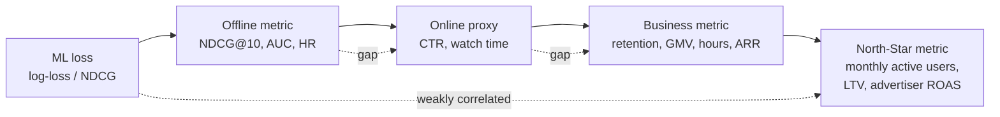
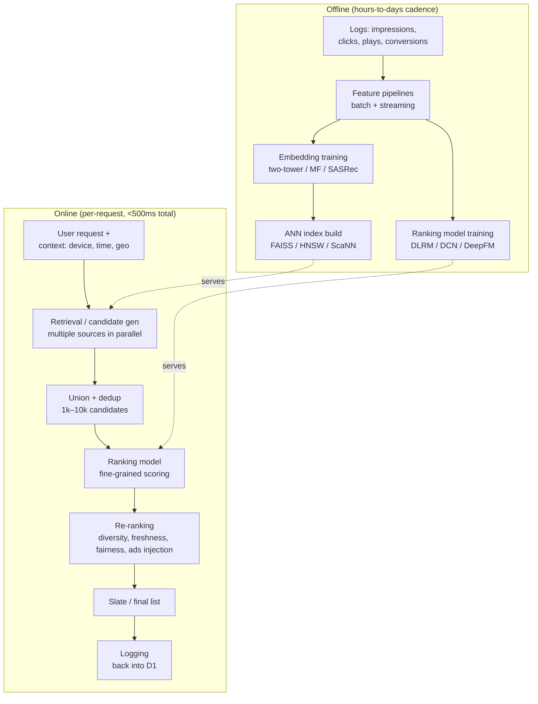
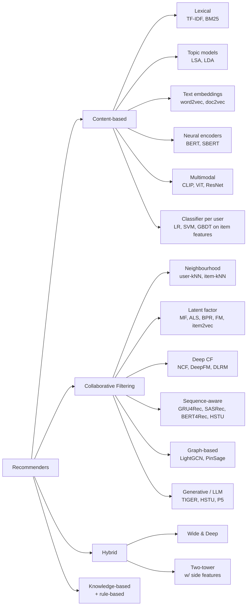
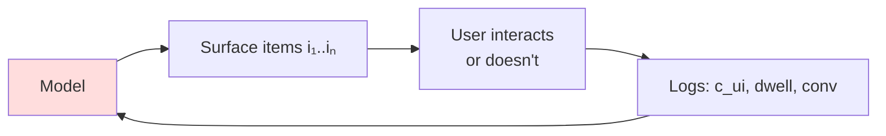

# Module 1 — Foundations

## What "a recommender" actually is, in one sentence

> A recommender is a system that takes a **user** (or context) and an **item universe** and returns an **ordered list of items**, learned from logged interactions, optimised against a **business objective** that is almost never the same as the ML loss.

Every fancy architecture below is engineering around three questions:

1. **Which items are even candidates?** (retrieval / candidate generation)
2. **In what order?** (ranking)
3. **After ordering, is the list good as a *list*?** (re-ranking — diversity, freshness, integrity, position constraints)

Everything else — embeddings, GNNs, transformers, LLMs, semantic IDs — is a way to answer one of those three questions faster, more accurately, or with less data.

---

## Problem framings — they're not the same problem

The word "recommendation" hides at least five different ML problems. Knowing which one you're in is the difference between a sensible architecture and a wasted quarter.

| Framing | Predict what? | Loss family | Canonical example | When to use |
|---------|---------------|-------------|-------------------|-------------|
| **Rating prediction** | A real-valued score for (u, i) | MSE / RMSE | Netflix Prize | Almost never anymore. Real systems care about ranking, not absolute scores. |
| **Top-N recommendation** | An ordered set of N items for u | Pairwise / listwise / BPR / sampled softmax | YouTube candidate gen | The default consumer-internet framing. |
| **Click-through / engagement prediction** | P(click \| u, i, context) | Log loss / calibrated binary classification | All ads CTR models | Required whenever you need a calibrated probability (auctions, budget pacing). |
| **Sequential / next-item** | Next item in a session | Cross-entropy over item vocab | TikTok FYP, music autoplay | When recent history >> long-term identity. |
| **Slate / list optimisation** | The best k-item list, jointly | Slate-MDP / generalised second-price / listwise | Search results, feed ranking | When items influence each other (diversity, complementarity). |
| **Conversational / interactive** | Next utterance + recommendation | Text + relevance | Amazon Rufus, Spotify DJ, ChatGPT shopping | When the user can clarify or refuse interactively. |
| **Generative / sequence-of-IDs** | An autoregressive sequence of semantic item IDs | Cross-entropy over codebook | TIGER (Google), HSTU (Meta) | New frontier — replaces retrieval + ranking with one model. |

**The most common mistake**: shipping a top-N system when you really needed CTR (no calibration → auctions and pacing break) — or shipping a calibrated CTR system as a ranker (over-rewards safe, low-variance items → engagement death spiral).

---

## Business metrics vs ML metrics — they always disagree

The first 80% of your career as a recsys engineer is improving ML metrics. The next 20% is realising they're decorrelated from the business metric you actually own.

Concrete examples of the gap:

- **Netflix**: maximising predicted-rating MSE (Netflix Prize) won the contest. Netflix never deployed the winning solution — because rating prediction was decorrelated from *retention*, which is what they actually pay for.
- **YouTube**: maximising click-through rate created clickbait. They switched to **watch time** as the proxy (Covington 2016). Now they multi-objective-rank on watch time + satisfaction (surveys) + long-term subscribers (RL).
- **Spotify**: optimising play probability promotes popular tracks. Optimising the **probability of saving / following / completing 30 seconds** preserves discovery.
- **TikTok**: optimising completion-rate alone produces short-form-only feeds. They add diversity and exploration constraints.
- **Amazon search**: optimising clicks promotes cheap, low-margin items. They optimise **product margin × probability of purchase** with a quality floor.

The architecture lesson: **always optimise a weighted multi-objective**. The weights are calibrated by *online* lift on the business metric, not derived from a paper.

---

## The canonical pipeline — the universal funnel

Nearly every production recsys above ~10k items looks like this:

Two non-obvious properties:

1. **Logs feed back into training.** This is the **feedback loop**. The system *creates* the data it's trained on. If you don't actively counteract this — exploration, position-bias correction, IPS, off-policy correction — your system will eventually only learn what it already believed. This is the #1 source of recsys disasters.

2. **The funnel shape is determined by latency, not accuracy.** You couldn't run a full ranking model on 10M items — you'd never hit a 100 ms budget. So you build a cheap retriever to drop to ~1k, and an expensive ranker to score those ~1k. The funnel is a latency artefact that became an architectural pattern.

---

## Why a funnel, not one big model? — the math of latency

Let:
- `N` = total items (e.g. 100M)
- `T_score` = time to score one (u, i) pair through your full ranker (e.g. 100 µs on GPU)
- Budget = 100 ms

Scoring everything would cost `N · T_score = 10⁷ s ≈ 116 days`. Obviously infeasible.

The funnel splits the problem:

- **Retrieval**: a cheap function `f_R(u, i)` (typically dot-product of two embeddings) computed via ANN index in `O(log N)` time, returning ~1000 candidates in ~10 ms.
- **Ranking**: an expensive function `f_K(u, i, context, ...)` (DLRM, DCN-V2, HSTU) computed on ~1000 items in `~50 ms` on GPU.
- **Re-ranking**: a list-aware function over the top-100 candidates, ~10 ms.

Total: ~70 ms, all parallelised, within budget.

The cost model:

| Stage | Items in | Items out | Time / item | Total |
|-------|----------|-----------|-------------|-------|
| Retrieval | 100M | 1000 | n/a (ANN) | 10 ms |
| Ranking | 1000 | 100 | 50 µs | 50 ms |
| Re-ranking | 100 | 20 | 100 µs | 10 ms |

Lesson: **architecture is a latency-shaped function of model expressiveness.** This is why two-tower retrieval (a cheap inner-product) wins in the retrieval stage, and why you can spend more compute per item the further down the funnel you go.

---

## Implicit vs explicit feedback

| | Explicit | Implicit |
|---|---|---|
| Examples | 5-star rating, thumbs-up, like | Click, dwell time, play, scroll past, repeat purchase |
| Volume | Sparse (≤1% of users rate) | Dense (every interaction is a signal) |
| Noise | Low — but biased (people rate extremes) | High — clicks happen for many reasons (curiosity, accident, bait) |
| Label | What the user said | What the user did |
| Negative class | "1-star" — actual negatives exist | **Missing — absence ≠ dislike**; the unobserved-negative problem is the central technical challenge |
| Dominant algorithm | SVD, ratings MF, RMSE | ALS with confidence weighting (Hu et al. 2008), BPR, sampled softmax |

Since ~2010 every production recommender at consumer scale is implicit-feedback. The shift away from ratings happened because:

- ratings are sparse and not solicited;
- ratings drift (a 4-star in 2008 was generous; in 2026 it's mid);
- behaviour is what advertisers pay for, not stated preference.

The implicit-feedback shift forced **two new technical problems**:

1. **Confidence weighting**: a single click is weak evidence; ten plays in a row is strong evidence. The 2008 ALS-implicit paper formalised this as `c_ui = 1 + α · r_ui`.
2. **Negative sampling**: if "not clicked" doesn't mean "disliked", how do you sample negatives? Three default strategies — uniform random, popularity-proportional, in-batch from the current mini-batch — each with different bias. (Module 10 goes deep.)

---

## When **NOT** to use a recommender

This section saves more careers than the rest of the curriculum combined.

### Don't build a recommender when…

- **You have < 10k items and < 10k users.** Editorial curation outperforms ML. Spotify still hires editors. Apple News is heavily editorial.
- **Your items are functionally identical** (e.g. commodity SKUs, generic stock photos). There's nothing personalisable; surface by price, freshness, or quality.
- **Your "user" is a one-shot anonymous request.** Cold start dominates; a popularity baseline + heuristic filters wins.
- **The objective is short-term revenue alone.** A bare CTR optimiser produces clickbait. You need at least a satisfaction proxy + a freshness/diversity floor or you'll burn the marketplace down — see TikTok's 2019 churn-from-monotony research.
- **Stakes are high per recommendation** (medical, legal, hiring). The legal and ethical surface is bigger than the ML benefit; deploy interpretable models with strict audit trails.
- **Your data is < 6 months old and you have no behaviour logs.** Build the logging pipeline first. ML without logs is theatre.

### "Heuristic" baselines that frequently win

A surprising number of production launches fail to beat one of:

1. **Most popular** (global)
2. **Most popular in your country / time slot**
3. **"Because you watched X" → similar items by content**
4. **Recency-weighted popularity** (TikTok-style "what's trending now")
5. **Editorial / human curation**

Always benchmark against these *first*. The 2019 RecSys paper "Are We Really Making Much Progress?" (Ferrari Dacrema et al.) showed many published deep-learning recsys results are beaten by tuned classical baselines.

---

## Taxonomy of approaches

Modules 5-12 walk through each of these in detail; this section is the map.

---

## The five hard problems every recommender has

Every system below — Netflix to a 5-person B2B startup — fights the same five fires. The architecture differences are in *which* fire they prioritise.

| Problem | One-line description | Where in the funnel | Module |
|---------|---------------------|---------------------|--------|
| **Cold start** | New users, new items have no history | Retrieval, ranking | 16 |
| **Selection / exposure bias** | The system trains on data it generated; the unseen items can't be evaluated | Training data, eval | 4, 16 |
| **Position bias** | Items higher up the list get more clicks regardless of relevance | Ranking, eval | 4, 15 |
| **Popularity bias** | The rich get richer; the long tail starves | Candidate gen, ranking | 14, 16 |
| **Stakeholder conflict** | User wants relevance; platform wants engagement; advertiser wants conversions; creator wants fair distribution | Multi-task ranking | 15, 16 |

These problems do not have "solutions" — they have *trade-offs you manage*. A recsys architect's main job is choosing where on the trade-off curve to sit, by quarter.

---

## The "feedback loop" — the single most important concept

Why it's dangerous:

- Items the model never surfaces never appear in training data → confirmed-by-absence becomes confirmed-by-evidence.
- Popular items get more impressions → look more popular → get more recommended → starve the long tail.
- A poorly calibrated CTR model can degrade *itself* over weeks.

Mitigations (collectively the "responsible recsys" toolkit):

- **ε-greedy exploration**: a small fraction of slots show random or uncertain items.
- **Thompson sampling / UCB**: principled exploration based on uncertainty.
- **Inverse propensity scoring (IPS)**: re-weight training data by `1 / P(item shown)`.
- **Position-bias models** (PBM, Cascade, UBM, DBN).
- **Off-policy correction** (Top-K REINFORCE, Chen et al. 2019).
- **Random-traffic eval baselines** (Yahoo R3, KuaiRand).

---

## Sanity check (answer these before reading Module 2)

1. Why is rating prediction the "wrong" framing for almost every consumer recommender in 2026?
2. A naïve approach would score every (user, item) pair with the full ranking model. Why doesn't anyone do this, even on giant GPU farms?
3. You're a startup with 5,000 items and 800 users, two weeks of impression logs. Should you build a recommender? If not, what should you build?
4. Your CTR model is well-calibrated and you optimise pure log-loss. Six months later engagement is up but retention is down. What likely happened, and which module's tools will you reach for?
5. If your model never surfaces item X, how does it learn whether users would have liked X?
