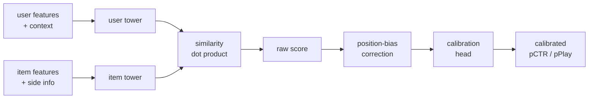

# Module 2 — Mathematical Foundations

> If Module 1 was the map, this is the territory. Every architecture in Modules 5-12 reduces to a small zoo of math: similarity functions, matrix factorization losses, learning-to-rank objectives, sampled softmax, and calibration. Get fluent here and every paper afterward becomes shorter.

---

## 1. Similarity functions — the atom of retrieval

Almost every retrieval system in the industry computes one of these between a user vector `u ∈ R^d` and an item vector `v ∈ R^d`:

| Similarity | Formula | When used | Notes |
|------------|---------|-----------|-------|
| **Dot product** | `s(u,v) = u · v = Σ u_i v_i` | Two-tower retrieval, MF | Cheap, monotone with cosine when norms fixed |
| **Cosine** | `cos(u,v) = (u·v) / (‖u‖·‖v‖)` | Content embeddings, dense retrieval | Scale-invariant; the default for normalised embeddings |
| **Euclidean** | `d(u,v) = ‖u−v‖₂` | Some early CF, KNN | Confusion: smaller = closer; flip for ranking |
| **Mahalanobis** | `(u−v)ᵀ Σ⁻¹ (u−v)` | Metric learning when features are correlated | Σ is learned; equivalent to dot in `Lᵀ x` after Cholesky |
| **Inner product (asymmetric)** | `s(u,v) = uᵀ M v` for some matrix `M` | When user/item live in different spaces | Generalises MF; learn `M` if you want |
| **Negative L2 (Spotify Annoy default)** | `−‖u−v‖²` | When indexed with tree-ANN | Annoy's original space |
| **Hadamard / element-wise prods + MLP** | `MLP(u ⊙ v)` | NCF (neural collaborative filtering) | Expressive but slow; can't ANN-index |

Crucial identity that explains why most production systems use **dot product**:

```
‖u − v‖² = ‖u‖² + ‖v‖² − 2(u · v)
```

If you L2-normalise everything (`‖u‖ = ‖v‖ = 1`), then `‖u−v‖² = 2 − 2(u·v)`, so **cosine, dot product, and negative Euclidean rank items identically.** That's why HNSW/IVF indexes built for one similarity work for the others after normalisation — and why ScaNN, FAISS, and most ANN libraries assume normalised vectors as the happy path.

### Why dot product won

1. **Decomposable.** `s(u,v) = u · v` is the only similarity that lets you precompute item vectors once, store them in an ANN index, and answer queries in `O(log n)` (HNSW) or sub-linear (IVF, ScaNN) time.
2. **Hardware-friendly.** A dot product is a single FMA per dimension; modern hardware pipelines it across thousands of items.
3. **Theoretically grounded.** Sampled softmax (Module 10) is exact for dot-product scoring; not for an MLP.

A cross-encoder or NCF-style `MLP(u, v)` is more expressive but **cannot be indexed** — every (u, v) pair must be scored. That's why cross-encoders live in the *ranking* stage, not retrieval.

---

## 2. Matrix factorisation — the math behind every dot-product recommender

### 2.1 The basic setup

You have a sparse user-item rating matrix `R ∈ R^{|U| × |I|}` where `R_ui` is either a rating (explicit) or interaction count / 1 (implicit). Most entries are missing.

The factorisation hypothesis: there exists low-rank `P ∈ R^{|U| × k}` and `Q ∈ R^{|I| × k}` such that

```
R̂_ui = p_u · q_i  ≈  R_ui   for observed (u,i)
```

`k` is typically 32-256. The whole game is: how do we estimate `P, Q` from very sparse observations?

### 2.2 Explicit-feedback MF — the Netflix Prize formulation

Funk's 2006 blog post (during the Netflix Prize) introduced what everyone now calls **SVD for recommenders** (a misnomer — it's not exactly SVD because of missing data):

```
min  Σ_{(u,i) ∈ Ω}  (R_ui − μ − b_u − b_i − p_u · q_i)²  +  λ (‖p_u‖² + ‖q_i‖² + b_u² + b_i²)
```

where `Ω` is the set of observed (u, i) pairs, `μ` is the global mean rating, `b_u` and `b_i` are user/item biases, and `λ` is L2 regularisation.

**Why the biases matter:** without `b_u`, the model has to fit "user u rates harshly on average" using `p_u`, which steals capacity from actually modelling taste. The biases absorb the "first moment" so the latent factors model the *deviation*.

**Solver options:**

| Method | When to use | Cost per epoch |
|--------|-------------|----------------|
| **SGD / Adam** | Always works; can add tricks like time bias, side features | O(\|Ω\| · k) |
| **ALS** | Closed form per user holding items fixed; embarrassingly parallel | O(\|Ω\| · k²) |
| **Coordinate descent** | Memory-tight | similar |

### 2.3 ALS for implicit feedback — the Hu-Koren-Volinsky paper

This is the most-cited recsys paper of the 2000s. Hu, Koren, Volinsky 2008 (Yahoo). The shift to implicit data forced two changes:

1. **There are no negative ratings.** A user not playing track X may mean (a) they hate it, (b) they've never seen it, (c) it doesn't exist in their country. We can't treat "missing" as 0 or 1 — we have to model both *preference* (binary 1{interacted}) and *confidence* (a real number that scales with how many times they interacted).
2. **Every (u, i) pair contributes to the loss** — even unobserved ones, because we *do* have weak negative evidence for items the user could have interacted with but didn't.

The formulation:

```
p_ui = 1 if r_ui > 0 else 0          # binary preference
c_ui = 1 + α · r_ui                  # confidence: 1 for "no signal", larger for repeated plays

min Σ_{u,i} c_ui (p_ui − x_u · y_i)²  +  λ (‖X‖² + ‖Y‖²)
```

The objective sums over **all** (u, i) pairs — that's `|U| × |I|` terms. The genius of ALS-implicit is that closed-form per-user updates can be computed in `O(k² · |I_u| + k³)` time where `|I_u|` is u's interaction count, via a Sherman-Morrison-style trick that reuses `YᵀY` (an `k × k` matrix that summarises the "no signal" mass). That makes the algorithm linear in the *observed* data despite the objective summing over all pairs.

Typical hyperparameters in production: `k=64-128`, `α=15-40`, `λ=1e-2 to 1e0`. Spotify's original Discover Weekly was a logistic version of this; LinkedIn's Photon ML supports it; the `implicit` Python library is a faithful implementation.

### 2.4 BPR — Bayesian Personalized Ranking (Rendle 2009)

The other path from rating prediction to top-N is **pairwise ranking**: for each user, sample a positive item `i` and a negative item `j`, and require `score(u, i) > score(u, j)`.

The BPR loss:

```
L_BPR = − Σ_{(u, i, j) ∈ D_train}  ln σ( x̂_ui − x̂_uj )  +  λ Θ²
```

where `x̂_ui = p_u · q_i + b_i` (or any other scoring function — BPR is loss-agnostic).

**Why BPR was a big deal:** it directly optimises a ranking objective (AUC-like) instead of an absolute-score objective. For top-N recommendation this matches the eval metric far better than RMSE.

**Negative sampling matters more than the model.** Uniform negatives are weak signal (everything looks negative); popularity-weighted negatives skew toward heads. The 2020 "Are We Really Making Much Progress?" paper showed many "deep" recsys claims dissolve when negative sampling is harmonised.

### 2.5 Factorization Machines (Rendle 2010)

The clever generalisation of MF: instead of just user-item interactions, model second-order interactions between *all* features.

```
ŷ(x) = w_0  +  Σ_i w_i x_i  +  Σ_{i<j} ⟨v_i, v_j⟩ x_i x_j
```

For `n` features each with a `k`-dim latent vector `v_i ∈ R^k`, this has only `O(n · k)` parameters but expresses every pairwise interaction. The pairwise interactions can be computed in `O(n · k)` time via the identity:

```
Σ_{i<j} ⟨v_i, v_j⟩ x_i x_j  =  (1/2) Σ_f [(Σ_i v_{i,f} x_i)² − Σ_i v_{i,f}² x_i²]
```

That equation is the reason FM is fast in practice — quadratic-form computation collapses to linear.

**FM unifies a lot:**
- If features are one-hot user-id and one-hot item-id, FM reduces to biased MF.
- If features include item categories, FM gives you content-aware MF for free.
- DeepFM (Module 8) stacks a deep tower on top of FM's interaction part.

### 2.6 WARP, WMF, and the lesser-known cousins

- **WARP** (Weighted Approximate-Rank Pairwise): keeps drawing negative samples until you find one that violates the ranking; the loss is then weighted by an approximation of the user's position in the ranking. Implemented in LightFM.
- **Weighted MF**: a generalisation where the loss weight depends on (u, i). The Hu-Koren-Volinsky paper is the canonical instance.
- **eALS** (element-wise ALS): a variant that avoids the `YᵀY` trick using element-wise updates; usually slower but cleaner to extend.

---

## 3. Learning-to-rank loss families

Once you move beyond matrix factorisation, you need a way to *train* a model whose output is a ranking. There are three families, distinguished by how many items the loss sees at a time.

### 3.1 Pointwise

```
L_point = Σ_{(u,i)} loss(score(u, i), label(u, i))
```

Typical loss: binary cross-entropy for click prediction. Train each (u, i) example independently.

- **Pros**: simple, calibrated probabilities, the only choice when labels are continuous (watch time).
- **Cons**: ignores that the model's job is to *rank items against each other for a single user*.

This is the dominant CTR-prediction loss because in ads you need calibrated `pCTR` for the auction. **Calibration > ranking quality** in ads.

### 3.2 Pairwise

```
L_pair = Σ_{(u, i, j)}  loss(score(u, i) − score(u, j))
```

Examples: BPR (logistic), RankNet (Burges 2005, also logistic), hinge loss, WARP.

- **Pros**: directly optimises pairwise ordering. Empirically better for top-N.
- **Cons**: doesn't see absolute scores → poor calibration. Doesn't see the slate → can't optimise NDCG@5 specifically.

### 3.3 Listwise

The loss takes the whole ranked list as input. Three sub-flavours:

**LambdaRank / LambdaMART** (Burges et al.): a heuristic that approximates the gradient of NDCG. Used in industrial search rankers (Bing, Yandex, LinkedIn LiRank).

**ListNet / ListMLE** (Cao et al. 2007): probability over the entire permutation; trained with cross-entropy.

**ApproxNDCG / ApproxMRR** (Bruch et al. 2019): differentiable surrogates of the metrics, used in TF-Ranking.

**Softmax-cross-entropy listwise**: treats the positive item as a class and all other candidates in the slate as negatives. This is the dominant loss for two-tower retrieval training.

```
L_softmax = − Σ_{(u, i⁺)} log [ exp(s(u, i⁺)) / Σ_{j ∈ S} exp(s(u, j)) ]
```

`S` is the candidate set — typically the positive plus a sampled set of negatives.

---

## 4. Sampled softmax — the engine of two-tower retrieval

A naïve softmax over millions of items is intractable. **Sampled softmax** replaces the full denominator with a sampled subset and applies a correction.

### 4.1 The math

For positive item `i⁺` and sampled negatives `N`:

```
P(i⁺ | u)  ≈  exp(s(u, i⁺) − log q(i⁺))  /  Σ_{j ∈ {i⁺} ∪ N}  exp(s(u, j) − log q(j))
```

The `−log q(i)` correction (**LogQ correction**) compensates for the fact that we didn't sample items uniformly — we sampled them with proposal distribution `q(i)`. Without this correction, popular items dominate retrieval (because they appear in negatives more often, the gradient pushes them away more often, then weirdly they're *under*-ranked at serving time).

The Yi et al. 2019 paper "Sampling-Bias-Corrected Neural Modeling for Large Corpus Item Recommendations" (the Google two-tower paper) is the canonical reference and is the basis for nearly every production two-tower retrieval system.

### 4.2 In-batch negatives — the practical trick

The most efficient way to get negatives is to use the *positives of other examples in the same mini-batch*. If your batch has 8192 (user, item) pairs, then for each user you have 8191 in-batch negatives almost for free.

This is what TFRS does by default and what the Google two-tower paper recommends. The proposal `q(i)` in this regime is the **empirical sampling frequency of item i** in your batches, which you can estimate online with a Count-Min sketch.

### 4.3 Hard-negative mining

In-batch negatives are mostly "easy" — random items the user doesn't care about. To squeeze more learning out, you mine hard negatives: items the current model ranks too high for users who didn't engage with them. Three common strategies:

1. **Two-stage**: do a forward pass over a candidate pool with the current model, pick the highest-scoring non-positives as hard negatives.
2. **Negative cache**: maintain a queue of "recently hard" items and resample from it.
3. **Curriculum**: start with random negatives, gradually mix in mined ones (Pinterest PinSage does this).

Without hard negatives, recall@10 is fine but recall@1 is mediocre. Production teams almost always mine.

---

## 5. Calibration math — the secret weapon of ads

Calibration means: when your model says `P(click) = 0.05`, observed click rate should also be 0.05. Calibration matters because:

- **Auctions break without it.** GSP/VCG bids scale by `pCTR × bid`. If your model is uncalibrated, expected revenue estimates are wrong.
- **Budget pacing breaks without it.** Pacing controllers assume `Σ pCTR` predicts expected impressions.
- **Multi-objective ranking breaks without it.** If the value function is `0.4·pCTR + 0.3·pSave + 0.3·pComplete`, the weights are only interpretable if each `p` is calibrated.

### 5.1 The downsampling correction

A common training trick: downsample negatives by factor `w` to speed up training (e.g., keep 1 out of every 100 negatives). The resulting model is uncalibrated — it learns a higher class prior than reality.

The correction:

```
p_calib  =  p / (p + (1 − p) / w)
```

This is the standard post-hoc fix. The He et al. 2014 Facebook paper "Practical Lessons from Predicting Clicks on Ads at Facebook" derived and named this.

### 5.2 Platt scaling

Fit a logistic regression on (raw_score, label) on a held-out set:

```
p_calib  =  σ(a · raw_score + b)
```

Two parameters; works for sigmoid models that are mildly miscalibrated.

### 5.3 Isotonic regression

Fit a non-decreasing step function on (raw_score, label) using PAVA (Pool Adjacent Violators). Non-parametric, more flexible than Platt, but needs more held-out data (~10k examples per bucket).

### 5.4 Slice-level calibration

The fact that your *aggregate* model is calibrated doesn't mean every slice is. Production ads systems calibrate per (advertiser × placement × geo × time-of-day) slice using either:

- Per-slice isotonic regression (lots of parameters, accurate).
- A **multi-calibration** network: a small NN over `(raw_score, slice_features)` → calibrated score.

LinkedIn's LiRank trains a jointly-learned isotonic head as part of the model — eliminates the post-hoc step.

### 5.5 Expected Calibration Error (ECE)

How to measure calibration:

```
ECE = Σ_b (|B_b| / N) · | accuracy(B_b) − confidence(B_b) |
```

Bucket predictions by confidence, compute the gap between predicted prob and observed rate in each bucket, weight by bucket size. ECE < 0.01 is excellent for ads.

---

## 6. Position-bias models — the math of correcting biased data

Click rate at position 1 ≫ position 10, *regardless of relevance*. If you naively train on click data you'll learn "position 1 is good," not "this item is relevant."

The factorisation hypothesis (Click Models, Chuklin et al. 2015):

```
P(click | u, i, position) = P(examine | position) · P(relevant | u, i)
```

If you can estimate `P(examine | position)` — call it `θ(position)` — you can recover relevance via inverse-propensity scoring:

```
weight = 1 / θ(position)
```

The cleanest production trick (used by Google, YouTube, Netflix): train a **shallow tower** that takes `position` as input and concatenates its output to the main network. At inference, set position to a constant. The main network learns relevance; the shallow tower absorbs position bias. (PAL: "Position-Aware Learning to Rank", Guo et al. 2019.)

---

## 7. Putting it together — what a "score" actually is



A production ranker is almost always:

1. Two towers producing `u, v`.
2. A similarity producing a raw score.
3. (Optional) a position-bias correction.
4. (Almost always) a calibration head producing a calibrated probability.
5. Multiplied or fed into a value model with bids / weights → final ranking signal.

Every piece of math in this module appears somewhere in that diagram.

---

## 8. Sanity check

1. Why does L2-normalising vectors make dot product, cosine, and negative Euclidean rank items identically?
2. In ALS-implicit (Hu et al. 2008), the objective is summed over **all** `(u, i)` pairs, including unobserved ones. How does ALS run in time linear in *observed* data?
3. Write the BPR loss for one triple `(u, i, j)` and state explicitly which is positive and which is negative.
4. Why does the LogQ correction (`−log q(i)`) appear in sampled softmax?
5. Your CTR model trained with 100× negative downsampling reports `pCTR = 0.5`. What's the calibrated `pCTR`?
6. You add a position feature directly to your ranker as a normal input. Why is that a bad idea, and what should you do instead?
