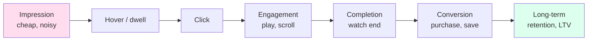

# Module 3 — Data, Signals & Features

> "Recsys engineers are paid to fix data. The model is the easy part." — every senior recsys engineer, eventually.

In Module 1 we said *the architecture is downstream of the data and the latency budget*. This module is about the data half — what you log, how you log it, how to engineer features from it, how to avoid the seven canonical traps.

---

## 1. The full event spectrum

A "user did something" event lives on a continuum from cheap-and-noisy to expensive-and-sparse.



| Event | Volume per user / day | Latency to label | Use as |
|-------|-----------------------|-------------------|--------|
| Impression | thousands | instant | Negative / position-bias correction |
| Hover (web) / scroll-past | hundreds | ~seconds | Soft engagement signal |
| Click | tens | seconds | Pointwise CTR label |
| Watch-30s / play-50% | tens | minutes | Quality-aware engagement |
| Completion / save / share | units | minutes-hours | Strong positive |
| Purchase / install / subscribe | <1 typical | minutes-days | Conversion label (delayed) |
| Retention (day-7, day-30) | < 0.1 | days-weeks | Long-term reward |

The further down the pipeline you go:
- The **stronger** the signal per event.
- The **rarer** the event.
- The **more delayed** the label.

Your ranker should consume *all* of these as multi-task targets — they aren't substitutes, they're orthogonal. The Netflix multi-task head is engagement + satisfaction + retention; YouTube's MMoE is engagement + survey-satisfaction; Meta has 5-20 heads.

---

## 2. The logging discipline (the part everyone gets wrong)

Logging is unsexy infrastructure that determines whether your ranker is trainable or garbage.

### 2.1 Log impressions, not just clicks

If you only log clicks, you have positives but no observed negatives. You can't compute CTR, you can't compute position bias, you can't compute serving-time-to-click latency. Always log:

- What was **shown** (impressions, with position, with what model version, what experiment bucket).
- What was **clicked / engaged with**.
- What was **not clicked**.

The join is `LEFT JOIN impressions ON (user, session, item)` with `clicks` — every impression becomes a training row, labelled 0 or 1.

### 2.2 Log what the *model* saw, not what *you* think it saw

A common bug: the offline feature value for `user_recent_play_count` is computed at *training time* and differs from what the model saw at *serving time* (because batch and stream pipelines have different schemas, default values, or cutoff timestamps). This is **train-serve skew** — the #1 cause of "model worked offline, failed online" stories.

The standard fix is **log-and-wait**: at serving time, log the actual feature vector the model received, and train on the logged values. Eliminates skew by definition. Tecton, Feast, Vertex AI Feature Store all support this idiom.

### 2.3 Log model version, experiment bucket, exploration flag

Every impression should be tagged with:
- Which model produced this ranking (model id + version).
- Which experiment buckets the user is in.
- Whether this impression was *exploration* (random / Thompson sample) or *exploitation*.

Without these, off-policy evaluation (Module 4) is impossible. With them, you can replay logs against new policies and estimate counterfactual performance.

### 2.4 Late-binding labels and the watermark problem

Conversion happens minutes-to-days after the impression. You can't train in real time on labels you don't have yet.

Two approaches:
1. **Wait for the label window** (e.g., 7 days) before training on an impression. Loses freshness.
2. **Train with partial labels** (Chapelle 2014 delayed-feedback model) — model the censoring explicitly.

Either way, you need a **watermark**: a clear cutoff timestamp `T_w` such that everything before `T_w` is "labels are settled." The watermark advances as time passes. Training jobs ingest data up to the watermark; everything after is provisional.

---

## 3. Implicit feedback — the unobserved-negative problem

The central technical challenge of all consumer-internet recsys.

A user didn't watch movie X. This is *not* a negative — it might be:
- They've never seen it (most of the time).
- They couldn't watch it (geo-locked, on a competing service).
- They saw it and skipped (negative).
- They saved it for later (positive, eventually).

Three strategies for handling this:

### 3.1 Treat missing as negative (naïve)

Trains fine but biases the model toward popular items (because popular items have more impressions and thus more positives; rare items look like all-negative).

### 3.2 Sample negatives

Pick a sample of unobserved items and treat them as negatives. This is what BPR, sampled softmax, and most modern recsys do. The bias depends on the sampling distribution:

- **Uniform**: every item equally likely. Mathematically clean. Practical issue: most uniform negatives are easy (rare items the user clearly wasn't going to interact with).
- **Popularity-proportional** `q(i) ∝ count(i)^α`, `α ∈ [0.5, 0.75]`: harder negatives, more efficient. The classic word2vec choice (Mikolov et al. 2013) and a strong baseline for recsys.
- **In-batch**: use the positives of other examples in the same batch as negatives. Cheap, but the sampling distribution is the batch frequency — needs LogQ correction.
- **Hard-negative mining**: forward-pass through a pool, take the highest-scoring non-positives. Slower per step, faster convergence.

### 3.3 Inverse-propensity scoring (IPS)

For every (u, i) pair, estimate `P(i is shown to u)` (the propensity) and reweight observed labels by `1 / P(shown)`. Now both observed positives and observed negatives are correctly representative.

IPS handles the "items not shown" problem cleanly **if** you have access to propensities (which means your serving system has to log them or compute them post-hoc). Many production systems run a small fraction of random traffic specifically to get unbiased propensities.

---

## 4. Feature taxonomy

A production ranker consumes anywhere from dozens (B2B startups) to thousands (Meta DLRM) of features. They fall into seven categories.

| Category | Examples | Cardinality | Where computed |
|----------|----------|-------------|----------------|
| **User identity** | user_id, member_id | very high | embedding table |
| **User profile** | age band, country, language, signup vintage | low-medium | one-hot / embedded |
| **User long-term behaviour** | top genres, avg session length, lifetime plays | medium | batch from history |
| **User short-term behaviour** | last 100 items engaged, last query, last 10 minutes activity | very high (multi-hot) | streaming from event bus |
| **Item identity** | item_id, creator_id, brand_id | very high | embedding table |
| **Item content** | text embedding, image embedding, audio embedding, taxonomy | high (dense) | offline precompute |
| **Item dynamics** | recent CTR, recent saves, freshness, decay | medium | streaming counters |
| **Pair features** | did user engage with same creator before, time since last interaction | medium-high | request-time lookup |
| **Context** | time of day, device, screen size, network, session length so far | low-medium | request-time |
| **Affinity / cross** | user-genre affinity, user-language affinity | medium | batch + streaming hybrid |

### 4.1 Static vs dynamic features

- **Static**: don't change per request (user profile, item content). Cheap to cache.
- **Dynamic**: change per request (time, context, recent activity). Must be computed online.

Production split: static features pre-joined into nightly batches; dynamic features fetched from an online feature store at request time.

### 4.2 Counter features — the workhorses

The most ROI-positive features in any ranker:

- `count(user_clicked_item_in_last_24h)`
- `count(user_clicked_creator_in_last_7d)`
- `count(user_played_genre_in_last_30d)`
- `time_since_last_session`
- `dwell_time_avg_last_session`

These are cheap to compute (Count-Min sketch or HyperLogLog over a streaming window) and capture short-term taste shifts that long-term embeddings miss.

---

## 5. Embedding tables — the dominant infrastructure cost

In a modern CTR ranker, **embedding tables are 90-99% of the parameters**. The MLP on top is small (a few million params); the tables can be terabytes.

### 5.1 Why so big

You typically have:
- `user_id`: 100M-1B entries × 64-128 dims × fp32 = 25 GB - 500 GB
- `item_id`: 100M entries × 128 dims = 50 GB
- `creator_id`: 10M entries × 64 dims = 2.5 GB
- 50+ other high-cardinality categorical features

Sum: easily 1-10 TB. Meta's largest tables are 10-100 TB.

### 5.2 Compression tricks

**Hashing trick** (Weinberger et al. 2009): hash `item_id` into `N` buckets where `N << |items|`. Collisions cause two items to share an embedding row. Typical `N` is 10⁶-10⁸.

**Compositional embeddings** (Meta, Shi et al. 2020): represent each ID as a sum of two smaller embeddings via Quotient-Remainder decomposition. 100× compression with minor quality loss.

**Mixed precision**: store hot rows in fp32, cold rows in int8 or fp16.

**Frequency-aware quantization**: rare rows live at int4; head rows at fp16. Often 4× compression for <0.5% recall loss.

**Collisionless hashing (Monolith, ByteDance)**: a *dynamic* hash table where new IDs are inserted only when their occurrence count crosses a threshold, and unused IDs are evicted on a TTL. Eliminates collisions; eliminates one-time-token memorisation; bounds memory.

### 5.3 Embedding table sharding

A 10 TB table can't fit on one GPU. You shard:

- **Row-wise**: each shard owns rows 0..N/4, N/4..N/2, etc. Each forward pass needs all-to-all communication to fetch embeddings.
- **Column-wise** (less common): split the embedding dimension across shards.
- **Table-wise**: assign whole tables to whole machines.

TorchRec's planner picks the best layout per table given hardware. Multi-stage all-to-all communication is the bottleneck; FBGEMM and NCCL optimisations matter.

---

## 6. Feature freshness — the latency-quality trade-off

How fresh do features need to be?

| Feature | Acceptable staleness | Source |
|---------|---------------------|--------|
| Long-term user taste embedding | Hours-days | Daily batch retraining |
| User profile (age, country) | Days-weeks | Daily batch |
| Last 100 items engaged | Seconds-minutes | Kafka → Flink → online store |
| Last item engaged | Sub-second | Edge cache, session memory |
| Item recent CTR | Minutes-hours | Streaming aggregator |
| Item freshness (upload_age) | Real-time | Request-time computed |
| Trending score | Minutes | Streaming |

The "real-time vs batch" decision is per-feature, not a system-wide setting. Most modern feature stores (Feast, Tecton, Chronon) support both, with the **same feature definition** evaluated in both batch and stream so training and serving see consistent values.

---

## 7. The seven canonical data traps

Every team hits these. Knowing them in advance saves a quarter.

### Trap 1: Train-serve skew

Offline features are computed differently than online. Symptoms: model AUC drops in production. Fix: log-and-wait, shared feature definitions, integration tests on a few production examples.

### Trap 2: Leakage

A feature in your training data depends on the future (e.g., "user's all-time average rating" computed over the *entire* history including post-impression data). The model "learns" to use the future to predict the future, and performance dies online.

Fix: **point-in-time correctness**. Every feature value must be computable from data available *strictly before* the label timestamp. Chronon, Feast, Tecton enforce this. If your feature store doesn't, build it.

### Trap 3: Sampling bias in negatives

Your "negatives" are actually impressions that the prior model showed (selection bias). If you train on this, you reinforce the prior model's choices.

Fix: IPS reweighting, random-exploration slots, or train on broader candidate pools (not just what was displayed).

### Trap 4: Label noise from accidental clicks

Mobile mis-taps account for 5-15% of clicks. A click-through-rate model that doesn't filter them learns to recommend clickbait.

Fix: filter clicks with dwell < 1-2s as negatives or noise; use multi-task heads with both click and engagement labels.

### Trap 5: Feedback loop with no exploration

The model recommends what it already thinks is good; data only comes back from those items; the model gets more confident in the same items; the long tail starves.

Fix: ε-greedy or Thompson sampling on a small fraction of slots; cold-start exploration boost; explicit fairness constraints.

### Trap 6: Cold-start data bleeding

A new user's first session has *zero* personal features. If your training pipeline doesn't oversample new-user data, the model is great for veterans and useless for newcomers. New-user conversion is what drives growth, so this is a quiet revenue killer.

Fix: oversample new-user examples; have a separate "cold user" tower without ID embeddings; use content features only for new users.

### Trap 7: Watermark cheating

The training pipeline accidentally includes data after the watermark (e.g., "yesterday's conversions" includes some that came in this morning). Offline AUC is great; online performance is mediocre.

Fix: strict watermark enforcement, dedicated tests that simulate watermark progression, never use `MAX(timestamp)` from a streaming source as a "today" definition.

---

## 8. Concrete example: features for a music-recommendation ranker

To make it concrete — what does a Spotify-style ranker actually feed in? Approximate:

```yaml
user_features:
  - user_id (embedding)
  - country (one-hot)
  - device (one-hot)
  - age_band (one-hot)
  - tenure_months (numeric, bucketed)
  - lifetime_play_count (numeric, log-bucketed)
  - last_30d_play_count (numeric, log-bucketed)
  - last_session_minutes (numeric)
  - last_100_track_ids (multi-hot, embedded then mean-pooled)
  - last_10_artist_ids (multi-hot)
  - top_5_genres_30d (multi-hot)
  - hour_of_day (cyclic encoding)
  - day_of_week (cyclic)
  - is_weekend (binary)

item_features:
  - track_id (embedding)
  - artist_id (embedding)
  - album_id (embedding)
  - genre (multi-hot)
  - mood_tags (multi-hot)
  - audio_embedding_128d (dense, from MERT/OpenL3)
  - duration_seconds (numeric)
  - track_age_days (numeric, log-bucketed)
  - is_podcast (binary)
  - language (one-hot)
  - explicit_content_flag (binary)

dynamic_item_features:
  - global_play_count_24h (numeric, log)
  - global_skip_rate_24h (numeric)
  - artist_recent_uploads (numeric)

pair_features:
  - user_played_artist_count_30d (numeric)
  - user_played_genre_count_30d (numeric)
  - days_since_user_last_played_artist (numeric)
  - cosine_similarity(user_taste_emb, track_audio_emb) (numeric)

context_features:
  - referrer_surface (one-hot: home, search, autoplay)
  - position_in_slate (numeric, masked at inference)
  - session_play_count_so_far (numeric)
  - autoplay_seed_track_id (embedding when applicable)
```

That's ~30 features at the schema level; the embeddings expand them to thousands of *learned* dimensions. In production at Spotify scale, the actual schema is several hundred features.

---

## 9. Sanity check

1. Why is "missing rating" not the same as "negative rating" in implicit feedback?
2. You see that uniform negative sampling gives bad NDCG@10. What's the next sampling distribution to try, and why does it help?
3. Your CTR model trained beautifully but loses to production in A/B. The features look identical between batch and streaming. What is the most likely cause and how do you verify?
4. A teammate proposes adding "average rating of items in this user's lifetime" as a feature. What's the trap, and what's the right way to compute the equivalent signal?
5. Your item embedding table is 1 TB. Name three compression strategies and one trade-off of each.
6. The watermark for conversion labels is 7 days. A team wants to train hourly to get fresh signal. How do you reconcile?
