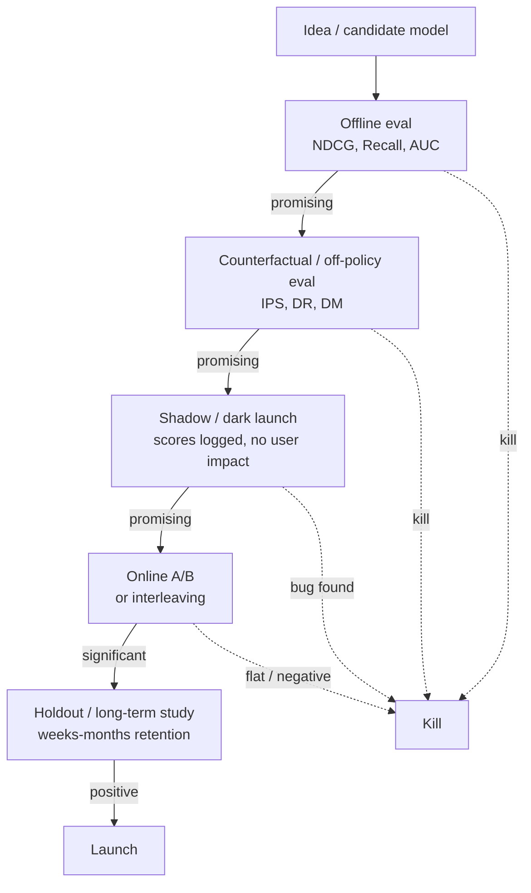

# Module 4 — Evaluation: Offline → Online → Counterfactual

> Recsys evaluation is two questions you have to answer separately:
> 1. **Offline**: given logged data, can I confidently say model B is better than model A *before* exposing real users to B?
> 2. **Online**: given that A/B testing reveals truth, how do I run experiments cheaply and quickly?
>
> The bridge between them is **counterfactual evaluation** — the third pillar.

---

## 1. The eval stack at a glance



Each gate filters the funnel by an order of magnitude. Of 100 candidate ideas, ~10 survive offline, ~3 survive counterfactual, ~1 lifts in A/B, maybe 0.5 survives long-term holdout.

---

## 2. Offline metrics — what they measure

### 2.1 Retrieval / candidate-generation metrics

**Recall@k**: of the items the user actually engaged with, what fraction are in the top-k retrieved? The dominant metric for the retrieval stage.

```
Recall@k = |{relevant} ∩ {retrieved top-k}|  /  |{relevant}|
```

Typical industrial target: **Recall@100 ≥ 0.7** (for "the candidate set fed into ranking covers 70% of items the user would have engaged with").

**Coverage**: what fraction of all items are *ever* retrieved? A high-Recall@k system that only ever returns 1000 items hides a long-tail starvation problem. Coverage is the diagnostic.

### 2.2 Ranking metrics

**MAP (Mean Average Precision)**: averages precision-at-each-relevant-item over users.

```
AP_u = (1/|R_u|) Σ_{k=1..N} (relevant@k) · precision@k
MAP  = mean(AP_u over users)
```

Binary relevance only.

**NDCG@k (Normalized Discounted Cumulative Gain)**: handles graded relevance (rating, watch time).

```
DCG@k  = Σ_{i=1..k}  (2^{rel_i} − 1) / log_2(i + 1)
IDCG@k = DCG@k of the ideal (best-possible) ranking
NDCG@k = DCG@k / IDCG@k  ∈ [0, 1]
```

The `log_2(i+1)` is the position discount — items lower down count less. Choose `k=5, 10, 20` to match the visible slate.

**MRR (Mean Reciprocal Rank)**: for "find the one good answer" search-like problems.

```
MRR = mean (1 / rank of first relevant item)
```

**Hit Rate @ k (HR@k)**: was there at least one relevant in top-k? Equivalent to Recall@k when there's exactly one relevant item per query.

**AUC**: of all (positive, negative) pairs, what fraction did the model rank in the correct order?

```
AUC = P( score(pos) > score(neg) )
```

AUC is the dominant metric for CTR / pointwise binary classification — but it's a **global** metric (it averages over all pairs, including pairs from different users), which is why it correlates *poorly* with per-user ranking quality. Always pair with NDCG.

**GAUC (Grouped AUC)**: AUC computed per user, then weighted-averaged. The Alibaba-published "fix" for AUC that matters more in production.

### 2.3 Beyond accuracy

Recsys teams that only optimize accuracy ship filter bubbles. Modern teams track:

| Metric | What it captures |
|--------|------------------|
| **Coverage** | What fraction of catalog ever recommended |
| **Novelty** | Did we show items the user has never seen before? |
| **Serendipity** | Items that are unexpected *and* enjoyable (proxy: distance from user's history × engagement) |
| **Diversity (intra-list)** | Within one slate, how different are the items from each other? |
| **Diversity (inter-list / personalization)** | How different are different users' slates? |
| **Fairness — provider** | Item exposure distribution; Gini coefficient |
| **Fairness — consumer** | Per-demographic performance parity |
| **Freshness** | What fraction of recommended items are < 7 days old? |

A "good" recsys is a Pareto point on (accuracy, diversity, novelty, fairness) — not the max of one dimension.

### 2.4 The offline-online correlation gap

**The single most important fact about offline metrics**: they are weakly correlated with online business metrics.

A 2019 RecSys paper ("Are We Really Making Much Progress? A Worrying Analysis of Recent Neural Recommendation Approaches", Ferrari Dacrema et al.) showed that:

- Many published deep-learning recsys results don't beat tuned classical baselines.
- Offline metric improvements often don't replicate online.

Industry practitioners (Netflix, Spotify, YouTube) say: offline metrics are *necessary but not sufficient* — they kill bad ideas cheaply but don't reliably crown winners.

Why the gap?

1. **Selection bias** — offline metrics are computed on items the prior system showed.
2. **Position bias** — naive offline metrics ignore display position.
3. **Multi-objective reality** — offline metric is single-task; online metric is multi-stakeholder.
4. **Long-horizon mismatch** — offline metric measures next click; business cares about retention.
5. **Reactivity** — online users adapt to the model; offline data is static.

This is why offline metrics function as a **filter** (kill bad ideas) and online tests function as a **judge** (declare winners).

---

## 3. Online A/B testing — the actual judge

### 3.1 The basic recipe

1. Randomly split users into bucket A (control) and bucket B (treatment).
2. Apply the new model only to bucket B.
3. After N days, compare the chosen metric.
4. If `|metric_B − metric_A| / SE > 2`, you have a 95% significant result.

Sample size:

```
N ≈ 16 σ²  /  (MDE)²   per arm  (for two-sided 95% test, 80% power)
```

where MDE is the minimum detectable effect you care about (e.g., 1% relative).

For low-frequency metrics (purchase, retention), MDE is small and σ is large → you need millions of users per arm and weeks of duration. This is why A/B is expensive and we need offline + counterfactual filtering before it.

### 3.2 The 11 things that go wrong in A/B

1. **Sample ratio mismatch (SRM)**: the buckets aren't 50/50 because of a leakage in randomisation. Symptom: 47%/53% split. Always-check.
2. **Novelty effect**: users react to the new UI/recs in week 1; effect dissipates by week 4. Solution: longer studies.
3. **Primacy effect**: regular users haven't adapted yet; metric understates true equilibrium. Same fix.
4. **Network effects**: in social/marketplace platforms, treatment users affect control users. Solution: cluster-randomised (network-aware) A/B.
5. **Multiple testing**: if you test 20 metrics, ~1 will be 95%-significant by chance. Use Bonferroni or family-wise control.
6. **Multiple variants**: same problem; choose the best of 5 = inflated false positive. Use multi-arm bandit or holm correction.
7. **Underpowered tests on rare metrics**: revenue per user is heavy-tailed; need huge N.
8. **Peeking**: looking at results before predetermined N. Use sequential testing (mSPRT / always-valid p-values).
9. **Wrong unit of randomisation**: randomising by impression when users see many impressions creates non-independent observations. Use user-level randomisation almost always.
10. **Carryover between buckets**: shared caches, shared embeddings, shared rate limiters. Audit infrastructure for cross-bucket leakage.
11. **Long-term ≠ short-term**: a recsys change that pumps short-term clicks may hurt 30-day retention. Use holdouts to measure long-horizon metrics.

### 3.3 Interleaving — the secret weapon for ranking

Instead of "user gets model A or model B", interleave their rankings on the same page (e.g., top item from A, top item from B, second from A, second from B, ...). Then count which model contributed the clicked items.

Why it's powerful:
- Each user is their own control → much less variance.
- ~100× sample-efficient relative to bucket A/B.
- Catches subtle ranking improvements bucket A/B can't see.

Used heavily by Netflix, Google Search, Yandex, Bing. The trick is the attribution scheme — team-draft interleaving (Radlinski et al. 2008) is the standard.

### 3.4 CUPED — variance reduction via covariates

CUPED (Controlled-experiment Using Pre-Experiment Data, Deng et al. Microsoft 2013):

```
Y_adjusted = Y_metric − θ · (X_pre_period − E[X_pre_period])
```

where `X_pre_period` is the same user's metric in a pre-experiment window. Choose `θ` to minimise variance — `θ = Cov(Y, X) / Var(X)`.

Typical variance reduction: 30-50%. Equivalent: you need 30-50% fewer users for the same statistical power.

Every modern experimentation platform (Statsig, Eppo, GrowthBook, internal at FAANGs) supports CUPED out of the box.

### 3.5 Multi-armed bandits as continuous experimentation

For surfaces with frequent, low-stakes decisions (which thumbnail, which row order, which copy), classical A/B is wasteful — you allocate 50% of traffic to the loser for the whole experiment.

A **contextual bandit** (LinUCB, Thompson sampling) adaptively shifts traffic toward winning arms while maintaining controlled exploration. Netflix runs artwork bandits; Spotify runs BaRT; LinkedIn runs feed-ranking exploration.

The trade-off: bandits are great for *between-arm* allocation under known reward structure, but classical A/B is better for unbiased *measurement* of large structural changes. Most teams use both — bandits for tactical choices, A/B for strategic ones.

---

## 4. Counterfactual / off-policy evaluation — the bridge

The question: "If I had deployed policy `π_new` instead of the production policy `π_old`, what would my metric have been?"

You can't actually answer this without deploying `π_new`. But with logged data, exploration noise, and propensity weighting, you can *estimate* it. The four canonical estimators:

### 4.1 Inverse Propensity Score (IPS)

```
V̂_IPS(π_new) = (1/n) Σ_i  [ π_new(a_i | x_i) / π_old(a_i | x_i) ]  ·  r_i
```

For each logged action, reweight by the ratio of new-policy probability to old-policy probability of taking that same action.

**Pros**: unbiased.
**Cons**: high variance when policies disagree; division-by-small-numbers.

### 4.2 Self-Normalised IPS (SNIPS)

Normalise by the sum of weights to reduce variance:

```
V̂_SNIPS = Σ w_i r_i  /  Σ w_i,   w_i = π_new / π_old
```

Lower variance, slight bias. Default for production teams.

### 4.3 Direct Method (DM)

Train a reward model `r̂(x, a)`, then:

```
V̂_DM(π_new) = (1/n) Σ_i  Σ_a  π_new(a | x_i)  ·  r̂(x_i, a)
```

**Pros**: low variance.
**Cons**: biased if `r̂` is wrong (and it always is).

### 4.4 Doubly Robust (DR)

Combine the two — IPS plus a model-based correction that explains away the IPS variance.

```
V̂_DR = (1/n) Σ_i  [ Σ_a π_new(a|x_i) r̂(x_i, a)  +  (π_new(a_i|x_i) / π_old(a_i|x_i)) (r_i − r̂(x_i, a_i)) ]
```

**Pros**: consistent if *either* the propensity model *or* the reward model is correct (the "doubly robust" guarantee).
**Cons**: most complex; still high variance when policies disagree a lot.

DR is the production-grade choice. Used by Netflix, Spotify, ByteDance for off-policy eval. The Open Bandit Pipeline (`zr-obp`, ZOZO) implements all of these.

### 4.5 Top-K off-policy correction (Chen et al. 2019, YouTube)

Recsys policies show K items, not one. The K-item correction:

```
correction = K · (1 − (1 − π_new(a))^{K−1}) / π_new(a)
```

Without it, the off-policy estimator systematically underweights the contribution of the candidate-generator's choices to the user's eventual click. Required reading if you're deploying RL-style policy improvement at scale.

### 4.6 The exploration-data requirement

All counterfactual estimators need **propensities**. To get them, you need exploration: some fraction of impressions sampled by a known stochastic policy (ε-greedy, Thompson, softmax over scores).

A production system without exploration is **uncounterfactual** — you can train new models, but you can't *evaluate* them off-policy. Most mature teams reserve 1-5% of traffic for exploration specifically to enable off-policy eval.

---

## 5. Long-term and holdout evaluation

Short-term A/B can be misleading. A change that pumps clicks may hurt:
- 30-day retention (because clickbait disappoints).
- LTV (because users churn faster).
- Creator-side ecosystem health (because a few power creators dominate).

To measure these, you need:

### 5.1 Long-running holdouts

A **permanent holdout** — e.g., 1-5% of users who never see the new ranker — lets you measure long-horizon impact months later. Netflix, Airbnb, Booking all run these.

The trade-off: holdout users get a worse experience and may churn faster, biasing the comparison. The accepted answer is "holdouts are needed for measurement; tolerate the cost as the price of knowing the truth."

### 5.2 Surrogate index methods

Athey, Chetty, Imbens 2019 ("Surrogate Index"): combine multiple short-term proxies into a regression that estimates the long-term effect. Used at Facebook, Netflix, Uber.

### 5.3 Cohort experiments

Random selection of new users into model A vs model B at signup, followed for 90+ days. The cleanest measure of "does this model produce better long-term users."

---

## 6. Putting it together — a typical model-launch playbook

| Phase | Duration | What | Kill threshold |
|-------|----------|------|----------------|
| Pre-eng | 1-3 days | Offline NDCG@10, Recall@100, AUC, coverage, diversity | < production on any key metric |
| Counterfactual | 1-2 days | SNIPS / DR estimate of online CTR / play rate | < production by 1% |
| Shadow | 3-7 days | Compute scores in parallel with production, log them, no user impact | Distribution shift / serving bug |
| A/B (small) | 1-2 weeks | 1-5% traffic | < production at 95% confidence on guardrail metric |
| A/B (large) | 2-4 weeks | 20-50% traffic | Same |
| Long-term holdout | Continuous | Permanent 1% holdout | Regress on 30-day retention or LTV |

The whole playbook reflects one principle: **you can't trust any single signal**. Bayesian common sense aggregates them into one decision.

---

## 7. Sanity check

1. Why is NDCG@10 a better metric than RMSE for a top-N recommender?
2. Your offline AUC is +2% relative to production. What's the probability your online A/B will show +2% lift? (Hint: not 100%.)
3. You want to know if a new candidate generator improved Recall@100 without running an A/B. What kind of estimator do you reach for, and what data does it require?
4. Explain why CUPED works in one sentence using the words "pre-period" and "variance".
5. A teammate proposes ranking by `0.4·pClick + 0.3·pSave + 0.3·pComplete` with all probabilities directly compared. What math from Module 2 is this assuming, and what could go wrong?
6. You run an A/B for 7 days and see +1.5% clicks (p < 0.01). You launch. Engagement holds; 60 days later retention is down 0.5%. What was missing from your eval plan?
