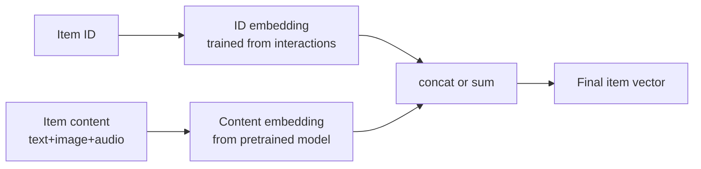

# Module 5 — Content-Based Filtering

> "If we don't have collaborative signal, just look at the content." The original recsys approach, declared dead in 2007, quietly returned to prominence in 2023 with multimodal embeddings and LLM-derived features. Today every production recsys runs *both* content and collaborative — and the content arm is what saves you on cold start.

---

## 1. What it is

Content-based filtering recommends items **whose features are similar to items the user has interacted with**, without needing data from other users.

```mermaid
flowchart LR
    A[User's history<br/>items i_1..i_n] --> U[User profile<br/>= aggregate of item features]
    B[Candidate item j] --> V[Item features]
    U --> S[similarity(U, V)]
    V --> S
    S --> R[Score]
```

Two equivalent ways to think about it:

1. **User profile in feature space**: build a vector representing the user (e.g., average of feature vectors of items they liked), score candidates by similarity.
2. **Per-history-item similarity**: for each item in the user's history, find similar items by content; aggregate.

Both reduce to the same math when similarities are linear.

---

## 2. The classic TF-IDF + cosine recipe

The original content-based recsys (pre-2010) treated each item as a text document, used TF-IDF to vectorize, then computed cosine similarity.

### 2.1 TF-IDF

For a corpus of `N` documents and term `t`:

```
TF(t, d)   = count(t in d) / |d|
IDF(t)     = log(N / DF(t))
TF-IDF(t,d)= TF(t,d) · IDF(t)
```

Each document becomes a sparse vector over the vocabulary. Items get TF-IDF vectors over their textual descriptions (title, plot, tags).

### 2.2 User profile

The simplest aggregation: average the TF-IDF vectors of items the user has positively interacted with.

```
u  =  (1/|H|) Σ_{i ∈ H} TF-IDF(i)
```

Optionally weighted by rating, recency, or watch time.

### 2.3 Scoring

Cosine similarity:

```
score(u, j) = (u · TF-IDF(j)) / (‖u‖ ‖TF-IDF(j)‖)
```

Top-N candidates by score.

### 2.4 Where this still wins

- **Cold-start item** (just uploaded, no interaction signal): collaborative filtering can't say anything; content-based can.
- **Small catalog, niche domain**: arxiv paper recommendation, internal company document search.
- **Strict interpretability requirement**: "we recommended X because it shares features Y and Z with what you read".
- **Privacy-sensitive surface**: you don't want to share user-history embeddings, only content embeddings.

### 2.5 Where it fails

- **No serendipity**: only recommends items similar to past history → filter bubble.
- **Limited by text quality**: if your textual metadata is thin, the vectors are noise.
- **No taste calibration**: the user vector represents *all* past tastes equally, even ones the user has outgrown.
- **Bag-of-words misses semantics**: "the movie isn't bad" and "the movie is bad" have nearly identical TF-IDF vectors.

These limitations drove the 2010s shift to collaborative filtering and later to dense embeddings.

---

## 3. Modern content-based: dense embeddings

The 2023-2026 revival: replace TF-IDF with a learned dense embedding.

### 3.1 Text embeddings

- **Sentence-BERT** (Reimers & Gurevych 2019), **BGE**, **E5**, **GTE**, **`text-embedding-3-small`** (OpenAI), **Voyage**, **Cohere Embed v3**.
- Encode item title + description + structured fields into a 384-1024d vector.
- Cosine in dense space; ANN index with HNSW or IVF.

### 3.2 Image embeddings

- **CLIP** (Radford et al. 2021), **SigLIP** (Zhai et al. 2023), **EVA-CLIP**, **DINOv2** (Oquab et al. 2023).
- Encode product photos, video thumbnails, pin images.
- Pinterest's ItemSAGE, Etsy's image-search retrievers run on these.

### 3.3 Audio embeddings

- **musicnn** (Pons & Serra 2019), **OpenL3** (Cramer et al. 2019), **MERT** (Li et al. 2023), **CLMR** (Spijkervet & Burgoyne 2021).
- Spotify uses these heavily for cold-start tracks.

### 3.4 Multimodal embeddings

- A single embedding captures (image + text + audio + structured) features.
- **ItemSAGE** (Pinterest), **OneRec** (Kuaishou), Meta's product-understanding stack all do this.
- Trained with multi-task losses (matching, classification, retrieval).

### 3.5 The big shift: LLMs as feature extractors

By 2024 the standard pattern is:

```
Item ──► VLM/LLM ──► structured tags + embedding ──► production index
                  (taste, mood, occasion, style)
```

Examples:
- Amazon's COSMO (2024) uses LLMs to generate "common sense" features attached to products.
- Pinterest uses LLMs to label pins with rich taste/intent tags.
- Spotify uses LLMs for podcast topic taxonomy from transcripts.

LLMs are **the new feature engineers**. Manually-curated taxonomies have largely been replaced by LLM-derived features that are richer and easier to update.

---

## 4. User-profile construction strategies

The "user vector = average of item vectors" baseline is weak. Better recipes:

### 4.1 Time-decayed weighted average

```
u = Σ_{i ∈ H} exp(-λ · age_i) · v_i  /  Σ exp(-λ · age_i)
```

Recent items count more. `λ` tuned on validation.

### 4.2 Engagement-weighted

Weight by `watch_time / completion / rating / log(count)`.

### 4.3 Cluster the history (PinnerSage)

Single-vector user profiles underfit multi-interest users. Pinterest's PinnerSage clusters the user's recent engaged items in embedding space and represents the user by ~3 cluster medoids. Recommendations are produced by retrieving top-K per medoid and merging.

### 4.4 Sequence encoder

A transformer encoder over the sequence of item embeddings (Module 9) — the dominant modern approach.

### 4.5 Contextual user profile

Different user vector per context (time, device, surface). Netflix builds different profile vectors for "kids profile" vs "main profile" vs "weekday lunch"; Spotify per-context vectors capture "running playlist" mood vs "evening wind-down" mood.

---

## 5. Sample code: TF-IDF content recommender

(See [`code/05_content_based.py`](code/05_content_based.py) for a runnable version.)

```python
from sklearn.feature_extraction.text import TfidfVectorizer
from sklearn.metrics.pairwise import cosine_similarity
import numpy as np

# items: list of (item_id, text)
items = [
    ("m1", "action thriller with car chases and explosions"),
    ("m2", "romantic comedy in paris"),
    ("m3", "espionage spy thriller in cold war europe"),
    ("m4", "slapstick comedy with talking animals"),
    ("m5", "intense action movie with martial arts"),
]
item_ids = [i[0] for i in items]
texts    = [i[1] for i in items]

vec = TfidfVectorizer(stop_words="english", min_df=1)
X = vec.fit_transform(texts)              # sparse (5, vocab)

# user has liked m1 and m5 (action thrillers)
liked = {"m1", "m5"}
liked_idx = [item_ids.index(i) for i in liked]
user_vec = X[liked_idx].mean(axis=0)      # (1, vocab)

sims = cosine_similarity(np.asarray(user_vec), X).ravel()
ranking = sorted(zip(item_ids, sims), key=lambda x: -x[1])
for item, score in ranking:
    print(f"{item}  score={score:.3f}")
```

Expected: m3 ranks highest among unseen because "thriller" matches; m2 and m4 (comedies) score lowest.

---

## 6. Hybrid: content + collaborative

In every production system today, content-based is *one tower* of a hybrid model, not a standalone recommender. The hybrid eliminates the cold-start weakness of CF and the filter-bubble weakness of pure content.



For cold-start items, `E1` is uninitialized — but `E2` still works. As interactions accumulate, `E1` learns and contributes.

This is what TwoTower-with-side-features (Module 10) does in production at YouTube, Pinterest, LinkedIn.

---

## 7. Sanity check

1. Why did content-based filtering fall out of fashion ~2010 and come back ~2023?
2. Your user has watched 200 movies; ten years ago they liked horror, now they prefer documentaries. What's wrong with averaging their history into one user vector?
3. New documentary uploaded today. Two-tower CF has never seen it. How does the model rank it for a documentary fan?
4. Suggest one feature extraction approach for cold-start music tracks.
5. Why does Pinterest cluster a user's history into multiple medoids instead of averaging?
