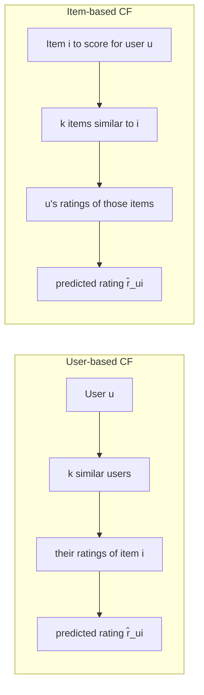

# Module 6 — Collaborative Filtering: Neighborhood Methods

> The first commercially successful recsys (GroupLens 1994; Amazon 1998-2003) was a neighborhood method. It's mostly displaced by matrix factorization and deep models today, but **item-item kNN is still the right answer** for a surprising number of production problems.

---

## 1. The intuition

"People like you liked these" or "items like the ones you liked are also good."

CF makes one assumption: **users who agreed in the past tend to agree in the future**, and **items rated similarly by many users tend to be similar to each other**. No need to look at content — the rating matrix itself encodes everything.

Two flavors:



---

## 2. User-based kNN

```
sim(u, v) = similarity between users u and v based on shared rated items
N_k(u)    = top-k users most similar to u (who rated item i)
r̂_ui     = ū + Σ_{v ∈ N_k(u)} sim(u,v) · (r_vi − v̄)  /  Σ |sim(u,v)|
```

The mean-centering (`ū`, `v̄`) is critical — different users use different rating scales (one user's 5 is another's 3).

### 2.1 Similarity measures

**Pearson correlation** (the GroupLens default):

```
sim_Pearson(u,v) = Σ_{i ∈ I_uv} (r_ui − ū)(r_vi − v̄)  /  sqrt(Σ (r_ui − ū)² · Σ (r_vi − v̄)²)
```

where `I_uv` is the set of items both `u` and `v` rated. Range: [-1, 1].

**Cosine similarity** (faster, no centering):

```
sim_cos(u, v) = (r_u · r_v) / (‖r_u‖ ‖r_v‖)
```

**Jaccard** (binary feedback):

```
sim_Jaccard(u,v) = |I_u ∩ I_v| / |I_u ∪ I_v|
```

### 2.2 Shrinkage — the production trick

Raw Pearson on 2 co-rated items is 1.0 with no statistical meaning. Shrinkage damps similarities computed from too-few overlaps:

```
sim_shrunk(u,v) = (|I_uv| / (|I_uv| + α)) · sim_Pearson(u,v)
```

`α` is typically 10-100. Massive improvement on small datasets.

### 2.3 Significance weighting

Same idea, different parametrization. Multiply by `min(|I_uv|, 50) / 50` — users with fewer than 50 overlapping ratings have proportionally less weight.

### 2.4 Why user-based died in production

- **Doesn't scale**: for `|U|` users, `|U|²` pairwise similarities. At 100M users this is hopeless.
- **User similarities are unstable**: each new rating changes a user's similarities to everyone.
- **Cold start**: a new user shares no items with anyone → no similarities → no recommendations.

It survives as a small-corpus pedagogical tool. For research baselines, MovieLens etc.

---

## 3. Item-based kNN — the Amazon classic

Linden, Smith, York 2003 "Amazon.com Recommendations: Item-to-Item Collaborative Filtering." The single most influential industrial recsys paper of the 2000s.

```
sim(i, j) = similarity between items i and j based on the users who rated both
N_k(i)    = top-k items most similar to i
r̂_ui     = Σ_{j ∈ N_k(i) ∩ I_u} sim(i,j) · r_uj  /  Σ |sim(i,j)|
```

### 3.1 Why it won

1. **Item similarities are stable.** Items get rated thousands of times; pairwise stats are reliable.
2. **Item similarities can be precomputed offline.** Build the item-item similarity matrix nightly (or weekly).
3. **Item count is much smaller than user count.** Tens of millions of items vs billions of users.
4. **Serving is fast.** For user `u`, look up their recent items, fetch top-k similar items per recent item, score.
5. **Trivially scalable.** The similarity matrix is sparse (only top-k per row).

### 3.2 Adjusted cosine similarity

The standard item-based similarity (Sarwar et al. 2001):

```
sim_adj_cos(i, j) = Σ_{u ∈ U_ij} (r_ui − ū)(r_uj − ū)  /  sqrt(Σ (r_ui − ū)² · Σ (r_uj − ū)²)
```

Mean-centering per user (`ū` is the user's mean rating), so the harsh-rater vs generous-rater bias is removed.

### 3.3 Implicit-feedback variant

For implicit data (purchase, play, click), the matrix is binary. Common similarities:

- **Cosine over binary vectors**: `sim(i,j) = |U_i ∩ U_j| / sqrt(|U_i| · |U_j|)` where `U_i` is the set of users who interacted with item `i`.
- **Jaccard**: `|U_i ∩ U_j| / |U_i ∪ U_j|`.
- **Lift (PMI-flavored)**: `P(j | i) / P(j) = (|U_i ∩ U_j| / |U_i|) / (|U_j| / |U|)`. Strong for "Frequently bought together."
- **Conditional probability with shrinkage**: `(|U_i ∩ U_j| + β · P(j)) / (|U_i| + β)`.

### 3.4 BM25-flavored item similarity

A BM25-style weighting of item-item co-occurrences damps popular items so the similarity matrix doesn't end up with "everything is similar to Star Wars":

```
sim_BM25(i, j) = Σ_u  1{u rated i} · w_BM25(u, j)
```

The `implicit` Python library implements this.

### 3.5 The Amazon serving pipeline


Latency: 5-20ms per request. This is the "Customers who bought X also bought Y" rail. Twenty years old, still in production at every e-commerce company.

---

## 4. Sample code: item-based kNN on MovieLens

(See [`code/06_neighborhood_cf.py`](code/06_neighborhood_cf.py) for a runnable version.)

```python
import numpy as np
from scipy.sparse import csr_matrix
from sklearn.metrics.pairwise import cosine_similarity

# R: users × items rating matrix (0 = unrated)
users   = ["alice", "bob", "carol", "dave"]
items   = ["m1", "m2", "m3", "m4", "m5"]
R = np.array([
    [5, 3, 0, 1, 4],
    [4, 0, 0, 1, 5],
    [1, 1, 0, 5, 0],
    [0, 0, 5, 4, 1],
])

# Compute item-item similarity (treat 0 as missing → binary first then weighted)
# Simple version: cosine on the raw column vectors
item_sim = cosine_similarity(R.T)
np.fill_diagonal(item_sim, 0)
print("Item similarities (m1, m2, m3, m4, m5):")
print(item_sim.round(2))

# Predict alice's rating for m3 using k=2 nearest neighbors
alice = R[0]                 # [5, 3, 0, 1, 4]
target_item = 2              # m3 (alice hasn't rated)
sims = item_sim[target_item] # similarities of m3 to all items
rated_mask = alice > 0

# top-2 items alice has rated that are most similar to m3
weights = sims * rated_mask
top_k = np.argsort(weights)[::-1][:2]

num = np.sum(sims[top_k] * alice[top_k])
den = np.sum(np.abs(sims[top_k]))
pred = num / den if den > 0 else 0
print(f"\nPredicted rating for alice on m3: {pred:.2f}")
```

---

## 5. SLIM — Sparse Linear Methods (Ning & Karypis 2011)

A clever generalization: instead of using fixed similarity weights, **learn** an item-item weight matrix `W` such that

```
ŷ_ui = Σ_j r_uj · W_ji   subject to: W is sparse, non-negative, zero diagonal
```

Solved as `|I|` independent regressions (one per column of W). Has held up well against deep methods on small datasets — the "Are We Really Making Much Progress?" 2019 paper found SLIM beats many neural baselines.

The 2020 "EASE^R" (Embarrassingly Shallow AutoEncoder, Steck) is an even simpler closed-form version that's still competitive on MovieLens.

---

## 6. When neighborhood CF still wins in production

| Situation | Why neighborhood CF wins |
|-----------|--------------------------|
| **Catalog < 1M items, < 10M users** | MF / deep models overfit; kNN is robust |
| **Strict interpretability** | "Recommended because users who bought X also bought Y" |
| **High item churn** | Daily catalog turnover makes embedding training expensive |
| **"More like this" rail** | Direct item-item lookup is exactly what's needed |
| **Cold model serving** | No GPU, no embedding tables — KV store + a few lookups |
| **Strong baseline** | Always benchmark against item-kNN before claiming a deep model wins |

---

## 7. When you should *not* use neighborhood CF

- **Cold-start items.** They have no ratings → no neighbors. Hybridize with content.
- **Long-tail dominance.** When 80% of users only have 1-2 interactions, the similarity matrix is unreliable.
- **Multi-stakeholder objectives.** Neighborhood CF optimizes co-rating, not revenue / retention / fairness.
- **Personalized ranking beyond similar-to-history.** A pure neighborhood approach can't discover items unlike the user's history.

---

## 8. Sanity check

1. Why did user-based kNN lose to item-based kNN at industrial scale even though they're mathematically similar?
2. Two items have 2 users who both rated them 5 stars. Raw Pearson similarity = 1.0. Why is this misleading and what fixes it?
3. The item-item similarity matrix at Amazon scale has 10⁷ items. Why isn't this 10¹⁴ entries in storage, and what does Amazon actually store?
4. Your "Frequently bought together" rail surfaces a $5 cable as similar to a $1000 laptop because of high co-occurrence. Suggest a similarity tweak that mitigates this.
5. For implicit feedback, which similarity (cosine over binary, Jaccard, lift) would you choose for a music streaming service, and why?
