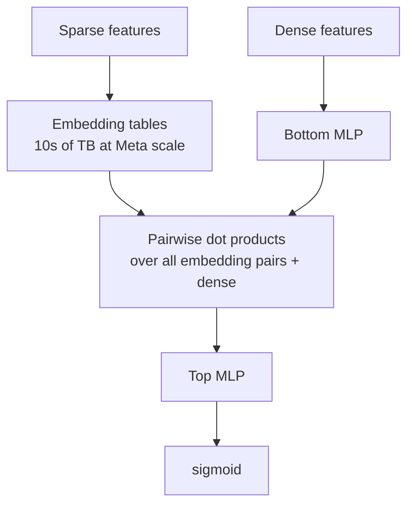

# Module 8 — Neural Recommenders & CTR Models

> This is the lineage that produced the 2017-2024 ads-ranking architecture and the modern ranker at every major platform. The pattern: stack a *deep tower* (memorization + feature crossing) on top of *embedding tables* over sparse features. The fights are about which feature-crossing operator wins.

---

## 1. The "neural-collaborative-filtering" era and its caveat

He et al. 2017, **NCF (Neural Collaborative Filtering)**. The proposal: replace MF's dot product with an MLP over `(p_u, q_i)` to model non-linear interactions:

```
ŷ_ui = MLP( concat(p_u, q_i) )
```

Cited 7000+ times. The big caveat: Rendle, Krichene, Zhang, Anderson 2020 (RecSys 2020) showed **a properly tuned dot-product MF beats NCF**. The lesson — non-linear interactions over MF embeddings are not free; baselines matter; reproducibility matters.

Still, NCF crystallized a useful template: **embeddings + deep tower**. Almost every CTR model below is a variation on it.

---

## 2. Wide & Deep (Google Play, Cheng et al. DLRS 2016)

The architecture that defined industrial CTR for the late 2010s.

```
P(click)  =  σ(  w_wide · x_wide  +  w_deep · a^(L)  +  b  )
```

Two parts trained jointly:

- **Wide**: linear model over **manually crossed** categorical features. "memorization" of specific (user, item) combinations.
- **Deep**: MLP over learned embeddings of sparse features. "generalization" — embeddings let unseen combinations score reasonably.

```mermaid
flowchart TB
    subgraph Wide
        F1[Sparse categorical<br/>+ hand-crafted crosses] --> L[Linear / LR<br/>w_wide · x_wide]
    end
    subgraph Deep
        F2[Sparse categorical] --> E[Embedding<br/>tables]
        F2dense[Dense features] --> CONCAT
        E --> CONCAT[Concatenate]
        CONCAT --> M[MLP<br/>4-5 layers]
    end
    L --> ADD[Sum + sigmoid]
    M --> ADD
    ADD --> P[P(click)]
```

Deployed for app recommendations in Google Play. Shipped as `tf.estimator.DNNLinearCombinedClassifier`. The dominant architecture pattern at Google for years.

**Pain point**: the Wide component needs hand-crafted feature crosses. This is the central problem the next decade tried to solve automatically.

---

## 3. DeepFM (Huawei + HKUST, Guo et al. IJCAI 2017)

Replace the Wide component with an **FM** sharing embeddings with the Deep tower:

```
score = σ( FM_part(emb) + DNN_part(emb) )
```

- **FM part**: linear terms + pairwise FM interactions.
- **DNN part**: MLP over the concatenated embeddings.
- **Shared embeddings**: same embedding table feeds both.

DeepFM eliminated the manual cross-feature engineering of Wide & Deep. State-of-the-art for ~2 years.

---

## 4. xDeepFM (Microsoft, Lian et al. KDD 2018)

DeepFM's FM part only models second-order interactions. xDeepFM introduces **Compressed Interaction Network (CIN)**:

- Layer-by-layer **vector-wise** interactions (not element-wise).
- Each layer takes outer products of previous-layer field embeddings × the initial layer.
- Produces explicit polynomial features up to bounded degree.

```
score = σ( linear + CIN_output + DNN_output )
```

Won several CTR competitions. CIN is more expressive than FM but heavier; in practice it's hard to tune.

---

## 5. AutoInt (Song et al. CIKM 2019)

Replace explicit feature crosses with **multi-head self-attention** over field embeddings.

```
emb_i_new = MultiHeadAttention(emb_i, {emb_j} for all j)
```

Conceptually: every feature attends to every other feature; the attention weights encode learned pairwise importance.

Strong on benchmarks. Practical wrinkle: self-attention is O(n²) in number of fields, which becomes painful when you have 100+ fields.

---

## 6. DCN / DCN-V2 (Google, Wang et al. 2017 / 2021)

The **Deep & Cross Network**. The cross-layer operator:

```
x_{l+1} = x_0 ⊙ (W_l x_l + b_l) + x_l
```

- `x_0` is the initial embedding-concat vector.
- Each cross layer adds one degree of polynomial interaction.
- L layers → polynomial features up to degree L.

DCN-V1 had a scalar `W_l` (limited capacity). DCN-V2 (Wang et al. WWW 2021) uses a **full matrix** `W_l` with low-rank factorization. This is the version that runs in Google production (YouTube ranking, Google Ads).

The Wang 2021 paper is also famous for its **practical lessons** section — features, embeddings, hashing strategies. Mandatory reading for ranking engineers.

---

## 7. FiBiNet, FiBiNet++, MaskNet (Sina Weibo)

These three add **per-example feature reweighting**:

- **FiBiNet** (Huang et al. RecSys 2019) — SENet (squeeze-and-excitation) computes a per-field weight for each field embedding; bilinear feature interaction after reweighting.
- **FiBiNet++** (2022) — refinement.
- **MaskNet** (Wang et al. DLP-KDD 2021) — multiplicative masking blocks; the "MaskBlock" multiplies element-wise instead of adding residual.

These tend to add ~3-5% offline AUC at ~10% extra compute on industrial datasets. Whether they make production usually depends on whether you can afford the extra latency.

---

## 8. DLRM (Meta, Naumov et al. 2019)

**Deep Learning Recommendation Model** — Meta's open-sourced reference for an embedding-heavy ranker.



- **Sparse features** → embedding tables → list of `k`-dim vectors.
- **Dense features** → bottom MLP → one `k`-dim vector.
- **Feature interaction layer**: compute pairwise dot products among all `n` embedding vectors + the dense vector. Output `n·(n+1)/2` interaction features.
- **Top MLP** consumes the dense vector + interaction features → sigmoid → CTR.

DLRM's main contribution isn't the architecture *per se* but the **systems engineering**:
- Embedding-table sharding (row, column, table-wise).
- ZionEX training platform (Mudigere et al. ISCA 2022).
- TorchRec, FBGEMM, PARAM benchmark suite.
- MLPerf Recommendation uses DLRMv2 (793B params).

DLRM is the default ranker for **most Meta surfaces** through 2024 (Ads, Reels first-stage). Being replaced by HSTU (Module 12) in 2024-2026.

---

## 9. DIN, DIEN, BST — the Alibaba sequence-conditioning line

For e-commerce, "what is this user likely to buy next" depends heavily on their **recent history**. The Alibaba line adds **history-conditioning** to CTR ranking.

### 9.1 DIN — Deep Interest Network (Zhou et al. KDD 2018)

For each candidate ad `a`, compute attention weights over the user's recent items:

```
user_repr_for_a = Σ_h  attention(emb_a, emb_h) · emb_h
```

The user representation is **target-aware** — different for different candidate ads. Captures "this user is interested in a if they recently looked at related items."

### 9.2 DIEN — Deep Interest Evolution Network (Zhou et al. AAAI 2019)

Replace attention with a **GRU + attention** over the history sequence. Models *evolution* of interests over time (auxiliary loss: predict next-clicked item).

### 9.3 BST — Behavior Sequence Transformer (Chen et al. DLP-KDD 2019)

Transformer encoder over the behavior sequence. The most direct sequence-modeling approach. Still uses target-aware attention with the candidate as query.

### 9.4 The lifelong-sequence problem: SIM, ETA, TWIN

User histories grow to thousands of items. Direct attention is `O(L)` per candidate; with 10k history and 1k candidates that's 10M ops per request — too slow.

- **SIM** (Pi et al. CIKM 2020) — two-stage: a "hard search" by category retrieves recent same-category items, then DIN-style attention.
- **ETA** (Chen et al. 2021) — replaces hard search with **SimHash LSH** jointly trained with the ranker.
- **TWIN** (Chang et al. KDD 2023, Kuaishou) — unified target-aware attention across both retrieval and ranking. Deployed in Kuaishou for short-video ads.

Detail in Module 9.

---

## 10. The 2023-2025 frontier: FinalMLP, generative CTR, scaling laws

### 10.1 FinalMLP (AAAI 2023)

A simple finding: a **two-stream MLP** with feature gating and bilinear fusion **matches or beats** DCN-V2, AutoInt, MaskNet on standard CTR benchmarks.

Lesson: architectural innovation in CTR is hitting diminishing returns; data, features, and calibration matter more than the latest feature-cross operator.

### 10.2 HSTU and Wukong (Meta, ICML 2024)

The two papers redefined "the next era":

- **HSTU** (Hierarchical Sequential Transducer Unit): autoregressive transformer over user actions. Cast CTR + ranking as next-token prediction. Reached 1.5T parameters in production. Module 12.
- **Wukong** (Towards a Scaling Law for Large-Scale Recommendation): stackable FM-like blocks with **clean scaling laws** up to ~100B params. Performance is power-law in params and data, like LLMs.

The implication: **recsys has its scaling-law moment**. More parameters + more data + larger sequence → predictable improvements.

### 10.3 PEPNet / STAR (multi-domain)

When a single ranker serves multiple domains (e-commerce + ads + content):

- **STAR** (Sheng et al. CIKM 2021) — "Star topology" — shared parameters + domain-specific parameters.
- **PEPNet** (Chang et al. KDD 2023) — Parameter and Embedding Personalized Network. Per-domain gating networks modulate both embeddings and ranker parameters.

Used in production at Kuaishou.

---

## 11. Sample code: a small DLRM-style ranker in PyTorch

(See [`code/08_dlrm_lite.py`](code/08_dlrm_lite.py) for a runnable version.)

```python
import torch, torch.nn as nn

class DLRMLite(nn.Module):
    def __init__(self, sparse_field_dims, dense_dim, emb_dim=16, mlp_hidden=(64, 32)):
        super().__init__()
        # one embedding table per sparse field
        self.emb = nn.ModuleList([nn.Embedding(n, emb_dim) for n in sparse_field_dims])
        # bottom MLP for dense features
        self.bottom = nn.Sequential(
            nn.Linear(dense_dim, emb_dim), nn.ReLU(),
            nn.Linear(emb_dim, emb_dim), nn.ReLU(),
        )
        # number of pair interactions: N choose 2 where N = #sparse + 1 (dense)
        n_fields = len(sparse_field_dims) + 1
        n_pairs  = n_fields * (n_fields + 1) // 2

        layers, prev = [], n_pairs + emb_dim
        for h in mlp_hidden:
            layers += [nn.Linear(prev, h), nn.ReLU()]
            prev = h
        layers += [nn.Linear(prev, 1)]
        self.top = nn.Sequential(*layers)

    def interact(self, vectors):
        # vectors: (B, N, D)
        B, N, _ = vectors.shape
        T = torch.bmm(vectors, vectors.transpose(1, 2))  # (B, N, N)
        idx = torch.triu_indices(N, N, offset=0)
        return T[:, idx[0], idx[1]]                      # (B, N*(N+1)/2)

    def forward(self, sparse_idx, dense_x):
        # sparse_idx: (B, n_sparse) longs
        # dense_x:    (B, dense_dim) floats
        emb_vecs = [e(sparse_idx[:, k]) for k, e in enumerate(self.emb)]  # list of (B, D)
        d_vec = self.bottom(dense_x)                                       # (B, D)
        all_vecs = torch.stack(emb_vecs + [d_vec], dim=1)                  # (B, N, D)
        pair_feats = self.interact(all_vecs)                               # (B, N*(N+1)/2)
        x = torch.cat([d_vec, pair_feats], dim=1)
        return torch.sigmoid(self.top(x)).squeeze(-1)

# Example
model = DLRMLite(sparse_field_dims=[1000, 500, 200], dense_dim=8)
sparse = torch.randint(0, 200, (32, 3))
dense  = torch.randn(32, 8)
print(model(sparse, dense).shape)   # (32,)
```

---

## 12. Sanity check

1. Why did Wide & Deep need hand-crafted feature crosses in the Wide component, and how did DeepFM remove that?
2. In DCN-V2, what does the cross-layer operator compute, and how does it differ from a simple MLP?
3. DLRM's pairwise dot products produce N·(N+1)/2 interaction features. Why is this affordable but a full N×N MLP isn't?
4. A user's history is 10,000 items. Standard DIN attention would compute attention with 10k key-vectors per candidate. What did SIM / ETA / TWIN do to reduce this cost?
5. Wukong showed recsys scales like LLMs. What's the practical implication for an architect choosing model size in 2026?
