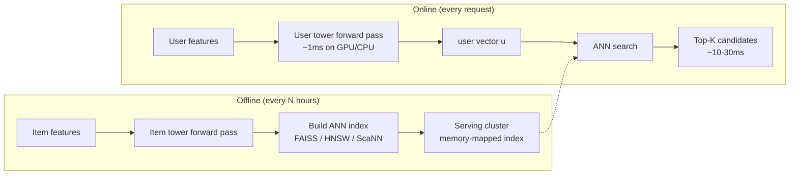

# Module 10 — Two-Tower Retrieval at Scale

> The single most universally deployed recsys architecture of the 2020s. If you remember one diagram from this curriculum, make it this one.

---

## 1. The architecture

```mermaid
flowchart LR
    U[User features<br/>id, profile, history, context] --> UT[User tower<br/>MLP / transformer]
    I[Item features<br/>id, content, taxonomy] --> IT[Item tower<br/>MLP / transformer]
    UT --> UV[User vector u<br/>e.g. 128d]
    IT --> IV[Item vector v<br/>e.g. 128d]
    UV --> S[s(u, v) = u · v]
    IV --> S
    S --> P[Score / ranking]
```

Two parallel deep networks (the "towers"), each producing an embedding in a shared space. The score is the **dot product** (sometimes cosine, but they're equivalent under L2 normalization).

The critical property: the **item tower is independent of the query**. You precompute item vectors offline, build an ANN index over them, and at query time only the user tower runs — followed by a fast ANN lookup.

That's why two-tower wins for retrieval at any scale above ~100k items.

---

## 2. Why dot product (not MLP)

A cross-encoder `MLP(concat(u, v))` would be more expressive — but it forces every (user, item) pair to be scored at query time. With 100M items and a 100ms budget, that's 1µs per item — impossible.

Two-tower **factorizes**: `score(u, v) = f(u) · g(v)`. Once `g(v)` is precomputed for every item, scoring at query time costs one dot product per candidate, which an ANN index reduces from `O(N)` to `O(log N)`.

The trade-off: two-tower has **less expressive power** than a cross-encoder. That's why production stacks use two-tower for **retrieval** (where you need to score millions of items) and a cross-encoder-like ranker for **ranking** (where you only score thousands).

---

## 3. The Google two-tower paper (Yi et al. 2019)

**"Sampling-Bias-Corrected Neural Modeling for Large Corpus Item Recommendations"**, Yi et al., RecSys 2019. The canonical reference for production two-tower training.

Three core contributions:

### 3.1 In-batch negative sampling

For each (user_i, item_i) positive pair in a mini-batch of size B, treat the **B-1 other items in the batch** as negatives. Cheap to implement, gives B-1 negatives per positive without extra forward passes.

### 3.2 LogQ correction

In-batch negatives are sampled with probability proportional to item frequency in the training data. Without correction, popular items get pushed *away* from users more often → at serving time, popular items rank *lower* than they should.

The fix:

```
s'(u, i) = s(u, i) − log q(i)
```

where `q(i)` is the empirical sampling probability of item `i`. The softmax is computed on the corrected scores.

`q(i)` can be estimated with a **streaming Count-Min sketch** during training (the Yi paper proposes a "frequency estimation algorithm" that does exactly this).

### 3.3 Item embedding refresh

Item vectors drift as the model trains. The serving index must be rebuilt periodically (typically hourly or daily). At Google scale this is engineered into the training pipeline: a side process snapshots the item tower, runs it over all items, writes the index, and atomically swaps the serving index.

---

## 4. Negative-sampling strategies for two-tower

This is *the* most important hyperparameter family.

| Strategy | Compute cost | Bias | When to use |
|----------|--------------|------|-------------|
| **Uniform random** | Very cheap | Most negatives are easy (rare items the user clearly didn't want) | Tiny datasets only |
| **Popularity-proportional** (`q ∝ count^0.75`) | Cheap | Harder negatives; word2vec-style | Strong default |
| **In-batch** | Cheap (free) | Sampling = batch frequency; needs LogQ correction | Modern default at scale |
| **Mixed in-batch + uniform** | Cheap | Adds easy negatives to balance | Helps with cold-start items |
| **Hard mining (full ANN)** | Expensive (forward pass over a candidate pool) | Faster convergence to top-K quality | When recall@1 matters |
| **Cached hard negatives (queue)** | Medium | Recently-hard items reused | Common in production |
| **Mixed Negative Sampling (MNS)** | Medium | Combines in-batch + uniform sampled negatives | Google two-tower default |

The 2019 Yi paper recommends in-batch + LogQ + a small uniform mix.

---

## 5. The user tower

Modern user-tower designs:

### 5.1 Static profile + history pooling

```python
user_emb = MLP(concat(
    user_id_embedding,
    profile_features,
    mean_pool([item_embedding(j) for j in user_recent_items]),
))
```

The mean-pool is the simplest history aggregator. Works surprisingly well.

### 5.2 Sequence encoder

A transformer or GRU over the recent item sequence. Captures order; expressive; slower.

### 5.3 Multi-embedding (PinnerSage)

Cluster the user's history into multiple medoids; output **multiple** user vectors instead of one. ANN queries are run per-vector and unioned.

### 5.4 Cold-start branch

A separate tower for new users (no `user_id` embedding); uses content features only. Switched in at request time when `user_age < 7 days`.

---

## 6. The item tower

Item-tower content matters more when the catalog has cold-start items.

```python
item_emb = MLP(concat(
    item_id_embedding,             # learned from interactions; cold for new items
    content_embedding,             # from pretrained encoder; always available
    category_features,
    creator_id_embedding,
    age_features,
))
```

Modern best practice: heavy reliance on **content embeddings** (text, image, audio) so cold-start items inherit signal from their content. Without content features, new items literally have random embeddings and rank ~uniformly at retrieval.

---

## 7. The serving topology



Latency budget for retrieval is usually **20-50 ms**:
- 1-5 ms user tower forward.
- 10-30 ms ANN search (HNSW or ScaNN over millions of items).
- 5-10 ms candidate set assembly + dedup + filtering.

---

## 8. ANN choices — FAISS vs HNSW vs ScaNN

| Library | Algorithm | Best for | Notes |
|---------|-----------|----------|-------|
| **FAISS** (Meta) | IVF, IVF-PQ, HNSW, flat | Largest catalog (10M+); offline indexing | Most flexible, C++/Python, GPU support |
| **hnswlib / HNSW** | Hierarchical NSW graphs | Lowest latency, high recall | Pinterest, LinkedIn |
| **ScaNN** (Google) | Anisotropic vector quantization | Pareto-best on recall vs QPS | YouTube, Vertex AI Vector Search |
| **DiskANN** (Microsoft) | Disk-resident HNSW | Billions of vectors per node | Trades latency for cost |
| **Voyager** (Spotify) | HNSW (Spotify replacement for Annoy) | Spotify-typed Python/Java API | 2023 |

Most production teams use **HNSW** for serving (sub-10ms p99 at 100M vectors) and FAISS for offline analysis.

### 8.1 IVF-PQ — the cheap option

Inverted File + Product Quantization: cluster vectors into `nlist` buckets; quantize each vector into `M` × 8-bit codes; ANN search visits a few buckets and uses lookup tables for distance. Massive memory savings (40-100×) at the cost of some recall loss.

### 8.2 HNSW

Builds a multi-layer graph where each node has links to nearby nodes at multiple scales. Search descends from a sparse top layer to a dense bottom layer. The dominant in-memory ANN in 2024.

### 8.3 The recall-latency Pareto

Always benchmark on **your own data**. The ANN-benchmarks.com leaderboard is useful, but real-world recall curves depend on your embedding distribution.

---

## 9. Training infrastructure

### 9.1 Frameworks

- **TensorFlow Recommenders (TFRS)**: idiomatic two-tower in Keras. Easy.
- **PyTorch + TorchRec**: production-grade for huge embeddings. Handles sharding.
- **Hugging Face sentence-transformers**: tiny-scale, content-tower style.
- **DSSM** (Microsoft Deep Structured Semantic Model, 2013): the OG two-tower for search.

### 9.2 Distributed training

Embedding tables can exceed single-node memory. The standard pattern:

- **Embedding parallelism**: shard tables across machines (TorchRec, parameter servers).
- **Data parallelism**: replicate the MLP towers, shard the data.
- **Combined** (DLRM-style hybrid): the workhorse at FAANG scale.

### 9.3 Batching

Larger batches → more in-batch negatives → better training. Practical batch sizes: 1k-16k pairs. Bigger needs gradient accumulation or model parallelism.

---

## 10. Common pitfalls

| Pitfall | Symptom | Fix |
|---------|---------|-----|
| **No LogQ correction** | Popular items underrank at serving | Apply LogQ; estimate frequencies online |
| **Embedding drift between train and serving** | Recall drops after launch | Atomic index swap; freeze item tower before snapshotting |
| **Cold items get random vectors** | New items don't appear in top-K | Add content features to item tower |
| **L2 normalization missing or asymmetric** | Score scale drifts over time | L2-normalize both towers consistently |
| **In-batch negatives have repeated items** | Loss spikes; weird local minima | Dedup batches |
| **User tower trained on stale features** | Train-serve skew | Log-and-wait pattern |
| **Hash collisions in embedding tables** | Top-K results look weirdly clustered | Bigger hash space; collisionless hash (Monolith) |

---

## 11. Sample code: minimal two-tower in PyTorch

(See [`code/10_two_tower.py`](code/10_two_tower.py) for a runnable version with LogQ correction.)

```python
import torch, torch.nn as nn, torch.nn.functional as F

class Tower(nn.Module):
    def __init__(self, vocab_size, emb_dim=32, hidden=64, out_dim=32):
        super().__init__()
        self.emb = nn.Embedding(vocab_size, emb_dim)
        self.mlp = nn.Sequential(
            nn.Linear(emb_dim, hidden), nn.ReLU(),
            nn.Linear(hidden, out_dim),
        )

    def forward(self, idx):
        x = self.emb(idx)
        return F.normalize(self.mlp(x), dim=-1)  # L2 normalize

# Training step with in-batch negatives + LogQ correction
def train_step(user_tower, item_tower, user_idx, pos_item_idx, item_freqs):
    u = user_tower(user_idx)         # (B, D)
    v = item_tower(pos_item_idx)     # (B, D)

    # all-pairs similarity matrix (B x B); diagonals are positives
    logits = u @ v.T                 # (B, B)

    # LogQ correction: subtract log of sampling probability from each column
    log_q = torch.log(item_freqs[pos_item_idx] + 1e-9)
    logits = logits - log_q.unsqueeze(0)

    labels = torch.arange(logits.size(0), device=logits.device)
    loss = F.cross_entropy(logits, labels)
    return loss
```

---

## 12. Sanity check

1. Why is two-tower's dot-product score factorization the entire reason it scales, and what's the alternative architecture that can't scale this way?
2. In-batch negatives give you B-1 negatives per positive for free. What's the bias and what's the correction?
3. You launch a two-tower retriever; popular items are missing from top-K. What's the most likely cause?
4. Your item catalog grows 10x. The model architecture stays the same. What part of the serving stack must scale, and how?
5. New items added daily need to appear in retrieval the same day. How do you ensure that without retraining the whole model?
6. A teammate proposes using cosine instead of dot product. What conditions make these equivalent, and what changes operationally?
