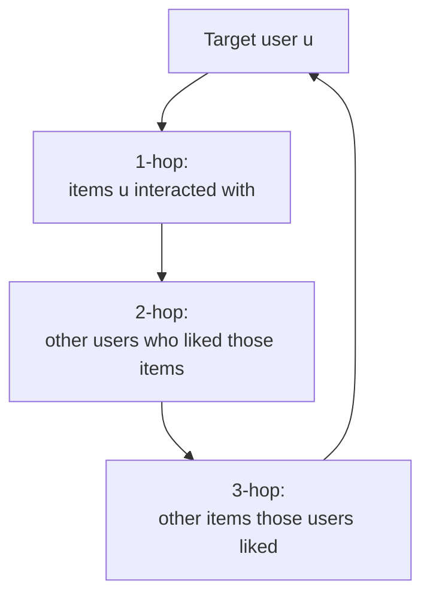

# Module 11 — Graph Neural Networks for Recommendations

> Pinterest deployed the first production GNN recommender (PinSage 2018) and never stopped. LinkedIn followed with LiGNN (2024). Everyone else is closer to "uses graph-derived features in their two-tower" than "trains an end-to-end GNN at production scale." This module covers the math, the production reality, and the trade-offs.

---

## 1. Why graph

The user-item interaction matrix `R` is naturally a **bipartite graph**:

- Nodes: users `U`, items `I`.
- Edges: interactions (rating, click, play, buy).

Matrix factorization sees only direct edges. GNNs propagate signal across **multi-hop** neighborhoods:

- "User → item → other users who liked that item → items those users also liked."

That's the **collaborative-filtering signal**, but formalized as message passing on a graph.

Plus: many recsys problems have richer graphs beyond just user-item:
- Social graph (friends of users).
- Item-item graph (co-purchase, "also bought").
- Knowledge graph (item-category, item-brand, item-attribute).
- Heterogeneous (mix of all the above).

GNNs let you exploit all of these without manual feature engineering.

---

## 2. Core message-passing math

For each node `v` at layer `l+1`:

```
h_v^{l+1} = UPDATE(h_v^l, AGGREGATE({h_u^l : u ∈ N(v)}))
```

Different GNN variants differ in:
- The aggregator (mean, sum, max, attention).
- The update function (linear, MLP, GRU).
- How edge features factor in.

After L layers, each node has gathered information from its L-hop neighborhood.



3-4 hops capture the most useful collaborative signal; deeper layers introduce noise (over-smoothing).

---

## 3. GraphSAGE (Hamilton et al. NeurIPS 2017)

The first GNN that handled web-scale **inductive** learning (new nodes don't need retraining).

### 3.1 The aggregator

```
h_N(v)^l = AGG({h_u^l : u ∈ N(v)})        # mean, max, LSTM, or pooling
h_v^{l+1} = σ(W · concat(h_v^l, h_N(v)^l))
```

### 3.2 Neighborhood sampling

For a node with 10,000 neighbors, you can't process all of them. GraphSAGE samples a **fixed-size** subset (e.g., 25 neighbors) per layer. Stochastic, scales to giant graphs.

### 3.3 Inductive

The aggregator is **not** a node-specific parameter — it's a shared function. So at inference time, new nodes can be embedded by aggregating from their (possibly also new) neighbors using existing weights.

Critical for recsys where new users and items appear constantly.

---

## 4. PinSage (Pinterest, Ying et al. KDD 2018)

PinSage is GraphSAGE adapted for **3 billion pins and 18 billion edges**.

### 4.1 The graph

- Pins (items), boards, users — heterogeneous.
- Edges: "pin saved to board" (user-implicit), "pin is similar to pin" (visual).

### 4.2 Random-walk neighborhood sampling

Instead of uniform-random sampling neighbors, run short **random walks** from the target node; the most-visited neighbors are selected as "important" neighbors with visit-count as importance weight in aggregation.

Captures more relevant context per neighbor; reduces variance.

### 4.3 Hard-negative curriculum

Start with easy random negatives, progressively mix in mined hard negatives (visually similar but not co-engaged with this user). Reaches recall@5 numbers that random negatives don't.

### 4.4 Producer-consumer training

A CPU producer samples neighborhoods; a GPU consumer trains. Decouples graph sampling from gradient compute → GPU stays saturated.

### 4.5 MapReduce inference

To produce embeddings for all 3B pins, run a 2-stage Hadoop job. Stage 1: aggregate immediate neighbors. Stage 2: 2-hop aggregation. Used to refresh the entire embedding table nightly.

### 4.6 Where PinSage powers

- **Related Pins** rail (the canonical "more like this" surface).
- **Home Feed** candidate generation.

A direct demonstration that GNNs can run at Pinterest's scale.

---

## 5. LightGCN (He et al. SIGIR 2020)

LightGCN simplified NGCF (a predecessor) by removing the feature transformations and nonlinearity, keeping only **neighborhood aggregation**.

```
h^{l+1} = D⁻¹ A h^l           # propagation
e_u = (1/(L+1)) Σ_l h_u^l     # average across layers
```

- No learnable weight matrix per layer.
- No nonlinearity.
- Final embedding = average across layers.

Counter-intuitively, this *outperformed* NGCF — the extra learnable transformations were overfitting noise. LightGCN became the standard CF-GNN baseline.

Still strong on small/medium datasets; production teams use it for warm-starting or as a reliable baseline.

---

## 6. PinnerSage (Pinterest, Pal et al. KDD 2020)

Multi-embedding **user** representation:

1. Encode each engaged pin via PinSage → 32-256d vector.
2. Cluster the user's recent engaged pins in embedding space using **Ward hierarchical clustering**.
3. Represent the user by ~3 cluster medoids.
4. At serve time, retrieve top-K per medoid via ANN; merge; re-rank.

Why medoids (real pins) instead of cluster centroids: explainable ("you'll like this because it's similar to these pins you saved") and they're already in the ANN index.

PinnerSage is the spiritual ancestor of Meta's multi-embedding user representations and the per-context user vectors at Spotify.

---

## 7. LiGNN (LinkedIn, 2024)

**"LiGNN: A Large-Scale Graph Neural Network for LinkedIn"** — production GNN at LinkedIn scale.

### 7.1 The graph

The **economic graph**: members, companies, schools, skills, jobs, posts, groups, hashtags, etc. ~Billions of nodes, ~100B+ edges.

### 7.2 Adaptive sampling

Neighborhood sampling weighted by both **importance** (frequency, recency, engagement) and **diversity** (cover different relationship types).

### 7.3 Training infrastructure

100+ billion edges; multi-billion node graphs. Distributed sampling on Spark; training on GPU clusters.

### 7.4 Powers

- PYMK (People You May Know).
- Job recommendations (JYMBII).
- Content feed.

### 7.5 The serving question

A challenge: GNN inference can be expensive if you re-run message passing at request time. LinkedIn's solution: precompute node embeddings periodically (batch), serve via lookup + small online network. The same pattern as PinSage.

---

## 8. Heterogeneous and knowledge-graph GNNs

Heterogeneous graphs have multiple edge types (e.g., user-buys-item, user-views-item, item-is-in-category, item-from-seller). The GNN must handle each edge type appropriately.

- **R-GCN** (Schlichtkrull et al. ESWC 2018) — per-relation weight matrices.
- **HAN** (Wang et al. WWW 2019) — heterogeneous attention.
- **HGT** (Hu et al. WWW 2020) — heterogeneous graph transformer.

Knowledge-graph-aware variants:
- **KGAT** (Wang et al. KDD 2019) — knowledge graph attention.
- **KGIN** (Wang et al. WWW 2021) — knowledge graph intent network.

Production deployments are rarer than CF-GNN. Amazon Neptune supports graph workloads but production rankers usually consume **graph-derived features** (e.g., shortest-path distance, common neighbors) rather than full GNN message passing.

---

## 9. When GNNs help vs when they don't

| Situation | GNN value |
|-----------|-----------|
| Rich graph signal beyond user-item bipartite | High (PinSage, LiGNN) |
| Long-tail items with few interactions | Medium-High (helps via multi-hop) |
| Cold users / cold items with relational signal | High |
| Pure CF, dense interactions | Marginal vs MF / two-tower |
| Bandit / RL setting where actions matter most | Low |
| Very latency-sensitive (sub-50ms p99) | Difficult (need batch embedding refresh) |

The biggest production wins come when there's *more graph structure than just user-item*. Pinterest's pins-on-boards-by-users is richer; LinkedIn's economic graph is much richer.

---

## 10. Production GNN engineering

The two hard parts:

### 10.1 Sampling at scale

Random walks on graphs with billions of nodes need:
- Sparse adjacency stored as CSR or similar.
- Distributed walk generation (Spark / Ray).
- Importance-weighted sampling.

Libraries: DGL, PyG (PyTorch Geometric), GraphLearn (Alibaba), AliGraph.

### 10.2 Embedding refresh

GNN-derived node embeddings change as the graph evolves. Production teams refresh them on a periodic schedule:
- Pinterest: nightly batch.
- LinkedIn: daily for some, hourly for hot subgraphs.

Streaming GNN updates (full incremental retraining) is an active research area but not commonly deployed.

---

## 11. Sample code: tiny LightGCN

(See [`code/11_lightgcn.py`](code/11_lightgcn.py) for a runnable version.)

```python
import torch, torch.nn as nn, torch.nn.functional as F

class LightGCN(nn.Module):
    def __init__(self, n_users, n_items, emb_dim=32, n_layers=3):
        super().__init__()
        self.user_emb = nn.Embedding(n_users, emb_dim)
        self.item_emb = nn.Embedding(n_items, emb_dim)
        self.n_layers = n_layers

    def propagate(self, A_norm):
        """ A_norm: (n_users + n_items) x (n_users + n_items) normalized adjacency. """
        e0 = torch.cat([self.user_emb.weight, self.item_emb.weight], dim=0)
        embs = [e0]
        e = e0
        for _ in range(self.n_layers):
            e = A_norm @ e         # sparse @ dense
            embs.append(e)
        final = torch.stack(embs, dim=0).mean(dim=0)
        u_emb, i_emb = final.split([self.user_emb.num_embeddings, self.item_emb.num_embeddings])
        return u_emb, i_emb

    def score(self, u_emb, i_emb, users, items):
        return (u_emb[users] * i_emb[items]).sum(dim=-1)

# Training (BPR loss):
# for (u, pos, neg) in batches:
#     u_emb, i_emb = model.propagate(A_norm)
#     pos_score = model.score(u_emb, i_emb, u, pos)
#     neg_score = model.score(u_emb, i_emb, u, neg)
#     loss = -torch.log(torch.sigmoid(pos_score - neg_score)).mean()
```

---

## 12. Sanity check

1. Why is the GNN message-passing "user → item → user → item" path equivalent to multi-hop collaborative filtering?
2. PinSage's biggest engineering innovation wasn't the model — what was it?
3. LightGCN removed feature transformations and nonlinearity from NGCF and got better results. What does this suggest about the role of GNN depth?
4. PinnerSage represents each user with ~3 medoid vectors instead of one centroid. What's the trade-off?
5. Why are GNNs more valuable at Pinterest/LinkedIn than at Netflix/YouTube?
6. Production GNNs typically precompute embeddings and serve via lookup. Why don't they run message passing at request time?
