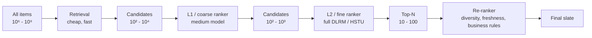

# Module 13 — The Funnel: Retrieval → Ranking → Re-ranking

> Every large-scale recommender, ad system, search engine, and marketplace is a **funnel**. Different stages of the funnel run different models with different latency budgets. Knowing where to put which compute is the architect's core decision.

---

## 1. Why the funnel exists

A single model that ranks all 100M items with a deep ranker would cost ~100 days per request. Even with massive parallelism that breaks the latency budget. The funnel splits the problem:



Each stage:
- Scores **fewer items**
- With a **more expensive model**
- For **richer features**

The result: end-to-end latency budget is met because expensive computation only runs on already-filtered candidates.

---

## 2. Latency budgets at each stage

Typical end-to-end p99 budget for a consumer feed: **200-500 ms**. Allocation:

| Stage | Items in | Items out | Compute / item | Total |
|-------|----------|-----------|----------------|-------|
| Retrieval | 10⁶-10⁹ | 10³-10⁴ | n/a (ANN) | 10-30 ms |
| L1 ranking | 10³-10⁴ | 10²-10³ | Light deep model | 5-20 ms |
| L2 ranking | 10²-10³ | 10² | Full deep model | 20-50 ms |
| Re-ranking | 10² | 20 | List-aware logic | 5-15 ms |
| Feature fetch + serialization | n/a | n/a | KV lookups | 10-30 ms |
| Logging | n/a | n/a | async | < 5 ms |

Total: ~100-200 ms inside the recsys; remaining budget goes to network, edge, frontend.

---

## 3. Retrieval — the candidate-generation stage

Retrieval's job: from the entire item universe, return ~1000 candidates with high recall.

The dominant retrieval patterns (Module 14 has details):
- Two-tower with ANN.
- Item-to-item lookup ("more like the user's recent items").
- Graph walks (Pinterest, LinkedIn).
- Popularity / trending.
- Editorial / business-rule overrides.

Most production systems run **multiple retrievers in parallel** and union outputs. Why:
- Different retrievers catch different patterns.
- Single retriever failure mode (bug, latency spike, embedding drift) doesn't crater the whole funnel.
- Diversity at the source flows downstream.

### 3.1 The recall metric

Retrieval is judged on **Recall@k**: of items the user actually engaged with, what fraction did retrieval put in the candidate set?

- **Recall@100 ≥ 0.7** is a typical target.
- **Recall@1000 ≥ 0.9** is common for large-scale.

If retrieval recall is poor, no amount of clever ranking can recover.

### 3.2 The diversity trap

If your retriever only surfaces popular items, the ranker can only rank popular items. Long tail dies in retrieval.

Mitigations:
- Popularity-debiased retrievers (sample inversely by popularity).
- Explicit "fresh content" retrievers reserved for new items.
- Exploration retrievers (random samples from user's interests).

---

## 4. L1 ranking — the coarse pass

When you have 10⁴ candidates and a 100ms budget, you can't run the full ranker. L1 is a **lighter model** that trims to 10² - 10³.

Two common L1 designs:

### 4.1 Distilled ranker

Train a small model (a few-million-parameter MLP) to mimic the full ranker's predictions. Latency: ~1-5 ms per 1k items.

### 4.2 Two-tower with side features

The same two-tower retrieval model, with extra features at scoring time (recent context). Latency: depends on tower output dim.

### 4.3 Lightweight DLRM

A smaller DLRM with fewer embedding tables and a shallower MLP. Latency: ~5-20 ms.

At Meta and ByteDance, L1 is explicit and distinct from L2. At smaller companies, L1 is often folded into retrieval scoring or skipped.

---

## 5. L2 ranking — the fine pass

L2 is **the** ranker — the model your career is judged on. Typically:

- DLRM (Meta), DCN-V2 (Google), DIN+SIM (Alibaba), LiRank (LinkedIn), HSTU (Meta, 2024+).
- Multi-task heads: pCTR, pSave, pComplete, pConversion, plus negative heads (pDismiss, pAbandon).
- A value model combines task probabilities into a scalar ranking signal.

### 5.1 Multi-task value model

```
value(u, i) = w_click · pClick(u, i) + w_save · pSave(u, i) + w_complete · pComplete(u, i) − w_dismiss · pDismiss(u, i)
```

Weights are tuned **online** via A/B; they reflect business priorities, not ML-loss optima.

### 5.2 Calibration matters

If `pClick = 0.5` doesn't mean 50% click rate, then the value-model weights don't mean what they should. Hourly slice-level calibration (Module 2 §5) is non-negotiable for ads-adjacent ranking.

### 5.3 GPU vs CPU serving

DLRM-style rankers were CPU-served for years (sparse embeddings are bandwidth-bound). HSTU-class transformer rankers are GPU-served (dense matmul). The shift is happening in 2024-2026; tooling (Triton, vLLM-for-recsys, TorchServe with FBGEMM) is catching up.

---

## 6. Re-ranking — the slate-aware stage

The first two stages score items **independently**. But the final list quality depends on the list **as a whole**:

- Don't show three videos in a row from the same creator.
- Make sure ads appear at the right positions (not on top of organic).
- Cap the number of items per category.
- Inject freshness / exploration slots.
- Enforce business rules (no competitor ads, no expired listings, no recent purchases).

Re-ranking is where these constraints get applied.

### 6.1 MMR — Maximal Marginal Relevance

The simplest diversity-aware re-ranker:

```
score(i) = λ · sim(i, query)  -  (1 - λ) · max_{j in selected} sim(i, j)
```

Greedy: at each step, pick the item that maximises this score. `λ` controls the relevance-diversity trade-off.

### 6.2 DPP — Determinantal Point Processes

A more principled approach. Each subset of items has a probability proportional to the **determinant** of a kernel matrix. High determinant ↔ items are spread out in the kernel space ↔ diverse.

Used at YouTube, Meta, Hulu for slate diversity. The kernel is typically a learned ranker output times a similarity matrix.

### 6.3 Lagrangian constraint solving

When you have multiple hard constraints (ads load ≤ 5/page, max 2 items per creator, freshness ≥ 30%), formulate as a **constrained optimization**:

```
maximize Σ_i score(i)  subject to  Σ_i a_ij · 1{i selected} ≤ b_j  for each constraint j
```

Lagrangian relaxation: convert constraints into penalties, solve unconstrained. Dual variables (Lagrange multipliers) get updated online from observed slate compositions.

### 6.4 Business rules and overrides

The unsexy part:
- Editorial pins ("Apple News' Top Stories").
- Contractual carousels (this brand pays for slot 1 in this region).
- Compliance (no adult content for minors; geo-restricted licensing).
- Recency caps ("don't show the same item again within 24h").

These typically apply *after* the ML scoring, as a filter pass.

---

## 7. Logging — the loop back

Every impression must be logged with enough context to:

- Train future models (impression + click outcome).
- Run off-policy eval (model version + scores + bucket).
- Debug production issues (feature snapshot, model version).
- Compute business metrics (revenue attribution, conversion).

A modern logging schema:

```yaml
event_id:        uuid
timestamp:       ISO8601
user_id:         hashed
session_id:      string
surface:         home_feed | search | autoplay | push | ...
slot_position:   int
item_id:         string
score:           float
model_version:   string
experiment:      { bucket_id, variant_id }
exploration:     bool
features_logged: { snapshot of key features }
action_outcome:  click | play | save | dismiss | conversion (filled in later)
```

The downstream pipelines join this with conversion events (via watermarked windows), producing training data.

---

## 8. Failure modes and degradation

The funnel needs graceful degradation when stages fail.

| Stage failed | Mitigation |
|--------------|------------|
| Retrieval timeout | Serve cached top items / popular fallback |
| L1 ranker error | Bypass L1; pass all retrieval candidates to L2 (slower but works) |
| L2 ranker timeout | Use L1 scores; or random shuffle (better than empty page) |
| Feature store unavailable | Serve from cache; degrade to user-history-less version |
| Logging backpressure | Drop verbose features; keep essentials |

The first 5 minutes of an incident determine whether users see "Netflix is down" or "Netflix has slightly worse recommendations." The latter is recoverable.

---

## 9. Cost analysis

The funnel is also a cost optimisation. Roughly:

| Cost component | Driver |
|----------------|--------|
| Embedding tables (storage) | Item + user cardinality × embedding dim |
| ANN index (RAM + disk) | Item count × vector dim |
| L1 / L2 ranker inference (GPU / CPU) | Candidates × params per candidate |
| Feature store (RAM) | Online feature volume × QPS |
| Logging + training (storage + compute) | Events × features |
| A/B experimentation overhead | Concurrent experiments × variants |

A 2024 estimate for a 50M MAU consumer-internet recsys: $10-50M/year all-in. The funnel architecture exists to keep that bounded.

---

## 10. Sanity check

1. Why can't a single model just rank all 10⁹ items per request, even on GPU?
2. Your retrieval stage has Recall@100 = 0.3. What does this tell you about the cap on your ranker's possible improvement?
3. The L2 ranker outputs pCTR ≈ 0.6 for every candidate but the items are obviously different in quality. What's gone wrong?
4. Three creators have produced 80% of recent home-feed items in a user's session. Which stage of the funnel should fix this and how?
5. Your retrieval timeouts spike under load. What's a sensible degradation path that doesn't return an empty page?
