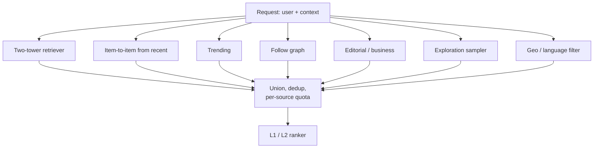
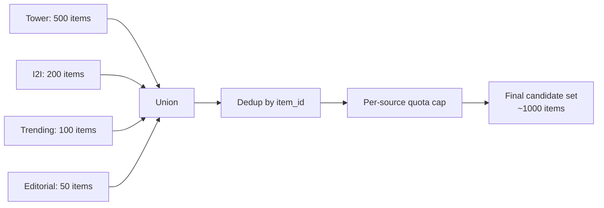

# Module 14 — Candidate Generation Systems

> Retrieval is where the funnel begins. In production, retrieval is rarely *one* retriever — it's a **mixture** of several specialised retrievers running in parallel, each tuned for different patterns. This module is the menu.

---

## 1. Why parallel retrievers

A single two-tower retriever can only learn one pattern: "items like the user's overall taste." But a session may need:

- Items semantically similar to the user's *just-clicked* item.
- New/fresh items the user has never seen.
- Trending items globally.
- Items that match an explicit filter (price band, geography, language).
- Items from creators the user follows.
- Items recommended by social graph signal.
- Surprise/exploration items.

No single retriever covers all of these. Production systems run **5-15 parallel retrievers** and union their outputs.



---

## 2. The dominant retrievers

### 2.1 Two-tower / embedding retrieval

Module 10 has the details. The workhorse — covers ~50-70% of recall in most systems.

### 2.2 Item-to-item (kNN)

For each item the user recently engaged with, fetch its top-k similar items. Aggregate. This is the Amazon "Customers who bought X also bought Y" pattern.

Implementation: an item-item similarity matrix (Module 6 §3) stored in a KV store; lookup keyed on `item_id`.

Strengths:
- Captures *short-term* taste (what the user is doing right now).
- Doesn't need a user vector — works even on the first session.

Weaknesses:
- Filter bubble: only surfaces items similar to history.
- Cold-start items: no neighbors yet.

### 2.3 Sequential / next-item retrieval

A sequence model (SASRec, BERT4Rec) produces a user vector conditioned on the recent sequence, retrieves top-K via ANN.

Strengths:
- Captures order ("just watched episode 1 → suggest episode 2").
- Adapts within a session.

### 2.4 Graph-walk retrievers

Random walks on user-item / item-item / user-user graphs propagate signal through multi-hop neighborhoods.

Pinterest, LinkedIn use these heavily. The "PinSage embeddings" themselves come from graph-walk training; retrieval uses the resulting vectors.

### 2.5 Popularity / trending

Sorted by global engagement in a recent window (15 min, 1 hour, 24 hour). Multiple granularities for different surfaces.

Tricks:
- Geo-segmented: "trending in your country."
- Demographic-segmented: "trending for users like you."
- Cohort-segmented: "trending among your age band."

Cheap, robust, catches viral moments.

### 2.6 Follow / social graph

For social platforms (LinkedIn, Meta, X, Pinterest's follow graph): items from accounts the user explicitly follows. Often a hard inclusion (user expects to see their friend's post).

### 2.7 Search / query retrieval

When the user types a query: BM25 + dense retrieval (hybrid), often the same architecture as a search engine. Modules 5 (RAG topic) covers this in depth from the LLM angle.

### 2.8 Editorial / business-logic

Hand-curated lists:
- Apple News Top Stories.
- Spotify editorial playlists.
- Netflix "Top 10 in your country today."
- Brand-paid carousels.

These are non-personalized at the source but the ranker can re-order them per-user.

### 2.9 Exploration sampler

A small fraction of retrieved items are *random* or *uncertain*. The model needs this for:
- Discovering items it doesn't know are good (off-policy learning).
- Avoiding feedback-loop collapse.
- Bootstrapping cold-start items.

Typical: 1-5% of slots reserved.

### 2.10 Frequently-bought-together / cart retrievers

E-commerce specific. Given current cart contents, retrieve items that frequently complement them. Often a separate item-item co-occurrence index.

---

## 3. Union, dedup, and quota

After parallel retrievers return their candidates, the funnel must merge them.



### 3.1 Dedup

The same item often appears in multiple retrievers. Keep one copy with the best (max) score, and tag with all source retrievers.

### 3.2 Per-source quotas

Without quotas, one retriever dominates. Common pattern:

```yaml
quotas:
  tower:       max 500
  i2i:         max 200
  trending:    max 100
  editorial:   max 50
  social:      max 200
  exploration: max 30
```

Tuned per surface, A/B tested.

### 3.3 The mixing weight problem

Items from different retrievers have *incompatible* scores (a two-tower cosine and a graph-walk probability live in different scales). The ranker downstream re-scores them all anyway, but the *initial* selection still depends on the cap-per-source.

Some teams normalize per-source scores (min-max or z-score within retriever) before union; others rely entirely on the L1 ranker to score on a common scale.

---

## 4. Indexing infrastructure

### 4.1 ANN indexes

The dominant retrieval backbone. FAISS, HNSW, ScaNN, DiskANN. Module 10 covered the trade-offs.

Latency at scale: 5-30 ms for k=1000 from 100M items.

### 4.2 Item-item lookup

A KV store (Redis, DynamoDB, ScyllaDB) keyed on `item_id`, value is the top-k similar items. Lookup latency: 1-3 ms.

### 4.3 Trending / counter stores

Streaming aggregators (Flink, Spark Streaming) maintain windowed counters; results stored in Redis or BigTable. Refreshed every 1-15 minutes.

### 4.4 Inverted index

For BM25 / sparse retrieval. Elasticsearch, OpenSearch, Vespa.

### 4.5 Editorial registry

A versioned KV table mapping (surface, region, time) → list of editorial item IDs.

---

## 5. Refresh cadence

Different retrievers have different refresh cadences:

| Retriever | Refresh cadence |
|-----------|-----------------|
| Two-tower | User vector: real-time; item vectors: hourly to daily |
| Item-to-item | Nightly batch usually |
| Trending | 1-15 minutes |
| Editorial | On demand (CMS update) |
| Sequence model | User vector: real-time |
| Exploration sampler | Stateless |

The system needs to handle this **multi-cadence** reality. A common pattern: every retriever exposes a "max staleness" SLA; serving infra alerts if exceeded.

---

## 6. Cold start at the retrieval stage

### 6.1 Cold user

A user with < 10 lifetime events has no useful embedding. Strategies:
- Tower has a "no-id" branch using only context features.
- Onboarding asks for explicit interests; map to seed items.
- Heavy exploration in the first session.
- Demographic / geographic priors.

### 6.2 Cold item

A new item has no interaction signal. Strategies:
- Item tower uses content features (text, image, audio embeddings).
- Reserve exploration slots for new items.
- Bootstrap with seller / creator priors.
- Editorial bootstrap (new artist gets a spot in "Fresh Finds").

### 6.3 New surface

A brand-new product surface (e.g., Spotify just launched podcasts) has no logged data. Strategies:
- Transfer from related surfaces.
- Heavy editorial seeding.
- Faster exploration regime than mature surfaces.

---

## 7. Negative retrieval — knowing what to *exclude*

Some items must *not* appear:

- Items the user has already interacted with (in some contexts).
- Items currently out of stock / unavailable in user's region.
- Items violating the user's content preferences (kids profile, explicit filter).
- Recently shown items (to avoid fatigue).
- Items the user explicitly disliked / blocked.

Implemented as a **filter pass** post-retrieval, before ranking. Bloom filters and roaring bitmaps are common implementations.

---

## 8. Multi-task retrievers

A two-tower model trained with a single objective (e.g., click) optimizes for that signal. For multi-objective ranking downstream, you may want **multi-task retrieval**:

- Train multiple towers each with different objectives.
- Or train one tower with multi-task loss.
- At serving, query each tower and union.

Pinterest and Meta both use multi-task retrieval — separate retrievers for "ranking-style" and "engagement-style" signals.

---

## 9. The 2024-2026 frontier: generative retrieval

TIGER (Module 12) replaces ANN retrieval with **autoregressive generation of semantic IDs**. The retrieval stage becomes a transformer decode call instead of an ANN lookup.

Status:
- Google deployed in some surfaces.
- Pinterest's LIGER.
- Meta's Andromeda uses generative retrieval.
- Tens of papers in 2024 on variants.

Production trade-offs:
- Better cold-start (content embeddings inherent).
- More expressive but heavier per request.
- Different infrastructure (KV cache, attention kernels, GPU).

The future likely combines ANN for hot-path retrieval with generative for cold and tail.

---

## 10. Sanity check

1. Why not just one two-tower retriever?
2. Your "trending" retriever pushes the same 50 items to every user in the country. What's the ranking trade-off, and how would you mitigate it?
3. When merging candidates from 5 retrievers with different score scales, how do you decide which item ranks higher?
4. A user's last 10 clicks are all on creator A. Without explicit anti-creator-monopoly logic, what happens to the next slate?
5. Why do production teams reserve 1-5% of slots for random/exploration items?
6. What's the cold-start behavior of a pure ANN retriever for a brand-new item, and how is it fixed?
