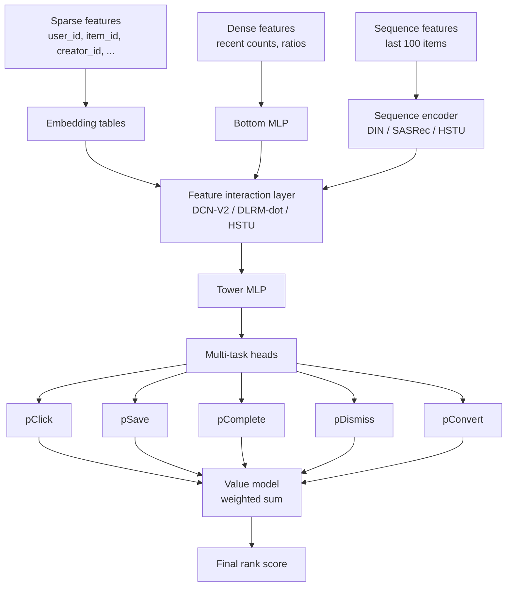

# Module 15 — Ranking & Multi-Task Learning

> Module 13 said "the L2 ranker is where careers are made." This module is the inside view: what L2 actually is, how it handles multiple objectives, and why calibration is non-negotiable.

---

## 1. The L2 ranker — what's inside

The L2 ranker takes a candidate set of ~100-1000 items + user + context and produces a fine-grained score per (user, item) pair.



Three architectural pieces:
1. **Embedding + interaction layer** (DCN-V2, DLRM, HSTU).
2. **Multi-task heads** producing per-task probabilities.
3. **Value model** combining task probabilities into a scalar.

---

## 2. Multi-task learning

A single-objective ranker (just optimize CTR) is a 2014-era design. Modern rankers predict multiple things at once.

### 2.1 Why multi-task

- **Single-objective optimization breaks**: maximize CTR → clickbait. Maximize watch time → endless slow drama. Multi-objective forces balance.
- **Task transfer**: a model trained on 10 related tasks generalises better than one trained on 1 task.
- **Reduced model count**: 1 multi-task model is cheaper than 10 single-task models.

### 2.2 Negative-transfer risk

Tasks can conflict. Aggressive click optimization can hurt save/complete. Two tasks "fighting" for the same parameters can perform worse than two separate models.

The architecture innovations below all aim to prevent negative transfer.

---

## 3. Shared-bottom (the baseline)

```
shared_repr = MLP(features)
y_1 = head_1(shared_repr)
y_2 = head_2(shared_repr)
...
```

All tasks share the bottom MLP. Cheap. Works fine if tasks correlate. **Fails** when tasks conflict — gradients pull the shared bottom in different directions.

---

## 4. MMoE — Multi-gate Mixture of Experts (Ma et al. KDD 2018, Google)

Replace the shared bottom with multiple **expert** networks; each task has its own **gate** that learns a soft routing over experts.

```
experts = [MLP_1, MLP_2, ..., MLP_K]
e = [expert(x) for expert in experts]

for task t:
    gate_t = softmax(W_t · x)         # (K,)
    task_repr = Σ_k gate_t[k] · e[k]
    y_t = head_t(task_repr)
```

Each task's gate learns "I should listen to experts 2 and 5, not 1 and 3." Different tasks can use different expert mixtures → reduced interference.

Deployed at YouTube (Zhao et al. RecSys 2019, the multi-task ranking paper). Now standard.

---

## 5. PLE — Progressive Layered Extraction (Tang et al. RecSys 2020, Tencent)

MMoE has one expert pool shared across tasks. PLE makes explicit:

- **Task-specific experts** (only used by task t).
- **Shared experts** (used by all tasks).

Each task's gate routes over (its specific experts + shared experts). The shared experts capture cross-task signal; the specific experts capture task-unique signal.

Tencent reported PLE outperforms MMoE on all metrics. Common in Chinese tech (Tencent, Kuaishou).

---

## 6. STAR and PEPNet — multi-domain ranking

When a single ranker must serve multiple **domains** (e.g., e-commerce + ads + content):

### 6.1 STAR (Sheng et al. CIKM 2021)

Star topology: a shared central parameter set + domain-specific parameter sets that branch off.

For each (input, domain) pair, the effective weight is `W_shared * W_domain`.

### 6.2 PEPNet (Chang et al. KDD 2023)

Personalised modulation:
- **EPNet** (embedding personalised): a gate per domain modulates the input embeddings.
- **PPNet** (parameter personalised): a gate per domain modulates the network parameters.

Used at Kuaishou.

---

## 7. Multi-task losses

The simplest combination:

```
L = w_1 · L_1 + w_2 · L_2 + ... + w_n · L_n
```

Where each `L_i` is binary cross-entropy for task i.

### 7.1 Task weighting

Manual: pick `w_i` based on relative scales and business priorities.

Adaptive:
- **Uncertainty weighting** (Kendall et al. CVPR 2018): learn `w_i = 1/σ_i²` as parameters; tasks with higher loss noise get less weight.
- **GradNorm** (Chen et al. ICML 2018): normalize gradient magnitudes across tasks.
- **DWA** (Dynamic Weight Averaging, Liu et al. CVPR 2019): weight by recent loss decrease rate.

In practice, manual weighting tuned via online A/B is most common — adaptive methods rarely deliver clear wins.

### 7.2 ESMM — Entire Space Multi-task (Ma et al. SIGIR 2018, Alibaba)

A specific trick for the click → conversion problem:

```
pCTR(x)   = P(click | impression, x)
pCTCVR(x) = P(click & convert | impression, x)
pCVR(x)   = pCTCVR / pCTR     # derived, not directly trained
```

Both `pCTR` and `pCTCVR` are trained over the **entire impression space**. `pCVR` is *never trained directly* — avoids the sample-selection bias of training CVR only on clicks.

Foundational for ads. Module 26 covers in depth.

---

## 8. The value model

Multi-task predictions need to be **combined** into a single ranking score:

```
value(u, i) = w_1 · p_1 + w_2 · p_2 + ... + w_n · p_n
```

The weights `w_i` are usually **set manually** and tuned via online A/B. They encode business priorities:

- Netflix: how much do we care about play vs save vs satisfaction?
- TikTok: finish vs like vs share vs follow?
- Amazon: click vs purchase vs return-rate vs profit margin?

### 8.1 Why weights matter more than model architecture

A 5% weight change on the value model often produces more business impact than a 1% AUC improvement in the model. The model is the substrate; the weights are the steering wheel.

### 8.2 Personalised value weights

Some teams personalise the weights per user (different users have different preferences for engagement vs satisfaction). Implemented as another gating network in the model.

### 8.3 Calibration is required

If `pSave` returns 0.5 but actual save rate is 0.1, then `w_save * pSave` is overweighted by 5×. The whole value calculation breaks. Hence Module 2 §5 calibration.

---

## 9. Reward shaping for long-term value

Short-term metrics (click, watch time) don't capture long-term retention. The fix:

### 9.1 RL with off-policy correction

Treat each session as a trajectory; reward is long-horizon engagement. YouTube's Top-K off-policy correction paper (Chen et al. WSDM 2019) is the canonical reference (Module 4 §4.5).

### 9.2 Surrogate index methods

Athey, Chetty, Imbens 2019. Predict long-term outcomes from short-term proxies via held-out cohorts. Common at Netflix, Facebook, Uber.

### 9.3 Counterfactual long-term metrics

Long-running A/B with permanent holdouts (Airbnb, Booking) — the only honest measure of "did this change actually help retention 30 days out."

---

## 10. The Slate / list-aware ranker

Standard rankers score items independently. But the user sees a slate. Items can be *complements* (a similar series and its sequel) or *substitutes* (two near-duplicate items).

### 10.1 Slate-aware scoring

The score of item i depends on what else is on the slate:

```
score(i | S) = base(i) - λ · sim(i, S)
```

Captures diversity. Used as a re-ranking step (Module 13 re-ranker).

### 10.2 RL on slates

SlateQ (Ie et al. IJCAI 2019) decomposes slate-MDP into per-item Q-functions with a known combination rule (e.g., user attention is divided softmax over slate). Tractable RL for slates.

---

## 11. Industry summary

| Company | Ranker architecture | Multi-task framework |
|---------|---------------------|----------------------|
| YouTube | DCN-V2 + MMoE | engagement + satisfaction |
| Meta | DLRM → HSTU (2024+) | DHEN-family ensemble + multi-task |
| TikTok | Multi-task DLRM + PLE | finish, like, share, comment, follow |
| LinkedIn | LiRank (DCN + dense gating + isotonic calib) | click, dwell, reaction, comment, share, follow |
| Netflix | Foundation Model + per-surface heads | play, complete, save, satisfaction |
| Alibaba (ads) | DIN/SIM family + ESMM | CTR + CVR |
| Pinterest | Multi-task DLRM | engagement + creator-side metrics |

---

## 12. Sanity check

1. Why does single-objective CTR optimization eventually break a recsys?
2. MMoE replaces a shared bottom with experts and per-task gates. Why does this reduce negative transfer?
3. The value model combines multi-task probabilities with weights `w_i`. Why must each `p_i` be calibrated for this to be meaningful?
4. ESMM avoids training CVR directly. What bias does this avoid?
5. A 1% AUC improvement in your ranker vs a 5% weight change in the value model — which is likely to produce more business impact, and why?
6. Your ranker maximises short-term watch time and CTR. Retention is flat. What's missing from the loss?
