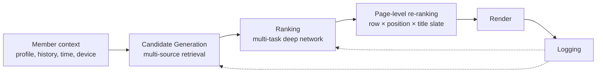

# Module 17 — Netflix

> The most-studied recommender system. Two decades of public engineering, three major architectural transitions, and a 2024-2025 consolidation onto a single Foundation Model that replaced dozens of bespoke models.

---

## 1. The five eras

| Era | Years | Dominant approach |
|---|---|---|
| Cinematch | 2000-2009 | k-NN + SVD over 5-star ratings |
| Post-Prize MF | 2010-2014 | SVD++, timeSVD++, learning-to-rank; "rows" abstraction emerges |
| Deep learning | 2015-2019 | Deep rankers, page-generation as a distinct problem, RNN session models |
| Contextual bandits | 2017-2021 | LinUCB / Thompson for artwork, billboard, row-order |
| Foundation Model | 2024-2026 | Single shared backbone trained on full member interactions, fine-tuned per surface |

The defining lesson: the Netflix Prize (won on RMSE) **was never deployed** because rating prediction is decorrelated from retention. Implicit signals — play, complete, abandon — became the basis of every Netflix model after 2010.

---

## 2. The three-stage funnel today

### 2.1 Candidate generation

Multiple parallel retrievers:
- Two-tower (user × title) ANN.
- Item-item retrievers seeded on recent plays ("Because you watched X").
- Graph-walk over the co-watch graph.
- Popularity / Top-10-in-your-country.
- Editorial / business-logic (new releases, contractual carousels).
- Exploration sampler.

### 2.2 Ranking

A multi-task deep network with heads for:
- Play (binary).
- Quality of play (weighted by watch time).
- Save / My List.
- Thumbs (up/down/double).
- Negative: abandon, dismiss.

Combined into a **utility score**. Weights are A/B-tuned by product, not derived from a paper.

### 2.3 Page-level re-ranking

The home page is **2D** — themed rows × titles per row. Three optimisation problems solved jointly:
- **Which rows** to show (themes).
- **Top-to-bottom row order**.
- **Within-row title order**.

A slate-level model scores (row_type × position × title) tuples subject to constraints (no duplicates across visible rows, diversity, license region masking).

---

## 3. The 2024-2025 Foundation Model

The biggest architectural shift this decade. From "model zoo" (dozens of siloed models per surface) to a shared backbone.

[Netflix Tech Blog, March 2025](https://netflixtechblog.com/foundation-model-for-personalized-recommendation-1a0bd8e02d39).

### 3.1 What it is

A decoder-style transformer trained on sequences of member events (play_start, play_complete, search, browse, thumbs, add-to-list), tokenised with title IDs + action / context tokens.

- **Long sequences**: years of history per member.
- **Sparse attention** and chunked training.
- **Shared user representation** consumed by downstream tasks (home ranking, search, similars, notifications, autoplay-next) as frozen embedding or via task-specific heads.

### 3.2 Why

- **Maintenance debt** of dozens of siloed models was killing velocity.
- **Cold-context generalisation** transfers from densely-observed neighbours.
- **Long-horizon signal** — years-old taste patterns that GBDTs missed.

### 3.3 What stayed separate

- Surface-specific heads.
- The artwork bandit (small action space, fast reward — bandits beat backbones).
- Kids profile (different catalog mask, different fine-tuned head).

---

## 4. Contextual bandits — artwork, billboard, row-order

Each title has 8-16 artwork variants (sometimes ~50 for tentpoles). Per impression, a contextual bandit picks one.

[Artwork Personalization at Netflix, 2017](https://netflixtechblog.com/artwork-personalization-c589f074ad76).

- Started as LinUCB with IPS replay (2017).
- Moved to neural contextual bandits with deep (member, title, candidate-image, page-context) representations.
- Still trained on logged-bandit data with IPS / doubly-robust correction.

Generalises to billboard module, top-row order, trailer/video preview selection.

**Engineering observation**: bandits give principled exploration because the regret of a bad thumbnail is small and the reward is fast (seconds-to-minutes).

---

## 5. Cold start

- **New member**: onboarding asks for liked titles → maps to joint embedding space → warm-starts ranking. Editorial popularity priors fill the first session.
- **New title**: content features (genre, plot-text via sentence encoder, cast/crew graph embeddings, trailer video embeddings) feed the item tower. Foundation model initialises the new title's token from content features.
- **Kids profile**: hard-separated at the data layer — different catalog mask, different ranker fine-tuned on a kids subset.

---

## 6. Data and scale

- ~260M paid members (2024 figure).
- ~100B+ playback events per month.
- Trillions of (member, impression, action) tuples per training run.
- The single best signal: **quality of play** (completed vs abandoned < 5 min vs replayed).

---

## 7. Tech stack (publicly known)

| Layer | Tool |
|---|---|
| Data lake | Apache Iceberg on S3 (Netflix co-originated Iceberg) |
| Batch | Apache Spark on AWS |
| Streaming | Apache Flink + Kafka |
| Workflow orchestration | Maestro (Netflix OSS, 2024; replaced Meson) |
| ML workflows | Metaflow (Netflix OSS) |
| Feature store | Internal (Axion / Atlas-derived) |
| Model serving | Internal TF/PyTorch on Titus (container platform) |
| Experimentation | XP (internal; A/B + interleaving + holdouts) |
| ANN | FAISS-based + internal serving |

---

## 8. Evaluation discipline

Three tiers:

1. **Offline**: NDCG@k / AUC / recall@k on logged data.
2. **Counterfactual replay**: IPS / DR estimators for bandit policies.
3. **Online A/B + interleaving** on long-horizon (multi-week) retention proxies.

**Interleaving** is Netflix's signature contribution: take each session, interleave rankings from both policies on the same page, attribute plays to whichever policy contributed the played title. ~100× the statistical power of bucket A/B for ranking comparisons. ([Netflix blog](https://netflixtechblog.com/interleaving-in-online-experiments-at-netflix-a04ee392ec55).)

---

## 9. Publicly discussed challenges

1. **Position bias** — PAL two-tower, IPS reweighting, randomisation sweeps.
2. **Content valuation** — licensed-title plays cost more than owned-content plays → utility function balances satisfaction vs cost.
3. **Multi-stakeholder objectives** — members vs business vs creators vs editorial.
4. **Long-term vs short-term** — clickbait thumbnails inflate play but hurt completion/retention.
5. **Cold-context generalisation** — less-active members, new geographies, new device types.

---

## 10. Interview talking points

- The progression from RMSE → implicit signals → multi-task → foundation model is the canonical recsys evolution.
- Netflix open-sources its infrastructure (Iceberg, Metaflow, Maestro) — these are credentials for AI architects discussing data-lake and orchestration design.
- Interleaving is a useful "I know more than the median candidate" mention.
- The Foundation Model paper (2025) is the most current signal of where serious teams are heading.

---

## 11. Sanity check

1. Why did Netflix never deploy the winning Netflix Prize solution?
2. The 2024-2025 Foundation Model unified many bespoke models. What did *not* get unified, and why?
3. Why does Netflix run a bandit for artwork instead of the same DLRM-style ranker that orders rows?
4. Interleaving gives ~100× sample efficiency vs bucket A/B for ranking comparisons. Why?
5. A Netflix engineer says "the model is great offline but our long-term retention isn't moving." What part of their eval is missing?
