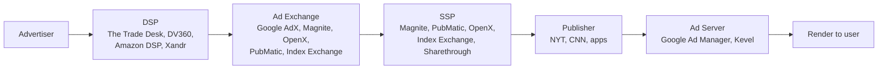

# Module 25 — Ads Foundations: Auctions & Economics

> **Ads is mechanism-design first, ML second.** The auction defines what the model must optimise. Truthful (VCG) makes value-based bidding tractable; non-truthful (GSP, first-price) requires equilibrium reasoning. An architect who doesn't understand the auction can ship a "better CTR model" that destroys revenue.

---

## 1. Generalized Second Price (GSP) — the Google AdWords default

GSP was the workhorse of search advertising from ~2002 (Overture/GoTo, then Google AdWords) until the late 2010s for some surfaces.

In GSP with k slots, advertisers submit per-click bids. Slots sorted by **ad rank**:

```
ad_rank = bid × pCTR × quality_components
```

The advertiser in slot `i` pays the **minimum bid required to keep their position** (i.e., to outbid slot i+1):

```
price_i = (bid_{i+1} × ad_rank_{i+1}) / ad_rank_i + $0.01
```

### 1.1 Why Google chose GSP

- **Truthful** only in the single-slot case (where GSP = Vickrey). For ≥2 slots GSP is **not** incentive-compatible — but it has a "locally envy-free" Nash equilibrium (Edelman, Ostrovsky, Schwarz 2007).
- **Simple to explain**: "you pay one cent more than the next bid."
- Historically generated more revenue than VCG with naive bidders.
- Robust to small misreporting.

### 1.2 GSP's fragility

- Cross-slot externalities aren't priced — adding a top ad changes the value of every lower slot.
- Doesn't generalise to multi-item / multi-objective auctions with cascade/position-bias effects.
- Bidders need to know other bidders' bids/quality scores to play equilibrium.

---

## 2. VCG (Vickrey-Clarke-Groves) — Meta's 2018 switch

VCG generalises the second-price auction to multi-unit / combinatorial settings and is **truthful in dominant strategies** — each winner pays the **externality** they impose on others.

```
payment_i = (welfare to others if i did not bid) − (welfare to others given i is present)
```

### 2.1 Why Meta switched in 2018

- Multi-objective system: total value = bid × pCTR + estimated quality + action-specific value. Combinatorial externalities matter.
- Truthfulness — advertisers bid their true value of a conversion. Makes value-based bidding (Advantage+) tractable.
- Plays better with auto-bidding: if the platform bids on behalf of the advertiser, the mechanism shouldn't punish revealing true value.

### 2.2 Trade-off

VCG can leave revenue on the table relative to GSP under certain priors. Meta combats this with reserve prices and personalised minimum bids for low-quality ads.

---

## 3. First-price auctions and the 2017-2019 header-bidding shift

The display ecosystem moved from second-price to **first-price** between roughly 2017-2019, driven by **header bidding**.

### 3.1 Why the shift

- Header bidding (Prebid.js, 2015-2017) ran SSPs in parallel before the ad server call, eliminating Google AdX's "Last Look" advantage.
- Once SSPs ran in parallel, the math broke for second-price: an SSP doing internal second-price would send the second-highest bid to the ad server, where it competed with other SSPs' first-highest bids.
- Result — between 2017-2019 essentially all open-web display moved to **first-price**.

Timeline:
- **2017**: Rubicon (now Magnite) first-price.
- **2018**: AppNexus (now Xandr/Microsoft) first-price.
- **September 2019**: Google AdX unified first-price — the most consequential single event in programmatic display.

### 3.2 Consequence: bid shading

In first-price, you pay what you bid. DSPs deploy **bid shaders** — ML models that predict the minimum winning bid distribution and discount the advertiser's bid accordingly:

```
shaded_bid = predicted_min_winning_bid × (1 + safety_margin)
```

The Trade Desk's "Koa", Google DV360's autobidder, Amazon DSP all run shaders. Typical shading discount: 10-40% off unshaded bid. Trained on auction win/loss feedback (censored regression / survival).

---

## 4. pCTR × bid, eCPM, Quality Score — the lingua franca

| Concept | Formula | Notes |
|---|---|---|
| **eCPM** | `1000 × bid × pCTR` (for CPC) | Common scale across CPC/CPM/CPA bids |
| **pCTR** | predicted click-through rate | Core ML output |
| **pCVR** | predicted conversion rate | Used when advertisers bid CPA / value |
| **Ad Rank (Google Ads)** | `bid × pCTR × quality + ad-extensions impact` | |
| **Quality Score** (1-10) | exposed to advertisers; derived | Diagnostic — not the actual ranking variable |
| **Total Value (Meta)** | `bid × estimated action rate + estimated quality + estimated user value` | |

For value-based bidding (tROAS, value optimisation):
```
score = pCVR × predicted_value × quality_multipliers
```

---

## 5. Reserve prices and floor pricing

- **Static floors**: hard $X CPM below which no impression sells.
- **Dynamic / Optimised floors** (Google Ad Manager): ML predicts the bid distribution per (placement × audience × time) and sets a personalised reserve to maximise expected revenue — the Myerson "virtual value" interpretation.
- **Unified pricing rules** (Google AdManager, 2019+): publishers must set the same floor for AdX and external bidders.

Myerson 1981 ("Optimal Auction Design") underpins this. Cai, Daskalakis, Weinberg 2012 generalised to multi-dimensional settings.

---

## 6. The programmatic ecosystem — DSP/SSP/DMP/Exchange



| Role | Function |
|---|---|
| Advertiser | Wants impressions |
| DSP | Buys impressions; runs bidders |
| Ad Exchange | Auction venue |
| SSP | Sells publisher inventory; calls DSPs via RTB |
| Publisher | Owns inventory |
| Ad Server | Decides which ad to render; manages direct deals |
| DMP | Audience segmentation (legacy) |
| CDP | First-party data unification — replacing DMPs |
| Verification | Brand safety, viewability, IVT (IAS, DoubleVerify, HUMAN) |
| Identity | LiveRamp ATS, ID5, UID2 |

Direct deal flavours over RTB: Programmatic Guaranteed (PG), Preferred Deals (PD), Private Marketplaces (PMP).

---

## 7. RTB and OpenRTB — sub-100ms latency

IAB Tech Lab OpenRTB (2.6 current, 3.0 in draft) defines the JSON request/response.

End-to-end timeline for an open-web display impression:

```
t=0ms     User page load fires bid request
t=10-30ms Prebid sends parallel bid requests to 10-20 SSPs
t=20-150ms Each SSP sends OpenRTB bid request to DSP partners
t=80-150ms DSPs return bids (timeout typically 100ms SSP, 80ms DSP)
t=200ms   SSP runs auction, returns top bid to header
t=250ms   Prebid sets top bid as floor in GAM
t=300ms   GAM runs final auction, returns winning creative
t=400ms+  Creative renders, viewability/IVT pixels fire
```

A DSP bidder must respond in **~50-80ms** including network. Architecture:
- Feature lookups in RAM (Redis/Aerospike).
- Candidate generation via ANN (HNSW/IVF).
- One ranking model call.
- Calibration + shading.

Specs to know:
- IAB Tech Lab OpenRTB 2.6 / 3.0 — https://iabtechlab.com/standards/openrtb/
- `ads.txt` / `app-ads.txt` / `sellers.json` / SupplyChain Object — provenance.
- IAB Tech Lab GVL and TCF v2.2 — consent.

---

## 8. Brand safety, viewability (MRC), IVT

### 8.1 Viewability — MRC standards

- Display: ≥50% of pixels in view for ≥1 second.
- Video: ≥50% of pixels for ≥2 seconds continuous.
- Large display: ≥30% for ≥1 second.

### 8.2 IVT (Invalid Traffic)

- **GIVT (General IVT)**: known bots, datacenter traffic, declared spiders.
- **SIVT (Sophisticated IVT)**: residential proxies, hijacked devices, click farms, ad stacking, pixel stuffing, domain spoofing.

### 8.3 Detection ML

- Device fingerprinting.
- Mouse-movement entropy.
- Time-on-page distributions.
- Conversion-funnel anomaly detection.
- Graph clustering on cookies/IPs.
- Sequence modeling of session events.

### 8.4 Brand suitability with LLMs

- URL-level content classification (DistilBERT, TinyLlama fine-tunes vs GARM categories).
- Video frame + transcript multimodal classification (CLIP + Whisper or unified models like Gemini Nano).
- Contextual relevance scoring beyond safety.

---

## 9. Where ML and mechanism design intersect

| Decision | Mechanism implication |
|---|---|
| Improve pCTR accuracy | Eligible-ad scoring changes; competition shifts |
| Improve pCTR **calibration** | Auction prices reset; revenue moves directly |
| Lower reserve prices | More impressions sold, lower average revenue per impression |
| Switch from second-price to first-price | Need bid shading; bidder behaviour changes |
| Add a new auction objective (e.g., publisher revenue + user satisfaction) | Multi-objective scalarisation; weights become product decisions |

The single most-likely-to-be-wrong assumption: **"better pCTR = better revenue."** Calibration breaks this; multi-objective breaks this; bidder reactions break this.

---

## 10. Sanity check

1. Why isn't GSP truthful for ≥2 slots, and what equilibrium concept describes how rational bidders play it anyway?
2. Meta switched from GSP to VCG in 2018. What advertiser behavior does VCG enable that GSP makes hard?
3. When the display industry moved to first-price, what new ML problem did DSPs have to solve?
4. eCPM is `1000 × bid × pCTR`. Why does pCTR appear, and what does it mean for an architect to "improve pCTR"?
5. The OpenRTB latency budget is roughly 100ms for the DSP. Name three architectural choices forced by this.
6. A teammate proposes improving pCTR AUC by 1% offline. Why might this not improve revenue?
