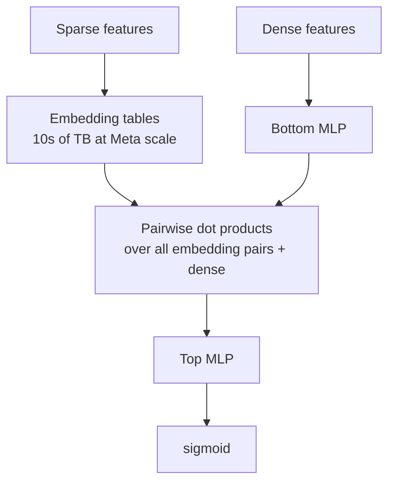

# Module 26 — CTR & CVR Prediction at Depth

> A 1% improvement in CTR prediction at Meta or Google is hundreds of millions of dollars per year. This module is the model zoo for ads: from FTRL-Proximal to HSTU, with the math, the pain points, and the production reality.

---

## 1. The shape of the problem

- **Input**: (user, ad, context) — 100-10,000 sparse categorical features plus dense features.
- **Output**: P(click) ∈ [0, 1].
- **Loss**: binary cross-entropy.
- **Calibration matters** — pCTR is consumed by an auction.
- **Scale**: Meta ranker embedding tables 10-100 TB; billions of examples/day; p99 inference < 30ms.

Foundational papers:
- Richardson, Dominowska, Ragno 2007 — "Predicting Clicks" (Microsoft).
- Graepel et al. 2010 — Web-Scale Bayesian CTR Prediction (Bing).
- He et al. 2014 (Facebook) — "Practical Lessons from Predicting Clicks on Ads at Facebook" (GBDT + LR stacking).

---

## 2. FTRL — Follow-The-Regularized-Leader (Google KDD 2013)

McMahan et al. "Ad Click Prediction: a View from the Trenches" — Google ran sponsored search CTR with a **single logistic regression on billions of hashed features**, learned online with FTRL-Proximal:

```
w_{t+1} = argmin_w ( z_t · w + (1/2) Σ σ_s ||w − w_s||² + λ_1 ||w||_1 + (1/2) λ_2 ||w||_2² )
```

Combines L1 sparsity with per-coordinate learning rates. The paper also covers:
- Feature hashing (Weinberger et al. 2009).
- Probabilistic feature inclusion (Bloom-filter-like).
- Confidence intervals on coefficients for exploration.
- Calibrated logistic loss.

FTRL-LR remained the production CTR model at Google for years and is still a bidder fallback at many DSPs due to microsecond inference.

---

## 3. Factorization Machines (FM) and Field-aware FM (FFM)

Module 7 §6 has the math.

- **FM** (Rendle 2010): generalises LR with low-rank pairwise interactions `⟨v_i, v_j⟩` between features.
- **FFM** (Juan et al. 2016, Criteo/NTU): each feature has *one embedding per field of the interaction partner*. Won Criteo, Avazu CTR competitions.

State of the art ~2014-2017. Replaced gradually by deep models that subsume their interactions.

---

## 4. Wide & Deep (Google Play, Cheng et al. DLRS 2016)

Wide LR over crosses (memorisation) + Deep MLP over embeddings (generalisation), jointly trained:

```
P(click) = σ( w_wide · x_wide + w_deep · a^(L) + b )
```

Used in Google Play app recommendations. Shipped as `tf.estimator.DNNLinearCombinedClassifier`. Pain: the Wide component needs hand-crafted feature crosses.

---

## 5. DeepFM (Huawei + HKUST, Guo et al. IJCAI 2017)

Replace the Wide component with an FM sharing embeddings with the Deep tower:

```
score = sigmoid( FM_part(emb) + DNN_part(emb) )
```

Eliminated manual cross-feature engineering. State-of-the-art for ~2 years.

---

## 6. xDeepFM (Microsoft, Lian et al. KDD 2018)

Introduces **Compressed Interaction Network (CIN)**:

- Layer-by-layer **vector-wise** interactions (not element-wise).
- Each layer takes outer products of previous-layer field embeddings × the initial layer.
- Produces explicit polynomial features up to bounded degree.

```
score = σ( linear + CIN_output + DNN_output )
```

More expressive than FM but heavier; in practice hard to tune.

---

## 7. AutoInt (Song et al. CIKM 2019)

Replace explicit feature crosses with **multi-head self-attention** over field embeddings.

Strong on benchmarks. Practical wrinkle: self-attention is O(n²) in number of fields; painful when you have 100+ fields.

---

## 8. DCN-V2 (Google, Wang et al. WWW 2021)

The current Google production form of Deep & Cross Network.

The cross-layer:

```
x_{l+1} = x_0 ⊙ (W_l x_l + b_l) + x_l
```

- `x_0` is the initial embedding-concat vector.
- Each cross layer adds one degree of polynomial interaction.
- L layers → polynomial features up to degree L.

DCN-V2 uses a **full matrix** `W_l` with low-rank factorisation. Used in production at YouTube ranking and Google Ads.

The "practical lessons" section of the WWW 2021 paper is mandatory reading.

---

## 9. FiBiNet, MaskNet — feature reweighting

- **FiBiNet** (Huang et al. RecSys 2019) — SENet (squeeze-and-excitation) computes a per-field weight for each field embedding; bilinear feature interaction after reweighting.
- **MaskNet** (Wang et al. DLP-KDD 2021) — multiplicative masking blocks; MaskBlock multiplies element-wise instead of adding residual.

Typically add ~5% AUC at ~10% extra compute on industrial CTR datasets.

---

## 10. DLRM (Meta, Naumov et al. 2019)

Module 8 §8 covered. The architecture is canonical:



The systems engineering (TorchRec, FBGEMM, ZionEX, MLPerf benchmark) matters more than the architecture itself.

---

## 11. The Alibaba sequence-conditioning lineage (DIN → SIM → TWIN)

The most influential industrial line in ads ML. Module 9 §6 covered.

| Model | Year | Key idea | Sequence length |
|---|---|---|---|
| DIN | 2018 | Target-aware attention over user history | ~50 |
| DIEN | 2019 | GRU + attention for interest evolution | ~50 |
| BST | 2019 | Transformer encoder over behaviors | 50-100 |
| MIMN | 2019 | Memory network, async User Interest Center | ~1000 |
| SIM | 2020 | Two-stage: hard / soft search + DIN | 10k-50k |
| ETA | 2021 | End-to-end retrieval with SimHash LSH | ~10k |
| TWIN | 2023 (Kuaishou) | Unified target-aware attention | >100k lifelong |
| TWIN-V2 | 2024 | Hierarchical clustering + cluster attention | lifelong |
| **HSTU** | 2024 (Meta) | Generative recommender; replaces DLRM-style point-wise | tens of thousands |

---

## 12. ESMM — Entire Space Multi-task (Alibaba, Ma et al. SIGIR 2018)

Training CVR only on clicks creates sample-selection bias. ESMM jointly models:

```
pCTR(x)   = P(click | impression, x)
pCTCVR(x) = P(click & convert | impression, x)
pCVR(x)   = pCTCVR(x) / pCTR(x)         # derived, never directly trained
```

All trained over the **entire impression space**. CVR is recovered by division — avoids the bias of training CVR only on clicks (where the click was already conditioned on the prior model's score).

Foundational for ads. Follow-ups: ESM², HMoE, MMoE-CGC, AITM.

---

## 13. Delayed feedback — Chapelle 2014 and beyond

The conversion problem: click happens at `t=0`; conversion at `t=Δ` (seconds to 90 days). Labels are censored.

Foundational paper: Chapelle 2014 (Criteo) "Modeling Delayed Feedback in Display Advertising." Models delay as exponential survival; jointly learns p(convert) and p(delay ≤ now | convert).

Later treatments:
- Yasui et al. ICML 2020 — importance weighting between fresh and aged data.
- Ktena et al. 2019 (Twitter) — online training, fake-negative weighted loss.
- ES-DFM (Yang et al. AAAI 2021) — elapsed-time sampling distribution fitting.
- DEFER (Gu et al. KDD 2021) — elapsed feedback regions.

Production combo: short-window CVR (1h) + long-window CVR (30d) + bridging model `p(long | short)` per advertiser.

---

## 14. Multi-task: MMoE, PLE, AITM

- **MMoE** — Google KDD 2018. Shared experts + per-task gates. Module 15 §4.
- **PLE / CGC** — Tencent RecSys 2020. Task-specific + shared experts.
- **AITM** — Meituan KDD 2021. Adaptive information transfer for impression → click → conversion → purchase.

A typical Meta/Alibaba ranker predicts **5-20 outcomes** simultaneously: click, like, share, comment, dwell-time, follow, conversion, install, repeat purchase, churn-risk.

---

## 15. Calibration math — the critical piece for ads

| Technique | Description |
|---|---|
| **Downsampling correction** | `p_calib = p / (p + (1 − p) / w)` where w = downsample ratio |
| **Platt scaling** | `p_calib = σ(a · raw_score + b)` |
| **Isotonic regression** | Non-parametric monotonic mapping via PAVA |
| **Beta calibration** | 3-parameter beta CDF |
| **Sliced / multi-calibration** | Per (advertiser × placement × geo × time-of-day) |
| **Temperature scaling** | One scalar per task |
| **Field-aware calibration** (Pan 2020) | Per-feature calibration head |
| **Jointly-learned (LinkedIn LiRank)** | Isotonic head trained with the main model |

Calibration matters more in ads than ranking because **absolute pCTR sets the bid**. Production: ECE + bias monitor per slice every few minutes.

---

## 16. The 2023-2026 frontier: FinalMLP, HSTU, Wukong

- **FinalMLP** (AAAI 2023): a tuned two-stream MLP matches/beats DCN-V2, AutoInt, MaskNet. Architectural innovation in CTR is hitting diminishing returns.
- **HSTU** (ICML 2024, Meta): autoregressive transformer over user actions. 1.5T params. Replaces DLRM-style point-wise CTR with generative sequence prediction. Module 12.
- **Wukong** (ICML 2024, Meta): scaling laws for recsys — performance is power-law in compute, like LLMs.

**Multi-domain CTR**: STAR (Sheng et al. 2021), PEPNet (Chang et al. 2023). Module 15 §6.

---

## 17. Why CTR is hard — the eight pain points

1. **Sparsity** — most (user, ad) pairs have zero co-occurrence.
2. **Embedding table size** — 10-100 TB sharded across machines.
3. **Cold start** — content features, advertiser priors, MAML, dropout exploration.
4. **Calibration** — slice-monitored at the hour.
5. **Position bias / selection bias** — shallow tower trick, IPS.
6. **Distribution shift** — continual training with 15-min to few-hour delta retraining.
7. **Long-tail features** — bucket / hash / drop.
8. **Cross-task interference** — MMoE, PLE gating.

---

## 18. Sanity check

1. Why is FTRL-LR with billions of hashed features still relevant in 2026?
2. ESMM trains both pCTR and pCTCVR but never pCVR directly. What bias does this avoid?
3. DCN-V2's cross layer uses `x_{l+1} = x_0 ⊙ (W_l x_l + b_l) + x_l`. How does this differ from a plain MLP layer, and what does it capture?
4. Your CTR model has 0.85 AUC offline; calibration is 30% off in some slices. What does this break in production?
5. The Alibaba SIM/ETA/TWIN line solves lifelong sequence modeling. Why is "lifelong" valuable for ads CTR, beyond just "long history"?
6. HSTU replaces DLRM-style point-wise CTR with autoregressive sequence prediction. What's the most likely architectural casualty in the move?
