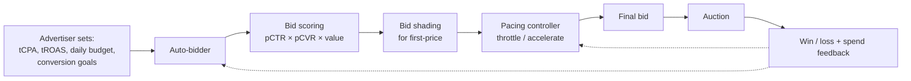

# Module 27 — Bidding, Pacing & Budget Control

> The auction picks the winner; bidding determines what to bid; pacing controls when to bid. Get any of the three wrong and the model is wasted.

---

## 1. The bidding stack



Four components, each with its own ML:
1. **Auto-bidding** — translates advertiser objectives into per-impression bids.
2. **Bid scoring** — computes expected value (pCTR × pCVR × value).
3. **Bid shading** — discounts the bid to avoid overpaying in first-price auctions.
4. **Pacing** — throttles or accelerates to hit budget over time.

---

## 2. Auto-bidding: tCPA, tROAS, value-based

Auto-bidding lets the advertiser say "get me conversions at $50 each" instead of bidding per-impression.

| Strategy | Goal | Math |
|---|---|---|
| **tCPA (target CPA)** | Maximise conversions at avg cost ≤ target | `bid = tCPA × pCVR` |
| **tROAS (target ROAS)** | Maximise revenue at ROAS ≥ target | `bid = (revenue × pCVR) / tROAS` |
| **Maximise Conversions** | Spend whole budget; max conversions | Internal auto-tune |
| **Maximise Conversion Value** | Spend whole budget; max revenue | Internal auto-tune |
| **Enhanced CPC** (deprecated 2024 in Google) | Bid adjustment of manual CPC | Multiplier on advertiser CPC |
| **Value-based bidding** | Advertiser sends conversion values; platform bids accordingly | Same as tROAS at the limit |

Production systems (Google Smart Bidding, Meta Advantage+ Auto Placement, TikTok Smart+) use ML to:
- Predict conversion likelihood per impression.
- Predict expected value per conversion.
- Solve the budget-constrained MDP to maximise total value.

---

## 3. Bid shading (first-price)

Module 25 §3.2 covered the basics. Algorithms:

### 3.1 Censored / Tobit regression

Observations: when you won, you know the bid is above the second-highest. When you lost, you know it's below the winning bid. Truncated normal regression handles this.

### 3.2 Survival / Cox PH

Model the "time until winning bid is below mine" as a survival problem.

### 3.3 Quantile regression

Predict the q-th quantile of the minimum winning bid distribution; bid at that quantile.

### 3.4 Bandit shading

Multiple shading multipliers as arms; UCB / Thompson over them.

References:
- Karlsson et al. 2020 — "Learning to Bid Optimally and Efficiently in Adversarial First-price Auctions."
- Gligorijevic et al. (Yahoo) 2020 — "Bid Shading in The Brave New World of First-Price Auctions."

Typical shading: **10-40%** discount off unshaded bid.

---

## 4. Budget pacing — keeping spend on track

### 4.1 The naïve approach: throttling

```
fraction_remaining_in_day = (24h − hour_now) / 24h
expected_remaining_value  = forecasted_remaining_impressions × pCVR_avg
should_bid_aggressively   = budget_remaining / expected_remaining_value
```

If `should_bid_aggressively` > 1, you're falling behind → bid more. If < 1, you're ahead → throttle.

### 4.2 PID controllers

A PID controller adjusts a bid multiplier to track a desired pacing curve.

```
error_t       = desired_spend_t − actual_spend_t
integral_t   += error_t · dt
derivative_t  = (error_t − error_{t-1}) / dt
multiplier_t  = K_p · error_t + K_i · integral_t + K_d · derivative_t
```

Standard control-theory tuning. Anti-windup is critical (don't let `integral_t` blow up when spend is capped at 0).

### 4.3 LP-based pacing (Balseiro & Gur 2019)

Formulate as a primal-dual problem: maximise expected value subject to budget. The dual variable becomes a **per-campaign bid multiplier**:

```
λ_t adjusted online so that Σ winning_bid_t ≤ daily_budget
```

This is the cleanest theoretical approach. Used at Google Ads and Meta.

### 4.4 MPC (Model Predictive Control)

Forecast future traffic value over a horizon; optimise bid trajectory; rerun every minute. Most expressive; most expensive.

### 4.5 RL for pacing

Cai et al. Alibaba 2017 demonstrated DQN / A3C for budget pacing. Treats the problem as an MDP: state = (spend, time, current win-rate), action = bid multiplier, reward = realised value.

Production typically combines: PID for short-horizon + LP / RL for daily-budget shape.

---

## 5. The state of the art: auto-bidding products

Each of the big platforms has consolidated bidding into named products:

| Platform | Product | What it does |
|---|---|---|
| **Google Ads** | Performance Max | One campaign across Search, Display, YouTube, Discover, Gmail, Maps; Gemini-driven asset generation; smart bidding (tCPA, tROAS, Maximize Conversions/Value) |
| **Meta Ads** | Advantage+ Shopping Campaigns | ML across FB + IG + Audience Network + Messenger; AEM for iOS; CAPI for server-side events |
| **TikTok Ads** | Smart+ Performance Campaigns | TikTok's equivalent of PMax/Advantage+ |
| **Amazon Ads** | Sponsored Products + DSP | Auction × predicted CTR × predicted CVR; retail-data moat |
| **Apple Search Ads** | ASA Advanced | CPT keyword bidding; ASA Basic uses CPI auto-bidding |
| **The Trade Desk** | Kokai (2024) | AI-agentic media planning + UID2 identity |

The trend: advertisers set goals; platforms make all per-impression decisions. The ML opacity has become a feature (and a source of advertiser frustration).

---

## 6. Multi-campaign / cross-product optimisation

When an advertiser runs multiple campaigns or products simultaneously, the auto-bidder must allocate budget across them. Approaches:
- Equal allocation (naïve).
- Performance-based allocation (top-down by ROAS).
- Constrained optimisation (each campaign has min/max spend; maximise total value).
- Multi-armed bandit across campaigns.

Google Ads' Performance Max and Meta's Advantage+ Shopping Campaigns abstract this — they're "give me one budget; I'll allocate across products."

---

## 7. The "auto-bidding obscures everything" tension

Performance Max and Advantage+ obscure:
- Which audiences performed.
- Which placements drove conversions.
- Which creative variants worked.

Reasons platforms cite: signal protection (advertiser bidding strategy is sensitive), holistic optimisation (cross-channel signal helps).

Reasons advertisers grumble:
- Auto-bidders sometimes spend on low-quality inventory.
- Brand safety hard to enforce.
- Measurement reduced to platform-reported numbers.

The 2024-2026 push: lift studies, MMM, and clean rooms to recover insight (Module 28).

---

## 8. Sanity check

1. In tCPA, the platform bids `tCPA × pCVR`. What happens if pCVR is poorly calibrated?
2. Bid shading became necessary when the industry switched to first-price. Why doesn't second-price need shading?
3. A PID pacing controller's integral term causes spend to overshoot when budget is briefly capped. What's the standard fix?
4. RL for pacing models the problem as an MDP. What's the reward signal, and why is offline RL relevant here?
5. Performance Max and Advantage+ are advertiser-facing abstractions. What ML problems are hidden behind them, and how does an advertiser regain insight?
