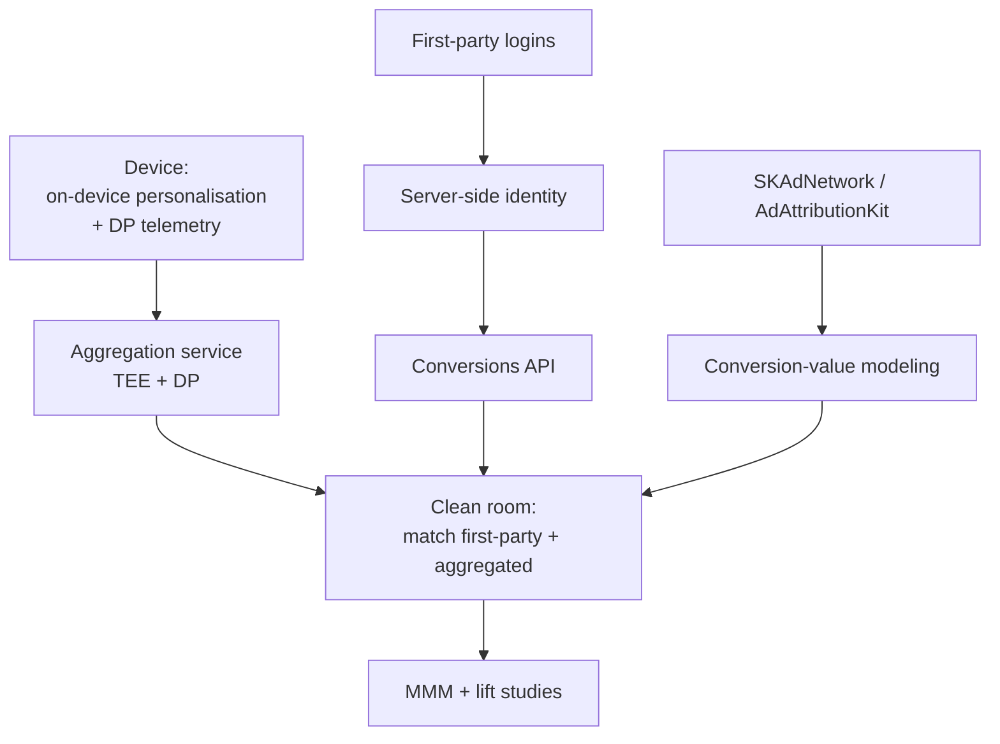

# Module 29 — Privacy & Post-Cookie Advertising

> The 2021 iOS ATT release was the inflection point. Cross-app behavioural identifiers collapsed; advertiser CPMs fell; whole product roadmaps were rewritten. The 2024-2026 stack is **differential privacy + on-device + clean rooms + first-party data**. Any 2026 ads system that doesn't have a story for each of these is unfinished.

---

## 1. Apple ATT — App Tracking Transparency (iOS 14.5, April 2021)

ATT required apps to prompt users before accessing IDFA (Identifier for Advertisers).

Opt-in rate stabilised at ~25% (15-30% range) globally.

### 1.1 Impact

- **Meta took an ~$10B revenue hit in 2022** (Q4 2021 earnings forecast).
- **Apple Search Ads** revenue went from ~$300M (2019) to **~$5B+ (2024)** — Apple's first-party data wasn't affected.
- The stack reoriented to probabilistic identity + deterministic first-party identity.

---

## 2. SKAdNetwork (SKAN) — Apple's privacy-preserving install attribution

| Version | iOS | Key changes |
|---|---|---|
| SKAN 1.0 | iOS 11.3 (2018) | Mostly unused |
| SKAN 2.0 | iOS 14.0 (2020) | Single 6-bit conversion value, postback after timer |
| SKAN 3.0 | iOS 14.6 (2021) | Source identifier, network ID |
| **SKAN 4.0** | iOS 16.1 (Oct 2022) | 3 postback windows (0-2d, 3-7d, 8-35d), **hierarchical conversion values** (coarse: low/medium/high; fine: 6-bit/64), 4-digit source identifier, postback to network AND publisher |
| **AdAttributionKit** | iOS 17.4 (Mar 2024) | New framework superseding SKAN for web-to-app and re-engagement; JWS tokens; multiple postbacks; **crowd anonymity** (k-anonymity thresholds before fine-grain values release). SKAN remains in parallel |

### 2.1 ML challenges introduced

- **Crowd anonymity thresholds** suppress fine-grained data for low-volume campaigns.
- **Conversion-value modeling** — train an LTV predictor over in-app events, bucket into deciles, post the decile.
- **Postback decoding** — MMPs run inverse modeling to recover insights.

Vendors that built businesses on this: AppsFlyer, Adjust, Singular, Branch.

---

## 3. Google Privacy Sandbox

**July 2024 reversal**: Google announced cookies stay in Chrome with a user choice; Privacy Sandbox APIs ship in parallel.

| API | Replaces | Function |
|---|---|---|
| **Topics API** | Cookie-based interest segments | Browser computes top topics from history (IAB taxonomy + ML classifier). 3 topics/call. Weekly expiry |
| **Protected Audience API** (was FLEDGE, was TURTLEDOVE) | Remarketing audiences | On-device auction. Interest groups + bidding scripts. Result rendered in Fenced Frame |
| **Attribution Reporting API** | Conversion pixels | Event-level (~6 bits/conversion) + aggregate (with DP noise) |
| **CHIPS** (Cookies Having Independent Partitioned State) | 3P cookies | Embedded-context cookies partitioned by top-level site |
| **Fenced Frames** | Iframes | Stronger sandbox; required for Protected Audience display |
| **Private State Tokens** | Bot-detection cookies | Cryptographic anti-fraud tokens |
| **Related Website Sets (RWS)** | Same-org cross-domain auth | Self-attested sets |
| **Shared Storage API** | Cross-site read | Write across sites, read with output restrictions |
| **Private Aggregation API** | Cross-site analytics | Sum metrics across sites with DP noise |

Sources:
- https://privacysandbox.com
- https://developer.chrome.com/docs/privacy-sandbox

### 3.1 Topics API in practice

- Taxonomy v2 (2024 update): ~470 ad-relevant topics.
- Browser locally classifies the user into a small set of weekly topics.
- ~3 topics per page-call (1 from each of the last 3 weeks).
- No URLs, no identifiers shared.

### 3.2 Protected Audience API

On-device auction:
1. Sites tag visitors as "interest groups" (`joinAdInterestGroup`).
2. When ad space comes up, browser runs an on-device auction across all relevant interest groups + bidding scripts.
3. Winning ad is rendered in a Fenced Frame.

No cross-site cookies needed. The DSP bidding logic must be expressible as a JavaScript worklet — a significant architecture shift.

---

## 4. Differential privacy in production

Both Attribution Reporting API and Apple PCM use DP.

### 4.1 The basics

- **(ε, δ)-DP**: ε is privacy budget (commonly 1-10 in ads); δ ~ 10⁻⁶.
- **Sensitivity** ~ 1 per user contribution for counts.
- **Composition theorems** bound cumulative privacy loss across queries.

### 4.2 DP-SGD (Abadi et al. 2016)

Training ML models with DP guarantees. Clip per-example gradients, add Gaussian noise. Trade-off: utility loss in exchange for privacy.

Most production recsys models **do not** use DP-SGD — utility cost is too high. DP is used at the **measurement** layer (aggregate reports, telemetry) rather than at the model layer.

### 4.3 PATE — Private Aggregation of Teacher Ensembles (Papernot et al. 2017)

Teacher / student private training. Less common in ads; more in healthcare and language models.

### 4.4 Production DP services

- **Chrome Aggregation Service** — runs in a Trusted Execution Environment; serves DP-noised aggregate conversion reports.
- **Meta Private Computation** — Meta's analogue.
- **Apple PCM (Private Click Measurement)** — Safari's DP click attribution.

---

## 5. Clean rooms — the new identity layer

Module 28 §8 covered. Re-listing for completeness:

| Clean room | Owner |
|---|---|
| Google Ads Data Hub (ADH) | Google |
| Amazon Marketing Cloud (AMC) | Amazon |
| Meta Advanced Analytics | Meta |
| AWS Clean Rooms | AWS |
| Snowflake Data Clean Rooms | Snowflake (Habu acquired 2024) |
| Databricks Clean Rooms | Databricks |
| LiveRamp Safe Haven | LiveRamp |
| InfoSum | InfoSum |
| Decentriq | Decentriq |

---

## 6. First-party data and CDPs

Post-cookie strategy: first-party identified data via login / email / loyalty + **server-side conversion APIs**:

- **Meta Conversions API (CAPI)** — server-to-server conversion sending.
- **Google Enhanced Conversions** — server-side conversion sending with hashed user identifiers.
- **TikTok Events API** — same.
- **LinkedIn CAPI** — same.

CDP landscape:
- Segment (Twilio).
- mParticle.
- Tealium.
- Salesforce Data Cloud.
- Adobe Real-Time CDP.
- Treasure Data.

Modern CDPs ≈ feature store + identity graph + audience builder + reverse ETL (Hightouch, Census).

---

## 7. On-device personalisation and federated learning

The most privacy-preserving end of the spectrum:

- **Apple PCC** (Private Cloud Compute) — module 20 covered.
- **Android Private Compute Core**.
- **Federated Learning** (Konecny et al. 2016; McMahan et al. 2017) — used in Gboard, Apple keyboard. Federated ranking reported by Meta and Google R&D.

The fundamental constraint: on-device ML can only use signals available on-device. Cross-app behavioural data is out by definition.

---

## 8. Identity solutions for the post-cookie world

| Solution | Approach | Use |
|---|---|---|
| **UID2 (Unified ID 2.0)** | Email-hashed deterministic ID, opt-in | The Trade Desk, Prebid.org |
| **LiveRamp ATS** | Authenticated traffic, email-hashed | Cross-platform measurement |
| **ID5** | Probabilistic ID with deterministic fallback | EU privacy-compliant |
| **First-party logins (Google, Apple, Meta)** | Platform-specific deterministic | Within each ecosystem |

Universal IDs face two problems: (1) requires opt-in to scale; (2) regulators may treat hashed-email IDs as PII anyway (some EU rulings have leaned this way).

---

## 9. The 2024-2026 architecture for privacy-preserving ads

Five layers:
1. **Device-level**: ATT, on-device ML, DP telemetry.
2. **Identity**: first-party logins, opt-in IDs (UID2), platform-specific deterministic.
3. **Measurement**: SKAN/AAK postbacks, Attribution Reporting API, lift studies.
4. **Aggregation**: DP via TEE (Aggregation Service, AMC).
5. **Insight**: MMM (Meridian, Robyn), uplift modeling, clean-room joins.

---

## 10. Sanity check

1. ATT opt-in is ~25%. What happened to advertisers who relied on IDFA-keyed retargeting?
2. SKAN 4.0 introduced hierarchical conversion values. What does "crowd anonymity" prevent that prior SKAN versions allowed?
3. Topics API gives the advertiser ~3 topics per call. Compare the information content vs a third-party cookie.
4. Protected Audience API runs the auction **on-device**. What does this prevent for the DSP, and what new constraints does it create for bidding logic?
5. Production DP is mostly at the measurement layer (not at model training). Why?
6. Clean rooms preserve "data never moves" but allow joint analysis. Name three production use cases.
