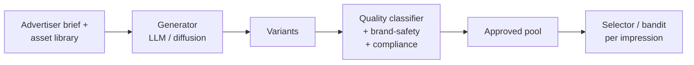

# Module 31 — Creatives, Fraud & Brand Safety

> The "edges" of the ads stack. Generative creative is the biggest 2024-2026 product story; fraud and brand safety are the unsexy but load-bearing layers underneath.

---

## 1. Dynamic Creative Optimization (DCO)

The traditional approach: an advertiser uploads multiple variants (headlines, images, CTAs); the system picks the best combination per impression.

### 1.1 Contextual bandits at the asset slot

LinUCB / Thompson sampling at each creative slot. Module 16 §2 covered.

### 1.2 End-to-end DCO

Single ranker over (user, ad-group, creative_id). Predicts CTR per creative for this user; picks the best.

### 1.3 Diversity / fatigue penalties

A user who has seen the same creative 10 times has 0 chance of clicking again. Decay factor per (user, creative) pair.

---

## 2. Generative creative (2024-2026)

The biggest 2024-2026 product story: platforms generate creative variants automatically.

### 2.1 The big platform launches

| Platform | Generative product | What it does |
|---|---|---|
| **Google Ads** | Performance Max + Gemini | Asset Group; Gemini generates new headlines, images, video |
| **Meta Ads** | Advantage+ Creative + AI Sandbox | Automated headline/background/size; image variation |
| **TikTok Ads** | Symphony Creative Studio | Text-to-video; AI avatars; dubbing |
| **Amazon Ads** | Image Generator (2024) | Product-aware ad image generation |
| **Microsoft Ads** | Copilot ads | LLM-generated sponsored answers |

### 2.2 The underlying models

- **Text**: Gemini, Llama, Claude, GPT-4. Fine-tuned for ad-copy style.
- **Image**: DALL-E 3, Imagen 3, Stable Diffusion XL, FLUX, Ideogram. **Adobe Firefly** is commercial-safe (trained on licensed data).
- **Video**: Sora, Veo, Runway Gen-3, Kling, Pika.
- **Brand-aware fine-tuning**: DreamBooth / LoRA / ControlNet for product placement.

### 2.3 The hard problems

- **Brand safety + trademark**: the model must not violate trademark, mis-spell brand names, place products incorrectly.
- **Compliance**: ad disclosure, FTC requirements, GDPR considerations.
- **Brand consistency**: tone, colour palette, voice across variants.
- **Quality scoring**: not all generated variants are good; a quality classifier gates which ones reach the auction.

### 2.4 The architecture



The quality + brand-safety classifier is where most ML engineering effort goes — generation is "off the shelf"; gating is bespoke.

---

## 3. Brand safety taxonomies

**GARM** (Global Alliance for Responsible Media) dissolved in 2024 after the X/WPP lawsuit; the **taxonomy persists**.

Standard categories:
- Adult content.
- Arms.
- Crime.
- Death / injury / military conflict.
- Online piracy.
- Hate speech / acts of aggression.
- Obscenity / profanity.
- Illegal drugs / tobacco / alcohol.
- Spam / harmful content.
- Terrorism.
- Sensitive social issues.

### 3.1 Brand suitability (graduated, advertiser-configurable)

2024-2026 shift to **brand suitability** rather than binary safety. Advertisers configure per-category risk tolerance.

### 3.2 LLM-based classification

- **URL-level**: DistilBERT, TinyLlama fine-tuned on the GARM categories.
- **Video / multimodal**: Gemini Nano, CLIP + Whisper, or unified models, classifying frame + transcript.
- **Contextual relevance scoring beyond safety**: e.g., is this car ad next to a car-crash article (technically safe but bad).

Vendors:
- **IAS Total Media Quality** — verification.
- **DV Brand Safety + Custom Contextual** — DoubleVerify.
- **Zefr** — CTV-focused.
- **Channel Factory** — context-aware YouTube.

---

## 4. Ad fraud — the $80B+/year problem

Estimated digital ad fraud: **$80B+/year globally** (Juniper Research 2024).

Bot traffic ~**30% of global web traffic** (Imperva Bad Bot Report).

### 4.1 Fraud taxonomy

| Type | Mechanism | Detection |
|---|---|---|
| **Bot traffic / NHT** | Scripted clicks/impressions | UA + behavior + fingerprinting |
| **Click farms** | Real humans paid to click | Device farms, sequence patterns |
| **Domain spoofing** | Bid request lies about domain | `ads.txt` / `sellers.json` |
| **App spoofing** | Same for mobile | `app-ads.txt` |
| **Ad stacking** | Multiple ads in same slot | Viewability |
| **Pixel stuffing** | 1×1 invisible ads | Viewability |
| **Cookie stuffing** | Affiliate cookies en masse | Funnel analysis |
| **Attribution fraud** | Click injection / spam | Click timestamps, anti-fraud SDKs |
| **Cookie sync abuse** | Inflated reach | Frequency analysis |
| **SDK spoofing** | Fake installs/conversions | Cryptographic SDK signatures (AppsFlyer Protect360, Adjust FPS) |

### 4.2 ML detection

- Sequence modeling (LSTM/Transformer over user events).
- Graph-based — connected components over (device, IP, account); communities clicking the same ads = suspicious.
- Autoencoders / one-class anomaly detection.
- Embedding clustering — botnets exhibit tight clusters.
- LLM-based page-content classification — small distilled classifier per impression; full LLM on samples.

### 4.3 IVT — Invalid Traffic

- **GIVT (General IVT)**: known bots, datacenter traffic, declared spiders. IAB Bot List filter handles most.
- **SIVT (Sophisticated IVT)**: residential proxies, hijacked devices, click farms, ad stacking, pixel stuffing, domain spoofing.

GIVT is filtered automatically by exchanges and ad servers; SIVT is detected and refunded post-impression by verification vendors.

---

## 5. Verification vendors

| Vendor | Strength | 2024 status |
|---|---|---|
| **IAS (Integral Ad Science)** | Public; verification + brand safety | Active |
| **DoubleVerify (DV)** | Public; verification + brand safety | Active |
| **MOAT** | Was Oracle's offering | **Oracle wound down its ad-tech (MOAT, BlueKai) in 2024**. Customers migrated to IAS/DV |
| **HUMAN Security** (was White Ops) | Bot detection | Active |
| **Pixalate** | IVT + audience verification | Active |
| **Adloox, Meetrics** | Smaller / regional | Active |

---

## 6. Viewability standards — MRC

- **Display**: ≥50% of pixels in view for ≥1 second.
- **Video**: ≥50% of pixels for ≥2 seconds continuous.
- **Large display**: ≥30% for ≥1 second.

Enforced via JS pixels from IAS, DV, MOAT (until 2024), Adloox, Meetrics.

---

## 7. Sample code: a tiny generative-creative quality gate

(See [`code/31_creative_gate.py`](code/31_creative_gate.py) for a sketch.)

```python
import torch
from transformers import AutoModelForSequenceClassification, AutoTokenizer

class CreativeQualityGate:
    def __init__(self, classifier_name="distilbert-base-uncased"):
        self.tok  = AutoTokenizer.from_pretrained(classifier_name)
        self.clf  = AutoModelForSequenceClassification.from_pretrained(classifier_name)
        self.brand_safety = ...        # similar classifier
        self.compliance   = ...        # rule-based + classifier

    def score(self, text):
        # text quality (grammar, fluency)
        x = self.tok(text, return_tensors="pt", truncation=True, max_length=128)
        with torch.no_grad():
            quality = torch.softmax(self.clf(**x).logits, dim=-1)[0, 1].item()
        brand_safe = self.brand_safety.classify(text)
        compliant  = self.compliance.check(text)

        return {
            "quality": quality,
            "brand_safe": brand_safe,
            "compliant": compliant,
            "approved": quality > 0.7 and brand_safe and compliant,
        }

# Usage in generation loop
generator = ...  # Llama / Gemini / Claude
gate = CreativeQualityGate()

approved = []
for _ in range(20):
    variant = generator.generate(brief)
    result = gate.score(variant)
    if result["approved"]:
        approved.append(variant)

# Send approved variants to bandit / DCO
```

---

## 8. Sanity check

1. DCO traditionally picks among advertiser-uploaded variants. What does generative creative change in this pipeline?
2. The hardest problem in generative ads isn't generation — it's quality gating. Name three failure modes a quality classifier must catch.
3. GARM dissolved in 2024 but its taxonomy persists. Why does the taxonomy survive the organisation?
4. Bot traffic is ~30% of web. Most of it is filtered for free as GIVT. Why is SIVT harder?
5. The 2024 wind-down of MOAT pushed customers to IAS and DV. What does that consolidation mean for the verification market?
