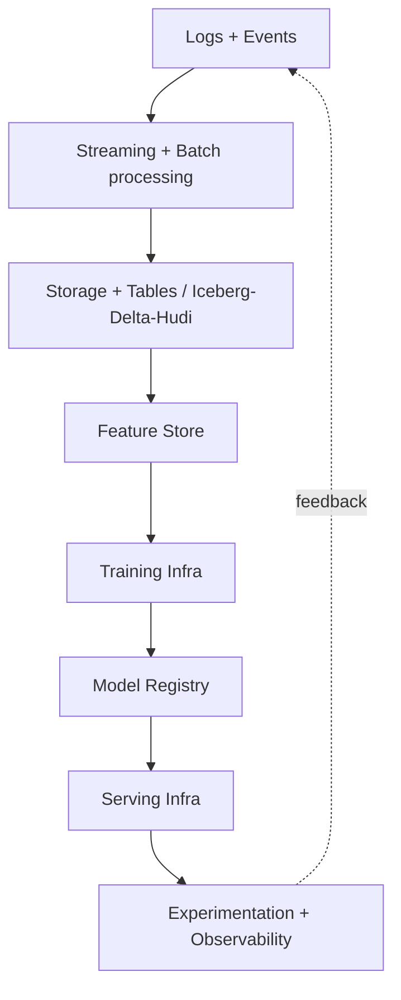

# Module 32 — The Recsys Tech Stack

> What ML engineering looks like at the system level. This module is the inventory: every layer, the dominant tools, and the cost ballparks. Pair with Module 33 for end-to-end reference architectures.

---

## 1. The layers (top to bottom)



Eight layers. Most production teams own 4-7 of these; the rest are vendor or open-source plumbing.

---

## 2. Data infrastructure

### 2.1 Event streaming

| System | OSS | Hosted | Sweet spot |
|---|---|---|---|
| **Apache Kafka** | Yes | Confluent Cloud, MSK, Aiven | The default |
| **Confluent Cloud** | No | First-party | Don't want to operate Kafka |
| **Apache Pulsar** | Yes | StreamNative | Multi-tenant, geo-replication |
| **AWS Kinesis** | No | First-party | AWS-native |
| **GCP Pub/Sub** | No | First-party | GCP-native, serverless |
| **Redpanda** | Source-available | Redpanda Cloud | Kafka-compatible, lower latency |

### 2.2 Stream processing

| System | Use |
|---|---|
| **Apache Flink** | Stateful streaming, exactly-once, low latency. Uber, Netflix, Pinterest, Stripe |
| **Spark Structured Streaming** | If your batch is Spark |
| **Apache Beam** | Runner-agnostic abstraction |
| **Materialize / RisingWave** | Streaming SQL → incremental materialised views |
| **ksqlDB** | Kafka-native streaming SQL |

### 2.3 Batch + warehouse

- **Apache Spark** on Databricks, EMR, Dataproc.
- **BigQuery** — serverless, ~$6.25/TB on-demand.
- **Snowflake** — compute/storage decoupled.
- **Databricks** — lakehouse: Spark + Delta + Unity Catalog + MLflow.
- **Trino / Starburst** — federated SQL across S3, RDBMS, Kafka.

### 2.4 Open table formats

| Format | Sponsor | Notes |
|---|---|---|
| **Apache Iceberg** | Netflix-origin | The winning OSS format in 2024-26 |
| **Delta Lake** | Databricks | Most mature in Databricks; UniForm bridges Delta and Iceberg |
| **Apache Hudi** | Uber-origin | Best for streaming upserts |

---

## 3. Feature stores

### 3.1 The OSS leader: Feast

[feast.dev](https://feast.dev) — orchestrates rather than materialises. Offline (BigQuery/Snowflake/S3) + online (Redis/DynamoDB/Bigtable). Point-in-time correctness via as-of joins. Streaming via push API or Kafka.

### 3.2 Commercial

- **Tecton** ([tecton.ai](https://tecton.ai)) — managed streaming feature computation, monitoring, lineage. Founded by the Uber Michelangelo team. ~$60K/yr small team.
- **Hopsworks** — independent vendor, hybrid open-core.

### 3.3 Cloud-vendor

| Store | Cloud |
|---|---|
| **Vertex AI Feature Store** | GCP. BigQuery offline + Bigtable online |
| **Databricks Feature Store** | Unity Catalog-integrated |
| **SageMaker Feature Store** | AWS. S3 offline, in-memory online |

### 3.4 In-house at FAANG

| Company | System |
|---|---|
| Uber | Palette (in Michelangelo) |
| Airbnb | Zipline → **Chronon** (OSS [github.com/airbnb/chronon](https://github.com/airbnb/chronon)) |
| DoorDash | Sibyl |
| LinkedIn | Frame / **Feathr** (OSS [github.com/feathr-ai/feathr](https://github.com/feathr-ai/feathr)) |
| Meta | FBLearner Flow + internal |
| Pinterest | Galaxy |
| Spotify | Hendrix |

### 3.5 The three things every feature store must do

1. **Online/offline parity** — features in batch and at request time must match.
2. **Point-in-time correctness** — features as-of label timestamp.
3. **Streaming + batch unification** — same definition in both.

---

## 4. Training infrastructure

### 4.1 Frameworks

| Framework | Strength |
|---|---|
| **PyTorch** | Dominant. Most new recsys code |
| **TensorFlow** | Still big at Google, YouTube |
| **JAX** | DeepMind / Google Research |

### 4.2 Recsys libraries

| Library | Notes |
|---|---|
| [**TorchRec**](https://github.com/pytorch/torchrec) | Meta. Sharded embedding tables |
| [**TFRS**](https://www.tensorflow.org/recommenders) | Google. Two-tower / multi-task |
| [**TF-Ranking**](https://github.com/tensorflow/ranking) | LTR losses (LambdaRank, ApproxNDCG) |
| [**NVIDIA Merlin**](https://github.com/NVIDIA-Merlin/Merlin) | NVTabular + HugeCTR + Models + Systems |
| [**Microsoft Recommenders**](https://github.com/recommenders-team/recommenders) | Tutorials + reference impls |
| [**RecBole / 2.0**](https://github.com/RUCAIBox/RecBole) | 80+ research algorithms |
| [**implicit**](https://github.com/benfred/implicit) | Fast ALS / BPR CPU+GPU |
| [**LightFM**](https://github.com/lyst/lightfm) | Hybrid factorisation, single-machine |
| [**Surprise**](https://github.com/NicolasHug/Surprise) | Classical CF |
| [**Cornac**](https://github.com/PreferredAI/cornac) | Multimodal recsys |

### 4.3 Distributed training

- **Horovod** — Uber's MPI-style synchronous SGD.
- **DeepSpeed** — ZeRO optimizer partitioning. LLM-focused but used for huge embedding tables.
- **FSDP** — PyTorch built-in fully sharded data parallel.
- **TorchRec ShardedEmbeddingBag** — row, column, table-wise.

### 4.4 Embedding tables

- **Hash trick**: hash IDs into N buckets.
- **Mixed precision**: fp16/bf16/int8.
- **Parameter-server pattern**: embedding sharded across machines.
- **Compositional embeddings (Meta)**: Quotient-Remainder. 100× compression.
- **Collisionless hashing (Monolith, ByteDance)**: dynamic hash table with TTL.

---

## 5. Vector / ANN indexes

### 5.1 Library-level

| Library | Algorithm | Best for |
|---|---|---|
| **FAISS** (Meta) | IVF, IVF-PQ, HNSW, flat | Largest catalog; offline indexing |
| **hnswlib** | HNSW | Lowest latency, high recall |
| **ScaNN** (Google) | Anisotropic vector quantization | Pareto-best recall vs QPS |
| **DiskANN** (Microsoft) | Disk-resident HNSW | Billions of vectors per node |
| **Annoy** (Spotify) | Random projection trees | Legacy; Spotify replaced with Voyager 2023 |
| **Voyager** (Spotify) | HNSW | Spotify replacement |

### 5.2 Hosted

| Vendor | Notes | Ballpark |
|---|---|---|
| **Pinecone** | First managed VDB; serverless since 2024 | $70-$5K/mo |
| **Weaviate** | OSS + hosted; strong hybrid | $295/mo cloud min |
| **Milvus / Zilliz** | Apache 2.0, mature scale-out | $100/mo min |
| **Qdrant** | Rust, performant, good filtering | $25/mo min |
| **LanceDB** | Embedded, columnar | Free embedded |
| **Chroma** | LangChain favorite | Free OSS |
| **Vespa** | Yahoo-origin; production rec/search engine | Self-host heavy |
| **Vertex AI Vector Search** | GCP, ScaNN-backed | Per-query |
| **Mosaic AI Vector Search** | Databricks-integrated | Per-endpoint |
| **pgvector** | Postgres extension | Free |

### 5.3 What to pick

- <1M vectors + you have Postgres: **pgvector**.
- <10M vectors, want managed: **Pinecone / Weaviate / Qdrant Cloud**.
- 10-500M: **Milvus / Vespa / Pinecone paid**.
- Hybrid (BM25 + dense): **Vespa / Weaviate / Elasticsearch**.
- <10ms latency + you can engineer: **hnswlib embedded + FAISS for offline**.

---

## 6. Serving infrastructure

### 6.1 Two-stage serving

```
Request → Retrieval (vector idx, K=200-1000) → Ranker (LightGBM/DNN, N=10-50) → Business rules → Response
```

Realistic recsys p99:

| Component | Budget |
|---|---|
| Edge round-trip + auth | 20ms |
| Feature fetch (online store) | 15ms |
| Retrieval (vector index) | 20ms |
| Ranker scoring (batched) | 20ms |
| Business rules / dedup | 5ms |
| Logging / response build | 5ms |
| **Total** | **~85ms** |

### 6.2 Model-serving frameworks

| Framework | Best for |
|---|---|
| **TorchServe** | PyTorch, simple HTTP |
| **TensorFlow Serving** | TF/Keras, gRPC-native |
| **NVIDIA Triton** | Multi-framework, GPU, dynamic batching |
| **Ray Serve** | Pythonic, multi-model graphs |
| **BentoML** | Pythonic, packaging-focused |
| **KServe** | Kubernetes-native |
| **vLLM / TGI / SGLang** | LLM-specific |

### 6.3 Embedding cache layers

- **Redis** — ~1ms p99. Default.
- **ScyllaDB** — wide-column, sub-ms p99. Discord, Disney+.
- **DynamoDB** — managed, 5-10ms.
- **Bigtable** — GCP, sub-10ms.

### 6.4 Model registries

- **MLflow** — OSS default.
- **Vertex AI Model Registry** — GCP-managed.
- **SageMaker Model Registry** — AWS-managed.
- **Weights & Biases** — experiment tracking + maturing registry.

---

## 7. Experimentation platforms

### 7.1 Vendor

| Vendor | Strength |
|---|---|
| **Optimizely** | Marketing-heavy roots |
| **Statsig** | Engineering-first, generous free tier |
| **Eppo** | Causal-first; CUPED + sequential testing |
| **GrowthBook** | OSS-first; self-host |
| **Split** | Feature flag + experiments |
| **LaunchDarkly** | Best-in-class feature flags |
| **PostHog** | OSS product analytics + experiments |

### 7.2 Internal FAANG

| Company | Platform |
|---|---|
| Airbnb | ERF — ~700 concurrent |
| Netflix | XP — thousands concurrent |
| Booking.com | ETF — famous for >1000 simultaneous tests |
| Uber | XP / Morpheus |
| Microsoft / LinkedIn | ExP — "Trustworthy Online Controlled Experiments" book material |
| Meta | Deltoid / PlanOut (PlanOut OSS but stale) |

### 7.3 Multi-armed bandits

- **Thompson sampling** — default.
- **LinUCB / contextual bandits** — feature-aware.
- **Vowpal Wabbit** — bandit-aware online learner.
- **MABWiser** — Python contextual bandits.

### 7.4 Variance reduction

- **CUPED** (Microsoft 2013) — 30-50% variance reduction.
- **Stratified randomisation**.
- **Sequential testing** (mSPRT, always-valid p-values).

---

## 8. Observability and MLOps

### 8.1 What to monitor

1. Data drift (feature distribution shifts).
2. Prediction drift.
3. Performance drift (lagged labels).
4. Embedding drift.
5. Infrastructure (latency, error rate, fallback rate).

### 8.2 Vendors

| Vendor | Strength |
|---|---|
| **Arize AI** | LLM + recsys obs; embedding viz |
| **Fiddler AI** | Explainability + monitoring |
| **WhyLabs** | Profile-based (privacy-friendly) |
| **Evidently** | OSS drift/perf reports |
| **Aporia** | Similar to Arize/Fiddler |
| **Datadog ML** | If you already pay Datadog |

---

## 9. Vendor "all-in-one" recsys

| Vendor | Input → Output | Ballpark |
|---|---|---|
| **Amazon Personalize** | Events + catalog → model + endpoint | $200-$2K/mo small |
| **Vertex AI Search & Conversation** | Documents → hosted search + LLM | Per-query |
| **Recombee** | Catalog + interactions → REST API | $100/mo + free |
| **Algolia AI** | Search-first; Dynamic Re-Ranking + Personalization | Per-query |
| **Bloomreach** | Commerce search + merchandising | Enterprise |
| **Coveo** | Enterprise B2B commerce | Enterprise |

---

## 10. End-to-end stack examples

Module 33 has full architecture diagrams. Quick references:

- **Startup ($5-50M ARR)**: BigQuery → Feast → LightGBM → Pinecone → FastAPI → Cloudflare.
- **Mid-stage ($50-500M ARR)**: Kafka + Flink + Snowflake + Tecton + PyTorch + Triton + Statsig.
- **Hyperscaler ($1B+)**: Custom feature store + TorchRec + custom ANN + custom experimentation.

---

## 11. Sanity check

1. Why are feature-store online/offline parity and point-in-time correctness considered non-negotiable?
2. The "right" ANN library depends on scale. For 100M vectors with strict 10ms p99, which would you pick and why?
3. CUPED reduces required A/B sample size by 30-50%. Why is this such a load-bearing technique for any teams running concurrent experiments?
4. Embedding-cache choice (Redis vs ScyllaDB vs DynamoDB) depends on what trade-off?
5. A vendor like Amazon Personalize abstracts the whole stack. When does it make sense for a company to use it instead of building?
