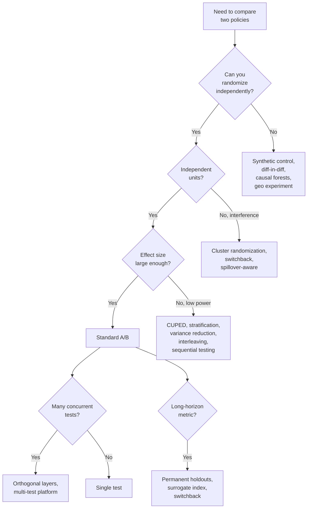
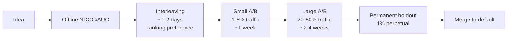
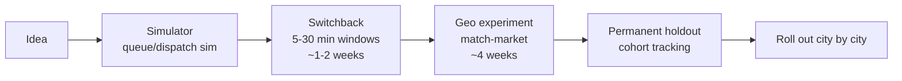
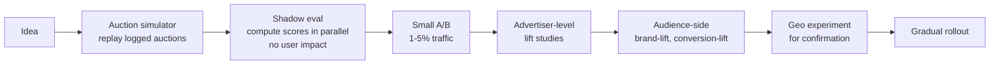

# Module 34 — A/B Testing & Experimentation Methods by Business Type

> The deepest module on testing. Module 4 introduced the high-level eval funnel; this one lives inside it. Different businesses face fundamentally different experimentation problems — Netflix's question ("does this recommender change retention?") is not Uber's question ("does this dispatch change average wait time?"). Knowing which method fits which problem is the difference between honest measurement and theatre.

---

## 1. Why "just run an A/B" isn't enough

A classic two-arm randomized A/B test has four prerequisites:

1. **Random assignment** that's truly independent of everything else.
2. **Stable Unit Treatment Value (SUTVA)** — treatment given to user A doesn't affect user B.
3. **Sufficient sample size** for the minimum detectable effect.
4. **Stable observation window** with no carry-over.

In real recsys / ads / marketplace systems, *every* one of these breaks routinely:

| Prerequisite | Where it breaks | Symptom |
|---|---|---|
| Independent randomization | Shared caches, shared rate limiters, browser cookies span devices | SRM (sample ratio mismatch) |
| SUTVA | Marketplace (Uber, Airbnb), social (Meta, LinkedIn), ads (auctions) | Spillover; test arm "steals" supply from control |
| Sample size | Conversions, revenue, churn — rare metrics | Underpowered "flat" results, false negatives |
| Stable window | Novelty effects, primacy effects, weekday patterns | Wrong-sign effects in first 7 days |

The remainder of the module is the toolkit of methods invented to handle each failure mode in specific business contexts.

---

## 2. The full taxonomy of experimentation methods



Eight method families. Production teams run **most of them simultaneously**.

---

## 3. Method 1 — Standard bucket A/B

The textbook recipe (Module 4 §3 covered the basics):

- Randomly assign users at signup or first-impression to **control** or **treatment**.
- Persist assignment via cookie / user_id hash so the user always sees the same arm.
- Compute a primary metric and guardrail metrics.
- Run until pre-registered sample size or significance threshold.

### 3.1 Sample size

```
N_per_arm ≈ 16 σ²  /  MDE²    (two-sided 95%, 80% power)
```

For a 1% relative MDE on a 5% baseline CTR with σ ≈ √(p(1-p)), N ≈ 304,000 per arm → ~600k users total to detect a 1% lift in click-through.

For revenue / retention metrics, σ is much larger (heavy-tailed). N can easily reach **millions per arm** and **weeks of duration**.

### 3.2 Sample-ratio mismatch (SRM)

A 50/50 randomisation that ends up 48/52 is a *bug*, not noise. Diagnostic chi-squared test on observed arm counts vs expected.

Causes:
- Hashing bug (some user_ids map disproportionately).
- Eligibility filter applied after randomisation (post-treatment selection).
- Carry-over from a previous experiment that biased one arm's user mix.

**Always check SRM before celebrating results.** Microsoft's "Trustworthy Online Controlled Experiments" book treats this as the #1 audit.

### 3.3 Multiple testing

If you test 20 metrics, ~1 will be significant by chance at p=0.05. Mitigations:
- **Bonferroni**: divide p by number of tests. Conservative.
- **Holm-Bonferroni**: sequential adjustment.
- **Benjamini-Hochberg** (BH): control false-discovery rate.
- **Family-wise error rate (FWER)**: stricter than FDR; for safety-critical tests.

For multi-variant tests (A/B/C/D), apply the same correction across variants.

### 3.4 Standard A/B is the default at: most companies, most surfaces, most of the time.

---

## 4. Method 2 — Interleaving (Netflix's signature)

Instead of "user gets model A or model B" for the whole session, **interleave the rankings from both policies on the same page** and attribute clicks to whichever policy contributed the clicked item.

### 4.1 Team-draft interleaving (Radlinski et al. 2008)

For each user query, alternate picking from A's ranked list and B's ranked list, like a sports team draft. Track which policy contributed each shown item.

```
A's list:  [a1, a2, a3, a4, a5, ...]
B's list:  [b1, b2, b3, b4, b5, ...]

Coin flip → A starts. Draft:
  position 1: pick top of A → a1
  position 2: pick top of B not in result → b1
  position 3: pick top of A not in result → a2 (or a3 if a2 == b1)
  position 4: pick top of B not in result → b2
  ...

User clicks position 3 → A gets a credit.
```

### 4.2 Why it works

- Each session is its own control — variance is much smaller than between-user A/B.
- The "preference" test is intrinsically paired.
- ~100× sample efficiency vs bucket A/B for **ranking comparisons** (rule of thumb).

### 4.3 Caveats

- Only measures ranking *preference*, not absolute engagement.
- Doesn't catch cumulative effects (long-term retention).
- Can't be used for non-list interventions (UI changes, new features).

### 4.4 Where it's deployed

- **Netflix** (their signature; used for ranking model comparisons).
- **Google Search** (TDI is part of the eval stack).
- **Yandex Search** (one of the heaviest users; multiple papers on variants).
- **Bing** (interleaving + A/B + offline).

Less common at marketplaces, e-commerce, ads — there, "preference between rankings" is less the question than "does this affect revenue."

---

## 5. Method 3 — Switchback experiments (Uber, Lyft, DoorDash)

When you can't randomise users (because they interact through a shared marketplace), randomise **time windows**.

### 5.1 The setup

Pick a time-window length (5 min, 30 min, 1 hour). For each window, flip a coin → treatment or control. Apply that policy to all users in that geographic region during that window.

```
Region NY, hours of day:
  06:00 control
  06:30 treatment
  07:00 treatment
  07:30 control
  08:00 control
  08:30 treatment
  ...

Aggregate metrics by window.
```

### 5.2 Why it works for marketplaces

- **SUTVA violation handled**: if treatment affects supply (Uber's dispatch policy), control users in a different time window don't experience that disruption.
- **Geographic isolation**: within a city, both arms see the same fundamental supply/demand context.
- **No identifier needed**: works even with anonymous riders or pre-login users.

### 5.3 Statistical complications

- **Auto-correlation**: adjacent windows are correlated. Use block bootstrap or HAC standard errors.
- **Carry-over**: an effect from one window leaks into the next. Use **washout** periods between treatment and control windows (e.g., 5 min on, 1 min washout, 5 min off).
- **Window-length trade-off**: shorter windows = more switches = more samples + more carry-over; longer = cleaner but fewer data points.

### 5.4 Where it's deployed

- **Uber** (dispatch, ETA, pricing). Their published "Experimentation in a Ridesharing Marketplace" describes the full apparatus.
- **DoorDash** (dispatch, store ranking).
- **Lyft**.
- **Instacart**, **Airbnb** (in some contexts), **Wolt**.

Switchback is **the** marketplace experimentation method. Without it, a 5% dispatch improvement looks like 0% because supply rebalances instantly.

---

## 6. Method 4 — Cluster randomization

Randomise at a *higher unit* than the user — e.g., randomise *geo-regions*, *teams*, *hashtags*, *connected social components*.

### 6.1 When needed

- **Social network effects**: Facebook's News Feed changes spread to friends. If you randomise users, treatment users' friends see them post about it; the control group is contaminated.
- **Marketplace effects**: a hot new restaurant added in treatment is also visible to control users.
- **Topic effects**: a "trending" recommender promotes content; control users see the spike in popularity.

### 6.2 Cluster choice

| Business | Cluster |
|---|---|
| Meta / LinkedIn | Connected components of the social graph; geographic regions |
| Pinterest | Boards or topics |
| Reddit | Subreddits |
| Twitter / X | Conversations |
| GitHub | Repos |
| Airbnb | Markets (cities) |

### 6.3 Statistical cost

Randomising at the cluster level means **N_effective = N_clusters**, not N_users. For 50 cities and 10M users, you have 50 samples for inference — much weaker power than the user-level number suggests.

The variance estimator must account for within-cluster correlation. **Intra-cluster correlation (ICC)** quantifies this; design effect = `1 + (m-1)·ICC` inflates the required sample size.

### 6.4 Where it's deployed

- **Meta** (cluster-randomised experiments for News Feed integrity, growth).
- **LinkedIn** (network experiments at the connected-component level).
- **Airbnb** (geo-level for marketplace tests).
- **Booking** (geo-level + property-level).

---

## 7. Method 5 — Geo experiments and synthetic control

When user-level randomisation is impossible (TV ads, OOH, weather effects), randomise **geographies** and compare.

### 7.1 Standard geo split

Pick N markets (US DMAs, postal codes, EU regions). Randomly assign half to treatment, half to control. Run the test for a fixed duration.

### 7.2 The matched-market problem

50 markets isn't 50 random samples — markets differ in baseline (NYC vs Boise have wildly different baselines). Pre-match markets by:
- Pre-period sales / engagement.
- Demographic similarity.
- Seasonality patterns.

### 7.3 Synthetic Control (Abadie, Diamond, Hainmueller 2010)

Build a "synthetic" control market as a weighted average of multiple actual markets that, in the pre-period, looked similar to the treated market. Post-period, compare treated to synthetic control.

The Bayesian extension: **CausalImpact** (Brodersen et al. Google 2015). [github.com/google/CausalImpact](https://github.com/google/CausalImpact).

### 7.4 Difference-in-Differences (DiD)

Compare the **change** in treated minus the **change** in control over the pre-period and treatment-period. Cancels out time-invariant differences.

### 7.5 Where it's deployed

- **Google Ads** (geo-experiment-based lift studies).
- **Meta Ads** (geo + conversion lift).
- **Marketing Mix Modeling calibration** at every major brand.
- **Local pricing experiments** at Uber, DoorDash, Lyft.

### 7.6 Tools

- **CausalImpact** (Google, R/Python).
- **synth** (R), **SCM** (Python).
- **GeoLift** (Meta's open-source geo-experimentation package).

---

## 8. Method 6 — Variance reduction (CUPED, stratification)

Module 4 §3.4 introduced CUPED. The detail:

### 8.1 CUPED math

For each user, compute a covariate `X` from a pre-experiment period (e.g., past-30-day spend). Adjust the metric `Y` by:

```
Y_adjusted = Y − θ · (X − E[X])

where θ = Cov(Y, X) / Var(X)
```

`Y_adjusted` has the same expectation as `Y` (unbiased) but **lower variance** because the pre-period covariate explains some of `Y`'s variance.

### 8.2 Why it matters

- **30-50% variance reduction** is typical → **30-50% fewer users** needed for the same statistical power.
- For a company running 1000 concurrent experiments, this is equivalent to building a 1.5× larger user base.

### 8.3 Stratified randomization

Pre-stratify users by a covariate (high spenders vs low spenders) and randomise within each stratum. Same variance-reduction principle.

### 8.4 Doubly-Robust estimation in experiments

Combines CUPED with a flexible ML model of the outcome — even further variance reduction. Used at Microsoft, Meta, Netflix.

### 8.5 Where it's deployed

Every modern experimentation platform: Statsig, Eppo, GrowthBook, internal at Microsoft (the original CUPED paper authors), Netflix, Airbnb.

---

## 9. Method 7 — Sequential testing (always-valid p-values)

A classical fixed-sample test forbids "peeking." If you check results every day and stop when significant, the actual false-positive rate exceeds 5%.

### 9.1 mSPRT (Mixture Sequential Probability Ratio Test)

[Howard, Ramdas, McAuliffe, Sekhon 2021](https://www.tandfonline.com/doi/abs/10.1080/01621459.2020.1746299) — "Time-uniform Chernoff bounds via nonnegative supermartingales."

Provides **always-valid p-values** — you can peek as many times as you want; the probability of a false positive ever crossing your threshold remains bounded.

### 9.2 Group-sequential designs

Pre-register K analysis points; use O'Brien-Fleming or Pocock boundaries to control type-1 error across all peeks.

### 9.3 Why it matters

- Stop early when there's an obvious winner (or loser).
- Stop early to limit user exposure to a bad arm.
- Reduce time-to-decision.

### 9.4 Where it's deployed

- **Optimizely** (Stats Accelerator).
- **Eppo** (sequential testing built-in).
- **Microsoft ExP**.
- **LinkedIn** (their published work on sequential testing).

---

## 10. Method 8 — Long-term holdouts and surrogate indices

Most A/Bs run for 1-4 weeks. But the real business metric (retention, LTV, churn) may take 30-180 days to reveal itself.

### 10.1 Permanent holdouts

A small fraction (1-5%) of users *never* sees the new model. Compared to the rest over months.

Cost: holdout users get a worse product and may churn faster, biasing the comparison. Mitigations:
- Refresh holdout users periodically (rolling cohort).
- Reset the holdout when the new model is "broadly accepted."
- Track holdout health metrics carefully.

### 10.2 Surrogate index (Athey, Chetty, Imbens 2019)

Use **multiple short-term proxies** in a regression to estimate long-term effect:

```
Long-term outcome  ≈  β_1 · short_metric_1 + β_2 · short_metric_2 + ...
```

Train the surrogate model on historical experiments where you have both short-term and long-term data.

Used at Facebook, Netflix, Uber, Airbnb.

### 10.3 Cohort experiments

Random selection of *new users* at signup into model A vs model B; follow for 90+ days. Most-truthful measure of "does this model produce better long-term users."

### 10.4 Where it's deployed

- **Netflix** (permanent holdouts on home-feed ranking; long-running cohort studies).
- **Airbnb** (booking cohort experiments).
- **Booking.com**.
- **Spotify** (algorithmic-diversity papers used long-running cohort comparisons).
- **Meta** (surrogate index papers).

---

## 11. Method 9 — Lift studies, ghost ads, PSA tests

Ads-specific. Module 28 covered. Key forms:

| Method | Description |
|---|---|
| **Conversion lift studies** | Randomised holdout — control gets a PSA. Meta Lift, Google Brand Lift, TikTok Lift Studies |
| **Ghost ads** (Johnson, Lewis, Nubbemeyer 2017, eBay) | Run the auction for control but don't serve; log would-have-won impressions |
| **PSA tests** | Substitute a PSA in control |
| **Audience holdouts** | Randomised 1-10% holdout for campaign duration |

These are the **honest** answer to "did this ad campaign work" vs the **observational** MTA.

---

## 12. Method 10 — Multi-armed bandits as continuous experimentation

For surfaces with frequent, low-stakes decisions, A/B is wasteful because half the traffic goes to the loser for the whole experiment.

A **contextual bandit** (Thompson, LinUCB) adaptively shifts traffic toward winners.

### 12.1 When bandits beat A/B

- Many arms, low individual reward.
- Reward observed quickly (seconds-to-minutes).
- The "best" choice may vary per-user (contextual).
- Stable underlying environment (no drift).

### 12.2 When A/B beats bandits

- Structural test (new feature, new UI).
- Long-run measurement that requires unbiased estimates.
- Few arms, large between-arm differences.

### 12.3 Where bandits are deployed

- **Netflix** (artwork, billboard, row order).
- **Spotify** (BaRT for home shelves).
- **Yahoo News** (the original LinUCB paper).
- **LinkedIn** (feed ranking exploration).
- **Microsoft Bing** (web result personalisation).

Bandits and A/B coexist; they're for different decisions.

---

## 13. The 11 things that go wrong in A/B (extended list)

Module 4 §3.2 listed 11; this is the deeper version:

1. **Sample ratio mismatch (SRM)** — hashing or filter bug.
2. **Novelty effect** — week 1 spike; dissipates by week 4.
3. **Primacy effect** — slow ramp; metric understates equilibrium.
4. **Network effects (SUTVA violation)** — treatment leaks to control via social/marketplace.
5. **Multiple testing** — test 20 metrics, 1 false positive by chance.
6. **Multiple variants** — best-of-N inflation.
7. **Underpowered tests on rare metrics** — heavy-tailed → need huge N.
8. **Peeking** — looking before stop rule → inflated false positives.
9. **Wrong unit of randomization** — randomising impressions instead of users.
10. **Carry-over between buckets** — shared caches, rate limiters.
11. **Long-term ≠ short-term** — clickbait wins A/B, kills retention.
12. **Heterogeneous treatment effects** — average effect is +1% but treatment hurts 30% of users badly.
13. **Selection bias** — A/B was randomised at impression, but eligibility was decided post-randomization.
14. **Survivorship bias** — only users who stayed for the whole period.
15. **Twyman's law** — "anything surprisingly interesting is usually wrong."

---

## 14. Testing methods by business type

The same problem looks completely different across business types. The table below is the architect's cheat sheet.

| Business type | Primary method | Why | Watch out for |
|---|---|---|---|
| **Consumer media** (Netflix, Spotify, YouTube) | A/B + interleaving + permanent holdouts | High-signal sessions; ranking quality matters; retention is long-horizon | Novelty effects; sleeping users |
| **Social platforms** (Meta, LinkedIn, Pinterest) | Cluster A/B + A/B + holdouts | Strong network effects (SUTVA violated) | Spillover; viral content distorts measurement |
| **Marketplaces / logistics** (Uber, Airbnb, DoorDash) | Switchback + geo + A/B for non-marketplace features | Supply is shared; user-level A/B mis-attributes | Carry-over between time windows |
| **E-commerce** (Amazon, Etsy, Shopify) | A/B with CUPED + holdouts for revenue | Click-to-purchase signal strong, but revenue is noisy | Long-tail revenue distribution → high variance |
| **Search** (Google, Bing, Yandex) | Interleaving + A/B + side-by-side rubrics | Ranking quality is the question | Query distribution shift |
| **Ads platforms** (Google Ads, Meta Ads) | A/B for advertisers + lift studies + geo + MMM | Auction interference + privacy constraints | Cross-auction effects |
| **B2B SaaS** (Salesforce, HubSpot, LinkedIn Sales Navigator) | Cohort experiments + global holdouts | Small N, long sales cycles, single-touch customers | Underpowered; long lag to outcomes |
| **B2B outbound** (cold email, sales sequences) | Holdouts + sender-domain experiments | Reply rates are tiny | Domain-reputation effects |
| **Financial services / Fintech** | A/B + holdouts + careful causal inference | Regulation + auditability; small effects matter | Adverse selection; gaming |
| **Healthcare / clinical** | RCT (gold standard) + observational with causal forests | Patient harm risk; regulatory | Selection bias |
| **Hardware / IoT** | Cohort + A/B + simulations | Can't easily roll back; long feedback loops | Firmware coupling effects |
| **Games / mobile** | A/B + cohort + retention curves | Whales dominate revenue; 24h/7d/30d retention | Heavy-tail revenue |

### 14.1 Consumer media — the Netflix template



Metrics tracked at each stage:
- Offline: NDCG@10, Recall@k.
- Interleaving: A-vs-B preference rate.
- Small A/B: short-term engagement (CTR, play, completion).
- Large A/B: medium-term (week-2 retention, save rate, satisfaction surveys).
- Permanent holdout: long-term (30-day retention, churn, LTV).

### 14.2 Marketplaces — the Uber template



Why so many layers:
- User-level A/B doesn't work (supply leaks).
- Switchback gives the cleanest within-city signal.
- Geo confirms city-to-city.
- Permanent holdout tracks driver and rider retention long-term.

### 14.3 Ads platforms — the Meta template



Ads testing is uniquely hard because:
- Auctions create interference between bidders.
- Privacy constraints (ATT, SKAN) limit user-level attribution.
- Advertisers care about ROAS over their whole funnel, not just CTR.

### 14.4 B2B SaaS — the Salesforce template

Small N, long cycles. The patterns:

- **Global holdout (5-10% of accounts)** runs perpetually. Compare downstream revenue.
- **Stratified randomization** within ICP segment, region, plan tier.
- **Lift modelling** — uplift trees predict per-account treatment effect.
- **Causal forests** for "which segments benefit most from this lead score change."
- **Quarterly cohort comparisons** instead of weekly A/B (because deals close over weeks-to-months).

### 14.5 B2B outbound — the cold-email template

Reply rates are 1-5%. Statistical power is brutal.

Tests:
- **Subject line bandits** (per-persona Thompson sampling).
- **Send-time experiments** (random hour-of-day within a window).
- **Sender-domain rotation** experiments to isolate deliverability vs content quality.
- **Sequence length** (3-step vs 5-step) cohort comparisons.
- **Reply-rate as the leading metric**; meetings booked as the lagging metric (much smaller N).

---

## 15. The experimentation platform itself

### 15.1 Vendor

| Vendor | Strength | When to choose |
|---|---|---|
| **Statsig** | Engineering-first, free tier generous, full-stack | Startups to mid-stage |
| **Eppo** | Causal-first; built-in CUPED + sequential testing | Data-heavy teams; high-stakes tests |
| **GrowthBook** | OSS, self-host option | Privacy-sensitive or cost-conscious |
| **Optimizely** | Marketing-heavy roots; full-funnel | Enterprise marketing teams |
| **Split** | Feature flag + experiments | Engineering-heavy teams |
| **LaunchDarkly** | Best-in-class feature flags; experiments bolted on | Need feature flags primarily |
| **PostHog** | OSS product analytics + experiments | Product-led growth, open-source ethos |
| **VWO** | UI-focused | Marketing-heavy |
| **AB Tasty** | Web testing | E-commerce |

### 15.2 Internal at FAANG / unicorns

| Company | Platform | Notable features |
|---|---|---|
| **Microsoft / LinkedIn** | ExP | The "Trustworthy Online Controlled Experiments" book material; CUPED's birthplace |
| **Netflix** | XP | Interleaving + thousands of concurrent tests |
| **Airbnb** | ERF (Experimentation Reporting Framework) | ~700 concurrent; published platform paper |
| **Booking.com** | ETF | >1000 simultaneous A/B tests; famously test-driven culture |
| **Uber** | XP / Morpheus | Switchback + synthetic control + classical A/B |
| **Meta** | Deltoid / PlanOut | PlanOut OSS but stale; Deltoid internal |
| **Google** | Overlapping experiments (Tang et al. 2010) | Tens of thousands of layered experiments |
| **DoorDash** | Curie | Specialised for switchback + causal inference |

### 15.3 What the platform must provide

- **Random assignment** with consistent hashing.
- **SRM detection** as a first-class alert.
- **CUPED / variance reduction** built in.
- **Sequential testing** if many concurrent experiments.
- **Power calculator** with metric-specific σ estimates.
- **Guardrail metric tracking** automatically.
- **Holdout management**.
- **Switchback / cluster / geo experiment support** for marketplace teams.
- **Multi-metric dashboards** with multiple-testing correction.

### 15.4 The architect's interview talking points

Three signals you've actually run experiments at scale:

1. You know to check **SRM before celebrating**.
2. You can name the **variance-reduction technique** you use (CUPED, stratification, DR).
3. You can explain how your team handles **long-horizon metrics** (permanent holdouts, surrogate index, cohort experiments).

---

## 16. The experimentation maturity ladder

| Stage | Behaviours |
|---|---|
| **0 — None** | Ship by gut; metrics tracked weekly in a dashboard |
| **1 — Manual A/B** | Engineers wire up tests one-off; analysed in notebooks |
| **2 — Platform** | Statsig/Eppo/GrowthBook deployed; standard tests one-click |
| **3 — Variance-reduced** | CUPED, stratification on by default; faster decisions |
| **4 — Long-horizon-aware** | Permanent holdouts, surrogate indices, cohort tracking |
| **5 — Multi-method** | Switchback / geo / cluster routinely available; bandits for tactical decisions |
| **6 — Counterfactual / causal** | Off-policy eval, IPS / DR for screening before A/B; uplift modeling |
| **7 — Org-level discipline** | Every product change has an experiment plan; experiments cited in OKRs; experimental rigor matches scientific publishing |

Most consumer-internet companies are stage 3-4. FAANGs are 5-6. Stage 7 is a culture trait — Booking, Microsoft Bing, Google Search, Netflix.

---

## 17. Tools and books

### 17.1 Books

- **Kohavi, Tang, Xu — "Trustworthy Online Controlled Experiments: A Practical Guide to A/B Testing"** (2020). The canonical reference. Microsoft Bing / LinkedIn / Airbnb practices.
- **Imbens & Rubin — "Causal Inference for Statistics, Social, and Biomedical Sciences"** (2015). The theoretical depth.
- **Pearl — "The Book of Why"** (2018). The intuitive intro to causal inference.

### 17.2 Key papers

- **CUPED** — Deng, Xu, Kohavi, Walker (Microsoft 2013). "Improving the Sensitivity of Online Controlled Experiments by Utilizing Pre-Experiment Data."
- **Interleaving** — Radlinski, Kurup, Joachims (2008). "How does clickthrough data reflect retrieval quality?"
- **Switchback** — Uber Eng blog series on Curie / Morpheus.
- **Synthetic control** — Abadie, Diamond, Hainmueller (2010).
- **CausalImpact** — Brodersen et al. (Google 2015).
- **Always-valid p-values** — Howard, Ramdas, McAuliffe, Sekhon (2021).
- **Top-K off-policy correction** — Chen et al. (YouTube WSDM 2019).
- **Surrogate index** — Athey, Chetty, Imbens (NBER 2019).
- **Ghost ads** — Johnson, Lewis, Nubbemeyer (eBay AER 2017).

### 17.3 OSS tools

- **CausalImpact** — Bayesian synthetic control. [github.com/google/CausalImpact](https://github.com/google/CausalImpact).
- **GeoLift** — Meta's geo-experimentation. [github.com/facebookincubator/GeoLift](https://github.com/facebookincubator/GeoLift).
- **DoubleML** — Chernozhukov et al. method. [docs.doubleml.org](https://docs.doubleml.org).
- **econml** — Microsoft's causal-inference library. [github.com/microsoft/EconML](https://github.com/microsoft/EconML).
- **causalml** — Uber's causal-inference library. [github.com/uber/causalml](https://github.com/uber/causalml).
- **GrowthBook** — OSS experimentation platform. [github.com/growthbook/growthbook](https://github.com/growthbook/growthbook).
- **PlanOut** — Meta's (stale) experiment-design DSL. [github.com/facebook/planout](https://github.com/facebook/planout).

---

## 18. Sanity check

1. A standard user-level A/B at Uber finds your new dispatch policy improves rider wait time by 8%. Why might this be wrong, and what method fixes it?
2. Your recsys A/B is launching with 1% traffic for two weeks. What's the **first** thing you check in the daily report?
3. CUPED reduces variance 30-50%. Explain in one sentence *why* it works (in terms of pre-period covariates).
4. Your platform has 200 concurrent A/B tests. Why are 10 of them showing "p < 0.05" results purely by chance?
5. A B2B startup wants to test a new lead-scoring model. They have 500 accounts and a 90-day sales cycle. Why is bucket A/B the wrong method, and what should they do instead?
6. Ghost ads measure incrementality without serving the test ad to control. What does this give you that a "PSA in control" can't?
7. Interleaving has ~100× sample efficiency vs bucket A/B for ranking comparisons. Why? And what does it **not** measure?
8. You spot a 5% lift in week 1 but it shrinks to 1% by week 4. What two effects might explain this?
9. Your e-commerce platform tests a new pricing algorithm via switchback (1-hour windows). After 2 weeks, results look great. What's the auto-correlation risk and how do you account for it in the standard error?
10. Long-term metrics (30-day retention) lag short-term metrics. Name three approaches your eval stack should run *in parallel* to estimate long-term effect without waiting 30 days every time.
