# Topic 03 — Recommendation Engines (and Ads)

> Comprehensive curriculum on how recommendation systems and ad-ranking systems are designed, built, trained, and operated in production — covering math foundations, classical ML, deep learning, generative recommenders, and the engineering reality at Netflix, Spotify, YouTube, Meta, TikTok, Apple, Amazon, Pinterest, LinkedIn, Airbnb, and the B2B/outreach long tail. The Ads section is treated as a first-class peer to Recommendations, not a footnote.

## Why this matters

Recommendations and ads are **the two ML applications that pay for most of consumer internet**. They are also the most architecturally honest: latency budgets are measured in milliseconds, label distributions are biased by the system's own past decisions, and a 1% offline accuracy gain may be invisible online while a 1% ranking change can move millions in revenue. If you can hold the whole stack — auction theory, feature engineering, embedding tables, two-tower retrieval, multi-task ranking, exploration, calibration, attribution, privacy APIs — you are credible as an AI architect for *most* consumer or marketplace products on earth.

## Learning path

### Part A — Foundations
| # | Module | Why it matters |
|---|--------|----------------|
| 1 | [Foundations & taxonomy](01_foundations.md) | What "a recommender" actually is; problem framings (rating prediction, top-N, slate, session); business metrics vs ML metrics; the retrieval→ranking→reranking funnel as the universal architecture |
| 2 | [Mathematical foundations](02_math_foundations.md) | Similarity (cosine, dot, Mahalanobis); matrix factorization math (SVD, ALS, BPR, WARP); learning-to-rank loss families (pointwise/pairwise/listwise); softmax sampling math; the calibration math behind CTR models |
| 3 | [Data, signals & features](03_data_features.md) | Implicit vs explicit feedback; logging discipline; positive/negative sampling; impression logging; counterfactual data; feature engineering taxonomy; embedding tables and hash collisions; feature freshness budgets |
| 4 | [Evaluation: offline → online](04_evaluation.md) | Recall@k, NDCG, HR, MAP, MRR; per-user vs per-impression; offline–online correlation gap; A/B testing, interleaving, MAB; CUPED; counterfactual off-policy estimators (IPS, DR, DM); guardrails |

### Part B — Classical algorithms
| # | Module | Why it matters |
|---|--------|----------------|
| 5 | [Content-based filtering](05_content_based.md) | TF-IDF + cosine; the "no cold-start for items" property; modern revival via embeddings; when content-based beats CF |
| 6 | [Collaborative filtering — neighborhood](06_collaborative_filtering.md) | User-based and item-based kNN; Amazon's classic 2003 item-to-item paper; similarity metrics (Pearson, adjusted cosine); shrinkage |
| 7 | [Matrix factorization & FM family](07_matrix_factorization.md) | SVD/FunkSVD/SVD++; ALS for implicit feedback (Hu, Koren, Volinsky); BPR (Bayesian Personalized Ranking); Factorization Machines (Rendle 2010); FFM |

### Part C — Deep learning era
| # | Module | Why it matters |
|---|--------|----------------|
| 8 | [Neural recommenders & CTR models](08_neural_ctr.md) | NCF (and why it was overrated), Wide & Deep, DeepFM, xDeepFM, DCN/DCN-V2, AutoInt, FiBiNet, MaskNet, DLRM, FinalMLP |
| 9 | [Sequential & session models](09_sequential.md) | GRU4Rec, SASRec, BERT4Rec, S3-Rec, CL4SRec, gSASRec; long-history models (SIM, ETA, TWIN); DIN/DIEN/BST (Alibaba) |
| 10 | [Two-tower retrieval at scale](10_two_tower.md) | The dominant production retrieval architecture; in-batch negatives; mixed negative sampling; sampled softmax; YouTube's two-tower; LogQ correction; serving topology |
| 11 | [Graph neural networks for recs](11_gnn.md) | LightGCN, NGCF; PinSage (Pinterest); PinnerSage multi-embedding users; heterogeneous GNNs; subgraph sampling at scale |
| 12 | [LLMs & generative recommenders](12_llm_generative.md) | TIGER, semantic IDs (RQ-VAE), HSTU (Meta's generative recommender), P5, LLaRA, RecLLM, CoLLM; LLM-as-feature-extractor vs LLM-as-ranker vs generative recsys; Wukong scaling laws |

### Part D — Production architecture
| # | Module | Why it matters |
|---|--------|----------------|
| 13 | [The funnel: retrieval → ranking → re-ranking](13_funnel.md) | Why every large-scale recommender is a funnel; latency budgets at each stage; candidate union; ranking model topology; reranking layer |
| 14 | [Candidate generation systems](14_candidate_generation.md) | Multiple parallel retrievers (content, collaborative, social, popularity, freshness, exploration); per-source dedup; quotas and caps |
| 15 | [Ranking & multi-task learning](15_ranking_mtl.md) | MMoE, PLE, STAR, PEPNet; multi-objective optimization; value modeling; calibration; reward shaping for long-term value |
| 16 | [Cold start, exploration, debiasing, fairness, freshness](16_coldstart_exploration_bias.md) | Cold-start patterns; ε-greedy, Thompson sampling, LinUCB, contextual bandits; position bias models; selection/exposure bias; diversity (MMR, DPP); calibration; fairness |

### Part E — Industry deep dives
| # | Module | Why it matters |
|---|--------|----------------|
| 17 | [Netflix](17_netflix.md) | The Prize → matrix factorization → deep learning → unified Foundation Model; row personalization; artwork bandits; XP experimentation; Metaflow/Maestro |
| 18 | [Spotify](18_spotify.md) | Echo Nest heritage; Discover Weekly; BaRT bandits; audio embeddings (musicnn, OpenL3); podcasts; AI DJ; Annoy → Voyager |
| 19 | [YouTube + Google](19_youtube_google.md) | Covington 2016; MMoE multi-task; Top-K off-policy RL; TIGER generative retrieval; Google Discover; ScaNN; TFRS |
| 20 | [Apple](20_apple.md) | Differential privacy + on-device personalization; Apple Music/News/App Store; Apple Intelligence; PCC; CoreML |
| 21 | [Meta — Feed, Reels, Generative Recommender](21_meta.md) | DLRM; Reels; HSTU generative recommender; FBGEMM; MTIA; TorchRec; trillion-parameter embeddings |
| 22 | [TikTok / ByteDance](22_tiktok.md) | Monolith real-time training; collisionless embedding hashing; FYP exploration; Volcano Engine |
| 23 | [Amazon, Pinterest, LinkedIn, Airbnb, Uber, DoorDash, Etsy](23_marketplace_zoo.md) | Marketplace recommenders, search ranking, two-sided fairness, geo, ETA-aware ranking |
| 24 | [B2B & outreach startups](24_b2b_outreach.md) | Lead scoring, intent data, ABM, Salesforce Einstein, Clay/Apollo/Outreach/Salesloft, generative cold email, sales enablement search |

### Part F — Ads (first-class section)
| # | Module | Why it matters |
|---|--------|----------------|
| 25 | [Ads foundations: auctions & economics](25_ads_auctions.md) | GSP, VCG, first-price; eCPM, pCTR×bid; quality score; reserve prices; programmatic ecosystem (DSP/SSP/DMP/Exchange); RTB & OpenRTB |
| 26 | [CTR & CVR prediction at depth](26_ctr_cvr_models.md) | FTRL → Wide&Deep → DeepFM → DCN-V2 → DIN/DIEN/BST → SIM/ETA → DLRM → Wukong → HSTU; ESMM for delayed conversions; calibration math |
| 27 | [Bidding, pacing & budget control](27_bidding_pacing.md) | Bid shading for first-price; PID controllers for pacing; smart bidding (tCPA, tROAS, value-based); auto-bidding evolution |
| 28 | [Attribution & measurement](28_attribution_measurement.md) | Last-click, MTA, DDA; lift studies; geo experiments; MMM resurgence (Meridian, Robyn, LightweightMMM); incrementality; uplift modeling |
| 29 | [Privacy & post-cookie advertising](29_privacy_ads.md) | ATT/IDFA; SKAdNetwork/AdAttributionKit; Privacy Sandbox (Topics, Protected Audience, Attribution Reporting); CHIPS; clean rooms; differential privacy in ads |
| 30 | [Ads at Google, Meta, Amazon, TikTok, Apple, Microsoft](30_ad_platforms.md) | Performance Max, Advantage+, Sponsored Products, Symphony AI, Apple Search Ads, retail media networks |
| 31 | [Creatives, fraud, brand safety](31_creative_fraud_safety.md) | Generative creative (Performance Max + Advantage+ + Symphony), Dynamic Creative Optimization, brand-safety classification, IVT/SIVT, IAS/DV/MOAT |

### Part G — Tech stack & MLOps
| # | Module | Why it matters |
|---|--------|----------------|
| 32 | [The recsys tech stack](32_tech_stack.md) | Kafka/Flink, feature stores (Feast/Tecton/Vertex/Databricks), TorchRec/TFRS/Merlin, FAISS/HNSW/ScaNN/Vespa, Triton/Ray Serve, experiment platforms, observability |
| 33 | [Reference architectures by company size](33_reference_architectures.md) | Startup (~$5M ARR), mid-stage (~$50M ARR), hyperscaler ($1B+). Build vs buy decisions, vendor (Amazon Personalize / Vertex AI / Recombee / Algolia) vs in-house |

### Part H — Experimentation deep dive
| # | Module | Why it matters |
|---|--------|----------------|
| 34 | [A/B testing & experimentation methods by business type](34_ab_testing_methods.md) | The 10 experimentation methods (bucket A/B, interleaving, switchback, cluster, geo / synthetic control, CUPED, sequential testing, long-term holdouts, lift studies, bandits); how Netflix, Uber, Meta, Salesforce do it differently; SRM + the 15 things that go wrong; experimentation platforms (XP, ERF, Curie, Statsig, Eppo); the maturity ladder |

## Companion files

- [`FACTS.md`](FACTS.md) — atomic, citable facts (numbers, model names, paper IDs, benchmark scores, dates). Single source of truth; every volatile claim in modules points here.
- [`quizzes/`](quizzes/) — per-module questions for cold recall practice.
- [`code/`](code/) — runnable Python: MF/ALS/BPR from scratch, two-tower in PyTorch, SASRec, LightGBM ranker, contextual bandit, simple ad auction simulator.
- [`references/`](references/) — downloaded/archived papers and engineering blog posts (where licensing allows).

## How to use this

1. Read **Part A** in order — foundations are the substrate everything else assumes.
2. Skim Parts B and C, then jump to whichever depth matters for your role:
   - **Architect interview prep** → Parts A, C, D, E, G
   - **Ads-side role** → Parts A, B, then jump to F
   - **ML engineer fundamentals** → Parts A, B, C, with the code/
3. Use FACTS.md as your quick-reference index.
4. The industry deep dives (Part E) cite specific papers — read at least one per company you care about.

## Scope notes

- **Cutoff:** content reflects 2025-early-2026 state of practice. Generative recommenders (HSTU/TIGER) shifted from research to production between 2023 and 2025; CTR architectures evolve more slowly.
- **Math density:** modules 2, 7, 8, 10, 26 are math-heavy on purpose. The rest is architecture and engineering.
- **Code intent:** demonstrate algorithm mechanics on toy datasets. None of it is production-grade.
- **Bias:** strong English-language internet / US-centric (Netflix/YouTube/Spotify/Meta/Amazon) plus ByteDance and Alibaba where their published work dominates. Indian/European marketplaces (Flipkart, Zalando, Bol.com) get cameo coverage only.


ewpage


# Topic 03 — Recommendation Engines & Ads — Table of Contents

> Master index. Open this first.

## Top-level

- [`README.md`](README.md) — Overview, learning path, scope notes
- [`FACTS.md`](FACTS.md) — Atomic, citable facts (numbers, model names, paper IDs, benchmark scores, dates)

---

## Modules

### Part A — Foundations
- [Module 1 — Foundations & taxonomy](01_foundations.md)
- [Module 2 — Mathematical foundations](02_math_foundations.md)
- [Module 3 — Data, signals & features](03_data_features.md)
- [Module 4 — Evaluation: offline → online](04_evaluation.md)

### Part B — Classical algorithms
- [Module 5 — Content-based filtering](05_content_based.md)
- [Module 6 — Collaborative filtering: neighborhood methods](06_collaborative_filtering.md)
- [Module 7 — Matrix factorization & FM family](07_matrix_factorization.md)

### Part C — Deep learning era
- [Module 8 — Neural recommenders & CTR models](08_neural_ctr.md)
- [Module 9 — Sequential & session models](09_sequential.md)
- [Module 10 — Two-tower retrieval at scale](10_two_tower.md)
- [Module 11 — Graph neural networks for recsys](11_gnn.md)
- [Module 12 — LLMs & generative recommenders](12_llm_generative.md)

### Part D — Production architecture
- [Module 13 — The funnel: retrieval → ranking → re-ranking](13_funnel.md)
- [Module 14 — Candidate generation systems](14_candidate_generation.md)
- [Module 15 — Ranking & multi-task learning](15_ranking_mtl.md)
- [Module 16 — Cold start, exploration, debiasing, fairness, freshness](16_coldstart_exploration_bias.md)

### Part E — Industry deep dives
- [Module 17 — Netflix](17_netflix.md)
- [Module 18 — Spotify](18_spotify.md)
- [Module 19 — YouTube + Google](19_youtube_google.md)
- [Module 20 — Apple](20_apple.md)
- [Module 21 — Meta: Feed, Reels, generative recommender](21_meta.md)
- [Module 22 — TikTok / ByteDance](22_tiktok.md)
- [Module 23 — Amazon, Pinterest, LinkedIn, Airbnb, Uber, DoorDash, Etsy](23_marketplace_zoo.md)
- [Module 24 — B2B & outreach startups](24_b2b_outreach.md)

### Part F — Ads (first-class section)
- [Module 25 — Ads foundations: auctions & economics](25_ads_auctions.md)
- [Module 26 — CTR & CVR prediction at depth](26_ctr_cvr_models.md)
- [Module 27 — Bidding, pacing & budget control](27_bidding_pacing.md)
- [Module 28 — Attribution & measurement](28_attribution_measurement.md)
- [Module 29 — Privacy & post-cookie advertising](29_privacy_ads.md)
- [Module 30 — Ads at Google, Meta, Amazon, TikTok, Apple, Microsoft](30_ad_platforms.md)
- [Module 31 — Creatives, fraud, brand safety](31_creative_fraud_safety.md)

### Part G — Tech stack & MLOps
- [Module 32 — The recsys tech stack](32_tech_stack.md)
- [Module 33 — Reference architectures by company size](33_reference_architectures.md)

### Part H — Experimentation deep dive
- [Module 34 — A/B testing & experimentation methods by business type](34_ab_testing_methods.md)

---

## Quizzes

- [`quizzes/README.md`](quizzes/README.md) — Quiz index
- [Quiz 01 — Foundations (Modules 1-4)](quizzes/01_foundations.md)
- [Quiz 02 — Classical algorithms (Modules 5-7)](quizzes/02_classical.md)
- [Quiz 03 — Deep learning (Modules 8-12)](quizzes/03_deep_learning.md)
- [Quiz 04 — Production architecture (Modules 13-16)](quizzes/04_production.md)
- [Quiz 05 — Industry deep dives (Modules 17-24)](quizzes/05_industry.md)
- [Quiz 06 — Ads (Modules 25-31)](quizzes/06_ads.md)
- [Quiz 07 — Tech stack (Modules 32-33)](quizzes/07_tech_stack.md)
- [Quiz 08 — A/B testing & experimentation (Module 34)](quizzes/08_ab_testing.md)

---

## Code

- [`code/README.md`](code/README.md) — Code overview + setup
- [`code/requirements.txt`](code/requirements.txt) — Python dependencies

| File | Module | Demonstrates |
|------|--------|--------------|
| [`05_content_based.py`](code/05_content_based.py) | 5 | TF-IDF + cosine; dense-embedding variant |
| [`06_neighborhood_cf.py`](code/06_neighborhood_cf.py) | 6 | Item-based kNN on a ratings matrix |
| [`07_matrix_factorization.py`](code/07_matrix_factorization.py) | 7 | SGD-trained MF with biases |
| [`07b_bpr.py`](code/07b_bpr.py) | 7 | Bayesian Personalized Ranking with negative sampling |
| [`08_dlrm_lite.py`](code/08_dlrm_lite.py) | 8 | DLRM-style ranker in PyTorch |
| [`09_sasrec.py`](code/09_sasrec.py) | 9 | Toy SASRec sequential recommender |
| [`10_two_tower.py`](code/10_two_tower.py) | 10 | Two-tower retrieval + in-batch negatives + LogQ |
| [`11_lightgcn.py`](code/11_lightgcn.py) | 11 | Minimal LightGCN with sparse propagation |
| [`12_generative_rec.py`](code/12_generative_rec.py) | 12 | Generative next-item transformer (TIGER kernel) |
| [`25_auction_sim.py`](code/25_auction_sim.py) | 25 | GSP vs VCG vs first-price auction simulator |
| [`27_pacing_pid.py`](code/27_pacing_pid.py) | 27 | PID budget pacing controller |
| [`28_mmm_demo.py`](code/28_mmm_demo.py) | 28 | MMM with adstock + Hill saturation |
| [`bandit_thompson.py`](code/bandit_thompson.py) | 16 | Thompson sampling vs ε-greedy vs greedy |

---

## Research inputs

Deep-research reports built during the topic 03 session (in `research_inputs/03_recommendation_engines/` at repo root):

- [`01_netflix_spotify.md`](../../research_inputs/03_recommendation_engines/01_netflix_spotify.md) — Netflix + Spotify production architectures
- [`02_youtube_meta_tiktok.md`](../../research_inputs/03_recommendation_engines/02_youtube_meta_tiktok.md) — YouTube, Meta, TikTok deep dive
- [`03_apple_amazon_pinterest_linkedin_airbnb_uber.md`](../../research_inputs/03_recommendation_engines/03_apple_amazon_pinterest_linkedin_airbnb_uber.md) — Apple, Amazon, Pinterest, LinkedIn, Airbnb, Uber, DoorDash, Etsy
- [`04_ads_deep_dive.md`](../../research_inputs/03_recommendation_engines/04_ads_deep_dive.md) — Full ads ecosystem deep dive (9 parts)
- [`05_latest_research_2023_2026.md`](../../research_inputs/03_recommendation_engines/05_latest_research_2023_2026.md) — Cutting-edge recsys research 2023-2026
- [`06_b2b_outreach_techstack.md`](../../research_inputs/03_recommendation_engines/06_b2b_outreach_techstack.md) — B2B/outreach + production tech stack

---

## Suggested reading orders

**Architect interview prep (4-6 weeks):**
A1-A4 → C8 → C10 → C12 → D13-D16 → E17 → E19 → E21 → F25-F26 → G32-G33 → H34

**Ads-side / monetization-leaning role:**
A1-A4 → C8 → C10 → C12 → F25 → F26 → F27 → F28 → F29 → F30 → F31 → H34

**ML engineer fundamentals (with hands-on code):**
A1-A4 → B5-B7 → C8-C10 → D13-D16 → run `code/05_content_based.py`, `06_neighborhood_cf.py`, `07_matrix_factorization.py`, `10_two_tower.py`, `09_sasrec.py`

**Marketplace / two-sided platform:**
A1-A4 → C10 → D13-D16 → E23 (Airbnb, Uber, DoorDash) → H34 (switchback, geo experiments)

**B2B / startup founder:**
A1-A4 → B5-B7 → C10 → D13-D16 → E24 → G32-G33 → H34


ewpage


# FACTS — Recommendation Engines & Ads

> Atomic, citable claims. When a module needs a date, number, or paper name, it points here. If a fact below is wrong or stale, fix it *here first*, then the modules. Last full audit: **2026-05-11**.

---

## 1. Canonical papers — recommenders

| Year | Paper | Authors | Why it matters | Source |
|------|-------|---------|----------------|--------|
| 2003 | Amazon.com Recommendations: Item-to-Item Collaborative Filtering | Linden, Smith, York | First widely cited industrial recsys; the "people who bought X also bought Y" architecture | IEEE Internet Computing |
| 2008 | Collaborative Filtering for Implicit Feedback Datasets | Hu, Koren, Volinsky | The ALS-for-implicit-feedback paper; the math behind every "weighted matrix factorization" library | ICDM 2008 |
| 2009 | Matrix Factorization Techniques for Recommender Systems | Koren, Bell, Volinsky | The summary of the Netflix Prize era; SVD/SVD++/timeSVD++ | IEEE Computer 42(8) |
| 2009 | BPR: Bayesian Personalized Ranking from Implicit Feedback | Rendle et al. | The pairwise-ranking loss that made implicit-feedback MF actually work | UAI 2009 |
| 2010 | Factorization Machines | Rendle | Generalizes MF to handle arbitrary feature interactions | ICDM 2010 |
| 2015 | Field-aware Factorization Machines for CTR Prediction | Juan, Zhuang, Chin, Lin | Won several Kaggle CTR competitions; introduced field embeddings | RecSys 2016 |
| 2016 | Wide & Deep Learning for Recommender Systems | Cheng et al. (Google Play) | The first widely deployed deep + linear architecture; established the pattern | DLRS 2016 |
| 2016 | Deep Neural Networks for YouTube Recommendations | Covington, Adams, Sargin | The canonical two-stage (candidate gen + ranking) deep recsys; everyone copies its diagram | RecSys 2016 |
| 2017 | DeepFM: A Factorization-Machine based Neural Network for CTR | Guo et al. (Huawei) | Replaced Wide's manual feature crosses with an FM | IJCAI 2017 |
| 2017 | Neural Collaborative Filtering | He et al. | Cited 7000+ times. **Rendle's 2020 reproducibility study showed plain dot-product MF beats NCF** when properly tuned — historically important caution | WWW 2017 / counter: RecSys 2020 |
| 2018 | Deep Interest Network for Click-Through Rate Prediction | Zhou et al. (Alibaba) | Attention over user history; production at Alibaba | KDD 2018 |
| 2018 | Real-time Personalization using Embeddings for Search Ranking at Airbnb | Grbovic, Cheng | Listing embeddings via skip-gram on session sequences | KDD 2018 |
| 2018 | PinSage: Graph Convolutional Neural Networks for Web-Scale Recommender Systems | Ying et al. (Pinterest) | First production-scale GNN recsys; 3B+ nodes | KDD 2018 |
| 2018 | Sampling-Bias-Corrected Neural Modeling for Large Corpus Item Recommendations | Yi et al. (Google) | The two-tower with LogQ correction paper | RecSys 2019 |
| 2018 | SASRec: Self-Attentive Sequential Recommendation | Kang, McAuley | The transformer-for-sequences baseline; still tough to beat | ICDM 2018 |
| 2019 | BERT4Rec: Sequential Recommendation with Bidirectional Encoder | Sun et al. (Alibaba) | Masked-LM-style sequential recsys | CIKM 2019 |
| 2019 | DLRM: Deep Learning Recommendation Model | Naumov et al. (Meta) | Open-sourced reference for sparse-embedding-heavy CTR | arXiv 1906.00091 |
| 2019 | Recommending What Video to Watch Next: A Multitask Ranking System | Zhao et al. (YouTube) | MMoE for multi-task ranking; the production reference | RecSys 2019 |
| 2019 | Top-K Off-Policy Correction for a REINFORCE Recommender | Chen et al. (YouTube) | RL for long-term user value; the off-policy correction recipe | WSDM 2019 |
| 2020 | LightGCN: Simplifying and Powering Graph Convolution Network | He et al. | Strips NGCF down — still a strong baseline | SIGIR 2020 |
| 2020 | PinnerSage: Multi-Modal User Embedding Framework | Pal et al. (Pinterest) | Cluster users into multiple interest embeddings | KDD 2020 |
| 2022 | DCN-V2: Improved Deep & Cross Network and Practical Lessons | Wang et al. (Google) | The current Deep & Cross production form | WWW 2021 |
| 2022 | Monolith: Real-Time Recommendation System with Collisionless Embedding Table | Liu et al. (ByteDance) | Real-time online training; collisionless cuckoo hash for embeddings | arXiv 2209.07663 / DLRS 2022 |
| 2023 | Recommender Systems with Generative Retrieval (TIGER) | Rajput et al. (Google) | Semantic IDs via RQ-VAE + autoregressive generation; the start of generative retrieval | NeurIPS 2023 |
| 2023 | P5: Pretrain, Personalized Prompt, and Predict Paradigm | Geng et al. | Multi-task recommendations as text-to-text via T5 | RecSys 2022 / extended 2023 |
| 2024 | Actions Speak Louder than Words: Trillion-Parameter Sequential Transducers for Generative Recommendations | Zhai et al. (Meta) | HSTU — Meta's generative recommender replacing DLRM in production; new scaling laws | ICML 2024 (arXiv 2402.17152) |
| 2024 | Wukong: Towards a Scaling Law for Large-Scale Recommendation | Zhang et al. (Meta) | Scaling-law paper for recsys — shows power-law improvements up to ~100B params | ICML 2024 (arXiv 2403.02545) |
| 2024 | LiRank: Industrial Large Scale Ranking Models at LinkedIn | Borisyuk et al. | LinkedIn's production ranking framework | KDD 2024 |
| 2024 | Foundation Model for Personalized Recommendation | Netflix Tech Blog | Netflix's unified-model approach (March 2025 publication) | netflixtechblog.com |

---

## 2. Canonical papers — Ads / CTR

| Year | Paper | Authors | Why | Source |
|------|-------|---------|-----|--------|
| 2013 | Ad Click Prediction: a View from the Trenches | McMahan et al. (Google) | FTRL-Proximal; the operational reality of logistic-regression ads ranking | KDD 2013 |
| 2014 | Practical Lessons from Predicting Clicks on Ads at Facebook | He et al. (Meta) | GBDT + LR hybrid; feature transforms at scale | ADKDD 2014 |
| 2018 | xDeepFM: Combining Explicit and Implicit Feature Interactions | Lian et al. (Microsoft) | Compressed Interaction Network (CIN) | KDD 2018 |
| 2019 | AutoInt: Automatic Feature Interaction Learning via Self-Attentive | Song et al. | Multi-head self-attention over feature embeddings | CIKM 2019 |
| 2019 | ESMM: Entire Space Multi-Task Model | Ma et al. (Alibaba) | The fix for sample selection bias in CVR modeling | SIGIR 2018 |
| 2020 | DCN-V2 | Wang et al. (Google) | Practical replacement for DCN-V1 | WWW 2021 |
| 2020 | FiBiNET: Combining Feature Importance and Bilinear feature Interaction | Huang et al. (Sina Weibo) | SENet attention over fields | RecSys 2019 |
| 2021 | MaskNet: Introducing Feature-wise Multiplication to CTR | Wang, Zhang, Sun (Weibo) | Mask-block multiplicative interactions | DLP-KDD 2021 |
| 2022 | FinalMLP: An Enhanced Two-Stream MLP Model for CTR | Mao et al. | Shows tuned MLPs match complex architectures | AAAI 2023 |
| 2022 | DIN/DIEN/BST extensions, SIM | Alibaba | Long-history attention (search-based interest model) | KDD 2020 (SIM) |
| 2023 | TWIN: TWo-stage Interest Network for Lifelong User Behavior Modeling | Kuaishou | Long-sequence CTR with sub-linear attention | KDD 2023 |
| 2023 | PEPNet: Parameter and Embedding Personalized Network for Infusing with Personalized Prior Information | Chang et al. (Kuaishou) | Multi-domain CTR with gating | KDD 2023 |

---

## 3. Key benchmarks & datasets

| Dataset | Domain | Use | Notes |
|---------|--------|-----|-------|
| MovieLens (100k / 1M / 10M / 20M / 25M / latest) | Movies | Explicit-feedback CF | Still the most-cited research benchmark; small enough for laptops |
| Netflix Prize (deprecated) | Movies | MF history | Withdrawn 2010 after re-identification concerns |
| Amazon Reviews (Ni et al. 2019; updated 2023) | E-commerce | Implicit + reviews | 233M reviews; the standard real-world test |
| Yelp | Local | Implicit + reviews | Open dataset |
| LastFM-1K / LastFM-1B | Music | Sequential, session | Plays-as-implicit |
| RetailRocket | E-commerce | Sessions, conversions | Smaller |
| Criteo 1TB | Display CTR | The CTR benchmark | Hashed sparse features |
| Avazu | Mobile CTR | CTR | Smaller cousin of Criteo |
| Taobao Display Ad / Taobao User Behavior | Sequence | DIN/DIEN papers used these | Open from Alibaba |
| KuaiRand / KuaiRec | Short video | Less biased eval | Has random-recommendation logs for unbiased eval |
| MIND (Microsoft News) | News | News rec | Cold start heavy |
| H&M Personalized Fashion (Kaggle 2022) | Fashion | Multimodal | Image + text |
| Yahoo! R3 | Music | Unbiased eval | Includes random exposure |

---

## 4. Latency & scale benchmarks (industry-published)

| Metric | Number | Source / Date |
|--------|--------|---------------|
| YouTube candidate pool | ~Billions of videos → ~hundreds retrieved | Covington et al. 2016 (still cited 2024) |
| Pinterest PinSage graph | 3B+ nodes, 18B+ edges | PinSage 2018 |
| Meta DLRM embedding table size in 2022 | 12 TB | Meta engineering posts |
| TikTok Monolith real-time update freshness | minutes | Monolith paper 2022 |
| Typical ranking-stage p99 latency budget | <100 ms | Industry consensus |
| Typical retrieval p99 latency budget | 20-50 ms | Industry consensus |
| Reranking p99 budget | 10-30 ms | Industry consensus |
| Total feed assembly budget for mobile | 200-500 ms | Industry consensus |
| Real-time bidding (RTB) per-bid budget | 100 ms (OpenRTB spec) | IAB Tech Lab |

---

## 5. Auction & ad-tech facts

- **GSP vs VCG**: Google ran GSP for AdWords/Search since 2002. Facebook switched its ads system from GSP to VCG in **2018**.
- **First-price auctions in display**: Industry shift began ~2017-2018 driven by header bidding. Google AdX moved to first-price in **September 2019** for display.
- **OpenRTB**: IAB-maintained protocol. Current 2.x; 3.0 specified but not widely adopted as of 2026.
- **iOS ATT** (App Tracking Transparency) launched with **iOS 14.5 in April 2021**; opt-in rate stabilized at roughly 25-30% globally.
- **SKAdNetwork 4.0** released alongside iOS 16.1 (Oct 2022) — added hierarchical conversion values (coarse + fine + lock).
- **AdAttributionKit** introduced at WWDC24 (iOS 17.4+, June 2024); supersedes SKAdNetwork for new integrations.
- **Privacy Sandbox (Web)**: Google **abandoned plans to deprecate third-party cookies in Chrome** (July 2024) but Privacy Sandbox APIs (Topics, Protected Audience, Attribution Reporting) shipped anyway.
- **Topics API**: ~470 ad-relevant topics (taxonomy v2, 2024 update).
- **Protected Audience API** (formerly FLEDGE): on-device auction for retargeting use cases.

---

## 6. Frameworks & libraries (with versions / notes as of 2026-05)

| Library | Version (approx, 2026-05) | What it is |
|---------|---------------------------|------------|
| TorchRec | 1.0+ stable | PyTorch primitives for sharded embedding tables, distributed recsys |
| TensorFlow Recommenders (TFRS) | 0.7+ | High-level Keras recsys API, two-tower idiom |
| TF-Ranking | 0.5+ | Learning-to-rank in TF |
| NVIDIA Merlin (HugeCTR, NVTabular, Models) | Merlin 23.x | GPU-accelerated CTR training |
| RecBole | 1.2+ | Research benchmark suite (78+ algorithms) |
| Microsoft Recommenders | 1.2+ | Open-source recipes (Jupyter notebooks) |
| implicit | 0.7+ | Fast ALS / BPR / LMF on CPU + GPU |
| LightFM | 1.17+ | Hybrid CF + content; CPU-friendly |
| Spotlight | dormant | PyTorch sequence/MF; not actively maintained |
| Cornac | 2.x | Research multi-modal recsys |
| Faiss | 1.8+ | Meta's similarity search; HNSW + IVF-PQ + flat |
| ScaNN | 1.3+ | Google's anisotropic vector quantization; SOTA recall/QPS |
| Annoy | 1.17 | Spotify's original ANN; mostly legacy now |
| Voyager | 2024 release | Spotify's replacement for Annoy |
| Vespa | 8.x | Yahoo/Verizon Media's open-source serving engine (search + recs) |
| Feast | 0.40+ | Open-source feature store (the de-facto OSS choice) |
| Meridian | 1.0 (2024) | Google's open-source MMM |
| Robyn | 3.x (2024) | Meta's R-based MMM |

---

## 7. Industry tech-stack snapshots (publicly disclosed)

| Company | Training | Feature store | Serving | Notable |
|---------|----------|---------------|---------|---------|
| Netflix | Metaflow + Keystone (Flink) | Axion / in-house | Mantis / Eureka | Iceberg + Spark for data; Maestro orchestration |
| Spotify | TensorFlow + Kubeflow on GCP | Internal "Feature Platform" | gRPC service mesh; Annoy → Voyager | BigQuery heavy; Backstage for tooling |
| YouTube/Google | TF + TFX + TFRS | Vertex AI feature store internally derived | Borg + TF Serving + ScaNN | Two-stage canonical |
| Meta | PyTorch + TorchRec + FBGEMM | Tectonic (internal) | Predictor / DLRM serving | MTIA chips, AI hardware vertical |
| TikTok / ByteDance | Internal TF fork + Monolith | Internal | Internal | Real-time training is the differentiator |
| Apple | Internal (Bolt) + CoreML | On-device + private cloud compute (PCC) | On-device | Differential privacy + federated stats |
| Amazon | SageMaker + internal | SageMaker Feature Store + DynamoDB | SageMaker / NEMO | Personalize as productized version |
| Pinterest | PyTorch | Galaxy (internal) | KSP + HNSW | PinSage open-sourced ideas |
| LinkedIn | Spark + TensorFlow + Pro-ML | Frame (internal) | Quantum (serving) | Photon ML open source |
| Airbnb | TensorFlow + Bighead | Zipline | In-house | Listing embeddings via skip-gram |
| Uber | Michelangelo | Palette | In-house | "Real-time predictions for ride pricing" |
| DoorDash | PyTorch + LGBM | Sibyl | In-house | DoubleML for causal ranking |
| Etsy | Spark + PyTorch | Internal | In-house | Multimodal listings |

---

## 8. Calibration & evaluation reference

- **Position bias**: roughly **e^{-α·position}** decay in CTR; reranking models that correct for position use either click models (Cascade, DBN, PBM, UBM) or a position-bias tower.
- **CUPED variance reduction**: typical 30-50% reduction in A/B test required sample size when there's a good pre-period covariate.
- **Offline-online correlation**: known to be weak; a 1% NDCG@10 lift offline may be 0% online. Always run shadow + A/B.
- **NDCG vs MAP vs MRR**: MAP for binary relevance, NDCG for graded relevance, MRR for "find the one good answer" (search-like).
- **Recall@k for retrieval**: industrial targets are usually **Recall@100 ≥ 0.7** or **Recall@1000 ≥ 0.9** for the candidate set fed into ranking.

---

## 9. Volatile / verify-before-citing

The following claims move fast — verify currency before quoting in interviews or docs.

- HSTU has fully replaced DLRM at Meta production scale → verified by Zhai et al. (2024) ICML paper and follow-on Meta engineering blog. Status as of 2026-05: deployed on Ads + Reels; in rollout for Feed.
- Performance Max share of Google Ads spend.
- Advantage+ share of Meta Ads spend.
- Whether Google has fully deprecated third-party cookies — **as of 2026-05, cookies still supported in Chrome; Privacy Sandbox APIs ship in parallel**.
- Any "X has joined / left / been acquired" claim about ad-tech vendors.

---

## 10. Experimentation methods quick reference

| Method | Best for | Source |
|--------|----------|--------|
| Bucket A/B | Default for independent users | — |
| Interleaving (team-draft) | Ranking comparisons; ~100× sample-efficient | Radlinski et al. 2008 |
| Switchback | Marketplaces (Uber, DoorDash, Airbnb) | Uber Eng 2018+ |
| Cluster randomisation | Social / marketplace SUTVA violations | Meta, LinkedIn |
| Geo experiments + synthetic control | Country-level rollouts, ads | Abadie 2010; CausalImpact 2015 |
| CUPED variance reduction | Squeeze sample-size by 30-50% | Deng/Xu/Kohavi/Walker, Microsoft 2013 |
| Sequential testing (mSPRT) | Peeking without alpha inflation | Howard, Ramdas et al. 2021 |
| Permanent holdouts | Long-horizon retention/LTV | Netflix, Airbnb, Booking |
| Surrogate index | Estimate long-term from short-term proxies | Athey, Chetty, Imbens NBER 2019 |
| Lift studies / Ghost ads | Ads incrementality | Johnson, Lewis, Nubbemeyer eBay 2017 |
| Contextual bandits | Continuous experimentation, tactical | Li et al. LinUCB 2010; Thompson 1933 |

Canonical book: Kohavi, Tang, Xu — *"Trustworthy Online Controlled Experiments"* (2020).

## 11. Internal experimentation platforms (publicly known)

| Company | Platform | Distinctive feature |
|---------|----------|---------------------|
| Microsoft / LinkedIn | ExP | CUPED's birthplace; "Trustworthy Online Controlled Experiments" book material |
| Netflix | XP | Heavy interleaving; thousands concurrent |
| Airbnb | ERF | ~700 concurrent; published architecture |
| Booking.com | ETF | >1000 simultaneous A/B; test-driven culture |
| Uber | XP / Morpheus | Switchback + synthetic control + classical |
| DoorDash | Curie | Specialised for switchback + causal |
| Meta | Deltoid / PlanOut | PlanOut OSS but stale; Deltoid internal |
| Google | Overlapping experiments | Tang et al. KDD 2010; tens of thousands layered |

## 12. Math one-liners (cross-reference for modules)

| Concept | One-line form |
|---------|---------------|
| Cosine similarity | `cos(u,v) = u·v / (‖u‖‖v‖)` |
| Predicted rating in MF | `r̂_ui = μ + b_u + b_i + p_u · q_i` |
| ALS with implicit feedback (Hu/Koren/Volinsky) | Minimise `Σ c_ui (p_ui − x_u·y_i)² + λ(‖X‖² + ‖Y‖²)` where `p_ui = 1{r_ui>0}`, `c_ui = 1 + α r_ui` |
| BPR loss | `−log σ(x̂_ui − x̂_uj)` for positive `i`, negative `j` |
| FM equation | `ŷ = w_0 + Σ w_i x_i + Σ_{i<j} ⟨v_i, v_j⟩ x_i x_j` |
| Sampled softmax (two-tower) | `p(i|u) ∝ exp(s(u,i) − log q(i))` (LogQ correction) |
| MMR | `argmax_{i ∈ R\S} [λ sim(i,q) − (1−λ) max_{j∈S} sim(i,j)]` |
| GSP price for slot k | second-highest pCTR×bid below slot k, scaled by quality |
| VCG payment for slot k | the externality the bidder imposes on others |


ewpage


ewpage


# Module 1 — Foundations

## What "a recommender" actually is, in one sentence

> A recommender is a system that takes a **user** (or context) and an **item universe** and returns an **ordered list of items**, learned from logged interactions, optimised against a **business objective** that is almost never the same as the ML loss.

Every fancy architecture below is engineering around three questions:

1. **Which items are even candidates?** (retrieval / candidate generation)
2. **In what order?** (ranking)
3. **After ordering, is the list good as a *list*?** (re-ranking — diversity, freshness, integrity, position constraints)

Everything else — embeddings, GNNs, transformers, LLMs, semantic IDs — is a way to answer one of those three questions faster, more accurately, or with less data.

---

## Problem framings — they're not the same problem

The word "recommendation" hides at least five different ML problems. Knowing which one you're in is the difference between a sensible architecture and a wasted quarter.

| Framing | Predict what? | Loss family | Canonical example | When to use |
|---------|---------------|-------------|-------------------|-------------|
| **Rating prediction** | A real-valued score for (u, i) | MSE / RMSE | Netflix Prize | Almost never anymore. Real systems care about ranking, not absolute scores. |
| **Top-N recommendation** | An ordered set of N items for u | Pairwise / listwise / BPR / sampled softmax | YouTube candidate gen | The default consumer-internet framing. |
| **Click-through / engagement prediction** | P(click \| u, i, context) | Log loss / calibrated binary classification | All ads CTR models | Required whenever you need a calibrated probability (auctions, budget pacing). |
| **Sequential / next-item** | Next item in a session | Cross-entropy over item vocab | TikTok FYP, music autoplay | When recent history >> long-term identity. |
| **Slate / list optimisation** | The best k-item list, jointly | Slate-MDP / generalised second-price / listwise | Search results, feed ranking | When items influence each other (diversity, complementarity). |
| **Conversational / interactive** | Next utterance + recommendation | Text + relevance | Amazon Rufus, Spotify DJ, ChatGPT shopping | When the user can clarify or refuse interactively. |
| **Generative / sequence-of-IDs** | An autoregressive sequence of semantic item IDs | Cross-entropy over codebook | TIGER (Google), HSTU (Meta) | New frontier — replaces retrieval + ranking with one model. |

**The most common mistake**: shipping a top-N system when you really needed CTR (no calibration → auctions and pacing break) — or shipping a calibrated CTR system as a ranker (over-rewards safe, low-variance items → engagement death spiral).

---

## Business metrics vs ML metrics — they always disagree

The first 80% of your career as a recsys engineer is improving ML metrics. The next 20% is realising they're decorrelated from the business metric you actually own.

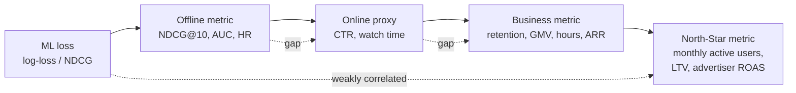

Concrete examples of the gap:

- **Netflix**: maximising predicted-rating MSE (Netflix Prize) won the contest. Netflix never deployed the winning solution — because rating prediction was decorrelated from *retention*, which is what they actually pay for.
- **YouTube**: maximising click-through rate created clickbait. They switched to **watch time** as the proxy (Covington 2016). Now they multi-objective-rank on watch time + satisfaction (surveys) + long-term subscribers (RL).
- **Spotify**: optimising play probability promotes popular tracks. Optimising the **probability of saving / following / completing 30 seconds** preserves discovery.
- **TikTok**: optimising completion-rate alone produces short-form-only feeds. They add diversity and exploration constraints.
- **Amazon search**: optimising clicks promotes cheap, low-margin items. They optimise **product margin × probability of purchase** with a quality floor.

The architecture lesson: **always optimise a weighted multi-objective**. The weights are calibrated by *online* lift on the business metric, not derived from a paper.

---

## The canonical pipeline — the universal funnel

Nearly every production recsys above ~10k items looks like this:

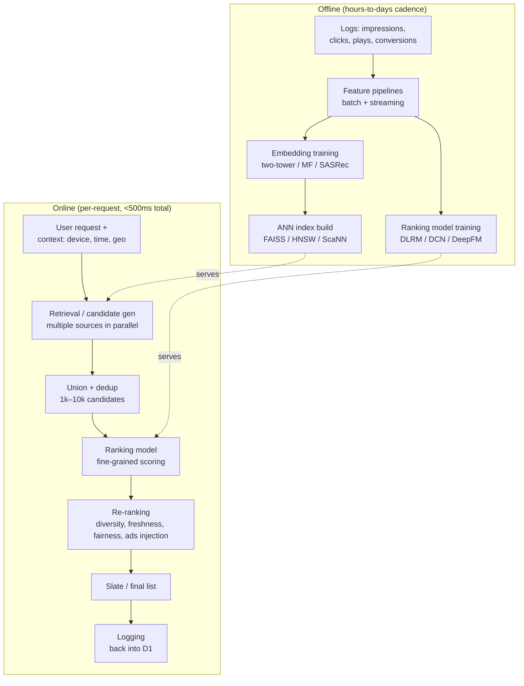

Two non-obvious properties:

1. **Logs feed back into training.** This is the **feedback loop**. The system *creates* the data it's trained on. If you don't actively counteract this — exploration, position-bias correction, IPS, off-policy correction — your system will eventually only learn what it already believed. This is the #1 source of recsys disasters.

2. **The funnel shape is determined by latency, not accuracy.** You couldn't run a full ranking model on 10M items — you'd never hit a 100 ms budget. So you build a cheap retriever to drop to ~1k, and an expensive ranker to score those ~1k. The funnel is a latency artefact that became an architectural pattern.

---

## Why a funnel, not one big model? — the math of latency

Let:
- `N` = total items (e.g. 100M)
- `T_score` = time to score one (u, i) pair through your full ranker (e.g. 100 µs on GPU)
- Budget = 100 ms

Scoring everything would cost `N · T_score = 10⁷ s ≈ 116 days`. Obviously infeasible.

The funnel splits the problem:

- **Retrieval**: a cheap function `f_R(u, i)` (typically dot-product of two embeddings) computed via ANN index in `O(log N)` time, returning ~1000 candidates in ~10 ms.
- **Ranking**: an expensive function `f_K(u, i, context, ...)` (DLRM, DCN-V2, HSTU) computed on ~1000 items in `~50 ms` on GPU.
- **Re-ranking**: a list-aware function over the top-100 candidates, ~10 ms.

Total: ~70 ms, all parallelised, within budget.

The cost model:

| Stage | Items in | Items out | Time / item | Total |
|-------|----------|-----------|-------------|-------|
| Retrieval | 100M | 1000 | n/a (ANN) | 10 ms |
| Ranking | 1000 | 100 | 50 µs | 50 ms |
| Re-ranking | 100 | 20 | 100 µs | 10 ms |

Lesson: **architecture is a latency-shaped function of model expressiveness.** This is why two-tower retrieval (a cheap inner-product) wins in the retrieval stage, and why you can spend more compute per item the further down the funnel you go.

---

## Implicit vs explicit feedback

| | Explicit | Implicit |
|---|---|---|
| Examples | 5-star rating, thumbs-up, like | Click, dwell time, play, scroll past, repeat purchase |
| Volume | Sparse (≤1% of users rate) | Dense (every interaction is a signal) |
| Noise | Low — but biased (people rate extremes) | High — clicks happen for many reasons (curiosity, accident, bait) |
| Label | What the user said | What the user did |
| Negative class | "1-star" — actual negatives exist | **Missing — absence ≠ dislike**; the unobserved-negative problem is the central technical challenge |
| Dominant algorithm | SVD, ratings MF, RMSE | ALS with confidence weighting (Hu et al. 2008), BPR, sampled softmax |

Since ~2010 every production recommender at consumer scale is implicit-feedback. The shift away from ratings happened because:

- ratings are sparse and not solicited;
- ratings drift (a 4-star in 2008 was generous; in 2026 it's mid);
- behaviour is what advertisers pay for, not stated preference.

The implicit-feedback shift forced **two new technical problems**:

1. **Confidence weighting**: a single click is weak evidence; ten plays in a row is strong evidence. The 2008 ALS-implicit paper formalised this as `c_ui = 1 + α · r_ui`.
2. **Negative sampling**: if "not clicked" doesn't mean "disliked", how do you sample negatives? Three default strategies — uniform random, popularity-proportional, in-batch from the current mini-batch — each with different bias. (Module 10 goes deep.)

---

## When **NOT** to use a recommender

This section saves more careers than the rest of the curriculum combined.

### Don't build a recommender when…

- **You have < 10k items and < 10k users.** Editorial curation outperforms ML. Spotify still hires editors. Apple News is heavily editorial.
- **Your items are functionally identical** (e.g. commodity SKUs, generic stock photos). There's nothing personalisable; surface by price, freshness, or quality.
- **Your "user" is a one-shot anonymous request.** Cold start dominates; a popularity baseline + heuristic filters wins.
- **The objective is short-term revenue alone.** A bare CTR optimiser produces clickbait. You need at least a satisfaction proxy + a freshness/diversity floor or you'll burn the marketplace down — see TikTok's 2019 churn-from-monotony research.
- **Stakes are high per recommendation** (medical, legal, hiring). The legal and ethical surface is bigger than the ML benefit; deploy interpretable models with strict audit trails.
- **Your data is < 6 months old and you have no behaviour logs.** Build the logging pipeline first. ML without logs is theatre.

### "Heuristic" baselines that frequently win

A surprising number of production launches fail to beat one of:

1. **Most popular** (global)
2. **Most popular in your country / time slot**
3. **"Because you watched X" → similar items by content**
4. **Recency-weighted popularity** (TikTok-style "what's trending now")
5. **Editorial / human curation**

Always benchmark against these *first*. The 2019 RecSys paper "Are We Really Making Much Progress?" (Ferrari Dacrema et al.) showed many published deep-learning recsys results are beaten by tuned classical baselines.

---

## Taxonomy of approaches

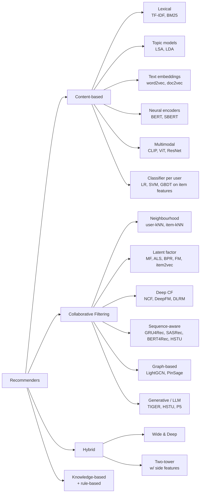

Modules 5-12 walk through each of these in detail; this section is the map.

---

## The five hard problems every recommender has

Every system below — Netflix to a 5-person B2B startup — fights the same five fires. The architecture differences are in *which* fire they prioritise.

| Problem | One-line description | Where in the funnel | Module |
|---------|---------------------|---------------------|--------|
| **Cold start** | New users, new items have no history | Retrieval, ranking | 16 |
| **Selection / exposure bias** | The system trains on data it generated; the unseen items can't be evaluated | Training data, eval | 4, 16 |
| **Position bias** | Items higher up the list get more clicks regardless of relevance | Ranking, eval | 4, 15 |
| **Popularity bias** | The rich get richer; the long tail starves | Candidate gen, ranking | 14, 16 |
| **Stakeholder conflict** | User wants relevance; platform wants engagement; advertiser wants conversions; creator wants fair distribution | Multi-task ranking | 15, 16 |

These problems do not have "solutions" — they have *trade-offs you manage*. A recsys architect's main job is choosing where on the trade-off curve to sit, by quarter.

---

## The "feedback loop" — the single most important concept

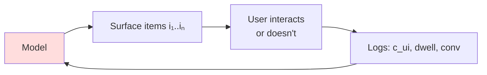

Why it's dangerous:

- Items the model never surfaces never appear in training data → confirmed-by-absence becomes confirmed-by-evidence.
- Popular items get more impressions → look more popular → get more recommended → starve the long tail.
- A poorly calibrated CTR model can degrade *itself* over weeks.

Mitigations (collectively the "responsible recsys" toolkit):

- **ε-greedy exploration**: a small fraction of slots show random or uncertain items.
- **Thompson sampling / UCB**: principled exploration based on uncertainty.
- **Inverse propensity scoring (IPS)**: re-weight training data by `1 / P(item shown)`.
- **Position-bias models** (PBM, Cascade, UBM, DBN).
- **Off-policy correction** (Top-K REINFORCE, Chen et al. 2019).
- **Random-traffic eval baselines** (Yahoo R3, KuaiRand).

---

## Sanity check (answer these before reading Module 2)

1. Why is rating prediction the "wrong" framing for almost every consumer recommender in 2026?
2. A naïve approach would score every (user, item) pair with the full ranking model. Why doesn't anyone do this, even on giant GPU farms?
3. You're a startup with 5,000 items and 800 users, two weeks of impression logs. Should you build a recommender? If not, what should you build?
4. Your CTR model is well-calibrated and you optimise pure log-loss. Six months later engagement is up but retention is down. What likely happened, and which module's tools will you reach for?
5. If your model never surfaces item X, how does it learn whether users would have liked X?


ewpage


# Module 2 — Mathematical Foundations

> If Module 1 was the map, this is the territory. Every architecture in Modules 5-12 reduces to a small zoo of math: similarity functions, matrix factorization losses, learning-to-rank objectives, sampled softmax, and calibration. Get fluent here and every paper afterward becomes shorter.

---

## 1. Similarity functions — the atom of retrieval

Almost every retrieval system in the industry computes one of these between a user vector `u ∈ R^d` and an item vector `v ∈ R^d`:

| Similarity | Formula | When used | Notes |
|------------|---------|-----------|-------|
| **Dot product** | `s(u,v) = u · v = Σ u_i v_i` | Two-tower retrieval, MF | Cheap, monotone with cosine when norms fixed |
| **Cosine** | `cos(u,v) = (u·v) / (‖u‖·‖v‖)` | Content embeddings, dense retrieval | Scale-invariant; the default for normalised embeddings |
| **Euclidean** | `d(u,v) = ‖u−v‖₂` | Some early CF, KNN | Confusion: smaller = closer; flip for ranking |
| **Mahalanobis** | `(u−v)ᵀ Σ⁻¹ (u−v)` | Metric learning when features are correlated | Σ is learned; equivalent to dot in `Lᵀ x` after Cholesky |
| **Inner product (asymmetric)** | `s(u,v) = uᵀ M v` for some matrix `M` | When user/item live in different spaces | Generalises MF; learn `M` if you want |
| **Negative L2 (Spotify Annoy default)** | `−‖u−v‖²` | When indexed with tree-ANN | Annoy's original space |
| **Hadamard / element-wise prods + MLP** | `MLP(u ⊙ v)` | NCF (neural collaborative filtering) | Expressive but slow; can't ANN-index |

Crucial identity that explains why most production systems use **dot product**:

```
‖u − v‖² = ‖u‖² + ‖v‖² − 2(u · v)
```

If you L2-normalise everything (`‖u‖ = ‖v‖ = 1`), then `‖u−v‖² = 2 − 2(u·v)`, so **cosine, dot product, and negative Euclidean rank items identically.** That's why HNSW/IVF indexes built for one similarity work for the others after normalisation — and why ScaNN, FAISS, and most ANN libraries assume normalised vectors as the happy path.

### Why dot product won

1. **Decomposable.** `s(u,v) = u · v` is the only similarity that lets you precompute item vectors once, store them in an ANN index, and answer queries in `O(log n)` (HNSW) or sub-linear (IVF, ScaNN) time.
2. **Hardware-friendly.** A dot product is a single FMA per dimension; modern hardware pipelines it across thousands of items.
3. **Theoretically grounded.** Sampled softmax (Module 10) is exact for dot-product scoring; not for an MLP.

A cross-encoder or NCF-style `MLP(u, v)` is more expressive but **cannot be indexed** — every (u, v) pair must be scored. That's why cross-encoders live in the *ranking* stage, not retrieval.

---

## 2. Matrix factorisation — the math behind every dot-product recommender

### 2.1 The basic setup

You have a sparse user-item rating matrix `R ∈ R^{|U| × |I|}` where `R_ui` is either a rating (explicit) or interaction count / 1 (implicit). Most entries are missing.

The factorisation hypothesis: there exists low-rank `P ∈ R^{|U| × k}` and `Q ∈ R^{|I| × k}` such that

```
R̂_ui = p_u · q_i  ≈  R_ui   for observed (u,i)
```

`k` is typically 32-256. The whole game is: how do we estimate `P, Q` from very sparse observations?

### 2.2 Explicit-feedback MF — the Netflix Prize formulation

Funk's 2006 blog post (during the Netflix Prize) introduced what everyone now calls **SVD for recommenders** (a misnomer — it's not exactly SVD because of missing data):

```
min  Σ_{(u,i) ∈ Ω}  (R_ui − μ − b_u − b_i − p_u · q_i)²  +  λ (‖p_u‖² + ‖q_i‖² + b_u² + b_i²)
```

where `Ω` is the set of observed (u, i) pairs, `μ` is the global mean rating, `b_u` and `b_i` are user/item biases, and `λ` is L2 regularisation.

**Why the biases matter:** without `b_u`, the model has to fit "user u rates harshly on average" using `p_u`, which steals capacity from actually modelling taste. The biases absorb the "first moment" so the latent factors model the *deviation*.

**Solver options:**

| Method | When to use | Cost per epoch |
|--------|-------------|----------------|
| **SGD / Adam** | Always works; can add tricks like time bias, side features | O(\|Ω\| · k) |
| **ALS** | Closed form per user holding items fixed; embarrassingly parallel | O(\|Ω\| · k²) |
| **Coordinate descent** | Memory-tight | similar |

### 2.3 ALS for implicit feedback — the Hu-Koren-Volinsky paper

This is the most-cited recsys paper of the 2000s. Hu, Koren, Volinsky 2008 (Yahoo). The shift to implicit data forced two changes:

1. **There are no negative ratings.** A user not playing track X may mean (a) they hate it, (b) they've never seen it, (c) it doesn't exist in their country. We can't treat "missing" as 0 or 1 — we have to model both *preference* (binary 1{interacted}) and *confidence* (a real number that scales with how many times they interacted).
2. **Every (u, i) pair contributes to the loss** — even unobserved ones, because we *do* have weak negative evidence for items the user could have interacted with but didn't.

The formulation:

```
p_ui = 1 if r_ui > 0 else 0          # binary preference
c_ui = 1 + α · r_ui                  # confidence: 1 for "no signal", larger for repeated plays

min Σ_{u,i} c_ui (p_ui − x_u · y_i)²  +  λ (‖X‖² + ‖Y‖²)
```

The objective sums over **all** (u, i) pairs — that's `|U| × |I|` terms. The genius of ALS-implicit is that closed-form per-user updates can be computed in `O(k² · |I_u| + k³)` time where `|I_u|` is u's interaction count, via a Sherman-Morrison-style trick that reuses `YᵀY` (an `k × k` matrix that summarises the "no signal" mass). That makes the algorithm linear in the *observed* data despite the objective summing over all pairs.

Typical hyperparameters in production: `k=64-128`, `α=15-40`, `λ=1e-2 to 1e0`. Spotify's original Discover Weekly was a logistic version of this; LinkedIn's Photon ML supports it; the `implicit` Python library is a faithful implementation.

### 2.4 BPR — Bayesian Personalized Ranking (Rendle 2009)

The other path from rating prediction to top-N is **pairwise ranking**: for each user, sample a positive item `i` and a negative item `j`, and require `score(u, i) > score(u, j)`.

The BPR loss:

```
L_BPR = − Σ_{(u, i, j) ∈ D_train}  ln σ( x̂_ui − x̂_uj )  +  λ Θ²
```

where `x̂_ui = p_u · q_i + b_i` (or any other scoring function — BPR is loss-agnostic).

**Why BPR was a big deal:** it directly optimises a ranking objective (AUC-like) instead of an absolute-score objective. For top-N recommendation this matches the eval metric far better than RMSE.

**Negative sampling matters more than the model.** Uniform negatives are weak signal (everything looks negative); popularity-weighted negatives skew toward heads. The 2020 "Are We Really Making Much Progress?" paper showed many "deep" recsys claims dissolve when negative sampling is harmonised.

### 2.5 Factorization Machines (Rendle 2010)

The clever generalisation of MF: instead of just user-item interactions, model second-order interactions between *all* features.

```
ŷ(x) = w_0  +  Σ_i w_i x_i  +  Σ_{i<j} ⟨v_i, v_j⟩ x_i x_j
```

For `n` features each with a `k`-dim latent vector `v_i ∈ R^k`, this has only `O(n · k)` parameters but expresses every pairwise interaction. The pairwise interactions can be computed in `O(n · k)` time via the identity:

```
Σ_{i<j} ⟨v_i, v_j⟩ x_i x_j  =  (1/2) Σ_f [(Σ_i v_{i,f} x_i)² − Σ_i v_{i,f}² x_i²]
```

That equation is the reason FM is fast in practice — quadratic-form computation collapses to linear.

**FM unifies a lot:**
- If features are one-hot user-id and one-hot item-id, FM reduces to biased MF.
- If features include item categories, FM gives you content-aware MF for free.
- DeepFM (Module 8) stacks a deep tower on top of FM's interaction part.

### 2.6 WARP, WMF, and the lesser-known cousins

- **WARP** (Weighted Approximate-Rank Pairwise): keeps drawing negative samples until you find one that violates the ranking; the loss is then weighted by an approximation of the user's position in the ranking. Implemented in LightFM.
- **Weighted MF**: a generalisation where the loss weight depends on (u, i). The Hu-Koren-Volinsky paper is the canonical instance.
- **eALS** (element-wise ALS): a variant that avoids the `YᵀY` trick using element-wise updates; usually slower but cleaner to extend.

---

## 3. Learning-to-rank loss families

Once you move beyond matrix factorisation, you need a way to *train* a model whose output is a ranking. There are three families, distinguished by how many items the loss sees at a time.

### 3.1 Pointwise

```
L_point = Σ_{(u,i)} loss(score(u, i), label(u, i))
```

Typical loss: binary cross-entropy for click prediction. Train each (u, i) example independently.

- **Pros**: simple, calibrated probabilities, the only choice when labels are continuous (watch time).
- **Cons**: ignores that the model's job is to *rank items against each other for a single user*.

This is the dominant CTR-prediction loss because in ads you need calibrated `pCTR` for the auction. **Calibration > ranking quality** in ads.

### 3.2 Pairwise

```
L_pair = Σ_{(u, i, j)}  loss(score(u, i) − score(u, j))
```

Examples: BPR (logistic), RankNet (Burges 2005, also logistic), hinge loss, WARP.

- **Pros**: directly optimises pairwise ordering. Empirically better for top-N.
- **Cons**: doesn't see absolute scores → poor calibration. Doesn't see the slate → can't optimise NDCG@5 specifically.

### 3.3 Listwise

The loss takes the whole ranked list as input. Three sub-flavours:

**LambdaRank / LambdaMART** (Burges et al.): a heuristic that approximates the gradient of NDCG. Used in industrial search rankers (Bing, Yandex, LinkedIn LiRank).

**ListNet / ListMLE** (Cao et al. 2007): probability over the entire permutation; trained with cross-entropy.

**ApproxNDCG / ApproxMRR** (Bruch et al. 2019): differentiable surrogates of the metrics, used in TF-Ranking.

**Softmax-cross-entropy listwise**: treats the positive item as a class and all other candidates in the slate as negatives. This is the dominant loss for two-tower retrieval training.

```
L_softmax = − Σ_{(u, i⁺)} log [ exp(s(u, i⁺)) / Σ_{j ∈ S} exp(s(u, j)) ]
```

`S` is the candidate set — typically the positive plus a sampled set of negatives.

---

## 4. Sampled softmax — the engine of two-tower retrieval

A naïve softmax over millions of items is intractable. **Sampled softmax** replaces the full denominator with a sampled subset and applies a correction.

### 4.1 The math

For positive item `i⁺` and sampled negatives `N`:

```
P(i⁺ | u)  ≈  exp(s(u, i⁺) − log q(i⁺))  /  Σ_{j ∈ {i⁺} ∪ N}  exp(s(u, j) − log q(j))
```

The `−log q(i)` correction (**LogQ correction**) compensates for the fact that we didn't sample items uniformly — we sampled them with proposal distribution `q(i)`. Without this correction, popular items dominate retrieval (because they appear in negatives more often, the gradient pushes them away more often, then weirdly they're *under*-ranked at serving time).

The Yi et al. 2019 paper "Sampling-Bias-Corrected Neural Modeling for Large Corpus Item Recommendations" (the Google two-tower paper) is the canonical reference and is the basis for nearly every production two-tower retrieval system.

### 4.2 In-batch negatives — the practical trick

The most efficient way to get negatives is to use the *positives of other examples in the same mini-batch*. If your batch has 8192 (user, item) pairs, then for each user you have 8191 in-batch negatives almost for free.

This is what TFRS does by default and what the Google two-tower paper recommends. The proposal `q(i)` in this regime is the **empirical sampling frequency of item i** in your batches, which you can estimate online with a Count-Min sketch.

### 4.3 Hard-negative mining

In-batch negatives are mostly "easy" — random items the user doesn't care about. To squeeze more learning out, you mine hard negatives: items the current model ranks too high for users who didn't engage with them. Three common strategies:

1. **Two-stage**: do a forward pass over a candidate pool with the current model, pick the highest-scoring non-positives as hard negatives.
2. **Negative cache**: maintain a queue of "recently hard" items and resample from it.
3. **Curriculum**: start with random negatives, gradually mix in mined ones (Pinterest PinSage does this).

Without hard negatives, recall@10 is fine but recall@1 is mediocre. Production teams almost always mine.

---

## 5. Calibration math — the secret weapon of ads

Calibration means: when your model says `P(click) = 0.05`, observed click rate should also be 0.05. Calibration matters because:

- **Auctions break without it.** GSP/VCG bids scale by `pCTR × bid`. If your model is uncalibrated, expected revenue estimates are wrong.
- **Budget pacing breaks without it.** Pacing controllers assume `Σ pCTR` predicts expected impressions.
- **Multi-objective ranking breaks without it.** If the value function is `0.4·pCTR + 0.3·pSave + 0.3·pComplete`, the weights are only interpretable if each `p` is calibrated.

### 5.1 The downsampling correction

A common training trick: downsample negatives by factor `w` to speed up training (e.g., keep 1 out of every 100 negatives). The resulting model is uncalibrated — it learns a higher class prior than reality.

The correction:

```
p_calib  =  p / (p + (1 − p) / w)
```

This is the standard post-hoc fix. The He et al. 2014 Facebook paper "Practical Lessons from Predicting Clicks on Ads at Facebook" derived and named this.

### 5.2 Platt scaling

Fit a logistic regression on (raw_score, label) on a held-out set:

```
p_calib  =  σ(a · raw_score + b)
```

Two parameters; works for sigmoid models that are mildly miscalibrated.

### 5.3 Isotonic regression

Fit a non-decreasing step function on (raw_score, label) using PAVA (Pool Adjacent Violators). Non-parametric, more flexible than Platt, but needs more held-out data (~10k examples per bucket).

### 5.4 Slice-level calibration

The fact that your *aggregate* model is calibrated doesn't mean every slice is. Production ads systems calibrate per (advertiser × placement × geo × time-of-day) slice using either:

- Per-slice isotonic regression (lots of parameters, accurate).
- A **multi-calibration** network: a small NN over `(raw_score, slice_features)` → calibrated score.

LinkedIn's LiRank trains a jointly-learned isotonic head as part of the model — eliminates the post-hoc step.

### 5.5 Expected Calibration Error (ECE)

How to measure calibration:

```
ECE = Σ_b (|B_b| / N) · | accuracy(B_b) − confidence(B_b) |
```

Bucket predictions by confidence, compute the gap between predicted prob and observed rate in each bucket, weight by bucket size. ECE < 0.01 is excellent for ads.

---

## 6. Position-bias models — the math of correcting biased data

Click rate at position 1 ≫ position 10, *regardless of relevance*. If you naively train on click data you'll learn "position 1 is good," not "this item is relevant."

The factorisation hypothesis (Click Models, Chuklin et al. 2015):

```
P(click | u, i, position) = P(examine | position) · P(relevant | u, i)
```

If you can estimate `P(examine | position)` — call it `θ(position)` — you can recover relevance via inverse-propensity scoring:

```
weight = 1 / θ(position)
```

The cleanest production trick (used by Google, YouTube, Netflix): train a **shallow tower** that takes `position` as input and concatenates its output to the main network. At inference, set position to a constant. The main network learns relevance; the shallow tower absorbs position bias. (PAL: "Position-Aware Learning to Rank", Guo et al. 2019.)

---

## 7. Putting it together — what a "score" actually is

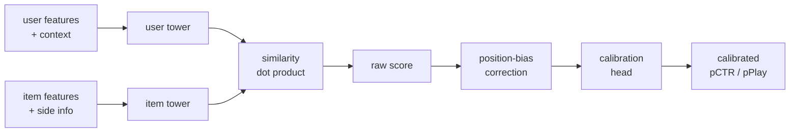

A production ranker is almost always:

1. Two towers producing `u, v`.
2. A similarity producing a raw score.
3. (Optional) a position-bias correction.
4. (Almost always) a calibration head producing a calibrated probability.
5. Multiplied or fed into a value model with bids / weights → final ranking signal.

Every piece of math in this module appears somewhere in that diagram.

---

## 8. Sanity check

1. Why does L2-normalising vectors make dot product, cosine, and negative Euclidean rank items identically?
2. In ALS-implicit (Hu et al. 2008), the objective is summed over **all** `(u, i)` pairs, including unobserved ones. How does ALS run in time linear in *observed* data?
3. Write the BPR loss for one triple `(u, i, j)` and state explicitly which is positive and which is negative.
4. Why does the LogQ correction (`−log q(i)`) appear in sampled softmax?
5. Your CTR model trained with 100× negative downsampling reports `pCTR = 0.5`. What's the calibrated `pCTR`?
6. You add a position feature directly to your ranker as a normal input. Why is that a bad idea, and what should you do instead?


ewpage


# Module 3 — Data, Signals & Features

> "Recsys engineers are paid to fix data. The model is the easy part." — every senior recsys engineer, eventually.

In Module 1 we said *the architecture is downstream of the data and the latency budget*. This module is about the data half — what you log, how you log it, how to engineer features from it, how to avoid the seven canonical traps.

---

## 1. The full event spectrum

A "user did something" event lives on a continuum from cheap-and-noisy to expensive-and-sparse.

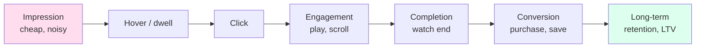

| Event | Volume per user / day | Latency to label | Use as |
|-------|-----------------------|-------------------|--------|
| Impression | thousands | instant | Negative / position-bias correction |
| Hover (web) / scroll-past | hundreds | ~seconds | Soft engagement signal |
| Click | tens | seconds | Pointwise CTR label |
| Watch-30s / play-50% | tens | minutes | Quality-aware engagement |
| Completion / save / share | units | minutes-hours | Strong positive |
| Purchase / install / subscribe | <1 typical | minutes-days | Conversion label (delayed) |
| Retention (day-7, day-30) | < 0.1 | days-weeks | Long-term reward |

The further down the pipeline you go:
- The **stronger** the signal per event.
- The **rarer** the event.
- The **more delayed** the label.

Your ranker should consume *all* of these as multi-task targets — they aren't substitutes, they're orthogonal. The Netflix multi-task head is engagement + satisfaction + retention; YouTube's MMoE is engagement + survey-satisfaction; Meta has 5-20 heads.

---

## 2. The logging discipline (the part everyone gets wrong)

Logging is unsexy infrastructure that determines whether your ranker is trainable or garbage.

### 2.1 Log impressions, not just clicks

If you only log clicks, you have positives but no observed negatives. You can't compute CTR, you can't compute position bias, you can't compute serving-time-to-click latency. Always log:

- What was **shown** (impressions, with position, with what model version, what experiment bucket).
- What was **clicked / engaged with**.
- What was **not clicked**.

The join is `LEFT JOIN impressions ON (user, session, item)` with `clicks` — every impression becomes a training row, labelled 0 or 1.

### 2.2 Log what the *model* saw, not what *you* think it saw

A common bug: the offline feature value for `user_recent_play_count` is computed at *training time* and differs from what the model saw at *serving time* (because batch and stream pipelines have different schemas, default values, or cutoff timestamps). This is **train-serve skew** — the #1 cause of "model worked offline, failed online" stories.

The standard fix is **log-and-wait**: at serving time, log the actual feature vector the model received, and train on the logged values. Eliminates skew by definition. Tecton, Feast, Vertex AI Feature Store all support this idiom.

### 2.3 Log model version, experiment bucket, exploration flag

Every impression should be tagged with:
- Which model produced this ranking (model id + version).
- Which experiment buckets the user is in.
- Whether this impression was *exploration* (random / Thompson sample) or *exploitation*.

Without these, off-policy evaluation (Module 4) is impossible. With them, you can replay logs against new policies and estimate counterfactual performance.

### 2.4 Late-binding labels and the watermark problem

Conversion happens minutes-to-days after the impression. You can't train in real time on labels you don't have yet.

Two approaches:
1. **Wait for the label window** (e.g., 7 days) before training on an impression. Loses freshness.
2. **Train with partial labels** (Chapelle 2014 delayed-feedback model) — model the censoring explicitly.

Either way, you need a **watermark**: a clear cutoff timestamp `T_w` such that everything before `T_w` is "labels are settled." The watermark advances as time passes. Training jobs ingest data up to the watermark; everything after is provisional.

---

## 3. Implicit feedback — the unobserved-negative problem

The central technical challenge of all consumer-internet recsys.

A user didn't watch movie X. This is *not* a negative — it might be:
- They've never seen it (most of the time).
- They couldn't watch it (geo-locked, on a competing service).
- They saw it and skipped (negative).
- They saved it for later (positive, eventually).

Three strategies for handling this:

### 3.1 Treat missing as negative (naïve)

Trains fine but biases the model toward popular items (because popular items have more impressions and thus more positives; rare items look like all-negative).

### 3.2 Sample negatives

Pick a sample of unobserved items and treat them as negatives. This is what BPR, sampled softmax, and most modern recsys do. The bias depends on the sampling distribution:

- **Uniform**: every item equally likely. Mathematically clean. Practical issue: most uniform negatives are easy (rare items the user clearly wasn't going to interact with).
- **Popularity-proportional** `q(i) ∝ count(i)^α`, `α ∈ [0.5, 0.75]`: harder negatives, more efficient. The classic word2vec choice (Mikolov et al. 2013) and a strong baseline for recsys.
- **In-batch**: use the positives of other examples in the same batch as negatives. Cheap, but the sampling distribution is the batch frequency — needs LogQ correction.
- **Hard-negative mining**: forward-pass through a pool, take the highest-scoring non-positives. Slower per step, faster convergence.

### 3.3 Inverse-propensity scoring (IPS)

For every (u, i) pair, estimate `P(i is shown to u)` (the propensity) and reweight observed labels by `1 / P(shown)`. Now both observed positives and observed negatives are correctly representative.

IPS handles the "items not shown" problem cleanly **if** you have access to propensities (which means your serving system has to log them or compute them post-hoc). Many production systems run a small fraction of random traffic specifically to get unbiased propensities.

---

## 4. Feature taxonomy

A production ranker consumes anywhere from dozens (B2B startups) to thousands (Meta DLRM) of features. They fall into seven categories.

| Category | Examples | Cardinality | Where computed |
|----------|----------|-------------|----------------|
| **User identity** | user_id, member_id | very high | embedding table |
| **User profile** | age band, country, language, signup vintage | low-medium | one-hot / embedded |
| **User long-term behaviour** | top genres, avg session length, lifetime plays | medium | batch from history |
| **User short-term behaviour** | last 100 items engaged, last query, last 10 minutes activity | very high (multi-hot) | streaming from event bus |
| **Item identity** | item_id, creator_id, brand_id | very high | embedding table |
| **Item content** | text embedding, image embedding, audio embedding, taxonomy | high (dense) | offline precompute |
| **Item dynamics** | recent CTR, recent saves, freshness, decay | medium | streaming counters |
| **Pair features** | did user engage with same creator before, time since last interaction | medium-high | request-time lookup |
| **Context** | time of day, device, screen size, network, session length so far | low-medium | request-time |
| **Affinity / cross** | user-genre affinity, user-language affinity | medium | batch + streaming hybrid |

### 4.1 Static vs dynamic features

- **Static**: don't change per request (user profile, item content). Cheap to cache.
- **Dynamic**: change per request (time, context, recent activity). Must be computed online.

Production split: static features pre-joined into nightly batches; dynamic features fetched from an online feature store at request time.

### 4.2 Counter features — the workhorses

The most ROI-positive features in any ranker:

- `count(user_clicked_item_in_last_24h)`
- `count(user_clicked_creator_in_last_7d)`
- `count(user_played_genre_in_last_30d)`
- `time_since_last_session`
- `dwell_time_avg_last_session`

These are cheap to compute (Count-Min sketch or HyperLogLog over a streaming window) and capture short-term taste shifts that long-term embeddings miss.

---

## 5. Embedding tables — the dominant infrastructure cost

In a modern CTR ranker, **embedding tables are 90-99% of the parameters**. The MLP on top is small (a few million params); the tables can be terabytes.

### 5.1 Why so big

You typically have:
- `user_id`: 100M-1B entries × 64-128 dims × fp32 = 25 GB - 500 GB
- `item_id`: 100M entries × 128 dims = 50 GB
- `creator_id`: 10M entries × 64 dims = 2.5 GB
- 50+ other high-cardinality categorical features

Sum: easily 1-10 TB. Meta's largest tables are 10-100 TB.

### 5.2 Compression tricks

**Hashing trick** (Weinberger et al. 2009): hash `item_id` into `N` buckets where `N << |items|`. Collisions cause two items to share an embedding row. Typical `N` is 10⁶-10⁸.

**Compositional embeddings** (Meta, Shi et al. 2020): represent each ID as a sum of two smaller embeddings via Quotient-Remainder decomposition. 100× compression with minor quality loss.

**Mixed precision**: store hot rows in fp32, cold rows in int8 or fp16.

**Frequency-aware quantization**: rare rows live at int4; head rows at fp16. Often 4× compression for <0.5% recall loss.

**Collisionless hashing (Monolith, ByteDance)**: a *dynamic* hash table where new IDs are inserted only when their occurrence count crosses a threshold, and unused IDs are evicted on a TTL. Eliminates collisions; eliminates one-time-token memorisation; bounds memory.

### 5.3 Embedding table sharding

A 10 TB table can't fit on one GPU. You shard:

- **Row-wise**: each shard owns rows 0..N/4, N/4..N/2, etc. Each forward pass needs all-to-all communication to fetch embeddings.
- **Column-wise** (less common): split the embedding dimension across shards.
- **Table-wise**: assign whole tables to whole machines.

TorchRec's planner picks the best layout per table given hardware. Multi-stage all-to-all communication is the bottleneck; FBGEMM and NCCL optimisations matter.

---

## 6. Feature freshness — the latency-quality trade-off

How fresh do features need to be?

| Feature | Acceptable staleness | Source |
|---------|---------------------|--------|
| Long-term user taste embedding | Hours-days | Daily batch retraining |
| User profile (age, country) | Days-weeks | Daily batch |
| Last 100 items engaged | Seconds-minutes | Kafka → Flink → online store |
| Last item engaged | Sub-second | Edge cache, session memory |
| Item recent CTR | Minutes-hours | Streaming aggregator |
| Item freshness (upload_age) | Real-time | Request-time computed |
| Trending score | Minutes | Streaming |

The "real-time vs batch" decision is per-feature, not a system-wide setting. Most modern feature stores (Feast, Tecton, Chronon) support both, with the **same feature definition** evaluated in both batch and stream so training and serving see consistent values.

---

## 7. The seven canonical data traps

Every team hits these. Knowing them in advance saves a quarter.

### Trap 1: Train-serve skew

Offline features are computed differently than online. Symptoms: model AUC drops in production. Fix: log-and-wait, shared feature definitions, integration tests on a few production examples.

### Trap 2: Leakage

A feature in your training data depends on the future (e.g., "user's all-time average rating" computed over the *entire* history including post-impression data). The model "learns" to use the future to predict the future, and performance dies online.

Fix: **point-in-time correctness**. Every feature value must be computable from data available *strictly before* the label timestamp. Chronon, Feast, Tecton enforce this. If your feature store doesn't, build it.

### Trap 3: Sampling bias in negatives

Your "negatives" are actually impressions that the prior model showed (selection bias). If you train on this, you reinforce the prior model's choices.

Fix: IPS reweighting, random-exploration slots, or train on broader candidate pools (not just what was displayed).

### Trap 4: Label noise from accidental clicks

Mobile mis-taps account for 5-15% of clicks. A click-through-rate model that doesn't filter them learns to recommend clickbait.

Fix: filter clicks with dwell < 1-2s as negatives or noise; use multi-task heads with both click and engagement labels.

### Trap 5: Feedback loop with no exploration

The model recommends what it already thinks is good; data only comes back from those items; the model gets more confident in the same items; the long tail starves.

Fix: ε-greedy or Thompson sampling on a small fraction of slots; cold-start exploration boost; explicit fairness constraints.

### Trap 6: Cold-start data bleeding

A new user's first session has *zero* personal features. If your training pipeline doesn't oversample new-user data, the model is great for veterans and useless for newcomers. New-user conversion is what drives growth, so this is a quiet revenue killer.

Fix: oversample new-user examples; have a separate "cold user" tower without ID embeddings; use content features only for new users.

### Trap 7: Watermark cheating

The training pipeline accidentally includes data after the watermark (e.g., "yesterday's conversions" includes some that came in this morning). Offline AUC is great; online performance is mediocre.

Fix: strict watermark enforcement, dedicated tests that simulate watermark progression, never use `MAX(timestamp)` from a streaming source as a "today" definition.

---

## 8. Concrete example: features for a music-recommendation ranker

To make it concrete — what does a Spotify-style ranker actually feed in? Approximate:

```yaml
user_features:
  - user_id (embedding)
  - country (one-hot)
  - device (one-hot)
  - age_band (one-hot)
  - tenure_months (numeric, bucketed)
  - lifetime_play_count (numeric, log-bucketed)
  - last_30d_play_count (numeric, log-bucketed)
  - last_session_minutes (numeric)
  - last_100_track_ids (multi-hot, embedded then mean-pooled)
  - last_10_artist_ids (multi-hot)
  - top_5_genres_30d (multi-hot)
  - hour_of_day (cyclic encoding)
  - day_of_week (cyclic)
  - is_weekend (binary)

item_features:
  - track_id (embedding)
  - artist_id (embedding)
  - album_id (embedding)
  - genre (multi-hot)
  - mood_tags (multi-hot)
  - audio_embedding_128d (dense, from MERT/OpenL3)
  - duration_seconds (numeric)
  - track_age_days (numeric, log-bucketed)
  - is_podcast (binary)
  - language (one-hot)
  - explicit_content_flag (binary)

dynamic_item_features:
  - global_play_count_24h (numeric, log)
  - global_skip_rate_24h (numeric)
  - artist_recent_uploads (numeric)

pair_features:
  - user_played_artist_count_30d (numeric)
  - user_played_genre_count_30d (numeric)
  - days_since_user_last_played_artist (numeric)
  - cosine_similarity(user_taste_emb, track_audio_emb) (numeric)

context_features:
  - referrer_surface (one-hot: home, search, autoplay)
  - position_in_slate (numeric, masked at inference)
  - session_play_count_so_far (numeric)
  - autoplay_seed_track_id (embedding when applicable)
```

That's ~30 features at the schema level; the embeddings expand them to thousands of *learned* dimensions. In production at Spotify scale, the actual schema is several hundred features.

---

## 9. Sanity check

1. Why is "missing rating" not the same as "negative rating" in implicit feedback?
2. You see that uniform negative sampling gives bad NDCG@10. What's the next sampling distribution to try, and why does it help?
3. Your CTR model trained beautifully but loses to production in A/B. The features look identical between batch and streaming. What is the most likely cause and how do you verify?
4. A teammate proposes adding "average rating of items in this user's lifetime" as a feature. What's the trap, and what's the right way to compute the equivalent signal?
5. Your item embedding table is 1 TB. Name three compression strategies and one trade-off of each.
6. The watermark for conversion labels is 7 days. A team wants to train hourly to get fresh signal. How do you reconcile?


ewpage


# Module 4 — Evaluation: Offline → Online → Counterfactual

> Recsys evaluation is two questions you have to answer separately:
> 1. **Offline**: given logged data, can I confidently say model B is better than model A *before* exposing real users to B?
> 2. **Online**: given that A/B testing reveals truth, how do I run experiments cheaply and quickly?
>
> The bridge between them is **counterfactual evaluation** — the third pillar.

---

## 1. The eval stack at a glance

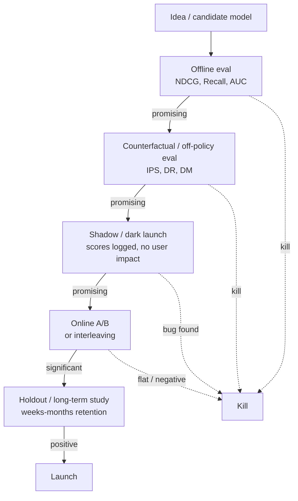

Each gate filters the funnel by an order of magnitude. Of 100 candidate ideas, ~10 survive offline, ~3 survive counterfactual, ~1 lifts in A/B, maybe 0.5 survives long-term holdout.

---

## 2. Offline metrics — what they measure

### 2.1 Retrieval / candidate-generation metrics

**Recall@k**: of the items the user actually engaged with, what fraction are in the top-k retrieved? The dominant metric for the retrieval stage.

```
Recall@k = |{relevant} ∩ {retrieved top-k}|  /  |{relevant}|
```

Typical industrial target: **Recall@100 ≥ 0.7** (for "the candidate set fed into ranking covers 70% of items the user would have engaged with").

**Coverage**: what fraction of all items are *ever* retrieved? A high-Recall@k system that only ever returns 1000 items hides a long-tail starvation problem. Coverage is the diagnostic.

### 2.2 Ranking metrics

**MAP (Mean Average Precision)**: averages precision-at-each-relevant-item over users.

```
AP_u = (1/|R_u|) Σ_{k=1..N} (relevant@k) · precision@k
MAP  = mean(AP_u over users)
```

Binary relevance only.

**NDCG@k (Normalized Discounted Cumulative Gain)**: handles graded relevance (rating, watch time).

```
DCG@k  = Σ_{i=1..k}  (2^{rel_i} − 1) / log_2(i + 1)
IDCG@k = DCG@k of the ideal (best-possible) ranking
NDCG@k = DCG@k / IDCG@k  ∈ [0, 1]
```

The `log_2(i+1)` is the position discount — items lower down count less. Choose `k=5, 10, 20` to match the visible slate.

**MRR (Mean Reciprocal Rank)**: for "find the one good answer" search-like problems.

```
MRR = mean (1 / rank of first relevant item)
```

**Hit Rate @ k (HR@k)**: was there at least one relevant in top-k? Equivalent to Recall@k when there's exactly one relevant item per query.

**AUC**: of all (positive, negative) pairs, what fraction did the model rank in the correct order?

```
AUC = P( score(pos) > score(neg) )
```

AUC is the dominant metric for CTR / pointwise binary classification — but it's a **global** metric (it averages over all pairs, including pairs from different users), which is why it correlates *poorly* with per-user ranking quality. Always pair with NDCG.

**GAUC (Grouped AUC)**: AUC computed per user, then weighted-averaged. The Alibaba-published "fix" for AUC that matters more in production.

### 2.3 Beyond accuracy

Recsys teams that only optimize accuracy ship filter bubbles. Modern teams track:

| Metric | What it captures |
|--------|------------------|
| **Coverage** | What fraction of catalog ever recommended |
| **Novelty** | Did we show items the user has never seen before? |
| **Serendipity** | Items that are unexpected *and* enjoyable (proxy: distance from user's history × engagement) |
| **Diversity (intra-list)** | Within one slate, how different are the items from each other? |
| **Diversity (inter-list / personalization)** | How different are different users' slates? |
| **Fairness — provider** | Item exposure distribution; Gini coefficient |
| **Fairness — consumer** | Per-demographic performance parity |
| **Freshness** | What fraction of recommended items are < 7 days old? |

A "good" recsys is a Pareto point on (accuracy, diversity, novelty, fairness) — not the max of one dimension.

### 2.4 The offline-online correlation gap

**The single most important fact about offline metrics**: they are weakly correlated with online business metrics.

A 2019 RecSys paper ("Are We Really Making Much Progress? A Worrying Analysis of Recent Neural Recommendation Approaches", Ferrari Dacrema et al.) showed that:

- Many published deep-learning recsys results don't beat tuned classical baselines.
- Offline metric improvements often don't replicate online.

Industry practitioners (Netflix, Spotify, YouTube) say: offline metrics are *necessary but not sufficient* — they kill bad ideas cheaply but don't reliably crown winners.

Why the gap?

1. **Selection bias** — offline metrics are computed on items the prior system showed.
2. **Position bias** — naive offline metrics ignore display position.
3. **Multi-objective reality** — offline metric is single-task; online metric is multi-stakeholder.
4. **Long-horizon mismatch** — offline metric measures next click; business cares about retention.
5. **Reactivity** — online users adapt to the model; offline data is static.

This is why offline metrics function as a **filter** (kill bad ideas) and online tests function as a **judge** (declare winners).

---

## 3. Online A/B testing — the actual judge

### 3.1 The basic recipe

1. Randomly split users into bucket A (control) and bucket B (treatment).
2. Apply the new model only to bucket B.
3. After N days, compare the chosen metric.
4. If `|metric_B − metric_A| / SE > 2`, you have a 95% significant result.

Sample size:

```
N ≈ 16 σ²  /  (MDE)²   per arm  (for two-sided 95% test, 80% power)
```

where MDE is the minimum detectable effect you care about (e.g., 1% relative).

For low-frequency metrics (purchase, retention), MDE is small and σ is large → you need millions of users per arm and weeks of duration. This is why A/B is expensive and we need offline + counterfactual filtering before it.

### 3.2 The 11 things that go wrong in A/B

1. **Sample ratio mismatch (SRM)**: the buckets aren't 50/50 because of a leakage in randomisation. Symptom: 47%/53% split. Always-check.
2. **Novelty effect**: users react to the new UI/recs in week 1; effect dissipates by week 4. Solution: longer studies.
3. **Primacy effect**: regular users haven't adapted yet; metric understates true equilibrium. Same fix.
4. **Network effects**: in social/marketplace platforms, treatment users affect control users. Solution: cluster-randomised (network-aware) A/B.
5. **Multiple testing**: if you test 20 metrics, ~1 will be 95%-significant by chance. Use Bonferroni or family-wise control.
6. **Multiple variants**: same problem; choose the best of 5 = inflated false positive. Use multi-arm bandit or holm correction.
7. **Underpowered tests on rare metrics**: revenue per user is heavy-tailed; need huge N.
8. **Peeking**: looking at results before predetermined N. Use sequential testing (mSPRT / always-valid p-values).
9. **Wrong unit of randomisation**: randomising by impression when users see many impressions creates non-independent observations. Use user-level randomisation almost always.
10. **Carryover between buckets**: shared caches, shared embeddings, shared rate limiters. Audit infrastructure for cross-bucket leakage.
11. **Long-term ≠ short-term**: a recsys change that pumps short-term clicks may hurt 30-day retention. Use holdouts to measure long-horizon metrics.

### 3.3 Interleaving — the secret weapon for ranking

Instead of "user gets model A or model B", interleave their rankings on the same page (e.g., top item from A, top item from B, second from A, second from B, ...). Then count which model contributed the clicked items.

Why it's powerful:
- Each user is their own control → much less variance.
- ~100× sample-efficient relative to bucket A/B.
- Catches subtle ranking improvements bucket A/B can't see.

Used heavily by Netflix, Google Search, Yandex, Bing. The trick is the attribution scheme — team-draft interleaving (Radlinski et al. 2008) is the standard.

### 3.4 CUPED — variance reduction via covariates

CUPED (Controlled-experiment Using Pre-Experiment Data, Deng et al. Microsoft 2013):

```
Y_adjusted = Y_metric − θ · (X_pre_period − E[X_pre_period])
```

where `X_pre_period` is the same user's metric in a pre-experiment window. Choose `θ` to minimise variance — `θ = Cov(Y, X) / Var(X)`.

Typical variance reduction: 30-50%. Equivalent: you need 30-50% fewer users for the same statistical power.

Every modern experimentation platform (Statsig, Eppo, GrowthBook, internal at FAANGs) supports CUPED out of the box.

### 3.5 Multi-armed bandits as continuous experimentation

For surfaces with frequent, low-stakes decisions (which thumbnail, which row order, which copy), classical A/B is wasteful — you allocate 50% of traffic to the loser for the whole experiment.

A **contextual bandit** (LinUCB, Thompson sampling) adaptively shifts traffic toward winning arms while maintaining controlled exploration. Netflix runs artwork bandits; Spotify runs BaRT; LinkedIn runs feed-ranking exploration.

The trade-off: bandits are great for *between-arm* allocation under known reward structure, but classical A/B is better for unbiased *measurement* of large structural changes. Most teams use both — bandits for tactical choices, A/B for strategic ones.

---

## 4. Counterfactual / off-policy evaluation — the bridge

The question: "If I had deployed policy `π_new` instead of the production policy `π_old`, what would my metric have been?"

You can't actually answer this without deploying `π_new`. But with logged data, exploration noise, and propensity weighting, you can *estimate* it. The four canonical estimators:

### 4.1 Inverse Propensity Score (IPS)

```
V̂_IPS(π_new) = (1/n) Σ_i  [ π_new(a_i | x_i) / π_old(a_i | x_i) ]  ·  r_i
```

For each logged action, reweight by the ratio of new-policy probability to old-policy probability of taking that same action.

**Pros**: unbiased.
**Cons**: high variance when policies disagree; division-by-small-numbers.

### 4.2 Self-Normalised IPS (SNIPS)

Normalise by the sum of weights to reduce variance:

```
V̂_SNIPS = Σ w_i r_i  /  Σ w_i,   w_i = π_new / π_old
```

Lower variance, slight bias. Default for production teams.

### 4.3 Direct Method (DM)

Train a reward model `r̂(x, a)`, then:

```
V̂_DM(π_new) = (1/n) Σ_i  Σ_a  π_new(a | x_i)  ·  r̂(x_i, a)
```

**Pros**: low variance.
**Cons**: biased if `r̂` is wrong (and it always is).

### 4.4 Doubly Robust (DR)

Combine the two — IPS plus a model-based correction that explains away the IPS variance.

```
V̂_DR = (1/n) Σ_i  [ Σ_a π_new(a|x_i) r̂(x_i, a)  +  (π_new(a_i|x_i) / π_old(a_i|x_i)) (r_i − r̂(x_i, a_i)) ]
```

**Pros**: consistent if *either* the propensity model *or* the reward model is correct (the "doubly robust" guarantee).
**Cons**: most complex; still high variance when policies disagree a lot.

DR is the production-grade choice. Used by Netflix, Spotify, ByteDance for off-policy eval. The Open Bandit Pipeline (`zr-obp`, ZOZO) implements all of these.

### 4.5 Top-K off-policy correction (Chen et al. 2019, YouTube)

Recsys policies show K items, not one. The K-item correction:

```
correction = K · (1 − (1 − π_new(a))^{K−1}) / π_new(a)
```

Without it, the off-policy estimator systematically underweights the contribution of the candidate-generator's choices to the user's eventual click. Required reading if you're deploying RL-style policy improvement at scale.

### 4.6 The exploration-data requirement

All counterfactual estimators need **propensities**. To get them, you need exploration: some fraction of impressions sampled by a known stochastic policy (ε-greedy, Thompson, softmax over scores).

A production system without exploration is **uncounterfactual** — you can train new models, but you can't *evaluate* them off-policy. Most mature teams reserve 1-5% of traffic for exploration specifically to enable off-policy eval.

---

## 5. Long-term and holdout evaluation

Short-term A/B can be misleading. A change that pumps clicks may hurt:
- 30-day retention (because clickbait disappoints).
- LTV (because users churn faster).
- Creator-side ecosystem health (because a few power creators dominate).

To measure these, you need:

### 5.1 Long-running holdouts

A **permanent holdout** — e.g., 1-5% of users who never see the new ranker — lets you measure long-horizon impact months later. Netflix, Airbnb, Booking all run these.

The trade-off: holdout users get a worse experience and may churn faster, biasing the comparison. The accepted answer is "holdouts are needed for measurement; tolerate the cost as the price of knowing the truth."

### 5.2 Surrogate index methods

Athey, Chetty, Imbens 2019 ("Surrogate Index"): combine multiple short-term proxies into a regression that estimates the long-term effect. Used at Facebook, Netflix, Uber.

### 5.3 Cohort experiments

Random selection of new users into model A vs model B at signup, followed for 90+ days. The cleanest measure of "does this model produce better long-term users."

---

## 6. Putting it together — a typical model-launch playbook

| Phase | Duration | What | Kill threshold |
|-------|----------|------|----------------|
| Pre-eng | 1-3 days | Offline NDCG@10, Recall@100, AUC, coverage, diversity | < production on any key metric |
| Counterfactual | 1-2 days | SNIPS / DR estimate of online CTR / play rate | < production by 1% |
| Shadow | 3-7 days | Compute scores in parallel with production, log them, no user impact | Distribution shift / serving bug |
| A/B (small) | 1-2 weeks | 1-5% traffic | < production at 95% confidence on guardrail metric |
| A/B (large) | 2-4 weeks | 20-50% traffic | Same |
| Long-term holdout | Continuous | Permanent 1% holdout | Regress on 30-day retention or LTV |

The whole playbook reflects one principle: **you can't trust any single signal**. Bayesian common sense aggregates them into one decision.

---

## 7. Sanity check

1. Why is NDCG@10 a better metric than RMSE for a top-N recommender?
2. Your offline AUC is +2% relative to production. What's the probability your online A/B will show +2% lift? (Hint: not 100%.)
3. You want to know if a new candidate generator improved Recall@100 without running an A/B. What kind of estimator do you reach for, and what data does it require?
4. Explain why CUPED works in one sentence using the words "pre-period" and "variance".
5. A teammate proposes ranking by `0.4·pClick + 0.3·pSave + 0.3·pComplete` with all probabilities directly compared. What math from Module 2 is this assuming, and what could go wrong?
6. You run an A/B for 7 days and see +1.5% clicks (p < 0.01). You launch. Engagement holds; 60 days later retention is down 0.5%. What was missing from your eval plan?


ewpage


# Module 5 — Content-Based Filtering

> "If we don't have collaborative signal, just look at the content." The original recsys approach, declared dead in 2007, quietly returned to prominence in 2023 with multimodal embeddings and LLM-derived features. Today every production recsys runs *both* content and collaborative — and the content arm is what saves you on cold start.

---

## 1. What it is

Content-based filtering recommends items **whose features are similar to items the user has interacted with**, without needing data from other users.

```mermaid
flowchart LR
    A[User's history<br/>items i_1..i_n] --> U[User profile<br/>= aggregate of item features]
    B[Candidate item j] --> V[Item features]
    U --> S[similarity(U, V)]
    V --> S
    S --> R[Score]
```

Two equivalent ways to think about it:

1. **User profile in feature space**: build a vector representing the user (e.g., average of feature vectors of items they liked), score candidates by similarity.
2. **Per-history-item similarity**: for each item in the user's history, find similar items by content; aggregate.

Both reduce to the same math when similarities are linear.

---

## 2. The classic TF-IDF + cosine recipe

The original content-based recsys (pre-2010) treated each item as a text document, used TF-IDF to vectorize, then computed cosine similarity.

### 2.1 TF-IDF

For a corpus of `N` documents and term `t`:

```
TF(t, d)   = count(t in d) / |d|
IDF(t)     = log(N / DF(t))
TF-IDF(t,d)= TF(t,d) · IDF(t)
```

Each document becomes a sparse vector over the vocabulary. Items get TF-IDF vectors over their textual descriptions (title, plot, tags).

### 2.2 User profile

The simplest aggregation: average the TF-IDF vectors of items the user has positively interacted with.

```
u  =  (1/|H|) Σ_{i ∈ H} TF-IDF(i)
```

Optionally weighted by rating, recency, or watch time.

### 2.3 Scoring

Cosine similarity:

```
score(u, j) = (u · TF-IDF(j)) / (‖u‖ ‖TF-IDF(j)‖)
```

Top-N candidates by score.

### 2.4 Where this still wins

- **Cold-start item** (just uploaded, no interaction signal): collaborative filtering can't say anything; content-based can.
- **Small catalog, niche domain**: arxiv paper recommendation, internal company document search.
- **Strict interpretability requirement**: "we recommended X because it shares features Y and Z with what you read".
- **Privacy-sensitive surface**: you don't want to share user-history embeddings, only content embeddings.

### 2.5 Where it fails

- **No serendipity**: only recommends items similar to past history → filter bubble.
- **Limited by text quality**: if your textual metadata is thin, the vectors are noise.
- **No taste calibration**: the user vector represents *all* past tastes equally, even ones the user has outgrown.
- **Bag-of-words misses semantics**: "the movie isn't bad" and "the movie is bad" have nearly identical TF-IDF vectors.

These limitations drove the 2010s shift to collaborative filtering and later to dense embeddings.

---

## 3. Modern content-based: dense embeddings

The 2023-2026 revival: replace TF-IDF with a learned dense embedding.

### 3.1 Text embeddings

- **Sentence-BERT** (Reimers & Gurevych 2019), **BGE**, **E5**, **GTE**, **`text-embedding-3-small`** (OpenAI), **Voyage**, **Cohere Embed v3**.
- Encode item title + description + structured fields into a 384-1024d vector.
- Cosine in dense space; ANN index with HNSW or IVF.

### 3.2 Image embeddings

- **CLIP** (Radford et al. 2021), **SigLIP** (Zhai et al. 2023), **EVA-CLIP**, **DINOv2** (Oquab et al. 2023).
- Encode product photos, video thumbnails, pin images.
- Pinterest's ItemSAGE, Etsy's image-search retrievers run on these.

### 3.3 Audio embeddings

- **musicnn** (Pons & Serra 2019), **OpenL3** (Cramer et al. 2019), **MERT** (Li et al. 2023), **CLMR** (Spijkervet & Burgoyne 2021).
- Spotify uses these heavily for cold-start tracks.

### 3.4 Multimodal embeddings

- A single embedding captures (image + text + audio + structured) features.
- **ItemSAGE** (Pinterest), **OneRec** (Kuaishou), Meta's product-understanding stack all do this.
- Trained with multi-task losses (matching, classification, retrieval).

### 3.5 The big shift: LLMs as feature extractors

By 2024 the standard pattern is:

```
Item ──► VLM/LLM ──► structured tags + embedding ──► production index
                  (taste, mood, occasion, style)
```

Examples:
- Amazon's COSMO (2024) uses LLMs to generate "common sense" features attached to products.
- Pinterest uses LLMs to label pins with rich taste/intent tags.
- Spotify uses LLMs for podcast topic taxonomy from transcripts.

LLMs are **the new feature engineers**. Manually-curated taxonomies have largely been replaced by LLM-derived features that are richer and easier to update.

---

## 4. User-profile construction strategies

The "user vector = average of item vectors" baseline is weak. Better recipes:

### 4.1 Time-decayed weighted average

```
u = Σ_{i ∈ H} exp(-λ · age_i) · v_i  /  Σ exp(-λ · age_i)
```

Recent items count more. `λ` tuned on validation.

### 4.2 Engagement-weighted

Weight by `watch_time / completion / rating / log(count)`.

### 4.3 Cluster the history (PinnerSage)

Single-vector user profiles underfit multi-interest users. Pinterest's PinnerSage clusters the user's recent engaged items in embedding space and represents the user by ~3 cluster medoids. Recommendations are produced by retrieving top-K per medoid and merging.

### 4.4 Sequence encoder

A transformer encoder over the sequence of item embeddings (Module 9) — the dominant modern approach.

### 4.5 Contextual user profile

Different user vector per context (time, device, surface). Netflix builds different profile vectors for "kids profile" vs "main profile" vs "weekday lunch"; Spotify per-context vectors capture "running playlist" mood vs "evening wind-down" mood.

---

## 5. Sample code: TF-IDF content recommender

(See [`code/05_content_based.py`](code/05_content_based.py) for a runnable version.)

```python
from sklearn.feature_extraction.text import TfidfVectorizer
from sklearn.metrics.pairwise import cosine_similarity
import numpy as np

# items: list of (item_id, text)
items = [
    ("m1", "action thriller with car chases and explosions"),
    ("m2", "romantic comedy in paris"),
    ("m3", "espionage spy thriller in cold war europe"),
    ("m4", "slapstick comedy with talking animals"),
    ("m5", "intense action movie with martial arts"),
]
item_ids = [i[0] for i in items]
texts    = [i[1] for i in items]

vec = TfidfVectorizer(stop_words="english", min_df=1)
X = vec.fit_transform(texts)              # sparse (5, vocab)

# user has liked m1 and m5 (action thrillers)
liked = {"m1", "m5"}
liked_idx = [item_ids.index(i) for i in liked]
user_vec = X[liked_idx].mean(axis=0)      # (1, vocab)

sims = cosine_similarity(np.asarray(user_vec), X).ravel()
ranking = sorted(zip(item_ids, sims), key=lambda x: -x[1])
for item, score in ranking:
    print(f"{item}  score={score:.3f}")
```

Expected: m3 ranks highest among unseen because "thriller" matches; m2 and m4 (comedies) score lowest.

---

## 6. Hybrid: content + collaborative

In every production system today, content-based is *one tower* of a hybrid model, not a standalone recommender. The hybrid eliminates the cold-start weakness of CF and the filter-bubble weakness of pure content.

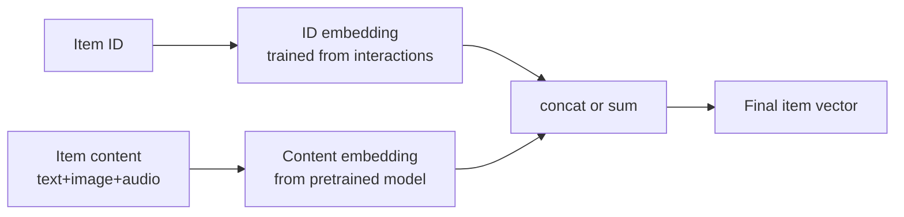

For cold-start items, `E1` is uninitialized — but `E2` still works. As interactions accumulate, `E1` learns and contributes.

This is what TwoTower-with-side-features (Module 10) does in production at YouTube, Pinterest, LinkedIn.

---

## 7. Sanity check

1. Why did content-based filtering fall out of fashion ~2010 and come back ~2023?
2. Your user has watched 200 movies; ten years ago they liked horror, now they prefer documentaries. What's wrong with averaging their history into one user vector?
3. New documentary uploaded today. Two-tower CF has never seen it. How does the model rank it for a documentary fan?
4. Suggest one feature extraction approach for cold-start music tracks.
5. Why does Pinterest cluster a user's history into multiple medoids instead of averaging?


ewpage


# Module 6 — Collaborative Filtering: Neighborhood Methods

> The first commercially successful recsys (GroupLens 1994; Amazon 1998-2003) was a neighborhood method. It's mostly displaced by matrix factorization and deep models today, but **item-item kNN is still the right answer** for a surprising number of production problems.

---

## 1. The intuition

"People like you liked these" or "items like the ones you liked are also good."

CF makes one assumption: **users who agreed in the past tend to agree in the future**, and **items rated similarly by many users tend to be similar to each other**. No need to look at content — the rating matrix itself encodes everything.

Two flavors:

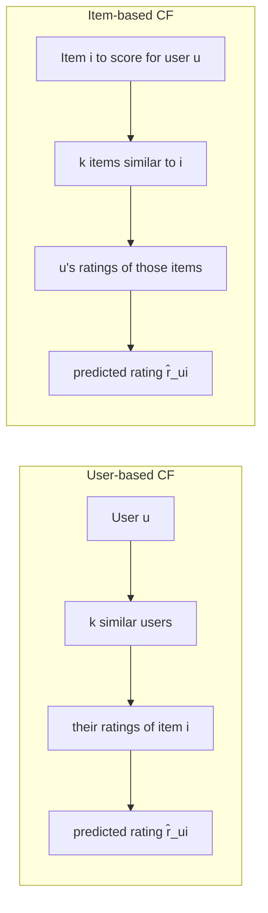

---

## 2. User-based kNN

```
sim(u, v) = similarity between users u and v based on shared rated items
N_k(u)    = top-k users most similar to u (who rated item i)
r̂_ui     = ū + Σ_{v ∈ N_k(u)} sim(u,v) · (r_vi − v̄)  /  Σ |sim(u,v)|
```

The mean-centering (`ū`, `v̄`) is critical — different users use different rating scales (one user's 5 is another's 3).

### 2.1 Similarity measures

**Pearson correlation** (the GroupLens default):

```
sim_Pearson(u,v) = Σ_{i ∈ I_uv} (r_ui − ū)(r_vi − v̄)  /  sqrt(Σ (r_ui − ū)² · Σ (r_vi − v̄)²)
```

where `I_uv` is the set of items both `u` and `v` rated. Range: [-1, 1].

**Cosine similarity** (faster, no centering):

```
sim_cos(u, v) = (r_u · r_v) / (‖r_u‖ ‖r_v‖)
```

**Jaccard** (binary feedback):

```
sim_Jaccard(u,v) = |I_u ∩ I_v| / |I_u ∪ I_v|
```

### 2.2 Shrinkage — the production trick

Raw Pearson on 2 co-rated items is 1.0 with no statistical meaning. Shrinkage damps similarities computed from too-few overlaps:

```
sim_shrunk(u,v) = (|I_uv| / (|I_uv| + α)) · sim_Pearson(u,v)
```

`α` is typically 10-100. Massive improvement on small datasets.

### 2.3 Significance weighting

Same idea, different parametrization. Multiply by `min(|I_uv|, 50) / 50` — users with fewer than 50 overlapping ratings have proportionally less weight.

### 2.4 Why user-based died in production

- **Doesn't scale**: for `|U|` users, `|U|²` pairwise similarities. At 100M users this is hopeless.
- **User similarities are unstable**: each new rating changes a user's similarities to everyone.
- **Cold start**: a new user shares no items with anyone → no similarities → no recommendations.

It survives as a small-corpus pedagogical tool. For research baselines, MovieLens etc.

---

## 3. Item-based kNN — the Amazon classic

Linden, Smith, York 2003 "Amazon.com Recommendations: Item-to-Item Collaborative Filtering." The single most influential industrial recsys paper of the 2000s.

```
sim(i, j) = similarity between items i and j based on the users who rated both
N_k(i)    = top-k items most similar to i
r̂_ui     = Σ_{j ∈ N_k(i) ∩ I_u} sim(i,j) · r_uj  /  Σ |sim(i,j)|
```

### 3.1 Why it won

1. **Item similarities are stable.** Items get rated thousands of times; pairwise stats are reliable.
2. **Item similarities can be precomputed offline.** Build the item-item similarity matrix nightly (or weekly).
3. **Item count is much smaller than user count.** Tens of millions of items vs billions of users.
4. **Serving is fast.** For user `u`, look up their recent items, fetch top-k similar items per recent item, score.
5. **Trivially scalable.** The similarity matrix is sparse (only top-k per row).

### 3.2 Adjusted cosine similarity

The standard item-based similarity (Sarwar et al. 2001):

```
sim_adj_cos(i, j) = Σ_{u ∈ U_ij} (r_ui − ū)(r_uj − ū)  /  sqrt(Σ (r_ui − ū)² · Σ (r_uj − ū)²)
```

Mean-centering per user (`ū` is the user's mean rating), so the harsh-rater vs generous-rater bias is removed.

### 3.3 Implicit-feedback variant

For implicit data (purchase, play, click), the matrix is binary. Common similarities:

- **Cosine over binary vectors**: `sim(i,j) = |U_i ∩ U_j| / sqrt(|U_i| · |U_j|)` where `U_i` is the set of users who interacted with item `i`.
- **Jaccard**: `|U_i ∩ U_j| / |U_i ∪ U_j|`.
- **Lift (PMI-flavored)**: `P(j | i) / P(j) = (|U_i ∩ U_j| / |U_i|) / (|U_j| / |U|)`. Strong for "Frequently bought together."
- **Conditional probability with shrinkage**: `(|U_i ∩ U_j| + β · P(j)) / (|U_i| + β)`.

### 3.4 BM25-flavored item similarity

A BM25-style weighting of item-item co-occurrences damps popular items so the similarity matrix doesn't end up with "everything is similar to Star Wars":

```
sim_BM25(i, j) = Σ_u  1{u rated i} · w_BM25(u, j)
```

The `implicit` Python library implements this.

### 3.5 The Amazon serving pipeline

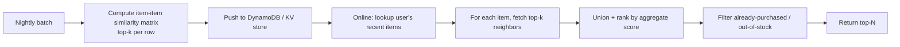

Latency: 5-20ms per request. This is the "Customers who bought X also bought Y" rail. Twenty years old, still in production at every e-commerce company.

---

## 4. Sample code: item-based kNN on MovieLens

(See [`code/06_neighborhood_cf.py`](code/06_neighborhood_cf.py) for a runnable version.)

```python
import numpy as np
from scipy.sparse import csr_matrix
from sklearn.metrics.pairwise import cosine_similarity

# R: users × items rating matrix (0 = unrated)
users   = ["alice", "bob", "carol", "dave"]
items   = ["m1", "m2", "m3", "m4", "m5"]
R = np.array([
    [5, 3, 0, 1, 4],
    [4, 0, 0, 1, 5],
    [1, 1, 0, 5, 0],
    [0, 0, 5, 4, 1],
])

# Compute item-item similarity (treat 0 as missing → binary first then weighted)
# Simple version: cosine on the raw column vectors
item_sim = cosine_similarity(R.T)
np.fill_diagonal(item_sim, 0)
print("Item similarities (m1, m2, m3, m4, m5):")
print(item_sim.round(2))

# Predict alice's rating for m3 using k=2 nearest neighbors
alice = R[0]                 # [5, 3, 0, 1, 4]
target_item = 2              # m3 (alice hasn't rated)
sims = item_sim[target_item] # similarities of m3 to all items
rated_mask = alice > 0

# top-2 items alice has rated that are most similar to m3
weights = sims * rated_mask
top_k = np.argsort(weights)[::-1][:2]

num = np.sum(sims[top_k] * alice[top_k])
den = np.sum(np.abs(sims[top_k]))
pred = num / den if den > 0 else 0
print(f"\nPredicted rating for alice on m3: {pred:.2f}")
```

---

## 5. SLIM — Sparse Linear Methods (Ning & Karypis 2011)

A clever generalization: instead of using fixed similarity weights, **learn** an item-item weight matrix `W` such that

```
ŷ_ui = Σ_j r_uj · W_ji   subject to: W is sparse, non-negative, zero diagonal
```

Solved as `|I|` independent regressions (one per column of W). Has held up well against deep methods on small datasets — the "Are We Really Making Much Progress?" 2019 paper found SLIM beats many neural baselines.

The 2020 "EASE^R" (Embarrassingly Shallow AutoEncoder, Steck) is an even simpler closed-form version that's still competitive on MovieLens.

---

## 6. When neighborhood CF still wins in production

| Situation | Why neighborhood CF wins |
|-----------|--------------------------|
| **Catalog < 1M items, < 10M users** | MF / deep models overfit; kNN is robust |
| **Strict interpretability** | "Recommended because users who bought X also bought Y" |
| **High item churn** | Daily catalog turnover makes embedding training expensive |
| **"More like this" rail** | Direct item-item lookup is exactly what's needed |
| **Cold model serving** | No GPU, no embedding tables — KV store + a few lookups |
| **Strong baseline** | Always benchmark against item-kNN before claiming a deep model wins |

---

## 7. When you should *not* use neighborhood CF

- **Cold-start items.** They have no ratings → no neighbors. Hybridize with content.
- **Long-tail dominance.** When 80% of users only have 1-2 interactions, the similarity matrix is unreliable.
- **Multi-stakeholder objectives.** Neighborhood CF optimizes co-rating, not revenue / retention / fairness.
- **Personalized ranking beyond similar-to-history.** A pure neighborhood approach can't discover items unlike the user's history.

---

## 8. Sanity check

1. Why did user-based kNN lose to item-based kNN at industrial scale even though they're mathematically similar?
2. Two items have 2 users who both rated them 5 stars. Raw Pearson similarity = 1.0. Why is this misleading and what fixes it?
3. The item-item similarity matrix at Amazon scale has 10⁷ items. Why isn't this 10¹⁴ entries in storage, and what does Amazon actually store?
4. Your "Frequently bought together" rail surfaces a $5 cable as similar to a $1000 laptop because of high co-occurrence. Suggest a similarity tweak that mitigates this.
5. For implicit feedback, which similarity (cosine over binary, Jaccard, lift) would you choose for a music streaming service, and why?


ewpage


# Module 7 — Matrix Factorization & FM Family

> The dominant recsys approach from ~2009 to ~2017. Still ships in production for the small-data parts of every company; still the strongest baseline against new deep models; still the conceptual building block of two-tower retrieval. Three names define the era: Koren, Rendle, Hu/Koren/Volinsky.

---

## 1. The factorization hypothesis

The sparse user-item interaction matrix `R ∈ R^{|U|×|I|}` is approximately low-rank: there exist `P ∈ R^{|U|×k}` and `Q ∈ R^{|I|×k}` (`k ≪ |U|, |I|`) such that

```
R̂_ui  =  μ + b_u + b_i + p_u · q_i  ≈  R_ui
```

This is *not* the same as truncated SVD: standard SVD requires a complete matrix and `R` is mostly missing. The "MF for recommenders" approach learns `P, Q` from the observed entries only, treating missing values as missing (not zero).

`μ` is the global mean rating; `b_u, b_i` are user/item biases (Module 2 §2.2).

---

## 2. The history in one paragraph

- **2006**: Simon Funk publishes his Netflix Prize blog post — SGD on the bias + factor model. The "SVD" name sticks even though it isn't really SVD.
- **2007-2008**: Koren extends with **SVD++** (incorporating implicit signal via the set of items the user has interacted with) and **timeSVD++** (bias terms that drift over time). These remain the strongest single MF models on rating prediction.
- **2008**: Hu, Koren, Volinsky publish the ALS-implicit paper. Implicit feedback CF becomes practical.
- **2009**: Rendle introduces **BPR** — Bayesian Personalized Ranking. Top-N implicit becomes a pairwise ranking problem.
- **2010**: Rendle introduces **Factorization Machines** — generalize MF to handle arbitrary feature interactions.
- **2016**: Juan et al. introduce **Field-aware FM** for ads CTR; wins multiple Kaggle competitions.
- **2017-onward**: Deep models gradually displace MF for top-N. But MF survives as a baseline that's tough to beat with proper tuning (see Rendle 2020 "Neural Collaborative Filtering vs. Matrix Factorization").

---

## 3. SGD-trained MF (the Netflix Prize version)

```
min  Σ_{(u,i) ∈ Ω}  (R_ui − μ − b_u − b_i − p_u · q_i)²  +  λ (‖P‖² + ‖Q‖² + b²)
```

Gradient updates (one example at a time):

```
e_ui = R_ui − R̂_ui
b_u  ← b_u  + η (e_ui − λ b_u)
b_i  ← b_i  + η (e_ui − λ b_i)
p_u  ← p_u  + η (e_ui · q_i − λ p_u)
q_i  ← q_i  + η (e_ui · p_u − λ q_i)
```

Typical config: `k = 50-200`, `η = 0.005`, `λ = 0.02`, 20-50 epochs.

### 3.1 SVD++

Adds an implicit factor: each user has an additional vector `y_j` for each item they implicitly interacted with (browsed, watched the trailer):

```
R̂_ui = μ + b_u + b_i + (p_u + |N(u)|^{-1/2} Σ_{j ∈ N(u)} y_j) · q_i
```

Strong on Netflix Prize. Inspired the "user representation = aggregate of item embeddings" pattern that two-tower retrieval still uses.

### 3.2 timeSVD++

User biases, item biases, and user factors are all functions of time. Models user drift ("user u used to be a horror fan; in 2024 they're documentary-heavy").

Used to be the SOTA on Netflix data. Replaced by sequential models (Module 9) that model time more directly.

---

## 4. ALS — Alternating Least Squares

For implicit feedback the standard solver. Hu, Koren, Volinsky 2008.

The objective:

```
p_ui = 1 if R_ui > 0 else 0
c_ui = 1 + α · R_ui                      # confidence

L = Σ_{u,i} c_ui (p_ui − x_u · y_i)²  + λ (‖X‖² + ‖Y‖²)
```

### 4.1 The trick

Sum is over **all** `(u, i)` — even unobserved ones (where `c_ui = 1`). A naïve implementation is O(|U|·|I|·k) per epoch. The Hu et al. trick reduces it to O((Σ |I_u|) · k² + |U| · k³) by precomputing `YᵀY` (an `k × k` matrix that summarizes the "no-signal" mass).

For each user `u`, the optimal `x_u` given fixed `Y` is closed-form:

```
x_u = (YᵀCᵘY + λI)⁻¹ YᵀCᵘp(u)
```

where `Cᵘ` is the diagonal matrix of confidences for user `u`. Crucially, `YᵀCᵘY = YᵀY + Yᵀ(Cᵘ - I)Y`, and only `|I_u|` rows of `Cᵘ - I` are non-zero. So we cache `YᵀY` once per iteration and update only the small correction.

Alternate between fixing `Y` and solving for `X`, and vice versa. Converges in 10-30 iterations.

### 4.2 The `implicit` library

Production-quality Python implementation of ALS-implicit, BPR, LMF, and similar. Supports both CPU and GPU. Used in many startups. Reference baseline for music, e-commerce, B2B recsys.

```python
import implicit
import scipy.sparse as sp

# user_item: csr_matrix, rows = users, cols = items, values = play counts
model = implicit.als.AlternatingLeastSquares(
    factors=64, regularization=0.01, alpha=15, iterations=20
)
model.fit(user_item)

# top-10 for user 42
ids, scores = model.recommend(42, user_item[42], N=10)
```

### 4.3 Where ALS-implicit still wins

- **Sparse implicit data, no rich features**: small e-commerce, small media catalogs.
- **Offline batch recommendation**: nightly nature; no online updating.
- **Strong baseline for benchmarking**: harder to beat than papers claim.

---

## 5. BPR — Bayesian Personalized Ranking

Rendle et al. 2009. The "give up on rating prediction, optimize a ranking criterion" move.

### 5.1 The loss

For each user `u`, sample a positive item `i ∈ I_u⁺` and a negative item `j ∉ I_u⁺`:

```
L_BPR = − Σ_{(u, i, j)}  ln σ(x̂_ui − x̂_uj)  +  λ Θ²
```

The model `x̂_ui` can be MF, FM, deep — BPR is just the loss.

Gradient (one triple):

```
∂L/∂Θ = − σ(−(x̂_ui − x̂_uj)) · ∂(x̂_ui − x̂_uj)/∂Θ
```

For MF, `∂(x̂_ui − x̂_uj)/∂q_i = p_u`, `∂(.)/∂q_j = -p_u`, `∂(.)/∂p_u = (q_i − q_j)`.

### 5.2 Why BPR works

The loss is approximately AUC. Pairs where the model is most wrong contribute the largest gradient; pairs that are already correct contribute near-zero. The model focuses learning on the ranking margin.

### 5.3 Negative sampling matters

The whole gradient depends on which `j` you sample.

- **Uniform**: weak signal; most negatives are easy.
- **Popularity-proportional** (Mikolov 2013, `q(j) ∝ count(j)^0.75`): standard recipe.
- **Hard negatives** (item with highest current score that isn't in positives): faster convergence, occasional overfitting.

LightFM implements BPR with a related pairwise loss (WARP — Weighted Approximate Rank Pairwise, Weston et al. 2011) that adapts negative weights based on how many negatives must be tried before finding a violator.

---

## 6. Factorization Machines (Rendle 2010)

The big idea: stop hard-coding "user × item" interaction. Model **every pairwise interaction** among arbitrary features.

```
ŷ(x) = w_0  +  Σ_i w_i x_i  +  Σ_{i<j} ⟨v_i, v_j⟩ x_i x_j
```

Each of the `n` features (e.g., user_id, item_id, time-of-day, device, country, last_genre, ...) has a `k`-dim latent vector `v_i`. The pairwise interaction is the dot product of latent vectors.

### 6.1 The fast-evaluation identity

The naive sum has `O(n²)` terms. The clever identity (Module 2 §2.5):

```
Σ_{i<j} ⟨v_i, v_j⟩ x_i x_j  =  (1/2) Σ_f [(Σ_i v_{i,f} x_i)² − Σ_i v_{i,f}² x_i²]
```

This is `O(n · k)` — linear. Critical for the algorithm's practicality.

### 6.2 Why FM generalizes MF

- If features are one-hot user-id and one-hot item-id, FM reduces to biased MF.
- Add a time-of-day feature → FM learns time-conditional taste interactions.
- Add a content feature (genre) → FM gets a content-aware MF for free.

### 6.3 Field-aware FM (FFM)

Each feature `i` has *one embedding per field of its interaction partner*. So `user_id` has separate latent vectors when interacting with `item_id` vs `time_of_day` vs `device`:

```
ŷ_FFM(x) = w_0 + Σ w_i x_i + Σ_{i<j} ⟨v_{i,f(j)}, v_{j,f(i)}⟩ x_i x_j
```

Where `f(j)` is the field of feature `j`.

Won the Criteo Display Advertising Challenge (2014, Avazu (2015), Criteo (2017)). The Kaggle CTR-champion technique for years.

Cost: `O(n · k · |fields|)` parameters vs FM's `O(n · k)`. Heavier but more expressive.

### 6.4 Production status of FM/FFM

- **2014-2019**: dominant ads CTR baselines.
- **2017+**: subsumed by deep models (DeepFM, xDeepFM — Module 8).
- **Today**: pure FM still in production at smaller ads companies; FFM mostly retired.
- The deep-FM hybrid (FM + DNN with shared embeddings) is the canonical 2017-2022 industrial pattern.

---

## 7. The 2020 reproducibility shock

Rendle, Krichene, Zhang, Anderson 2020: "Neural Collaborative Filtering vs. Matrix Factorization Revisited" (RecSys 2020). The key finding:

> **NCF** (Neural Collaborative Filtering, He et al. 2017, 7000+ citations) was supposed to beat plain dot-product MF. **It doesn't, when MF is tuned properly.**

This was the loudest signal in a broader 2019-2020 reproducibility wave (Ferrari Dacrema et al. 2019, Sun et al. 2020) showing many deep recsys claims didn't replicate when classical baselines were tuned.

Practical take-aways:
- Always tune MF / ALS / BPR carefully before claiming a deep model wins.
- The performance gap between classical and deep is small on sparse data; it widens with more features (where deep models shine).
- Architecture innovations matter less than data quality, negative sampling strategy, regularization, and feature engineering.

---

## 8. Sample code: matrix factorization with SGD from scratch

(See [`code/07_matrix_factorization.py`](code/07_matrix_factorization.py) for a runnable version with biases and explicit ALS.)

```python
import numpy as np

n_users, n_items, k = 4, 5, 8
np.random.seed(0)
P = np.random.normal(0, 0.1, (n_users, k))
Q = np.random.normal(0, 0.1, (n_items, k))
b_u = np.zeros(n_users)
b_i = np.zeros(n_items)
mu  = 3.5

# (user, item, rating) tuples
ratings = [
    (0, 0, 5), (0, 1, 3), (0, 3, 1), (0, 4, 4),
    (1, 0, 4), (1, 3, 1), (1, 4, 5),
    (2, 0, 1), (2, 1, 1), (2, 3, 5),
    (3, 2, 5), (3, 3, 4), (3, 4, 1),
]

lr, reg, epochs = 0.01, 0.02, 200
for epoch in range(epochs):
    np.random.shuffle(ratings)
    sse = 0
    for u, i, r in ratings:
        pred = mu + b_u[u] + b_i[i] + P[u] @ Q[i]
        err  = r - pred
        sse += err ** 2

        # Update
        b_u[u] += lr * (err - reg * b_u[u])
        b_i[i] += lr * (err - reg * b_i[i])
        P[u]   += lr * (err * Q[i] - reg * P[u])
        Q[i]   += lr * (err * P[u] - reg * Q[i])

    if epoch % 50 == 0:
        rmse = (sse / len(ratings)) ** 0.5
        print(f"Epoch {epoch:3d}  RMSE={rmse:.4f}")

# Predict user 0's rating for item 2 (which they haven't rated)
pred = mu + b_u[0] + b_i[2] + P[0] @ Q[2]
print(f"Predicted rating user 0 → item 2: {pred:.2f}")
```

---

## 9. Sanity check

1. Why is "SVD for recommenders" technically a misnomer?
2. In the Hu-Koren-Volinsky ALS-implicit formulation, what is `c_ui` for an item the user never interacted with, and what does that contribute to the objective?
3. Explain in one sentence why BPR's loss is sometimes called "AUC-like".
4. FM has `O(n · k)` parameters but expresses every pairwise interaction. How is that possible?
5. The 2020 NCF reproducibility paper claimed plain MF beats NCF when properly tuned. What's the broader lesson for evaluating new recsys ideas?
6. Your team replaces ALS with a DLRM-style ranker and AUC goes up 0.5% offline. Why might this not translate to an online win?


ewpage


# Module 8 — Neural Recommenders & CTR Models

> This is the lineage that produced the 2017-2024 ads-ranking architecture and the modern ranker at every major platform. The pattern: stack a *deep tower* (memorization + feature crossing) on top of *embedding tables* over sparse features. The fights are about which feature-crossing operator wins.

---

## 1. The "neural-collaborative-filtering" era and its caveat

He et al. 2017, **NCF (Neural Collaborative Filtering)**. The proposal: replace MF's dot product with an MLP over `(p_u, q_i)` to model non-linear interactions:

```
ŷ_ui = MLP( concat(p_u, q_i) )
```

Cited 7000+ times. The big caveat: Rendle, Krichene, Zhang, Anderson 2020 (RecSys 2020) showed **a properly tuned dot-product MF beats NCF**. The lesson — non-linear interactions over MF embeddings are not free; baselines matter; reproducibility matters.

Still, NCF crystallized a useful template: **embeddings + deep tower**. Almost every CTR model below is a variation on it.

---

## 2. Wide & Deep (Google Play, Cheng et al. DLRS 2016)

The architecture that defined industrial CTR for the late 2010s.

```
P(click)  =  σ(  w_wide · x_wide  +  w_deep · a^(L)  +  b  )
```

Two parts trained jointly:

- **Wide**: linear model over **manually crossed** categorical features. "memorization" of specific (user, item) combinations.
- **Deep**: MLP over learned embeddings of sparse features. "generalization" — embeddings let unseen combinations score reasonably.

```mermaid
flowchart TB
    subgraph Wide
        F1[Sparse categorical<br/>+ hand-crafted crosses] --> L[Linear / LR<br/>w_wide · x_wide]
    end
    subgraph Deep
        F2[Sparse categorical] --> E[Embedding<br/>tables]
        F2dense[Dense features] --> CONCAT
        E --> CONCAT[Concatenate]
        CONCAT --> M[MLP<br/>4-5 layers]
    end
    L --> ADD[Sum + sigmoid]
    M --> ADD
    ADD --> P[P(click)]
```

Deployed for app recommendations in Google Play. Shipped as `tf.estimator.DNNLinearCombinedClassifier`. The dominant architecture pattern at Google for years.

**Pain point**: the Wide component needs hand-crafted feature crosses. This is the central problem the next decade tried to solve automatically.

---

## 3. DeepFM (Huawei + HKUST, Guo et al. IJCAI 2017)

Replace the Wide component with an **FM** sharing embeddings with the Deep tower:

```
score = σ( FM_part(emb) + DNN_part(emb) )
```

- **FM part**: linear terms + pairwise FM interactions.
- **DNN part**: MLP over the concatenated embeddings.
- **Shared embeddings**: same embedding table feeds both.

DeepFM eliminated the manual cross-feature engineering of Wide & Deep. State-of-the-art for ~2 years.

---

## 4. xDeepFM (Microsoft, Lian et al. KDD 2018)

DeepFM's FM part only models second-order interactions. xDeepFM introduces **Compressed Interaction Network (CIN)**:

- Layer-by-layer **vector-wise** interactions (not element-wise).
- Each layer takes outer products of previous-layer field embeddings × the initial layer.
- Produces explicit polynomial features up to bounded degree.

```
score = σ( linear + CIN_output + DNN_output )
```

Won several CTR competitions. CIN is more expressive than FM but heavier; in practice it's hard to tune.

---

## 5. AutoInt (Song et al. CIKM 2019)

Replace explicit feature crosses with **multi-head self-attention** over field embeddings.

```
emb_i_new = MultiHeadAttention(emb_i, {emb_j} for all j)
```

Conceptually: every feature attends to every other feature; the attention weights encode learned pairwise importance.

Strong on benchmarks. Practical wrinkle: self-attention is O(n²) in number of fields, which becomes painful when you have 100+ fields.

---

## 6. DCN / DCN-V2 (Google, Wang et al. 2017 / 2021)

The **Deep & Cross Network**. The cross-layer operator:

```
x_{l+1} = x_0 ⊙ (W_l x_l + b_l) + x_l
```

- `x_0` is the initial embedding-concat vector.
- Each cross layer adds one degree of polynomial interaction.
- L layers → polynomial features up to degree L.

DCN-V1 had a scalar `W_l` (limited capacity). DCN-V2 (Wang et al. WWW 2021) uses a **full matrix** `W_l` with low-rank factorization. This is the version that runs in Google production (YouTube ranking, Google Ads).

The Wang 2021 paper is also famous for its **practical lessons** section — features, embeddings, hashing strategies. Mandatory reading for ranking engineers.

---

## 7. FiBiNet, FiBiNet++, MaskNet (Sina Weibo)

These three add **per-example feature reweighting**:

- **FiBiNet** (Huang et al. RecSys 2019) — SENet (squeeze-and-excitation) computes a per-field weight for each field embedding; bilinear feature interaction after reweighting.
- **FiBiNet++** (2022) — refinement.
- **MaskNet** (Wang et al. DLP-KDD 2021) — multiplicative masking blocks; the "MaskBlock" multiplies element-wise instead of adding residual.

These tend to add ~3-5% offline AUC at ~10% extra compute on industrial datasets. Whether they make production usually depends on whether you can afford the extra latency.

---

## 8. DLRM (Meta, Naumov et al. 2019)

**Deep Learning Recommendation Model** — Meta's open-sourced reference for an embedding-heavy ranker.

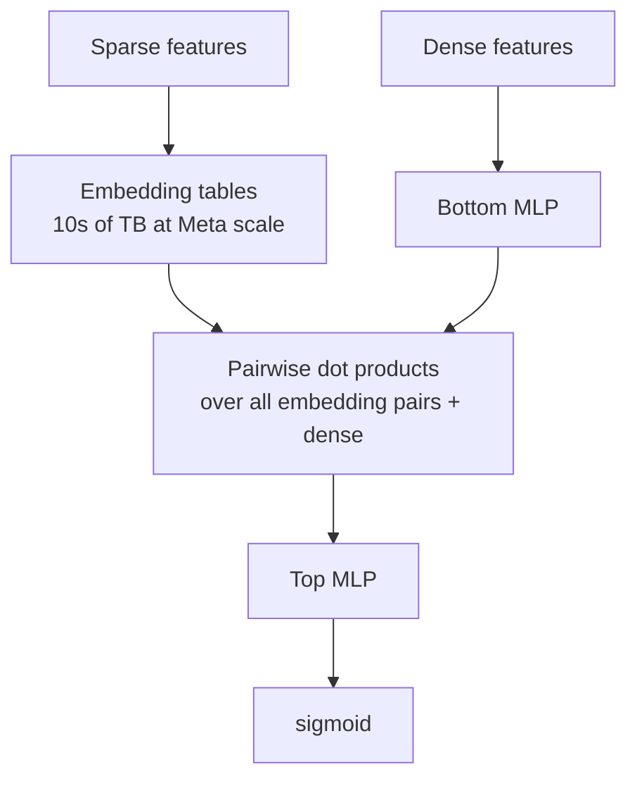

- **Sparse features** → embedding tables → list of `k`-dim vectors.
- **Dense features** → bottom MLP → one `k`-dim vector.
- **Feature interaction layer**: compute pairwise dot products among all `n` embedding vectors + the dense vector. Output `n·(n+1)/2` interaction features.
- **Top MLP** consumes the dense vector + interaction features → sigmoid → CTR.

DLRM's main contribution isn't the architecture *per se* but the **systems engineering**:
- Embedding-table sharding (row, column, table-wise).
- ZionEX training platform (Mudigere et al. ISCA 2022).
- TorchRec, FBGEMM, PARAM benchmark suite.
- MLPerf Recommendation uses DLRMv2 (793B params).

DLRM is the default ranker for **most Meta surfaces** through 2024 (Ads, Reels first-stage). Being replaced by HSTU (Module 12) in 2024-2026.

---

## 9. DIN, DIEN, BST — the Alibaba sequence-conditioning line

For e-commerce, "what is this user likely to buy next" depends heavily on their **recent history**. The Alibaba line adds **history-conditioning** to CTR ranking.

### 9.1 DIN — Deep Interest Network (Zhou et al. KDD 2018)

For each candidate ad `a`, compute attention weights over the user's recent items:

```
user_repr_for_a = Σ_h  attention(emb_a, emb_h) · emb_h
```

The user representation is **target-aware** — different for different candidate ads. Captures "this user is interested in a if they recently looked at related items."

### 9.2 DIEN — Deep Interest Evolution Network (Zhou et al. AAAI 2019)

Replace attention with a **GRU + attention** over the history sequence. Models *evolution* of interests over time (auxiliary loss: predict next-clicked item).

### 9.3 BST — Behavior Sequence Transformer (Chen et al. DLP-KDD 2019)

Transformer encoder over the behavior sequence. The most direct sequence-modeling approach. Still uses target-aware attention with the candidate as query.

### 9.4 The lifelong-sequence problem: SIM, ETA, TWIN

User histories grow to thousands of items. Direct attention is `O(L)` per candidate; with 10k history and 1k candidates that's 10M ops per request — too slow.

- **SIM** (Pi et al. CIKM 2020) — two-stage: a "hard search" by category retrieves recent same-category items, then DIN-style attention.
- **ETA** (Chen et al. 2021) — replaces hard search with **SimHash LSH** jointly trained with the ranker.
- **TWIN** (Chang et al. KDD 2023, Kuaishou) — unified target-aware attention across both retrieval and ranking. Deployed in Kuaishou for short-video ads.

Detail in Module 9.

---

## 10. The 2023-2025 frontier: FinalMLP, generative CTR, scaling laws

### 10.1 FinalMLP (AAAI 2023)

A simple finding: a **two-stream MLP** with feature gating and bilinear fusion **matches or beats** DCN-V2, AutoInt, MaskNet on standard CTR benchmarks.

Lesson: architectural innovation in CTR is hitting diminishing returns; data, features, and calibration matter more than the latest feature-cross operator.

### 10.2 HSTU and Wukong (Meta, ICML 2024)

The two papers redefined "the next era":

- **HSTU** (Hierarchical Sequential Transducer Unit): autoregressive transformer over user actions. Cast CTR + ranking as next-token prediction. Reached 1.5T parameters in production. Module 12.
- **Wukong** (Towards a Scaling Law for Large-Scale Recommendation): stackable FM-like blocks with **clean scaling laws** up to ~100B params. Performance is power-law in params and data, like LLMs.

The implication: **recsys has its scaling-law moment**. More parameters + more data + larger sequence → predictable improvements.

### 10.3 PEPNet / STAR (multi-domain)

When a single ranker serves multiple domains (e-commerce + ads + content):

- **STAR** (Sheng et al. CIKM 2021) — "Star topology" — shared parameters + domain-specific parameters.
- **PEPNet** (Chang et al. KDD 2023) — Parameter and Embedding Personalized Network. Per-domain gating networks modulate both embeddings and ranker parameters.

Used in production at Kuaishou.

---

## 11. Sample code: a small DLRM-style ranker in PyTorch

(See [`code/08_dlrm_lite.py`](code/08_dlrm_lite.py) for a runnable version.)

```python
import torch, torch.nn as nn

class DLRMLite(nn.Module):
    def __init__(self, sparse_field_dims, dense_dim, emb_dim=16, mlp_hidden=(64, 32)):
        super().__init__()
        # one embedding table per sparse field
        self.emb = nn.ModuleList([nn.Embedding(n, emb_dim) for n in sparse_field_dims])
        # bottom MLP for dense features
        self.bottom = nn.Sequential(
            nn.Linear(dense_dim, emb_dim), nn.ReLU(),
            nn.Linear(emb_dim, emb_dim), nn.ReLU(),
        )
        # number of pair interactions: N choose 2 where N = #sparse + 1 (dense)
        n_fields = len(sparse_field_dims) + 1
        n_pairs  = n_fields * (n_fields + 1) // 2

        layers, prev = [], n_pairs + emb_dim
        for h in mlp_hidden:
            layers += [nn.Linear(prev, h), nn.ReLU()]
            prev = h
        layers += [nn.Linear(prev, 1)]
        self.top = nn.Sequential(*layers)

    def interact(self, vectors):
        # vectors: (B, N, D)
        B, N, _ = vectors.shape
        T = torch.bmm(vectors, vectors.transpose(1, 2))  # (B, N, N)
        idx = torch.triu_indices(N, N, offset=0)
        return T[:, idx[0], idx[1]]                      # (B, N*(N+1)/2)

    def forward(self, sparse_idx, dense_x):
        # sparse_idx: (B, n_sparse) longs
        # dense_x:    (B, dense_dim) floats
        emb_vecs = [e(sparse_idx[:, k]) for k, e in enumerate(self.emb)]  # list of (B, D)
        d_vec = self.bottom(dense_x)                                       # (B, D)
        all_vecs = torch.stack(emb_vecs + [d_vec], dim=1)                  # (B, N, D)
        pair_feats = self.interact(all_vecs)                               # (B, N*(N+1)/2)
        x = torch.cat([d_vec, pair_feats], dim=1)
        return torch.sigmoid(self.top(x)).squeeze(-1)

# Example
model = DLRMLite(sparse_field_dims=[1000, 500, 200], dense_dim=8)
sparse = torch.randint(0, 200, (32, 3))
dense  = torch.randn(32, 8)
print(model(sparse, dense).shape)   # (32,)
```

---

## 12. Sanity check

1. Why did Wide & Deep need hand-crafted feature crosses in the Wide component, and how did DeepFM remove that?
2. In DCN-V2, what does the cross-layer operator compute, and how does it differ from a simple MLP?
3. DLRM's pairwise dot products produce N·(N+1)/2 interaction features. Why is this affordable but a full N×N MLP isn't?
4. A user's history is 10,000 items. Standard DIN attention would compute attention with 10k key-vectors per candidate. What did SIM / ETA / TWIN do to reduce this cost?
5. Wukong showed recsys scales like LLMs. What's the practical implication for an architect choosing model size in 2026?


ewpage


# Module 9 — Sequential & Session Models

> If Module 8 is "the user is a static profile that interacts with items," this module is "the user is a sequence of events, and what they do next depends most on what they just did." The dominant pattern for short-video, music, e-commerce, and ads since 2018.

---

## 1. Why sequential

Static recommenders mix together a user's history into a single vector. That works when long-term taste is stable. It fails when:

- The user has multiple interest "moods" (Netflix kids vs adult).
- Recent context dominates (just searched for running shoes → next session should rank running gear).
- Sequence patterns matter (people who watch episode 1 of a series want episode 2).
- Sessions have arcs (workout playlist starts slow, ramps up).

Sequential models capture these by *processing the history as a sequence* and predicting the next event.

```mermaid
flowchart LR
    H[Last N events:<br/>e_1, e_2, ..., e_n] --> ENC[Sequence encoder<br/>RNN / Transformer]
    ENC --> R[Representation of current state]
    R --> S[score(state, candidate item)]
    C[Candidate item j] --> S
    S --> P[P(next = j | history)]
```

---

## 2. GRU4Rec (Hidasi et al. ICLR 2016) — session-based RNNs

The first widely deployed sequential recommender. Treats a user session as a sequence; uses a **GRU** to encode it.

```
h_t = GRU(emb(i_t), h_{t-1})
ŷ_t = softmax(W · h_t)
```

At inference, `h_t` is the user state; `argmax` over `softmax` is the next-item prediction.

**Why GRU not LSTM**: empirically similar but cheaper. **Why softmax not regression**: top-N matters more than scores.

Limitations: hard to parallelize at training (sequential RNN); long sequences need truncated backprop; doesn't handle items the user hasn't seen.

---

## 3. SASRec — Self-Attentive Sequential Recommendation (Kang & McAuley ICDM 2018)

Replace the RNN with a **transformer decoder**.

```
masked self-attention over history → next-item prediction
```

- Causal mask: position `t` only attends to positions `< t`.
- Loss: cross-entropy over `next_item` for each position.
- Inference: take the final-position output, top-K via dot product against item embeddings.

SASRec is the **canonical sequential recsys baseline**. Still hard to beat without significantly more compute. Most "new" sequential papers compare against it.

```python
class SASRec(nn.Module):
    def __init__(self, n_items, d_model=64, n_layers=2, n_heads=2, max_len=50):
        super().__init__()
        self.item_emb = nn.Embedding(n_items + 1, d_model, padding_idx=0)
        self.pos_emb  = nn.Embedding(max_len, d_model)
        layer = nn.TransformerEncoderLayer(d_model, n_heads, batch_first=True)
        self.encoder = nn.TransformerEncoder(layer, n_layers)
        self.max_len = max_len

    def forward(self, seq):           # seq: (B, L) item ids
        pos = torch.arange(seq.size(1), device=seq.device)
        x = self.item_emb(seq) + self.pos_emb(pos)
        mask = nn.Transformer.generate_square_subsequent_mask(seq.size(1)).to(seq.device)
        h = self.encoder(x, mask=mask)
        # score against all items
        logits = h @ self.item_emb.weight.T
        return logits   # (B, L, n_items+1)
```

---

## 4. BERT4Rec — Bidirectional Encoder (Sun et al. CIKM 2019)

Instead of causal next-item prediction, **masked-item prediction**. Pre-train by randomly masking items in the sequence and predicting them from the *bidirectional* context.

- Same architecture as BERT.
- Inference: mask the last position and predict.
- Slightly better than SASRec on many benchmarks; harder to fine-tune.

**Caveat** (Petrov & Macdonald 2022): the original BERT4Rec evaluation was non-standard; with a fair comparison the gap to SASRec is small.

---

## 5. Contrastive sequential models

A self-supervised twist: augment the sequence (mask, crop, reorder), then contrastively train so different augmentations of the same sequence are nearby.

- **CL4SRec** (Xie et al. ICDE 2022) — three augmentations: item crop, mask, reorder.
- **DuoRec** (Qiu et al. 2022) — model-augmented positive pairs.
- **S3-Rec** (Zhou et al. CIKM 2020) — self-supervised pretraining with multiple objectives.

Helps especially in **cold-start sequences** and when the action space is huge.

---

## 6. Long-sequence modeling — the SIM/ETA/TWIN line

Standard sequence models truncate to the last 50-200 events. But a Tmall user has thousands of past purchases; clipping to 50 loses signal. The Alibaba/Kuaishou lineage tackles this.

### 6.1 SIM — Search-based Interest Model (Pi et al. CIKM 2020, Alibaba)

Two-stage attention:

1. **General Search Unit (GSU)** — retrieve top-K items from the user's lifelong history that are relevant to the target ad. Two flavors:
   - **Hard search**: same-category items via inverted index.
   - **Soft search**: embedding-based ANN.
2. **Exact Search Unit (ESU)** — DIN-style target-aware attention over the retrieved subset.

Allows lifelong history (10k+) with manageable cost. Production at Alibaba.

### 6.2 ETA — End-to-end User Behavior Retrieval (Chen et al. 2021)

Replaces hard search with **SimHash LSH** that's **jointly trained** with the ranker. The retrieval step is differentiable end-to-end.

### 6.3 TWIN — Two-stage Interest Network (Chang et al. KDD 2023, Kuaishou)

Unifies target-aware attention across both retrieval and ranking — closes the representation gap. The two stages share the same attention parameters, so the retrieval picks "things the ranker would care about."

### 6.4 TWIN-V2 (2024)

Hierarchical clustering of the lifetime history; cluster-aware target attention. Scales to truly lifelong sequences.

---

## 7. HSTU — Hierarchical Sequential Transducer Unit (Meta, Zhai et al. ICML 2024)

The most consequential sequential recsys paper of 2024. Module 12 details. In brief:

- Cast both **retrieval and ranking** as next-action prediction over an interleaved sequence of `(item, action)` tokens.
- HSTU layer = pointwise feedforward + gated linear attention variant. FLOPs scale roughly linearly with sequence length.
- Scales to **1.5T parameters**, sequences of tens of thousands of events.
- **Clean scaling laws** (Wukong, Zhai et al. follow-on): performance is power-law in compute, like LLMs.

Replaces DLRM at Meta production scale for Reels and ads through 2024-2025.

---

## 8. Sequence-aware ranking vs sequence-aware retrieval

Two different uses of sequence models:

| Use | Architecture | Output |
|-----|--------------|--------|
| **Retrieval** | Encoder of user sequence → user vector; ANN over item vectors | Top-K candidates |
| **Ranking** | Encoder of sequence + features → score per candidate | Fine-grained scores |

Most production systems use **both**:
- A sequence-encoder user vector for two-tower retrieval.
- A heavier sequence-aware ranker (DIN-style) for fine ranking.

---

## 9. Negative sampling in sequential models

Sequential models almost always train with **sampled softmax** over the item vocabulary:

```
L = − Σ_t  log [ exp(s(h_t, i_{t+1})) / Σ_{j ∈ S} exp(s(h_t, j)) ]
```

where `S = {i_{t+1}} ∪ negatives`.

- **Random uniform negatives**: simplest.
- **Popularity-proportional**: standard.
- **In-batch**: cheap, biased toward popular items.
- **Hard negatives via current-model retrieval**: most expensive, fastest convergence.

The LogQ correction (Module 2 §4) applies here too.

---

## 10. Industry use cases

| Company | Sequential model | Surface |
|---------|------------------|---------|
| TikTok / ByteDance | Two-tower + Monolith + HLLM | For You Page |
| Meta | DLRM with sequence features → HSTU (2024+) | Reels, Feed |
| YouTube | Two-tower + ranking + RL with off-policy correction | Watch Next |
| Spotify | Session transformers, AI DJ | Discover, DJ, Autoplay |
| Netflix | Foundation Model over multi-year sequences | Home ranking, "Play Something" |
| Alibaba | DIN → DIEN → BST → SIM → ETA → TWIN | Taobao display ads, Tmall search |
| Kuaishou | TWIN / TWIN-V2 + PEPNet | Short-video |
| Amazon | Personalize uses HRNN-Metadata for sequences | Various |

The pattern: sequence models everywhere by 2024.

---

## 11. Sample code: SASRec training loop sketch

(See [`code/09_sasrec.py`](code/09_sasrec.py) for a runnable version.)

```python
import torch
from torch.utils.data import DataLoader

model = SASRec(n_items=10000, d_model=64, n_layers=2, n_heads=2, max_len=50)
opt = torch.optim.Adam(model.parameters(), lr=1e-3)

# Training loop sketch — each batch is (sequences, labels) where label[t] = next item
for epoch in range(10):
    for seq, label, mask in loader:           # seq: (B, L), label: (B, L), mask: (B, L) for padding
        logits = model(seq)                   # (B, L, V)
        loss = torch.nn.functional.cross_entropy(
            logits.reshape(-1, logits.size(-1)),
            label.reshape(-1),
            ignore_index=0,                   # pad token
        )
        opt.zero_grad(); loss.backward(); opt.step()

# Inference: take final-position output, top-K
with torch.no_grad():
    h = model.encoder(model.item_emb(seq) + model.pos_emb(torch.arange(seq.size(1))))
    last = h[:, -1, :]                        # (B, d_model)
    scores = last @ model.item_emb.weight.T   # (B, n_items+1)
    top_k = scores.topk(k=10).indices
```

---

## 12. Sanity check

1. Why does a static "user profile" representation underfit users with multiple distinct interests, and how does a sequence model address this?
2. SASRec uses causal masking; BERT4Rec uses bidirectional masking. Which is the better fit for "predict next item" and why?
3. Your user has 10,000 lifetime events. Why can't you run vanilla DIN-style attention with all 10,000 as keys, and what did SIM / ETA / TWIN do about it?
4. In a sequential model, what's the danger of training only on positives without sampled-softmax negatives?
5. Why does Meta's HSTU treat *both* items and actions as tokens in the sequence?


ewpage


# Module 10 — Two-Tower Retrieval at Scale

> The single most universally deployed recsys architecture of the 2020s. If you remember one diagram from this curriculum, make it this one.

---

## 1. The architecture

```mermaid
flowchart LR
    U[User features<br/>id, profile, history, context] --> UT[User tower<br/>MLP / transformer]
    I[Item features<br/>id, content, taxonomy] --> IT[Item tower<br/>MLP / transformer]
    UT --> UV[User vector u<br/>e.g. 128d]
    IT --> IV[Item vector v<br/>e.g. 128d]
    UV --> S[s(u, v) = u · v]
    IV --> S
    S --> P[Score / ranking]
```

Two parallel deep networks (the "towers"), each producing an embedding in a shared space. The score is the **dot product** (sometimes cosine, but they're equivalent under L2 normalization).

The critical property: the **item tower is independent of the query**. You precompute item vectors offline, build an ANN index over them, and at query time only the user tower runs — followed by a fast ANN lookup.

That's why two-tower wins for retrieval at any scale above ~100k items.

---

## 2. Why dot product (not MLP)

A cross-encoder `MLP(concat(u, v))` would be more expressive — but it forces every (user, item) pair to be scored at query time. With 100M items and a 100ms budget, that's 1µs per item — impossible.

Two-tower **factorizes**: `score(u, v) = f(u) · g(v)`. Once `g(v)` is precomputed for every item, scoring at query time costs one dot product per candidate, which an ANN index reduces from `O(N)` to `O(log N)`.

The trade-off: two-tower has **less expressive power** than a cross-encoder. That's why production stacks use two-tower for **retrieval** (where you need to score millions of items) and a cross-encoder-like ranker for **ranking** (where you only score thousands).

---

## 3. The Google two-tower paper (Yi et al. 2019)

**"Sampling-Bias-Corrected Neural Modeling for Large Corpus Item Recommendations"**, Yi et al., RecSys 2019. The canonical reference for production two-tower training.

Three core contributions:

### 3.1 In-batch negative sampling

For each (user_i, item_i) positive pair in a mini-batch of size B, treat the **B-1 other items in the batch** as negatives. Cheap to implement, gives B-1 negatives per positive without extra forward passes.

### 3.2 LogQ correction

In-batch negatives are sampled with probability proportional to item frequency in the training data. Without correction, popular items get pushed *away* from users more often → at serving time, popular items rank *lower* than they should.

The fix:

```
s'(u, i) = s(u, i) − log q(i)
```

where `q(i)` is the empirical sampling probability of item `i`. The softmax is computed on the corrected scores.

`q(i)` can be estimated with a **streaming Count-Min sketch** during training (the Yi paper proposes a "frequency estimation algorithm" that does exactly this).

### 3.3 Item embedding refresh

Item vectors drift as the model trains. The serving index must be rebuilt periodically (typically hourly or daily). At Google scale this is engineered into the training pipeline: a side process snapshots the item tower, runs it over all items, writes the index, and atomically swaps the serving index.

---

## 4. Negative-sampling strategies for two-tower

This is *the* most important hyperparameter family.

| Strategy | Compute cost | Bias | When to use |
|----------|--------------|------|-------------|
| **Uniform random** | Very cheap | Most negatives are easy (rare items the user clearly didn't want) | Tiny datasets only |
| **Popularity-proportional** (`q ∝ count^0.75`) | Cheap | Harder negatives; word2vec-style | Strong default |
| **In-batch** | Cheap (free) | Sampling = batch frequency; needs LogQ correction | Modern default at scale |
| **Mixed in-batch + uniform** | Cheap | Adds easy negatives to balance | Helps with cold-start items |
| **Hard mining (full ANN)** | Expensive (forward pass over a candidate pool) | Faster convergence to top-K quality | When recall@1 matters |
| **Cached hard negatives (queue)** | Medium | Recently-hard items reused | Common in production |
| **Mixed Negative Sampling (MNS)** | Medium | Combines in-batch + uniform sampled negatives | Google two-tower default |

The 2019 Yi paper recommends in-batch + LogQ + a small uniform mix.

---

## 5. The user tower

Modern user-tower designs:

### 5.1 Static profile + history pooling

```python
user_emb = MLP(concat(
    user_id_embedding,
    profile_features,
    mean_pool([item_embedding(j) for j in user_recent_items]),
))
```

The mean-pool is the simplest history aggregator. Works surprisingly well.

### 5.2 Sequence encoder

A transformer or GRU over the recent item sequence. Captures order; expressive; slower.

### 5.3 Multi-embedding (PinnerSage)

Cluster the user's history into multiple medoids; output **multiple** user vectors instead of one. ANN queries are run per-vector and unioned.

### 5.4 Cold-start branch

A separate tower for new users (no `user_id` embedding); uses content features only. Switched in at request time when `user_age < 7 days`.

---

## 6. The item tower

Item-tower content matters more when the catalog has cold-start items.

```python
item_emb = MLP(concat(
    item_id_embedding,             # learned from interactions; cold for new items
    content_embedding,             # from pretrained encoder; always available
    category_features,
    creator_id_embedding,
    age_features,
))
```

Modern best practice: heavy reliance on **content embeddings** (text, image, audio) so cold-start items inherit signal from their content. Without content features, new items literally have random embeddings and rank ~uniformly at retrieval.

---

## 7. The serving topology

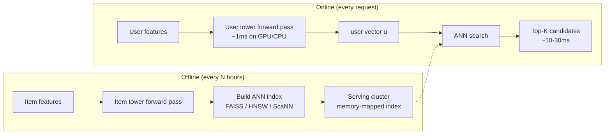

Latency budget for retrieval is usually **20-50 ms**:
- 1-5 ms user tower forward.
- 10-30 ms ANN search (HNSW or ScaNN over millions of items).
- 5-10 ms candidate set assembly + dedup + filtering.

---

## 8. ANN choices — FAISS vs HNSW vs ScaNN

| Library | Algorithm | Best for | Notes |
|---------|-----------|----------|-------|
| **FAISS** (Meta) | IVF, IVF-PQ, HNSW, flat | Largest catalog (10M+); offline indexing | Most flexible, C++/Python, GPU support |
| **hnswlib / HNSW** | Hierarchical NSW graphs | Lowest latency, high recall | Pinterest, LinkedIn |
| **ScaNN** (Google) | Anisotropic vector quantization | Pareto-best on recall vs QPS | YouTube, Vertex AI Vector Search |
| **DiskANN** (Microsoft) | Disk-resident HNSW | Billions of vectors per node | Trades latency for cost |
| **Voyager** (Spotify) | HNSW (Spotify replacement for Annoy) | Spotify-typed Python/Java API | 2023 |

Most production teams use **HNSW** for serving (sub-10ms p99 at 100M vectors) and FAISS for offline analysis.

### 8.1 IVF-PQ — the cheap option

Inverted File + Product Quantization: cluster vectors into `nlist` buckets; quantize each vector into `M` × 8-bit codes; ANN search visits a few buckets and uses lookup tables for distance. Massive memory savings (40-100×) at the cost of some recall loss.

### 8.2 HNSW

Builds a multi-layer graph where each node has links to nearby nodes at multiple scales. Search descends from a sparse top layer to a dense bottom layer. The dominant in-memory ANN in 2024.

### 8.3 The recall-latency Pareto

Always benchmark on **your own data**. The ANN-benchmarks.com leaderboard is useful, but real-world recall curves depend on your embedding distribution.

---

## 9. Training infrastructure

### 9.1 Frameworks

- **TensorFlow Recommenders (TFRS)**: idiomatic two-tower in Keras. Easy.
- **PyTorch + TorchRec**: production-grade for huge embeddings. Handles sharding.
- **Hugging Face sentence-transformers**: tiny-scale, content-tower style.
- **DSSM** (Microsoft Deep Structured Semantic Model, 2013): the OG two-tower for search.

### 9.2 Distributed training

Embedding tables can exceed single-node memory. The standard pattern:

- **Embedding parallelism**: shard tables across machines (TorchRec, parameter servers).
- **Data parallelism**: replicate the MLP towers, shard the data.
- **Combined** (DLRM-style hybrid): the workhorse at FAANG scale.

### 9.3 Batching

Larger batches → more in-batch negatives → better training. Practical batch sizes: 1k-16k pairs. Bigger needs gradient accumulation or model parallelism.

---

## 10. Common pitfalls

| Pitfall | Symptom | Fix |
|---------|---------|-----|
| **No LogQ correction** | Popular items underrank at serving | Apply LogQ; estimate frequencies online |
| **Embedding drift between train and serving** | Recall drops after launch | Atomic index swap; freeze item tower before snapshotting |
| **Cold items get random vectors** | New items don't appear in top-K | Add content features to item tower |
| **L2 normalization missing or asymmetric** | Score scale drifts over time | L2-normalize both towers consistently |
| **In-batch negatives have repeated items** | Loss spikes; weird local minima | Dedup batches |
| **User tower trained on stale features** | Train-serve skew | Log-and-wait pattern |
| **Hash collisions in embedding tables** | Top-K results look weirdly clustered | Bigger hash space; collisionless hash (Monolith) |

---

## 11. Sample code: minimal two-tower in PyTorch

(See [`code/10_two_tower.py`](code/10_two_tower.py) for a runnable version with LogQ correction.)

```python
import torch, torch.nn as nn, torch.nn.functional as F

class Tower(nn.Module):
    def __init__(self, vocab_size, emb_dim=32, hidden=64, out_dim=32):
        super().__init__()
        self.emb = nn.Embedding(vocab_size, emb_dim)
        self.mlp = nn.Sequential(
            nn.Linear(emb_dim, hidden), nn.ReLU(),
            nn.Linear(hidden, out_dim),
        )

    def forward(self, idx):
        x = self.emb(idx)
        return F.normalize(self.mlp(x), dim=-1)  # L2 normalize

# Training step with in-batch negatives + LogQ correction
def train_step(user_tower, item_tower, user_idx, pos_item_idx, item_freqs):
    u = user_tower(user_idx)         # (B, D)
    v = item_tower(pos_item_idx)     # (B, D)

    # all-pairs similarity matrix (B x B); diagonals are positives
    logits = u @ v.T                 # (B, B)

    # LogQ correction: subtract log of sampling probability from each column
    log_q = torch.log(item_freqs[pos_item_idx] + 1e-9)
    logits = logits - log_q.unsqueeze(0)

    labels = torch.arange(logits.size(0), device=logits.device)
    loss = F.cross_entropy(logits, labels)
    return loss
```

---

## 12. Sanity check

1. Why is two-tower's dot-product score factorization the entire reason it scales, and what's the alternative architecture that can't scale this way?
2. In-batch negatives give you B-1 negatives per positive for free. What's the bias and what's the correction?
3. You launch a two-tower retriever; popular items are missing from top-K. What's the most likely cause?
4. Your item catalog grows 10x. The model architecture stays the same. What part of the serving stack must scale, and how?
5. New items added daily need to appear in retrieval the same day. How do you ensure that without retraining the whole model?
6. A teammate proposes using cosine instead of dot product. What conditions make these equivalent, and what changes operationally?


ewpage


# Module 11 — Graph Neural Networks for Recommendations

> Pinterest deployed the first production GNN recommender (PinSage 2018) and never stopped. LinkedIn followed with LiGNN (2024). Everyone else is closer to "uses graph-derived features in their two-tower" than "trains an end-to-end GNN at production scale." This module covers the math, the production reality, and the trade-offs.

---

## 1. Why graph

The user-item interaction matrix `R` is naturally a **bipartite graph**:

- Nodes: users `U`, items `I`.
- Edges: interactions (rating, click, play, buy).

Matrix factorization sees only direct edges. GNNs propagate signal across **multi-hop** neighborhoods:

- "User → item → other users who liked that item → items those users also liked."

That's the **collaborative-filtering signal**, but formalized as message passing on a graph.

Plus: many recsys problems have richer graphs beyond just user-item:
- Social graph (friends of users).
- Item-item graph (co-purchase, "also bought").
- Knowledge graph (item-category, item-brand, item-attribute).
- Heterogeneous (mix of all the above).

GNNs let you exploit all of these without manual feature engineering.

---

## 2. Core message-passing math

For each node `v` at layer `l+1`:

```
h_v^{l+1} = UPDATE(h_v^l, AGGREGATE({h_u^l : u ∈ N(v)}))
```

Different GNN variants differ in:
- The aggregator (mean, sum, max, attention).
- The update function (linear, MLP, GRU).
- How edge features factor in.

After L layers, each node has gathered information from its L-hop neighborhood.

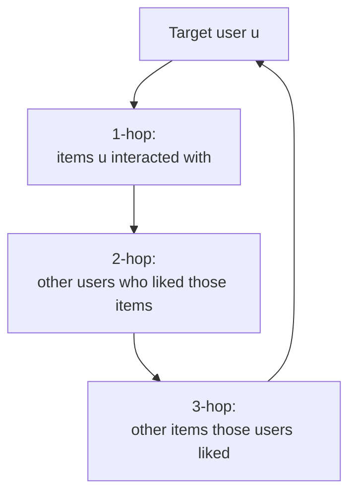

3-4 hops capture the most useful collaborative signal; deeper layers introduce noise (over-smoothing).

---

## 3. GraphSAGE (Hamilton et al. NeurIPS 2017)

The first GNN that handled web-scale **inductive** learning (new nodes don't need retraining).

### 3.1 The aggregator

```
h_N(v)^l = AGG({h_u^l : u ∈ N(v)})        # mean, max, LSTM, or pooling
h_v^{l+1} = σ(W · concat(h_v^l, h_N(v)^l))
```

### 3.2 Neighborhood sampling

For a node with 10,000 neighbors, you can't process all of them. GraphSAGE samples a **fixed-size** subset (e.g., 25 neighbors) per layer. Stochastic, scales to giant graphs.

### 3.3 Inductive

The aggregator is **not** a node-specific parameter — it's a shared function. So at inference time, new nodes can be embedded by aggregating from their (possibly also new) neighbors using existing weights.

Critical for recsys where new users and items appear constantly.

---

## 4. PinSage (Pinterest, Ying et al. KDD 2018)

PinSage is GraphSAGE adapted for **3 billion pins and 18 billion edges**.

### 4.1 The graph

- Pins (items), boards, users — heterogeneous.
- Edges: "pin saved to board" (user-implicit), "pin is similar to pin" (visual).

### 4.2 Random-walk neighborhood sampling

Instead of uniform-random sampling neighbors, run short **random walks** from the target node; the most-visited neighbors are selected as "important" neighbors with visit-count as importance weight in aggregation.

Captures more relevant context per neighbor; reduces variance.

### 4.3 Hard-negative curriculum

Start with easy random negatives, progressively mix in mined hard negatives (visually similar but not co-engaged with this user). Reaches recall@5 numbers that random negatives don't.

### 4.4 Producer-consumer training

A CPU producer samples neighborhoods; a GPU consumer trains. Decouples graph sampling from gradient compute → GPU stays saturated.

### 4.5 MapReduce inference

To produce embeddings for all 3B pins, run a 2-stage Hadoop job. Stage 1: aggregate immediate neighbors. Stage 2: 2-hop aggregation. Used to refresh the entire embedding table nightly.

### 4.6 Where PinSage powers

- **Related Pins** rail (the canonical "more like this" surface).
- **Home Feed** candidate generation.

A direct demonstration that GNNs can run at Pinterest's scale.

---

## 5. LightGCN (He et al. SIGIR 2020)

LightGCN simplified NGCF (a predecessor) by removing the feature transformations and nonlinearity, keeping only **neighborhood aggregation**.

```
h^{l+1} = D⁻¹ A h^l           # propagation
e_u = (1/(L+1)) Σ_l h_u^l     # average across layers
```

- No learnable weight matrix per layer.
- No nonlinearity.
- Final embedding = average across layers.

Counter-intuitively, this *outperformed* NGCF — the extra learnable transformations were overfitting noise. LightGCN became the standard CF-GNN baseline.

Still strong on small/medium datasets; production teams use it for warm-starting or as a reliable baseline.

---

## 6. PinnerSage (Pinterest, Pal et al. KDD 2020)

Multi-embedding **user** representation:

1. Encode each engaged pin via PinSage → 32-256d vector.
2. Cluster the user's recent engaged pins in embedding space using **Ward hierarchical clustering**.
3. Represent the user by ~3 cluster medoids.
4. At serve time, retrieve top-K per medoid via ANN; merge; re-rank.

Why medoids (real pins) instead of cluster centroids: explainable ("you'll like this because it's similar to these pins you saved") and they're already in the ANN index.

PinnerSage is the spiritual ancestor of Meta's multi-embedding user representations and the per-context user vectors at Spotify.

---

## 7. LiGNN (LinkedIn, 2024)

**"LiGNN: A Large-Scale Graph Neural Network for LinkedIn"** — production GNN at LinkedIn scale.

### 7.1 The graph

The **economic graph**: members, companies, schools, skills, jobs, posts, groups, hashtags, etc. ~Billions of nodes, ~100B+ edges.

### 7.2 Adaptive sampling

Neighborhood sampling weighted by both **importance** (frequency, recency, engagement) and **diversity** (cover different relationship types).

### 7.3 Training infrastructure

100+ billion edges; multi-billion node graphs. Distributed sampling on Spark; training on GPU clusters.

### 7.4 Powers

- PYMK (People You May Know).
- Job recommendations (JYMBII).
- Content feed.

### 7.5 The serving question

A challenge: GNN inference can be expensive if you re-run message passing at request time. LinkedIn's solution: precompute node embeddings periodically (batch), serve via lookup + small online network. The same pattern as PinSage.

---

## 8. Heterogeneous and knowledge-graph GNNs

Heterogeneous graphs have multiple edge types (e.g., user-buys-item, user-views-item, item-is-in-category, item-from-seller). The GNN must handle each edge type appropriately.

- **R-GCN** (Schlichtkrull et al. ESWC 2018) — per-relation weight matrices.
- **HAN** (Wang et al. WWW 2019) — heterogeneous attention.
- **HGT** (Hu et al. WWW 2020) — heterogeneous graph transformer.

Knowledge-graph-aware variants:
- **KGAT** (Wang et al. KDD 2019) — knowledge graph attention.
- **KGIN** (Wang et al. WWW 2021) — knowledge graph intent network.

Production deployments are rarer than CF-GNN. Amazon Neptune supports graph workloads but production rankers usually consume **graph-derived features** (e.g., shortest-path distance, common neighbors) rather than full GNN message passing.

---

## 9. When GNNs help vs when they don't

| Situation | GNN value |
|-----------|-----------|
| Rich graph signal beyond user-item bipartite | High (PinSage, LiGNN) |
| Long-tail items with few interactions | Medium-High (helps via multi-hop) |
| Cold users / cold items with relational signal | High |
| Pure CF, dense interactions | Marginal vs MF / two-tower |
| Bandit / RL setting where actions matter most | Low |
| Very latency-sensitive (sub-50ms p99) | Difficult (need batch embedding refresh) |

The biggest production wins come when there's *more graph structure than just user-item*. Pinterest's pins-on-boards-by-users is richer; LinkedIn's economic graph is much richer.

---

## 10. Production GNN engineering

The two hard parts:

### 10.1 Sampling at scale

Random walks on graphs with billions of nodes need:
- Sparse adjacency stored as CSR or similar.
- Distributed walk generation (Spark / Ray).
- Importance-weighted sampling.

Libraries: DGL, PyG (PyTorch Geometric), GraphLearn (Alibaba), AliGraph.

### 10.2 Embedding refresh

GNN-derived node embeddings change as the graph evolves. Production teams refresh them on a periodic schedule:
- Pinterest: nightly batch.
- LinkedIn: daily for some, hourly for hot subgraphs.

Streaming GNN updates (full incremental retraining) is an active research area but not commonly deployed.

---

## 11. Sample code: tiny LightGCN

(See [`code/11_lightgcn.py`](code/11_lightgcn.py) for a runnable version.)

```python
import torch, torch.nn as nn, torch.nn.functional as F

class LightGCN(nn.Module):
    def __init__(self, n_users, n_items, emb_dim=32, n_layers=3):
        super().__init__()
        self.user_emb = nn.Embedding(n_users, emb_dim)
        self.item_emb = nn.Embedding(n_items, emb_dim)
        self.n_layers = n_layers

    def propagate(self, A_norm):
        """ A_norm: (n_users + n_items) x (n_users + n_items) normalized adjacency. """
        e0 = torch.cat([self.user_emb.weight, self.item_emb.weight], dim=0)
        embs = [e0]
        e = e0
        for _ in range(self.n_layers):
            e = A_norm @ e         # sparse @ dense
            embs.append(e)
        final = torch.stack(embs, dim=0).mean(dim=0)
        u_emb, i_emb = final.split([self.user_emb.num_embeddings, self.item_emb.num_embeddings])
        return u_emb, i_emb

    def score(self, u_emb, i_emb, users, items):
        return (u_emb[users] * i_emb[items]).sum(dim=-1)

# Training (BPR loss):
# for (u, pos, neg) in batches:
#     u_emb, i_emb = model.propagate(A_norm)
#     pos_score = model.score(u_emb, i_emb, u, pos)
#     neg_score = model.score(u_emb, i_emb, u, neg)
#     loss = -torch.log(torch.sigmoid(pos_score - neg_score)).mean()
```

---

## 12. Sanity check

1. Why is the GNN message-passing "user → item → user → item" path equivalent to multi-hop collaborative filtering?
2. PinSage's biggest engineering innovation wasn't the model — what was it?
3. LightGCN removed feature transformations and nonlinearity from NGCF and got better results. What does this suggest about the role of GNN depth?
4. PinnerSage represents each user with ~3 medoid vectors instead of one centroid. What's the trade-off?
5. Why are GNNs more valuable at Pinterest/LinkedIn than at Netflix/YouTube?
6. Production GNNs typically precompute embeddings and serve via lookup. Why don't they run message passing at request time?


ewpage


# Module 12 — LLMs & Generative Recommenders

> The two biggest architectural shifts in recsys since deep learning: **semantic IDs / generative retrieval** (TIGER, 2023) and **generative recommenders** (HSTU, 2024). Together they suggest that the standard funnel — retrieval + ranking + reranking — may collapse into a single autoregressive model. This module is the most volatile in the curriculum; check FACTS.md before quoting numbers.

---

## 1. The three ways LLMs touch recsys

| Pattern | What | Latency | Example |
|---------|------|---------|---------|
| **LLM as feature extractor** | Encode item text/image/audio offline → embedding fed into existing ranker | None online (precomputed) | CLIP for Pinterest pins; Spotify podcast transcripts |
| **LLM as ranker** | Score candidates with an LLM prompt; expensive but rich | 200-2000 ms | Cohere Rerank; Claude rerank in B2B search |
| **LLM as recommender (generative)** | Generate the next item ID autoregressively | Variable; can be cheaper than expected | TIGER, HSTU, P5, LLaRA |

Patterns 1-2 are widely deployed today. Pattern 3 is the bleeding edge.

---

## 2. LLM as feature extractor

The cheapest and most common use. Run a foundation model offline; cache the embeddings or labels; feed into a normal ranker.

### 2.1 Text features

- Pretrained sentence encoders: BGE-large, E5, GTE, `text-embedding-3-small`, Voyage, Cohere Embed v3.
- For each item, encode (title + description + categories + reviews) → 768-1024d vector.
- Concatenated to the item tower as a content feature.

### 2.2 Multimodal features

- CLIP, SigLIP, EVA-CLIP, DINOv2 for image; MERT / OpenL3 for audio.
- Combined embeddings for video (frame + audio + caption).

### 2.3 LLM-generated tags

LLMs *generate* structured tags (mood, occasion, complexity, audience):

```
prompt: "Tag this product: Crocs Classic Clogs (orange). Categories: comfort, casual, summer, controversial, ugly-cute. Output JSON: {tags: [...], audience: ..., style: ...}"
```

Output becomes a feature. Pinterest uses this for pin labels; Amazon COSMO does it for "common sense" knowledge generation; Spotify for podcast topics.

### 2.4 Cost economics

A single LLM call costs ~$0.01-$0.1 per item. For a 10M-item catalog, that's $100k-$1M one-time cost — manageable, and refreshable monthly. The cost stays out of the request path because it's offline.

---

## 3. LLM as ranker

The "vector search + LLM rerank" pattern (Module 32 has tech-stack details).

```mermaid
flowchart LR
    Q[User query / context] --> R[Retrieval<br/>top-100 from ANN]
    R --> P[LLM ranker<br/>"score these for relevance"]
    P --> TOP[Top-10]
```

### 3.1 Pointwise vs listwise prompts

Pointwise: "Given user X and item Y, score relevance 1-5." Easier to parallelize; less context-aware.

Listwise: "Given user X, here are 50 items; output the best 10 in order." Better quality; harder to evaluate; more expensive.

### 3.2 Cohere Rerank, Voyage rerank-2, Claude/GPT as ranker

- **Cohere Rerank v3+**: dedicated reranker; ~50 candidates → top-10 in ~100ms.
- **Voyage rerank-2**: similar.
- **Claude / GPT as reranker**: prompted; ~500-1500ms; expensive but flexible.

Production B2B startup stack: vector search → Cohere Rerank → optional Claude pass for top-5 if quality matters more than latency.

### 3.3 Distillation

Run an LLM ranker on logged queries to *generate labels*; train a small cross-encoder (BGE-reranker, MiniLM) to mimic it. The cross-encoder serves in production at 5-20ms per request.

This is the dominant 2024-2026 pattern for "LLM-quality rerank at non-LLM latency." Cohere Rerank itself is built this way.

---

## 4. Generative recommenders — the conceptual shift

Classical recsys: predict P(action | user, item) for each candidate independently.

Generative recsys: **autoregressively generate** the next user action (next item, next event):

```
P(next | history) = P(item_{t+1} | item_t, action_t, item_{t-1}, action_{t-1}, ...)
```

The model is a **decoder transformer** trained with cross-entropy over the item vocabulary (or a quantized version of it).

The retrieval problem collapses: instead of scoring all candidates, you **generate** the top-K via beam search or sampling. The ranking problem collapses: the same model emits action probabilities.

### 4.1 Why this matters

- **One model replaces N siloed models.** Recommendation, search, autoplay, push notifications all become "decode from a shared LLM."
- **Scaling laws** apply. More params + more data + longer sequence → predictable improvements (Wukong scaling law paper).
- **Cold start improves** through content tokenization (semantic IDs).
- **The funnel may collapse.** Retrieval + ranking + reranking → one model.

### 4.2 Why this isn't trivial

- **Item vocabulary explosion.** A YouTube-scale model needs to emit one of 10⁹ items. Softmax over a billion classes is infeasible. → semantic IDs.
- **Inference latency.** Autoregressive decoding can be slow. → speculative decoding, parallel sampling, MTIA-class accelerators.
- **Serving infrastructure.** Different from DLRM-style; needs KV cache, attention kernels.

---

## 5. TIGER — Semantic IDs (Google, Rajput et al. NeurIPS 2023)

**"Recommender Systems with Generative Retrieval"** — the breakthrough that made generative retrieval practical.

### 5.1 The problem

A standard recommender has an embedding row per item. Adding a new item means initialising a new embedding from zero — bad for cold start. And the row count grows linearly with the catalog, making the model expensive at scale.

### 5.2 The TIGER solution

1. **Encode each item** with a multimodal content encoder → dense vector.
2. **Quantize the vector** with **RQ-VAE (Residual Quantization VAE)** into a tuple of `(c_1, c_2, c_3, c_4)` discrete codes — each from a codebook of ~256 entries.
3. **Treat the tuple as the item's "semantic ID"**, generalizing across content-similar items.
4. **Train an encoder-decoder transformer** to autoregressively predict the next item's semantic ID from the user's history (a sequence of semantic IDs).

```mermaid
flowchart LR
    I[Item content<br/>text/image/audio] --> E[Content encoder]
    E --> V[Dense vector]
    V --> RQ[RQ-VAE]
    RQ --> SID[Semantic ID<br/>tuple of codes c_1, c_2, c_3, c_4]
    SID --> SEQ[Sequence: ..., SID_{t-1}, SID_t, ?]
    SEQ --> T[Decoder transformer]
    T --> NID[Next item's SID]
    NID --> ITEM[Decoded → actual item]
```

### 5.3 Why semantic IDs

- **Cold start**: a new item gets a semantic ID from its content alone — no warm-up needed.
- **Generalization**: items with shared prefix codes are content-similar; the model can leverage that.
- **Compact vocabulary**: ~4 × 256 codes = ~1024 tokens; the model generates 4 tokens per item.

### 5.4 Production status

- Google deployed it in some surfaces (search, YouTube ads have related work).
- Pinterest's "LIGER" is a generative-retrieval analog.
- Active research area; not yet ubiquitous.

---

## 6. HSTU — Generative Recommenders at Meta (Zhai et al. ICML 2024)

**"Actions Speak Louder than Words: Trillion-Parameter Sequential Transducers for Generative Recommendations"** — the most consequential recsys paper of 2024.

### 6.1 Core thesis

Treat recommendation as **next-token prediction over an interleaved sequence of `(item, action)` tokens**:

```
sequence = [item_1, action_1, item_2, action_2, item_3, action_3, ...]
predict next item and next action jointly
```

DLRM treats each (user, item) pair as independent. HSTU treats the user as a long sequence and the model predicts what they'll do next.

### 6.2 The HSTU layer

Self-attention is O(n²); for sequences of tens of thousands, that's prohibitive. HSTU replaces it with a **pointwise gated** attention variant whose FLOPs scale **linearly** with sequence length.

The HSTU block is a **hierarchical structure** that progressively encodes longer-range dependencies.

### 6.3 Scale

- **1.5T parameters**, mostly in embedding/projection tables.
- Sequence length: tens of thousands of events.
- Trained with LLM-style checkpoint sharding (Meta's training infra).

### 6.4 Production wins at Meta

- Deployed on Ads, Reels through 2024-2025.
- Significant relative E2E engagement gains over the prior DLRM-family ranker.
- In rollout for Feed.

### 6.5 Architectural implications

- Retrieval and ranking can collapse into a single autoregressive model.
- Feature engineering shifts: instead of designing 200 hand-crafted counter features, you tokenize more event types.
- Inference is heavier than DLRM. MTIA, INT8/FP8 quantization, KV caching all become critical.

---

## 7. P5 — Pretrain, Personalized Prompt, Predict (Geng et al. RecSys 2022)

**"Recommendation as Language Processing (RLP)"** — recast recommendation as text-to-text.

```
Input  prompt: "User 1234 has interacted with items [543, 122, 9]. What item will they like next?"
Output: "789"  (item ID as a string)
```

Built on T5. Multi-task: rating prediction, sequential recommendation, explanation generation, review summarization — all framed as text.

**Why it's interesting**: a single text-to-text model can do *all* of recsys tasks. **Why it's not (yet) production**: text-token-by-token generation is too slow at scale; semantic IDs (TIGER) are the practical evolution.

---

## 8. LLaRA, TallRec, CoLLM, RecLLM — LLM fine-tuning for recsys

A family of papers fine-tuning small LLMs (Llama 7-13B) on recommendation tasks:

- **TallRec** (Bao et al. RecSys 2023) — instruction-tune Llama to do recommendation.
- **LLaRA** (Liao et al. ICME 2024) — bridge ID embeddings and text via a projection.
- **CoLLM** (Zhang et al. 2024) — collaborative embeddings integrated with LLM.
- **RecLLM** (Friedman et al. Google 2023) — conversational recommendation via LLM.

Status: research-grade. Best for:
- **Conversational recommenders** (multi-turn refinement).
- **Cold-start surfaces** where content understanding helps.
- **Long-tail / niche domains** where general-knowledge LLMs add value.

Production deployments exist but are smaller-scale (B2B, niche catalogs); the latency / cost makes them hard at consumer-internet scale.

---

## 9. HLLM — Hierarchical LLM (ByteDance, Chen et al. 2024)

A two-level LLM architecture for sequential recommendation:

1. **Item LLM** produces dense representations from item content.
2. **User LLM** processes sequences of item representations to predict the next item.

Released by ByteDance in 2024 — paralleling HSTU's direction at TikTok/Douyin.

---

## 10. Scaling laws for recsys (Wukong, Meta 2024)

**"Wukong: Towards a Scaling Law for Large-Scale Recommendation"** showed that recsys scaling looks like LLM scaling:

```
performance ~ compute^α
```

over a range of model sizes, batch sizes, and data volumes. The exponents are smaller than LLM scaling but real and consistent.

Practical implication: you can plan recsys compute investment the same way you plan LLM compute — more params + more tokens + longer context = predictable improvements.

---

## 11. Conversational and agentic recommenders

The 2024-2026 frontier:

- **Conversational recommenders**: the user refines their preference through dialogue ("show me thrillers but not horror; less violent than X"). LLM handles the dialogue; recsys backend retrieves and ranks.
- **Agentic shopping**: an LLM agent navigates marketplaces on the user's behalf (Operator, Claude Computer Use). Implication: agents may not click ads — they parse structured data. The shape of "ads" may need to change.
- **AI DJ (Spotify)** is a deployed instance: LLM commentary + recsys + TTS.
- **Bing Copilot, Perplexity, Google AI Overviews**: sponsored answers in chat. Attribution and brand safety are unsolved.

---

## 12. Production trade-offs summary

| Approach | Cost | Latency | Cold start | Production ready |
|----------|------|---------|------------|------------------|
| LLM as feature extractor | Low (offline) | None online | Excellent | Yes — default in 2024-2026 |
| LLM as ranker (Cohere, etc.) | Medium | 100-500 ms | Good | Yes — common in B2B |
| LLM rerank with distillation | Medium training | 5-20 ms | Good | Yes — consumer-scale |
| TIGER / semantic IDs | High training | Comparable to two-tower | Excellent | Early production |
| HSTU / generative recs | Very high training | Higher than DLRM; doable on MTIA | Excellent | Meta deployed; others experimenting |
| Full LLM-as-recsys (P5 style) | Very high training + serving | Too slow at scale | Excellent for cold | Research |

---

## 13. Sample code: simple generative recommender (using a tiny transformer)

(See [`code/12_generative_rec.py`](code/12_generative_rec.py) for a runnable version on MovieLens.)

```python
import torch, torch.nn as nn

class GenRec(nn.Module):
    """Tiny generative recommender: treats sequences of item IDs as a language."""
    def __init__(self, vocab_size, d_model=64, n_heads=2, n_layers=2, max_len=50):
        super().__init__()
        self.tok_emb = nn.Embedding(vocab_size, d_model)
        self.pos_emb = nn.Embedding(max_len, d_model)
        layer = nn.TransformerEncoderLayer(d_model, n_heads, batch_first=True)
        self.encoder = nn.TransformerEncoder(layer, n_layers)
        self.head = nn.Linear(d_model, vocab_size)

    def forward(self, seq):
        pos = torch.arange(seq.size(1), device=seq.device)
        x = self.tok_emb(seq) + self.pos_emb(pos)
        mask = nn.Transformer.generate_square_subsequent_mask(seq.size(1)).to(seq.device)
        h = self.encoder(x, mask=mask)
        return self.head(h)         # (B, L, V) logits over items

    @torch.no_grad()
    def generate(self, prefix, k=10):
        # Greedy/top-K from the last position
        logits = self.forward(prefix)[:, -1, :]
        return logits.topk(k=k).indices
```

That's the kernel of TIGER / HSTU — without semantic IDs and at toy scale. The path from this to production HSTU is engineering, not algorithms.

---

## 14. Sanity check

1. Why is "LLM as feature extractor" the most-deployed of the three LLM-in-recsys patterns?
2. What problem do semantic IDs (TIGER's RQ-VAE codes) solve that vanilla item ID embeddings can't?
3. HSTU's headline trick is replacing standard self-attention with a pointwise gated variant. Why?
4. P5 frames every recsys task as text-to-text. Why is this elegant for research but impractical for billion-user surfaces?
5. Generative recommenders enable retrieval-via-decoding. What infrastructure must change vs a DLRM-style stack?
6. A B2B search startup wants LLM-quality ranking at 10ms p99 latency. What architecture would you propose?


ewpage


# Module 13 — The Funnel: Retrieval → Ranking → Re-ranking

> Every large-scale recommender, ad system, search engine, and marketplace is a **funnel**. Different stages of the funnel run different models with different latency budgets. Knowing where to put which compute is the architect's core decision.

---

## 1. Why the funnel exists

A single model that ranks all 100M items with a deep ranker would cost ~100 days per request. Even with massive parallelism that breaks the latency budget. The funnel splits the problem:

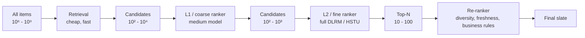

Each stage:
- Scores **fewer items**
- With a **more expensive model**
- For **richer features**

The result: end-to-end latency budget is met because expensive computation only runs on already-filtered candidates.

---

## 2. Latency budgets at each stage

Typical end-to-end p99 budget for a consumer feed: **200-500 ms**. Allocation:

| Stage | Items in | Items out | Compute / item | Total |
|-------|----------|-----------|----------------|-------|
| Retrieval | 10⁶-10⁹ | 10³-10⁴ | n/a (ANN) | 10-30 ms |
| L1 ranking | 10³-10⁴ | 10²-10³ | Light deep model | 5-20 ms |
| L2 ranking | 10²-10³ | 10² | Full deep model | 20-50 ms |
| Re-ranking | 10² | 20 | List-aware logic | 5-15 ms |
| Feature fetch + serialization | n/a | n/a | KV lookups | 10-30 ms |
| Logging | n/a | n/a | async | < 5 ms |

Total: ~100-200 ms inside the recsys; remaining budget goes to network, edge, frontend.

---

## 3. Retrieval — the candidate-generation stage

Retrieval's job: from the entire item universe, return ~1000 candidates with high recall.

The dominant retrieval patterns (Module 14 has details):
- Two-tower with ANN.
- Item-to-item lookup ("more like the user's recent items").
- Graph walks (Pinterest, LinkedIn).
- Popularity / trending.
- Editorial / business-rule overrides.

Most production systems run **multiple retrievers in parallel** and union outputs. Why:
- Different retrievers catch different patterns.
- Single retriever failure mode (bug, latency spike, embedding drift) doesn't crater the whole funnel.
- Diversity at the source flows downstream.

### 3.1 The recall metric

Retrieval is judged on **Recall@k**: of items the user actually engaged with, what fraction did retrieval put in the candidate set?

- **Recall@100 ≥ 0.7** is a typical target.
- **Recall@1000 ≥ 0.9** is common for large-scale.

If retrieval recall is poor, no amount of clever ranking can recover.

### 3.2 The diversity trap

If your retriever only surfaces popular items, the ranker can only rank popular items. Long tail dies in retrieval.

Mitigations:
- Popularity-debiased retrievers (sample inversely by popularity).
- Explicit "fresh content" retrievers reserved for new items.
- Exploration retrievers (random samples from user's interests).

---

## 4. L1 ranking — the coarse pass

When you have 10⁴ candidates and a 100ms budget, you can't run the full ranker. L1 is a **lighter model** that trims to 10² - 10³.

Two common L1 designs:

### 4.1 Distilled ranker

Train a small model (a few-million-parameter MLP) to mimic the full ranker's predictions. Latency: ~1-5 ms per 1k items.

### 4.2 Two-tower with side features

The same two-tower retrieval model, with extra features at scoring time (recent context). Latency: depends on tower output dim.

### 4.3 Lightweight DLRM

A smaller DLRM with fewer embedding tables and a shallower MLP. Latency: ~5-20 ms.

At Meta and ByteDance, L1 is explicit and distinct from L2. At smaller companies, L1 is often folded into retrieval scoring or skipped.

---

## 5. L2 ranking — the fine pass

L2 is **the** ranker — the model your career is judged on. Typically:

- DLRM (Meta), DCN-V2 (Google), DIN+SIM (Alibaba), LiRank (LinkedIn), HSTU (Meta, 2024+).
- Multi-task heads: pCTR, pSave, pComplete, pConversion, plus negative heads (pDismiss, pAbandon).
- A value model combines task probabilities into a scalar ranking signal.

### 5.1 Multi-task value model

```
value(u, i) = w_click · pClick(u, i) + w_save · pSave(u, i) + w_complete · pComplete(u, i) − w_dismiss · pDismiss(u, i)
```

Weights are tuned **online** via A/B; they reflect business priorities, not ML-loss optima.

### 5.2 Calibration matters

If `pClick = 0.5` doesn't mean 50% click rate, then the value-model weights don't mean what they should. Hourly slice-level calibration (Module 2 §5) is non-negotiable for ads-adjacent ranking.

### 5.3 GPU vs CPU serving

DLRM-style rankers were CPU-served for years (sparse embeddings are bandwidth-bound). HSTU-class transformer rankers are GPU-served (dense matmul). The shift is happening in 2024-2026; tooling (Triton, vLLM-for-recsys, TorchServe with FBGEMM) is catching up.

---

## 6. Re-ranking — the slate-aware stage

The first two stages score items **independently**. But the final list quality depends on the list **as a whole**:

- Don't show three videos in a row from the same creator.
- Make sure ads appear at the right positions (not on top of organic).
- Cap the number of items per category.
- Inject freshness / exploration slots.
- Enforce business rules (no competitor ads, no expired listings, no recent purchases).

Re-ranking is where these constraints get applied.

### 6.1 MMR — Maximal Marginal Relevance

The simplest diversity-aware re-ranker:

```
score(i) = λ · sim(i, query)  -  (1 - λ) · max_{j in selected} sim(i, j)
```

Greedy: at each step, pick the item that maximises this score. `λ` controls the relevance-diversity trade-off.

### 6.2 DPP — Determinantal Point Processes

A more principled approach. Each subset of items has a probability proportional to the **determinant** of a kernel matrix. High determinant ↔ items are spread out in the kernel space ↔ diverse.

Used at YouTube, Meta, Hulu for slate diversity. The kernel is typically a learned ranker output times a similarity matrix.

### 6.3 Lagrangian constraint solving

When you have multiple hard constraints (ads load ≤ 5/page, max 2 items per creator, freshness ≥ 30%), formulate as a **constrained optimization**:

```
maximize Σ_i score(i)  subject to  Σ_i a_ij · 1{i selected} ≤ b_j  for each constraint j
```

Lagrangian relaxation: convert constraints into penalties, solve unconstrained. Dual variables (Lagrange multipliers) get updated online from observed slate compositions.

### 6.4 Business rules and overrides

The unsexy part:
- Editorial pins ("Apple News' Top Stories").
- Contractual carousels (this brand pays for slot 1 in this region).
- Compliance (no adult content for minors; geo-restricted licensing).
- Recency caps ("don't show the same item again within 24h").

These typically apply *after* the ML scoring, as a filter pass.

---

## 7. Logging — the loop back

Every impression must be logged with enough context to:

- Train future models (impression + click outcome).
- Run off-policy eval (model version + scores + bucket).
- Debug production issues (feature snapshot, model version).
- Compute business metrics (revenue attribution, conversion).

A modern logging schema:

```yaml
event_id:        uuid
timestamp:       ISO8601
user_id:         hashed
session_id:      string
surface:         home_feed | search | autoplay | push | ...
slot_position:   int
item_id:         string
score:           float
model_version:   string
experiment:      { bucket_id, variant_id }
exploration:     bool
features_logged: { snapshot of key features }
action_outcome:  click | play | save | dismiss | conversion (filled in later)
```

The downstream pipelines join this with conversion events (via watermarked windows), producing training data.

---

## 8. Failure modes and degradation

The funnel needs graceful degradation when stages fail.

| Stage failed | Mitigation |
|--------------|------------|
| Retrieval timeout | Serve cached top items / popular fallback |
| L1 ranker error | Bypass L1; pass all retrieval candidates to L2 (slower but works) |
| L2 ranker timeout | Use L1 scores; or random shuffle (better than empty page) |
| Feature store unavailable | Serve from cache; degrade to user-history-less version |
| Logging backpressure | Drop verbose features; keep essentials |

The first 5 minutes of an incident determine whether users see "Netflix is down" or "Netflix has slightly worse recommendations." The latter is recoverable.

---

## 9. Cost analysis

The funnel is also a cost optimisation. Roughly:

| Cost component | Driver |
|----------------|--------|
| Embedding tables (storage) | Item + user cardinality × embedding dim |
| ANN index (RAM + disk) | Item count × vector dim |
| L1 / L2 ranker inference (GPU / CPU) | Candidates × params per candidate |
| Feature store (RAM) | Online feature volume × QPS |
| Logging + training (storage + compute) | Events × features |
| A/B experimentation overhead | Concurrent experiments × variants |

A 2024 estimate for a 50M MAU consumer-internet recsys: $10-50M/year all-in. The funnel architecture exists to keep that bounded.

---

## 10. Sanity check

1. Why can't a single model just rank all 10⁹ items per request, even on GPU?
2. Your retrieval stage has Recall@100 = 0.3. What does this tell you about the cap on your ranker's possible improvement?
3. The L2 ranker outputs pCTR ≈ 0.6 for every candidate but the items are obviously different in quality. What's gone wrong?
4. Three creators have produced 80% of recent home-feed items in a user's session. Which stage of the funnel should fix this and how?
5. Your retrieval timeouts spike under load. What's a sensible degradation path that doesn't return an empty page?


ewpage


# Module 14 — Candidate Generation Systems

> Retrieval is where the funnel begins. In production, retrieval is rarely *one* retriever — it's a **mixture** of several specialised retrievers running in parallel, each tuned for different patterns. This module is the menu.

---

## 1. Why parallel retrievers

A single two-tower retriever can only learn one pattern: "items like the user's overall taste." But a session may need:

- Items semantically similar to the user's *just-clicked* item.
- New/fresh items the user has never seen.
- Trending items globally.
- Items that match an explicit filter (price band, geography, language).
- Items from creators the user follows.
- Items recommended by social graph signal.
- Surprise/exploration items.

No single retriever covers all of these. Production systems run **5-15 parallel retrievers** and union their outputs.

```mermaid
flowchart TB
    Q[Request: user + context] --> R1[Two-tower retriever]
    Q --> R2[Item-to-item from recent]
    Q --> R3[Trending]
    Q --> R4[Follow graph]
    Q --> R5[Editorial / business]
    Q --> R6[Exploration sampler]
    Q --> R7[Geo / language filter]

    R1 --> U[Union, dedup,<br/>per-source quota]
    R2 --> U
    R3 --> U
    R4 --> U
    R5 --> U
    R6 --> U
    R7 --> U

    U --> L1[L1 / L2 ranker]
```

---

## 2. The dominant retrievers

### 2.1 Two-tower / embedding retrieval

Module 10 has the details. The workhorse — covers ~50-70% of recall in most systems.

### 2.2 Item-to-item (kNN)

For each item the user recently engaged with, fetch its top-k similar items. Aggregate. This is the Amazon "Customers who bought X also bought Y" pattern.

Implementation: an item-item similarity matrix (Module 6 §3) stored in a KV store; lookup keyed on `item_id`.

Strengths:
- Captures *short-term* taste (what the user is doing right now).
- Doesn't need a user vector — works even on the first session.

Weaknesses:
- Filter bubble: only surfaces items similar to history.
- Cold-start items: no neighbors yet.

### 2.3 Sequential / next-item retrieval

A sequence model (SASRec, BERT4Rec) produces a user vector conditioned on the recent sequence, retrieves top-K via ANN.

Strengths:
- Captures order ("just watched episode 1 → suggest episode 2").
- Adapts within a session.

### 2.4 Graph-walk retrievers

Random walks on user-item / item-item / user-user graphs propagate signal through multi-hop neighborhoods.

Pinterest, LinkedIn use these heavily. The "PinSage embeddings" themselves come from graph-walk training; retrieval uses the resulting vectors.

### 2.5 Popularity / trending

Sorted by global engagement in a recent window (15 min, 1 hour, 24 hour). Multiple granularities for different surfaces.

Tricks:
- Geo-segmented: "trending in your country."
- Demographic-segmented: "trending for users like you."
- Cohort-segmented: "trending among your age band."

Cheap, robust, catches viral moments.

### 2.6 Follow / social graph

For social platforms (LinkedIn, Meta, X, Pinterest's follow graph): items from accounts the user explicitly follows. Often a hard inclusion (user expects to see their friend's post).

### 2.7 Search / query retrieval

When the user types a query: BM25 + dense retrieval (hybrid), often the same architecture as a search engine. Modules 5 (RAG topic) covers this in depth from the LLM angle.

### 2.8 Editorial / business-logic

Hand-curated lists:
- Apple News Top Stories.
- Spotify editorial playlists.
- Netflix "Top 10 in your country today."
- Brand-paid carousels.

These are non-personalized at the source but the ranker can re-order them per-user.

### 2.9 Exploration sampler

A small fraction of retrieved items are *random* or *uncertain*. The model needs this for:
- Discovering items it doesn't know are good (off-policy learning).
- Avoiding feedback-loop collapse.
- Bootstrapping cold-start items.

Typical: 1-5% of slots reserved.

### 2.10 Frequently-bought-together / cart retrievers

E-commerce specific. Given current cart contents, retrieve items that frequently complement them. Often a separate item-item co-occurrence index.

---

## 3. Union, dedup, and quota

After parallel retrievers return their candidates, the funnel must merge them.

```mermaid
flowchart LR
    R1[Tower: 500 items] --> U[Union]
    R2[I2I: 200 items] --> U
    R3[Trending: 100 items] --> U
    R4[Editorial: 50 items] --> U

    U --> D[Dedup by item_id]
    D --> Q[Per-source quota cap]
    Q --> C[Final candidate set<br/>~1000 items]
```

### 3.1 Dedup

The same item often appears in multiple retrievers. Keep one copy with the best (max) score, and tag with all source retrievers.

### 3.2 Per-source quotas

Without quotas, one retriever dominates. Common pattern:

```yaml
quotas:
  tower:       max 500
  i2i:         max 200
  trending:    max 100
  editorial:   max 50
  social:      max 200
  exploration: max 30
```

Tuned per surface, A/B tested.

### 3.3 The mixing weight problem

Items from different retrievers have *incompatible* scores (a two-tower cosine and a graph-walk probability live in different scales). The ranker downstream re-scores them all anyway, but the *initial* selection still depends on the cap-per-source.

Some teams normalize per-source scores (min-max or z-score within retriever) before union; others rely entirely on the L1 ranker to score on a common scale.

---

## 4. Indexing infrastructure

### 4.1 ANN indexes

The dominant retrieval backbone. FAISS, HNSW, ScaNN, DiskANN. Module 10 covered the trade-offs.

Latency at scale: 5-30 ms for k=1000 from 100M items.

### 4.2 Item-item lookup

A KV store (Redis, DynamoDB, ScyllaDB) keyed on `item_id`, value is the top-k similar items. Lookup latency: 1-3 ms.

### 4.3 Trending / counter stores

Streaming aggregators (Flink, Spark Streaming) maintain windowed counters; results stored in Redis or BigTable. Refreshed every 1-15 minutes.

### 4.4 Inverted index

For BM25 / sparse retrieval. Elasticsearch, OpenSearch, Vespa.

### 4.5 Editorial registry

A versioned KV table mapping (surface, region, time) → list of editorial item IDs.

---

## 5. Refresh cadence

Different retrievers have different refresh cadences:

| Retriever | Refresh cadence |
|-----------|-----------------|
| Two-tower | User vector: real-time; item vectors: hourly to daily |
| Item-to-item | Nightly batch usually |
| Trending | 1-15 minutes |
| Editorial | On demand (CMS update) |
| Sequence model | User vector: real-time |
| Exploration sampler | Stateless |

The system needs to handle this **multi-cadence** reality. A common pattern: every retriever exposes a "max staleness" SLA; serving infra alerts if exceeded.

---

## 6. Cold start at the retrieval stage

### 6.1 Cold user

A user with < 10 lifetime events has no useful embedding. Strategies:
- Tower has a "no-id" branch using only context features.
- Onboarding asks for explicit interests; map to seed items.
- Heavy exploration in the first session.
- Demographic / geographic priors.

### 6.2 Cold item

A new item has no interaction signal. Strategies:
- Item tower uses content features (text, image, audio embeddings).
- Reserve exploration slots for new items.
- Bootstrap with seller / creator priors.
- Editorial bootstrap (new artist gets a spot in "Fresh Finds").

### 6.3 New surface

A brand-new product surface (e.g., Spotify just launched podcasts) has no logged data. Strategies:
- Transfer from related surfaces.
- Heavy editorial seeding.
- Faster exploration regime than mature surfaces.

---

## 7. Negative retrieval — knowing what to *exclude*

Some items must *not* appear:

- Items the user has already interacted with (in some contexts).
- Items currently out of stock / unavailable in user's region.
- Items violating the user's content preferences (kids profile, explicit filter).
- Recently shown items (to avoid fatigue).
- Items the user explicitly disliked / blocked.

Implemented as a **filter pass** post-retrieval, before ranking. Bloom filters and roaring bitmaps are common implementations.

---

## 8. Multi-task retrievers

A two-tower model trained with a single objective (e.g., click) optimizes for that signal. For multi-objective ranking downstream, you may want **multi-task retrieval**:

- Train multiple towers each with different objectives.
- Or train one tower with multi-task loss.
- At serving, query each tower and union.

Pinterest and Meta both use multi-task retrieval — separate retrievers for "ranking-style" and "engagement-style" signals.

---

## 9. The 2024-2026 frontier: generative retrieval

TIGER (Module 12) replaces ANN retrieval with **autoregressive generation of semantic IDs**. The retrieval stage becomes a transformer decode call instead of an ANN lookup.

Status:
- Google deployed in some surfaces.
- Pinterest's LIGER.
- Meta's Andromeda uses generative retrieval.
- Tens of papers in 2024 on variants.

Production trade-offs:
- Better cold-start (content embeddings inherent).
- More expressive but heavier per request.
- Different infrastructure (KV cache, attention kernels, GPU).

The future likely combines ANN for hot-path retrieval with generative for cold and tail.

---

## 10. Sanity check

1. Why not just one two-tower retriever?
2. Your "trending" retriever pushes the same 50 items to every user in the country. What's the ranking trade-off, and how would you mitigate it?
3. When merging candidates from 5 retrievers with different score scales, how do you decide which item ranks higher?
4. A user's last 10 clicks are all on creator A. Without explicit anti-creator-monopoly logic, what happens to the next slate?
5. Why do production teams reserve 1-5% of slots for random/exploration items?
6. What's the cold-start behavior of a pure ANN retriever for a brand-new item, and how is it fixed?


ewpage


# Module 15 — Ranking & Multi-Task Learning

> Module 13 said "the L2 ranker is where careers are made." This module is the inside view: what L2 actually is, how it handles multiple objectives, and why calibration is non-negotiable.

---

## 1. The L2 ranker — what's inside

The L2 ranker takes a candidate set of ~100-1000 items + user + context and produces a fine-grained score per (user, item) pair.

```mermaid
flowchart TB
    F1[Sparse features<br/>user_id, item_id, creator_id, ...] --> E[Embedding tables]
    F2[Dense features<br/>recent counts, ratios] --> B[Bottom MLP]
    F3[Sequence features<br/>last 100 items] --> S[Sequence encoder<br/>DIN / SASRec / HSTU]

    E --> INT[Feature interaction layer<br/>DCN-V2 / DLRM-dot / HSTU]
    B --> INT
    S --> INT

    INT --> TOWER[Tower MLP]
    TOWER --> HEADS[Multi-task heads]

    HEADS --> H1[pClick]
    HEADS --> H2[pSave]
    HEADS --> H3[pComplete]
    HEADS --> H4[pDismiss]
    HEADS --> H5[pConvert]

    H1 --> V[Value model<br/>weighted sum]
    H2 --> V
    H3 --> V
    H4 --> V
    H5 --> V

    V --> RANK[Final rank score]
```

Three architectural pieces:
1. **Embedding + interaction layer** (DCN-V2, DLRM, HSTU).
2. **Multi-task heads** producing per-task probabilities.
3. **Value model** combining task probabilities into a scalar.

---

## 2. Multi-task learning

A single-objective ranker (just optimize CTR) is a 2014-era design. Modern rankers predict multiple things at once.

### 2.1 Why multi-task

- **Single-objective optimization breaks**: maximize CTR → clickbait. Maximize watch time → endless slow drama. Multi-objective forces balance.
- **Task transfer**: a model trained on 10 related tasks generalises better than one trained on 1 task.
- **Reduced model count**: 1 multi-task model is cheaper than 10 single-task models.

### 2.2 Negative-transfer risk

Tasks can conflict. Aggressive click optimization can hurt save/complete. Two tasks "fighting" for the same parameters can perform worse than two separate models.

The architecture innovations below all aim to prevent negative transfer.

---

## 3. Shared-bottom (the baseline)

```
shared_repr = MLP(features)
y_1 = head_1(shared_repr)
y_2 = head_2(shared_repr)
...
```

All tasks share the bottom MLP. Cheap. Works fine if tasks correlate. **Fails** when tasks conflict — gradients pull the shared bottom in different directions.

---

## 4. MMoE — Multi-gate Mixture of Experts (Ma et al. KDD 2018, Google)

Replace the shared bottom with multiple **expert** networks; each task has its own **gate** that learns a soft routing over experts.

```
experts = [MLP_1, MLP_2, ..., MLP_K]
e = [expert(x) for expert in experts]

for task t:
    gate_t = softmax(W_t · x)         # (K,)
    task_repr = Σ_k gate_t[k] · e[k]
    y_t = head_t(task_repr)
```

Each task's gate learns "I should listen to experts 2 and 5, not 1 and 3." Different tasks can use different expert mixtures → reduced interference.

Deployed at YouTube (Zhao et al. RecSys 2019, the multi-task ranking paper). Now standard.

---

## 5. PLE — Progressive Layered Extraction (Tang et al. RecSys 2020, Tencent)

MMoE has one expert pool shared across tasks. PLE makes explicit:

- **Task-specific experts** (only used by task t).
- **Shared experts** (used by all tasks).

Each task's gate routes over (its specific experts + shared experts). The shared experts capture cross-task signal; the specific experts capture task-unique signal.

Tencent reported PLE outperforms MMoE on all metrics. Common in Chinese tech (Tencent, Kuaishou).

---

## 6. STAR and PEPNet — multi-domain ranking

When a single ranker must serve multiple **domains** (e.g., e-commerce + ads + content):

### 6.1 STAR (Sheng et al. CIKM 2021)

Star topology: a shared central parameter set + domain-specific parameter sets that branch off.

For each (input, domain) pair, the effective weight is `W_shared * W_domain`.

### 6.2 PEPNet (Chang et al. KDD 2023)

Personalised modulation:
- **EPNet** (embedding personalised): a gate per domain modulates the input embeddings.
- **PPNet** (parameter personalised): a gate per domain modulates the network parameters.

Used at Kuaishou.

---

## 7. Multi-task losses

The simplest combination:

```
L = w_1 · L_1 + w_2 · L_2 + ... + w_n · L_n
```

Where each `L_i` is binary cross-entropy for task i.

### 7.1 Task weighting

Manual: pick `w_i` based on relative scales and business priorities.

Adaptive:
- **Uncertainty weighting** (Kendall et al. CVPR 2018): learn `w_i = 1/σ_i²` as parameters; tasks with higher loss noise get less weight.
- **GradNorm** (Chen et al. ICML 2018): normalize gradient magnitudes across tasks.
- **DWA** (Dynamic Weight Averaging, Liu et al. CVPR 2019): weight by recent loss decrease rate.

In practice, manual weighting tuned via online A/B is most common — adaptive methods rarely deliver clear wins.

### 7.2 ESMM — Entire Space Multi-task (Ma et al. SIGIR 2018, Alibaba)

A specific trick for the click → conversion problem:

```
pCTR(x)   = P(click | impression, x)
pCTCVR(x) = P(click & convert | impression, x)
pCVR(x)   = pCTCVR / pCTR     # derived, not directly trained
```

Both `pCTR` and `pCTCVR` are trained over the **entire impression space**. `pCVR` is *never trained directly* — avoids the sample-selection bias of training CVR only on clicks.

Foundational for ads. Module 26 covers in depth.

---

## 8. The value model

Multi-task predictions need to be **combined** into a single ranking score:

```
value(u, i) = w_1 · p_1 + w_2 · p_2 + ... + w_n · p_n
```

The weights `w_i` are usually **set manually** and tuned via online A/B. They encode business priorities:

- Netflix: how much do we care about play vs save vs satisfaction?
- TikTok: finish vs like vs share vs follow?
- Amazon: click vs purchase vs return-rate vs profit margin?

### 8.1 Why weights matter more than model architecture

A 5% weight change on the value model often produces more business impact than a 1% AUC improvement in the model. The model is the substrate; the weights are the steering wheel.

### 8.2 Personalised value weights

Some teams personalise the weights per user (different users have different preferences for engagement vs satisfaction). Implemented as another gating network in the model.

### 8.3 Calibration is required

If `pSave` returns 0.5 but actual save rate is 0.1, then `w_save * pSave` is overweighted by 5×. The whole value calculation breaks. Hence Module 2 §5 calibration.

---

## 9. Reward shaping for long-term value

Short-term metrics (click, watch time) don't capture long-term retention. The fix:

### 9.1 RL with off-policy correction

Treat each session as a trajectory; reward is long-horizon engagement. YouTube's Top-K off-policy correction paper (Chen et al. WSDM 2019) is the canonical reference (Module 4 §4.5).

### 9.2 Surrogate index methods

Athey, Chetty, Imbens 2019. Predict long-term outcomes from short-term proxies via held-out cohorts. Common at Netflix, Facebook, Uber.

### 9.3 Counterfactual long-term metrics

Long-running A/B with permanent holdouts (Airbnb, Booking) — the only honest measure of "did this change actually help retention 30 days out."

---

## 10. The Slate / list-aware ranker

Standard rankers score items independently. But the user sees a slate. Items can be *complements* (a similar series and its sequel) or *substitutes* (two near-duplicate items).

### 10.1 Slate-aware scoring

The score of item i depends on what else is on the slate:

```
score(i | S) = base(i) - λ · sim(i, S)
```

Captures diversity. Used as a re-ranking step (Module 13 re-ranker).

### 10.2 RL on slates

SlateQ (Ie et al. IJCAI 2019) decomposes slate-MDP into per-item Q-functions with a known combination rule (e.g., user attention is divided softmax over slate). Tractable RL for slates.

---

## 11. Industry summary

| Company | Ranker architecture | Multi-task framework |
|---------|---------------------|----------------------|
| YouTube | DCN-V2 + MMoE | engagement + satisfaction |
| Meta | DLRM → HSTU (2024+) | DHEN-family ensemble + multi-task |
| TikTok | Multi-task DLRM + PLE | finish, like, share, comment, follow |
| LinkedIn | LiRank (DCN + dense gating + isotonic calib) | click, dwell, reaction, comment, share, follow |
| Netflix | Foundation Model + per-surface heads | play, complete, save, satisfaction |
| Alibaba (ads) | DIN/SIM family + ESMM | CTR + CVR |
| Pinterest | Multi-task DLRM | engagement + creator-side metrics |

---

## 12. Sanity check

1. Why does single-objective CTR optimization eventually break a recsys?
2. MMoE replaces a shared bottom with experts and per-task gates. Why does this reduce negative transfer?
3. The value model combines multi-task probabilities with weights `w_i`. Why must each `p_i` be calibrated for this to be meaningful?
4. ESMM avoids training CVR directly. What bias does this avoid?
5. A 1% AUC improvement in your ranker vs a 5% weight change in the value model — which is likely to produce more business impact, and why?
6. Your ranker maximises short-term watch time and CTR. Retention is flat. What's missing from the loss?


ewpage


# Module 16 — Cold Start, Exploration, Debiasing, Fairness, Freshness

> The "five hard problems" from Module 1, in detail. Each one has multiple mitigations; this module is the toolkit.

---

## 1. Cold start

### 1.1 New user

A user with < 10 lifetime events has no useful ID embedding.

Mitigations:
1. **Onboarding flow**: ask for 3-10 explicit interests; map to seed items.
2. **Context-only ranker branch**: a separate tower trained on (no user_id, demographic + device + geo + time) → user vector. Switched in for users with `tenure_days < 7`.
3. **Heavy exploration**: first session shows higher diversity; learn fast.
4. **Demographic priors**: shrink toward the mean for the user's age band / country / device.
5. **Cohort propagation**: if a new user invited by an existing user (referral), use the inviter's profile as a prior.

### 1.2 New item

A new item with 0 interactions has a random ID embedding.

Mitigations:
1. **Content embeddings**: the item tower consumes (text, image, audio) embeddings from pretrained encoders. Available on day 1.
2. **Creator / seller priors**: a new pin from an established creator inherits the creator's average performance.
3. **Exploration boost**: reserve 1-5% of impressions for new items.
4. **Throttled experimentation**: small initial audience; if engagement passes threshold, scale up.
5. **Editorial bootstrap**: new artists get a slot in "Fresh Finds"; new movies feature in "New Releases."
6. **Semantic IDs (TIGER)**: a new item gets a code based on content; the model generalises from shared prefix codes (Module 12).

### 1.3 New surface

A brand-new product surface has no logged data.

Mitigations:
- Transfer from similar surfaces (Spotify Podcasts borrowed from Music).
- Heavy editorial seeding (curators provide initial value).
- Faster exploration regime.
- Aggressive A/B testing for the first quarter.

### 1.4 New domain (geographic expansion)

Entering a new country has different content, language, behaviour patterns.

Mitigations:
- Demographic features (country, language as one-hot).
- Transfer learning from related domains.
- Editorial bootstrap heavy.
- Avoid US-trained models being directly applied; per-region fine-tuning.

---

## 2. The exploration vs exploitation problem

A pure exploiter (always picks the current top-ranked item) starves the long tail and locks in the feedback loop. A pure explorer (random) gives users a bad experience.

The trade-off is a fundamental problem. The toolkit:

### 2.1 ε-greedy

With probability ε, pick a random item from the candidate set. With probability 1-ε, pick the top-ranked.

Simple, terrible. Random items annoy users; ε must be small (1-5%).

### 2.2 Thompson sampling

For each item, maintain a posterior over its reward. Sample from each posterior; pick the item with the highest sample.

- Naturally trades exploration vs exploitation: high-variance items are sampled more often, but only when they could plausibly win.
- Works for Bernoulli rewards (click / no click) with Beta posteriors.

```python
# pseudocode
for item in candidates:
    alpha[item] = 1 + clicks[item]
    beta[item]  = 1 + impressions[item] - clicks[item]
    sample[item] = beta_distribution(alpha[item], beta[item]).sample()
chosen = argmax(sample)
```

### 2.3 LinUCB and contextual bandits

When you have **features** about items/contexts, model the reward as a linear function of features:

```
r = θᵀ · x + noise
```

UCB scores combine the predicted mean and a "confidence width":

```
score(x) = θ̂ᵀ · x + α · sqrt(xᵀ A⁻¹ x)
```

Higher score either because predicted mean is high *or* because the confidence interval is wide → uncertain items get explored.

Used by Netflix (artwork), Spotify (BaRT), Yahoo News (the original LinUCB paper, Li et al. WWW 2010).

### 2.4 Neural contextual bandits

Replace the linear `θᵀ x` with a deep network; estimate uncertainty via dropout-Bayesian, ensembles, or last-layer Bayesian methods. Production examples: Spotify BaRT 2022+, Netflix neural artwork bandit.

### 2.5 ε vs Thompson vs UCB

- ε-greedy: simplest, works as backstop.
- Thompson: best for many-arm Bernoulli settings.
- UCB / LinUCB: best when contextual features matter.

In production, you often use multiple — Thompson for arm selection, ε for ad-hoc exploration, model retraining handles long-term learning.

---

## 3. Selection bias and exposure bias

The system only logs data on items it chose to show. The unseen items are missing-not-at-random.

### 3.1 Inverse Propensity Scoring (IPS)

Weight each observation by `1 / P(item was shown | u)`:

```
L_IPS = Σ_observed  (1/p_shown) · loss(item)
```

Requires:
- Knowing the propensities (the past system's policy must be logged or estimable).
- Exploration noise (otherwise propensities are 0 or 1 → singular weights).

The 2019 Joachims, Swaminathan, de Rijke paper "Deep Learning with Logged Bandit Feedback" is the production-grade reference.

### 3.2 Doubly Robust (DR)

Combine IPS with a model-based reward estimator. Module 4 §4.4. Consistent if either model is correct.

### 3.3 Direct unbiased data

A small fraction of traffic uses a known stochastic policy (uniform random or softmax over scores) to generate truly unbiased data. The "random arm" of a contextual bandit. Yahoo R3 dataset is famous for releasing such data.

### 3.4 Counterfactual augmentation

Train with the loss on observed items + an IPS-weighted regularizer that encourages the model to predict reasonable scores for unseen items.

---

## 4. Position bias

Items higher up the slate are clicked more often *regardless of relevance*. If you naively train on click data, the model learns "position 1 is great."

### 4.1 Click models

The classical click-modeling literature (Chuklin et al. 2015):
- **Position-Based Model (PBM)**: `P(click | u, i, pos) = P(examine | pos) · P(relevant | u, i)`.
- **Cascade Model**: user examines items top-down, stops at the first relevant.
- **Dynamic Bayesian Network (DBN)**: full sequential model with persistence.
- **User Browsing Model (UBM)**: distance-from-last-click affects examine.

Each gives a different `θ(pos)` factor. With the factorisation, you can recover relevance from click data.

### 4.2 Shallow position tower (PAL — Guo et al. KDD 2019)

The cleanest production trick. Add a **shallow tower** consuming only position-related features (slot, page number, surface). Its output is **added** (in logit space) to the main network's output.

- At training: position is real.
- At inference: set position to a *neutral* value (e.g., position = 1). The main network learns relevance; the position tower absorbs bias.

Used at Google, YouTube, Netflix, LinkedIn LiRank (which trains a calibrated position adjustment jointly).

### 4.3 IPS reweighting

Treat position as part of the propensity:

```
P(item i is shown to u at position pos) = P(retrieved) · P(ranked at pos | retrieved)
```

Reweight by `1 / θ(pos)`. Estimating `θ(pos)` requires randomized position swaps in a small fraction of traffic.

### 4.4 Randomization (position swaps)

To estimate `θ(pos)`, randomly swap adjacent positions in some impressions. The difference in CTR across swap pairs reveals `θ`. A small but principled cost in user experience.

---

## 5. Popularity bias

Popular items get more impressions → more clicks → look more popular → get more recommended. Long tail starves.

### 5.1 Down-weight popular items in negatives

Standard popularity-based negative sampling: `q(j) ∝ count(j)^α` with `α < 1`. Lower `α` (e.g., 0.5) gives more weight to rare items.

### 5.2 Inverse-frequency reweighting

Multiply training loss by `1 / popularity` (or its smoothed version). Forces the model to learn rare items as well as popular.

### 5.3 Per-source quotas

In candidate generation (Module 14), cap the contribution of "popularity" retrievers. Force tail retrievers to contribute too.

### 5.4 Fairness constraints

Hard caps: no item appears more than X% of slots in a daily window.

---

## 6. Diversity

Three flavours:

### 6.1 Intra-list diversity

Within one slate, items shouldn't be too similar. **MMR** (Module 13) and **DPP** are the standard mitigations.

### 6.2 Inter-list diversity / personalization

Two users with similar profiles shouldn't get identical slates. Captured via per-user noise or per-context exploration.

### 6.3 Temporal diversity

The same user shouldn't get the same items day after day. Mitigated by:
- Recency penalty (items shown in last 7 days get score -ε).
- Round-robin across content types.

---

## 7. Calibration

For multi-task and ads ranking, predictions must be probabilities. Module 2 §5 has the math (Platt, isotonic, beta calibration, slice-level multi-calibration).

### 7.1 Post-hoc calibration

Train a calibration layer (isotonic regression or a small MLP) on held-out data after the main model trains. The simplest fix.

### 7.2 Jointly-learned calibration

LinkedIn's LiRank trains an **isotonic calibration head** jointly with the main model. Cleaner; one-step training.

### 7.3 Slice-level

Calibrate per (advertiser × placement × geo × time-of-day) slice. Ads systems do this hourly.

---

## 8. Fairness

The third "hard problem" of multi-stakeholder ranking. Modern definitions:

### 8.1 Provider-side fairness

Are creators / sellers / advertisers getting fair exposure?

- Gini coefficient of exposure across creators.
- Minimum-impression-floor for new creators.
- Top-K creators capped at X% of total impressions.

### 8.2 Consumer-side fairness

Are demographic groups getting comparable quality?

- Per-group AUC / NDCG.
- Per-group recommendation diversity.
- Per-group click-through-rate.

### 8.3 Two-sided marketplace fairness

Airbnb, Etsy, Uber face this directly. Implementations:
- Re-ranking constraints: each seller / host appears in top-K with proportional probability.
- Exposure regularisers in training loss.
- Position-aware fairness metrics.

### 8.4 Algorithmic fairness research

- **Demographic parity**: outcomes are independent of protected attributes.
- **Equalized odds**: TPR and FPR are equal across groups.
- **Calibration parity**: predicted probabilities mean the same thing across groups.

These often conflict; choose based on use case and regulation.

---

## 9. Freshness

### 9.1 Why freshness matters

A 6-month-old top-recommended item is uninteresting once seen. News, short video, social need fresh content within hours.

### 9.2 Freshness as a feature

- `log(1 + age_hours)` as a feature in the ranker.
- Decay factors: `boost(i) = exp(-λ · age)`.

### 9.3 Dedicated freshness retrievers

Separate candidate-gen for fresh content (Module 14 §2.5).

### 9.4 Recency caps

Don't show the same item twice within X hours.

### 9.5 Freshness vs accuracy trade-off

A fresh-content recommender has lower offline accuracy by definition (less behavioral signal per item). Live A/B is the only fair evaluation.

---

## 10. Filter bubbles and ideological diversity

A long-running concern: recsys feedback loops produce echo chambers.

Recent research (Anderson et al. WWW 2020 at Spotify; Bakshy, Messing, Adamic 2015 at Facebook) suggests the bubble effect is often smaller than predicted — but not zero.

Mitigations:
- Explicit diversity injection (varied perspectives in news, varied genres in music).
- Per-user "broadening" interventions.
- Editorial overrides for high-stakes topics.

---

## 11. Sanity check

1. A user signs up today with no profile. What's your 2-stage fix to give them a usable first session?
2. Your new item gets 0 impressions because its ID embedding is random. What feature should the item tower use to bootstrap retrieval?
3. The shallow position tower trick (PAL) absorbs position bias. Why does setting position to "neutral" at inference work?
4. ε-greedy and Thompson sampling are both exploration. Which is better for a 10-arm choice with sparse rewards, and why?
5. Your "popular items dominate" complaint reaches the ranker but isn't fixed. Where else in the funnel can you intervene?
6. Define provider-side fairness in two sentences. Give one mitigation that fits in re-ranking.


ewpage


# Module 17 — Netflix

> The most-studied recommender system. Two decades of public engineering, three major architectural transitions, and a 2024-2025 consolidation onto a single Foundation Model that replaced dozens of bespoke models.

---

## 1. The five eras

| Era | Years | Dominant approach |
|---|---|---|
| Cinematch | 2000-2009 | k-NN + SVD over 5-star ratings |
| Post-Prize MF | 2010-2014 | SVD++, timeSVD++, learning-to-rank; "rows" abstraction emerges |
| Deep learning | 2015-2019 | Deep rankers, page-generation as a distinct problem, RNN session models |
| Contextual bandits | 2017-2021 | LinUCB / Thompson for artwork, billboard, row-order |
| Foundation Model | 2024-2026 | Single shared backbone trained on full member interactions, fine-tuned per surface |

The defining lesson: the Netflix Prize (won on RMSE) **was never deployed** because rating prediction is decorrelated from retention. Implicit signals — play, complete, abandon — became the basis of every Netflix model after 2010.

---

## 2. The three-stage funnel today

```mermaid
flowchart LR
    M[Member context<br/>profile, history, time, device] --> CG[Candidate Generation<br/>multi-source retrieval]
    CG --> R[Ranking<br/>multi-task deep network]
    R --> PR[Page-level re-ranking<br/>row × position × title slate]
    PR --> RENDER[Render]
    RENDER --> L[Logging] -.-> CG
    L -.-> R
```

### 2.1 Candidate generation

Multiple parallel retrievers:
- Two-tower (user × title) ANN.
- Item-item retrievers seeded on recent plays ("Because you watched X").
- Graph-walk over the co-watch graph.
- Popularity / Top-10-in-your-country.
- Editorial / business-logic (new releases, contractual carousels).
- Exploration sampler.

### 2.2 Ranking

A multi-task deep network with heads for:
- Play (binary).
- Quality of play (weighted by watch time).
- Save / My List.
- Thumbs (up/down/double).
- Negative: abandon, dismiss.

Combined into a **utility score**. Weights are A/B-tuned by product, not derived from a paper.

### 2.3 Page-level re-ranking

The home page is **2D** — themed rows × titles per row. Three optimisation problems solved jointly:
- **Which rows** to show (themes).
- **Top-to-bottom row order**.
- **Within-row title order**.

A slate-level model scores (row_type × position × title) tuples subject to constraints (no duplicates across visible rows, diversity, license region masking).

---

## 3. The 2024-2025 Foundation Model

The biggest architectural shift this decade. From "model zoo" (dozens of siloed models per surface) to a shared backbone.

[Netflix Tech Blog, March 2025](https://netflixtechblog.com/foundation-model-for-personalized-recommendation-1a0bd8e02d39).

### 3.1 What it is

A decoder-style transformer trained on sequences of member events (play_start, play_complete, search, browse, thumbs, add-to-list), tokenised with title IDs + action / context tokens.

- **Long sequences**: years of history per member.
- **Sparse attention** and chunked training.
- **Shared user representation** consumed by downstream tasks (home ranking, search, similars, notifications, autoplay-next) as frozen embedding or via task-specific heads.

### 3.2 Why

- **Maintenance debt** of dozens of siloed models was killing velocity.
- **Cold-context generalisation** transfers from densely-observed neighbours.
- **Long-horizon signal** — years-old taste patterns that GBDTs missed.

### 3.3 What stayed separate

- Surface-specific heads.
- The artwork bandit (small action space, fast reward — bandits beat backbones).
- Kids profile (different catalog mask, different fine-tuned head).

---

## 4. Contextual bandits — artwork, billboard, row-order

Each title has 8-16 artwork variants (sometimes ~50 for tentpoles). Per impression, a contextual bandit picks one.

[Artwork Personalization at Netflix, 2017](https://netflixtechblog.com/artwork-personalization-c589f074ad76).

- Started as LinUCB with IPS replay (2017).
- Moved to neural contextual bandits with deep (member, title, candidate-image, page-context) representations.
- Still trained on logged-bandit data with IPS / doubly-robust correction.

Generalises to billboard module, top-row order, trailer/video preview selection.

**Engineering observation**: bandits give principled exploration because the regret of a bad thumbnail is small and the reward is fast (seconds-to-minutes).

---

## 5. Cold start

- **New member**: onboarding asks for liked titles → maps to joint embedding space → warm-starts ranking. Editorial popularity priors fill the first session.
- **New title**: content features (genre, plot-text via sentence encoder, cast/crew graph embeddings, trailer video embeddings) feed the item tower. Foundation model initialises the new title's token from content features.
- **Kids profile**: hard-separated at the data layer — different catalog mask, different ranker fine-tuned on a kids subset.

---

## 6. Data and scale

- ~260M paid members (2024 figure).
- ~100B+ playback events per month.
- Trillions of (member, impression, action) tuples per training run.
- The single best signal: **quality of play** (completed vs abandoned < 5 min vs replayed).

---

## 7. Tech stack (publicly known)

| Layer | Tool |
|---|---|
| Data lake | Apache Iceberg on S3 (Netflix co-originated Iceberg) |
| Batch | Apache Spark on AWS |
| Streaming | Apache Flink + Kafka |
| Workflow orchestration | Maestro (Netflix OSS, 2024; replaced Meson) |
| ML workflows | Metaflow (Netflix OSS) |
| Feature store | Internal (Axion / Atlas-derived) |
| Model serving | Internal TF/PyTorch on Titus (container platform) |
| Experimentation | XP (internal; A/B + interleaving + holdouts) |
| ANN | FAISS-based + internal serving |

---

## 8. Evaluation discipline

Three tiers:

1. **Offline**: NDCG@k / AUC / recall@k on logged data.
2. **Counterfactual replay**: IPS / DR estimators for bandit policies.
3. **Online A/B + interleaving** on long-horizon (multi-week) retention proxies.

**Interleaving** is Netflix's signature contribution: take each session, interleave rankings from both policies on the same page, attribute plays to whichever policy contributed the played title. ~100× the statistical power of bucket A/B for ranking comparisons. ([Netflix blog](https://netflixtechblog.com/interleaving-in-online-experiments-at-netflix-a04ee392ec55).)

---

## 9. Publicly discussed challenges

1. **Position bias** — PAL two-tower, IPS reweighting, randomisation sweeps.
2. **Content valuation** — licensed-title plays cost more than owned-content plays → utility function balances satisfaction vs cost.
3. **Multi-stakeholder objectives** — members vs business vs creators vs editorial.
4. **Long-term vs short-term** — clickbait thumbnails inflate play but hurt completion/retention.
5. **Cold-context generalisation** — less-active members, new geographies, new device types.

---

## 10. Interview talking points

- The progression from RMSE → implicit signals → multi-task → foundation model is the canonical recsys evolution.
- Netflix open-sources its infrastructure (Iceberg, Metaflow, Maestro) — these are credentials for AI architects discussing data-lake and orchestration design.
- Interleaving is a useful "I know more than the median candidate" mention.
- The Foundation Model paper (2025) is the most current signal of where serious teams are heading.

---

## 11. Sanity check

1. Why did Netflix never deploy the winning Netflix Prize solution?
2. The 2024-2025 Foundation Model unified many bespoke models. What did *not* get unified, and why?
3. Why does Netflix run a bandit for artwork instead of the same DLRM-style ranker that orders rows?
4. Interleaving gives ~100× sample efficiency vs bucket A/B for ranking comparisons. Why?
5. A Netflix engineer says "the model is great offline but our long-term retention isn't moving." What part of their eval is missing?


ewpage


# Module 18 — Spotify

> A massive catalog (~100M+ tracks, ~6M podcasts), low-stakes-but-high-frequency sessions, severe cold-start pressure (~120k uploads/day). Spotify invested heavily in audio content embeddings, sequence models, and bandit-driven shelf assembly. The 2023 AI DJ is the most visible generative-recsys product launch to date.

---

## 1. The origin story: Echo Nest + Discover Weekly

Spotify acquired The Echo Nest (2014, ~$100M). Discover Weekly launched July 2015 — a personalised 30-track playlist every Monday. Original build:

- **CF** over user-playlist and user-track matrices via logistic matrix factorisation ([Johnson NIPS 2014](https://stanford.edu/~rezab/nips2014workshop/submits/logmat.pdf)).
- **NLP over playlist titles/descriptions** — playlists as documents, tracks as words → word2vec-style track embeddings.
- **Audio analysis** — Echo Nest fingerprinting + deep audio embeddings for cold-start tracks.

Combined via weighted retrieval + ranking with editorial filters (explicit tracks, already-played-recently, taste profile).

---

## 2. BaRT — Bandits for Recommendations as Treatments

Spotify Home is a stack of shelves (Made For You, Jump back in, Discover, New Releases for You). **BaRT** is the contextual-bandit framework that assembles Home.

Canonical paper: [McInerney et al. RecSys 2018](https://dl.acm.org/doi/10.1145/3240323.3240354). "Explore, Exploit, and Explain: Personalising Explainable Recommendations with Bandits."

- Each impression of (shelf, position, card) is a contextual-bandit decision.
- Multi-objective reward: stream rate, save rate, satisfaction, downstream session quality.
- Context: user state, time of day, device, recent activity, learned user embedding.
- Integrates **explanations** — the shelf title itself is a treatment ("Because you like X" vs "Recommended for you" vs "Trending"); bandit picks both items and framing.

By 2022-2024, BaRT moved to **neural contextual bandits** with longer-horizon counterfactual reward modeling.

---

## 3. Audio content embeddings — the cold-start solution

100M+ tracks, ~120k uploads/day. Pure CF can't reach new uploads. Audio embeddings are how Spotify gives a new track a useful vector on day 1.

Lineage:
- **Echo Nest audio analysis** — DSP features (tempo, key, loudness, sections, beats).
- **musicnn** (Pons & Serra 2019) — CNN on Million Song Dataset / MagnaTagATune for tag prediction.
- **OpenL3** (Cramer et al. ICASSP 2019) — self-supervised audio-visual embeddings.
- **CLMR / MULE / MERT** (2021-2024) — contrastive/masked self-supervised learning on raw audio at scale. Spotify-internal variants in talks by Won, Ferraro, Bogdanov.

Used for:
- Cold-start retrieval (acoustic neighbours propagate CF signal).
- Mood/genre attribute prediction.
- Sequence-model conditioning (track ID embedding + audio embedding fed jointly).

---

## 4. Podcast recommendation — a separate problem

Sessions are longer (30 min - 2 hr), catalog ~6M shows, discovery slower, audio is spoken language not music.

Pipeline:
- Separate retrieval keyed on (show, episode).
- Heavy use of **transcripts** — every podcast auto-transcribed, text embeddings (multilingual sentence-BERT-style).
- Topical/taste taxonomy learned over transcripts + editorial overlay.
- Separate ranker for podcast shelves; a top-level routing model balances music vs podcast inventory on the unified Home.

---

## 5. Sequential modeling and the AI DJ (2023)

Music is sequential — "what plays next" is the dominant question.

Stack:
- **Track2Vec / song2vec** — item embeddings via skip-gram on listening sessions.
- **Sequence transformers** — BERT4Rec-style and decoder-only over (user, session, track) sequences to predict next track.
- Conditioned on the anchor (playlist/autoplay context), user embedding, recent session.

### 5.1 AI DJ (Feb 2023)

Three subsystems:

1. **Track sequencing** — session-aware ranker conditioned on listening history, DJ "show" context, inferred mood. Bandit-driven explore/exploit.
2. **Narrative / commentary generation** — LLM generates per-segment scripts from a structured prompt with track metadata, artist context, user history ("first time you've heard this artist," "played this 5× last week"). Guardrails for factuality.
3. **Voice synthesis** — Sonantic (acquired June 2022, ~$50M); SSML-like markup controls pacing/emphasis.

User skip → telemetry feeds back into the session ranker.

[Spotify newsroom announcement](https://newsroom.spotify.com/2023-02-22/spotify-debuts-a-new-ai-dj-right-in-your-pocket/).

---

## 6. Two-tower retrieval at 100M+ track scale

- **User tower**: long-range user history (transformer encoder), context (time, device, prior session) → ~256d vector.
- **Item tower**: track ID + artist + album + audio embedding + metadata → same space.
- Item vectors precomputed and ANN-indexed; user vector computed at request.

Powers Discover Weekly, Daily Mixes, Home shelves, Autoplay/Radio. Multiple variants per surface (different reward heads, different negative sampling).

---

## 7. ANN: Annoy → Voyager

**Annoy** (Bernhardsson, 2013) — random projection trees, Spotify's workhorse for the 2010s. By early 2020s HNSW dominated ANN-benchmarks.

**Voyager** ([open-sourced Oct 2023](https://engineering.atspotify.com/2023/10/introducing-voyager-spotifys-new-nearest-neighbor-search-library/)) is Spotify's HNSW replacement:
- Typed indexes.
- Lower memory.
- Faster recall at same QPS.
- Ergonomic Python/Java API.

---

## 8. Cold start

- **New tracks**: audio embedding → immediate placement in joint space → acoustic neighbours propagate CF. Artist embedding transfers prior listening.
- **New artists**: audio + artist metadata (label, country, genre tags). "Fresh Finds" and Discover Weekly reserve slots for under-represented artists.
- **New users**: onboarding asks for artists/genres; first-week editorial + popularity heavy; rapid personalisation after a few sessions.

---

## 9. Tech stack

| Layer | Tool |
|---|---|
| Cloud | GCP (migrated from on-prem in 2016) |
| Warehouse | BigQuery |
| Streaming | Pub/Sub + Dataflow / Beam |
| Workflow | Luigi (originally; Spotify OSS 2012) + Dataflow + Flyte/Kubeflow |
| ML framework | TensorFlow primary, growing PyTorch |
| ML orchestration | Kubeflow Pipelines on GKE |
| Internal dev portal | Backstage (Spotify OSS, 2020) |
| ANN | Voyager (HNSW) — replaced Annoy 2023 |
| Feature store | Internal (Hendrix → Jukebox) |
| Experimentation | Internal A/B platform |

---

## 10. Multi-objective fairness

Spotify publicly discusses **artist fairness** — preventing winner-takes-all distribution:

- Discover Weekly reserves slots for under-represented artists.
- "Fresh Finds" surface dedicated to new artists.
- Editorial overlays for genre / regional diversity.

Anderson et al. WWW 2020 ([algorithmic effects on consumption diversity](https://research.atspotify.com/algorithmic-effects-on-the-diversity-of-consumption-on-spotify/)) is a useful reference on the trade-offs.

---

## 11. Important papers / posts

- McInerney et al. RecSys 2018 — BaRT.
- Anderson et al. WWW 2020 — algorithmic diversity.
- McInerney et al. KDD 2020 — counterfactual slate eval ([arXiv 2007.12986](https://arxiv.org/abs/2007.12986)).
- Spotify Engineering blog 2023 — Voyager release.
- Newsroom 2023 — AI DJ launch.

---

## 12. Sanity check

1. Spotify's cold-start problem is severe (120k uploads/day). What's the architectural answer that "give every new track a useful vector on day 1"?
2. BaRT picks both *items and explanations*. Why is the explanation framed as part of the treatment?
3. Why did Spotify replace Annoy with Voyager, and what's the underlying ANN algorithm?
4. The AI DJ is a three-subsystem product. What are they, and how do user skips feed back?
5. Spotify reserves slots for under-represented artists. What metric in Module 16's fairness toolkit does this map to?


ewpage


# Module 19 — YouTube + Google

> The canonical two-stage architecture diagram in every recsys talk traces back to Covington, Adams, Sargin's 2016 paper at YouTube. A decade later, the same team is publishing **TIGER** generative retrieval and using **MMoE** multi-task ranking. This module walks the evolution.

---

## 1. The 2016 paper that defined the field

**"Deep Neural Networks for YouTube Recommendations"**, [Covington et al. RecSys 2016](https://static.googleusercontent.com/media/research.google.com/en//pubs/archive/45530.pdf).

Established the **candidate generation + ranking** pattern that essentially every large-scale recommender now uses.

### 1.1 Candidate generation network (retrieval)

- Treats recommendation as **extreme multi-class classification** over millions of videos: predict `P(watch = i | user, context)`.
- User represented as an average of embeddings of recently watched videos + search tokens + demographics.
- A feedforward tower (ReLU) produces a user embedding `u`. Each video has a learned embedding `v_i`.
- Softmax over millions of items is intractable → **sampled negative softmax** at train time + ANN at serve time.
- Output: a few hundred candidates from a corpus of millions per request.

### 1.2 Ranking network

- Takes hundreds of candidates plus rich per-(user, video) features and predicts **expected watch time**.
- Uses **weighted logistic regression**: positives are weighted by observed watch time; negatives weighted 1.
- At inference, the odds `e^x = p / (1-p)` approximate `E[watch time]`. The famous trick that lets a classifier predict a regression-like quantity.
- Categorical features in shared embedding tables; continuous features normalised + passed through powers (x, x², √x).

### 1.3 Key engineering lessons

- **Predict next watch, not next click**. Training labels are impressions actually watched past a threshold.
- **Asymmetric co-watch**. Training pairs use only watches *before* the label.
- **Example age feature** corrects for recency bias in training data; at serve, age=0 nudges toward fresh content.
- **Negative sampling** is hardware-friendly; calibration recovered via sampled softmax.

---

## 2. Multi-task ranking and MMoE (2019)

Pure watch-time maximisation rewarded clickbait. YouTube moved to a multi-objective ranker.

[Zhao et al. RecSys 2019](https://daiwk.github.io/assets/youtube-multitask.pdf) "Recommending What Video to Watch Next: A Multitask Ranking System."

- **Two families of objectives**: engagement (clicks, watch time, completion) and satisfaction (likes, dismissals, surveys, "do not recommend").
- **Multi-gate Mixture-of-Experts (MMoE)** — shared experts + per-task gates that learn soft routing. Reduces negative transfer between conflicting tasks.
- **Shallow tower** for position bias: position features isolated in a side tower, output added before sigmoid. At serve, position is set to a neutral value.
- **Value model** combines per-objective predictions into a single score. Weights tuned via offline replay + online A/B.

---

## 3. Reinforcement learning for long-term satisfaction

[Chen et al. WSDM 2019](https://arxiv.org/abs/1812.02353) "Top-K Off-Policy Correction for a REINFORCE Recommender System."

- Treats each session as a trajectory; reward is a long-horizon engagement signal.
- **Off-policy correction with importance sampling** because logged data was generated by an older policy.
- **Top-K correction** because production shows K items, not 1.
- Deployed on the candidate generator (softmax policy), not the ranker — the action space at retrieval is far larger.

Follow-ups: SlateQ (Ie et al. IJCAI 2019), surrogate-objective work for counterfactual evaluation.

---

## 4. TIGER — Generative Retrieval (2023)

[Rajput et al. NeurIPS 2023](https://arxiv.org/abs/2305.05065) "Recommender Systems with Generative Retrieval."

The newest public direction: replace the giant retrieval embedding table with a **generative seq2seq model that emits discrete "semantic IDs"**.

- Items get a content embedding (text/multimodal), mapped via **Residual-Quantized VAE (RQ-VAE)** into a tuple of discrete codes `(c1, c2, c3, c4)`.
- A transformer decoder emits the next item's semantic ID via beam search.

Benefits:
- **Cold-start** (new items get IDs from content alone).
- Compact memory.
- Generalisation via shared prefix codes.

[Singh et al. 2024](https://arxiv.org/abs/2306.08121) "Better Generalization with Semantic IDs" extends to ranking; replacing hashed item-ID embeddings with semantic-ID embeddings improves long-tail performance.

---

## 5. Search ranking and the LLM era

YouTube search uses a separate model. The broader Google Search ML stack:

- **RankBrain** (2015) — embedding-based query understanding.
- **BERT in Search** (2019) — ~10% of US English queries at launch.
- **MUM** (2021) — multitask, multimodal model used in Search and on YouTube for chapter generation and clip retrieval.
- **Gemini for Search and YouTube** (2024-2026) — AI Overviews, video summaries, content-understanding embeddings consumed by the recommender.

---

## 6. Google Discover

Shares the architecture with YouTube but operationally different:
- Corpus = open web + News + YouTube, not just YouTube.
- Strong **freshness** bias; news has minutes-to-hours half-life.
- More aggressive **publisher / topic diversification**.
- Heavy use of **interest topics** over pure embedding similarity to give users visible explanations and controls.
- 2024-2026 reshaping by AI Overviews / generative answers competing with Discover for screen real estate.

---

## 7. Privacy Sandbox, Topics API, and YouTube ads

- **Topics API** — browser locally classifies the user into a small set of weekly topics from a public taxonomy and shares them (not URLs).
- **Protected Audience API (FLEDGE/TURTLEDOVE)** — on-device retargeting auction in a worklet.
- **Attribution Reporting API** — aggregated, differentially private conversion reports.
- Internal shift toward **on-device personalisation** and **conversion-rate modelling** independent of cross-site identifiers.

---

## 8. Tech stack (publicly known)

| Layer | Tool |
|---|---|
| Training | TensorFlow + JAX on TPU pods (v4 / v5p in 2024-2026); TFX for pipelines |
| Serving | TensorFlow Serving + custom C++; Borg, gRPC |
| Retrieval | **ScaNN** ([Guo et al. ICML 2020](https://arxiv.org/abs/1908.10396)), Vertex AI Vector Search |
| Feature store | Internal (similar to Vertex AI Feature Store) |
| Data | Dataflow/Beam + Bigtable |
| OSS abstractions | [TensorFlow Recommenders](https://github.com/tensorflow/recommenders), [TF-Ranking](https://github.com/tensorflow/ranking) |
| A/B testing | Overlapping experiments ([Tang et al. KDD 2010](https://research.google/pubs/overlapping-experiment-infrastructure-more-better-faster-experimentation/)) |

---

## 9. Sanity check

1. Why does YouTube's ranking network predict watch time via a weighted logistic regression instead of regression directly?
2. The shallow position tower trick at YouTube allows the ranker to learn relevance. What gets set to "neutral" at inference, and why?
3. MMoE's gates learn soft routing over experts. Why does this beat shared-bottom multi-task?
4. The Top-K off-policy correction is needed because RL retraining sees logged data. What does the correction adjust for?
5. TIGER's RQ-VAE produces a tuple of discrete codes per item. Why is this better for cold start than a giant ID embedding table?


ewpage


# Module 20 — Apple

> The outlier. Apple does not centralise behavioural data the way Meta or Google do. The entire stack flows from that constraint: heavy on-device modeling, differential privacy for telemetry, attested-no-retention cloud for heavy inference, and editorial curation as the quality floor. Worth studying because every privacy-conscious company in 2026 wants to imitate part of this.

---

## 1. The strategic stance

Apple monetises **the device** (hardware margin) and **services** (App Store cut, Apple Music/News/TV+ subscriptions, Apple Search Ads). It does **not** monetise behavioural data the way ad-funded platforms do.

Architecture flows from monetisation:
- On-device personalisation by default.
- Differential privacy for any telemetry leaving the device.
- Private Cloud Compute (PCC) for heavier inference without retention.
- Editorial curation as quality floor where personalisation is shallow.

---

## 2. App Store recommendations

Three primary surfaces:

- **Today tab** — editorially curated daily feed; ML personalises ordering and which stories surface for which users.
- **Apps / Games tabs** — Charts (Top Free, Top Paid, Top Grossing) plus algorithmic shelves: "Apps We Love," "Editor's Choice," "Because You Downloaded X."
- **Search** — exact-name match (high precedence) + keyword relevance from app metadata + ML re-ranker (install rate, post-install engagement, retention, ratings, freshness, personalisation).

Architectural notes:
- **On-device personalisation** for personalised shelves. The signal "you downloaded X" lives on-device; candidate generation runs server-side (population-level), personalised re-ranking happens on-device.
- Ranker weights **post-install engagement and retention**, not just install rate — one of the strongest disincentives against clickbait creatives in any app store.
- Apple Search Ads bid into the same slate at the top (Module 30).

---

## 3. Apple Music

Personalisation combines:

- **Collaborative filtering** over listening events.
- **Audio content embeddings**. Apple acquired Shazam in 2018; spectrogram-derived track embeddings allow cold-start.
- **Editorial curation**. Apple Music maintains a large editorial staff producing playlists; ML decides which to surface but the playlist itself is human-curated. Different from Spotify's heavier algorithmic-playlist tilt.
- **Personalised stations**. "Discovery Station" is a sequence model over listen history.

See [machinelearning.apple.com](https://machinelearning.apple.com) for relevant papers on music embeddings, multimodal content understanding, and on-device personalisation.

---

## 4. Apple News

Top Stories on the Today tab are picked by a newsroom. Below the fold ML personalises story ordering based on:
- Topic interests inferred on-device from reading history.
- Source preferences (publishers followed, blocked).
- Time-of-day and reading-context patterns.

Personalisation happens **on-device**. Differentially-private-aggregated telemetry about which stories perform in which interest segments flows back to Apple; the per-user reading log does not.

---

## 5. Differential privacy and on-device ML

Apple's foundational public work: **"Learning with Privacy at Scale"** (Apple ML Journal, 2017). Local DP for telemetry across emoji and word suggestions, Safari crash reports, Health typing data.

### 5.1 Local DP

Apply noise **on the device** before any data leaves. The server only ever sees noisy reports; aggregation across millions of devices recovers useful population statistics (counts, top-k) while bounding per-user leakage by an epsilon budget.

Mechanisms:
- **Count-Mean-Sketch (CMS)** and **Hadamard-Count-Mean-Sketch (HCMS)** for LDP frequency estimation.
- **Private Set Union / Sequence Fragment Puzzle** for novel-vocabulary discovery.

### 5.2 Consequence for recsys

Apple cannot run the same per-user gradient-based personalisation Meta or Google do on server-side training data. Instead:
- Train **population-level models** server-side using DP-aggregated signal.
- **Personalise on-device** — fine-tuning small heads, ranking candidate sets locally, or running k-NN against a user's local embedding cache.

---

## 6. Private Cloud Compute (PCC) and Apple Intelligence

Apple Intelligence (WWDC 2024, shipped iOS 18, expanded through 2025-2026) introduces a tiered architecture:

1. **On-device foundation models** (~3B parameters) handle the majority of requests on Neural Engine.
2. **Private Cloud Compute** — Apple-trained models on Apple-controlled servers. Data encrypted in transit, processed in attested enclaves, not retained, with publicly verifiable binaries for auditing. **No SRE shell access**.
3. **ChatGPT / partner fallback** is opt-in per request.

PCC matters for recsys because it lets Apple run heavier-than-on-device personalised inference (a larger ranker for Siri Suggestions, more capable LLM for query understanding in News/Spotlight) **without compromising the privacy guarantee** that user data isn't retained server-side.

The 2025-2026 expansion brings PCC-tier ranking into Siri Suggestions, Mail prioritisation, Spotlight.

---

## 7. CoreML, Create ML, MLX — the on-device ML pipeline

- **CoreML** — on-device inference runtime with INT8 quantisation, palettisation, stateful KV-cache support (added 2024 for transformer decoders), tight Neural Engine integration.
- **Create ML** — Apple's no-code training tool. Includes a "Recommender" template that trains an ALS/MF-style CF model so third-party developers can ship per-app on-device personalisation.
- **MLX** (released 2023) — Apple Silicon's NumPy-like array framework with autodiff and unified-memory awareness.

---

## 8. Strategic implications for an AI architect

The Apple stack is worth understanding precisely because it is the **counter-example** to centralised-data orthodoxy:

- **Model size budget** dictated by Neural Engine memory and battery.
- **Retrieval candidates** may need to be sent to the device rather than scored server-side.
- **Telemetry budget** is finite (DP epsilon is consumed across all endpoints).
- **Editorial curation** is a quality floor when per-user signal is weak.
- **PCC** opens a middle tier between on-device and full cloud.

Recommendation-system architecture is **downstream of the privacy / data-collection posture the company has chosen**. Apple, Meta, TikTok have different postures → different stacks.

---

## 9. Sanity check

1. Why does Apple keep "you downloaded X" on-device rather than logging it server-side?
2. Local DP applies noise on the device before any data leaves. What does Apple recover at the server, and what does it sacrifice?
3. Private Cloud Compute does heavier inference than on-device. What's the privacy guarantee that PCC offers that vanilla cloud doesn't?
4. Why is editorial curation more important at Apple Music than at Spotify, all else equal?
5. The Create ML "Recommender" template ships with iOS. Why does Apple invest in third-party developer recsys when it doesn't sell ads?


ewpage


# Module 21 — Meta: Feed, Reels, Generative Recommender

> Meta runs **trillion-parameter** recommenders across Feed, Reels, Instagram Explore, ads. The 2024 HSTU paper marks a paradigm shift — DLRM-style point-wise CTR is being replaced by autoregressive sequence prediction. This module is the most architecturally consequential of the company deep dives.

---

## 1. The DLRM era (2019-2023)

[Naumov et al. 2019](https://arxiv.org/abs/1906.00091) "Deep Learning Recommendation Model" — Meta's open-sourced reference.

Architecture:
- **Sparse features** (user ID, ad ID, page ID) → embedding tables. Single tables of **tens of TBs**, aggregate embeddings in the **multi-trillion-parameter** range.
- **Dense features** → bottom MLP producing a vector at embedding dim.
- **Feature interaction layer**: pairwise dot products of embeddings + dense vector, producing N(N+1)/2 interaction features.
- **Top MLP** → sigmoid → click/conversion probability.

DLRM is **bandwidth-bound on embedding lookups**, which is why Meta's hardware roadmap and the parameter-server / TorchRec investments matter so much.

### 1.1 Embedding tables at trillion scale

- **FBGEMM** — low-precision, embedding-bag-optimised CPU/GPU kernels.
- **TorchRec** — distributed embedding sharding (row, column, table-wise), planner that picks layout, fused communication.
- **PARAM** — benchmark suite that drove MTIA spec.
- **MTIA v1/v2** — Meta's in-house inference (increasingly training) accelerator for embedding-heavy workloads.
- **Zion/ZionEX** ([Mudigere et al. ISCA 2022](https://arxiv.org/abs/2104.05158)) — large-scale training platform.

---

## 2. The 2024 paradigm shift: HSTU

[Zhai et al. ICML 2024](https://arxiv.org/abs/2402.17152) "Actions Speak Louder than Words: Trillion-Parameter Sequential Transducers for Generative Recommendations." The most consequential recsys paper from Meta in years.

### 2.1 Core thesis

DLRM treats recommendation as point-wise binary classification. HSTU reframes it as **next-action prediction over an interleaved sequence of (item, action) tokens** — like a language model.

```
sequence = [item_1, action_1, item_2, action_2, ...]
predict: next item AND next action
```

### 2.2 The HSTU layer

Self-attention is O(n²); for sequences of tens of thousands, that's prohibitive. HSTU uses a **pointwise gated** attention variant whose FLOPs scale **linearly** with sequence length.

### 2.3 Scale and wins

- Up to **1.5T parameters**, mostly in embedding/projection tables.
- Sequence length: tens of thousands of events.
- Trained with LLM-style checkpoint sharding.
- Significant relative E2E engagement gains over the prior DLRM-family ranker.

Status as of 2026-05:
- Deployed on Ads, Reels.
- In rollout for Feed.

### 2.4 Architectural implications

- Retrieval and ranking can collapse into a single autoregressive model.
- Feature engineering shifts from "design 200 hand-crafted counters" to "tokenise more event types correctly."
- Inference latency is heavier per request than DLRM → MTIA, INT8/FP8 quantisation, KV caching become critical.

---

## 3. Wukong — scaling laws for recsys

[Zhang et al. ICML 2024](https://arxiv.org/abs/2403.02545) "Wukong: Towards a Scaling Law for Large-Scale Recommendation."

- Stack of FM-like blocks scaling predictably with parameters and compute.
- **Clean power-law scaling** to ~100B parameters.
- The recsys analogue of LLM scaling laws.

Implication: more params + more data + longer sequence → predictable improvements. You can plan recsys compute investment the same way you plan LLM compute.

---

## 4. Reels and Instagram Explore

### 4.1 Architecture

- **Cold-start for new users.** Content-based embeddings (vision + audio LLM features) serve reasonable Reels from session 1. Aggressive exploration in the first ~10 minutes bootstraps a user embedding from a small number of completed/skipped watches.
- **Cold-start for new content.** Ranker leans on **content embeddings** (CLIP-style vision + audio + caption) and **creator priors** until interaction signal accumulates.
- **Multi-stage funnel.** Two-tower retrieval pulls thousands of candidates; an early-stage lightweight ranker trims to hundreds; a heavyweight DHEN / HSTU scores the final set; a re-ranker enforces diversity and integrity constraints.

[Meta Engineering 2023](https://engineering.fb.com/2023/08/09/ml-applications/scaling-instagram-explore-recommendations-system/) describes consolidating Reels and Explore on a shared modeling and feature-store stack.

### 4.2 DHEN — Deep & Hierarchical Ensemble Network

Ensemble of interaction modules (DCN-v2, AutoInt, Transformer) on shared embeddings. Pre-HSTU production ranker family for many surfaces.

### 4.3 Andromeda

Revealed in 2024 — next-gen retrieval using HSTU-derived generative retrieval, GPU feature processing on NVIDIA Grace Hopper. ~10kx candidate-pool expansion vs prior systems.

---

## 5. Ad ranking

- **Predicted action rate models** (pCTR, pCVR, p_view-15s, p_purchase, etc.).
- **Value model**: advertiser bid × predicted action probability × quality / user-value adjustments. VCG-like auction with reserves.
- **Ad delivery system** (pacing) spreads budget over time using control theory.
- **Aggregated Event Measurement (AEM)** — post-ATT measurement protocol for iOS.
- **Advantage+ campaigns** (2022→) — LLM/automation layer picking audiences and creatives.
- **Lookalike audiences** — embedding-based: centroid of seed audience, cosine similarity, eligibility filter.

[He et al. KDD 2014](https://research.facebook.com/file/273183074306353/practical-lessons-from-predicting-clicks-on-ads-at-facebook.pdf) "Practical Lessons from Predicting Clicks on Ads at Facebook" is still the canonical reference on calibration math (Module 26 details).

---

## 6. LLMs for content understanding

Meta uses LLM/foundation models heavily as **feature extractors**:
- Vision: **DINOv2**, **SAM/SAM 2**, internal image-understanding stack.
- Multimodal: **Llama 3 / 4** + vision encoders caption, classify, embed content; embeddings feed integrity, search, the ranker.
- Generative ads: Llama-driven creative-variant generation in Advantage+; ranker chooses among generated variants.

---

## 7. Re-ranking, diversity, integrity

Final stage on each feed is a **re-ranker** operating on the candidate set as a whole:
- Creator diversity, content-type diversity (Reel vs photo vs text), ad load.
- Integrity classifiers flag borderline content; ranker demotes ("borderline content demotion").
- Constrained optimisation: maximise sum of value-model scores subject to constraints via **Lagrangian relaxation** with online dual updates.

---

## 8. Open-source contributions

- **PyTorch** itself.
- [**TorchRec**](https://github.com/pytorch/torchrec) — distributed sharded embeddings.
- [**FBGEMM**](https://github.com/pytorch/FBGEMM) — embedding kernels.
- [**DLRM reference**](https://github.com/facebookresearch/dlrm).
- [**Velox**](https://github.com/facebookincubator/velox) — C++ vectorised SQL/Dataframe engine used in Spark and Presto.
- **PyTorch 2 + torch.compile** — graph capture + Inductor; modern replacement for Glow.

---

## 9. Sanity check

1. DLRM's bottleneck is bandwidth on embedding lookups, not FLOPs. Why does this drive Meta's hardware (MTIA) and software (FBGEMM, TorchRec) investments?
2. HSTU treats both items and actions as tokens in the sequence. What's the benefit over a sequence of just items?
3. Wukong demonstrated power-law scaling for recsys. What's the practical planning implication for an architect deciding model size?
4. Andromeda enables ~10kx candidate-pool expansion. Where in the funnel does this matter, and how does generative retrieval help?
5. Reels cold-start for new content uses CLIP-style content embeddings. Why is this a more critical investment for Reels than for the Feed feed?


ewpage


# Module 22 — TikTok / ByteDance

> The recommender system most users have direct emotional opinions about. Most of its "magic" is engineering — particularly the **real-time training** loop (Monolith) and **aggressive exploration** for new content. The For You Page is a contextual bandit + sequence model + multi-source retriever wrapped in a re-ranker.

---

## 1. What's actually public

Less than for Netflix or Meta. The clearest signals come from:
- The **Monolith** paper (2022, ByteDance Research).
- ByteDance's [Volcano Engine](https://www.volcengine.com) enterprise documentation (English limited).
- Academic publications from ByteDance Research on long-sequence modelling, multi-task, off-policy correction.

Public reality: TikTok uses a two-tower retriever, a multi-task DLRM-style ranker, and a re-ranker. The differentiators are **training infrastructure** (Monolith) and **content half-life handling** (aggressive exploration for fresh content).

---

## 2. Monolith — real-time training (2022)

[Liu et al. DLRS@RecSys 2022 / arXiv 2209.07663](https://arxiv.org/abs/2209.07663). [OSS at github.com/bytedance/monolith](https://github.com/bytedance/monolith).

### 2.1 Collisionless hashing

Standard pipelines hash high-cardinality IDs into a fixed-size table, causing collisions and quality loss. Monolith uses a **dynamic, expirable hash table** keyed by raw IDs:

- New IDs inserted on the fly only when occurrence count crosses a threshold (filters one-off junk IDs).
- IDs not touched for a window are evicted to bound memory.
- Frequency-based filter prevents memorising one-time tokens.

### 2.2 Online training

**Parameter server** architecture where:
- A streaming joiner labels events as soon as they happen.
- Workers consume labels and push gradients to the PS within seconds.
- Every few minutes a serving snapshot is published — sparse params incrementally, dense params in larger snapshots.
- A/B tests pin the serving snapshot version because the model never stops moving (train-serve skew is the central engineering challenge).

### 2.3 Why this matters

TikTok's content half-life is short (often hours), new creators upload constantly. A daily-batch recommender would systematically under-explore freshness. Monolith's near-online loop is the engineering reason TikTok can promote a brand-new video to global virality within hours.

---

## 3. The For You Page (FYP) and exploration

- **Retrieval**: union of multiple sources — two-tower (user history), trending, creator-follow, similar-to-just-watched, fresh-content, interest-tag. Each produces a few hundred items.
- **Coarse ranking**: a lightweight model trims thousands to a few hundred.
- **Fine ranking**: deep multi-task model produces per-objective probabilities (finish, like, share, comment, follow, dwell-time bucket).
- **Value model**: linear (or low-degree polynomial) combination; uncertainty-aware variants published.
- **Reranker**: creator diversity, topic diversity, integrity, and explicit **exploration** slots reserved for fresh content / new creators / under-explored interests.

### 3.1 What makes TikTok "feel like TikTok"

Exploration:
- New videos from new creators get an initial small-audience test; engagement above a threshold escalates them to larger pools (multi-stage Thompson-sampling-like bandit).
- A user's "interest" is broadened by injecting items outside their dense cluster; conversion of these into long watches reshapes their embedding quickly.

---

## 4. HLLM — Hierarchical LLM for sequential recommendation (2024)

[Chen et al. 2024 / arXiv 2409.12740](https://arxiv.org/abs/2409.12740). ByteDance's published next-gen direction.

- **Item LLM** produces dense item representations from content.
- **User LLM** processes sequences of item representations to predict the next item.

Paralleling Google's TIGER and Meta's HSTU. Not yet confirmed in production at the scale of those.

---

## 5. Douyin, Lemon8, CapCut

- **Douyin** (Chinese app) and TikTok share algorithmic DNA but are **separate code paths** and separate models trained on separate data (regulatory boundary). Douyin's e-commerce integration drives heavier investment in **search + recommendation unification** and in **multi-modal item embeddings** bridging product catalog and short video.
- **Lemon8** (lifestyle / Pinterest-like) reuses the Monolith stack and feature platform; ranker is tuned for image+text rather than video.
- **CapCut** is a creation tool; it produces structured creative metadata (scenes, music, effects) usable as features when those clips are uploaded to TikTok.

---

## 6. ByteDance infra stack — Volcano Engine

- **Volcano Engine** (Huoshan Yinqing) — enterprise face of ByteDance's internal cloud, including managed versions of recsys building blocks:
  - ByteHouse (ClickHouse fork).
  - Real-time data services.
  - Monolith-derivative offerings.
- **BMF / BMTrain / DeepSpeed-style** distributed training internally.
- Heavy use of GPUs (NVIDIA H100/H200 in 2024-2025) plus an in-house accelerator effort.
- Storage: **HDFS-derivative** for batch, **Kafka** for streaming, **ClickHouse / ByteHouse** for analytics.
- Feature platform: internal; architectural diagrams have appeared in talks.

---

## 7. Privacy posture

- **Project Texas / Project Clover** — data localisation for US and EU users into Oracle / European data centres, with restricted access by ByteDance personnel.
- On-device personalisation and limited federated learning experiments, less publicly documented than Apple's.
- ATT compliance similar to Meta's — TikTok also lost cross-app conversion fidelity on iOS.

---

## 8. What an architect should take away

1. **Real-time training is a differentiator** only where content half-life is short. Otherwise daily batch is fine.
2. **Collisionless hashing** beats fixed-size hashing for high-cardinality IDs with one-time-token noise.
3. **The exploration mechanism is part of the product**, not a quality afterthought. TikTok's bandit-driven new-content exploration is what makes FYP feel discovery-oriented.
4. ByteDance's stack diverges from FAANG mainly on real-time training infra and content half-life optimisation.

---

## 9. Sanity check

1. Why does TikTok benefit more from real-time training (minutes from event to model) than Netflix does?
2. Monolith's collisionless hash inserts a new ID only when its count crosses a threshold. What's the trade-off vs always-inserting?
3. The FYP reserves explicit exploration slots for new creators. What metric does this defend against?
4. Douyin and TikTok share architecture but are separate code paths. What is the *engineering* reason, beyond regulation?
5. ByteDance's HLLM paper bears strong resemblance to HSTU and TIGER. What's the common direction of travel for 2024-2026?


ewpage


# Module 23 — Amazon, Pinterest, LinkedIn, Airbnb, Uber, DoorDash, Etsy

> Marketplace recommenders — where the recommendation is also a purchase, a booking, or a job application. The math is the same as Modules 8-12; the constraints (two-sided fairness, ETA, geo, perishable supply) are different and more interesting.

---

## 1. Amazon

### 1.1 The 2003 item-to-item paper

Linden, Smith, York 2003 — the most-cited industrial recsys paper of the 2000s. Module 6 §3 has the details.

The architecture: precompute item-item similarity offline; at request time, for user history `H`, score candidate `j` by `Σ_{i ∈ H} sim(i, j)`. Latency independent of user count.

Powers "Customers Who Bought This Also Bought." Twenty years old, still in production.

### 1.2 Modern Amazon stack

| Surface | Dominant signal |
|---|---|
| Homepage carousels ("Recommended for you") | Long-term taste; recency-weighted browse |
| PDP item-item | Co-purchase / co-view item similarity |
| "Frequently bought together" | Co-purchase within same order |
| Cart upsell | Order-affinity, small-ticket items |
| "Buy it Again" | Poisson / hazard-rate replenishment model |
| Search ranking | A9 → A10 → A11/Cosmo |
| Sponsored Products | Auction × predicted CTR × predicted CVR |

- **PRP (Personalized Re-Ranking Platform)** — internal re-ranker over candidates from upstream retrievers.
- **Buy it Again** — Poisson model for consumables ([Bhagat et al. 2019](https://www.amazon.science/publications/buy-it-again-modeling-repeat-purchase-recommendations)).
- **COSMO (2024)** ([Amazon Science](https://www.amazon.science/publications/cosmo-a-large-scale-e-commerce-common-sense-knowledge-generation-and-serving-system)) — LLM-distilled knowledge graph enriching query understanding ("running shoes → outdoor cardio → complementary: hydration belt").

### 1.3 Search ranking — A9, A10, A11/Cosmo

- **A9** (~2003-2017): keyword relevance + sales velocity + conversion rate, feature-engineered linear model.
- **A10** (~2018-2020): heavier weighting on external traffic, organic vs paid conversion, seller authority.
- **A11 / Cosmo** (2023-2024): LLM-augmented knowledge graph + deep multi-task ranker.

Multi-objective deep ranker: click probability, purchase probability, contribution profit, quality signals (return rate, review sentiment, defect rate).

### 1.4 Amazon Personalize — externalised

The AWS-managed service. Recipes:
- User-Personalization (HRNN-Metadata).
- Personalized-Ranking — re-rank caller-provided candidates.
- Similar-Items — item-item CF.
- Trending-Now, Popularity-Count, Item-Affinity.
- Next-Best-Action (2022) for sequential decisions.

Built on similar primitives to Amazon.com internal but multi-tenant and recipe-bounded.

### 1.5 Infrastructure

- **DynamoDB** — sessions, cart, recommendation cache. Sub-10ms p99.
- **Neptune** — graph DB for product-knowledge-graph traversal.
- **SageMaker** — training/serving substrate.
- **OpenSearch** — BM25-flavoured sparse retrieval.

---

## 2. Pinterest

### 2.1 PinSage (2018)

Ying et al. KDD 2018. The first widely-deployed production GNN. Module 11 §4 has the details.

- 3B pins, 18B edges.
- GraphSAGE with random-walk neighbourhood sampling.
- Producer-consumer training.
- Hard-negative curriculum.
- MapReduce-style inference.

Powers Related Pins, Home Feed candidate generation.

### 2.2 PinnerSage (2020) — multi-embedding user

Pal et al. KDD 2020. Cluster the user's history into Ward-medoid groups; user is represented by ~3 medoids. At serve time, retrieve top-K per medoid and merge.

### 2.3 ItemSAGE — multimodal content embedding

Multimodal content understanding folded into a single pin embedding. Inputs: pin image (ViT), title, description, board context, OCR'd image text.

### 2.4 Two-tower + HNSW

Pinterest is among the heaviest production HNSW users — lower latency at high recall, better tail latency.

### 2.5 LLM-based labeling (2024-2026)

Pinterest publicly describes LLMs used to:
- Label pins with rich taste / intent tags.
- Generate query expansions for search.
- Generate synthetic training labels.
- Caption images.

---

## 3. LinkedIn

### 3.1 People You May Know (PYMK)

Signal mix:
- Graph proximity (FoF strongest).
- Shared affiliations (employer, school, skills).
- Address book imports (with consent).
- Co-occurrence (same meeting, email thread, group).
- Engagement signals.

Eras: Linear → GBDT → GNN/two-tower → LiGNN (2024).

### 3.2 LiRank (2024)

[Borisyuk et al. KDD 2024](https://arxiv.org/abs/2402.06859) "LiRank: Industrial Large Scale Ranking Models at LinkedIn."

Consolidated ranker family used across Feed, Jobs, Ads, PYMK:
- **Residual DCN** for feature interactions.
- **Dense Gating** to control feature contribution dynamically.
- **Isotonic calibration layer** trained jointly.
- **INT8 quantisation** for serving at scale.
- Transformer layers for sequence features.

### 3.3 LiGNN (2024)

[arXiv 2402.11139](https://arxiv.org/abs/2402.11139). Graph neural network framework at LinkedIn scale.
- Adaptive neighborhood sampling.
- Training infrastructure for 100+ billion edges.
- Powers PYMK, job recommendations, content.

### 3.4 JYMBII — Jobs You Might Be Interested In

- Retrieval by skills match, title similarity, geo, seniority, learned embeddings.
- Ranking by predicted apply rate, predicted **qualified-apply** rate, predicted dismissal.
- Two-sided constraints: impression caps per posting, fairness constraints.

### 3.5 Recruiter Search — EBR

Embedding-based retrieval over 1B+ members. Query tower × member tower → ANN + lexical filters + cross-encoder rerank.

### 3.6 Open-source

- **Photon ML** — Spark-based ML library with GAME (generalised additive mixed effects).
- **Feathr** — open-source feature store, donated to LF AI 2022 ([github.com/feathr-ai/feathr](https://github.com/feathr-ai/feathr)).

---

## 4. Airbnb

### 4.1 The 2018 embeddings paper

[Grbovic & Cheng KDD 2018](https://www.kdd.org/kdd2018/accepted-papers/view/real-time-personalization-using-embeddings-for-search-ranking-at-airbnb) — best paper.

Two embedding spaces:

1. **Listing embeddings** from click sessions. Skip-gram with negative sampling; **booked listing as global context** anchors training; **negative sampling from the same market** ensures within-market similarity.
2. **User-type and listing-type embeddings** for **long-term** personalisation. Bucket users/listings into types since per-user embeddings would be too sparse.

### 4.2 Two-sided marketplace constraints

Airbnb ranks for:
- Guest preference + click/book likelihood.
- Host quality (response rate, cancellation rate, rating, Superhost).
- Marketplace health — avoid concentrating bookings on a small set.
- Geographic diversity.
- Calendar availability and price competitiveness.

### 4.3 Smart Pricing

Recommends nightly prices to hosts. Counterfactual estimation challenge: we only observe one realised price per night.

### 4.4 ML platform — Bighead and Chronon

- **Bighead** — Airbnb's end-to-end ML platform.
- **Chronon** ([open-sourced 2023](https://chronon.ai)) — feature platform with point-in-time correctness, declarative DSL for windowed aggregations evaluated identically in batch and streaming.

---

## 5. Uber Eats / Uber

### 5.1 Restaurant recommendations

Multi-objective ranking blends:
- Conversion (P(order | impression)).
- Quality (rating, repeat rate, photo quality).
- Distance / ETA — a 45-minute ETA destroys conversion.
- Diversity (cuisine, price band).
- Marketplace economics (delivery fee, commission, partner status).

### 5.2 Michelangelo — ML platform

Internal ML platform, publicly documented since 2017. Feature store / Palette, training on Spark and Ray, GPU clusters, model registry, real-time prediction service.

One of the first widely-cited "internal ML platforms"; inspired much of the industry's feature-store push.

### 5.3 DeepETA

ETA prediction is foundational. Transformer encoder consuming origin/destination geo features, time, traffic, recent realised ETAs from nearby rides. Sub-50ms p99. Consumed by Uber Eats ranking, driver-rider matching, surge pricing.

---

## 6. DoorDash

### 6.1 Store and item ranking

Two-tower retrieval (consumer × store) + deep multi-task ranker. Factors: predicted conversion, ETA and fee, quality, diversity, marketplace constraints.

### 6.2 DoubleML and causal inference

DoorDash has been most public on:
- **DoubleML / Doubly-Robust estimation** for unbiased treatment-effect estimates from observational data.
- **CATE** — predict **by how much** showing a store as top result increases order probability vs showing it lower.
- Applied to: promotion targeting, store ordering, pricing, dispatch.

[doordash.engineering](https://doordash.engineering/) has the blog series.

### 6.3 Sibyl

Feature/prediction service: sub-10ms p99 for hundreds of models, feature transformation inside the prediction service, tight integration with experimentation.

---

## 7. Etsy

### 7.1 Marketplace structure

- ~100M+ listings, ~9M active sellers.
- Listings mostly unique / near-unique; lifetime weeks; small quantity.
- Buyer intent often aesthetic/exploratory.
- Pure CF is weak; content-based methods central.

### 7.2 Embedding-based retrieval

- Listing embeddings from title + description + image + taxonomy + shop signals.
- Query embeddings, tower trained against engagement.
- ANN over listings via FAISS / HNSW.
- **Hybrid retrieval** fusing dense embedding scores with BM25 — exact-token matching catches what dense vectors miss in long-tail text.

### 7.3 Multi-stakeholder ranking

Two stakeholders: buyers (relevance, quality, conversion) and sellers (fair impression distribution; new-shop bootstrap).

Mechanisms:
- Fairness re-rankers capping exposure per shop.
- Exploration boosts for new listings.
- Quality scores penalising policy-violating / low-effort listings.

### 7.4 Cold start for handmade / long-tail

- **Image embeddings** carry most of the cold-start signal — in handmade, the photograph is much of the product.
- **Taxonomy / attribute extraction** (color, material, occasion, style) gives structured cold-start features.
- **Shop-level priors** bootstrap new listings.

---

## 8. Cross-cutting patterns

| Pattern | Where |
|---------|-------|
| Two-tower retrieval | All eight |
| Multi-objective ranking | All eight |
| GNN in production | Pinterest, LinkedIn |
| Content embeddings central | All — increasingly LLM-derived |
| Open-sourced feature store | LinkedIn (Feathr), Airbnb (Chronon) |
| Causal inference / uplift | DoorDash, Uber, Airbnb |
| Multi-stakeholder fairness | Airbnb, Etsy, LinkedIn jobs |

---

## 9. Sanity check

1. Amazon's 2003 item-item paper is still in production 20 years later. What property of item-item CF makes it so durable at scale?
2. Pinterest deploys PinSage end-to-end. Why are GNNs more valuable at Pinterest than at YouTube?
3. LinkedIn's LiRank trains a calibration layer jointly with the main model. Why is this better than post-hoc calibration?
4. Airbnb's "booked listing as global context" — what training-time trick does this represent and why is it important?
5. DoorDash uses DoubleML to estimate ranking treatment effects. Why is observational click rate insufficient for ranking improvement decisions?
6. Etsy's cold start relies on image embeddings. Why does image dominate over text for handmade goods?


ewpage


# Module 24 — B2B & Outreach Startups

> B2B recommenders look superficially different from consumer recsys but the math is the same: retrieval, ranking, re-ranking. The differences are about **data scarcity** (a B2B buyer appears once in their lifetime), **high stakes per prediction** ($200K SDR salary), and the recent revolution of **LLMs as feature engineers**.

---

## 1. The four B2B differences

1. **Cold start everywhere.** A B2B buyer may appear once. There's no 100-event session.
2. **Tiny positive sets.** A "conversion" is a closed-won deal, not a click. Datasets are 100× smaller than consumer recsys.
3. **High value per prediction.** A wrong consumer rec costs a missed click. A wrong B2B "next-best-account" can waste an SDR's quarter.
4. **LLMs are the new feature engineers.** Cold-email personalisation, intent classification, account research that used to be manual SDR work is now a vector-search-plus-LLM-rerank pipeline.

The result: **gradient-boosted trees** (LightGBM, XGBoost, CatBoost) dominate, not deep models. Modern stacks use embeddings for retrieval and trees for ranking.

---

## 2. LinkedIn Sales Navigator

Surfaces "Lead Recommendations" and "Account Recommendations" inside saved searches and territories.

ML stack (per LinkedIn engineering posts):
- **Two-tower retrieval** — seller's saved-lead history + book of business vs candidate leads. In-batch negatives.
- **GBDT ranker** (XGBoost-family, "Quasar" and FastTree variants). Features: title similarity, company similarity, seniority match to converted leads, geography, mutual-connection count, recency.
- **GNN-derived features** — LinkedIn's economic graph embeddings (LiGNN successor).
- **InMail accept-rate prediction** — predicts P(accept). Subject lines / openers LLM-drafted.

Signals unique to LinkedIn: job changes (3-4× more likely to engage with prior vendor), mutual second-degree connections, Skills graph proximity.

---

## 3. The B2B "intent data" ecosystem

### 3.1 Bombora — Company Surge

~5,000 publisher websites in a co-op. Per (company, topic) baseline consumption tracked over 12 weeks. Surge = 7-day window > 2σ above baseline. Output: per-(company, topic) score 0-100.

### 3.2 6sense

Bidstream + Bombora-style co-op + de-anonymising your site traffic. **Buying-stage prediction** is the secret sauce — Markov-chain or neural-sequence model over recent signals predicts Awareness / Consideration / Decision / Purchase. Output: **6QA** (6sense Qualified Account) binary flag.

### 3.3 Demandbase

Strongest at IP-to-account resolution. Account Intelligence combines firmographics + intent + web engagement + ad exposure.

### 3.4 G2 Intent

Buyer behavior on G2 product pages — comparison views, category browsing, review reading. High signal because the visitor is explicitly evaluating software.

### 3.5 Aggregation in a buyer's stack

```
Bombora topic surge ──┐
G2 product views ─────┤
LinkedIn ad clicks ───┼──► weighted sum or LightGBM ──► Intent Score
6sense stage ─────────┤
Your own web visits ──┘
```

---

## 4. Lookalike scoring at B2B

The B2B equivalent of Facebook Lookalike Audiences:

1. Define **seed set** — closed-won customers, last 12 months.
2. Featurise: industry (NAICS/SIC), employee count, revenue, tech stack (BuiltWith / HG Insights / Wappalyzer), funding stage, growth rate, geography, hiring velocity.
3. Train binary classifier: seeds = positives, random universe sample = negatives. **LightGBM standard**; one-class SVM or isolation-forest when negatives are noisy.
4. Score the entire universe (5-20M companies). Rank.
5. Re-weight by TAM filters (geo, size band, exclusions) and freshness (recent funding, hiring).

Off-the-shelf: Apollo Look-alike Search, ZoomInfo Similar Companies, 6sense Lookalike Account Discovery, Demandbase Account Identification. $30K-$150K/yr.

---

## 5. The outbound automation stack

The 2024-2026 pattern:

```
Apollo / ZoomInfo (list)
        ▼
   Clay (enrichment + LLM research per row)
        ▼
   Smartlead / Instantly (sending — inbox warmup, deliverability)
        ▼
   CRM (HubSpot / Salesforce)
```

Clay's ML is minimal; it's an orchestration layer for LLM calls. The pattern:

1. For each row, run N enrichment steps (fetch company site, LinkedIn profile, recent funding, recent jobs).
2. Pass enriched row to LLM with templated personalisation prompt.
3. Run a quality classifier on output (filter hallucinations, irrelevance, brand-risk).
4. Send.

---

## 6. The cold email recipe — what every gen-AI outbound tool does

```python
def personalise(contact, company, product):
    web_excerpt   = scrape_and_summarise(company.website, max_tokens=500)
    linkedin_bio  = fetch_linkedin(contact.url)
    recent_news   = news_api(company.name, last_days=30)
    job_postings  = scrape_jobs(company.id, relevant_titles)

    prompt = TEMPLATE.format(
        contact=contact, company=company,
        web_excerpt=web_excerpt, bio=linkedin_bio,
        news=recent_news, jobs=job_postings,
        product_pitch=product.value_props,
    )

    candidates = llm.generate(prompt, n=5, temperature=0.7)
    scores = reply_rate_model.predict(candidates, contact_features)
    best = candidates[argmax(scores)]

    if brand_safety_classifier(best) < THRESHOLD:
        return None  # fall back to template
    return best
```

The reply-rate model + brand-safety classifier are what separate an LLM toy from a real recsys.

### 6.1 Reply-rate predictor

Fine-tuned `sentence-transformers` model (MiniLM or BGE) for email body + subject embeddings; small MLP head with contact/company features. Trained on (email_text, sent_at, contact_features) → reply_within_72h. Logloss objective. Production teams report 0.65-0.75 AUC.

### 6.2 Deliverability scoring

Distinct from reply prediction. Features: sender-domain reputation (SenderScore, Google Postmaster), inbox-warmup state, content-spam-score (SpamAssassin + learned overlay), per-mailbox bounce rate.

---

## 7. CRM-side ML

### 7.1 Salesforce Einstein / Agentforce

- Einstein Lead Scoring — auto-trained per-org GBDT on `Lead.IsConverted`.
- Einstein Opportunity Scoring — per-org GBDT for P(close).
- Einstein Account Insights — NLP for news / events.
- **Agentforce** (2024-26) — agentic LLM layer with the Einstein Trust Layer for grounding.

### 7.2 HubSpot Breeze AI

- Predictive Lead Scoring — GBDT, auto-trained per portal.
- Breeze AI — LLM-powered assistant; drafts emails, summarises records.

### 7.3 Microsoft Dynamics 365 Sales

- Sales Insights — relationship-health, opportunity scoring, predictive forecasting.
- Copilot for Sales — GPT-4-class LLM over CRM.

---

## 8. Sales enablement content — Highspot, Seismic

"Netflix for sales decks." Recommendation problem: a rep is preparing for a meeting; show the right case study, deck, one-pager.

Highspot's "Recommended Content":
- Content tags (vertical, persona, stage).
- Past-rep usage signals (CF across reps).
- Win-rate-of-content-when-used.
- LLM-driven semantic match between meeting context and content metadata.

---

## 9. Recruiting / talent

- **Indeed**: two-tower job ↔ resume retrieval; XGBoost-then-deep ranker for SERP; sequence model over user search/apply history.
- **hireEZ / SeekOut / Eightfold**: sources from public web + 800M+ profile graph; ranks fit-to-JD using BERT-class semantic similarity + filters.
- **LinkedIn Recruiter**: same graph as Sales Navigator + recruiting-specific signals (open-to-work, skill endorsements, past-employer similarity to hiring company, InMail acceptance history).

---

## 10. The canonical B2B startup recsys stack

```
Postgres / Snowflake / BigQuery (source of truth)
        │
        ├──► dbt (transformations) ────► Feature tables (offline)
        │                                     │
        │                                     ▼
        │                                Feast (offline + online)
        │                                     │
        ▼                                     ▼
   sentence-transformers (encode text)   LightGBM ranker
        │                                     │
        ▼                                     │
   Pinecone / Weaviate / pgvector             │
        │                                     │
        └────────────────┬────────────────────┘
                         ▼
                    FastAPI service
                         │
                         ▼
                  Cloudflare / Vercel / AWS ALB
```

### 10.1 The "vector search + LLM rerank" pattern

1. **Retrieve** top-K (50-200) from a vector index using a cheap embedding (`bge-small-en`, `text-embedding-3-small`).
2. **Rerank** top-K with a cross-encoder (Cohere Rerank, Voyage rerank-2) or LLM (Claude/GPT).
3. **Apply business rules** (recency boost, dedup by account, blocklist).
4. **Return top-N**.

p99 ballpark: 200-400ms for a 50-candidate Cohere rerank, 800-1500ms for a Claude rerank.

### 10.2 Why startups skip deep learning

1. **Data volume**: thousands to low-millions of labels, not billions.
2. **Talent cost**: one LightGBM-fluent MLE is enough; deep recsys needs MLE + infra-MLE.
3. **Latency**: 100ms LightGBM fits anywhere; deep needs GPU + embedding caches.
4. **Interpretability**: SHAP on LightGBM is one line.
5. **Cold-start hostility**: deep recsys needs history; B2B doesn't have it.

Crossover where startups *do* go deep: usually >10M MAUs *or* rich in-product event sequences (Notion, Linear, Figma).

---

## 11. Sanity check

1. Why does a B2B recsys typically use LightGBM rather than DLRM?
2. The Clay-style "personalisation at scale" pattern adds a quality classifier after the LLM call. What does this defend against?
3. Intent data from Bombora, 6sense, G2 are usually aggregated in a buyer's stack via weighted sum or LightGBM. What's the alternative your team should consider in 2026 given the data scale?
4. A B2B startup wants to add an "AI cold email" feature without burning customer reputation. Name two ML components that gate sending.
5. Sales enablement (Highspot-style) ranks decks by "win-rate-of-content-when-used." What's the causal-inference problem hiding in this signal?


ewpage


# Module 25 — Ads Foundations: Auctions & Economics

> **Ads is mechanism-design first, ML second.** The auction defines what the model must optimise. Truthful (VCG) makes value-based bidding tractable; non-truthful (GSP, first-price) requires equilibrium reasoning. An architect who doesn't understand the auction can ship a "better CTR model" that destroys revenue.

---

## 1. Generalized Second Price (GSP) — the Google AdWords default

GSP was the workhorse of search advertising from ~2002 (Overture/GoTo, then Google AdWords) until the late 2010s for some surfaces.

In GSP with k slots, advertisers submit per-click bids. Slots sorted by **ad rank**:

```
ad_rank = bid × pCTR × quality_components
```

The advertiser in slot `i` pays the **minimum bid required to keep their position** (i.e., to outbid slot i+1):

```
price_i = (bid_{i+1} × ad_rank_{i+1}) / ad_rank_i + $0.01
```

### 1.1 Why Google chose GSP

- **Truthful** only in the single-slot case (where GSP = Vickrey). For ≥2 slots GSP is **not** incentive-compatible — but it has a "locally envy-free" Nash equilibrium (Edelman, Ostrovsky, Schwarz 2007).
- **Simple to explain**: "you pay one cent more than the next bid."
- Historically generated more revenue than VCG with naive bidders.
- Robust to small misreporting.

### 1.2 GSP's fragility

- Cross-slot externalities aren't priced — adding a top ad changes the value of every lower slot.
- Doesn't generalise to multi-item / multi-objective auctions with cascade/position-bias effects.
- Bidders need to know other bidders' bids/quality scores to play equilibrium.

---

## 2. VCG (Vickrey-Clarke-Groves) — Meta's 2018 switch

VCG generalises the second-price auction to multi-unit / combinatorial settings and is **truthful in dominant strategies** — each winner pays the **externality** they impose on others.

```
payment_i = (welfare to others if i did not bid) − (welfare to others given i is present)
```

### 2.1 Why Meta switched in 2018

- Multi-objective system: total value = bid × pCTR + estimated quality + action-specific value. Combinatorial externalities matter.
- Truthfulness — advertisers bid their true value of a conversion. Makes value-based bidding (Advantage+) tractable.
- Plays better with auto-bidding: if the platform bids on behalf of the advertiser, the mechanism shouldn't punish revealing true value.

### 2.2 Trade-off

VCG can leave revenue on the table relative to GSP under certain priors. Meta combats this with reserve prices and personalised minimum bids for low-quality ads.

---

## 3. First-price auctions and the 2017-2019 header-bidding shift

The display ecosystem moved from second-price to **first-price** between roughly 2017-2019, driven by **header bidding**.

### 3.1 Why the shift

- Header bidding (Prebid.js, 2015-2017) ran SSPs in parallel before the ad server call, eliminating Google AdX's "Last Look" advantage.
- Once SSPs ran in parallel, the math broke for second-price: an SSP doing internal second-price would send the second-highest bid to the ad server, where it competed with other SSPs' first-highest bids.
- Result — between 2017-2019 essentially all open-web display moved to **first-price**.

Timeline:
- **2017**: Rubicon (now Magnite) first-price.
- **2018**: AppNexus (now Xandr/Microsoft) first-price.
- **September 2019**: Google AdX unified first-price — the most consequential single event in programmatic display.

### 3.2 Consequence: bid shading

In first-price, you pay what you bid. DSPs deploy **bid shaders** — ML models that predict the minimum winning bid distribution and discount the advertiser's bid accordingly:

```
shaded_bid = predicted_min_winning_bid × (1 + safety_margin)
```

The Trade Desk's "Koa", Google DV360's autobidder, Amazon DSP all run shaders. Typical shading discount: 10-40% off unshaded bid. Trained on auction win/loss feedback (censored regression / survival).

---

## 4. pCTR × bid, eCPM, Quality Score — the lingua franca

| Concept | Formula | Notes |
|---|---|---|
| **eCPM** | `1000 × bid × pCTR` (for CPC) | Common scale across CPC/CPM/CPA bids |
| **pCTR** | predicted click-through rate | Core ML output |
| **pCVR** | predicted conversion rate | Used when advertisers bid CPA / value |
| **Ad Rank (Google Ads)** | `bid × pCTR × quality + ad-extensions impact` | |
| **Quality Score** (1-10) | exposed to advertisers; derived | Diagnostic — not the actual ranking variable |
| **Total Value (Meta)** | `bid × estimated action rate + estimated quality + estimated user value` | |

For value-based bidding (tROAS, value optimisation):
```
score = pCVR × predicted_value × quality_multipliers
```

---

## 5. Reserve prices and floor pricing

- **Static floors**: hard $X CPM below which no impression sells.
- **Dynamic / Optimised floors** (Google Ad Manager): ML predicts the bid distribution per (placement × audience × time) and sets a personalised reserve to maximise expected revenue — the Myerson "virtual value" interpretation.
- **Unified pricing rules** (Google AdManager, 2019+): publishers must set the same floor for AdX and external bidders.

Myerson 1981 ("Optimal Auction Design") underpins this. Cai, Daskalakis, Weinberg 2012 generalised to multi-dimensional settings.

---

## 6. The programmatic ecosystem — DSP/SSP/DMP/Exchange

```mermaid
flowchart LR
    A[Advertiser] --> DSP[DSP<br/>The Trade Desk, DV360,<br/>Amazon DSP, Xandr]
    DSP --> EX[Ad Exchange<br/>Google AdX, Magnite, OpenX,<br/>PubMatic, Index Exchange]
    EX --> SSP[SSP<br/>Magnite, PubMatic, OpenX,<br/>Index Exchange, Sharethrough]
    SSP --> P[Publisher<br/>NYT, CNN, apps]
    P --> AS[Ad Server<br/>Google Ad Manager, Kevel]
    AS --> R[Render to user]
```

| Role | Function |
|---|---|
| Advertiser | Wants impressions |
| DSP | Buys impressions; runs bidders |
| Ad Exchange | Auction venue |
| SSP | Sells publisher inventory; calls DSPs via RTB |
| Publisher | Owns inventory |
| Ad Server | Decides which ad to render; manages direct deals |
| DMP | Audience segmentation (legacy) |
| CDP | First-party data unification — replacing DMPs |
| Verification | Brand safety, viewability, IVT (IAS, DoubleVerify, HUMAN) |
| Identity | LiveRamp ATS, ID5, UID2 |

Direct deal flavours over RTB: Programmatic Guaranteed (PG), Preferred Deals (PD), Private Marketplaces (PMP).

---

## 7. RTB and OpenRTB — sub-100ms latency

IAB Tech Lab OpenRTB (2.6 current, 3.0 in draft) defines the JSON request/response.

End-to-end timeline for an open-web display impression:

```
t=0ms     User page load fires bid request
t=10-30ms Prebid sends parallel bid requests to 10-20 SSPs
t=20-150ms Each SSP sends OpenRTB bid request to DSP partners
t=80-150ms DSPs return bids (timeout typically 100ms SSP, 80ms DSP)
t=200ms   SSP runs auction, returns top bid to header
t=250ms   Prebid sets top bid as floor in GAM
t=300ms   GAM runs final auction, returns winning creative
t=400ms+  Creative renders, viewability/IVT pixels fire
```

A DSP bidder must respond in **~50-80ms** including network. Architecture:
- Feature lookups in RAM (Redis/Aerospike).
- Candidate generation via ANN (HNSW/IVF).
- One ranking model call.
- Calibration + shading.

Specs to know:
- IAB Tech Lab OpenRTB 2.6 / 3.0 — https://iabtechlab.com/standards/openrtb/
- `ads.txt` / `app-ads.txt` / `sellers.json` / SupplyChain Object — provenance.
- IAB Tech Lab GVL and TCF v2.2 — consent.

---

## 8. Brand safety, viewability (MRC), IVT

### 8.1 Viewability — MRC standards

- Display: ≥50% of pixels in view for ≥1 second.
- Video: ≥50% of pixels for ≥2 seconds continuous.
- Large display: ≥30% for ≥1 second.

### 8.2 IVT (Invalid Traffic)

- **GIVT (General IVT)**: known bots, datacenter traffic, declared spiders.
- **SIVT (Sophisticated IVT)**: residential proxies, hijacked devices, click farms, ad stacking, pixel stuffing, domain spoofing.

### 8.3 Detection ML

- Device fingerprinting.
- Mouse-movement entropy.
- Time-on-page distributions.
- Conversion-funnel anomaly detection.
- Graph clustering on cookies/IPs.
- Sequence modeling of session events.

### 8.4 Brand suitability with LLMs

- URL-level content classification (DistilBERT, TinyLlama fine-tunes vs GARM categories).
- Video frame + transcript multimodal classification (CLIP + Whisper or unified models like Gemini Nano).
- Contextual relevance scoring beyond safety.

---

## 9. Where ML and mechanism design intersect

| Decision | Mechanism implication |
|---|---|
| Improve pCTR accuracy | Eligible-ad scoring changes; competition shifts |
| Improve pCTR **calibration** | Auction prices reset; revenue moves directly |
| Lower reserve prices | More impressions sold, lower average revenue per impression |
| Switch from second-price to first-price | Need bid shading; bidder behaviour changes |
| Add a new auction objective (e.g., publisher revenue + user satisfaction) | Multi-objective scalarisation; weights become product decisions |

The single most-likely-to-be-wrong assumption: **"better pCTR = better revenue."** Calibration breaks this; multi-objective breaks this; bidder reactions break this.

---

## 10. Sanity check

1. Why isn't GSP truthful for ≥2 slots, and what equilibrium concept describes how rational bidders play it anyway?
2. Meta switched from GSP to VCG in 2018. What advertiser behavior does VCG enable that GSP makes hard?
3. When the display industry moved to first-price, what new ML problem did DSPs have to solve?
4. eCPM is `1000 × bid × pCTR`. Why does pCTR appear, and what does it mean for an architect to "improve pCTR"?
5. The OpenRTB latency budget is roughly 100ms for the DSP. Name three architectural choices forced by this.
6. A teammate proposes improving pCTR AUC by 1% offline. Why might this not improve revenue?


ewpage


# Module 26 — CTR & CVR Prediction at Depth

> A 1% improvement in CTR prediction at Meta or Google is hundreds of millions of dollars per year. This module is the model zoo for ads: from FTRL-Proximal to HSTU, with the math, the pain points, and the production reality.

---

## 1. The shape of the problem

- **Input**: (user, ad, context) — 100-10,000 sparse categorical features plus dense features.
- **Output**: P(click) ∈ [0, 1].
- **Loss**: binary cross-entropy.
- **Calibration matters** — pCTR is consumed by an auction.
- **Scale**: Meta ranker embedding tables 10-100 TB; billions of examples/day; p99 inference < 30ms.

Foundational papers:
- Richardson, Dominowska, Ragno 2007 — "Predicting Clicks" (Microsoft).
- Graepel et al. 2010 — Web-Scale Bayesian CTR Prediction (Bing).
- He et al. 2014 (Facebook) — "Practical Lessons from Predicting Clicks on Ads at Facebook" (GBDT + LR stacking).

---

## 2. FTRL — Follow-The-Regularized-Leader (Google KDD 2013)

McMahan et al. "Ad Click Prediction: a View from the Trenches" — Google ran sponsored search CTR with a **single logistic regression on billions of hashed features**, learned online with FTRL-Proximal:

```
w_{t+1} = argmin_w ( z_t · w + (1/2) Σ σ_s ||w − w_s||² + λ_1 ||w||_1 + (1/2) λ_2 ||w||_2² )
```

Combines L1 sparsity with per-coordinate learning rates. The paper also covers:
- Feature hashing (Weinberger et al. 2009).
- Probabilistic feature inclusion (Bloom-filter-like).
- Confidence intervals on coefficients for exploration.
- Calibrated logistic loss.

FTRL-LR remained the production CTR model at Google for years and is still a bidder fallback at many DSPs due to microsecond inference.

---

## 3. Factorization Machines (FM) and Field-aware FM (FFM)

Module 7 §6 has the math.

- **FM** (Rendle 2010): generalises LR with low-rank pairwise interactions `⟨v_i, v_j⟩` between features.
- **FFM** (Juan et al. 2016, Criteo/NTU): each feature has *one embedding per field of the interaction partner*. Won Criteo, Avazu CTR competitions.

State of the art ~2014-2017. Replaced gradually by deep models that subsume their interactions.

---

## 4. Wide & Deep (Google Play, Cheng et al. DLRS 2016)

Wide LR over crosses (memorisation) + Deep MLP over embeddings (generalisation), jointly trained:

```
P(click) = σ( w_wide · x_wide + w_deep · a^(L) + b )
```

Used in Google Play app recommendations. Shipped as `tf.estimator.DNNLinearCombinedClassifier`. Pain: the Wide component needs hand-crafted feature crosses.

---

## 5. DeepFM (Huawei + HKUST, Guo et al. IJCAI 2017)

Replace the Wide component with an FM sharing embeddings with the Deep tower:

```
score = sigmoid( FM_part(emb) + DNN_part(emb) )
```

Eliminated manual cross-feature engineering. State-of-the-art for ~2 years.

---

## 6. xDeepFM (Microsoft, Lian et al. KDD 2018)

Introduces **Compressed Interaction Network (CIN)**:

- Layer-by-layer **vector-wise** interactions (not element-wise).
- Each layer takes outer products of previous-layer field embeddings × the initial layer.
- Produces explicit polynomial features up to bounded degree.

```
score = σ( linear + CIN_output + DNN_output )
```

More expressive than FM but heavier; in practice hard to tune.

---

## 7. AutoInt (Song et al. CIKM 2019)

Replace explicit feature crosses with **multi-head self-attention** over field embeddings.

Strong on benchmarks. Practical wrinkle: self-attention is O(n²) in number of fields; painful when you have 100+ fields.

---

## 8. DCN-V2 (Google, Wang et al. WWW 2021)

The current Google production form of Deep & Cross Network.

The cross-layer:

```
x_{l+1} = x_0 ⊙ (W_l x_l + b_l) + x_l
```

- `x_0` is the initial embedding-concat vector.
- Each cross layer adds one degree of polynomial interaction.
- L layers → polynomial features up to degree L.

DCN-V2 uses a **full matrix** `W_l` with low-rank factorisation. Used in production at YouTube ranking and Google Ads.

The "practical lessons" section of the WWW 2021 paper is mandatory reading.

---

## 9. FiBiNet, MaskNet — feature reweighting

- **FiBiNet** (Huang et al. RecSys 2019) — SENet (squeeze-and-excitation) computes a per-field weight for each field embedding; bilinear feature interaction after reweighting.
- **MaskNet** (Wang et al. DLP-KDD 2021) — multiplicative masking blocks; MaskBlock multiplies element-wise instead of adding residual.

Typically add ~5% AUC at ~10% extra compute on industrial CTR datasets.

---

## 10. DLRM (Meta, Naumov et al. 2019)

Module 8 §8 covered. The architecture is canonical:

```mermaid
flowchart TB
    SP[Sparse features] --> EMB[Embedding tables<br/>10s of TB at Meta scale]
    DN[Dense features] --> BOT[Bottom MLP]
    EMB --> DOT[Pairwise dot products<br/>over all embedding pairs + dense]
    BOT --> DOT
    DOT --> TOP[Top MLP]
    TOP --> SIG[sigmoid]
```

The systems engineering (TorchRec, FBGEMM, ZionEX, MLPerf benchmark) matters more than the architecture itself.

---

## 11. The Alibaba sequence-conditioning lineage (DIN → SIM → TWIN)

The most influential industrial line in ads ML. Module 9 §6 covered.

| Model | Year | Key idea | Sequence length |
|---|---|---|---|
| DIN | 2018 | Target-aware attention over user history | ~50 |
| DIEN | 2019 | GRU + attention for interest evolution | ~50 |
| BST | 2019 | Transformer encoder over behaviors | 50-100 |
| MIMN | 2019 | Memory network, async User Interest Center | ~1000 |
| SIM | 2020 | Two-stage: hard / soft search + DIN | 10k-50k |
| ETA | 2021 | End-to-end retrieval with SimHash LSH | ~10k |
| TWIN | 2023 (Kuaishou) | Unified target-aware attention | >100k lifelong |
| TWIN-V2 | 2024 | Hierarchical clustering + cluster attention | lifelong |
| **HSTU** | 2024 (Meta) | Generative recommender; replaces DLRM-style point-wise | tens of thousands |

---

## 12. ESMM — Entire Space Multi-task (Alibaba, Ma et al. SIGIR 2018)

Training CVR only on clicks creates sample-selection bias. ESMM jointly models:

```
pCTR(x)   = P(click | impression, x)
pCTCVR(x) = P(click & convert | impression, x)
pCVR(x)   = pCTCVR(x) / pCTR(x)         # derived, never directly trained
```

All trained over the **entire impression space**. CVR is recovered by division — avoids the bias of training CVR only on clicks (where the click was already conditioned on the prior model's score).

Foundational for ads. Follow-ups: ESM², HMoE, MMoE-CGC, AITM.

---

## 13. Delayed feedback — Chapelle 2014 and beyond

The conversion problem: click happens at `t=0`; conversion at `t=Δ` (seconds to 90 days). Labels are censored.

Foundational paper: Chapelle 2014 (Criteo) "Modeling Delayed Feedback in Display Advertising." Models delay as exponential survival; jointly learns p(convert) and p(delay ≤ now | convert).

Later treatments:
- Yasui et al. ICML 2020 — importance weighting between fresh and aged data.
- Ktena et al. 2019 (Twitter) — online training, fake-negative weighted loss.
- ES-DFM (Yang et al. AAAI 2021) — elapsed-time sampling distribution fitting.
- DEFER (Gu et al. KDD 2021) — elapsed feedback regions.

Production combo: short-window CVR (1h) + long-window CVR (30d) + bridging model `p(long | short)` per advertiser.

---

## 14. Multi-task: MMoE, PLE, AITM

- **MMoE** — Google KDD 2018. Shared experts + per-task gates. Module 15 §4.
- **PLE / CGC** — Tencent RecSys 2020. Task-specific + shared experts.
- **AITM** — Meituan KDD 2021. Adaptive information transfer for impression → click → conversion → purchase.

A typical Meta/Alibaba ranker predicts **5-20 outcomes** simultaneously: click, like, share, comment, dwell-time, follow, conversion, install, repeat purchase, churn-risk.

---

## 15. Calibration math — the critical piece for ads

| Technique | Description |
|---|---|
| **Downsampling correction** | `p_calib = p / (p + (1 − p) / w)` where w = downsample ratio |
| **Platt scaling** | `p_calib = σ(a · raw_score + b)` |
| **Isotonic regression** | Non-parametric monotonic mapping via PAVA |
| **Beta calibration** | 3-parameter beta CDF |
| **Sliced / multi-calibration** | Per (advertiser × placement × geo × time-of-day) |
| **Temperature scaling** | One scalar per task |
| **Field-aware calibration** (Pan 2020) | Per-feature calibration head |
| **Jointly-learned (LinkedIn LiRank)** | Isotonic head trained with the main model |

Calibration matters more in ads than ranking because **absolute pCTR sets the bid**. Production: ECE + bias monitor per slice every few minutes.

---

## 16. The 2023-2026 frontier: FinalMLP, HSTU, Wukong

- **FinalMLP** (AAAI 2023): a tuned two-stream MLP matches/beats DCN-V2, AutoInt, MaskNet. Architectural innovation in CTR is hitting diminishing returns.
- **HSTU** (ICML 2024, Meta): autoregressive transformer over user actions. 1.5T params. Replaces DLRM-style point-wise CTR with generative sequence prediction. Module 12.
- **Wukong** (ICML 2024, Meta): scaling laws for recsys — performance is power-law in compute, like LLMs.

**Multi-domain CTR**: STAR (Sheng et al. 2021), PEPNet (Chang et al. 2023). Module 15 §6.

---

## 17. Why CTR is hard — the eight pain points

1. **Sparsity** — most (user, ad) pairs have zero co-occurrence.
2. **Embedding table size** — 10-100 TB sharded across machines.
3. **Cold start** — content features, advertiser priors, MAML, dropout exploration.
4. **Calibration** — slice-monitored at the hour.
5. **Position bias / selection bias** — shallow tower trick, IPS.
6. **Distribution shift** — continual training with 15-min to few-hour delta retraining.
7. **Long-tail features** — bucket / hash / drop.
8. **Cross-task interference** — MMoE, PLE gating.

---

## 18. Sanity check

1. Why is FTRL-LR with billions of hashed features still relevant in 2026?
2. ESMM trains both pCTR and pCTCVR but never pCVR directly. What bias does this avoid?
3. DCN-V2's cross layer uses `x_{l+1} = x_0 ⊙ (W_l x_l + b_l) + x_l`. How does this differ from a plain MLP layer, and what does it capture?
4. Your CTR model has 0.85 AUC offline; calibration is 30% off in some slices. What does this break in production?
5. The Alibaba SIM/ETA/TWIN line solves lifelong sequence modeling. Why is "lifelong" valuable for ads CTR, beyond just "long history"?
6. HSTU replaces DLRM-style point-wise CTR with autoregressive sequence prediction. What's the most likely architectural casualty in the move?


ewpage


# Module 27 — Bidding, Pacing & Budget Control

> The auction picks the winner; bidding determines what to bid; pacing controls when to bid. Get any of the three wrong and the model is wasted.

---

## 1. The bidding stack

```mermaid
flowchart LR
    A[Advertiser sets:<br/>tCPA, tROAS, daily budget,<br/>conversion goals] --> AB[Auto-bidder]
    AB --> BS[Bid scoring<br/>pCTR × pCVR × value]
    BS --> SH[Bid shading<br/>for first-price]
    SH --> PC[Pacing controller<br/>throttle / accelerate]
    PC --> BID[Final bid]
    BID --> AUC[Auction]
    AUC --> WIN[Win / loss + spend feedback]
    WIN -.-> AB
    WIN -.-> PC
```

Four components, each with its own ML:
1. **Auto-bidding** — translates advertiser objectives into per-impression bids.
2. **Bid scoring** — computes expected value (pCTR × pCVR × value).
3. **Bid shading** — discounts the bid to avoid overpaying in first-price auctions.
4. **Pacing** — throttles or accelerates to hit budget over time.

---

## 2. Auto-bidding: tCPA, tROAS, value-based

Auto-bidding lets the advertiser say "get me conversions at $50 each" instead of bidding per-impression.

| Strategy | Goal | Math |
|---|---|---|
| **tCPA (target CPA)** | Maximise conversions at avg cost ≤ target | `bid = tCPA × pCVR` |
| **tROAS (target ROAS)** | Maximise revenue at ROAS ≥ target | `bid = (revenue × pCVR) / tROAS` |
| **Maximise Conversions** | Spend whole budget; max conversions | Internal auto-tune |
| **Maximise Conversion Value** | Spend whole budget; max revenue | Internal auto-tune |
| **Enhanced CPC** (deprecated 2024 in Google) | Bid adjustment of manual CPC | Multiplier on advertiser CPC |
| **Value-based bidding** | Advertiser sends conversion values; platform bids accordingly | Same as tROAS at the limit |

Production systems (Google Smart Bidding, Meta Advantage+ Auto Placement, TikTok Smart+) use ML to:
- Predict conversion likelihood per impression.
- Predict expected value per conversion.
- Solve the budget-constrained MDP to maximise total value.

---

## 3. Bid shading (first-price)

Module 25 §3.2 covered the basics. Algorithms:

### 3.1 Censored / Tobit regression

Observations: when you won, you know the bid is above the second-highest. When you lost, you know it's below the winning bid. Truncated normal regression handles this.

### 3.2 Survival / Cox PH

Model the "time until winning bid is below mine" as a survival problem.

### 3.3 Quantile regression

Predict the q-th quantile of the minimum winning bid distribution; bid at that quantile.

### 3.4 Bandit shading

Multiple shading multipliers as arms; UCB / Thompson over them.

References:
- Karlsson et al. 2020 — "Learning to Bid Optimally and Efficiently in Adversarial First-price Auctions."
- Gligorijevic et al. (Yahoo) 2020 — "Bid Shading in The Brave New World of First-Price Auctions."

Typical shading: **10-40%** discount off unshaded bid.

---

## 4. Budget pacing — keeping spend on track

### 4.1 The naïve approach: throttling

```
fraction_remaining_in_day = (24h − hour_now) / 24h
expected_remaining_value  = forecasted_remaining_impressions × pCVR_avg
should_bid_aggressively   = budget_remaining / expected_remaining_value
```

If `should_bid_aggressively` > 1, you're falling behind → bid more. If < 1, you're ahead → throttle.

### 4.2 PID controllers

A PID controller adjusts a bid multiplier to track a desired pacing curve.

```
error_t       = desired_spend_t − actual_spend_t
integral_t   += error_t · dt
derivative_t  = (error_t − error_{t-1}) / dt
multiplier_t  = K_p · error_t + K_i · integral_t + K_d · derivative_t
```

Standard control-theory tuning. Anti-windup is critical (don't let `integral_t` blow up when spend is capped at 0).

### 4.3 LP-based pacing (Balseiro & Gur 2019)

Formulate as a primal-dual problem: maximise expected value subject to budget. The dual variable becomes a **per-campaign bid multiplier**:

```
λ_t adjusted online so that Σ winning_bid_t ≤ daily_budget
```

This is the cleanest theoretical approach. Used at Google Ads and Meta.

### 4.4 MPC (Model Predictive Control)

Forecast future traffic value over a horizon; optimise bid trajectory; rerun every minute. Most expressive; most expensive.

### 4.5 RL for pacing

Cai et al. Alibaba 2017 demonstrated DQN / A3C for budget pacing. Treats the problem as an MDP: state = (spend, time, current win-rate), action = bid multiplier, reward = realised value.

Production typically combines: PID for short-horizon + LP / RL for daily-budget shape.

---

## 5. The state of the art: auto-bidding products

Each of the big platforms has consolidated bidding into named products:

| Platform | Product | What it does |
|---|---|---|
| **Google Ads** | Performance Max | One campaign across Search, Display, YouTube, Discover, Gmail, Maps; Gemini-driven asset generation; smart bidding (tCPA, tROAS, Maximize Conversions/Value) |
| **Meta Ads** | Advantage+ Shopping Campaigns | ML across FB + IG + Audience Network + Messenger; AEM for iOS; CAPI for server-side events |
| **TikTok Ads** | Smart+ Performance Campaigns | TikTok's equivalent of PMax/Advantage+ |
| **Amazon Ads** | Sponsored Products + DSP | Auction × predicted CTR × predicted CVR; retail-data moat |
| **Apple Search Ads** | ASA Advanced | CPT keyword bidding; ASA Basic uses CPI auto-bidding |
| **The Trade Desk** | Kokai (2024) | AI-agentic media planning + UID2 identity |

The trend: advertisers set goals; platforms make all per-impression decisions. The ML opacity has become a feature (and a source of advertiser frustration).

---

## 6. Multi-campaign / cross-product optimisation

When an advertiser runs multiple campaigns or products simultaneously, the auto-bidder must allocate budget across them. Approaches:
- Equal allocation (naïve).
- Performance-based allocation (top-down by ROAS).
- Constrained optimisation (each campaign has min/max spend; maximise total value).
- Multi-armed bandit across campaigns.

Google Ads' Performance Max and Meta's Advantage+ Shopping Campaigns abstract this — they're "give me one budget; I'll allocate across products."

---

## 7. The "auto-bidding obscures everything" tension

Performance Max and Advantage+ obscure:
- Which audiences performed.
- Which placements drove conversions.
- Which creative variants worked.

Reasons platforms cite: signal protection (advertiser bidding strategy is sensitive), holistic optimisation (cross-channel signal helps).

Reasons advertisers grumble:
- Auto-bidders sometimes spend on low-quality inventory.
- Brand safety hard to enforce.
- Measurement reduced to platform-reported numbers.

The 2024-2026 push: lift studies, MMM, and clean rooms to recover insight (Module 28).

---

## 8. Sanity check

1. In tCPA, the platform bids `tCPA × pCVR`. What happens if pCVR is poorly calibrated?
2. Bid shading became necessary when the industry switched to first-price. Why doesn't second-price need shading?
3. A PID pacing controller's integral term causes spend to overshoot when budget is briefly capped. What's the standard fix?
4. RL for pacing models the problem as an MDP. What's the reward signal, and why is offline RL relevant here?
5. Performance Max and Advantage+ are advertiser-facing abstractions. What ML problems are hidden behind them, and how does an advertiser regain insight?


ewpage


# Module 28 — Attribution & Measurement

> "Half the money I spend on advertising is wasted; the trouble is I don't know which half." — John Wanamaker. This module is the modern toolkit for answering Wanamaker.

---

## 1. The three measurement paradigms

| Paradigm | Question answered | Limitation |
|---|---|---|
| **Last-click / rule-based MTA** | What touchpoint did the user click last? | Observational; obscures upper-funnel impact |
| **Data-driven attribution (DDA)** | What "credit" should each touchpoint get? | Statistical, but still observational |
| **Incrementality / lift** | Would the conversion have happened *without* the ad? | Truly causal but expensive |

All three are needed in modern ads measurement. The 2024-2026 industry consensus: **MMM + lift studies + experiments** at the strategic level; DDA and MTA for tactical optimisation.

---

## 2. Last-click and rule-based MTA

The legacy default. Google Analytics Universal had six built-ins:

- **Last click** — all credit to last touchpoint.
- **First click** — all credit to first touchpoint.
- **Linear** — equal credit across all touchpoints.
- **Time-decay** — credit decays exponentially with time-to-conversion.
- **Position-based (40-20-20-20)** — front-loaded.
- **U-shaped** — first and last get more credit.

All are arbitrary. None are causal. Useful only for "compared to last quarter under the same model" trend tracking.

---

## 3. Data-driven attribution (DDA)

### 3.1 Markov chain attribution

Model the journey as a Markov chain over channel states. **Removal effect**: the change in conversion probability when channel X is removed from the chain. Attribute credit by removal effect.

[Anderl et al. 2016](https://doi.org/10.1016/j.ijresearchmar.2016.04.005) — "Mapping the customer journey: Lessons learned from graph-based attribution modeling."

### 3.2 Shapley value attribution

Cooperative game-theoretic credit: a channel's credit is its average marginal contribution to conversion across all possible orderings of channels. O(N!) exact; approximated in practice.

### 3.3 DDA at Google Ads

The default since March 2023 — Google retired all rule-based models for Google Ads. Counterfactual model trained on conversion paths.

### 3.4 The fundamental limitation

DDA is **observational**. It can tell you "channel X frequently appears before conversion" but not "channel X *caused* the conversion." A user who would have converted anyway clicked your ad — DDA gives credit. The fix is incrementality (§5).

---

## 4. CTR vs CVR vs CTCVR — the auction-side metrics

Module 26 covered. Important because **bidding** uses these:

| Quantity | Meaning |
|---|---|
| CTR = P(click \| impression) | clickability |
| CVR = P(convert \| click) | post-click conversion |
| CTCVR = P(click & convert \| impression) | downstream value |
| pVCM = E[value \| convert] | dollars |
| Expected value = pCTCVR × value | actual bid in tROAS |

ESMM (Module 26 §12) is the canonical solution for the CVR sample-selection bias.

---

## 5. Incrementality and lift studies

The honest measurement. **Run experiments**:

| Method | Description |
|---|---|
| **Conversion lift studies** | Randomised holdout. Control gets PSA. Meta Lift, Google Brand Lift, TikTok Lift Studies |
| **Ghost ads** ([Johnson, Lewis, Nubbemeyer 2017, eBay](https://www.aeaweb.org/articles?id=10.1257/aer.20151070)) | Run the auction for control but don't serve; log would-have-won impressions |
| **PSA tests** | Substitute a PSA in control |
| **Geo experiments** | Split DMAs. Synthetic control ([CausalImpact, Brodersen et al. Google 2015](https://research.google/pubs/inferring-causal-impact-using-bayesian-structural-time-series-models/)) |
| **Switchback** | Time-based randomisation |
| **Audience holdouts** | Randomised 1-10% holdout for campaign duration |

Cost: 1-10% of budget goes to control; results take days to weeks.

Reward: the only honest answer to "did this ad work?"

---

## 6. Marketing Mix Modeling (MMM) — the post-cookie resurgence

The classic econometric formulation:

```
sales_t = β_0 + Σ_c β_c · saturate(adstock(spend_{c,t})) + Σ controls + ε
```

- `adstock` — exponential decay over time capturing carry-over.
- `saturate` — Hill / S-shape saturation capturing diminishing returns.
- `controls` — seasonality, macro factors, prices, distribution.

### 6.1 The modern OSS tooling

| Tool | Owner | Notes |
|---|---|---|
| **Meridian** | Google, OSS Jan 2024 | Bayesian hierarchical MMM (Stan/TF Probability); geo + national; reach & frequency. [github.com/google/meridian](https://github.com/google/meridian) |
| **LightweightMMM** | Google, 2021 | JAX/NumPyro. Replaced by Meridian. |
| **Robyn** | Meta, OSS since 2021 | R + Python; Nevergrad hyperparameter optimisation. [github.com/facebookexperimental/Robyn](https://github.com/facebookexperimental/Robyn) |
| **PyMC-Marketing** | PyMC Labs | Bayesian MMM + CLV |
| **Orbit** | Uber | Bayesian time series |

### 6.2 Why MMM is back

Post-ATT and post-cookie, deterministic per-user attribution broke. MMM works at **aggregate** level — no per-user identifiers needed. The 2024-2026 wave is calibrating MMM with experiment data:

> **Unified Marketing Measurement (UMM)** = MMM + lift studies + clean-room data.

Vendors: Nielsen, Analytic Partners, IPSOS MMA, Marketing Evolution.

---

## 7. Causal inference for ads

### 7.1 Uplift / Heterogeneous Treatment Effects

Predict **per-user lift** from a treatment (showing an ad):

```
τ(x) = E[Y | treatment=1, X=x] − E[Y | treatment=0, X=x]
```

Approaches:
- **Two-model** (S-learner, T-learner): fit one model per arm.
- **X-learner** (Künzel et al. 2019): cross-fitted meta-algorithm.
- **R-learner** (Nie & Wager 2021): residualised regression.
- **Causal Forests** ([Athey & Wager 2019](https://www.jstor.org/stable/26611818)).

Libraries: `econml` (Microsoft), `causalml` (Uber), `pylift` (Wayfair), `grf` (R).

### 7.2 Double / Debiased ML (Chernozhukov et al. 2018)

Two orthogonal nuisance models (treatment assignment, outcome given features) → unbiased treatment-effect estimates from observational data. The DoorDash blog series is the production reference.

### 7.3 Synthetic control

[Abadie, Diamond, Hainmueller 2010](https://economics.mit.edu/files/11859); [CausalImpact Bayesian variant 2015]. Used heavily for geo-experiment-style ad measurements.

---

## 8. The clean-room layer (2024-2026)

When data can't move between parties, **clean rooms** allow joint analysis without raw data exchange:

| Clean room | Owner | Notes |
|---|---|---|
| Google Ads Data Hub (ADH) | Google | First-party + Google ad logs in BigQuery |
| Amazon Marketing Cloud (AMC) | Amazon | Same for Amazon Ads |
| Meta Advanced Analytics | Meta | Clean-room for large advertisers |
| AWS Clean Rooms | AWS | Multi-party clean room over S3 |
| Snowflake Data Clean Rooms | Snowflake | Native data sharing + row-level access; DP via Habu (acquired 2024) |
| Databricks Clean Rooms | Databricks | Delta Sharing |
| LiveRamp Safe Haven | LiveRamp | Identity-resolved |
| InfoSum | InfoSum | Federated query — data never moves |

Use cases:
- Match advertiser CRM to platform impressions.
- Compute lift across platforms without sharing raw data.
- Build look-alikes without exposing seed sets.

---

## 9. Sanity check

1. Last-click attribution gives 100% credit to the last touch. Why is this fundamentally biased toward search and retargeting?
2. DDA at Google retired rule-based models in 2023. What did it replace them with, and what limitation remains?
3. Ghost ads run the auction for control users but don't serve. What does this measure that a "show PSA" control doesn't?
4. MMM works at aggregate level. Why has it resurged post-ATT?
5. Clean rooms allow joint analysis without raw data exchange. Name two use cases and the privacy property they preserve.
6. Causal Forests / DoubleML let you estimate per-user treatment effect from observational data. Why is this attractive for ads when randomised experiments are expensive?


ewpage


# Module 29 — Privacy & Post-Cookie Advertising

> The 2021 iOS ATT release was the inflection point. Cross-app behavioural identifiers collapsed; advertiser CPMs fell; whole product roadmaps were rewritten. The 2024-2026 stack is **differential privacy + on-device + clean rooms + first-party data**. Any 2026 ads system that doesn't have a story for each of these is unfinished.

---

## 1. Apple ATT — App Tracking Transparency (iOS 14.5, April 2021)

ATT required apps to prompt users before accessing IDFA (Identifier for Advertisers).

Opt-in rate stabilised at ~25% (15-30% range) globally.

### 1.1 Impact

- **Meta took an ~$10B revenue hit in 2022** (Q4 2021 earnings forecast).
- **Apple Search Ads** revenue went from ~$300M (2019) to **~$5B+ (2024)** — Apple's first-party data wasn't affected.
- The stack reoriented to probabilistic identity + deterministic first-party identity.

---

## 2. SKAdNetwork (SKAN) — Apple's privacy-preserving install attribution

| Version | iOS | Key changes |
|---|---|---|
| SKAN 1.0 | iOS 11.3 (2018) | Mostly unused |
| SKAN 2.0 | iOS 14.0 (2020) | Single 6-bit conversion value, postback after timer |
| SKAN 3.0 | iOS 14.6 (2021) | Source identifier, network ID |
| **SKAN 4.0** | iOS 16.1 (Oct 2022) | 3 postback windows (0-2d, 3-7d, 8-35d), **hierarchical conversion values** (coarse: low/medium/high; fine: 6-bit/64), 4-digit source identifier, postback to network AND publisher |
| **AdAttributionKit** | iOS 17.4 (Mar 2024) | New framework superseding SKAN for web-to-app and re-engagement; JWS tokens; multiple postbacks; **crowd anonymity** (k-anonymity thresholds before fine-grain values release). SKAN remains in parallel |

### 2.1 ML challenges introduced

- **Crowd anonymity thresholds** suppress fine-grained data for low-volume campaigns.
- **Conversion-value modeling** — train an LTV predictor over in-app events, bucket into deciles, post the decile.
- **Postback decoding** — MMPs run inverse modeling to recover insights.

Vendors that built businesses on this: AppsFlyer, Adjust, Singular, Branch.

---

## 3. Google Privacy Sandbox

**July 2024 reversal**: Google announced cookies stay in Chrome with a user choice; Privacy Sandbox APIs ship in parallel.

| API | Replaces | Function |
|---|---|---|
| **Topics API** | Cookie-based interest segments | Browser computes top topics from history (IAB taxonomy + ML classifier). 3 topics/call. Weekly expiry |
| **Protected Audience API** (was FLEDGE, was TURTLEDOVE) | Remarketing audiences | On-device auction. Interest groups + bidding scripts. Result rendered in Fenced Frame |
| **Attribution Reporting API** | Conversion pixels | Event-level (~6 bits/conversion) + aggregate (with DP noise) |
| **CHIPS** (Cookies Having Independent Partitioned State) | 3P cookies | Embedded-context cookies partitioned by top-level site |
| **Fenced Frames** | Iframes | Stronger sandbox; required for Protected Audience display |
| **Private State Tokens** | Bot-detection cookies | Cryptographic anti-fraud tokens |
| **Related Website Sets (RWS)** | Same-org cross-domain auth | Self-attested sets |
| **Shared Storage API** | Cross-site read | Write across sites, read with output restrictions |
| **Private Aggregation API** | Cross-site analytics | Sum metrics across sites with DP noise |

Sources:
- https://privacysandbox.com
- https://developer.chrome.com/docs/privacy-sandbox

### 3.1 Topics API in practice

- Taxonomy v2 (2024 update): ~470 ad-relevant topics.
- Browser locally classifies the user into a small set of weekly topics.
- ~3 topics per page-call (1 from each of the last 3 weeks).
- No URLs, no identifiers shared.

### 3.2 Protected Audience API

On-device auction:
1. Sites tag visitors as "interest groups" (`joinAdInterestGroup`).
2. When ad space comes up, browser runs an on-device auction across all relevant interest groups + bidding scripts.
3. Winning ad is rendered in a Fenced Frame.

No cross-site cookies needed. The DSP bidding logic must be expressible as a JavaScript worklet — a significant architecture shift.

---

## 4. Differential privacy in production

Both Attribution Reporting API and Apple PCM use DP.

### 4.1 The basics

- **(ε, δ)-DP**: ε is privacy budget (commonly 1-10 in ads); δ ~ 10⁻⁶.
- **Sensitivity** ~ 1 per user contribution for counts.
- **Composition theorems** bound cumulative privacy loss across queries.

### 4.2 DP-SGD (Abadi et al. 2016)

Training ML models with DP guarantees. Clip per-example gradients, add Gaussian noise. Trade-off: utility loss in exchange for privacy.

Most production recsys models **do not** use DP-SGD — utility cost is too high. DP is used at the **measurement** layer (aggregate reports, telemetry) rather than at the model layer.

### 4.3 PATE — Private Aggregation of Teacher Ensembles (Papernot et al. 2017)

Teacher / student private training. Less common in ads; more in healthcare and language models.

### 4.4 Production DP services

- **Chrome Aggregation Service** — runs in a Trusted Execution Environment; serves DP-noised aggregate conversion reports.
- **Meta Private Computation** — Meta's analogue.
- **Apple PCM (Private Click Measurement)** — Safari's DP click attribution.

---

## 5. Clean rooms — the new identity layer

Module 28 §8 covered. Re-listing for completeness:

| Clean room | Owner |
|---|---|
| Google Ads Data Hub (ADH) | Google |
| Amazon Marketing Cloud (AMC) | Amazon |
| Meta Advanced Analytics | Meta |
| AWS Clean Rooms | AWS |
| Snowflake Data Clean Rooms | Snowflake (Habu acquired 2024) |
| Databricks Clean Rooms | Databricks |
| LiveRamp Safe Haven | LiveRamp |
| InfoSum | InfoSum |
| Decentriq | Decentriq |

---

## 6. First-party data and CDPs

Post-cookie strategy: first-party identified data via login / email / loyalty + **server-side conversion APIs**:

- **Meta Conversions API (CAPI)** — server-to-server conversion sending.
- **Google Enhanced Conversions** — server-side conversion sending with hashed user identifiers.
- **TikTok Events API** — same.
- **LinkedIn CAPI** — same.

CDP landscape:
- Segment (Twilio).
- mParticle.
- Tealium.
- Salesforce Data Cloud.
- Adobe Real-Time CDP.
- Treasure Data.

Modern CDPs ≈ feature store + identity graph + audience builder + reverse ETL (Hightouch, Census).

---

## 7. On-device personalisation and federated learning

The most privacy-preserving end of the spectrum:

- **Apple PCC** (Private Cloud Compute) — module 20 covered.
- **Android Private Compute Core**.
- **Federated Learning** (Konecny et al. 2016; McMahan et al. 2017) — used in Gboard, Apple keyboard. Federated ranking reported by Meta and Google R&D.

The fundamental constraint: on-device ML can only use signals available on-device. Cross-app behavioural data is out by definition.

---

## 8. Identity solutions for the post-cookie world

| Solution | Approach | Use |
|---|---|---|
| **UID2 (Unified ID 2.0)** | Email-hashed deterministic ID, opt-in | The Trade Desk, Prebid.org |
| **LiveRamp ATS** | Authenticated traffic, email-hashed | Cross-platform measurement |
| **ID5** | Probabilistic ID with deterministic fallback | EU privacy-compliant |
| **First-party logins (Google, Apple, Meta)** | Platform-specific deterministic | Within each ecosystem |

Universal IDs face two problems: (1) requires opt-in to scale; (2) regulators may treat hashed-email IDs as PII anyway (some EU rulings have leaned this way).

---

## 9. The 2024-2026 architecture for privacy-preserving ads

```mermaid
flowchart TB
    DEV[Device:<br/>on-device personalisation<br/>+ DP telemetry] --> AGG[Aggregation service<br/>TEE + DP]
    AGG --> CLN[Clean room:<br/>match first-party + aggregated]
    CLN --> MMM[MMM + lift studies]

    FP[First-party logins] --> SSI[Server-side identity]
    SSI --> CAPI[Conversions API]
    CAPI --> CLN

    SDK[SKAdNetwork / AdAttributionKit] --> CV[Conversion-value modeling]
    CV --> CLN
```

Five layers:
1. **Device-level**: ATT, on-device ML, DP telemetry.
2. **Identity**: first-party logins, opt-in IDs (UID2), platform-specific deterministic.
3. **Measurement**: SKAN/AAK postbacks, Attribution Reporting API, lift studies.
4. **Aggregation**: DP via TEE (Aggregation Service, AMC).
5. **Insight**: MMM (Meridian, Robyn), uplift modeling, clean-room joins.

---

## 10. Sanity check

1. ATT opt-in is ~25%. What happened to advertisers who relied on IDFA-keyed retargeting?
2. SKAN 4.0 introduced hierarchical conversion values. What does "crowd anonymity" prevent that prior SKAN versions allowed?
3. Topics API gives the advertiser ~3 topics per call. Compare the information content vs a third-party cookie.
4. Protected Audience API runs the auction **on-device**. What does this prevent for the DSP, and what new constraints does it create for bidding logic?
5. Production DP is mostly at the measurement layer (not at model training). Why?
6. Clean rooms preserve "data never moves" but allow joint analysis. Name three production use cases.


ewpage


# Module 30 — Ads at the Big Platforms

> The ad-stack-by-platform tour. Each one combines the same ingredients (auction + CTR/CVR model + bidder + pacing + privacy stack) into distinctive products. An architect interviewing for an ads role needs the differences memorised.

---

## 1. Google Ads — Performance Max + Smart Bidding

### 1.1 Performance Max (PMax)

GA 2021. Replaced Smart Shopping (2022) and Local. Single campaign type across **Search, Display, YouTube, Discover, Gmail, Maps**. Advertiser provides:
- Asset groups (text, image, video, audio).
- Conversion goals.
- Audience signals (optional).

Google's AI handles audience selection, placement, creative selection, bidding. **~80% of Google's retail ad spend on PMax by 2024.**

Pain point: advertisers complain about lack of transparency. Aggregate placement reports came in 2023; channel-level breakouts in 2024.

### 1.2 Smart Bidding

- **tCPA** — target cost per acquisition.
- **tROAS** — target return on ad spend.
- **Maximise Conversions** — spend whole budget; max conversions.
- **Maximise Conversion Value** — spend whole budget; max revenue.
- **Enhanced CPC** (deprecated 2024) — bid adjustment of manual CPC.

Auction-time bidding: every auction independently scored. Module 27 covered.

### 1.3 Underneath: DCN-V2 + MMoE multi-task

Module 19 covered the YouTube ranking stack. Google Ads shares much of the infrastructure: TFRS / TF-Ranking, TFX pipelines, TPU training.

---

## 2. Meta Ads — Advantage+ and the iOS Recovery

### 2.1 Advantage+ Shopping Campaigns (ASC)

Launched Aug 2022. ML across FB + IG + Audience Network + Messenger. Advantage+ App Campaigns and Advantage+ Catalog Ads followed. **Advantage+ Audience** replaced manual targeting in 2024 — the advertiser provides goals; Meta picks the audience.

### 2.2 AEM — Aggregated Event Measurement

Meta's response to ATT. Constraints:
- 8 conversion events per domain max.
- Prioritization (advertisers choose which events matter most).
- Aggregated reporting; no per-user identifiers.

### 2.3 Conversions API (CAPI)

Server-side conversion sending. Bypasses browser-side restrictions (Safari ITP, ad blockers). Now standard.

### 2.4 Meta Lattice (2023)

Unified ranking model architecture replacing many vertical models. ~10× model size; consolidated training. The pre-HSTU production ranker family.

### 2.5 Andromeda (2024)

Next-gen retrieval using HSTU-derived generative retrieval, GPU feature processing on NVIDIA Grace Hopper. **~10kx candidate-pool expansion** vs prior systems.

---

## 3. Amazon Ads — Retail Media as Moat

### 3.1 Surfaces

- Sponsored Products (largest line item — ~60% of Amazon ad revenue).
- Sponsored Brands.
- Sponsored Display.
- Amazon DSP — programmatic incl. Twitch, IMDb TV / Freevee, Prime Video.
- Amazon Marketing Cloud (AMC) — clean room.

### 3.2 Why retail media is the moat

- **Purchase data is deterministic.** Amazon knows who bought what.
- **Conversion attribution is deterministic** for in-Amazon purchases.
- **Search intent is explicit** ("buy [product]").

These three combine to make Amazon's ad inventory among the most valuable per impression in the world.

### 3.3 Recent expansions

- **Prime Video Ads** (2024) — tens of billions of new impressions.
- **Amazon Retail Ad Service** (2024) — white-labels Amazon ad-tech to other retailers.

---

## 4. TikTok Ads — Symphony

### 4.1 Ad formats

- Spark Ads (boost organic posts).
- TopView, In-Feed, Branded Hashtag Challenge.
- Smart+ Performance Campaigns (2024) — PMax/Advantage+ equivalent.

### 4.2 Symphony AI Suite (May 2024)

- **Creative Studio** — text-to-video, AI avatars, dubbing.
- **Assistant** — copywriting / brief drafting.
- **Ads Manager AI** — recommendation engine for ad-ops decisions.

### 4.3 Search Ads (2024)

TikTok rolled out search-result ads after observing that ~58% of users use TikTok as a search engine.

---

## 5. Apple Search Ads (ASA)

App Store search results. Boomed post-ATT — Apple's first-party data wasn't affected.

- **ASA Basic** — CPI (cost-per-install), automated.
- **ASA Advanced** — CPT (cost-per-tap) keyword bidding.
- **Today / Search / Product-page ads** — three placement options.

Revenue trajectory: ~$300M (2019) → **~$5B+ (2024)** → tracking ~$10B by 2026 (Bernstein/Evercore estimates).

The ASA moat: Apple owns the App Store search, owns the device, and faces no cross-app tracking limitation for its own data.

---

## 6. Microsoft Ads

### 6.1 Bing + Audience Network + LinkedIn Ads

Microsoft Advertising spans:
- Bing Search Ads.
- Microsoft Audience Network.
- LinkedIn Ads (B2B; firmographic targeting).

### 6.2 Xandr (acquired 2021)

Was AppNexus / AT&T's ad tech. Now under Microsoft Advertising. Powers Netflix's ad tier ad-tech.

### 6.3 Copilot Ads — the LLM-era inventory

- **Copilot ads** — sponsored answers in Bing Copilot, M365 Copilot.
- "Ads for Chat" launched 2024.
- Pricing, brand safety, and attribution are still being defined for chat surfaces.

---

## 7. The Trade Desk (TTD)

Largest independent DSP. CTV-heavy.

### 7.1 Kokai (2024)

Their AI rebrand:
- Agentic media planning.
- Integrated identity (UID2).
- Predictive forecasting.

### 7.2 UID2 (Unified ID 2.0)

Open-source email-hashed identity. Operated by Prebid.org under TTD stewardship. The DSP-led alternative to Google's Privacy Sandbox direction.

---

## 8. Retail Media Networks (RMNs)

>$140B in 2024, projected ~$180B in 2026 (GroupM).

| RMN | Owner | Notes |
|---|---|---|
| **Amazon Ads** | Amazon | Original, biggest |
| **Walmart Connect** | Walmart | Walmart + **Vizio** (acquired 2024 for CTV) |
| **Roundel** | Target | |
| **84.51° / Kroger Precision Marketing** | Kroger | Loyalty-driven |
| **Sam's Club MAP** | Walmart/Sam's | |
| **Instacart Ads** | Instacart | CPG-favourite |
| **Uber Advertising** | Uber | In-app + Journey ads |
| **DoorDash Ads** | DoorDash | |
| **CVS Media Exchange** | CVS | Pharmacy first-party |
| **Best Buy Ads** | Best Buy | |
| **Home Depot Retail Media+** | Home Depot | |

Pattern: retailers monetise loyalty / transaction data via Criteo / CitrusAd / Pacvue / VeriSpot or in-house. Also the CTV on-ramp (Walmart-Vizio, Roku, Disney+, NBC Peacock).

---

## 9. Cross-platform comparison (architect cheat sheet)

| Dimension | Google Ads | Meta Ads | Amazon Ads | TikTok | ASA |
|---|---|---|---|---|---|
| Auction | GSP-like with quality | VCG (2018+) | Modified GSP | Modified second-price | Modified second-price |
| Auto-bidder | Performance Max | Advantage+ | Sponsored Products auto + DSP | Smart+ | ASA Basic/Advanced |
| Privacy posture | Privacy Sandbox | AEM, CAPI | First-party purchase data | Project Texas/Clover | First-party only |
| Generative creative | Asset Group + Gemini | Advantage+ Creative + Llama | Image generator (2024) | Symphony Creative Studio | Limited |
| Measurement | DDA + Lift Studies | Lift + AEM + CAPI | AMC | Lift Studies | First-party |
| Identity moat | Search + YouTube + Android | Logged-in social | Purchase data | Engagement signal | Device + App Store |

---

## 10. Sanity check

1. Performance Max consolidates many surfaces under one campaign type. What did advertisers gain and what did they lose vs the previous SKAG (single-keyword ad group) era?
2. Meta's Advantage+ Audience eliminates manual targeting in 2024. Why does the platform prefer to make these decisions instead of letting advertisers?
3. Apple Search Ads grew from $300M to $5B+ post-ATT. What's the structural advantage Apple had that other platforms didn't?
4. Walmart acquired Vizio in 2024. Connect this acquisition to the retail-media-network thesis.
5. Microsoft's "Copilot ads" are sponsored answers in chat. What three problems are still unsolved for this surface?


ewpage


# Module 31 — Creatives, Fraud & Brand Safety

> The "edges" of the ads stack. Generative creative is the biggest 2024-2026 product story; fraud and brand safety are the unsexy but load-bearing layers underneath.

---

## 1. Dynamic Creative Optimization (DCO)

The traditional approach: an advertiser uploads multiple variants (headlines, images, CTAs); the system picks the best combination per impression.

### 1.1 Contextual bandits at the asset slot

LinUCB / Thompson sampling at each creative slot. Module 16 §2 covered.

### 1.2 End-to-end DCO

Single ranker over (user, ad-group, creative_id). Predicts CTR per creative for this user; picks the best.

### 1.3 Diversity / fatigue penalties

A user who has seen the same creative 10 times has 0 chance of clicking again. Decay factor per (user, creative) pair.

---

## 2. Generative creative (2024-2026)

The biggest 2024-2026 product story: platforms generate creative variants automatically.

### 2.1 The big platform launches

| Platform | Generative product | What it does |
|---|---|---|
| **Google Ads** | Performance Max + Gemini | Asset Group; Gemini generates new headlines, images, video |
| **Meta Ads** | Advantage+ Creative + AI Sandbox | Automated headline/background/size; image variation |
| **TikTok Ads** | Symphony Creative Studio | Text-to-video; AI avatars; dubbing |
| **Amazon Ads** | Image Generator (2024) | Product-aware ad image generation |
| **Microsoft Ads** | Copilot ads | LLM-generated sponsored answers |

### 2.2 The underlying models

- **Text**: Gemini, Llama, Claude, GPT-4. Fine-tuned for ad-copy style.
- **Image**: DALL-E 3, Imagen 3, Stable Diffusion XL, FLUX, Ideogram. **Adobe Firefly** is commercial-safe (trained on licensed data).
- **Video**: Sora, Veo, Runway Gen-3, Kling, Pika.
- **Brand-aware fine-tuning**: DreamBooth / LoRA / ControlNet for product placement.

### 2.3 The hard problems

- **Brand safety + trademark**: the model must not violate trademark, mis-spell brand names, place products incorrectly.
- **Compliance**: ad disclosure, FTC requirements, GDPR considerations.
- **Brand consistency**: tone, colour palette, voice across variants.
- **Quality scoring**: not all generated variants are good; a quality classifier gates which ones reach the auction.

### 2.4 The architecture

```mermaid
flowchart LR
    A[Advertiser brief +<br/>asset library] --> G[Generator<br/>LLM / diffusion]
    G --> V[Variants]
    V --> Q[Quality classifier<br/>+ brand-safety<br/>+ compliance]
    Q --> P[Approved pool]
    P --> S[Selector / bandit<br/>per impression]
```

The quality + brand-safety classifier is where most ML engineering effort goes — generation is "off the shelf"; gating is bespoke.

---

## 3. Brand safety taxonomies

**GARM** (Global Alliance for Responsible Media) dissolved in 2024 after the X/WPP lawsuit; the **taxonomy persists**.

Standard categories:
- Adult content.
- Arms.
- Crime.
- Death / injury / military conflict.
- Online piracy.
- Hate speech / acts of aggression.
- Obscenity / profanity.
- Illegal drugs / tobacco / alcohol.
- Spam / harmful content.
- Terrorism.
- Sensitive social issues.

### 3.1 Brand suitability (graduated, advertiser-configurable)

2024-2026 shift to **brand suitability** rather than binary safety. Advertisers configure per-category risk tolerance.

### 3.2 LLM-based classification

- **URL-level**: DistilBERT, TinyLlama fine-tuned on the GARM categories.
- **Video / multimodal**: Gemini Nano, CLIP + Whisper, or unified models, classifying frame + transcript.
- **Contextual relevance scoring beyond safety**: e.g., is this car ad next to a car-crash article (technically safe but bad).

Vendors:
- **IAS Total Media Quality** — verification.
- **DV Brand Safety + Custom Contextual** — DoubleVerify.
- **Zefr** — CTV-focused.
- **Channel Factory** — context-aware YouTube.

---

## 4. Ad fraud — the $80B+/year problem

Estimated digital ad fraud: **$80B+/year globally** (Juniper Research 2024).

Bot traffic ~**30% of global web traffic** (Imperva Bad Bot Report).

### 4.1 Fraud taxonomy

| Type | Mechanism | Detection |
|---|---|---|
| **Bot traffic / NHT** | Scripted clicks/impressions | UA + behavior + fingerprinting |
| **Click farms** | Real humans paid to click | Device farms, sequence patterns |
| **Domain spoofing** | Bid request lies about domain | `ads.txt` / `sellers.json` |
| **App spoofing** | Same for mobile | `app-ads.txt` |
| **Ad stacking** | Multiple ads in same slot | Viewability |
| **Pixel stuffing** | 1×1 invisible ads | Viewability |
| **Cookie stuffing** | Affiliate cookies en masse | Funnel analysis |
| **Attribution fraud** | Click injection / spam | Click timestamps, anti-fraud SDKs |
| **Cookie sync abuse** | Inflated reach | Frequency analysis |
| **SDK spoofing** | Fake installs/conversions | Cryptographic SDK signatures (AppsFlyer Protect360, Adjust FPS) |

### 4.2 ML detection

- Sequence modeling (LSTM/Transformer over user events).
- Graph-based — connected components over (device, IP, account); communities clicking the same ads = suspicious.
- Autoencoders / one-class anomaly detection.
- Embedding clustering — botnets exhibit tight clusters.
- LLM-based page-content classification — small distilled classifier per impression; full LLM on samples.

### 4.3 IVT — Invalid Traffic

- **GIVT (General IVT)**: known bots, datacenter traffic, declared spiders. IAB Bot List filter handles most.
- **SIVT (Sophisticated IVT)**: residential proxies, hijacked devices, click farms, ad stacking, pixel stuffing, domain spoofing.

GIVT is filtered automatically by exchanges and ad servers; SIVT is detected and refunded post-impression by verification vendors.

---

## 5. Verification vendors

| Vendor | Strength | 2024 status |
|---|---|---|
| **IAS (Integral Ad Science)** | Public; verification + brand safety | Active |
| **DoubleVerify (DV)** | Public; verification + brand safety | Active |
| **MOAT** | Was Oracle's offering | **Oracle wound down its ad-tech (MOAT, BlueKai) in 2024**. Customers migrated to IAS/DV |
| **HUMAN Security** (was White Ops) | Bot detection | Active |
| **Pixalate** | IVT + audience verification | Active |
| **Adloox, Meetrics** | Smaller / regional | Active |

---

## 6. Viewability standards — MRC

- **Display**: ≥50% of pixels in view for ≥1 second.
- **Video**: ≥50% of pixels for ≥2 seconds continuous.
- **Large display**: ≥30% for ≥1 second.

Enforced via JS pixels from IAS, DV, MOAT (until 2024), Adloox, Meetrics.

---

## 7. Sample code: a tiny generative-creative quality gate

(See [`code/31_creative_gate.py`](code/31_creative_gate.py) for a sketch.)

```python
import torch
from transformers import AutoModelForSequenceClassification, AutoTokenizer

class CreativeQualityGate:
    def __init__(self, classifier_name="distilbert-base-uncased"):
        self.tok  = AutoTokenizer.from_pretrained(classifier_name)
        self.clf  = AutoModelForSequenceClassification.from_pretrained(classifier_name)
        self.brand_safety = ...        # similar classifier
        self.compliance   = ...        # rule-based + classifier

    def score(self, text):
        # text quality (grammar, fluency)
        x = self.tok(text, return_tensors="pt", truncation=True, max_length=128)
        with torch.no_grad():
            quality = torch.softmax(self.clf(**x).logits, dim=-1)[0, 1].item()
        brand_safe = self.brand_safety.classify(text)
        compliant  = self.compliance.check(text)

        return {
            "quality": quality,
            "brand_safe": brand_safe,
            "compliant": compliant,
            "approved": quality > 0.7 and brand_safe and compliant,
        }

# Usage in generation loop
generator = ...  # Llama / Gemini / Claude
gate = CreativeQualityGate()

approved = []
for _ in range(20):
    variant = generator.generate(brief)
    result = gate.score(variant)
    if result["approved"]:
        approved.append(variant)

# Send approved variants to bandit / DCO
```

---

## 8. Sanity check

1. DCO traditionally picks among advertiser-uploaded variants. What does generative creative change in this pipeline?
2. The hardest problem in generative ads isn't generation — it's quality gating. Name three failure modes a quality classifier must catch.
3. GARM dissolved in 2024 but its taxonomy persists. Why does the taxonomy survive the organisation?
4. Bot traffic is ~30% of web. Most of it is filtered for free as GIVT. Why is SIVT harder?
5. The 2024 wind-down of MOAT pushed customers to IAS and DV. What does that consolidation mean for the verification market?


ewpage


# Module 32 — The Recsys Tech Stack

> What ML engineering looks like at the system level. This module is the inventory: every layer, the dominant tools, and the cost ballparks. Pair with Module 33 for end-to-end reference architectures.

---

## 1. The layers (top to bottom)

```mermaid
flowchart TB
    L1[Logs + Events] --> L2[Streaming + Batch processing]
    L2 --> L3[Storage + Tables / Iceberg-Delta-Hudi]
    L3 --> L4[Feature Store]
    L4 --> L5[Training Infra]
    L5 --> L6[Model Registry]
    L6 --> L7[Serving Infra]
    L7 --> L8[Experimentation + Observability]
    L8 -.feedback.-> L1
```

Eight layers. Most production teams own 4-7 of these; the rest are vendor or open-source plumbing.

---

## 2. Data infrastructure

### 2.1 Event streaming

| System | OSS | Hosted | Sweet spot |
|---|---|---|---|
| **Apache Kafka** | Yes | Confluent Cloud, MSK, Aiven | The default |
| **Confluent Cloud** | No | First-party | Don't want to operate Kafka |
| **Apache Pulsar** | Yes | StreamNative | Multi-tenant, geo-replication |
| **AWS Kinesis** | No | First-party | AWS-native |
| **GCP Pub/Sub** | No | First-party | GCP-native, serverless |
| **Redpanda** | Source-available | Redpanda Cloud | Kafka-compatible, lower latency |

### 2.2 Stream processing

| System | Use |
|---|---|
| **Apache Flink** | Stateful streaming, exactly-once, low latency. Uber, Netflix, Pinterest, Stripe |
| **Spark Structured Streaming** | If your batch is Spark |
| **Apache Beam** | Runner-agnostic abstraction |
| **Materialize / RisingWave** | Streaming SQL → incremental materialised views |
| **ksqlDB** | Kafka-native streaming SQL |

### 2.3 Batch + warehouse

- **Apache Spark** on Databricks, EMR, Dataproc.
- **BigQuery** — serverless, ~$6.25/TB on-demand.
- **Snowflake** — compute/storage decoupled.
- **Databricks** — lakehouse: Spark + Delta + Unity Catalog + MLflow.
- **Trino / Starburst** — federated SQL across S3, RDBMS, Kafka.

### 2.4 Open table formats

| Format | Sponsor | Notes |
|---|---|---|
| **Apache Iceberg** | Netflix-origin | The winning OSS format in 2024-26 |
| **Delta Lake** | Databricks | Most mature in Databricks; UniForm bridges Delta and Iceberg |
| **Apache Hudi** | Uber-origin | Best for streaming upserts |

---

## 3. Feature stores

### 3.1 The OSS leader: Feast

[feast.dev](https://feast.dev) — orchestrates rather than materialises. Offline (BigQuery/Snowflake/S3) + online (Redis/DynamoDB/Bigtable). Point-in-time correctness via as-of joins. Streaming via push API or Kafka.

### 3.2 Commercial

- **Tecton** ([tecton.ai](https://tecton.ai)) — managed streaming feature computation, monitoring, lineage. Founded by the Uber Michelangelo team. ~$60K/yr small team.
- **Hopsworks** — independent vendor, hybrid open-core.

### 3.3 Cloud-vendor

| Store | Cloud |
|---|---|
| **Vertex AI Feature Store** | GCP. BigQuery offline + Bigtable online |
| **Databricks Feature Store** | Unity Catalog-integrated |
| **SageMaker Feature Store** | AWS. S3 offline, in-memory online |

### 3.4 In-house at FAANG

| Company | System |
|---|---|
| Uber | Palette (in Michelangelo) |
| Airbnb | Zipline → **Chronon** (OSS [github.com/airbnb/chronon](https://github.com/airbnb/chronon)) |
| DoorDash | Sibyl |
| LinkedIn | Frame / **Feathr** (OSS [github.com/feathr-ai/feathr](https://github.com/feathr-ai/feathr)) |
| Meta | FBLearner Flow + internal |
| Pinterest | Galaxy |
| Spotify | Hendrix |

### 3.5 The three things every feature store must do

1. **Online/offline parity** — features in batch and at request time must match.
2. **Point-in-time correctness** — features as-of label timestamp.
3. **Streaming + batch unification** — same definition in both.

---

## 4. Training infrastructure

### 4.1 Frameworks

| Framework | Strength |
|---|---|
| **PyTorch** | Dominant. Most new recsys code |
| **TensorFlow** | Still big at Google, YouTube |
| **JAX** | DeepMind / Google Research |

### 4.2 Recsys libraries

| Library | Notes |
|---|---|
| [**TorchRec**](https://github.com/pytorch/torchrec) | Meta. Sharded embedding tables |
| [**TFRS**](https://www.tensorflow.org/recommenders) | Google. Two-tower / multi-task |
| [**TF-Ranking**](https://github.com/tensorflow/ranking) | LTR losses (LambdaRank, ApproxNDCG) |
| [**NVIDIA Merlin**](https://github.com/NVIDIA-Merlin/Merlin) | NVTabular + HugeCTR + Models + Systems |
| [**Microsoft Recommenders**](https://github.com/recommenders-team/recommenders) | Tutorials + reference impls |
| [**RecBole / 2.0**](https://github.com/RUCAIBox/RecBole) | 80+ research algorithms |
| [**implicit**](https://github.com/benfred/implicit) | Fast ALS / BPR CPU+GPU |
| [**LightFM**](https://github.com/lyst/lightfm) | Hybrid factorisation, single-machine |
| [**Surprise**](https://github.com/NicolasHug/Surprise) | Classical CF |
| [**Cornac**](https://github.com/PreferredAI/cornac) | Multimodal recsys |

### 4.3 Distributed training

- **Horovod** — Uber's MPI-style synchronous SGD.
- **DeepSpeed** — ZeRO optimizer partitioning. LLM-focused but used for huge embedding tables.
- **FSDP** — PyTorch built-in fully sharded data parallel.
- **TorchRec ShardedEmbeddingBag** — row, column, table-wise.

### 4.4 Embedding tables

- **Hash trick**: hash IDs into N buckets.
- **Mixed precision**: fp16/bf16/int8.
- **Parameter-server pattern**: embedding sharded across machines.
- **Compositional embeddings (Meta)**: Quotient-Remainder. 100× compression.
- **Collisionless hashing (Monolith, ByteDance)**: dynamic hash table with TTL.

---

## 5. Vector / ANN indexes

### 5.1 Library-level

| Library | Algorithm | Best for |
|---|---|---|
| **FAISS** (Meta) | IVF, IVF-PQ, HNSW, flat | Largest catalog; offline indexing |
| **hnswlib** | HNSW | Lowest latency, high recall |
| **ScaNN** (Google) | Anisotropic vector quantization | Pareto-best recall vs QPS |
| **DiskANN** (Microsoft) | Disk-resident HNSW | Billions of vectors per node |
| **Annoy** (Spotify) | Random projection trees | Legacy; Spotify replaced with Voyager 2023 |
| **Voyager** (Spotify) | HNSW | Spotify replacement |

### 5.2 Hosted

| Vendor | Notes | Ballpark |
|---|---|---|
| **Pinecone** | First managed VDB; serverless since 2024 | $70-$5K/mo |
| **Weaviate** | OSS + hosted; strong hybrid | $295/mo cloud min |
| **Milvus / Zilliz** | Apache 2.0, mature scale-out | $100/mo min |
| **Qdrant** | Rust, performant, good filtering | $25/mo min |
| **LanceDB** | Embedded, columnar | Free embedded |
| **Chroma** | LangChain favorite | Free OSS |
| **Vespa** | Yahoo-origin; production rec/search engine | Self-host heavy |
| **Vertex AI Vector Search** | GCP, ScaNN-backed | Per-query |
| **Mosaic AI Vector Search** | Databricks-integrated | Per-endpoint |
| **pgvector** | Postgres extension | Free |

### 5.3 What to pick

- <1M vectors + you have Postgres: **pgvector**.
- <10M vectors, want managed: **Pinecone / Weaviate / Qdrant Cloud**.
- 10-500M: **Milvus / Vespa / Pinecone paid**.
- Hybrid (BM25 + dense): **Vespa / Weaviate / Elasticsearch**.
- <10ms latency + you can engineer: **hnswlib embedded + FAISS for offline**.

---

## 6. Serving infrastructure

### 6.1 Two-stage serving

```
Request → Retrieval (vector idx, K=200-1000) → Ranker (LightGBM/DNN, N=10-50) → Business rules → Response
```

Realistic recsys p99:

| Component | Budget |
|---|---|
| Edge round-trip + auth | 20ms |
| Feature fetch (online store) | 15ms |
| Retrieval (vector index) | 20ms |
| Ranker scoring (batched) | 20ms |
| Business rules / dedup | 5ms |
| Logging / response build | 5ms |
| **Total** | **~85ms** |

### 6.2 Model-serving frameworks

| Framework | Best for |
|---|---|
| **TorchServe** | PyTorch, simple HTTP |
| **TensorFlow Serving** | TF/Keras, gRPC-native |
| **NVIDIA Triton** | Multi-framework, GPU, dynamic batching |
| **Ray Serve** | Pythonic, multi-model graphs |
| **BentoML** | Pythonic, packaging-focused |
| **KServe** | Kubernetes-native |
| **vLLM / TGI / SGLang** | LLM-specific |

### 6.3 Embedding cache layers

- **Redis** — ~1ms p99. Default.
- **ScyllaDB** — wide-column, sub-ms p99. Discord, Disney+.
- **DynamoDB** — managed, 5-10ms.
- **Bigtable** — GCP, sub-10ms.

### 6.4 Model registries

- **MLflow** — OSS default.
- **Vertex AI Model Registry** — GCP-managed.
- **SageMaker Model Registry** — AWS-managed.
- **Weights & Biases** — experiment tracking + maturing registry.

---

## 7. Experimentation platforms

### 7.1 Vendor

| Vendor | Strength |
|---|---|
| **Optimizely** | Marketing-heavy roots |
| **Statsig** | Engineering-first, generous free tier |
| **Eppo** | Causal-first; CUPED + sequential testing |
| **GrowthBook** | OSS-first; self-host |
| **Split** | Feature flag + experiments |
| **LaunchDarkly** | Best-in-class feature flags |
| **PostHog** | OSS product analytics + experiments |

### 7.2 Internal FAANG

| Company | Platform |
|---|---|
| Airbnb | ERF — ~700 concurrent |
| Netflix | XP — thousands concurrent |
| Booking.com | ETF — famous for >1000 simultaneous tests |
| Uber | XP / Morpheus |
| Microsoft / LinkedIn | ExP — "Trustworthy Online Controlled Experiments" book material |
| Meta | Deltoid / PlanOut (PlanOut OSS but stale) |

### 7.3 Multi-armed bandits

- **Thompson sampling** — default.
- **LinUCB / contextual bandits** — feature-aware.
- **Vowpal Wabbit** — bandit-aware online learner.
- **MABWiser** — Python contextual bandits.

### 7.4 Variance reduction

- **CUPED** (Microsoft 2013) — 30-50% variance reduction.
- **Stratified randomisation**.
- **Sequential testing** (mSPRT, always-valid p-values).

---

## 8. Observability and MLOps

### 8.1 What to monitor

1. Data drift (feature distribution shifts).
2. Prediction drift.
3. Performance drift (lagged labels).
4. Embedding drift.
5. Infrastructure (latency, error rate, fallback rate).

### 8.2 Vendors

| Vendor | Strength |
|---|---|
| **Arize AI** | LLM + recsys obs; embedding viz |
| **Fiddler AI** | Explainability + monitoring |
| **WhyLabs** | Profile-based (privacy-friendly) |
| **Evidently** | OSS drift/perf reports |
| **Aporia** | Similar to Arize/Fiddler |
| **Datadog ML** | If you already pay Datadog |

---

## 9. Vendor "all-in-one" recsys

| Vendor | Input → Output | Ballpark |
|---|---|---|
| **Amazon Personalize** | Events + catalog → model + endpoint | $200-$2K/mo small |
| **Vertex AI Search & Conversation** | Documents → hosted search + LLM | Per-query |
| **Recombee** | Catalog + interactions → REST API | $100/mo + free |
| **Algolia AI** | Search-first; Dynamic Re-Ranking + Personalization | Per-query |
| **Bloomreach** | Commerce search + merchandising | Enterprise |
| **Coveo** | Enterprise B2B commerce | Enterprise |

---

## 10. End-to-end stack examples

Module 33 has full architecture diagrams. Quick references:

- **Startup ($5-50M ARR)**: BigQuery → Feast → LightGBM → Pinecone → FastAPI → Cloudflare.
- **Mid-stage ($50-500M ARR)**: Kafka + Flink + Snowflake + Tecton + PyTorch + Triton + Statsig.
- **Hyperscaler ($1B+)**: Custom feature store + TorchRec + custom ANN + custom experimentation.

---

## 11. Sanity check

1. Why are feature-store online/offline parity and point-in-time correctness considered non-negotiable?
2. The "right" ANN library depends on scale. For 100M vectors with strict 10ms p99, which would you pick and why?
3. CUPED reduces required A/B sample size by 30-50%. Why is this such a load-bearing technique for any teams running concurrent experiments?
4. Embedding-cache choice (Redis vs ScyllaDB vs DynamoDB) depends on what trade-off?
5. A vendor like Amazon Personalize abstracts the whole stack. When does it make sense for a company to use it instead of building?


ewpage


# Module 33 — Reference Architectures by Company Size

> Three blueprints: startup (~$5-50M ARR), mid-stage (~$50-500M ARR), hyperscaler ($1B+). Each one is *complete* — a team could implement it. Each one is *appropriate* for its scale — building the hyperscaler stack at a Series B startup is the most common failure mode in this curriculum.

---

## 1. The startup stack ($5-50M ARR)

100-person SaaS / consumer / B2B startup. 100k-10M MAU.

```
┌────────────────────────────────────────────────────────────────────┐
│                        DATA / WAREHOUSE                           │
│  App Postgres ──► Fivetran / Airbyte ──► Snowflake or BigQuery   │
│  Segment / Rudderstack ──► same warehouse                         │
│  dbt for transformations                                          │
└──────────────────────────────┬─────────────────────────────────────┘
                               │
                  ┌────────────┴────────────┐
                  ▼                         ▼
        ┌──────────────────┐      ┌──────────────────┐
        │  Feast online    │      │  Training jobs   │
        │  (Redis backend) │      │  (Modal / GH     │
        │                  │      │   Actions / Ray) │
        └────────┬─────────┘      │  LightGBM        │
                 │                │  sentence-       │
                 │                │  transformers    │
                 │                └────────┬─────────┘
                 │                         │
                 │             ┌───────────┴────────────┐
                 │             ▼                        ▼
                 │     ┌──────────────┐         ┌──────────────┐
                 │     │  MLflow      │         │ Pinecone /   │
                 │     │  registry    │         │ pgvector     │
                 │     └──────┬───────┘         └──────┬───────┘
                 │            │                        │
                 ▼            ▼                        ▼
        ┌────────────────────────────────────────────────────┐
        │           FastAPI service (Python 3.11)            │
        │  /recommend → retrieve(Pinecone) → rank(LightGBM)  │
        │             → rules → response                      │
        └─────────────────────────┬──────────────────────────┘
                                  │
                       ┌──────────┴──────────┐
                       ▼                     ▼
                ┌────────────┐        ┌──────────────┐
                │ Cloudflare │        │  Datadog +   │
                │ / Vercel   │        │  Evidently   │
                │ edge       │        │  self-host   │
                └────────────┘        └──────────────┘

   Experimentation: Statsig free tier or GrowthBook self-host
```

### 1.1 Choices

- **LightGBM ranker** (not deep learning) — fits the data scale, fast inference, SHAP for explainability.
- **Sentence-transformers** for content embeddings — pretrained, free, runs anywhere.
- **Pinecone or pgvector** depending on scale and existing Postgres.
- **Feast + Redis** for online features.
- **Statsig free tier** for A/B.
- **Modal / GitHub Actions** for periodic training (no dedicated GPU cluster).

### 1.2 Cost ballpark

| Item | Cost / month |
|---|---|
| Snowflake/BigQuery | $2K-$8K |
| Pinecone (Starter/Standard) | $70-$700 |
| Redis Cloud | $100-$1K |
| Modal/Runpod GPU jobs | $200-$1K |
| Cloud compute (FastAPI on Fargate/Cloud Run) | $200-$1K |
| Observability (Datadog + Evidently OSS) | $500-$3K |
| Experimentation (Statsig paid) | $0-$3K |
| **Total** | **$3K-$20K/mo** |

Well under one MLE's loaded cost.

### 1.3 When to upgrade

- > 10M MAU.
- > 50ms p99 latency consistently breached.
- Multiple models needing shared features.
- Multiple teams sharing the platform.

---

## 2. The mid-stage stack ($50-500M ARR)

10-100M MAU. Multiple product surfaces. Multiple ML teams.

```
                 ┌─────────────────────────────────────────┐
                 │   Kafka + schema registry              │
                 └────────────┬────────────────────────────┘
       ┌──────────────────────┼──────────────────────┐
       ▼                      ▼                      ▼
┌──────────────┐    ┌────────────────┐    ┌────────────────┐
│ Flink for    │    │ Spark on EMR / │    │ Snowflake /    │
│ streaming    │    │ Databricks for │    │ BigQuery for   │
│ features +   │    │ batch ML +     │    │ analytics +    │
│ aggregations │    │ training       │    │ BI             │
└──────┬───────┘    └────────┬───────┘    └────────────────┘
       │                     │
       │                     ▼
       │           ┌──────────────────┐
       │           │  Iceberg / Delta │
       │           │  on S3 / GCS     │
       │           └──────────────────┘
       │                     │
       └────────┬────────────┘
                ▼
       ┌──────────────────┐
       │ Tecton or        │
       │ Chronon / Feathr │
       │ feature platform │
       └────────┬─────────┘
                │
       ┌────────┼─────────────────────────────┐
       ▼                                      ▼
┌─────────────────┐                  ┌──────────────────┐
│  Training:      │                  │  Online store:   │
│  PyTorch +      │                  │  ScyllaDB or     │
│  TorchRec on    │                  │  DynamoDB        │
│  4-32 GPUs      │                  └────────┬─────────┘
│  TFRS / Merlin  │                           │
└────────┬────────┘                           │
         │                                    │
         ▼                                    ▼
┌─────────────────┐                  ┌──────────────────┐
│  MLflow         │                  │  Two-stage       │
│  registry       │                  │  serving:        │
└────────┬────────┘                  │  Triton ranker + │
         │                           │  FAISS/HNSW      │
         └──────────────────────────►│  retriever       │
                                     └────────┬─────────┘
                                              │
                                              ▼
                                     ┌──────────────────┐
                                     │  Arize / Evidently│
                                     │  monitoring +    │
                                     │  Statsig/Eppo for │
                                     │  experimentation │
                                     └──────────────────┘
```

### 2.1 Choices

- **Deep ranker** (DLRM-style with TorchRec or DCN-V2 with TFRS) is feasible.
- **Tecton** or open-source Chronon/Feathr for the feature platform.
- **NVIDIA Triton** for GPU serving with dynamic batching.
- **FAISS or HNSW** for retrieval.
- **Arize** for ML observability.
- **CUPED-aware experimentation** (Statsig paid tier or Eppo).

### 2.2 Cost ballpark

| Item | Cost / month |
|---|---|
| Data infra (Kafka + Flink + Spark + S3) | $30K-$150K |
| Snowflake/BigQuery + Iceberg | $20K-$100K |
| GPU training cluster (4-32 GPUs) | $50K-$300K |
| Online serving (Triton + ScyllaDB) | $30K-$200K |
| Observability + experimentation vendor | $20K-$100K |
| **Total** | **$150K-$850K/mo** |

10-30 MLEs supported.

---

## 3. The hyperscaler stack ($1B+ revenue)

100M+ MAU. Trillion-parameter models. 50-500 MLEs on recsys alone.

```
              ┌──────────────────────────────────┐
              │ Kafka / Pulsar bus (own infra)  │
              └────────────┬─────────────────────┘
            ┌──────────────┼─────────────────────┐
            ▼              ▼                     ▼
┌───────────────┐  ┌────────────────┐  ┌──────────────────┐
│ Flink stream  │  │ Spark / Trino  │  │ ClickHouse for   │
│ feature jobs  │  │ on Iceberg     │  │ near-real-time   │
│               │  │ lake (S3/GCS)  │  │ analytics        │
└──────┬────────┘  └────────┬───────┘  └──────────────────┘
       │                    │
       ▼                    ▼
┌─────────────────────────────────────────┐
│ In-house Feature Platform               │
│ (Tecton++, Feast++, Chronon-like)       │
│ Online: ScyllaDB / Cassandra / Bigtable │
│ Offline: Iceberg/Delta on S3            │
└─────────┬───────────────────────────────┘
          │
          ▼
┌─────────────────────────────────────────┐
│ Training:                                │
│  - TorchRec on 8x-128x H100 / MTIA      │
│  - Hundreds of experiments/week         │
│  - Internal HP scheduler (Ray-like)     │
│  - LLM pipeline for content embeddings  │
└─────────┬───────────────────────────────┘
          │
          ▼
┌─────────────────────────────────────────┐
│ Two-stage serving on Triton / custom    │
│  Retrieval: Vespa or in-house HNSW/ScaNN│
│  Ranking: DLRM/HSTU/sequence model      │
│  Embedding cache: ScyllaDB / Cassandra  │
│  Hot-feature cache: in-memory           │
│  p99 < 80ms end-to-end                  │
└─────────┬───────────────────────────────┘
          │
          ▼
┌─────────────────────────────────────────┐
│ Internal Experimentation Platform        │
│ (Netflix XP / Airbnb ERF clone)          │
│ - CUPED, sequential testing              │
│ - Interleaving for ranking comparisons   │
│ - Long-term holdouts                     │
│ - Counterfactual / off-policy eval        │
└─────────────────────────────────────────┘
```

### 3.1 What's different at this scale

- **Custom feature platform** — vendor pricing doesn't scale linearly past ~1B feature reads/day.
- **Self-managed ANN** — Vespa or custom HNSW with embedding-cache locality optimisations.
- **Two-stage models with shared embedding tables**, sharded via TorchRec or custom parameter servers.
- **100% in-house experimentation** — vendor stats engines aren't trustworthy at FAANG-scale traffic.
- **Generative recommenders** (HSTU at Meta, TIGER variants at Google) in production by 2025-2026.

### 3.2 Cost ballpark

- **Training compute**: $10M-$100M/yr.
- **Serving compute**: $10M-$100M/yr.
- **Storage + data infra**: $5M-$30M/yr.
- **ML talent**: $50M-$300M/yr.
- **All-in**: **$100M-$500M/yr**.

---

## 4. Build vs buy decision

When to build a custom feature platform / ANN / experimentation:

| Signal | Build |
|---|---|
| Feature reads > 1B/day | Yes |
| > 50 MLEs blocked by vendor | Yes |
| Latency SLA < 50ms p99 consistently breached | Maybe |
| Specific privacy / compliance need vendor can't meet | Yes |
| Internal political pressure to "not depend on a vendor" | No (bad reason) |
| Team has the staffing | Yes |
| Team thinks they can do it in 6 months | No (will take 2 years) |

The classical mistake: a 50-person company tries to build the hyperscaler stack. Recipe for an unshipped product.

---

## 5. The recsys engineering org chart

At each scale, the team structure changes.

### 5.1 Startup

- 1-3 ML engineers reporting to head of engineering.
- Shared platform with data engineering.
- Quarterly OKRs tied to a single metric (CTR, conversion, retention).

### 5.2 Mid-stage

- 10-30 MLEs across 2-5 surface teams.
- Dedicated ML platform team (3-5 engineers).
- Quarterly OKRs per surface; platform team metrics on developer productivity (model deploys/week).

### 5.3 Hyperscaler

- 100-500 MLEs.
- ML platform team (50+).
- Per-surface teams (Feed ranking, Ads ranking, Retrieval, Re-ranking, etc).
- Specialised teams: experimentation platform, embedding infra, content understanding (LLM features).
- Half-yearly OKRs; complex value-model trade-offs handled by product leadership.

---

## 6. Common failure modes at each stage

### 6.1 Startup

- Over-engineering: building Kafka before having a recsys.
- Premature deep learning: training a transformer with 100k events.
- No A/B testing: shipping by intuition; can't tell what works.

### 6.2 Mid-stage

- Train-serve skew: built fast, didn't enforce point-in-time correctness.
- Feedback loops without exploration: model gets weirder over months.
- Cost explosion: 5 teams each running their own GPU cluster.

### 6.3 Hyperscaler

- Org friction > tech friction: building anything takes 3 quarters because of platform reviews.
- Long-term reward divergence: short-term metrics keep rising; retention quietly drops.
- Talent burnout: ranking systems become so complex new hires take 9 months to ship.

---

## 7. Sanity check

1. A 100-person B2B SaaS company wants to build a "Netflix-style recommender." What stack do you actually propose for their first iteration?
2. The classic build-vs-buy mistake is building before scale demands it. Give two signals that say "you should still use the vendor."
3. Mid-stage companies often try to centralise everything in one feature store. What's the trade-off and when does it become net-positive?
4. The hyperscaler ML org chart has a 50-person platform team. What does that team produce that no individual surface team would?
5. Your CEO says "we want to build our own DLRM in 6 months." You're at $30M ARR. How do you push back constructively?


ewpage


# Module 34 — A/B Testing & Experimentation Methods by Business Type

> The deepest module on testing. Module 4 introduced the high-level eval funnel; this one lives inside it. Different businesses face fundamentally different experimentation problems — Netflix's question ("does this recommender change retention?") is not Uber's question ("does this dispatch change average wait time?"). Knowing which method fits which problem is the difference between honest measurement and theatre.

---

## 1. Why "just run an A/B" isn't enough

A classic two-arm randomized A/B test has four prerequisites:

1. **Random assignment** that's truly independent of everything else.
2. **Stable Unit Treatment Value (SUTVA)** — treatment given to user A doesn't affect user B.
3. **Sufficient sample size** for the minimum detectable effect.
4. **Stable observation window** with no carry-over.

In real recsys / ads / marketplace systems, *every* one of these breaks routinely:

| Prerequisite | Where it breaks | Symptom |
|---|---|---|
| Independent randomization | Shared caches, shared rate limiters, browser cookies span devices | SRM (sample ratio mismatch) |
| SUTVA | Marketplace (Uber, Airbnb), social (Meta, LinkedIn), ads (auctions) | Spillover; test arm "steals" supply from control |
| Sample size | Conversions, revenue, churn — rare metrics | Underpowered "flat" results, false negatives |
| Stable window | Novelty effects, primacy effects, weekday patterns | Wrong-sign effects in first 7 days |

The remainder of the module is the toolkit of methods invented to handle each failure mode in specific business contexts.

---

## 2. The full taxonomy of experimentation methods

```mermaid
flowchart TB
    A[Need to compare<br/>two policies] --> Q1{Can you<br/>randomize<br/>independently?}
    Q1 -- Yes --> Q2{Independent<br/>units?}
    Q1 -- No --> NORAND[Synthetic control,<br/>diff-in-diff,<br/>causal forests,<br/>geo experiment]
    Q2 -- Yes --> Q3{Effect size<br/>large enough?}
    Q2 -- No, interference --> CLUSTER[Cluster randomization,<br/>switchback,<br/>spillover-aware]
    Q3 -- Yes --> AB[Standard A/B]
    Q3 -- No, low power --> VAR[CUPED, stratification,<br/>variance reduction,<br/>interleaving,<br/>sequential testing]
    AB --> MULTI{Many concurrent<br/>tests?}
    MULTI -- Yes --> ORTHO[Orthogonal layers,<br/>multi-test platform]
    MULTI -- No --> SIMPLE[Single test]
    AB --> LONG{Long-horizon<br/>metric?}
    LONG -- Yes --> HOLDOUT[Permanent holdouts,<br/>surrogate index,<br/>switchback]
```

Eight method families. Production teams run **most of them simultaneously**.

---

## 3. Method 1 — Standard bucket A/B

The textbook recipe (Module 4 §3 covered the basics):

- Randomly assign users at signup or first-impression to **control** or **treatment**.
- Persist assignment via cookie / user_id hash so the user always sees the same arm.
- Compute a primary metric and guardrail metrics.
- Run until pre-registered sample size or significance threshold.

### 3.1 Sample size

```
N_per_arm ≈ 16 σ²  /  MDE²    (two-sided 95%, 80% power)
```

For a 1% relative MDE on a 5% baseline CTR with σ ≈ √(p(1-p)), N ≈ 304,000 per arm → ~600k users total to detect a 1% lift in click-through.

For revenue / retention metrics, σ is much larger (heavy-tailed). N can easily reach **millions per arm** and **weeks of duration**.

### 3.2 Sample-ratio mismatch (SRM)

A 50/50 randomisation that ends up 48/52 is a *bug*, not noise. Diagnostic chi-squared test on observed arm counts vs expected.

Causes:
- Hashing bug (some user_ids map disproportionately).
- Eligibility filter applied after randomisation (post-treatment selection).
- Carry-over from a previous experiment that biased one arm's user mix.

**Always check SRM before celebrating results.** Microsoft's "Trustworthy Online Controlled Experiments" book treats this as the #1 audit.

### 3.3 Multiple testing

If you test 20 metrics, ~1 will be significant by chance at p=0.05. Mitigations:
- **Bonferroni**: divide p by number of tests. Conservative.
- **Holm-Bonferroni**: sequential adjustment.
- **Benjamini-Hochberg** (BH): control false-discovery rate.
- **Family-wise error rate (FWER)**: stricter than FDR; for safety-critical tests.

For multi-variant tests (A/B/C/D), apply the same correction across variants.

### 3.4 Standard A/B is the default at: most companies, most surfaces, most of the time.

---

## 4. Method 2 — Interleaving (Netflix's signature)

Instead of "user gets model A or model B" for the whole session, **interleave the rankings from both policies on the same page** and attribute clicks to whichever policy contributed the clicked item.

### 4.1 Team-draft interleaving (Radlinski et al. 2008)

For each user query, alternate picking from A's ranked list and B's ranked list, like a sports team draft. Track which policy contributed each shown item.

```
A's list:  [a1, a2, a3, a4, a5, ...]
B's list:  [b1, b2, b3, b4, b5, ...]

Coin flip → A starts. Draft:
  position 1: pick top of A → a1
  position 2: pick top of B not in result → b1
  position 3: pick top of A not in result → a2 (or a3 if a2 == b1)
  position 4: pick top of B not in result → b2
  ...

User clicks position 3 → A gets a credit.
```

### 4.2 Why it works

- Each session is its own control — variance is much smaller than between-user A/B.
- The "preference" test is intrinsically paired.
- ~100× sample efficiency vs bucket A/B for **ranking comparisons** (rule of thumb).

### 4.3 Caveats

- Only measures ranking *preference*, not absolute engagement.
- Doesn't catch cumulative effects (long-term retention).
- Can't be used for non-list interventions (UI changes, new features).

### 4.4 Where it's deployed

- **Netflix** (their signature; used for ranking model comparisons).
- **Google Search** (TDI is part of the eval stack).
- **Yandex Search** (one of the heaviest users; multiple papers on variants).
- **Bing** (interleaving + A/B + offline).

Less common at marketplaces, e-commerce, ads — there, "preference between rankings" is less the question than "does this affect revenue."

---

## 5. Method 3 — Switchback experiments (Uber, Lyft, DoorDash)

When you can't randomise users (because they interact through a shared marketplace), randomise **time windows**.

### 5.1 The setup

Pick a time-window length (5 min, 30 min, 1 hour). For each window, flip a coin → treatment or control. Apply that policy to all users in that geographic region during that window.

```
Region NY, hours of day:
  06:00 control
  06:30 treatment
  07:00 treatment
  07:30 control
  08:00 control
  08:30 treatment
  ...

Aggregate metrics by window.
```

### 5.2 Why it works for marketplaces

- **SUTVA violation handled**: if treatment affects supply (Uber's dispatch policy), control users in a different time window don't experience that disruption.
- **Geographic isolation**: within a city, both arms see the same fundamental supply/demand context.
- **No identifier needed**: works even with anonymous riders or pre-login users.

### 5.3 Statistical complications

- **Auto-correlation**: adjacent windows are correlated. Use block bootstrap or HAC standard errors.
- **Carry-over**: an effect from one window leaks into the next. Use **washout** periods between treatment and control windows (e.g., 5 min on, 1 min washout, 5 min off).
- **Window-length trade-off**: shorter windows = more switches = more samples + more carry-over; longer = cleaner but fewer data points.

### 5.4 Where it's deployed

- **Uber** (dispatch, ETA, pricing). Their published "Experimentation in a Ridesharing Marketplace" describes the full apparatus.
- **DoorDash** (dispatch, store ranking).
- **Lyft**.
- **Instacart**, **Airbnb** (in some contexts), **Wolt**.

Switchback is **the** marketplace experimentation method. Without it, a 5% dispatch improvement looks like 0% because supply rebalances instantly.

---

## 6. Method 4 — Cluster randomization

Randomise at a *higher unit* than the user — e.g., randomise *geo-regions*, *teams*, *hashtags*, *connected social components*.

### 6.1 When needed

- **Social network effects**: Facebook's News Feed changes spread to friends. If you randomise users, treatment users' friends see them post about it; the control group is contaminated.
- **Marketplace effects**: a hot new restaurant added in treatment is also visible to control users.
- **Topic effects**: a "trending" recommender promotes content; control users see the spike in popularity.

### 6.2 Cluster choice

| Business | Cluster |
|---|---|
| Meta / LinkedIn | Connected components of the social graph; geographic regions |
| Pinterest | Boards or topics |
| Reddit | Subreddits |
| Twitter / X | Conversations |
| GitHub | Repos |
| Airbnb | Markets (cities) |

### 6.3 Statistical cost

Randomising at the cluster level means **N_effective = N_clusters**, not N_users. For 50 cities and 10M users, you have 50 samples for inference — much weaker power than the user-level number suggests.

The variance estimator must account for within-cluster correlation. **Intra-cluster correlation (ICC)** quantifies this; design effect = `1 + (m-1)·ICC` inflates the required sample size.

### 6.4 Where it's deployed

- **Meta** (cluster-randomised experiments for News Feed integrity, growth).
- **LinkedIn** (network experiments at the connected-component level).
- **Airbnb** (geo-level for marketplace tests).
- **Booking** (geo-level + property-level).

---

## 7. Method 5 — Geo experiments and synthetic control

When user-level randomisation is impossible (TV ads, OOH, weather effects), randomise **geographies** and compare.

### 7.1 Standard geo split

Pick N markets (US DMAs, postal codes, EU regions). Randomly assign half to treatment, half to control. Run the test for a fixed duration.

### 7.2 The matched-market problem

50 markets isn't 50 random samples — markets differ in baseline (NYC vs Boise have wildly different baselines). Pre-match markets by:
- Pre-period sales / engagement.
- Demographic similarity.
- Seasonality patterns.

### 7.3 Synthetic Control (Abadie, Diamond, Hainmueller 2010)

Build a "synthetic" control market as a weighted average of multiple actual markets that, in the pre-period, looked similar to the treated market. Post-period, compare treated to synthetic control.

The Bayesian extension: **CausalImpact** (Brodersen et al. Google 2015). [github.com/google/CausalImpact](https://github.com/google/CausalImpact).

### 7.4 Difference-in-Differences (DiD)

Compare the **change** in treated minus the **change** in control over the pre-period and treatment-period. Cancels out time-invariant differences.

### 7.5 Where it's deployed

- **Google Ads** (geo-experiment-based lift studies).
- **Meta Ads** (geo + conversion lift).
- **Marketing Mix Modeling calibration** at every major brand.
- **Local pricing experiments** at Uber, DoorDash, Lyft.

### 7.6 Tools

- **CausalImpact** (Google, R/Python).
- **synth** (R), **SCM** (Python).
- **GeoLift** (Meta's open-source geo-experimentation package).

---

## 8. Method 6 — Variance reduction (CUPED, stratification)

Module 4 §3.4 introduced CUPED. The detail:

### 8.1 CUPED math

For each user, compute a covariate `X` from a pre-experiment period (e.g., past-30-day spend). Adjust the metric `Y` by:

```
Y_adjusted = Y − θ · (X − E[X])

where θ = Cov(Y, X) / Var(X)
```

`Y_adjusted` has the same expectation as `Y` (unbiased) but **lower variance** because the pre-period covariate explains some of `Y`'s variance.

### 8.2 Why it matters

- **30-50% variance reduction** is typical → **30-50% fewer users** needed for the same statistical power.
- For a company running 1000 concurrent experiments, this is equivalent to building a 1.5× larger user base.

### 8.3 Stratified randomization

Pre-stratify users by a covariate (high spenders vs low spenders) and randomise within each stratum. Same variance-reduction principle.

### 8.4 Doubly-Robust estimation in experiments

Combines CUPED with a flexible ML model of the outcome — even further variance reduction. Used at Microsoft, Meta, Netflix.

### 8.5 Where it's deployed

Every modern experimentation platform: Statsig, Eppo, GrowthBook, internal at Microsoft (the original CUPED paper authors), Netflix, Airbnb.

---

## 9. Method 7 — Sequential testing (always-valid p-values)

A classical fixed-sample test forbids "peeking." If you check results every day and stop when significant, the actual false-positive rate exceeds 5%.

### 9.1 mSPRT (Mixture Sequential Probability Ratio Test)

[Howard, Ramdas, McAuliffe, Sekhon 2021](https://www.tandfonline.com/doi/abs/10.1080/01621459.2020.1746299) — "Time-uniform Chernoff bounds via nonnegative supermartingales."

Provides **always-valid p-values** — you can peek as many times as you want; the probability of a false positive ever crossing your threshold remains bounded.

### 9.2 Group-sequential designs

Pre-register K analysis points; use O'Brien-Fleming or Pocock boundaries to control type-1 error across all peeks.

### 9.3 Why it matters

- Stop early when there's an obvious winner (or loser).
- Stop early to limit user exposure to a bad arm.
- Reduce time-to-decision.

### 9.4 Where it's deployed

- **Optimizely** (Stats Accelerator).
- **Eppo** (sequential testing built-in).
- **Microsoft ExP**.
- **LinkedIn** (their published work on sequential testing).

---

## 10. Method 8 — Long-term holdouts and surrogate indices

Most A/Bs run for 1-4 weeks. But the real business metric (retention, LTV, churn) may take 30-180 days to reveal itself.

### 10.1 Permanent holdouts

A small fraction (1-5%) of users *never* sees the new model. Compared to the rest over months.

Cost: holdout users get a worse product and may churn faster, biasing the comparison. Mitigations:
- Refresh holdout users periodically (rolling cohort).
- Reset the holdout when the new model is "broadly accepted."
- Track holdout health metrics carefully.

### 10.2 Surrogate index (Athey, Chetty, Imbens 2019)

Use **multiple short-term proxies** in a regression to estimate long-term effect:

```
Long-term outcome  ≈  β_1 · short_metric_1 + β_2 · short_metric_2 + ...
```

Train the surrogate model on historical experiments where you have both short-term and long-term data.

Used at Facebook, Netflix, Uber, Airbnb.

### 10.3 Cohort experiments

Random selection of *new users* at signup into model A vs model B; follow for 90+ days. Most-truthful measure of "does this model produce better long-term users."

### 10.4 Where it's deployed

- **Netflix** (permanent holdouts on home-feed ranking; long-running cohort studies).
- **Airbnb** (booking cohort experiments).
- **Booking.com**.
- **Spotify** (algorithmic-diversity papers used long-running cohort comparisons).
- **Meta** (surrogate index papers).

---

## 11. Method 9 — Lift studies, ghost ads, PSA tests

Ads-specific. Module 28 covered. Key forms:

| Method | Description |
|---|---|
| **Conversion lift studies** | Randomised holdout — control gets a PSA. Meta Lift, Google Brand Lift, TikTok Lift Studies |
| **Ghost ads** (Johnson, Lewis, Nubbemeyer 2017, eBay) | Run the auction for control but don't serve; log would-have-won impressions |
| **PSA tests** | Substitute a PSA in control |
| **Audience holdouts** | Randomised 1-10% holdout for campaign duration |

These are the **honest** answer to "did this ad campaign work" vs the **observational** MTA.

---

## 12. Method 10 — Multi-armed bandits as continuous experimentation

For surfaces with frequent, low-stakes decisions, A/B is wasteful because half the traffic goes to the loser for the whole experiment.

A **contextual bandit** (Thompson, LinUCB) adaptively shifts traffic toward winners.

### 12.1 When bandits beat A/B

- Many arms, low individual reward.
- Reward observed quickly (seconds-to-minutes).
- The "best" choice may vary per-user (contextual).
- Stable underlying environment (no drift).

### 12.2 When A/B beats bandits

- Structural test (new feature, new UI).
- Long-run measurement that requires unbiased estimates.
- Few arms, large between-arm differences.

### 12.3 Where bandits are deployed

- **Netflix** (artwork, billboard, row order).
- **Spotify** (BaRT for home shelves).
- **Yahoo News** (the original LinUCB paper).
- **LinkedIn** (feed ranking exploration).
- **Microsoft Bing** (web result personalisation).

Bandits and A/B coexist; they're for different decisions.

---

## 13. The 11 things that go wrong in A/B (extended list)

Module 4 §3.2 listed 11; this is the deeper version:

1. **Sample ratio mismatch (SRM)** — hashing or filter bug.
2. **Novelty effect** — week 1 spike; dissipates by week 4.
3. **Primacy effect** — slow ramp; metric understates equilibrium.
4. **Network effects (SUTVA violation)** — treatment leaks to control via social/marketplace.
5. **Multiple testing** — test 20 metrics, 1 false positive by chance.
6. **Multiple variants** — best-of-N inflation.
7. **Underpowered tests on rare metrics** — heavy-tailed → need huge N.
8. **Peeking** — looking before stop rule → inflated false positives.
9. **Wrong unit of randomization** — randomising impressions instead of users.
10. **Carry-over between buckets** — shared caches, rate limiters.
11. **Long-term ≠ short-term** — clickbait wins A/B, kills retention.
12. **Heterogeneous treatment effects** — average effect is +1% but treatment hurts 30% of users badly.
13. **Selection bias** — A/B was randomised at impression, but eligibility was decided post-randomization.
14. **Survivorship bias** — only users who stayed for the whole period.
15. **Twyman's law** — "anything surprisingly interesting is usually wrong."

---

## 14. Testing methods by business type

The same problem looks completely different across business types. The table below is the architect's cheat sheet.

| Business type | Primary method | Why | Watch out for |
|---|---|---|---|
| **Consumer media** (Netflix, Spotify, YouTube) | A/B + interleaving + permanent holdouts | High-signal sessions; ranking quality matters; retention is long-horizon | Novelty effects; sleeping users |
| **Social platforms** (Meta, LinkedIn, Pinterest) | Cluster A/B + A/B + holdouts | Strong network effects (SUTVA violated) | Spillover; viral content distorts measurement |
| **Marketplaces / logistics** (Uber, Airbnb, DoorDash) | Switchback + geo + A/B for non-marketplace features | Supply is shared; user-level A/B mis-attributes | Carry-over between time windows |
| **E-commerce** (Amazon, Etsy, Shopify) | A/B with CUPED + holdouts for revenue | Click-to-purchase signal strong, but revenue is noisy | Long-tail revenue distribution → high variance |
| **Search** (Google, Bing, Yandex) | Interleaving + A/B + side-by-side rubrics | Ranking quality is the question | Query distribution shift |
| **Ads platforms** (Google Ads, Meta Ads) | A/B for advertisers + lift studies + geo + MMM | Auction interference + privacy constraints | Cross-auction effects |
| **B2B SaaS** (Salesforce, HubSpot, LinkedIn Sales Navigator) | Cohort experiments + global holdouts | Small N, long sales cycles, single-touch customers | Underpowered; long lag to outcomes |
| **B2B outbound** (cold email, sales sequences) | Holdouts + sender-domain experiments | Reply rates are tiny | Domain-reputation effects |
| **Financial services / Fintech** | A/B + holdouts + careful causal inference | Regulation + auditability; small effects matter | Adverse selection; gaming |
| **Healthcare / clinical** | RCT (gold standard) + observational with causal forests | Patient harm risk; regulatory | Selection bias |
| **Hardware / IoT** | Cohort + A/B + simulations | Can't easily roll back; long feedback loops | Firmware coupling effects |
| **Games / mobile** | A/B + cohort + retention curves | Whales dominate revenue; 24h/7d/30d retention | Heavy-tail revenue |

### 14.1 Consumer media — the Netflix template

```mermaid
flowchart LR
    A[Idea] --> O[Offline NDCG/AUC]
    O --> I[Interleaving<br/>~1-2 days<br/>ranking preference]
    I --> S[Small A/B<br/>1-5% traffic<br/>~1 week]
    S --> L[Large A/B<br/>20-50% traffic<br/>~2-4 weeks]
    L --> H[Permanent holdout<br/>1% perpetual]
    H --> M[Merge to default]
```

Metrics tracked at each stage:
- Offline: NDCG@10, Recall@k.
- Interleaving: A-vs-B preference rate.
- Small A/B: short-term engagement (CTR, play, completion).
- Large A/B: medium-term (week-2 retention, save rate, satisfaction surveys).
- Permanent holdout: long-term (30-day retention, churn, LTV).

### 14.2 Marketplaces — the Uber template

```mermaid
flowchart LR
    A[Idea] --> SIM[Simulator<br/>queue/dispatch sim]
    SIM --> SB[Switchback<br/>5-30 min windows<br/>~1-2 weeks]
    SB --> GE[Geo experiment<br/>match-market<br/>~4 weeks]
    GE --> H[Permanent holdout<br/>cohort tracking]
    H --> ROLL[Roll out city by city]
```

Why so many layers:
- User-level A/B doesn't work (supply leaks).
- Switchback gives the cleanest within-city signal.
- Geo confirms city-to-city.
- Permanent holdout tracks driver and rider retention long-term.

### 14.3 Ads platforms — the Meta template

```mermaid
flowchart LR
    A[Idea] --> SIM[Auction simulator<br/>replay logged auctions]
    SIM --> SH[Shadow eval<br/>compute scores in parallel<br/>no user impact]
    SH --> AB[Small A/B<br/>1-5% traffic]
    AB --> AL[Advertiser-level<br/>lift studies]
    AL --> AS[Audience-side<br/>brand-lift, conversion-lift]
    AS --> GE[Geo experiment<br/>for confirmation]
    GE --> RO[Gradual rollout]
```

Ads testing is uniquely hard because:
- Auctions create interference between bidders.
- Privacy constraints (ATT, SKAN) limit user-level attribution.
- Advertisers care about ROAS over their whole funnel, not just CTR.

### 14.4 B2B SaaS — the Salesforce template

Small N, long cycles. The patterns:

- **Global holdout (5-10% of accounts)** runs perpetually. Compare downstream revenue.
- **Stratified randomization** within ICP segment, region, plan tier.
- **Lift modelling** — uplift trees predict per-account treatment effect.
- **Causal forests** for "which segments benefit most from this lead score change."
- **Quarterly cohort comparisons** instead of weekly A/B (because deals close over weeks-to-months).

### 14.5 B2B outbound — the cold-email template

Reply rates are 1-5%. Statistical power is brutal.

Tests:
- **Subject line bandits** (per-persona Thompson sampling).
- **Send-time experiments** (random hour-of-day within a window).
- **Sender-domain rotation** experiments to isolate deliverability vs content quality.
- **Sequence length** (3-step vs 5-step) cohort comparisons.
- **Reply-rate as the leading metric**; meetings booked as the lagging metric (much smaller N).

---

## 15. The experimentation platform itself

### 15.1 Vendor

| Vendor | Strength | When to choose |
|---|---|---|
| **Statsig** | Engineering-first, free tier generous, full-stack | Startups to mid-stage |
| **Eppo** | Causal-first; built-in CUPED + sequential testing | Data-heavy teams; high-stakes tests |
| **GrowthBook** | OSS, self-host option | Privacy-sensitive or cost-conscious |
| **Optimizely** | Marketing-heavy roots; full-funnel | Enterprise marketing teams |
| **Split** | Feature flag + experiments | Engineering-heavy teams |
| **LaunchDarkly** | Best-in-class feature flags; experiments bolted on | Need feature flags primarily |
| **PostHog** | OSS product analytics + experiments | Product-led growth, open-source ethos |
| **VWO** | UI-focused | Marketing-heavy |
| **AB Tasty** | Web testing | E-commerce |

### 15.2 Internal at FAANG / unicorns

| Company | Platform | Notable features |
|---|---|---|
| **Microsoft / LinkedIn** | ExP | The "Trustworthy Online Controlled Experiments" book material; CUPED's birthplace |
| **Netflix** | XP | Interleaving + thousands of concurrent tests |
| **Airbnb** | ERF (Experimentation Reporting Framework) | ~700 concurrent; published platform paper |
| **Booking.com** | ETF | >1000 simultaneous A/B tests; famously test-driven culture |
| **Uber** | XP / Morpheus | Switchback + synthetic control + classical A/B |
| **Meta** | Deltoid / PlanOut | PlanOut OSS but stale; Deltoid internal |
| **Google** | Overlapping experiments (Tang et al. 2010) | Tens of thousands of layered experiments |
| **DoorDash** | Curie | Specialised for switchback + causal inference |

### 15.3 What the platform must provide

- **Random assignment** with consistent hashing.
- **SRM detection** as a first-class alert.
- **CUPED / variance reduction** built in.
- **Sequential testing** if many concurrent experiments.
- **Power calculator** with metric-specific σ estimates.
- **Guardrail metric tracking** automatically.
- **Holdout management**.
- **Switchback / cluster / geo experiment support** for marketplace teams.
- **Multi-metric dashboards** with multiple-testing correction.

### 15.4 The architect's interview talking points

Three signals you've actually run experiments at scale:

1. You know to check **SRM before celebrating**.
2. You can name the **variance-reduction technique** you use (CUPED, stratification, DR).
3. You can explain how your team handles **long-horizon metrics** (permanent holdouts, surrogate index, cohort experiments).

---

## 16. The experimentation maturity ladder

| Stage | Behaviours |
|---|---|
| **0 — None** | Ship by gut; metrics tracked weekly in a dashboard |
| **1 — Manual A/B** | Engineers wire up tests one-off; analysed in notebooks |
| **2 — Platform** | Statsig/Eppo/GrowthBook deployed; standard tests one-click |
| **3 — Variance-reduced** | CUPED, stratification on by default; faster decisions |
| **4 — Long-horizon-aware** | Permanent holdouts, surrogate indices, cohort tracking |
| **5 — Multi-method** | Switchback / geo / cluster routinely available; bandits for tactical decisions |
| **6 — Counterfactual / causal** | Off-policy eval, IPS / DR for screening before A/B; uplift modeling |
| **7 — Org-level discipline** | Every product change has an experiment plan; experiments cited in OKRs; experimental rigor matches scientific publishing |

Most consumer-internet companies are stage 3-4. FAANGs are 5-6. Stage 7 is a culture trait — Booking, Microsoft Bing, Google Search, Netflix.

---

## 17. Tools and books

### 17.1 Books

- **Kohavi, Tang, Xu — "Trustworthy Online Controlled Experiments: A Practical Guide to A/B Testing"** (2020). The canonical reference. Microsoft Bing / LinkedIn / Airbnb practices.
- **Imbens & Rubin — "Causal Inference for Statistics, Social, and Biomedical Sciences"** (2015). The theoretical depth.
- **Pearl — "The Book of Why"** (2018). The intuitive intro to causal inference.

### 17.2 Key papers

- **CUPED** — Deng, Xu, Kohavi, Walker (Microsoft 2013). "Improving the Sensitivity of Online Controlled Experiments by Utilizing Pre-Experiment Data."
- **Interleaving** — Radlinski, Kurup, Joachims (2008). "How does clickthrough data reflect retrieval quality?"
- **Switchback** — Uber Eng blog series on Curie / Morpheus.
- **Synthetic control** — Abadie, Diamond, Hainmueller (2010).
- **CausalImpact** — Brodersen et al. (Google 2015).
- **Always-valid p-values** — Howard, Ramdas, McAuliffe, Sekhon (2021).
- **Top-K off-policy correction** — Chen et al. (YouTube WSDM 2019).
- **Surrogate index** — Athey, Chetty, Imbens (NBER 2019).
- **Ghost ads** — Johnson, Lewis, Nubbemeyer (eBay AER 2017).

### 17.3 OSS tools

- **CausalImpact** — Bayesian synthetic control. [github.com/google/CausalImpact](https://github.com/google/CausalImpact).
- **GeoLift** — Meta's geo-experimentation. [github.com/facebookincubator/GeoLift](https://github.com/facebookincubator/GeoLift).
- **DoubleML** — Chernozhukov et al. method. [docs.doubleml.org](https://docs.doubleml.org).
- **econml** — Microsoft's causal-inference library. [github.com/microsoft/EconML](https://github.com/microsoft/EconML).
- **causalml** — Uber's causal-inference library. [github.com/uber/causalml](https://github.com/uber/causalml).
- **GrowthBook** — OSS experimentation platform. [github.com/growthbook/growthbook](https://github.com/growthbook/growthbook).
- **PlanOut** — Meta's (stale) experiment-design DSL. [github.com/facebook/planout](https://github.com/facebook/planout).

---

## 18. Sanity check

1. A standard user-level A/B at Uber finds your new dispatch policy improves rider wait time by 8%. Why might this be wrong, and what method fixes it?
2. Your recsys A/B is launching with 1% traffic for two weeks. What's the **first** thing you check in the daily report?
3. CUPED reduces variance 30-50%. Explain in one sentence *why* it works (in terms of pre-period covariates).
4. Your platform has 200 concurrent A/B tests. Why are 10 of them showing "p < 0.05" results purely by chance?
5. A B2B startup wants to test a new lead-scoring model. They have 500 accounts and a 90-day sales cycle. Why is bucket A/B the wrong method, and what should they do instead?
6. Ghost ads measure incrementality without serving the test ad to control. What does this give you that a "PSA in control" can't?
7. Interleaving has ~100× sample efficiency vs bucket A/B for ranking comparisons. Why? And what does it **not** measure?
8. You spot a 5% lift in week 1 but it shrinks to 1% by week 4. What two effects might explain this?
9. Your e-commerce platform tests a new pricing algorithm via switchback (1-hour windows). After 2 weeks, results look great. What's the auto-correlation risk and how do you account for it in the standard error?
10. Long-term metrics (30-day retention) lag short-term metrics. Name three approaches your eval stack should run *in parallel* to estimate long-term effect without waiting 30 days every time.


ewpage

# Grouped Quizzes


ewpage

# Quiz — Foundations (Modules 1-4)

Answer cold. The module text + FACTS.md are the answer keys.

## Module 1 — Foundations & taxonomy

1. List the seven problem framings ("ratings prediction" through "generative") and give one production example of each.
2. The "canonical pipeline" has two phases that run on different cadences. What are they, and why does mixing them cause production bugs?
3. Why does scoring all 100M items with the full ranker per request fail, and what's the funnel's mathematical justification?
4. "Don't use RAG when…" — Module 1 lists six anti-cases for recommenders. Name four.
5. Explain the feedback loop in one paragraph. List three mitigations.

## Module 2 — Math foundations

1. Prove that for L2-normalised vectors, cosine, dot product, and negative Euclidean distance rank items identically.
2. Write the ALS-implicit objective. Explain the role of `c_ui` and `p_ui`.
3. Write the BPR loss for one triple. Explain why it's "AUC-like."
4. State the FM equation. How does it generalise biased matrix factorisation?
5. Sampled softmax with in-batch negatives needs a correction. What is it, why is it called LogQ, and what happens at serving time without it?
6. Your CTR model trained with 100× negative downsampling reports `pCTR = 0.5`. Compute the calibrated `pCTR`.

## Module 3 — Data, signals, features

1. List the seven feature categories with one example each.
2. Why is "missing rating = 0" wrong for implicit feedback? Sketch three alternative treatments.
3. What is train-serve skew, and what's the "log-and-wait" pattern that fixes it?
4. Define point-in-time correctness in one sentence. Name one feature store that enforces it.
5. List three embedding-table compression tricks and one trade-off of each.
6. The watermark for conversion labels is 7 days. A team wants to train hourly to get fresh signal. How do you reconcile?

## Module 4 — Evaluation

1. What does Recall@k measure and why is it the dominant retrieval metric? Quote an industrial target.
2. Define NDCG@k. What's the difference vs MAP?
3. Why is offline AUC weakly correlated with online business metrics? Name four reasons.
4. Explain CUPED in one sentence. What's the typical variance reduction?
5. Why does interleaving give ~100× sample-efficiency vs bucket A/B for ranking comparisons?
6. Describe the doubly-robust estimator. What's the "doubly robust" guarantee?
7. Top-K off-policy correction (Chen et al. 2019). What does the correction adjust for?


ewpage

# Quiz — Classical Algorithms (Modules 5-7)

## Module 5 — Content-based filtering

1. Why did content-based filtering fall out of fashion ~2010 and come back ~2023?
2. A user has watched 200 movies. Ten years ago they liked horror; now they prefer documentaries. What's wrong with averaging their history into one user vector, and what's the production fix (Pinterest-style)?
3. A new documentary uploaded today has no interactions. How does a hybrid (content + collaborative) model rank it for a documentary fan?
4. List three modern content-encoder choices (text, image, audio).
5. Amazon's COSMO (2024) uses LLMs to generate "common-sense" knowledge for products. Why is this approach competitive with manually curated taxonomies?

## Module 6 — Neighborhood CF

1. Why did user-based kNN lose to item-based kNN at industrial scale?
2. Two items have 2 users who both rated them 5 stars. Raw Pearson = 1.0. Why is this misleading and what fixes it?
3. The Amazon item-item similarity matrix at 10⁷ items is **not** stored as a 10¹⁴-entry dense matrix. What does Amazon actually store?
4. Your "Frequently bought together" rail surfaces a $5 cable as similar to a $1000 laptop because of high co-occurrence. Suggest a similarity tweak.
5. For implicit feedback (plays in a music service), which similarity (cosine over binary, Jaccard, lift) would you choose, and why?

## Module 7 — Matrix factorization & FM family

1. Why is "SVD for recommenders" a misnomer?
2. In ALS-implicit, what's `c_ui` for an item the user never interacted with? What does that contribute to the objective?
3. Write the BPR loss for one triple. Explain in one sentence why it's "AUC-like."
4. FM has `O(n · k)` parameters but expresses every pairwise interaction. How is that possible?
5. The 2020 NCF reproducibility paper showed plain MF beats NCF when properly tuned. What's the lesson for evaluating new recsys ideas?
6. Your team replaces ALS with a DLRM-style ranker and AUC goes up 0.5% offline. Why might this not translate to an online win?


ewpage

# Quiz — Deep Learning (Modules 8-12)

## Module 8 — Neural CTR

1. Why did Wide & Deep need hand-crafted feature crosses, and how did DeepFM remove that?
2. DCN-V2's cross layer computes `x_{l+1} = x_0 ⊙ (W_l x_l + b_l) + x_l`. What does this compute that a plain MLP can't?
3. DLRM's pairwise dot products produce N·(N+1)/2 interaction features. Why is this affordable but a full N×N MLP isn't?
4. A user's history is 10,000 items. Standard DIN attention would have 10k keys per candidate. What did SIM / ETA / TWIN do?
5. Wukong demonstrated power-law scaling. What's the practical implication for an architect choosing model size?

## Module 9 — Sequential models

1. Why does a "user profile = mean of history" approach underfit multi-mood users? How does a sequence model address this?
2. SASRec uses causal masking; BERT4Rec uses bidirectional masking. Which is the better fit for "predict next item" and why?
3. Why can't you run vanilla DIN-style attention over 10,000 historical items per candidate? What did SIM/ETA/TWIN do?
4. In a sequential model, what's the danger of training only on positives without sampled-softmax negatives?
5. Meta's HSTU treats items AND actions as tokens. Why?

## Module 10 — Two-tower retrieval

1. Two-tower's dot-product factorization is the entire reason it scales. What's the alternative architecture and why can't it scale?
2. In-batch negatives give B-1 negatives per positive for free. What's the bias and what's the correction?
3. You launch a two-tower retriever and popular items are missing from top-K. Most likely cause?
4. Item catalog grows 10×; model architecture stays the same. What part of the serving stack must scale, and how?
5. New items added daily need to appear in retrieval the same day. How do you ensure that without retraining the whole model?
6. A teammate proposes cosine instead of dot product. What conditions make these equivalent?

## Module 11 — GNNs for recsys

1. Why is the GNN message-passing path "user → item → user → item" equivalent to multi-hop collaborative filtering?
2. PinSage's biggest engineering innovation wasn't the model. What was it?
3. LightGCN removed feature transformations and nonlinearity from NGCF and got better results. What does this suggest?
4. PinnerSage represents each user with ~3 medoids instead of one centroid. What's the trade-off?
5. Why are GNNs more valuable at Pinterest/LinkedIn than at Netflix/YouTube?
6. Production GNNs typically precompute embeddings and serve via lookup. Why don't they run message passing at request time?

## Module 12 — LLMs & generative recommenders

1. Why is "LLM as feature extractor" the most-deployed of the three LLM-in-recsys patterns?
2. What problem do semantic IDs (TIGER's RQ-VAE codes) solve that vanilla item ID embeddings can't?
3. HSTU's headline trick is replacing standard self-attention with a pointwise gated variant. Why?
4. P5 frames every recsys task as text-to-text. Why is this elegant for research but impractical for billion-user surfaces?
5. Generative recommenders enable retrieval-via-decoding. What infrastructure must change vs a DLRM-style stack?
6. A B2B search startup wants LLM-quality ranking at 10ms p99 latency. What architecture would you propose?


ewpage

# Quiz — Production Architecture (Modules 13-16)

## Module 13 — The funnel

1. Why can't a single model just rank all 10⁹ items per request, even on GPU?
2. Your retrieval stage has Recall@100 = 0.3. What does this tell you about the cap on your ranker's possible improvement?
3. The L2 ranker outputs pCTR ≈ 0.6 for every candidate. What's gone wrong?
4. Three creators have produced 80% of recent home-feed items. Which stage of the funnel should fix this and how?
5. Your retrieval timeouts spike under load. Describe a sensible degradation path.

## Module 14 — Candidate generation

1. Why not just one two-tower retriever?
2. Your "trending" retriever pushes the same 50 items to every user. Trade-off, and mitigation?
3. Merging candidates from 5 retrievers with different score scales. How do you decide which item ranks higher?
4. A user's last 10 clicks are all on creator A. Without explicit anti-monopoly logic, what happens to the next slate?
5. Why do production teams reserve 1-5% of slots for random/exploration items?
6. Cold-start behaviour of a pure ANN retriever for a brand-new item, and the fix?

## Module 15 — Ranking & MTL

1. Why does single-objective CTR optimization eventually break a recsys?
2. MMoE replaces a shared bottom with experts and per-task gates. Why does this reduce negative transfer?
3. Value model combines task probabilities with weights `w_i`. Why must each `p_i` be calibrated?
4. ESMM avoids training CVR directly. What bias does this avoid?
5. A 1% AUC improvement vs a 5% weight change in the value model — which is likely to produce more business impact?
6. Ranker maximises short-term watch time and CTR. Retention is flat. What's missing from the loss?

## Module 16 — Cold start, exploration, debiasing

1. A user signs up today with no profile. 2-stage fix for a usable first session?
2. A new item gets 0 impressions because its ID embedding is random. What feature should the item tower use?
3. The shallow position tower (PAL) absorbs position bias. Why does setting position to "neutral" at inference work?
4. ε-greedy and Thompson sampling. Which is better for a 10-arm choice with sparse rewards?
5. "Popular items dominate" complaint reaches the ranker but isn't fixed. Where else can you intervene?
6. Define provider-side fairness in two sentences. Give one mitigation that fits in re-ranking.


ewpage

# Quiz — Industry Deep Dives (Modules 17-24)

## Module 17 — Netflix

1. Why did Netflix never deploy the winning Netflix Prize solution?
2. The 2024-2025 Foundation Model unified many bespoke models. What did *not* get unified, and why?
3. Why does Netflix run a bandit for artwork instead of the same DLRM-style ranker?
4. Interleaving gives ~100× sample efficiency vs bucket A/B. Why?
5. A Netflix engineer says "model is great offline but long-term retention isn't moving." What's missing?

## Module 18 — Spotify

1. Spotify's cold-start problem is severe (120k uploads/day). What's the architectural answer?
2. BaRT picks both items and explanations. Why is the explanation framed as part of the treatment?
3. Why did Spotify replace Annoy with Voyager?
4. AI DJ is a three-subsystem product. What are they, and how do user skips feed back?
5. Spotify reserves slots for under-represented artists. What fairness metric is this?

## Module 19 — YouTube + Google

1. Why does YouTube's ranking network predict watch time via weighted logistic regression instead of regression?
2. The shallow position tower at YouTube lets the ranker learn relevance. What gets set to "neutral" at inference, and why?
3. MMoE's gates learn soft routing over experts. Why does this beat shared-bottom multi-task?
4. The Top-K off-policy correction is needed because RL retraining sees logged data. What does the correction adjust for?
5. TIGER's RQ-VAE produces a tuple of discrete codes per item. Why is this better for cold start than an ID embedding table?

## Module 20 — Apple

1. Why does Apple keep "you downloaded X" on-device rather than logging it server-side?
2. Local DP applies noise on the device before any data leaves. What does Apple recover at the server, and what does it sacrifice?
3. Private Cloud Compute does heavier inference than on-device. What's the privacy guarantee that vanilla cloud doesn't have?
4. Why is editorial curation more important at Apple Music than at Spotify, all else equal?
5. Why does Apple invest in the Create ML "Recommender" template for third-party devs when it doesn't sell ads?

## Module 21 — Meta

1. DLRM's bottleneck is bandwidth on embedding lookups, not FLOPs. Why does this drive Meta's hardware (MTIA) and software (FBGEMM, TorchRec) investments?
2. HSTU treats both items and actions as tokens in the sequence. What's the benefit over a sequence of just items?
3. Wukong demonstrated power-law scaling for recsys. What's the planning implication?
4. Andromeda enables ~10kx candidate-pool expansion. Where in the funnel does this matter?
5. Reels cold-start for new content uses CLIP-style content embeddings. Why is this more critical for Reels than for the main Feed?

## Module 22 — TikTok / ByteDance

1. Why does TikTok benefit more from real-time training than Netflix does?
2. Monolith's collisionless hash inserts a new ID only when its count crosses a threshold. Trade-off vs always-inserting?
3. The FYP reserves explicit exploration slots for new creators. What metric does this defend against?
4. Douyin and TikTok share architecture but are separate code paths. Engineering reason beyond regulation?
5. HLLM bears strong resemblance to HSTU and TIGER. What's the common direction of 2024-2026?

## Module 23 — Amazon, Pinterest, LinkedIn, Airbnb, Uber, DoorDash, Etsy

1. Amazon's 2003 item-item paper is still in production 20 years later. What property of item-item CF makes it durable?
2. Why are GNNs more valuable at Pinterest than at YouTube?
3. LinkedIn's LiRank trains a calibration layer jointly with the main model. Why better than post-hoc calibration?
4. Airbnb's "booked listing as global context" — what training-time trick does this represent and why is it important?
5. DoorDash uses DoubleML to estimate ranking treatment effects. Why is observational click rate insufficient for ranking decisions?
6. Etsy's cold start relies on image embeddings. Why does image dominate over text for handmade goods?

## Module 24 — B2B & outreach

1. Why does a B2B recsys typically use LightGBM rather than DLRM?
2. The Clay-style "personalisation at scale" pattern adds a quality classifier after the LLM call. What does this defend against?
3. Intent data from Bombora, 6sense, G2 is usually aggregated via weighted sum or LightGBM. What's the alternative in 2026 given the data scale?
4. A B2B startup wants to add an "AI cold email" feature without burning customer reputation. Name two ML components that gate sending.
5. Highspot ranks decks by "win-rate-of-content-when-used." What's the causal-inference problem hiding in this signal?


ewpage

# Quiz — Ads (Modules 25-31)

## Module 25 — Ads auctions

1. Why isn't GSP truthful for ≥2 slots, and what equilibrium describes how rational bidders play it?
2. Meta switched from GSP to VCG in 2018. What advertiser behavior does VCG enable that GSP makes hard?
3. When the display industry moved to first-price, what new ML problem did DSPs have to solve?
4. eCPM is `1000 × bid × pCTR`. What does "improve pCTR" mean for revenue?
5. OpenRTB latency budget is ~100ms for the DSP. Three architectural choices forced by this.
6. A teammate proposes improving pCTR AUC by 1% offline. Why might this not improve revenue?

## Module 26 — CTR / CVR models

1. Why is FTRL-LR with billions of hashed features still relevant in 2026?
2. ESMM trains both pCTR and pCTCVR but never pCVR directly. What bias does this avoid?
3. DCN-V2 cross layer: `x_{l+1} = x_0 ⊙ (W_l x_l + b_l) + x_l`. How does this differ from a plain MLP, and what does it capture?
4. Your CTR model has 0.85 AUC offline; calibration is 30% off in some slices. What does this break in production?
5. The Alibaba SIM/ETA/TWIN line solves lifelong sequence modeling. Why is "lifelong" valuable for ads CTR?
6. HSTU replaces DLRM-style point-wise CTR with autoregressive sequence prediction. What's the architectural casualty?

## Module 27 — Bidding, pacing, budget

1. In tCPA, the platform bids `tCPA × pCVR`. What happens if pCVR is poorly calibrated?
2. Bid shading became necessary when the industry switched to first-price. Why doesn't second-price need shading?
3. A PID pacing controller's integral term overshoots when budget is briefly capped. Standard fix?
4. RL for pacing models the problem as an MDP. What's the reward signal, and why is offline RL relevant?
5. Performance Max and Advantage+ abstract bidding for advertisers. What ML problems are hidden, and how does an advertiser regain insight?

## Module 28 — Attribution & measurement

1. Last-click attribution gives 100% credit to the last touch. Why fundamentally biased toward search/retargeting?
2. DDA at Google retired rule-based models in 2023. What replaced them, and what limitation remains?
3. Ghost ads run the auction for control users but don't serve. What does this measure that a "show PSA" control doesn't?
4. MMM works at aggregate level. Why has it resurged post-ATT?
5. Clean rooms allow joint analysis without raw data exchange. Two use cases?
6. Causal Forests / DoubleML estimate per-user treatment effect from observational data. Why attractive for ads?

## Module 29 — Privacy & post-cookie

1. ATT opt-in is ~25%. What happened to advertisers who relied on IDFA-keyed retargeting?
2. SKAN 4.0 introduced hierarchical conversion values. What does "crowd anonymity" prevent that prior SKAN versions allowed?
3. Topics API gives the advertiser ~3 topics per call. Compare information content vs a third-party cookie.
4. Protected Audience API runs the auction on-device. What does this prevent for the DSP, and what new constraints does it create for bidding logic?
5. Production DP is mostly at the measurement layer, not at model training. Why?
6. Clean rooms preserve "data never moves" but allow joint analysis. Three production use cases.

## Module 30 — Ad platforms

1. Performance Max consolidates many surfaces under one campaign type. Advertiser gained vs lost vs the SKAG era?
2. Meta's Advantage+ Audience eliminates manual targeting in 2024. Why does the platform prefer to make these decisions?
3. Apple Search Ads grew from $300M to $5B+ post-ATT. What's the structural advantage Apple had?
4. Walmart acquired Vizio in 2024. Connect this to the retail-media-network thesis.
5. Microsoft's "Copilot ads" are sponsored answers in chat. Three unsolved problems.

## Module 31 — Creative, fraud, brand safety

1. DCO traditionally picks among advertiser-uploaded variants. What does generative creative change?
2. The hardest problem in generative ads isn't generation — it's quality gating. Three failure modes a quality classifier must catch.
3. GARM dissolved in 2024 but its taxonomy persists. Why does the taxonomy survive?
4. Bot traffic is ~30% of web. Most filtered for free as GIVT. Why is SIVT harder?
5. The 2024 wind-down of MOAT pushed customers to IAS and DV. What does that consolidation mean for the verification market?


ewpage

# Quiz — Tech Stack & Reference Architectures (Modules 32-33)

## Module 32 — The recsys tech stack

1. Why are feature-store online/offline parity and point-in-time correctness considered non-negotiable?
2. The "right" ANN library depends on scale. For 100M vectors with strict 10ms p99, which would you pick and why?
3. CUPED reduces required A/B sample size by 30-50%. Why is this load-bearing for teams running concurrent experiments?
4. Embedding-cache choice (Redis vs ScyllaDB vs DynamoDB) depends on what trade-off?
5. A vendor like Amazon Personalize abstracts the whole stack. When does it make sense to use it instead of building?

## Module 33 — Reference architectures

1. A 100-person B2B SaaS company wants to build a "Netflix-style recommender." What stack do you propose for their first iteration?
2. The classic build-vs-buy mistake is building before scale demands it. Give two signals that say "you should still use the vendor."
3. Mid-stage companies often try to centralise everything in one feature store. What's the trade-off and when does it become net-positive?
4. The hyperscaler ML org chart has a 50-person platform team. What does that team produce that no individual surface team would?
5. Your CEO says "we want to build our own DLRM in 6 months." You're at $30M ARR. How do you push back constructively?


ewpage

# Quiz — A/B Testing & Experimentation (Module 34)

## A/B fundamentals

1. List the four prerequisites of a classical randomized A/B test. Give one production scenario where each one breaks.
2. Sample size for a 1% relative MDE on 5% baseline CTR is ~600k users total. Walk through the formula `N ≈ 16σ²/MDE²` to derive that number.
3. A 50/50 randomisation ends up 48/52. Why is this never noise? What's the chi-squared diagnostic, and what bugs typically cause it?
4. You ran 20 metrics on the same A/B; 1 reports `p < 0.05`. Why is this almost certainly a false positive, and which two corrections handle it?

## Method-specific

5. Explain team-draft interleaving in three sentences. Why does it give ~100× sample efficiency vs bucket A/B for ranking comparisons? What does it **not** measure?
6. Uber and DoorDash use switchback experiments. Explain why user-level A/B fails for dispatch policies, and what time-window length trade-off you're making.
7. CUPED reduces variance 30-50%. Why? Write the adjustment formula `Y_adj = Y − θ(X − E[X])` and explain the choice of θ.
8. Always-valid p-values (mSPRT) let you peek any number of times without inflating false positives. What's the trade-off vs a fixed-sample test?
9. Permanent holdouts cost you product quality on a small slice of users. Why is this cost considered worth paying for long-horizon measurement?
10. The surrogate index method (Athey, Chetty, Imbens 2019) estimates long-term effects from short-term proxies. Sketch the regression and what training data you need.

## Business-type differences

11. Why does Netflix lean heavily on **interleaving** while Uber leans heavily on **switchback** for the same underlying problem of "ranking quality"?
12. A B2B SaaS startup has 500 enterprise accounts and a 90-day sales cycle. They want to test a new lead-scoring model. Explain why bucket A/B is the wrong method, and propose three alternatives.
13. Meta's News Feed integrity tests use **cluster A/B** (randomising connected components of the social graph). Why not standard user-level A/B?
14. Ads platforms (Google, Meta) test new bidder models by combining A/B + lift studies + geo experiments + MMM calibration. Why is no single method enough?
15. A cold-email startup wants to A/B subject lines but reply rates are 2%. What's their actual unit of randomisation, and why is sender-domain rotation a separate experiment?

## Things that go wrong

16. A new model wins A/B with +5% engagement in week 1 but only +1% by week 4. Name two effects that explain this and which is which.
17. Your ad bidder A/B looks great offline but flat in production. The test is at 5% traffic; auctions are shared. What kind of interference are you likely hitting?
18. A holdout group's churn rate is higher than treatment's *and* you have a feature-store latency spike that occurred only for holdout users. What investigation do you do before drawing any conclusion?
19. A switchback test at DoorDash uses 30-minute windows with no washout. Why might the measured effect under-state the true effect?
20. Twyman's law says "anything surprisingly interesting is usually wrong." Give two concrete data-quality checks before you celebrate a +10% A/B result.

## Platform / org

21. What three signals does an experienced experimenter look for when a junior engineer presents A/B results? (Hint: one starts with "SRM.")
22. Netflix XP, Airbnb ERF, Booking ETF, Microsoft ExP — name two features each provides that a vanilla Statsig deployment doesn't, and one situation where Statsig is still the right choice.
23. CUPED, sequential testing, and switchback support — rank these three in the order you'd add them as your experimentation platform matures, with one-line rationale per step.
24. Your CEO asks "can we just look at the dashboard to see if this feature is working?" Explain in 3 sentences why this question is wrong, and what to do instead.


ewpage

# Topic 03 — Quizzes

Per-module recall questions. Use after reading each module; answer cold (no peeking) before checking yourself against the module's "Sanity check" section.

The quizzes here are organised into groups matching the curriculum parts:

| File | Modules | Focus |
|------|---------|-------|
| `01_foundations.md` | 1-4 | Foundations, math, data, evaluation |
| `02_classical.md` | 5-7 | Content-based, neighborhood CF, MF/FM |
| `03_deep_learning.md` | 8-12 | CTR models, sequential, two-tower, GNN, LLM/generative |
| `04_production.md` | 13-16 | Funnel, candidate gen, ranking MTL, cold start |
| `05_industry.md` | 17-24 | Netflix, Spotify, YouTube, Apple, Meta, TikTok, marketplaces, B2B |
| `06_ads.md` | 25-31 | Auctions, CTR/CVR, bidding, attribution, privacy, platforms, creative |
| `07_tech_stack.md` | 32-33 | Tech stack, reference architectures |
| `08_ab_testing.md` | 34 | A/B testing & experimentation methods by business type |

Each quiz has open-ended questions; the answers live in the module text.
