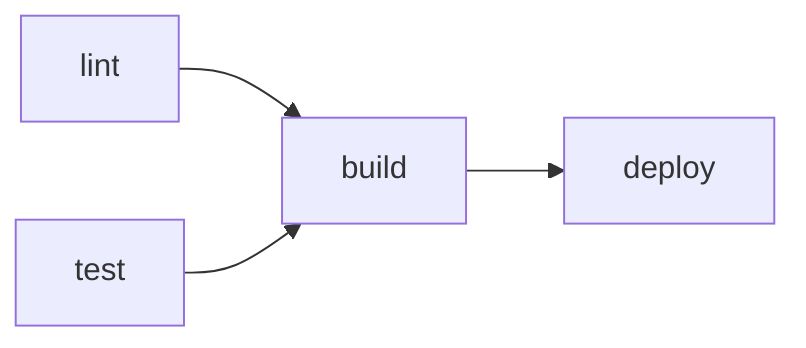

# 24 — Outputs, `needs`, concurrency, timeouts, `continue-on-error`

> *"The primitives that turn parallel jobs into a coherent pipeline."*

## Why this module exists

Once you have more than two jobs, you need to orchestrate them — pass data between them, serialize where needed, cancel duplicates, time-bound them. This module covers those primitives.

---

## 1. `needs:` — job dependencies

```yaml
jobs:
  lint:
    runs-on: ubuntu-latest
    steps:
      - uses: actions/checkout@v6
      - run: ruff check src

  test:
    runs-on: ubuntu-latest
    steps:
      - uses: actions/checkout@v6
      - run: pytest

  build:
    needs: [lint, test]                # wait for BOTH to succeed
    runs-on: ubuntu-latest
    steps:
      - uses: actions/checkout@v6
      - run: pip install build && python -m build

  deploy:
    needs: build                       # wait for build only
    if: github.ref == 'refs/heads/main'
    runs-on: ubuntu-latest
    steps:
      - run: ./deploy.sh
```

DAG semantics: `needs:` defines parent jobs. A job won't run until all its `needs:` parents complete. Failure of a parent skips the dependent (unless `if: always()` overrides).



---

## 2. Job outputs

A job can publish outputs that downstream jobs reference:

```yaml
jobs:
  build:
    runs-on: ubuntu-latest
    outputs:
      version: ${{ steps.ver.outputs.version }}
      artifact_name: ${{ steps.ver.outputs.artifact_name }}
    steps:
      - uses: actions/checkout@v6
      - id: ver
        run: |
          V=$(python -c "import my_pkg; print(my_pkg.__version__)")
          echo "version=$V" >> $GITHUB_OUTPUT
          echo "artifact_name=my-pkg-${V}.whl" >> $GITHUB_OUTPUT

  deploy:
    needs: build
    runs-on: ubuntu-latest
    steps:
      - run: |
          echo "Deploying version ${{ needs.build.outputs.version }}"
          aws s3 cp ${{ needs.build.outputs.artifact_name }} s3://...
```

Outputs are STRINGS — booleans become `"true"` / `"false"`. Max length 1 MB per output, 50 MB total per job.

For complex data (lists, objects), JSON-encode:

```yaml
- id: matrix
  run: echo "matrix=$(cat matrix.json | jq -c)" >> $GITHUB_OUTPUT

# Downstream:
strategy:
  matrix: ${{ fromJSON(needs.gen.outputs.matrix) }}
```

This is the **dynamic matrix** pattern — one job computes the matrix, downstream job uses it.

---

## 3. Step outputs

Same pattern, within a job:

```yaml
- id: build
  run: |
    BUILD_ID=$(date +%s)
    echo "build_id=$BUILD_ID" >> $GITHUB_OUTPUT
    echo "artifact_path=./dist/$BUILD_ID/" >> $GITHUB_OUTPUT

- run: |
    echo "Build ID: ${{ steps.build.outputs.build_id }}"
    ls -la ${{ steps.build.outputs.artifact_path }}
```

Steps share filesystem (same job/runner), so for large data you can just use files. Step outputs are for small structured values.

---

## 4. Concurrency

Concurrency groups serialize or cancel parallel runs of the same workflow.

```yaml
concurrency:
  group: ci-${{ github.ref }}            # one run per branch
  cancel-in-progress: true               # cancel any in-progress run when a new one starts
```

Patterns:

```yaml
# Per-PR: cancel old runs when new commits push to the same PR
concurrency:
  group: ${{ github.workflow }}-${{ github.head_ref || github.ref }}
  cancel-in-progress: true

# Per-environment: only one deploy at a time, queue new requests, don't cancel
concurrency:
  group: deploy-${{ inputs.env }}
  cancel-in-progress: false

# Per-branch CI: cancel duplicate runs on the same branch
concurrency:
  group: ci-${{ github.workflow }}-${{ github.ref }}
  cancel-in-progress: true
```

Scope: workflow-level OR job-level. Workflow-level applies to the whole run; job-level applies only to that job.

**Cost lever**: `cancel-in-progress: true` saves a LOT of CI minutes on busy repos. A developer pushing 5 commits in 5 minutes generates 5 CI runs by default — with concurrency cancellation, only the last one completes.

---

## 5. `timeout-minutes`

```yaml
jobs:
  test:
    runs-on: ubuntu-latest
    timeout-minutes: 30                  # job-level (cancels job after 30 min)
    steps:
      - run: pytest
        timeout-minutes: 20              # step-level (cancels step after 20 min)
```

Default: **6 hours**. Always override. Long-running ML training jobs need explicit `timeout-minutes: 480` (8h) or more.

---

## 6. `continue-on-error`

Don't fail the job if a step fails:

```yaml
- name: Run flaky integration tests
  run: pytest tests/integration
  continue-on-error: true

- name: Always-required step (next step)
  run: pytest tests/unit
```

Job-level too:

```yaml
jobs:
  optional-thing:
    continue-on-error: true              # job can fail without failing the workflow
    runs-on: ubuntu-latest
    steps:
      - run: experimental-thing
```

Pair with matrix's `fail-fast: false` for "try all combinations even if some fail."

---

## 7. The `if:` interaction with `needs:` failures

By default, a job is skipped if any `needs:` job fails. Override with explicit `if:`:

```yaml
jobs:
  build:
    runs-on: ubuntu-latest

  notify-on-success:
    needs: build
    if: success() && needs.build.result == 'success'
    runs-on: ubuntu-latest

  notify-on-failure:
    needs: build
    if: failure() && needs.build.result == 'failure'
    runs-on: ubuntu-latest

  cleanup:
    needs: build
    if: always()                        # always run regardless of build outcome
    runs-on: ubuntu-latest
```

`needs.<job>.result` values: `success`, `failure`, `cancelled`, `skipped`.

---

## 8. Fan-out / fan-in patterns

Sometimes you want one job to fan out into many parallel jobs, then a final job to aggregate. Use **matrix** for fan-out, **needs** for fan-in:

```yaml
jobs:
  test:
    strategy:
      matrix:
        python: ["3.11", "3.12", "3.13"]
        os: [ubuntu-latest, macos-latest]
    runs-on: ${{ matrix.os }}
    steps:
      - uses: actions/checkout@v6
      - run: pytest

  publish:
    needs: test                          # waits for ALL matrix jobs
    runs-on: ubuntu-latest
    steps:
      - run: ./publish.sh
```

For dynamic fan-out where the matrix isn't known until runtime:

```yaml
jobs:
  generate:
    runs-on: ubuntu-latest
    outputs:
      services: ${{ steps.list.outputs.services }}
    steps:
      - uses: actions/checkout@v6
      - id: list
        run: echo "services=$(jq -c '.services' services.json)" >> $GITHUB_OUTPUT

  build:
    needs: generate
    strategy:
      matrix:
        service: ${{ fromJSON(needs.generate.outputs.services) }}
    runs-on: ubuntu-latest
    steps:
      - run: ./build.sh ${{ matrix.service }}

  deploy-all:
    needs: build
    runs-on: ubuntu-latest
    steps:
      - run: ./deploy-all.sh
```

---

## 9. The full orchestration example

A real CI pipeline:

```yaml
name: CI
on:
  push:
    branches: [main]
  pull_request:

concurrency:
  group: ci-${{ github.workflow }}-${{ github.ref }}
  cancel-in-progress: ${{ github.event_name == 'pull_request' }}

permissions:
  contents: read
  pull-requests: write
  id-token: write

jobs:
  lint:
    runs-on: ubuntu-latest
    timeout-minutes: 5
    steps:
      - uses: actions/checkout@v6
      - uses: actions/setup-python@v5
        with: { python-version: "3.11", cache: pip }
      - run: pip install ruff
      - run: ruff check src tests

  test:
    strategy:
      matrix:
        python: ["3.11", "3.12"]
      fail-fast: false
    runs-on: ubuntu-latest
    timeout-minutes: 15
    steps:
      - uses: actions/checkout@v6
      - uses: actions/setup-python@v5
        with: { python-version: "${{ matrix.python }}", cache: pip }
      - run: pip install -e ".[dev]"
      - run: pytest --junitxml=junit.xml
      - uses: actions/upload-artifact@v4
        if: always()
        with:
          name: junit-${{ matrix.python }}
          path: junit.xml

  build:
    needs: [lint, test]
    runs-on: ubuntu-latest
    timeout-minutes: 10
    outputs:
      version: ${{ steps.ver.outputs.version }}
    steps:
      - uses: actions/checkout@v6
      - uses: actions/setup-python@v5
        with: { python-version: "3.11" }
      - run: pip install build
      - run: python -m build
      - id: ver
        run: echo "version=$(python -c 'import my_pkg; print(my_pkg.__version__)')" >> $GITHUB_OUTPUT
      - uses: actions/upload-artifact@v4
        with: { name: dist, path: dist/ }

  deploy:
    needs: build
    if: github.event_name == 'push' && github.ref == 'refs/heads/main'
    environment: prod
    runs-on: ubuntu-latest
    timeout-minutes: 20
    steps:
      - uses: actions/download-artifact@v4
        with: { name: dist, path: dist/ }
      - uses: aws-actions/configure-aws-credentials@v4
        with:
          role-to-assume: ${{ vars.DEPLOY_ROLE_ARN }}
          aws-region: us-east-1
      - run: ./deploy.sh ${{ needs.build.outputs.version }}
```

Reads like a coherent pipeline: lint + test (parallel, fail-fast off) → build → deploy (only on main, only after build succeeds). Each job has explicit timeout. Concurrency cancels duplicate PRs. Deploy is gated by environment (manual approval, scoped secrets — see [module 30](30_actions_environments_protection.md)).

---

## 10. Cross-references

- Matrix builds in detail → [module 25](25_actions_cache_artifacts_matrix.md).
- Environment-gated deploys → [module 30](30_actions_environments_protection.md).
- Artifacts (cross-job file passing) → [module 25](25_actions_cache_artifacts_matrix.md).
- Cost optimization via concurrency cancellation → [module 31](31_actions_token_cost_templates.md).
- Reusable workflows (orchestrating across repos) → [module 26](26_actions_reusable_workflows.md).
