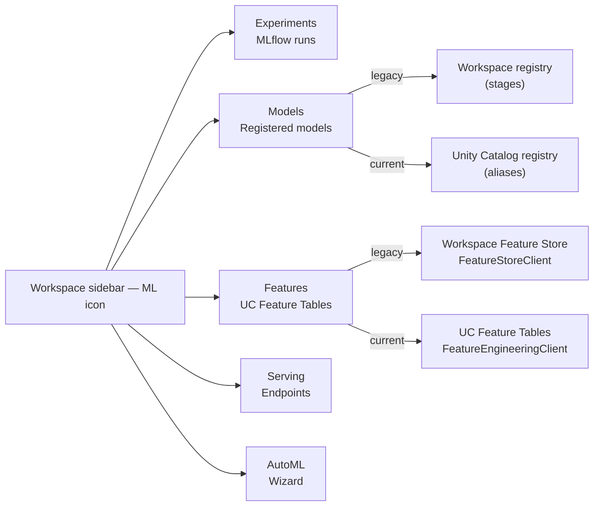

# Module 1 — Databricks ML Platform & Runtime

> **Goal of this module:** Build the mental model of "what is Databricks ML, structurally?" — the runtime stack, the cluster types that matter for ML, the workspace surfaces you'll touch (Experiments, Models, Feature Store, Model Serving), and the exam-relevant ways the platform differs from a generic Spark cluster.
>
> **Maps to exam objectives:** *Identify the advantages of using ML runtimes · Identify the best practices of an MLOps strategy* (Domain 1).

---

## Coverage map (verbatim exam objectives → where taught here)

| Verbatim objective | Taught in section |
|---|---|
| Identify the advantages of using ML runtimes | "DBR ML — what's in the runtime image" + "ML runtime advantages" exam-trap callout |
| Identify the best practices of an MLOps strategy | "MLOps strategy — what 'best practices' means" + "promote code vs promote model matrix" |

Note: "Promote code vs promote model" is shared between Modules 1 and 5; Module 5 has the deeper UC-flavored coverage.

---

## Why "Databricks ML" is a thing separate from "Databricks"

Databricks the platform is a lakehouse — Delta Lake + Spark + Unity Catalog + a notebook IDE. Most of that is data-engineering kit. The **ML layer** on top of that base is:

1. A **specialized runtime image** (DBR ML) with the Python ML ecosystem pre-installed.
2. A set of **workspace surfaces** — Experiments, Models, Feature Store, Serving — that wrap MLflow and Unity Catalog with ML-specific UI and APIs.
3. A few **first-party services**: AutoML (which writes notebooks for you), Mosaic AI Model Serving (real-time inference endpoints), Vector Search (out of scope for Associate).

For the exam, you need to recognize these surfaces by name, know what each does at a high level, and know **why "ML runtime advantages"** is a phrase that earns points.

---

## DBR ML — what's in the runtime image

The Databricks Runtime for Machine Learning is a separate runtime SKU. When you create a cluster, the runtime dropdown shows entries like:

```
17.3 LTS ML  (Apache Spark 4.0, Scala 2.13)
17.3 LTS ML GPU  (with CUDA 12.x, NCCL)
16.4 LTS ML  (Apache Spark 3.5)
```

Picking "ML" instead of plain DBR gets you, pre-installed and version-pinned:

| Layer | Packages |
|-------|----------|
| Core ML | scikit-learn, XGBoost, LightGBM, CatBoost |
| Deep learning | PyTorch, TensorFlow (CPU + GPU variants), Keras |
| Tracking | MLflow (currently 2.x; MLflow 3.0 on newest DBRs) |
| HPO | Optuna (always); Hyperopt (DBR ML ≤ 16.4 only) |
| Distributed DL | Horovod, TorchDistributor, Ray (on newer DBRs) |
| Data tools | pandas, NumPy, SciPy, statsmodels |
| Databricks SDK | `databricks-feature-engineering`, `databricks-sdk` |

> ⚠️ **Exam trap — "ML runtime advantages":** the right answer is **not** "more libraries." The exam wants: *(a)* pre-installed, version-pinned, tested-together ML stack with no `pip install` overhead, *(b)* CUDA/cuDNN/NCCL pre-configured on GPU variants, *(c)* Databricks-optimized variants of common libs where applicable (e.g., the MLflow integration is wired up out of the box), *(d)* `dbutils.library.restartPython()` workflow simplified for the ML stack. Pick the answer that hits the "pre-configured" and "version-tested" notes.

### LTS vs non-LTS

LTS (Long-Term Support) runtimes get patched for ~2 years. Production teams standardize on LTS. The exam doesn't quiz LTS dates, but if you see "use the most stable runtime for production" → pick the LTS option.

### Hyperopt cliff at DBR ML 17

DBR ML 16.4 LTS is the **last LTS that ships Hyperopt by default**. DBR ML 17.0+ omits it; you must `pip install hyperopt` yourself. The exam (March 1, 2025 revision) still tests Hyperopt — see Module 10. _Source: [Databricks hyperparameter tuning docs](https://docs.databricks.com/aws/en/machine-learning/automl-hyperparam-tuning). Last verified: 2026-05-23._

---

## Cluster types — what to pick for ML work

The exam doesn't deep-quiz cluster sizing, but it does test recognition of the right cluster type for the workload.

| Workload | Cluster type | Why |
|----------|--------------|-----|
| Interactive notebook (one user, exploration) | Single-user **All-Purpose** cluster, DBR ML | Standard interactive surface |
| Production scheduled training job | **Jobs cluster**, DBR ML, terminates on job end | Cheaper DBU rate; one job → one cluster lifecycle |
| Single-node sklearn / XGBoost training | **Single Node** cluster mode | No Spark overhead; driver-only |
| Distributed Spark ML training (RF, GBT) | Multi-node cluster, DBR ML | Spark partitions feature data across executors |
| Distributed PyTorch / TensorFlow | Multi-node cluster + **GPU runtime** | TorchDistributor/Horovod use the workers |
| HPO of single-node models across cluster | Multi-node cluster + **SparkTrials** (Hyperopt) or `joblibspark` (sklearn) | Each worker runs one trial in parallel |

### Single Node mode — non-obvious choice

For sklearn / XGBoost / LightGBM **single-node** training, **Single Node cluster mode is the right pick**, *not* a multi-node Spark cluster. A multi-node cluster wastes worker DBUs when training is driver-only. Many candidates over-default to multi-node.

```
Cluster mode: Single Node
DBR: 16.4 LTS ML
Driver type: r6gd.4xlarge   ← all compute happens here
```

You still use Single Node for **HPO** if you parallelize via `joblib` on the driver. You move to multi-node only when you want each worker to take one HPO trial.

> ⚠️ **Exam trap:** "You're training a single-node XGBoost model on 5 GB of data. Which cluster do you pick?" → **Single Node ML cluster**, not a multi-node cluster. The multi-node answer is a distractor that sounds bigger-is-better.

---

## Workspace anatomy for ML work

The Databricks left sidebar groups ML surfaces under a single icon. The exam expects you to recognize each:



### Experiments (MLflow tracking)

Every `mlflow.start_run()` call writes to an Experiment. Experiments live in the workspace tree and can be:
- **Notebook experiments** — implicitly created when a notebook calls `mlflow.start_run()` without setting an experiment first. The experiment lives at the same path as the notebook.
- **Workspace experiments** — explicitly created at a workspace path; multiple notebooks can write to one.

Each run inside an Experiment captures: params, metrics, tags, artifacts (files including the model), source code revision, the cluster's DBR version. The UI shows a sortable run table and a parallel-coordinates view for comparing HPO trials.

### Models (Registered Models)

A Registered Model is a **named lineage** of versions. Each version is one snapshot. The exam tests two registries:

- **Unity Catalog registry** (current): three-level name `catalog.schema.model`, versions promoted via **aliases** (`@champion`, `@challenger`). See Module 5.
- **Workspace registry** (legacy): two-level name `model_name`, versions promoted via **stages** (`Staging`, `Production`). Being phased out.

Pointing MLflow at UC requires one line:
```python
import mlflow
mlflow.set_registry_uri("databricks-uc")
```

### Feature Store / Feature Engineering

The exam tests UC-native Feature Engineering (Module 3). The sidebar shows feature tables you've created via `FeatureEngineeringClient.create_table()`. Tables expose:
- **Schema** — primary key + feature columns
- **Lineage** — which models, jobs, notebooks use this table
- **Online status** — whether it's published to a low-latency online store

### Model Serving

The Serving section lists active **endpoints**. Each endpoint hosts one or more **served entities** (model versions). Module 14 covers endpoint mechanics. The exam-relevant facts:
- Endpoints scale to zero after inactivity (default 30 min)
- Multiple served entities per endpoint enable **traffic splitting** (A/B)
- Endpoints invoke via `POST /serving-endpoints/{name}/invocations`

### AutoML

The AutoML wizard generates two notebooks (Data Exploration, Best Trial) and a backing MLflow Experiment. Module 2 unpacks this in detail.

---

## MLOps strategy — what "best practices" means on this exam

Section 1 of the exam guide opens with "Identify the best practices of an MLOps strategy." The answer Databricks expects pulls from these themes:

1. **Promote code, not models** (in most cases). Reproduce training in higher environments rather than copying model artifacts between workspaces. Models are byproducts of code + data; if you can rebuild, you can audit.
2. **Promote models, not code** (in some cases). Sometimes the production environment cannot run training (no GPU, no access to raw data). Then you train in `dev`, register, and promote the artifact.
3. **Unity Catalog as the single source of truth** for both features and models — cross-workspace lineage, ACL inheritance, no per-workspace drift.
4. **MLflow tracking is mandatory, not optional.** Every model in production has an MLflow run behind it. No "I just trained this in a notebook and copied the pickle."
5. **Versioning everything:** data (Delta time travel), features (UC feature tables), models (UC registered models), code (Git).
6. **Aliases > stages** for the UC registry — labels are flexible, stages were rigid.
7. **A/B by traffic split** at the serving endpoint, not by branching code paths in the application.

> ⚠️ **Exam trap — "promote code vs promote model":** The exam tests *both* directions. Look for the scenario hints:
> - "production cluster doesn't have access to raw data" → **promote model**
> - "want full lineage and ability to retrain" → **promote code**
> - "want consistent behavior across environments" → **promote code**
> - "training is expensive and was tuned in dev" → **promote model**

---

## The MLOps "promote code vs promote model" matrix

| Scenario | Promote what? | Why |
|----------|--------------|-----|
| Dev → staging → prod with full data access | **Code** | Reproducible, auditable, retrainable |
| Training requires GPU; prod is CPU-only | **Model** | Can't retrain in target environment |
| Raw data is sensitive and not in prod env | **Model** | Can't access data in prod |
| Frequent retraining with small tweaks | **Code** | Need the training loop to evolve |
| Expensive one-time training (LLM fine-tune) | **Model** | Retraining is uneconomical |
| Compliance requires byte-exact reproducibility | **Model** | "Promote code" doesn't guarantee identical bits across runs |

---

## "Why Databricks for ML" — exam-relevant value props

Section 1's opening objectives expect you to recognize Databricks-specific advantages. The points the exam wants you to recognize:

1. **Lakehouse-native ML** — train on Delta tables directly; no copy-out-of-warehouse step.
2. **Unity Catalog for ML governance** — features and models share the same catalog/schema/principal model as tables.
3. **MLflow built in** — no separate tracking server to operate.
4. **AutoML "glass box"** — generates editable Python notebooks, not opaque pickle blobs.
5. **Spark ML for distributed training** — RF / GBT / LR on TB-scale data without leaving the DataFrame API.
6. **Model Serving as a managed surface** — no Flask/FastAPI to operate; autoscale to zero.

---

## Worked exam-question walkthroughs

### Worked example: "Which cluster for sklearn training on 5GB data?"

**Pattern:** Question lists 4 cluster configs. Pick the right one for single-node sklearn.

**Reasoning:**
- sklearn `.fit()` runs in the driver Python — doesn't use Spark workers.
- Multi-node clusters waste worker DBUs.
- Single Node mode = driver-only, cheapest, equivalent throughput.

**Answer:** Single Node DBR ML cluster. NOT multi-node Standard.

### Worked example: "MLOps best practice — what to do"

**Pattern:** Scenario lists multiple things (logging, code review, model promotion, monitoring). Pick the canonical MLOps practice.

**Decision rules:** MLflow tracking is mandatory; UC for both features and models; promote code by default; aliases over stages; A/B at the endpoint.

### Worked example: "DBR ML runtime advantage"

**Trap:** "DBR ML is faster than DBR" — wrong. The actual advantages are:
- Pre-installed version-pinned ML stack (sklearn, XGBoost, PyTorch, MLflow, etc.)
- CUDA/cuDNN/NCCL pre-configured on GPU variants
- Tested compatibility across packages

If the answer mentions "pre-installed" / "pre-configured" / "tested" — pick it.

---

## Output prediction drills

### Drill 1
**Q:** You select `DBR ML 17.3 LTS` and try `from hyperopt import fmin`. What happens?
**A:** `ModuleNotFoundError`. Hyperopt is removed from DBR ML 17+. Either `pip install hyperopt` or use DBR ML 16.4 LTS (the last LTS shipping Hyperopt).

### Drill 2
**Q:** You're on a multi-node Standard cluster running sklearn `model.fit(X_train, y_train)` where X_train is a pandas DataFrame on the driver. Are the workers used?
**A:** **No.** sklearn fit runs entirely in driver Python. The workers idle. Switch to Single Node mode.

### Drill 3
**Q:** Cluster type for distributed `pyspark.ml.RandomForestClassifier` training on 200 GB data?
**A:** Multi-node DBR ML. Spark ML estimators partition data across workers.

---

## What the exam tests on this module

> 🎯 **Exam tests here:**
> - Recognize what "ML runtime advantages" means (pre-installed, version-pinned, tested-together stack)
> - Know that Hyperopt is removed from DBR ML 17+ but still tested on the exam
> - Pick the right cluster type for single-node sklearn training (Single Node mode, not multi-node)
> - Know that `mlflow.set_registry_uri("databricks-uc")` is the switch to UC registry
> - "Best practices of an MLOps strategy" — promote code by default, promote model when env constraints prevent retraining
> - Recognize the ML workspace surfaces by name (Experiments, Models, Features, Serving, AutoML)

---

## Mini quiz

1. You're training a 4 GB XGBoost model on a single node. The senior engineer recommends a multi-node Standard cluster "for parallelism." Argue against.
2. Your team's compliance requirement is "the production model artifact must be byte-identical to the one validated by QA." Should you promote code or promote model?
3. DBR ML 17.3 LTS does not ship Hyperopt by default. The exam still asks Hyperopt questions. How do you reconcile these facts?
4. Name three things you get from DBR ML that you do not get from plain DBR.
5. What single line of code points MLflow's registry calls at Unity Catalog instead of the workspace registry?

### Answers

1. XGBoost single-node training runs on the driver only. A multi-node cluster spends DBU on workers that idle. **Single Node mode** is cheaper and equivalent in throughput.
2. **Promote model.** "Byte-identical to validated artifact" cannot be guaranteed by re-running training even with the same code (numerics, library versions, hardware non-determinism). Copy the registered model version.
3. The exam guide is dated March 1, 2025, before Hyperopt was removed. The exam content lags the platform. You must still learn Hyperopt for the exam; in production code you'd use Optuna. See modules 10 and 11.
4. (Any three of) pre-installed sklearn/XGBoost/LightGBM/PyTorch/TensorFlow, pre-installed MLflow with Databricks-specific wiring, pre-installed Hyperopt (on ≤16.4) / Optuna, version-tested compatibility across packages, CUDA/cuDNN/NCCL pre-configured on GPU variants, `databricks-feature-engineering` SDK pre-installed.
5. `mlflow.set_registry_uri("databricks-uc")`.
