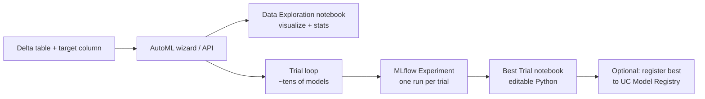

# Module 2 — AutoML in 2026

> **Goal of this module:** Understand AutoML well enough to answer the recognition-style questions on Domain 1 — what it does, what it generates, when to use it, when not to, and the "glass box" differentiator that Databricks emphasizes.
>
> **Maps to exam objectives:** *Identify how AutoML facilitates model/feature selection · Identify the advantages AutoML brings to the model development process* (Domain 1, 38%).

---

## Coverage map (verbatim exam objectives → where taught here)

| Verbatim objective | Taught in section |
|---|---|
| Identify how AutoML facilitates model/feature selection | "What AutoML actually does" + "Three task types" |
| Identify the advantages AutoML brings to the model development process | "Exam-relevant value props for AutoML" + "When to use AutoML" |

---

## What AutoML actually does

Databricks AutoML automates the **baseline-building** step of an ML project. Given a Delta table and a target column, it:

1. Profiles the data — stats per column, missing-value counts, type inference.
2. Generates a **Data Exploration notebook** — a Python notebook that visualizes the input columns and computes summary stats.
3. Trains many candidate models — across multiple algorithms (XGBoost, LightGBM, sklearn random forest, logistic/linear regression, decision tree, etc.) with multiple hyperparameter configurations.
4. Logs every trial to an **MLflow Experiment** — each trial is one run, all under one experiment.
5. Picks the best trial by the chosen evaluation metric.
6. Generates a **Best Trial notebook** — the actual Python code that produced the best model, fully editable.



## Three task types

AutoML supports three task families:

| Task | Algorithms (representative) | Metric defaults |
|------|------------------------------|-----------------|
| **Classification** | LogisticRegression, DecisionTree, RandomForest, XGBoost, LightGBM | F1 (binary), F1-macro (multiclass), accuracy, ROC AUC, log_loss |
| **Regression** | LinearRegression, DecisionTree, RandomForest, XGBoost, LightGBM | RMSE, MAE, R², MAPE |
| **Forecasting** | Prophet, ARIMA (plus DataFrame-native variants) | RMSE on horizon, MAPE, MAE |

> ⚠️ **Exam trap:** AutoML *forecasting* uses **Prophet and ARIMA**, not XGBoost. If a question says "use AutoML to forecast weekly demand," the underlying algorithms are time-series–specific, not the tree-based set.

## The two notebooks AutoML generates

This is the most exam-tested aspect of AutoML.

### 1. Data Exploration notebook

Pure descriptive analysis — no model code. Contains:
- `df.describe()` / `.summary()`
- Histograms of each feature
- Missing-value counts
- Correlation matrix
- Class balance (for classification)
- Identified candidate problem types (e.g., "this column appears categorical because it has 7 unique string values")

You use this notebook to **understand your data**, not your model. If AutoML's best model is bad, this notebook is where you look first.

### 2. Best Trial notebook

The training code that produced the winning model — fully editable Python. Contains:
- Data loading from the source Delta table
- Preprocessing (imputation, encoding, scaling) — explicit sklearn `Pipeline` code
- The model fit call (XGBoost, LightGBM, sklearn estimator, etc.)
- MLflow logging
- Evaluation on held-out data

> ⚠️ **Exam trap — "glass box":** the **Best Trial notebook is editable Python**, not an opaque pickle. The exam loves to phrase this as "AutoML's notebook is editable" vs distractors like "AutoML produces a black-box model." Pick the editable answer. This is the one trait Databricks brands the loudest.

You can read the notebook, change the hyperparameters, add features, refactor preprocessing — and re-run it as your own training pipeline. AutoML's role is to **give you a head start**, not to be the production training script.

---

## How to invoke AutoML

### Via UI

`Experiments` → `Create AutoML Experiment` → fill in:
- Compute cluster
- Source table (Delta in UC)
- Target column
- Problem type (Classification / Regression / Forecasting)
- Evaluation metric
- Optional: training time limit, run count limit, columns to exclude
- Click **Start**

### Via Python API

```python
from databricks import automl

summary = automl.classify(
    dataset=df,                       # Spark DataFrame or table name
    target_col="churned",
    primary_metric="f1",
    timeout_minutes=30,
    experiment_name="/Users/vatsal/churn_automl",
)

print(summary.best_trial.notebook_url)
print(summary.best_trial.model_path)
print(summary.experiment.experiment_id)
```

Equivalent APIs: `automl.regress(...)`, `automl.forecast(...)`.

The returned `summary` object exposes:
- `best_trial.notebook_url` — link to the generated Best Trial notebook
- `best_trial.model_path` — MLflow URI of the winning model artifact
- `experiment.experiment_id` — MLflow experiment containing all trials
- `data_exploration_notebook_url` — link to the Data Exploration notebook

---

## When to use AutoML

| Use AutoML when… | Don't use AutoML when… |
|------------------|------------------------|
| You need a rapid baseline to know what "good" looks like | You already have a strong baseline and are optimizing it |
| You're exploring whether the problem is even tractable | You need a custom model architecture (e.g., transformer fine-tune) |
| You want feature importance from multiple algorithm families | You need bespoke preprocessing (custom text vectorizer, etc.) |
| Stakeholder wants results in a day, not a week | You need byte-exact reproducibility tied to a specific algorithm |
| You want to sanity-check a hand-built model against an algorithm sweep | The dataset is too small to be informative (< few thousand rows) |
| Forecasting on standard time-series problems | Forecasting requires hierarchical or multivariate models AutoML doesn't support |

> 🎯 **Exam-relevant value props for AutoML:**
> - **Rapid baseline** — get a working model in minutes
> - **Feature importance discovery** — surface what columns drive predictions across algorithm families, before you commit to one
> - **MLflow integration** — every trial logged, comparable in the UI
> - **Editable notebooks** — the "glass box" differentiator
> - **Algorithm + hyperparameter search in one step** — saves the manual grid search

---

## AutoML and MLflow — one experiment, many runs

AutoML creates a single MLflow Experiment and writes one run per trial. The Experiment becomes the source of truth for everything AutoML did:

```python
from mlflow import MlflowClient

client = MlflowClient()

# All trials sorted by metric
runs = client.search_runs(
    experiment_ids=[summary.experiment.experiment_id],
    order_by=["metrics.val_f1_score DESC"],
)

for run in runs[:5]:
    print(run.info.run_id, run.data.metrics.get("val_f1_score"),
          run.data.tags.get("estimator_name"))
```

The exam tests this pattern — see Module 4 on `search_runs`.

## AutoML and Feature Engineering Client

AutoML can consume features from a UC feature table directly when you build the training set ahead of time and pass it as the dataset. See Module 3 for `FeatureEngineeringClient.create_training_set()`.

---

## What AutoML does NOT do

The exam may distract you with "AutoML can…" claims that are not actually true. Distractors to avoid:

- **AutoML does not build deep learning models** (PyTorch/TensorFlow are not in the algorithm set). It's classical ML.
- **AutoML does not auto-deploy to a Serving endpoint.** It registers the best model only if you click that follow-up button; the deployment is a separate step (Module 14).
- **AutoML does not handle unstructured data (text/image/audio) natively.** You'd need to vectorize first.
- **AutoML does not do online learning / streaming retraining.** It's a batch training tool.
- **AutoML's "Best Trial" is best on the validation set**, not guaranteed best on held-out test data. You should still evaluate independently.

---

## Worked exam-question walkthroughs

### Worked example: "How does AutoML facilitate feature selection?"

**Reasoning:** AutoML doesn't EXPLICITLY do feature selection in the sklearn `SelectKBest` sense. What it does:
- Profiles every column (cardinality, missingness, type).
- Excludes columns marked as identifiers (high-cardinality, unique).
- Surfaces feature importance per algorithm — so YOU can decide which features to drop.

**Answer to "how does AutoML facilitate feature selection":** Via algorithm-family-wide feature importance discovery + glass-box notebooks where you can prune features and re-run. Not by automatic feature pruning.

### Worked example: "Does AutoML auto-deploy?"

**Reasoning:** No. AutoML produces: (a) Data Exploration notebook, (b) Best Trial notebook, (c) MLflow Experiment. Registration to UC and endpoint deploy are SEPARATE clicks.

**Answer:** No, you must register and deploy yourself.

### Worked example: "AutoML for image classification?"

**Reasoning:** AutoML supports classification, regression, forecasting on TABULAR data. Image / text / audio are not supported.

**Answer:** No — use Mosaic AI custom training (or sklearn after vectorization).

---

## Output prediction drills

### Drill 1
**Q:** AutoML runs 50 trials. Where are they stored?
**A:** One MLflow Experiment with 50 runs (one per trial). The experiment URL is in `summary.experiment.experiment_id`.

### Drill 2
**Q:** You modify the Best Trial notebook's hyperparameters and re-run. Does this update the AutoML experiment?
**A:** No — re-running the notebook creates new MLflow runs in the SAME experiment. AutoML's trial set is preserved; your edits are additional runs.

### Drill 3
**Q:** AutoML forecasting algorithm options?
**A:** Prophet, ARIMA, and DataFrame-native variants. NOT XGBoost (which is for classification/regression in AutoML).

---

## What the exam tests on this module

> 🎯 **Exam tests here:**
> - The "glass box" / editable-notebook differentiator
> - That AutoML produces *two* notebooks (Data Exploration + Best Trial) plus an MLflow Experiment
> - Three task types: classification, regression, forecasting (and forecasting uses Prophet/ARIMA)
> - When AutoML is appropriate (rapid baseline, feature importance discovery, algorithm sweep)
> - That AutoML integrates with MLflow — all trials logged, comparable in the UI
> - That AutoML does NOT do deep learning, does NOT deploy automatically, does NOT handle unstructured data natively

---

## Mini quiz

1. Your data scientist says "AutoML is a black box — we don't know what it did." Argue why this is wrong on Databricks specifically.
2. AutoML generated 50 trials for a binary classification problem. Where do you go to see them all in one view?
3. You want to forecast weekly sales for 200 SKUs. Should you use AutoML?
4. AutoML's best trial achieved 0.92 validation AUC. The next step in the workflow is __________ (fill in).
5. Which of the following is NOT generated by an AutoML run? **a)** Data Exploration notebook, **b)** Best Trial notebook, **c)** MLflow Experiment with all trials, **d)** Model Serving endpoint.

### Answers

1. AutoML generates a fully editable Python Best Trial notebook — you can read every line of preprocessing, the model fit call, and the evaluation. This is the "glass box" trait Databricks markets. Not a black box.
2. The MLflow Experiment that AutoML created. Open it in the Experiments sidebar; sort the runs by your primary metric.
3. AutoML forecasting supports Prophet and ARIMA. For 200 SKUs, AutoML can build per-series models. **Yes, this is a reasonable AutoML use case.** If you needed a single hierarchical model across SKUs, AutoML doesn't support that — go custom.
4. **Register the best model to the UC Model Registry**, then either evaluate on a separate test set, refine via the editable notebook, or deploy to a Serving endpoint. AutoML doesn't auto-register or auto-deploy.
5. **d) Model Serving endpoint.** AutoML generates (a), (b), (c). Deployment is a separate step you initiate.
