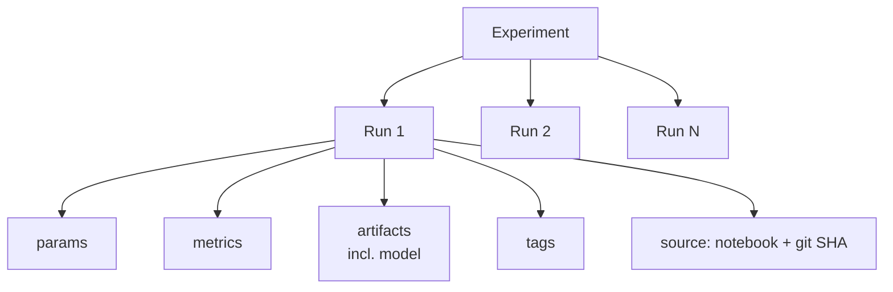

# Module 4 — MLflow Tracking Basics

> **Goal of this module:** Internalize the MLflow tracking surface the exam tests — runs, experiments, params/metrics/artifacts/tags, autologging defaults per flavor, and the `MlflowClient.search_runs` pattern that shows up in "find the best run" questions.
>
> **Maps to exam objectives:** *Identify the best run using the MLflow Client API · Manually log metrics, artifacts, and models in an MLflow Run · Identify information available in the MLflow UI* (Domain 1).

---

## Coverage map (verbatim exam objectives → where taught here)

| Verbatim objective (Mar 1, 2025 guide) | Taught in section |
|---|---|
| Identify the best run using the MLflow Client API | "Finding the best run — `MlflowClient.search_runs`" + "Worked example: find best run by metric" |
| Manually log metrics, artifacts, and models in an MLflow Run | "Manual logging — the canonical pattern" + "Key calls you must recognize" |
| Identify information available in the MLflow UI | "The MLflow UI — what's visible" |

Modules 4 and 5 together cover all 7 MLflow-related Domain 1 objectives. Module 4 is tracking; Module 5 is registry.

---

## The MLflow tracking object model



- **Experiment** = a named container. Every run belongs to exactly one experiment.
- **Run** = one training execution. Identified by a unique `run_id`.
- **Params** = inputs (hyperparameters). String → string. Logged once.
- **Metrics** = measured outputs. String → float. Can be logged multiple times in a run (per epoch).
- **Artifacts** = files. Models, plots, datasets, anything.
- **Tags** = arbitrary key/value metadata. Both auto-tags (notebook ID, git SHA) and user tags.

---

## Setting the experiment

Three patterns, in increasing order of explicitness:

```python
# 1. Implicit — uses the notebook's path as the experiment
with mlflow.start_run():
    ...

# 2. Explicit by name (creates if not exists)
mlflow.set_experiment("/Users/vatsal/churn-experiment")

with mlflow.start_run():
    ...

# 3. Explicit by experiment_id
mlflow.set_experiment(experiment_id="123456789")
```

> ⚠️ **Exam trap — notebook experiments vs workspace experiments:** When you call `start_run()` without setting an experiment, MLflow creates one at the **same workspace path as the notebook**. This is a **notebook experiment**. Different notebooks → different default experiments. If multiple notebooks should share one experiment, use `set_experiment(name)` explicitly.

---

## Manual logging — the canonical pattern

```python
import mlflow
import mlflow.sklearn
from sklearn.ensemble import RandomForestClassifier
from sklearn.metrics import roc_auc_score, f1_score

mlflow.set_experiment("/Users/vatsal/churn")

with mlflow.start_run(run_name="rf_baseline") as run:
    # Params (hyperparameters)
    mlflow.log_param("n_estimators", 100)
    mlflow.log_param("max_depth", 10)
    mlflow.log_params({"min_samples_split": 5, "criterion": "gini"})  # batch form

    # Train
    model = RandomForestClassifier(n_estimators=100, max_depth=10)
    model.fit(X_train, y_train)
    y_pred = model.predict_proba(X_val)[:, 1]

    # Metrics
    mlflow.log_metric("auc", roc_auc_score(y_val, y_pred))
    mlflow.log_metric("f1", f1_score(y_val, (y_pred > 0.5).astype(int)))
    mlflow.log_metrics({"train_samples": len(X_train), "val_samples": len(X_val)})

    # Tags
    mlflow.set_tag("data_version", "2026-05-23")
    mlflow.set_tag("model_family", "tree_ensemble")

    # Artifacts: arbitrary file
    mlflow.log_artifact("/tmp/feature_importance.png")

    # Artifact: the model itself, in sklearn flavor
    mlflow.sklearn.log_model(model, artifact_path="model")

    print("Run ID:", run.info.run_id)
```

### Key calls you must recognize

| Call | What it logs |
|------|--------------|
| `mlflow.log_param(key, value)` | One param (hyperparameter) |
| `mlflow.log_params(dict)` | Many params at once |
| `mlflow.log_metric(key, value, step=None)` | One metric (optional step for per-epoch logging) |
| `mlflow.log_metrics(dict, step=None)` | Many metrics at once |
| `mlflow.log_artifact(local_path, artifact_path=None)` | Any file as an artifact |
| `mlflow.log_artifacts(local_dir, artifact_path=None)` | A whole directory |
| `mlflow.set_tag(key, value)` | One tag |
| `mlflow.set_tags(dict)` | Many tags |
| `mlflow.<flavor>.log_model(model, artifact_path, ...)` | The model artifact in a flavor |

> ⚠️ **Exam trap — params vs metrics:**
> - **Params** are **inputs** (hyperparameters), logged **once** per run.
> - **Metrics** are **outputs** (evaluation scores), can be logged **multiple times** in a run with `step=` for time series (e.g., per training epoch).
> - If a question says "track a value that changes over training iterations," it's a metric (with step), not a param.

### Logging metrics over training iterations (step)

```python
for epoch in range(num_epochs):
    train_one_epoch()
    val_loss = compute_val_loss()
    mlflow.log_metric("val_loss", val_loss, step=epoch)
```

The UI plots metrics over steps automatically.

---

## Autologging

For most common flavors, autologging removes the manual log calls. Call once per session before training:

```python
import mlflow

mlflow.sklearn.autolog()       # or .xgboost.autolog(), .pytorch.autolog(), etc.

# Now any sklearn.fit() call inside an active run auto-logs params + metrics + model
with mlflow.start_run():
    model = RandomForestClassifier(n_estimators=100)
    model.fit(X_train, y_train)
    # params, training_score, signature, input_example, and the model
    # are auto-logged. You can add more with log_metric() manually.
```

### What autologging captures by flavor

| Flavor | Autolog call | Logs |
|--------|-----|------|
| scikit-learn | `mlflow.sklearn.autolog()` | params, training_score, input_example, signature, model |
| Spark ML | `mlflow.pyspark.ml.autolog()` | pipeline stages, params, evaluator metrics, model |
| XGBoost | `mlflow.xgboost.autolog()` | params, per-iteration eval metrics, feature importance, model |
| LightGBM | `mlflow.lightgbm.autolog()` | params, per-iteration eval metrics, model |
| PyTorch | `mlflow.pytorch.autolog()` | params, training loss, model (manual val metric logging) |
| TensorFlow / Keras | `mlflow.tensorflow.autolog()` | params, history (per-epoch loss/metrics), model |

**Universal:** `mlflow.autolog()` (no flavor) auto-detects what's in use and enables the right one. Convenient but less explicit.

> ⚠️ **Exam trap — autolog scope:**
> - Autolog must be called **before** the `.fit()` call.
> - Autolog wraps the `fit` method via a monkey-patch. It does NOT pick up `.partial_fit`, custom fitting loops, or models trained outside the wrapped class.
> - You **can** combine autolog with manual `log_metric` for things autolog doesn't capture (e.g., a custom holdout score).

---

## Finding the best run — `MlflowClient.search_runs`

This is the single most-tested MLflow API on the exam. The exam objective is literal: *"Identify the best run using the MLflow Client API."*

```python
from mlflow import MlflowClient

client = MlflowClient()

# Best run by AUC, descending
best_run = client.search_runs(
    experiment_ids=[experiment_id],
    filter_string="metrics.auc > 0.8",   # optional filter
    order_by=["metrics.auc DESC"],
    max_results=1,
)[0]

print("Best run_id:", best_run.info.run_id)
print("Best AUC:", best_run.data.metrics["auc"])
```

### Signature breakdown

| Argument | What it does |
|----------|--------------|
| `experiment_ids=[...]` | Required. List of experiment IDs to search across. |
| `filter_string="..."` | SQL-like filter on metrics/params/tags |
| `order_by=["..."]` | List of "field DIRECTION" strings; **`DESC` for max, `ASC` for min** |
| `max_results=N` | How many runs to return |

### Filter string syntax

```
metrics.auc > 0.85
params.max_depth = "10"
tags.`mlflow.source.git.commit` = "abc123"
attributes.status = "FINISHED"
```

Combine with `AND` (not `OR`):
```
metrics.auc > 0.8 AND params.n_estimators = "100"
```

### Order by direction — the most common trap

> ⚠️ **Exam trap — `DESC` vs `ASC`:**
> - Maximize a metric (AUC, F1, accuracy) → `order_by=["metrics.auc DESC"]`
> - Minimize a metric (loss, RMSE, log_loss) → `order_by=["metrics.loss ASC"]`
> - "Lowest loss" with `DESC` returns the worst run. Read the direction carefully.

---

## The MLflow UI — what's visible

The exam asks "*Identify information available in the MLflow UI*." Be ready to recognize:

- **Run table:** sortable list of runs in an experiment with columns for params, metrics, tags. Click columns to sort; use filter bar for advanced search.
- **Run detail page:** params, metrics (line plots if logged with step), artifacts (browse the artifact directory), source notebook/git info, dataset references (when logged), system tags.
- **Compare runs view:** select multiple runs → "Compare." Shows parallel coordinates plot for HPO sweeps, scatter plots of metric pairs, side-by-side params.
- **Model artifact UI:** for a logged model, the UI shows the schema/signature, input example (if logged), and a "Register model" button.

Things the UI does **NOT** show:
- Real-time training loss as the training runs (you see the values only after `log_metric` writes them).
- The raw dataset (only metadata if you logged a dataset reference).
- Logs from `print` statements unless you `log_artifact` the notebook's output or driver logs.

---

## Other MlflowClient methods worth knowing

```python
client = MlflowClient()

# Experiments
exp = client.get_experiment_by_name("/Users/vatsal/churn")
client.create_experiment("new_exp")
client.delete_experiment(experiment_id)

# Runs
run = client.get_run(run_id)
client.create_run(experiment_id, tags={"foo": "bar"})
client.delete_run(run_id)

# Manually log without an active run context
client.log_param(run_id, "max_depth", 10)
client.log_metric(run_id, "auc", 0.87)
client.set_tag(run_id, "data_v", "2026-05-23")
client.log_artifact(run_id, "/tmp/plot.png")

# Registered models — see Module 5 for the full surface
client.create_registered_model("catalog.schema.model")
client.create_model_version(name=..., source=..., run_id=...)
```

The pattern `mlflow.log_*` (no client) only works inside an `mlflow.start_run()` context. `MlflowClient.log_*` works on any run by ID.

---

## Loading a logged model

To use a logged model later:

```python
# By run_id + artifact path
model = mlflow.sklearn.load_model(f"runs:/{run_id}/model")

# By registered model + version
model = mlflow.sklearn.load_model("models:/catalog.schema.churn/3")

# By registered model + alias  (UC registry — Module 5)
model = mlflow.sklearn.load_model("models:/catalog.schema.churn@champion")

# As generic pyfunc (works for any flavor)
model = mlflow.pyfunc.load_model("models:/catalog.schema.churn@champion")
```

`mlflow.pyfunc.load_model` is the universal loader — useful when the calling code doesn't know which flavor the model was logged as.

---

## Look-alike API comparison — memorize these distinctions

The exam consistently tests pairs of APIs that look similar but differ. Burn this table.

| Pair | Difference | Exam tell |
|------|------------|-----------|
| `mlflow.log_param` vs `mlflow.log_metric` | param = string input, logged once. metric = float, can log many times with `step=` | Question shows `step=epoch` → metric. Question stores hyperparameter → param. |
| `mlflow.log_metric(k, v)` vs `mlflow.log_metrics({k: v, ...})` | singular vs plural (batch form) | Either is correct |
| `mlflow.set_tag(k, v)` vs `mlflow.set_experiment_tag(k, v)` | tag on the **current run** vs tag on the **experiment itself** | "tag on a run" → `set_tag`. "tag on the experiment" → `set_experiment_tag` |
| `mlflow.set_experiment(name)` vs `mlflow.set_experiment(experiment_id="...")` | by path/name vs by ID | Both work; ID is one positional, name is the path string |
| `mlflow.start_run()` vs `MlflowClient().create_run(experiment_id)` | active-run context manager vs explicit run creation by ID | `start_run` for inline logging; `create_run` for scripts that log to multiple runs concurrently |
| `mlflow.search_runs(...)` vs `MlflowClient().search_runs(...)` | pandas DataFrame return vs list of `Run` objects | If question shows `runs.iloc[0]` or pandas filter → `mlflow.search_runs`. If `runs[0].info.run_id` → client form |
| `mlflow.<flavor>.log_model` vs `mlflow.pyfunc.log_model` | flavor-native (sklearn/spark/xgboost) vs generic Python wrapper | Question mentions `python_model=` or a custom predict class → `pyfunc`. Otherwise flavor. |
| `mlflow.<flavor>.load_model` vs `mlflow.pyfunc.load_model` | returns native object (sklearn estimator) vs `PyFuncModel` with `.predict` only | Caller is flavor-aware → flavor load. Caller is flavor-agnostic / Spark UDF target → pyfunc |
| `mlflow.autolog()` vs `mlflow.sklearn.autolog()` | universal auto-detect vs flavor-specific | Universal is shorthand; flavor-specific lets you pass flavor-specific kwargs |
| `client.log_param(run_id, k, v)` vs `mlflow.log_param(k, v)` | log to any run by ID vs log to the active run | Outside `start_run()` context → client form |
| `client.delete_run(id)` vs `client.delete_experiment(id)` | one run vs the whole experiment | — |

> 🎯 **How to recognize this on the exam:** When two answer choices look identical except for the prefix (`mlflow.` vs `MlflowClient().`), check the **context**: is there an active `with mlflow.start_run():` block? If yes, both work; the question is probably testing equivalence. If there is no active run, only the `MlflowClient` form (with explicit `run_id`) is correct.

---

## Full `search_runs` API surface — exam-targetable

The exam tests this method's parameters explicitly. Memorize the full signature.

```python
MlflowClient().search_runs(
    experiment_ids: list[str],         # REQUIRED — which experiments to search
    filter_string: str = "",           # SQL-like filter
    run_view_type: int = ACTIVE_ONLY,  # ACTIVE_ONLY | DELETED_ONLY | ALL
    max_results: int = 1000,           # default 1000, max 50000
    order_by: list[str] | None = None, # e.g., ["metrics.auc DESC", "attributes.start_time DESC"]
    page_token: str | None = None,     # for pagination
) -> list[Run]
```

### Filter string field prefixes — must memorize

| Prefix | What it filters on | Example |
|--------|---------------------|---------|
| `metrics.<name>` | Numeric metric | `metrics.auc > 0.85` |
| `params.<name>` | Param value (always string) | `params.max_depth = "10"` |
| `tags.<name>` | Tag value (use backticks for special chars) | `tags.\`mlflow.source.git.commit\` = "abc"` |
| `attributes.<field>` | Run attributes | `attributes.status = "FINISHED"`, `attributes.start_time > 1700000000000` |

### Run status values — `attributes.status` filter

| Status | Meaning |
|--------|---------|
| `RUNNING` | Training currently in progress |
| `FINISHED` | Completed normally |
| `FAILED` | Errored during training |
| `KILLED` | Manually terminated |
| `SCHEDULED` | Queued, not yet started |

```python
# Filter to only successful runs sorted by val AUC
client.search_runs(
    experiment_ids=[exp_id],
    filter_string="attributes.status = 'FINISHED' AND metrics.val_auc > 0.7",
    order_by=["metrics.val_auc DESC"],
    max_results=5,
)
```

### Combining filters — `AND` only

```python
filter_string="metrics.auc > 0.85 AND params.max_depth = '10' AND tags.team = 'ml-platform'"
```

There is **no `OR`** in MLflow filter strings. To union results, run two queries and concatenate.

> ⚠️ **Exam trap — params are strings:** Even if you logged `mlflow.log_param("max_depth", 10)` (int), the filter must be `params.max_depth = "10"` (quoted). `params.max_depth = 10` errors.

---

## Autologging — full parameter surface and per-flavor behavior

```python
mlflow.autolog(
    log_input_examples=False,
    log_model_signatures=True,
    log_models=True,
    log_datasets=True,
    disable=False,
    exclusive=False,             # if True, suppresses user's manual mlflow.log_* inside autologged fit
    disable_for_unsupported_versions=False,
    silent=False,
    extra_tags=None,
)
```

### Autolog behavior matrix — what each flavor captures

| Flavor | Auto params | Auto metrics | Auto artifacts | Per-iteration logging? |
|--------|-------------|--------------|----------------|------------------------|
| **sklearn** | all estimator `__init__` params | `training_score` only | model artifact, signature, input example | No (single fit) |
| **pyspark.ml** | every Pipeline stage's params | metrics from any Evaluator called during fit | model artifact | No |
| **xgboost** | all booster params | per-iteration eval metrics (if `eval_set` provided) | model, feature importance plot | **Yes — per round** |
| **lightgbm** | all booster params | per-iteration eval metrics | model, feature importance | **Yes — per round** |
| **pytorch (Lightning)** | hyperparameters via LightningModule | per-step / per-epoch loss | model checkpoint | **Yes — per step** |
| **tensorflow / keras** | optimizer + model config | per-epoch loss + metric from `history` | model | **Yes — per epoch** |

> ⚠️ **Exam trap — autolog called AFTER fit:** Autolog must be called **before** `.fit()` to monkey-patch the class. Calling it after has no effect on already-trained models. If a question shows autolog called post-fit, the answer is "nothing was logged."

> ⚠️ **Exam trap — `exclusive=False` vs `exclusive=True`:** Default `False` lets you mix manual `mlflow.log_metric` with autolog. `exclusive=True` suppresses manual calls inside the autologged fit (autolog "owns" that run). You almost always want the default.

---

## `MlflowClient` direct logging — bypass active-run context

When you don't want a `with mlflow.start_run():` block (e.g., async jobs, multi-run scripts), use `MlflowClient` methods directly with a `run_id`.

```python
client = MlflowClient()

# Create a run explicitly (no active context needed)
run = client.create_run(experiment_id=exp_id, tags={"job": "nightly"})
run_id = run.info.run_id

# Log to that specific run
client.log_param(run_id, "max_depth", 10)
client.log_metric(run_id, "auc", 0.87, step=0, timestamp=int(time.time()*1000))
client.log_metric(run_id, "auc", 0.91, step=1)        # multiple steps allowed
client.set_tag(run_id, "data_version", "2026-05-23")
client.log_artifact(run_id, "/tmp/plot.png", artifact_path="plots")

# Close the run
client.set_terminated(run_id, status="FINISHED")      # "FINISHED" | "FAILED" | "KILLED"
```

`client.create_run` does NOT need a `with` block — you must manually call `set_terminated` to mark it done. Forgetting this leaves the run in `RUNNING` state forever in the UI.

---

## Worked exam-question walkthroughs

### Worked example: "Find the run with the highest val_auc"

**Pattern:** Four code snippets, pick the one that returns the run with maximum `val_auc`.

**Reasoning:**
1. The API is `MlflowClient().search_runs(...)`.
2. The required arg is `experiment_ids=[...]` (a **list**, even if just one ID).
3. To sort by a metric, use `order_by=["metrics.<name> DIRECTION"]`. The `metrics.` prefix is mandatory.
4. For "highest" → `DESC`. For "lowest" → `ASC` (or omit; default is `ASC`).
5. To get just the top: `max_results=1`, then index `[0]`.

**Correct:**
```python
best = client.search_runs(
    experiment_ids=[exp_id],
    order_by=["metrics.val_auc DESC"],
    max_results=1,
)[0]
```

**Distractor patterns and why they're wrong:**
- `order_by=["val_auc DESC"]` — missing `metrics.` prefix; throws.
- `order_by=["metrics.val_auc"]` — default direction is ASC; returns the WORST run.
- `order_by=["metrics.val_auc DESC"], max_results=10` then `runs[0]` — works but wasteful; `max_results=1` is cleaner. Both might be valid; check question wording.
- `experiment_ids=exp_id` — must be a list. Errors.

### Worked example: "Log a multi-step metric"

**Pattern:** Question shows a loop and asks how to log validation loss over epochs.

**Reasoning:** Metrics with `step=` are plotted as a time series in the UI. Params can't be logged multiple times.

**Correct:**
```python
for epoch in range(num_epochs):
    train_one_epoch()
    val_loss = compute_val_loss()
    mlflow.log_metric("val_loss", val_loss, step=epoch)
```

**Distractor:**
```python
for epoch in range(num_epochs):
    mlflow.log_param("val_loss", val_loss)   # WRONG — param logged repeatedly errors or overwrites
```

### Worked example: "Filter runs by multiple conditions"

**Pattern:** "Find all FINISHED runs in experiment 42 with AUC > 0.8 and max_depth = 10, sorted by start time."

**Reasoning:**
- Filter string uses `AND` to combine; no `OR`.
- Params are strings even if logged as int: `params.max_depth = "10"`.
- Status is on `attributes.`: `attributes.status = 'FINISHED'`.

**Correct:**
```python
runs = client.search_runs(
    experiment_ids=[42],
    filter_string="attributes.status = 'FINISHED' AND metrics.auc > 0.8 AND params.max_depth = '10'",
    order_by=["attributes.start_time DESC"],
)
```

### Worked example: "Autolog produced nothing"

**Pattern:** Code calls `mlflow.sklearn.autolog()` after `model.fit()`. Question: what got logged?

**Reasoning:** Autolog monkey-patches the `fit` method. It only intercepts calls **made after** the autolog call. Since `fit` already returned, nothing is captured.

**Answer:** Nothing. The fix is to move `mlflow.sklearn.autolog()` **before** the `.fit()` call, then re-fit (or accept it for the next run).

### Worked example: "Which model URI loads from an alias"

**Pattern:** Three URIs; pick the one that loads via UC alias.

**URIs:**
- `runs:/abc123/model` — by run ID (specific run, frozen)
- `models:/cat.sch.model/3` — by registered model + version number
- `models:/cat.sch.model@champion` — by registered model + alias (UC only)
- `models:/cat.sch.model/Production` — legacy stage syntax (workspace registry only)

**Answer:** `models:/cat.sch.model@champion` uses the `@` separator → UC alias. The `/Production` form is legacy stages.

---

## Output prediction drills

Read each snippet. What does it print / return?

### Drill 1
```python
client = MlflowClient()
runs = client.search_runs(
    experiment_ids=[exp_id],
    order_by=["metrics.loss"],   # no direction
    max_results=1,
)
```
**Q:** Does this return the run with the lowest or highest loss?
**A:** Lowest. Default order direction is `ASC`. For "lowest loss" this is correct; for "highest AUC" you'd be wrong.

### Drill 2
```python
with mlflow.start_run() as run:
    mlflow.log_param("lr", 0.01)
    mlflow.log_param("lr", 0.001)   # log same param twice
```
**Q:** What's stored?
**A:** **Error.** Params are immutable per run. The second `log_param("lr", ...)` raises `MlflowException`. (Metrics, by contrast, can be logged multiple times.)

### Drill 3
```python
mlflow.set_experiment("/Users/vatsal/exp")
with mlflow.start_run():
    mlflow.log_metric("auc", 0.5)
with mlflow.start_run():
    mlflow.log_metric("auc", 0.9)

runs = mlflow.search_runs()
print(len(runs))
```
**Q:** How many runs in `runs`?
**A:** 2. Each `with mlflow.start_run():` block creates a new run in the active experiment.

### Drill 4
```python
mlflow.sklearn.autolog(log_models=False)
with mlflow.start_run():
    model = RandomForestClassifier(n_estimators=50).fit(X, y)
```
**Q:** Was the model artifact logged?
**A:** No. `log_models=False` explicitly disables model logging while still capturing params + metrics.

### Drill 5
```python
client.set_tag(run_id, "stage", "qa")
client.set_tag(run_id, "stage", "prod")
```
**Q:** What is the value of `stage` on the run?
**A:** `"prod"`. Tags are mutable; setting the same key overwrites. (Params are NOT mutable — see Drill 2.)

---

## End-to-end mini-scenario

```python
import mlflow
from mlflow import MlflowClient
from sklearn.ensemble import GradientBoostingClassifier
from sklearn.metrics import roc_auc_score

mlflow.set_experiment("/Users/vatsal/churn-tuning")
client = MlflowClient()

# Train and log 3 candidates
for lr in [0.01, 0.05, 0.1]:
    with mlflow.start_run(run_name=f"gb_lr_{lr}") as run:
        mlflow.log_param("learning_rate", lr)
        mlflow.log_param("n_estimators", 200)
        mlflow.set_tag("data_version", "v3")

        model = GradientBoostingClassifier(learning_rate=lr, n_estimators=200).fit(X_train, y_train)
        auc = roc_auc_score(y_val, model.predict_proba(X_val)[:, 1])
        mlflow.log_metric("val_auc", auc)
        mlflow.sklearn.log_model(model, artifact_path="model")

# Find the best run
exp = client.get_experiment_by_name("/Users/vatsal/churn-tuning")
best_run = client.search_runs(
    experiment_ids=[exp.experiment_id],
    filter_string="attributes.status = 'FINISHED' AND tags.data_version = 'v3'",
    order_by=["metrics.val_auc DESC"],
    max_results=1,
)[0]

print(f"Best run: {best_run.info.run_id}")
print(f"Best AUC: {best_run.data.metrics['val_auc']:.4f}")
print(f"Best LR : {best_run.data.params['learning_rate']}")

# Load the best model
best_model_uri = f"runs:/{best_run.info.run_id}/model"
best_model = mlflow.sklearn.load_model(best_model_uri)
```

This snippet exercises 8 exam objectives at once: `set_experiment`, `start_run` context, `log_param/metric/set_tag`, flavor `log_model`, `search_runs` with `filter_string` + `order_by`, accessing `.data.metrics` / `.data.params`, model URI construction, flavor `load_model`.

---

## Common pitfalls

### Logging a param that should be a metric (or vice versa)

Params are immutable per run, strings. Metrics are floats, can be logged with `step=`. Logging a per-epoch loss as a param means you only get the last value (overwriting) or an error. Logging a single hyperparameter as a metric is allowed but defeats the param/metric UI distinction.

### Forgetting to set the experiment

Without `mlflow.set_experiment`, runs land in the notebook's default experiment. If multiple notebooks should aggregate runs into one experiment, set it explicitly.

### Order direction backwards on `search_runs`

Asking for "the best AUC" with `order_by=["metrics.auc ASC"]` returns the worst. Default is ASC, so always specify direction.

### Confusing the model URI schemes

- `runs:/<run_id>/<artifact_path>` — by run, specific run
- `models:/<name>/<version>` — by registered model + version number
- `models:/<name>@<alias>` — by registered model + alias (UC only)
- `models:/<name>/Production` — legacy stage syntax (workspace registry only)

---

## What the exam tests on this module

> 🎯 **Exam tests here:**
> - `mlflow.log_param` vs `mlflow.log_metric` (params = inputs, metrics = outputs with optional step)
> - `mlflow.<flavor>.log_model` and what each flavor captures with `autolog()`
> - `MlflowClient.search_runs(experiment_ids, filter_string, order_by, max_results)` for "find the best run"
> - `DESC` for maximizing a metric, `ASC` for minimizing
> - What the MLflow UI shows (params, metrics, artifacts, tags, source, compare-runs view)
> - Model URI syntax: `runs:/`, `models:/<name>/<version>`, `models:/<name>@<alias>`

---

## Mini quiz

1. Write the Python to find the run with the **lowest** log_loss in experiment 42.
2. You called `mlflow.sklearn.autolog()` after `model.fit()`. Did autologging capture the training? Why or why not?
3. You logged a value "0.87" with `mlflow.log_param("auc", 0.87)`. A teammate complains the value doesn't show up in the metric plots. Explain.
4. A logged model is at `runs:/abc123/model`. Write the load call to use it as a generic pyfunc.
5. Your training loop has 50 epochs. You want to track validation loss per epoch. What's the right call inside the loop?

### Answers

1. ```python
   client.search_runs(experiment_ids=[42], order_by=["metrics.log_loss ASC"], max_results=1)[0]
   ```
   Note **ASC** because we're minimizing loss.
2. **No.** Autolog must be called **before** `fit()`. It works by monkey-patching the `fit` method on the estimator class. After-the-fact autolog calls have no effect on already-executed training.
3. `log_param` stores values as **strings**. The MLflow UI plots metrics, not params. Use `mlflow.log_metric("auc", 0.87)` to make it appear as a metric.
4. `mlflow.pyfunc.load_model("runs:/abc123/model")`.
5. `mlflow.log_metric("val_loss", val_loss, step=epoch)` — the `step=` argument lets MLflow plot the metric over epochs.
